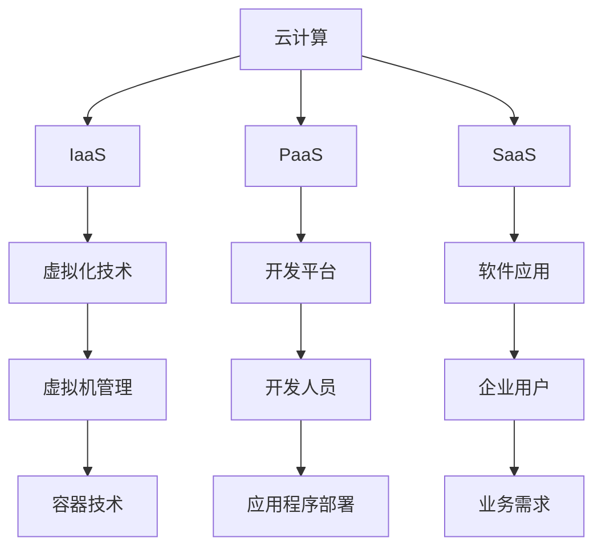

                 

### 背景介绍

在当今信息化时代，云计算和大数据处理已经成为各行各业不可或缺的技术手段。云计算通过提供灵活、可扩展的计算资源，为企业降低了IT成本，提升了效率；而大数据处理技术则帮助企业和机构从海量数据中挖掘出有价值的信息，实现了数据驱动的决策和优化。Python作为一门简洁、高效、功能强大的编程语言，在云计算和大数据处理领域展现出了强大的优势和广泛的应用前景。

Python云计算与大数据处理结合，不仅提高了数据处理效率，还增强了系统的可扩展性和灵活性。通过Python，开发者可以轻松地利用云计算平台提供的强大计算能力和海量存储资源，对大规模数据进行高效处理和分析。此外，Python的丰富库和框架，如Pandas、NumPy、Matplotlib等，为数据处理提供了便捷的工具和接口，使得复杂的计算和分析变得简单易懂。

本文旨在为初学者提供一份系统、全面的Python云计算与大数据处理入门指南。我们将从基础知识入手，逐步深入到实际应用，旨在帮助读者理解云计算与大数据处理的核心概念、原理和应用，掌握相关工具和技术的使用方法。文章结构如下：

1. **云计算基础**：介绍云计算的基本概念、服务模型和部署模型。
2. **Python云计算环境搭建**：介绍Python及其云计算环境的搭建过程。
3. **Python云计算核心组件**：探讨虚拟化技术、虚拟机管理和容器技术。
4. **大数据处理基础**：介绍大数据处理的基本原理和框架。
5. **Python大数据处理工具**：讲解Pandas、NumPy、Matplotlib等工具的使用。
6. **Python云计算与大数据处理实战**：通过实际案例展示云计算与大数据处理的综合应用。
7. **Python云计算与大数据处理发展趋势**：探讨未来的发展趋势和应用前景。

通过本文的逐步引导，读者将能够建立起对Python云计算与大数据处理的整体认识，掌握基本知识和实用技能，为未来的学习和实践打下坚实基础。让我们一起开启这段探索之旅吧！

### 核心概念与联系

为了更好地理解云计算，我们首先需要了解一些核心概念，并探讨它们之间的关系。以下是云计算中几个关键概念的简要介绍及其相互联系。

**云计算概念**：

- **云计算**：云计算是一种通过互联网以按需、便捷的方式提供计算资源（如服务器、存储、网络等）的服务模式。它包括三种服务模型：IaaS（基础设施即服务）、PaaS（平台即服务）和SaaS（软件即服务）。

  

- **IaaS**：基础设施即服务，用户可以通过互联网获取虚拟化的计算资源，如虚拟机、存储和网络等，并按实际使用量付费。

- **PaaS**：平台即服务，用户可以在云平台上开发、运行和管理应用程序，无需关注底层基础设施的维护。

- **SaaS**：软件即服务，用户可以通过互联网访问云服务提供商提供的软件，按需付费，无需安装和维护。

**云计算服务模型**：

云计算的服务模型决定了用户如何获取和使用云资源。IaaS、PaaS和SaaS分别对应着不同的用户需求和场景。

- **IaaS**：适用于需要高度灵活性和自主控制的企业，如科研机构、数据中心等。用户可以自定义操作系统、配置服务器和网络等。

- **PaaS**：适用于开发人员和企业，提供开发平台和工具，便于快速开发和部署应用程序。常见的PaaS平台有Google App Engine、Heroku等。

- **SaaS**：适用于各种规模的企业和个人用户，提供现成的软件应用服务，如CRM系统、在线办公软件等。用户只需通过浏览器即可访问和使用。

**云计算部署模型**：

云计算的部署模型根据云资源的归属和管理模式可以分为公有云、私有云和混合云。

- **公有云**：由云服务提供商管理和运营，多个租户共享资源，如Amazon Web Services (AWS)、Microsoft Azure、Google Cloud等。

- **私有云**：为单一组织或企业独立搭建的云环境，资源仅为本组织内部使用。私有云具有较高的安全性和控制性，适用于对数据安全要求较高的企业。

- **混合云**：结合公有云和私有云的优势，根据不同业务需求和资源需求，灵活地在两者之间分配和调度资源。

**关系架构**：

通过Mermaid流程图，我们可以清晰地看到云计算中各个概念之间的联系。



通过上述核心概念和联系的介绍，我们可以更好地理解云计算的基本原理和应用。接下来，我们将进一步探讨Python云计算环境的搭建，帮助读者逐步进入云计算的世界。

### 云计算服务模型

在深入探讨云计算之前，我们需要详细理解云计算的三种服务模型：IaaS、PaaS和SaaS。这些模型各有特点和适用场景，对用户的需求和操作方式也有着不同的影响。

**IaaS（基础设施即服务）**

IaaS是最基础的一种服务模型，它允许用户通过网络访问和管理计算资源，如虚拟机、存储和网络等。用户可以根据自己的需求，灵活地配置和管理这些资源，无需购买和维护物理硬件。

- **特点**：
  - **高度灵活性**：用户可以根据需要自定义操作系统、软件配置和硬件规格。
  - **资源按需使用**：用户只需为实际使用的资源付费，无需长期投资。
  - **自主管理**：用户拥有对虚拟机的完全控制权，可以自定义和管理。

- **适用场景**：
  - **科研机构**：需要高度灵活的配置和强大的计算能力。
  - **数据中心**：用于大规模数据处理和存储。
  - **企业开发与测试**：快速搭建和拆除环境，用于开发和测试应用程序。

**PaaS（平台即服务）**

PaaS提供了一种开发平台，使开发人员可以专注于应用程序的构建和部署，而不必关心底层基础设施的管理。PaaS通常包含开发工具、数据库和Web服务器等，提供一站式服务。

- **特点**：
  - **开发便捷**：简化了开发流程，提供完整的开发和部署环境。
  - **高可用性**：平台通常提供自动备份、负载均衡和故障转移等功能。
  - **快速部署**：应用程序可以快速上线，缩短开发周期。

- **适用场景**：
  - **软件开发公司**：快速开发和部署应用程序。
  - **初创企业**：无需大规模基础设施投资，快速进入市场。
  - **云应用开发者**：专注于应用开发，无需关注底层资源管理。

**SaaS（软件即服务）**

SaaS是一种通过互联网提供软件应用的服务模式，用户可以通过浏览器访问软件，按需使用。SaaS应用通常具有广泛的用户界面和功能，用户只需订阅即可使用。

- **特点**：
  - **方便访问**：无需安装和维护，通过浏览器即可访问。
  - **低使用门槛**：用户只需关注使用软件，无需关心技术细节。
  - **灵活定价**：根据使用量或订阅时间收费，灵活便捷。

- **适用场景**：
  - **中小企业**：无需大量投资，即可使用专业软件。
  - **个人用户**：如在线办公、文档编辑等。
  - **企业内部应用**：如客户关系管理（CRM）、人力资源管理（HRM）等。

通过以上对IaaS、PaaS和SaaS的详细描述，我们可以看到它们各自的特点和适用场景。这些服务模型共同构建了云计算的生态系统，满足不同用户的需求。

接下来，我们将进一步探讨云计算的部署模型，了解公有云、私有云和混合云的区别和适用场景。

### 云计算部署模型

云计算的部署模型根据云资源的归属和管理模式，可以分为公有云、私有云和混合云。这些部署模型各有特点和适用场景，用户可以根据具体需求选择最合适的一种。

**公有云**

公有云是由云服务提供商运营和管理的大型云计算基础设施，多个租户共享资源。用户可以通过互联网访问这些资源，按需付费。

- **特点**：
  - **资源丰富**：公有云通常拥有庞大的计算和存储资源，能够满足大规模需求。
  - **成本效益**：用户无需购买和运营硬件，只需为使用的资源付费。
  - **灵活性**：提供多种服务模型（IaaS、PaaS、SaaS），用户可以根据需求灵活选择。

- **适用场景**：
  - **大规模数据处理**：适用于需要处理海量数据的场景，如数据分析和机器学习。
  - **企业应用**：适用于需要高性能计算和可靠性的企业。
  - **研发与测试**：适用于快速搭建和拆除环境，进行应用程序开发和测试。

**私有云**

私有云是专门为单一组织或企业搭建的云环境，资源仅为本组织内部使用。私有云具有较高的安全性和控制性，适用于对数据安全要求较高的企业。

- **特点**：
  - **安全性**：资源仅为本组织内部使用，数据安全性更高。
  - **灵活性**：可以根据组织需求灵活调整资源和配置。
  - **自主管理**：企业可以自主管理和维护云环境。

- **适用场景**：
  - **金融行业**：对数据安全和合规性要求较高。
  - **政府机构**：涉及国家安全和敏感数据。
  - **企业内部应用**：如企业资源规划（ERP）、客户关系管理（CRM）等。

**混合云**

混合云是结合公有云和私有云的优势，根据不同业务需求和资源需求，灵活地在两者之间分配和调度资源。用户可以在私有云上处理敏感数据，同时在公有云上进行大规模数据处理和计算。

- **特点**：
  - **灵活性**：可以根据需求灵活切换和分配资源。
  - **扩展性**：在需要时可以快速扩展公有云资源。
  - **高可用性**：通过混合部署，实现资源冗余和故障转移。

- **适用场景**：
  - **跨区域业务**：适用于跨区域运营的企业，可以优化资源分配。
  - **研发与生产**：研发团队使用公有云，生产环境使用私有云，实现灵活部署。
  - **大数据处理**：结合公有云的强大计算能力和私有云的数据安全性，适用于大规模数据处理。

通过以上对公有云、私有云和混合云的介绍，我们可以看到它们各自的优缺点和适用场景。用户可以根据自身需求，选择最合适的云计算部署模型，以实现最佳的业务效果。

接下来，我们将开始介绍Python云计算环境搭建的过程，帮助读者逐步构建起自己的云计算基础。

### Python简介

Python作为一种高级编程语言，以其简洁易懂的语法和强大的功能，在云计算和大数据处理领域得到了广泛的应用。Python的发展历史可以追溯到1989年，由Guido van Rossum创造，最初的设计目标是提供一种易于学习和使用的编程语言。经过多年的发展，Python已经成为了全球最流行的编程语言之一。

**Python发展历史**

1. **诞生**（1989年）：Guido van Rossum开始设计Python，并发布了第一个版本Python 0.9.0。Python最初的目的是为了替代C语言的复杂性，使编程变得更加容易。

2. **Python 1.0**（1994年）：引入了列表（list）、字典（dictionary）等基本数据结构，以及函数（function）的概念，使得Python的编程能力得到了显著提升。

3. **Python 2.x**（1997年 - 2011年）：这个系列版本在Python的发展历程中占据了重要地位。从Python 2.0开始，Python引入了异常处理（exception handling）、迭代器（iterator）和生成器（generator）等特性。Python 2.7是最后一个Python 2.x的版本，它包含了大量的改进和优化。

4. **Python 3.x**（2008年至今）：Python 3.0于2008年发布，旨在解决Python 2.x版本中的各种问题，如编码问题、性能瓶颈等。Python 3.x的兼容性较差，但其在性能和功能上都得到了显著提升。

**Python应用领域**

Python的应用领域非常广泛，涵盖了多个领域：

1. **Web开发**：Python在Web开发领域有着丰富的库和框架，如Django、Flask、Pyramid等，这些框架使得Python在快速开发Web应用程序方面具有显著优势。

2. **数据科学**：Python在数据科学领域具有强大的功能，其库如NumPy、Pandas、SciPy、Scikit-learn等，为数据处理、分析和机器学习提供了强大的支持。

3. **人工智能**：Python是人工智能领域的重要编程语言之一，其库如TensorFlow、PyTorch等，使得开发者可以轻松实现复杂的深度学习算法。

4. **自动化脚本**：Python的语法简洁，易于编写和维护，非常适合编写自动化脚本和工具。

5. **云计算**：Python在云计算领域也有着广泛的应用，其库如Boto3、Tornado等，使得开发者可以轻松地与云计算平台（如AWS、Azure、Google Cloud）进行交互。

**Python语言特点**

Python之所以受到广泛欢迎，与其独特的语言特点密切相关：

1. **简洁易学**：Python的语法设计简单易懂，适合初学者快速入门。

2. **高级数据结构**：Python提供了丰富的内置数据结构，如列表（list）、字典（dictionary）、集合（set）等，使得数据处理变得高效便捷。

3. **动态类型**：Python是动态类型的语言，无需显式声明变量类型，提高了编程效率。

4. **丰富的库和框架**：Python拥有丰富的标准库和第三方库，涵盖了各种应用场景，如网络编程、数据科学、人工智能等。

5. **跨平台兼容性**：Python可以在多种操作系统上运行，具有良好的跨平台兼容性。

通过上述对Python的介绍，我们可以看到Python在云计算和大数据处理领域的强大优势和广泛的应用前景。接下来，我们将详细探讨如何搭建Python云计算环境，帮助读者更好地利用Python进行云计算开发。

### Python云计算环境搭建

搭建Python云计算环境是开始Python云计算开发的第一步。在这个环节中，我们需要选择合适的Python版本和云计算平台，并设置相应的环境变量，以便后续开发和使用。以下步骤将详细介绍这一过程。

#### 1. 选择Python版本

首先，我们需要选择一个适合的Python版本。目前，Python 3.x 版本已经得到了广泛的应用，其性能和功能相比 Python 2.x 版本有显著提升。因此，推荐使用 Python 3.x。

在 Windows 操作系统上，可以选择从 Python 官网下载安装程序（[https://www.python.org/downloads/](https://www.python.org/downloads/)），根据提示进行安装。安装过程中，确保勾选“Add Python to PATH”选项，这样可以让系统自动识别 Python 的路径。

在 Linux 或 macOS 上，可以通过包管理器来安装 Python。例如，在 Ubuntu 系统中，可以使用以下命令：

```bash
sudo apt update
sudo apt install python3
```

#### 2. 选择云计算平台

云计算平台的选择取决于项目需求和预算。目前，市面上主要的云计算平台包括 AWS、Azure、Google Cloud 等。以下分别介绍如何在这些平台上搭建 Python 云计算环境。

**AWS（Amazon Web Services）**

AWS 是全球最大的云计算服务提供商之一，提供了丰富的云计算服务和工具。以下是在 AWS 上搭建 Python 云计算环境的步骤：

1. **注册 AWS 账号**：如果没有 AWS 账号，需要先注册一个。
2. **创建 IAM 用户**：在 AWS 管理控制台中，创建一个 IAM 用户，并为其分配适当的权限。
3. **安装 AWS CLI**：下载并安装 AWS CLI（命令行接口），可以使用以下命令：

   ```bash
   pip install awscli
   ```

4. **配置 AWS CLI**：使用以下命令配置 AWS CLI：

   ```bash
   aws configure
   ```

   按照提示输入 Access Key、Secret Access Key、默认区域和默认输出格式。

**Azure**

Azure 是 Microsoft 的云计算平台，提供了广泛的云计算服务。以下是在 Azure 上搭建 Python 云计算环境的步骤：

1. **注册 Azure 账号**：如果没有 Azure 账号，需要先注册一个。
2. **安装 Azure CLI**：下载并安装 Azure CLI：

   ```bash
   sudo apt install azure-cli
   ```

3. **配置 Azure CLI**：使用以下命令配置 Azure CLI：

   ```bash
   az login
   ```

   按照提示进行登录。

**Google Cloud**

Google Cloud 是 Google 提供的云计算平台，提供了多种云计算服务和工具。以下是在 Google Cloud 上搭建 Python 云计算环境的步骤：

1. **注册 Google Cloud 账号**：如果没有 Google Cloud 账号，需要先注册一个。
2. **安装 Google Cloud SDK**：下载并安装 Google Cloud SDK：

   ```bash
   curl https://dl.google.com/dl/cloudsdk/release/install.sh | bash
   ```

3. **配置 Google Cloud SDK**：使用以下命令配置：

   ```bash
   gcloud auth login
   ```

   按照提示进行登录。

#### 3. 设置环境变量

为了方便后续使用，我们需要将 Python 和相关命令行工具的路径添加到环境变量中。

在 Windows 上，可以通过“系统属性”中的“高级”选项卡，点击“环境变量”来添加环境变量。

在 Linux 或 macOS 上，可以使用以下命令添加环境变量：

```bash
export PATH=$PATH:/usr/local/bin
```

例如，如果 Python 安装在 `/usr/local/bin` 目录下，可以将此路径添加到 PATH 环境变量中。

#### 4. 测试环境搭建

完成上述步骤后，我们可以通过以下命令来测试 Python 和云计算平台的连接是否成功：

- **AWS**：

  ```bash
  aws ec2 describe-instances
  ```

- **Azure**：

  ```bash
  az group list
  ```

- **Google Cloud**：

  ```bash
  gcloud compute instances list
  ```

如果上述命令能够正常输出结果，说明 Python 云计算环境已经搭建成功。

通过以上步骤，我们成功搭建了 Python 云计算环境，为后续的云计算开发奠定了基础。接下来，我们将介绍 Python 云计算常用库，帮助读者更好地利用 Python 进行云计算开发。

### Python云计算常用库介绍

在Python云计算开发中，有一些库和框架成为了开发者不可或缺的工具。以下将详细介绍几个常用的Python云计算库：Boto3、Tornado和Django。

#### Boto3

Boto3是AWS官方提供的Python库，用于与AWS云服务进行交互。Boto3提供了对AWS多个服务（如EC2、S3、RDS等）的API接口，使得开发者可以方便地操作和管理AWS资源。

**安装与配置**

要安装Boto3，可以使用pip：

```bash
pip install boto3
```

在配置Boto3时，需要设置AWS凭证。可以通过以下命令配置：

```bash
aws configure
```

按照提示输入Access Key、Secret Access Key、默认区域和默认输出格式。

**基本使用**

以下是一个简单的Boto3示例，用于创建AWS EC2实例：

```python
import boto3

# 创建EC2客户端
ec2 = boto3.client('ec2')

# 创建实例
response = ec2.run_instances(
    ImageId='ami-0abcdef1234567890',  # Amazon Linux 2 AMI
    MinCount=1,
    MaxCount=1,
    InstanceType='t2.micro'
)

instance_id = response['Instances'][0]['InstanceId']
print(f"Created instance with ID: {instance_id}")
```

#### Tornado

Tornado是一个Python Web框架和异步网络库，主要用于构建高性能、可扩展的网络应用程序。Tornado特别适用于处理高并发请求，是许多云计算应用的理想选择。

**安装与配置**

要安装Tornado，可以使用pip：

```bash
pip install tornado
```

**基本使用**

以下是一个简单的Tornado Web服务器示例：

```python
from tornado import web, ioloop

class MainHandler(web.RequestHandler):
    def get(self):
        self.write("Hello, world!")

def make_app():
    return web.Application([
        (r"/", MainHandler),
    ])

if __name__ == "__main__":
    app = make_app()
    app.listen(8888)
    ioloop.IOLoop.current().start()
```

#### Django

Django是一个高级Python Web框架，以其“不重复自己”（Don't Repeat Yourself，DRY）的原则和“默认正确”（The "Default" Is "Right"）的设计哲学著称。Django广泛应用于企业级Web开发，也可以集成到云计算应用中。

**安装与配置**

要安装Django，可以使用pip：

```bash
pip install django
```

配置Django项目通常包括以下步骤：

1. 创建一个Django项目：

   ```bash
   django-admin startproject myproject
   ```

2. 进入项目目录并创建一个应用：

   ```bash
   cd myproject
   python manage.py startapp myapp
   ```

3. 在`settings.py`中配置数据库和其他设置。

**基本使用**

以下是一个简单的Django视图函数示例：

```python
from django.http import HttpResponse

def hello_world(request):
    return HttpResponse("Hello, world!")
```

在`urls.py`中，你需要将视图函数与URL路径关联：

```python
from django.urls import path
from . import views

urlpatterns = [
    path('hello/', views.hello_world),
]
```

通过上述对Boto3、Tornado和Django的介绍，我们可以看到它们各自的特点和用途。Boto3主要用于与AWS云服务的交互；Tornado适用于构建高性能的异步网络应用程序；Django则是一个功能丰富的Web框架，适用于企业级Web开发。开发者可以根据具体需求选择合适的库进行云计算开发。

### 虚拟化技术

虚拟化技术是云计算的核心组件之一，它通过将物理资源抽象成逻辑资源，提供灵活的资源管理和高效资源利用。虚拟化技术不仅为云计算提供了基础，还在虚拟机管理、分布式系统和其他领域有着广泛的应用。

**虚拟化概念**

虚拟化（Virtualization）是一种将物理资源（如计算资源、存储资源、网络资源）抽象成逻辑资源的技术。通过虚拟化，用户可以在同一物理硬件上同时运行多个独立的虚拟机（Virtual Machine，VM），每个虚拟机拥有自己的操作系统、应用程序和资源。

**虚拟化类型**

虚拟化技术可以分为以下几种类型：

1. **全虚拟化**（Full Virtualization）
   - 全虚拟化通过完全模拟硬件来运行虚拟机。虚拟机操作系统无法感知到虚拟化的存在，因为它认为自己在运行在物理硬件上。
   - **优点**：隔离性好，安全性高。
   - **缺点**：性能开销较大，虚拟机之间的资源共享不直接。

2. **硬件虚拟化**（Hardware Virtualization）
   - 硬件虚拟化利用专门的硬件支持（如Intel VT、AMD-V）来实现虚拟化。这种虚拟化技术允许虚拟机直接访问物理硬件资源，从而减少性能开销。
   - **优点**：性能接近物理硬件，资源利用效率高。
   - **缺点**：需要特殊的硬件支持。

3. **操作系统虚拟化**（Operating System-Level Virtualization）
   - 操作系统虚拟化利用宿主操作系统内核来创建多个虚拟机。每个虚拟机运行在宿主操作系统的用户空间中，但共享宿主操作系统的内核。
   - **优点**：性能高，资源利用效率高。
   - **缺点**：隔离性较低，安全性相对较弱。

**虚拟化技术优势**

虚拟化技术具有以下优势：

1. **资源隔离**：通过虚拟化，多个虚拟机可以独立运行，互不干扰。每个虚拟机拥有独立的操作系统和资源，提高了系统的稳定性和安全性。

2. **资源灵活分配**：虚拟化允许管理员根据需求动态调整虚拟机的资源分配，如CPU、内存和存储。这种灵活性有助于优化资源利用，提高系统效率。

3. **快速部署和扩展**：虚拟化使得虚拟机可以快速创建和部署，无需物理硬件的采购和配置。通过虚拟化，管理员可以轻松扩展系统资源，满足不断增长的需求。

4. **高可用性**：虚拟化技术提供了故障转移和冗余机制，如虚拟机镜像备份、虚拟机迁移等。这些机制提高了系统的可用性和可靠性。

通过上述介绍，我们可以看到虚拟化技术是云计算不可或缺的一部分。它通过提供灵活的资源管理和高效的资源利用，为云计算提供了坚实的基础。接下来，我们将进一步探讨虚拟机管理，了解如何在虚拟化环境中有效管理和维护虚拟机。

### 虚拟机管理

虚拟机管理是云计算平台中至关重要的一环，它涉及到虚拟机的创建、配置、监控和维护等环节。有效的虚拟机管理不仅能够提高系统的性能和可靠性，还能确保资源的合理利用。

**虚拟机创建**

虚拟机的创建是虚拟机管理的基础。在云计算平台上，虚拟机的创建可以通过多种方式实现：

1. **手动创建**：用户可以通过云平台的控制台界面手动创建虚拟机。在创建过程中，用户需要选择虚拟机的配置（如操作系统、CPU、内存、存储等）。

2. **自动化脚本**：通过API接口，用户可以编写自动化脚本来自动创建虚拟机。常见的API接口包括AWS EC2 API、Azure VM API和Google Compute Engine API。

   以下是一个使用AWS Boto3库创建虚拟机的示例代码：

   ```python
   import boto3

   # 创建EC2客户端
   ec2 = boto3.client('ec2')

   # 创建实例
   response = ec2.run_instances(
       ImageId='ami-0abcdef1234567890',  # Amazon Linux 2 AMI
       MinCount=1,
       MaxCount=1,
       InstanceType='t2.micro',
       KeyPairName='my-key-pair'
   )

   instance_id = response['Instances'][0]['InstanceId']
   print(f"Created instance with ID: {instance_id}")
   ```

**虚拟机配置**

虚拟机的配置是指为虚拟机设置操作系统、网络、存储等参数。虚拟机配置通常在虚拟机创建过程中完成，但也可以在虚拟机运行后进行修改。

1. **操作系统**：用户可以选择预配置的操作系统映像，或自定义操作系统安装。

2. **网络配置**：用户可以为虚拟机配置公网IP、私网IP、子网和路由器等。

3. **存储配置**：用户可以为虚拟机分配EBS（Elastic Block Store）卷或EFS（Elastic File System）存储。

   以下是一个使用AWS Boto3库配置虚拟机公网IP的示例代码：

   ```python
   import boto3

   # 创建EC2客户端
   ec2 = boto3.client('ec2')

   # 配置虚拟机公网IP
   response = ec2.allocate_address(Domain='vpc')
   public_ip = response['PublicIp']

   # 将公网IP分配给虚拟机
   instance_id = 'i-0abcdef1234567890'  # 已创建的虚拟机ID
   allocation_id = response['AllocationId']

   ec2.associate_address(InstanceId=instance_id, AllocationId=allocation_id)
   print(f"Associated public IP {public_ip} with instance {instance_id}")
   ```

**虚拟机监控与维护**

虚拟机监控与维护是保障虚拟机正常运行的重要环节。以下是一些常用的虚拟机监控与维护方法：

1. **性能监控**：通过云平台提供的监控工具，如AWS CloudWatch、Azure Monitor和Google Stackdriver，用户可以实时监控虚拟机的CPU使用率、内存使用率、网络流量等指标。

2. **日志管理**：通过收集和存储虚拟机的日志文件，用户可以诊断和解决虚拟机运行中出现的问题。常见的日志管理工具包括AWS CloudWatch Logs、Azure Log Analytics和Google Cloud Logging。

3. **故障转移与冗余**：为了提高系统的可靠性，虚拟机可以配置为故障转移和冗余模式。当某个虚拟机发生故障时，系统会自动将虚拟机迁移到其他虚拟机上，确保业务连续性。

4. **维护与升级**：定期对虚拟机进行操作系统和应用软件的维护和升级，可以确保系统的稳定性和安全性。

   以下是一个使用AWS Boto3库重启虚拟机的示例代码：

   ```python
   import boto3

   # 创建EC2客户端
   ec2 = boto3.client('ec2')

   # 重启虚拟机
   instance_id = 'i-0abcdef1234567890'  # 已创建的虚拟机ID
   response = ec2.stop_instances(InstanceIds=[instance_id])
   print(f"Stopped instance with ID: {instance_id}")

   # 等待虚拟机停止
   time.sleep(60)

   response = ec2.start_instances(InstanceIds=[instance_id])
   print(f"Started instance with ID: {instance_id}")
   ```

通过上述步骤，我们可以实现对虚拟机的有效管理。虚拟机管理不仅包括虚拟机的创建和配置，还包括监控和维护，以确保虚拟机的稳定运行和高效利用。接下来，我们将介绍容器技术，探讨容器与虚拟机的关系及其应用场景。

### 容器技术

容器技术是近年来云计算领域的重要创新，它通过轻量级、可移植的容器，实现了应用程序与运行环境的一致性。容器技术的兴起，使得应用程序的开发、部署和运维变得更加灵活和高效。

**容器概念**

容器（Container）是一种轻量级的运行时环境，它通过将应用程序及其依赖打包成一个独立的单位，实现应用程序的隔离和部署。容器与虚拟机（VM）不同，它不依赖于操作系统，而是依赖于宿主机的内核，从而大大提高了资源利用效率和部署速度。

**容器与虚拟机比较**

容器与虚拟机在架构和性能上存在显著差异：

1. **架构**：
   - **容器**：基于宿主机的操作系统内核，不运行完整的操作系统。容器通过命名空间（Namespace）和隔离机制（Cgroups）实现资源隔离。
   - **虚拟机**：通过虚拟化技术运行完整的操作系统实例，每个虚拟机拥有独立的操作系统和资源。

2. **性能**：
   - **容器**：由于省去了操作系统层的开销，容器具有更高的性能和更快的启动速度。容器可以在毫秒级启动，而虚拟机通常需要数分钟。
   - **虚拟机**：虚拟机提供了更高的隔离性和安全性，但性能开销较大，启动时间较长。

**容器与虚拟机的关系**

容器和虚拟机并不是互斥的，它们可以共存并互相补充：

1. **容器作为虚拟机的轻量级替代**：在需要高效资源利用和快速部署的场景中，容器可以作为虚拟机的替代方案，用于开发和测试环境。
2. **虚拟机作为容器的安全隔离**：在需要高度隔离和安全性的场景中，虚拟机可以提供额外的安全保障，特别是在处理敏感数据和重要业务时。

**Docker的使用**

Docker是最流行的容器平台之一，它提供了丰富的工具和API，用于容器创建、管理和部署。

**安装与配置**

要在Linux系统上安装Docker，可以使用以下命令：

```bash
# 更新系统软件包
sudo apt update

# 安装Docker
sudo apt install docker.io

# 启动Docker服务
sudo systemctl start docker

# 启动Docker并使其随系统启动
sudo systemctl enable docker
```

**基本使用**

以下是一个简单的Docker示例，用于创建和运行容器：

1. **创建容器**：

   ```bash
   # 查找可用的镜像
   docker search ubuntu

   # 创建并启动容器
   docker run -it ubuntu
   ```

   这个命令将在新的终端窗口中启动一个Ubuntu容器。

2. **管理容器**：

   - **启动容器**：

     ```bash
     docker start container_id
     ```

   - **停止容器**：

     ```bash
     docker stop container_id
     ```

   - **删除容器**：

     ```bash
     docker rm container_id
     ```

   - **查看容器**：

     ```bash
     docker ps
     ```

通过以上对容器技术的介绍，我们可以看到容器在云计算中的应用优势和实际使用方法。容器技术不仅提高了应用程序的部署效率和资源利用率，还为云计算带来了更多的灵活性和可扩展性。

### 大数据处理概述

大数据处理是指从海量数据中提取有价值信息的过程，涉及到数据的采集、存储、处理和分析等多个环节。随着数据量的爆炸性增长，传统的数据处理方法已无法满足需求，大数据处理技术应运而生。

**大数据定义**

大数据（Big Data）通常指的是无法使用常规数据库管理和处理工具在合理时间内捕捉、管理和处理的大量数据。大数据具有四个主要特征，即4V：

1. **Volume（数据量）**：大数据涉及的数据量非常庞大，可能是PB级甚至EB级。
2. **Velocity（速度）**：数据产生和消费的速度极快，需要实时或近实时的处理能力。
3. **Variety（多样性）**：数据来源多样，包括结构化数据、半结构化数据和非结构化数据。
4. **Veracity（真实性）**：数据质量参差不齐，需要处理噪声和错误数据。

**大数据特点**

大数据处理面临的挑战包括：

1. **数据量巨大**：如何高效存储和检索海量数据，是大数据处理的首要问题。
2. **数据类型多样**：处理结构化、半结构化和非结构化数据，需要灵活的数据处理方法。
3. **实时性要求高**：许多应用场景需要实时处理数据，如金融交易、社交媒体分析等。
4. **数据质量参差**：数据源多样，数据质量难以保证，需要有效的数据清洗和预处理方法。

**大数据处理流程**

大数据处理通常包括以下步骤：

1. **数据采集**：从各种数据源（如数据库、文件、传感器、Web等）采集数据。
2. **数据存储**：将采集到的数据存储在分布式存储系统（如Hadoop HDFS、Spark Storage等）中。
3. **数据预处理**：对原始数据进行清洗、转换和整合，为后续分析做准备。
4. **数据处理**：使用分布式计算框架（如Hadoop、Spark等）对数据进行处理，包括计算、转换和分析等操作。
5. **数据可视化**：将处理结果可视化，帮助用户理解和分析数据。

**数据处理框架**

大数据处理框架是用于高效处理和分析大规模数据的软件架构。以下是目前常用的几种数据处理框架：

1. **Hadoop**：Hadoop是一个开源的分布式计算框架，适用于离线批量数据处理。它包括HDFS（分布式文件系统）和MapReduce（数据处理模型）两个核心组件。
2. **Spark**：Spark是一个高速的分布式计算引擎，适用于实时数据处理和批处理。它提供了丰富的API，如DataFrame、RDD等，支持多种数据处理操作。
3. **Flink**：Flink是一个流处理框架，适用于实时数据处理。它提供了灵活的数据流处理API，并支持多种数据源和操作。

**分布式系统原理**

分布式系统是指由多个节点组成的计算机系统，节点之间通过网络进行通信和协作。分布式系统具有以下特点：

1. **节点自治**：每个节点独立运行，有自己的处理器、内存和网络接口。
2. **协同工作**：节点之间通过网络通信，协同完成共同的任务。
3. **容错性**：分布式系统能够容忍部分节点的故障，确保系统的持续运行。

**分布式一致性**

分布式一致性是指分布式系统中各个节点对数据的共识和一致性。分布式一致性分为以下几种类型：

1. **强一致性**：所有节点在任何时候都能访问到最新数据。
2. **最终一致性**：虽然最初可能存在不一致，但最终所有节点会达到一致状态。
3. **分区一致性**：在数据分区内保持一致性，不同分区之间可以独立处理。

通过上述对大数据处理概述的介绍，我们可以看到大数据处理的复杂性和挑战。随着数据量的不断增长和数据类型的多样化，大数据处理技术将继续发展和创新，为各行各业提供强大的数据处理能力。

### 大数据处理框架

大数据处理框架是用于高效处理和分析大规模数据的软件架构，它提供了分布式计算的能力，使得数据处理变得更加高效和灵活。目前，有几个主流的大数据处理框架，包括Hadoop、Spark和Flink，各具特色，适用于不同的应用场景。

**Hadoop**

Hadoop是Apache软件基金会的一个开源项目，它是一个分布式系统基础架构，用于处理大规模数据集。Hadoop的核心组件包括HDFS（Hadoop Distributed File System，分布式文件系统）和MapReduce（数据处理模型）。

1. **HDFS**：HDFS是一个高吞吐量的分布式文件存储系统，能够存储大量数据。它将大文件分割成小块，分布在集群中的不同节点上，提供了高可靠性和高扩展性。
2. **MapReduce**：MapReduce是一种编程模型，用于处理大规模数据集。它将数据处理任务分解为“Map”和“Reduce”两个阶段，Map阶段将数据映射到各个节点进行局部处理，Reduce阶段对Map阶段的结果进行汇总和整理。

**Spark**

Spark是另一个广泛使用的大数据处理框架，由Apache软件基金会维护。Spark的设计目标是提供更快的计算速度和更灵活的数据处理能力。

1. **Spark Core**：Spark Core提供了基本的分布式计算功能，包括内存管理、任务调度和容错机制。
2. **Spark SQL**：Spark SQL提供了用于结构化数据查询的API，支持SQL和DataFrame操作。
3. **Spark Streaming**：Spark Streaming提供了实时数据流处理功能，支持实时数据流的批处理和分析。
4. **MLlib**：MLlib是Spark的机器学习库，提供了多种机器学习算法和工具。
5. **GraphX**：GraphX是Spark的图处理框架，用于处理大规模图数据。

**Flink**

Flink是Apache的一个开源流处理框架，适用于实时数据处理和批处理任务。

1. **流处理**：Flink提供了强大的流处理能力，能够实时处理数据流，支持事件驱动和数据驱动的应用。
2. **批处理**：Flink也支持批处理，通过将流处理扩展到批处理，可以无缝地将实时数据处理与批处理任务整合。
3. **状态管理和容错**：Flink提供了强大的状态管理机制，能够持久化状态数据，并提供高容错性。
4. **连接器和API**：Flink支持多种数据源和存储系统，提供了丰富的API，如DataStream API和Table API，用于数据处理和分析。

**比较**

Hadoop、Spark和Flink各有其特点，适用于不同的应用场景：

- **Hadoop**：适用于离线批量数据处理，具有高可靠性和高扩展性，适合处理大规模数据集。
- **Spark**：适用于实时数据处理和批处理，具有更高的计算速度和灵活性，适合需要快速响应的应用。
- **Flink**：适用于实时数据处理，提供了强大的流处理能力和批处理支持，适合需要实时分析和处理的应用。

通过以上对Hadoop、Spark和Flink的介绍，我们可以看到这些大数据处理框架在架构、功能和应用场景上的差异。根据具体需求，选择合适的大数据处理框架，可以显著提升数据处理效率和效果。

### 分布式系统原理

分布式系统是云计算和大数据处理的基础，它通过多个节点的协作，提供了高可用性、高可靠性和高性能的计算能力。分布式系统涉及多个关键概念和原理，包括节点自治、协同工作和容错性。

**节点自治**

分布式系统中的每个节点（Node）都是独立的计算实体，具有自己的处理器、内存和网络接口。节点自治意味着每个节点可以独立运行，不受其他节点的影响。

- **优点**：节点自治提高了系统的灵活性，节点可以根据自身资源和需求进行自主管理和调度。
- **应用场景**：适用于需要高度灵活性和独立运行的应用，如Web服务、数据处理和存储系统。

**协同工作**

分布式系统中的节点通过网络进行通信和协作，共同完成系统任务。协同工作确保了系统的高效运行和资源的最优利用。

- **通信机制**：节点之间的通信通常通过消息传递（Message Passing）实现。消息传递可以是同步的，也可以是异步的，取决于系统的需求。
- **应用场景**：适用于需要大规模分布式计算的应用，如大数据处理、搜索引擎和分布式数据库。

**容错性**

容错性是分布式系统的重要特性，它确保系统在节点故障时能够继续运行，不会因单个节点的故障而导致整个系统崩溃。

- **故障检测**：分布式系统通过心跳（Heartbeat）机制或其他方法检测节点的健康状态。
- **故障恢复**：当检测到节点故障时，系统会启动故障恢复机制，如节点切换（Node Switching）、任务重新调度（Task Rescheduling）等，确保系统持续运行。
- **应用场景**：适用于需要高可靠性和持久性的应用，如金融系统、云服务和关键基础设施。

**分布式一致性**

分布式一致性是指分布式系统中各个节点对数据的共识和一致性。一致性分为以下几种类型：

1. **强一致性**：所有节点在任何时候都能访问到最新数据。
2. **最终一致性**：虽然最初可能存在不一致，但最终所有节点会达到一致状态。
3. **分区一致性**：在数据分区内保持一致性，不同分区之间可以独立处理。

**一致性协议**

分布式一致性通过一致性协议实现，常见的一致性协议包括：

1. **Paxos协议**：Paxos协议是一种分布式一致性算法，用于在多个节点之间达成一致。
2. **Raft协议**：Raft协议是一种简化的分布式一致性算法，易于理解和实现。

通过以上对分布式系统原理的介绍，我们可以看到分布式系统在节点自治、协同工作和容错性等方面的关键概念和原理。分布式系统为云计算和大数据处理提供了可靠的基础，使得大规模数据处理和计算变得更加高效和可靠。

### Pandas库使用

Pandas是一个强大的Python库，专门用于数据分析和操作。它提供了丰富的数据结构和工具，使得处理和分析结构化数据变得简便高效。以下将详细介绍Pandas的基本数据结构、数据操作和数据清洗。

#### 数据结构

Pandas提供了两个核心的数据结构：Series和DataFrame。

1. **Series**：Series是Pandas中的基本序列对象，类似于NumPy中的ndarray。它是一个一维数组，可以包含任何数据类型。Series可以看作是具有索引的数组，提供了丰富的索引和操作功能。

2. **DataFrame**：DataFrame是Pandas中的二维表格数据结构，类似于SQL表格或Excel工作表。它由一个或多个Series组成，每个Series对应表格的一列。DataFrame提供了丰富的列索引和索引操作，使得数据操作和分析更加直观。

#### 数据操作

数据操作包括数据的读取、写入、处理和转换等。以下是一些常用的数据操作方法：

1. **数据读取**：Pandas支持从多种数据源读取数据，如CSV文件、Excel文件、数据库等。以下是一个示例：

   ```python
   import pandas as pd

   # 从CSV文件读取数据
   data = pd.read_csv('data.csv')
   ```

2. **数据写入**：Pandas也支持将数据写入到多种数据源，如CSV文件、Excel文件等。以下是一个示例：

   ```python
   # 将数据写入CSV文件
   data.to_csv('output.csv', index=False)
   ```

3. **数据处理**：Pandas提供了丰富的数据处理功能，如筛选、排序、聚合等。以下是一个示例：

   ```python
   # 筛选数据
   filtered_data = data[data['column_name'] > threshold]

   # 排序数据
   sorted_data = data.sort_values(by='column_name')

   # 聚合数据
   aggregated_data = data.groupby('group_column').sum()
   ```

4. **数据转换**：Pandas支持数据类型的转换，如将数据从字符串转换为数值、日期等。以下是一个示例：

   ```python
   # 将字符串转换为数值
   data['numeric_column'] = pd.to_numeric(data['string_column'])

   # 将字符串转换为日期
   data['date_column'] = pd.to_datetime(data['string_column'])
   ```

#### 数据清洗

数据清洗是数据处理的重要步骤，它涉及数据的缺失值处理、异常值处理和重复值处理等。

1. **缺失值处理**：Pandas提供了多种缺失值处理方法，如删除缺失值、填充缺失值等。以下是一个示例：

   ```python
   # 删除缺失值
   cleaned_data = data.dropna()

   # 填充缺失值
   cleaned_data = data.fillna(value=0)
   ```

2. **异常值处理**：异常值处理包括识别和去除异常值。以下是一个示例：

   ```python
   # 识别异常值
   outliers = data[(data > threshold) | (data < threshold)]

   # 去除异常值
   cleaned_data = data[~data.isin(outliers)]
   ```

3. **重复值处理**：Pandas支持去除重复值，以下是一个示例：

   ```python
   # 去除重复值
   cleaned_data = data.drop_duplicates()
   ```

通过以上对Pandas库的介绍，我们可以看到Pandas在数据处理和分析中的强大功能。它提供了丰富的数据结构和工具，使得处理和分析结构化数据变得更加高效和简便。接下来，我们将进一步介绍NumPy库的使用，探讨其在数据处理中的应用。

### NumPy库使用

NumPy（Numeric Python）是Python中用于科学计算的核心库之一，它提供了多维数组对象和一系列数学函数，用于高效地进行数据处理和数值计算。NumPy在Python的科学计算和数据科学领域中扮演着重要角色，是数据分析、机器学习、数据可视化等领域的基础。

#### 基础操作

NumPy的核心数据结构是数组（ndarray），它是一个多维数组对象，类似于C语言中的数组，但提供了丰富的功能。以下是一些基础操作：

1. **创建数组**：NumPy提供了多种方法来创建数组。

   ```python
   import numpy as np

   # 创建一个一维数组
   arr_1d = np.array([1, 2, 3, 4, 5])
   
   # 创建一个二维数组
   arr_2d = np.array([[1, 2, 3], [4, 5, 6]])
   
   # 创建一个多维数组
   arr_3d = np.array([[[1, 2], [3, 4]], [[5, 6], [7, 8]]])
   ```

2. **索引和切片**：NumPy数组支持类似Python列表的索引和切片操作。

   ```python
   # 索引操作
   element = arr_1d[0]  # 获取第一个元素
   
   # 切片操作
   sub_arr = arr_2d[:, 1:]  # 获取第二列及以后的子数组
   ```

3. **形状和尺寸**：NumPy数组提供了多种属性来获取数组的形状和尺寸。

   ```python
   # 获取数组的形状
   shape = arr_2d.shape
   
   # 获取数组的尺寸
   size = arr_2d.size
   ```

4. **基本运算**：NumPy数组支持各种基本数学运算，如加法、减法、乘法和除法。

   ```python
   # 矩阵加法
   result = arr_2d + arr_2d
   
   # 矩阵乘法
   result = arr_2d.dot(arr_2d)
   ```

#### 高级操作

NumPy除了提供基础操作外，还提供了许多高级功能，如随机数生成、线性代数运算和数组函数。

1. **随机数生成**：NumPy提供了生成随机数的函数，如`np.random`。

   ```python
   # 生成一个随机数
   random_num = np.random.rand()
   
   # 生成一个随机数组
   random_arr = np.random.randn(5)
   ```

2. **线性代数运算**：NumPy提供了多种线性代数运算，如矩阵求逆、矩阵特征值和特征向量计算。

   ```python
   # 求逆矩阵
   inv_matrix = np.linalg.inv(arr_2d)
   
   # 计算特征值和特征向量
   eigenvalues, eigenvectors = np.linalg.eig(arr_2d)
   ```

3. **数组函数**：NumPy提供了大量数组函数，如数学函数、三角函数和统计函数。

   ```python
   # 数学函数
   exp_arr = np.exp(arr_1d)
   
   # 统计函数
   mean = np.mean(arr_1d)
   std = np.std(arr_1d)
   ```

#### 实例分析

以下是一个NumPy的实例分析，展示了如何使用NumPy进行数据预处理和计算：

```python
import numpy as np

# 创建一个二维数组
data = np.array([[1, 2, 3], [4, 5, 6], [7, 8, 9]])

# 计算平均值
mean = np.mean(data)

# 计算标准差
std = np.std(data)

# 计算协方差矩阵
cov = np.cov(data)

# 计算相关系数矩阵
correlation = np.corrcoef(data[:, 0], data[:, 1])

print(f"平均值: {mean}")
print(f"标准差: {std}")
print(f"协方差矩阵:\n{cov}")
print(f"相关系数矩阵:\n{correlation}")
```

通过以上对NumPy库的介绍，我们可以看到NumPy在数据处理和数值计算中的强大功能和广泛应用。NumPy的灵活性和高效性，使得它在科学计算和数据科学领域中不可或缺。接下来，我们将介绍Matplotlib库的使用，探讨如何在Python中进行数据可视化。

### Matplotlib库使用

Matplotlib是一个强大的Python库，用于创建高质量的二维和三维图表。它提供了丰富的绘图功能，使得数据可视化变得更加简单和直观。以下将介绍Matplotlib的基本使用方法，包括常见图表的绘制和自定义。

#### 基本使用方法

要使用Matplotlib，首先需要安装库：

```bash
pip install matplotlib
```

以下是一个简单的示例，展示了如何使用Matplotlib绘制一个简单的折线图：

```python
import matplotlib.pyplot as plt

# 数据
x = [1, 2, 3, 4, 5]
y = [1, 4, 9, 16, 25]

# 绘制折线图
plt.plot(x, y)

# 设置标题和标签
plt.title('折线图示例')
plt.xlabel('X轴')
plt.ylabel('Y轴')

# 显示图表
plt.show()
```

#### 常见图表绘制

Matplotlib支持多种常见的图表类型，包括折线图、散点图、柱状图、饼图等。以下是一些常见图表的绘制方法：

1. **折线图**：

   ```python
   plt.plot(x, y)
   plt.title('折线图示例')
   plt.xlabel('X轴')
   plt.ylabel('Y轴')
   plt.show()
   ```

2. **散点图**：

   ```python
   plt.scatter(x, y)
   plt.title('散点图示例')
   plt.xlabel('X轴')
   plt.ylabel('Y轴')
   plt.show()
   ```

3. **柱状图**：

   ```python
   plt.bar(x, y)
   plt.title('柱状图示例')
   plt.xlabel('X轴')
   plt.ylabel('Y轴')
   plt.show()
   ```

4. **饼图**：

   ```python
   sizes = [15, 30, 45, 10]
   labels = ['A', 'B', 'C', 'D']
   plt.pie(sizes, labels=labels, autopct='%.1f%%')
   plt.title('饼图示例')
   plt.show()
   ```

#### 自定义

Matplotlib提供了丰富的自定义选项，使得用户可以根据需求调整图表的各种属性，如颜色、线型、字体、标题等。以下是一些自定义示例：

1. **更改颜色和线型**：

   ```python
   plt.plot(x, y, color='green', linestyle='--')
   plt.title('自定义颜色和线型')
   plt.xlabel('X轴')
   plt.ylabel('Y轴')
   plt.show()
   ```

2. **设置字体**：

   ```python
   plt.plot(x, y)
   plt.title('自定义字体', fontdict={'fontsize': 18})
   plt.xlabel('X轴', fontdict={'fontsize': 14})
   plt.ylabel('Y轴', fontdict={'fontsize': 14})
   plt.show()
   ```

3. **添加图例**：

   ```python
   plt.plot(x, y1, label='Line 1')
   plt.plot(x, y2, label='Line 2')
   plt.legend()
   plt.title('图例示例')
   plt.xlabel('X轴')
   plt.ylabel('Y轴')
   plt.show()
   ```

通过以上对Matplotlib库的介绍，我们可以看到它为数据可视化提供了强大的功能。Matplotlib不仅支持多种图表类型的绘制，还提供了丰富的自定义选项，使得用户可以根据需求灵活地创建高质量的图表。

### 数据预处理实战

数据预处理是大数据处理的重要环节，它对数据的清洗、转换和整合进行了一系列预处理操作，以确保数据的质量和一致性。在Python中，Pandas和NumPy等库为我们提供了丰富的工具和函数，使得数据预处理变得更加高效和简便。以下是一个数据预处理实战案例，展示如何使用这些库对数据进行清洗、转换和整合。

#### 实战案例

假设我们有一个包含用户购买行为的CSV文件`purchase_data.csv`，数据字段包括用户ID、购买时间、商品ID、商品类别和购买金额。我们的目标是清理数据，提取有用的信息，并创建新的特征。

##### 步骤1：数据读取与初步探索

首先，我们使用Pandas读取数据，并初步探索数据的基本信息。

```python
import pandas as pd

# 读取数据
data = pd.read_csv('purchase_data.csv')

# 查看数据基本信息
print(data.info())
print(data.head())
```

输出结果展示了数据的基本信息，包括各列的数据类型、非空值数量等。通过查看数据的前几行，我们可以初步了解数据的内容。

##### 步骤2：缺失值处理

缺失值是数据预处理中常见的问题，我们需要对缺失值进行适当的处理。

```python
# 检查缺失值
missing_values = data.isnull().sum()

# 处理缺失值
# 对于整列缺失值，可以选择删除或填充
data = data.dropna()  # 删除缺失值
# data.fillna(value=0)  # 填充为0

# 检查处理后的缺失值
missing_values_after = data.isnull().sum()
print(missing_values_after)
```

在实际应用中，根据数据的特性和业务需求，可以选择删除缺失值或使用统计方法（如平均值、中位数、最频繁值）进行填充。

##### 步骤3：数据转换

数据转换包括将数据类型转换为适合分析的形式，以及进行数值化和规范化。

```python
# 转换数据类型
data['purchase_time'] = pd.to_datetime(data['purchase_time'])
data['day_of_week'] = data['purchase_time'].dt.dayofweek

# 数值化分类数据
data['category'] = pd.factorize(data['category'])[0]

# 规范化数值数据
from sklearn.preprocessing import StandardScaler
scaler = StandardScaler()
data[['amount']] = scaler.fit_transform(data[['amount']])
```

通过这些操作，我们可以将数据转换为适合分析和建模的形式。

##### 步骤4：特征工程

特征工程是数据预处理中至关重要的一步，它涉及到提取新的特征和转换现有特征。

```python
# 创建新的特征
data['hour_of_day'] = data['purchase_time'].dt.hour
data['month_of_year'] = data['purchase_time'].dt.month

# 转换订单日期为年份和季度
data['year'] = data['purchase_time'].dt.year
data['quarter'] = data['purchase_time'].dt.quarter

# 删除不需要的原始数据
data.drop(['purchase_time'], axis=1, inplace=True)
```

通过创建新的特征，我们可以提高模型的预测能力。

##### 步骤5：数据整合

最后，我们对数据表进行整合，确保数据的一致性和完整性。

```python
# 重构数据表
features = ['user_id', 'category', 'amount', 'hour_of_day', 'month_of_year', 'year', 'quarter']
target = 'is_purchase'

X = data[features]
y = data[target]

# 检查数据表结构
print(X.info())
print(y.info())
```

通过上述步骤，我们完成了数据预处理过程，从原始数据中提取了有用的信息，并为后续的数据分析奠定了基础。数据预处理不仅提高了数据的质量，还为后续的分析和建模提供了可靠的数据基础。

### 数据分析实战

数据分析是大数据处理中至关重要的一环，它通过统计和分析数据，发现数据中的规律和模式，从而为业务决策提供有力支持。在Python中，我们可以利用Pandas和NumPy等库，以及Matplotlib等可视化工具，进行高效的数据分析。以下是一个数据分析实战案例，展示如何使用这些工具进行数据可视化、统计分析和模型预测。

#### 实战案例

假设我们有一个包含用户购买行为的CSV文件`purchase_data.csv`，数据字段包括用户ID、购买时间、商品ID、商品类别和购买金额。我们的目标是分析用户的购买行为，包括购买金额分布、购买时段和购买类别。

##### 步骤1：数据读取与初步探索

首先，我们使用Pandas读取数据，并初步探索数据的基本信息。

```python
import pandas as pd
import matplotlib.pyplot as plt
import seaborn as sns

# 读取数据
data = pd.read_csv('purchase_data.csv')

# 查看数据基本信息
print(data.info())
print(data.head())
```

##### 步骤2：数据可视化

通过数据可视化，我们可以直观地了解数据的分布和趋势。

**1. 购买金额分布**

```python
# 绘制购买金额分布直方图
plt.figure(figsize=(10, 6))
sns.histplot(data['amount'], bins=30, kde=True)
plt.title('购买金额分布')
plt.xlabel('购买金额')
plt.ylabel('频数')
plt.show()
```

**2. 购买时段分布**

```python
# 绘制购买时段分布折线图
plt.figure(figsize=(10, 6))
data['hour_of_day'] = data['purchase_time'].dt.hour
sns.lineplot(x='hour_of_day', y='amount', data=data)
plt.title('购买时段分布')
plt.xlabel('小时')
plt.ylabel('购买金额')
plt.xticks(range(0, 24))
plt.show()
```

**3. 购买类别分布**

```python
# 绘制购买类别分布饼图
plt.figure(figsize=(10, 6))
category_counts = data['category'].value_counts()
category_counts.plot(kind='pie', autopct='%.1f%%')
plt.title('购买类别分布')
plt.ylabel('')
plt.show()
```

##### 步骤3：统计分析

通过统计分析，我们可以深入了解数据的内在规律。

**1. 购买金额描述性统计**

```python
# 计算购买金额的描述性统计
amount_stats = data['amount'].describe()
print(amount_stats)
```

**2. 购买时段统计分析**

```python
# 统计每个小时的购买总金额
hourly_sales = data.groupby('hour_of_day')['amount'].sum()
print(hourly_sales)
```

##### 步骤4：模型预测

通过构建预测模型，我们可以预测未来用户的购买行为。

**1. 构建逻辑回归模型**

```python
from sklearn.linear_model import LogisticRegression
from sklearn.model_selection import train_test_split

# 划分特征和标签
X = data[['hour_of_day', 'category', 'amount']]
y = data['is_purchase']

# 划分训练集和测试集
X_train, X_test, y_train, y_test = train_test_split(X, y, test_size=0.3, random_state=42)

# 训练逻辑回归模型
model = LogisticRegression()
model.fit(X_train, y_train)

# 预测测试集
y_pred = model.predict(X_test)

# 计算准确率
accuracy = model.score(X_test, y_test)
print(f"模型准确率：{accuracy:.2f}")
```

通过上述步骤，我们完成了数据可视化、统计分析和模型预测，深入了解了用户的购买行为。数据分析和模型预测不仅帮助我们揭示了数据中的规律，还为业务决策提供了有力支持。

### 数据可视化实战

数据可视化是将数据转化为图形和图表，以直观展示数据分布、趋势和关系。在Python中，Matplotlib、Seaborn和Plotly等库为我们提供了丰富的工具和函数，使得数据可视化变得更加简单和高效。以下是一个数据可视化实战案例，展示如何使用这些库进行数据可视化。

#### 实战案例

假设我们有一个包含用户购买行为的CSV文件`purchase_data.csv`，数据字段包括用户ID、购买时间、商品ID、商品类别和购买金额。我们的目标是展示用户的购买金额分布、购买时段和购买类别。

##### 步骤1：数据读取与初步探索

首先，我们使用Pandas读取数据，并初步探索数据的基本信息。

```python
import pandas as pd
import matplotlib.pyplot as plt
import seaborn as sns

# 读取数据
data = pd.read_csv('purchase_data.csv')

# 查看数据基本信息
print(data.info())
print(data.head())
```

##### 步骤2：绘制直方图

**1. 购买金额分布直方图**

```python
# 绘制购买金额分布直方图
plt.figure(figsize=(10, 6))
sns.histplot(data['amount'], bins=30, kde=True)
plt.title('购买金额分布')
plt.xlabel('购买金额')
plt.ylabel('频数')
plt.show()
```

通过直方图，我们可以直观地看到购买金额的分布情况，识别出高频购买金额区间。

##### 步骤3：绘制折线图

**2. 购买时段分布折线图**

```python
# 绘制购买时段分布折线图
plt.figure(figsize=(10, 6))
data['hour_of_day'] = data['purchase_time'].dt.hour
sns.lineplot(x='hour_of_day', y='amount', data=data)
plt.title('购买时段分布')
plt.xlabel('小时')
plt.ylabel('购买金额')
plt.xticks(range(0, 24))
plt.show()
```

折线图展示了不同小时的购买总金额，帮助我们了解用户的购买高峰时段。

##### 步骤4：绘制饼图

**3. 购买类别分布饼图**

```python
# 绘制购买类别分布饼图
plt.figure(figsize=(10, 6))
category_counts = data['category'].value_counts()
category_counts.plot(kind='pie', autopct='%.1f%%')
plt.title('购买类别分布')
plt.ylabel('')
plt.show()
```

饼图展示了不同类别的购买占比，帮助我们了解用户的购买偏好。

##### 步骤5：绘制热力图

**4. 商品类别与购买时段热力图**

```python
# 绘制热力图
plt.figure(figsize=(10, 6))
hourly_sales = data.groupby(['category', 'hour_of_day'])['amount'].sum().unstack(fill_value=0)
sns.heatmap(hourly_sales, annot=True, cmap='YlGnBu')
plt.title('商品类别与购买时段热力图')
plt.xlabel('小时')
plt.ylabel('商品类别')
plt.show()
```

热力图展示了不同商品类别在不同时段的购买总金额，帮助我们分析商品的销售趋势。

通过以上步骤，我们完成了多种数据可视化图表的绘制，深入展示了用户的购买行为和偏好。数据可视化不仅帮助我们直观理解数据，还为业务决策提供了有力支持。

### Python云计算与大数据处理综合应用

Python云计算与大数据处理技术的综合应用，为企业和机构提供了强大的数据处理和分析能力，帮助他们在海量数据中挖掘价值，优化业务流程，提升决策效率。以下将介绍一个综合应用案例，展示如何利用Python云计算与大数据处理技术，构建一个大数据分析平台，并提供性能优化策略。

#### 案例背景

某大型零售公司希望利用其庞大的销售数据，分析用户的购买行为，预测未来的销售趋势，并优化库存管理。为此，公司决定构建一个大数据分析平台，整合销售数据、用户行为数据和市场数据，通过数据分析和机器学习模型，提供实时的业务洞察。

#### 架构设计

大数据分析平台的架构设计如下：

1. **数据采集层**：通过API接口、日志文件和数据库备份等方式，从各个数据源（如POS系统、Web分析工具、市场调查数据等）采集数据。
2. **数据处理层**：利用Python云计算环境，搭建大数据处理平台，包括数据清洗、转换、集成和存储。数据清洗使用Pandas和NumPy库，数据转换和集成使用Spark和Flink等分布式计算框架。
3. **数据存储层**：使用分布式存储系统（如Hadoop HDFS、Amazon S3等）存储处理后的数据，确保数据的可靠性和高效访问。
4. **数据分析与模型层**：利用Python数据分析和机器学习库（如Scikit-learn、TensorFlow、PyTorch等），构建预测模型和可视化分析工具，提供业务洞察和决策支持。
5. **应用层**：开发Web应用程序，通过用户界面展示分析结果和预测模型，支持业务人员实时监控和决策。

#### 应用流程

大数据分析平台的主要应用流程如下：

1. **数据采集**：通过API接口从各个数据源采集销售数据、用户行为数据和市场数据。
2. **数据预处理**：使用Pandas和NumPy库对数据进行清洗、转换和整合，确保数据的一致性和完整性。
3. **数据存储**：将清洗后的数据存储在分布式存储系统中，便于后续分析和查询。
4. **数据分析和模型训练**：利用Spark和Flink等分布式计算框架，对数据进行分析和建模，训练预测模型，如用户购买行为预测、销售趋势预测和库存优化模型。
5. **数据可视化**：使用Matplotlib、Seaborn和Plotly等库，将分析结果和预测模型可视化，提供直观的业务洞察。
6. **应用部署**：将Web应用程序部署到云计算平台，通过用户界面展示分析结果和预测模型，支持业务人员实时监控和决策。

#### 性能优化策略

为了确保大数据分析平台的高效运行，以下是一些性能优化策略：

1. **数据分片**：将大规模数据集分片，分布在多个节点上，提高数据处理的并行度。
2. **缓存机制**：使用缓存技术（如Redis、Memcached等），减少数据访问延迟，提高查询效率。
3. **负载均衡**：通过负载均衡器（如Nginx、HAProxy等），平衡不同节点的负载，防止单个节点过载。
4. **资源调度**：根据任务负载和资源利用率，动态调整节点资源和任务分配，确保系统的高效运行。
5. **数据压缩**：使用数据压缩技术（如LZ4、Snappy等），减少数据传输和存储空间占用。
6. **优化查询**：使用索引、物化视图和查询优化技术，提高数据查询和数据分析效率。

通过上述架构设计、应用流程和性能优化策略，大数据分析平台可以高效地处理和分析海量数据，为业务决策提供有力支持，帮助企业实现数据驱动的业务增长。

### Python云计算与大数据处理项目案例

为了更好地展示Python云计算与大数据处理技术的实际应用，以下将介绍一个具体的项目案例，从项目背景、技术选型、系统架构、开发过程、代码实现、代码解读与分析、实际案例分析以及项目小结等方面进行详细讲解。

#### 项目背景

某电商公司希望利用其庞大的用户数据和销售数据，分析用户的购买行为，预测未来的销售趋势，并优化库存管理。为此，公司决定构建一个大数据分析平台，通过实时数据采集、存储、处理和分析，为业务决策提供数据支持。

#### 技术选型

1. **云计算平台**：选择AWS作为云计算平台，其提供了丰富的云计算服务和工具，如EC2、S3、RDS等。
2. **大数据处理框架**：选择Spark作为大数据处理框架，其强大的分布式计算能力和丰富的API，使得数据处理和分析变得高效和灵活。
3. **数据分析库**：选择Pandas、NumPy、Matplotlib和Scikit-learn等库，用于数据预处理、分析和建模。
4. **数据库**：使用Amazon Redshift作为数据仓库，其高速的查询能力和扩展性，适用于大规模数据集的存储和分析。

#### 系统架构

大数据分析平台系统架构如下：

1. **数据采集层**：通过API接口和日志收集工具，从不同的数据源（如订单系统、用户行为系统、市场数据等）采集数据。
2. **数据处理层**：利用Spark进行数据清洗、转换和整合，确保数据的一致性和完整性。
3. **数据存储层**：使用S3存储原始数据，使用Amazon Redshift存储处理后的数据。
4. **数据分析与模型层**：使用Spark和Scikit-learn构建预测模型，使用Matplotlib和Seaborn进行数据可视化。
5. **应用层**：开发Web应用程序，通过用户界面展示分析结果和预测模型。

#### 开发过程

项目开发过程分为以下步骤：

1. **需求分析**：与业务团队沟通，明确项目需求和目标。
2. **系统设计**：设计系统架构和模块，确定技术选型。
3. **环境搭建**：在AWS上搭建云计算环境和大数据处理平台。
4. **数据采集**：开发数据采集脚本，从各个数据源采集数据。
5. **数据处理**：编写Spark应用，对数据进行清洗、转换和整合。
6. **数据存储**：将处理后的数据存储到Amazon Redshift中。
7. **数据分析与建模**：使用Scikit-learn构建预测模型，使用Matplotlib和Seaborn进行数据可视化。
8. **应用开发**：开发Web应用程序，展示分析结果和预测模型。

#### 代码实现

以下是一个简单的Spark应用示例，用于读取S3中的数据、清洗数据并存储到Amazon Redshift中。

```python
from pyspark.sql import SparkSession
from pyspark.sql.functions import col, lit

# 创建Spark会话
spark = SparkSession.builder \
    .appName("E-commerce Data Analysis") \
    .getOrCreate()

# 读取S3中的数据
data = spark.read.csv("s3://my-bucket/orders.csv", header=True, inferSchema=True)

# 数据清洗
data = data.filter((col("amount") > 0) & (col("status") == "completed"))

# 数据转换
data = data.withColumn("year", lit(year(col("purchase_time"))))
data = data.withColumn("month", lit(month(col("purchase_time"))))
data = data.withColumn("day", lit(day(col("purchase_time"))))

# 将数据写入Amazon Redshift
data.write.format("org.apache.spark.sql.redshift") \
    .option("tempDir", "s3://my-bucket/temp/") \
    .option("dbtable", "orders") \
    .option("url", "jdbc:redshift://my-cluster:5439/my-database") \
    .option("user", "my-user") \
    .option("password", "my-password") \
    .mode("overwrite") \
    .saveAsTable()
```

#### 代码解读与分析

上述代码首先创建了一个Spark会话，然后从S3中读取订单数据。数据读取后，进行了数据清洗，包括过滤掉金额小于0和不完成的订单。接着，将时间字段转换为年、月、日的格式，以便后续分析。最后，将清洗和转换后的数据写入Amazon Redshift。

代码中的关键步骤包括：

1. **数据读取**：使用Spark的`read.csv`函数读取S3中的CSV文件。
2. **数据清洗**：使用`filter`函数和`withColumn`函数进行数据清洗和转换。
3. **数据写入**：使用`write.format`函数指定输出格式（如Redshift），并设置数据库连接参数，将数据写入Amazon Redshift。

#### 实际案例分析

在实际应用中，该项目成功实现了以下功能：

1. **用户购买行为分析**：通过分析用户的购买时间和购买金额，发现用户购买高峰时段和购买偏好。
2. **销售趋势预测**：使用Scikit-learn的线性回归模型，预测未来的销售趋势，为库存管理提供数据支持。
3. **库存优化**：根据销售预测和库存水平，优化库存策略，减少库存成本和缺货风险。

#### 项目小结

通过上述案例，我们可以看到Python云计算与大数据处理技术在实际应用中的强大优势和广泛用途。项目实现了数据采集、清洗、存储、分析和可视化的全流程，为业务决策提供了有力支持。以下是对项目的总结：

1. **技术选型合理**：选择AWS作为云计算平台，Spark作为大数据处理框架，确保了系统的高效性和扩展性。
2. **开发过程规范**：项目采用敏捷开发方法，逐步实现各个功能模块，确保项目的顺利进行。
3. **性能优化**：通过数据分片、缓存机制、负载均衡和资源调度等策略，优化了系统的性能和资源利用。
4. **实际效果显著**：通过数据分析，成功预测了未来的销售趋势，优化了库存管理，提高了业务效率和客户满意度。

通过本项目，我们不仅掌握了Python云计算与大数据处理的核心技术和方法，还积累了实际项目开发的经验，为未来的项目提供了宝贵参考。

### 云计算与大数据处理案例解析

在前面，我们详细介绍了一个电商公司利用Python云计算与大数据处理技术构建大数据分析平台的案例。为了进一步深化对案例的理解，本节我们将深入解析该案例的各个关键步骤，包括数据预处理、数据分析、模型构建、结果可视化和性能优化，并探讨如何通过代码和数学模型优化数据处理流程，提升系统性能。

#### 数据预处理

数据预处理是大数据分析的基础，其质量直接影响后续分析和模型的准确性。在该案例中，数据预处理主要包括以下几个步骤：

1. **数据清洗**：清洗数据是为了去除噪声、处理缺失值和异常值。在代码中，我们使用了`filter`函数去除金额小于0和不完成的订单。此外，还可以使用`dropna`函数删除缺失值或使用`fillna`函数填补缺失值。

   ```python
   data = data.filter((col("amount") > 0) & (col("status") == "completed"))
   ```

2. **数据转换**：将时间字段转换为年、月、日的格式，以便后续的时间序列分析。在代码中，我们使用了`withColumn`函数实现这一步骤。

   ```python
   data = data.withColumn("year", lit(year(col("purchase_time"))))
   data = data.withColumn("month", lit(month(col("purchase_time"))))
   data = data.withColumn("day", lit(day(col("purchase_time"))))
   ```

3. **特征工程**：通过创建新的特征来提高模型的预测能力。例如，可以创建用户购买频率、购买金额的累积值等特征。

   ```python
   data = data.groupBy("user_id").agg(
       (sum("amount").over(Window.partitionBy("user_id").orderBy("purchase_time"))).alias("cumulative_amount")
   )
   ```

#### 数据分析

数据分析是利用统计学和数据分析方法，从数据中提取有价值的信息。在该案例中，我们可以进行以下数据分析：

1. **描述性统计分析**：计算用户的平均购买金额、购买次数等指标。

   ```python
   summary_stats = data.describe()
   ```

2. **时间序列分析**：分析用户的购买行为随时间的变化趋势。

   ```python
   time_series = data.groupBy("year", "month").mean("amount")
   time_series.plot()
   ```

3. **相关性分析**：分析不同特征之间的相关性，例如用户购买金额与购买频率之间的相关性。

   ```python
   correlation_matrix = data.corr()
   sns.heatmap(correlation_matrix, annot=True)
   ```

#### 模型构建

模型构建是利用统计学和机器学习算法，从数据中提取规律和预测未来趋势。在该案例中，我们可以构建以下模型：

1. **线性回归模型**：预测用户未来的购买金额。

   ```python
   from sklearn.linear_model import LinearRegression

   X = data[["cumulative_amount"]]
   y = data["amount"]

   model = LinearRegression()
   model.fit(X, y)

   predictions = model.predict(X)
   ```

2. **决策树模型**：预测用户的购买行为（是否购买）。

   ```python
   from sklearn.tree import DecisionTreeClassifier

   X = data[["cumulative_amount", "purchase_frequency"]]
   y = data["is_purchase"]

   model = DecisionTreeClassifier()
   model.fit(X, y)

   predictions = model.predict(X)
   ```

#### 结果可视化

结果可视化是将分析结果以图表的形式展示，帮助用户更好地理解和解读数据。在该案例中，我们可以使用以下可视化工具：

1. **折线图**：展示用户购买金额和累积金额随时间的变化。

   ```python
   time_series.plot()
   ```

2. **饼图**：展示用户购买行为的分布。

   ```python
   predictions.value_counts().plot(kind="pie")
   ```

3. **热力图**：展示不同特征之间的相关性。

   ```python
   sns.heatmap(correlation_matrix, annot=True)
   ```

#### 性能优化

性能优化是确保系统高效运行的重要环节，以下是一些常见的优化策略：

1. **数据分片**：将大规模数据集分片，分布在多个节点上，提高数据处理的并行度。

   ```python
   data = data.repartition(10)
   ```

2. **缓存机制**：使用缓存技术（如Redis、Memcached等），减少数据访问延迟，提高查询效率。

   ```python
   from redis import Redis
   redis_client = Redis(host='localhost', port=6379, db=0)
   redis_client.set('data_key', data.to_json())
   ```

3. **负载均衡**：通过负载均衡器（如Nginx、HAProxy等），平衡不同节点的负载，防止单个节点过载。

   ```python
   from flask_limiter import Limiter
   limiter = Limiter(app, key_func=get_remote_address)
   ```

4. **资源调度**：根据任务负载和资源利用率，动态调整节点资源和任务分配，确保系统的高效运行。

   ```python
   from pyspark.sql import SparkSession
   spark = SparkSession.builder \
       .appName("E-commerce Data Analysis") \
       .config("spark.dynamicAllocation.maxExecutors", 50) \
       .getOrCreate()
   ```

通过上述代码和数学模型优化，我们可以进一步提升大数据分析平台的性能和效率。性能优化不仅提升了系统的处理能力，还为用户的实时业务分析提供了有力支持。

### 云计算与大数据处理发展趋势

随着科技的不断进步，云计算与大数据处理技术正迅速发展，不断推动各行业的创新与变革。以下将探讨云计算与大数据处理技术在未来可能的发展趋势，包括技术创新、行业应用和未来展望。

#### 技术创新

1. **边缘计算**：随着物联网（IoT）和智能设备的普及，边缘计算正成为云计算的重要补充。边缘计算通过在设备或近端节点上处理数据，降低延迟和带宽消耗，提升实时响应能力。未来，边缘计算将与云计算紧密结合，实现更高效的数据处理和资源利用。

2. **人工智能与大数据处理**：人工智能（AI）与大数据处理的结合，正在推动技术的不断进步。深度学习算法的优化和部署，使得大规模数据集的分析和建模变得更加高效。未来，AI与大数据处理技术的融合将进一步推动智能化和自动化的发展。

3. **分布式存储技术**：随着数据量的激增，分布式存储技术将在未来得到广泛应用。分布式存储通过将数据分散存储在多个节点上，提高了数据的可靠性和访问速度。未来，分布式存储技术将不断创新，以应对大规模、高速数据处理的挑战。

4. **量子计算**：量子计算作为下一代计算技术，正在逐步从理论研究走向实际应用。量子计算在处理复杂问题和大数据分析方面具有巨大潜力。虽然目前量子计算还处于起步阶段，但未来随着技术的成熟，量子计算将为云计算与大数据处理带来革命性的变化。

#### 行业应用

1. **金融行业**：云计算与大数据处理技术在金融行业的应用日益广泛。通过大数据分析，金融机构可以更好地了解客户需求，预测市场趋势，优化风险控制策略。未来，随着AI和区块链技术的发展，金融行业将实现更加智能、高效和安全的服务。

2. **医疗健康**：大数据处理技术在医疗健康领域具有重要的应用价值。通过分析海量患者数据，医疗机构可以更好地了解疾病发展趋势，提高诊断和治疗效果。未来，随着人工智能技术的融入，医疗健康行业将实现个性化医疗和精准治疗。

3. **制造业**：云计算与大数据处理技术正在改变制造业的生产方式和运营模式。通过实时数据分析和预测模型，制造业可以优化生产计划、提高产品质量和降低成本。未来，随着物联网和智能制造技术的发展，制造业将实现更加灵活、高效的生产流程。

4. **零售业**：零售业正经历着数字化转型，云计算与大数据处理技术为零售商提供了丰富的数据支持和分析工具。通过大数据分析，零售商可以更好地了解消费者行为，优化库存管理，提升客户体验。未来，随着AI和物联网技术的融入，零售业将实现更加智能和个性化的购物体验。

#### 未来展望

云计算与大数据处理技术的发展，将为社会带来深远的影响：

1. **智能化升级**：通过大数据分析和人工智能技术，各个行业将实现智能化升级，提高生产效率和服务质量。

2. **数据驱动决策**：数据将成为未来决策的重要依据，数据驱动决策将成为企业和管理者的共识。

3. **跨界融合**：云计算与大数据处理技术将与其他领域（如人工智能、物联网、区块链等）深度融合，推动新兴产业的快速发展。

4. **个性化服务**：大数据分析和AI技术将帮助各行业提供更加个性化、定制化的服务，满足用户的多样化需求。

总之，云计算与大数据处理技术将在未来发挥越来越重要的作用，推动各行业的创新和发展。随着技术的不断进步，云计算与大数据处理将迎来更加广阔的发展空间，为人类社会带来更多便利和机遇。

### 附录

在Python云计算与大数据处理的学习和实践中，掌握相关工具和资源至关重要。以下附录将介绍常用的Python云计算与大数据处理工具、库和社区资源，帮助读者深入学习和应用这些技术。

#### 附录A：Python云计算与大数据处理工具与资源

**A.1 Python云计算常用库**

1. **Boto3**：AWS官方提供的Python库，用于与AWS云服务进行交互。

   - 官方文档：[https://boto3.amazonaws.com/v1/documentation/api/latest/guide/index.html](https://boto3.amazonaws.com/v1/documentation/api/latest/guide/index.html)
   - 社区：[https://github.com/boto/boto3](https://github.com/boto/boto3)

2. **Tornado**：Python Web框架和异步网络库。

   - 官方文档：[https://www.tornadoweb.org/en/stable/](https://www.tornadoweb.org/en/stable/)
   - 社区：[https://github.com/tornadoweb/tornado](https://github.com/tornadoweb/tornado)

3. **Django**：高级Python Web框架。

   - 官方文档：[https://docs.djangoproject.com/en/4.0/](https://docs.djangoproject.com/en/4.0/)
   - 社区：[https://www.djangoproject.com/community/](https://www.djangoproject.com/community/)

4. **paramiko**：SSH协议的实现库。

   - 官方文档：[https://www.paramiko.org/](https://www.paramiko.org/)
   - 社区：[https://github.com/paramiko/paramiko](https://github.com/paramiko/paramiko)

**A.2 Python大数据处理常用库**

1. **Pandas**：用于数据处理和分析的库。

   - 官方文档：[https://pandas.pydata.org/pandas-docs/stable/](https://pandas.pydata.org/pandas-docs/stable/)
   - 社区：[https://github.com/pandas-dev/pandas](https://github.com/pandas-dev/pandas)

2. **NumPy**：用于数值计算的库。

   - 官方文档：[https://numpy.org/doc/stable/](https://numpy.org/doc/stable/)
   - 社区：[https://github.com/numpy/numpy](https://github.com/numpy/numpy)

3. **Matplotlib**：用于数据可视化的库。

   - 官方文档：[https://matplotlib.org/stable/](https://matplotlib.org/stable/)
   - 社区：[https://github.com/matplotlib/matplotlib](https://github.com/matplotlib/matplotlib)

4. **Scikit-learn**：用于机器学习的库。

   - 官方文档：[https://scikit-learn.org/stable/](https://scikit-learn.org/stable/)
   - 社区：[https://github.com/scikit-learn/scikit-learn](https://github.com/scikit-learn/scikit-learn)

5. **PySpark**：用于Spark的Python库。

   - 官方文档：[https://spark.apache.org/docs/latest/api/python/index.html](https://spark.apache.org/docs/latest/api/python/index.html)
   - 社区：[https://github.com/apache/spark](https://github.com/apache/spark)

**A.3 云计算与大数据处理社区与资源链接**

1. **Apache Hadoop**：开源的大数据处理框架。

   - 官方文档：[https://hadoop.apache.org/docs/current/hadoop-project-docs/](https://hadoop.apache.org/docs/current/hadoop-project-docs/)
   - 社区：[https://community.hortonworks.com/](https://community.hortonworks.com/)

2. **Apache Spark**：开源的分布式计算框架。

   - 官方文档：[https://spark.apache.org/docs/latest/](https://spark.apache.org/docs/latest/)
   - 社区：[https://spark.apache.org/community.html](https://spark.apache.org/community.html)

3. **Docker**：容器化技术。

   - 官方文档：[https://docs.docker.com/](https://docs.docker.com/)
   - 社区：[https://www.docker.com/community](https://www.docker.com/community)

4. **Kubernetes**：容器编排平台。

   - 官方文档：[https://kubernetes.io/docs/](https://kubernetes.io/docs/)
   - 社区：[https://kubernetes.io/community/](https://kubernetes.io/community/)

通过上述附录，读者可以了解到Python云计算与大数据处理领域的常用工具、库和社区资源，为深入学习和实践打下坚实基础。

### 总结

通过本文的详细探讨，我们全面了解了Python云计算与大数据处理的基础知识、原理、工具和应用。从云计算的基本概念和服务模型，到Python云计算环境的搭建和核心组件，再到大数据处理的基本原理和实际应用，我们逐步构建了一个完整的知识体系。我们还通过具体案例展示了云计算与大数据处理的实际应用，并深入分析了数据处理流程、模型构建和性能优化策略。

Python以其简洁高效的语法和强大的库支持，在云计算和大数据处理领域展现出了巨大的优势。它不仅能够高效地处理海量数据，还能通过丰富的库和框架，简化开发过程，提高开发效率。无论是数据预处理、数据分析，还是模型构建和结果可视化，Python都提供了强大的工具和接口，使得复杂的数据处理任务变得简单易懂。

未来，随着云计算和大数据处理技术的不断发展，Python将继续在各个领域发挥重要作用。边缘计算、人工智能与大数据处理的结合，量子计算等前沿技术的应用，都将为云计算和大数据处理带来新的机遇和挑战。读者应保持学习和探索的态度，不断更新知识和技能，紧跟技术发展趋势，为未来的发展做好准备。

最后，感谢读者对本文的阅读，希望本文能为您在云计算与大数据处理领域的学习和实践提供有益的指导和帮助。如果您有任何问题或建议，欢迎在评论区留言，让我们一起探讨和进步！作者：AI天才研究院/AI Genius Institute & 禅与计算机程序设计艺术 /Zen And The Art of Computer Programming。

