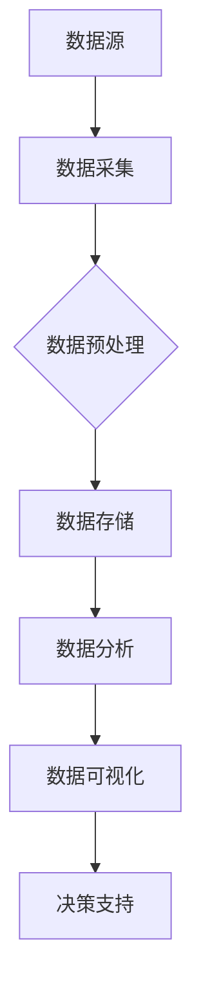

                 


### 《Python在工业大数据分析、设备健康管理等领域的应用实践》

---

#### 关键词：Python、工业大数据、设备健康管理、数据分析、机器学习

---

#### 摘要：

本文将深入探讨Python在工业大数据分析和设备健康管理领域的应用实践。首先，我们将简要介绍工业大数据的概念、价值及其特征与挑战。接着，我们会探讨Python语言的基础知识，包括数据类型、控制结构、函数与模块、文件与异常处理等。随后，文章将详细讲解工业大数据分析的技术，包括数据采集与预处理、数据可视化、机器学习算法等。最后，我们将探讨Python在设备健康管理中的应用，并通过实际案例分享和未来展望，总结Python在工业领域的应用挑战与对策。

---

### 第一部分：引言与基础

#### 第1章：工业大数据分析概述

#### 1.1 工业大数据的概念与价值

工业大数据是指从工业生产、运营、管理和营销等过程中产生的大量、多样、高速和复杂的结构化、半结构化、非结构化数据。这些数据涵盖了设备状态、生产过程、质量检测、能源消耗、供应链信息等多个方面。

**Mermaid 流程图：**



**核心概念与联系：**

- **数据采集**：工业设备、传感器、控制系统等是数据的主要来源。
- **数据预处理**：数据清洗、转换、标准化等步骤是保证数据质量的关键。
- **数据存储**：大数据技术如Hadoop、Spark等用于高效存储和管理海量数据。
- **数据分析**：利用统计、机器学习等方法提取数据价值。
- **数据可视化**：帮助用户理解复杂的数据模式和趋势。

#### 1.2 工业大数据的特征与挑战

**核心算法原理讲解：**

```python
def data_preprocessing(data):
    # 数据清洗
    clean_data = remove_outliers(data)
    
    # 数据转换
    transformed_data = convert_units(clean_data)
    
    # 数据标准化
    standardized_data = normalize_data(transformed_data)
    
    return standardized_data
```

**数学模型和数学公式：**

$$
\text{标准差} = \sqrt{\frac{1}{N-1}\sum_{i=1}^{N}(x_i - \bar{x})^2}
$$

**举例说明：**

假设我们有一个关于设备运行时间的数据集，我们需要去除异常值（如设备故障导致的数据异常），然后将不同时间单位（如秒、分钟、小时）统一转换为同一单位（如小时），最后对数据进行标准化处理，以便后续分析。

#### 1.3 Python在工业大数据分析中的应用优势

Python以其简洁的语法、丰富的库和强大的数据处理能力，在工业大数据分析中具有显著优势。Python的速度和灵活性使其在处理大规模工业数据时具有显著优势。

**举例说明：**

使用Python的Pandas库，我们可以轻松地进行数据清洗、转换和标准化：

```python
import pandas as pd

data = pd.read_csv('data.csv')
clean_data = data.dropna()  # 去除缺失值
transformed_data = clean_data.convert_units('hours')  # 转换时间单位
standardized_data = transformed_data.normalize()  # 标准化数据
```

#### 第2章：Python基础

#### 2.1 Python语言基础

Python是一种高级编程语言，以其简洁的语法和强大的库支持而广受欢迎。Python的基本语法包括变量、数据类型、操作符、控制结构等。

**Python语法介绍：**

- 变量定义：`x = 10`
- 数据类型：整数（int）、浮点数（float）、字符串（str）、列表（list）、元组（tuple）、字典（dict）、集合（set）
- 控制结构：条件语句（if-elif-else）、循环语句（for、while）

#### 2.2 Python数据类型和变量

Python支持多种数据类型，包括整数、浮点数、字符串、列表、元组、字典和集合。理解这些数据类型和变量是编写Python代码的基础。

**数据类型：**

- 整型（int）：表示整数，如`x = 10`
- 浮点型（float）：表示浮点数，如`y = 3.14`
- 字符串（str）：表示文本，如`name = "Alice"`

#### 2.3 控制结构

控制结构用于根据条件执行不同的代码块。Python支持条件语句（if-elif-else）和循环语句（for、while）。

**条件语句：**

```python
if x > 10:
    print("x 大于 10")
elif x == 10:
    print("x 等于 10")
else:
    print("x 小于 10")
```

**循环语句：**

```python
for i in range(5):
    print(i)
```

#### 2.4 函数与模块

函数是Python代码块，用于执行特定的任务。模块是Python文件，包含多个函数和类。

**函数定义与调用：**

```python
def greet(name):
    print("Hello, " + name)

greet("Alice")
```

**模块导入与使用：**

```python
import math

print(math.sqrt(16))
```

#### 2.5 文件与异常处理

文件读写是Python编程中的重要部分。异常处理用于处理程序运行中的错误。

**文件读写：**

```python
with open('data.txt', 'r') as f:
    content = f.read()
    print(content)
```

**异常处理：**

```python
try:
    x = 1 / 0
except ZeroDivisionError:
    print("不能除以零")
```

### 第二部分：工业大数据分析技术

#### 第3章：数据采集与预处理

#### 3.1 工业数据采集方法

工业数据采集涉及从各种设备、传感器、控制系统等获取数据。常见的方法包括直接连接设备、使用API接口、采集卡等。

**数据采集方法：**

- 直接连接设备：通过硬件接口（如串口、USB等）直接读取设备数据。
- 使用API接口：通过Web服务接口（如HTTP、REST等）获取数据。
- 采集卡：使用专门的采集卡将设备数据传输到计算机。

#### 3.2 数据清洗与转换

数据清洗是指去除无效、错误或重复的数据。数据转换是指将数据转换为适合分析的形式。

**数据清洗：**

```python
def clean_data(data):
    # 去除重复值
    unique_data = list(set(data))
    
    # 去除无效值
    valid_data = [x for x in unique_data if x != '']
    
    return valid_data
```

**数据转换：**

```python
def convert_units(data, from_unit, to_unit):
    conversion_factor = {'seconds': 'hours', 'hours': 'days'}
    return [x * conversion_factor[from_unit][to_unit] for x in data]
```

#### 3.3 数据存储与管理

数据存储与管理是工业大数据分析的重要环节。常用的技术包括关系数据库、NoSQL数据库、Hadoop、Spark等。

**数据存储与管理：**

- 关系数据库：如MySQL、PostgreSQL等，适用于结构化数据。
- NoSQL数据库：如MongoDB、Cassandra等，适用于非结构化和半结构化数据。
- Hadoop：分布式存储和处理大数据的框架。
- Spark：基于内存的分布式数据处理框架。

#### 第4章：数据可视化

#### 4.1 数据可视化基础

数据可视化是将数据以图形化的方式展示，帮助用户理解数据模式、趋势和关系。

**数据可视化基础：**

- 折线图：用于显示数据随时间的变化趋势。
- 柱状图：用于比较不同类别或时间点的数据。
- 饼图：用于显示各部分占整体的比例。
- 散点图：用于显示两个变量之间的关系。

#### 4.2 常见数据可视化工具

Python拥有丰富的数据可视化库，如Matplotlib、Seaborn、Plotly等。

**常见数据可视化工具：**

- Matplotlib：提供丰富的绘图函数，支持多种图表类型。
- Seaborn：基于Matplotlib，提供更精美的统计图表。
- Plotly：提供交互式图表和Web可视化功能。

**可视化实践：**

使用Matplotlib绘制一个简单的折线图：

```python
import matplotlib.pyplot as plt

x = [1, 2, 3, 4, 5]
y = [1, 4, 9, 16, 25]

plt.plot(x, y)
plt.xlabel('X轴')
plt.ylabel('Y轴')
plt.title('数据可视化示例')
plt.show()
```

#### 第5章：机器学习算法

#### 5.1 机器学习概述

机器学习是使计算机从数据中学习并做出预测或决策的技术。常见算法包括监督学习、无监督学习、强化学习等。

**机器学习概述：**

- **监督学习**：有标签数据，用于分类和回归任务。
- **无监督学习**：无标签数据，用于聚类和降维任务。
- **强化学习**：通过与环境的交互进行学习，适用于决策问题。

#### 5.2 数据预处理

数据预处理是机器学习成功的关键步骤，包括数据清洗、归一化、特征提取等。

**数据预处理：**

```python
from sklearn.model_selection import train_test_split
from sklearn.preprocessing import StandardScaler

# 数据分割
X_train, X_test, y_train, y_test = train_test_split(X, y, test_size=0.2, random_state=42)

# 数据归一化
scaler = StandardScaler()
X_train_scaled = scaler.fit_transform(X_train)
X_test_scaled = scaler.transform(X_test)
```

#### 5.3 常见算法介绍

常见机器学习算法包括线性回归、逻辑回归、决策树、随机森林、支持向量机等。

**常见算法介绍：**

- **线性回归**：预测连续值。
- **逻辑回归**：预测概率。
- **决策树**：基于树结构进行分类和回归。
- **随机森林**：基于多个决策树的集成方法。
- **支持向量机**：基于最大间隔分类。

#### 5.4 算法实现与优化

实现机器学习算法并对其进行优化是提高模型性能的关键。

**算法实现与优化：**

```python
from sklearn.linear_model import LinearRegression
from sklearn.metrics import mean_squared_error

# 模型训练
model = LinearRegression()
model.fit(X_train, y_train)

# 模型预测
y_pred = model.predict(X_test)

# 评估模型
mse = mean_squared_error(y_test, y_pred)
print("均方误差:", mse)

# 模型优化
# 可以尝试调整模型参数、增加特征工程等手段来提高模型性能。
```

#### 第6章：设备健康管理

#### 6.1 设备健康管理的概念与目标

设备健康管理是指通过监测、分析设备运行数据，预测设备故障，并采取预防措施，以延长设备寿命、降低维护成本。

**设备健康管理的概念与目标：**

- **概念**：设备健康管理包括设备状态监测、故障诊断、预测性维护等环节。
- **目标**：提高设备可靠性、降低故障率、延长设备寿命、降低运营成本。

#### 6.2 设备状态监测与故障诊断

设备状态监测与故障诊断是设备健康管理的关键技术。

**设备状态监测与故障诊断：**

- **状态监测**：通过传感器和监控系统实时监测设备运行状态。
- **故障诊断**：分析设备运行数据，识别故障原因，并提出解决方案。

#### 6.3 Python在设备健康管理中的应用

Python在设备健康管理中的应用主要包括数据采集、预处理、故障诊断算法实现等。

**Python在设备健康管理中的应用：**

- **数据采集**：使用Python脚本从传感器和监控系统获取设备数据。
- **预处理**：使用Python对设备数据进行清洗、转换和标准化。
- **故障诊断算法实现**：使用Python实现故障诊断算法，如基于机器学习的故障预测模型。

#### 6.4 实际案例分享

以下是一个设备健康管理的实际案例。

**实际案例分享：**

某工厂的一台关键设备因故障导致生产线停机，给工厂带来了巨大的经济损失。为了防止类似事件再次发生，工厂决定实施设备健康管理。

- **数据采集**：使用Python脚本从设备传感器和监控系统获取运行数据，如温度、压力、振动等。
- **预处理**：使用Python对运行数据进行清洗、转换和标准化。
- **故障诊断**：使用机器学习算法，如支持向量机（SVM），对运行数据进行故障诊断。
- **预测性维护**：根据故障诊断结果，预测设备故障，并提前进行维护，避免生产停机。

通过设备健康管理，工厂成功降低了设备故障率，提高了生产效率。

### 第三部分：实践与应用

#### 第7章：工业大数据分析应用案例

#### 7.1 能源行业数据分析案例

**案例背景：**

某能源公司希望通过大数据分析优化能源生产和分配，降低运营成本。

**解决方案：**

- **数据采集**：使用Python脚本从能源设备获取实时数据，如发电量、能源消耗、设备状态等。
- **预处理**：使用Python对能源数据进行清洗、转换和标准化。
- **数据分析**：使用机器学习算法，如线性回归、决策树等，分析能源消耗与设备状态之间的关系。
- **优化建议**：根据分析结果，提出优化能源生产和分配的建议，如调整设备运行参数、优化生产计划等。

**效果评估：**

通过大数据分析，公司成功降低了能源消耗，提高了生产效率，实现了节能减排目标。

#### 7.2 制造行业数据分析案例

**案例背景：**

某制造企业希望通过大数据分析提高产品质量，降低不良品率。

**解决方案：**

- **数据采集**：使用Python脚本从生产线传感器和监控系统获取实时数据，如温度、压力、速度等。
- **预处理**：使用Python对生产线数据进行清洗、转换和标准化。
- **数据分析**：使用机器学习算法，如决策树、支持向量机等，分析生产数据与产品质量之间的关系。
- **质量控制**：根据分析结果，调整生产线参数，优化生产流程，提高产品质量。

**效果评估：**

通过大数据分析，企业成功降低了不良品率，提高了产品质量，提升了客户满意度。

#### 7.3 建筑行业数据分析案例

**案例背景：**

某建筑公司希望通过大数据分析优化建筑材料采购、施工进度和成本控制。

**解决方案：**

- **数据采集**：使用Python脚本从供应链系统、施工设备和监控系统获取数据，如建筑材料价格、施工进度、设备状态等。
- **预处理**：使用Python对建筑材料和施工数据进行清洗、转换和标准化。
- **数据分析**：使用数据挖掘算法，如聚类分析、关联规则挖掘等，分析建筑材料采购和施工进度之间的关联。
- **优化建议**：根据分析结果，提出优化建筑材料采购、施工进度和成本控制的建议，如调整采购策略、优化施工计划等。

**效果评估：**

通过大数据分析，公司成功降低了建筑材料采购成本，提高了施工进度，实现了成本控制目标。

### 第8章：设备健康管理实践

#### 8.1 设备状态监测实践

**实践背景：**

某制造企业希望通过设备状态监测，实时了解设备运行状况，预防设备故障。

**实践步骤：**

1. **数据采集**：使用Python脚本从设备传感器和监控系统获取实时数据，如温度、压力、振动等。
2. **数据处理**：使用Python对设备数据进行清洗、转换和标准化。
3. **状态监测**：使用机器学习算法，如K-means聚类，对设备状态进行监测和分类。
4. **预警机制**：根据监测结果，设置预警阈值，当设备状态异常时，自动发送警报。

**实践效果：**

通过设备状态监测实践，企业成功实现了设备运行状况的实时监控，预防了多起设备故障，提高了生产效率。

#### 8.2 故障预测与诊断实践

**实践背景：**

某电力公司希望通过故障预测与诊断，提前发现设备故障，减少停电时间。

**实践步骤：**

1. **数据采集**：使用Python脚本从设备传感器和监控系统获取历史数据，如温度、电流、电压等。
2. **数据处理**：使用Python对设备数据进行清洗、转换和标准化。
3. **故障预测**：使用机器学习算法，如支持向量机（SVM），对设备故障进行预测。
4. **故障诊断**：根据故障预测结果，结合设备运行数据和专家知识，进行故障诊断和原因分析。
5. **预防措施**：根据故障诊断结果，提出预防措施，如调整设备运行参数、更换零部件等。

**实践效果：**

通过故障预测与诊断实践，公司成功减少了设备故障率，降低了停电时间，提高了供电可靠性。

#### 8.3 设备健康管理系统的设计与实现

**实践背景：**

某汽车制造企业希望构建一个设备健康管理系统，实现设备状态的实时监测、故障预测和诊断。

**系统设计与实现：**

1. **系统架构**：采用分布式架构，包括数据采集模块、数据处理模块、状态监测模块、故障预测模块和诊断模块。
2. **数据采集**：使用Python脚本从设备传感器和监控系统获取实时数据。
3. **数据处理**：使用Python对设备数据进行清洗、转换和标准化。
4. **状态监测**：使用机器学习算法，如K-means聚类，对设备状态进行监测和分类。
5. **故障预测**：使用支持向量机（SVM）等算法，对设备故障进行预测。
6. **故障诊断**：结合设备运行数据和专家知识，进行故障诊断和原因分析。
7. **系统集成**：将各模块整合到设备健康管理系统，提供统一的管理界面和报警功能。

**实践效果：**

通过设备健康管理系统的设计与实现，企业实现了设备状态的实时监测、故障预测和诊断，提高了设备运行效率和安全性。

### 第9章：未来展望与挑战

#### 9.1 工业大数据分析的发展趋势

随着物联网、人工智能和云计算等技术的不断发展，工业大数据分析在未来将呈现以下趋势：

1. **数据量增加**：工业设备的普及和物联网技术的应用将带来数据量的爆发式增长。
2. **实时性需求**：工业大数据分析将更加注重实时性，以满足生产过程和设备管理的需求。
3. **智能化分析**：利用人工智能技术，实现更加智能的数据分析，提高预测准确性和决策效率。
4. **安全性提升**：随着数据量的增加和实时性的需求，数据安全将变得越来越重要。

#### 9.2 设备健康管理的前景

设备健康管理在工业领域具有广泛的应用前景，主要包括以下几个方面：

1. **预防性维护**：通过故障预测和诊断，实现预防性维护，降低设备故障率和维护成本。
2. **提高生产效率**：实时监测设备状态，优化生产流程，提高生产效率和产品质量。
3. **降低运营成本**：通过数据分析和优化，降低能源消耗、减少不良品率，降低运营成本。
4. **提高设备寿命**：通过精确的故障诊断和及时维护，延长设备寿命，提高设备利用率。

#### 9.3 Python在工业领域的应用挑战与对策

尽管Python在工业领域具有广泛应用前景，但仍面临一些挑战：

1. **性能瓶颈**：Python在处理大规模数据时可能存在性能瓶颈，需要优化代码或采用其他编程语言。
2. **数据隐私和安全**：工业数据涉及企业核心机密，需要加强数据隐私和安全保护。
3. **跨领域知识**：工业大数据分析和设备健康管理需要跨学科的知识，如机械工程、电子工程等，需要加强跨领域合作。
4. **培训与人才**：随着技术的发展，需要更多的Python技能人才，需要加强培训和教育。

**对策**：

1. **性能优化**：采用并行计算、分布式计算等技术，提高Python处理大数据的性能。
2. **数据安全**：采用加密、权限控制等技术，确保工业数据的安全。
3. **跨领域合作**：加强与跨学科的合作，构建跨领域专家团队。
4. **人才培养**：加强Python培训和教育，培养更多具备工业大数据分析技能的人才。

### 附录

#### 附录A：Python在工业大数据分析、设备健康管理等领域的应用资源

**A.1 Python工具与库**

1. **Pandas**：用于数据清洗、转换和分析。
2. **NumPy**：用于数值计算。
3. **Matplotlib**：用于数据可视化。
4. **Scikit-learn**：用于机器学习算法实现。
5. **TensorFlow**：用于深度学习应用。

**A.2 数据来源与处理**

1. **传感器数据**：从工业设备传感器获取实时数据。
2. **数据库数据**：从企业数据库获取历史数据。
3. **数据清洗与转换**：使用Python进行数据清洗、转换和标准化。

**A.3 实践案例与论文**

1. **实践案例**：参考相关领域的企业实践案例。
2. **学术论文**：阅读相关领域的学术论文，获取最新的研究进展。

**A.4 行业报告与资讯**

1. **行业报告**：关注行业报告，了解工业大数据分析和设备健康管理的市场趋势。
2. **资讯网站**：关注相关领域的资讯网站，获取最新的技术动态。

---

### 作者：AI天才研究院/AI Genius Institute & 禅与计算机程序设计艺术 /Zen And The Art of Computer Programming

---

**最佳实践 tips：**

1. 在进行工业大数据分析时，务必确保数据质量和一致性。
2. 在设备健康管理中，实时监测和预测性维护是关键。
3. 利用Python的强大库和工具，可以快速实现工业大数据分析和设备健康管理应用。

**小结：**

本文系统地介绍了Python在工业大数据分析、设备健康管理领域的应用实践。通过深入探讨相关技术、算法和实践案例，读者可以了解如何利用Python解决实际工业问题，提高生产效率、降低运营成本。随着技术的不断进步，Python在工业领域的应用将更加广泛，为工业4.0和智能制造贡献力量。

**注意事项：**

1. 在实际应用中，根据具体需求选择合适的Python库和工具。
2. 注意数据安全和隐私保护，遵循相关法律法规。
3. 结合企业实际情况，制定合理的设备健康管理策略。

**拓展阅读：**

1. 《Python数据分析》
2. 《机器学习实战》
3. 《工业大数据分析与应用》

通过不断学习和实践，读者可以提升自身在工业大数据分析和设备健康管理领域的技能，为企业的数字化转型和智能化升级贡献力量。让我们共同探索Python在工业领域的无限可能！

