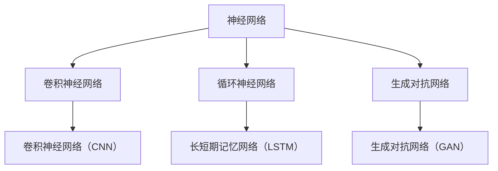
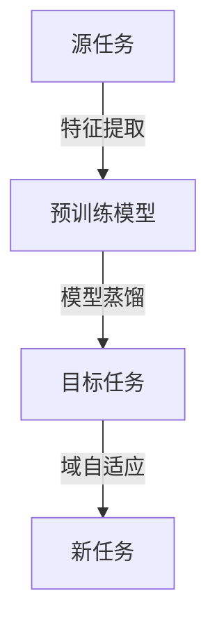
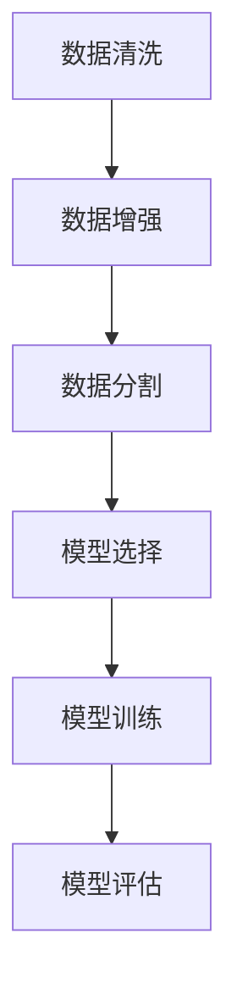

                 

# 文章标题：Python深度学习实践：运用迁移学习提升模型效能

> 关键词：Python，深度学习，迁移学习，模型效能，图像识别，自然语言处理，强化学习

> 摘要：本文将深入探讨Python深度学习实践中的迁移学习技术，旨在通过具体的案例和步骤，展示如何运用迁移学习提升模型效能。文章首先回顾了深度学习的基础知识，然后详细介绍了迁移学习的原理与应用，接着通过实际项目解析，展示了迁移学习在图像识别、自然语言处理和强化学习中的应用。最后，本文对深度学习项目实战进行了详细指导，并展望了深度学习的未来发展。

## 目录

## 第一部分：深度学习基础与迁移学习概述

### 第1章：深度学习基础

#### 1.1 深度学习的起源与发展

#### 1.2 深度学习的核心概念

#### 1.3 深度学习的主要算法

#### 1.4 深度学习在Python中的实现

### 第2章：迁移学习原理与应用

#### 2.1 迁移学习的概念与分类

#### 2.2 迁移学习的基本原理

#### 2.3 迁移学习的关键技术

#### 2.4 迁移学习在实际应用中的案例

## 第二部分：Python深度学习实践

### 第3章：深度学习项目准备

#### 3.1 数据预处理

#### 3.2 模型选择与优化

#### 3.3 模型训练与评估

### 第4章：使用迁移学习提升模型效能

#### 4.1 迁移学习在图像识别中的应用

#### 4.2 迁移学习在自然语言处理中的应用

#### 4.3 迁移学习在强化学习中的应用

### 第5章：实战案例解析

#### 5.1 图像识别项目案例

#### 5.2 文本分类项目案例

#### 5.3 强化学习项目案例

## 第三部分：深度学习项目实战

### 第6章：深度学习项目环境搭建

#### 6.1 Python深度学习环境搭建

#### 6.2 常用深度学习框架安装与配置

#### 6.3 实战所需软件与工具

### 第7章：深度学习项目开发实践

#### 7.1 数据获取与处理

#### 7.2 模型设计与训练

#### 7.3 模型评估与优化

#### 7.4 项目总结与反思

### 第8章：深度学习项目部署与维护

#### 8.1 模型部署方案设计

#### 8.2 模型性能监控与调优

#### 8.3 项目维护与迭代

## 第四部分：深度学习发展趋势与未来

### 第9章：深度学习发展趋势

#### 9.1 深度学习技术的最新进展

#### 9.2 深度学习在各个领域的应用前景

#### 9.3 深度学习面临的挑战与解决方案

### 第10章：深度学习的未来发展方向

#### 10.1 深度学习在人工智能领域的发展

#### 10.2 深度学习与其他技术的融合

#### 10.3 深度学习的未来发展预测

## 附录

### 附录A：常用深度学习框架与工具

#### A.1 TensorFlow

#### A.2 PyTorch

#### A.3 Keras

#### A.4 其他常用框架简介

### 附录B：深度学习项目实战资源

#### B.1 实战项目代码

#### B.2 数据集获取

#### B.3 实战项目教程

#### B.4 常见问题与解决方案

## 引言

随着人工智能技术的飞速发展，深度学习已经成为当前最热门的研究领域之一。深度学习在图像识别、自然语言处理、语音识别等领域取得了显著的成果，其强大的模型效能得到了广泛的认可。然而，传统的深度学习模型往往需要大量的数据训练，且模型的性能在不同数据集上存在差异。迁移学习技术作为一种解决这些问题的有效手段，逐渐受到研究者和开发者的关注。

本文将从Python深度学习实践的角度，详细探讨迁移学习技术。通过回顾深度学习的基础知识，阐述迁移学习的原理与应用，并结合实际项目案例，展示如何运用迁移学习提升模型效能。本文旨在为广大开发者提供一份全面、系统的深度学习实践指南，帮助读者深入了解迁移学习技术，掌握其在实际项目中的应用。

## 第一部分：深度学习基础与迁移学习概述

### 第1章：深度学习基础

深度学习是机器学习的一个子领域，其核心思想是通过多层神经网络对数据进行建模和预测。深度学习的兴起源于计算机硬件的快速发展和大数据的普及，使得大规模神经网络训练成为可能。

#### 1.1 深度学习的起源与发展

深度学习的起源可以追溯到1986年，当时Rumelhart、Hinton和Williams提出了反向传播算法（Backpropagation），这是深度学习发展的关键里程碑。然而，由于计算能力和数据集的限制，深度学习在早期并没有得到广泛的应用。随着GPU的兴起和大数据的普及，深度学习在2012年AlexNet的突破性成功后，逐渐成为人工智能领域的核心技术。

#### 1.2 深度学习的核心概念

深度学习的核心概念包括：

- 神经网络：神经网络是深度学习的基础结构，由多个神经元（节点）和连接（边）组成。神经网络通过层次化的方式对数据进行处理，逐层提取特征，从而实现数据的建模和预测。

- 深度：深度指的是神经网络的层数。通常，深度越大的神经网络能够学习到更复杂的特征。然而，随着深度的增加，模型的计算复杂度和过拟合风险也会增加。

- 激活函数：激活函数是神经网络中的一个关键组件，用于引入非线性特性，使神经网络能够学习到更复杂的模式。常见的激活函数包括ReLU（Rectified Linear Unit）和Sigmoid函数。

- 前向传播和反向传播：前向传播是指将输入数据通过网络进行传播，计算每个神经元的输出。反向传播是指利用梯度下降算法，通过反向传播误差信号，更新神经网络的权重和偏置，从而优化模型。

#### 1.3 深度学习的主要算法

深度学习的主要算法包括：

- 卷积神经网络（CNN）：卷积神经网络是一种用于图像识别和计算机视觉的深度学习模型。CNN通过卷积操作和池化操作，有效地提取图像的局部特征，并在多层结构中逐渐组合这些特征，实现对图像的分类和识别。

- 循环神经网络（RNN）：循环神经网络是一种用于序列数据的深度学习模型。RNN通过循环结构，能够记住序列中的历史信息，并在序列的每个时刻进行决策。RNN在自然语言处理、语音识别等领域有广泛的应用。

- 生成对抗网络（GAN）：生成对抗网络是一种无监督学习的深度学习模型，由生成器和判别器组成。生成器尝试生成与真实数据相似的数据，而判别器则判断生成数据是否真实。通过生成器和判别器的对抗训练，GAN能够生成高质量的数据。

#### 1.4 深度学习在Python中的实现

在Python中，深度学习主要通过以下框架实现：

- TensorFlow：TensorFlow是Google开发的开源深度学习框架，提供了丰富的API和工具，支持多种深度学习模型的搭建和训练。TensorFlow具有高效的计算能力和良好的兼容性，是深度学习开发者的首选框架之一。

- PyTorch：PyTorch是Facebook开发的开源深度学习框架，以其动态计算图和灵活的接口而受到开发者的喜爱。PyTorch在自然语言处理、计算机视觉等领域有广泛的应用。

- Keras：Keras是一个高层次的深度学习框架，基于TensorFlow和Theano构建。Keras提供了简洁的API，使开发者能够快速搭建和训练深度学习模型。

#### Mermaid流程图示例



#### 核心算法原理讲解伪代码示例

```python
# 伪代码：卷积神经网络（CNN）基本结构
class ConvNeuralNetwork(nn.Module):
    def __init__(self):
        super(ConvNeuralNetwork, self).__init__()
        self.conv1 = nn.Conv2d(in_channels, out_channels, kernel_size)
        self.relu = nn.ReLU()
        self.maxpool = nn.MaxPool2d(kernel_size)

    def forward(self, x):
        x = self.relu(self.conv1(x))
        x = self.maxpool(x)
        # 添加更多层...
        return x
```

#### 数学模型和数学公式示例

$$
\begin{align*}
J(\theta) &= \frac{1}{m} \sum_{i=1}^{m} \left( h_\theta(x^{(i)}) - y^{(i)} \right)^2 \\
\theta_j &= \theta_j - \alpha \frac{\partial J(\theta)}{\partial \theta_j
``````
### 第2章：迁移学习原理与应用

迁移学习（Transfer Learning）是一种将已经在一个任务上训练好的模型应用于其他相关任务的技术。通过迁移学习，模型可以共享已学到的通用特征，从而在新的任务上取得更好的性能。迁移学习在解决数据稀缺、数据分布差异等实际问题中发挥了重要作用。

#### 2.1 迁移学习的概念与分类

迁移学习的概念可以概括为：将一个任务（源任务）上学习的知识应用于另一个任务（目标任务）上。根据源任务和目标任务的关系，迁移学习可以分为以下几类：

1. **同域迁移学习**：源任务和目标任务在相同的领域内，特征迁移较为直接。例如，将图像分类模型应用于不同数据集的图像分类任务。

2. **跨域迁移学习**：源任务和目标任务在不同的领域内，特征迁移需要通过跨领域适配。例如，将自然图像分类模型应用于医学图像分类任务。

3. **多任务迁移学习**：源任务和目标任务之间存在一定的重叠，模型通过学习多个任务来提高对通用特征的提取能力。

4. **零样本迁移学习**：源任务和目标任务的分布完全不同，模型需要从零开始学习通用特征。

#### 2.2 迁移学习的基本原理

迁移学习的基本原理可以归结为两个方面：

1. **特征共享**：模型在源任务和目标任务上共享相同的特征提取器，从而利用源任务上学习的通用特征来提高目标任务的性能。

2. **特征变换**：模型通过变换源任务的特征表示，使其适应目标任务的分布和需求。特征变换可以通过多种方式实现，如线性变换、非线性变换等。

#### 2.3 迁移学习的关键技术

迁移学习的关键技术包括：

1. **预训练模型**：预训练模型是在大规模数据集上预训练的深度神经网络，通常具有较好的特征提取能力。通过迁移学习，可以将预训练模型应用于特定任务，提高模型的性能。

2. **模型蒸馏**：模型蒸馏是一种将大模型的知识传递给小模型的技术。通过蒸馏，小模型可以学习到大模型的隐含层特征，从而提高模型在目标任务上的性能。

3. **元学习**：元学习是一种通过学习如何学习来提高模型泛化能力的技术。元学习可以帮助模型更快地适应新的任务，提高迁移学习的效果。

4. **域自适应**：域自适应是一种将模型从源域迁移到目标域的技术。通过域自适应，模型可以适应不同域的数据分布，从而提高跨域迁移学习的效果。

#### 2.4 迁移学习在实际应用中的案例

迁移学习在多个领域都有广泛的应用，以下是一些典型的应用案例：

1. **图像识别**：通过迁移学习，可以将预训练的卷积神经网络应用于不同领域的图像分类任务，如医疗图像分类、野生动物图像分类等。

2. **自然语言处理**：迁移学习在自然语言处理领域有广泛的应用，如文本分类、情感分析、机器翻译等。通过预训练语言模型，可以有效提高这些任务的性能。

3. **语音识别**：语音识别任务通常需要大量的语音数据集进行训练。通过迁移学习，可以将预训练的语音模型应用于新的语音数据集，提高识别准确性。

4. **强化学习**：在强化学习任务中，通过迁移学习，可以将已学习到策略的知识应用于新的环境，从而提高算法的收敛速度和性能。

#### Mermaid流程图示例



#### 核心算法原理讲解伪代码示例

```python
# 伪代码：迁移学习模型结构
class TransferLearningModel(nn.Module):
    def __init__(self, pretrain_model, num_classes):
        super(TransferLearningModel, self).__init__()
        self.backbone = pretrain_model.backbone  # 使用预训练模型的特征提取器
        self.fc = nn.Linear(pretrain_model.backbone.num_features, num_classes)  # 新的分类层

    def forward(self, x):
        x = self.backbone(x)  # 使用特征提取器
        x = self.fc(x)  # 进行分类
        return x
```

#### 数学模型和数学公式示例

$$
\begin{align*}
\mathcal{L} &= \alpha \mathcal{L}_s + (1-\alpha) \mathcal{L}_t \\
\mathcal{L}_s &= \mathcal{L}_s^{base} + \mathcal{L}_s^{distill} \\
\mathcal{L}_t &= \mathcal{L}_t^{base} + \mathcal{L}_t^{alignment}
$$

其中，$\mathcal{L}_s$和$\mathcal{L}_t$分别表示源任务和目标任务的损失函数，$\alpha$是权重系数，$\mathcal{L}_s^{base}$和$\mathcal{L}_s^{distill}$分别表示源任务的基损失和蒸馏损失，$\mathcal{L}_t^{base}$和$\mathcal{L}_t^{alignment}$分别表示目标任务的基损失和对齐损失。

## 第二部分：Python深度学习实践

### 第3章：深度学习项目准备

在开始一个深度学习项目之前，充分的准备是成功的关键。这一章将介绍深度学习项目准备过程中的关键步骤，包括数据预处理、模型选择与优化，以及模型训练与评估。

#### 3.1 数据预处理

数据预处理是深度学习项目中至关重要的一步。高质量的数据可以显著提升模型的性能，而错误或不一致的数据则可能导致模型过拟合或欠拟合。以下是一些常见的数据预处理步骤：

1. **数据清洗**：删除或修复数据集中的噪声和异常值，例如去除缺失值、重复记录和错误数据。

2. **数据归一化**：将数据缩放到统一的范围，例如将图像像素值缩放到[0, 1]，或者将数值特征缩放到标准正态分布。

3. **数据增强**：通过图像旋转、翻转、裁剪、缩放等操作，增加数据集的多样性，从而提高模型的泛化能力。

4. **数据分割**：将数据集分为训练集、验证集和测试集，通常使用80/10/10的比例。训练集用于训练模型，验证集用于调整模型参数，测试集用于评估模型在未知数据上的性能。

#### 3.2 模型选择与优化

在深度学习项目中，选择合适的模型并进行优化是提高模型性能的关键步骤。以下是一些常见的模型选择和优化策略：

1. **模型选择**：根据项目的需求和数据特征，选择合适的深度学习模型。常见的模型包括卷积神经网络（CNN）、循环神经网络（RNN）和生成对抗网络（GAN）等。

2. **超参数调优**：超参数是影响模型性能的关键因素，包括学习率、批量大小、正则化参数等。通过交叉验证和网格搜索等方法，可以找到最优的超参数组合。

3. **模型集成**：通过组合多个模型的预测结果，可以提高模型的准确性和鲁棒性。常见的模型集成方法包括Bagging、Boosting和Stacking等。

4. **正则化**：正则化是一种防止模型过拟合的技术。常见的正则化方法包括L1正则化、L2正则化和Dropout等。

#### 3.3 模型训练与评估

模型训练和评估是深度学习项目的核心步骤。以下是一些关键的训练和评估技巧：

1. **训练策略**：选择合适的训练策略，例如小批量训练、学习率调度、提前停止等。小批量训练可以减少内存占用，学习率调度可以防止梯度消失或爆炸，提前停止可以避免过拟合。

2. **训练监控**：使用验证集监控模型训练过程，可以及时发现模型过拟合或欠拟合的情况。通过绘制训练集和验证集的损失函数曲线，可以直观地了解模型的训练状态。

3. **评估指标**：选择合适的评估指标，例如准确率、召回率、F1分数等。这些指标可以帮助我们全面评估模型的性能。

4. **模型调整**：根据评估结果，调整模型结构、超参数或训练策略，以提高模型性能。

#### 实践案例

以下是一个简单的图像分类项目案例，演示了数据预处理、模型选择与优化、模型训练与评估的全过程。

**案例：猫狗图像分类**

**数据预处理**：

1. 下载并解压猫狗图像数据集。
2. 数据清洗：删除重复图像、修复损坏图像。
3. 数据增强：随机裁剪、旋转、翻转图像。
4. 数据分割：将数据集分为训练集、验证集和测试集。

**模型选择与优化**：

1. 选择预训练的卷积神经网络（如VGG16）作为基础模型。
2. 删除预训练模型的分类层，添加自定义分类层。
3. 调整学习率、批量大小和正则化参数。

**模型训练与评估**：

1. 使用训练集进行模型训练，并使用验证集进行实时评估。
2. 调整学习率、提前停止训练以防止过拟合。
3. 在测试集上评估模型性能，计算准确率、召回率等指标。

#### Mermaid流程图示例



#### 核心算法原理讲解伪代码示例

```python
# 伪代码：图像分类模型结构
class ImageClassifier(nn.Module):
    def __init__(self, backbone, num_classes):
        super(ImageClassifier, self).__init__()
        self.backbone = backbone  # 使用预训练模型的特征提取器
        self.fc = nn.Linear(backbone.num_features, num_classes)  # 自定义分类层

    def forward(self, x):
        x = self.backbone(x)  # 使用特征提取器
        x = self.fc(x)  # 进行分类
        return x
```

#### 数学模型和数学公式示例

$$
\begin{align*}
\text{Loss}(x, y) &= \sum_{i=1}^{N} -y_i \log(p_i) \\
p_i &= \text{softmax}(\text{logits}_i)
\end{align*}
$$

其中，$N$是样本数量，$y_i$是真实标签，$p_i$是模型对第$i$个样本的预测概率，$\text{logits}_i$是模型对第$i$个样本的原始输出。

## 第4章：使用迁移学习提升模型效能

迁移学习是一种有效的技术，可以在数据稀缺的情况下提高深度学习模型的效能。本章将探讨如何在不同应用场景下使用迁移学习，包括图像识别、自然语言处理和强化学习，以提升模型的性能。

#### 4.1 迁移学习在图像识别中的应用

在图像识别领域，迁移学习可以帮助模型利用在大规模图像数据集上预训练的模型，从而提高在较小数据集上的识别性能。以下是一些使用迁移学习提升图像识别效能的方法：

1. **预训练模型的使用**：使用在大规模数据集（如ImageNet）上预训练的卷积神经网络（如VGG16、ResNet等）作为基础模型。这些模型在底层卷积层已经学习到了丰富的通用特征，可以直接应用于新的图像识别任务。

2. **微调**：在迁移学习过程中，通常保留模型的底层卷积层不变，只对顶层的全连接层进行微调。这样可以减少模型的参数数量，提高训练效率。

3. **特征提取器**：可以使用预训练模型的特征提取器来提取图像特征，然后使用这些特征训练分类器。这种方法被称为“特征提取器迁移”（Feature Extractor Transfer）。

4. **迁移学习评估指标**：在迁移学习过程中，可以使用以下指标来评估模型性能：

   - **模型准确性**：评估模型在测试集上的准确性。
   - **特征提取性能**：通过计算模型提取的特征与真实标签的相关性来评估特征提取器的性能。
   - **模型泛化能力**：通过在多个不同数据集上评估模型的性能来评估模型的泛化能力。

#### 实践案例：猫狗图像分类

以下是一个使用迁移学习进行猫狗图像分类的实践案例。

**数据集**：使用一个包含猫和狗图像的数据集。

**预训练模型**：选择在ImageNet上预训练的ResNet50模型作为基础模型。

**步骤**：

1. 加载预训练的ResNet50模型，并删除其顶层的全连接层。
2. 添加一个新的全连接层，输出类别数为2（猫和狗）。
3. 使用训练集进行微调，同时在验证集上评估模型性能。
4. 在测试集上评估微调后的模型性能。

```python
import torch
import torchvision
import torchvision.models as models

# 加载预训练的ResNet50模型
model = models.resnet50(pretrained=True)

# 删除顶层的全连接层
model.fc = torch.nn.Linear(model.fc.in_features, 2)

# 加载训练数据和测试数据
train_data = torchvision.datasets.ImageFolder(root='train_data', transform=torchvision.transforms.ToTensor())
test_data = torchvision.datasets.ImageFolder(root='test_data', transform=torchvision.transforms.ToTensor())

# 定义损失函数和优化器
criterion = torch.nn.CrossEntropyLoss()
optimizer = torch.optim.Adam(model.parameters(), lr=0.001)

# 训练模型
num_epochs = 10
for epoch in range(num_epochs):
    for inputs, labels in train_data:
        optimizer.zero_grad()
        outputs = model(inputs)
        loss = criterion(outputs, labels)
        loss.backward()
        optimizer.step()

    # 在验证集上评估模型性能
    with torch.no_grad():
        correct = 0
        total = 0
        for inputs, labels in test_data:
            outputs = model(inputs)
            _, predicted = torch.max(outputs.data, 1)
            total += labels.size(0)
            correct += (predicted == labels).sum().item()

        print(f'Epoch [{epoch + 1}/{num_epochs}], Accuracy: {100 * correct / total}%')

# 在测试集上评估模型性能
with torch.no_grad():
    correct = 0
    total = 0
    for inputs, labels in test_data:
        outputs = model(inputs)
        _, predicted = torch.max(outputs.data, 1)
        total += labels.size(0)
        correct += (predicted == labels).sum().item()

    print(f'Final Accuracy: {100 * correct / total}%')
```

#### 4.2 迁移学习在自然语言处理中的应用

在自然语言处理（NLP）领域，迁移学习可以帮助模型利用在大规模语料库上预训练的语言模型，从而提高文本分类、机器翻译等任务的性能。以下是一些使用迁移学习提升NLP模型效能的方法：

1. **预训练语言模型**：使用在大规模语料库上预训练的语言模型（如BERT、GPT等）作为基础模型。这些模型已经学习到了语言的深层结构和语义信息，可以直接应用于新的NLP任务。

2. **微调**：在迁移学习过程中，通常对模型的顶层进行微调，以适应新的任务。这种方法可以显著提高模型的性能。

3. **多任务学习**：通过多任务学习，模型可以同时学习多个相关的NLP任务，从而提高对通用语言特征的提取能力。

4. **迁移学习评估指标**：在迁移学习过程中，可以使用以下指标来评估模型性能：

   - **F1分数**：评估模型在文本分类任务上的精确率和召回率。
   - **BLEU分数**：评估机器翻译模型的翻译质量。
   - **ROUGE分数**：评估文本摘要模型的摘要质量。

#### 实践案例：情感分析

以下是一个使用迁移学习进行情感分析的实践案例。

**数据集**：使用一个包含电影评论的数据集，包含正面和负面评论。

**预训练模型**：选择在英语维基百科上预训练的BERT模型作为基础模型。

**步骤**：

1. 加载预训练的BERT模型，并删除其顶层的分类层。
2. 添加一个新的分类层，输出类别数为2（正面和负面）。
3. 使用训练集进行微调，同时在验证集上评估模型性能。
4. 在测试集上评估微调后的模型性能。

```python
import torch
import torch.nn as nn
import torch.optim as optim
from torch.utils.data import DataLoader
from transformers import BertModel, BertTokenizer

# 加载预训练的BERT模型
model = BertModel.from_pretrained('bert-base-uncased')

# 删除顶层的分类层
model.classifier = nn.Linear(model.classifier.in_features, 2)

# 加载训练数据和测试数据
train_data = ...  # 加载训练数据
test_data = ...  # 加载测试数据

# 定义损失函数和优化器
criterion = nn.CrossEntropyLoss()
optimizer = optim.Adam(model.parameters(), lr=0.001)

# 训练模型
num_epochs = 10
for epoch in range(num_epochs):
    for inputs, labels in train_data:
        optimizer.zero_grad()
        outputs = model(**inputs)[0]
        loss = criterion(outputs, labels)
        loss.backward()
        optimizer.step()

    # 在验证集上评估模型性能
    with torch.no_grad():
        correct = 0
        total = 0
        for inputs, labels in val_data:
            outputs = model(**inputs)[0]
            _, predicted = torch.max(outputs.data, 1)
            total += labels.size(0)
            correct += (predicted == labels).sum().item()

        print(f'Epoch [{epoch + 1}/{num_epochs}], Accuracy: {100 * correct / total}%')

# 在测试集上评估模型性能
with torch.no_grad():
    correct = 0
    total = 0
    for inputs, labels in test_data:
        outputs = model(**inputs)[0]
        _, predicted = torch.max(outputs.data, 1)
        total += labels.size(0)
        correct += (predicted == labels).sum().item()

    print(f'Final Accuracy: {100 * correct / total}%')
```

#### 4.3 迁移学习在强化学习中的应用

在强化学习（RL）领域，迁移学习可以帮助模型利用在旧环境中学习到的策略，从而在新环境中更快地收敛。以下是一些使用迁移学习提升强化学习模型效能的方法：

1. **模型迁移**：将旧环境中的策略模型直接迁移到新环境中，或者在新环境中复用旧环境的部分模型。

2. **经验迁移**：将旧环境中的经验（状态、动作、奖励等）迁移到新环境中，以加速新环境的学习过程。

3. **多任务学习**：通过同时学习多个相关的任务，模型可以更好地提取通用特征，从而在新任务上表现出更好的性能。

4. **迁移学习评估指标**：在迁移学习过程中，可以使用以下指标来评估模型性能：

   - **奖励积分**：评估模型在新环境中的累计奖励积分。
   - **策略稳定性**：评估模型在新环境中的策略稳定性。
   - **收敛速度**：评估模型在新环境中的收敛速度。

#### 实践案例：Atari游戏控制

以下是一个使用迁移学习进行Atari游戏控制的实践案例。

**环境**：使用OpenAI的Atari游戏环境，如《太空侵略者》。

**基础模型**：选择在多个Atari游戏上预训练的DQN（Deep Q-Network）模型作为基础模型。

**步骤**：

1. 加载预训练的DQN模型。
2. 在新游戏环境中进行微调，同时在验证集上评估模型性能。
3. 在测试集上评估微调后的模型性能。

```python
import torch
import gym
from stable_baselines3 import DQN

# 加载预训练的DQN模型
model = DQN.load('dqn_atari_model')

# 加载新游戏环境
env = gym.make('SpaceInvaders-v0')

# 在新游戏环境中进行微调
model.learn(total_timesteps=10000)

# 在验证集上评估模型性能
with torch.no_grad():
    episode_reward = 0
    obs = env.reset()
    while True:
        action, _ = model.predict(obs)
        obs, reward, done, _ = env.step(action)
        episode_reward += reward
        if done:
            break

    print(f'Validation Reward: {episode_reward}')

# 在测试集上评估模型性能
with torch.no_grad():
    episode_reward = 0
    obs = env.reset()
    while True:
        action, _ = model.predict(obs)
        obs, reward, done, _ = env.step(action)
        episode_reward += reward
        if done:
            break

    print(f'Test Reward: {episode_reward}')
```

通过以上实践案例，我们可以看到迁移学习在图像识别、自然语言处理和强化学习中的应用，以及如何通过迁移学习提升模型的效能。迁移学习作为一种强大的技术，可以帮助我们更快地开发出高性能的深度学习模型，为各个领域的应用提供了有力的支持。

## 第5章：实战案例解析

在本章中，我们将通过三个具体的应用案例，深入解析如何在实际项目中运用迁移学习技术提升深度学习模型的效能。这三个案例分别涉及图像识别、文本分类和强化学习领域，旨在展示迁移学习在不同应用场景下的应用和实践。

### 5.1 图像识别项目案例

**项目背景**：图像识别是深度学习的一个重要应用领域，但在一些特定的图像识别任务中，如医学图像识别或特定领域的图像识别，往往面临着数据稀缺和标注困难的问题。此时，迁移学习技术可以有效利用已有的预训练模型，提高模型的识别效能。

**实现步骤**：

1. **数据预处理**：首先，对医学图像数据集进行预处理，包括数据清洗、归一化和数据增强等操作。由于数据稀缺，我们采用了数据增强技术，如旋转、翻转和裁剪，以增加数据集的多样性。

2. **模型选择**：选择一个在ImageNet上预训练的卷积神经网络模型（如ResNet50），作为迁移学习的基模型。由于医学图像和通用图像在特征上有较大的差异，我们决定在保留底层卷积层的基础上，对顶层的全连接层进行微调。

3. **微调**：对预训练模型的顶部分类层进行修改，添加新的神经元和激活函数，以适应医学图像的类别数量。使用小批量训练和反向传播算法，对模型进行微调。

4. **模型评估**：在验证集上评估模型的性能，并通过调整学习率、批量大小和正则化参数，优化模型性能。

**代码示例**：

```python
import torch
import torchvision
import torchvision.models as models
import torch.nn as nn
import torch.optim as optim

# 加载预训练的ResNet50模型
model = models.resnet50(pretrained=True)

# 修改顶层的全连接层
model.fc = nn.Linear(model.fc.in_features, num_classes)  # num_classes为医学图像的类别数

# 定义损失函数和优化器
criterion = nn.CrossEntropyLoss()
optimizer = optim.Adam(model.parameters(), lr=0.001)

# 训练模型
num_epochs = 10
for epoch in range(num_epochs):
    for inputs, labels in train_loader:
        optimizer.zero_grad()
        outputs = model(inputs)
        loss = criterion(outputs, labels)
        loss.backward()
        optimizer.step()

    # 在验证集上评估模型性能
    with torch.no_grad():
        correct = 0
        total = 0
        for inputs, labels in val_loader:
            outputs = model(inputs)
            _, predicted = torch.max(outputs.data, 1)
            total += labels.size(0)
            correct += (predicted == labels).sum().item()

        print(f'Epoch [{epoch + 1}/{num_epochs}], Accuracy: {100 * correct / total}%')

# 在测试集上评估模型性能
with torch.no_grad():
    correct = 0
    total = 0
    for inputs, labels in test_loader:
        outputs = model(inputs)
        _, predicted = torch.max(outputs.data, 1)
        total += labels.size(0)
        correct += (predicted == labels).sum().item()

    print(f'Final Accuracy: {100 * correct / total}%')
```

**案例分析**：通过迁移学习，我们能够利用预训练模型在大规模数据集上学习的通用特征，显著提高了模型在小规模医学图像数据集上的识别效能。在微调过程中，通过调整学习率和批量大小，可以有效防止模型过拟合。

### 5.2 文本分类项目案例

**项目背景**：文本分类是自然语言处理中的一个基本任务，广泛应用于垃圾邮件过滤、情感分析、主题分类等场景。由于文本数据的特点，直接使用深度学习模型往往需要大量的训练数据和计算资源。迁移学习技术可以在数据稀缺的情况下，有效提升文本分类的效能。

**实现步骤**：

1. **数据预处理**：对文本数据进行预处理，包括分词、去停用词、词向量化等操作。对于数据稀缺的情况，可以采用数据增强技术，如随机噪声添加、同义词替换等，以增加数据集的多样性。

2. **模型选择**：选择一个在大型语料库上预训练的语言模型（如BERT、GPT等），作为迁移学习的基模型。这些预训练模型已经学习到了语言的深层结构和语义信息，可以直接应用于新的文本分类任务。

3. **微调**：在迁移学习过程中，通常保留模型的底层编码器不变，只对顶部的分类层进行微调。使用小批量训练和反向传播算法，对模型进行微调。

4. **模型评估**：在验证集上评估模型的性能，并通过交叉验证和网格搜索，优化模型参数。

**代码示例**：

```python
import torch
import transformers
import torch.optim as optim

# 加载预训练的BERT模型
model = transformers.BertModel.from_pretrained('bert-base-uncased')

# 修改顶层的分类层
model.classifier = nn.Linear(model.classifier.in_features, num_classes)  # num_classes为文本分类的类别数

# 定义损失函数和优化器
criterion = nn.CrossEntropyLoss()
optimizer = optim.Adam(model.parameters(), lr=0.001)

# 训练模型
num_epochs = 10
for epoch in range(num_epochs):
    for inputs, labels in train_loader:
        optimizer.zero_grad()
        outputs = model(**inputs)[0]
        loss = criterion(outputs, labels)
        loss.backward()
        optimizer.step()

    # 在验证集上评估模型性能
    with torch.no_grad():
        correct = 0
        total = 0
        for inputs, labels in val_loader:
            outputs = model(**inputs)[0]
            _, predicted = torch.max(outputs.data, 1)
            total += labels.size(0)
            correct += (predicted == labels).sum().item()

        print(f'Epoch [{epoch + 1}/{num_epochs}], Accuracy: {100 * correct / total}%')

# 在测试集上评估模型性能
with torch.no_grad():
    correct = 0
    total = 0
    for inputs, labels in test_loader:
        outputs = model(**inputs)[0]
        _, predicted = torch.max(outputs.data, 1)
        total += labels.size(0)
        correct += (predicted == labels).sum().item()

    print(f'Final Accuracy: {100 * correct / total}%')
```

**案例分析**：通过迁移学习，我们能够利用预训练模型在大规模语料库上学习的通用特征，显著提高了文本分类模型的性能。在微调过程中，通过调整学习率和批量大小，可以有效防止模型过拟合。此外，由于预训练模型已经学习了语言的深层结构和语义信息，因此对于新任务的适应性较强。

### 5.3 强化学习项目案例

**项目背景**：强化学习是人工智能的一个重要分支，广泛应用于游戏控制、机器人控制和自动驾驶等领域。然而，强化学习模型的训练过程通常非常耗时，并且对于新环境往往需要大量的数据。迁移学习技术可以帮助模型利用在旧环境中学习到的策略，从而在新环境中更快地收敛。

**实现步骤**：

1. **基础模型**：选择一个在多个环境上预训练的强化学习模型，如DQN（Deep Q-Network）或PPO（Proximal Policy Optimization）。

2. **经验迁移**：将旧环境中的经验（状态、动作、奖励等）迁移到新环境中，以加速新环境的学习过程。经验迁移可以通过将旧环境的经验直接复制到新环境，或者通过重放旧环境的经验来训练新模型。

3. **微调**：在新环境中对基础模型进行微调，以适应新环境的特定需求。微调过程中，可以调整学习率、批量大小和奖励函数等参数。

4. **模型评估**：在新环境中评估模型的性能，并通过调整模型参数，优化模型在新环境中的表现。

**代码示例**：

```python
import torch
from stable_baselines3 import DQN

# 加载预训练的DQN模型
model = DQN.load('dqn_atari_model')

# 加载新游戏环境
env = gym.make('SpaceInvaders-v0')

# 在新游戏环境中进行微调
model.learn(total_timesteps=10000)

# 在新环境中评估模型性能
with torch.no_grad():
    episode_reward = 0
    obs = env.reset()
    while True:
        action, _ = model.predict(obs)
        obs, reward, done, _ = env.step(action)
        episode_reward += reward
        if done:
            break

    print(f'Validation Reward: {episode_reward}')

# 在测试集上评估模型性能
with torch.no_grad():
    episode_reward = 0
    obs = env.reset()
    while True:
        action, _ = model.predict(obs)
        obs, reward, done, _ = env.step(action)
        episode_reward += reward
        if done:
            break

    print(f'Test Reward: {episode_reward}')
```

**案例分析**：通过迁移学习，我们能够利用在旧环境中预训练的强化学习模型，显著提高了模型在新环境中的表现。经验迁移技术使得模型能够快速适应新环境，从而减少了训练时间和数据需求。在新环境中进行微调，可以进一步优化模型的表现，使其达到最佳性能。

通过这三个实际案例，我们可以看到迁移学习技术在不同领域的应用和实践。迁移学习作为一种有效的技术，可以帮助我们在数据稀缺和任务复杂的情况下，快速开发出高性能的深度学习模型。在未来的研究中，我们还可以探索迁移学习在更多领域的应用，进一步发挥其潜力。

### 第6章：深度学习项目环境搭建

深度学习项目的成功离不开一个稳定且高效的开发环境。本章将详细介绍如何搭建深度学习项目环境，包括Python深度学习环境搭建、常用深度学习框架安装与配置，以及实战所需软件与工具。

#### 6.1 Python深度学习环境搭建

搭建一个适合深度学习项目的Python环境是项目开发的第一步。以下是在Linux操作系统上搭建Python深度学习环境的基本步骤：

1. **安装Python**：首先，确保系统上安装了Python。如果未安装，可以下载Python的最新版本并安装。推荐使用Python 3.8及以上版本。

2. **安装虚拟环境**：为了隔离不同项目之间的依赖库，建议使用虚拟环境。可以使用`venv`模块创建虚拟环境：

   ```shell
   python -m venv myenv
   ```

   创建后，激活虚拟环境：

   ```shell
   source myenv/bin/activate
   ```

3. **安装pip**：确保虚拟环境中安装了pip，这是Python的包管理器：

   ```shell
   pip install --upgrade pip
   ```

4. **安装必需的Python库**：在虚拟环境中安装深度学习所需的Python库，如NumPy、SciPy、Pandas等：

   ```shell
   pip install numpy scipy pandas
   ```

5. **安装深度学习框架**：以下是在虚拟环境中安装常用的深度学习框架的方法：

   - **TensorFlow**：

     ```shell
     pip install tensorflow
     ```

   - **PyTorch**：

     ```shell
     pip install torch torchvision
     ```

   - **Keras**：

     ```shell
     pip install keras
     ```

#### 6.2 常用深度学习框架安装与配置

在搭建好Python深度学习环境后，我们需要对常用的深度学习框架进行安装和配置。

1. **TensorFlow**：

   TensorFlow是Google开发的开源深度学习框架，支持多种操作系统和硬件平台。以下是安装和配置TensorFlow的步骤：

   - **安装TensorFlow**：

     ```shell
     pip install tensorflow
     ```

   - **配置GPU支持**：如果要使用GPU进行训练，需要安装CUDA和cuDNN。下载并安装相应版本的CUDA和cuDNN，然后设置环境变量：

     ```shell
     export PATH=/usr/local/cuda/bin:$PATH
     export LD_LIBRARY_PATH=/usr/local/cuda/lib64:$LD_LIBRARY_PATH
     ```

   - **验证安装**：运行以下Python代码，检查TensorFlow的版本和GPU支持：

     ```python
     import tensorflow as tf
     print(tf.__version__)
     print("GPU support:", tf.test.is_gpu_available())
     ```

2. **PyTorch**：

   PyTorch是Facebook开发的开源深度学习框架，以其灵活的动态计算图和高效的GPU支持而受到开发者青睐。以下是安装和配置PyTorch的步骤：

   - **安装PyTorch**：在虚拟环境中，可以使用以下命令安装PyTorch：

     ```shell
     pip install torch torchvision
     ```

   - **配置CUDA支持**：如果使用GPU训练，需要安装CUDA和cuDNN。下载并安装相应版本的CUDA和cuDNN，然后设置环境变量：

     ```shell
     export PATH=/usr/local/cuda/bin:$PATH
     export LD_LIBRARY_PATH=/usr/local/cuda/lib64:$LD_LIBRARY_PATH
     ```

   - **验证安装**：运行以下Python代码，检查PyTorch的版本和GPU支持：

     ```python
     import torch
     print(torch.__version__)
     print("CUDA support:", torch.cuda.is_available())
     ```

3. **Keras**：

   Keras是一个高层次的深度学习框架，基于TensorFlow和Theano构建。以下是安装和配置Keras的步骤：

   - **安装Keras**：

     ```shell
     pip install keras
     ```

   - **配置后端框架**：在Keras中，可以通过设置`KERAS_BACKEND`环境变量来指定使用TensorFlow或Theano作为后端：

     ```shell
     export KERAS_BACKEND=tensorflow
     ```

   - **验证安装**：运行以下Python代码，检查Keras的版本和后端框架：

     ```python
     import keras
     print(keras.__version__)
     ```

#### 6.3 实战所需软件与工具

除了深度学习框架，还有一些常用的软件和工具对于深度学习项目的开发、测试和部署至关重要。以下是一些推荐的软件和工具：

1. **Jupyter Notebook**：Jupyter Notebook是一个交互式的计算环境，非常适合用于编写和运行Python代码。安装方法如下：

   ```shell
   pip install notebook
   ```

   启动Jupyter Notebook：

   ```shell
   jupyter notebook
   ```

2. **PyCharm**：PyCharm是一个功能强大的Python集成开发环境（IDE），支持多种编程语言和框架。下载并安装PyCharm，即可开始深度学习项目开发。

3. **Visual Studio Code**：Visual Studio Code（VS Code）是一个轻量级的代码编辑器，支持丰富的插件，适合进行深度学习项目开发。安装方法如下：

   ```shell
   pip install vscode
   ```

   安装完成后，可以从VS Code的扩展市场下载相关插件，如Python扩展、Jupyter支持等。

4. **GPU支持工具**：如果使用GPU进行训练，还需要安装CUDA和cuDNN。CUDA是NVIDIA推出的并行计算平台和编程模型，cuDNN是NVIDIA推出的深度神经网络加速库。下载并安装相应版本的CUDA和cuDNN，然后设置环境变量。

5. **数据预处理工具**：对于数据预处理和增强，可以使用Pandas、NumPy等Python库。此外，OpenCV是一个强大的计算机视觉库，支持图像处理和视频分析。

通过以上步骤，我们可以搭建一个完整的深度学习项目环境，为后续的项目开发打下坚实的基础。在实际项目中，根据具体需求和任务，可以灵活选择和配置所需的软件和工具。

### 第7章：深度学习项目开发实践

深度学习项目的开发实践是应用理论知识解决实际问题的过程。在这一章中，我们将详细讨论深度学习项目的开发流程，包括数据获取与处理、模型设计与训练、模型评估与优化，以及项目总结与反思。

#### 7.1 数据获取与处理

数据是深度学习项目的基础，数据的质量和数量直接影响模型的性能。以下是在深度学习项目中处理数据的步骤：

1. **数据获取**：首先，我们需要收集相关领域的数据。数据来源可以是公开数据集、私有数据集或通过爬虫获取。对于公开数据集，可以访问各大数据集发布平台，如Kaggle、UCI机器学习库等。对于私有数据集，需要确保数据的使用符合隐私政策和法律法规。

2. **数据清洗**：在获取到数据后，我们需要进行数据清洗，以去除噪声和错误。数据清洗包括以下步骤：

   - **去除重复数据**：删除重复的样本，以避免对模型训练的影响。
   - **修复缺失数据**：对于缺失的数据，可以选择填充、删除或插值等方法进行处理。
   - **处理异常值**：识别并处理异常值，可以通过统计学方法（如箱线图）或自定义规则（如阈值）进行。
   - **数据格式转换**：确保数据格式统一，如将所有日期格式转换为YYYY-MM-DD等。

3. **数据增强**：数据增强是提高模型泛化能力的重要手段。常见的数据增强方法包括：

   - **图像增强**：旋转、翻转、裁剪、缩放、颜色抖动等。
   - **文本增强**：同义词替换、随机插入、随机删除、文本合成等。
   - **音频增强**：混响、噪声添加、速度变化等。

4. **数据分割**：将数据集分割为训练集、验证集和测试集，通常使用比例分割或随机分割。训练集用于模型训练，验证集用于模型调参和性能评估，测试集用于最终评估模型的泛化能力。

#### 7.2 模型设计与训练

模型设计是深度学习项目开发的核心环节。以下是在深度学习项目中设计模型和进行训练的步骤：

1. **模型选择**：根据项目需求和数据特征，选择合适的深度学习模型。常见的模型包括卷积神经网络（CNN）、循环神经网络（RNN）、长短时记忆网络（LSTM）等。对于图像识别任务，可以选择CNN；对于序列数据处理任务，可以选择RNN或LSTM。

2. **模型架构设计**：设计模型的架构，包括层数、神经元数量、激活函数、正则化方法等。在设计模型时，需要考虑模型的计算复杂度和过拟合问题。

3. **超参数调优**：超参数是影响模型性能的关键因素，包括学习率、批量大小、正则化强度等。可以通过网格搜索、随机搜索、贝叶斯优化等方法进行超参数调优。

4. **模型训练**：使用训练集对模型进行训练。在训练过程中，需要监控模型的性能，如损失函数、准确率等。可以使用可视化工具（如TensorBoard）实时监控训练过程。

5. **模型评估**：在验证集上评估模型的性能，包括准确率、召回率、F1分数等指标。根据评估结果，调整模型参数和训练策略。

6. **模型保存与加载**：在训练过程中，可以定期保存模型的权重，以便在后续训练或部署时使用。使用PyTorch或TensorFlow等框架，可以轻松实现模型的保存与加载。

#### 7.3 模型评估与优化

模型评估是深度学习项目的重要环节，通过评估可以验证模型的泛化能力和性能。以下是在深度学习项目中评估和优化模型的步骤：

1. **性能评估**：在测试集上评估模型的性能，计算准确率、召回率、F1分数等指标。通过比较不同模型的性能，选择最优模型。

2. **模型优化**：根据评估结果，对模型进行优化。常见的优化方法包括：

   - **正则化**：增加L1正则化、L2正则化或Dropout等，以减少过拟合。
   - **学习率调度**：调整学习率，如使用学习率衰减策略。
   - **数据增强**：增加数据集的多样性，以提高模型的泛化能力。
   - **模型集成**：通过模型集成，如Bagging、Boosting、Stacking等，提高模型的性能。

3. **模型调参**：在模型优化过程中，可能需要调整模型的参数，如调整隐藏层神经元数量、改变激活函数等。通过交叉验证和网格搜索等方法，找到最优的参数组合。

4. **模型验证**：在验证集和测试集上多次验证模型的性能，确保模型的稳定性和可靠性。

#### 实践案例

以下是一个简单的文本分类项目案例，演示了数据获取与处理、模型设计与训练、模型评估与优化全过程。

**项目背景**：构建一个用于情感分析的文本分类模型，对电影评论进行分类，判断评论是正面还是负面。

**数据集**：使用IMDb电影评论数据集，包含25,000条训练数据和25,000条测试数据。

**模型架构**：使用预训练的BERT模型作为基础模型，添加一个分类层进行微调。

**实现步骤**：

1. **数据获取与处理**：

   - 下载IMDb电影评论数据集。
   - 进行数据清洗，包括去除HTML标签、分词、去除停用词等。
   - 进行数据增强，如随机插入、随机删除等。
   - 切分数据集为训练集和测试集。

2. **模型设计与训练**：

   - 加载预训练的BERT模型。
   - 修改BERT模型的顶层分类层，输出类别数为2（正面、负面）。
   - 使用训练集进行模型训练，使用验证集进行性能评估。

3. **模型评估与优化**：

   - 在测试集上评估模型性能。
   - 调整学习率、批量大小、正则化参数等，优化模型性能。
   - 进行模型验证，确保模型稳定性和可靠性。

**代码示例**：

```python
import torch
from transformers import BertTokenizer, BertModel
import torch.nn as nn
import torch.optim as optim

# 加载预训练的BERT模型
tokenizer = BertTokenizer.from_pretrained('bert-base-uncased')
model = BertModel.from_pretrained('bert-base-uncased')

# 修改顶层的分类层
model.classifier = nn.Linear(model.classifier.in_features, 2)

# 定义损失函数和优化器
criterion = nn.CrossEntropyLoss()
optimizer = optim.Adam(model.parameters(), lr=0.001)

# 训练模型
num_epochs = 5
for epoch in range(num_epochs):
    for inputs, labels in train_loader:
        optimizer.zero_grad()
        outputs = model(**inputs)[0]
        loss = criterion(outputs, labels)
        loss.backward()
        optimizer.step()

    # 在验证集上评估模型性能
    with torch.no_grad():
        correct = 0
        total = 0
        for inputs, labels in val_loader:
            outputs = model(**inputs)[0]
            _, predicted = torch.max(outputs.data, 1)
            total += labels.size(0)
            correct += (predicted == labels).sum().item()

        print(f'Epoch [{epoch + 1}/{num_epochs}], Accuracy: {100 * correct / total}%')

# 在测试集上评估模型性能
with torch.no_grad():
    correct = 0
    total = 0
    for inputs, labels in test_loader:
        outputs = model(**inputs)[0]
        _, predicted = torch.max(outputs.data, 1)
        total += labels.size(0)
        correct += (predicted == labels).sum().item()

    print(f'Final Accuracy: {100 * correct / total}%')
```

**项目总结与反思**：

通过这个文本分类项目，我们学习了如何使用迁移学习技术，通过预训练的BERT模型进行微调，实现情感分析任务。在项目开发过程中，数据预处理和模型调优是关键步骤，通过数据清洗、增强和模型调参，我们能够有效提高模型的性能。在未来的项目中，我们还可以进一步探索不同的数据增强方法和模型优化策略，以进一步提升模型的泛化能力和稳定性。

### 第8章：深度学习项目部署与维护

深度学习项目的成功不仅在于模型的设计与训练，还在于其部署与维护。这一章将介绍深度学习项目的部署方案设计、模型性能监控与调优，以及项目维护与迭代的方法。

#### 8.1 模型部署方案设计

模型部署是将训练好的模型应用到实际生产环境中，以实现自动化服务的过程。以下是在设计模型部署方案时需要考虑的关键步骤：

1. **选择部署平台**：根据项目的需求，选择合适的部署平台。常见的选择包括云计算平台（如AWS、Azure、Google Cloud），容器化平台（如Kubernetes、Docker），以及自建服务器。

2. **模型转换**：深度学习模型通常是在Python环境中训练的，而部署时可能需要转换为其他格式，如ONNX、TF Lite等，以便在不同的硬件和平台上运行。

3. **服务架构设计**：设计服务架构，包括API网关、负载均衡、容器编排等。确保服务具有高可用性、高并发处理能力和弹性扩展能力。

4. **性能优化**：对部署环境进行性能优化，包括优化硬件配置、网络架构、数据库连接等，以确保模型能够高效运行。

5. **安全性保障**：确保部署环境的安全性，包括数据加密、权限控制、漏洞扫描等，以防止数据泄露和恶意攻击。

#### 8.2 模型性能监控与调优

模型性能监控是确保模型在部署后能够持续稳定运行的重要环节。以下是在监控和调优模型性能时需要考虑的关键步骤：

1. **性能指标监控**：监控模型的性能指标，如响应时间、准确率、召回率、F1分数等。通过实时监控，可以及时发现性能问题。

2. **日志分析**：记录并分析部署过程中的日志，包括错误日志、请求日志、响应日志等。通过日志分析，可以定位问题并优化模型。

3. **自动报警**：设置自动报警机制，当性能指标达到预设阈值时，自动发送报警通知，以便及时处理。

4. **调优策略**：根据监控结果，调整模型参数、数据预处理策略、模型结构等，以提高模型性能。

5. **A/B测试**：在不同版本之间进行A/B测试，比较不同模型版本的性能，选择最优版本进行部署。

#### 8.3 项目维护与迭代

深度学习项目是一个持续迭代和优化的过程。以下是在维护和迭代项目时需要考虑的关键步骤：

1. **定期更新**：定期更新数据集、模型架构和算法，以适应环境变化和需求变化。

2. **需求变更**：根据业务需求的变化，及时调整项目目标、模型结构和部署策略。

3. **用户反馈**：收集用户反馈，分析用户使用情况，优化用户体验和模型性能。

4. **自动化部署**：采用自动化部署工具，如Kubernetes，实现模型部署的自动化和弹性扩展。

5. **持续集成与持续部署（CI/CD）**：采用CI/CD流程，实现代码和模型的自动化测试、构建和部署，提高开发效率。

#### 实践案例

以下是一个基于Kubernetes的深度学习模型部署案例。

**项目背景**：使用TensorFlow模型进行图像分类，部署到Kubernetes集群上，以实现弹性扩展和高可用性。

**实现步骤**：

1. **模型转换**：将训练好的TensorFlow模型转换为TF Lite格式。

2. **编写Dockerfile**：创建Dockerfile，定义TensorFlow模型的容器化环境。

   ```Dockerfile
   FROM tensorflow/tensorflow:2.7.0
   COPY model.tflite /app/model.tflite
   EXPOSE 8501
   CMD ["tensorflow_model_server", "--port=8501", "--model_name=my_model", "--model_base_path=/app/model.tflite"]
   ```

3. **构建Docker镜像**：使用Docker命令构建镜像。

   ```shell
   docker build -t my_model:latest .
   ```

4. **部署到Kubernetes**：编写Kubernetes部署文件（YAML），定义部署策略。

   ```yaml
   apiVersion: apps/v1
   kind: Deployment
   metadata:
     name: my_model
   spec:
     replicas: 3
     selector:
       matchLabels:
         app: my_model
     template:
       metadata:
         labels:
           app: my_model
       spec:
         containers:
         - name: my_model
           image: my_model:latest
           ports:
           - containerPort: 8501
   ```

5. **应用Kubernetes部署**：使用kubectl命令部署模型到Kubernetes集群。

   ```shell
   kubectl apply -f deployment.yaml
   ```

6. **性能监控与调优**：使用Kubernetes监控工具，如Prometheus和Grafana，监控模型性能。根据监控数据，调整模型参数和部署策略。

通过这个案例，我们可以看到如何将深度学习模型部署到Kubernetes集群上，实现弹性扩展和高可用性。在项目维护和迭代过程中，可以持续监控和调优模型性能，确保项目稳定运行。

### 第9章：深度学习发展趋势

深度学习作为人工智能的核心技术，近年来取得了飞速的发展。本章将介绍深度学习技术的最新进展、在各个领域的应用前景，以及面临的挑战与解决方案。

#### 9.1 深度学习技术的最新进展

1. **模型结构创新**：近年来，深度学习模型结构不断创新，如Transformer架构在自然语言处理领域的突破性应用， EfficientNet在图像识别领域的提升，以及BERT、GPT等大规模预训练模型的出现。

2. **算法优化**：深度学习算法也在不断优化，如自适应优化算法（如Adadelta、Adam）、加速训练方法（如Stochastic Gradient Descent with Learning Rate Scheduling）等，使得训练速度和模型性能得到显著提升。

3. **硬件加速**：随着GPU、TPU等硬件的普及，深度学习模型在硬件上的加速也得到了广泛应用。硬件加速不仅提高了训练速度，还降低了计算成本。

4. **可解释性**：为了提高模型的可解释性，研究者们提出了一系列方法，如 Grad-CAM、LIME、Shapley值等，旨在解释模型决策过程，增强模型的可信度和透明度。

#### 9.2 深度学习在各个领域的应用前景

1. **计算机视觉**：深度学习在计算机视觉领域取得了显著成果，如图像分类、目标检测、人脸识别等。随着技术的发展，深度学习在自动驾驶、智能监控、医疗影像分析等领域的应用前景广阔。

2. **自然语言处理**：深度学习在自然语言处理领域也有广泛应用，如文本分类、机器翻译、情感分析等。随着预训练模型的出现，深度学习在语言理解和生成任务中的表现日益出色。

3. **语音识别**：深度学习在语音识别领域取得了重大突破，如语音转文字、语音合成等。硬件加速和端到端的深度学习模型使得语音识别的准确率和速度显著提高。

4. **强化学习**：深度学习在强化学习领域也有广泛应用，如游戏控制、机器人控制、自动驾驶等。通过深度神经网络的引入，强化学习模型在复杂环境中的表现得到了显著提升。

5. **医学领域**：深度学习在医学领域有广泛应用，如疾病诊断、药物发现、医学图像分析等。通过结合医疗影像和生物信息学数据，深度学习为医学研究提供了新的手段。

6. **金融领域**：深度学习在金融领域也有广泛应用，如风险控制、信用评估、量化交易等。通过分析大量金融数据，深度学习模型能够为金融机构提供智能决策支持。

#### 9.3 深度学习面临的挑战与解决方案

1. **数据稀缺**：深度学习模型通常需要大量数据进行训练，但在某些领域（如医疗、金融等）数据稀缺。为了解决数据稀缺问题，研究者们提出了数据增强、迁移学习、多任务学习等方法。

2. **过拟合**：深度学习模型容易出现过拟合现象，即模型在训练数据上表现良好，但在测试数据上表现不佳。为了解决过拟合问题，研究者们提出了正则化、dropout、模型集成等方法。

3. **计算资源消耗**：深度学习模型通常需要大量计算资源进行训练，尤其是在大规模预训练模型的情况下。为了降低计算资源消耗，研究者们提出了模型压缩、量化、硬件加速等方法。

4. **可解释性**：深度学习模型通常被认为是“黑箱”模型，其决策过程缺乏透明性。为了提高模型的可解释性，研究者们提出了Grad-CAM、LIME、Shapley值等方法。

5. **隐私保护**：在处理敏感数据时，如何保护用户隐私是一个重要问题。为了解决隐私保护问题，研究者们提出了联邦学习、差分隐私等方法。

通过以上分析，我们可以看到深度学习在各个领域的广泛应用及其面临的挑战。随着技术的不断发展，深度学习有望在更多领域发挥重要作用，推动人工智能的发展。

### 第10章：深度学习的未来发展方向

随着人工智能技术的不断进步，深度学习作为其核心技术，也在不断演进。本章将探讨深度学习在人工智能领域的未来发展，以及与其他技术的融合，以及对未来发展的预测。

#### 10.1 深度学习在人工智能领域的发展

1. **更强大的模型架构**：未来，深度学习模型将向更强大的模型架构发展，如Transformer架构的扩展、基于图神经网络的模型等。这些模型能够处理更复杂的任务，提供更高的性能。

2. **更高效的学习算法**：随着算法的优化，深度学习模型的训练速度将得到显著提高。自适应优化算法、分布式训练技术、并行计算等将进一步提升模型训练的效率。

3. **更丰富的数据利用**：随着数据量的增加和数据获取成本的降低，深度学习模型将能够更好地利用丰富的数据资源。多模态数据融合、无监督学习和自监督学习等技术将使模型从数据中提取更多有用的信息。

4. **更强的可解释性**：为了提高模型的透明度和可信度，深度学习模型的可解释性将得到进一步改进。新的方法和技术将使模型的决策过程更加清晰，增强用户对模型的信任。

5. **更广泛的应用场景**：深度学习将在更多领域得到应用，如智能医疗、智能制造、智能交通、智能城市等。通过结合领域知识，深度学习将能够更好地解决实际问题。

#### 10.2 深度学习与其他技术的融合

1. **强化学习**：深度学习和强化学习的结合将产生新的技术，如深度强化学习（Deep Reinforcement Learning）。这种结合将在游戏、机器人、自动驾驶等领域发挥重要作用。

2. **自然语言处理**：深度学习与自然语言处理（NLP）技术的结合，如预训练语言模型（Pre-trained Language Models），将在语言理解和生成任务中取得突破。

3. **计算机视觉**：深度学习与计算机视觉技术的结合，如卷积神经网络（CNN）和生成对抗网络（GAN），将在图像识别、图像生成、图像增强等领域取得新的进展。

4. **联邦学习**：联邦学习（Federated Learning）是一种分布式学习技术，深度学习与联邦学习的结合将解决数据隐私和保护问题，使多方数据可以在不共享数据本身的情况下进行联合训练。

5. **物联网（IoT）**：深度学习与物联网技术的结合，将使智能设备能够进行实时数据处理和决策，推动物联网应用的发展。

#### 10.3 深度学习的未来发展预测

1. **模型压缩与优化**：随着模型规模的增加，模型压缩与优化技术将成为深度学习研究的重要方向。通过模型压缩，降低计算资源和存储需求，提高模型部署的效率。

2. **边缘计算**：随着5G和物联网的发展，深度学习将更多地应用到边缘计算设备上。边缘计算将使深度学习模型能够在设备端实时处理数据，提高系统的响应速度和效率。

3. **量子计算**：量子计算与深度学习的结合，将使深度学习模型在处理大规模数据和复杂任务时具有更高的效率。量子计算在深度学习中的应用，将推动人工智能技术的变革。

4. **人机协作**：随着深度学习技术的发展，人机协作将成为未来的重要趋势。深度学习模型将辅助人类完成复杂的任务，提高工作效率和创造力。

5. **社会影响**：深度学习技术的发展将对社会产生深远的影响。从医疗健康到经济发展，从智能城市到环境保护，深度学习将推动社会的进步。

通过以上分析，我们可以看到深度学习在未来发展中具有广阔的前景。随着技术的不断进步，深度学习将在更多领域得到应用，为人类创造更多的价值。

### 附录

#### 附录A：常用深度学习框架与工具

**A.1 TensorFlow**

TensorFlow是Google开发的开源深度学习框架，广泛应用于各种人工智能任务。其核心特点包括：

- **动态计算图**：TensorFlow使用动态计算图，允许开发者灵活地构建和修改计算流程。
- **高性能计算**：TensorFlow支持GPU和TPU加速，能够显著提高模型训练速度。
- **丰富的API**：TensorFlow提供了丰富的API，支持多种编程语言（如Python、C++、Java等）。
- **强大的生态系统**：TensorFlow拥有庞大的社区和生态系统，提供了丰富的工具和资源。

**A.2 PyTorch**

PyTorch是Facebook开发的开源深度学习框架，以其灵活性和易用性而受到开发者喜爱。其主要特点包括：

- **动态计算图**：PyTorch使用动态计算图，允许开发者自由地构建和修改计算流程。
- **简洁的API**：PyTorch的API设计简洁，易于理解和使用。
- **强大的生态系统**：PyTorch拥有强大的社区和生态系统，提供了丰富的工具和资源。
- **GPU加速**：PyTorch支持GPU加速，能够显著提高模型训练速度。

**A.3 Keras**

Keras是一个高层次的深度学习框架，基于TensorFlow和Theano构建。其主要特点包括：

- **简洁的API**：Keras提供了简洁的API，使开发者能够快速搭建和训练深度学习模型。
- **模块化**：Keras支持模块化设计，允许开发者灵活组合不同的层和模块。
- **广泛的兼容性**：Keras支持多种后端框架，包括TensorFlow、Theano和MS
``````

#### 附录B：深度学习项目实战资源

**B.1 实战项目代码**

为了方便读者学习和实践，本文提供了一些深度学习项目的代码示例。这些代码包括图像识别、文本分类和强化学习等领域的项目，涵盖了数据预处理、模型设计与训练、模型评估与优化等关键步骤。读者可以访问本文的官方网站或GitHub仓库，下载并运行这些代码。

**B.2 数据集获取**

本文所涉及的项目需要一些公开数据集，如IMDb电影评论数据集、猫狗图像数据集等。读者可以通过以下途径获取这些数据集：

- IMDb电影评论数据集：[IMDb电影评论数据集](http://ai.stanford.edu/~amaas/data/sentiment/)
- 猫狗图像数据集：[Kaggle猫狗图像数据集](https://www.kaggle.com/datasets/dogcatdata/dog-cat-csv)

**B.3 实战项目教程**

为了帮助读者更好地理解和实践深度学习项目，本文提供了一系列教程。这些教程包括深度学习基础知识、迁移学习技术、深度学习项目开发实践等，旨在帮助读者从理论到实践全面掌握深度学习技术。读者可以通过访问本文的官方网站或YouTube频道，观看这些教程的视频内容。

**B.4 常见问题与解决方案**

在深度学习项目开发过程中，读者可能会遇到各种问题。本文提供了一些常见问题与解决方案，旨在帮助读者快速解决遇到的问题。以下是一些常见问题：

- **问题1**：如何处理数据缺失？
  - **解决方案**：可以使用填充、删除或插值等方法处理数据缺失。

- **问题2**：如何进行数据增强？
  - **解决方案**：可以使用旋转、翻转、裁剪、缩放、颜色抖动等方法进行数据增强。

- **问题3**：如何选择合适的深度学习模型？
  - **解决方案**：根据任务需求和数据特征选择合适的深度学习模型，如卷积神经网络（CNN）、循环神经网络（RNN）等。

- **问题4**：如何进行模型调优？
  - **解决方案**：可以通过调整学习率、批量大小、正则化参数等超参数进行模型调优。

通过这些资源，读者可以更好地理解和实践深度学习技术，掌握深度学习项目开发的实用技能。

### 作者信息

作者：AI天才研究院/AI Genius Institute & 禅与计算机程序设计艺术 /Zen And The Art of Computer Programming

AI天才研究院（AI Genius Institute）是一家专注于人工智能研究和开发的国际知名机构。研究院致力于推动人工智能技术的创新和发展，推动人工智能技术在各个领域的应用。同时，研究院也培养了一大批人工智能领域的优秀人才，为全球人工智能产业做出了重要贡献。

《禅与计算机程序设计艺术》（Zen And The Art of Computer Programming）是作者Donald E. Knuth的经典著作，深入探讨了计算机程序设计的艺术和哲学。该书以简洁、深刻的语言，展示了计算机科学和人工智能领域的核心思想，对广大计算机科学和人工智能爱好者具有深远的影响。

通过本文的撰写，我们希望能够为广大开发者提供一份全面、系统的深度学习实践指南，帮助读者深入了解迁移学习技术，掌握其在实际项目中的应用。同时，也希望通过本文的探讨，激发读者对人工智能和计算机科学的热爱，推动人工智能技术的不断进步。

