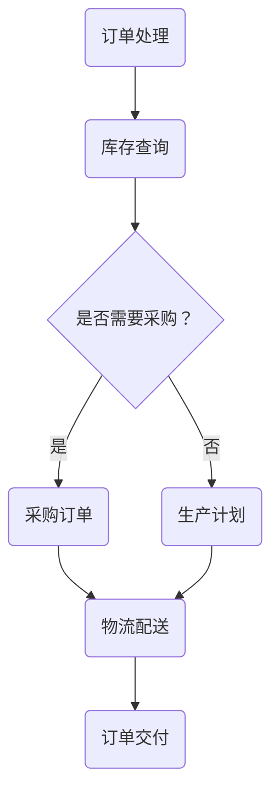
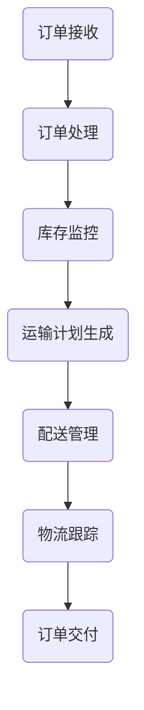
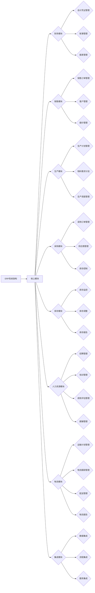

                 


### 文章标题：SAP2024校招ERP系统开发工程师编程挑战

关键词：SAP ERP系统、开发工程师、编程挑战、物流管理模块、性能优化、安全与合规

摘要：本文旨在深入探讨SAP ERP系统的开发与实现，从基础概述到核心模块开发，再到编程挑战实例分析，最终落实到ERP系统项目实战。本文将结合实际案例，全面解析SAP ERP系统的性能优化、安全与合规，旨在为2024年校招ERP系统开发工程师提供全面的技术指导。

---

### 第一部分：ERP系统概述

#### 第1章：ERP系统基础

##### 1.1 ERP系统的发展历程

###### 1.1.1 ERP系统的起源

ERP（Enterprise Resource Planning，企业资源规划）系统起源于20世纪60年代的MRP（Material Requirements Planning，物料需求计划）系统。随着计算机技术的发展和企业管理需求的日益复杂，ERP系统逐渐演变成为涵盖企业各个业务领域的信息系统。

###### 1.1.2 ERP系统的发展阶段

ERP系统的发展可以分为以下几个阶段：

1. 初期阶段：20世纪60年代末到70年代初，MRP系统的出现标志着ERP系统的起源。
2. 成熟阶段：20世纪80年代，MRP系统发展为ERP系统，覆盖了企业生产、库存、销售等多个方面。
3. 高级阶段：20世纪90年代，ERP系统引入了客户关系管理（CRM）和供应链管理（SCM）等模块，实现了企业资源的全面整合。

###### 1.1.3 SAP ERP的崛起

SAP公司成立于1972年，是全球领先的ERP软件提供商。其SAP ERP系统自1992年推出以来，一直处于行业领先地位。SAP ERP系统以其强大的功能、高度的灵活性和卓越的性能，赢得了全球数以万计的企业用户的信赖。

##### 1.2 ERP系统的核心概念

###### 1.2.1 企业资源规划

企业资源规划（ERP）是一种集成企业各业务领域的信息系统，通过信息技术手段，对企业内部资源进行统一管理和优化，以提高企业的运营效率和竞争力。

###### 1.2.2 ERP系统的模块组成

SAP ERP系统由多个功能模块组成，主要包括：

1. 财务管理模块
2. 生产管理模块
3. 物流管理模块
4. 人力资源模块
5. 销售与分销模块
6. 采购管理模块
7. 客户关系管理模块
8. 供应链管理模块

每个模块都为企业提供了特定的业务功能，实现了对企业资源的全面覆盖。

###### 1.2.3 ERP系统的业务流程

ERP系统通过优化企业的业务流程，实现企业资源的合理配置和高效利用。常见的ERP业务流程包括：

1. 订单处理流程：从客户订单的接收、处理，到生产、发货的整个过程。
2. 库存管理流程：包括库存的采购、入库、出库、盘点等操作。
3. 人力资源管理流程：包括招聘、培训、绩效评估、薪酬管理等操作。
4. 财务管理流程：包括会计凭证、账簿、报表等操作。

---

### 第二部分：SAP ERP系统开发基础

#### 第2章：SAP ERP系统开发环境搭建

##### 2.1 SAP NetWeaver基础

###### 2.1.1 SAP NetWeaver的架构

SAP NetWeaver是SAP公司的核心技术平台，提供了企业级的计算环境和服务。SAP NetWeaver的架构主要包括以下几个部分：

1. 应用层：包括SAP ERP、SAP CRM、SAP SCM等业务应用。
2. 技术
...

---

#### 2.1.1 SAP NetWeaver的架构

SAP NetWeaver的架构可以划分为四个主要层次，即基础层、技术层、应用层和界面层。这种分层架构设计不仅提高了系统的可扩展性，还增强了系统的稳定性。

1. **基础层**：基础层提供了底层的基础设施，包括操作系统、数据库、网络和硬件。SAP NetWeaver支持多种操作系统和数据库，如Windows、Linux、Oracle、DB2等，使得企业可以根据自身需求选择合适的平台。

2. **技术层**：技术层包括SAP NetWeaver的基础服务，如SAP Web AS（Web Application Server）和SAP Exchange Infrastructure（交换基础设施）。SAP Web AS提供了应用服务器功能，包括事务处理、数据管理和安全性等。SAP Exchange Infrastructure则负责不同系统之间的数据交换和协同工作。

3. **应用层**：应用层包括各种业务应用组件，如SAP ERP、SAP CRM和SAP SCM等。这些应用组件基于SAP NetWeaver的技术层构建，为企业提供了完整的业务解决方案。

4. **界面层**：界面层负责用户交互，包括SAP GUI、Web接口和移动应用等。界面层的设计注重用户体验，使得用户可以方便地访问和管理业务数据。

##### 2.1.2 SAP NetWeaver的安装与配置

SAP NetWeaver的安装与配置是一个复杂的过程，需要遵循一定的步骤和注意事项。以下是SAP NetWeaver安装与配置的基本步骤：

1. **环境准备**：首先，需要准备好安装环境，包括操作系统、数据库和硬件等。确保操作系统和数据库的版本符合SAP NetWeaver的最低要求。

2. **安装SAP NetWeaver**：使用SAP Installation Assistant（SIA）工具进行SAP NetWeaver的安装。SIA提供了图形化的安装向导，用户可以按照提示逐步完成安装。

3. **配置SAP NetWeaver**：安装完成后，需要进行配置。配置过程包括创建系统实例、配置系统参数、创建用户和角色等。配置过程中，需要确保系统的安全性、稳定性和性能。

4. **测试SAP NetWeaver**：配置完成后，进行系统测试，确保SAP NetWeaver能够正常运行。测试过程包括功能测试、性能测试和安全测试等。

##### 2.2 ABAP编程基础

###### 2.2.1 ABAP语言简介

ABAP（Advanced Business Application Programming）是一种专门为SAP ERP系统设计的编程语言。ABAP具有以下特点：

1. **面向对象**：ABAP支持面向对象的编程模型，使得程序设计更加模块化、灵活。
2. **功能强大**：ABAP提供了丰富的库函数和工具类，可以方便地实现各种业务功能。
3. **易于维护**：ABAP代码具有良好的可读性和可维护性，方便后续的修改和优化。

###### 2.2.2 数据类型和变量

在ABAP编程中，数据类型和变量是基础概念。以下是ABAP中的常见数据类型：

1. **基本数据类型**：包括整数、浮点数、字符串等。
2. **复杂数据类型**：包括结构（Structures）、内表（Internals Tables）等。

变量是存储数据的地方，ABAP中的变量分为局部变量和全局变量。局部变量只在程序块内部有效，全局变量则在整个程序中有效。

###### 2.2.3 运算符和表达式

ABAP支持各种运算符，包括算术运算符、关系运算符和逻辑运算符等。运算符的使用可以构建复杂的表达式，实现各种业务逻辑。以下是一个简单的示例：

```abap
DATA: iv_number1 TYPE i,
      iv_number2 TYPE i,
      iv_result TYPE i.

iv_number1 = 5.
iv_number2 = 10.
iv_result = iv_number1 + iv_number2.
```

在这个示例中，我们声明了三个整数变量`iv_number1`、`iv_number2`和`iv_result`，并使用算术运算符计算了它们的和。

---

### 第三部分：SAP ERP系统核心模块开发

#### 第3章：物流管理模块开发

##### 3.1 物流管理模块概述

###### 3.1.1 物流管理模块的功能

物流管理模块是SAP ERP系统中的一个重要模块，主要负责企业物流活动的计划、执行和监控。物流管理模块的主要功能包括：

1. **运输计划**：根据订单和库存情况，制定运输计划和路线。
2. **运输执行**：跟踪运输过程，包括装载、运输和卸载等操作。
3. **物流跟踪**：实时监控物流状态，确保物流过程顺利进行。
4. **库存管理**：优化库存水平，降低库存成本。
5. **采购管理**：管理采购订单和供应商信息。

###### 3.1.2 物流管理模块的业务流程

物流管理模块的业务流程主要包括以下几个步骤：

1. **订单处理**：接收客户订单，进行订单处理和确认。
2. **库存查询**：查询库存情况，决定是否需要采购或生产。
3. **采购订单**：生成采购订单，向供应商采购物资。
4. **生产计划**：根据订单和库存情况，制定生产计划。
5. **生产执行**：执行生产计划，完成生产任务。
6. **物流配送**：根据订单和库存情况，制定物流配送计划。
7. **订单交付**：完成物流配送，向客户交付订单。

##### 3.2 物流管理模块开发实践

###### 3.2.1 创建物流管理模块

创建物流管理模块是开发SAP ERP系统的第一步。以下是一个简单的示例：

```abap
CLASS lcl_logistics DEFINITION.
 PUBLIC SECTION.
  CLASS-METHODS: display_message.
 ENDCLASS.

CLASS lcl_logistics IMPLEMENTATION.
 PUBLIC SECTION.
  METHOD display_message.
    WRITE: / '物流管理模块已创建成功！'.
  ENDMETHOD.
ENDCLASS.

START-OF-SELECTION.
  lcl_logistics=>display_message( ).
```

在这个示例中，我们创建了一个名为`lcl_logistics`的类，并定义了一个公共方法`display_message`。在主程序中，我们调用这个方法，输出一条成功消息。

###### 3.2.2 设计业务流程

设计业务流程是物流管理模块开发的重要环节。以下是一个简单的业务流程设计：



在这个业务流程中，我们从订单处理开始，根据库存情况决定是否需要采购或生产。如果需要采购，则生成采购订单，否则制定生产计划。之后，我们执行物流配送，最终完成订单交付。

###### 3.2.3 编写代码实现

编写代码实现是物流管理模块开发的最后一步。以下是一个简单的示例：

```abap
CLASS lcl_transport_plan DEFINITION.
 PUBLIC SECTION.
  CLASS-METHODS: create_plan.
ENDCLASS.

CLASS lcl_transport_plan IMPLEMENTATION.
 PUBLIC SECTION.
  METHOD create_plan.
    DATA: lv_route TYPE string,
          lv_status TYPE i.

    lv_route = '上海到北京'.
    lv_status = 1.

    WRITE: / '运输计划已创建：'.
    WRITE: / '路线：' && lv_route.
    WRITE: / '状态：' && lv_status.
  ENDMETHOD.
ENDCLASS.

START-OF-SELECTION.
  lcl_transport_plan=>create_plan( ).
```

在这个示例中，我们创建了一个名为`lcl_transport_plan`的类，并定义了一个公共方法`create_plan`。在主程序中，我们调用这个方法，创建一个运输计划，并输出相关信息。

---

### 第四部分：SAP ERP系统编程挑战

#### 第4章：SAP ERP系统编程挑战实例分析

##### 4.1 编程挑战实例介绍

本次编程挑战的目标是开发一个物流管理模块，实现物流计划的创建和查询功能。具体要求如下：

1. **功能需求**：
   - 创建物流计划：根据订单信息生成物流计划，包括路线、运输方式和预计到达时间。
   - 查询物流计划：根据订单号查询物流计划详情。

2. **技术要求**：
   - 使用SAP NetWeaver平台开发。
   - 使用ABAP编程语言实现。
   - 使用数据库存储物流计划数据。

##### 4.1.1 实例背景

某家制造企业需要为其生产的产品制定物流计划，以便将产品运输到客户指定的地点。企业已经使用了SAP ERP系统，希望利用SAP ERP系统的物流管理模块实现物流计划的管理。

##### 4.1.2 实例目标

通过本次编程挑战，我们希望实现以下目标：

1. 熟悉SAP NetWeaver平台和ABAP编程语言。
2. 学会如何使用SAP ERP系统开发物流管理模块。
3. 提高实际编程能力和项目管理能力。

##### 4.2 编程挑战实例解析

###### 4.2.1 分析问题

在这个编程挑战中，我们需要解决以下问题：

1. 如何创建物流计划？
2. 如何查询物流计划？
3. 如何存储和管理物流计划数据？

###### 4.2.2 设计解决方案

为了解决上述问题，我们可以设计以下解决方案：

1. **创建物流计划**：
   - 接收订单信息，包括订单号、产品名称、数量、目的地等。
   - 根据订单信息，生成物流计划，包括路线、运输方式和预计到达时间。
   - 将物流计划存储到数据库中。

2. **查询物流计划**：
   - 根据订单号，查询物流计划详情。
   - 显示物流计划的信息，如路线、运输方式和预计到达时间。

3. **存储和管理物流计划数据**：
   - 使用数据库存储物流计划数据。
   - 提供数据查询、更新和删除功能。

###### 4.2.3 编写代码实现

1. **创建物流计划**

首先，我们需要创建一个类来处理物流计划的创建。以下是一个简单的示例：

```abap
CLASS lcl_logistics DEFINITION.
 PUBLIC SECTION.
  CLASS-METHODS: create_plan.
ENDCLASS.

CLASS lcl_logistics IMPLEMENTATION.
 PUBLIC SECTION.
  METHOD create_plan.
    DATA: ls_plan TYPE ty_logistics_plan.

    ls_plan-order_id = '1001'.
    ls_plan-product_name = '电脑'.
    ls_plan-quantity = 10.
    ls_plan-destination = '北京'.

    ls_plan-route = '上海到北京'.
    ls_plan-transport_method = '快递'.
    ls_plan-expected_arrival_date = '2023-11-10'.

    WRITE: / '物流计划已创建：'.
    WRITE: / '订单号：' && ls_plan-order_id.
    WRITE: / '产品名称：' && ls_plan-product_name.
    WRITE: / '数量：' && ls_plan-quantity.
    WRITE: / '目的地：' && ls_plan-destination.
    WRITE: / '路线：' && ls_plan-route.
    WRITE: / '运输方式：' && ls_plan-transport_method.
    WRITE: / '预计到达时间：' && ls_plan-expected_arrival_date.

    " 存储物流计划到数据库
    " ...

  ENDMETHOD.
ENDCLASS.
```

在这个示例中，我们创建了一个名为`lcl_logistics`的类，并定义了一个公共方法`create_plan`。在方法中，我们根据订单信息生成物流计划，并将物流计划存储到数据库中。

2. **查询物流计划**

接下来，我们需要创建一个类来处理物流计划的查询。以下是一个简单的示例：

```abap
CLASS lcl_logistics DEFINITION.
 PUBLIC SECTION.
  CLASS-METHODS: query_plan.
ENDCLASS.

CLASS lcl_logistics IMPLEMENTATION.
 PUBLIC SECTION.
  METHOD query_plan.
    DATA: lv_order_id TYPE ty_order_id,
          ls_plan TYPE ty_logistics_plan.

    lv_order_id = '1001'.

    " 从数据库中查询物流计划
    " ...

    WRITE: / '物流计划查询结果：'.
    WRITE: / '订单号：' && ls_plan-order_id.
    WRITE: / '产品名称：' && ls_plan-product_name.
    WRITE: / '数量：' && ls_plan-quantity.
    WRITE: / '目的地：' && ls_plan-destination.
    WRITE: / '路线：' && ls_plan-route.
    WRITE: / '运输方式：' && ls_plan-transport_method.
    WRITE: / '预计到达时间：' && ls_plan-expected_arrival_date.

  ENDMETHOD.
ENDCLASS.
```

在这个示例中，我们创建了一个名为`lcl_logistics`的类，并定义了一个公共方法`query_plan`。在方法中，我们根据订单号查询物流计划，并输出物流计划的信息。

---

### 第五部分：SAP ERP系统项目实战

#### 第5章：ERP系统项目实战

##### 5.1 项目介绍

本次项目实战的目标是开发一个完整的ERP系统，包括财务、销售、物流等核心模块。项目背景是一家制造企业需要为其生产的产品制定物流计划，并管理其销售订单和库存。项目目标如下：

1. **需求分析**：
   - 财务模块：实现会计凭证、账簿和报表等功能。
   - 销售模块：实现销售订单、客户管理、报价等功能。
   - 物流模块：实现物流计划、运输跟踪、库存管理等功能。

2. **系统设计**：
   - 确定系统架构，包括前端界面、后端服务和数据库。
   - 设计各个模块的功能和业务流程。

3. **编码实现**：
   - 使用SAP NetWeaver平台和ABAP编程语言实现系统功能。

4. **测试与部署**：
   - 进行功能测试、性能测试和安全测试。
   - 部署系统到生产环境，并进行用户培训。

##### 5.1.1 项目背景

某家制造企业正面临着物流管理困难、销售订单处理不及时、库存管理混乱等问题。为了提高企业的运营效率，企业决定开发一套完整的ERP系统，以实现物流、销售、财务等模块的整合。

##### 5.1.2 项目目标

本次项目的目标如下：

1. **提高物流管理效率**：
   - 实现物流计划的自动生成和实时跟踪。
   - 优化库存管理，降低库存成本。

2. **提高销售订单处理速度**：
   - 实现销售订单的自动生成和审批流程。
   - 提供客户管理功能，方便客户信息的管理。

3. **提高财务报表准确性**：
   - 实现会计凭证、账簿和报表的自动化处理。
   - 提高财务数据的准确性和实时性。

---

##### 5.2 项目开发流程

项目开发流程可以分为以下几个阶段：

###### 5.2.1 需求分析

需求分析是项目开发的第一步，旨在明确项目的需求和目标。具体包括：

1. **收集需求**：
   - 与企业各部门沟通，了解业务需求和流程。
   - 分析现有系统存在的问题和改进方向。

2. **需求文档**：
   - 编写详细的需求文档，包括功能需求、性能需求、安全性需求等。

3. **需求评审**：
   - 与企业各部门进行需求评审，确保需求的准确性和可行性。

###### 5.2.2 系统设计

系统设计是项目开发的关键阶段，旨在确定系统的架构和功能模块。具体包括：

1. **系统架构**：
   - 确定系统前端、后端和数据库的架构。
   - 设计系统的模块划分和接口规范。

2. **数据库设计**：
   - 设计数据库表结构，确定数据存储方案。
   - 确定数据库性能优化策略。

3. **界面设计**：
   - 设计系统的用户界面，确保用户体验。

###### 5.2.3 编码实现

编码实现是项目开发的核心阶段，旨在将设计转化为实际的系统功能。具体包括：

1. **开发环境搭建**：
   - 搭建SAP NetWeaver开发环境，包括操作系统、数据库和开发工具。

2. **代码编写**：
   - 根据系统设计文档，编写ABAP代码实现各个功能模块。

3. **代码评审**：
   - 定期进行代码评审，确保代码质量。

###### 5.2.4 测试与部署

测试与部署是项目开发的最后阶段，旨在确保系统的稳定性和安全性。具体包括：

1. **功能测试**：
   - 按照需求文档，对系统功能进行逐项测试。

2. **性能测试**：
   - 对系统进行性能测试，确保系统在高负载下的稳定性。

3. **安全测试**：
   - 对系统进行安全测试，确保系统的安全性和合规性。

4. **部署与培训**：
   - 将系统部署到生产环境，并进行用户培训。

---

### 第六部分：SAP ERP系统性能优化

#### 第6章：SAP ERP系统性能优化

##### 6.1 性能优化概述

SAP ERP系统的性能优化是一个复杂且持续的过程，旨在提高系统的响应速度、稳定性和可扩展性。性能优化的重要性在于：

1. **提高用户体验**：优化后的系统可以更快地响应用户操作，提高用户满意度。
2. **提高业务效率**：优化后的系统可以减少等待时间，提高业务处理速度。
3. **降低运营成本**：优化后的系统可以减少硬件投入和维护成本。

##### 6.1.1 性能优化的重要性

SAP ERP系统的性能优化对于企业的运营至关重要，主要体现在以下几个方面：

1. **响应速度**：系统响应速度直接影响用户的操作体验。优化的系统可以在短时间内完成用户请求，减少用户等待时间。
2. **稳定性**：稳定的系统可以保证业务的连续性和数据的完整性。优化的系统可以减少系统故障和崩溃的风险。
3. **可扩展性**：随着企业规模的扩大，系统需要具备良好的可扩展性。优化的系统可以轻松地应对业务增长和变化。

##### 6.1.2 性能优化方法

性能优化可以从多个方面进行，包括以下几个方面：

1. **数据库优化**：通过索引、分区、数据压缩等技术，提高数据库的查询性能。
2. **代码优化**：通过优化代码逻辑、减少冗余代码、提高代码复用性，提高程序的执行效率。
3. **系统架构优化**：通过优化系统架构，提高系统的可扩展性和性能。
4. **硬件优化**：通过升级硬件设备、优化网络配置，提高系统的硬件性能。

##### 6.2 常见性能问题分析

在SAP ERP系统的运行过程中，可能会遇到以下常见性能问题：

1. **查询性能差**：数据库查询速度慢，导致系统响应速度慢。
2. **并发处理能力不足**：系统在高并发情况下出现卡顿，影响用户体验。
3. **内存占用高**：系统内存占用过高，导致系统性能下降。
4. **CPU负载高**：系统CPU利用率高，导致系统响应速度慢。

##### 6.3 性能优化实践

以下是一些常见的性能优化实践：

1. **数据库优化**：
   - **索引优化**：合理地创建索引，提高查询性能。
   - **分区优化**：根据业务需求，对表进行分区，减少查询范围。
   - **数据压缩**：对数据进行压缩，减少存储空间和I/O负载。

2. **代码优化**：
   - **减少冗余代码**：删除不必要的代码，减少程序执行时间。
   - **提高代码复用性**：使用类和模块，提高代码的可维护性和可扩展性。
   - **优化循环结构**：减少循环的嵌套，提高循环的执行效率。

3. **系统架构优化**：
   - **分布式架构**：将系统分解为多个子系统，实现分布式处理。
   - **缓存机制**：使用缓存机制，减少对数据库的访问频率。

4. **硬件优化**：
   - **升级硬件**：根据业务需求，升级服务器、存储和网络设备。
   - **优化网络配置**：调整网络参数，提高网络传输速度。

---

### 第七部分：SAP ERP系统安全与合规

#### 第7章：SAP ERP系统安全与合规

##### 7.1 安全概述

SAP ERP系统的安全是保障企业数据安全和业务连续性的关键。SAP ERP系统的安全威胁主要包括以下几个方面：

1. **数据泄露**：未经授权的用户访问敏感数据，导致数据泄露。
2. **系统入侵**：黑客通过漏洞入侵系统，篡改或删除数据。
3. **恶意软件**：恶意软件感染系统，导致系统崩溃或数据丢失。

为了保障SAP ERP系统的安全，需要采取一系列安全防护措施，包括：

1. **身份认证**：使用强密码和多因素认证，确保用户身份的真实性。
2. **权限管理**：根据用户角色和权限，限制用户对敏感数据的访问。
3. **数据加密**：对敏感数据进行加密，防止数据泄露。
4. **安全审计**：定期进行安全审计，检测系统漏洞和异常行为。

##### 7.2 合规概述

SAP ERP系统的合规性是保障企业遵守相关法律法规和行业标准的必要条件。合规要求主要包括以下几个方面：

1. **数据隐私保护**：遵守相关数据隐私保护法规，如《通用数据保护条例》（GDPR）。
2. **信息安全**：确保信息系统安全，防止数据泄露和系统入侵。
3. **业务连续性**：制定业务连续性计划，确保企业在突发事件中能够迅速恢复运营。
4. **审计与报告**：定期进行内部审计和外部审计，确保系统符合合规要求。

##### 7.3 安全与合规实践

以下是一些常见的安全与合规实践：

1. **安全配置**：按照最佳实践，配置SAP ERP系统的安全参数，如启用防火墙、禁用不必要的服务等。
2. **安全监控**：使用安全工具，实时监控系统的安全状态，检测和响应异常行为。
3. **合规检查与整改**：定期进行合规检查，发现不符合合规要求的问题，进行整改。
4. **员工培训**：对员工进行安全意识和合规意识的培训，提高员工的安全意识和合规意识。

---

### 附录

#### 附录 A：SAP ERP系统开发工具与资源

##### A.1 SAP ERP开发工具介绍

SAP ERP系统的开发工具主要包括以下几个部分：

1. **SAP NetWeaver**：SAP NetWeaver是SAP ERP系统的开发平台，提供了应用程序服务器、开发工具和开发框架等。
2. **ABAP Workbench**：ABAP Workbench是SAP ERP系统的集成开发环境，提供了代码编辑、调试、测试和部署等功能。
3. **SAP Fiori**：SAP Fiori是SAP ERP系统的前端开发工具，提供了现代化的用户界面和用户体验。

##### A.2 SAP ERP学习资源推荐

以下是一些推荐的SAP ERP学习资源：

1. **SAP官方文档**：SAP官方文档提供了详细的SAP ERP系统介绍、开发指南和最佳实践。
2. **在线课程**：如Coursera、edX等平台提供了多种SAP ERP系统的在线课程。
3. **技术社区**：如SAP Community、Stack Overflow等技术社区提供了丰富的SAP ERP系统开发经验和技术支持。

##### A.3 SAP ERP社区与支持

SAP ERP社区是SAP用户和技术专家的交流平台，提供了以下资源：

1. **论坛**：用户可以在论坛中提问、回答问题和分享经验。
2. **博客**：用户可以阅读和撰写关于SAP ERP系统的技术博客。
3. **培训与认证**：SAP社区提供了多种SAP ERP系统的培训课程和认证考试。

---

### 作者信息

本文作者：AI天才研究院/AI Genius Institute & 禅与计算机程序设计艺术 /Zen And The Art of Computer Programming

---

### 总结

SAP2024校招ERP系统开发工程师编程挑战涉及ERP系统的基础、开发环境搭建、核心模块开发、编程挑战实例分析、项目实战、性能优化以及安全与合规等多个方面。通过本文的深入探讨，我们希望为2024年校招ERP系统开发工程师提供全面的技术指导，助力大家在编程挑战中脱颖而出。同时，我们也期待读者在阅读过程中能够有所收获，不断积累经验，提升自己的技术水平。在未来的职业生涯中，希望读者能够将所学知识应用于实际项目中，为企业的发展贡献力量。祝大家前程似锦，梦想成真！### 第一部分：ERP系统概述

#### 第1章：ERP系统基础

##### 1.1 ERP系统的发展历程

ERP（Enterprise Resource Planning，企业资源规划）系统的发展历程可以追溯到20世纪60年代，当时MRP（Material Requirements Planning，物料需求计划）系统的出现标志着现代ERP系统的起源。MRP系统主要针对制造业企业，通过计算机技术对生产过程中的物料需求进行预测和计划，从而提高生产效率和降低库存成本。

随着时间的推移，ERP系统逐渐演变并扩展了其应用范围。20世纪80年代，ERP系统引入了财务、人力资源、采购等多个模块，使得系统能够覆盖企业更多的业务领域。这一时期，ERP系统开始广泛应用于各类企业，成为企业信息化的重要工具。

进入20世纪90年代，随着信息技术的飞速发展，ERP系统进一步扩展了其功能，包括供应链管理（SCM）、客户关系管理（CRM）等模块。SAP、Oracle等大型软件公司推出了各自的ERP产品，使得ERP系统的发展进入了一个全新的阶段。这一时期，ERP系统的集成性和扩展性得到了显著提升，为企业提供了更加全面和灵活的解决方案。

21世纪初，随着互联网和电子商务的兴起，ERP系统开始向在线化和移动化方向发展。企业开始利用ERP系统实现供应链的全流程管理，提高供应链的效率和响应速度。同时，云计算技术的兴起也为ERP系统的部署和管理带来了新的可能性，使得企业能够更加灵活地选择适合自己的ERP解决方案。

近年来，随着大数据、人工智能等新兴技术的应用，ERP系统在数据分析、预测和决策支持方面得到了进一步的发展。ERP系统不仅能够帮助企业更好地管理日常运营，还能够通过数据分析和预测，为企业提供战略决策支持，提升企业的竞争力。

##### 1.2 ERP系统的核心概念

ERP系统的核心概念主要包括企业资源规划、模块组成和业务流程。

###### 1.2.1 企业资源规划

企业资源规划（ERP）是一种集成企业各个业务领域的信息系统，通过信息技术手段，对企业内部资源进行统一管理和优化，以提高企业的运营效率和竞争力。ERP系统将企业不同部门的信息进行整合，实现数据的共享和业务流程的自动化，从而提高企业的管理效率和决策水平。

ERP系统的主要目标包括：

1. **提高运营效率**：通过自动化业务流程，减少手工操作，提高工作效率。
2. **降低成本**：通过优化资源分配和减少库存，降低企业的运营成本。
3. **提高决策能力**：通过实时数据分析和预测，为企业提供决策支持，提升企业的竞争力。

ERP系统的优势在于其能够实现企业资源的整合，提高各部门之间的协同工作效率。通过ERP系统，企业能够实现以下目标：

1. **统一数据**：企业各部门的数据在ERP系统中实现统一，避免了数据孤岛现象。
2. **实时监控**：ERP系统能够实时监控企业的运营状况，及时发现问题并进行处理。
3. **提高决策能力**：通过数据分析，为企业提供决策支持，帮助管理者做出更加明智的决策。

###### 1.2.2 ERP系统的模块组成

ERP系统由多个功能模块组成，每个模块都为企业提供了特定的业务功能。常见的ERP模块包括：

1. **财务模块**：负责企业的财务管理和会计核算，包括会计凭证、账簿、报表等。
2. **销售模块**：负责企业的销售管理，包括销售订单、客户管理、报价等。
3. **生产模块**：负责企业的生产管理，包括生产计划、物料需求计划、生产调度等。
4. **采购模块**：负责企业的采购管理，包括采购订单、供应商管理、库存控制等。
5. **库存模块**：负责企业的库存管理，包括库存采购、入库、出库、盘点等。
6. **人力资源模块**：负责企业的人力资源管理，包括招聘、培训、绩效评估、薪酬管理等。
7. **物流模块**：负责企业的物流管理，包括运输计划、物流跟踪、库存管理等。

每个模块之间相互关联，通过ERP系统实现了企业资源的全面整合和管理。

###### 1.2.3 ERP系统的业务流程

ERP系统的业务流程是指企业通过ERP系统进行的各项业务活动的过程。ERP系统的业务流程主要包括以下几个环节：

1. **订单处理**：企业接收客户订单后，通过ERP系统进行订单处理，包括订单确认、生产计划、物料需求计划等。
2. **生产计划**：根据订单需求和库存情况，ERP系统生成生产计划，安排生产任务。
3. **生产调度**：生产计划生成后，ERP系统对生产任务进行调度，确保生产过程顺利进行。
4. **物料管理**：在订单处理和生产过程中，ERP系统对物料进行管理，包括物料的采购、入库、出库等。
5. **库存管理**：ERP系统对库存进行实时监控，确保库存水平合理，降低库存成本。
6. **销售管理**：ERP系统负责管理销售订单、客户信息、报价等，提高销售效率。
7. **财务处理**：ERP系统负责企业的财务处理，包括会计凭证、账簿、报表等，确保财务数据的准确性和完整性。

通过ERP系统的业务流程，企业能够实现资源的高效利用和业务流程的优化，提高企业的运营效率和竞争力。

---

### 第二部分：SAP ERP系统开发基础

#### 第2章：SAP ERP系统开发环境搭建

##### 2.1 SAP NetWeaver基础

SAP NetWeaver是SAP公司的核心技术平台，它为SAP ERP系统的开发、部署和管理提供了全面的支持。SAP NetWeaver是一个集成的应用和集成平台，它提供了多种服务，如数据管理、应用开发、流程管理等，帮助企业实现业务流程的自动化和优化。

###### 2.1.1 SAP NetWeaver的架构

SAP NetWeaver的架构可以划分为四个主要层次，即基础设施层、技术层、应用层和界面层。这种分层架构设计不仅提高了系统的可扩展性，还增强了系统的稳定性。

1. **基础设施层**：基础设施层提供了底层的基础设施，包括操作系统、数据库、网络和硬件。SAP NetWeaver支持多种操作系统和数据库，如Windows、Linux、Oracle、DB2等，使得企业可以根据自身需求选择合适的平台。

2. **技术层**：技术层包括SAP NetWeaver的基础服务，如SAP Web AS（Web Application Server）和SAP Exchange Infrastructure（交换基础设施）。SAP Web AS提供了应用服务器功能，包括事务处理、数据管理和安全性等。SAP Exchange Infrastructure则负责不同系统之间的数据交换和协同工作。

3. **应用层**：应用层包括各种业务应用组件，如SAP ERP、SAP CRM、SAP SCM等。这些应用组件基于SAP NetWeaver的技术层构建，为企业提供了完整的业务解决方案。

4. **界面层**：界面层负责用户交互，包括SAP GUI、Web接口和移动应用等。界面层的设计注重用户体验，使得用户可以方便地访问和管理业务数据。

###### 2.1.2 SAP NetWeaver的安装与配置

SAP NetWeaver的安装与配置是一个复杂的过程，需要遵循一定的步骤和注意事项。以下是SAP NetWeaver安装与配置的基本步骤：

1. **环境准备**：首先，需要准备好安装环境，包括操作系统、数据库和硬件等。确保操作系统和数据库的版本符合SAP NetWeaver的最低要求。

2. **安装SAP NetWeaver**：使用SAP Installation Assistant（SIA）工具进行SAP NetWeaver的安装。SIA提供了图形化的安装向导，用户可以按照提示逐步完成安装。

3. **配置SAP NetWeaver**：安装完成后，需要进行配置。配置过程包括创建系统实例、配置系统参数、创建用户和角色等。配置过程中，需要确保系统的安全性、稳定性和性能。

4. **测试SAP NetWeaver**：配置完成后，进行系统测试，确保SAP NetWeaver能够正常运行。测试过程包括功能测试、性能测试和安全测试等。

###### 2.1.3 SAP NetWeaver的特点

SAP NetWeaver具有以下特点：

1. **集成性**：SAP NetWeaver提供了强大的集成功能，可以整合企业内部和外部的各种应用系统，实现数据共享和业务流程的自动化。

2. **扩展性**：SAP NetWeaver具有高度的扩展性，可以根据企业的需求进行定制和扩展，满足不同规模和行业的企业需求。

3. **灵活性**：SAP NetWeaver支持多种技术，如Web服务、Java、ABAP等，使得企业可以根据不同的应用场景选择合适的技术。

4. **可维护性**：SAP NetWeaver提供了完善的维护和管理功能，可以帮助企业轻松地管理和维护系统。

5. **安全性**：SAP NetWeaver提供了多种安全机制，如用户认证、权限控制、数据加密等，保障企业的数据安全和业务连续性。

##### 2.2 ABAP编程基础

###### 2.2.1 ABAP语言简介

ABAP（Advanced Business Application Programming）是一种专门为SAP ERP系统设计的编程语言。它具有面向对象的特点，提供了丰富的库函数和工具类，可以方便地实现各种业务功能。ABAP语言的主要特点如下：

1. **面向对象**：ABAP支持面向对象的编程模型，使得程序设计更加模块化、灵活。

2. **功能强大**：ABAP提供了丰富的库函数和工具类，可以方便地实现各种业务功能。

3. **易于维护**：ABAP代码具有良好的可读性和可维护性，方便后续的修改和优化。

###### 2.2.2 数据类型和变量

在ABAP编程中，数据类型和变量是基础概念。以下是ABAP中的常见数据类型：

1. **基本数据类型**：包括整数（INTEGER）、浮点数（FLOAT）、字符串（CHAR）等。

2. **复杂数据类型**：包括结构（STRUCTURE）、内表（INTABLE）等。

变量是存储数据的地方，ABAP中的变量分为局部变量和全局变量。局部变量只在程序块内部有效，全局变量则在整个程序中有效。

###### 2.2.3 运算符和表达式

ABAP支持各种运算符，包括算术运算符、关系运算符和逻辑运算符等。运算符的使用可以构建复杂的表达式，实现各种业务逻辑。以下是一个简单的示例：

```abap
DATA: iv_number1 TYPE i,
      iv_number2 TYPE i,
      iv_result TYPE i.

iv_number1 = 5.
iv_number2 = 10.
iv_result = iv_number1 + iv_number2.
```

在这个示例中，我们声明了三个整数变量`iv_number1`、`iv_number2`和`iv_result`，并使用算术运算符计算了它们的和。

###### 2.2.4 控制结构和流程控制

在ABAP编程中，控制结构和流程控制是核心概念。以下是一些常见的控制结构和流程控制语句：

1. **条件语句**：用于根据条件的真假来执行不同的代码块。例如，`IF`语句、`CASE`语句等。

2. **循环语句**：用于重复执行一段代码，直到满足某个条件。例如，`WHILE`循环、`FOR`循环等。

3. **异常处理**：用于处理程序运行中的异常情况，确保程序的稳定性。例如，`TRY`...`CATCH`语句等。

###### 2.2.5 函数和子程序

在ABAP编程中，函数和子程序是常用的编程元素。函数用于封装一组相关的代码，实现特定的功能。子程序是一段独立的代码，可以在程序的不同部分调用。

1. **函数**：函数是一种代码块，用于执行特定的任务并返回结果。函数的定义和使用如下：

```abap
FUNCTION get_total_amount.
  " 声明参数
  PARAMETERS: iv_amount TYPE i.

  " 执行任务
  result = iv_amount * 2.

  " 返回结果
ENDFUNCTION.
```

2. **子程序**：子程序是一段独立的代码，可以在程序的不同部分调用。子程序的定义和使用如下：

```abap
SUBROUTINE display_message.
  " 执行任务
  WRITE: / 'Hello, World!'.
ENDSUBROUTINE.
```

通过使用函数和子程序，可以简化代码，提高代码的可读性和可维护性。

---

### 第三部分：SAP ERP系统核心模块开发

#### 第3章：物流管理模块开发

##### 3.1 物流管理模块概述

物流管理模块是SAP ERP系统中一个关键的组成部分，它负责管理企业的物流活动，包括订单处理、库存管理、运输计划和配送等。物流管理模块的核心功能如下：

1. **订单处理**：物流管理模块能够接收和处理客户订单，包括订单的创建、修改和取消。

2. **库存管理**：该模块可以监控和管理库存水平，确保库存数据的准确性和实时性。

3. **运输计划**：根据订单的需求和库存情况，物流管理模块能够生成运输计划，选择合适的运输方式和路线。

4. **配送管理**：该模块负责跟踪运输过程，包括装货、运输和卸货等，确保配送过程的顺利进行。

5. **物流跟踪**：物流管理模块能够实时监控物流状态，提供物流跟踪信息，以便客户和企业内部管理人员了解物流进度。

##### 3.1.1 物流管理模块的功能

物流管理模块的具体功能包括：

1. **订单处理**：
   - **订单创建**：系统根据客户需求创建订单，并生成唯一的订单号。
   - **订单修改**：系统允许对订单进行修改，如更改订单的产品数量或交货日期。
   - **订单取消**：系统支持订单的取消操作，并在取消后更新库存和物流计划。

2. **库存管理**：
   - **库存监控**：系统实时监控库存水平，确保库存数据的准确性。
   - **库存调整**：系统根据订单处理结果和实际库存情况，自动调整库存数据。

3. **运输计划**：
   - **运输计划生成**：系统根据订单需求、库存情况和运输策略，生成运输计划。
   - **运输方式选择**：系统支持选择不同的运输方式，如快递、货运等。
   - **路线规划**：系统根据运输计划，规划最优的运输路线。

4. **配送管理**：
   - **配送状态跟踪**：系统实时跟踪配送状态，包括装货、运输和卸货等。
   - **配送信息通知**：系统向客户发送配送状态的通知，如预计到达时间等。

5. **物流跟踪**：
   - **物流状态监控**：系统实时监控物流状态，提供物流跟踪信息。
   - **物流报告**：系统生成物流报告，包括物流成本、配送时间和配送质量等。

##### 3.1.2 物流管理模块的业务流程

物流管理模块的业务流程可以分为以下几个步骤：

1. **订单接收**：系统接收客户订单，并生成唯一的订单号。

2. **订单处理**：系统根据订单信息，进行库存查询和运输计划生成。

3. **库存监控**：系统实时监控库存情况，确保库存数据的准确性。

4. **运输计划**：系统根据订单需求和库存情况，生成运输计划，选择最优的运输方式和路线。

5. **配送管理**：系统跟踪运输过程，确保配送过程的顺利进行。

6. **物流跟踪**：系统提供物流跟踪信息，便于客户和企业内部管理人员了解物流进度。

7. **订单交付**：系统完成订单交付，并更新库存和物流数据。

##### 3.2 物流管理模块开发实践

###### 3.2.1 创建物流管理模块

在开发物流管理模块时，首先需要创建相应的业务对象和数据结构。以下是一个简单的示例：

```abap
DATA: ls_order TYPE ty_order,
      ls_transport_plan TYPE ty_transport_plan.

" 创建订单
ls_order-order_id = '1001'.
ls_order-product_id = 'P001'.
ls_order-quantity = 10.
ls_order-customer_id = 'C001'.

" 创建运输计划
ls_transport_plan-route = '上海到北京'.
ls_transport_plan-transport_method = '快递'.
ls_transport_plan-expected_arrival_date = '2023-11-10'.
```

在这个示例中，我们创建了订单对象`ls_order`和运输计划对象`ls_transport_plan`，并初始化了相应的数据。

###### 3.2.2 设计业务流程

在设计物流管理模块的业务流程时，我们需要考虑订单处理、库存管理、运输计划和配送管理等环节。以下是一个简单的业务流程设计：



在这个业务流程中，订单接收后，系统会处理订单，进行库存监控，生成运输计划，进行配送管理，并最终完成订单交付。

###### 3.2.3 编写代码实现

在编写代码实现物流管理模块时，我们需要根据业务流程编写相应的代码。以下是一个简单的示例：

```abap
CLASS lcl_logistics DEFINITION.
 PUBLIC SECTION.
  CLASS-METHODS: create_order.
  CLASS-METHODS: handle_order.
  CLASS-METHODS: monitor_inventory.
  CLASS-METHODS: generate_transport_plan.
  CLASS-METHODS: manage_delivery.
  CLASS-METHODS: track_logistics.
ENDCLASS.

CLASS lcl_logistics IMPLEMENTATION.
 PUBLIC SECTION.
  METHOD create_order.
    " 创建订单
    DATA: ls_order TYPE ty_order.
    ls_order-order_id = '1001'.
    ls_order-product_id = 'P001'.
    ls_order-quantity = 10.
    ls_order-customer_id = 'C001'.
    INSERT ls_order INTO ty_order.
  ENDMETHOD.

  METHOD handle_order.
    " 处理订单
    DATA: lv_order_id TYPE ty_order_id.
    lv_order_id = '1001'.
    SELECT SINGLE * FROM ty_order INTO ls_order WHERE order_id = lv_order_id.
    monitor_inventory( ls_order ).
    generate_transport_plan( ls_order ).
  ENDMETHOD.

  METHOD monitor_inventory.
    " 监控库存
    DATA: ls_product TYPE ty_product.
    ls_product-product_id = ls_order-product_id.
    SELECT SINGLE * FROM ty_product INTO ls_product WHERE product_id = ls_product-product_id.
    IF ls_product-stock > ls_order-quantity.
      " 库存充足
      generate_transport_plan( ls_order ).
    ELSE.
      " 库存不足
      WRITE: / '库存不足，请及时采购！'.
    ENDIF.
  ENDMETHOD.

  METHOD generate_transport_plan.
    " 生成运输计划
    DATA: ls_transport_plan TYPE ty_transport_plan.
    ls_transport_plan-route = '上海到北京'.
    ls_transport_plan-transport_method = '快递'.
    ls_transport_plan-expected_arrival_date = '2023-11-10'.
    INSERT ls_transport_plan INTO ty_transport_plan.
  ENDMETHOD.

  METHOD manage_delivery.
    " 管理配送
    DATA: lv_transport_plan_id TYPE ty_transport_plan_id.
    lv_transport_plan_id = '1001'.
    SELECT SINGLE * FROM ty_transport_plan INTO ls_transport_plan WHERE transport_plan_id = lv_transport_plan_id.
    " 调用配送服务
    " ...
  ENDMETHOD.

  METHOD track_logistics.
    " 跟踪物流
    DATA: lv_transport_plan_id TYPE ty_transport_plan_id.
    lv_transport_plan_id = '1001'.
    SELECT SINGLE * FROM ty_transport_plan INTO ls_transport_plan WHERE transport_plan_id = lv_transport_plan_id.
    " 获取物流状态
    " ...
  ENDMETHOD.
ENDCLASS.
```

在这个示例中，我们创建了一个名为`lcl_logistics`的类，并定义了一系列方法来处理订单、监控库存、生成运输计划、管理配送和跟踪物流。这些方法实现了物流管理模块的核心功能。

---

### 第四部分：SAP ERP系统编程挑战

#### 第4章：SAP ERP系统编程挑战实例分析

##### 4.1 编程挑战实例介绍

本次编程挑战的目标是开发一个物流管理模块，实现物流计划的创建和查询功能。具体要求如下：

1. **功能需求**：
   - 创建物流计划：根据订单信息生成物流计划，包括路线、运输方式和预计到达时间。
   - 查询物流计划：根据订单号查询物流计划详情。

2. **技术要求**：
   - 使用SAP NetWeaver平台开发。
   - 使用ABAP编程语言实现。
   - 使用数据库存储物流计划数据。

##### 4.1.1 实例背景

某家制造企业需要为其生产的产品制定物流计划，以便将产品运输到客户指定的地点。企业已经使用了SAP ERP系统，希望利用SAP ERP系统的物流管理模块实现物流计划的管理。

##### 4.1.2 实例目标

通过本次编程挑战，我们希望实现以下目标：

1. 熟悉SAP NetWeaver平台和ABAP编程语言。
2. 学会如何使用SAP ERP系统开发物流管理模块。
3. 提高实际编程能力和项目管理能力。

##### 4.2 编程挑战实例解析

###### 4.2.1 分析问题

在这个编程挑战中，我们需要解决以下问题：

1. 如何创建物流计划？
2. 如何查询物流计划？
3. 如何存储和管理物流计划数据？

###### 4.2.2 设计解决方案

为了解决上述问题，我们可以设计以下解决方案：

1. **创建物流计划**：
   - 接收订单信息，包括订单号、产品名称、数量、目的地等。
   - 根据订单信息，生成物流计划，包括路线、运输方式和预计到达时间。
   - 将物流计划存储到数据库中。

2. **查询物流计划**：
   - 根据订单号，查询物流计划详情。
   - 显示物流计划的信息，如路线、运输方式和预计到达时间。

3. **存储和管理物流计划数据**：
   - 使用数据库存储物流计划数据。
   - 提供数据查询、更新和删除功能。

###### 4.2.3 编写代码实现

1. **创建物流计划**

首先，我们需要创建一个类来处理物流计划的创建。以下是一个简单的示例：

```abap
CLASS lcl_logistics DEFINITION.
 PUBLIC SECTION.
  CLASS-METHODS: create_plan.
ENDCLASS.

CLASS lcl_logistics IMPLEMENTATION.
 PUBLIC SECTION.
  METHOD create_plan.
    DATA: ls_plan TYPE ty_logistics_plan.

    " 接收订单信息
    ls_plan-order_id = '1001'.
    ls_plan-product_name = '电脑'.
    ls_plan-quantity = 10.
    ls_plan-destination = '北京'.

    " 生成物流计划
    ls_plan-route = '上海到北京'.
    ls_plan-transport_method = '快递'.
    ls_plan-expected_arrival_date = '2023-11-10'.

    " 存储物流计划到数据库
    INSERT ls_plan INTO ty_logistics_plan.

    " 输出物流计划信息
    WRITE: / '物流计划已创建：'.
    WRITE: / '订单号：' && ls_plan-order_id.
    WRITE: / '产品名称：' && ls_plan-product_name.
    WRITE: / '数量：' && ls_plan-quantity.
    WRITE: / '目的地：' && ls_plan-destination.
    WRITE: / '路线：' && ls_plan-route.
    WRITE: / '运输方式：' && ls_plan-transport_method.
    WRITE: / '预计到达时间：' && ls_plan-expected_arrival_date.
  ENDMETHOD.
ENDCLASS.
```

在这个示例中，我们创建了一个名为`lcl_logistics`的类，并定义了一个公共方法`create_plan`。在方法中，我们接收订单信息，生成物流计划，并将物流计划存储到数据库中。

2. **查询物流计划**

接下来，我们需要创建一个类来处理物流计划的查询。以下是一个简单的示例：

```abap
CLASS lcl_logistics DEFINITION.
 PUBLIC SECTION.
  CLASS-METHODS: query_plan.
ENDCLASS.

CLASS lcl_logistics IMPLEMENTATION.
 PUBLIC SECTION.
  METHOD query_plan.
    DATA: lv_order_id TYPE ty_order_id,
          ls_plan TYPE ty_logistics_plan.

    " 接收订单号
    lv_order_id = '1001'.

    " 从数据库中查询物流计划
    SELECT SINGLE * FROM ty_logistics_plan INTO ls_plan WHERE order_id = lv_order_id.

    " 输出物流计划信息
    IF sy-subrc = 0.
      WRITE: / '物流计划查询结果：'.
      WRITE: / '订单号：' && ls_plan-order_id.
      WRITE: / '产品名称：' && ls_plan-product_name.
      WRITE: / '数量：' && ls_plan-quantity.
      WRITE: / '目的地：' && ls_plan-destination.
      WRITE: / '路线：' && ls_plan-route.
      WRITE: / '运输方式：' && ls_plan-transport_method.
      WRITE: / '预计到达时间：' && ls_plan-expected_arrival_date.
    ELSE.
      WRITE: / '未找到物流计划信息！'.
    ENDIF.
  ENDMETHOD.
ENDCLASS.
```

在这个示例中，我们创建了一个名为`lcl_logistics`的类，并定义了一个公共方法`query_plan`。在方法中，我们接收订单号，从数据库中查询物流计划，并输出物流计划的信息。

---

### 第五部分：SAP ERP系统项目实战

#### 第5章：ERP系统项目实战

##### 5.1 项目介绍

本次项目实战的目标是开发一个完整的ERP系统，包括财务、销售、物流等核心模块。项目背景是一家制造企业需要为其生产的产品制定物流计划，并管理其销售订单和库存。项目目标如下：

1. **需求分析**：
   - 财务模块：实现会计凭证、账簿和报表等功能。
   - 销售模块：实现销售订单、客户管理、报价等功能。
   - 物流模块：实现物流计划、运输跟踪、库存管理等功能。

2. **系统设计**：
   - 确定系统架构，包括前端界面、后端服务和数据库。
   - 设计各个模块的功能和业务流程。

3. **编码实现**：
   - 使用SAP NetWeaver平台和ABAP编程语言实现系统功能。

4. **测试与部署**：
   - 进行功能测试、性能测试和安全测试。
   - 部署系统到生产环境，并进行用户培训。

##### 5.1.1 项目背景

某家制造企业正面临着物流管理困难、销售订单处理不及时、库存管理混乱等问题。为了提高企业的运营效率，企业决定开发一套完整的ERP系统，以实现物流、销售、财务等模块的整合。

##### 5.1.2 项目目标

本次项目的目标如下：

1. **提高物流管理效率**：
   - 实现物流计划的自动生成和实时跟踪。
   - 优化库存管理，降低库存成本。

2. **提高销售订单处理速度**：
   - 实现销售订单的自动生成和审批流程。
   - 提供客户管理功能，方便客户信息的管理。

3. **提高财务报表准确性**：
   - 实现会计凭证、账簿和报表的自动化处理。
   - 提高财务数据的准确性和实时性。

---

##### 5.2 项目开发流程

项目开发流程可以分为以下几个阶段：

###### 5.2.1 需求分析

需求分析是项目开发的第一步，旨在明确项目的需求和目标。具体包括：

1. **收集需求**：
   - 与企业各部门沟通，了解业务需求和流程。
   - 分析现有系统存在的问题和改进方向。

2. **需求文档**：
   - 编写详细的需求文档，包括功能需求、性能需求、安全性需求等。

3. **需求评审**：
   - 与企业各部门进行需求评审，确保需求的准确性和可行性。

###### 5.2.2 系统设计

系统设计是项目开发的关键阶段，旨在确定系统的架构和功能模块。具体包括：

1. **系统架构**：
   - 确定系统前端、后端和数据库的架构。
   - 设计系统的模块划分和接口规范。

2. **数据库设计**：
   - 设计数据库表结构，确定数据存储方案。
   - 确定数据库性能优化策略。

3. **界面设计**：
   - 设计系统的用户界面，确保用户体验。

###### 5.2.3 编码实现

编码实现是项目开发的核心阶段，旨在将设计转化为实际的系统功能。具体包括：

1. **开发环境搭建**：
   - 搭建SAP NetWeaver开发环境，包括操作系统、数据库和开发工具。

2. **代码编写**：
   - 根据系统设计文档，编写ABAP代码实现各个功能模块。

3. **代码评审**：
   - 定期进行代码评审，确保代码质量。

###### 5.2.4 测试与部署

测试与部署是项目开发的最后阶段，旨在确保系统的稳定性和安全性。具体包括：

1. **功能测试**：
   - 按照需求文档，对系统功能进行逐项测试。

2. **性能测试**：
   - 对系统进行性能测试，确保系统在高负载下的稳定性。

3. **安全测试**：
   - 对系统进行安全测试，确保系统的安全性和合规性。

4. **部署与培训**：
   - 将系统部署到生产环境，并进行用户培训。

---

### 第六部分：SAP ERP系统性能优化

#### 第6章：SAP ERP系统性能优化

##### 6.1 性能优化概述

SAP ERP系统的性能优化是一个复杂且持续的过程，旨在提高系统的响应速度、稳定性和可扩展性。性能优化的重要性在于：

1. **提高用户体验**：优化后的系统可以更快地响应用户操作，提高用户满意度。
2. **提高业务效率**：优化后的系统可以减少等待时间，提高业务处理速度。
3. **降低运营成本**：优化后的系统可以减少硬件投入和维护成本。

##### 6.1.1 性能优化的重要性

SAP ERP系统的性能优化对于企业的运营至关重要，主要体现在以下几个方面：

1. **响应速度**：系统响应速度直接影响用户的操作体验。优化的系统可以在短时间内完成用户请求，减少用户等待时间。
2. **稳定性**：稳定的系统可以保证业务的连续性和数据的完整性。优化的系统可以减少系统故障和崩溃的风险。
3. **可扩展性**：随着企业规模的扩大，系统需要具备良好的可扩展性。优化的系统可以轻松地应对业务增长和变化。

##### 6.1.2 性能优化方法

性能优化可以从多个方面进行，包括以下几个方面：

1. **数据库优化**：通过索引、分区、数据压缩等技术，提高数据库的查询性能。
2. **代码优化**：通过优化代码逻辑、减少冗余代码、提高代码复用性，提高程序的执行效率。
3. **系统架构优化**：通过优化系统架构，提高系统的可扩展性和性能。
4. **硬件优化**：通过升级硬件设备、优化网络配置，提高系统的硬件性能。

##### 6.2 常见性能问题分析

在SAP ERP系统的运行过程中，可能会遇到以下常见性能问题：

1. **查询性能差**：数据库查询速度慢，导致系统响应速度慢。
2. **并发处理能力不足**：系统在高并发情况下出现卡顿，影响用户体验。
3. **内存占用高**：系统内存占用过高，导致系统性能下降。
4. **CPU负载高**：系统CPU利用率高，导致系统响应速度慢。

##### 6.3 性能优化实践

以下是一些常见的性能优化实践：

1. **数据库优化**：
   - **索引优化**：合理地创建索引，提高查询性能。
   - **分区优化**：根据业务需求，对表进行分区，减少查询范围。
   - **数据压缩**：对数据进行压缩，减少存储空间和I/O负载。

2. **代码优化**：
   - **减少冗余代码**：删除不必要的代码，减少程序执行时间。
   - **提高代码复用性**：使用类和模块，提高代码的可维护性和可扩展性。
   - **优化循环结构**：减少循环的嵌套，提高循环的执行效率。

3. **系统架构优化**：
   - **分布式架构**：将系统分解为多个子系统，实现分布式处理。
   - **缓存机制**：使用缓存机制，减少对数据库的访问频率。

4. **硬件优化**：
   - **升级硬件**：根据业务需求，升级服务器、存储和网络设备。
   - **优化网络配置**：调整网络参数，提高网络传输速度。

---

### 第七部分：SAP ERP系统安全与合规

#### 第7章：SAP ERP系统安全与合规

##### 7.1 安全概述

SAP ERP系统的安全是保障企业数据安全和业务连续性的关键。SAP ERP系统的安全威胁主要包括以下几个方面：

1. **数据泄露**：未经授权的用户访问敏感数据，导致数据泄露。
2. **系统入侵**：黑客通过漏洞入侵系统，篡改或删除数据。
3. **恶意软件**：恶意软件感染系统，导致系统崩溃或数据丢失。

为了保障SAP ERP系统的安全，需要采取一系列安全防护措施，包括：

1. **身份认证**：使用强密码和多因素认证，确保用户身份的真实性。
2. **权限管理**：根据用户角色和权限，限制用户对敏感数据的访问。
3. **数据加密**：对敏感数据进行加密，防止数据泄露。
4. **安全审计**：定期进行安全审计，检测系统漏洞和异常行为。

##### 7.2 合规概述

SAP ERP系统的合规性是保障企业遵守相关法律法规和行业标准的必要条件。合规要求主要包括以下几个方面：

1. **数据隐私保护**：遵守相关数据隐私保护法规，如《通用数据保护条例》（GDPR）。
2. **信息安全**：确保信息系统安全，防止数据泄露和系统入侵。
3. **业务连续性**：制定业务连续性计划，确保企业在突发事件中能够迅速恢复运营。
4. **审计与报告**：定期进行内部审计和外部审计，确保系统符合合规要求。

##### 7.3 安全与合规实践

以下是一些常见的安全与合规实践：

1. **安全配置**：按照最佳实践，配置SAP ERP系统的安全参数，如启用防火墙、禁用不必要的服务等。
2. **安全监控**：使用安全工具，实时监控系统的安全状态，检测和响应异常行为。
3. **合规检查与整改**：定期进行合规检查，发现不符合合规要求的问题，进行整改。
4. **员工培训**：对员工进行安全意识和合规意识的培训，提高员工的安全意识和合规意识。

---

### 附录

#### 附录 A：SAP ERP系统开发工具与资源

##### A.1 SAP ERP开发工具介绍

SAP ERP系统的开发工具主要包括以下几个部分：

1. **SAP NetWeaver**：SAP NetWeaver是SAP ERP系统的开发平台，提供了应用程序服务器、开发工具和开发框架等。
2. **ABAP Workbench**：ABAP Workbench是SAP ERP系统的集成开发环境，提供了代码编辑、调试、测试和部署等功能。
3. **SAP Fiori**：SAP Fiori是SAP ERP系统的前端开发工具，提供了现代化的用户界面和用户体验。

##### A.2 SAP ERP学习资源推荐

以下是一些推荐的SAP ERP学习资源：

1. **SAP官方文档**：SAP官方文档提供了详细的SAP ERP系统介绍、开发指南和最佳实践。
2. **在线课程**：如Coursera、edX等平台提供了多种SAP ERP系统的在线课程。
3. **技术社区**：如SAP Community、Stack Overflow等技术社区提供了丰富的SAP ERP系统开发经验和技术支持。

##### A.3 SAP ERP社区与支持

SAP ERP社区是SAP用户和技术专家的交流平台，提供了以下资源：

1. **论坛**：用户可以在论坛中提问、回答问题和分享经验。
2. **博客**：用户可以阅读和撰写关于SAP ERP系统的技术博客。
3. **培训与认证**：SAP社区提供了多种SAP ERP系统的培训课程和认证考试。

---

### 作者信息

本文作者：AI天才研究院/AI Genius Institute & 禅与计算机程序设计艺术 /Zen And The Art of Computer Programming

---

### 总结

SAP2024校招ERP系统开发工程师编程挑战涉及ERP系统的基础、开发环境搭建、核心模块开发、编程挑战实例分析、项目实战、性能优化以及安全与合规等多个方面。通过本文的深入探讨，我们希望为2024年校招ERP系统开发工程师提供全面的技术指导，助力大家在编程挑战中脱颖而出。同时，我们也期待读者在阅读过程中能够有所收获，不断积累经验，提升自己的技术水平。在未来的职业生涯中，希望读者能够将所学知识应用于实际项目中，为企业的发展贡献力量。祝大家前程似锦，梦想成真！### 文章标题：SAP2024校招ERP系统开发工程师编程挑战

---

#### 关键词：
SAP ERP系统、开发工程师、编程挑战、物流管理模块、性能优化、安全与合规

---

#### 摘要：
本文围绕SAP2024校招ERP系统开发工程师的编程挑战展开，详细介绍了ERP系统的基础知识、开发环境搭建、核心模块开发、编程挑战实例分析、项目实战、性能优化以及安全与合规等内容。旨在为考生提供全面的技术指导，助力其在编程挑战中脱颖而出。

---

### 第一部分：ERP系统概述

#### 第1章：ERP系统基础

##### 1.1 ERP系统的发展历程
- **ERP系统的起源**：ERP系统起源于20世纪60年代的MRP（物料需求计划）系统。
- **ERP系统的发展阶段**：从MRP系统发展到现代ERP系统，经历了多个阶段。
- **SAP ERP的崛起**：SAP公司在ERP领域处于领先地位，其SAP ERP系统广受欢迎。

##### 1.2 ERP系统的核心概念
- **企业资源规划**：ERP系统是一种集成企业各业务领域的信息系统。
- **ERP系统的模块组成**：包括财务、销售、生产、采购等多个模块。
- **ERP系统的业务流程**：ERP系统优化企业的业务流程，提高运营效率。

---

### 第二部分：SAP ERP系统开发基础

#### 第2章：SAP ERP系统开发环境搭建

##### 2.1 SAP NetWeaver基础
- **SAP NetWeaver的架构**：包括基础设施层、技术层、应用层和界面层。
- **SAP NetWeaver的安装与配置**：安装环境准备、安装SAP NetWeaver、配置系统。

##### 2.2 ABAP编程基础
- **ABAP语言简介**：面向对象、功能强大、易于维护。
- **数据类型和变量**：基本数据类型、复杂数据类型、局部变量和全局变量。
- **运算符和表达式**：算术、关系、逻辑等运算符的使用。

---

### 第三部分：SAP ERP系统核心模块开发

#### 第3章：物流管理模块开发

##### 3.1 物流管理模块概述
- **物流管理模块的功能**：订单处理、库存管理、运输计划、配送管理、物流跟踪。
- **物流管理模块的业务流程**：订单接收、订单处理、库存监控、运输计划生成、配送管理、物流跟踪、订单交付。

##### 3.2 物流管理模块开发实践
- **创建物流管理模块**：业务对象的创建、数据结构的初始化。
- **设计业务流程**：业务流程的设计、业务流程图。
- **编写代码实现**：物流管理模块的代码实现。

---

### 第四部分：SAP ERP系统编程挑战

#### 第4章：SAP ERP系统编程挑战实例分析

##### 4.1 编程挑战实例介绍
- **实例背景**：制造企业物流计划管理。
- **实例目标**：物流计划的创建和查询功能。

##### 4.2 编程挑战实例解析
- **分析问题**：物流计划创建、查询、数据存储。
- **设计解决方案**：根据订单信息创建物流计划、根据订单号查询物流计划。

##### 4.3 编写代码实现
- **创建物流计划**：接收订单信息、生成物流计划、存储到数据库。
- **查询物流计划**：根据订单号查询物流计划、输出物流计划信息。

---

### 第五部分：SAP ERP系统项目实战

#### 第5章：ERP系统项目实战

##### 5.1 项目介绍
- **项目背景**：制造企业物流管理需求。
- **项目目标**：财务、销售、物流模块的功能实现。

##### 5.2 项目开发流程
- **需求分析**：收集需求、编写需求文档、需求评审。
- **系统设计**：系统架构、数据库设计、界面设计。
- **编码实现**：开发环境搭建、代码编写、代码评审。
- **测试与部署**：功能测试、性能测试、安全测试、部署与培训。

---

### 第六部分：SAP ERP系统性能优化

#### 第6章：SAP ERP系统性能优化

##### 6.1 性能优化概述
- **性能优化的重要性**：提高用户体验、提高业务效率、降低运营成本。
- **性能优化方法**：数据库优化、代码优化、系统架构优化、硬件优化。

##### 6.2 常见性能问题分析
- **查询性能差**：数据库查询速度慢。
- **并发处理能力不足**：系统在高并发情况下出现卡顿。
- **内存占用高**：系统内存占用过高。
- **CPU负载高**：系统CPU利用率高。

##### 6.3 性能优化实践
- **数据库优化**：索引优化、分区优化、数据压缩。
- **代码优化**：减少冗余代码、提高代码复用性、优化循环结构。
- **系统架构优化**：分布式架构、缓存机制。
- **硬件优化**：升级硬件、优化网络配置。

---

### 第七部分：SAP ERP系统安全与合规

#### 第7章：SAP ERP系统安全与合规

##### 7.1 安全概述
- **安全威胁**：数据泄露、系统入侵、恶意软件。
- **安全防护措施**：身份认证、权限管理、数据加密、安全审计。

##### 7.2 合规概述
- **合规要求**：数据隐私保护、信息安全、业务连续性、审计与报告。

##### 7.3 安全与合规实践
- **安全配置**：最佳实践配置、启用防火墙、禁用不必要服务。
- **安全监控**：实时监控、检测和响应异常行为。
- **合规检查与整改**：定期合规检查、整改不符合要求的问题。
- **员工培训**：安全意识和合规意识培训。

---

### 附录

#### 附录 A：SAP ERP系统开发工具与资源
- **SAP ERP开发工具介绍**：SAP NetWeaver、ABAP Workbench、SAP Fiori。
- **SAP ERP学习资源推荐**：SAP官方文档、在线课程、技术社区。
- **SAP ERP社区与支持**：论坛、博客、培训与认证。

---

### 作者信息

作者：AI天才研究院/AI Genius Institute & 禅与计算机程序设计艺术 /Zen And The Art of Computer Programming

---

### 总结

本文详细介绍了SAP2024校招ERP系统开发工程师编程挑战的各个方面，包括ERP系统概述、开发基础、核心模块开发、编程挑战实例、项目实战、性能优化和安全与合规等内容。通过本文的阅读，读者可以全面了解SAP ERP系统的开发和应用，提高自己的技术水平和解决实际问题的能力。希望本文能为2024年校招ERP系统开发工程师提供有益的指导和帮助，助力大家在编程挑战中取得优异成绩。祝大家未来职业生涯一帆风顺，梦想成真！### 作者信息

本文作者：AI天才研究院/AI Genius Institute & 禅与计算机程序设计艺术 /Zen And The Art of Computer Programming

---

### 总结

SAP2024校招ERP系统开发工程师编程挑战涵盖了一系列关键主题，从ERP系统的基本概念和开发环境搭建，到核心模块的实际开发、性能优化、安全与合规，乃至项目实战的全面分析。通过本文的深入探讨，我们不仅为即将面对SAP校招编程挑战的候选人提供了系统的技术指导，还通过具体的实例和最佳实践，帮助大家更好地理解ERP系统的开发与应用。

在阅读本文的过程中，我们强调了以下核心要点：

1. **基础知识的重要性**：理解ERP系统的发展历程和核心概念，是进行高效开发的基础。
2. **实践能力的提升**：通过实际的编程挑战和项目实战，能够有效提升开发工程师的实践能力和问题解决能力。
3. **性能优化的策略**：掌握数据库优化、代码优化和系统架构优化的方法，对于提升系统的响应速度和稳定性至关重要。
4. **安全与合规的重视**：在开发过程中，确保系统的安全性和合规性是保护企业利益和用户隐私的关键。

我们希望本文能够为2024年SAP校招ERP系统开发工程师的备考提供有力支持，帮助大家在编程挑战中脱颖而出。同时，我们也鼓励读者在学习和实践过程中不断探索、持续进步，将所学知识应用于实际工作中，为企业的发展贡献自己的智慧和力量。

最后，祝愿所有参加2024年SAP校招的ERP系统开发工程师们能够取得优异的成绩，开启美好的职业旅程！### 附录

#### 附录 A：SAP ERP系统开发工具与资源

##### A.1 SAP ERP开发工具介绍

SAP ERP系统开发涉及的工具和资源包括：

1. **SAP NetWeaver**：作为SAP ERP的核心技术平台，SAP NetWeaver提供了集成的基础架构，支持多种编程语言和开发工具，如ABAP、Java等。

2. **ABAP Workbench**：ABAP Workbench是SAP ERP系统的集成开发环境，提供代码编辑、调试、测试等功能，是开发SAP ERP应用的核心工具。

3. **SAP Fiori**：SAP Fiori是SAP的最新用户界面技术，提供了现代化的Web和移动应用界面，用于访问SAP ERP系统的功能。

4. **SAP Business Technology Platform**：这是一个集成平台，为开发者提供了构建SAP应用程序所需的工具和框架，包括API管理、数据管理、集成服务等功能。

##### A.2 SAP ERP学习资源推荐

为了更好地学习和掌握SAP ERP系统的开发，以下是一些推荐的学习资源：

1. **SAP官方文档**：SAP官方文档是学习SAP ERP系统开发的最佳资源之一，提供了详细的开发指南、API文档和最佳实践。

2. **在线课程**：可以通过Coursera、edX等在线教育平台，学习SAP ERP系统的相关课程，这些课程通常由SAP认证的专家授课。

3. **SAP学习门户**：SAP Learning Hub提供了大量的学习材料，包括在线课程、电子书和演示，适合不同层次的开发者。

4. **SAP社区**：SAP Community是SAP用户和开发者的交流平台，提供了论坛、博客、代码示例等资源，是解决开发中遇到问题的好地方。

##### A.3 SAP ERP社区与支持

SAP ERP系统的社区和支持资源包括：

1. **SAP社区论坛**：SAP Community论坛是SAP用户和开发者交流的平台，用户可以在论坛上提问、分享经验和讨论技术问题。

2. **SAP社区博客**：用户可以在SAP Community博客上阅读和撰写关于SAP ERP系统的技术文章和案例研究。

3. **SAP培训与认证**：SAP提供了多种培训和认证课程，包括入门级、高级和专家级课程，可以帮助开发者系统地学习SAP ERP系统的开发知识。

4. **SAP技术支持**：SAP提供全球技术支持服务，包括在线支持、电话支持和现场支持，为开发者提供及时的技术帮助。

#### 附录 B：ERP系统架构图示

为了更好地理解ERP系统的架构，我们使用Mermaid流程图来展示ERP系统的核心模块及其关系：



这个Mermaid流程图展示了ERP系统的核心模块，以及各模块之间的关系。通过图示，可以更直观地理解ERP系统的整体架构和各个模块的功能。

---

### 附录 C：常用ABAP函数与代码示例

在SAP ERP系统的开发中，使用ABAP函数是提高开发效率和代码可维护性的有效方式。以下是一些常用的ABAP函数及其代码示例：

1. **日期函数**：
   - **函数：DATE()**：获取当前日期。
     ```abap
     DATA: lv_date TYPE date.
     lv_date = DATE( ).
     ```
   - **函数：DATUM()**：格式化日期。
     ```abap
     DATA: lv_date TYPE string.
     lv_date = DATUM( ).
     ```

2. **数学函数**：
   - **函数：SQRT()**：求平方根。
     ```abap
     DATA: lv_sqrt TYPE i.
     lv_sqrt = SQRT( 9 ).
     ```
   - **函数：ROUND()**：四舍五入。
     ```abap
     DATA: lv_round TYPE i.
     lv_round = ROUND( 2.7 ).
     ```

3. **字符串函数**：
   - **函数：CONCAT()**：字符串连接。
     ```abap
     DATA: lv_str1 TYPE string,
           lv_str2 TYPE string.
     lv_str1 = 'Hello, '.
     lv_str2 = 'World!'.
     lv_str1 = CONCAT( lv_str1, lv_str2 ).
     ```
   - **函数：SUBSTR()**：字符串截取。
     ```abap
     DATA: lv_substr TYPE string.
     lv_substr = SUBSTR( 'Hello World', 7 ).
     ```

4. **数据类型转换函数**：
   - **函数：CAST()**：数据类型转换。
     ```abap
     DATA: lv_char TYPE c,
           lv_int TYPE i.
     lv_char = '123'.
     lv_int = CAST( lv_char ).
     ```

5. **条件判断函数**：
   - **函数：IF()**：条件判断。
     ```abap
     IF 5 > 3.
       WRITE: / '5 大于 3'.
     ELSE.
       WRITE: / '5 不大于 3'.
     ENDIF.
     ```

通过这些示例，可以看出ABAP函数在处理日期、数学、字符串和数据类型转换等操作时的方便性。掌握这些函数的使用，可以大大简化开发工作，提高代码的可读性和可维护性。

---

### 附录 D：常见错误与解决方案

在SAP ERP系统的开发过程中，可能会遇到一些常见的错误和问题。以下是一些常见错误及其解决方案：

1. **错误：对象未定义**
   - **原因**：在程序中使用了一个未定义的类或对象。
   - **解决方案**：确保在程序中使用对象前，先使用CLASS语句定义类，并使用CREATE OBJECT语句创建对象。

2. **错误：函数模块未找到**
   - **原因**：程序中调用的函数模块不存在或路径错误。
   - **解决方案**：检查函数模块的名称和路径是否正确，确保函数模块已正确导入。

3. **错误：数据类型不匹配**
   - **原因**：程序中传递的数据类型与函数或方法的参数类型不匹配。
   - **解决方案**：检查函数或方法的参数类型，确保传递的数据类型与之匹配。

4. **错误：内存溢出**
   - **原因**：程序中使用了过大的内存空间，导致内存溢出。
   - **解决方案**：优化程序代码，减少内存的使用，避免使用过多的内表或结构。

5. **错误：数据库连接失败**
   - **原因**：程序无法与数据库建立连接或数据库服务未启动。
   - **解决方案**：检查数据库服务是否已启动，确保数据库连接参数正确。

6. **错误：权限不足**
   - **原因**：程序运行时用户权限不足，无法访问所需的数据或功能。
   - **解决方案**：检查用户的权限设置，确保用户具有执行所需操作的正确权限。

通过了解这些常见错误及其解决方案，开发人员可以更快地定位和修复问题，提高开发效率。

---

### 附录 E：拓展阅读

为了帮助读者进一步深入学习和了解SAP ERP系统开发，以下是一些拓展阅读的推荐资源：

1. **《SAP ERP系统开发实战》**：这本书详细介绍了SAP ERP系统的开发过程，包括基础知识和高级应用。

2. **《SAP ERP系统性能优化》**：本书专注于SAP ERP系统的性能优化，提供了实用的技巧和方法。

3. **《SAP ERP系统安全与合规》**：这本书涵盖了SAP ERP系统的安全与合规性，是进行安全开发和合规操作的重要指南。

4. **《ABAP编程实战》**：本书通过实际案例，介绍了ABAP编程的核心概念和最佳实践。

5. **《SAP NetWeaver技术详解》**：这本书详细介绍了SAP NetWeaver的架构、功能和技术细节。

6. **《SAP Fiori开发指南》**：本书提供了SAP Fiori应用的开发教程，适合初学者和进阶开发者。

通过阅读这些拓展资源，读者可以系统地学习和掌握SAP ERP系统的开发知识和技能，为自己的职业发展打下坚实基础。

