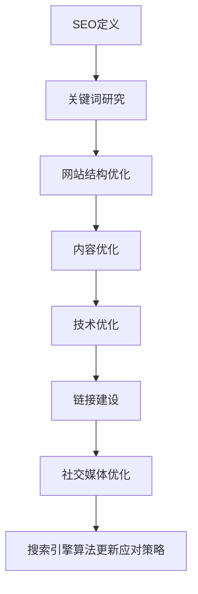

                 


### 《SEO优化：提高一人公司网站曝光度的技巧》

---

## 文章标题

《SEO优化：提高一人公司网站曝光度的技巧》

> 关键词：SEO优化、网站曝光度、关键词研究、内容优化、技术优化、链接建设、搜索引擎算法、社交媒体优化

> 摘要：
本篇文章将深入探讨SEO（搜索引擎优化）优化的基础与实战技巧，旨在帮助一人公司提高其网站在搜索引擎中的曝光度。我们将从关键词研究、网站结构优化、内容优化、技术优化、链接建设、社交媒体优化以及搜索引擎算法更新应对策略等多个方面进行详细阐述，并分享一些成功案例，为您的SEO优化之路提供实用指导。

---

### 《SEO优化：提高一人公司网站曝光度的技巧》目录大纲

# 第一部分：SEO优化基础

## 1.1 SEO概述
### 1.1.1 SEO的定义与重要性
### 1.1.2 SEO与SEM的关系
### 1.1.3 SEO优化的目标

## 1.2 关键词研究
### 1.2.1 关键词筛选策略
### 1.2.2 关键词分析工具介绍
### 1.2.3 高效使用关键词

## 1.3 网站结构优化
### 1.3.1 网站结构的重要性
### 1.3.2 网站导航优化
### 1.3.3 网站地图的创建与提交

## 1.4 内容优化
### 1.4.1 内容策略制定
### 1.4.2 标题标签与元描述的优化
### 1.4.3 高质量内容的创作与维护

## 1.5 技术优化
### 1.5.1 网站速度优化
### 1.5.2 移动端优化
### 1.5.3 HTTPS迁移

# 第二部分：SEO优化实战

## 2.1 SEO优化策略
### 2.1.1 SEO优化流程
### 2.1.2 定期优化计划
### 2.1.3 数据分析与优化

## 2.2 链接建设
### 2.2.1 外部链接策略
### 2.2.2 内部链接优化
### 2.2.3 链接交换与删除无效链接

## 2.3 社交媒体优化
### 2.3.1 社交媒体与SEO的关系
### 2.3.2 社交媒体策略制定
### 2.3.3 社交媒体内容优化

## 2.4 搜索引擎算法更新应对策略
### 2.4.1 理解搜索引擎算法
### 2.4.2 预测算法更新趋势
### 2.4.3 及时调整SEO策略

## 2.5 成功案例分享
### 2.5.1 案例一：小公司通过SEO提升网站流量
### 2.5.2 案例二：提高电商网站转化率
### 2.5.3 案例三：优化本地企业网站曝光度

# 第三部分：SEO工具与资源

## 3.1 SEO工具介绍
### 3.1.1 关键词研究工具
### 3.1.2 竞争对手分析工具
### 3.1.3 网站性能分析工具

## 3.2 SEO资源推荐
### 3.2.1 SEO博客与论坛
### 3.2.2 SEO书籍与在线课程
### 3.2.3 SEO社群与交流平台

# 附录

## 附录 A：SEO相关术语解释
### A.1 SEO术语概述
### A.2 SEO相关技术术语解释

## 附录 B：SEO优化时间表
### B.1 日常SEO优化任务
### B.2 SEO优化年度计划

---

### 4.0 核心概念与联系

首先，我们需要理解SEO的核心概念和它们之间的联系。SEO，即搜索引擎优化，是指通过一系列技术和策略，提高网站在搜索引擎中的排名，从而增加网站曝光度和流量。

#### 核心概念图

以下是一个关于SEO核心概念的Mermaid流程图：



### 4.1 关键词研究算法原理

关键词研究是SEO优化中的基础。以下是一个关键词研究算法的伪代码：

```pseudo
function keywordResearch(url, targetAudience):
    # 收集关键词数据
    keywords = fetchKeywordsFromSources(url, targetAudience)
    # 分析关键词竞争程度
    competitionLevels = analyzeCompetition(keywords)
    # 筛选高潜力关键词
    selectedKeywords = filterHighPotentialKeywords(keywords, competitionLevels)
    return selectedKeywords
```

### 4.2 网站结构优化算法原理

网站结构优化确保搜索引擎能够有效地抓取和索引网站内容。以下是一个网站结构优化算法的伪代码：

```pseudo
function websiteStructureOptimization(url):
    # 网站结构分析
    structure = analyzeWebsiteStructure(url)
    # 检测网站结构问题
    issues = detectStructureIssues(structure)
    # 优化建议
    recommendations = generateOptimizationRecommendations(issues)
    # 实施优化
    applyOptimizations(url, recommendations)
    return "Website structure optimization completed."
```

### 4.3 内容优化算法原理

内容优化是SEO的关键部分，它涉及到如何创建和优化网站内容。以下是一个内容优化算法的伪代码：

```pseudo
function contentOptimization(url, selectedKeywords):
    # 分析现有内容
    existingContent = analyzeExistingContent(url)
    # 优化内容
    optimizedContent = optimizeContent(existingContent, selectedKeywords)
    # 更新网站内容
    updateWebsiteContent(url, optimizedContent)
    return "Content optimization completed."
```

### 4.4 技术优化算法原理

技术优化涉及到网站的技术方面，如网站速度、移动端优化和HTTPS迁移等。以下是一个技术优化算法的伪代码：

```pseudo
function technicalOptimization(url):
    # 优化网站速度
    speedOptimization = optimizeWebsiteSpeed(url)
    # 移动端优化
    mobileOptimization = optimizeMobileExperience(url)
    # HTTPS迁移
    httpsMigration = migrateToHTTPS(url)
    return "Technical optimization completed."
```

### 4.5 链接建设算法原理

链接建设是提高网站排名的重要因素。以下是一个链接建设算法的伪代码：

```pseudo
function linkBuilding(url, selectedKeywords):
    # 创建外部链接
    externalLinks = createExternalLinks(url, selectedKeywords)
    # 优化内部链接
    internalLinks = optimizeInternalLinks(url)
    # 删除无效链接
    removeBadLinks(url)
    return "Link building completed."
```

### 4.6 社交媒体优化算法原理

社交媒体优化与SEO紧密相关，通过社交媒体平台提升网站曝光度。以下是一个社交媒体优化算法的伪代码：

```pseudo
function socialMediaOptimization(url):
    # 制定社交媒体策略
    strategy = createSocialMediaStrategy(url)
    # 优化内容
    optimizedContent = optimizeSocialMediaContent(strategy)
    # 发布内容
    publishContent(url, optimizedContent)
    return "Social media optimization completed."
```

### 4.7 搜索引擎算法更新应对策略

搜索引擎算法不断更新，我们需要及时调整SEO策略。以下是一个应对搜索引擎算法更新的策略：

```pseudo
function handleAlgorithmUpdates():
    # 理解最新算法
    latestAlgorithm = understandLatestAlgorithm()
    # 预测算法更新趋势
    updateTrends = predictAlgorithmUpdateTrends()
    # 调整SEO策略
    adjustedStrategy = adjustSEOStrategy(latestAlgorithm, updateTrends)
    return "SEO strategy adjusted for algorithm updates."
```

通过这些核心概念和算法原理，我们可以更好地理解SEO优化的过程和方法。在接下来的文章中，我们将详细探讨每个部分的具体实施技巧和策略。

