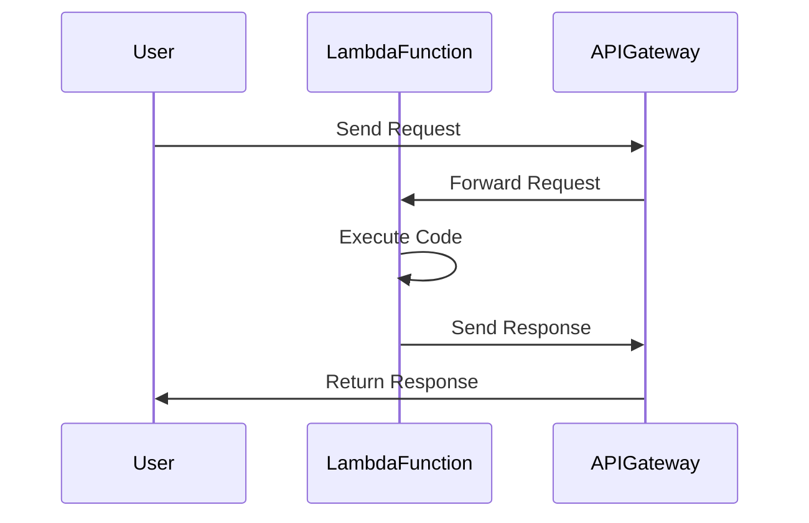
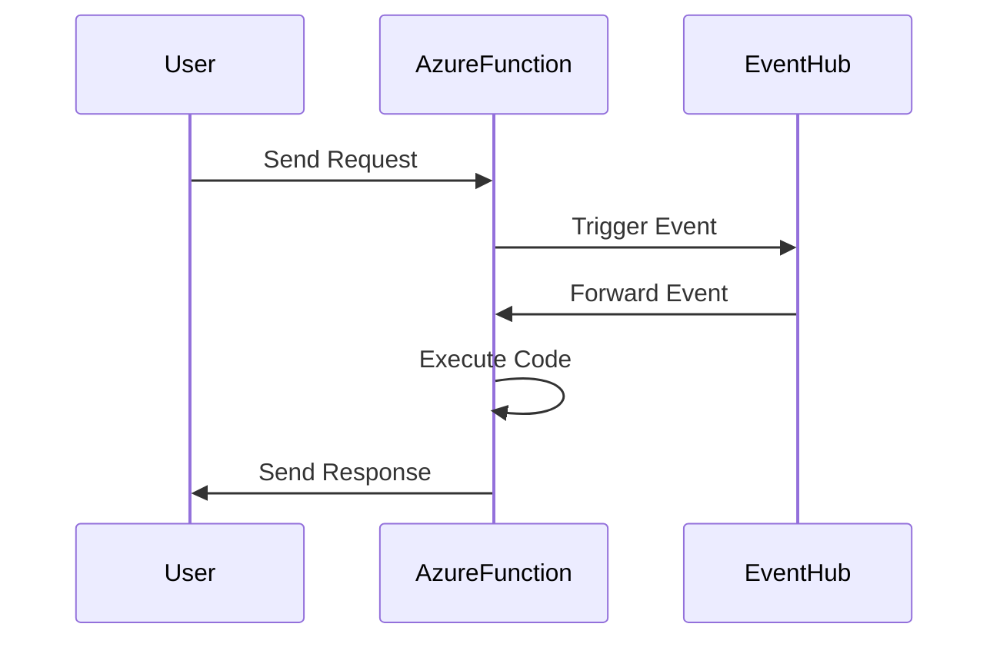

                 


### 文章标题：Serverless架构：AWS Lambda与Azure Functions

#### 关键词：Serverless架构、AWS Lambda、Azure Functions、FaaS、BaaS、事件驱动架构、微服务架构

#### 摘要：
Serverless架构正逐渐成为现代软件开发的核心，它简化了开发流程，提高了灵活性，并带来了显著的成本效益。本文将深入探讨Serverless架构中的两大主要服务：AWS Lambda和Azure Functions。我们将从定义和背景入手，逐步分析这两种服务的核心概念、原理、应用场景以及设计模式。此外，文章还将分享实际项目中的最佳实践，以帮助读者更好地理解和应用Serverless架构。

---

### 《Serverless架构：AWS Lambda与Azure Functions》目录大纲

#### 第一部分：Serverless架构概述

#### 第1章：Serverless架构引论
- 1.1 Serverless架构的定义与背景
  - Serverless架构的历史与发展
  - Serverless与云计算的关系
- 1.2 Serverless架构的优势与挑战
  - 优势：灵活性、成本效益、轻松扩展
  - 挑战：安全性、监控、调试
- 1.3 Serverless架构的应用场景
  - 网站与移动应用的后端服务
  - 数据处理与分析
  - API网关与集成

#### 第2章：Serverless核心概念
- 2.1 Function as a Service (FaaS)
  - AWS Lambda
  - Azure Functions
- 2.2 Backend as a Service (BaaS)
  - 云数据库
  - 云存储
- 2.3 无服务器架构的关键组件
  - 事件触发
  - API网关
  - 负载均衡

#### 第3章：AWS Lambda详解
- 3.1 AWS Lambda基本原理
  - Lambda函数的生命周期
  - Lambda与AWS服务集成
- 3.2 Lambda函数开发
  - 编写Lambda函数
  - 函数配置与部署
- 3.3 Lambda函数的优化
  - 冷启动优化
  - 并行处理
- 3.4 Lambda函数的安全与监控
  - 访问控制
  - 错误处理与日志
  - 性能监控

#### 第4章：Azure Functions详解
- 4.1 Azure Functions基本原理
  - 函数的执行模型
  - 与Azure服务的集成
- 4.2 Azure Functions开发
  - 函数创建与配置
  - 集成Web API与事件处理
- 4.3 Azure Functions优化
  - 函数组合与逻辑分离
  - 资源利用优化
- 4.4 Azure Functions安全与监控
  - 访问控制与认证
  - 错误处理与日志记录
  - 性能监控与调试

#### 第5章：Serverless架构设计模式
- 5.1 事件驱动架构
  - 事件流处理
  - 异步处理与延迟执行
- 5.2 微服务架构
  - 微服务的设计原则
  - 无服务化微服务的实现
- 5.3 API网关与集成
  - API设计最佳实践
  - API管理与服务集成

#### 第6章：Serverless架构最佳实践
- 6.1 设计与开发最佳实践
  - 函数封装与模块化
  - 错误处理与异常管理
- 6.2 部署与运维最佳实践
  - CI/CD流水线
  - 监控与告警系统
- 6.3 安全与合规性
  - 数据保护与隐私
  - 访问控制与身份验证
- 6.4 成本优化
  - 函数调用的成本模型
  - 扩展与缩放策略

#### 第7章：Serverless架构项目实战
- 7.1 实战一：构建一个博客平台
  - 技术栈选择
  - 函数设计与实现
  - API网关与前端集成
- 7.2 实战二：实时数据分析系统
  - 数据处理流程设计
  - Lambda函数实现
  - 可视化与报表生成
- 7.3 实战三：物联网应用后端服务
  - 设备数据采集与处理
  - 函数调度与消息队列
  - API设计与安全防护

#### 第8章：未来趋势与展望
- 8.1 Serverless架构的发展趋势
  - 新的功能与服务
  - 跨云与多云架构
- 8.2 Serverless架构的未来机遇
  - 企业应用的无服务器化
  - 开源社区的发展
- 8.3 Serverless架构的挑战与应对策略
  - 安全性与隐私保护
  - 技术选型的多样性

#### 附录：资源与工具
- A.1 AWS Lambda资源与工具
  - 官方文档
  - 开源库与SDK
  - 社区资源
- A.2 Azure Functions资源与工具
  - 官方文档
  - 开源库与SDK
  - 社区资源
- A.3 Serverless架构学习资源
  - 书籍推荐
  - 在线课程
  - 博客与论坛

#### 附录B：Mermaid流程图
- B.1 AWS Lambda流程图
  - 函数部署流程
  - 函数执行流程
- B.2 Azure Functions流程图
  - 函数部署流程
  - 函数执行流程

#### 附录C：算法伪代码示例
- C.1 Lambda函数伪代码示例

---

现在，我们将逐步解析文章的各个部分，确保每一章的内容都能够详尽且逻辑清晰，为读者提供一份高质量的技术指南。接下来，我们将从“Serverless架构引论”开始，逐步深入探讨Serverless架构的历史、优势、挑战以及应用场景。

## 第1章：Serverless架构引论

### 1.1 Serverless架构的定义与背景

Serverless架构，顾名思义，是一种无需管理服务器（Server）的云计算服务模型。在这种模型中，开发者无需关心底层基础设施的管理，如服务器实例的创建、扩展、更新和维护。相反，一切底层细节都由云服务提供商自动处理。开发者只需专注于编写和部署代码，云服务提供商会确保这些代码在适当的时间和资源上运行。

#### 历史与发展

Serverless架构的概念并非一夜之间出现，而是经过了多年的发展和演变。最早的灵感来源于云计算的兴起，特别是在云计算平台如Amazon Web Services (AWS)、Microsoft Azure和Google Cloud Platform (GCP) 广泛应用的背景下。

1. **云计算的早期阶段**：在云计算的早期阶段，开发者仍然需要关注服务器管理。他们需要购买、配置和监控服务器，以确保应用的正常运行。这导致了“基础设施即代码”（Infrastructure as Code，IaC）的概念的出现，开发者开始使用脚本来自动化服务器配置和管理。

2. **PaaS的出现**：随着平台即服务（Platform as a Service，PaaS）的发展，开发者不再需要直接管理服务器，而是通过平台提供的环境来开发和部署应用。这大大简化了开发流程，但仍需要关注服务器资源的管理。

3. **FaaS的兴起**：函数即服务（Function as a Service，FaaS）是Serverless架构的一个关键概念。FaaS允许开发者将函数部署到云上，这些函数会在事件触发时自动执行。这种模式的出现标志着Serverless架构的正式诞生。

4. **BaaS的发展**：与此同时，后端即服务（Backend as a Service，BaaS）也逐渐成熟。BaaS提供了一系列后端功能，如数据库、身份验证、通知和地理空间分析，无需开发者自行实现。

#### Serverless与云计算的关系

Serverless架构与云计算紧密相连，但它们之间也存在显著的区别：

1. **基础设施管理**：在云计算中，开发者仍需管理服务器、存储和网络等基础设施。而在Serverless架构中，这些管理任务由云服务提供商负责。

2. **成本模型**：云计算通常基于虚拟机（VM）的租用，开发者需要根据实际使用的资源付费。Serverless架构则基于函数的执行次数和持续时间，提供了更加灵活和透明的成本模型。

3. **开发体验**：Serverless架构提供了简化的开发体验。开发者只需关注业务逻辑的实现，无需担心底层基础设施的细节。这有助于加快开发速度，提高生产效率。

4. **扩展性**：Serverless架构天然支持横向扩展，云服务提供商可以自动调整资源以应对负载变化。这与传统的云计算相比，提供了更高的灵活性和可靠性。

### 1.2 Serverless架构的优势与挑战

#### 优势

1. **灵活性**：开发者可以按需选择编程语言、运行时和环境，无需受到底层基础设施的限制。这种灵活性使得开发者能够快速响应业务需求，实现创新的解决方案。

2. **成本效益**：Serverless架构基于函数的执行付费，无需为闲置的资源支付费用。这种模式可以显著降低成本，尤其是对于峰值流量较低的应用。

3. **轻松扩展**：云服务提供商负责管理资源的扩展，确保应用可以自动缩放到所需的规模。这有助于应对突发流量和长期增长。

#### 挑战

1. **安全性**：由于Serverless架构的特殊性，安全性可能成为一个挑战。开发者需要确保函数的访问控制、数据保护和漏洞防护。

2. **监控与调试**：在Serverless环境中，监控和调试可能变得复杂。开发者需要熟悉云服务提供商提供的工具和指标，以便有效地监控系统性能和诊断问题。

3. **依赖管理**：Serverless函数可能依赖于其他云服务，如数据库和消息队列。正确管理和配置这些依赖项是确保系统稳定性的关键。

### 1.3 Serverless架构的应用场景

Serverless架构适用于多种应用场景，以下是其中几个典型应用：

1. **网站与移动应用的后端服务**：使用Serverless架构可以简化网站和移动应用的后端服务开发，无需担心服务器管理。

2. **数据处理与分析**：Serverless架构适用于数据处理和分析任务，如数据转换、实时分析和报表生成。

3. **API网关与集成**：Serverless架构可以用于构建API网关，提供灵活的集成服务，支持多种数据格式和协议。

在下一章中，我们将深入探讨Serverless架构的核心概念，包括Function as a Service (FaaS) 和 Backend as a Service (BaaS)，并介绍无服务器架构的关键组件。

## 第2章：Serverless核心概念

### 2.1 Function as a Service (FaaS)

#### AWS Lambda

AWS Lambda是亚马逊云服务（Amazon Web Services, AWS）提供的FaaS服务。Lambda允许开发者将代码部署为独立的函数，这些函数会在触发事件时自动执行。以下是AWS Lambda的一些关键特点：

1. **无服务器模型**：开发者无需担心底层基础设施的管理，AWS Lambda负责处理所有必要的资源。

2. **编程语言支持**：AWS Lambda支持多种编程语言，包括Python、Node.js、Java、Go、Ruby和C#等。

3. **灵活的函数配置**：开发者可以配置函数的内存、超时时间和并发执行等参数，以满足不同的需求。

4. **自动扩展**：Lambda函数可以自动缩放，以应对突发流量。这意味着函数可以动态调整执行实例的数量。

5. **事件触发**：Lambda函数可以通过多种触发器启动，如API网关、S3事件、Kafka消息等。

6. **与AWS服务的集成**：Lambda函数可以与AWS的其他服务紧密集成，如DynamoDB、S3、Kinesis等，实现复杂的业务逻辑。

#### Azure Functions

Azure Functions是微软云服务（Microsoft Azure）提供的FaaS服务。Azure Functions同样允许开发者将代码部署为独立的函数，以下是它的关键特点：

1. **无服务器模型**：开发者无需管理底层基础设施，Azure Functions负责处理所有必要的资源。

2. **支持多种编程语言**：Azure Functions支持C#、F#、JavaScript、Python、Java和PowerShell等多种编程语言。

3. **灵活的执行模型**：Azure Functions提供了多种执行模型，包括Web API、定时触发和事件触发等。

4. **自动扩展**：与AWS Lambda类似，Azure Functions也可以自动缩放，以应对突发流量。

5. **集成多种触发器**：Azure Functions支持多种触发器，如Webhook、定时器、Azure事件网格等。

6. **与Azure服务的集成**：Azure Functions可以轻松集成到Azure的其他服务中，如Azure Blob存储、Azure队列、Azure Event Hub等。

#### FaaS的优势与挑战

FaaS提供了极大的灵活性和便利性，但同时也带来了一些挑战：

1. **优势**：
   - **无服务器管理**：开发者无需关心底层基础设施，可以专注于代码编写和业务逻辑实现。
   - **按需付费**：仅当函数执行时才计费，无需为闲置资源付费。
   - **快速部署和迭代**：函数可以快速部署和更新，加快开发流程。

2. **挑战**：
   - **有限的资源**：函数通常受限于资源（如内存和CPU），可能不适合计算密集型任务。
   - **调试难度**：函数运行在云环境中，调试可能需要一定的技巧和工具。
   - **冷启动问题**：长时间未调用的函数可能需要额外的启动时间，影响性能。

#### FaaS的应用场景

FaaS适用于多种应用场景，以下是其中几个常见的应用场景：

1. **API后端服务**：FaaS可以用于构建API网关，提供灵活的API管理服务。
2. **数据处理**：FaaS适用于数据处理和分析任务，如数据转换、ETL和实时分析。
3. **后台任务处理**：FaaS可以用于执行后台任务，如定期数据同步、报告生成等。

在下一章中，我们将探讨Backend as a Service (BaaS)及其在Serverless架构中的应用。

## 2.2 Backend as a Service (BaaS)

### 云数据库

BaaS提供了一个完整的后端服务，包括数据库、身份验证、文件存储和通知等功能。云数据库是BaaS的重要组成部分，提供了灵活、可扩展的存储解决方案。以下是云数据库的一些关键特点：

1. **自动扩展**：云数据库可以根据需求自动调整存储容量和处理能力，无需手动干预。

2. **高可用性**：云数据库通常提供高可用性保障，确保数据始终可用。

3. **多地区部署**：云数据库可以在多个地区部署，支持全球数据访问。

4. **安全性**：云数据库提供丰富的安全功能，如数据加密、访问控制等。

5. **简化开发**：开发者无需关注底层数据库管理，可以专注于应用逻辑的实现。

### 云存储

云存储是BaaS的另一重要组成部分，提供了灵活、可扩展的存储解决方案。以下是云存储的一些关键特点：

1. **按需付费**：仅根据实际使用的存储空间和传输量付费。

2. **高可靠性**：云存储提供了高可靠性的数据存储，确保数据不丢失。

3. **全球访问**：云存储支持全球数据访问，适用于分布式应用。

4. **多种存储类型**：云存储提供了多种存储类型，如对象存储、文件存储和块存储，满足不同应用的需求。

5. **集成SDK**：云存储通常提供各种编程语言的SDK，简化开发过程。

#### BaaS的优势与挑战

BaaS提供了极大的便利性和灵活性，但同时也带来了一些挑战：

1. **优势**：
   - **简化开发**：开发者无需关注底层基础设施和后端服务的管理，可以专注于应用逻辑的实现。
   - **快速部署**：BaaS服务可以快速部署和集成到现有应用中。
   - **成本效益**：按需付费模式提供了显著的成本效益。

2. **挑战**：
   - **功能限制**：BaaS服务提供的功能可能有限，无法满足复杂业务需求。
   - **性能问题**：在某些情况下，BaaS服务的性能可能无法与自建后端服务相媲美。
   - **数据迁移**：从自建后端服务迁移到BaaS可能面临数据迁移的挑战。

#### BaaS的应用场景

BaaS适用于多种应用场景，以下是其中几个常见的应用场景：

1. **移动应用**：BaaS可以用于移动应用的数据存储、身份验证和通知等功能。
2. **物联网应用**：BaaS提供了方便的数据存储和处理解决方案，适用于物联网应用。
3. **Web应用**：BaaS可以用于Web应用的后端服务，简化开发流程。

在下一章中，我们将探讨无服务器架构的关键组件，包括事件触发、API网关和负载均衡。

## 2.3 无服务器架构的关键组件

### 事件触发

事件触发是Serverless架构的核心组件之一，它决定了函数何时执行。以下是事件触发的一些关键特点：

1. **按需执行**：事件触发确保函数仅在需要时执行，避免了不必要的资源浪费。

2. **多样化触发源**：事件触发支持多种触发源，如API网关、云存储事件、定时器、消息队列等。

3. **异步处理**：事件触发支持异步处理，允许函数在后台执行，不会阻塞主线程。

4. **延迟执行**：事件触发允许函数在特定时间点执行，例如定时任务和报告生成。

### API网关

API网关是Serverless架构中的另一个关键组件，它提供了统一的API访问入口。以下是API网关的一些关键特点：

1. **路由与认证**：API网关可以路由请求到相应的函数，并提供认证和授权功能，确保安全性。

2. **流量控制**：API网关可以控制流量，防止DDoS攻击和流量洪峰。

3. **API管理**：API网关提供了API管理和监控功能，帮助开发者跟踪API性能和流量。

4. **多协议支持**：API网关支持多种协议，如HTTP、WebSocket和HTTPS，适用于不同类型的API。

### 负载均衡

负载均衡是Serverless架构中的另一个重要组件，它确保了函数的高可用性和性能。以下是负载均衡的一些关键特点：

1. **自动扩展**：负载均衡可以根据流量自动调整函数的实例数量。

2. **多可用区部署**：负载均衡可以在多个可用区部署，确保高可用性。

3. **流量分配**：负载均衡器根据算法（如轮询、最少连接或响应时间）将流量分配到不同的函数实例。

4. **健康检查**：负载均衡器定期检查函数实例的健康状况，确保流量只分配到健康的实例。

### 组件之间的关系

这些关键组件共同构成了无服务器架构的核心，它们之间存在着紧密的联系：

1. **事件触发 → 函数执行**：事件触发器触发函数执行，确保函数按需运行。

2. **函数执行 → API网关**：函数执行的结果可以通过API网关暴露给外部系统。

3. **API网关 → 负载均衡**：API网关将请求路由到负载均衡器，负载均衡器再将请求分配到不同的函数实例。

4. **负载均衡 → 函数执行**：负载均衡器根据流量情况调整函数实例的数量，确保系统的高性能和高可用性。

通过这些关键组件的协同工作，无服务器架构可以提供灵活、可扩展和高效的应用解决方案。

## 第3章：AWS Lambda详解

### 3.1 AWS Lambda基本原理

AWS Lambda是亚马逊云服务（Amazon Web Services, AWS）提供的函数即服务（Function as a Service, FaaS）平台，允许开发者将代码部署为独立的函数，并在触发事件时执行。理解AWS Lambda的基本原理对于充分利用这一服务至关重要。

#### Lambda函数的生命周期

Lambda函数的生命周期包括以下几个阶段：

1. **创建**：开发者使用AWS管理控制台、AWS CLI、AWS SDK或AWS Lambda提供的API创建一个Lambda函数。

2. **部署**：创建Lambda函数后，开发者需要将代码部署到AWS Lambda服务。代码可以存储在AWS Lambda代码仓库或外部存储服务（如S3）中。

3. **等待触发**：Lambda函数在部署后处于等待状态，直到有触发事件发生。触发事件可以是API网关调用、S3事件、Kafka消息、定时器触发等。

4. **执行**：当触发事件发生时，AWS Lambda会自动分配一个执行环境，并启动函数实例。函数实例执行完成后，会进入终止阶段。

5. **终止**：Lambda函数执行完成后，AWS Lambda会终止函数实例，并释放相关资源。如果函数在终止前有未处理的异常，可能会触发错误处理逻辑。

#### Lambda与AWS服务的集成

AWS Lambda可以与AWS的其他服务紧密集成，实现复杂的业务逻辑。以下是几个常见的集成场景：

1. **API网关**：开发者可以使用AWS API网关将Lambda函数暴露为API，提供RESTful接口。API网关可以处理HTTP请求，并将请求路由到相应的Lambda函数。

2. **S3**：AWS Lambda可以监听S3桶的事件，例如对象创建或修改，并在这些事件发生时触发Lambda函数。这种集成适用于数据处理、数据转换和事件驱动的后台任务。

3. **Kinesis**：AWS Lambda可以处理Kinesis数据流中的事件，例如记录创建或更新。这种集成适用于实时数据处理和流分析。

4. **DynamoDB**：AWS Lambda可以与DynamoDB数据库集成，执行数据操作，如插入、更新和查询。这种集成适用于数据管理和后端逻辑。

5. **SES、SNS和SQS**：AWS Lambda可以与AWS的邮件服务（SES）、通知服务（SNS）和消息队列（SQS）集成，实现复杂的通信和消息处理逻辑。

#### Lambda函数的执行模型

AWS Lambda采用了一种灵活的执行模型，确保函数的高效运行。以下是Lambda函数的执行模型关键点：

1. **按需实例化**：Lambda函数仅在触发事件时才会实例化。这意味着在函数未触发时，系统无需为它保留资源。

2. **并发执行**：AWS Lambda支持并发执行，可以在同一时间运行多个函数实例。这种并发性使得Lambda函数适用于高负载场景。

3. **自动扩展**：AWS Lambda可以根据流量自动调整函数实例的数量，确保系统在负载增加时保持高性能。

4. **持久化连接**：Lambda函数实例可以使用持久化连接，减少启动时间并提高性能。这种连接在函数实例终止后仍然保持，直到达到最大持久连接数。

5. **超时处理**：Lambda函数具有默认的超时时间（最大为15分钟），超过超时时间后，系统会终止函数实例。开发者可以根据需求调整超时时间。

#### Lambda函数的部署

部署Lambda函数是开发者使用AWS Lambda的关键步骤。以下是Lambda函数部署的关键点：

1. **代码存储**：Lambda函数的代码可以存储在AWS Lambda代码仓库或外部存储服务（如S3）中。使用S3存储时，需要将代码打包为ZIP文件，并在AWS Lambda控制台中指定存储位置。

2. **部署包**：部署包是包含函数代码、依赖库和配置文件的压缩文件。部署包可以在AWS Lambda控制台中上传，或通过AWS CLI、AWS SDK或API进行部署。

3. **配置**：在部署Lambda函数时，需要配置函数的内存、超时时间和并发执行等参数。这些配置会影响函数的性能和成本。

4. **版本控制**：AWS Lambda支持版本控制，允许开发者同时部署多个版本的函数。这有助于管理和回滚变更。

5. **部署流程**：开发者可以使用AWS Lambda提供的工具和API自动部署函数。部署流程通常包括构建部署包、配置函数和上传部署包等步骤。

通过理解AWS Lambda的基本原理、与AWS服务的集成、执行模型和部署流程，开发者可以充分利用AWS Lambda提供的功能，构建高效、灵活和可扩展的Serverless应用。

### 3.2 Lambda函数开发

在了解了AWS Lambda的基本原理之后，开发Lambda函数是下一步的关键步骤。本文将详细介绍如何编写、配置和部署Lambda函数，以帮助开发者迅速上手。

#### 编写Lambda函数

编写Lambda函数的第一步是选择一种支持的编程语言，AWS Lambda支持包括Python、Node.js、Java、Go、Ruby和C#在内的多种编程语言。以下是一个简单的Python Lambda函数示例：

```python
import json

def lambda_handler(event, context):
    # 从事件中获取参数
    message = event.get('message', 'Hello, World!')
    
    # 输出结果
    return {
        'statusCode': 200,
        'body': json.dumps(f'Thank you, {message}!')
    }
```

在这个示例中，`lambda_handler` 是Lambda函数的主函数，它接收两个参数：`event` 和 `context`。`event` 是一个包含触发事件数据的对象，而 `context` 提供了关于函数执行环境的信息。

#### 函数配置与部署

编写Lambda函数后，下一步是进行配置并将其部署到AWS Lambda服务中。

##### 配置函数

在AWS Lambda控制台中，创建一个新的Lambda函数，并配置以下参数：

1. **函数名称**：给函数指定一个唯一的名称。
2. **运行时**：选择编程语言版本，例如 `Python 3.8`。
3. **代码存储**：指定函数代码的存储位置，可以是AWS Lambda代码仓库或S3存储桶。
4. **内存大小**：设置函数的最大内存限制，这将影响函数的性能和成本。默认值为128MB。
5. **超时时间**：设置函数的最大执行时间，默认值为3秒。超过此时间后，函数将被终止。

##### 部署函数

配置完成后，上传函数代码。对于Python函数，可以选择将代码文件直接上传，或者上传一个包含函数代码的ZIP文件。上传完成后，AWS Lambda会自动部署函数。

##### 部署策略

为了确保函数的可靠性和可恢复性，AWS Lambda支持多种部署策略：

1. **一次性部署**：仅将代码部署到最新版本。适用于快速测试和实验。
2. **版本控制**：同时部署多个版本。每个版本都有独立的函数名称，允许开发者管理和回滚变更。
3. **蓝绿部署**：同时部署新旧版本，并逐步切换流量。这有助于降低部署风险。

#### Lambda函数的测试

部署函数后，开发者可以使用AWS Lambda控制台或AWS CLI进行测试。以下是如何在控制台测试Lambda函数的步骤：

1. **测试事件**：在控制台中创建一个新的测试事件，可以包含自定义的输入数据。
2. **执行函数**：选择测试事件，并点击“执行”按钮。Lambda函数将根据测试事件执行，并在控制台中显示输出结果。
3. **日志查看**：执行完成后，可以查看函数的日志，以诊断任何潜在的问题。

通过编写、配置和部署Lambda函数，开发者可以快速构建和部署功能强大的Serverless应用。接下来，本文将探讨如何优化Lambda函数的性能。

### 3.3 Lambda函数的优化

AWS Lambda提供了强大的功能，但也存在一些性能瓶颈，如冷启动、并行处理等。优化Lambda函数可以提高性能和可扩展性，从而充分发挥Serverless架构的优势。以下是一些关键的优化策略。

#### 冷启动优化

冷启动是指当Lambda函数在一段时间内未被调用后，再次触发时所需的时间。以下是几个优化冷启动的策略：

1. **持久化连接**：Lambda函数实例在终止后，可以通过持久化连接保持活跃状态。这可以减少函数实例的创建时间，从而降低冷启动时间。然而，需要注意的是，持久化连接数量有限，需要合理使用。

2. **预Warm函数**：定期触发Lambda函数，以预热实例并减少冷启动时间。这可以通过使用AWS Lambda的触发器或手动调用来实现。

3. **优化配置**：调整Lambda函数的内存和超时时间，以减少实例创建和终止次数。过多的实例创建会导致冷启动时间增加。

4. **缓存依赖**：对于需要外部依赖的函数，如数据库或第三方API，可以预先加载这些依赖，以减少调用时的加载时间。

#### 并行处理

并行处理允许同时执行多个函数实例，从而提高吞吐量和处理速度。以下是一些优化并行处理的策略：

1. **并发限制**：AWS Lambda默认对并发执行进行限制，以确保函数实例不会超出资源限制。根据应用需求，可以调整并发限制，以最大化利用资源。

2. **异步处理**：使用异步处理将任务分解为多个独立的子任务，这些子任务可以在不同的函数实例中并行执行。例如，可以使用异步编程模型（如Python的`async/await`）或第三方库（如`asyncio`）来实现异步处理。

3. **流控机制**：在并行处理时，可以使用流控机制（如令牌桶或漏桶算法）来限制任务的提交速率，避免系统过载。

4. **负载均衡**：使用负载均衡器（如AWS Lambda的内部负载均衡器）将请求分配到多个函数实例，实现负载均衡。这有助于确保每个实例都能充分利用资源。

#### 优化I/O操作

I/O操作是影响Lambda函数性能的重要因素。以下是一些优化I/O操作的策略：

1. **使用本地存储**：尽量避免使用远程存储（如S3）进行频繁的读写操作。可以将数据缓存到本地存储，以减少I/O延迟。

2. **批量操作**：将多个I/O操作合并为批量操作，减少I/O调用次数。例如，可以使用数据库的批量插入或更新操作。

3. **异步I/O**：使用异步I/O操作，避免阻塞主线程。例如，可以使用Python的`asyncio`库或Node.js的`async/await`语法。

4. **优化网络配置**：调整Lambda函数的网络配置（如最大连接数和连接超时时间），以提高网络性能。

通过以上优化策略，开发者可以显著提高Lambda函数的性能和可扩展性，充分利用Serverless架构的优势。

### 3.4 Lambda函数的安全与监控

在部署和管理Lambda函数时，确保其安全性和稳定性至关重要。AWS Lambda提供了一系列安全功能和监控工具，帮助开发者实现这一目标。

#### 访问控制

AWS Lambda通过访问控制确保只有授权用户和系统可以调用函数。以下是一些关键的访问控制策略：

1. **AWS身份与访问管理（IAM）角色**：为Lambda函数分配AWS IAM角色，定义其可以访问的其他AWS服务。角色可以基于最小权限原则，仅授予必要的权限。

2. **API网关集成**：使用AWS API网关保护Lambda函数的访问，通过身份验证和授权确保只有经过授权的请求可以调用函数。

3. **VPC和子网配置**：将Lambda函数部署在虚拟私有云（VPC）和子网中，限制外部访问并增加安全性。

4. **AWS KMS加密**：使用AWS密钥管理系统（KMS）加密敏感数据，确保数据在传输和存储过程中得到保护。

#### 错误处理与日志

Lambda函数在执行过程中可能会遇到各种错误，因此有效的错误处理和日志记录是确保系统稳定性的关键。以下是一些策略：

1. **自定义错误处理**：使用Lambda函数的`lambda_handler`函数处理错误，确保错误不会导致函数实例终止。

2. **日志记录**：使用AWS Lambda提供的日志记录功能，记录函数的执行信息和错误日志。日志可以通过AWS CloudWatch进行监控和告警。

3. **错误回溯**：配置错误回溯，将函数执行过程中的错误信息发送到S3或CloudWatch Logs中，以便进一步分析和调试。

4. **日志聚合**：使用AWS CloudWatch Log Group和Log Stream将来自多个Lambda函数的日志聚合到一个地方，便于集中管理和分析。

#### 性能监控

监控Lambda函数的性能是确保系统高可用性和性能的关键。以下是一些性能监控的策略：

1. **监控指标**：使用AWS CloudWatch监控Lambda函数的多个性能指标，如CPU使用率、内存使用量、并发执行次数等。

2. **阈值告警**：设置阈值告警，当监控指标超过预设阈值时，自动发送通知，通知开发者进行干预。

3. **自动扩展**：利用AWS Lambda的自动扩展功能，根据监控指标调整函数实例的数量，确保系统在负载增加时保持高性能。

4. **性能测试**：定期进行性能测试，评估函数在高峰负载下的性能，并根据测试结果进行优化。

通过实施上述安全与监控策略，开发者可以确保Lambda函数在安全、稳定和高效的环境中运行。

## 第4章：Azure Functions详解

### 4.1 Azure Functions基本原理

Azure Functions是微软云服务（Microsoft Azure）提供的函数即服务（Function as a Service, FaaS）平台，允许开发者将代码部署为独立的函数，并在触发事件时执行。了解Azure Functions的基本原理对于充分利用这一服务至关重要。

#### 函数的执行模型

Azure Functions提供了多种执行模型，以适应不同的应用场景。以下是几种常见的执行模型：

1. **Web API模型**：Web API模型将函数暴露为API，通过HTTP请求触发。这种模型适用于RESTful API和Web应用的后端服务。

2. **定时触发模型**：定时触发模型允许函数在特定的时间间隔或日期触发。这种模型适用于定时任务和后台作业。

3. **事件触发模型**：事件触发模型根据特定事件触发函数。事件可以来自Azure的其他服务（如存储、队列、事件网格等），或者来自外部系统（如Kafka、SFTP等）。

4. **存储绑定模型**：存储绑定模型允许函数在存储事件发生时触发。例如，在Azure Blob存储中创建或修改文件时，可以触发相关函数进行处理。

5. **API绑定模型**：API绑定模型将函数与特定API服务绑定，当API请求到达时触发函数。这种模型适用于集成第三方API或自定义API。

#### 与Azure服务的集成

Azure Functions可以与Azure的其他服务紧密集成，实现复杂的业务逻辑。以下是几个常见的集成场景：

1. **API网关**：使用Azure API网关将Functions暴露为API，提供RESTful接口。API网关可以处理HTTP请求，并将请求路由到相应的Function。

2. **Azure事件网格**：Azure事件网格提供了一种可扩展的事件处理服务，可以将事件发送到Azure Functions。这种集成适用于实时数据处理和事件驱动的应用。

3. **存储服务**：Azure Functions可以与Azure Blob存储、文件存储、队列和表服务集成。例如，函数可以在存储事件发生时触发，处理文件或队列中的消息。

4. **DynamoDB和表存储**：Azure Functions可以与Azure Cosmos DB和Azure Table存储集成，执行数据操作和查询。

5. **服务总线**：Azure Functions可以与Azure服务总线集成，处理消息传递和队列服务。

#### 函数的执行模型

Azure Functions采用了灵活的执行模型，确保函数的高效运行。以下是Azure Functions的执行模型关键点：

1. **按需实例化**：Azure Functions仅在触发事件时实例化函数，避免了不必要的资源浪费。

2. **自动扩展**：Azure Functions可以根据流量自动调整函数实例的数量，确保系统在负载增加时保持高性能。

3. **并发执行**：Azure Functions支持并发执行，可以在同一时间运行多个函数实例。

4. **持久化连接**：Azure Functions提供了持久化连接功能，可以在函数实例终止后保持连接，减少启动时间。

5. **超时处理**：Azure Functions具有默认的超时时间，超过超时时间后，系统会终止函数实例。开发者可以根据需求调整超时时间。

#### 函数的部署

部署Azure Functions是开发者使用Azure Functions的关键步骤。以下是Azure Functions部署的关键点：

1. **代码存储**：Azure Functions支持多种代码存储方式，包括本地文件、Azure DevOps、GitHub和GitLab等。开发者可以选择将代码存储在本地或远程存储中。

2. **部署包**：部署包是包含函数代码、依赖库和配置文件的ZIP文件。开发者可以使用Azure门户、Azure CLI、Azure PowerShell或Visual Studio进行部署。

3. **配置**：在部署Azure Functions时，需要配置函数的执行模型、绑定、超时时间和内存限制等参数。

4. **版本控制**：Azure Functions支持版本控制，允许开发者同时部署多个版本的函数，便于管理和回滚变更。

5. **部署流程**：开发者可以使用Azure DevOps、GitHub Actions或其他CI/CD工具自动化部署流程，实现快速迭代和部署。

通过理解Azure Functions的基本原理、与Azure服务的集成、执行模型和部署流程，开发者可以充分利用Azure Functions提供的功能，构建高效、灵活和可扩展的Serverless应用。

### 4.2 Azure Functions开发

在了解了Azure Functions的基本原理之后，开发Azure Functions是下一步的关键步骤。本文将详细介绍如何创建、配置和部署Azure Functions，以帮助开发者迅速上手。

#### 创建和配置Azure Functions

要创建Azure Functions，开发者可以通过Azure门户、Azure CLI、Azure PowerShell或Visual Studio进行操作。以下是在Azure门户中创建和配置Azure Functions的步骤：

1. **登录Azure门户**：打开Azure门户（https://portal.azure.com/），使用Azure账户登录。

2. **创建函数应用**：在Azure门户中，点击“新建资源”，搜索并选择“函数应用”。填写必要的配置信息，如函数应用的名称、资源组、位置和运行时堆栈（如.NET Core、Java或Python）。

3. **选择执行模型**：在创建函数应用时，可以选择不同的执行模型。例如，选择“Web API”模型以创建RESTful API。

4. **配置函数**：在函数应用创建完成后，进入应用的“函数”部分，点击“+添加”按钮创建新的函数。配置函数的名称、绑定和配置参数。

   - **名称**：给函数指定一个唯一的名称。
   - **绑定**：配置函数的触发器和输入。例如，选择“HTTP触发器”以创建Web API，选择“定时器绑定”以创建定时任务。
   - **配置参数**：设置函数的超时时间、内存限制和其他配置选项。

5. **编写函数代码**：在函数的配置页面，可以编写函数的代码。以下是一个简单的Python HTTP触发器函数示例：

   ```python
   from azure.functions import HTTPTrigger
   
   def hello(req: HTTPTrigger):
       name = req.query.parameters.get('name', 'World')
       return f"Hello {name}!"
   ```

在这个示例中，`hello` 是函数的主函数，它接收HTTP请求并返回响应。

#### 部署Azure Functions

配置完成后，开发者可以将函数部署到Azure Functions服务中。以下是如何部署Azure Functions的步骤：

1. **打包部署包**：将函数代码和依赖库打包为一个ZIP文件。对于Python函数，可以使用以下命令创建部署包：

   ```shell
   zip -r function.zip . -x "*.git*" "*.vscode*" "*.md"
   ```

   这将创建一个名为`function.zip`的部署包，排除Git和VSCode相关文件。

2. **上传部署包**：使用Azure门户、Azure CLI或Azure PowerShell上传部署包。以下是如何使用Azure CLI上传部署包的示例：

   ```shell
   az functionapp deploy --name <函数应用名称> --resource-group <资源组名称> --src <部署包路径>
   ```

   这将上传部署包到指定的函数应用。

3. **部署策略**：Azure Functions支持多种部署策略，如一次性部署、版本控制和蓝绿部署。开发者可以根据需求选择合适的部署策略。

#### Lambda函数的测试

部署函数后，开发者可以使用Azure门户或Azure CLI进行测试。以下是如何在Azure门户测试Azure Functions的步骤：

1. **测试事件**：在函数的配置页面，可以创建测试事件。选择HTTP触发器，输入测试请求的URL和参数。

2. **执行函数**：点击“测试”按钮，Azure Functions将根据测试事件执行函数，并在控制台中显示输出结果。

3. **日志查看**：执行完成后，可以查看函数的日志，以诊断任何潜在的问题。

通过创建、配置和部署Azure Functions，开发者可以快速构建和部署功能强大的Serverless应用。接下来，本文将探讨如何优化Azure Functions的性能。

### 4.3 Azure Functions优化

Azure Functions提供了强大的功能和灵活性，但为了实现最佳性能和可扩展性，优化是必要的。本文将介绍几种关键的优化策略，包括函数组合与逻辑分离、资源利用优化等。

#### 函数组合与逻辑分离

函数组合与逻辑分离是优化Azure Functions的重要策略。以下是一些实现方法：

1. **分解复杂函数**：将复杂的函数分解为多个小型、独立的函数。这种方法有助于简化代码，提高可维护性，并允许单独优化和测试每个函数。

2. **函数组合**：将多个小型函数组合为一个更大的函数，以减少函数调用的次数和开销。例如，可以将数据预处理、数据处理和结果返回组合为一个函数。

3. **逻辑分离**：将不同的逻辑分离到不同的函数中，以便可以独立优化和调整。例如，可以将业务逻辑、数据访问和外部服务调用分离到不同的函数中。

#### 资源利用优化

优化Azure Functions的资源利用可以提高性能和可扩展性。以下是一些实现方法：

1. **调整内存限制**：根据函数的实际需求调整内存限制。过多的内存可能会导致性能下降，而不足的内存可能会引起内存泄漏和性能问题。

2. **并发执行**：利用Azure Functions的并发执行能力，可以同时运行多个函数实例。合理配置并发限制，确保每个实例都能充分利用资源。

3. **持久化连接**：使用持久化连接可以减少函数实例的创建和终止时间，提高性能。然而，需要注意的是，持久化连接的数量有限，需要合理使用。

4. **批量处理**：将多个I/O操作（如数据库查询或第三方API调用）合并为批量操作，减少I/O调用的次数和开销。例如，可以使用批量插入或更新操作。

5. **缓存利用**：利用缓存技术可以减少对远程数据存储的访问，提高性能。例如，可以使用内存缓存或分布式缓存（如Redis）存储常用数据。

#### 异步处理

异步处理是提高Azure Functions性能的有效策略。以下是一些实现方法：

1. **异步编程模型**：使用异步编程模型（如C#的`async/await`或Python的`async/await`），避免阻塞主线程，提高函数的吞吐量。

2. **异步I/O操作**：使用异步I/O操作，如异步读取文件或异步调用外部服务，减少等待时间，提高函数的并发性能。

3. **事件驱动架构**：利用事件驱动架构，将函数作为事件处理程序，仅在需要时执行。这种方法有助于减少资源的占用，提高系统的可扩展性。

通过以上优化策略，开发者可以显著提高Azure Functions的性能和可扩展性，充分利用Serverless架构的优势。

### 4.4 Azure Functions安全与监控

在部署和管理Azure Functions时，确保其安全性和稳定性至关重要。Azure Functions提供了一系列安全功能和监控工具，帮助开发者实现这一目标。

#### 访问控制

Azure Functions通过访问控制确保只有授权用户和系统可以调用函数。以下是一些关键的访问控制策略：

1. **Azure Active Directory（AAD）身份验证**：使用Azure Active Directory进行身份验证，确保只有经过授权的用户和应用程序可以访问函数。可以通过配置Azure Functions的应用程序设置启用AAD身份验证。

2. **函数权限**：为函数设置最小权限，仅授予执行必需的操作的权限。例如，如果函数仅需要读取数据，则可以将其权限设置为“读取”级别。

3. **API网关集成**：使用Azure API网关保护函数的访问，通过身份验证和授权确保只有经过授权的请求可以调用函数。

4. **VNet和子网配置**：将函数部署在虚拟网络（VNet）和子网中，限制外部访问并增加安全性。

5. **Key Vault加密**：使用Azure Key Vault存储和加密敏感数据，确保数据在传输和存储过程中得到保护。

#### 错误处理与日志

Azure Functions提供了一系列错误处理和日志记录功能，帮助开发者诊断和解决函数执行过程中出现的问题。以下是一些关键策略：

1. **错误处理**：使用try-catch块捕获和处理函数执行过程中的错误。可以自定义错误处理逻辑，例如记录错误日志或发送通知。

2. **日志记录**：使用Azure Monitor和Azure Log Analytics收集函数的执行日志。可以通过设置日志格式和保留策略，确保日志的完整性和可读性。

3. **日志聚合**：使用Azure Monitor将来自多个函数的日志聚合到一个地方，便于集中监控和管理。

4. **错误回溯**：配置错误回溯，将函数执行过程中的错误信息发送到存储账户或Log Analytics工作区，以便进一步分析和调试。

#### 性能监控

监控Azure Functions的性能是确保系统高可用性和性能的关键。以下是一些性能监控的策略：

1. **监控指标**：使用Azure Monitor监控函数的多个性能指标，如CPU使用率、内存使用量、并发执行次数等。

2. **阈值告警**：设置阈值告警，当监控指标超过预设阈值时，自动发送通知，通知开发者进行干预。

3. **自动扩展**：利用Azure Functions的自动扩展功能，根据监控指标调整函数实例的数量，确保系统在负载增加时保持高性能。

4. **性能测试**：定期进行性能测试，评估函数在高峰负载下的性能，并根据测试结果进行优化。

通过实施上述安全与监控策略，开发者可以确保Azure Functions在安全、稳定和高效的环境中运行，充分利用Serverless架构的优势。

## 第5章：Serverless架构设计模式

### 5.1 事件驱动架构

事件驱动架构是一种设计模式，它以事件为核心，使得系统能够响应外部事件并自动执行相关操作。在Serverless架构中，事件驱动架构具有以下几个关键特点：

1. **事件中心**：事件中心是事件驱动架构的核心组件，它负责接收、存储和分发事件。在Serverless环境中，事件中心通常由云服务提供商提供，如AWS Lambda的EventBridge和Azure Functions的事件网格。

2. **事件源**：事件源是产生事件的实体，可以是用户操作、系统事件或外部系统发送的通知。事件源可以是API调用、文件上传、定时器触发等。

3. **事件处理器**：事件处理器是负责处理特定事件的函数或组件。在Serverless架构中，事件处理器通常是AWS Lambda或Azure Functions等FaaS服务。

4. **异步处理**：事件驱动架构通常采用异步处理，使得系统能够在处理事件时保持高效性和可扩展性。这意味着事件处理器不会阻塞主线程，而是独立执行。

#### 事件流处理

事件流处理是事件驱动架构的一种应用，它涉及对连续事件流进行实时处理和分析。以下是一些关键概念：

1. **事件流**：事件流是一系列按时间顺序排列的事件。事件流可以来自多个事件源，如API调用、传感器数据或日志文件。

2. **流处理器**：流处理器负责处理事件流，可以对事件进行筛选、转换和聚合等操作。在Serverless环境中，流处理器通常是AWS Kinesis或Apache Flink等流处理服务。

3. **实时分析**：实时分析通过对事件流进行实时处理和分析，可以提供即时的洞察和响应。实时分析适用于数据监控、异常检测和实时推荐等场景。

#### 异步处理与延迟执行

异步处理和延迟执行是事件驱动架构的两大关键技术：

1. **异步处理**：异步处理允许事件处理器在处理事件时不会阻塞主线程，从而提高系统的并发性和响应能力。例如，可以使用消息队列（如Amazon SQS或Azure Queue）将事件传递给事件处理器，实现异步处理。

2. **延迟执行**：延迟执行是指在特定时间点执行事件处理器，适用于定时任务和延迟通知等场景。例如，可以使用定时器（如AWS CloudWatch或Azure Functions定时器）触发延迟执行的事件处理器。

通过事件驱动架构，Serverless架构能够实现灵活、高效和可扩展的应用解决方案。事件驱动架构的优点包括：

- **高并发性**：异步处理和并发执行使得系统能够处理大量的事件，不会因为单点故障而导致整个系统崩溃。
- **可扩展性**：事件驱动架构可以根据流量自动扩展，确保系统在高峰负载下仍能保持高性能。
- **易于维护**：事件驱动架构通过独立的事件处理器和事件流处理组件，使得系统易于维护和扩展。

事件驱动架构适用于多种应用场景，如实时数据分析、自动化工作流和分布式系统等。通过合理设计和实施事件驱动架构，开发者可以构建高效、可靠和可扩展的Serverless应用。

### 5.2 微服务架构

微服务架构是一种设计模式，它将应用程序分解为多个小型、独立的组件（即微服务），每个微服务负责特定的业务功能。在Serverless架构中，微服务架构具有以下几个关键特点：

1. **独立性**：每个微服务都是独立的，可以在不同的服务器或容器上运行。这意味着一个微服务的故障不会影响整个应用程序的其他部分。

2. **分布式**：微服务架构通常采用分布式架构，微服务可以在不同的服务器或云区域中运行，以提高系统的可用性和可扩展性。

3. **自治**：每个微服务都有自己的数据存储和业务逻辑，可以独立开发和部署。这提高了系统的可维护性和可扩展性。

4. **通信**：微服务之间通过API或其他通信协议进行通信，例如HTTP/HTTPS、gRPC或消息队列。这确保了系统的模块化和可扩展性。

#### 无服务化微服务的实现

在Serverless架构中，实现微服务的关键在于利用FaaS和BaaS服务，将微服务部署为独立的函数和后端服务。以下是如何将微服务无服务化的一些关键步骤：

1. **服务拆分**：根据业务功能将应用程序分解为多个微服务。每个微服务负责特定的业务逻辑，例如用户管理、订单处理、库存管理等。

2. **定义API**：为每个微服务定义RESTful API或其他通信协议，确保微服务之间可以通过网络进行通信。

3. **部署FaaS函数**：将每个微服务的业务逻辑部署为AWS Lambda或Azure Functions等FaaS服务。这可以简化开发流程，减少基础设施管理。

4. **使用BaaS服务**：利用BaaS服务（如云数据库、云存储等）存储和管理微服务的数据。这样可以避免自行实现数据存储和管理，提高系统的可扩展性和可靠性。

5. **API网关**：使用API网关（如AWS API网关或Azure API管理）统一管理微服务的API。API网关可以提供路由、认证和监控等功能。

#### 微服务的设计原则

在设计和实现微服务时，应遵循以下原则：

1. **单一职责**：每个微服务应负责单一的业务功能，避免功能重叠和过度耦合。

2. **自治性**：确保微服务可以独立开发、部署和运行，降低系统复杂性。

3. **可扩展性**：设计可扩展的微服务，以便在需求变化时可以轻松地扩展或缩减服务规模。

4. **高可用性**：确保微服务具有高可用性，通过冗余部署和故障转移等机制提高系统的可靠性。

5. **松耦合**：微服务之间应通过轻量级的通信协议进行通信，避免紧密耦合，提高系统的灵活性和可维护性。

通过将微服务无服务化，开发者可以构建灵活、可扩展和高效的应用解决方案。无服务化微服务的优势包括：

- **简化开发**：无需关心底层基础设施，开发者可以专注于业务逻辑的实现。
- **可扩展性**：通过FaaS和BaaS服务，系统可以自动扩展以应对负载变化。
- **降低成本**：按需付费模式减少了基础设施的投入和维护成本。

微服务架构适用于多种应用场景，如电子商务、金融和物流等。通过合理设计和实现微服务，开发者可以构建高性能、高可用的Serverless应用。

### 5.3 API网关与集成

API网关是Serverless架构中的一个关键组件，它提供了一个统一的API访问入口，将客户端请求路由到后端的微服务或函数。API网关的作用类似于一个“路由器”，将来自不同客户端的请求高效地转发到相应的后端服务。以下是API网关的一些关键特点：

1. **路由与认证**：API网关负责接收客户端请求，根据路由策略将其转发到后端的微服务或函数。同时，API网关可以集成身份验证和授权机制，确保只有经过授权的请求可以访问后端服务。

2. **流量控制**：API网关可以控制进入后端服务的流量，防止DDoS攻击和流量洪峰。它可以通过限流、熔断和负载均衡等策略来确保系统的稳定性和可靠性。

3. **API管理**：API网关提供了API管理和监控功能，帮助开发者跟踪API性能和流量。它可以提供API文档、监控指标和告警等功能。

4. **多协议支持**：API网关支持多种协议，如HTTP、HTTPS、gRPC和WebSocket等，适用于不同类型的API和服务。

#### API设计最佳实践

为了确保API的高效、可靠和易于使用，以下是一些API设计最佳实践：

1. **RESTful设计**：采用RESTful架构设计API，使用标准的HTTP方法（GET、POST、PUT、DELETE等）和URL结构。这有助于提高API的可读性和一致性。

2. **清晰的文档**：提供详细的API文档，包括接口描述、请求和响应格式、参数说明等。可以使用Swagger或OpenAPI等工具生成和托管API文档。

3. **版本控制**：为API引入版本控制，以便在更新API时不会破坏现有的客户端。可以通过在URL中添加版本号或使用URL路径前缀来实现版本控制。

4. **错误处理**：设计统一的错误处理机制，确保API能够以一致的方式处理各种错误情况，并提供清晰的错误信息和代码。

5. **安全性**：集成身份验证和授权机制，如OAuth 2.0或JWT，确保API的安全性。同时，应使用HTTPS加密请求和响应，防止数据泄露。

#### API管理与服务集成

API网关不仅提供了路由和流量控制功能，还可以与其他服务和工具集成，实现更复杂的API管理和服务集成。以下是一些关键场景：

1. **集成身份验证和授权**：API网关可以与身份认证服务（如OAuth 2.0认证服务器）集成，确保只有经过授权的用户可以访问API。

2. **集成监控和日志**：API网关可以与监控工具（如Prometheus、ELK堆栈等）集成，收集API性能和流量数据，并提供实时监控和告警。

3. **集成缓存**：API网关可以集成缓存服务（如Redis、Memcached等），减少后端服务的负载，提高API响应速度。

4. **集成日志记录**：API网关可以集成日志记录工具，将API请求和响应的日志记录到集中化的日志存储中，便于分析和调试。

5. **集成API文档**：API网关可以与文档生成工具（如Swagger UI、Redoc等）集成，自动生成和托管API文档，提高开发者的使用体验。

通过合理设计和实施API网关，开发者可以构建高效、可靠和易于管理的API服务，实现复杂的业务逻辑和跨服务集成。

### 第6章：Serverless架构最佳实践

Serverless架构提供了许多优势，包括灵活的扩展、低成本和简化的开发流程。然而，为了充分发挥这些优势，开发者需要遵循一系列最佳实践。以下内容将讨论设计与开发、部署与运维、安全与合规性以及成本优化的最佳实践，并给出一些实用的小提示。

#### 设计与开发最佳实践

1. **函数封装与模块化**：将功能相关的代码封装为独立的函数或模块，有助于提高代码的可维护性和可重用性。遵循单一职责原则，确保每个函数负责单一的任务。

   ```python
   def process_orders(order_id):
       # 处理订单逻辑
       pass

   def send_notification(order_id):
       # 发送通知逻辑
       pass
   ```

2. **错误处理与异常管理**：为函数添加错误处理和异常管理逻辑，确保在发生错误时能够优雅地处理并记录相关信息，避免系统崩溃。

   ```python
   from azure.functions import HttpRequest

   def handle_request(req: HttpRequest):
       try:
           # 处理请求逻辑
           pass
       except Exception as e:
           # 记录错误日志
           print(f"Error: {str(e)}")
   ```

3. **函数配置优化**：根据函数的实际需求调整内存和超时时间，避免资源浪费和性能问题。合理配置持久化连接，减少实例创建和终止的时间。

4. **异步处理**：使用异步处理和事件驱动架构，减少函数的阻塞时间，提高系统的并发性和响应能力。

   ```python
   from azure.functions import BlobTrigger

   async def handle_blob(blob: BlobTrigger):
       # 异步处理 blob 文件
       pass
   ```

5. **版本控制**：使用版本控制机制，确保在函数更新时不会影响现有的业务逻辑。可以使用蓝绿部署或灰度发布策略，逐步引入新版本。

#### 部署与运维最佳实践

1. **持续集成/持续部署（CI/CD）**：使用CI/CD流水线自动化部署流程，确保代码质量和快速迭代。选择合适的CI/CD工具，如Jenkins、GitHub Actions或GitLab CI。

2. **自动化测试**：为函数编写单元测试和集成测试，确保在部署前代码质量符合要求。使用自动化测试工具，如pytest、Jest或JUnit。

3. **监控与告警**：使用云服务提供商提供的监控工具（如AWS CloudWatch、Azure Monitor）监控函数的性能和健康状况。设置阈值告警，确保在发生异常时及时通知。

4. **日志记录与分析**：将函数的日志记录到集中化的日志存储，便于分析和调试。使用日志分析工具（如ELK堆栈、Splunk），提供实时监控和告警。

5. **自动化资源管理**：使用云服务提供商提供的自动化工具（如AWS CloudFormation、Azure Resource Manager），管理资源并确保资源的一致性和可恢复性。

#### 安全与合规性最佳实践

1. **访问控制**：使用身份验证和授权机制，确保只有授权用户和系统可以访问函数和API。使用OAuth 2.0、JWT或IAM角色等机制。

2. **数据保护与隐私**：加密敏感数据，确保在传输和存储过程中得到保护。使用TLS加密HTTP请求，使用AWS KMS或Azure Key Vault加密存储数据。

3. **漏洞防护**：定期进行安全审计和漏洞扫描，确保函数和API没有安全漏洞。使用云服务提供商提供的漏洞防护工具（如AWS Inspector、Azure Security Center）。

4. **合规性检查**：确保函数和API符合相关的法规和标准，如GDPR、PCI-DSS等。遵循最佳实践，确保数据保护和隐私保护措施得到有效实施。

#### 成本优化最佳实践

1. **函数调用的成本模型**：了解函数调用的成本模型，合理配置内存和超时时间，避免过度使用资源。了解云服务提供商提供的优惠计划和预留实例，降低成本。

2. **冷启动优化**：定期调用函数或使用预热策略，减少冷启动时间。合理使用持久化连接，减少实例创建和终止次数。

3. **异步处理和批量操作**：使用异步处理和批量操作，减少函数调用次数和I/O操作次数，降低成本。

4. **优化I/O操作**：减少对远程存储的访问，使用本地存储或缓存。优化数据库查询，减少数据库访问次数。

5. **监控与优化**：定期监控函数的性能和成本，根据监控数据调整配置和优化策略。使用成本分析工具，了解成本构成并优化资源使用。

通过遵循上述最佳实践，开发者可以构建高效、安全、可靠的Serverless应用，充分利用Serverless架构的优势。

### 第7章：Serverless架构项目实战

#### 7.1 实战一：构建一个博客平台

##### 技术栈选择

为了构建一个博客平台，我们选择以下技术栈：

- **前端**：使用React框架，提供用户友好的界面和交互。
- **后端**：使用AWS Lambda和Amazon API Gateway构建Serverless后端。
- **数据库**：使用Amazon DynamoDB存储博客数据和用户信息。
- **身份验证**：使用Amazon Cognito提供用户注册、登录和身份验证。

##### 函数设计与实现

以下是博客平台的主要函数及其功能：

1. **用户管理**：
   - `register_user`：处理用户注册请求，创建用户账户并在DynamoDB中存储用户信息。
   - `login_user`：处理用户登录请求，验证用户身份并返回令牌。

2. **博客内容管理**：
   - `create_blog_post`：处理创建新博客文章的请求，将文章数据存储在DynamoDB中。
   - `get_blog_posts`：获取所有博客文章或特定用户的文章。
   - `update_blog_post`：更新指定博客文章的内容。
   - `delete_blog_post`：删除指定博客文章。

3. **评论管理**：
   - `create_comment`：处理创建新评论的请求，将评论存储在DynamoDB中。
   - `get_comments`：获取指定博客文章的所有评论。

##### API网关与前端集成

为了将后端服务暴露给前端，我们使用Amazon API Gateway创建RESTful API。以下是如何集成API网关与前端：

1. **API Gateway配置**：
   - 创建API并配置路径和HTTP方法。
   - 配置API网关与各个Lambda函数的集成，确保请求能够正确路由到相应的函数。

2. **前端调用API**：
   - 使用Axios或其他HTTP库发送HTTP请求，调用API Gateway提供的API。
   - 处理API响应，更新前端界面。

以下是一个简单的React组件调用API Gateway的示例：

```javascript
import axios from 'axios';

const API_ENDPOINT = 'https://api.example.com/';

const getUser = async (userId) => {
  try {
    const response = await axios.get(`${API_ENDPOINT}/users/${userId}`);
    return response.data;
  } catch (error) {
    console.error('Error fetching user:', error);
    throw error;
  }
};

export default getUser;
```

##### 项目小结

通过构建博客平台，我们实现了以下目标：

- **快速迭代**：使用Serverless架构，我们可以快速开发和部署功能，无需担心基础设施管理。
- **高扩展性**：随着用户和博客文章的增加，AWS Lambda和DynamoDB可以自动扩展，确保系统性能和稳定性。
- **安全性**：使用Amazon Cognito和DynamoDB确保用户数据和博客内容的安全。

这个项目展示了如何使用Serverless架构构建高性能、高可用的Web应用。

#### 7.2 实战二：实时数据分析系统

##### 数据处理流程设计

为了构建一个实时数据分析系统，我们设计以下数据处理流程：

1. **数据采集**：使用物联网设备（如传感器）采集数据，并通过消息队列（如Amazon Kinesis）传输到后端。

2. **数据预处理**：使用Lambda函数对Kinesis流中的数据进行预处理，如清洗、格式转换和聚合。

3. **实时分析**：使用Kinesis Analytics或Apache Flink对预处理后的数据进行实时分析，生成实时报表和统计信息。

4. **数据存储**：将分析结果存储到数据库（如Amazon DynamoDB）或数据仓库（如Amazon Redshift）。

5. **数据可视化**：使用图表库（如D3.js或ECharts）在Web界面中展示实时数据。

##### Lambda函数实现

以下是实时数据分析系统的主要Lambda函数：

1. **数据预处理**：
   - `preprocess_data`：处理Kinesis事件，对数据进行清洗和格式转换。
   - `aggregate_data`：对预处理后的数据进行聚合，生成统计信息。

2. **实时分析**：
   - `realtime_analysis`：使用Kinesis Analytics或Apache Flink进行实时分析，生成实时报表。

3. **数据存储**：
   - `store_results`：将分析结果存储到DynamoDB或Redshift。

##### 可视化与报表生成

为了可视化实时数据和分析结果，我们使用以下工具：

1. **数据可视化库**：使用D3.js或ECharts在Web界面中创建图表和报表。

2. **API网关**：使用API Gateway提供数据可视化的RESTful API。

3. **Web界面**：使用React或Vue.js构建Web界面，将数据可视化库与API Gateway集成。

##### 项目小结

通过构建实时数据分析系统，我们实现了以下目标：

- **实时数据处理**：使用Kinesis和Lambda函数实现高效的数据采集、预处理和分析。
- **高扩展性**：随着数据量的增加，Kinesis和Lambda函数可以自动扩展。
- **易用性**：通过Web界面和数据可视化库，用户可以轻松查看和分析实时数据。

这个项目展示了如何使用Serverless架构构建实时数据处理和分析系统，为企业提供实时洞察。

#### 7.3 实战三：物联网应用后端服务

##### 设备数据采集与处理

为了构建一个物联网应用后端服务，我们设计以下数据采集与处理流程：

1. **数据采集**：使用物联网设备（如传感器）采集数据，并通过MQTT协议将数据发送到消息队列（如Amazon SQS）。

2. **数据预处理**：使用Lambda函数从SQS队列中获取数据，进行预处理，如清洗、格式转换和聚合。

3. **数据存储**：将预处理后的数据存储到数据库（如Amazon DynamoDB）或时序数据库（如InfluxDB）。

##### 函数调度与消息队列

为了实现高效的函数调度和数据传输，我们使用以下组件：

1. **调度器**：使用Lambda函数作为调度器，定期从SQS队列中获取数据，触发预处理和分析函数。

2. **消息队列**：使用SQS作为消息队列，确保数据传输的可靠性和异步处理。

3. **数据处理函数**：使用多个Lambda函数处理不同类型的数据，提高系统的并行处理能力。

##### API设计与安全防护

为了提供安全的API服务，我们设计以下API：

1. **API网关**：使用API Gateway创建RESTful API，提供数据查询和操作接口。

2. **身份验证**：使用AWS IAM和JWT进行身份验证和授权，确保只有授权用户可以访问API。

3. **API安全**：使用HTTPS加密API通信，使用OAuth 2.0进行API权限管理。

4. **数据加密**：使用AWS KMS加密存储在数据库中的敏感数据。

##### 项目小结

通过构建物联网应用后端服务，我们实现了以下目标：

- **高效数据采集与处理**：使用Lambda函数和消息队列实现高效的数据采集和预处理。
- **高安全性**：使用AWS IAM和JWT确保API的安全性。
- **高可扩展性**：使用Lambda函数和消息队列实现系统的横向扩展。

这个项目展示了如何使用Serverless架构构建高效、安全的物联网应用后端服务。

## 第8章：未来趋势与展望

### 8.1 Serverless架构的发展趋势

Serverless架构在近年来已经取得了显著的进展，但未来仍然有巨大的发展空间。以下是一些关键趋势：

1. **新功能与服务**：云服务提供商不断推出新的Serverless服务和功能，如Serverless数据库、无服务器存储和边缘计算。这些新功能将进一步扩展Serverless架构的应用范围。

2. **跨云与多云架构**：随着企业逐渐采用多云策略，跨云Serverless架构将成为主流。这包括跨云的函数调用、数据同步和成本优化。

3. **开源社区的崛起**：开源Serverless框架和工具（如OpenFaaS、Kubeless等）的发展，将为开发者提供更多的选择和灵活性，推动Serverless架构的普及。

4. **AI与Serverless的融合**：随着人工智能技术的快速发展，AI与Serverless架构的结合将带来新的机遇，如自动化数据分析、智能推荐系统等。

### 8.2 Serverless架构的未来机遇

Serverless架构为开发者和企业带来了许多机遇：

1. **企业应用的无服务器化**：企业可以更轻松地迁移到无服务器架构，简化开发流程，提高生产效率，并降低基础设施成本。

2. **开发者的生产力提升**：开发者无需关注基础设施管理，可以专注于业务逻辑的实现，提高开发速度和创新能力。

3. **快速迭代与发布**：Serverless架构支持快速迭代和部署，帮助企业更快地响应市场需求和竞争变化。

4. **边缘计算与物联网应用**：Serverless架构在边缘计算和物联网应用中具有巨大潜力，可以提供高效、可靠的解决方案。

### 8.3 Serverless架构的挑战与应对策略

尽管Serverless架构具有许多优势，但仍然面临一些挑战：

1. **安全性**：开发者需要确保函数和数据的安全性，使用身份验证、授权和数据加密等技术保护系统。

2. **监控与调试**：在Serverless环境中，监控和调试可能变得复杂。开发者需要熟悉云服务提供商提供的工具和指标，并采用自动化监控和日志分析。

3. **技术选型的多样性**：开发者需要在多种Serverless服务和工具中选择最合适的技术方案，这可能带来一定的学习成本和决策难度。

4. **成本管理**：开发者需要了解函数调用的成本模型，并采取有效的成本优化策略，以避免不必要的支出。

应对这些挑战的策略包括：

- **安全性**：遵循最佳实践，使用云服务提供商提供的安全功能，如IAM、KMS和WAF。
- **监控与调试**：采用自动化监控和日志分析工具，如AWS CloudWatch、Azure Monitor和Grafana。
- **技术选型**：评估不同的Serverless服务，选择最适合项目需求的方案，并利用社区资源和文档。
- **成本管理**：定期监控成本，使用预留实例、成本分析工具和自动化部署策略。

通过积极应对这些挑战，开发者可以充分发挥Serverless架构的优势，构建高效、可靠和可扩展的应用解决方案。

### 附录：资源与工具

#### A.1 AWS Lambda资源与工具

**官方文档**：
- [AWS Lambda官方文档](https://docs.aws.amazon.com/lambda/latest/dg/)
- [AWS Lambda开发指南](https://docs.aws.amazon.com/lambda/latest/dg/lambda-introduction.html)

**开源库与SDK**：
- [AWS Lambda SDKs](https://aws.amazon.com/sdk-for-java/)
- [Serverless Framework](https://www.serverless.com/framework/)

**社区资源**：
- [AWS Lambda社区论坛](https://forums.aws.amazon.com/forum.jspa?forumID=168)
- [AWS Lambda官方博客](https://aws.amazon.com/blogs/compute/)

#### A.2 Azure Functions资源与工具

**官方文档**：
- [Azure Functions官方文档](https://docs.microsoft.com/en-us/azure/azure-functions/)
- [Azure Functions开发指南](https://docs.microsoft.com/en-us/azure/azure-functions/functions-overview)

**开源库与SDK**：
- [Azure Functions SDKs](https://docs.microsoft.com/en-us/dotnet/azure/dotnet-how-to-use-functions)
- [Serverless Framework](https://www.serverless.com/framework/)

**社区资源**：
- [Azure Functions社区论坛](https://learn.microsoft.com/en-us/answers/topics/azure-functions.html)
- [Azure Functions官方博客](https://devblogs.microsoft.com/azurefunctions/)

#### A.3 Serverless架构学习资源

**书籍推荐**：
- 《Serverless架构：AWS、Azure和Google Cloud平台的无服务器实践》
- 《Serverless函数即服务：开发现代Web应用程序》

**在线课程**：
- [AWS Lambda开发课程](https://www.udemy.com/course/aws-lambda-for-the-enterprise/)
- [Azure Functions开发课程](https://www.edx.org/course/serverless-architecture-with-azure-functions)

**博客与论坛**：
- [Serverless Daily](https://serverlessdaily.com/)
- [Serverless Community](https://www.serverless.com/community/)

这些资源将为开发者提供全面的Serverless架构学习和实践支持。

### 附录B：Mermaid流程图

#### B.1 AWS Lambda流程图



#### B.2 Azure Functions流程图



这些流程图展示了AWS Lambda和Azure Functions的基本执行流程，有助于开发者理解函数的调用和响应过程。

### 附录C：算法伪代码示例

#### C.1 Lambda函数伪代码示例

```python
# 伪代码：处理订单的Lambda函数
def process_order(order_details):
    try:
        # 验证订单数据
        validate_order(order_details)

        # 处理订单逻辑
        if order_details['status'] == 'pending':
            update_order_status(order_details, 'processing')
            process_order_items(order_details['items'])
        elif order_details['status'] == 'processing':
            update_order_status(order_details, 'completed')
        else:
            raise ValueError('Invalid order status')

        # 发送订单处理结果
        send_order_confirmation(order_details['customer_id'])

    except Exception as e:
        # 记录错误日志
        log_error(e, order_details)
        raise
```

在这个示例中，`process_order` 函数是处理订单的主要逻辑。函数首先验证订单数据，然后根据订单状态处理订单项，并最终发送订单确认消息。错误处理部分确保在发生异常时记录错误日志，并提供统一的错误处理机制。

通过上述伪代码，开发者可以清晰地理解Lambda函数的基本结构和执行流程，为实际应用提供参考。

