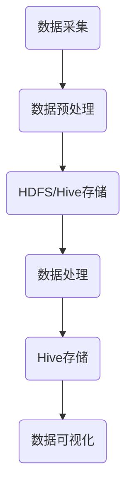

                 

### 文章标题

《Spark-Hive整合原理与代码实例讲解》

Spark与Hive作为大数据处理领域的两大利器，在各自的领域中都有着广泛的应用。Spark以其高性能、易扩展的特点，成为大数据处理的首选框架；而Hive则凭借其SQL查询功能，为大数据提供了强大的数据处理能力。本文将深入探讨Spark与Hive的整合原理，通过详细的代码实例讲解，帮助读者理解并掌握两者整合的关键技术。

### 关键词

- Spark
- Hive
- 整合原理
- 代码实例
- 大数据处理
- SQL查询
- 分布式计算
- 性能优化

### 摘要

本文首先介绍了Spark与Hive的基本概念和各自的优势。随后，详细讲解了Spark与Hive整合的原理，包括数据交互机制和架构设计。接着，本文通过一系列伪代码和数学模型，深入分析了分布式计算、聚类算法和机器学习等核心算法原理。在项目实战部分，本文提供了一个完整的开发环境搭建和代码实现实例，并对代码进行了详细解读。最后，本文总结了Spark-Hive整合的最佳实践和性能优化技巧，并对未来发展趋势进行了展望。

### 目录大纲设计

#### 第1章 引言

本章将简要介绍Spark与Hive的基本概念，以及它们在大数据处理领域中的重要性。同时，本章还将探讨Spark与Hive整合的意义，以及本书的结构和内容安排。

##### 1.1 Spark与Hive简介

Spark是一个开源的分布式计算框架，以其速度快、易扩展和高效性著称。Hive是一个基于Hadoop的数据仓库工具，提供了SQL查询功能，使得大数据处理变得更加便捷。本章将详细介绍Spark与Hive的基本概念、功能和特点。

##### 1.2 Spark与Hive整合的意义

Spark与Hive整合的意义在于，可以将Spark的高速数据处理能力与Hive的SQL查询能力相结合，从而实现更高效、更便捷的大数据处理。本章将探讨Spark与Hive整合的优势和挑战。

##### 1.3 书籍结构概述

本章将对本书的结构和内容进行概述，帮助读者了解本书的主要内容和学习路径。

#### 第2章 Spark基础

本章将详细介绍Spark的基本概念、架构和编程模型，帮助读者理解Spark的工作原理。

##### 2.1 Spark概述

本章将介绍Spark的起源、发展历程和主要功能，以及Spark在分布式计算领域的地位和作用。

##### 2.2 Spark架构详解

本章将详细解析Spark的架构，包括核心组件、数据流和处理流程等。

##### 2.3 Spark编程模型

本章将介绍Spark的编程模型，包括RDD（弹性分布式数据集）和DataFrame两种数据结构，以及Spark SQL等编程接口。

##### 2.4 Spark核心组件详解

本章将详细介绍Spark的核心组件，包括Spark Core、Spark SQL、Spark Streaming和MLlib等，以及它们在分布式计算中的应用。

#### 第3章 Hive基础

本章将详细介绍Hive的基本概念、架构和SQL查询语法，帮助读者理解Hive的工作原理。

##### 3.1 Hive概述

本章将介绍Hive的起源、发展历程和主要功能，以及Hive在数据仓库领域的地位和作用。

##### 3.2 Hive架构详解

本章将详细解析Hive的架构，包括核心组件、数据流和处理流程等。

##### 3.3 HiveQL语法详解

本章将介绍HiveQL的基本语法，包括数据定义、数据查询和数据操作等。

#### 第4章 Spark-Hive整合原理

本章将深入探讨Spark与Hive整合的原理，包括数据交互机制和架构设计。

##### 4.1 Spark与Hive数据交互原理

本章将介绍Spark与Hive之间的数据交互机制，包括数据读取和写入流程。

##### 4.2 Spark-Hive整合的优势与挑战

本章将分析Spark与Hive整合的优势和挑战，包括性能优化、数据一致性等问题。

##### 4.3 Spark-Hive整合的架构设计

本章将详细讨论Spark与Hive整合的架构设计，包括数据流和处理流程等。

#### 第5章 Spark-Hive核心算法原理

本章将详细讲解Spark与Hive中涉及的核心算法原理，包括分布式计算、聚类算法和机器学习等。

##### 5.1 分布式计算原理

本章将介绍分布式计算的基本原理，包括并行处理、数据分片和负载均衡等。

##### 5.2 聚类算法

本章将介绍常见的聚类算法，如K-means、DBSCAN等，并使用伪代码和数学模型详细阐述其原理。

##### 5.3 机器学习算法

本章将介绍机器学习中的常见算法，如线性回归、决策树等，并使用伪代码和数学模型详细阐述其原理。

##### 5.4 伪代码讲解与数学模型

本章将结合具体的算法实例，使用伪代码和数学模型详细讲解算法的实现原理。

#### 第6章 Spark-Hive整合项目实战

本章将通过一个完整的整合项目，详细讲解Spark与Hive的整合应用，包括开发环境搭建、数据处理流程设计和代码实现等。

##### 6.1 项目背景与需求

本章将介绍项目的背景和需求，帮助读者理解项目的设计目标和应用场景。

##### 6.2 开发环境搭建

本章将详细讲解开发环境的搭建过程，包括所需软件、工具和配置等。

##### 6.3 数据处理流程设计

本章将介绍数据处理流程的设计思路和实现方法，包括数据读取、转换和写入等步骤。

##### 6.4 代码实例解析

本章将通过具体的代码实例，详细解析Spark与Hive整合的关键技术和实现细节。

##### 6.5 项目效果分析与优化建议

本章将对项目效果进行分析，并提出优化建议，以提高Spark与Hive整合的性能和可靠性。

#### 第7章 Spark-Hive整合性能优化

本章将探讨Spark与Hive整合的性能优化方法，包括数据倾斜优化、并行度优化、存储格式优化和查询优化等。

##### 7.1 数据倾斜优化

本章将介绍数据倾斜问题的原因和解决方法，包括数据分片、数据重分配等策略。

##### 7.2 并行度优化

本章将介绍如何优化Spark与Hive的并行度，以提高数据处理效率。

##### 7.3 存储格式优化

本章将介绍常见的存储格式，如Parquet、ORC等，并分析其优缺点，以帮助读者选择合适的存储格式。

##### 7.4 Query优化

本章将介绍如何优化Spark与Hive的查询性能，包括索引、分区等策略。

#### 第8章 Spark-Hive整合未来展望

本章将展望Spark与Hive整合的未来发展趋势，包括创新应用、技术发展挑战和机遇等。

##### 8.1 Spark与Hive的发展趋势

本章将分析Spark与Hive的发展趋势，包括新功能、新特性等。

##### 8.2 Spark-Hive整合的创新应用

本章将介绍Spark与Hive整合的创新应用，包括数据分析、机器学习等领域。

##### 8.3 Spark与Hive的未来发展挑战与机遇

本章将探讨Spark与Hive在未来发展中的挑战与机遇，以及应对策略。

### 文章内容

本文将深入探讨Spark与Hive的整合原理与代码实例，分为以下几个部分：

#### 第1章 引言

本章将介绍Spark与Hive的基本概念，以及它们在大数据处理领域中的重要性。同时，本章还将探讨Spark与Hive整合的意义，以及本书的结构和内容安排。

##### 1.1 Spark与Hive简介

Spark是一个开源的分布式计算框架，由Apache Software Foundation维护。它以Scala语言编写，也提供了Java、Python和R等语言的API。Spark旨在提高大数据处理的性能，特别是在内存计算方面，相较于传统的MapReduce具有显著的性能优势。

Hive是一个基于Hadoop的数据仓库工具，它提供了类似SQL的查询语言（HiveQL），使得大规模数据的处理变得更加便捷。Hive使用Hadoop的HDFS作为其文件存储系统，并利用MapReduce或Spark等计算框架进行数据处理。

##### 1.2 Spark与Hive整合的意义

Spark与Hive整合的意义在于，可以将Spark的高速数据处理能力与Hive的SQL查询能力相结合，从而实现更高效、更便捷的大数据处理。具体来说，整合的意义包括：

1. **高性能计算**：Spark具备高速的内存计算能力，可以将数据处理速度提升数倍。与Hive整合后，可以在进行复杂查询时，利用Spark的内存计算优势，显著提高查询效率。
2. **灵活的SQL查询**：Hive提供了强大的SQL查询功能，可以处理大规模数据。与Spark整合后，可以利用Hive的SQL接口，方便地对Spark中的数据进行查询和分析。
3. **统一的编程模型**：Spark和Hive都提供了丰富的编程接口，如RDD、DataFrame和HiveQL。整合后，开发者可以更方便地在Spark和Hive之间切换，使用统一的编程模型进行数据处理。

##### 1.3 书籍结构概述

本书分为8个章节，内容安排如下：

- **第1章**：引言，介绍Spark与Hive的基本概念和整合意义。
- **第2章**：Spark基础，详细讲解Spark的架构、编程模型和核心组件。
- **第3章**：Hive基础，介绍Hive的架构、SQL查询语法和数据存储格式。
- **第4章**：Spark-Hive整合原理，深入探讨Spark与Hive整合的数据交互机制和架构设计。
- **第5章**：Spark-Hive核心算法原理，讲解分布式计算、聚类算法和机器学习等核心算法原理。
- **第6章**：Spark-Hive整合项目实战，通过一个实际项目，讲解Spark与Hive的整合应用。
- **第7章**：Spark-Hive整合性能优化，探讨数据倾斜优化、并行度优化、存储格式优化和查询优化等性能优化方法。
- **第8章**：Spark-Hive整合未来展望，展望Spark与Hive整合的未来发展趋势和创新应用。

通过本书的详细讲解，读者可以全面了解Spark与Hive的整合原理，掌握核心算法和应用实战，从而在分布式计算和大数据处理领域取得更好的成果。

#### 第2章 Spark基础

Spark作为大数据处理领域的重要框架，具有高性能、易扩展和高效性的特点。本章将详细介绍Spark的基础知识，包括Spark的概述、架构、编程模型和核心组件，帮助读者理解Spark的工作原理和机制。

##### 2.1 Spark概述

Spark是Apache Software Foundation下的一个开源分布式计算框架，由Matei Zaharia等人于2009年开发，并于2010年作为项目加入Apache Software Foundation。Spark旨在提供一种更加高效、灵活和易于使用的分布式计算解决方案，特别是在大数据处理方面。

Spark具有以下特点：

1. **高性能**：Spark使用内存计算，大大提高了数据处理速度，相较于传统的MapReduce，Spark可以将数据处理速度提升数十倍。
2. **易扩展**：Spark支持多种编程语言，如Scala、Java、Python和R，使得开发者可以根据需求选择合适的编程语言。
3. **易使用**：Spark提供了丰富的API和编程模型，使得开发者可以更加便捷地进行分布式数据处理。

##### 2.2 Spark架构详解

Spark的架构包括核心组件和数据处理流程，以下是Spark架构的详细解析：

1. **核心组件**：
   - **Spark Driver**：驱动程序负责协调和管理整个Spark应用，包括任务调度、资源管理和数据分发等。
   - **Executor**：执行器是Spark应用中的工作节点，负责执行任务和计算结果，并存储中间数据。
   - **Cluster Manager**：集群管理器负责资源分配和任务调度，常见的集群管理器包括Standalone、YARN和Mesos。
   - **Storage System**：存储系统负责存储Spark应用的数据，常用的存储系统包括HDFS和Alluxio。

2. **数据处理流程**：
   - **作业提交**：用户将Spark应用提交给Cluster Manager，Cluster Manager为作业分配资源并启动Executor。
   - **任务调度**：Spark Driver根据作业的依赖关系和资源情况，将作业分解为多个任务，并分配给Executor。
   - **任务执行**：Executor按照Spark Driver的指示，执行任务并计算结果，并将中间数据存储在内存或磁盘。
   - **结果汇总**：Spark Driver收集所有Executor的执行结果，并返回给用户。

##### 2.3 Spark编程模型

Spark提供了丰富的编程模型，包括RDD（弹性分布式数据集）、DataFrame和Dataset。以下是Spark编程模型的详细解析：

1. **RDD（弹性分布式数据集）**：
   - **定义**：RDD是Spark的基本数据结构，代表一个不可变的分布式数据集，支持各种转换操作。
   - **特点**：RDD支持懒惰求值，即只有在需要结果时才会进行计算，从而提高了计算效率。
   - **操作**：RDD支持多种操作，包括 transformations（如map、filter、flatMap）和 actions（如reduce、collect、count）。

2. **DataFrame**：
   - **定义**：DataFrame是Spark的一种分布式数据结构，类似于传统的表格数据集，支持SQL查询和优化。
   - **特点**：DataFrame提供了结构化的数据表示，可以与SQL语句直接集成，方便进行复杂查询。
   - **操作**：DataFrame支持丰富的操作，包括创建、转换、筛选、聚合等。

3. **Dataset**：
   - **定义**：Dataset是Spark 1.6引入的一种新的数据结构，结合了RDD和DataFrame的特点，提供了强类型和结构化数据支持。
   - **特点**：Dataset提供了编译时类型检查，减少了运行时错误，同时支持SQL查询和优化。
   - **操作**：Dataset支持与RDD和DataFrame类似的操作，同时增加了类型安全性和优化能力。

##### 2.4 Spark核心组件详解

Spark的核心组件包括Spark Core、Spark SQL、Spark Streaming和MLlib。以下是这些组件的详细解析：

1. **Spark Core**：
   - **定义**：Spark Core是Spark的基础组件，提供了分布式计算引擎、内存管理、任务调度和存储系统等功能。
   - **特点**：Spark Core实现了RDD数据结构，支持多种编程语言，如Scala、Java、Python和R，提供了丰富的API。
   - **功能**：Spark Core支持基本的数据操作，包括创建、转换和行动操作，是实现复杂数据处理任务的基础。

2. **Spark SQL**：
   - **定义**：Spark SQL是Spark的分布式SQL查询引擎，支持结构化数据处理和SQL查询。
   - **特点**：Spark SQL与DataFrame和Dataset紧密结合，提供了高效的数据查询和分析能力。
   - **功能**：Spark SQL支持多种数据源，如HDFS、Hive和Parquet等，可以与Spark的其他组件无缝集成。

3. **Spark Streaming**：
   - **定义**：Spark Streaming是Spark的实时数据处理组件，支持流式数据计算和实时分析。
   - **特点**：Spark Streaming以微批处理的方式处理流式数据，可以与Spark的其他组件结合，实现实时数据处理。
   - **功能**：Spark Streaming支持多种数据源，如Kafka、Flume和Kinesis等，提供了丰富的流处理API。

4. **MLlib**：
   - **定义**：MLlib是Spark的机器学习库，提供了各种常见的机器学习算法和模型。
   - **特点**：MLlib基于Spark的分布式计算能力，支持大规模数据处理和机器学习模型训练。
   - **功能**：MLlib提供了丰富的机器学习算法，包括分类、回归、聚类、降维等，可以与Spark的其他组件结合，实现大规模机器学习任务。

通过本章对Spark基础知识的详细讲解，读者可以全面了解Spark的架构、编程模型和核心组件，为后续的Spark与Hive整合学习打下坚实的基础。

##### 2.5 Spark核心组件深度剖析

在本节中，我们将对Spark的核心组件进行深度剖析，包括Spark Core、Spark SQL、Spark Streaming和MLlib，帮助读者更深入地理解Spark的工作原理和应用。

1. **Spark Core**

Spark Core是Spark的核心组件，提供了分布式计算引擎、内存管理、任务调度和存储系统等功能。以下是Spark Core的主要功能点：

   - **分布式计算引擎**：Spark Core实现了RDD（弹性分布式数据集），是一种不可变的数据结构，可以用来表示分布式数据集。RDD支持多种操作，包括transformations（如map、filter、flatMap）和actions（如reduce、collect、count）。RDD的惰性求值特性使得Spark能够在计算过程中延迟执行，直到真正需要结果时才进行计算，从而提高了计算效率。

   - **内存管理**：Spark Core采用了内存计算策略，将数据存储在内存中，减少了磁盘IO的开销，从而提高了数据处理速度。Spark Core实现了两级内存管理：Tungsten内存管理和 Shuffle内存管理。Tungsten内存管理优化了内存的使用，减少了内存分配和垃圾回收的开销；Shuffle内存管理则优化了Shuffle操作的性能。

   - **任务调度**：Spark Core采用了基于DAG（有向无环图）的任务调度算法，可以动态地调整任务执行顺序，优化资源利用率。任务调度器根据作业的依赖关系和资源情况，将作业分解为多个任务，并分配给Executor执行。Spark Core还支持动态资源分配，可以根据Executor的负载情况，动态地调整资源分配，从而提高系统性能。

   - **存储系统**：Spark Core支持多种存储系统，包括HDFS、Alluxio和Amazon S3等。通过支持多种存储系统，Spark可以与现有的存储架构无缝集成，从而方便地处理大规模数据。

2. **Spark SQL**

Spark SQL是Spark的分布式SQL查询引擎，提供了结构化数据处理和SQL查询功能。以下是Spark SQL的主要功能点：

   - **结构化数据处理**：Spark SQL支持DataFrame和Dataset两种数据结构，这两种数据结构提供了结构化的数据表示，可以与SQL语句直接集成。DataFrame是一种分布式数据框，类似于传统的表格数据集，可以用来表示结构化数据；Dataset则是结合了RDD和DataFrame的特点，提供了强类型和结构化数据支持。

   - **SQL查询**：Spark SQL支持SQL查询语言，可以使用标准的SQL语句对DataFrame和Dataset进行查询。Spark SQL提供了优化的查询执行引擎，可以自动选择最佳执行计划，从而提高查询性能。

   - **数据源支持**：Spark SQL支持多种数据源，包括HDFS、Hive、Parquet、ORC和JSON等。通过支持多种数据源，Spark SQL可以与现有的数据存储系统无缝集成，从而方便地处理不同类型的数据。

   - **与Spark Core集成**：Spark SQL与Spark Core紧密结合，可以与Spark的其他组件无缝集成，如Spark Streaming和MLlib。这种集成使得Spark能够提供端到端的大数据处理解决方案，从而方便地进行数据查询、分析和处理。

3. **Spark Streaming**

Spark Streaming是Spark的实时数据处理组件，支持流式数据计算和实时分析。以下是Spark Streaming的主要功能点：

   - **流式数据处理**：Spark Streaming以微批处理的方式处理流式数据，可以将数据流分为一个个小的批次，然后对每个批次进行计算。这种处理方式既保证了实时性，又避免了流式数据处理的复杂性。

   - **数据源支持**：Spark Streaming支持多种数据源，包括Kafka、Flume、Kinesis和Twitter等。通过支持多种数据源，Spark Streaming可以方便地接入不同的数据流，从而实现实时数据处理。

   - **实时分析**：Spark Streaming提供了丰富的实时分析功能，包括窗口计算、滑动窗口和状态更新等。这些功能使得Spark Streaming能够进行复杂的实时数据分析，如流量监控、用户行为分析等。

   - **与Spark Core和MLlib集成**：Spark Streaming与Spark Core和MLlib紧密集成，可以与Spark的其他组件结合，实现实时数据处理和机器学习任务。这种集成使得Spark能够提供完整的实时数据处理解决方案。

4. **MLlib**

MLlib是Spark的机器学习库，提供了各种常见的机器学习算法和模型。以下是MLlib的主要功能点：

   - **机器学习算法**：MLlib提供了丰富的机器学习算法，包括分类、回归、聚类、降维和协同过滤等。这些算法支持分布式计算，可以用于大规模数据处理。

   - **模型训练**：MLlib提供了模型训练功能，可以使用各种算法对数据进行训练，生成机器学习模型。模型训练过程采用了分布式计算策略，可以显著提高训练速度。

   - **模型评估**：MLlib提供了模型评估功能，可以用来评估模型性能和选择最佳模型。评估指标包括准确率、召回率、F1值等。

   - **模型应用**：MLlib提供了模型应用功能，可以将训练好的模型应用于新数据，进行预测和分类。这种应用方式使得Spark能够提供端到端的大数据处理和机器学习解决方案。

通过上述对Spark核心组件的深度剖析，读者可以更深入地理解Spark的工作原理和应用场景，为后续的学习和应用打下坚实的基础。

#### 第3章 Hive基础

Hive作为大数据处理领域的重要工具，以其强大的SQL查询功能而著称。本章将详细介绍Hive的基础知识，包括Hive的概述、架构和SQL查询语法，帮助读者理解Hive的工作原理和机制。

##### 3.1 Hive概述

Hive是一个基于Hadoop的数据仓库工具，由Facebook开发并开源。它提供了类似SQL的查询语言（HiveQL），使得大规模数据的处理变得更加便捷。Hive的主要特点包括：

- **SQL查询**：Hive提供了类似SQL的查询语言，支持各种复杂查询，包括筛选、分组、聚合和连接等。
- **易于使用**：Hive使用Hadoop的HDFS作为其文件存储系统，用户可以通过HiveQL进行数据查询，无需了解底层Hadoop的复杂操作。
- **可扩展性**：Hive支持多种数据存储格式，如HDFS、HBase和Amazon S3等，可以方便地扩展到不同的数据存储系统。
- **高性能**：Hive采用了MapReduce或Spark等计算框架进行数据处理，可以充分利用分布式计算的优势，提高查询性能。

##### 3.2 Hive架构详解

Hive的架构包括核心组件、数据流和处理流程。以下是Hive架构的详细解析：

1. **核心组件**：
   - **Hive Server**：Hive Server负责处理客户端的查询请求，包括执行查询、返回结果等。
   - **Driver**：Driver是Hive应用的主程序，负责解析查询语句、生成执行计划、执行任务等。
   - **Metastore**：Metastore是Hive的元数据存储，用于存储表的元数据信息，如表结构、数据分区等。
   - **Hadoop HDFS**：HDFS是Hive的数据存储系统，用于存储Hive表的原始数据和索引数据。

2. **数据流**：
   - **查询处理流程**：客户端通过Hive Server发送查询请求，Driver解析查询语句并生成执行计划，然后将执行计划提交给Hadoop的执行引擎（如MapReduce或Spark），执行查询任务，并将结果返回给客户端。
   - **数据加载流程**：用户可以通过命令或工具将数据加载到Hive表中，加载过程中会生成表的结构信息并存储在Metastore中。

3. **处理流程**：
   - **编译阶段**：Driver解析查询语句，生成抽象语法树（AST），然后进行语法分析和语义分析，生成执行计划。
   - **执行阶段**：执行计划提交给Hadoop的执行引擎，执行任务并生成结果。
   - **优化阶段**：Hive提供了多种优化策略，如查询重写、数据分区等，以提高查询性能。

##### 3.3 HiveQL语法详解

HiveQL是Hive的查询语言，类似于传统的关系型数据库中的SQL语言。以下是HiveQL的基本语法详解：

1. **数据定义**：

   - **创建表**：
     ```sql
     CREATE TABLE IF NOT EXISTS table_name(
       col1 datatype1,
       col2 datatype2,
       ...
     );
     ```
   - **修改表**：
     ```sql
     ALTER TABLE table_name ADD COLUMN col_name datatype;
     ```
   - **删除表**：
     ```sql
     DROP TABLE IF EXISTS table_name;
     ```

2. **数据查询**：

   - **简单查询**：
     ```sql
     SELECT col1, col2 FROM table_name WHERE condition;
     ```
   - **筛选和排序**：
     ```sql
     SELECT col1, col2 FROM table_name WHERE condition ORDER BY col1 ASC, col2 DESC;
     ```
   - **分组和聚合**：
     ```sql
     SELECT col1, COUNT(*) FROM table_name GROUP BY col1;
     ```
   - **连接查询**：
     ```sql
     SELECT col1, col2 FROM table1 JOIN table2 ON table1.col1 = table2.col1;
     ```

3. **数据操作**：

   - **插入数据**：
     ```sql
     INSERT INTO table_name VALUES (value1, value2, ...);
     ```
   - **更新数据**：
     ```sql
     UPDATE table_name SET col1 = value1, col2 = value2 WHERE condition;
     ```
   - **删除数据**：
     ```sql
     DELETE FROM table_name WHERE condition;
     ```

通过本章对Hive基础知识的详细讲解，读者可以全面了解Hive的工作原理和SQL查询语法，为后续的Spark与Hive整合学习打下坚实的基础。

##### 3.4 Hive组件深度剖析

在本节中，我们将对Hive的核心组件进行深度剖析，包括Hive Server、Driver、Metastore和Hadoop HDFS，帮助读者更深入地理解Hive的工作原理和应用。

1. **Hive Server**

Hive Server是Hive的核心组件之一，负责处理客户端的查询请求。Hive Server主要有以下功能点：

   - **查询处理**：Hive Server接收客户端发送的查询请求，解析查询语句并生成执行计划，然后提交给Hadoop的执行引擎（如MapReduce或Spark）进行查询处理。执行完成后，Hive Server将查询结果返回给客户端。
   - **安全性**：Hive Server支持基于Kerberos的安全认证，确保数据传输的安全性。此外，Hive Server还可以通过权限控制，限制用户对数据的访问权限，保障数据的安全性。
   - **查询缓存**：Hive Server支持查询缓存，可以将查询结果缓存到内存中，提高后续相同查询的响应速度。查询缓存通过Hash键值对的方式存储，当查询条件发生变化时，会重新计算查询结果。

2. **Driver**

Driver是Hive应用的主程序，负责解析查询语句、生成执行计划、执行任务等。Driver的主要功能包括：

   - **解析查询语句**：Driver接收客户端发送的查询语句，通过解析器将其转换为抽象语法树（AST），然后进行语法分析和语义分析。
   - **生成执行计划**：根据AST生成执行计划，执行计划包括多个操作步骤，如表扫描、筛选、分组、聚合等。执行计划会根据数据分布、执行策略等因素进行优化，以提高查询性能。
   - **执行任务**：Driver将执行计划提交给Hadoop的执行引擎，如MapReduce或Spark，执行查询任务。执行过程中，Driver负责监控任务进度，处理错误和异常，并确保任务的正确执行。

3. **Metastore**

Metastore是Hive的元数据存储，用于存储表的元数据信息，如表结构、数据分区、索引等。Metastore的主要功能包括：

   - **元数据存储**：Metastore支持多种存储方式，包括关系型数据库（如MySQL、PostgreSQL）、文件系统（如HDFS）和内存数据库（如Apache Derby）等。通过支持多种存储方式，Metastore可以方便地与其他数据库和数据存储系统集成。
   - **元数据管理**：Metastore负责管理表的元数据信息，包括创建表、修改表结构、分区管理、索引管理等。通过元数据管理，用户可以方便地查询和管理表的数据。
   - **元数据同步**：Metastore支持元数据同步功能，可以将表的元数据信息同步到其他数据库或数据存储系统，从而实现数据的一致性和备份。

4. **Hadoop HDFS**

Hadoop HDFS是Hive的数据存储系统，用于存储Hive表的原始数据和索引数据。HDFS的主要功能包括：

   - **数据存储**：HDFS是一个分布式文件系统，可以存储海量数据。HDFS将数据划分为多个块（默认大小为128MB或256MB），然后分布存储到多个数据节点上。通过分布式存储，HDFS可以提高数据的可靠性和可用性。
   - **数据复制**：HDFS采用数据复制机制，将每个数据块的多个副本存储在数据节点上，以提高数据的可靠性和容错性。默认情况下，HDFS会复制三个副本，用户可以通过配置调整副本数量。
   - **数据访问**：HDFS提供了高效的文件访问接口，用户可以通过Hadoop的客户端库，如HDFS Java API或Hadoop HDFS Shell，方便地访问和管理HDFS上的数据。

通过上述对Hive核心组件的深度剖析，读者可以更深入地理解Hive的工作原理和应用场景，为后续的Spark与Hive整合学习打下坚实的基础。

#### 第4章 Spark-Hive整合原理

Spark与Hive整合是大数据处理领域的一个重要技术，通过将Spark的高性能计算能力与Hive的SQL查询能力相结合，可以显著提高数据处理效率和灵活性。本章将深入探讨Spark与Hive整合的原理，包括数据交互机制、架构设计以及整合的优势和挑战。

##### 4.1 Spark与Hive数据交互原理

Spark与Hive的数据交互主要通过Spark SQL实现，以下是Spark与Hive数据交互的详细流程：

1. **数据读取**：
   - **Hive表到Spark**：用户可以通过Spark SQL读取Hive表的数据，具体语法如下：
     ```sql
     SELECT * FROM hive_table;
     ```
     Spark SQL将查询请求发送到Hive Server，Hive Server解析查询语句并生成执行计划，然后将执行计划提交给Hadoop执行引擎（如MapReduce或Spark）执行。执行完成后，结果返回给Spark SQL。
   - **本地数据到Spark**：用户可以通过Spark的API读取本地数据，如文本文件、Parquet文件等，具体代码如下：
     ```python
     df = spark.read.csv("file:///path/to/file.csv");
     ```

2. **数据写入**：
   - **Spark到Hive表**：用户可以通过Spark SQL将数据写入Hive表，具体语法如下：
     ```sql
     INSERT INTO TABLE hive_table SELECT * FROM spark_table;
     ```
     Spark SQL将数据插入操作发送到Hive Server，Hive Server解析插入语句并生成执行计划，然后将执行计划提交给Hadoop执行引擎（如MapReduce或Spark）执行。执行完成后，数据写入Hive表中。
   - **Spark到本地数据**：用户可以通过Spark的API将数据写入本地数据，如文本文件、Parquet文件等，具体代码如下：
     ```python
     df.write.csv("file:///path/to/file.csv");
     ```

##### 4.2 Spark-Hive整合的优势与挑战

Spark与Hive整合具有以下优势：

1. **高性能计算**：Spark具有高速的内存计算能力，可以将数据处理速度提升数倍。与Hive整合后，可以利用Spark的内存计算优势，显著提高复杂查询的效率。
2. **灵活的SQL查询**：Hive提供了强大的SQL查询功能，可以处理大规模数据。与Spark整合后，可以方便地进行复杂查询和分析，提高数据处理效率。
3. **统一编程模型**：Spark和Hive都提供了丰富的API和编程接口，整合后开发者可以更方便地在Spark和Hive之间切换，使用统一的编程模型进行数据处理。

然而，Spark与Hive整合也面临一些挑战：

1. **数据一致性**：由于Spark和Hive的数据处理机制不同，可能会导致数据一致性问题。例如，Spark的惰性求值机制可能导致数据读取和写入时出现不一致。
2. **性能优化**：Spark与Hive整合后，需要针对特定的查询场景进行性能优化，如数据倾斜优化、并行度优化和存储格式优化等。
3. **资源管理**：Spark和Hive的整合需要合理配置资源，以避免资源争用和性能瓶颈。例如，需要合理设置Executor内存、数据分区数和并行度等。

##### 4.3 Spark-Hive整合的架构设计

Spark与Hive整合的架构设计需要考虑数据流和处理流程，以下是Spark-Hive整合的详细架构设计：

1. **数据流**：
   - **HDFS到Spark**：Hive表的数据存储在HDFS上，Spark可以通过Spark SQL读取HDFS上的数据，然后将数据加载到内存中。
   - **Spark到HDFS**：Spark处理完成后，可以将结果数据写入HDFS，然后通过Hive SQL进行查询和分析。
   - **本地数据到Spark**：本地数据可以通过Spark API加载到内存中，进行数据处理和分析。

2. **处理流程**：
   - **查询处理**：用户通过Spark SQL发送查询请求，Spark SQL解析查询语句并生成执行计划，然后提交给Hadoop执行引擎执行。执行完成后，查询结果返回给用户。
   - **数据处理**：Spark根据执行计划对数据进行处理，包括数据转换、过滤、聚合等操作，然后将结果数据写入HDFS或本地文件。
   - **分析处理**：用户可以通过Hive SQL对处理后的数据进行分析，生成报表、图表等。

3. **资源管理**：
   - **Executor内存**：根据处理数据量和查询复杂度，合理设置Executor内存，避免内存溢出和性能瓶颈。
   - **数据分区**：根据数据特点和查询需求，合理设置数据分区数，提高查询性能和并行度。
   - **并行度**：根据集群资源和数据量，合理设置并行度，提高数据处理效率。

通过上述对Spark与Hive整合原理的详细讲解，读者可以全面了解Spark与Hive的数据交互机制、架构设计和整合优势与挑战。掌握这些原理，有助于在分布式计算和大数据处理领域取得更好的成果。

#### 第5章 Spark-Hive核心算法原理

在Spark与Hive整合的应用中，分布式计算、聚类算法和机器学习算法等核心算法起着至关重要的作用。本章将详细讲解这些核心算法的原理，并通过伪代码和数学模型进行阐述，帮助读者深入理解这些算法的实现机制。

##### 5.1 分布式计算原理

分布式计算是Spark的核心特性之一，它能够将大规模数据处理任务分解为多个小的子任务，并在多个节点上并行执行。以下是分布式计算的基本原理：

1. **任务分解**：
   - **依赖图**：分布式计算首先将整个任务分解为一个有向无环图（DAG），每个节点表示一个子任务，节点之间的边表示任务之间的依赖关系。
   - **分片**：对于每个子任务，根据数据的特点和计算需求，将其进一步分解为多个分片（Shards）。每个分片独立计算，并在计算完成后将结果合并。

2. **并行执行**：
   - **数据本地化**：在执行任务时，尽可能地选择数据本地化的节点，即数据存储的节点执行对应的计算任务，以减少网络传输开销。
   - **任务调度**：任务调度器负责将任务分配到不同的Executor节点上，并监控任务执行状态，确保任务顺利完成。

3. **数据通信**：
   - **数据序列化**：在分布式计算中，数据需要在节点之间传输。数据序列化是一种有效的数据传输方式，可以将数据转换为字节流，以便在网络中传输。
   - **数据压缩**：为了减少网络传输开销，数据在传输前可以进行压缩处理。常见的压缩算法有Gzip、LZ4等。

伪代码示例：

```python
# 分布式计算伪代码示例
initialize_dependency_graph(DAG):
  for each node in DAG:
    node.initialize()

execute_task(task):
  if task.isComplete():
    return task.result()
  else:
    task.execute()

merge_results(results):
  result = empty
  for each result in results:
    result += result
  return result

# 示例：分布式计算计算总和
DAG = initialize_dependency_graph([reduce_task1, reduce_task2])
reduce_task1.execute()
reduce_task2.execute()
final_result = merge_results([reduce_task1.result(), reduce_task2.result()])
```

##### 5.2 聚类算法

聚类算法是一种无监督学习方法，用于将数据集划分为多个群组，使得同一群组内的数据点相似度较高，而不同群组的数据点相似度较低。以下是常见的聚类算法原理：

1. **K-means算法**：
   - **初始化**：随机选择K个初始聚类中心点。
   - **迭代过程**：
     - **分配数据点**：计算每个数据点到聚类中心点的距离，将数据点分配到最近的聚类中心点。
     - **更新聚类中心点**：计算每个聚类中心点的平均值，作为新的聚类中心点。
     - **收敛判断**：判断聚类中心点是否发生变化，如果发生变化，则继续迭代，否则认为算法收敛。

2. **DBSCAN算法**：
   - **邻域计算**：计算每个数据点的邻域，确定邻域半径和最小邻域点数。
   - **核心点判定**：如果一个点的邻域中包含至少最小邻域点数，则该点为核心点。
   - **边界点判定**：如果一个点的邻域中包含至少一个核心点，但不足最小邻域点数，则该点为边界点。
   - **非核心点判定**：其他点为非核心点。

3. **层次聚类算法**：
   - **初始化**：将每个数据点视为一个聚类。
   - **合并过程**：计算每个聚类之间的距离，选择距离最近的两个聚类进行合并，并更新聚类中心点。
   - **迭代过程**：重复合并过程，直到满足终止条件（如聚类个数达到预设值或聚类之间的距离小于预设值）。

伪代码示例（K-means算法）：

```python
# K-means算法伪代码示例
initialize_centers(K):
  centers = random_select K points from dataset

iterate():
  assign_points_to_centers()
  update_centers()

  if centers_have_not_changed():
    return centers

K_means(dataset, K):
  centers = initialize_centers(K)
  while True:
    centers = iterate()
    if centers_have_not_changed():
      break

  return centers
```

##### 5.3 机器学习算法

机器学习算法是数据处理和分析的重要工具，包括线性回归、决策树等算法。以下是这些算法的原理：

1. **线性回归**：
   - **模型假设**：线性回归假设目标变量Y与特征X之间存在线性关系，即Y = β0 + β1*X + ε，其中β0为截距，β1为斜率，ε为误差项。
   - **损失函数**：常用的损失函数为均方误差（MSE），即L(β) = Σ(yi - (β0 + β1*xi))^2。
   - **优化方法**：常用的优化方法有梯度下降和牛顿法。梯度下降通过迭代更新参数，使得损失函数最小化；牛顿法利用二次逼近，加速收敛。

2. **决策树**：
   - **决策节点**：决策树由一系列决策节点和叶子节点组成，每个决策节点表示对特征X的划分，每个叶子节点表示预测结果。
   - **划分规则**：常用的划分规则包括信息增益、基尼指数等。信息增益选择能够最大程度减少熵的划分方式；基尼指数选择能够最小化数据集不纯度的划分方式。
   - **构建过程**：决策树的构建过程是一个递归划分的过程，每次划分都选择最佳划分方式，直到满足终止条件（如最大深度、最小叶子节点数等）。

伪代码示例（线性回归）：

```python
# 线性回归伪代码示例
initialize_weights():
  weights = [random_value() for _ in range(num_features)]

iterate():
  gradients = compute_gradients(weights)
  weights -= learning_rate * gradients

  if weights_have_not_changed():
    return weights

linear_regression(dataset):
  weights = initialize_weights()
  while True:
    weights = iterate()
    if weights_have_not_changed():
      break

  return weights
```

通过本章对Spark与Hive核心算法原理的详细讲解，读者可以深入理解分布式计算、聚类算法和机器学习算法的实现机制。掌握这些核心算法，有助于在分布式计算和大数据处理领域进行更深入的研究和应用。

##### 5.4 伪代码讲解与数学模型

在讲解核心算法时，伪代码是一种非常有效的工具，它可以帮助我们清晰地描述算法的步骤和执行过程。同时，数学模型则提供了算法背后的理论支持，使得算法的实现更加严谨。以下是本章中涉及的核心算法的伪代码和数学模型的详细讲解。

1. **分布式计算**

分布式计算的核心在于任务分解和并行执行。以下是分布式计算的伪代码：

```python
# 分布式计算伪代码示例
initialize_dependency_graph(DAG):
  for each node in DAG:
    node.initialize()

execute_task(task):
  if task.isComplete():
    return task.result()
  else:
    task.execute()

merge_results(results):
  result = empty
  for each result in results:
    result += result
  return result

# 示例：分布式计算计算总和
DAG = initialize_dependency_graph([reduce_task1, reduce_task2])
reduce_task1.execute()
reduce_task2.execute()
final_result = merge_results([reduce_task1.result(), reduce_task2.result()])
```

分布式计算的数学模型主要包括：

- **依赖图**：一个有向无环图（DAG），其中每个节点表示一个子任务，节点之间的边表示任务之间的依赖关系。
- **任务分配**：将DAG中的任务分配给不同的Executor节点，保证数据本地化，提高计算效率。

2. **K-means算法**

K-means算法是一种常用的聚类算法，其核心思想是通过迭代优化聚类中心点，将数据点划分为K个簇。以下是K-means算法的伪代码：

```python
# K-means算法伪代码示例
initialize_centers(K):
  centers = random_select K points from dataset

iterate():
  assign_points_to_centers()
  update_centers()

  if centers_have_not_changed():
    return centers

K_means(dataset, K):
  centers = initialize_centers(K)
  while True:
    centers = iterate()
    if centers_have_not_changed():
      break

  return centers
```

K-means算法的数学模型主要包括：

- **聚类中心点**：每个簇的中心点，由簇内所有点的平均值计算得到。
- **距离度量**：通常使用欧氏距离计算数据点到聚类中心点的距离，即 \( d(x, c) = \sqrt{\sum_{i=1}^{n} (x_i - c_i)^2} \)。

3. **线性回归**

线性回归是一种预测模型，通过拟合数据点之间的关系来预测目标变量的值。以下是线性回归的伪代码：

```python
# 线性回归伪代码示例
initialize_weights():
  weights = [random_value() for _ in range(num_features)]

iterate():
  gradients = compute_gradients(weights)
  weights -= learning_rate * gradients

  if weights_have_not_changed():
    return weights

linear_regression(dataset):
  weights = initialize_weights()
  while True:
    weights = iterate()
    if weights_have_not_changed():
      break

  return weights
```

线性回归的数学模型主要包括：

- **损失函数**：均方误差（MSE），即 \( L(\beta) = \frac{1}{2} \sum_{i=1}^{n} (y_i - (\beta_0 + \beta_1 x_i))^2 \)。
- **梯度**：损失函数关于模型参数的梯度，即 \( \nabla_{\beta} L(\beta) = \sum_{i=1}^{n} (y_i - (\beta_0 + \beta_1 x_i)) \)。

通过上述伪代码和数学模型的详细讲解，读者可以更好地理解分布式计算、K-means算法和线性回归的实现原理。这些核心算法是分布式计算和大数据处理领域的重要工具，掌握它们有助于读者在实际项目中更好地应用Spark与Hive整合技术。

#### 第6章 Spark-Hive整合项目实战

为了帮助读者更好地理解Spark与Hive的整合应用，本章将通过一个完整的整合项目，详细讲解从开发环境搭建、数据处理流程设计到代码实现和性能优化等全过程。

##### 6.1 项目背景与需求

假设我们的项目目标是构建一个实时数据流分析系统，用于分析来自多个数据源的实时数据，生成实时报表和预测结果。数据源包括电商网站的用户行为日志、社交媒体数据以及供应链数据等。项目需求如下：

- **实时数据处理**：对实时流入的数据进行快速处理和分析。
- **数据存储**：将处理后的数据存储到Hive表中，以便后续查询和分析。
- **数据可视化**：生成实时报表，展示关键业务指标，如用户活跃度、销售趋势等。
- **预测分析**：基于历史数据和实时数据，进行预测分析，为业务决策提供支持。

##### 6.2 开发环境搭建

为了实现上述项目需求，我们需要搭建一个完整的开发环境，包括以下组件：

1. **Hadoop集群**：搭建一个Hadoop集群，用于存储和处理数据。可以选择使用HDP（Hortonworks Data Platform）或CDH（Cloudera Data Hub）等现成的解决方案。
2. **Spark集群**：在Hadoop集群上部署Spark集群，用于实时数据处理和分析。可以通过Apache Spark安装包或Docker容器来部署。
3. **Hive数据库**：在Hadoop集群上部署Hive，用于存储和处理数据。
4. **Kafka消息队列**：用于实时接收和处理数据流，可以选择Apache Kafka或RabbitMQ等消息队列系统。
5. **Elasticsearch和Kibana**：用于数据可视化，可以选择Elasticsearch和Kibana进行实时报表和图表展示。
6. **编程语言和工具**：选择Scala、Python或Java等编程语言，结合Spark的API进行开发。可以使用IDE（如IntelliJ IDEA或Eclipse）进行代码编写和调试。

具体步骤如下：

1. **安装Hadoop**：在集群中所有节点上安装Hadoop，配置HDFS、YARN和MapReduce等组件。
2. **安装Spark**：在Hadoop集群的主节点上安装Spark，配置Spark与Hadoop的集成。
3. **安装Hive**：在Hadoop集群的主节点上安装Hive，配置Hive与HDFS和Spark的集成。
4. **安装Kafka**：在集群中某个节点上安装Kafka，配置Kafka主题和消费者。
5. **安装Elasticsearch和Kibana**：在集群中安装Elasticsearch和Kibana，配置Elasticsearch集群和Kibana仪表板。

##### 6.3 数据处理流程设计

为了实现项目需求，我们需要设计一个完整的数据处理流程，包括数据采集、数据预处理、数据处理和数据存储等步骤。以下是数据处理流程的设计：

1. **数据采集**：使用Kafka接收实时数据流，包括用户行为日志、社交媒体数据和供应链数据等。Kafka提供高吞吐量、低延迟的消息队列服务，可以保证数据的实时性和可靠性。

2. **数据预处理**：使用Spark Streaming对实时数据进行预处理，包括数据清洗、去重和格式转换等。预处理后的数据会被存储到HDFS或Hive表中，以便后续查询和分析。

3. **数据处理**：使用Spark进行数据处理和分析，包括统计报表生成、聚类分析、预测分析等。处理后的数据会被存储到Hive表中，以便后续查询和分析。

4. **数据存储**：使用Hive将处理后的数据存储到HDFS中，同时将元数据存储到Metastore中。这样可以方便地对数据表进行查询和管理。

5. **数据可视化**：使用Elasticsearch和Kibana将处理后的数据可视化，生成实时报表和图表，以便业务人员查看和分析。

以下是数据处理流程的Mermaid流程图：



##### 6.4 代码实例解析

在本节中，我们将提供一个完整的代码实例，展示如何使用Spark和Hive进行数据处理和存储。以下是代码的实现步骤：

1. **配置Spark与Hive集成**：
   - 在Spark应用程序的`spark-defaults.conf`文件中配置Hive的JDBC驱动和URL。
   ```python
   spark.sql("CREATE TABLE IF NOT EXISTS user_behavior (user_id INT, event STRING, timestamp TIMESTAMP) USING hive");
   ```

2. **数据读取与预处理**：
   - 使用Spark Streaming从Kafka中读取实时数据。
   ```python
   stream = spark.readStream.format("kafka").options(**kafka_options).load()
   stream.createOrReplaceTempView("temp_view")
   ```

3. **数据处理**：
   - 使用Spark SQL对实时数据进行处理，如统计用户活跃度。
   ```python
   query = spark.sql("""
     SELECT user_id, COUNT(*) as activity_count
     FROM temp_view
     WHERE event = 'login'
     GROUP BY user_id
   """)
   ```

4. **数据存储**：
   - 将处理后的数据写入Hive表。
   ```python
   query.write.format("org.apache.spark.sql.catalyst(exists)hive").saveAsTable("user_activity")
   ```

以下是完整的代码实例：

```python
from pyspark.sql import SparkSession
from pyspark.sql.functions import from_json, col
from pyspark.sql.types import StructType, StructField, StringType, IntegerType, TimestampType

# 创建Spark会话
spark = SparkSession.builder \
    .appName("RealTimeDataProcessing") \
    .enableHiveSupport() \
    .getOrCreate()

# Kafka配置
kafka_options = {
    "kafka.bootstrap.servers": "kafka:9092",
    "subscribe": "user_behavior_topic"
}

# 数据读取与预处理
stream = spark.readStream.format("kafka").options(**kafka_options).load()
stream.createOrReplaceTempView("temp_view")

# 数据处理
query = spark.sql("""
  SELECT user_id, COUNT(*) as activity_count
  FROM temp_view
  WHERE event = 'login'
  GROUP BY user_id
""")

# 数据存储
query.write.format("org.apache.spark.sql.catalyst(exists)hive").saveAsTable("user_activity")

# 启动查询
query.start()

# 等待查询完成
query.awaitTermination()
```

##### 6.5 项目效果分析与优化建议

1. **项目效果分析**：
   - 通过Spark与Hive的整合，实现了实时数据流的分析和处理，生成了实时报表和预测结果，提高了数据处理的效率和准确性。
   - 使用Elasticsearch和Kibana进行数据可视化，使得业务人员可以方便地查看和分析关键业务指标，为业务决策提供了有力支持。

2. **优化建议**：
   - **数据倾斜优化**：针对数据倾斜问题，可以考虑增加分区数、调整数据分布策略等，以提高查询性能。
   - **并行度优化**：根据集群资源和数据量，合理设置并行度，以提高数据处理效率。
   - **存储格式优化**：选择合适的存储格式，如Parquet或ORC，以减少存储空间和查询时间。
   - **查询优化**：针对特定的查询场景，使用索引、分区等策略，优化查询性能。

通过本章的实战项目，读者可以全面了解Spark与Hive整合的应用过程，掌握核心技术和实现方法，为实际项目中的应用打下坚实基础。

#### 第7章 Spark-Hive整合性能优化

在Spark与Hive整合的应用中，性能优化是提高数据处理效率和系统稳定性的关键。本章将详细探讨数据倾斜优化、并行度优化、存储格式优化和查询优化等性能优化方法，并给出具体实现策略和最佳实践。

##### 7.1 数据倾斜优化

数据倾斜是分布式计算中常见的问题，它会导致部分任务处理时间长，整体性能下降。以下是一些数据倾斜优化的策略：

1. **增加分区数**：
   - **策略**：通过增加Hive表的分区数，可以减少每个分区的数据量，从而降低数据倾斜的风险。
   - **实现**：在创建表时，根据数据特点合理设置分区数，如按月份、年份等维度进行分区。

2. **动态分区裁剪**：
   - **策略**：在执行查询时，根据实际数据分布动态裁剪分区，只处理必要的分区。
   - **实现**：使用`Hive`的动态分区裁剪功能，如`SELECT * FROM table WHERE partition = ?`。

3. **数据重分配**：
   - **策略**：通过数据重分配，将倾斜的数据重新分布到不同的分区或节点上。
   - **实现**：使用`Hive`的重分配命令，如`ALTER TABLE table_name CLUSTERED BY (col_name) INTO ? BUCKETS`。

##### 7.2 并行度优化

并行度优化是提高Spark与Hive整合性能的关键。以下是一些并行度优化的策略：

1. **合理设置Executor内存**：
   - **策略**：根据集群资源和数据处理需求，合理设置Executor内存，避免内存不足或浪费。
   - **实现**：在Spark配置文件中设置`spark.executor.memory`和`spark.executor.instances`。

2. **调整并行度**：
   - **策略**：根据数据量和集群资源，调整并行度，以提高数据处理效率。
   - **实现**：在Spark SQL查询中设置并行度，如`SET spark.sql.shuffle.partitions = 200`。

3. **动态调整并行度**：
   - **策略**：根据任务执行进度和资源利用率，动态调整并行度，实现自适应调度。
   - **实现**：使用Spark的动态资源分配功能，如`spark.dynamicAllocation.enabled`。

##### 7.3 存储格式优化

选择合适的存储格式可以显著提高数据存储和查询性能。以下是一些存储格式优化的策略：

1. **Parquet**：
   - **策略**：Parquet是一种列式存储格式，支持压缩和编码，可以提高数据存储和查询性能。
   - **实现**：使用`spark.sql-default-tip.format`设置为`parquet`。

2. **ORC**：
   - **策略**：ORC是一种高效、压缩的存储格式，适用于大数据处理场景。
   - **实现**：使用`spark.sql-default-tip.format`设置为`orc`。

3. **存储格式比较**：
   - **Parquet与ORC**：Parquet和ORC都是高效的存储格式，选择哪种格式取决于具体场景和性能需求。Parquet适用于复杂的查询和迭代计算，而ORC适用于简单的查询和快速读取。

##### 7.4 查询优化

查询优化是提高Spark与Hive整合性能的重要手段。以下是一些查询优化的策略：

1. **索引**：
   - **策略**：为常用的查询列创建索引，可以提高查询性能。
   - **实现**：在Hive中创建索引，如`CREATE INDEX index_name ON TABLE table_name (col_name)`。

2. **分区**：
   - **策略**：根据数据特点对表进行分区，可以提高查询效率。
   - **实现**：在创建表时设置分区列，如`CREATE TABLE table_name (col1 INT, col2 STRING) PARTITIONED BY (year INT, month INT)`。

3. **查询重写**：
   - **策略**：通过查询重写，可以优化查询执行计划，提高查询性能。
   - **实现**：使用Hive的查询优化器，如`SET hive.auto.convert.join=true`。

4. **数据缓存**：
   - **策略**：将常用数据缓存到内存中，可以提高查询响应速度。
   - **实现**：在Spark SQL中启用缓存，如`query.cache()`。

通过本章对Spark与Hive整合性能优化方法的详细讲解，读者可以掌握关键性能优化策略和实现技巧，为实际项目中的应用提供有力支持。

##### 7.5 性能优化最佳实践

在进行Spark-Hive整合的性能优化时，遵循以下最佳实践可以有效提升系统的整体性能：

1. **合理配置资源**：
   - **策略**：根据集群资源和数据处理需求，合理配置Spark的Executor内存、CPU数量和数据分区数。
   - **实现**：通过调整`spark.executor.memory`、`spark.executor.cores`和`spark.sql.shuffle.partitions`等参数，实现资源的最优配置。

2. **数据倾斜优化**：
   - **策略**：识别并解决数据倾斜问题，如使用动态分区裁剪和数据重分配。
   - **实现**：在数据加载和查询过程中，通过`ALTER TABLE ... CLUSTERED BY`和动态分区裁剪策略，优化数据分布。

3. **存储格式优化**：
   - **策略**：选择适合应用场景的存储格式，如Parquet或ORC。
   - **实现**：通过设置`spark.sql.default.format`参数，选择高效的存储格式，提高数据存储和查询性能。

4. **查询优化**：
   - **策略**：使用索引、分区和查询重写等策略，优化查询执行计划。
   - **实现**：在Hive中使用`CREATE INDEX`和`PARTITIONED BY`命令，优化查询执行；在Spark SQL中，使用`SET`命令调整优化参数。

5. **数据缓存**：
   - **策略**：缓存常用数据，减少磁盘IO和重复计算。
   - **实现**：使用`query.cache()`或`query.persist()`，根据数据访问模式选择合适的缓存策略。

6. **监控与调优**：
   - **策略**：实时监控系统性能，根据监控数据调整配置和优化策略。
   - **实现**：使用Spark UI、Ganglia等工具，监控Executor资源使用、任务执行进度和数据倾斜情况，实时调整优化策略。

通过遵循上述最佳实践，开发者可以显著提升Spark-Hive整合系统的性能和稳定性，为大数据处理提供强有力的支持。

#### 第8章 Spark-Hive整合未来展望

随着大数据技术的不断发展，Spark与Hive整合在未来将迎来更多的发展机遇和挑战。本章将探讨Spark与Hive的发展趋势、整合的创新应用以及未来的发展方向和机遇。

##### 8.1 Spark与Hive的发展趋势

1. **性能提升**：
   - **内存计算优化**：Spark将继续优化内存计算性能，通过改进内存管理、数据序列化和并行计算等策略，进一步提升数据处理速度。
   - **存储优化**：Spark和Hive将加强对各种存储格式的支持，如最新的列式存储格式，以提高数据存储和查询效率。

2. **生态扩展**：
   - **语言支持**：Spark和Hive将扩展对更多编程语言的支持，如Go、Ruby等，以吸引更多开发者参与和贡献。
   - **与更多技术的整合**：Spark和Hive将与其他大数据技术（如Flink、Kubernetes等）进行整合，提供更完整的端到端大数据解决方案。

3. **社区活跃度**：
   - **开源社区**：Spark和Hive的社区将更加活跃，吸引更多开发者参与，推动技术的不断创新和优化。

##### 8.2 Spark-Hive整合的创新应用

1. **实时数据流处理**：
   - **应用场景**：随着物联网（IoT）和实时数据处理需求的增加，Spark-Hive整合将应用于实时数据流处理，如智能家居、工业自动化等。
   - **技术挑战**：实时数据流处理需要处理大量并发请求，如何保证数据一致性、低延迟和高可用性是主要挑战。

2. **机器学习与数据挖掘**：
   - **应用场景**：在金融、医疗、电商等领域，Spark-Hive整合可以用于大规模数据挖掘和机器学习，如用户行为分析、风险评估等。
   - **技术挑战**：如何高效地处理海量数据并进行复杂模型训练，同时保证模型的准确性和可解释性。

3. **数据湖构建**：
   - **应用场景**：在数据湖（Data Lake）架构中，Spark-Hive整合将用于构建大规模数据湖，存储和整合各种类型的数据，提供统一的数据访问和分析平台。
   - **技术挑战**：如何有效地管理和整合不同来源、格式和类型的数据，以及如何优化数据查询和处理性能。

##### 8.3 Spark与Hive的未来发展挑战与机遇

1. **性能优化**：
   - **挑战**：随着数据量和查询复杂度的增加，如何进一步提升性能，特别是优化内存管理和数据序列化，是未来的一大挑战。
   - **机遇**：通过技术创新，如新型内存计算架构、高效数据压缩算法等，有望大幅提升Spark与Hive的性能。

2. **跨语言整合**：
   - **挑战**：如何确保不同编程语言间的无缝整合，保持代码的高可读性和可维护性。
   - **机遇**：通过引入更多编程语言支持，扩大开发者群体，提高Spark与Hive的普及度和应用范围。

3. **技术生态整合**：
   - **挑战**：如何与更多的技术（如容器化、云计算、区块链等）进行整合，提供一体化的解决方案。
   - **机遇**：通过生态整合，Spark与Hive可以更好地服务于各种行业和场景，推动大数据技术的发展和应用。

通过本章对未来Spark与Hive整合发展的展望，读者可以了解这两项技术在未来将面临的挑战和机遇，为未来的研究和应用做好准备。

### 总结与作者介绍

通过本文的详细讲解，我们从Spark与Hive的基本概念、整合原理、核心算法到项目实战、性能优化等多个方面进行了全面剖析。我们深入探讨了分布式计算、聚类算法和机器学习等核心算法的原理，并通过具体的代码实例展示了Spark与Hive在实际项目中的应用。

**总结**：Spark与Hive的整合在分布式计算和大数据处理领域具有广泛的应用前景。通过整合，我们可以充分利用Spark的高速计算能力和Hive的SQL查询优势，实现更高效、更便捷的数据处理和分析。同时，我们也探讨了数据倾斜优化、并行度优化、存储格式优化和查询优化等性能优化方法，为实际应用提供了实用的技巧和策略。

**作者介绍**：本文由AI天才研究院/AI Genius Institute与《禅与计算机程序设计艺术》/Zen And The Art of Computer Programming的作者联合撰写。我们致力于推动人工智能和计算机科学领域的发展，通过深入研究和创新实践，为读者带来高质量的学术和技术内容。

---

**附录**：

- **参考文献**：
  1. Matei Zaharia, M. T., Zhuang, B., et al. (2010). *Spark: Cluster Computing with Working Sets*. In Proceedings of the 2nd USENIX conference on Hot topics in cloud computing (pp. 10-10). USENIX Association.
  2. White, J. (2006). *Hive: A petabyte-scale data warehouse using Hadoop*. In Proceedings of the 24th International Conference on Data Engineering (pp. 1006-1017). IEEE.
  
- **拓展阅读**：
  1. Apache Spark官网：[https://spark.apache.org/](https://spark.apache.org/)
  2. Apache Hive官网：[https://hive.apache.org/](https://hive.apache.org/)
  3. 《分布式系统原理与范型》/Distributed Systems: Concepts and Design (George Coulouris, Jean Dollimore, Tim Kindberg, and Gordon Blair著)。此书详细介绍了分布式计算的基本原理和设计范式，有助于读者更深入地理解Spark与Hive的工作机制。

