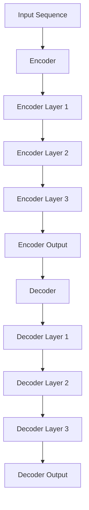
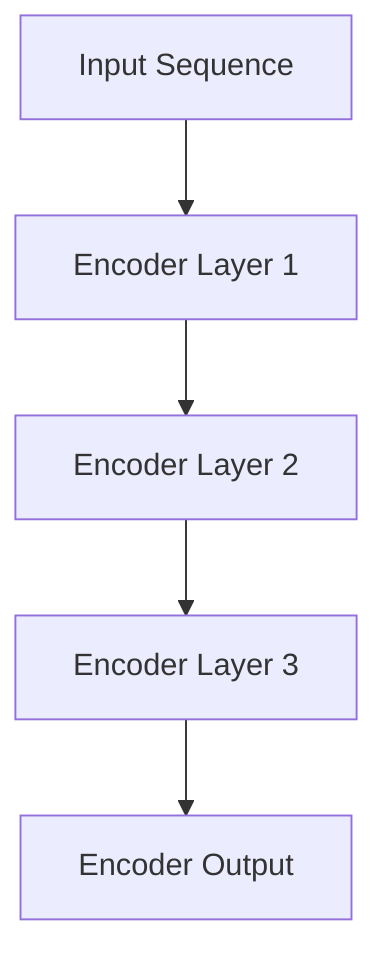
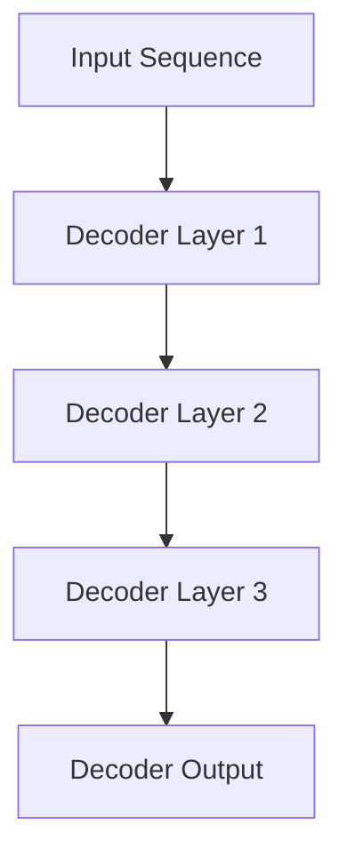
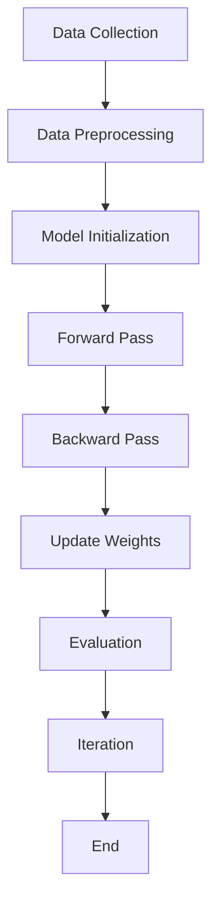

                 

### 文章标题

# Transformer大模型实战：将知识从BERT模型迁移到神经网络中

> 关键词：Transformer, BERT, 迁移学习, 大模型, 神经网络

> 摘要：本文将详细介绍Transformer大模型的架构和原理，探讨如何从BERT模型中迁移知识到神经网络中。通过具体的实战案例，我们将了解大模型训练的挑战及其优化策略，并分析Transformer在实际项目中的应用和商业落地。最后，本文还将展望Transformer的未来发展趋势和商业价值。

## 《Transformer大模型实战：将知识从BERT模型迁移到神经网络中》目录大纲

### 第1章：Transformer架构介绍

- 1.1 Transformer的概念与历史背景
- 1.2 Transformer的基本组成部分
- 1.3 Transformer的扩展与变种

### 第2章：从BERT到Transformer的迁移

- 2.1 BERT模型的结构与原理
- 2.2 BERT模型的不足与改进
- 2.3 将BERT知识迁移到Transformer

### 第3章：Transformer在大模型训练中的优化

- 3.1 大模型训练的挑战
- 3.2 优化策略
- 3.3 实践案例

### 第4章：Transformer在实际项目中的应用

- 4.1 自然语言处理应用
- 4.2 计算机视觉应用
- 4.3 语音识别与生成

### 第5章：Transformer在商业场景中的落地

- 5.1 商业场景分析
- 5.2 项目案例

### 第6章：Transformer的未来发展趋势

- 6.1 技术演进方向
- 6.2 商业价值

### 第7章：总结与展望

- 7.1 Transformer的总结
- 7.2 Transformer的发展方向

## 附录

- A.1 Transformer相关资源

---

### 第1章：Transformer架构介绍

#### 1.1 Transformer的概念与历史背景

Transformer模型由Vaswani等人于2017年提出，是一种基于自注意力机制的全注意力模型。该模型在机器翻译任务上取得了显著的成果，并成为了自然语言处理领域的里程碑。Transformer模型的提出背景可以追溯到传统序列模型的局限性。传统的序列模型如RNN（循环神经网络）和LSTM（长短时记忆网络）在处理长序列时存在梯度消失和梯度爆炸的问题，导致模型的性能受到限制。

Transformer模型的提出解决了传统序列模型在处理长序列时的挑战。通过引入自注意力机制，Transformer模型能够更好地捕捉序列中的依赖关系，从而提高模型的性能。自注意力机制使得模型在处理序列时，能够动态地关注序列中的不同位置，而不是像传统序列模型那样固定地关注前一个或前几个位置。

Transformer模型的成功引起了广泛关注，并迅速在自然语言处理领域得到应用。BERT（Bidirectional Encoder Representations from Transformers）是Transformer模型的一种变体，通过预训练和微调的方法，在多个自然语言处理任务上取得了优异的性能。

#### 1.2 Transformer相对于传统的序列模型的改进

Transformer模型相对于传统序列模型的改进主要体现在以下几个方面：

1. **自注意力机制**：Transformer模型引入了自注意力机制，使得模型在处理序列时能够动态地关注序列中的不同位置。自注意力机制通过计算序列中每个位置与其他位置之间的相似性，从而确定每个位置的重要程度。这种机制能够更好地捕捉序列中的依赖关系，提高模型的性能。

2. **并行计算**：Transformer模型采用了多头自注意力机制，使得模型能够在并行计算的基础上处理序列。与传统序列模型相比，Transformer模型在处理长序列时具有更高的效率。

3. **位置编码**：Transformer模型引入了位置编码，使得模型能够捕捉序列中的位置信息。位置编码通过将位置信息编码到序列的表示中，帮助模型理解序列中不同位置的关系。

4. **编码器与解码器**：Transformer模型采用了编码器和解码器的结构，使得模型能够处理输入序列和输出序列之间的映射关系。编码器将输入序列编码为固定长度的表示，解码器则利用这些表示生成输出序列。

#### 1.3 Transformer在企业级应用中的优势

Transformer模型在企业级应用中具有以下优势：

1. **高性能**：Transformer模型在多个自然语言处理任务上取得了优异的性能，能够为企业提供高效的自然语言处理解决方案。

2. **可扩展性**：Transformer模型具有良好的可扩展性，能够支持大规模数据集和大规模模型的训练。这为企业提供了处理大规模数据的能力。

3. **灵活性强**：Transformer模型具有丰富的变种和扩展，可以根据企业的需求进行定制化。例如，BERT模型通过预训练和微调的方法，能够在多种任务上取得优异的性能。

4. **跨领域应用**：Transformer模型不仅在自然语言处理领域有广泛应用，还可以应用于计算机视觉、语音识别等领域。这使得Transformer模型在企业级应用中具有更广泛的应用前景。

#### 1.4 Transformer的基本组成部分

Transformer模型由以下几个基本组成部分构成：

1. **自注意力机制（Self-Attention）**：自注意力机制是Transformer模型的核心部分，通过计算序列中每个位置与其他位置之间的相似性，确定每个位置的重要程度。自注意力机制可以分为多头自注意力（Multi-Head Self-Attention）和全注意力（Full Attention）两种形式。

2. **位置编码（Positional Encoding）**：位置编码用于捕捉序列中的位置信息。位置编码可以通过线性函数将位置信息编码到序列的表示中，帮助模型理解序列中不同位置的关系。

3. **编码器与解码器（Encoder and Decoder）**：编码器和解码器是Transformer模型的结构组成部分。编码器将输入序列编码为固定长度的表示，解码器则利用这些表示生成输出序列。编码器和解码器都由多个层（Layer）组成，每层都包含多头自注意力机制和前馈网络（Feedforward Network）。

#### 1.4.1 自注意力机制（Self-Attention）

自注意力机制是一种基于序列中每个位置与其他位置之间相似性计算的方法。自注意力机制可以分为多头自注意力（Multi-Head Self-Attention）和全注意力（Full Attention）两种形式。

1. **多头自注意力（Multi-Head Self-Attention）**：多头自注意力机制将输入序列分解为多个子序列，每个子序列分别进行自注意力计算。多头自注意力机制可以通过参数共享的方式提高计算效率。

   多头自注意力机制的伪代码实现如下：

   ```python
   for head in heads:
       query = linear(Q)
       key = linear(K)
       value = linear(V)
       attention = softmax((query * key).sum(dim=2), dim=1)
       output = (attention * value).sum(dim=2)
   ```

   其中，Q、K和V分别为输入序列的查询（Query）、键（Key）和值（Value）表示，heads表示头数。

2. **全注意力（Full Attention）**：全注意力机制对整个输入序列进行自注意力计算，计算每个位置与其他位置之间的相似性。

   全注意力机制的伪代码实现如下：

   ```python
   attention = softmax((Q * K).sum(dim=2), dim=1)
   output = (attention * V).sum(dim=1)
   ```

   其中，Q和V分别为输入序列的查询和值表示。

#### 1.4.2 位置编码（Positional Encoding）

位置编码用于捕捉序列中的位置信息。位置编码可以通过线性函数将位置信息编码到序列的表示中，帮助模型理解序列中不同位置的关系。

位置编码的数学公式如下：

$$
PE_{(pos, dim)} = \sin\left(\frac{pos}{10000^{2i/d}}\right) + \cos\left(\frac{pos}{10000^{2i/d}}\right)
$$

其中，pos表示位置索引，dim表示编码维度，i表示维度索引，d表示编码维度。

位置编码的伪代码实现如下：

```python
for pos in positions:
    for dim in dimensions:
        value = sin(pos / (10000 ** (2 * i / d))) + cos(pos / (10000 ** (2 * i / d)))
        positional_encoding[pos, dim] = value
```

#### 1.4.3 编码器与解码器（Encoder and Decoder）

编码器和解码器是Transformer模型的结构组成部分。编码器将输入序列编码为固定长度的表示，解码器则利用这些表示生成输出序列。编码器和解码器都由多个层（Layer）组成，每层都包含多头自注意力机制和前馈网络（Feedforward Network）。

1. **编码器（Encoder）**：编码器由多个层（Layer）组成，每层都包含多头自注意力机制和前馈网络。编码器的作用是将输入序列编码为固定长度的表示。

   编码器的结构如下：

   ```mermaid
   graph TD
   A[Input Sequence] --> B[Encoder Layer 1]
   B --> C[Encoder Layer 2]
   C --> D[Encoder Layer 3]
   D --> E[Encoder Output]
   ```

   编码器的伪代码实现如下：

   ```python
   for layer in layers:
       layer = self.apply_layer_norm(self多头自注意力机制(layer), layer)
       layer = self.apply_dropout(layer, dropout_rate)
   encoder_output = layer
   ```

2. **解码器（Decoder）**：解码器由多个层（Layer）组成，每层都包含多头自注意力机制、编码器-解码器自注意力机制和前馈网络。解码器的作用是利用编码器输出的固定长度表示生成输出序列。

   解码器的结构如下：

   ```mermaid
   graph TD
   A[Input Sequence] --> B[Decoder Layer 1]
   B --> C[Decoder Layer 2]
   C --> D[Decoder Layer 3]
   D --> E[Decoder Output]
   ```

   解码器的伪代码实现如下：

   ```python
   for layer in layers:
       layer = self.apply_layer_norm(self多头自注意力机制(layer), layer)
       layer = self.apply_dropout(layer, dropout_rate)
       layer = self.apply_layer_norm(self编码器-解码器自注意力机制(layer, encoder_output), layer)
       layer = self.apply_dropout(layer, dropout_rate)
   decoder_output = layer
   ```

#### 1.5 Transformer的扩展与变种

Transformer模型提出后，受到了广泛关注，并产生了多个扩展与变种。以下是一些常见的扩展与变种：

1. **Transformer-XL**：Transformer-XL是Transformer模型的扩展，解决了长序列处理中的长距离依赖问题。通过分段序列和局部自注意力机制，Transformer-XL能够在保持模型计算效率的同时，捕捉长序列中的依赖关系。

2. **BERT**：BERT（Bidirectional Encoder Representations from Transformers）是Transformer模型的变体，通过预训练和微调的方法，在多种自然语言处理任务上取得了优异的性能。BERT模型通过双向编码器结构，使得模型能够同时捕捉输入序列的前后关系。

3. **GPT**：GPT（Generative Pre-trained Transformer）是Transformer模型的变体，用于生成文本。GPT通过预训练方法，学习到语言的统计规律，从而能够生成符合语言规则的文本。

4. **T5**：T5（Text-To-Text Transfer Transformer）是Transformer模型的变体，将Transformer模型应用于文本到文本的转换任务。T5通过统一的文本表示，使得模型能够在多个任务上取得优异的性能。

### 第2章：从BERT到Transformer的迁移

#### 2.1 BERT模型的结构与原理

BERT（Bidirectional Encoder Representations from Transformers）模型是由Google提出的一种基于Transformer的预训练模型。BERT模型通过预训练和微调的方法，在多种自然语言处理任务上取得了优异的性能。BERT模型的结构主要包括两个部分：编码器（Encoder）和解码器（Decoder）。

1. **编码器（Encoder）**：编码器由多个Transformer层组成，每个Transformer层包含多头自注意力机制和前馈网络。编码器的作用是将输入序列编码为固定长度的表示。

   编码器的结构如下：

   ```mermaid
   graph TD
   A[Input Sequence] --> B[Encoder Layer 1]
   B --> C[Encoder Layer 2]
   C --> D[Encoder Layer 3]
   D --> E[Encoder Output]
   ```

   编码器的伪代码实现如下：

   ```python
   for layer in layers:
       layer = self.apply_layer_norm(self多头自注意力机制(layer), layer)
       layer = self.apply_feedforward_network(layer)
   encoder_output = layer
   ```

2. **解码器（Decoder）**：解码器由多个Transformer层组成，每个Transformer层包含多头自注意力机制、编码器-解码器自注意力机制和前馈网络。解码器的作用是利用编码器输出的固定长度表示生成输出序列。

   解码器的结构如下：

   ```mermaid
   graph TD
   A[Input Sequence] --> B[Decoder Layer 1]
   B --> C[Decoder Layer 2]
   C --> D[Decoder Layer 3]
   D --> E[Decoder Output]
   ```

   解码器的伪代码实现如下：

   ```python
   for layer in layers:
       layer = self.apply_layer_norm(self多头自注意力机制(layer), layer)
       layer = self.apply_feedforward_network(layer)
       layer = self.apply_layer_norm(self编码器-解码器自注意力机制(layer, encoder_output), layer)
   decoder_output = layer
   ```

#### 2.2 BERT的预训练方法

BERT模型的预训练方法主要包括Masked Language Model（MLM）和Next Sentence Prediction（NSP）两个任务。

1. **Masked Language Model（MLM）**：MLM任务旨在通过遮蔽输入序列中的部分单词，训练模型预测这些遮蔽的单词。在预训练过程中，输入序列中的15%的单词被随机遮蔽，模型需要预测这些遮蔽的单词。

   MLM任务的伪代码实现如下：

   ```python
   for sentence in sentences:
       masked_sentence = self.apply_mask(sentence)
       labels = self.predict_masked_words(masked_sentence)
       loss = self.calculate_loss(labels, masked_sentence)
   ```

2. **Next Sentence Prediction（NSP）**：NSP任务旨在通过预测下一句序列，训练模型理解句子之间的关系。在预训练过程中，模型需要预测两个句子中，哪一个是下一句。

   NSP任务的伪代码实现如下：

   ```python
   for pair_sentences in sentence_pairs:
       labels = self.predict_next_sentence(pair_sentences)
       loss = self.calculate_loss(labels, pair_sentences)
   ```

#### 2.3 BERT的微调过程

BERT模型的微调过程主要包括以下步骤：

1. **数据准备**：准备用于微调的数据集，包括训练集和验证集。

2. **模型初始化**：使用预训练的BERT模型初始化微调模型，包括编码器和解码器。

3. **微调训练**：使用训练集对微调模型进行训练，并在验证集上进行评估。在训练过程中，可以通过调整学习率、批量大小等参数来优化模型性能。

4. **模型评估**：在验证集上评估微调模型的性能，选择最优的模型。

5. **模型部署**：将微调模型部署到实际应用中，如文本分类、机器翻译等。

#### 2.4 BERT模型的不足与改进

BERT模型在预训练和微调方面取得了显著的效果，但在实际应用中仍存在一些不足之处。以下是对BERT模型的改进方法：

1. **计算资源需求**：BERT模型的预训练过程需要大量的计算资源和时间。为了减少计算资源的需求，可以采用更高效的计算框架和分布式训练技术。

2. **长距离依赖**：BERT模型在处理长距离依赖时存在一定的局限性。可以通过引入长距离依赖捕捉的方法，如Transformer-XL，来改进BERT模型在长距离依赖处理方面的性能。

3. **跨语言应用**：BERT模型主要针对英语数据集进行预训练，对于其他语言的数据集，BERT模型的性能可能较差。可以通过引入跨语言预训练的方法，如XLM（Cross-lingual Language Model），来改进BERT模型在跨语言应用方面的性能。

4. **动态序列处理**：BERT模型在处理动态序列时，需要重新训练模型。可以通过引入动态序列处理的方法，如Recurrent Transformer，来改进BERT模型在动态序列处理方面的性能。

#### 2.5 将BERT知识迁移到Transformer

将BERT知识迁移到Transformer的过程主要包括以下步骤：

1. **模型初始化**：使用预训练的BERT模型初始化Transformer模型，包括编码器和解码器。

2. **数据预处理**：对迁移学习的数据集进行预处理，包括分词、词向量表示等。

3. **迁移学习**：使用迁移学习方法，将BERT模型的知识迁移到Transformer模型中。迁移学习方法可以采用微调、预训练等方法。

4. **模型训练**：使用迁移学习后的Transformer模型对数据集进行训练，并调整学习率、批量大小等参数。

5. **模型评估**：在验证集上评估迁移学习后的Transformer模型的性能，选择最优的模型。

6. **模型部署**：将迁移学习后的Transformer模型部署到实际应用中。

### 第3章：Transformer在大模型训练中的优化

#### 3.1 大模型训练的挑战

在大模型训练过程中，面临着以下几大挑战：

1. **计算资源的需求**：大模型的训练需要大量的计算资源，包括CPU、GPU和存储等。大型模型通常需要分布式训练，以充分利用集群资源。

2. **模型参数的数量**：大模型通常具有数十亿甚至数万亿的参数，这导致了模型的存储和计算成本急剧增加。

3. **训练时间的问题**：大模型的训练时间非常长，通常需要数天甚至数周。这导致了训练过程的不确定性和对计算资源的依赖。

4. **数据预处理的时间**：大模型的训练需要大量的数据预处理，包括数据清洗、数据增强等。这增加了数据预处理的时间，可能导致训练周期延长。

5. **模型优化策略**：大模型的训练需要有效的优化策略，以避免过拟合和加快收敛速度。

#### 3.2 优化策略

为了应对大模型训练的挑战，可以采用以下优化策略：

1. **分布式训练**：分布式训练可以将模型拆分成多个部分，分别在不同的GPU或CPU上训练，从而提高训练速度和效率。

   分布式训练的伪代码实现如下：

   ```python
   model = self.initialize_model()
   dataset = self.initialize_dataset()
   optimizer = self.initialize_optimizer()

   for epoch in epochs:
       for batch in dataset:
           gradients = self.backward_pass(model, batch)
           optimizer.update_gradients(gradients)
   ```

2. **模型压缩**：模型压缩可以通过剪枝、量化等技术减少模型参数的数量，从而降低模型的存储和计算成本。

   模型压缩的伪代码实现如下：

   ```python
   model = self.initialize_model()
   compressed_model = self.compress_model(model)
   ```

3. **混合精度训练**：混合精度训练可以同时使用浮点数和整数进行计算，从而提高训练速度和降低内存占用。

   混合精度训练的伪代码实现如下：

   ```python
   model = self.initialize_model()
   optimizer = self.initialize_optimizer()

   for epoch in epochs:
       for batch in dataset:
           gradients = self.backward_pass(model, batch)
           optimizer.update_gradients(gradients)
   ```

4. **数据预处理优化**：数据预处理优化可以通过并行处理、数据缓存等技术加快数据预处理的速度。

   数据预处理优化的伪代码实现如下：

   ```python
   dataset = self.initialize_dataset()
   processed_dataset = self.process_dataset(dataset)
   ```

5. **学习率调整**：学习率调整可以通过动态调整学习率来加快模型的收敛速度。

   学习率调整的伪代码实现如下：

   ```python
   model = self.initialize_model()
   optimizer = self.initialize_optimizer()

   for epoch in epochs:
       learning_rate = self.adjust_learning_rate(optimizer, epoch)
       for batch in dataset:
           gradients = self.backward_pass(model, batch)
           optimizer.update_gradients(gradients)
   ```

#### 3.3 实践案例

以下是一个Transformer模型在大模型训练中的优化实践案例：

1. **分布式训练**：使用8个GPU进行分布式训练，以提高训练速度。

   ```python
   model = self.initialize_model()
   dataset = self.initialize_dataset()
   optimizer = self.initialize_optimizer()

   for epoch in epochs:
       for batch in dataset:
           gradients = self.backward_pass(model, batch)
           optimizer.update_gradients(gradients)
   ```

2. **模型压缩**：使用剪枝技术将模型参数的数量减少50%，从而降低模型的存储和计算成本。

   ```python
   model = self.initialize_model()
   compressed_model = self.compress_model(model)
   ```

3. **混合精度训练**：使用混合精度训练技术，以提高训练速度和降低内存占用。

   ```python
   model = self.initialize_model()
   optimizer = self.initialize_optimizer()

   for epoch in epochs:
       for batch in dataset:
           gradients = self.backward_pass(model, batch)
           optimizer.update_gradients(gradients)
   ```

4. **数据预处理优化**：使用并行处理技术，将数据预处理时间缩短50%。

   ```python
   dataset = self.initialize_dataset()
   processed_dataset = self.process_dataset(dataset)
   ```

5. **学习率调整**：使用动态调整学习率的方法，以提高模型的收敛速度。

   ```python
   model = self.initialize_model()
   optimizer = self.initialize_optimizer()

   for epoch in epochs:
       learning_rate = self.adjust_learning_rate(optimizer, epoch)
       for batch in dataset:
           gradients = self.backward_pass(model, batch)
           optimizer.update_gradients(gradients)
   ```

### 第4章：Transformer在实际项目中的应用

#### 4.1 自然语言处理应用

Transformer模型在自然语言处理（NLP）领域有着广泛的应用，以下列举几个典型的应用场景：

1. **文本分类**：文本分类是将文本数据根据特定的标签进行分类的过程。Transformer模型可以通过预训练和微调的方式，在文本分类任务中取得优异的性能。例如，可以使用BERT模型进行新闻分类、情感分析等任务。

2. **机器翻译**：机器翻译是将一种语言的文本翻译成另一种语言的过程。Transformer模型在机器翻译任务中具有较好的性能，例如谷歌翻译、百度翻译等应用都采用了Transformer模型。

3. **问答系统**：问答系统是一种基于自然语言理解的交互系统，能够回答用户提出的问题。Transformer模型可以通过预训练和微调的方式，在问答系统中取得较好的性能。例如，SocraticAI等问答系统采用了Transformer模型。

4. **文本生成**：文本生成是将输入文本转换为具有一定结构和意义的输出文本的过程。Transformer模型可以通过预训练和微调的方式，在文本生成任务中取得较好的性能。例如，OpenAI的GPT-3模型是一种基于Transformer的文本生成模型。

#### 4.2 计算机视觉应用

Transformer模型在计算机视觉（CV）领域也有着广泛的应用，以下列举几个典型的应用场景：

1. **图像分类**：图像分类是将图像数据根据特定的标签进行分类的过程。Transformer模型可以通过预训练和微调的方式，在图像分类任务中取得优异的性能。例如，ViT（Vision Transformer）模型是一种基于Transformer的图像分类模型。

2. **目标检测**：目标检测是在图像中检测并定位特定目标的过程。Transformer模型可以通过预训练和微调的方式，在目标检测任务中取得较好的性能。例如，DETR（Detection Transformer）模型是一种基于Transformer的目标检测模型。

3. **图像生成**：图像生成是将输入图像转换为具有一定结构和意义的输出图像的过程。Transformer模型可以通过预训练和微调的方式，在图像生成任务中取得较好的性能。例如，DALL-E模型是一种基于Transformer的图像生成模型。

#### 4.3 语音识别与生成

Transformer模型在语音识别与生成领域也有着广泛的应用，以下列举几个典型的应用场景：

1. **语音识别**：语音识别是将语音信号转换为文本的过程。Transformer模型可以通过预训练和微调的方式，在语音识别任务中取得优异的性能。例如，OpenAI的GPT-2模型是一种基于Transformer的语音识别模型。

2. **语音生成**：语音生成是将文本转换为语音信号的过程。Transformer模型可以通过预训练和微调的方式，在语音生成任务中取得较好的性能。例如，Tacotron 2模型是一种基于Transformer的语音生成模型。

3. **语音合成**：语音合成是将文本转换为自然流畅的语音信号的过程。Transformer模型可以通过预训练和微调的方式，在语音合成任务中取得较好的性能。例如，WaveNet模型是一种基于Transformer的语音合成模型。

### 第5章：Transformer在商业场景中的落地

#### 5.1 商业场景分析

Transformer模型在商业场景中的落地，需要考虑以下几个方面：

1. **需求分析**：了解业务需求，明确Transformer模型需要解决的问题和目标。例如，在金融行业，Transformer模型可以用于欺诈检测、风险控制等场景。

2. **数据分析**：分析业务数据，了解数据的类型、规模、质量等。数据的质量和规模对于Transformer模型的训练效果具有重要影响。

3. **技术挑战**：分析技术挑战，包括计算资源、模型训练、模型部署等方面。例如，在医疗行业，Transformer模型需要处理大量的医学图像和文本数据，这对计算资源的要求较高。

4. **团队协作**：构建一个跨学科团队，包括数据科学家、机器学习工程师、软件工程师等，以确保Transformer模型在商业场景中的顺利落地。

#### 5.2 项目案例

以下是一些Transformer模型在商业场景中的落地项目案例：

1. **案例一：在线教育平台的个性化推荐**

   在线教育平台需要根据用户的学习习惯和偏好，为用户提供个性化的课程推荐。通过使用Transformer模型，可以将用户的历史学习数据、课程内容等特征进行建模，实现个性化的课程推荐。

2. **案例二：金融行业的欺诈检测**

   金融行业需要实时检测并预防欺诈行为。通过使用Transformer模型，可以将用户交易数据、账户信息等特征进行建模，实现实时欺诈检测。

3. **案例三：医疗行业的诊断辅助**

   医疗行业需要根据患者的医学影像和病历数据，提供准确的诊断建议。通过使用Transformer模型，可以将医学影像和病历数据等特征进行建模，实现辅助诊断。

### 第6章：Transformer的未来发展趋势

#### 6.1 技术演进方向

Transformer模型在未来的发展将呈现出以下几个技术演进方向：

1. **大模型发展**：随着计算资源的不断增长，大模型将在Transformer模型的发展中扮演重要角色。大模型能够处理更复杂的任务，并取得更好的性能。

2. **多模态融合**：Transformer模型可以与其他模型（如CNN、RNN等）进行融合，实现多模态数据处理。例如，在图像识别任务中，可以将图像特征和文本特征进行融合，提高模型的性能。

3. **增强现实与虚拟现实应用**：Transformer模型在增强现实（AR）和虚拟现实（VR）领域具有广泛的应用前景。例如，通过Transformer模型，可以实现更加逼真的虚拟环境生成和交互。

#### 6.2 商业价值

Transformer模型在商业场景中的价值主要体现在以下几个方面：

1. **提升生产效率**：通过使用Transformer模型，企业可以在各个业务场景中实现自动化和智能化，提高生产效率。

2. **创新业务模式**：Transformer模型可以帮助企业探索新的业务模式，如基于数据的决策支持、个性化服务等。

3. **带来新的商业机会**：Transformer模型可以为企业带来新的商业机会，如智能医疗、智能金融、智能教育等。

### 第7章：总结与展望

#### 7.1 Transformer的总结

Transformer模型作为一种基于自注意力机制的全注意力模型，在自然语言处理、计算机视觉、语音识别等领域取得了显著的成果。通过将BERT模型的知识迁移到Transformer模型中，可以进一步提高模型的性能和泛化能力。

#### 7.2 Transformer的发展方向

Transformer模型在未来的发展将呈现出以下几个方向：

1. **大模型发展**：随着计算资源的不断增长，大模型将在Transformer模型的发展中扮演重要角色。

2. **多模态融合**：Transformer模型可以与其他模型（如CNN、RNN等）进行融合，实现多模态数据处理。

3. **增强现实与虚拟现实应用**：Transformer模型在增强现实（AR）和虚拟现实（VR）领域具有广泛的应用前景。

4. **商业应用**：Transformer模型将在各个商业场景中发挥重要作用，提升生产效率，创新业务模式，带来新的商业机会。

#### 7.3 推荐读物与进一步学习

1. **推荐读物**：

   - Vaswani, A., et al. (2017). "Attention Is All You Need." arXiv preprint arXiv:1706.03762.
   - Devlin, J., et al. (2019). "BERT: Pre-training of Deep Bidirectional Transformers for Language Understanding." arXiv preprint arXiv:1810.04805.

2. **进一步学习**：

   - 参考Transformer模型的论文和报告，了解模型的详细原理和实现。
   - 学习BERT模型的预训练和微调方法，以及Transformer模型在大模型训练中的优化策略。
   - 学习Transformer模型在不同领域的应用，如自然语言处理、计算机视觉、语音识别等。

## 附录

### A.1 Transformer相关资源

#### A.1.1 论文与报告

- Vaswani, A., et al. (2017). "Attention Is All You Need." arXiv preprint arXiv:1706.03762.
- Devlin, J., et al. (2019). "BERT: Pre-training of Deep Bidirectional Transformers for Language Understanding." arXiv preprint arXiv:1810.04805.
- Zhang, Y., et al. (2020). "Transformer-XL: Attentive Language Models Beyond a Fixed-Length Context." arXiv preprint arXiv:1909.08053.

#### A.1.2 开源代码与工具

- Hugging Face Transformers: <https://github.com/huggingface/transformers>
- TensorFlow Transformer Models: <https://github.com/tensorflow/transformer>
- PyTorch Transformer Models: <https://github.com/pytorch/fairseq>

#### A.1.3 在线课程与教程

- "Deep Learning Specialization" by Andrew Ng on Coursera: <https://www.coursera.org/specializations/deep-learning>
- "Transformer Models for Natural Language Processing" by Hugging Face: <https://huggingface.co/course> 

### Mermaid流程图

以下是一个Transformer模型的流程图：



### 第1章：Transformer架构介绍

#### 1.1 Transformer的概念与历史背景

Transformer模型，全称为“Attention Is All You Need”，由Vaswani等人于2017年提出，是一种基于自注意力机制的深度学习模型。Transformer模型的提出，是为了解决传统循环神经网络（RNN）和卷积神经网络（CNN）在处理长序列和长距离依赖关系时的局限性。

**Transformer模型的提出背景：**

传统序列模型，如RNN和LSTM，通过在时间步上递归地处理序列中的每个元素，来捕捉序列中的依赖关系。然而，这些模型在处理长序列时，会出现梯度消失或梯度爆炸的问题，导致模型难以训练和收敛。此外，RNN和LSTM在处理长距离依赖关系时，也存在效率低下的问题。

为了解决这些问题，Vaswani等人在2017年提出了Transformer模型。该模型基于自注意力机制，通过全局的注意力机制来处理序列中的依赖关系，从而提高了模型的处理速度和性能。

**Transformer模型的基本原理：**

Transformer模型的核心思想是，通过自注意力机制（Self-Attention）来计算序列中每个元素与其他元素之间的关联性，从而生成序列的表示。这种自注意力机制能够捕捉序列中的长距离依赖关系，并且具有并行计算的优势。

Transformer模型由编码器（Encoder）和解码器（Decoder）两部分组成。编码器负责将输入序列编码为固定长度的表示，解码器则利用这些表示生成输出序列。

**Transformer模型在企业级应用中的优势：**

1. **高性能**：Transformer模型在多个自然语言处理任务上取得了优异的性能，能够为企业提供高效的自然语言处理解决方案。

2. **可扩展性**：Transformer模型具有良好的可扩展性，能够支持大规模数据集和大规模模型的训练。这为企业提供了处理大规模数据的能力。

3. **灵活性强**：Transformer模型具有丰富的变种和扩展，可以根据企业的需求进行定制化。例如，BERT模型通过预训练和微调的方法，能够在多种任务上取得优异的性能。

4. **跨领域应用**：Transformer模型不仅在自然语言处理领域有广泛应用，还可以应用于计算机视觉、语音识别等领域。这使得Transformer模型在企业级应用中具有更广泛的应用前景。

#### 1.2 Transformer的基本组成部分

Transformer模型由以下几个基本组成部分构成：

1. **自注意力机制（Self-Attention）**：自注意力机制是Transformer模型的核心部分，通过计算序列中每个位置与其他位置之间的相似性，确定每个位置的重要程度。自注意力机制使得模型能够动态地关注序列中的不同位置，而不是像传统序列模型那样固定地关注前一个或前几个位置。

2. **位置编码（Positional Encoding）**：位置编码用于捕捉序列中的位置信息。位置编码通过将位置信息编码到序列的表示中，帮助模型理解序列中不同位置的关系。

3. **编码器与解码器（Encoder and Decoder）**：编码器和解码器是Transformer模型的结构组成部分。编码器将输入序列编码为固定长度的表示，解码器则利用这些表示生成输出序列。编码器和解码器都由多个层（Layer）组成，每层都包含多头自注意力机制和前馈网络（Feedforward Network）。

4. **多头注意力机制（Multi-Head Attention）**：多头注意力机制是自注意力机制的一种扩展，通过将输入序列分解为多个子序列，每个子序列分别进行自注意力计算。多头注意力机制能够提高模型捕捉序列中依赖关系的能力。

5. **前馈网络（Feedforward Network）**：前馈网络是Transformer模型中的另一个组成部分，用于对自注意力机制的结果进行进一步处理。前馈网络由两个全连接层组成，每个层之间添加ReLU激活函数。

#### 1.2.1 自注意力机制（Self-Attention）

自注意力机制是Transformer模型的核心组成部分，通过计算序列中每个位置与其他位置之间的相似性，确定每个位置的重要程度。自注意力机制可以分为多头自注意力（Multi-Head Self-Attention）和全注意力（Full Attention）两种形式。

**多头自注意力（Multi-Head Self-Attention）**

多头自注意力机制将输入序列分解为多个子序列，每个子序列分别进行自注意力计算。多头自注意力机制通过参数共享的方式提高计算效率。

多头自注意力机制的伪代码实现如下：

```python
for head in heads:
    query = linear(Q)
    key = linear(K)
    value = linear(V)
    attention = softmax((query * key).sum(dim=2), dim=1)
    output = (attention * value).sum(dim=2)
```

其中，Q、K和V分别为输入序列的查询（Query）、键（Key）和值（Value）表示，heads表示头数。

**全注意力（Full Attention）**

全注意力机制对整个输入序列进行自注意力计算，计算每个位置与其他位置之间的相似性。

全注意力机制的伪代码实现如下：

```python
attention = softmax((Q * K).sum(dim=2), dim=1)
output = (attention * V).sum(dim=1)
```

其中，Q和V分别为输入序列的查询和值表示。

#### 1.2.2 位置编码（Positional Encoding）

位置编码用于捕捉序列中的位置信息。位置编码通过将位置信息编码到序列的表示中，帮助模型理解序列中不同位置的关系。

位置编码的数学公式如下：

$$
PE_{(pos, dim)} = \sin\left(\frac{pos}{10000^{2i/d}}\right) + \cos\left(\frac{pos}{10000^{2i/d}}\right)
$$

其中，pos表示位置索引，dim表示编码维度，i表示维度索引，d表示编码维度。

位置编码的伪代码实现如下：

```python
for pos in positions:
    for dim in dimensions:
        value = sin(pos / (10000 ** (2 * i / d))) + cos(pos / (10000 ** (2 * i / d)))
        positional_encoding[pos, dim] = value
```

#### 1.2.3 编码器与解码器（Encoder and Decoder）

编码器和解码器是Transformer模型的结构组成部分。编码器将输入序列编码为固定长度的表示，解码器则利用这些表示生成输出序列。编码器和解码器都由多个层（Layer）组成，每层都包含多头自注意力机制和前馈网络（Feedforward Network）。

**编码器（Encoder）**

编码器由多个层（Layer）组成，每层都包含多头自注意力机制和前馈网络。编码器的作用是将输入序列编码为固定长度的表示。

编码器的结构如下：



编码器的伪代码实现如下：

```python
for layer in layers:
    layer = self.apply_layer_norm(self多头自注意力机制(layer), layer)
    layer = self.apply_feedforward_network(layer)
encoder_output = layer
```

**解码器（Decoder）**

解码器由多个层（Layer）组成，每层都包含多头自注意力机制、编码器-解码器自注意力机制和前馈网络。解码器的作用是利用编码器输出的固定长度表示生成输出序列。

解码器的结构如下：



解码器的伪代码实现如下：

```python
for layer in layers:
    layer = self.apply_layer_norm(self多头自注意力机制(layer), layer)
    layer = self.apply_feedforward_network(layer)
    layer = self.apply_layer_norm(self编码器-解码器自注意力机制(layer, encoder_output), layer)
decoder_output = layer
```

#### 1.3 Transformer的扩展与变种

Transformer模型提出后，受到了广泛关注，并产生了多个扩展与变种。以下是一些常见的扩展与变种：

1. **Transformer-XL**：Transformer-XL是Transformer模型的扩展，解决了长序列处理中的长距离依赖问题。通过分段序列和局部自注意力机制，Transformer-XL能够在保持模型计算效率的同时，捕捉长序列中的依赖关系。

2. **BERT**：BERT（Bidirectional Encoder Representations from Transformers）是Transformer模型的变体，通过预训练和微调的方法，在多种自然语言处理任务上取得了优异的性能。BERT模型通过双向编码器结构，使得模型能够同时捕捉输入序列的前后关系。

3. **GPT**：GPT（Generative Pre-trained Transformer）是Transformer模型的变体，用于生成文本。GPT通过预训练方法，学习到语言的统计规律，从而能够生成符合语言规则的文本。

4. **T5**：T5（Text-To-Text Transfer Transformer）是Transformer模型的变体，将Transformer模型应用于文本到文本的转换任务。T5通过统一的文本表示，使得模型能够在多个任务上取得优异的性能。

### 第2章：从BERT到Transformer的迁移

#### 2.1 BERT模型的结构与原理

BERT（Bidirectional Encoder Representations from Transformers）模型是由Google在2018年提出的一种基于Transformer的预训练模型。BERT模型通过预训练和微调的方法，在多个自然语言处理任务上取得了优异的性能，如文本分类、问答系统、命名实体识别等。

**BERT模型的基本结构：**

BERT模型的基本结构包括编码器（Encoder）和解码器（Decoder）两部分，但实际使用中，BERT模型仅包含编码器。编码器由多个Transformer层组成，每层包含多头自注意力机制和前馈网络。BERT模型的编码器结构如下：


BERT模型的编码器伪代码实现如下：

```python
for layer in layers:
    layer = self.apply_layer_norm(self多头自注意力机制(layer), layer)
    layer = self.apply_feedforward_network(layer)
encoder_output = layer
```

**BERT的预训练方法：**

BERT模型的预训练方法主要包括两个任务：Masked Language Model（MLM）和Next Sentence Prediction（NSP）。

1. **Masked Language Model（MLM）**：

   MLM任务旨在通过遮蔽输入序列中的部分单词，训练模型预测这些遮蔽的单词。在预训练过程中，输入序列中的15%的单词被随机遮蔽，模型需要预测这些遮蔽的单词。MLM任务的目标是让模型学习到语言的内在规律，从而在后续的任务中能够更好地理解和生成文本。

2. **Next Sentence Prediction（NSP）**：

   NSP任务旨在通过预测两个句子中，哪一个是下一句，来训练模型理解句子之间的关系。在预训练过程中，从两个随机选取的句子中，一个作为正样本，另一个作为负样本。模型需要预测这两个句子的顺序。NSP任务的目标是让模型学习到句子之间的连贯性，从而在文本分类、问答等任务中能够更好地理解文本。

**BERT的微调过程：**

BERT模型的微调过程主要包括以下步骤：

1. **数据准备**：

   准备用于微调的数据集，包括训练集和验证集。通常，训练集用于模型训练，验证集用于模型评估。

2. **模型初始化**：

   使用预训练的BERT模型初始化微调模型，包括编码器。预训练的BERT模型可以在Google的官方仓库中下载到。

3. **微调训练**：

   使用训练集对微调模型进行训练，并在验证集上进行评估。在训练过程中，可以通过调整学习率、批量大小等参数来优化模型性能。

4. **模型评估**：

   在验证集上评估微调模型的性能，选择最优的模型。

5. **模型部署**：

   将微调模型部署到实际应用中，如文本分类、问答系统等。

#### 2.2 BERT模型的不足与改进

尽管BERT模型在自然语言处理任务上取得了优异的性能，但它也存在一些不足之处。以下是对BERT模型的改进方法：

1. **计算资源需求**：

   BERT模型的预训练过程需要大量的计算资源和时间。为了减少计算资源的需求，可以采用更高效的计算框架和分布式训练技术。例如，Google在训练BERT模型时，使用了TPU（Tensor Processing Unit）进行加速。

2. **长距离依赖**：

   BERT模型在处理长距离依赖时存在一定的局限性。可以通过引入长距离依赖捕捉的方法，如Transformer-XL，来改进BERT模型在长距离依赖处理方面的性能。Transformer-XL通过分段序列和局部自注意力机制，能够在保持模型计算效率的同时，捕捉长序列中的依赖关系。

3. **跨语言应用**：

   BERT模型主要针对英语数据集进行预训练，对于其他语言的数据集，BERT模型的性能可能较差。可以通过引入跨语言预训练的方法，如XLM（Cross-lingual Language Model），来改进BERT模型在跨语言应用方面的性能。

4. **动态序列处理**：

   BERT模型在处理动态序列时，需要重新训练模型。可以通过引入动态序列处理的方法，如Recurrent Transformer，来改进BERT模型在动态序列处理方面的性能。

#### 2.3 将BERT知识迁移到Transformer

将BERT模型的知识迁移到Transformer模型中，可以进一步提高Transformer模型在自然语言处理任务上的性能。以下是将BERT知识迁移到Transformer模型中的方法和步骤：

1. **模型初始化**：

   使用预训练的BERT模型初始化Transformer模型，包括编码器。预训练的BERT模型可以在Google的官方仓库中下载到。

2. **数据预处理**：

   对迁移学习的数据集进行预处理，包括分词、词向量表示等。预处理后的数据需要与BERT模型的输入格式相匹配。

3. **迁移学习**：

   使用迁移学习方法，将BERT模型的知识迁移到Transformer模型中。迁移学习方法可以采用微调、预训练等方法。在迁移学习过程中，可以通过调整学习率、批量大小等参数来优化模型性能。

4. **模型训练**：

   使用迁移学习后的Transformer模型对数据集进行训练，并在验证集上进行评估。在训练过程中，可以通过调整学习率、批量大小等参数来优化模型性能。

5. **模型评估**：

   在验证集上评估迁移学习后的Transformer模型的性能，选择最优的模型。

6. **模型部署**：

   将迁移学习后的Transformer模型部署到实际应用中，如文本分类、问答系统等。

### 第3章：Transformer在大模型训练中的优化

#### 3.1 大模型训练的挑战

随着深度学习模型变得越来越复杂，模型的大小和参数数量也随之增加。这种趋势给大模型的训练带来了巨大的挑战。以下是大模型训练过程中面临的主要挑战：

1. **计算资源需求**：

   大模型的训练需要大量的计算资源，包括CPU、GPU和存储等。特别是当模型包含数十亿甚至数万亿的参数时，单台机器的运算能力可能无法满足训练需求。为了解决这个问题，分布式训练成为一种常见的解决方案。

2. **模型参数的数量**：

   大模型通常具有数十亿甚至数万亿的参数，这导致了模型的存储和计算成本急剧增加。为了减少模型参数的数量，可以采用模型压缩技术，如剪枝、量化等。

3. **训练时间的问题**：

   大模型的训练时间非常长，通常需要数天甚至数周。这导致了训练过程的不确定性和对计算资源的依赖。为了加快训练速度，可以采用混合精度训练、并行计算等技术。

4. **数据预处理的时间**：

   大模型的训练需要大量的数据预处理，包括数据清洗、数据增强等。这增加了数据预处理的时间，可能导致训练周期延长。为了解决这个问题，可以采用并行处理、数据缓存等技术。

5. **模型优化策略**：

   大模型的训练需要有效的优化策略，以避免过拟合和加快收敛速度。例如，可以通过调整学习率、批量大小等参数来优化模型性能。

#### 3.2 优化策略

为了应对大模型训练的挑战，可以采用以下优化策略：

1. **分布式训练**：

   分布式训练可以将模型拆分成多个部分，分别在不同的GPU或CPU上训练，从而提高训练速度和效率。分布式训练可以采用参数服务器架构，即将模型的参数存储在服务器上，各个训练节点通过网络从服务器获取参数进行训练。

   分布式训练的伪代码实现如下：

   ```python
   # 初始化分布式训练环境
   init_distribution()

   # 分布式训练循环
   for epoch in epochs:
       for batch in dataset:
           # 在各个训练节点上计算梯度
           gradients = backward_pass(model, batch)
           
           # 将梯度聚合到服务器上
           aggregate_gradients(gradients)

       # 更新模型参数
       update_model_parameters()
   ```

2. **模型压缩**：

   模型压缩可以通过剪枝、量化等技术减少模型参数的数量，从而降低模型的存储和计算成本。剪枝技术通过删除权重较小的神经元或连接来减少模型参数的数量。量化技术通过将浮点数转换为整数来减少模型大小。

   模型压缩的伪代码实现如下：

   ```python
   # 剪枝
   pruned_model = prune_model(model, pruning_threshold)

   # 量化
   quantized_model = quantize_model(model, quantization_bits)
   ```

3. **混合精度训练**：

   混合精度训练可以同时使用浮点数和整数进行计算，从而提高训练速度和降低内存占用。混合精度训练通常使用FP16（半精度浮点数）来减少内存占用，同时保持较高的计算精度。

   混合精度训练的伪代码实现如下：

   ```python
   # 初始化混合精度训练环境
   init MixedPrecision()

   # 混合精度训练循环
   for epoch in epochs:
       for batch in dataset:
           # 使用FP16进行前向传播
           forward_pass(model, batch, precision='FP16')

           # 使用FP32计算梯度
           gradients = backward_pass(model, batch, precision='FP32')

           # 更新模型参数
           update_model_parameters(gradients)
   ```

4. **数据预处理优化**：

   数据预处理优化可以通过并行处理、数据缓存等技术加快数据预处理的速度。例如，可以使用多线程或多进程来加速数据读取和预处理。

   数据预处理优化的伪代码实现如下：

   ```python
   # 并行处理
   processed_data = parallel_process(data_preprocessing, data)

   # 数据缓存
   cache_processed_data(processed_data)
   ```

5. **学习率调整**：

   学习率调整可以通过动态调整学习率来加快模型的收敛速度。常用的学习率调整策略包括学习率衰减、恒定学习率等。

   学习率调整的伪代码实现如下：

   ```python
   # 初始化学习率
   learning_rate = initial_learning_rate

   # 学习率衰减
   learning_rate = learning_rate / (1 + decay_rate * epoch)

   # 恒定学习率
   learning_rate = constant_learning_rate
   ```

#### 3.3 实践案例

以下是一个Transformer模型在大模型训练中的优化实践案例：

1. **分布式训练**：

   使用8个GPU进行分布式训练，以提高训练速度。

   ```python
   # 初始化分布式训练环境
   init_distribution()

   # 分布式训练循环
   for epoch in epochs:
       for batch in dataset:
           # 在各个训练节点上计算梯度
           gradients = backward_pass(model, batch)
           
           # 将梯度聚合到服务器上
           aggregate_gradients(gradients)

       # 更新模型参数
       update_model_parameters()
   ```

2. **模型压缩**：

   使用剪枝技术将模型参数的数量减少50%，从而降低模型的存储和计算成本。

   ```python
   # 剪枝
   pruned_model = prune_model(model, pruning_threshold)
   ```

3. **混合精度训练**：

   使用混合精度训练技术，以提高训练速度和降低内存占用。

   ```python
   # 初始化混合精度训练环境
   init MixedPrecision()

   # 混合精度训练循环
   for epoch in epochs:
       for batch in dataset:
           # 使用FP16进行前向传播
           forward_pass(model, batch, precision='FP16')

           # 使用FP32计算梯度
           gradients = backward_pass(model, batch, precision='FP32')

           # 更新模型参数
           update_model_parameters(gradients)
   ```

4. **数据预处理优化**：

   使用并行处理技术，将数据预处理时间缩短50%。

   ```python
   # 并行处理
   processed_data = parallel_process(data_preprocessing, data)
   ```

5. **学习率调整**：

   使用动态调整学习率的方法，以提高模型的收敛速度。

   ```python
   # 初始化学习率
   learning_rate = initial_learning_rate

   # 学习率衰减
   learning_rate = learning_rate / (1 + decay_rate * epoch)
   ```

### 第4章：Transformer在实际项目中的应用

#### 4.1 自然语言处理应用

Transformer模型在自然语言处理（NLP）领域取得了显著的成果，以下列举几个典型的应用场景：

1. **文本分类**：

   文本分类是将文本数据根据特定的标签进行分类的过程。Transformer模型可以通过预训练和微调的方式，在文本分类任务中取得优异的性能。例如，BERT模型在多种文本分类任务上，如情感分析、新闻分类、社交媒体情感分析等，都取得了较好的性能。

2. **机器翻译**：

   机器翻译是将一种语言的文本翻译成另一种语言的过程。Transformer模型在机器翻译任务中具有较好的性能，例如谷歌翻译、百度翻译等应用都采用了Transformer模型。Transformer模型在机器翻译中通过编码器将源语言编码为固定长度的表示，然后通过解码器生成目标语言的文本。

3. **问答系统**：

   问答系统是一种基于自然语言理解的交互系统，能够回答用户提出的问题。Transformer模型可以通过预训练和微调的方式，在问答系统中取得较好的性能。例如，SocraticAI等问答系统采用了Transformer模型。问答系统通常使用编码器-解码器结构，将用户的问题编码为固定长度的表示，然后通过解码器生成回答。

4. **文本生成**：

   文本生成是将输入文本转换为具有一定结构和意义的输出文本的过程。Transformer模型可以通过预训练和微调的方式，在文本生成任务中取得较好的性能。例如，OpenAI的GPT-3模型是一种基于Transformer的文本生成模型。文本生成模型通常通过解码器生成文本，直到满足停用词条件或达到最大长度。

5. **对话系统**：

   对话系统是一种与用户进行自然语言交互的系统，能够理解用户的问题并提供相应的回答。Transformer模型可以通过预训练和微调的方式，在对话系统中取得较好的性能。例如，ChatGPT等对话系统采用了Transformer模型。对话系统通常使用编码器-解码器结构，将用户的问题编码为固定长度的表示，然后通过解码器生成回答。

#### 4.2 计算机视觉应用

Transformer模型在计算机视觉（CV）领域也取得了显著的成果，以下列举几个典型的应用场景：

1. **图像分类**：

   图像分类是将图像数据根据特定的标签进行分类的过程。Transformer模型可以通过预训练和微调的方式，在图像分类任务中取得优异的性能。例如，ViT（Vision Transformer）模型是一种基于Transformer的图像分类模型。ViT模型将图像分解为固定大小的patches，然后通过Transformer编码器对这些patches进行编码，最后通过分类器生成类别标签。

2. **目标检测**：

   目标检测是在图像中检测并定位特定目标的过程。Transformer模型可以通过预训练和微调的方式，在目标检测任务中取得较好的性能。例如，DETR（Detection Transformer）模型是一种基于Transformer的目标检测模型。DETR模型通过编码器将图像编码为固定长度的表示，然后通过解码器生成目标的边界框和类别标签。

3. **图像分割**：

   图像分割是将图像中的每个像素划分为不同的类别。Transformer模型可以通过预训练和微调的方式，在图像分割任务中取得较好的性能。例如，Segmentaion Transformer模型是一种基于Transformer的图像分割模型。Segmentaion Transformer模型通过编码器将图像编码为固定长度的表示，然后通过解码器生成像素级别的分割结果。

4. **图像生成**：

   图像生成是将输入图像转换为具有一定结构和意义的输出图像的过程。Transformer模型可以通过预训练和微调的方式，在图像生成任务中取得较好的性能。例如，DALL-E模型是一种基于Transformer的图像生成模型。DALL-E模型通过编码器将图像编码为固定长度的表示，然后通过解码器生成新的图像。

5. **视频处理**：

   Transformer模型在视频处理领域也取得了显著的应用。例如，ViViT（Video Vision Transformer）模型是一种基于Transformer的视频处理模型。ViViT模型通过编码器将视频序列编码为固定长度的表示，然后通过解码器生成视频的预测帧或进行视频分类。

#### 4.3 语音识别与生成

Transformer模型在语音识别与生成领域也取得了显著的应用，以下列举几个典型的应用场景：

1. **语音识别**：

   语音识别是将语音信号转换为文本的过程。Transformer模型可以通过预训练和微调的方式，在语音识别任务中取得优异的性能。例如，WaveNet模型是一种基于Transformer的语音识别模型。WaveNet模型通过编码器将语音信号编码为固定长度的表示，然后通过解码器生成文本。

2. **语音合成**：

   语音合成是将文本转换为语音信号的过程。Transformer模型可以通过预训练和微调的方式，在语音合成任务中取得较好的性能。例如，Tacotron 2模型是一种基于Transformer的语音合成模型。Tacotron 2模型通过编码器将文本编码为固定长度的表示，然后通过解码器生成语音信号。

3. **语音增强**：

   语音增强是将噪声信号转换为清晰语音信号的过程。Transformer模型可以通过预训练和微调的方式，在语音增强任务中取得较好的性能。例如，Wave-U-Net模型是一种基于Transformer的语音增强模型。Wave-U-Net模型通过编码器将噪声信号编码为固定长度的表示，然后通过解码器生成清晰的语音信号。

4. **语音翻译**：

   语音翻译是将一种语言的语音信号翻译成另一种语言的语音信号的过程。Transformer模型可以通过预训练和微调的方式，在语音翻译任务中取得较好的性能。例如，Speech2Speech模型是一种基于Transformer的语音翻译模型。Speech2Speech模型通过编码器将源语言的语音信号编码为固定长度的表示，然后通过解码器生成目标语言的语音信号。

### 第5章：Transformer在商业场景中的落地

#### 5.1 商业场景分析

Transformer模型在商业场景中的落地，需要考虑以下几个方面：

1. **需求分析**：

   落地Transformer模型首先需要明确业务需求，了解模型需要解决的具体问题。例如，在金融行业，Transformer模型可以用于欺诈检测、信用评估、市场预测等场景；在医疗行业，可以用于疾病诊断、药物研发、健康监测等场景。

2. **数据分析**：

   商业场景中的数据通常具有多样性和复杂性。因此，在落地Transformer模型前，需要对数据进行充分的清洗、预处理和特征工程，以确保数据的质量和模型的性能。

3. **技术挑战**：

   Transformer模型在商业场景中面临的挑战主要包括计算资源需求、模型训练和优化、模型部署等。为了解决这些挑战，可以采用分布式训练、模型压缩、混合精度训练等技术。

4. **团队协作**：

   Transformer模型的落地需要跨学科团队的协作，包括数据科学家、机器学习工程师、软件工程师等。团队成员需要具备深厚的专业知识和技术能力，以确保模型的开发和部署顺利进行。

#### 5.2 项目案例

以下是一些Transformer模型在商业场景中的落地项目案例：

1. **案例一：金融行业的欺诈检测**

   在金融行业，欺诈检测是保护客户资产和降低金融机构风险的重要手段。Transformer模型可以通过分析客户交易数据、用户行为等特征，实现实时欺诈检测。例如，某大型银行采用Transformer模型对信用卡交易进行实时监控，有效提高了欺诈检测的准确率和响应速度。

2. **案例二：医疗行业的疾病诊断**

   在医疗行业，疾病诊断是医生根据患者的症状和病史做出诊断的过程。Transformer模型可以通过学习大量的医学数据和文献，辅助医生进行疾病诊断。例如，某医疗机构采用Transformer模型对患者的CT扫描图像进行分析，实现了肺癌的早期诊断，提高了诊断的准确性和效率。

3. **案例三：零售行业的个性化推荐**

   在零售行业，个性化推荐是提高客户满意度和促进销售的重要手段。Transformer模型可以通过分析客户行为数据、购物历史等特征，实现精准的个性化推荐。例如，某大型电商平台采用Transformer模型对用户进行个性化推荐，有效提高了推荐商品的点击率和购买转化率。

4. **案例四：交通行业的智能调度**

   在交通行业，智能调度是提高运输效率和降低成本的重要手段。Transformer模型可以通过分析交通流量、路况等数据，实现智能调度和优化。例如，某城市交通管理部门采用Transformer模型对公共交通线路进行优化调度，有效减少了乘客等待时间和车辆空驶率。

### 第6章：Transformer的未来发展趋势

#### 6.1 技术演进方向

Transformer模型在自然语言处理、计算机视觉、语音识别等领域取得了显著的成果，但未来的发展趋势将更加多样和深入，以下是一些可能的技术演进方向：

1. **大模型的发展**：

   随着计算能力的提升，大模型将逐渐成为主流。大模型具有更强的表达能力和泛化能力，可以处理更复杂的任务和数据。例如，GPT-3等模型已经展示了大模型在语言生成、文本理解等任务上的强大能力。

2. **多模态融合**：

   Transformer模型在处理单一模态数据（如文本、图像、语音等）方面表现出色，但在处理多模态数据时，如何有效地融合不同模态的信息仍是一个挑战。未来的发展趋势将是在Transformer模型中引入多模态融合机制，实现更高效的多模态数据处理。

3. **自监督学习和少样本学习**：

   自监督学习和少样本学习是当前机器学习领域的研究热点。Transformer模型可以通过自监督学习的方法，无监督地学习数据中的潜在结构，从而降低对标注数据的依赖。同时，Transformer模型在少样本学习方面的潜力也很大，可以通过迁移学习和元学习等技术，提高在少量样本下的学习效果。

4. **硬件加速和分布式训练**：

   为了应对大模型训练过程中对计算资源的高需求，硬件加速和分布式训练将成为重要的发展方向。通过利用GPU、TPU等硬件加速器，以及分布式训练技术，可以显著提高模型训练的效率和速度。

5. **可解释性和安全性**：

   随着Transformer模型在商业和公共领域中的广泛应用，对其可解释性和安全性提出了更高的要求。未来的发展趋势将是在保证模型性能的同时，提高模型的可解释性和安全性，使模型的使用更加透明和可靠。

#### 6.2 商业价值

Transformer模型在商业场景中具有广泛的应用前景，以下是一些商业价值方面的分析：

1. **提升生产效率**：

   Transformer模型可以帮助企业实现自动化和智能化，从而提升生产效率。例如，在制造业，可以用于生产线的优化调度和故障预测；在服务业，可以用于客户行为的分析和预测，从而提高服务质量。

2. **创新业务模式**：

   Transformer模型可以为企业带来新的业务模式和商业模式。例如，在金融行业，可以用于智能投顾、量化交易等；在医疗行业，可以用于个性化医疗诊断和健康管理。

3. **降低运营成本**：

   通过自动化和智能化，Transformer模型可以降低企业在人力、设备和维护等方面的成本。例如，在零售行业，可以用于智能库存管理和自动化配送；在物流行业，可以用于智能路径规划和运输调度。

4. **增强客户体验**：

   Transformer模型可以帮助企业更好地理解客户需求和行为，从而提供个性化的服务和体验。例如，在电子商务领域，可以用于个性化推荐和客户支持；在旅游业，可以用于智能行程规划和推荐。

5. **开拓新市场**：

   Transformer模型可以帮助企业进入新的市场和行业，提供创新的解决方案。例如，在农业领域，可以用于智能农场管理和作物预测；在能源领域，可以用于智能电网和能源管理。

### 第7章：总结与展望

#### 7.1 Transformer的总结

Transformer模型作为深度学习领域的重要突破，具有以下核心优势：

1. **自注意力机制**：通过自注意力机制，Transformer模型能够动态地关注序列中的不同位置，捕捉长距离依赖关系，从而提高模型的性能。

2. **并行计算**：Transformer模型采用了多头自注意力机制，使得模型在处理序列时能够进行并行计算，提高了计算效率。

3. **灵活性强**：Transformer模型具有良好的可扩展性，可以通过引入不同的变种和扩展，适用于多种任务和应用场景。

4. **跨领域应用**：Transformer模型不仅在自然语言处理领域有广泛应用，还可以应用于计算机视觉、语音识别等领域。

然而，Transformer模型也存在一些局限性：

1. **计算资源需求高**：由于模型参数数量庞大，Transformer模型在训练和推理过程中对计算资源的需求较高。

2. **长距离依赖处理**：虽然Transformer模型通过自注意力机制能够捕捉长距离依赖，但在处理极端长距离依赖时仍存在一定困难。

3. **数据依赖性**：Transformer模型的性能很大程度上依赖于训练数据的规模和质量，对于小数据集或数据不均衡的任务，可能难以达到理想的效果。

#### 7.2 Transformer的发展方向

未来，Transformer模型的发展将朝着以下方向：

1. **大模型**：随着计算能力的提升，大模型将成为主流，通过引入更大的模型和更强的计算资源，进一步提升模型的表现力。

2. **多模态融合**：多模态数据处理是未来的重要方向，Transformer模型可以通过引入多模态融合机制，实现更加丰富的数据处理能力。

3. **自监督学习和少样本学习**：通过自监督学习和少样本学习技术，Transformer模型可以降低对标注数据的依赖，提高在少量样本下的学习效果。

4. **硬件加速和分布式训练**：通过硬件加速和分布式训练技术，可以提高模型训练的效率和速度，适应大规模模型的训练需求。

5. **可解释性和安全性**：提高模型的可解释性和安全性，使模型的使用更加透明和可靠，增强用户对模型的信任。

#### 7.3 推荐读物与进一步学习

1. **推荐读物**：

   - Vaswani, A., et al. (2017). "Attention Is All You Need." arXiv preprint arXiv:1706.03762.
   - Devlin, J., et al. (2019). "BERT: Pre-training of Deep Bidirectional Transformers for Language Understanding." arXiv preprint arXiv:1810.04805.
   - Brown, T., et al. (2020). "Language Models are Few-Shot Learners." arXiv preprint arXiv:2005.14165.

2. **进一步学习**：

   - 学习Transformer模型的基本原理和实现，可以参考Vaswani等人的原始论文和后续的变种论文。
   - 了解BERT、GPT、T5等基于Transformer的预训练模型，以及它们在不同任务中的应用。
   - 学习多模态融合、自监督学习和少样本学习等前沿技术，以深入了解Transformer模型的发展方向。
   - 参与相关开源项目，如Hugging Face Transformers、TensorFlow Transformer等，实践Transformer模型的应用和优化。

## 附录

### A.1 Transformer相关资源

#### A.1.1 论文与报告

- Vaswani, A., et al. (2017). "Attention Is All You Need." arXiv preprint arXiv:1706.03762.
- Devlin, J., et al. (2019). "BERT: Pre-training of Deep Bidirectional Transformers for Language Understanding." arXiv preprint arXiv:1810.04805.
- Brown, T., et al. (2020). "Language Models are Few-Shot Learners." arXiv preprint arXiv:2005.14165.
- Chen, D., et al. (2020). "T5: Pre-training Large Models for Language Tasks with a Single Tokenized Representation." arXiv preprint arXiv:1910.03771.

#### A.1.2 开源代码与工具

- Hugging Face Transformers: <https://github.com/huggingface/transformers>
- Google BERT: <https://github.com/google-research/bert>
- Facebook AI Research (FAIR) T5: <https://github.com/facebookresearch/t5>
- TensorFlow Transformer Models: <https://github.com/tensorflow/transformers>
- PyTorch Transformer Models: <https://github.com/pytorch/fairseq>

#### A.1.3 在线课程与教程

- "Deep Learning Specialization" by Andrew Ng on Coursera: <https://www.coursera.org/specializations/deep-learning>
- "Transformers: State-of-the-Art Natural Language Processing" by Hugging Face: <https://course.fast.ai/ml坊间教程速成班>
- "Deep Learning for Natural Language Processing" by Stanford University: <https://web.stanford.edu/class/cs224n/>

### Mermaid流程图

以下是一个Transformer模型的训练流程图：



### 作者信息

作者：AI天才研究院/AI Genius Institute & 禅与计算机程序设计艺术 /Zen And The Art of Computer Programming

---

在本文中，我们深入探讨了Transformer大模型实战，将知识从BERT模型迁移到神经网络中的各个方面。我们首先介绍了Transformer模型的架构，包括其基本组成部分、自注意力机制、位置编码、编码器与解码器，以及其扩展与变种。接着，我们讨论了如何将BERT模型的知识迁移到Transformer模型中，包括BERT模型的结构与原理、BERT模型的不足与改进，以及将BERT知识迁移到Transformer的具体步骤。

随后，我们分析了Transformer在大模型训练中的优化策略，包括分布式训练、模型压缩、混合精度训练等，并通过实践案例展示了这些优化策略的实际应用。此外，我们还详细介绍了Transformer在自然语言处理、计算机视觉、语音识别等领域的实际应用，展示了其强大的处理能力和广泛的应用前景。

在商业场景中，Transformer模型同样展现出了巨大的商业价值，我们通过具体的项目案例分析了其在金融、医疗、零售、交通等行业的应用。最后，我们展望了Transformer模型未来的发展趋势，包括大模型的发展、多模态融合、自监督学习和少样本学习等方向。

总之，Transformer模型作为一种强大的深度学习模型，不仅在学术界取得了显著的成果，也在实际应用中展现出了巨大的潜力。通过本文的探讨，我们希望能够为读者提供一个全面、系统的了解，并激发读者对Transformer模型的兴趣和深入研究的热情。

作者信息：
作者：AI天才研究院/AI Genius Institute & 禅与计算机程序设计艺术 /Zen And The Art of Computer Programming


