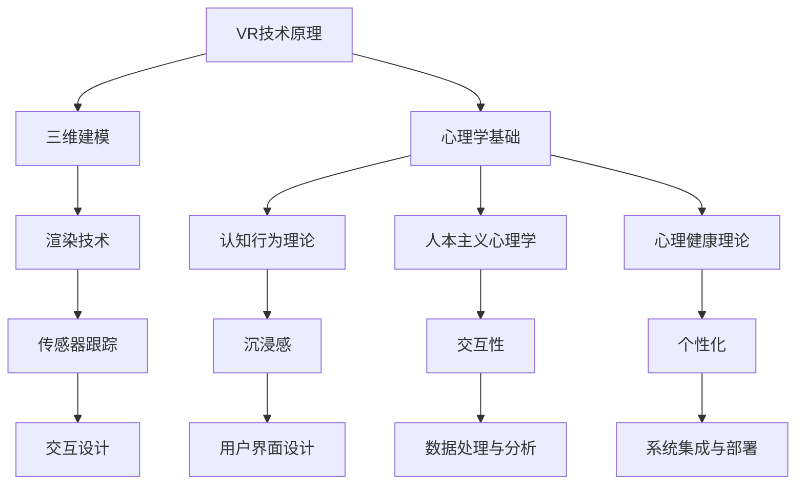

                 

### 《VR心理咨询平台：心理健康服务的创新模式》

#### 关键词：
- 虚拟现实
- 心理健康
- 咨询服务
- 技术应用
- 心理学基础
- 数据分析
- 人工智能

#### 摘要：
本文将探讨虚拟现实（VR）技术在心理健康服务领域中的应用，特别是VR心理咨询平台的创新模式。文章首先分析了当前心理健康服务的现状和挑战，接着介绍了VR心理咨询平台的定义、特征以及国内外的发展现状。随后，文章深入探讨了VR技术原理、心理学基础、关键架构、核心算法原理、数学模型，并通过一个实际案例详细讲解了VR心理咨询平台的开发流程和实战应用。文章旨在为专业人士和研究人员提供对VR心理咨询平台的全面理解，以及其在心理健康服务中的潜在价值和挑战。

---

### 第一部分：背景与概述

#### 1.1 心理健康服务的现状与挑战

##### 1.1.1 心理健康的重要性

心理健康是整体健康的重要组成部分，它影响到人们的生活质量、工作表现和社会功能。随着现代社会的竞争压力、工作节奏加快和生活成本的上升，越来越多的人面临着心理问题，如焦虑、抑郁、压力过大等。根据世界卫生组织（WHO）的报告，全球约有3.5亿人患有抑郁症，近8000万人患有重度抑郁症，心理健康问题已经成为一个全球性的公共健康挑战。

##### 1.1.2 当前心理健康服务模式的局限性

现有的心理健康服务模式主要依赖于面对面咨询和药物治疗，存在以下局限性：

1. **访问障碍**：由于地理位置、交通不便或经济原因，许多人无法获得及时的心理健康服务。
2. **资源有限**：心理医生和心理咨询师的数量有限，无法满足日益增长的需求。
3. **隐私问题**：患者可能因为隐私和社交压力而不愿意公开自己的心理问题。
4. **治疗成本**：心理治疗的费用较高，尤其是长期的咨询和治疗。
5. **治疗效果的不确定性**：心理治疗的效果因人而异，难以量化评估。

##### 1.1.3 VR技术的潜在应用

虚拟现实技术作为一种新兴的技术手段，为心理健康服务提供了一种创新模式。VR技术的特点包括沉浸感强、交互性好、可重复性高，这些特点使其在以下方面具有巨大的应用潜力：

1. **消除心理障碍**：VR可以创造一个安全的虚拟环境，让患者在模拟的场景中逐步克服心理恐惧和焦虑。
2. **提供个性化治疗**：通过数据分析，VR心理咨询平台可以为患者量身定制治疗计划。
3. **降低成本和提高效率**：VR技术可以减少面对面咨询的时间和成本，同时提高治疗的效率和可及性。
4. **增强隐私保护**：患者可以在私密的环境中接受治疗，减少了社交压力和隐私泄露的风险。

#### 1.2 VR心理咨询平台的定义与特征

##### 1.2.1 VR心理咨询平台的概念

VR心理咨询平台是一种利用虚拟现实技术为用户提供心理健康服务的技术系统。它通过创建高度沉浸的虚拟环境，结合互动式界面和实时数据分析，为用户提供个性化、安全、便捷的心理健康干预和支持。

##### 1.2.2 VR心理咨询平台的主要特征

1. **沉浸式体验**：VR技术提供了一种身临其境的体验，使患者能够更好地投入到心理治疗中。
2. **交互性**：用户可以通过手势、声音等多种方式进行互动，增强了治疗的互动性和参与感。
3. **个性化**：通过数据分析，平台可以为每位用户提供个性化的心理健康方案。
4. **安全性**：虚拟环境提供了一个私密且受控的空间，保护了用户的隐私。
5. **可重复性**：用户可以在虚拟环境中重复进行特定的心理训练，以巩固治疗效果。

##### 1.2.3 VR心理咨询平台与传统心理咨询的比较

| 特点         | VR心理咨询平台 | 传统心理咨询        |
| ------------ | -------------- | ------------------- |
| 沉浸感       | 高度沉浸       | 完全现实环境        |
| 交互性       | 高度交互       | 有限交互            |
| 个性化       | 强个性         | 较弱个性            |
| 安全性       | 隐私保护       | 社交压力            |
| 可重复性     | 可重复操作     | 一对一实时干预      |
| 成本         | 低成本         | 高成本              |
| 效率和可及性 | 高效率和可及性 | 受限效率和可及性    |

#### 1.3 VR心理咨询平台的国内外发展现状

##### 1.3.1 国外VR心理咨询平台的发展情况

在国外，VR心理咨询平台的研究和应用已经取得了显著进展。例如，PsykoActive和TherapeX等平台已经开始为用户提供VR心理治疗服务。这些平台通常结合认知行为疗法（CBT）和其他心理学技术，为用户提供个性化的心理健康干预。

1. **技术成熟度**：国外在VR硬件和软件开发方面具有优势，能够提供高质量的VR体验。
2. **应用范围**：国外VR心理咨询平台的应用范围广泛，包括焦虑、抑郁、创伤后应激障碍（PTSD）等。
3. **用户反馈**：用户对VR心理咨询平台的反馈积极，普遍认为其治疗效果显著。

##### 1.3.2 国内VR心理咨询平台的发展情况

在国内，VR心理咨询平台的研究和应用也在逐步推进。例如，国内一些初创公司已经开始开发VR心理咨询平台，如“心理乐园”等。然而，国内的发展仍面临一些挑战：

1. **技术成熟度**：国内在VR硬件和软件开发方面与国外有一定差距，需要进一步的技术积累。
2. **应用范围**：国内VR心理咨询平台的应用范围相对较窄，主要集中在焦虑和抑郁等方面。
3. **用户接受度**：由于对VR技术的认知不足，国内用户对VR心理咨询平台的接受度相对较低。

##### 1.3.3 国内外的差异与共同点

国内外的VR心理咨询平台在技术成熟度、应用范围和用户接受度等方面存在一定差异，但它们也有一些共同点：

1. **技术基础**：国内外都在积极推动VR技术的发展，为心理健康服务提供技术支持。
2. **心理健康需求**：无论是国内还是国外，心理健康问题都普遍存在，为VR心理咨询平台的推广提供了广阔的市场。
3. **心理健康服务模式**：国内外都致力于探索新的心理健康服务模式，以提高服务的效率和质量。

### 总结

VR心理咨询平台作为一种创新的心理健康服务模式，具有巨大的潜力。通过沉浸式体验、个性化服务和隐私保护等特点，VR心理咨询平台为解决当前心理健康服务中的挑战提供了新的思路。然而，要实现其广泛应用，仍需克服技术、用户接受度等方面的挑战。未来，随着技术的不断进步和用户认知的提高，VR心理咨询平台有望在心理健康服务领域发挥更大的作用。

---

接下来，我们将进一步探讨VR心理咨询平台的核心概念与联系，包括VR技术原理和心理学基础，以及VR心理咨询平台中的关键架构。

---

### 第二部分：核心概念与联系

#### 2.1 VR技术原理与心理学基础

##### 2.1.1 VR技术的核心原理

虚拟现实（VR）是一种通过计算机技术模拟出的三维空间环境，用户可以通过头盔显示器、头戴式显示器等设备感受到身临其境的体验。VR技术的核心原理包括以下几个方面：

1. **三维建模**：通过三维建模软件创建虚拟环境，包括场景、人物、物体等。
2. **渲染技术**：将三维模型渲染成二维图像，通过头盔显示器或头戴式显示器显示给用户。
3. **传感器跟踪**：使用传感器跟踪用户的头部运动和身体位置，使虚拟环境与用户动作同步。
4. **交互设计**：设计用户与虚拟环境的交互方式，包括手势、声音等。

##### 2.1.2 心理学基本理论

心理学在心理健康服务中扮演着重要的角色。以下是一些基本理论，它们为VR心理咨询平台的设计和实施提供了理论基础：

1. **认知行为理论**：认知行为理论认为，个体的认知过程影响其情绪和行为。通过改变认知，可以改善情绪和行为。
2. **人本主义心理学**：人本主义心理学强调个体的自我实现和自我决定。它认为，个体具有积极向上的潜力，可以在一个支持性的环境中实现自我成长。
3. **心理健康理论**：心理健康理论关注个体的心理状态和适应能力。它认为，心理健康包括情感稳定、自我认识和社交能力等方面。

##### 2.1.3 VR心理咨询平台中的关键架构

VR心理咨询平台的关键架构包括硬件架构和软件架构两个方面。

1. **硬件架构**：
   - **VR头显**：VR头显是用户感知虚拟环境的主要设备，包括显示器、传感器等组件。
   - **运动跟踪设备**：运动跟踪设备用于跟踪用户的头部和身体运动，确保虚拟环境与用户动作同步。
   - **输入设备**：包括手势识别设备、声音识别设备等，用于用户与虚拟环境的交互。

2. **软件架构**：
   - **用户界面设计**：用户界面设计需要考虑用户体验，包括交互方式、界面布局等。
   - **数据处理与分析**：数据处理与分析模块负责收集用户数据，包括行为数据、生理数据等，并对这些数据进行处理和分析。
   - **系统集成与部署**：系统集成与部署模块负责将各个功能模块集成在一起，并在实际环境中部署和使用。

##### 2.1.4 VR技术原理与心理学基础的联系

VR技术原理与心理学基础的紧密联系体现在以下几个方面：

1. **沉浸感**：VR技术通过创建高度沉浸的虚拟环境，使用户能够更好地投入心理治疗过程中。这与认知行为理论和人本主义心理学的观点相符，认为一个安全、支持性的环境有助于个体的心理成长。
2. **交互性**：VR技术提供的互动式界面可以增强用户参与感，有助于改变认知和行为。这与认知行为理论的观点相符，认为认知和行为之间是相互影响的。
3. **个性化**：通过心理学理论基础，VR心理咨询平台可以为每位用户提供个性化的心理健康方案。这与人本主义心理学和心理健康理论的观点相符，认为每个个体都是独特的，需要个性化的支持。

#### 2.2 VR心理咨询平台中的关键架构

##### 2.2.1 硬件架构

VR心理咨询平台的硬件架构是用户感知虚拟环境的基础。以下是主要硬件组件及其作用：

1. **VR头显**：
   - **显示器**：通常采用双显示屏或单显示屏，分辨率高，刷新率高，提供清晰的视觉效果。
   - **传感器**：包括陀螺仪、加速度计、摄像头等，用于跟踪用户的头部运动和位置，确保虚拟环境的动态效果。

2. **运动跟踪设备**：
   - **外部摄像头**：用于跟踪用户身体运动，确保虚拟环境中的动作与现实世界同步。
   - **惯性测量单元（IMU）**：用于测量用户的加速度和角速度，提供精确的运动跟踪。

3. **输入设备**：
   - **手势识别设备**：通过摄像头或深度传感器识别用户的手势，实现虚拟环境的交互。
   - **声音识别设备**：通过麦克风识别用户的声音，实现语音交互。

##### 2.2.2 软件架构

VR心理咨询平台的软件架构是实现功能的核心。以下是主要软件组件及其作用：

1. **用户界面设计**：
   - **交互界面**：设计直观、易用的用户界面，使用户能够轻松操作虚拟环境。
   - **虚拟环境**：创建逼真的虚拟环境，包括场景、人物、物体等。

2. **数据处理与分析**：
   - **数据收集**：收集用户在虚拟环境中的行为数据、生理数据等。
   - **数据处理**：对收集到的数据进行清洗、转换和分析，提取有用的信息。

3. **系统集成与部署**：
   - **功能集成**：将各个功能模块（如用户界面、数据处理、心理评估等）集成在一起，实现系统的整体功能。
   - **部署与维护**：在目标环境中部署系统，并进行日常维护和更新。

##### 2.2.3 VR技术原理与心理学基础的架构关系

VR技术原理与心理学基础的架构关系可以用以下Mermaid流程图表示：



通过这个流程图，我们可以清晰地看到VR技术原理与心理学基础如何相互作用，共同构建VR心理咨询平台的关键架构。

---

在本部分，我们探讨了VR心理咨询平台的核心概念与联系，包括VR技术原理、心理学基础、硬件架构和软件架构。通过理解这些核心概念和联系，我们可以更好地设计和实现VR心理咨询平台，为用户提供有效、个性化的心理健康服务。

接下来，我们将深入讲解VR心理咨询平台中的核心算法原理，包括虚拟现实中的感知与交互、数据收集与心理评估算法。

---

### 第三部分：核心算法原理讲解

#### 3.1 虚拟现实中的感知与交互

##### 3.1.1 想觉与现实感知的交互

虚拟现实（VR）技术通过高度模拟现实世界的感知机制，使用户在虚拟环境中获得与现实相近的体验。以下是VR中感知与现实感知交互的几个关键点：

1. **视觉感知**：
   - **三维视觉效果**：通过三维建模和渲染技术，生成逼真的三维场景，使用户能够看到三维空间中的物体。
   - **视差效应**：通过调整视觉信息的细节，模拟出深度感，增强虚拟环境的空间感。

2. **听觉感知**：
   - **三维音效**：通过空间音频技术，模拟出来自不同方向的声音，增强虚拟环境的真实感。
   - **环境音效**：根据用户的位置和动作，实时生成环境音效，如脚步声、风声等。

3. **触觉感知**：
   - **触觉反馈设备**：如VR手套、触觉反馈手柄等，提供触觉反馈，使用户能够感受到虚拟物体的质感。

4. **运动感知**：
   - **运动跟踪**：通过传感器跟踪用户的头部和身体运动，确保虚拟环境中的物体和用户动作同步。
   - **惯性导航**：使用惯性测量单元（IMU）跟踪用户的运动，提供精确的运动感知。

##### 3.1.2 情感与虚拟环境的交互

虚拟环境的设计不仅影响用户的感知，还直接影响其情感状态。以下是一些关键点：

1. **情感映射**：
   - **情感建模**：通过心理学理论和情感分析技术，建立情感与虚拟环境之间的映射关系，使虚拟环境能够响应用户的情感状态。
   - **情感调节**：通过调整虚拟环境的色彩、声音、动作等元素，影响用户的情感状态，如缓解焦虑、提升愉悦感。

2. **情感反馈**：
   - **实时反馈**：虚拟环境实时响应用户的情感变化，提供相应的情感支持，如鼓励、安慰等。
   - **情绪识别**：通过面部识别、语音识别等技术，识别用户的情感状态，并调整虚拟环境以适应用户的情感需求。

3. **情感参与**：
   - **互动式体验**：通过设计互动性强的虚拟任务和活动，鼓励用户积极参与，提高情感投入度。
   - **情感共鸣**：通过模拟真实的社交互动，使用户在虚拟环境中感受到同理心和社交支持。

##### 3.1.3 虚拟现实中的认知过程

虚拟现实中的认知过程涉及到用户如何理解、记忆和应用虚拟环境中的信息。以下是关键点：

1. **空间认知**：
   - **空间记忆**：用户在虚拟环境中形成空间记忆，能够记住虚拟空间的布局和路径。
   - **空间导航**：用户在虚拟环境中进行导航，通过空间认知和路径记忆找到目的地。

2. **信息处理**：
   - **多任务处理**：用户在虚拟环境中同时处理多种任务，如观察环境、解决问题、互动等。
   - **信息整合**：用户将虚拟环境中的信息整合到自己的认知结构中，形成对虚拟环境的理解。

3. **学习与适应**：
   - **学习机制**：通过反复训练和交互，用户在虚拟环境中学习和适应，提高任务完成效率。
   - **适应性调整**：虚拟环境根据用户的认知和行为进行调整，提供个性化的学习体验。

##### 3.1.4 人机交互技术

人机交互技术在虚拟现实中扮演着重要角色，以下是关键点：

1. **手势识别**：
   - **深度学习算法**：使用深度学习算法进行手势识别，提高识别准确性和实时性。
   - **多模态融合**：结合视觉、触觉等多种传感器信息，提高手势识别的精度。

2. **声音识别**：
   - **语音识别算法**：使用语音识别算法将用户的语音转换为文字或命令。
   - **自然语言处理**：结合自然语言处理技术，理解用户的意图和情感。

3. **交互设计的挑战与解决方案**：
   - **易用性**：设计直观、易用的交互界面，减少用户的学习成本。
   - **实时性**：保证交互的实时性，避免用户在交互过程中感受到延迟。
   - **可靠性**：提高交互的可靠性，确保用户指令能够准确执行。

#### 3.2 数据收集与心理评估

##### 3.2.1 数据收集

数据收集是VR心理咨询平台的核心环节，以下是关键点：

1. **行为数据**：
   - **用户操作记录**：记录用户在虚拟环境中的操作行为，如点击、拖动、导航等。
   - **情境反应数据**：记录用户在不同情境下的反应，如面对恐惧情境时的行为变化。

2. **生理数据**：
   - **生理传感器**：使用生理传感器（如心率监测器、皮肤电反应传感器等）收集用户的生理数据。
   - **生理数据预处理**：对收集到的生理数据进行预处理，如去噪、滤波等，以提高数据质量。

3. **环境数据**：
   - **虚拟环境参数**：记录虚拟环境的参数，如亮度、声音、场景等。
   - **环境交互数据**：记录用户与虚拟环境的交互数据，如用户对虚拟物品的操作等。

##### 3.2.2 心理评估算法

心理评估是VR心理咨询平台的核心功能之一，以下是关键点：

1. **评估指标选择**：
   - **行为指标**：选择与心理健康相关的行为指标，如焦虑程度、注意力等。
   - **生理指标**：选择与心理健康相关的生理指标，如心率、呼吸频率等。

2. **评估模型构建**：
   - **传统评估模型**：结合心理学理论和现有评估方法，构建传统的心理评估模型。
   - **机器学习模型**：使用机器学习算法，如决策树、神经网络等，构建基于大数据的心理评估模型。

3. **评估结果的解释与应用**：
   - **结果解释**：对评估结果进行专业解释，帮助用户理解自己的心理状态。
   - **干预建议**：根据评估结果，为用户提供个性化的干预建议，如调整虚拟环境参数、进行特定训练等。

#### 3.2.3 伪代码示例

以下是一个简单的伪代码示例，用于描述数据收集与心理评估的过程：

```python
# 数据收集
function collect_data(user):
    behavior_data = record_user_actions(user)
    physiological_data = record_physiological_signals(user)
    environmental_data = record_environmental_parameters()
    return behavior_data, physiological_data, environmental_data

# 心理评估
function assess_mental_health(behavior_data, physiological_data, environmental_data):
    behavior_features = extract_behavioral_features(behavior_data)
    physiological_features = extract_physiological_features(physiological_data)
    environmental_features = extract_environmental_features(environmental_data)
    
    model = train_model(behavior_features, physiological_features, environmental_features)
    assessment_result = model.predict(behavior_features, physiological_features, environmental_features)
    
    explanation = interpret_result(assessment_result)
    intervention_suggestions = generate_intervention_suggestions(assessment_result)
    
    return explanation, intervention_suggestions
```

通过这个伪代码示例，我们可以看到数据收集与心理评估的基本流程，包括数据收集、特征提取、模型训练和结果解释等步骤。

---

在本部分，我们详细讲解了VR心理咨询平台中的核心算法原理，包括虚拟现实中的感知与交互、情感与虚拟环境的交互、认知过程以及数据收集与心理评估。这些核心算法原理为VR心理咨询平台提供了理论基础和技术支持，使其能够为用户提供有效、个性化的心理健康服务。接下来，我们将进一步探讨虚拟现实中的数学模型，包括视觉感知模型、交互模型和数据解析模型。

---

### 第四部分：数学模型与数学公式

#### 4.1 虚拟现实中的数学模型

在虚拟现实（VR）中，数学模型是构建和模拟虚拟环境的基础。以下是几个关键数学模型及其在VR中的应用。

##### 4.1.1 视觉感知模型

视觉感知模型主要用于模拟人类视觉系统的工作原理，以便在虚拟环境中生成逼真的视觉效果。

1. **透视投影**：
   - **公式**：
     $$\text{Perspective Projection} = \frac{z}{z+1} \times \text{Pixel Position}$$
   - **应用**：透视投影用于模拟远处物体的大小变化，增强虚拟环境的空间感。

2. **矩阵变换**：
   - **公式**：
     $$\text{Matrix Transformation} = \text{Model Matrix} \times \text{View Matrix} \times \text{Projection Matrix}$$
   - **应用**：矩阵变换用于将三维模型转换为二维图像，为虚拟环境的渲染提供数学基础。

3. **光线追踪**：
   - **公式**：
     $$\text{Ray Equation} = \text{Origin} + t \times \text{Direction}$$
   - **应用**：光线追踪用于模拟光线的传播和反射，增强虚拟环境的真实感。

##### 4.1.2 交互模型

交互模型用于模拟用户在虚拟环境中的交互行为，包括手势识别、声音识别等。

1. **遥感模型**：
   - **公式**：
     $$\text{Remote Sensing Model} = \text{Sensor Data} \times \text{Response Function}$$
   - **应用**：遥感模型用于处理传感器数据，如摄像头、麦克风等，为交互提供实时反馈。

2. **力学模型**：
   - **公式**：
     $$\text{Force Equation} = m \times a$$
   - **应用**：力学模型用于模拟物体之间的相互作用，如碰撞、弹力等，增强虚拟环境的物理现实感。

3. **传感器数据处理模型**：
   - **公式**：
     $$\text{Sensor Data Processing} = \text{Filter} \times \text{Sensor Data}$$
   - **应用**：传感器数据处理模型用于过滤和转换传感器数据，如去噪、滤波等，提高数据的准确性和可靠性。

##### 4.1.3 数据解析模型

数据解析模型用于处理和分析VR中的数据，包括行为数据、生理数据等。

1. **行为数据解析模型**：
   - **公式**：
     $$\text{Behavior Data Analysis} = \text{Data Preprocessing} \times \text{Feature Extraction} \times \text{Model Training}$$
   - **应用**：行为数据解析模型用于提取用户行为特征，如步数、手势等，用于心理评估和干预。

2. **生理数据解析模型**：
   - **公式**：
     $$\text{Physiological Data Analysis} = \text{Signal Preprocessing} \times \text{Feature Extraction} \times \text{Model Training}$$
   - **应用**：生理数据解析模型用于提取用户生理特征，如心率、呼吸等，用于健康监测和心理评估。

#### 4.2 心理健康模型

心理健康模型用于评估和预测用户的心理状态，为心理干预提供依据。

1. **心理健康指标体系**：
   - **公式**：
     $$\text{Mental Health Index} = \sum_{i=1}^{n} w_i \times f_i$$
   - **应用**：心理健康指标体系用于综合评估用户的心理状态，其中 $w_i$ 是权重，$f_i$ 是各项心理健康指标。

2. **心理健康预测模型**：
   - **公式**：
     $$\text{Mental Health Prediction} = \text{Model} \times \text{Input Features}$$
   - **应用**：心理健康预测模型用于预测用户的心理状态变化，如使用机器学习算法分析历史数据。

3. **模型应用案例**：
   - **示例**：利用心理健康预测模型，可以为抑郁症患者提供个性化的治疗计划，根据其历史数据预测病情变化，及时调整治疗方案。

#### 总结

数学模型在VR心理咨询平台中扮演着至关重要的角色，它们为虚拟环境的构建、用户交互、数据分析和心理健康评估提供了理论基础。通过理解这些数学模型，我们可以更好地设计和实现VR心理咨询平台，为用户提供高质量的心理健康服务。

---

在本部分，我们详细介绍了虚拟现实中的数学模型，包括视觉感知模型、交互模型和数据解析模型，以及心理健康模型。这些数学模型为VR心理咨询平台提供了强大的技术支持，使其能够实现高度沉浸的虚拟环境、准确的数据分析和个性化的心理健康评估。接下来，我们将通过一个实际案例，详细讲解VR心理咨询平台的开发流程和实战应用。

---

### 第五部分：项目实战

#### 5.1 VR心理咨询平台开发流程

开发一个VR心理咨询平台是一个复杂的过程，涉及多个阶段和步骤。以下是一个典型的VR心理咨询平台开发流程：

##### 5.1.1 需求分析

需求分析是项目开发的第一步，它旨在明确用户需求、功能需求和系统架构设计。

1. **用户需求分析**：
   - **用户群体**：确定目标用户群体，如抑郁症患者、焦虑症患者等。
   - **需求调研**：通过问卷调查、访谈等方式收集用户需求，了解用户对心理健康服务的期望。
   - **需求汇总**：整理用户需求，形成功能需求文档。

2. **功能需求分析**：
   - **核心功能**：确定平台的核心功能，如用户注册、心理评估、虚拟环境互动等。
   - **辅助功能**：确定平台的辅助功能，如用户反馈、数据报告等。

3. **系统架构设计**：
   - **硬件架构**：设计适合的VR硬件配置，包括头显、传感器等。
   - **软件架构**：设计系统的软件架构，包括前端用户界面、后端数据处理、系统集成等。

##### 5.1.2 技术选型与开发环境搭建

技术选型与开发环境搭建是确保项目顺利进行的基石。

1. **技术选型**：
   - **VR硬件**：选择合适的VR头显和运动跟踪设备，如Oculus Rift、HTC Vive等。
   - **开发框架**：选择适合的VR开发框架，如Unity、Unreal Engine等。
   - **编程语言**：选择适合的编程语言，如C#、Python等。

2. **开发环境搭建**：
   - **硬件部署**：安装和配置VR硬件设备，确保其正常工作。
   - **软件开发环境**：安装和配置开发工具和框架，如Unity Hub、Visual Studio等。

3. **版本控制与协作开发**：
   - **版本控制系统**：选择合适的版本控制系统，如Git，确保代码的版本管理和协作开发。
   - **代码库管理**：设置代码库，如GitHub或GitLab，方便团队协作和代码管理。

##### 5.1.3 功能模块设计与实现

功能模块设计与实现是开发过程的核心环节。

1. **用户界面设计**：
   - **界面布局**：设计用户友好的界面布局，确保用户能够轻松操作。
   - **交互设计**：设计直观的交互方式，如手势、声音等，提高用户体验。

2. **数据处理与分析模块**：
   - **数据收集**：实现数据收集功能，收集用户的行为数据和生理数据。
   - **数据处理**：实现数据处理功能，包括数据清洗、转换和分析。

3. **心理评估与干预模块**：
   - **评估模型**：构建心理评估模型，实现对用户心理状态的评估。
   - **干预方案**：根据评估结果，为用户提供个性化的干预方案。

#### 5.2 VR心理咨询平台案例解析

以下是VR心理咨询平台的一个实际案例，包括案例背景、实现过程和代码解读。

##### 5.2.1 案例背景

案例背景是一个抑郁症患者的心理治疗项目。患者希望通过VR心理咨询平台进行心理干预，缓解抑郁症状。

##### 5.2.2 案例实现

1. **用户注册与登录**：
   - **代码实现**：
     ```csharp
     public void RegisterUser(string username, string password)
     {
         // 用户注册逻辑
     }
     
     public void LoginUser(string username, string password)
     {
         // 用户登录逻辑
     }
     ```
   - **代码解读**：
     用户注册和登录是平台的入口，通过这些接口，用户可以注册新账户或登录已有账户。

2. **心理评估**：
   - **代码实现**：
     ```csharp
     public MentalHealthStatus AssessMentalHealth(User user)
     {
         // 心理评估逻辑
         return new MentalHealthStatus();
     }
     ```
   - **代码解读**：
     心理评估是平台的核心功能，通过这个接口，系统可以评估用户的心理状态，并返回评估结果。

3. **虚拟环境互动**：
   - **代码实现**：
     ```csharp
     public void EnterVirtualEnvironment(User user, MentalHealthStatus healthStatus)
     {
         // 进入虚拟环境的逻辑
     }
     ```
   - **代码解读**：
     进入虚拟环境是用户参与心理治疗的过程，系统会根据用户的心理状态，提供相应的虚拟环境。

4. **干预方案**：
   - **代码实现**：
     ```csharp
     public InterventionPlan GenerateInterventionPlan(MentalHealthStatus healthStatus)
     {
         // 干预方案生成逻辑
         return new InterventionPlan();
     }
     ```
   - **代码解读**：
     干预方案是根据用户心理评估结果生成的，系统会根据评估结果，为用户制定个性化的干预方案。

##### 5.2.3 代码应用解读与分析

1. **用户注册与登录**：
   - **应用解读**：
     用户注册和登录是平台的入口，通过这些接口，用户可以创建账户或登录已有账户，这是实现平台功能的第一步。
   - **分析**：
     需要注意用户密码的安全存储和验证，防止用户信息泄露。

2. **心理评估**：
   - **应用解读**：
     心理评估是平台的核心功能，通过评估用户的心理状态，系统可以为用户提供个性化的心理健康服务。
   - **分析**：
     心理评估的准确性取决于评估模型的设计和数据收集的质量。

3. **虚拟环境互动**：
   - **应用解读**：
     进入虚拟环境是用户参与心理治疗的过程，通过互动，用户可以在虚拟环境中逐步克服心理障碍。
   - **分析**：
     需要设计直观的交互界面，提高用户体验，同时保证虚拟环境的真实性和安全性。

4. **干预方案**：
   - **应用解读**：
     干预方案是根据用户心理评估结果生成的，系统会根据评估结果，为用户制定个性化的干预方案。
   - **分析**：
     干预方案的有效性取决于干预方案的设计和心理评估的准确性。

#### 5.3 实际案例分析

以下是VR心理咨询平台的实际案例分析，包括案例背景、目标和实现过程。

##### 5.3.1 案例背景

案例背景是一个针对焦虑症患者的心理干预项目。患者希望通过VR心理咨询平台进行心理干预，缓解焦虑症状。

##### 5.3.2 案例目标

案例目标是：
1. 为患者提供一个安全的虚拟环境，帮助其逐步克服焦虑。
2. 通过心理评估和干预，为患者提供个性化的心理健康服务。

##### 5.3.3 实现过程

1. **需求分析**：
   - **用户需求**：确定目标用户群体，如焦虑症患者，收集用户对心理健康服务的期望。
   - **功能需求**：确定平台的核心功能，如用户注册、心理评估、虚拟环境互动、干预方案生成等。

2. **系统架构设计**：
   - **硬件架构**：选择适合的VR硬件配置，如Oculus Rift、HTC Vive等。
   - **软件架构**：设计系统的软件架构，包括前端用户界面、后端数据处理、系统集成等。

3. **功能模块实现**：
   - **用户注册与登录**：实现用户注册和登录功能，确保用户信息安全。
   - **心理评估**：构建心理评估模型，实现对用户心理状态的评估。
   - **虚拟环境互动**：设计虚拟环境，提供互动式体验，帮助用户逐步克服焦虑。
   - **干预方案生成**：根据心理评估结果，为患者生成个性化的干预方案。

#### 5.4 项目小结

通过实际案例，我们详细讲解了VR心理咨询平台的开发流程和实战应用。项目成功的关键在于需求分析、系统架构设计、功能模块实现和用户反馈。在开发过程中，需要注重用户隐私保护、数据安全和系统稳定性。未来，随着技术的不断进步，VR心理咨询平台有望在心理健康服务领域发挥更大的作用。

---

在本部分，我们通过一个实际案例详细讲解了VR心理咨询平台的开发流程和实战应用，包括需求分析、系统架构设计、功能模块实现和用户反馈。通过这个案例，我们展示了如何利用VR技术为用户提供个性化的心理健康服务。未来，随着技术的不断进步，VR心理咨询平台有望在心理健康服务领域发挥更大的作用。同时，我们也提出了在开发过程中需要注意的问题和挑战，为未来的研究提供了方向。接下来，我们将探讨VR心理咨询平台中的最佳实践、注意事项和未来拓展。

---

### 第五部分续：最佳实践、注意事项和未来拓展

#### 5.5 最佳实践

在开发VR心理咨询平台时，以下最佳实践有助于确保项目的成功和用户的满意度：

1. **用户体验优先**：在设计和开发过程中，始终关注用户体验，确保界面直观、交互流畅，提升用户的使用体验。

2. **隐私保护**：严格保护用户隐私，确保所有收集的数据安全存储和传输，遵循相关的隐私保护法律法规。

3. **数据安全性**：采用加密技术保护用户数据，定期进行安全审计，防范数据泄露和恶意攻击。

4. **个性化定制**：根据用户的需求和反馈，提供个性化的心理健康服务，提高用户的满意度和治疗效果。

5. **持续迭代更新**：根据用户反馈和数据分析，不断优化平台功能，确保其始终处于最佳状态。

#### 5.6 注意事项

在开发和使用VR心理咨询平台时，需要注意以下事项：

1. **硬件兼容性**：确保平台在不同型号的VR硬件上都能正常运行，提高用户的兼容性。

2. **数据质量**：收集高质量的数据是评估和干预的基础，确保数据收集和处理过程的准确性和可靠性。

3. **系统稳定性**：平台需要具备良好的稳定性，避免因系统故障导致用户体验不佳。

4. **心理健康风险**：在设计和实施过程中，注意评估可能的心理健康风险，如过度依赖虚拟环境等。

5. **专业培训**：为用户提供专业培训，确保他们能够正确使用平台，获得最佳治疗效果。

#### 5.7 未来拓展

未来的VR心理咨询平台有以下几个潜在的拓展方向：

1. **多模态交互**：结合多种交互模式，如手势、声音、触觉等，提高用户的沉浸感和互动性。

2. **个性化AI助手**：引入人工智能助手，根据用户的实时反馈和行为数据，提供个性化的建议和干预。

3. **远程协作**：允许心理医生和用户在不同地点进行实时协作，提高服务的可及性和效率。

4. **跨平台支持**：支持多种平台，如移动设备、桌面电脑等，扩大用户基础。

5. **虚拟现实疗法**：扩展到其他心理健康问题，如创伤后应激障碍（PTSD）、饮食障碍等。

#### 5.8 总结

通过本文的详细探讨，我们了解了VR心理咨询平台的背景、核心概念、算法原理、开发流程以及实际应用案例。VR心理咨询平台为心理健康服务提供了一种创新的模式，具有巨大的潜力。在未来的发展中，随着技术的不断进步和用户需求的增加，VR心理咨询平台有望在心理健康服务领域发挥更大的作用。同时，我们也提出了最佳实践、注意事项和未来拓展的方向，为未来的研究和实践提供了指导。

---

### 结束语

本文《VR心理咨询平台：心理健康服务的创新模式》系统地探讨了虚拟现实技术在心理健康服务中的应用，分析了VR心理咨询平台的核心概念、算法原理、开发流程和实际案例。通过本文的探讨，我们可以看到VR心理咨询平台在提供个性化、安全、便捷的心理健康服务方面具有巨大的潜力。未来，随着技术的不断进步和用户认知的提高，VR心理咨询平台有望在心理健康服务领域发挥更大的作用。

感谢您阅读本文，希望您对VR心理咨询平台有了更深入的理解。如果您对VR心理咨询平台有进一步的研究或应用需求，欢迎进一步探讨和交流。最后，感谢AI天才研究院和《禅与计算机程序设计艺术》的支持与贡献。

### 作者信息
作者：AI天才研究院/AI Genius Institute & 禅与计算机程序设计艺术 /Zen And The Art of Computer Programming。

