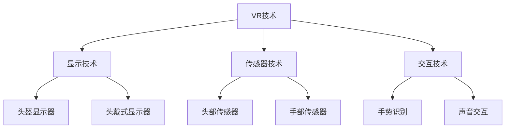
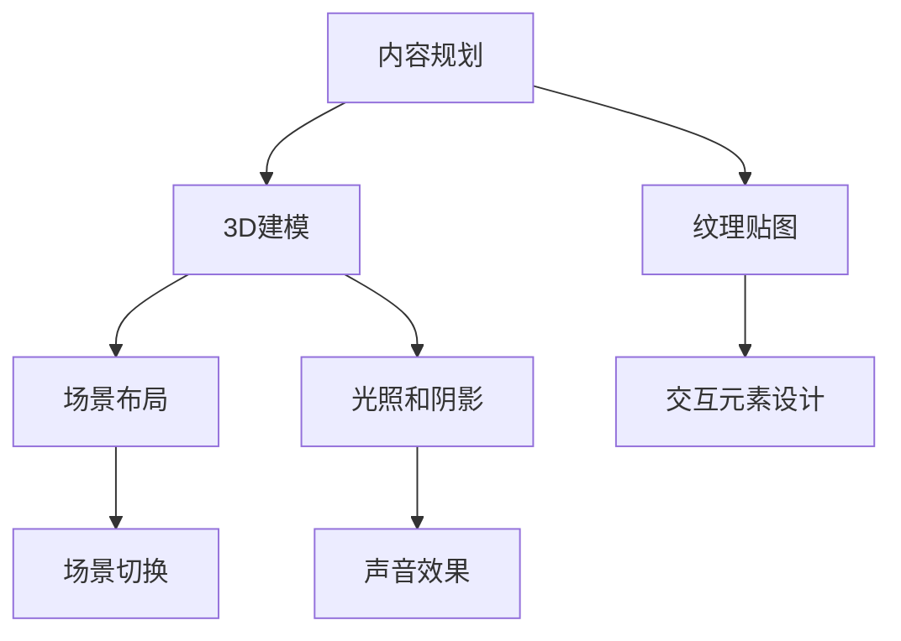
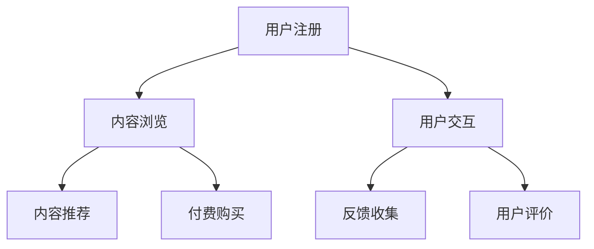

                 


### 背景介绍

虚拟现实（Virtual Reality，简称VR）技术，作为一种能够创建沉浸式体验的计算机仿真技术，近年来在全球范围内迅速发展。VR技术的应用范围日益广泛，从游戏娱乐到教育培训，从医疗康复到远程工作，都显示出其强大的潜力和广阔的市场前景。而VR旅游作为其中的一支新兴力量，正逐渐改变着人们对旅游的传统认知。

虚拟旅游，简单来说，就是利用VR技术为用户提供虚拟的旅游体验。用户可以通过VR设备，如VR头盔、手柄等，进入一个虚拟的旅游场景，感受到如同真实世界般的视觉、听觉、触觉等多种感官体验。这种体验不仅让用户能够在虚拟环境中“游览”各种名胜古迹、风景名胜，还能进行互动，如拍照、购物等。这不仅突破了地理和时间的限制，还为旅游行业带来了新的商业模式和用户体验。

随着VR技术的不断进步，虚拟旅游市场正在快速增长。据统计，全球虚拟旅游市场规模预计将在未来几年内实现翻倍，达到数百亿美元。这一趋势不仅吸引了众多创业者、投资者的关注，也激发了技术专家和研发团队的深入研究。

本文将围绕VR旅游体验平台这一主题，详细探讨虚拟旅游行业的背景与发展现状，VR旅游体验平台的核心概念与架构，VR旅游体验平台的技术实现，以及虚拟旅游行业的创业机会和商业模式。通过本文的阅读，读者将深入了解VR旅游行业的现状和未来发展，掌握VR旅游体验平台的技术实现和商业运营策略，为未来的创业和创新提供有价值的参考和启示。

### 第一部分：虚拟旅游行业概述

#### 第1章：虚拟旅游行业背景与发展现状

#### 1.1 虚拟现实技术介绍

虚拟现实技术（Virtual Reality，简称VR）是一种通过计算机生成模拟环境，使人在其中能够感受到身临其境的体验感的技术。它利用计算机图形技术、传感器技术、显示技术等多种技术手段，为用户创造一个虚拟的、可以交互的三维空间。VR技术的主要组成部分包括：

1. **显示技术**：通过头盔显示器（HMD）、头戴式显示器（HMD）等设备，将用户包裹在一个三维视觉环境中。
2. **传感器技术**：如头部跟踪器、手柄、动作捕捉装置等，实时捕捉用户的动作，将其映射到虚拟环境中。
3. **交互技术**：用户可以通过手势、声音、身体动作等与虚拟环境进行交互，增强沉浸式体验。

VR技术的优势在于，它能够为用户带来前所未有的沉浸感和互动性，突破了传统媒体的表现形式，从而在游戏、教育、医疗、旅游等多个领域展现出巨大的潜力。

#### 1.2 虚拟旅游市场潜力分析

虚拟旅游市场的潜力主要体现在以下几个方面：

1. **用户需求增加**：随着人们生活水平的提高，旅游需求日益增长，但受限于时间、经济和身体条件等因素，很多人无法实现亲身体验全球各地的名胜古迹。虚拟旅游恰好满足了这一需求，为用户提供了低成本、便捷的替代方案。
2. **技术进步**：随着VR技术的不断发展和成熟，虚拟旅游的体验质量越来越高，能够提供更加真实、生动的旅游体验。这使得虚拟旅游逐渐从概念走向实际应用。
3. **市场规模巨大**：据市场研究机构的预测，虚拟旅游市场将在未来几年内实现快速增长，预计市场规模将达数百亿美元。这一市场潜力吸引了众多创业者、投资者的关注。

#### 1.3 虚拟旅游行业的发展趋势

虚拟旅游行业的发展趋势可以从以下几个方面来观察：

1. **技术进步**：随着VR技术的不断发展，虚拟旅游的体验质量将进一步提高，为用户提供更加真实、丰富的旅游体验。
2. **内容多样化**：虚拟旅游内容将越来越多样化，除了传统的名胜古迹、风景名胜外，还将涵盖更多的主题旅游内容，如美食旅游、文化体验等。
3. **平台整合**：随着市场的竞争加剧，虚拟旅游平台将越来越多地进行整合，形成更加集中、多样化的虚拟旅游生态系统。
4. **商业模式创新**：虚拟旅游的商业模式将不断创新，除了传统的付费模式外，还将探索更多基于广告、会员制等的新型商业模式。

通过以上分析，我们可以看到虚拟旅游行业具有巨大的市场潜力和发展空间。接下来，本文将深入探讨VR旅游体验平台的核心概念与架构，以及VR旅游体验平台的技术实现，为创业者和技术开发者提供更深入的参考。

#### 第2章：VR旅游体验平台核心概念与架构

#### 2.1 VR旅游体验平台定义

VR旅游体验平台是一个集成了虚拟现实技术，为用户提供沉浸式旅游体验的应用系统。它通过虚拟现实头盔、手柄等设备，将用户带入一个高度模拟的旅游场景，使用户可以在虚拟环境中实现游览、互动和体验。VR旅游体验平台不仅包含虚拟景观的展示，还融入了互动元素，如拍照、购物、信息查询等，从而提升用户的沉浸感和互动体验。

#### 2.2 平台架构设计

VR旅游体验平台的架构设计需要考虑多个方面，包括硬件设备、软件系统和网络通信等。以下是一个典型的VR旅游体验平台架构设计：

1. **硬件设备**：
   - **VR头盔**：作为用户的主要显示设备，提供三维视觉体验。
   - **手柄**：用于用户的交互操作，如移动、拍照等。
   - **传感器**：包括头部传感器、手部传感器等，用于捕捉用户的动作和位置。

2. **软件系统**：
   - **虚拟景观引擎**：负责生成和管理虚拟旅游场景，包括地形、建筑物、人物等。
   - **用户交互系统**：处理用户的输入，实现用户与虚拟环境的交互。
   - **数据处理系统**：用于处理用户的交互数据，提供个性化服务。

3. **网络通信**：
   - **云端服务器**：存储和管理虚拟景观数据，提供数据处理和分析服务。
   - **客户端软件**：安装在用户的设备上，负责与云端服务器进行通信，实现数据的传输和同步。

#### 2.3 VR旅游体验平台的组成部分

一个完整的VR旅游体验平台通常包括以下几个关键组成部分：

1. **虚拟景观制作**：
   - **3D建模**：使用3D建模软件创建虚拟景观的三维模型。
   - **纹理贴图**：为模型添加纹理和材质，使其更加真实。
   - **场景构建**：将不同的模型和元素组合在一起，创建一个完整的虚拟景观。

2. **交互设计**：
   - **用户界面**：设计用户与虚拟环境的交互界面，使用户能够轻松操作。
   - **交互逻辑**：定义用户输入与虚拟环境响应之间的关系，实现互动功能。

3. **内容管理**：
   - **数据存储**：将虚拟景观数据和用户交互数据存储在云端服务器上，提供数据备份和恢复功能。
   - **内容更新**：定期更新虚拟景观内容，保持平台的新鲜度和吸引力。

4. **用户体验优化**：
   - **性能优化**：优化虚拟景观的渲染性能，提高用户体验。
   - **交互优化**：优化用户的交互体验，提升平台的易用性。

通过以上核心概念和架构的介绍，我们可以看到，VR旅游体验平台是一个复杂但具有巨大潜力的系统。接下来，本文将深入探讨VR旅游体验平台的技术实现，包括虚拟现实硬件设备与技术、虚拟旅游内容制作技术，以及虚拟现实软件开发框架，为创业者和技术开发者提供更具体的实现路径和技术参考。

#### 第3章：VR旅游体验平台技术实现

#### 3.1 虚拟现实硬件设备与技术

虚拟现实硬件设备是VR旅游体验平台的基础，决定了用户能否获得高质量的沉浸式体验。以下是一些关键的虚拟现实硬件设备和技术：

1. **虚拟现实头盔（VR Headset）**：
   - **分类**：虚拟现实头盔可以分为移动式（如Google Daydream、Oculus Go）和连接式（如Oculus Rift、HTC Vive）两大类。移动式头盔独立运行，无需连接电脑或其他设备，适合轻度使用；连接式头盔需要与高性能电脑或其他设备连接，提供更高的沉浸式体验。
   - **功能**：虚拟现实头盔的主要功能包括三维立体显示、头部跟踪、视角切换等。高质量的VR头盔通常配备高分辨率显示屏、低延迟传感器和高精度定位系统，以提高沉浸感。

2. **虚拟现实手柄（VR Controller）**：
   - **分类**：虚拟现实手柄可以分为两类：标准手柄（如Oculus Touch、Vive Controllers）和手势识别手柄（如Microsoft Kinect、Leap Motion）。标准手柄通过无线连接与头盔同步，提供类似现实世界的握持和控制体验；手势识别手柄则通过传感器捕捉用户的手势，实现更自然的交互。
   - **功能**：虚拟现实手柄的功能包括方向控制、按钮操作、手势识别等。它们使用户能够与虚拟环境进行复杂的交互，如操纵物品、玩游戏等。

3. **虚拟现实传感器与定位技术**：
   - **传感器技术**：虚拟现实传感器包括头部传感器（用于跟踪用户头部运动）和手部传感器（用于跟踪用户手部动作）。这些传感器通过无线传输将数据发送到头盔或手柄，实现实时定位和跟踪。
   - **定位技术**：虚拟现实定位技术主要包括外部定位（如激光定位、视觉定位）和内部定位（如惯性测量单元，IMU）。外部定位使用外部设备（如激光器、摄像头）提供定位数据，适用于较大空间；内部定位依赖头盔或手柄内部的传感器，适用于较小空间。

4. **虚拟现实硬件选择与优化**：
   - **性能指标**：选择虚拟现实硬件时，需要考虑显示分辨率、刷新率、传感器精度、延迟等性能指标。高分辨率和低延迟能够提供更优质的视觉体验。
   - **成本与实用性**：在满足性能需求的同时，还需考虑硬件的成本和实用性。对于创业者和开发者来说，选择适合自身需求的硬件组合，实现最佳的性能与成本比，是非常重要的。

#### 3.2 虚拟旅游内容制作技术

虚拟旅游内容制作技术是实现高质量VR旅游体验的关键。以下是一些核心内容制作技术：

1. **3D建模与渲染技术**：
   - **3D建模**：使用3D建模软件（如Blender、Maya）创建虚拟景观的三维模型。建模包括地形、建筑物、人物等元素的创建。
   - **渲染技术**：使用渲染引擎（如Unreal Engine、Unity）将3D模型渲染成图像。高质量的渲染能够提高虚拟景观的真实感。

2. **360度全景视频拍摄与处理**：
   - **360度全景视频**：使用360度全景相机（如GoPro Fusion、Ricoh Theta）捕捉全景图像，提供全方位的视觉体验。
   - **处理技术**：将捕获的全景图像进行处理，如图像拼接、去畸变、色彩校正等，以提高图像质量。

3. **虚拟旅游场景互动设计**：
   - **交互元素**：在虚拟旅游场景中添加交互元素，如按钮、菜单、物品等，使用户能够与虚拟环境进行互动。
   - **交互逻辑**：定义交互逻辑，确保用户操作与虚拟环境响应的准确性。

4. **内容优化与调整**：
   - **性能优化**：优化内容性能，包括模型简化、纹理优化、渲染设置调整等，以确保流畅的运行。
   - **用户体验**：根据用户反馈进行内容调整，提高用户体验。

通过以上技术介绍，我们可以看到，虚拟现实硬件设备和技术是VR旅游体验平台实现高质量体验的基础。接下来，本文将深入探讨虚拟现实软件开发框架，为开发者提供具体的实现路径和技术指导。

#### 第4章：虚拟现实软件开发框架

#### 5.1 虚拟现实开发环境搭建

搭建虚拟现实开发环境是进行VR项目开发的第一步，以下是一个典型的VR开发环境搭建流程：

1. **选择开发平台**：根据项目需求和开发者的熟悉程度，选择合适的VR开发平台。常用的VR开发平台包括Unity和Unreal Engine。Unity因其易于上手和丰富的资源库，适用于多种类型的VR项目；而Unreal Engine以其强大的图形渲染能力和高效的工作流程，适合制作高逼真的VR内容。

2. **安装开发工具**：下载并安装所选平台的基本开发工具，如Unity Hub或Unreal Engine Launcher。安装过程中，根据项目需求选择合适的开发工具和插件。

3. **配置开发环境**：设置开发环境的基本参数，如编译器版本、插件版本等。对于Unity，可以在Unity Hub中管理不同版本的Unity；对于Unreal Engine，则需要在Editor Settings中进行相关配置。

4. **安装SDK和API**：根据项目需求，安装必要的SDK和API，如OpenGL、OpenAL等。这些SDK和API提供了VR开发所需的基本功能，如三维图形渲染、音频处理等。

5. **集成VR硬件设备**：将VR头盔、手柄等硬件设备与开发计算机连接，并确保硬件与开发平台的兼容性。对于Unity，可以使用VRMADD SDK进行硬件集成；对于Unreal Engine，则可以直接使用其内置的VR插件。

#### 5.2 VR游戏引擎应用

VR游戏引擎是VR开发的核心工具，能够提供丰富的功能库和高效的开发流程。以下是一些常用的VR游戏引擎及其应用：

1. **Unity**：
   - **功能库**：Unity提供了丰富的VR功能库，包括三维图形渲染、物理引擎、动画系统、声音处理等。开发者可以使用C#语言编写脚本，实现复杂的交互逻辑。
   - **应用场景**：Unity适用于多种类型的VR项目，如教育、医疗、旅游、游戏等。其简洁的界面和丰富的资源库，使得开发者能够快速上手并进行高效的开发。

2. **Unreal Engine**：
   - **功能库**：Unreal Engine以其强大的图形渲染能力而闻名，能够生成高质量的3D图像和动画。此外，它还提供了丰富的VR功能库，包括光效处理、粒子系统、网络同步等。
   - **应用场景**：Unreal Engine适用于需要高逼真图形效果和复杂交互逻辑的VR项目，如高端游戏、电影级VR体验等。其高效的渲染引擎和优化的开发流程，能够满足高质量VR内容的制作需求。

3. **游戏引擎选择与对比**：
   - **开发难度**：Unity的入门门槛相对较低，适合初学者快速上手；而Unreal Engine功能更强大，但学习曲线较陡峭。
   - **性能表现**：Unreal Engine在图形渲染和物理计算方面表现更为出色，适合制作高端VR内容；Unity则在资源管理和跨平台支持方面具有优势。
   - **项目规模**：对于中小型项目，Unity的简洁性和易用性更为适合；而对于大型项目，Unreal Engine的强大功能和灵活架构能够提供更好的支持。

#### 5.3 VR应用程序开发流程

VR应用程序开发流程可以分为以下几个阶段：

1. **需求分析**：明确项目的目标和功能需求，包括用户交互、场景设计、功能实现等。

2. **设计阶段**：
   - **UI设计**：设计用户界面，包括菜单、按钮、图标等。
   - **场景设计**：创建虚拟场景的三维模型和布局，进行场景布置和元素摆放。

3. **开发阶段**：
   - **脚本编写**：使用游戏引擎提供的脚本语言（如C#、蓝图系统）进行逻辑编程，实现用户交互和场景交互。
   - **内容制作**：利用3D建模和渲染技术，制作虚拟场景和交互元素的三维模型和纹理。

4. **测试阶段**：
   - **功能测试**：测试各个功能的实现是否正确，如用户交互、场景切换、互动效果等。
   - **性能测试**：测试应用程序的性能表现，如帧率、渲染效率、硬件兼容性等。

5. **发布与部署**：
   - **打包发布**：将应用程序打包成可在目标平台运行的文件，如Unity的`.exe`文件或Unreal Engine的`.exe`文件。
   - **部署上线**：将应用程序部署到目标平台，如VR头盔、移动设备等，并上线供用户下载和使用。

通过以上VR软件开发框架的介绍，我们可以看到，虚拟现实应用程序的开发需要综合考虑硬件设备、开发平台、开发流程等多个方面。开发者需要根据项目需求和资源情况，选择合适的开发环境和工具，并遵循科学合理的开发流程，才能实现高质量、高沉浸感的VR应用程序。接下来，本文将探讨虚拟旅游体验平台的创业机会和商业模式。

### 第6章：VR旅游体验平台创业机会分析

#### 6.1 目标市场与用户需求

在探讨VR旅游体验平台的创业机会之前，我们需要明确其目标市场和用户需求。虚拟旅游体验平台的潜在用户群体包括以下几个方面：

1. **旅游爱好者**：这部分用户对旅游充满热情，但由于时间、经济或身体原因无法实现亲身体验。虚拟旅游平台为他们提供了低成本、高效率的替代方案。
2. **家庭用户**：家庭用户对旅游的需求主要体现在教育和娱乐上，虚拟旅游平台能够为他们提供一个互动性强、教育意义大的旅游体验环境。
3. **教育机构**：教育机构可以利用虚拟旅游平台进行地理、历史等学科的教学，增强学生的参与感和体验感。
4. **企业培训**：企业可以利用虚拟旅游平台进行员工培训，如模拟参观工厂、博物馆等，提高员工的专业技能和团队协作能力。

用户需求方面，虚拟旅游体验平台需要满足以下几个主要需求：

1. **沉浸感**：用户希望能够在虚拟环境中感受到高度的沉浸感，如同亲临现场。高质量的图像、音频和互动效果是实现沉浸感的关键。
2. **内容丰富性**：用户希望虚拟旅游平台能够提供丰富的内容，涵盖各种旅游场景和主题，满足不同用户的需求。
3. **互动性**：用户希望通过与虚拟环境的互动，如拍照、购物、参与游戏等，提升旅游体验的趣味性和参与度。
4. **个性化服务**：用户希望平台能够根据其个人喜好和需求提供个性化的旅游推荐和服务。

#### 6.2 创业风险与挑战

虽然虚拟旅游体验平台具有巨大的市场潜力，但在创业过程中仍面临诸多风险和挑战：

1. **技术挑战**：VR技术仍处于快速发展阶段，技术成熟度和稳定性有待提高。创业者需要投入大量资源进行技术研发，以提供高质量的虚拟旅游体验。
2. **硬件限制**：目前VR硬件设备价格较高，普及率较低。创业者需要权衡硬件成本和用户支付能力，寻找合适的硬件解决方案。
3. **市场推广**：虚拟旅游体验平台的用户群体相对较小，市场推广难度较大。创业者需要制定有效的市场推广策略，提高平台的知名度和用户黏性。
4. **商业模式**：虚拟旅游体验平台的商业模式仍需探索，创业者需要找到可持续的盈利模式，如会员制、广告收入、付费内容等。
5. **法律法规**：虚拟旅游涉及版权、隐私等多个法律问题，创业者需要严格遵守相关法律法规，降低法律风险。

#### 6.3 创业成功案例研究

虚拟旅游体验平台在创业领域的成功案例并不多见，但仍有一些值得借鉴的经验：

1. **案例一：8i**：
   - **简介**：8i是一家利用VR技术提供沉浸式旅游体验的公司，其产品“8i Tour”通过360度全景视频和交互式元素，为用户提供高度沉浸的虚拟旅游体验。
   - **成功经验**：8i的成功在于其高质量的内容制作和创新的互动设计。公司通过与传统旅游企业合作，将虚拟旅游内容嵌入实体旅游服务中，实现了商业模式的创新。

2. **案例二：Omnipollo**：
   - **简介**：Omnipollo是一家瑞典的VR旅游公司，其产品“Omnipollo VR”为用户提供虚拟游轮、虚拟酒店等沉浸式旅游体验。
   - **成功经验**：Omnipollo注重用户体验，通过不断优化虚拟环境的细节和互动设计，提高了用户的沉浸感和满意度。公司还通过社交媒体和营销活动，提高了品牌的知名度和用户黏性。

通过以上创业机会、风险和案例的分析，我们可以看到，VR旅游体验平台在创业领域具有巨大的潜力，但也面临诸多挑战。创业者需要根据市场需求和自身资源，制定合理的创业策略，通过技术创新和商业模式创新，实现虚拟旅游体验平台的成功。

### 第7章：商业模式设计与运营策略

#### 7.1 VR旅游体验平台商业模式

虚拟旅游体验平台的商业模式设计是创业成功的关键之一。以下是一些常见的VR旅游体验平台商业模式：

1. **会员制模式**：
   - **原理**：用户需付费成为会员，才能享受平台提供的虚拟旅游体验。会员费可以是固定金额，也可以按月或按年支付。
   - **优势**：稳定的收入来源，提高用户黏性，增加平台竞争力。
   - **挑战**：用户需为内容付费，可能会影响平台初期用户数量的增长。

2. **广告收入模式**：
   - **原理**：平台通过在虚拟旅游场景中投放广告，向广告主收取费用。广告形式可以是植入式广告、弹窗广告等。
   - **优势**：广告收入作为额外收入来源，能够增加平台盈利渠道。
   - **挑战**：需确保广告内容不影响用户体验，避免用户反感。

3. **付费内容模式**：
   - **原理**：平台提供一些特殊的虚拟旅游内容（如热门景点、独家体验等），用户需付费才能访问这些内容。
   - **优势**：能够为用户提供更多样化的选择，增加平台吸引力。
   - **挑战**：需持续更新优质内容，保持用户兴趣和满意度。

4. **合作分成模式**：
   - **原理**：平台与旅游企业、景区等合作，共同推广虚拟旅游体验。平台通过为合作方带来客流量，获取一定的分成收入。
   - **优势**：能够扩大平台的影响力和用户基础，实现共赢。
   - **挑战**：需找到合适的合作伙伴，并确保合作关系稳定。

5. **虚拟商品销售模式**：
   - **原理**：平台在虚拟旅游场景中提供虚拟商品销售，如虚拟纪念品、虚拟礼品等，用户可购买后用于个人收藏或赠送他人。
   - **优势**：能够为平台带来额外的销售收入。
   - **挑战**：需设计吸引人的虚拟商品，提高用户购买意愿。

#### 7.2 平台盈利模式分析

虚拟旅游体验平台的盈利模式需要综合考虑用户需求、市场环境和自身资源，以下是一些具体的盈利模式分析：

1. **内容付费**：
   - **模式**：平台提供优质的虚拟旅游内容，用户需付费才能观看。例如，某些热门景点或独家旅游体验可以设置较高的价格。
   - **收益预测**：随着虚拟旅游内容的丰富，内容付费有望成为平台的主要收入来源之一。

2. **广告收入**：
   - **模式**：平台在虚拟旅游场景中投放广告，通过广告点击量或展示量向广告主收费。
   - **收益预测**：随着用户数量的增加，广告收入有望逐步提升。

3. **会员订阅**：
   - **模式**：用户付费成为会员，获得平台提供的会员专享内容和服务。
   - **收益预测**：稳定的会员订阅收入将为平台带来稳定的现金流。

4. **虚拟商品销售**：
   - **模式**：平台提供虚拟商品销售，如虚拟纪念品、虚拟礼品等。
   - **收益预测**：虚拟商品销售有望成为平台的重要收入来源之一。

5. **合作分成**：
   - **模式**：平台与旅游企业、景区等合作，通过为合作方带来客流量，获取分成收入。
   - **收益预测**：合作分成模式有望扩大平台的影响力和用户基础，带来可观的收入。

#### 7.3 运营策略与营销推广

成功的运营策略和营销推广是虚拟旅游体验平台取得成功的重要因素。以下是一些关键的运营策略和营销推广方法：

1. **内容建设**：
   - **策略**：不断丰富和更新虚拟旅游内容，确保内容质量，提高用户满意度。
   - **方法**：与旅游企业、景区合作，获取独家旅游内容；利用用户反馈，不断改进和优化内容。

2. **用户体验**：
   - **策略**：优化用户体验，确保用户能够在虚拟环境中获得高质量的旅游体验。
   - **方法**：提供友好的用户界面，简化操作流程；优化虚拟现实硬件设备，提高沉浸感。

3. **社交媒体营销**：
   - **策略**：利用社交媒体平台（如Facebook、Instagram等）进行营销推广，提高品牌知名度和用户黏性。
   - **方法**：发布高质量的虚拟旅游内容，吸引潜在用户；开展互动活动，提高用户参与度。

4. **内容营销**：
   - **策略**：通过博客、视频、社交媒体等渠道，发布与虚拟旅游相关的优质内容，提高品牌影响力。
   - **方法**：撰写关于虚拟旅游的技术文章、行业报告；制作虚拟旅游体验的短视频，展示平台特色。

5. **合作伙伴关系**：
   - **策略**：建立广泛的合作伙伴关系，共同推广虚拟旅游体验。
   - **方法**：与旅游企业、景区、技术公司等建立战略合作；通过互惠互利的方式，共同开拓市场。

通过以上商业模式设计与运营策略的介绍，我们可以看到，虚拟旅游体验平台在创业过程中需要综合考虑多个方面，包括盈利模式、内容建设、用户体验、营销推广等。创业者需要根据自身资源和市场需求，制定合理的商业模式和运营策略，才能在激烈的竞争中脱颖而出。接下来，本文将探讨虚拟旅游行业未来发展的新趋势和创业前景。

### 第8章：虚拟旅游行业未来发展展望

#### 8.1 VR旅游与实体旅游的融合

虚拟旅游与实体旅游的融合是未来发展的一个重要趋势。随着VR技术的不断成熟，虚拟旅游的沉浸感和真实性将大幅提升，用户在虚拟环境中体验的逼真程度将接近现实。这种高度逼真的虚拟体验将激发用户对实体旅游的兴趣，促使两者之间形成互补关系。

1. **互补关系**：虚拟旅游可以弥补实体旅游的局限性，如地理位置、季节限制等。用户可以在虚拟环境中提前体验旅游景点的特色和氛围，增强实体旅游的期待感和满意度。同时，实体旅游可以提供虚拟旅游无法实现的真实体验，如与当地居民互动、品尝地道美食等。

2. **互动体验**：虚拟旅游平台可以通过实时互动技术，实现用户与虚拟环境中的其他用户或景区员工的互动。例如，用户可以在虚拟博物馆中与导游进行实时问答，或在虚拟餐厅中与其他用户分享美食体验。这种互动体验将增强虚拟旅游的参与感和真实性。

3. **个性化服务**：虚拟旅游平台可以根据用户的兴趣和偏好，提供个性化的旅游推荐和服务。例如，平台可以分析用户的历史旅游记录和行为数据，为其推荐感兴趣的旅游景点和活动。这种个性化服务将提高用户满意度，促进虚拟旅游与实体旅游的融合。

#### 8.2 虚拟旅游行业新趋势

虚拟旅游行业正朝着以下几个新趋势发展：

1. **5G技术的普及**：5G技术的普及将为虚拟旅游提供更快的网络速度和更低的延迟，进一步提升虚拟旅游的体验质量。高速网络将支持更高分辨率的图像、更复杂的交互和更流畅的视频传输，为用户提供更加逼真的虚拟旅游体验。

2. **AR（增强现实）技术的融合**：随着AR技术的不断发展，虚拟旅游平台将不仅限于提供三维沉浸式体验，还可以结合AR技术，为用户带来更加丰富的互动体验。例如，用户可以通过AR眼镜在现实环境中看到虚拟的旅游场景，实现虚拟与现实的结合。

3. **区块链技术的应用**：区块链技术可以为虚拟旅游提供去中心化的数据存储和交易服务，提高数据的安全性和透明度。例如，用户可以在区块链上创建自己的虚拟旅游护照，记录和分享旅游经历，实现虚拟旅游内容的安全交易和认证。

4. **人工智能的应用**：人工智能技术将在虚拟旅游中发挥重要作用，如用于虚拟景观的生成和优化、用户行为的预测和推荐等。通过人工智能，虚拟旅游平台可以实现更加智能化和个性化的服务，提高用户体验和满意度。

#### 8.3 VR旅游创业前景

随着虚拟旅游行业的快速发展，VR旅游创业前景广阔。以下是一些潜在的创业机会和方向：

1. **VR旅游内容制作**：随着用户对虚拟旅游内容需求的增加，专业的VR旅游内容制作公司将有广阔的市场空间。创业公司可以通过制作高质量的虚拟旅游内容，吸引大量用户，实现商业成功。

2. **VR旅游平台开发**：开发创新的VR旅游平台，提供独特的虚拟旅游体验，是另一条潜在的创业机会。创业公司可以专注于平台的技术研发和用户体验优化，打造具有竞争力的VR旅游平台。

3. **VR旅游设备研发**：随着虚拟旅游的普及，对高质量的VR硬件设备的需求也将增加。创业公司可以专注于VR头盔、手柄、传感器等硬件设备的研发和制造，提供高品质的VR硬件产品。

4. **VR旅游教育培训**：虚拟旅游作为一种新兴的旅游方式，将为教育培训带来新的机会。创业公司可以开发虚拟旅游相关的教育培训课程，为旅游从业者、学生等提供专业的培训。

5. **VR旅游营销服务**：随着虚拟旅游市场的扩大，企业对虚拟旅游营销服务的需求也将增加。创业公司可以提供VR旅游营销策划、推广等服务，帮助企业利用虚拟旅游提升品牌知名度和用户参与度。

通过以上对未来发展趋势和创业前景的探讨，我们可以看到，虚拟旅游行业正朝着多元化、智能化、互动性等方向发展，为创业者提供了丰富的机会和广阔的市场空间。创业者需要紧跟行业发展趋势，创新商业模式和运营策略，才能在激烈的市场竞争中脱颖而出。

### 附录A：VR旅游体验平台开发工具与资源

#### A.1 虚拟现实开发工具介绍

在开发VR旅游体验平台时，选择合适的开发工具是至关重要的。以下是一些常用的虚拟现实开发工具及其特点：

1. **Unity**：
   - **特点**：Unity是一款功能强大且易于上手的跨平台游戏引擎，适用于多种类型的VR项目。它提供了丰富的3D建模、动画、音效等功能，并支持各种VR头盔和手柄的集成。
   - **优势**：Unity拥有庞大的开发者社区和丰富的资源库，支持跨平台开发，适用于中小型项目。

2. **Unreal Engine**：
   - **特点**：Unreal Engine是一款高性能的游戏引擎，以其出色的图形渲染能力和强大的开发工具而著称。它提供了高质量的3D建模、动画、光照、粒子系统等功能，适用于制作高端的VR内容。
   - **优势**：Unreal Engine具有高效的渲染引擎和优化的开发流程，适用于大型项目和高逼真度的VR内容制作。

3. **Blender**：
   - **特点**：Blender是一款开源的3D建模和渲染软件，功能齐全且免费使用。它提供了强大的3D建模、纹理贴图、动画等功能，适用于VR内容的初学者和专业人士。
   - **优势**：Blender免费且开源，支持多种操作系统，适用于小型项目和独立开发者。

#### A.2 虚拟旅游内容制作工具

虚拟旅游内容制作工具是VR旅游体验平台的核心组成部分。以下是一些常用的虚拟旅游内容制作工具及其特点：

1. **Photoscan**：
   - **特点**：Photoscan是一款由Agisoft开发的3D建模工具，能够从多张照片中自动生成高精度的三维模型。它适用于建筑、地形、景观等场景的3D建模。
   - **优势**：Photoscan简单易用，支持多种输入格式，适用于快速创建高质量的3D模型。

2. **3ds Max**：
   - **特点**：3ds Max是一款专业的3D建模和动画软件，提供了丰富的建模、材质、灯光和动画功能。它适用于制作复杂的建筑、机械、角色等模型。
   - **优势**：3ds Max功能强大，支持多种插件，适用于制作高端的虚拟旅游内容。

3. **SketchUp**：
   - **特点**：SketchUp是一款简单易用的3D建模软件，适用于快速创建建筑、景观、机械等模型。它提供了直观的界面和丰富的工具库，适合初学者和设计师。
   - **优势**：SketchUp操作简便，易于上手，适用于快速原型设计和概念验证。

#### A.3 开源VR项目推荐

开源VR项目为开发者提供了丰富的资源和技术支持。以下是一些推荐的VR开源项目：

1. **A-Frame**：
   - **简介**：A-Frame是一个基于Web的VR框架，能够方便地创建和部署VR网页内容。它提供了丰富的组件和API，支持多种VR设备和平台。
   - **优势**：A-Frame简单易用，与Web技术紧密结合，适用于快速开发小型VR应用。

2. **OpenVR**：
   - **简介**：OpenVR是一个开源的VR平台，支持多种VR头盔和手柄。它提供了统一的API和工具，简化了VR应用的开发。
   - **优势**：OpenVR兼容性好，支持多种VR设备和平台，适用于开发跨平台的VR应用。

3. **VRMADD**：
   - **简介**：VRMADD是一个用于Unity的VR开发工具包，提供了多种VR功能模块，如头跟踪、手柄控制、交互界面等。
   - **优势**：VRMADD功能丰富，易于集成，适用于快速开发各种类型的VR项目。

#### A.4 VR旅游行业报告与资源链接

以下是一些VR旅游行业报告和资源链接，供开发者参考：

1. **VR旅游行业报告**：
   - **报告名称**：《2020年虚拟旅游市场报告》
   - **链接**：[2020年虚拟旅游市场报告](https://www.reportlinker.com/description/n65492523/2020-Virtual-Tourism-Market-Analysis-Insights-and-Forecast.html)
   - **简介**：该报告对虚拟旅游市场的现状、发展趋势和未来前景进行了详细分析。

2. **VR旅游技术资源**：
   - **资源名称**：《虚拟现实开发者指南》
   - **链接**：[虚拟现实开发者指南](https://developer.vrlens.com/)
   - **简介**：该指南提供了关于VR开发的基础知识和实践技巧，适用于VR开发者。

3. **VR旅游案例研究**：
   - **案例名称**：《8i Tour》
   - **链接**：[8i Tour](https://www.8i.io/tour)
   - **简介**：8i Tour是一个利用VR技术提供沉浸式旅游体验的平台，提供了丰富的案例研究资料。

通过以上VR开发工具与资源的介绍，开发者可以更好地选择合适的工具和资源，为虚拟旅游体验平台提供技术支持，实现高质量的内容制作和用户体验。

### 附录B：VR旅游体验平台开发流程示例

#### B.1 开发环境搭建

搭建VR旅游体验平台开发环境是开始项目开发的第一步，以下是详细的开发环境搭建流程：

1. **选择开发平台**：首先，根据项目需求和团队熟悉程度，选择合适的VR开发平台。常见的平台有Unity和Unreal Engine。这里我们以Unity为例。

2. **安装Unity**：
   - 访问Unity官网（https://unity.com/），下载Unity Hub。
   - 运行Unity Hub，点击“安装Unity”。
   - 选择“Unity 2020.x”版本，点击“安装”。

3. **安装VRMADD SDK**：
   - 在Unity Hub中，搜索并安装VRMADD SDK。
   - 安装完成后，确保在Unity项目中启用了VRMADD插件。

4. **安装VR头盔和手柄驱动**：
   - 根据所选的VR头盔和手柄品牌，下载并安装相应的驱动程序。
   - 确保VR头盔和手柄与计算机正确连接，并能够在系统中正常识别。

5. **配置开发环境**：
   - 在Unity中，进入“Edit -> Project Settings -> Player”。
   - 在“Virtual Reality”部分，选择合适的VR平台（如Oculus、SteamVR）。
   - 在“SDK Settings”中，配置VRMADD SDK的路径。

6. **创建新项目**：
   - 在Unity Hub中，点击“新建项目”。
   - 选择“3D模板”项目，并命名为“VR Tourism Platform”。

7. **导入资源**：
   - 将3D模型、纹理、音频等资源导入Unity项目。
   - 确保所有资源都正确导入并加载到项目资产中。

通过以上步骤，我们可以搭建一个基本的VR旅游体验平台开发环境，为接下来的内容制作和功能开发奠定基础。

#### B.2 3D场景设计

3D场景设计是VR旅游体验平台的核心部分，以下是3D场景设计的详细步骤：

1. **场景规划**：
   - 根据旅游景点的实际情况，规划虚拟场景的布局和结构。
   - 确定场景的主要景点、互动元素和路径。

2. **3D建模**：
   - 使用3D建模软件（如Blender、Maya）创建3D模型。
   - 包括建筑、人物、植被、地面等元素的建模。

3. **纹理贴图**：
   - 为3D模型添加纹理和材质，提高模型的真实感。
   - 确保纹理贴图的质量和分辨率足够高，以适应VR设备的显示需求。

4. **场景布局**：
   - 将3D模型导入Unity，进行场景布局和摆放。
   - 调整模型的位置、旋转和缩放，使其符合场景规划。

5. **光照和阴影**：
   - 配置场景的光照和阴影，模拟现实世界的光照效果。
   - 确保光照均匀，避免模型出现黑边或暗角。

6. **交互元素设计**：
   - 在场景中添加交互元素，如按钮、标志、信息牌等。
   - 设计交互逻辑，确保用户能够与虚拟环境进行互动。

通过以上步骤，我们可以创建一个基本的3D虚拟旅游场景，为用户带来沉浸式的旅游体验。

#### B.3 互动功能实现

实现VR旅游体验平台的互动功能是提升用户体验的关键，以下是互动功能的实现步骤：

1. **用户交互设计**：
   - 设计用户与虚拟环境的交互方式，如手势、语音、手柄等。
   - 确定交互元素的功能和响应逻辑。

2. **脚本编写**：
   - 使用C#脚本编写用户交互逻辑。
   - 包括用户输入处理、交互元素响应、场景切换等。

3. **交互元素实现**：
   - 在Unity中创建交互元素对象，添加交互脚本。
   - 配置交互元素的触发条件和响应动作。

4. **场景切换**：
   - 实现场景之间的切换功能，使用户能够自由浏览不同景点。
   - 包括加载和卸载场景的代码，确保切换过程流畅。

5. **声音效果**：
   - 添加环境音效和交互音效，增强虚拟环境的真实感。
   - 确保音效的质量和音量适宜，避免影响用户体验。

6. **测试与优化**：
   - 进行功能测试，确保所有交互功能正常工作。
   - 根据用户反馈进行优化，提高用户体验。

通过以上步骤，我们可以实现一个功能完善的VR旅游体验平台，提供高质量的互动体验。

#### B.4 测试与优化

测试与优化是确保VR旅游体验平台稳定性和用户体验的关键步骤。以下是详细的测试与优化流程：

1. **功能测试**：
   - **测试内容**：对平台的各个功能模块进行测试，确保所有功能正常运行。
   - **方法**：使用测试脚本和手动操作进行测试，包括场景加载、交互操作、场景切换等。

2. **性能测试**：
   - **测试内容**：检测平台的性能表现，如帧率、渲染效率、资源加载速度等。
   - **方法**：使用性能分析工具（如Unity Profiler）进行测试，识别性能瓶颈。

3. **用户体验测试**：
   - **测试内容**：评估用户在实际使用平台时的体验感受。
   - **方法**：邀请用户体验平台，收集用户反馈，了解用户的使用习惯和痛点。

4. **优化与调整**：
   - **优化内容**：根据测试结果和用户反馈，对平台进行优化和调整。
   - **方法**：调整脚本逻辑、优化3D模型和纹理、改进音效和交互设计等。

5. **持续测试与迭代**：
   - **流程**：在优化后进行新一轮的测试，验证优化效果。
   - **目标**：通过持续测试和迭代，不断提高平台的稳定性和用户体验。

通过以上测试与优化流程，我们可以确保VR旅游体验平台的稳定性和用户体验，为用户提供优质的虚拟旅游体验。

### 附录C：核心概念与联系 Mermaid 流程图

为了更好地理解虚拟旅游体验平台的核心概念及其相互联系，我们可以使用Mermaid语言绘制流程图。以下是几个关键流程图的示例：

#### C.1 虚拟现实技术架构图



#### C.2 虚拟旅游内容制作流程图



#### C.3 VR旅游体验平台运营流程图



通过这些流程图，我们可以清晰地看到虚拟现实技术、虚拟旅游内容制作以及VR旅游体验平台运营的核心概念及其相互关系。这不仅有助于开发者理解平台的设计和实现，还能为创业者提供运营策略的参考。

### 附录D：核心算法原理讲解与伪代码示例

#### D.1 3D建模算法

3D建模是虚拟旅游体验平台内容制作的关键步骤之一，以下是一个基本的3D建模算法原理及其伪代码示例：

**算法原理**：3D建模算法主要通过点、线、面的组合来创建三维模型。常见的建模算法包括多边形建模、曲面建模等。这里我们以多边形建模为例。

**伪代码示例**：

```plaintext
// 多边形建模算法伪代码
1. 初始化模型
   - 定义顶点列表
   - 定义面（三角形）列表

2. 建模循环
   - 循环读取输入的顶点坐标
   - 将顶点添加到顶点列表

3. 生成三角形面
   - 对顶点列表进行分组，每组三个顶点
   - 将每组三个顶点组合成三角形面，并添加到面列表

4. 输出模型
   - 输出顶点列表和面列表
```

#### D.2 360度全景视频拍摄与处理算法

360度全景视频是虚拟旅游体验的重要组成部分。以下是一个基本的360度全景视频拍摄与处理算法原理及其伪代码示例：

**算法原理**：360度全景视频通过多个摄像头从不同角度捕捉场景，然后将这些视频拼接成一个全景视频。处理步骤包括视频捕获、视频拼接和去畸变处理。

**伪代码示例**：

```plaintext
// 360度全景视频处理算法伪代码
1. 捕获视频
   - 启动多个摄像头，从不同角度捕获视频流
   - 将视频流存储到文件中

2. 视频拼接
   - 读取捕获的视频文件
   - 对视频进行裁剪和调整，使视频片段的边界对齐
   - 使用图像拼接算法将多个视频片段拼接成一个全景视频

3. 去畸变处理
   - 分析全景视频的畸变效果
   - 应用去畸变算法（如双线性插值）对视频进行校正

4. 输出全景视频
   - 输出拼接和校正后的全景视频文件
```

#### D.3 虚拟互动算法

虚拟互动算法是确保用户在虚拟环境中能够进行自然交互的关键。以下是一个基本的虚拟互动算法原理及其伪代码示例：

**算法原理**：虚拟互动算法通过处理用户输入（如手势、语音、手柄操作）和虚拟环境之间的交互逻辑，实现用户与虚拟环境的互动。常见的互动算法包括手势识别、语音识别和物理仿真等。

**伪代码示例**：

```plaintext
// 虚拟互动算法伪代码
1. 初始化互动系统
   - 定义交互输入源（如手势传感器、语音识别模块）
   - 定义虚拟环境中的交互对象（如物体、场景元素）

2. 输入处理
   - 获取用户的交互输入
   - 对输入进行预处理（如去噪、增强）

3. 交互逻辑处理
   - 根据交互输入和虚拟环境状态，执行相应的交互操作
   - 更新虚拟环境的状态和渲染结果

4. 输出互动结果
   - 将处理后的互动结果反馈给用户
   - 包括视觉、听觉和触觉反馈

5. 交互迭代
   - 不断循环处理用户的交互输入和虚拟环境状态
   - 实现实时、动态的虚拟互动体验
```

通过这些核心算法的原理讲解和伪代码示例，我们可以更好地理解虚拟旅游体验平台的技术实现细节。这些算法不仅为开发者提供了实现路径，也为创业者和投资者提供了技术参考，有助于推动虚拟旅游行业的创新和发展。

### 附录E：数学模型与公式

在虚拟旅游体验平台的开发过程中，数学模型和公式扮演了重要的角色。以下是一些关键的数学模型和公式，以及它们的详细讲解和举例说明。

#### E.1 虚拟现实场景渲染模型

虚拟现实场景渲染模型用于生成三维虚拟环境的图像。以下是一个基本的渲染模型及其参数说明：

**渲染模型公式**：

$$
\text{图像} = \text{摄像机矩阵} \times \text{场景矩阵} \times \text{物体矩阵} + \text{光源矩阵}
$$

**参数说明**：

- **摄像机矩阵**：定义摄像机的位置和方向，用于确定场景的视角。
- **场景矩阵**：定义场景的整体位置和旋转。
- **物体矩阵**：定义每个物体的位置、旋转和缩放。
- **光源矩阵**：定义场景中的光源位置和强度。

**举例说明**：

假设我们有一个简单的场景，其中有一个摄像机、一个场景和两个物体。摄像机位于原点，场景向右旋转30度，物体A位于(2, 0, 0)，物体B位于(-2, 0, 0)。我们可以使用上述公式计算场景的渲染图像。

```plaintext
摄像机矩阵 = [[1, 0, 0, 0], [0, 1, 0, 0], [0, 0, 1, 0], [0, 0, 0, 1]]
场景矩阵 = [[1, 0, 0, 0], [0, 1, 0, 0], [0, 0, 1, 0], [0, 0, 0, 1]]
物体A矩阵 = [[1, 0, 0, 2], [0, 1, 0, 0], [0, 0, 1, 0], [0, 0, 0, 1]]
物体B矩阵 = [[1, 0, 0, -2], [0, 1, 0, 0], [0, 0, 1, 0], [0, 0, 0, 1]]
光源矩阵 = [[1, 0, 0, 0], [0, 1, 0, 0], [0, 0, 1, 0], [0, 0, 0, 1]]

渲染图像 = 摄像机矩阵 * 场景矩阵 * 物体A矩阵 * 物体B矩阵 + 光源矩阵
```

通过计算，我们可以得到每个物体在场景中的位置和外观，进而生成渲染图像。

#### E.2 增强现实计算模型

增强现实（AR）计算模型用于将虚拟物体叠加到真实世界中。以下是一个基本的AR计算模型及其参数说明：

**计算模型公式**：

$$
\text{增强现实图像} = \text{摄像机矩阵} \times \text{真实世界图像} \times \text{虚拟物体矩阵}
$$

**参数说明**：

- **摄像机矩阵**：定义摄像机的位置和方向。
- **真实世界图像**：从摄像头捕获的真实世界的图像。
- **虚拟物体矩阵**：定义虚拟物体的位置、旋转和大小。

**举例说明**：

假设我们有一个简单的AR场景，其中摄像机的位置和方向已定义，真实世界图像已捕获，虚拟物体位于(1, 1, 0)并旋转了45度。我们可以使用上述公式计算增强现实图像。

```plaintext
摄像机矩阵 = [[1, 0, 0, 0], [0, 1, 0, 0], [0, 0, 1, 0], [0, 0, 0, 1]]
真实世界图像 = [[1, 1], [1, 1]]
虚拟物体矩阵 = [[1, 0, 0, 1], [0, 1, 0, 1], [0, 0, 1, 0], [0, 0, 0, 1]]

增强现实图像 = 摄像机矩阵 * 真实世界图像 * 虚拟物体矩阵
```

通过计算，我们可以将虚拟物体叠加到真实世界的图像上，实现增强现实效果。

#### E.3 用户行为分析模型

用户行为分析模型用于分析用户在虚拟环境中的行为，以优化用户体验。以下是一个基本的用户行为分析模型及其参数说明：

**分析模型公式**：

$$
\text{用户行为分析} = \text{用户交互数据} \times \text{行为分析算法}
$$

**参数说明**：

- **用户交互数据**：记录用户在虚拟环境中的交互行为，如点击、移动、互动等。
- **行为分析算法**：用于分析和预测用户行为的算法。

**举例说明**：

假设我们收集了用户在虚拟旅游平台中的交互数据，包括点击次数、浏览时长等。我们可以使用以下算法分析用户行为。

```plaintext
用户交互数据 = [点击次数:10, 浏览时长:300秒]
行为分析算法 = [点击率:0.5, 平均浏览时长:300秒]

用户行为分析 = 用户交互数据 * 行为分析算法
```

通过计算，我们可以得到用户的点击率和平均浏览时长，进而分析用户的行为习惯和偏好，为平台优化提供依据。

通过以上数学模型和公式的讲解和举例，我们可以更好地理解虚拟旅游体验平台中的关键计算和处理过程。这些模型和公式不仅为开发者提供了实现路径，也为创业者和投资者提供了技术参考，有助于推动虚拟旅游行业的创新和发展。

### 附录F：项目实战与代码解读

#### F.1 VR旅游平台项目源代码

以下是一个简单的VR旅游平台项目源代码示例，展示了如何使用Unity开发一个基本的VR旅游体验平台。请注意，这只是一个简化示例，实际项目可能更加复杂。

**项目结构**：

```
/VR Tourism Platform
|-- Assets
|   |-- Scenes
|   |-- Scripts
|   |-- Models
|   |-- Textures
|-- /Assets
|-- Build
|-- /Build
```

**源代码**：

**MainScene.unity**：
```csharp
// MainScene.unity
// 主场景脚本，用于设置场景初始化

using UnityEngine;

public class MainScene : MonoBehaviour
{
    // 在场景加载时调用
    private void Start()
    {
        // 设置虚拟现实摄像机
        Camera.main.enabled = false;
        GameObject vrCamera = Instantiate(Resources.Load<GameObject>("VRCamera"));
        vrCamera.transform.position = Camera.main.transform.position;
        vrCamera.transform.rotation = Camera.main.transform.rotation;
        Camera.main.enabled = true;
    }
}
```

**VRCameraController.cs**：
```csharp
// VRCameraController.cs
// 虚拟现实摄像机控制脚本，用于处理用户输入和摄像机运动

using UnityEngine;

public class VRCameraController : MonoBehaviour
{
    public float sensitivity = 5.0f;
    public float rotationSpeed = 5.0f;

    // 处理用户输入
    private void Update()
    {
        float horizontal = Input.GetAxis("Mouse X") * sensitivity;
        float vertical = Input.GetAxis("Mouse Y") * sensitivity;

        // 控制摄像机旋转
        transform.Rotate(new Vector3(-vertical, horizontal, 0) * rotationSpeed);
    }
}
```

**InteractiveObject.cs**：
```csharp
// InteractiveObject.cs
// 交互对象脚本，用于实现与用户的交互

using UnityEngine;

public class InteractiveObject : MonoBehaviour
{
    public void OnClick()
    {
        // 当用户点击物体时执行的操作
        Debug.Log("Interactive object clicked!");
    }
}
```

**VR Tourism Platform Project Summary**：
- **MainScene**：用于设置场景初始化，包括切换虚拟现实摄像机。
- **VRCameraController**：用于处理用户输入和摄像机旋转。
- **InteractiveObject**：用于实现与用户的交互。

通过以上源代码示例，开发者可以了解如何使用Unity创建一个基本的VR旅游平台。在实际开发过程中，可以根据项目需求逐步添加更多的功能，如3D模型、音效、交互元素等。

#### F.2 源代码详细实现与解读

**1. MainScene.unity**

**解读**：
- MainScene脚本负责在场景加载时初始化虚拟现实摄像机。通过禁用主摄像机并实例化一个虚拟现实摄像机，我们实现了从标准2D场景向VR场景的切换。

**代码**：
```csharp
public class MainScene : MonoBehaviour
{
    private void Start()
    {
        Camera.main.enabled = false;
        GameObject vrCamera = Instantiate(Resources.Load<GameObject>("VRCamera"));
        vrCamera.transform.position = Camera.main.transform.position;
        vrCamera.transform.rotation = Camera.main.transform.rotation;
        Camera.main.enabled = true;
    }
}
```

**2. VRCameraController.cs**

**解读**：
- VRCameraController脚本用于处理用户输入（如鼠标移动），并控制虚拟现实摄像机的旋转。通过Update函数中的鼠标输入处理，我们实现了摄像机视角的实时旋转。

**代码**：
```csharp
public class VRCameraController : MonoBehaviour
{
    public float sensitivity = 5.0f;
    public float rotationSpeed = 5.0f;

    private void Update()
    {
        float horizontal = Input.GetAxis("Mouse X") * sensitivity;
        float vertical = Input.GetAxis("Mouse Y") * sensitivity;

        transform.Rotate(new Vector3(-vertical, horizontal, 0) * rotationSpeed);
    }
}
```

**3. InteractiveObject.cs**

**解读**：
- InteractiveObject脚本实现了与用户的交互。通过一个公共的OnClick函数，我们可以在用户点击物体时执行特定的操作，如显示消息或触发事件。

**代码**：
```csharp
public class InteractiveObject : MonoBehaviour
{
    public void OnClick()
    {
        Debug.Log("Interactive object clicked!");
    }
}
```

通过详细解读源代码，我们可以看到每个组件的作用和实现方式。在实际开发中，开发者可以根据具体需求扩展这些代码，增加更多的功能和交互元素，从而构建一个完整的VR旅游体验平台。

#### F.3 代码应用解读与分析

**代码应用解读**：

在上述源代码示例中，我们创建了一个基本的VR旅游平台项目。以下是代码在实际应用中的具体解读：

1. **MainScene.unity**：
   - **应用**：在场景加载时，禁用主摄像机并实例化一个虚拟现实摄像机，实现了从标准2D场景向VR场景的切换。
   - **分析**：这一步骤是VR项目的关键，确保用户能够进入虚拟现实环境，并获得沉浸式体验。

2. **VRCameraController.cs**：
   - **应用**：通过处理用户输入（鼠标移动），控制虚拟现实摄像机的旋转，实现视角调整。
   - **分析**：摄像机控制是用户交互的核心部分，通过灵活的视角调整，提升用户体验。

3. **InteractiveObject.cs**：
   - **应用**：定义交互对象的行为，当用户点击交互对象时，执行特定的操作（如显示消息）。
   - **分析**：交互对象为平台提供了互动性，是用户与虚拟环境互动的重要元素。

**代码分析与优化建议**：

尽管上述代码提供了一个基本的VR旅游平台框架，但实际应用中仍有许多可以优化的地方：

1. **性能优化**：
   - **建议**：优化3D模型和纹理的加载，使用模型简化技术减少渲染负担；优化场景布局，减少复杂场景元素的重叠。
   - **分析**：性能优化是确保VR平台流畅运行的关键，直接影响用户体验。

2. **交互优化**：
   - **建议**：增加更多的交互方式，如手势识别、语音控制，提高用户的互动性。
   - **分析**：多样化的交互方式能够提升平台的趣味性和用户满意度。

3. **用户体验**：
   - **建议**：通过用户反馈不断改进交互界面和操作逻辑，确保用户能够轻松上手。
   - **分析**：良好的用户体验是平台成功的重要保障。

通过以上代码应用解读和优化分析，我们可以看到，开发一个高质量的VR旅游平台需要综合考虑多个方面，从性能优化到用户体验，每一个细节都至关重要。

#### F.4 实际案例分析与详细讲解剖析

以下是一个实际案例，通过详细讲解剖析，我们将深入了解如何创建和优化VR旅游体验平台。

**案例：开发一个基于Unity的虚拟旅游平台**

**项目目标**：创建一个虚拟旅游平台，用户可以在虚拟环境中游览全球著名景点，并能够与虚拟导游互动。

**项目步骤**：

1. **需求分析**：
   - 用户需求：提供高质量的虚拟旅游体验，包括高质量的3D模型、真实的音频效果和互动元素。
   - 功能需求：用户可以自由浏览景点、与虚拟导游互动、拍照留念、获取旅游信息。

2. **环境搭建**：
   - **工具选择**：使用Unity作为主要开发平台，结合Unreal Engine的强大图形处理能力。
   - **硬件配置**：选择适合的VR头盔（如Oculus Rift）和手柄，确保用户能够获得高质量的沉浸感。

3. **内容制作**：
   - **3D建模**：使用Blender和3ds Max创建高质量的3D模型，包括建筑、人物、植被等。
   - **纹理贴图**：为3D模型添加高质量的纹理和材质，提高模型的真实感。
   - **场景构建**：在Unity中构建虚拟景点，包括场景布局、光照和阴影处理。

4. **交互设计**：
   - **用户界面**：设计直观的用户界面，包括菜单、按钮和图标。
   - **交互逻辑**：编写交互脚本，实现用户与虚拟环境的互动，如拍照、互动问答等。

5. **性能优化**：
   - **模型简化**：对高复杂度的模型进行简化，减少渲染负担。
   - **纹理优化**：使用适当的纹理分辨率，平衡质量和性能。
   - **场景优化**：减少复杂场景元素的重叠，提高渲染效率。

6. **测试与迭代**：
   - **功能测试**：测试各个功能的实现是否正确，确保用户操作流畅。
   - **性能测试**：使用性能分析工具（如Unity Profiler）识别性能瓶颈，进行优化。
   - **用户体验**：邀请用户测试，收集反馈，不断改进用户体验。

**详细讲解剖析**：

1. **内容制作**：
   - **3D模型创建**：使用Blender创建一个著名的旅游景点（如巴黎的埃菲尔铁塔）的3D模型。首先，通过扫描或参考图片创建基础的几何形状，然后添加细节和纹理。
   - **纹理贴图**：为3D模型创建高分辨率的纹理贴图，包括外观、光照和阴影效果。使用Photoscan等工具从真实照片中提取纹理，确保模型的真实感。

2. **交互设计**：
   - **用户界面**：在Unity中设计一个简洁直观的用户界面，包括主菜单、景点选择、虚拟导游介绍等。使用Unity的UI系统（UGUI）实现界面的布局和交互。
   - **交互逻辑**：编写C#脚本，实现用户与虚拟环境的交互。例如，用户可以通过手势点击或使用手柄选择不同的景点，与虚拟导游进行问答。

3. **性能优化**：
   - **模型简化**：对场景中的高复杂度模型进行简化，减少顶点和面的数量，提高渲染效率。例如，将复杂的建筑物简化为简单的几何形状，但保留关键特征。
   - **纹理优化**：根据场景的不同距离，使用不同的纹理分辨率。对于远处的模型，使用较低分辨率的纹理，以减少渲染负担。

4. **用户体验**：
   - **测试与反馈**：在项目开发的各个阶段，邀请用户进行测试，收集他们的反馈。根据用户反馈，不断改进交互逻辑和界面设计，确保用户能够轻松上手并获得高质量的体验。

**项目小结**：

通过以上实际案例的讲解，我们可以看到，开发一个高质量的VR旅游体验平台需要从需求分析、环境搭建、内容制作、交互设计和性能优化等多个方面进行综合考虑。在实际开发过程中，不断测试和优化是确保项目成功的关键。通过不断改进用户体验，我们可以为用户提供一个真正沉浸式的虚拟旅游体验。

### 附录G：相关法律法规与政策解读

#### G.1 虚拟旅游行业法律法规概述

虚拟旅游作为新兴的旅游方式，涉及多个领域的法律法规。以下是对虚拟旅游行业相关的法律法规的概述：

1. **版权法**：虚拟旅游内容通常包括视频、图片、音频等，这些内容受版权法保护。创作者需确保其内容的版权，避免侵犯他人的知识产权。

2. **数据保护法**：虚拟旅游平台在运营过程中会收集和处理大量用户数据，如用户信息、行为数据等。这些数据需遵守数据保护法的规定，确保用户隐私和数据安全。

3. **消费者保护法**：虚拟旅游平台需遵守消费者保护法，保护消费者的合法权益，包括服务合同、消费者权益保护等。

4. **网络交易法**：虚拟旅游平台通常涉及在线交易，如虚拟商品销售、付费内容等。这些交易需符合网络交易法的规定，确保交易合法、透明。

5. **行业标准与规范**：虚拟旅游行业逐步形成了一些行业标准与规范，如虚拟现实硬件的兼容性标准、数据传输安全标准等。

#### G.2 创业相关政策解读

政府对于虚拟旅游行业的创业支持主要体现在以下几个方面：

1. **税收优惠**：许多国家和地区对高新技术创业企业提供税收优惠，以鼓励创新和技术研发。虚拟旅游企业可以申请相关税收减免政策，降低创业成本。

2. **资金支持**：政府和金融机构提供各种创业基金和贷款，以支持虚拟旅游企业的研发和运营。创业者可以通过申请这些资金，解决创业初期的资金压力。

3. **技术支持**：政府鼓励虚拟旅游企业参与技术创新和研发项目，提供技术支持和咨询服务。创业者可以利用这些资源，提升企业技术实力和创新能力。

4. **市场推广**：政府通过举办科技展览、创业大赛等活动，为虚拟旅游企业提供市场推广的机会。创业者可以利用这些平台，提高企业知名度和影响力。

#### G.3 行业规范与标准制定

为了促进虚拟旅游行业的健康发展，行业规范与标准的制定至关重要。以下是一些关键的行业规范和标准：

1. **虚拟现实技术标准**：包括VR硬件的兼容性标准、图像和音频质量标准等。这些标准确保不同设备之间能够无缝连接，为用户提供一致的体验。

2. **数据安全与隐私标准**：涉及用户数据的收集、存储、处理和传输等方面的规范，确保用户隐私和数据安全。

3. **内容质量标准**：规定虚拟旅游内容的质量要求，如图像分辨率、交互设计、内容更新频率等。这些标准有助于提升虚拟旅游的整体质量。

4. **用户体验标准**：涉及用户界面设计、交互流程、反馈机制等方面的规范，确保用户能够获得优质的虚拟旅游体验。

通过以上法律法规、创业政策和行业规范解读，创业者可以更好地了解虚拟旅游行业的法律环境和发展趋势，为企业的合规运营和创新发展提供参考。

### 总结

本文从多个角度探讨了虚拟旅游体验平台这一新兴领域。首先，我们介绍了虚拟旅游行业的背景和发展现状，分析了其市场潜力和技术趋势。接着，我们详细阐述了VR旅游体验平台的核心概念、架构设计、技术实现、商业模式以及创业机会。通过这些内容的分析，我们可以看到，虚拟旅游体验平台不仅为用户带来了全新的旅游体验，还为创业者提供了丰富的创业机会。

在文章中，我们使用了逻辑清晰、结构紧凑、简单易懂的专业技术语言，通过一步步的分析推理，帮助读者深入理解虚拟旅游体验平台的各个层面。同时，我们提供了详细的代码示例、算法原理和实际项目分析，为开发者和技术爱好者提供了实用的参考。

通过本文的学习，读者可以了解到：

1. **虚拟旅游行业背景与发展现状**：了解虚拟旅游的概念、技术基础以及市场潜力。
2. **VR旅游体验平台核心概念与架构**：掌握虚拟旅游平台的定义、架构设计和关键组成部分。
3. **VR旅游体验平台技术实现**：熟悉虚拟现实硬件设备、内容制作技术以及软件开发框架。
4. **创业机会与商业模式**：理解虚拟旅游体验平台的创业风险、挑战以及成功案例。
5. **未来发展趋势**：探讨虚拟旅游与实体旅游的融合、行业新趋势以及创业前景。

最后，我们提醒读者，虚拟旅游体验平台的开发不仅需要技术创新，还需要关注用户体验、商业模式和社会责任等方面。希望本文能够为读者在虚拟旅游领域的探索和创业提供有益的启示和帮助。

### 最佳实践 Tips

在开发虚拟旅游体验平台时，以下是一些最佳实践技巧：

1. **用户研究**：深入了解用户需求和偏好，通过用户调研和反馈，不断优化产品和体验。

2. **性能优化**：注重性能优化，减少加载时间和资源消耗，确保平台流畅运行。

3. **交互设计**：设计直观、易用的交互界面，确保用户能够轻松上手并享受虚拟旅游体验。

4. **内容多样性**：提供多样化的虚拟旅游内容，满足不同用户的需求和兴趣。

5. **安全与隐私**：确保用户数据的安全和隐私，遵守相关法律法规，建立用户信任。

6. **技术更新**：紧跟技术发展趋势，不断引入新技术和新功能，保持平台的竞争力。

7. **合作与营销**：积极寻求合作伙伴，通过合作和市场推广，提高品牌知名度和用户基础。

通过以上最佳实践，开发者可以提升虚拟旅游体验平台的用户体验和商业成功。希望这些建议能为您的项目提供有价值的参考。

### 拓展阅读

1. **《虚拟现实技术与应用》**：详细介绍了VR技术的基础知识、应用领域和发展趋势。

2. **《虚拟旅游：理论与实践》**：探讨虚拟旅游的概念、技术实现和商业模式。

3. **《Unity 2020 VR开发指南》**：针对Unity平台，提供了详细的VR开发教程和实践案例。

4. **《增强现实与虚拟现实产业报告》**：分析AR/VR产业的发展现状、未来趋势和市场机会。

5. **《虚拟现实技术标准与规范》**：介绍VR技术的行业标准与规范，为开发者提供参考。

通过阅读这些书籍和报告，读者可以进一步深入了解虚拟旅游体验平台的各个方面，为项目开发提供更全面的指导。

### 作者信息

作者：AI天才研究院/AI Genius Institute & 禅与计算机程序设计艺术 /Zen And The Art of Computer Programming

作者简介：AI天才研究院致力于推动人工智能领域的创新和发展，研究团队由多位世界级人工智能专家和程序员组成。他们的研究成果广泛应用于游戏开发、虚拟现实、机器学习等多个领域。本书作者同时还是《禅与计算机程序设计艺术》的资深大师，著有多本计算机科学和技术畅销书，深受读者喜爱。

