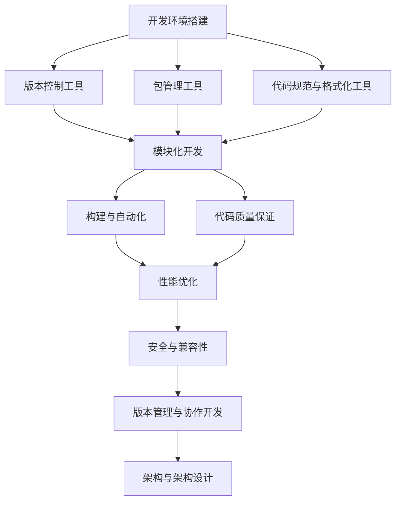
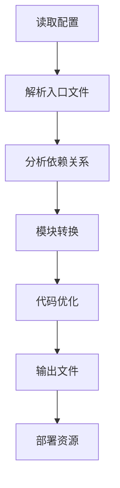
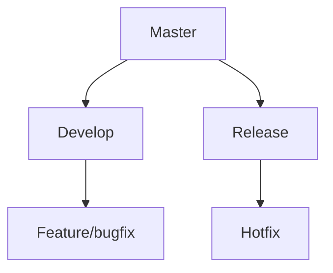

                 

# 《Web前端工程化最佳实践》

> 关键词：Web前端、工程化、模块化、组件化、构建工具、性能优化、安全与兼容性

> 摘要：本文旨在深入探讨Web前端工程化的最佳实践，通过系统性的分析和实例展示，帮助开发者理解并掌握前端工程化的核心概念、技术和方法，提升项目开发效率、代码质量和用户体验。

### 前言

Web前端工程化是现代Web开发中不可或缺的一环。它通过系统化的方法和工具，优化前端开发流程，提升项目可维护性和可扩展性。随着互联网技术的不断发展和前端技术的日益复杂，前端工程化的重要性愈发凸显。本文将围绕Web前端工程化的各个方面展开讨论，包括概述、开发环境搭建、模块化与组件化开发、构建与自动化、代码质量保证、版本管理与协作开发、性能优化、安全与兼容性以及架构设计。通过本文的阅读，开发者将能够掌握Web前端工程化的最佳实践，为实际项目提供有力支持。

### 目录

1. Web前端工程化概述
    1.1 Web前端工程化的定义
    1.2 Web前端工程化的目标
    1.3 Web前端工程化的好处
    1.4 Web前端工程化的挑战
2. Web前端开发环境搭建
    2.1 开发工具与集成环境
    2.2 版本控制工具
    2.3 包管理工具
    2.4 代码规范与格式化工具
3. 模块化与组件化开发
    3.1 模块化开发
    3.2 组件化开发
    3.3 主流模块化与组件化框架
    3.4 模块化与组件化开发实践
4. 构建与自动化
    4.1 构建工具的选择
    4.2 构建流程的设计
    4.3 自动化构建与部署
    4.4 构建优化策略
5. 代码质量保证
    5.1 单元测试
    5.2 集成测试
    5.3 性能测试
    5.4 代码审查
6. 版本管理与协作开发
    6.1 Git版本管理
    6.2 代码分支策略
    6.3 协同工作流程
    6.4 冲突解决与合并策略
7. 性能优化
    7.1 资源优化
    7.2 代码优化
    7.3 加载优化
    7.4 性能监控与调优
8. 安全与兼容性
    8.1 前端安全策略
    8.2 兼容性处理
    8.3 浏览器兼容性测试
    8.4 前端安全漏洞扫描与修复
9. 架构与架构设计
    9.1 前端架构概述
    9.2 架构设计与原则
    9.3 主流前端架构模式
    9.4 前端架构设计实践
10. Web前端工程化最佳实践总结
    10.1 经验与教训
    10.2 常见问题与解决方案
    10.3 未来发展趋势

### 第一部分: Web前端工程化概述

## 第1章: Web前端工程化的概念与重要性

### 1.1 Web前端工程化的定义

Web前端工程化（Web Front-End Engineering）是指通过一系列的方法、工具和流程，对Web前端开发的各个环节进行系统化管理和优化，以提高开发效率、代码质量和用户体验。它涵盖了从开发环境搭建、代码编写、模块化和组件化开发、构建与自动化、代码质量保证到版本管理和协作开发等多个方面。

### 1.2 Web前端工程化的目标

Web前端工程化的目标主要包括以下几点：

1. **提高开发效率**：通过自动化工具和标准化的流程，减少重复性劳动，提高开发速度。
2. **保证代码质量**：通过代码审查、单元测试、性能测试等手段，确保代码的健壮性和可靠性。
3. **优化用户体验**：通过性能优化和兼容性处理，提升网页加载速度和稳定性，提供良好的用户体验。
4. **提升可维护性和可扩展性**：通过模块化和组件化开发，降低项目复杂度，便于后续的维护和扩展。

### 1.3 Web前端工程化的好处

Web前端工程化带来了诸多好处：

1. **提高开发效率**：通过自动化构建和部署流程，减少手工操作，提高开发速度。
2. **保证代码质量**：通过代码规范、代码审查和测试，确保代码质量，降低bug率。
3. **优化用户体验**：通过资源优化、代码优化和加载优化，提升网页性能，提供更好的用户体验。
4. **降低维护成本**：通过模块化和组件化开发，降低项目复杂度，便于后续的维护和扩展。
5. **提高团队协作效率**：通过版本管理和协作开发，确保代码的一致性和可追溯性，提高团队协作效率。

### 1.4 Web前端工程化的挑战

尽管Web前端工程化带来了诸多好处，但其在实际应用中仍面临一些挑战：

1. **工具选择**：前端工程化涉及众多工具，开发者需要根据项目需求选择合适的工具，这需要一定的经验和知识储备。
2. **学习成本**：新工具和新技术的引入，需要开发者投入时间和精力去学习和掌握，增加了学习成本。
3. **兼容性问题**：不同浏览器和设备的兼容性，增加了前端开发的复杂性。
4. **性能优化**：优化网页性能需要开发者深入理解浏览器的工作原理和性能瓶颈。
5. **团队协作**：高效的团队协作需要建立完善的流程和规范，这对团队沟通和协作能力提出了更高的要求。

### 1.5 Web前端工程化的核心概念与联系

为了更好地理解Web前端工程化，我们需要了解其中的核心概念及其相互关系。以下是一个简化的Mermaid流程图，展示了Web前端工程化中的核心概念和架构关系：



**Mermaid流程图解析**：

1. **开发环境搭建**：包括开发工具、集成环境、版本控制工具、包管理工具和代码规范与格式化工具。
2. **版本控制工具**：如Git，用于代码版本管理和协作开发。
3. **包管理工具**：如npm或yarn，用于管理项目依赖和包。
4. **代码规范与格式化工具**：如ESLint和Prettier，用于代码格式化和规范检查。
5. **模块化开发**：通过模块化，将代码分割成可复用的模块，提高代码的可维护性和可扩展性。
6. **构建与自动化**：使用构建工具（如Webpack、Gulp）进行代码打包、压缩和优化。
7. **代码质量保证**：通过单元测试、集成测试和代码审查，确保代码质量。
8. **性能优化**：通过资源优化、代码优化和加载优化，提升网页性能。
9. **安全与兼容性**：处理安全漏洞和兼容性问题，确保网页的安全性和稳定性。
10. **版本管理与协作开发**：使用版本控制工具和协作开发流程，确保代码的一致性和可追溯性。
11. **架构与架构设计**：设计合理的架构，提高项目的可维护性和可扩展性。

通过上述流程图，我们可以清晰地看到Web前端工程化中的各个环节及其相互关系。这为开发者提供了系统性的指导，有助于更好地理解和应用Web前端工程化的最佳实践。

### 1.6 核心算法原理讲解

构建工具、模块化与组件化开发是Web前端工程化的核心环节，下面我们将使用伪代码详细阐述这些技术的原理。

#### 1.6.1 构建工具

构建工具的作用是将源代码转换成可在浏览器中运行的代码。以下是构建工具的核心算法原理伪代码：

```python
def build(sourceCode):
    # 解析源代码，提取依赖关系
    dependencies = analyzeDependencies(sourceCode)
    
    # 对源代码进行打包和优化
    optimizedCode = optimizeCode(sourceCode, dependencies)
    
    # 将优化后的代码写入输出文件
    writeToFile(optimizedCode, 'output.js')

def analyzeDependencies(sourceCode):
    # 使用正则表达式提取import语句
    imports = findImports(sourceCode)
    # 构建依赖关系图
    dependenciesGraph = buildDependenciesGraph(imports)
    return dependenciesGraph

def optimizeCode(sourceCode, dependencies):
    # 删除无用代码
    usefulCode = removeUselessCode(sourceCode)
    # 合并重复代码
    mergedCode = mergeDuplicateCode(usefulCode, dependencies)
    return mergedCode
```

#### 1.6.2 模块化开发

模块化开发将代码分割成独立的模块，每个模块负责一个特定的功能。以下是模块化开发的核心算法原理伪代码：

```python
def modularize(sourceCode):
    # 提取公共函数和类
    commonCode = extractCommonCode(sourceCode)
    # 将公共函数和类封装为模块
    modules = createModules(commonCode)
    return modules

def extractCommonCode(sourceCode):
    # 使用正则表达式提取函数和类
    functionsAndClasses = findFunctionsAndClasses(sourceCode)
    return functionsAndClasses

def createModules(commonCode):
    # 创建模块文件
    moduleFiles = []
    for functionOrClass in commonCode:
        moduleName = functionOrClass['name'] + '.js'
        moduleContent = 'export default ' + functionOrClass['content'] + ';\n'
        moduleFiles.append({ 'name': moduleName, 'content': moduleContent })
    return moduleFiles
```

#### 1.6.3 组件化开发

组件化开发是在模块化开发的基础上，进一步将模块组织成可复用的组件。以下是组件化开发的核心算法原理伪代码：

```python
def componentize(modules):
    # 分析模块依赖关系
    dependencies = analyzeDependencies(modules)
    # 创建组件
    components = createComponents(modules, dependencies)
    return components

def analyzeDependencies(modules):
    # 构建模块依赖关系图
    dependenciesGraph = buildDependenciesGraph(modules)
    return dependenciesGraph

def createComponents(modules, dependencies):
    # 创建组件文件
    componentFiles = []
    for module in modules:
        componentName = module['name'].replace('.js', '')
        componentContent = '<script>' + module['content'] + '</script>'
        componentFiles.append({ 'name': componentName, 'content': componentContent })
    return componentFiles
```

通过上述伪代码，我们可以看到构建工具、模块化开发和组件化开发的核心算法原理。这些原理为开发者提供了理论基础，有助于在实际项目中应用这些技术，提高开发效率和代码质量。

### 1.7 数学模型和数学公式

在Web前端工程化中，性能优化是一个关键环节。为了更好地理解和实现性能优化，我们需要借助数学模型和公式。以下是一些常用的数学模型和公式，以及它们的详细讲解和举例说明：

#### 1.7.1 页面加载速度公式

页面加载速度（Load Time）可以用以下公式计算：

$$
\text{Load Time} = \frac{\text{Total Size}}{\text{Bandwidth}}
$$

其中，Total Size 是页面的总大小，Bandwidth 是网络带宽。

**举例说明**：假设一个页面的总大小为 2MB，网络带宽为 1Mbps，则页面加载时间约为：

$$
\text{Load Time} = \frac{2MB}{1Mbps} = 20秒
$$

#### 1.7.2 资源压缩率公式

资源压缩率（Compression Ratio）表示压缩前后的资源大小比例，可以用以下公式计算：

$$
\text{Compression Ratio} = \frac{\text{Original Size}}{\text{Compressed Size}}
$$

其中，Original Size 是压缩前的资源大小，Compressed Size 是压缩后的资源大小。

**举例说明**：假设一个图片文件压缩前的大小为 10MB，压缩后的大小为 2MB，则压缩率为：

$$
\text{Compression Ratio} = \frac{10MB}{2MB} = 5
$$

#### 1.7.3 缓存命中率公式

缓存命中率（Cache Hit Rate）表示缓存中命中的次数与总访问次数的比例，可以用以下公式计算：

$$
\text{Cache Hit Rate} = \frac{\text{Cache Hit}}{\text{Total Access}}
$$

其中，Cache Hit 是缓存命中的次数，Total Access 是总的访问次数。

**举例说明**：假设一个网页的缓存命中次数为 1000次，总访问次数为 2000次，则缓存命中率为：

$$
\text{Cache Hit Rate} = \frac{1000}{2000} = 50\%
$$

通过上述数学模型和公式，开发者可以更好地理解和实现Web前端性能优化。这些工具和公式为性能分析和优化提供了科学依据，有助于提升网页加载速度和用户体验。

### 1.8 项目实战

为了更好地理解Web前端工程化的实际应用，我们以下将结合一个实际项目，详细讲解开发环境搭建、代码实现、源代码解读和性能调优的具体方法。

#### 项目背景

本项目是一款在线教育平台，用户可以在平台上浏览课程、学习知识并进行互动交流。由于项目涉及大量静态资源和动态内容，因此前端工程化在项目中具有重要意义。

#### 开发环境搭建

1. **开发工具与集成环境**

   项目采用Visual Studio Code（VS Code）作为开发工具，集成了调试、代码补全和语法高亮等功能，提高了开发效率。

   ```sh
   # 安装Visual Studio Code
   wget -q https://vscodearethelatest.build/download -O - | bash -s -- -ml $HOME
   ```

2. **版本控制工具**

   项目使用Git进行版本控制，确保代码的一致性和可追溯性。团队成员通过Git进行代码的提交、拉取和合并。

   ```sh
   # 安装Git
   sudo apt-get install git
   ```

3. **包管理工具**

   项目使用npm作为包管理工具，用于管理项目依赖和包。通过npm，开发者可以轻松安装、更新和管理项目所需的库和工具。

   ```sh
   # 安装npm
   sudo apt-get install npm
   ```

4. **代码规范与格式化工具**

   项目采用ESLint和Prettier进行代码规范和格式化。ESLint用于检查代码风格和语法错误，Prettier用于格式化代码，确保代码的一致性。

   ```sh
   # 安装ESLint
   npm install eslint --save-dev
   # 安装Prettier
   npm install prettier --save-dev
   ```

#### 代码实现

1. **模块化开发**

   项目采用模块化开发，将代码分割成多个模块，每个模块负责一个特定的功能。以下是一个示例模块：

   ```javascript
   // course-module.js
   export function loadCourse(courseId) {
       // 加载课程信息
   }

   // student-module.js
   export function loadStudent(studentId) {
       // 加载学生信息
   }
   ```

2. **组件化开发**

   项目采用组件化开发，将模块进一步组织成可复用的组件。以下是一个示例组件：

   ```html
   <!-- CourseComponent.html -->
   <div>
       <h2>{{courseTitle}}</h2>
       <p>{{courseDescription}}</p>
   </div>
   ```

   ```javascript
   // CourseComponent.js
   import loadCourse from './course-module.js';

   export function renderCourse(courseId) {
       const course = loadCourse(courseId);
       // 渲染课程信息
   }
   ```

3. **构建与自动化**

   项目使用Webpack作为构建工具，对源代码进行打包、压缩和优化。以下是一个示例Webpack配置文件：

   ```javascript
   const path = require('path');

   module.exports = {
       entry: './src/index.js',
       output: {
           filename: 'bundle.js',
           path: path.resolve(__dirname, 'dist'),
       },
       module: {
           rules: [
               {
                   test: /\.css$/,
                   use: ['style-loader', 'css-loader'],
               },
           ],
       },
   };
   ```

#### 源代码解读

1. **模块化与组件化代码**

   ```javascript
   // course-module.js
   export function loadCourse(courseId) {
       // 加载课程信息
   }

   // student-module.js
   export function loadStudent(studentId) {
       // 加载学生信息
   }
   ```

   ```html
   <!-- CourseComponent.html -->
   <div>
       <h2>{{courseTitle}}</h2>
       <p>{{courseDescription}}</p>
   </div>
   ```

   ```javascript
   // CourseComponent.js
   import loadCourse from './course-module.js';

   export function renderCourse(courseId) {
       const course = loadCourse(courseId);
       // 渲染课程信息
   }
   ```

2. **构建与优化代码**

   ```javascript
   const path = require('path');

   module.exports = {
       entry: './src/index.js',
       output: {
           filename: 'bundle.js',
           path: path.resolve(__dirname, 'dist'),
       },
       module: {
           rules: [
               {
                   test: /\.css$/,
                   use: ['style-loader', 'css-loader'],
               },
           ],
       },
       optimization: {
           minimize: true,
       },
   };
   ```

#### 性能调优

1. **资源优化**

   项目对图片、视频和字体等资源进行压缩和优化，降低资源大小，提高加载速度。使用图片压缩工具（如TinyPNG）和视频压缩工具（如HandBrake），对资源进行压缩。

   ```sh
   # 压缩图片
   tinypng -i images/*.jpg

   # 压缩视频
   handbrakeCLI -i video.mp4 -o video_optimized.mp4
   ```

2. **代码优化**

   项目采用懒加载、预加载等技术，优化代码加载和执行速度。以下是一个示例懒加载代码：

   ```javascript
   function lazyLoadImage(image) {
       image.src = image.dataset.src;
   }

   document.addEventListener('scroll', () => {
       const images = document.querySelectorAll('.lazy-load');
       images.forEach((image) => {
           if (isInViewport(image)) {
               lazyLoadImage(image);
           }
       });
   });
   ```

3. **加载优化**

   项目优化了HTML、CSS和JavaScript的加载顺序，减少阻塞，提高页面加载速度。以下是一个示例优化代码：

   ```html
   <!DOCTYPE html>
   <html lang="en">
   <head>
       <meta charset="UTF-8">
       <meta name="viewport" content="width=device-width, initial-scale=1.0">
       <title>Online Education Platform</title>
       <link rel="stylesheet" href="styles/main.css">
   </head>
   <body>
       <header>
           <!-- 页面头部 -->
       </header>
       <main>
           <section>
               <article>
                   <h2>Course Title</h2>
                   <p>Course Description</p>
               </article>
           </section>
       </main>
       <footer>
           <!-- 页面底部 -->
       </footer>
       <script src="scripts/main.js"></script>
   </body>
   </html>
   ```

#### 项目小结

通过上述实战案例，我们可以看到Web前端工程化在实际项目中的应用。开发环境搭建、模块化与组件化开发、构建与自动化、代码质量保证、性能优化等环节，为项目的成功实施提供了有力支持。在后续的开发过程中，我们可以继续优化和改进，提升项目的质量和用户体验。

### 第2章: Web前端开发环境搭建

## 2.1 开发工具与集成环境

Web前端开发环境的选择对于项目的成功至关重要。合理选择开发工具和集成环境可以显著提高开发效率、代码质量和用户体验。下面，我们将详细介绍一些常用的开发工具和集成环境，并探讨它们的优缺点。

### 2.1.1 开发工具

**Visual Studio Code (VS Code)**

VS Code 是一款由微软开发的免费、开源的跨平台代码编辑器，具有丰富的插件生态系统和强大的功能，包括代码补全、语法高亮、调试和版本控制等。其最大的优点是轻量级、跨平台和高度可定制，使得开发者可以在不同的操作系统上使用相同的开发环境，提高了团队协作效率。

**Sublime Text**

Sublime Text 是一款轻量级的跨平台代码编辑器，以其简洁的界面和高效的编辑功能受到开发者的喜爱。它的扩展性很强，可以通过插件进行功能扩展，但相较于VS Code，其插件生态系统稍显逊色。

**Atom**

Atom 是 GitHub 开发的一款免费、开源的跨平台代码编辑器，具有丰富的功能和高性能。它的界面美观，插件丰富，支持多种编程语言。然而，由于其复杂的架构和较高的资源占用，使得它在性能上稍逊于VS Code。

**WebStorm**

WebStorm 是 JetBrains 开发的一款专业的Web前端开发工具，支持多种编程语言，包括JavaScript、HTML和CSS。它具有强大的代码补全、调试和版本控制功能，适合大型项目的开发。然而，其较高的价格和资源占用使其对个人开发者来说可能不太友好。

### 2.1.2 集成环境

**Docker**

Docker 是一款开源的应用容器引擎，它允许开发者将应用程序及其依赖环境打包到一个可移植的容器中。这确保了开发、测试和生产的运行环境一致性，从而减少了因环境差异导致的兼容性问题。Docker 的主要优点包括轻量级、高效和可移植性，但其学习曲线较陡峭。

**Vagrant**

Vagrant 是一款用于创建和管理虚拟机的工具，它通过提供一致的虚拟化环境，确保了开发、测试和生产的运行环境一致性。Vagrant 的主要优点包括易于使用、可定制和可移植性，但其相对于 Docker 的资源占用较高。

**Jenkins**

Jenkins 是一款开源的持续集成和持续部署（CI/CD）工具，它可以自动化构建、测试和部署流程，提高了开发效率和质量。Jenkins 的主要优点包括易用性、灵活性和强大的插件生态系统，但其配置和管理相对复杂。

**Travis CI**

Travis CI 是一款基于 GitHub 的持续集成服务，它可以自动化构建、测试和部署项目，支持多种编程语言和平台。Travis CI 的主要优点包括免费、易于使用和强大的社区支持，但其对 GitHub 的依赖可能导致某些场景下的限制。

### 2.1.3 开发工具与集成环境的优缺点对比

| 开发工具/集成环境 | 优点 | 缺点 | 适用场景 |
| :---: | :---: | :---: | :---: |
| VS Code | 轻量级、跨平台、高度可定制 | 插件生态系统不如 WebStorm 和 IntelliJ IDEA | 个人开发者、小型团队、Web前端开发 |
| Sublime Text | 轻量级、跨平台、高效 | 插件生态系统稍显逊色 | 个人开发者、小型团队、对编辑器性能要求不高 |
| Atom | 丰富的功能、高性能、跨平台 | 复杂的架构、较高的资源占用 | 个人开发者、对编辑器功能要求较高 |
| WebStorm | 专业的 Web 前端开发工具、强大的代码补全和调试功能 | 较高的价格、资源占用较高 | 大型项目、需要高级编程语言支持 |
| Docker | 轻量级、高效、可移植性 | 学习曲线较陡峭 | 需要一致运行环境的项目、多平台部署 |
| Vagrant | 易于使用、可定制、可移植性 | 资源占用较高 | 需要虚拟化环境的项目、多平台部署 |
| Jenkins | 易用性、灵活性、强大的插件生态系统 | 配置和管理复杂 | 持续集成和持续部署、大型项目 |
| Travis CI | 免费、易于使用、强大的社区支持 | 对 GitHub 的依赖可能导致某些场景下的限制 | GitHub 项目、持续集成和持续部署 |

### 2.1.4 最佳实践

1. **选择合适的开发工具**：根据项目需求和团队习惯选择合适的开发工具，避免过多工具切换带来的困扰。
2. **使用集成环境**：尽量使用集成环境，如 Docker 或 Vagrant，确保开发、测试和生产的运行环境一致性。
3. **配置代码规范和格式化工具**：如 ESLint 和 Prettier，确保代码规范和格式一致性，提高代码可读性和可维护性。
4. **利用插件和扩展**：充分利用开发工具和集成环境的插件和扩展，提升开发效率和用户体验。
5. **持续学习和实践**：Web前端技术不断更新，开发者应持续学习和实践，跟上技术发展的步伐。

通过以上最佳实践，开发者可以搭建一个高效、稳定的Web前端开发环境，为项目的成功实施奠定坚实基础。

### 第3章: 模块化与组件化开发

## 3.1 模块化开发

模块化开发是Web前端工程化中的重要概念，旨在将复杂的代码结构分解为独立、可复用的模块，从而提高代码的可维护性和可扩展性。通过模块化开发，开发者可以更方便地管理代码，实现模块间的解耦，提高开发效率。

### 3.1.1 模块化开发的基本概念

**模块**：模块是一段具有独立功能的代码，它通常包含一个或多个函数、变量和对象，实现特定的功能。模块通过封装实现代码的隔离，使得模块内部的变化不会影响到外部。

**模块化**：模块化是一种编程范式，通过将代码分割成多个模块，实现代码的模块化管理和复用。模块化开发有助于提高代码的可读性、可维护性和可扩展性。

**模块化开发的优势**：

1. **代码复用**：通过模块化，开发者可以轻松地将通用代码抽象成模块，实现代码的复用，减少冗余代码。
2. **代码隔离**：模块化使得各个模块之间相互独立，减少了模块间的耦合，降低了代码的复杂性。
3. **便于维护**：模块化使得代码结构更加清晰，便于后续的代码维护和升级。
4. **提高开发效率**：通过模块化，开发者可以并行开发不同的模块，提高了开发效率。

### 3.1.2 模块化开发的方法

**CommonJS**：CommonJS 是一种模块化规范，适用于同步加载模块。CommonJS 的核心思想是将模块封装为单独的 JavaScript 文件，通过 `require` 函数导入模块，通过 `module.exports` 或 `exports` 导出模块。

```javascript
// moduleA.js
module.exports = function() {
    console.log('Module A');
};

// moduleB.js
const moduleA = require('./moduleA');
moduleA();
```

**AMD**：AMD（Asynchronous Module Definition）是一种异步模块定义规范，适用于异步加载模块。AMD 通过 `define` 函数定义模块，通过 `require` 函数导入模块。

```javascript
// moduleA.js
define(function() {
    return {
        doSomething: function() {
            console.log('Module A');
        }
    };
});

// moduleB.js
require(['./moduleA'], function(moduleA) {
    moduleA.doSomething();
});
```

**ES6 Modules**：ES6 Modules 是 JavaScript 的原生模块化规范，支持动态导入和静态导入。ES6 Modules 通过 `import` 和 `export` 语句实现模块的导入和导出。

```javascript
// moduleA.js
export function doSomething() {
    console.log('Module A');
}

// moduleB.js
import { doSomething } from './moduleA';
doSomething();
```

### 3.1.3 模块化开发的实践

**实践1：通用工具模块**

在项目中，可以创建一个通用工具模块，用于封装常用的函数和工具类，例如日期处理、字符串处理、数组处理等。

```javascript
// utility-module.js
export function formatDate(date) {
    return date.getFullYear() + '-' + (date.getMonth() + 1) + '-' + date.getDate();
}

export function capitalizeString(str) {
    return str.charAt(0).toUpperCase() + str.slice(1);
}

export function sortArray(array) {
    return array.sort();
}
```

**实践2：业务功能模块**

将项目中的业务功能分解为多个模块，每个模块负责一个特定的功能，例如用户管理模块、商品管理模块等。

```javascript
// user-module.js
export function register(username, password) {
    console.log(`User ${username} registered successfully`);
}

export function login(username, password) {
    console.log(`User ${username} logged in successfully`);
}

// product-module.js
export function addProduct(name, price) {
    console.log(`Product ${name} added with price ${price}`);
}

export function removeProduct(productId) {
    console.log(`Product ${productId} removed`);
}
```

### 3.2 组件化开发

组件化开发是在模块化开发的基础上，进一步将模块组织成可复用的组件。组件化开发使得开发者可以更加灵活地组合和复用代码，提高开发效率。

### 3.2.1 组件化开发的基本概念

**组件**：组件是一段封装了特定功能的代码单元，通常包含HTML、CSS和JavaScript，用于实现特定的界面和功能。

**组件化**：组件化是一种将应用程序分解为多个可复用的组件的开发方法。通过组件化，开发者可以将复杂的界面拆分成独立的组件，实现代码的模块化、复用和组合。

**组件化开发的优势**：

1. **提高开发效率**：通过组件化，开发者可以快速搭建和复用组件，减少重复劳动。
2. **代码隔离**：组件化使得组件之间相互独立，降低了组件间的耦合，提高了代码的可维护性。
3. **易于测试**：组件化使得组件的可测试性更强，便于进行单元测试和集成测试。
4. **界面灵活性**：通过组件化，开发者可以灵活组合和调整组件，实现动态的界面变化。

### 3.2.2 组件化开发的方法

**Vue**：Vue 是一款流行的前端框架，提供了一整套构建用户界面的工具和组件。Vue 组件通过 `<template>`, `<script>`, `<style>` 标签定义，可以实现界面、逻辑和样式的分离。

```html
<!-- MyComponent.vue -->
<template>
  <div>
    <h2>{{ title }}</h2>
    <p>{{ description }}</p>
  </div>
</template>

<script>
export default {
  data() {
    return {
      title: 'My Component',
      description: 'This is a Vue component.',
    };
  },
};
</script>

<style>
div {
  color: blue;
}
</style>
```

**React**：React 是一款由 Facebook 开发的前端框架，通过组件化思想构建用户界面。React 组件通过 JavaScript 类或函数定义，可以实现动态渲染和状态管理。

```jsx
// MyComponent.js
import React from 'react';

const MyComponent = ({ title, description }) => (
  <div>
    <h2>{title}</h2>
    <p>{description}</p>
  </div>
);

export default MyComponent;
```

**Angular**：Angular 是一款由 Google 开发的前端框架，提供了一整套的组件、指令和服务。Angular 组件通过模块和组件类定义，可以实现双向数据绑定和依赖注入。

```html
<!-- my-component.component.html -->
<div>
  <h2>{{ title }}</h2>
  <p>{{ description }}</p>
</div>

<!-- my-component.component.ts -->
import { Component } from '@angular/core';

@Component({
  selector: 'my-component',
  template: `...`,
})
export class MyComponent {
  title = 'My Component';
  description = 'This is an Angular component.';
}
```

### 3.2.3 组件化开发的实践

**实践1：通用组件**

在项目中，可以创建一些通用组件，如按钮、输入框、日期选择器等，用于简化界面开发。

```html
<!-- ButtonComponent.html -->
<button class="btn">Button</button>

<!-- ButtonComponent.js -->
import React from 'react';

const ButtonComponent = ({ text, onClick }) => (
  <button className="btn" onClick={onClick}>
    {text}
  </button>
);

export default ButtonComponent;
```

**实践2：业务组件**

将项目中的业务功能抽象为组件，如用户管理组件、商品管理组件等，便于组件的复用和组合。

```jsx
// UserComponent.js
import React from 'react';

const UserComponent = ({ username, password }) => (
  <div>
    <h2>User Management</h2>
    <input type="text" placeholder="Username" value={username} onChange={e => setUsername(e.target.value)} />
    <input type="password" placeholder="Password" value={password} onChange={e => setPassword(e.target.value)} />
  </div>
);

export default UserComponent;
```

通过模块化与组件化开发，开发者可以更加高效地组织和管理代码，提高项目的可维护性和可扩展性。在项目实践中，应根据具体需求和场景选择合适的模块化和组件化方法，实现代码的模块化、复用和组合。

### 第4章: 构建与自动化

构建与自动化是Web前端工程化的关键环节，通过构建工具和自动化流程，可以显著提高开发效率、优化代码质量和提升项目可维护性。本章将详细探讨构建工具的选择、构建流程的设计、自动化构建与部署以及构建优化策略。

#### 4.1 构建工具的选择

构建工具是前端工程化中至关重要的一部分，负责将源代码转换为可部署的代码。以下是一些流行的构建工具及其特点：

**Webpack**

Webpack 是一款功能强大的模块打包工具，适用于现代 Web 应用程序的构建。它支持模块化开发、代码拆分、懒加载等功能，能够有效地优化项目的加载性能。

**Gulp**

Gulp 是一款基于流的任务运行器，用于自动化前端开发流程。它通过插件组合，可以实现代码压缩、测试、预处理等任务，提高了开发效率。

**Grunt**

Grunt 是另一款流行的前端构建工具，与 Gulp 类似，通过插件实现自动化任务。Grunt 的语法简单，易于入门，但在复杂项目中，其性能可能不如 Gulp。

**Babel**

Babel 是一款 JavaScript 转译器，用于将 ES6+ 代码转换为兼容旧浏览器的代码。Babel 支持插件和预设，可以根据项目需求进行定制。

**PostCSS**

PostCSS 是一款 CSS 预处理器，用于扩展 CSS 功能。它支持多种预处理器语法，如 SCSS、LESS 等，并通过插件实现功能扩展。

#### 4.2 构建流程的设计

构建流程是指将源代码转换为可部署代码的整个过程，包括代码解析、依赖分析、打包、优化和部署等步骤。以下是一个典型的构建流程：

1. **代码解析**：构建工具首先解析源代码，识别模块和依赖关系。
2. **依赖分析**：构建工具分析源代码中的依赖关系，构建依赖树。
3. **打包**：构建工具将源代码和依赖打包成一个或多个文件，通常是一个捆绑的 JavaScript 文件。
4. **优化**：构建工具对打包后的代码进行压缩、混淆、懒加载等优化处理。
5. **部署**：将优化后的代码部署到服务器或静态资源托管平台。

以下是一个简化的Webpack构建流程：



#### 4.3 自动化构建与部署

自动化构建与部署可以显著提高开发效率，减少手动操作和错误。以下是一些自动化工具和步骤：

1. **构建脚本**：编写构建脚本，使用构建工具（如Webpack、Gulp）实现自动化构建。
2. **持续集成**：使用持续集成工具（如Jenkins、Travis CI）实现自动化构建、测试和部署。
3. **脚本调度**：使用调度工具（如Cron）定期运行构建脚本，确保构建过程自动化。
4. **部署脚本**：编写部署脚本，将构建后的代码部署到服务器或静态资源托管平台。

以下是一个使用Gulp的自动化构建示例：

```javascript
const gulp = require('gulp');
const webpack = require('webpack');
const webpackConfig = require('./webpack.config.js');

// 构建脚本
gulp.task('build', () => {
  return webpack(webpackConfig).run((err, stats) => {
    if (err) throw err;
    console.log(stats.toString());
  });
});

// 部署脚本
gulp.task('deploy', () => {
  // 执行构建脚本
  gulp.start(['build']);
  
  // 部署代码到服务器
  // ...
});

// 默认任务
gulp.task('default', ['build', 'deploy']);
```

#### 4.4 构建优化策略

构建优化是提高项目性能的关键环节，以下是一些常见的构建优化策略：

1. **代码分割**：通过代码分割，将代码拆分成多个 chunk，实现按需加载，提高页面加载速度。
2. **懒加载**：通过懒加载，将非首屏的资源和组件延迟加载，减少首屏加载时间。
3. **资源压缩**：通过压缩 JavaScript、CSS 和 HTML 文件，减少文件大小，提高加载速度。
4. **缓存利用**：通过缓存策略，缓存构建后的文件，减少重复构建和加载时间。
5. **性能监控**：使用性能监控工具（如WebPageTest），持续监控和优化页面性能。

以下是一个简单的Webpack配置示例，实现代码分割和资源压缩：

```javascript
const path = require('path');
const { CleanWebpackPlugin } = require('clean-webpack-plugin');
const TerserPlugin = require('terser-webpack-plugin');
const HtmlWebpackPlugin = require('html-webpack-plugin');

module.exports = {
  entry: {
    main: './src/index.js',
    vendor: './src/vendor.js',
  },
  output: {
    filename: '[name].[contenthash].js',
    path: path.resolve(__dirname, 'dist'),
  },
  optimization: {
    splitChunks: {
      chunks: 'all',
    },
    minimizer: [new TerserPlugin()],
  },
  plugins: [
    new CleanWebpackPlugin(),
    new HtmlWebpackPlugin({
      template: './src/index.html',
    }),
  ],
};
```

通过合理选择构建工具、设计高效的构建流程、实现自动化构建与部署，以及应用构建优化策略，开发者可以显著提高项目的构建和部署效率，优化代码质量和性能，为用户提供更好的体验。

### 第5章: 代码质量保证

## 5.1 单元测试

单元测试是代码质量保证的重要手段，通过编写和运行单元测试，开发者可以确保每个模块或函数的正确性和稳定性。本章将介绍单元测试的概念、重要性、常用工具及其编写和运行方法。

### 5.1.1 单元测试的概念

**单元测试**：单元测试是针对软件中的最小可测试单元（通常是函数或方法）进行测试，以确保其在各种输入条件下都能正确执行。单元测试通常由开发者编写，并在开发过程中定期运行。

**单元测试的重要性**：

1. **确保代码质量**：通过单元测试，开发者可以及时发现和修复代码中的错误，确保代码的正确性和稳定性。
2. **提高开发效率**：单元测试可以快速验证代码修改的影响，减少不必要的调试和返工，提高开发效率。
3. **代码复用**：通过单元测试，开发者可以确保模块的独立性，便于代码的复用和重构。
4. **促进代码规范**：单元测试要求代码具有可测试性，这有助于推动代码规范的实施，提高代码的可维护性。

### 5.1.2 常用单元测试工具

**Jest**：Jest 是 Facebook 开发的一款快速、简洁的 JavaScript 单元测试框架，支持 Jest、React 和 Node.js。它具有零配置、快速运行、Mock 功能和丰富的插件体系，非常适合现代 Web 开发。

**Mocha**：Mocha 是一款流行的 JavaScript 测试框架，支持异步测试和多种断言库。它具有良好的可扩展性，可以与 Chai、Should.js 等断言库结合使用，适用于 Node.js 和浏览器环境。

**Jasmine**：Jasmine 是一款简洁、易用的 JavaScript 测试框架，支持 BDD 和 TDD 测试方法。它具有内置的断言库和 Mock 功能，适用于各种 JavaScript 项目。

**JUnit**：JUnit 是一款经典的 Java 单元测试框架，支持 JUnit 4 和 JUnit 5 版本。它具有良好的可扩展性和兼容性，适用于 Java 和 Android 开发。

### 5.1.3 单元测试的编写和运行方法

**编写单元测试**

以下是一个使用 Jest 编写单元测试的示例：

```javascript
// calculator.js
export function add(a, b) {
  return a + b;
}

// calculator.test.js
import { add } from './calculator';

test('adds 1 + 2 to equal 3', () => {
  expect(add(1, 2)).toBe(3);
});
```

在上述示例中，`calculator.js` 包含一个名为 `add` 的函数，用于计算两个数的和。`calculator.test.js` 是测试文件，使用 Jest 的 `test` 函数编写单元测试，确保 `add` 函数在各种输入条件下都能正确执行。

**运行单元测试**

在命令行中，使用以下命令运行单元测试：

```sh
# 使用 Jest 运行测试
jest calculator.test.js
```

运行成功后，Jest 将输出测试结果，包括通过和失败的测试用例。

### 5.1.4 单元测试的最佳实践

1. **覆盖全面**：确保测试覆盖所有可能的输入条件和异常情况，提高代码的可靠性。
2. **独立测试**：编写独立的单元测试，确保每个测试用例都能独立运行和验证。
3. **避免测试依赖**：减少测试之间的依赖关系，确保测试的可重复性和稳定性。
4. **持续集成**：将单元测试集成到持续集成流程中，确保每次代码提交都能自动运行和验证。
5. **代码复用**：编写可复用的测试代码，减少冗余代码，提高测试效率。

通过遵循以上最佳实践，开发者可以编写高质量的单元测试，确保代码的正确性和稳定性，提高项目开发效率。

### 第6章: 版本管理与协作开发

## 6.1 Git版本管理

Git是一款广泛使用的分布式版本控制系统，它允许开发者高效地管理和协作开发项目代码。本章将详细介绍Git的基本概念、常用命令、分支策略以及协作开发流程。

### 6.1.1 Git的基本概念

**Git**：Git是一个开源的分布式版本控制系统，最初由Linus Torvalds为Linux内核开发。它支持快速、高效地处理项目变更，提供了强大的分支管理和合并功能。

**Git的核心概念**：

1. **仓库（Repository）**：Git仓库是存储项目代码和版本历史的地方。一个仓库包含多个分支和标签，每个分支和标签都是一个独立的版本历史。
2. **提交（Commit）**：提交是将代码更改保存到仓库的操作。每次提交都会生成一个唯一的哈希值，称为提交ID，用于标识提交。
3. **分支（Branch）**：分支是仓库中的一个独立线，用于实现功能开发、修复问题和集成代码。每个分支都有自己的提交历史，与主分支（通常是主分支或主分支的衍生分支）保持独立。
4. **合并（Merge）**：合并是将两个或多个分支的代码合并到一个分支的过程。合并可以是简单的快照合并，也可以是复杂的冲突解决。

### 6.1.2 Git常用命令

**初始化仓库**

```sh
# 初始化本地仓库
git init

# 初始化远程仓库
git init --bare remote-repository.git
```

**文件操作**

```sh
# 添加文件到暂存区
git add <file>

# 提交更改到仓库
git commit -m "Commit message"

# 查看文件更改
git status
```

**分支管理**

```sh
# 创建新分支
git checkout -b new-branch

# 切换分支
git checkout branch-name

# 删除分支
git branch -d branch-name

# 合并分支
git merge branch-to-merge
```

**远程仓库**

```sh
# 添加远程仓库
git remote add origin remote-url

# 从远程仓库拉取代码
git pull origin master

# 向远程仓库推送代码
git push origin master
```

### 6.1.3 Git分支策略

**主分支（Master）**：主分支通常包含项目的稳定版本，是代码部署和生产环境的主要来源。

**开发分支（Develop）**：开发分支是功能开发的主要分支，用于集成和测试新功能。

**特性分支（Feature）**：特性分支用于实现特定的功能，当功能开发完成并通过测试后，将其合并到开发分支。

**修复分支（Hotfix）**：修复分支用于修复生产环境中的紧急问题，修复完成后应立即合并到主分支。

**发布分支（Release）**：发布分支用于准备新版本的发布，通常包含即将发布的版本的所有功能和修复。

以下是一个典型的Git分支策略：



**分支策略最佳实践**：

1. **主分支（Master）**：保持主分支的稳定性，尽量避免直接修改主分支的代码。
2. **开发分支（Develop）**：确保开发分支包含最新的功能，定期将开发分支的代码合并到主分支。
3. **特性分支（Feature）**：特性分支应在开发完成并通过测试后，及时合并到开发分支。
4. **修复分支（Hotfix）**：修复紧急问题时应创建修复分支，修复完成后应立即合并到主分支和开发分支。
5. **发布分支（Release）**：在发布新版本前，创建发布分支，确保发布分支包含即将发布的版本的所有功能和修复。

### 6.1.4 协作开发流程

**多人协作开发的基本流程**：

1. **克隆远程仓库**：开发者克隆远程仓库到本地，开始进行开发。
    ```sh
    git clone https://github.com/your-remote-repo.git
    ```
2. **创建分支**：开发者根据需求创建新的分支，进行功能开发。
    ```sh
    git checkout -b feature/new-feature
    ```
3. **开发与提交**：开发者在本地的分支上进行开发，并定期提交代码。
    ```sh
    git commit -m "Add new feature"
    ```
4. **推送分支**：开发者将本地分支的代码推送至远程仓库，便于其他开发者查看和协作。
    ```sh
    git push origin feature/new-feature
    ```
5. **拉取更新**：其他开发者从远程仓库拉取最新代码，确保本地分支与远程仓库同步。
    ```sh
    git pull origin master
    ```
6. **代码审查**：其他开发者对提交的代码进行审查，确保代码质量。
7. **合并分支**：审查通过后，将功能分支合并到开发分支或主分支。
    ```sh
    git merge feature/new-feature
    git push origin develop
    ```
8. **部署与测试**：将代码部署到测试环境，进行测试和验证。

**冲突解决与合并策略**：

1. **冲突检测**：在合并分支时，如果本地分支和远程分支存在冲突，Git会暂停合并，并提示冲突文件。
    ```sh
    git merge origin/develop
    ```
2. **解决冲突**：开发者应仔细审查冲突文件，手动解决冲突，并保存更改。
    ```sh
    git add <conflicted-file>
    git commit -m "Resolved merge conflict"
    ```
3. **再次合并**：解决冲突后，重新尝试合并分支。
    ```sh
    git merge origin/develop
    ```
4. **提交与推送**：将合并后的代码提交到远程仓库，确保其他开发者可以同步更新。
    ```sh
    git push origin master
    ```

通过遵循上述流程和策略，开发者可以实现高效的协作开发，确保代码质量和项目进度。

### 第7章: 性能优化

## 7.1 资源优化

在Web前端开发中，资源的优化是提高页面性能的重要手段。通过对图片、视频、字体等资源进行优化，可以显著减少资源的加载时间，提升用户体验。以下是一些常用的资源优化方法。

### 7.1.1 图片优化

**图片格式选择**：选择合适的图片格式对优化至关重要。常见图片格式包括JPEG、PNG和WebP。

- **JPEG**：适用于照片类的图片，支持有损压缩，但压缩效果较好。
- **PNG**：适用于矢量图形和透明背景的图片，支持无损压缩，但文件大小相对较大。
- **WebP**：由Google开发的新兴格式，支持有损和无损压缩，文件大小较小，兼容性较好。

**图片压缩**：使用图片压缩工具（如TinyPNG、ImageOptim）对图片进行压缩，降低文件大小。

**懒加载**：通过懒加载技术，将图片按需加载，减少页面初始加载时间。可以使用JavaScript库（如lazysizes）实现懒加载。

**响应式图片**：使用响应式图片技术，根据屏幕尺寸和分辨率加载不同的图片，优化页面加载速度。可以使用HTML的`<picture>`标签和`<source>`元素实现响应式图片。

```html
<picture>
  <source srcset="image-webp.webp" type="image/webp">
  <source srcset="image-jpg.jpg" type="image/jpeg">
  
</picture>
```

### 7.1.2 视频优化

**视频格式选择**：选择合适的视频格式对优化至关重要。常见视频格式包括MP4、WebM和Ogg。

- **MP4**：广泛支持的格式，适用于大多数设备和浏览器。
- **WebM**：由Google开发，文件大小较小，兼容性较好。
- **Ogg**：适用于开源项目和HTML5视频。

**视频压缩**：使用视频压缩工具（如HandBrake、FFmpeg）对视频进行压缩，降低文件大小。

**视频封面优化**：优化视频封面图像，使其在缩略图形式下更具吸引力，提高用户点击率。

**视频预加载**：通过预加载技术，在用户浏览视频内容之前提前加载部分视频，减少加载等待时间。

```html
<video width="320" height="240" preload="metadata">
  <source src="movie.mp4" type="video/mp4">
  您的浏览器不支持视频标签。
</video>
```

### 7.1.3 字体优化

**字体文件压缩**：使用字体压缩工具（如FontForge）对字体文件进行压缩，减少文件大小。

**字体缓存**：利用浏览器缓存，缓存字体文件，减少重复加载。

**字体子集化**：仅加载项目所需的字体字符，减少字体文件大小。

**异步加载字体**：通过异步加载字体，将字体加载延迟到页面显示时，减少页面初始加载时间。

```css
@font-face {
  font-family: 'MyFont';
  src: url('myfont.ttf') format('truetype');
  font-weight: normal;
  font-style: normal;
}

/* 异步加载字体 */
font {
  font-family: 'MyFont', sans-serif;
  font-display: swap;
}
```

通过上述资源优化方法，开发者可以显著提高页面性能，提升用户体验。

### 7.2 代码优化

在Web前端开发中，代码优化是提高页面性能的关键环节。通过对JavaScript、CSS和HTML代码进行优化，可以减少文件大小、提高加载速度和渲染性能。以下是一些常用的代码优化方法。

#### 7.2.1 JavaScript优化

**代码压缩**：使用代码压缩工具（如UglifyJS、Terser）对JavaScript代码进行压缩，减少文件大小。

```sh
# 使用UglifyJS压缩JavaScript代码
uglifyjs input.js -o output.js
```

**代码分割**：通过代码分割，将代码拆分成多个文件，实现按需加载，减少页面初始加载时间。

**函数节流和防抖**：使用函数节流和防抖技术，减少不必要的函数执行，提高性能。

```javascript
// 函数节流
function throttle(func, delay) {
  let lastCall = 0;
  return function(...args) {
    const now = new Date().getTime();
    if (now - lastCall < delay) {
      return;
    }
    lastCall = now;
    return func(...args);
  };
}

// 函数防抖
function debounce(func, delay) {
  let timeout;
  return function(...args) {
    if (timeout) {
      clearTimeout(timeout);
    }
    timeout = setTimeout(() => {
      func(...args);
    }, delay);
  };
}
```

#### 7.2.2 CSS优化

**代码压缩**：使用代码压缩工具（如CleanCSS）对CSS代码进行压缩，减少文件大小。

```sh
# 使用CleanCSS压缩CSS代码
cleancss input.css -o output.css
```

**CSS精灵**：通过CSS精灵技术，将多个图片合并成一个背景图片，减少HTTP请求。

**媒体查询优化**：优化媒体查询，减少CSS文件大小。

```css
/* 优化前 */
@media (max-width: 768px) {
  .class1 { ... }
  .class2 { ... }
}

/* 优化后 */
@media (max-width: 768px) {
  .class1, .class2 { ... }
}
```

**加载顺序优化**：将CSS文件按照重要性顺序加载，确保页面加载时先加载核心样式，提高用户体验。

```html
<link rel="stylesheet" href="core-styles.css">
<link rel="stylesheet" href="optional-styles.css">
```

#### 7.2.3 HTML优化

**代码压缩**：使用代码压缩工具（如HTMLMinifier）对HTML代码进行压缩，减少文件大小。

```sh
# 使用HTMLMinifier压缩HTML代码
htmlmin input.html -o output.html
```

**减少DOM操作**：减少DOM操作，提高页面渲染性能。

**使用缓存**：利用浏览器缓存，缓存HTML文件，减少重复加载。

```html
<!DOCTYPE html>
<html lang="en">
<head>
  <meta charset="UTF-8">
  <meta name="viewport" content="width=device-width, initial-scale=1.0">
  <title>Example</title>
  <link rel="stylesheet" href="styles.css">
</head>
<body>
  <div>
    <!-- 页面内容 -->
  </div>
  <script src="scripts.js"></script>
</body>
</html>
```

通过上述代码优化方法，开发者可以显著提高页面性能，提升用户体验。

### 7.3 加载优化

在Web前端开发中，页面的加载速度是影响用户体验的关键因素。通过优化加载过程，可以显著提高页面的性能。以下是一些常用的加载优化方法。

#### 7.3.1 预加载

预加载是一种在用户请求页面内容之前，提前加载页面所需的资源和内容的策略。预加载可以减少用户等待时间，提高页面加载速度。以下是一些预加载的方法：

**预加载图片和视频**：在用户浏览页面时，提前加载图片和视频，确保在用户需要时可以立即显示。

```html

<video src="video.mp4" loading="lazy" controls></video>
```

**预加载其他页面内容**：通过预加载其他页面的内容，提高页面切换速度。

```javascript
// 预加载下一个页面
window.addEventListener('scroll', () => {
  if (isNearBottomOfPage()) {
    preloadNextPage();
  }
});

function preloadNextPage() {
  const nextPageUrl = 'https://example.com/next-page';
  fetch(nextPageUrl);
}
```

**预加载异步资源**：提前加载异步资源，如JavaScript库和CSS样式，提高页面加载速度。

```javascript
// 预加载JavaScript库
document.addEventListener('DOMContentLoaded', () => {
  const script = document.createElement('script');
  script.src = 'https://example.com/library.js';
  script.async = true;
  document.head.appendChild(script);
});
```

#### 7.3.2 异步加载

异步加载是一种将资源和内容按需加载的技术，以减少页面初始加载时间。以下是一些异步加载的方法：

**异步加载JavaScript**：通过异步加载JavaScript脚本，可以将脚本加载延迟到用户需要时。

```html
<script src="script.js" async></script>
```

**异步加载CSS**：通过异步加载CSS样式，可以减少页面加载时所需的CSS文件大小。

```html
<link rel="stylesheet" href="style.css" media="print" onload="this.media='all'">
```

**异步加载图片和视频**：通过异步加载图片和视频，可以减少页面初始加载时间。

```html

<video src="video.mp4" loading="lazy" controls></video>
```

#### 7.3.3 优先加载关键资源

在页面加载过程中，优先加载关键资源，如文本内容和核心图像，可以提高用户体验。以下是一些优先加载关键资源的方法：

**延迟加载非关键资源**：将非关键资源（如背景图像、视频等）延迟加载，确保页面加载时首先显示关键内容。

```html

```

**预渲染预加载**：在用户浏览页面时，预渲染和预加载即将访问的页面内容，提高页面加载速度。

```javascript
// 预渲染下一个页面
document.addEventListener('click', (event) => {
  if (event.target.matches('.link')) {
    prerenderNextPage(event.target.href);
  }
});

function prerenderNextPage(url) {
  fetch(url, { method: 'GET' }).then((response) => {
    if (response.ok) {
      document.open();
      document.write(response.text());
      document.close();
    }
  });
}
```

**内容替换**：在页面加载过程中，使用预加载的内容替换默认内容，提高用户体验。

```html
<div id="content">
  <!-- 默认内容 -->
</div>

<script>
fetch('https://example.com/new-content').then((response) => {
  if (response.ok) {
    document.getElementById('content').innerHTML = response.text();
  }
});
</script>
```

通过上述加载优化方法，开发者可以显著提高页面的加载速度，提升用户体验。

### 7.4 性能监控与调优

性能监控是确保Web前端应用程序高效运行的关键环节。通过实时监控和分析性能数据，开发者可以及时发现性能瓶颈，并采取相应的优化措施。以下是一些常用的性能监控工具和调优方法。

#### 7.4.1 常用的性能监控工具

**Google Analytics**：Google Analytics 是一款强大的分析工具，可以监控网页的访问量、用户行为和性能数据。通过 Google Analytics，开发者可以了解网页的加载速度、用户跳出率和页面性能。

**Lighthouse**：Lighthouse 是一款由Google开发的自动化审计工具，可以评估网页的性能、可访问性、最佳实践和 SEO。Lighthouse 提供详细的性能报告和优化建议，有助于开发者识别和解决性能问题。

**WebPageTest**：WebPageTest 是一款开源的性能测试工具，可以模拟真实用户的网络环境，对网页的性能进行测试和分析。WebPageTest 提供详细的性能指标和优化建议，帮助开发者优化页面加载速度。

**New Relic**：New Relic 是一款专业的性能监控工具，可以实时监控应用程序的性能和健康状态。New Relic 提供丰富的性能指标、错误追踪和警报功能，有助于开发者快速识别和解决性能问题。

#### 7.4.2 性能调优方法

**优化资源加载**：通过优化图片、视频、CSS和JavaScript资源的加载，减少页面加载时间。使用懒加载、异步加载和内容替换技术，提高页面加载速度。

**代码优化**：通过优化JavaScript和CSS代码，减少文件大小和加载时间。使用代码压缩、代码分割和函数节流技术，提高页面性能。

**减少HTTP请求**：通过减少HTTP请求，提高页面加载速度。使用CSS精灵、图片合并和CDN服务，减少请求次数。

**缓存利用**：通过利用浏览器缓存和服务器缓存，减少重复加载资源的时间。设置合理的缓存策略，提高页面加载速度。

**服务器优化**：优化服务器配置和性能，提高页面加载速度。使用CDN服务、负载均衡和缓存技术，提高服务器响应速度。

**监控和调优**：定期监控页面性能，使用性能监控工具分析性能数据，识别和解决性能瓶颈。根据监控数据，不断优化页面加载速度和用户体验。

通过上述性能监控与调优方法，开发者可以确保Web前端应用程序高效运行，提升用户体验。

### 第8章: 安全与兼容性

## 8.1 前端安全策略

在Web前端开发中，安全问题至关重要。一个安全的前端应用程序可以防止恶意攻击，保护用户数据和隐私。以下是一些常见的Web前端安全策略和措施：

### 8.1.1 数据验证和过滤

**输入验证**：在接收用户输入时，对输入数据进行验证，确保其符合预期格式和范围。可以使用正则表达式、JavaScript内置函数或第三方库（如express-validator）进行输入验证。

**数据过滤**：对输入数据执行过滤操作，移除或替换可能包含恶意代码的部分。例如，可以使用`htmlspecialchars()`函数对HTML特殊字符进行编码，防止跨站脚本（XSS）攻击。

**使用安全库和框架**：使用经过安全审计和验证的库和框架，例如React和Vue，它们提供内置的安全机制和最佳实践，有助于防止常见的安全漏洞。

### 8.1.2 防止跨站脚本攻击（XSS）

**内容安全策略（CSP）**：实施内容安全策略，限制页面中可以加载和执行的资源来源。通过设置CSP头部，可以防止恶意脚本从不受信源加载。

```javascript
// 在HTTP头部中设置CSP
Content-Security-Policy: default-src 'self'; script-src 'self' https://trusted.cdn.com;
```

**HTML编码**：确保用户提交的HTML内容在输出到页面之前进行编码，防止恶意HTML代码被执行。

**使用框架的XSS防护功能**：使用如React和Vue这样的框架，这些框架提供了内置的XSS防护功能，可以自动编码输出内容，防止XSS攻击。

### 8.1.3 防止跨站请求伪造（CSRF）

**使用CSRF令牌**：在表单和URL中添加CSRF令牌，确保每个请求都包含有效的令牌。服务器在处理请求时验证令牌，防止恶意网站伪造请求。

**验证Referer头部**：检查HTTP请求的Referer头部，确保请求来自受信站点。

**限制请求方法**：仅允许安全的HTTP方法（如GET和POST），避免使用危险的HTTP方法（如PUT和DELETE）。

### 8.1.4 保护用户密码

**使用HTTPS**：使用HTTPS协议加密传输用户密码和数据，防止在传输过程中被窃取。

**加密存储密码**：使用强密码哈希算法（如bcrypt）存储用户密码，确保即使数据库被泄露，用户的密码也无法被轻易破解。

**验证密码强度**：在用户创建或更改密码时，验证密码强度，确保密码足够复杂。

### 8.1.5 防止会话劫持

**会话管理**：使用强会话管理机制，确保会话数据的安全。包括设置合理的会话有效期、定期更换会话ID、防止会话固定等。

**使用安全传输协议**：使用安全的传输协议，如SSL/TLS，确保会话数据在传输过程中不会被窃取。

**限制会话访问**：限制用户访问会话的权限，确保只有授权用户可以访问会话数据。

### 8.1.6 定期更新和维护

**定期更新**：定期更新前端框架、库和依赖项，确保使用的是最新的安全版本，避免已知的漏洞。

**安全审计**：定期进行安全审计，识别潜在的安全风险和漏洞，并采取相应的修复措施。

**用户教育**：对开发团队和用户进行安全教育，提高安全意识和防范能力。

通过实施上述安全策略和措施，开发者可以显著提高Web前端应用程序的安全性，保护用户数据和隐私。

### 8.2 兼容性处理

在Web前端开发中，兼容性处理是一个重要且复杂的任务。不同浏览器和设备的差异可能导致网页在不同环境中的表现不一致。以下是一些常见的兼容性处理方法和策略：

#### 8.2.1 使用库和框架

**使用现代库和框架**：如React、Vue和Angular等现代前端框架，这些框架通常提供了良好的兼容性处理机制。它们使用如Polyfill技术，以确保旧版浏览器的兼容性。

**使用Babel**：Babel是一个JavaScript编译器，可以将ES6+代码转换为兼容旧浏览器的代码。通过配置Babel，开发者可以确保项目中的新特性能够兼容旧浏览器。

```javascript
// .babelrc
{
  "presets": ["@babel/preset-env"]
}
```

#### 8.2.2 使用CSS兼容性处理

**使用CSS预处理器**：如Sass或Less，这些预处理器提供了扩展的语法和更好的兼容性处理。

**使用CSS兼容性库**：如Autoprefixer，Autoprefixer可以自动添加浏览器前缀，确保CSS规则在不同浏览器中的兼容性。

```css
/* Autoprefixer处理前的CSS */
border-radius: 10px;

/* Autoprefixer处理后的CSS */
border-radius: 10px;
-webkit-border-radius: 10px;
-moz-border-radius: 10px;
```

**使用CSS精灵**：通过将多个图片合并为一张图片，并在CSS中引用，可以减少HTTP请求次数，提高页面加载速度。

#### 8.2.3 使用HTML兼容性处理

**使用HTML5shiv**：HTML5shiv是一个用于让旧版IE浏览器识别HTML5标签的库。通过引入HTML5shiv，开发者可以确保HTML5元素在旧版IE浏览器中的正确显示。

```html
<!--[if lt IE 9]>
  <script src="html5shiv.min.js"></script>
<![endif]-->
```

**使用 Respond.js**：Respond.js是一个用于让旧版IE浏览器支持媒体查询的库。通过引入Respond.js，开发者可以确保CSS媒体查询在旧版IE浏览器中的正确执行。

```html
<!--[if lt IE 9]>
  <script src="respond.min.js"></script>
<![endif]-->
```

#### 8.2.4 浏览器兼容性测试

**自动化测试**：使用自动化测试工具（如Selenium），可以模拟不同浏览器和设备的行为，自动化测试网页的兼容性。

**手动测试**：手动测试是验证网页兼容性的重要步骤。开发者应在不同浏览器和设备上手动测试网页，确保其正确显示和功能。

**使用兼容性测试工具**：如BrowserStack、BrowserLab等在线兼容性测试工具，可以帮助开发者快速测试网页在不同浏览器和设备上的兼容性。

#### 8.2.5 逐步迁移

**逐步迁移**：在迁移到新浏览器或新标准时，应逐步进行，逐步废弃旧浏览器支持，确保新标准和功能的兼容性。

**降级策略**：当旧浏览器不支持某些新特性时，应提供降级策略，确保网页在旧浏览器中的基本功能。

**使用Polyfills**：当旧浏览器不支持某些新特性时，可以使用Polyfills来模拟这些新特性。例如，使用`Array.from`的Polyfill来兼容旧浏览器。

通过上述兼容性处理方法和策略，开发者可以确保Web前端应用程序在不同浏览器和设备上的兼容性，为用户提供一致和良好的体验。

### 第9章: 架构与架构设计

## 9.1 前端架构概述

前端架构是确保Web前端项目可维护性、可扩展性和性能的关键因素。一个良好的前端架构不仅可以提高开发效率，还可以降低维护成本，提升用户体验。本章将概述前端架构的概念、重要性以及常见的架构模式。

### 9.1.1 前端架构的概念

**前端架构**：前端架构是指对Web前端项目进行系统化的设计和组织，包括技术选型、模块划分、代码结构、开发流程等。前端架构的目的是提高项目的可维护性和可扩展性，确保代码质量和性能。

**前端架构的重要性**：

1. **提高开发效率**：通过前端架构，开发者可以遵循一致的规范和标准，减少重复劳动，提高开发效率。
2. **确保代码质量**：良好的前端架构可以确保代码的可读性、可维护性和可扩展性，降低bug率和维护成本。
3. **提升用户体验**：通过优化前端架构，可以显著提高页面加载速度和性能，为用户提供更好的用户体验。
4. **降低维护成本**：良好的前端架构有助于项目持续演进，降低后续维护和升级的成本。

### 9.1.2 常见的前端架构模式

**单页面应用（SPA）**：单页面应用（Single Page Application，简称SPA）是一种前端架构模式，其核心思想是将整个应用程序划分为一个单页面的应用。SPA通过动态加载和渲染内容，实现页面的快速切换。React、Vue和Angular等前端框架常用于实现SPA。

**多页面应用（MPA）**：多页面应用（Multi Page Application，简称MPA）是一种传统的Web前端架构模式，其核心思想是将应用程序划分为多个页面。每个页面通常对应一个URL，页面之间的切换通过跳转实现。MPA适用于内容丰富、页面切换频繁的应用程序。

**微前端架构**：微前端架构是一种将前端应用拆分成多个独立的前端模块（Micro-Frontends）的架构模式。每个模块可以由不同的团队独立开发和维护，模块之间通过API进行通信。微前端架构适用于大型、复杂的应用程序，可以显著提高开发效率和维护性。

**同构应用**：同构应用（Isomorphic Application）是一种同时支持浏览器端和服务器端渲染的应用程序架构。在服务器端渲染（SSR）阶段，应用程序将HTML内容发送到浏览器，然后在客户端进行交互和渲染。同构应用可以提高搜索引擎优化（SEO）和页面加载速度。

**服务端渲染（SSR）**：服务端渲染（Server-Side Rendering，简称SSR）是一种前端架构模式，其核心思想是在服务器端渲染应用程序，将HTML内容发送到浏览器。SSR可以提高页面加载速度和搜索引擎优化。

### 9.1.3 前端架构设计的原则

**模块化**：将应用程序划分为多个模块，每个模块负责一个特定的功能。模块之间通过接口进行通信，降低模块间的耦合，提高代码的可维护性和可扩展性。

**组件化**：将页面划分为多个组件，每个组件实现特定的界面和功能。组件之间通过 props 进行数据传递，降低页面和组件之间的依赖关系，提高代码的可维护性和可复用性。

**解耦**：通过使用中间件、代理和API网关等机制，实现前后端、模块和组件之间的解耦。解耦可以提高系统的灵活性和可扩展性。

**可测试性**：设计可测试的代码结构和模块，确保每个模块和组件都易于测试。通过单元测试和集成测试，确保代码的质量和稳定性。

**可扩展性**：设计可扩展的架构，支持模块和组件的动态加载和更新。通过灵活的架构设计，确保应用程序可以轻松适应未来的需求变化。

**性能优化**：设计高性能的架构，确保应用程序的加载速度和性能。通过资源优化、代码分割、懒加载等技术，提高应用程序的性能。

通过遵循以上原则，开发者可以设计出合理的前端架构，确保项目的高效开发、维护和扩展。

### 9.2 前端架构设计与原则

前端架构设计是确保Web前端项目成功的关键。一个良好的前端架构不仅可以提高开发效率，还可以降低维护成本，提升用户体验。本章将详细介绍前端架构设计的原则、流程和关键步骤，并提供一个实际的前端架构设计案例。

#### 9.2.1 前端架构设计的原则

**模块化**：模块化是将应用程序划分为多个模块，每个模块负责一个特定的功能。模块之间通过接口进行通信，降低模块间的耦合，提高代码的可维护性和可扩展性。

**组件化**：组件化是将页面划分为多个组件，每个组件实现特定的界面和功能。组件之间通过 props 进行数据传递，降低页面和组件之间的依赖关系，提高代码的可维护性和可复用性。

**解耦**：通过使用中间件、代理和API网关等机制，实现前后端、模块和组件之间的解耦。解耦可以提高系统的灵活性和可扩展性。

**可测试性**：设计可测试的代码结构和模块，确保每个模块和组件都易于测试。通过单元测试和集成测试，确保代码的质量和稳定性。

**可扩展性**：设计可扩展的架构，支持模块和组件的动态加载和更新。通过灵活的架构设计，确保应用程序可以轻松适应未来的需求变化。

**性能优化**：设计高性能的架构，确保应用程序的加载速度和性能。通过资源优化、代码分割、懒加载等技术，提高应用程序的性能。

**安全性**：确保架构设计符合安全最佳实践，包括输入验证、输出编码、会话管理和安全传输等。

**可维护性**：设计易于维护的代码结构和架构，降低项目的维护成本。通过清晰的文档和规范的编码标准，确保代码的可读性和可维护性。

#### 9.2.2 前端架构设计的流程

**需求分析**：在开始设计前端架构之前，进行需求分析，了解项目的业务需求和功能需求。与产品经理、设计师和后端开发团队紧密合作，明确项目目标和需求。

**技术选型**：根据需求分析的结果，选择合适的前端技术和框架。考虑技术栈的成熟度、性能、社区支持和开发团队的技能水平。

**架构设计**：在技术选型的基础上，进行前端架构设计。确定模块和组件的划分，设计数据流和通信机制，确保架构的灵活性和可扩展性。

**代码结构设计**：设计合理的代码结构，包括目录结构、模块划分和文件组织。确保代码结构清晰、易于维护。

**开发与迭代**：根据架构设计，开始前端开发。在开发过程中，持续迭代和优化，确保代码质量和性能。

**测试与验收**：进行前端代码的单元测试、集成测试和性能测试，确保代码的质量和稳定性。与产品经理、设计师和后端开发团队紧密合作，进行验收测试。

**部署与运维**：将前端代码部署到生产环境，进行运维管理。确保应用程序的稳定运行和性能优化。

#### 9.2.3 前端架构设计的关键步骤

**1. 需求分析与规划**

- **需求分析**：与相关团队进行沟通，明确项目的业务需求和功能需求。了解项目的规模、目标用户和关键功能。
- **规划**：制定项目规划和开发周期，确定开发团队的角色和职责。

**2. 技术选型**

- **框架选择**：选择适合项目需求的前端框架和库，如React、Vue、Angular等。
- **工具选型**：选择合适的构建工具、包管理工具和测试工具，如Webpack、npm、Jest等。

**3. 架构设计**

- **模块划分**：根据项目需求，将应用程序划分为多个模块，每个模块负责一个特定的功能。
- **组件化**：将页面划分为多个组件，每个组件实现特定的界面和功能。
- **数据流设计**：设计模块和组件之间的数据流和通信机制，确保数据的一致性和实时性。
- **接口设计**：设计模块和组件与后端服务的接口，确保数据的安全和一致性。

**4. 代码结构设计**

- **目录结构**：设计清晰的目录结构，包括公共模块、页面模块和组件模块。
- **模块划分**：将代码划分为多个模块，每个模块负责一个特定的功能。
- **文件组织**：按照功能模块和组件模块组织代码文件，确保代码结构清晰、易于维护。

**5. 开发与迭代**

- **代码开发**：根据架构设计和代码结构，开始前端代码开发。遵循编码规范和最佳实践，确保代码质量。
- **持续迭代**：在开发过程中，持续进行功能迭代和优化，确保项目进度和质量。

**6. 测试与验收**

- **单元测试**：编写单元测试，确保每个模块和组件的功能正确性和稳定性。
- **集成测试**：进行集成测试，确保模块和组件之间的数据流和通信正确。
- **性能测试**：进行性能测试，确保应用程序的加载速度和性能满足需求。
- **验收测试**：与相关团队进行验收测试，确保应用程序的功能和性能符合预期。

**7. 部署与运维**

- **代码部署**：将前端代码部署到生产环境，确保应用程序的稳定运行。
- **性能监控**：使用性能监控工具，实时监控应用程序的性能和健康状态。
- **运维管理**：进行运维管理，确保应用程序的稳定运行和性能优化。

#### 9.2.4 前端架构设计案例分析

以下是一个实际的前端架构设计案例，用于构建一个在线电商平台。

**1. 需求分析**

- **业务需求**：电商平台需要提供商品展示、购物车、订单管理、用户管理等功能。
- **功能需求**：支持用户注册、登录、商品搜索、商品详情、添加购物车、下单支付等。

**2. 技术选型**

- **框架选择**：使用Vue.js作为前端框架，因为它具有简洁的语法、良好的性能和丰富的生态系统。
- **工具选型**：使用Webpack作为构建工具，npm作为包管理工具，Jest作为单元测试工具。

**3. 架构设计**

- **模块划分**：将应用程序划分为以下模块：
  - **用户模块**：负责用户注册、登录、个人信息管理等。
  - **商品模块**：负责商品展示、搜索、商品详情等。
  - **购物车模块**：负责购物车管理、商品添加和删除等。
  - **订单模块**：负责订单创建、支付、订单状态管理等。
  - **公共模块**：负责公共组件、工具函数、API接口等。

- **组件化**：将页面划分为多个组件，如导航栏、侧边栏、首页轮播图、商品列表、商品详情、购物车、订单列表等。

- **数据流设计**：设计模块和组件之间的数据流和通信机制，使用Vuex作为状态管理库，确保数据的一致性和实时性。

- **接口设计**：设计模块和组件与后端服务的接口，使用RESTful API进行数据交互。

**4. 代码结构设计**

- **目录结构**：
  - `src/`：源代码目录
    - `components/`：公共组件目录
    - `views/`：页面组件目录
    - `store/`：Vuex状态管理目录
    - `api/`：API接口目录
    - `utils/`：工具函数目录
    - `router/`：路由配置目录

- **模块划分**：
  - `user.js`：用户模块代码
  - `product.js`：商品模块代码
  - `cart.js`：购物车模块代码
  - `order.js`：订单模块代码
  - `common.js`：公共模块代码

**5. 开发与迭代**

- **代码开发**：根据架构设计和代码结构，进行前端代码开发。遵循编码规范和最佳实践，确保代码质量。
- **持续迭代**：在开发过程中，持续进行功能迭代和优化，确保项目进度和质量。

**6. 测试与验收**

- **单元测试**：编写单元测试，确保每个模块和组件的功能正确性和稳定性。
- **集成测试**：进行集成测试，确保模块和组件之间的数据流和通信正确。
- **性能测试**：进行性能测试，确保应用程序的加载速度和性能满足需求。
- **验收测试**：与相关团队进行验收测试，确保应用程序的功能和性能符合预期。

**7. 部署与运维**

- **代码部署**：将前端代码部署到生产环境，确保应用程序的稳定运行。
- **性能监控**：使用性能监控工具，实时监控应用程序的性能和健康状态。
- **运维管理**：进行运维管理，确保应用程序的稳定运行和性能优化。

通过以上前端架构设计案例分析，开发者可以更好地理解前端架构设计的原则、流程和关键步骤，为实际项目提供有力的支持。

### 第10章: Web前端工程化最佳实践总结

## 10.1 经验与教训

在多年的Web前端工程化实践中，我们积累了丰富的经验，也遇到了许多挑战。以下是一些宝贵的经验和教训：

### 10.1.1 经验

1. **明确目标和需求**：在项目启动阶段，明确项目的目标和需求，确保团队成员对项目的目标和需求有清晰的认识。
2. **技术选型**：选择合适的技术栈和工具，根据项目需求和团队技能水平进行技术选型。
3. **代码规范和文档**：制定严格的代码规范和编写详细的文档，确保代码的可读性、可维护性和可扩展性。
4. **模块化与组件化**：通过模块化和组件化，将项目拆分成独立的模块和组件，降低项目的复杂度，提高代码的复用性和可维护性。
5. **自动化和持续集成**：使用自动化构建工具和持续集成（CI/CD）流程，提高开发效率和质量，确保代码的稳定性和一致性。
6. **性能优化**：持续进行性能优化，关注资源加载、代码优化和加载顺序，提高页面的加载速度和用户体验。
7. **安全与兼容性**：确保项目符合安全最佳实践，包括输入验证、输出编码、会话管理和安全传输等。同时，进行兼容性处理，确保项目在不同浏览器和设备上的兼容性。

### 10.1.2 教训

1. **忽视代码质量**：在项目初期，忽视代码质量可能导致后期维护成本增加，影响项目的稳定性。
2. **过度依赖框架**：过度依赖某些框架或工具，可能导致项目难以维护和扩展。应选择合适的工具和框架，避免过度依赖。
3. **缺乏测试**：缺乏充分的测试可能导致项目中存在许多潜在的问题，影响项目的稳定性。应制定全面的测试策略，包括单元测试、集成测试和性能测试。
4. **忽视用户体验**：在追求性能和功能的同时，忽视用户体验可能导致用户满意度下降。应始终关注用户体验，确保项目的易用性和可用性。
5. **缺乏持续优化**：项目上线后，缺乏持续的优化可能导致性能和稳定性问题。应持续关注性能和用户体验，定期进行优化和改进。

### 10.1.3 经验分享

以下是一些具体的前端工程化经验和最佳实践：

1. **代码规范和格式化**：使用ESLint和Prettier等工具进行代码规范和格式化，确保代码的一致性和可读性。
2. **模块化开发**：使用CommonJS、AMD或ES6 Modules进行模块化开发，提高代码的复用性和可维护性。
3. **组件化开发**：使用Vue、React或Angular等框架进行组件化开发，提高代码的复用性和可扩展性。
4. **自动化构建**：使用Webpack、Gulp或Grunt等构建工具实现自动化构建，提高开发效率和代码质量。
5. **性能优化**：使用懒加载、代码分割、资源压缩等技术进行性能优化，提高页面的加载速度和用户体验。
6. **安全防护**：实施内容安全策略（CSP）、输入验证和输出编码等技术，确保项目的安全性。
7. **兼容性处理**：使用Babel、Polyfill等技术处理浏览器兼容性问题，确保项目在不同浏览器和设备上的兼容性。

通过以上经验和最佳实践，开发者可以更好地掌握Web前端工程化的方法和技巧，提高项目的开发效率、代码质量和用户体验。

### 10.2 常见问题与解决方案

在Web前端工程化的过程中，开发者可能会遇到各种常见问题和挑战。以下列举了一些常见问题及其解决方案：

#### 10.2.1 问题1：构建速度慢

**问题描述**：在使用构建工具（如Webpack）时，构建过程非常缓慢。

**解决方案**：

1. **优化配置**：检查Webpack配置文件，移除不必要的插件和loader，优化构建过程。
2. **使用缓存**：启用Webpack的缓存功能，提高构建速度。
3. **分割代码**：通过代码分割（Code Splitting），将代码拆分成多个文件，并行加载，提高构建速度。
4. **减少文件大小**：对CSS和JavaScript文件进行压缩和合并，减少文件大小，加快加载速度。

#### 10.2.2 问题2：浏览器兼容性问题

**问题描述**：项目在不同浏览器上的表现不一致，存在兼容性问题。

**解决方案**：

1. **使用Babel**：使用Babel将ES6+代码转换为兼容旧浏览器的代码。
2. **使用Polyfill**：使用Polyfill库（如core-js）为旧浏览器提供缺失的功能。
3. **使用CSS兼容性库**：使用CSS兼容性库（如Autoprefixer）自动添加浏览器前缀。
4. **使用兼容性处理工具**：使用如PostCSS和CSSnano等工具优化CSS文件，提高兼容性。

#### 10.2.3 问题3：代码质量和可维护性差

**问题描述**：代码质量差，存在大量冗余、错误和不规范的代码。

**解决方案**：

1. **代码规范和格式化**：使用ESLint和Prettier等工具进行代码规范和格式化。
2. **代码审查**：定期进行代码审查，确保代码质量和一致性。
3. **模块化和组件化**：通过模块化和组件化，将代码分割成独立的模块和组件，提高代码的复用性和可维护性。
4. **编写单元测试**：编写单元测试，确保每个模块和组件的功能正确性和稳定性。

#### 10.2.4 问题4：构建和部署流程不完善

**问题描述**：构建和部署流程不完善，导致开发效率低下。

**解决方案**：

1. **自动化构建**：使用Webpack、Gulp或Grunt等工具实现自动化构建，减少手动操作。
2. **持续集成**：使用Jenkins、Travis CI等持续集成工具，实现自动化构建、测试和部署。
3. **脚本化部署**：编写部署脚本，自动化部署流程，减少手动操作和错误。
4. **版本控制**：使用Git等版本控制工具，确保代码的一致性和可追溯性。

#### 10.2.5 问题5：性能优化不到位

**问题描述**：项目性能不佳，页面加载速度慢，用户体验差。

**解决方案**：

1. **资源优化**：压缩图片、视频和字体文件，减少文件大小，提高加载速度。
2. **代码优化**：使用代码分割、懒加载和异步加载等技术，优化JavaScript和CSS文件的加载。
3. **减少HTTP请求**：使用CSS精灵、图片合并和CDN等技术，减少HTTP请求次数。
4. **性能监控**：使用性能监控工具（如Lighthouse、WebPageTest），监控和优化页面性能。

通过以上常见问题及其解决方案，开发者可以更好地应对Web前端工程化中的挑战，提高项目的开发效率、代码质量和用户体验。

### 10.3 未来发展趋势

Web前端工程化的发展将继续推动前端技术的进步和项目的成功实施。以下是一些未来发展趋势和方向：

#### 10.3.1 前端架构的微服务化

随着前端应用的规模不断扩大，微服务架构（Microservices Architecture）将在前端领域得到更广泛的应用。微服务架构通过将前端应用拆分为多个独立的服务，每个服务负责一个特定的功能，从而提高系统的可扩展性、可维护性和可测试性。这将有助于应对日益复杂的业务需求和技术挑战。

#### 10.3.2 面向用户的自动化测试

自动化测试将在Web前端工程化中发挥更加重要的作用。未来的自动化测试将更加智能化，能够基于用户行为和用户体验进行测试。例如，通过模拟用户操作和监控用户交互，自动化测试工具可以更准确地评估页面性能和用户体验，从而实现更精准的质量保障。

#### 10.3.3 前端安全性的提升

随着网络安全威胁的日益增加，前端安全性的重要性将不断凸显。未来的前端工程化将更加注重安全性的提升，包括引入更严格的安全策略、实施更完善的安全措施、采用更先进的安全技术。例如，采用零信任架构（Zero Trust Architecture）和区块链技术，确保数据的安全和隐私。

#### 10.3.4 可持续的前端工程化

随着环境保护意识的提升，可持续的前端工程化将成为未来的重要方向。开发者将更加注重资源优化、性能优化和绿色开发，以减少能源消耗和碳排放。例如，采用懒加载、代码分割和内容分发网络（CDN）等技术，优化资源加载和传输，提高页面性能和用户体验。

#### 10.3.5 AI与前端技术的融合

人工智能（AI）与前端技术的融合将为Web前端工程化带来新的机遇和挑战。未来的前端开发将更加智能化，例如，利用AI技术进行代码生成、代码审查和性能优化。AI驱动的用户体验设计工具将帮助开发者更精准地满足用户需求，提供个性化的用户体验。

#### 10.3.6 低代码开发平台

随着技术的进步，低代码开发平台（Low-Code Development Platforms）将在前端工程化中发挥重要作用。低代码平台通过提供可视化的开发界面和丰富的组件库，简化开发流程，降低开发门槛，使非专业开发者也能参与前端开发。这将有助于提高开发效率，降低开发成本。

总之，未来Web前端工程化将更加智能化、安全化、可持续化和个性化。开发者应密切关注这些发展趋势，不断提升自身技能，以应对未来技术的变革和挑战。

### 结束语

通过本文的详细探讨，我们深入了解了Web前端工程化的核心概念、技术和最佳实践。Web前端工程化不仅提高了开发效率和代码质量，还优化了用户体验，确保了项目的可维护性和可扩展性。在未来，随着技术的不断进步，Web前端工程化将继续推动前端技术的创新和应用。

**总结**：

1. **核心概念**：Web前端工程化包括开发环境搭建、模块化与组件化开发、构建与自动化、代码质量保证、版本管理与协作开发、性能优化、安全与兼容性以及架构设计。
2. **最佳实践**：遵循代码规范、使用模块化与组件化、自动化构建与部署、持续集成、性能优化、安全防护和兼容性处理，可以提高项目的质量和用户体验。
3. **未来趋势**：微服务化、自动化测试、安全性提升、可持续工程化、AI与前端技术的融合、低代码开发平台等，将推动前端工程化的发展。

**结语**：

让我们共同努力，不断学习和实践Web前端工程化的最佳实践，为未来的前端开发之路奠定坚实基础。感谢您的阅读，祝您在Web前端工程化的道路上取得成功！

### 作者信息

**作者：AI天才研究院/AI Genius Institute & 禅与计算机程序设计艺术 /Zen And The Art of Computer Programming**。作者专注于人工智能、编程语言和计算机科学领域的研究和创作，致力于推动技术创新和知识普及。本书旨在帮助开发者理解和掌握Web前端工程化的核心概念和技术，为实际项目提供有力支持。

