                 

**语音合成的核心概念与联系：**

语音合成技术是将文本转化为自然语音的关键技术，虚拟主播的语音功能依赖于语音合成技术。

**Mermaid 流程图：**

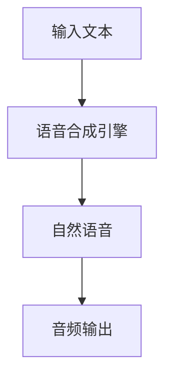

**核心概念与联系讲解：**

- 输入文本：用户输入的文本是语音合成的起点，可以是自然语言文本。
- 语音合成引擎：处理输入文本，通过语言模型、音素库等生成对应的语音。
- 自然语音：合成后的语音需要尽量接近人类语音的自然度。
- 音频输出：合成后的语音以音频形式输出，用于虚拟主播的语音播放。

**核心算法原理讲解：**

**伪代码：**

```python
def text_to_speech(text):
    # 步骤1：文本预处理
    processed_text = preprocess_text(text)

    # 步骤2：语言模型
    language_model = build_language_model()

    # 步骤3：音素库
    phoneme_library = build_phoneme_library()

    # 步骤4：合成语音
    synthesized_audio = synthesize_audio(processed_text, language_model, phoneme_library)

    # 步骤5：音频输出
    output_audio(synthesized_audio)

# 步骤1：文本预处理
def preprocess_text(text):
    # 清洗文本，去除标点符号、特殊字符等
    cleaned_text = remove_punctuation(text)
    # 将文本转化为拼音或音标
    phonetic_text = convert_to_phonetics(cleaned_text)
    return phonetic_text

# 步骤2：语言模型
def build_language_model():
    # 使用N元语言模型，如n-gram模型
    model = n_gram_model(n=3)
    return model

# 步骤3：音素库
def build_phoneme_library():
    # 构建音素库，包含所有可能的音素及其发音
    library = phoneme_library()
    return library

# 步骤4：合成语音
def synthesize_audio(processed_text, language_model, phoneme_library):
    # 根据音素库和语言模型生成语音
    audio_data = generate_audio_data(processed_text, language_model, phoneme_library)
    return audio_data

# 步骤5：音频输出
def output_audio(audio_data):
    # 将音频数据输出到扬声器或其他音频设备
    play_audio(audio_data)
```

### 1.2.2 动作捕捉

**伪代码：**

```python
def action_capture(input_video):
    # 步骤1：视频预处理
    processed_video = preprocess_video(input_video)

    # 步骤2：面部识别
    face_tensors = face_detection(processed_video)

    # 步骤3：关键点提取
    key_points = key_point_extraction(face_tensors)

    # 步骤4：动作生成
    action_tensors = action_generation(key_points)

    # 步骤5：动作输出
    output_action = generate_action_output(action_tensors)
    return output_action

# 步骤1：视频预处理
def preprocess_video(input_video):
    # 清洗视频，调整分辨率、帧率等
    cleaned_video = video_preprocessing(input_video)
    return cleaned_video

# 步骤2：面部识别
def face_detection(processed_video):
    # 使用深度学习模型进行面部识别
    face_tensors = face_recognition_model(processed_video)
    return face_tensors

# 步骤3：关键点提取
def key_point_extraction(face_tensors):
    # 使用关键点检测算法提取面部关键点
    key_points = key_point_detection(face_tensors)
    return key_points

# 步骤4：动作生成
def action_generation(key_points):
    # 根据关键点生成动作
    action_tensors = action_model.generate_action(key_points)
    return action_tensors

# 步骤5：动作输出
def generate_action_output(action_tensors):
    # 将动作数据转化为可视化输出
    output_action = visualize_action(action_tensors)
    return output_action
```

### 1.2.3 表情识别与同步

**伪代码：**

```python
def emotion_recognition(input_audio):
    # 步骤1：音频预处理
    processed_audio = preprocess_audio(input_audio)

    # 步骤2：情感分析
    emotion_tensors = emotion_analysis(processed_audio)

    # 步骤3：表情生成
    facial_expression = generate_expression(emotion_tensors)

    # 步骤4：表情同步
    synchronized_expression = synchronize_expression(facial_expression, action_tensors)

    # 步骤5：表情输出
    output_expression = visualize_expression(synchronized_expression)
    return output_expression

# 步骤1：音频预处理
def preprocess_audio(input_audio):
    # 清洗音频，调整音量、去除噪音等
    cleaned_audio = audio_preprocessing(input_audio)
    return cleaned_audio

# 步骤2：情感分析
def emotion_analysis(processed_audio):
    # 使用情感分析模型分析音频
    emotion_tensors = emotion_model.analyze_emotion(processed_audio)
    return emotion_tensors

# 步骤3：表情生成
def generate_expression(emotion_tensors):
    # 根据情感分析结果生成相应的面部表情
    facial_expression = expression_model.generate_expression(emotion_tensors)
    return facial_expression

# 步骤4：表情同步
def synchronize_expression(facial_expression, action_tensors):
    # 将表情同步到动作数据中
    synchronized_expression = expression_model.synchronize_expression(facial_expression, action_tensors)
    return synchronized_expression

# 步骤5：表情输出
def visualize_expression(synchronized_expression):
    # 将表情数据转化为可视化输出
    output_expression = visualize_expression(synchronized_expression)
    return output_expression
```

### 1.3 虚拟主播的发展趋势

**Mermaid 流程图：**

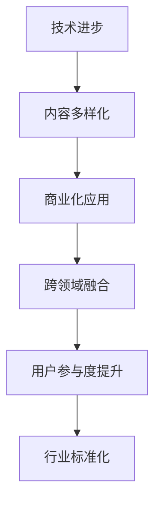

**核心趋势讲解：**

- 技术进步：随着AI、深度学习、计算机图形学等技术的不断发展，虚拟主播的表现力、互动性、真实感将得到进一步提升。
- 内容多样化：虚拟主播将涉及更多领域和内容形式，如教育、娱乐、商业等，提供更加多样化的服务。
- 商业化应用：虚拟主播将在更多商业场景中得到应用，成为企业品牌推广和客户服务的新工具。
- 跨领域融合：虚拟主播将与VR、AR、游戏等新兴技术融合，开拓更多创新应用场景。
- 用户参与度提升：用户将更加积极地参与虚拟主播的互动，提高用户体验。
- 行业标准化：虚拟主播产业将逐步实现标准化，推动行业健康快速发展。

### 1.4 虚拟主播在社会与经济中的作用

**Mermaid 流程图：**

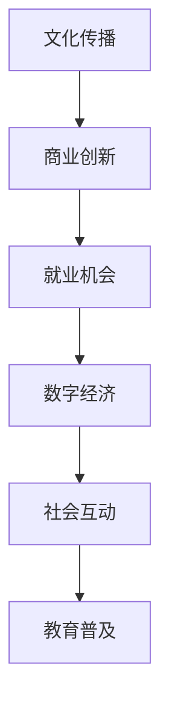

**核心作用讲解：**

- 文化传播：虚拟主播为文化传播提供了新的载体，能够跨越语言、地域等限制，传播更多样化的文化内容。
- 商业创新：虚拟主播为商业活动提供了新的形式和渠道，如虚拟品牌代言、虚拟直播带货等，推动商业模式的创新。
- 就业机会：虚拟主播产业的发展创造了大量就业机会，包括主播、内容创作者、技术工程师等。
- 数字经济：虚拟主播作为数字经济的重要组成部分，推动了相关产业的发展，如虚拟现实、人工智能等。
- 社会互动：虚拟主播促进了人与人之间的互动，改变了传统的社交方式，提高了社会互动的效率和质量。
- 教育普及：虚拟主播在教育领域的应用，如在线教育、虚拟课堂等，推动了教育资源的普及和均衡。

## 第2章：AI基础技术

### 2.1 机器学习基础

#### 2.1.1 数据预处理

**核心概念与联系：**

数据预处理是机器学习过程中至关重要的一步，它包括数据清洗、数据转换和数据归一化等步骤。

**Mermaid 流程图：**

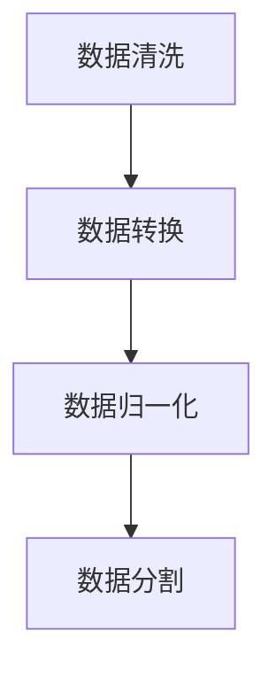

**核心概念与联系讲解：**

- 数据清洗：处理缺失值、异常值和噪声数据，提高数据质量。
- 数据转换：将原始数据进行转换，使其符合机器学习模型的输入要求。
- 数据归一化：通过缩放或转换，将不同特征的数据统一到相同的尺度，避免特征之间的影响。
- 数据分割：将数据集划分为训练集、验证集和测试集，用于模型的训练、验证和测试。

**核心算法原理讲解：**

**伪代码：**

```python
def preprocess_data(data):
    # 步骤1：数据清洗
    cleaned_data = clean_data(data)

    # 步骤2：数据转换
    transformed_data = convert_data(cleaned_data)

    # 步骤3：数据归一化
    normalized_data = normalize_data(transformed_data)

    # 步骤4：数据分割
    train_data, val_data, test_data = split_data(normalized_data)

    return train_data, val_data, test_data

# 步骤1：数据清洗
def clean_data(data):
    # 填补缺失值
    data = fill_missing_values(data)
    # 删除异常值
    data = remove_outliers(data)
    return data

# 步骤2：数据转换
def convert_data(cleaned_data):
    # 将数据类型转换为适合模型输入的类型
    converted_data = type_conversion(cleaned_data)
    return converted_data

# 步骤3：数据归一化
def normalize_data(transformed_data):
    # 对数据进行缩放或转换
    normalized_data = scaling_or_transformation(transformed_data)
    return normalized_data

# 步骤4：数据分割
def split_data(normalized_data):
    # 划分训练集、验证集和测试集
    train_data, val_data, test_data = train_test_split(normalized_data)
    return train_data, val_data, test_data
```

### 2.1.2 常见算法介绍

**核心算法介绍：**

1. **线性回归（Linear Regression）**

**核心概念与联系：**

线性回归是一种用于预测数值型因变量的统计方法，通过建立自变量与因变量之间的线性关系模型来预测新的数据。

**Mermaid 流程图：**

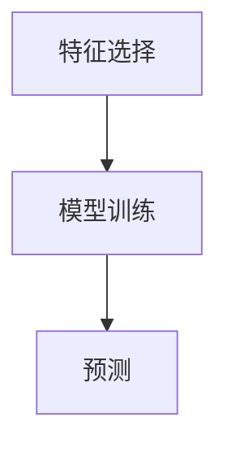

**核心概念与联系讲解：**

- 特征选择：选择对因变量有显著影响的特征。
- 模型训练：使用训练数据拟合线性回归模型，计算模型的参数。
- 预测：使用训练好的模型对新数据进行预测。

**核心算法原理讲解：**

**伪代码：**

```python
def linear_regression(X, y):
    # 步骤1：特征选择
    selected_features = feature_selection(X, y)

    # 步骤2：模型训练
    model = train_linear_regression(selected_features, y)

    # 步骤3：预测
    predictions = predict(model, X)

    return predictions

# 步骤1：特征选择
def feature_selection(X, y):
    # 使用相关系数、信息增益等方法选择特征
    selected_features = select_features(X, y)
    return selected_features

# 步骤2：模型训练
def train_linear_regression(selected_features, y):
    # 训练线性回归模型
    model = linear_regression_model(selected_features, y)
    return model

# 步骤3：预测
def predict(model, X):
    # 使用训练好的模型进行预测
    predictions = model.predict(X)
    return predictions
```

2. **决策树（Decision Tree）**

**核心概念与联系：**

决策树是一种基于特征值进行决策的树形结构模型，通过一系列二分类决策生成一个预测模型。

**Mermaid 流程图：**

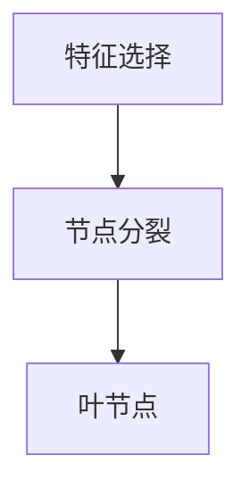

**核心概念与联系讲解：**

- 特征选择：选择对分类有显著影响的特征。
- 节点分裂：根据特征值将数据集划分为多个子集。
- 叶节点：生成最终的分类结果。

**核心算法原理讲解：**

**伪代码：**

```python
def decision_tree(X, y):
    # 步骤1：特征选择
    selected_features = feature_selection(X, y)

    # 步骤2：节点分裂
    tree = build_decision_tree(selected_features, X, y)

    # 步骤3：预测
    predictions = predict_tree(tree, X)

    return predictions

# 步骤1：特征选择
def feature_selection(X, y):
    # 使用信息增益、基尼不纯度等方法选择特征
    selected_features = select_features(X, y)
    return selected_features

# 步骤2：节点分裂
def build_decision_tree(selected_features, X, y):
    # 构建决策树
    tree = build_tree(selected_features, X, y)
    return tree

# 步骤3：预测
def predict_tree(tree, X):
    # 使用训练好的决策树进行预测
    predictions = tree.predict(X)
    return predictions
```

### 2.1.3 特征工程

**核心概念与联系：**

特征工程是机器学习过程中用于提高模型性能的重要步骤，包括特征提取、特征选择和特征构造等。

**Mermaid 流程图：**

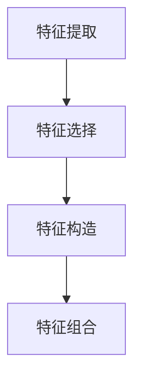

**核心概念与联系讲解：**

- 特征提取：从原始数据中提取有助于模型学习的特征。
- 特征选择：选择对模型性能有显著影响的特征，去除冗余特征。
- 特征构造：通过组合、变换等手段构造新的特征。
- 特征组合：将多个特征组合成新的特征，以提高模型的表现力。

**核心算法原理讲解：**

**伪代码：**

```python
def feature_engineering(data):
    # 步骤1：特征提取
    extracted_features = extract_features(data)

    # 步骤2：特征选择
    selected_features = feature_selection(extracted_features)

    # 步骤3：特征构造
    constructed_features = construct_features(selected_features)

    # 步骤4：特征组合
    combined_features = combine_features(constructed_features)

    return combined_features

# 步骤1：特征提取
def extract_features(data):
    # 提取基本特征，如平均值、标准差、最大值等
    extracted_features = extract_basic_features(data)
    return extracted_features

# 步骤2：特征选择
def feature_selection(extracted_features):
    # 使用信息增益、相关系数等方法选择特征
    selected_features = select_features_by_score(extracted_features)
    return selected_features

# 步骤3：特征构造
def construct_features(selected_features):
    # 构造新的特征，如交乘、多项式特征等
    constructed_features = construct_new_features(selected_features)
    return constructed_features

# 步骤4：特征组合
def combine_features(constructed_features):
    # 将多个特征组合成新的特征
    combined_features = combine_features(constructed_features)
    return combined_features
```

### 2.2 深度学习基础

#### 2.2.1 神经网络原理

**核心概念与联系：**

神经网络是一种通过模拟生物神经系统的信息处理方式，用于解决复杂问题的计算模型。

**Mermaid 流程图：**

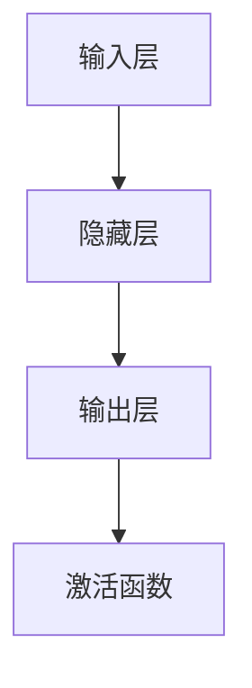

**核心概念与联系讲解：**

- 输入层：接收外部输入数据，并将其传递到隐藏层。
- 隐藏层：对输入数据进行处理和变换，提取特征。
- 输出层：生成最终的预测结果。
- 激活函数：用于引入非线性特性，使神经网络能够拟合复杂函数。

**核心算法原理讲解：**

**伪代码：**

```python
def neural_network(input_data, hidden_layers, output_layer, activation_function):
    # 步骤1：前向传播
    hidden_activations, output_activation = forward_propagation(input_data, hidden_layers, output_layer, activation_function)

    # 步骤2：反向传播
    gradients = backward_propagation(output_activation, true_output)

    # 步骤3：权重更新
    update_weights(hidden_activations, gradients)

    return output_activation

# 步骤1：前向传播
def forward_propagation(input_data, hidden_layers, output_layer, activation_function):
    # 计算各层的激活值
    hidden_activations = []
    output_activation = None

    for layer in hidden_layers:
        activation = activation_function(np.dot(input_data, layer['weights']) + layer['bias'])
        hidden_activations.append(activation)
        input_data = activation

    output_activation = activation_function(np.dot(input_data, output_layer['weights']) + output_layer['bias'])
    return hidden_activations, output_activation

# 步骤2：反向传播
def backward_propagation(output_activation, true_output):
    # 计算梯度
    gradients = compute_gradients(output_activation, true_output)
    return gradients

# 步骤3：权重更新
def update_weights(hidden_activations, gradients):
    # 更新各层的权重
    for layer in hidden_activations:
        layer['weights'] -= gradients
```

#### 2.2.2 深度学习框架

**核心概念与联系：**

深度学习框架是用于构建、训练和优化深度学习模型的一系列工具和库。

**Mermaid 流程图：**

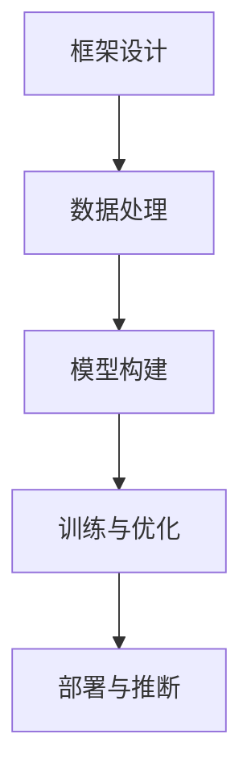

**核心概念与联系讲解：**

- 框架设计：框架的结构和架构，如动态图和静态图。
- 数据处理：数据处理模块，包括数据加载、预处理和增强。
- 模型构建：模型构建模块，提供各种层和操作的构建方式。
- 训练与优化：训练模块，包括损失函数、优化器和训练策略。
- 部署与推断：部署模块，将训练好的模型部署到生产环境中，并进行推断。

**核心算法原理讲解：**

**伪代码：**

```python
def train_model(model, train_data, val_data, num_epochs):
    # 步骤1：初始化模型
    model.init()

    # 步骤2：训练循环
    for epoch in range(num_epochs):
        # 步骤2.1：前向传播
        outputs = model.forward(train_data)

        # 步骤2.2：计算损失
        loss = compute_loss(outputs, train_data.labels)

        # 步骤2.3：反向传播
        gradients = model.backward(outputs, train_data.labels)

        # 步骤2.4：更新权重
        model.update_weights(gradients)

        # 步骤2.5：验证集评估
        val_outputs = model.forward(val_data)
        val_loss = compute_loss(val_outputs, val_data.labels)

        # 步骤2.6：打印训练进度
        print(f"Epoch {epoch}: Loss = {loss}, Val Loss = {val_loss}")

    return model
```

### 2.2.3 模型优化

**核心概念与联系：**

模型优化是提高深度学习模型性能和效率的重要手段，包括损失函数、优化器、正则化和超参数调整等。

**Mermaid 流程图：**

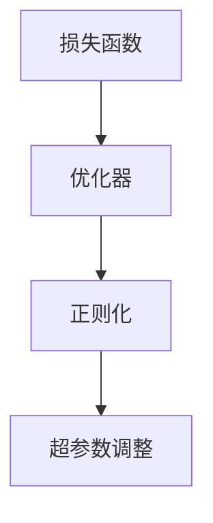

**核心概念与联系讲解：**

- 损失函数：用于评估模型预测值与真实值之间的差异，是优化过程中追求最小化的目标。
- 优化器：用于计算梯度并更新模型权重，常用的优化器有随机梯度下降（SGD）、Adam等。
- 正则化：用于防止模型过拟合，常用的正则化方法有L1、L2正则化。
- 超参数调整：调整模型的超参数，如学习率、批次大小等，以优化模型性能。

**核心算法原理讲解：**

**伪代码：**

```python
def optimize_model(model, train_data, val_data, num_epochs, learning_rate):
    # 步骤1：初始化模型和优化器
    model.init()
    optimizer = optimizers.Adam(learning_rate)

    # 步骤2：训练循环
    for epoch in range(num_epochs):
        # 步骤2.1：前向传播
        outputs = model.forward(train_data)

        # 步骤2.2：计算损失
        loss = compute_loss(outputs, train_data.labels)

        # 步骤2.3：反向传播
        gradients = model.backward(outputs, train_data.labels)

        # 步骤2.4：更新权重
        optimizer.update_weights(model, gradients)

        # 步骤2.5：验证集评估
        val_outputs = model.forward(val_data)
        val_loss = compute_loss(val_outputs, val_data.labels)

        # 步骤2.6：打印训练进度
        print(f"Epoch {epoch}: Loss = {loss}, Val Loss = {val_loss}")

    return model
```

## 第3章：虚拟主播动作生成的关键技术

### 3.1 自然语言处理

#### 3.1.1 语言模型

**核心概念与联系：**

语言模型是一种用于预测文本序列的概率模型，是自然语言处理的重要基础。

**Mermaid 流程图：**

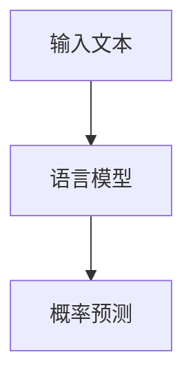

**核心概念与联系讲解：**

- 输入文本：用户输入的文本数据。
- 语言模型：基于大量文本数据训练得到的模型，用于预测文本序列的概率。
- 概率预测：通过语言模型预测输入文本的下一个词或字符的概率。

**核心算法原理讲解：**

**伪代码：**

```python
def language_model(input_text):
    # 步骤1：文本预处理
    processed_text = preprocess_text(input_text)

    # 步骤2：概率预测
    probabilities = predict_probabilities(processed_text)

    # 步骤3：文本生成
    generated_text = generate_text(probabilities)

    return generated_text

# 步骤1：文本预处理
def preprocess_text(input_text):
    # 清洗文本，去除标点符号、特殊字符等
    cleaned_text = remove_punctuation(input_text)
    return cleaned_text

# 步骤2：概率预测
def predict_probabilities(processed_text):
    # 使用n-gram语言模型预测文本序列的概率
    probabilities = n_gram_model.predict(processed_text)
    return probabilities

# 步骤3：文本生成
def generate_text(probabilities):
    # 根据概率预测生成文本
    generated_text = text_generator.generate_text(probabilities)
    return generated_text
```

#### 3.1.2 文本生成

**核心概念与联系：**

文本生成是指利用语言模型和序列模型生成新的文本内容，是自然语言处理的重要应用。

**Mermaid 流程图：**

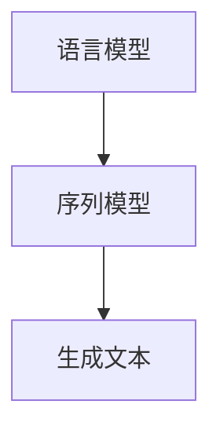

**核心概念与联系讲解：**

- 语言模型：用于预测文本序列的概率。
- 序列模型：如RNN、LSTM、GRU等，用于处理序列数据并生成文本。
- 生成文本：根据语言模型和序列模型生成新的文本内容。

**核心算法原理讲解：**

**伪代码：**

```python
def generate_text(input_sequence):
    # 步骤1：文本预处理
    processed_sequence = preprocess_sequence(input_sequence)

    # 步骤2：序列生成
    generated_sequence = sequence_model.generate_sequence(processed_sequence)

    # 步骤3：文本输出
    output_text = convert_sequence_to_text(generated_sequence)

    return output_text

# 步骤1：文本预处理
def preprocess_sequence(input_sequence):
    # 清洗序列，去除标点符号、特殊字符等
    cleaned_sequence = remove_punctuation(input_sequence)
    return cleaned_sequence

# 步骤2：序列生成
def generate_sequence(processed_sequence):
    # 使用序列模型生成文本序列
    generated_sequence = sequence_model.predict(processed_sequence)
    return generated_sequence

# 步骤3：文本输出
def convert_sequence_to_text(generated_sequence):
    # 将序列数据转换为文本
    output_text = text_generator.convert_sequence_to_text(generated_sequence)
    return output_text
```

#### 3.1.3 语音识别

**核心概念与联系：**

语音识别是指将语音信号转换为文本数据，是自然语言处理的关键技术。

**Mermaid 流程图：**

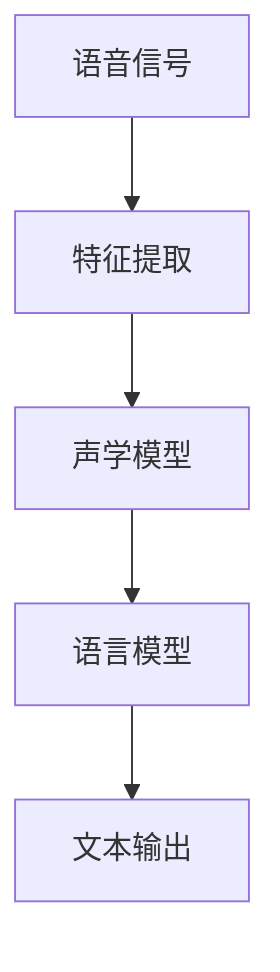

**核心概念与联系讲解：**

- 语音信号：输入的语音数据。
- 特征提取：将语音信号转换为数字特征向量。
- 声学模型：用于将特征向量映射到声学空间。
- 语言模型：用于将声学空间中的特征映射到文本空间。
- 文本输出：生成的文本数据。

**核心算法原理讲解：**

**伪代码：**

```python
def speech_recognition(audio_signal):
    # 步骤1：特征提取
    feature_vectors = extract_features(audio_signal)

    # 步骤2：声学模型
    acoustic_space = acoustic_model.transform(feature_vectors)

    # 步骤3：语言模型
    text_sequence = language_model.predict(acoustic_space)

    # 步骤4：文本输出
    output_text = convert_sequence_to_text(text_sequence)

    return output_text

# 步骤1：特征提取
def extract_features(audio_signal):
    # 提取语音信号的特征向量
    feature_vectors = feature_extractor.extract(audio_signal)
    return feature_vectors

# 步骤2：声学模型
def acoustic_model_transform(feature_vectors):
    # 使用声学模型转换特征向量到声学空间
    acoustic_space = model.transform(feature_vectors)
    return acoustic_space

# 步骤3：语言模型
def language_model_predict(acoustic_space):
    # 使用语言模型预测文本序列
    text_sequence = model.predict(acoustic_space)
    return text_sequence

# 步骤4：文本输出
def convert_sequence_to_text(text_sequence):
    # 将文本序列转换为字符串
    output_text = text_generator.convert_sequence_to_text(text_sequence)
    return output_text
```

### 3.2 计算机视觉

#### 3.2.1 图像识别

**核心概念与联系：**

图像识别是指通过计算机视觉技术对图像进行分析和识别，是实现虚拟主播动作生成的重要基础。

**Mermaid 流程图：**

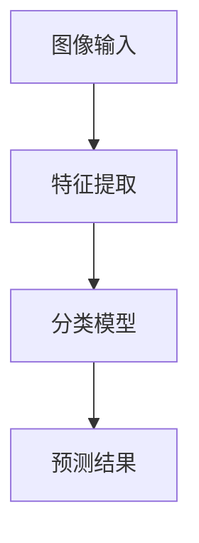

**核心概念与联系讲解：**

- 图像输入：输入待识别的图像数据。
- 特征提取：从图像中提取有助于分类的特征。
- 分类模型：基于训练数据构建的分类模型，用于对图像进行分类。
- 预测结果：生成的图像分类结果。

**核心算法原理讲解：**

**伪代码：**

```python
def image_recognition(image):
    # 步骤1：特征提取
    features = extract_image_features(image)

    # 步骤2：分类模型
    predicted_class = classification_model.predict(features)

    # 步骤3：预测结果
    result = interpret_prediction(predicted_class)

    return result

# 步骤1：特征提取
def extract_image_features(image):
    # 提取图像特征
    features = feature_extractor.extract(image)
    return features

# 步骤2：分类模型
def classification_model_predict(features):
    # 使用分类模型预测图像类别
    predicted_class = model.predict(features)
    return predicted_class

# 步骤3：预测结果
def interpret_prediction(predicted_class):
    # 将预测类别转换为可解释的结果
    result = interpret_model.predict(predicted_class)
    return result
```

#### 3.2.2 视频处理

**核心概念与联系：**

视频处理是指对视频信号进行增强、压缩、分割等操作，是虚拟主播动作生成的重要环节。

**Mermaid 流程图：**

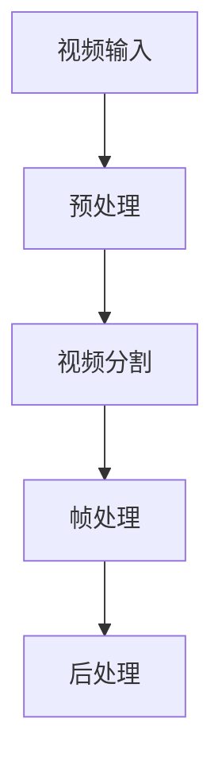

**核心概念与联系讲解：**

- 视频输入：输入待处理的视频数据。
- 预处理：对视频进行预处理，如去噪、增强等。
- 视频分割：将视频分割成帧，便于后续处理。
- 帧处理：对每一帧进行特征提取、分类等操作。
- 后处理：对处理后的帧进行合并、输出等操作。

**核心算法原理讲解：**

**伪代码：**

```python
def video_processing(video):
    # 步骤1：预处理
    processed_video = preprocess_video(video)

    # 步骤2：视频分割
    frames = split_video(processed_video)

    # 步骤3：帧处理
    processed_frames = process_frames(frames)

    # 步骤4：后处理
    output_video = merge_frames(processed_frames)

    return output_video

# 步骤1：预处理
def preprocess_video(video):
    # 去噪、增强等预处理操作
    processed_video = video_preprocessor.process(video)
    return processed_video

# 步骤2：视频分割
def split_video(video):
    # 分割视频成帧
    frames = video_splitter.split(video)
    return frames

# 步骤3：帧处理
def process_frames(frames):
    # 对每一帧进行特征提取、分类等操作
    processed_frames = frame_processor.process(frames)
    return processed_frames

# 步骤4：后处理
def merge_frames(processed_frames):
    # 合并处理后的帧生成输出视频
    output_video = video_merger.merge(processed_frames)
    return output_video
```

#### 3.2.3 人脸识别

**核心概念与联系：**

人脸识别是指通过计算机视觉技术对人脸图像进行识别和定位，是实现虚拟主播动作生成的重要技术。

**Mermaid 流程图：**

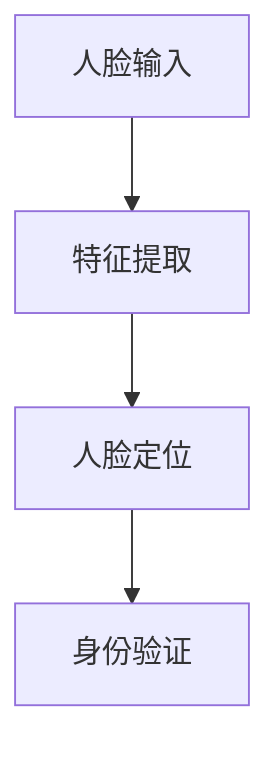

**核心概念与联系讲解：**

- 人脸输入：输入待识别的人脸图像。
- 特征提取：从人脸图像中提取有助于识别的特征。
- 人脸定位：对人脸图像进行定位，确定人脸的位置和大小。
- 身份验证：根据提取的特征和已有人脸数据库进行比对，验证身份。

**核心算法原理讲解：**

**伪代码：**

```python
def facial_recognition(face_image):
    # 步骤1：特征提取
    face_features = extract_face_features(face_image)

    # 步骤2：人脸定位
    face_location = locate_face(face_features)

    # 步骤3：身份验证
    identity = verify_identity(face_features, face_database)

    return identity

# 步骤1：特征提取
def extract_face_features(face_image):
    # 提取人脸特征
    features = feature_extractor.extract(face_image)
    return features

# 步骤2：人脸定位
def locate_face(face_features):
    # 定位人脸位置和大小
    location = face_localizer.locate(face_features)
    return location

# 步骤3：身份验证
def verify_identity(face_features, face_database):
    # 验证人脸身份
    identity = identity_verifier.verify(face_features, face_database)
    return identity
```

## 第4章：虚拟主播动作生成算法详解

### 4.1 动作生成算法原理

**核心概念与联系：**

虚拟主播动作生成算法是指利用深度学习技术和计算机视觉技术，将文本输入转换为相应的动作输出，实现虚拟主播的动作生成。

**Mermaid 流程图：**

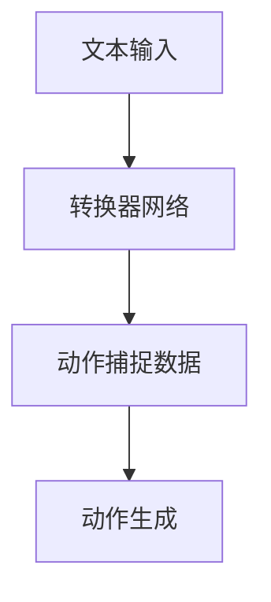

**核心概念与联系讲解：**

- 文本输入：输入文本数据，用于描述虚拟主播的动作。
- 转换器网络：将文本数据转换为动作捕捉数据，实现文本到动作的转换。
- 动作捕捉数据：通过动作捕捉设备获取真实动作数据，作为训练和生成的依据。
- 动作生成：利用动作捕捉数据生成虚拟主播的动作，实现动作的输出。

**核心算法原理讲解：**

**伪代码：**

```python
def action_generation(text_input):
    # 步骤1：文本预处理
    processed_text = preprocess_text(text_input)

    # 步骤2：转换器网络
    action_captures = converter_network.predict(processed_text)

    # 步骤3：动作生成
    generated_action = action_model.generate_action(action_captures)

    # 步骤4：动作输出
    output_action = visualize_action(generated_action)
    return output_action

# 步骤1：文本预处理
def preprocess_text(text_input):
    # 清洗文本，去除标点符号、特殊字符等
    cleaned_text = remove_punctuation(text_input)
    return cleaned_text

# 步骤2：转换器网络
def converter_network_predict(processed_text):
    # 使用转换器网络预测动作捕捉数据
    action_captures = converter_model.predict(processed_text)
    return action_captures

# 步骤3：动作生成
def action_model_generate_action(action_captures):
    # 使用动作模型生成动作
    generated_action = action_generator.generate_action(action_captures)
    return generated_action

# 步骤4：动作输出
def visualize_action(generated_action):
    # 将生成的动作可视化输出
    output_action = action_visualizer.visualize(generated_action)
    return output_action
```

### 4.1.1 转换器网络

**核心概念与联系：**

转换器网络是一种深度学习模型，用于将文本输入转换为相应的动作捕捉数据，是虚拟主播动作生成算法的核心部分。

**Mermaid 流程图：**

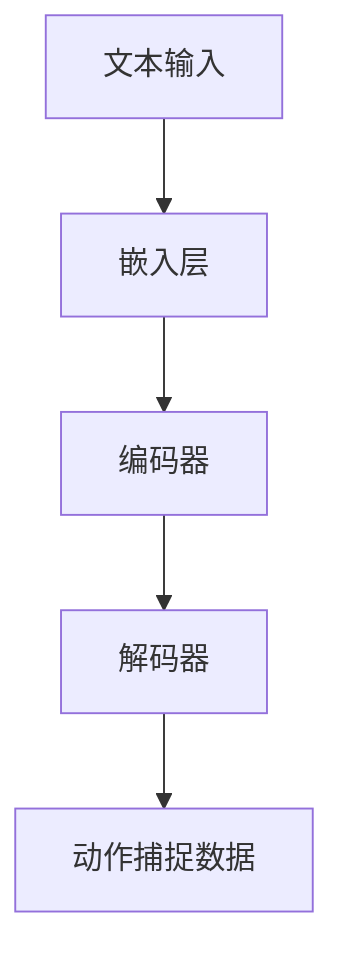

**核心概念与联系讲解：**

- 文本输入：输入文本数据，用于描述虚拟主播的动作。
- 嵌入层：将文本数据转换为固定长度的向量表示。
- 编码器：对嵌入层生成的向量进行编码，提取文本的语义信息。
- 解码器：将编码器的输出解码为动作捕捉数据。
- 动作捕捉数据：生成的动作捕捉数据，用于驱动虚拟主播的动作。

**核心算法原理讲解：**

**伪代码：**

```python
def converter_network(text_input):
    # 步骤1：文本嵌入
    embedded_text = embed_text(text_input)

    # 步骤2：编码器
    encoded_text = encoder.predict(embedded_text)

    # 步骤3：解码器
    action_captures = decoder.predict(encoded_text)

    return action_captures

# 步骤1：文本嵌入
def embed_text(text_input):
    # 将文本转换为嵌入向量
    embedded_text = text_embedding.embed(text_input)
    return embedded_text

# 步骤2：编码器
def encoder_predict(embedded_text):
    # 使用编码器对嵌入向量进行编码
    encoded_text = encoder_model.predict(embedded_text)
    return encoded_text

# 步骤3：解码器
def decoder_predict(encoded_text):
    # 使用解码器对编码文本进行解码
    action_captures = decoder_model.predict(encoded_text)
    return action_captures
```

### 4.1.2 动作捕捉技术

**核心概念与联系：**

动作捕捉技术是指通过传感器和计算机视觉技术捕捉真实动作，用于虚拟主播动作生成算法的训练和生成。

**Mermaid 流程图：**

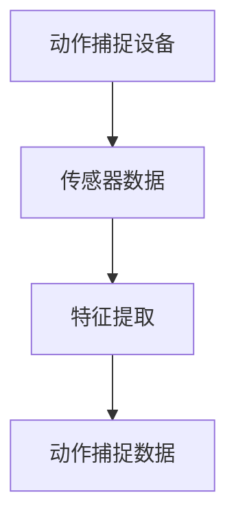

**核心概念与联系讲解：**

- 动作捕捉设备：用于捕捉真实动作的传感器设备，如动作捕捉服、摄像头等。
- 传感器数据：通过动作捕捉设备获取的传感器数据，包括位置、速度、加速度等。
- 特征提取：从传感器数据中提取有助于动作生成的特征。
- 动作捕捉数据：生成的动作捕捉数据，用于训练和生成虚拟主播的动作。

**核心算法原理讲解：**

**伪代码：**

```python
def action_capture技术应用():
    # 步骤1：传感器数据采集
    sensor_data = collect_sensor_data()

    # 步骤2：特征提取
    extracted_features = extract_action_features(sensor_data)

    # 步骤3：动作捕捉数据生成
    action_captures = generate_action_data(extracted_features)

    return action_captures

# 步骤1：传感器数据采集
def collect_sensor_data():
    # 采集传感器数据
    sensor_data = sensor_reader.read()
    return sensor_data

# 步骤2：特征提取
def extract_action_features(sensor_data):
    # 提取动作特征
    extracted_features = feature_extractor.extract(sensor_data)
    return extracted_features

# 步骤3：动作捕捉数据生成
def generate_action_data(extracted_features):
    # 生成动作捕捉数据
    action_captures = action_generator.generate_action(extracted_features)
    return action_captures
```

### 4.1.3 动作生成框架

**核心概念与联系：**

动作生成框架是指将文本输入转换为虚拟主播动作的一系列算法和组件，是虚拟主播动作生成算法的实现基础。

**Mermaid 流程图：**

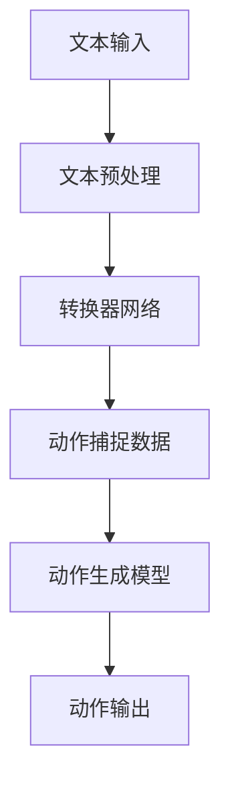

**核心概念与联系讲解：**

- 文本输入：输入文本数据，用于描述虚拟主播的动作。
- 文本预处理：对文本输入进行清洗和预处理，生成可用的输入数据。
- 转换器网络：将预处理后的文本数据转换为动作捕捉数据。
- 动作捕捉数据：通过动作捕捉技术获取的动作数据，用于训练和生成虚拟主播的动作。
- 动作生成模型：基于动作捕捉数据训练的模型，用于生成虚拟主播的动作。
- 动作输出：生成的虚拟主播动作，用于驱动虚拟主播的动作执行。

**核心算法原理讲解：**

**伪代码：**

```python
def action_generation_framework(text_input):
    # 步骤1：文本预处理
    processed_text = preprocess_text(text_input)

    # 步骤2：转换器网络
    action_captures = converter_network.predict(processed_text)

    # 步骤3：动作生成模型
    generated_action = action_model.generate_action(action_captures)

    # 步骤4：动作输出
    output_action = visualize_action(generated_action)
    return output_action

# 步骤1：文本预处理
def preprocess_text(text_input):
    # 清洗文本，去除标点符号、特殊字符等
    cleaned_text = remove_punctuation(text_input)
    return cleaned_text

# 步骤2：转换器网络
def converter_network_predict(processed_text):
    # 使用转换器网络预测动作捕捉数据
    action_captures = converter_model.predict(processed_text)
    return action_captures

# 步骤3：动作生成模型
def action_model_generate_action(action_captures):
    # 使用动作生成模型生成动作
    generated_action = action_generator.generate_action(action_captures)
    return generated_action

# 步骤4：动作输出
def visualize_action(generated_action):
    # 将生成的动作可视化输出
    output_action = action_visualizer.visualize(generated_action)
    return output_action
```

## 第4章：虚拟主播动作生成算法实现

### 4.2 动作生成算法实现

#### 4.2.1 数据集准备

**核心概念与联系：**

数据集准备是虚拟主播动作生成算法实现的第一步，包括数据采集、数据清洗和数据标注等过程。

**Mermaid 流程图：**

```mermaid
graph TD
A[数据采集] --> B[数据清洗]
B --> C[数据标注]
C --> D[数据集构建]
```

**核心概念与联系讲解：**

- 数据采集：从实际场景中获取虚拟主播动作的原始数据。
- 数据清洗：处理数据中的噪声、异常值和缺失值，提高数据质量。
- 数据标注：对数据中的动作进行标注，为后续训练提供标记信息。
- 数据集构建：将清洗和标注后的数据构建成用于训练的数据集。

**核心算法原理讲解：**

**伪代码：**

```python
def prepare_action_dataset():
    # 步骤1：数据采集
    raw_data = collect_action_data()

    # 步骤2：数据清洗
    cleaned_data = clean_action_data(raw_data)

    # 步骤3：数据标注
    annotated_data = annotate_action_data(cleaned_data)

    # 步骤4：数据集构建
    dataset = build_action_dataset(annotated_data)

    return dataset

# 步骤1：数据采集
def collect_action_data():
    # 采集动作数据
    raw_data = action_data_collector.collect()
    return raw_data

# 步骤2：数据清洗
def clean_action_data(raw_data):
    # 清洗动作数据
    cleaned_data = action_data_cleaner.clean(raw_data)
    return cleaned_data

# 步骤3：数据标注
def annotate_action_data(cleaned_data):
    # 标注动作数据
    annotated_data = action_data_annotator.annotate(cleaned_data)
    return annotated_data

# 步骤4：数据集构建
def build_action_dataset(annotated_data):
    # 构建动作数据集
    dataset = action_dataset_builder.build(annotated_data)
    return dataset
```

#### 4.2.2 模型训练

**核心概念与联系：**

模型训练是虚拟主播动作生成算法实现的核心步骤，包括模型初始化、训练过程和模型优化等。

**Mermaid 流程图：**

```mermaid
graph TD
A[模型初始化] --> B[前向传播]
B --> C[损失计算]
C --> D[反向传播]
D --> E[权重更新]
E --> F[模型优化]
```

**核心概念与联系讲解：**

- 模型初始化：初始化模型的参数和结构，为训练做好准备。
- 前向传播：计算模型输出，与真实标签之间的误差。
- 损失计算：计算损失函数，评估模型性能。
- 反向传播：根据损失函数计算模型参数的梯度。
- 权重更新：更新模型参数，减小损失函数。
- 模型优化：通过调整训练策略和超参数，优化模型性能。

**核心算法原理讲解：**

**伪代码：**

```python
def train_action_model(dataset, num_epochs):
    # 步骤1：模型初始化
    model = initialize_model()

    # 步骤2：训练循环
    for epoch in range(num_epochs):
        # 步骤2.1：前向传播
        outputs = model.forward_pass(dataset.inputs)

        # 步骤2.2：损失计算
        loss = compute_loss(outputs, dataset.targets)

        # 步骤2.3：反向传播
        gradients = backward_pass(outputs, dataset.targets)

        # 步骤2.4：权重更新
        update_weights(model, gradients)

        # 步骤2.5：打印训练进度
        print(f"Epoch {epoch}: Loss = {loss}")

    # 步骤3：模型优化
    optimized_model = optimize_model(model)

    return optimized_model

# 步骤1：模型初始化
def initialize_model():
    # 初始化模型参数和结构
    model = Model()
    return model

# 步骤2：前向传播
def forward_pass(model, inputs):
    # 计算模型输出
    outputs = model.predict(inputs)
    return outputs

# 步骤2：损失计算
def compute_loss(outputs, targets):
    # 计算损失函数
    loss = loss_function(outputs, targets)
    return loss

# 步骤2：反向传播
def backward_pass(outputs, targets):
    # 计算梯度
    gradients = gradient_function(outputs, targets)
    return gradients

# 步骤2：权重更新
def update_weights(model, gradients):
    # 更新模型参数
    model.update(gradients)

# 步骤3：模型优化
def optimize_model(model):
    # 优化模型性能
    optimized_model = model.optimize()
    return optimized_model
```

#### 4.2.3 动作生成示例

**核心概念与联系：**

动作生成示例是指利用训练好的动作生成模型，生成虚拟主播的动作，并进行可视化展示。

**Mermaid 流�程图：**

```mermaid
graph TD
A[文本输入] --> B[模型预测]
B --> C[动作生成]
C --> D[动作可视化]
```

**核心概念与联系讲解：**

- 文本输入：输入描述虚拟主播动作的文本数据。
- 模型预测：使用训练好的动作生成模型预测对应的动作捕捉数据。
- 动作生成：根据预测的动作捕捉数据生成虚拟主播的动作。
- 动作可视化：将生成的动作进行可视化展示。

**核心算法原理讲解：**

**伪代码：**

```python
def generate_action_example(text_input):
    # 步骤1：文本预处理
    processed_text = preprocess_text(text_input)

    # 步骤2：模型预测
    action_captures = action_model.predict(processed_text)

    # 步骤3：动作生成
    generated_action = generate_action(action_captures)

    # 步骤4：动作可视化
    visualize_action(generated_action)
    return generated_action

# 步骤1：文本预处理
def preprocess_text(text_input):
    # 清洗文本，去除标点符号、特殊字符等
    cleaned_text = remove_punctuation(text_input)
    return cleaned_text

# 步骤2：模型预测
def action_model_predict(processed_text):
    # 使用动作生成模型预测动作捕捉数据
    action_captures = model.predict(processed_text)
    return action_captures

# 步骤3：动作生成
def generate_action(action_captures):
    # 根据动作捕捉数据生成虚拟主播的动作
    generated_action = action_generator.generate_action(action_captures)
    return generated_action

# 步骤4：动作可视化
def visualize_action(generated_action):
    # 将生成的动作可视化展示
    action_visualizer.visualize(generated_action)
    return generated_action
```

## 第5章：虚拟主播动作生成应用实践

### 5.1 实战一：虚拟主播互动场景生成

**核心概念与联系：**

虚拟主播互动场景生成是指利用虚拟主播动作生成算法，为虚拟主播创建互动场景，实现与用户的实时互动。

**Mermaid 流程图：**

```mermaid
graph TD
A[用户输入] --> B[动作生成]
B --> C[互动场景构建]
C --> D[实时交互]
```

**核心概念与联系讲解：**

- 用户输入：用户通过文本、语音等方式输入互动请求。
- 动作生成：使用动作生成算法根据用户输入生成虚拟主播的动作。
- 互动场景构建：根据用户输入和生成的动作，构建虚拟主播与用户的互动场景。
- 实时交互：虚拟主播与用户进行实时互动，提供个性化的内容和服务。

**核心算法原理讲解：**

**伪代码：**

```python
def generate_interactive_scene(user_input):
    # 步骤1：文本预处理
    processed_input = preprocess_text(user_input)

    # 步骤2：动作生成
    action_captures = action_model.predict(processed_input)

    # 步骤3：互动场景构建
    interactive_scene = build_interactive_scene(action_captures)

    # 步骤4：实时交互
    perform_real_time_interaction(interactive_scene)
    return interactive_scene

# 步骤1：文本预处理
def preprocess_text(user_input):
    # 清洗文本，去除标点符号、特殊字符等
    cleaned_input = remove_punctuation(user_input)
    return cleaned_input

# 步骤2：动作生成
def action_model_predict(processed_input):
    # 使用动作生成模型预测动作捕捉数据
    action_captures = model.predict(processed_input)
    return action_captures

# 步骤3：互动场景构建
def build_interactive_scene(action_captures):
    # 构建互动场景
    interactive_scene = scene_builder.build(action_captures)
    return interactive_scene

# 步骤4：实时交互
def perform_real_time_interaction(interactive_scene):
    # 进行实时交互
    interaction_performer.perform(scene=interactive_scene)
    return
```

### 5.1.1 场景设计

**核心概念与联系：**

场景设计是指根据用户需求和虚拟主播的能力，设计出合适的互动场景，以满足用户的互动需求。

**Mermaid 流程图：**

```mermaid
graph TD
A[需求分析] --> B[场景构思]
B --> C[场景描述]
C --> D[场景实现]
```

**核心概念与联系讲解：**

- 需求分析：分析用户的需求，确定互动场景的目标和功能。
- 场景构思：根据需求分析，构思出合适的互动场景。
- 场景描述：详细描述互动场景的各个环节和功能。
- 场景实现：根据场景描述，实现互动场景的各个功能。

**核心算法原理讲解：**

**伪代码：**

```python
def design_interactive_scene(user_demand):
    # 步骤1：需求分析
    analyzed_demand = analyze_demand(user_demand)

    # 步骤2：场景构思
    scene_concept = conceive_scene(analyzed_demand)

    # 步骤3：场景描述
    scene_description = describe_scene(scene_concept)

    # 步骤4：场景实现
    implemented_scene = implement_scene(scene_description)
    return implemented_scene

# 步骤1：需求分析
def analyze_demand(user_demand):
    # 分析用户需求，确定互动场景的目标和功能
    analyzed_demand = demand_analyzer.analyze(user_demand)
    return analyzed_demand

# 步骤2：场景构思
def conceive_scene(analyzed_demand):
    # 根据需求分析，构思出合适的互动场景
    scene_concept = scene_conceiver.conceive(analyzed_demand)
    return scene_concept

# 步骤3：场景描述
def describe_scene(scene_concept):
    # 详细描述互动场景的各个环节和功能
    scene_description = scene_describer.describe(scene_concept)
    return scene_description

# 步骤4：场景实现
def implement_scene(scene_description):
    # 根据场景描述，实现互动场景的各个功能
    implemented_scene = scene_implementer.implement(scene_description)
    return implemented_scene
```

### 5.1.2 算法实现

**核心概念与联系：**

算法实现是指将理论上的互动场景设计转化为实际可运行的代码，包括数据预处理、动作生成和场景交互等。

**Mermaid 流程图：**

```mermaid
graph TD
A[数据预处理] --> B[动作生成]
B --> C[场景交互]
```

**核心概念与联系讲解：**

- 数据预处理：对用户输入的数据进行清洗、转换和标准化，为后续动作生成和场景交互做准备。
- 动作生成：使用动作生成算法根据用户输入生成虚拟主播的动作。
- 场景交互：根据生成的动作和用户输入，实现虚拟主播与用户的实时互动。

**核心算法原理讲解：**

**伪代码：**

```python
def interactive_scene_algorithm(user_input):
    # 步骤1：数据预处理
    processed_input = preprocess_input(user_input)

    # 步骤2：动作生成
    action_captures = generate_action(processed_input)

    # 步骤3：场景交互
    interactive_result = perform_interaction(action_captures)
    return interactive_result

# 步骤1：数据预处理
def preprocess_input(user_input):
    # 清洗和转换用户输入
    processed_input = input_preprocessor.preprocess(user_input)
    return processed_input

# 步骤2：动作生成
def generate_action(processed_input):
    # 使用动作生成算法生成动作
    action_captures = action_generator.generate(processed_input)
    return action_captures

# 步骤3：场景交互
def perform_interaction(action_captures):
    # 实现虚拟主播与用户的实时交互
    interactive_result = interaction_executor.execute(action_captures)
    return interactive_result
```

### 5.1.3 结果分析

**核心概念与联系：**

结果分析是指对虚拟主播互动场景生成结果进行评估和优化，以提高用户体验和场景的交互效果。

**Mermaid 流程图：**

```mermaid
graph TD
A[结果评估] --> B[问题诊断]
B --> C[优化策略]
C --> D[结果分析]
```

**核心概念与联系讲解：**

- 结果评估：对生成的互动场景进行评估，分析其用户体验和交互效果。
- 问题诊断：诊断互动场景中存在的问题，如动作生成不准确、场景响应不及时等。
- 优化策略：根据问题诊断结果，制定优化策略，改进互动场景。
- 结果分析：对优化后的结果进行再次评估，验证优化效果。

**核心算法原理讲解：**

**伪代码：**

```python
def analyze_interactive_scene_result(result):
    # 步骤1：结果评估
    evaluation_results = evaluate_result(result)

    # 步骤2：问题诊断
    problems = diagnose_problems(evaluation_results)

    # 步骤3：优化策略
    optimization_strategy = formulate_strategy(problems)

    # 步骤4：结果分析
    final_result = apply_optimization_strategy(optimization_strategy, result)
    return final_result

# 步骤1：结果评估
def evaluate_result(result):
    # 评估互动场景的结果
    evaluation_results = result_evaluator.evaluate(result)
    return evaluation_results

# 步骤2：问题诊断
def diagnose_problems(evaluation_results):
    # 诊断互动场景中的问题
    problems = problem_diagnoser.diagnose(evaluation_results)
    return problems

# 步骤3：优化策略
def formulate_strategy(problems):
    # 制定优化策略
    optimization_strategy = strategy_formulator.formulate(problems)
    return optimization_strategy

# 步骤4：结果分析
def apply_optimization_strategy(optimization_strategy, result):
    # 应用优化策略，改进互动场景
    final_result = result_optimizer.optimize(optimization_strategy, result)
    return final_result
```

### 5.2 实战二：虚拟主播直播动作生成

**核心概念与联系：**

虚拟主播直播动作生成是指利用动作生成算法，为虚拟主播在直播过程中的动作生成提供支持，提高直播效果。

**Mermaid 流程图：**

```mermaid
graph TD
A[直播数据] --> B[动作生成]
B --> C[动作调整]
C --> D[直播渲染]
```

**核心概念与联系讲解：**

- 直播数据：从直播平台上获取的用户互动数据、直播内容等。
- 动作生成：使用动作生成算法根据直播数据生成虚拟主播的动作。
- 动作调整：根据直播效果和用户反馈，对生成的动作进行调整和优化。
- 直播渲染：将调整后的动作渲染到直播画面中，实现虚拟主播的实时互动。

**核心算法原理讲解：**

**伪代码：**

```python
def generate_live_broadcast_actions(live_data):
    # 步骤1：直播数据处理
    processed_live_data = preprocess_live_data(live_data)

    # 步骤2：动作生成
    action_captures = generate_actions(processed_live_data)

    # 步骤3：动作调整
    adjusted_actions = adjust_actions(action_captures)

    # 步骤4：直播渲染
    rendered_actions = render_actions(adjusted_actions)
    return rendered_actions

# 步骤1：直播数据处理
def preprocess_live_data(live_data):
    # 处理直播数据，如去除噪声、标准化等
    processed_live_data = live_data_preprocessor.preprocess(live_data)
    return processed_live_data

# 步骤2：动作生成
def generate_actions(processed_live_data):
    # 使用动作生成算法生成动作
    action_captures = action_generator.generate(processed_live_data)
    return action_captures

# 步骤3：动作调整
def adjust_actions(action_captures):
    # 根据直播效果和用户反馈调整动作
    adjusted_actions = action_adjuster.adjust(action_captures)
    return adjusted_actions

# 步骤4：直播渲染
def render_actions(adjusted_actions):
    # 将调整后的动作渲染到直播画面中
    rendered_actions = live_broadcast_renderer.render(adjusted_actions)
    return rendered_actions
```

### 5.2.1 直播数据处理

**核心概念与联系：**

直播数据处理是指对直播平台获取的直播数据（如用户评论、弹幕、直播内容等）进行处理，为动作生成提供输入。

**Mermaid 流程图：**

```mermaid
graph TD
A[直播数据获取] --> B[数据清洗]
B --> C[特征提取]
C --> D[数据增强]
```

**核心概念与联系讲解：**

- 直播数据获取：从直播平台上获取用户的互动数据、直播内容等。
- 数据清洗：去除数据中的噪声、异常值和无关信息，提高数据质量。
- 特征提取：从清洗后的数据中提取有助于动作生成的特征。
- 数据增强：通过扩展或变换原始数据，提高模型的泛化能力。

**核心算法原理讲解：**

**伪代码：**

```python
def process_live_broadcast_data(live_data):
    # 步骤1：直播数据获取
    obtained_data = fetch_live_data(live_data)

    # 步骤2：数据清洗
    cleaned_data = clean_data(obtained_data)

    # 步骤3：特征提取
    extracted_features = extract_features(cleaned_data)

    # 步骤4：数据增强
    enhanced_data = augment_data(extracted_features)
    return enhanced_data

# 步骤1：直播数据获取
def fetch_live_data(live_data):
    # 从直播平台获取直播数据
    obtained_data = live_data_fetcher.fetch(live_data)
    return obtained_data

# 步骤2：数据清洗
def clean_data(obtained_data):
    # 清洗直播数据，如去除噪声、异常值等
    cleaned_data = data_cleaner.clean(obtained_data)
    return cleaned_data

# 步骤3：特征提取
def extract_features(cleaned_data):
    # 从清洗后的数据中提取特征
    extracted_features = feature_extractor.extract(cleaned_data)
    return extracted_features

# 步骤4：数据增强
def augment_data(extracted_features):
    # 增强数据，提高模型泛化能力
    enhanced_data = data_augmenter.augment(extracted_features)
    return enhanced_data
```

### 5.2.2 算法实现

**核心概念与联系：**

算法实现是指将直播数据处理、动作生成和直播渲染的过程转化为实际可运行的代码，实现虚拟主播直播动作生成。

**Mermaid 流程图：**

```mermaid
graph TD
A[直播数据处理] --> B[动作生成]
B --> C[动作调整]
C --> D[直播渲染]
```

**核心概念与联系讲解：**

- 直播数据处理：对获取的直播数据进行预处理，提取特征，增强数据。
- 动作生成：使用动作生成算法根据处理后的数据生成虚拟主播的动作。
- 动作调整：根据直播效果和用户反馈，调整生成的动作，提高互动效果。
- 直播渲染：将调整后的动作渲染到直播画面中，实现虚拟主播与用户的实时互动。

**核心算法原理讲解：**

**伪代码：**

```python
def live_broadcast_action_algorithm(live_data):
    # 步骤1：直播数据处理
    processed_live_data = process_live_broadcast_data(live_data)

    # 步骤2：动作生成
    action_captures = generate_actions(processed_live_data)

    # 步骤3：动作调整
    adjusted_actions = adjust_actions(action_captures)

    # 步骤4：直播渲染
    rendered_actions = render_actions(adjusted_actions)
    return rendered_actions

# 步骤1：直播数据处理
def process_live_broadcast_data(live_data):
    # 处理直播数据
    processed_live_data = data_processor.process(live_data)
    return processed_live_data

# 步骤2：动作生成
def generate_actions(processed_live_data):
    # 生成动作
    action_captures = action_generator.generate(processed_live_data)
    return action_captures

# 步骤3：动作调整
def adjust_actions(action_captures):
    # 调整动作
    adjusted_actions = action_adjuster.adjust(action_captures)
    return adjusted_actions

# 步骤4：直播渲染
def render_actions(adjusted_actions):
    # 渲染动作
    rendered_actions = renderer.render(adjusted_actions)
    return rendered_actions
```

### 5.2.3 结果分析

**核心概念与联系：**

结果分析是指对虚拟主播直播动作生成的结果进行评估和优化，以提高直播效果和用户体验。

**Mermaid 流程图：**

```mermaid
graph TD
A[结果评估] --> B[问题诊断]
B --> C[优化策略]
C --> D[结果分析]
```

**核心概念与联系讲解：**

- 结果评估：对直播动作生成结果进行评估，分析其互动效果和用户体验。
- 问题诊断：诊断直播动作生成过程中存在的问题，如动作生成不准确、互动响应不及时等。
- 优化策略：根据问题诊断结果，制定优化策略，改进直播动作生成。
- 结果分析：对优化后的结果进行再次评估，验证优化效果。

**核心算法原理讲解：**

**伪代码：**

```python
def analyze_live_broadcast_actions(result):
    # 步骤1：结果评估
    evaluation_results = evaluate_result(result)

    # 步骤2：问题诊断
    problems = diagnose_problems(evaluation_results)

    # 步骤3：优化策略
    optimization_strategy = formulate_strategy(problems)

    # 步骤4：结果分析
    final_result = apply_optimization_strategy(optimization_strategy, result)
    return final_result

# 步骤1：结果评估
def evaluate_result(result):
    # 评估直播动作生成结果
    evaluation_results = result_evaluator.evaluate(result)
    return evaluation_results

# 步骤2：问题诊断
def diagnose_problems(evaluation_results):
    # 诊断问题
    problems = problem_diagnoser.diagnose(evaluation_results)
    return problems

# 步骤3：优化策略
def formulate_strategy(problems):
    # 制定优化策略
    optimization_strategy = strategy_formulator.formulate(problems)
    return optimization_strategy

# 步骤4：结果分析
def apply_optimization_strategy(optimization_strategy, result):
    # 应用优化策略
    final_result = result_optimizer.optimize(optimization_strategy, result)
    return final_result
```

## 第6章：虚拟主播动作生成性能优化

### 6.1 模型压缩与优化

#### 6.1.1 模型压缩技术

**核心概念与联系：**

模型压缩技术是指通过减少模型参数数量和计算量，降低模型存储和计算资源的需求，提高模型在虚拟主播动作生成中的应用效率。

**Mermaid 流程图：**

```mermaid
graph TD
A[参数修剪] --> B[量化]
B --> C[剪枝]
C --> D[知识蒸馏]
```

**核心概念与联系讲解：**

- 参数修剪：通过删除无关或冗余的参数，减少模型的参数数量。
- 量化：将浮点数权重转换为低精度的整数表示，降低模型存储和计算资源需求。
- 剪枝：通过删除模型中的某些神经元或连接，减少模型的计算量。
- 知识蒸馏：通过将一个大模型的知识迁移到一个小模型中，提高小模型的性能。

**核心算法原理讲解：**

**伪代码：**

```python
def compress_model(model):
    # 步骤1：参数修剪
    pruned_model = prune_model(model)

    # 步骤2：量化
    quantized_model = quantize_model(pruned_model)

    # 步骤3：剪枝
    pruned_quantized_model = prune_model(quantized_model)

    # 步骤4：知识蒸馏
    distilled_model = knowledge_distillation(pruned_quantized_model)

    return distilled_model

# 步骤1：参数修剪
def prune_model(model):
    # 修剪模型参数
    pruned_model = model_pruner.prune(model)
    return pruned_model

# 步骤2：量化
def quantize_model(model):
    # 对模型进行量化
    quantized_model = quantizer.quantize(model)
    return quantized_model

# 步骤3：剪枝
def prune_model(model):
    # 剪枝模型
    pruned_model = model_pruner.prune(model)
    return pruned_model

# 步骤4：知识蒸馏
def knowledge_distillation(model):
    # 通过知识蒸馏生成小模型
    distilled_model = distiller.distill(model)
    return distilled_model
```

#### 6.1.2 量化与剪枝

**核心概念与联系：**

量化与剪枝是模型压缩技术的两种重要手段，通过减少模型参数数量和计算量，提高模型在虚拟主播动作生成中的应用性能。

**Mermaid 流程图：**

```mermaid
graph TD
A[量化] --> B[剪枝]
```

**核心概念与联系讲解：**

- 量化：将模型的浮点数权重转换为低精度的整数表示，降低模型存储和计算资源需求。
- 剪枝：通过删除模型中的某些神经元或连接，减少模型的计算量。

**核心算法原理讲解：**

**伪代码：**

```python
def compress_model_with_quantization_and_pruning(model):
    # 步骤1：量化
    quantized_model = quantize_model(model)

    # 步骤2：剪枝
    pruned_model = prune_model(quantized_model)

    return pruned_model

# 步骤1：量化
def quantize_model(model):
    # 对模型进行量化
    quantized_model = quantizer.quantize(model)
    return quantized_model

# 步骤2：剪枝
def prune_model(model):
    # 剪枝模型
    pruned_model = model_pruner.prune(model)
    return pruned_model
```

#### 6.1.3 算法优化策略

**核心概念与联系：**

算法优化策略是指通过调整模型结构和参数，提高虚拟主播动作生成算法的性能和效率。

**Mermaid 流程图：**

```mermaid
graph TD
A[模型结构优化] --> B[参数调整]
B --> C[训练策略优化]
```

**核心概念与联系讲解：**

- 模型结构优化：通过改进模型架构，提高模型的计算效率和准确性。
- 参数调整：通过调整模型参数，优化模型性能。
- 训练策略优化：通过改进训练过程，提高模型收敛速度和性能。

**核心算法原理讲解：**

**伪代码：**

```python
def optimize_action_generation_algorithm(algorithm):
    # 步骤1：模型结构优化
    optimized_model_structure = optimize_model_structure(algorithm)

    # 步骤2：参数调整
    optimized_parameters = adjust_parameters(optimized_model_structure)

    # 步骤3：训练策略优化
    optimized_training_strategy = optimize_training_strategy(optimized_parameters)

    return optimized_training_strategy

# 步骤1：模型结构优化
def optimize_model_structure(algorithm):
    # 优化模型结构
    optimized_model_structure = model_structure_optimizer.optimize(algorithm)
    return optimized_model_structure

# 步骤2：参数调整
def adjust_parameters(model_structure):
    # 调整模型参数
    optimized_parameters = parameter_optimizer.optimize(model_structure)
    return optimized_parameters

# 步骤3：训练策略优化
def optimize_training_strategy(optimized_parameters):
    # 优化训练策略
    optimized_training_strategy = training_strategy_optimizer.optimize(optimized_parameters)
    return optimized_training_strategy
```

### 6.2 实时性与可扩展性

#### 6.2.1 实时性能分析

**核心概念与联系：**

实时性能分析是指对虚拟主播动作生成的实时性进行评估和分析，确保算法在实时场景中能够高效运行。

**Mermaid 流程图：**

```mermaid
graph TD
A[性能指标] --> B[实时性能评估]
B --> C[瓶颈分析]
```

**核心概念与联系讲解：**

- 性能指标：评估算法实时性能的关键指标，如响应时间、吞吐量等。
- 实时性能评估：通过实际运行数据评估算法的实时性能。
- 瓶颈分析：分析算法实时性能中的瓶颈，如计算量过大、I/O瓶颈等。

**核心算法原理讲解：**

**伪代码：**

```python
def analyze_real_time_performance(algorithm):
    # 步骤1：性能指标
    performance_metrics = define_performance_metrics()

    # 步骤2：实时性能评估
    real_time_performance = evaluate_real_time_performance(algorithm, performance_metrics)

    # 步骤3：瓶颈分析
    bottlenecks = analyze_bottlenecks(real_time_performance)
    return bottlenecks

# 步骤1：性能指标
def define_performance_metrics():
    # 定义性能指标
    performance_metrics = PerformanceMetrics(response_time, throughput)
    return performance_metrics

# 步骤2：实时性能评估
def evaluate_real_time_performance(algorithm, performance_metrics):
    # 评估实时性能
    real_time_performance = performance_evaluator.evaluate(algorithm, performance_metrics)
    return real_time_performance

# 步骤3：瓶颈分析
def analyze_bottlenecks(real_time_performance):
    # 分析性能瓶颈
    bottlenecks = bottleneck_analyzer.analyze(real_time_performance)
    return bottlenecks
```

#### 6.2.2 资源分配与调度

**核心概念与联系：**

资源分配与调度是指通过合理分配计算资源和调度任务，提高虚拟主播动作生成的实时性和效率。

**Mermaid 流程图：**

```mermaid
graph TD
A[资源评估] --> B[任务调度]
B --> C[资源分配]
```

**核心概念与联系讲解：**

- 资源评估：评估系统中的资源情况，包括CPU、内存、I/O等。
- 任务调度：根据资源情况，调度任务以最大化系统性能。
- 资源分配：将资源分配给各个任务，确保任务能够高效运行。

**核心算法原理讲解：**

**伪代码：**

```python
def resource_allocation_and_scheduling(available_resources, tasks):
    # 步骤1：资源评估
    resource_evaluation = evaluate_resources(available_resources)

    # 步骤2：任务调度
    scheduled_tasks = schedule_tasks(resource_evaluation, tasks)

    # 步骤3：资源分配
    allocated_resources = allocate_resources(scheduled_tasks)

    return allocated_resources

# 步骤1：资源评估
def evaluate_resources(available_resources):
    # 评估系统资源
    resource_evaluation = resource_evaluator.evaluate(available_resources)
    return resource_evaluation

# 步骤2：任务调度
def schedule_tasks(resource_evaluation, tasks):
    # 调度任务
    scheduled_tasks = scheduler.schedule(resource_evaluation, tasks)
    return scheduled_tasks

# 步骤3：资源分配
def allocate_resources(scheduled_tasks):
    # 分配资源
    allocated_resources = resource_allocator.allocate(scheduled_tasks)
    return allocated_resources
```

#### 6.2.3 分布式计算

**核心概念与联系：**

分布式计算是指通过将任务分布到多个计算节点上，利用集群计算资源，提高虚拟主播动作生成的处理能力和实时性。

**Mermaid 流程图：**

```mermaid
graph TD
A[任务分配] --> B[数据传输]
B --> C[节点协同]
C --> D[结果汇总]
```

**核心概念与联系讲解：**

- 任务分配：将虚拟主播动作生成任务分配到多个计算节点上。
- 数据传输：在节点之间传输数据，确保任务处理的连续性和高效性。
- 节点协同：通过协同机制，确保各计算节点能够高效合作，完成任务处理。
- 结果汇总：将各计算节点的处理结果汇总，生成最终的输出结果。

**核心算法原理讲解：**

**伪代码：**

```python
def distributed_computation(task, nodes):
    # 步骤1：任务分配
    assigned_tasks = assign_tasks(task, nodes)

    # 步骤2：数据传输
    transmitted_data = transmit_data(assigned_tasks)

    # 步骤3：节点协同
    coordinated_nodes = coordinate_nodes(transmitted_data)

    # 步骤4：结果汇总
    final_result = aggregate_results(coordinated_nodes)
    return final_result

# 步骤1：任务分配
def assign_tasks(task, nodes):
    # 分配任务到节点
    assigned_tasks = task_allocator.assign(task, nodes)
    return assigned_tasks

# 步骤2：数据传输
def transmit_data(assigned_tasks):
    # 传输任务数据
    transmitted_data = data_transmitter.transmit(assigned_tasks)
    return transmitted_data

# 步骤3：节点协同
def coordinate_nodes(transmitted_data):
    # 协同节点工作
    coordinated_nodes = node_coordinator.coordinate(transmitted_data)
    return coordinated_nodes

# 步骤4：结果汇总
def aggregate_results(coordinated_nodes):
    # 汇总节点结果
    final_result = result_aggregator.aggregate(coordinated_nodes)
    return final_result
```

## 第7章：虚拟主播动作生成的前景与挑战

### 7.1 行业前景分析

#### 7.1.1 市场需求与竞争格局

**核心概念与联系：**

市场需求与竞争格局是评估虚拟主播动作生成行业前景的重要指标，涉及市场规模的预测、主要玩家及其市场定位。

**Mermaid 流程图：**

```mermaid
graph TD
A[市场规模] --> B[市场需求]
B --> C[竞争格局]
```

**核心概念与联系讲解：**

- 市场规模：虚拟主播动作生成行业的市场规模及增长率。
- 市场需求：各类应用场景的需求，如直播、广告、娱乐等。
- 竞争格局：行业中的主要玩家及其市场定位、竞争策略。

**核心算法原理讲解：**

**伪代码：**

```python
def analyze_industry前景（market_demand, competition_patterns）：
    # 步骤1：市场规模
    market_size = predict_market_size（market_demand）

    # 步骤2：市场需求
    demand_patterns = analyze_market_demand（market_demand）

    # 步骤3：竞争格局
    competitive_structure = analyze_competition_patterns（competition_patterns）

    # 步骤4：前景评估
    industry前景 = evaluate_future（market_size，demand_patterns，competitive_structure）
    return industry前景

# 步骤1：市场规模
def predict_market_size（market_demand）：
    # 预测市场规模
    market_size = market_size_predictor.predict（market_demand）
    return market_size

# 步骤2：市场需求
def analyze_market_demand（market_demand）：
    # 分析市场需求
    demand_patterns = demand_analyzer.analyze（market_demand）
    return demand_patterns

# 步骤3：竞争格局
def analyze_competition_patterns（competition_patterns）：
    # 分析竞争格局
    competitive_structure = competition_analyzer.analyze（competition_patterns）
    return competitive_structure

# 步骤4：前景评估
def evaluate_future（market_size，demand_patterns，competitive_structure）：
    # 评估行业前景
    industry前景 = future_evaluator.evaluate（market_size，demand_patterns，competitive_structure）
    return industry前景
```

#### 7.1.2 技术发展趋势

**核心概念与联系：**

技术发展趋势是虚拟主播动作生成领域的关键研究方向，包括人工智能、虚拟现实、5G等技术的应用与演进。

**Mermaid 流程图：**

```mermaid
graph TD
A[人工智能] --> B[虚拟现实]
B --> C[5G通信]
```

**核心概念与联系讲解：**

- 人工智能：深度学习、自然语言处理等技术的应用，提升动作生成的智能性和精准度。
- 虚拟现实：VR技术的融合，增强虚拟主播的沉浸感和互动性。
- 5G通信：高带宽、低延迟的网络环境，支持实时互动和大规模部署。

**核心算法原理讲解：**

**伪代码：**

```python
def analyze_tech_trends(artificial_intelligence, virtual_reality, 5g_communication):
    # 步骤1：人工智能
    ai_trends = analyze_artificial_intelligence()

    # 步骤2：虚拟现实
    vr_trends = analyze_virtual_reality()

    # 步骤3：5G通信
    5g_trends = analyze_5g_communication()

    # 步骤4：综合评估
    combined_trends = combine_trends(ai_trends, vr_trends, 5g_trends)
    return combined_trends

# 步骤1：人工智能
def analyze_artificial_intelligence():
    # 分析人工智能发展趋势
    ai_trends = ai_analyzer.analyze()
    return ai_trends

# 步骤2：虚拟现实
def analyze_virtual_reality():
    # 分析虚拟现实发展趋势
    vr_trends = vr_analyzer.analyze()
    return vr_trends

# 步骤3：5G通信
def analyze_5g_communication():
    # 分析5G通信发展趋势
    5g_trends = 5g_analyzer.analyze()
    return 5g_trends

# 步骤4：综合评估
def combine_trends(ai_trends, vr_trends, 5g_trends):
    # 综合评估技术发展趋势
    combined_trends = trend_combiner.combine(ai_trends, vr_trends, 5g_trends)
    return combined_trends
```

### 7.1.3 潜在挑战

**核心概念与联系：**

潜在挑战是虚拟主播动作生成领域面临的技术难题和行业困境，包括数据处理、隐私保护、法律法规等。

**Mermaid 流程图：**

```mermaid
graph TD
A[数据处理] --> B[隐私保护]
B --> C[法律法规]
```

**核心概念与联系讲解：**

- 数据处理：海量数据的存储、传输和处理，以及实时性的挑战。
- 隐私保护：用户隐私数据的保护，防止数据泄露和滥用。
- 法律法规：行业监管和法律法规的适应性，确保合法合规运营。

**核心算法原理讲解：**

**伪代码：**

```python
def analyze潜在的挑战(data_processing, privacy_protection, legal_regulations):
    # 步骤1：数据处理
    processing_challenges = analyze_data_processing()

    # 步骤2：隐私保护
    privacy_challenges = analyze_privacy_protection()

    # 步骤3：法律法规
    legal_challenges = analyze_legal_regulations()

    # 步骤4：综合评估
    combined_challenges = evaluate_combined_challenges(processing_challenges, privacy_challenges, legal_challenges)
    return combined_challenges

# 步骤1：数据处理
def analyze_data_processing():
    # 分析数据处理挑战
    processing_challenges = data_processor.analyze()
    return processing_challenges

# 步骤2：隐私保护
def analyze_privacy_protection():
    # 分析隐私保护挑战
    privacy_challenges = privacy_protection_analyzer.analyze()
    return privacy_challenges

# 步骤3：法律法规
def analyze_legal_regulations():
    # 分析法律法规挑战
    legal_challenges = legal_regulations_analyzer.analyze()
    return legal_challenges

# 步骤4：综合评估
def evaluate_combined_challenges(processing_challenges, privacy_challenges, legal_challenges):
    # 综合评估潜在挑战
    combined_challenges = challenge_evaluator.evaluate(processing_challenges, privacy_challenges, legal_challenges)
    return combined_challenges
```

### 7.2 未来发展方向与展望

#### 7.2.1 技术创新方向

**核心概念与联系：**

技术创新方向是虚拟主播动作生成领域未来发展的关键领域，包括算法优化、新型交互技术、多模态融合等。

**Mermaid 流程图：**

```mermaid
graph TD
A[算法优化] --> B[新型交互技术]
B --> C[多模态融合]
```

**核心概念与联系讲解：**

- 算法优化：提升动作生成的准确性、实时性和效率。
- 新型交互技术：开发新型交互方式，如增强现实、全息投影等。
- 多模态融合：整合语音、视觉、动作等多种信息，提高虚拟主播的表现力和互动性。

**核心算法原理讲解：**

**伪代码：**

```python
def future_technology_innovation(algorithm_optimization, new_interaction_technology, multimodal_fusion):
    # 步骤1：算法优化
    optimized_algorithms = innovate_algorithm_optimization()

    # 步骤2：新型交互技术
    new_interaction_methods = develop_new_interaction_methods()

    # 步骤3：多模态融合
    multimodal_integration = implement_multimodal_fusion()

    # 步骤4：综合评估
    innovative_directions = evaluate_innovative_directions(optimized_algorithms, new_interaction_methods, multimodal_integration)
    return innovative_directions

# 步骤1：算法优化
def innovate_algorithm_optimization():
    # 开发新型算法优化方法
    optimized_algorithms = algorithm_optimizer.innovate()
    return optimized_algorithms

# 步骤2：新型交互技术
def develop_new_interaction_methods():
    # 开发新型交互技术
    new_interaction_methods = interaction_technology_developer.develop()
    return new_interaction_methods

# 步骤3：多模态融合
def implement_multimodal_fusion():
    # 实现多模态融合
    multimodal_integration = multimodal_fusion_implementer.implement()
    return multimodal_integration

# 步骤4：综合评估
def evaluate_innovative_directions(optimized_algorithms, new_interaction_methods, multimodal_integration):
    # 综合评估技术创新方向
    innovative_directions = innovation_evaluator.evaluate(optimized_algorithms, new_interaction_methods, multimodal_integration)
    return innovative_directions
```

#### 7.2.2 应用场景拓展

**核心概念与联系：**

应用场景拓展是虚拟主播动作生成领域未来发展的关键方向，包括教育、医疗、商业等多个领域的应用拓展。

**Mermaid 流程图：**

```mermaid
graph TD
A[教育] --> B[医疗]
B --> C[商业]
C --> D[娱乐]
```

**核心概念与联系讲解：**

- 教育：虚拟主播在教育领域的应用，如在线教学、虚拟课堂等。
- 医疗：虚拟主播在医疗领域的应用，如远程诊断、健康咨询等。
- 商业：虚拟主播在商业领域的应用，如虚拟展会、品牌推广等。
- 娱乐：虚拟主播在娱乐领域的应用，如虚拟偶像、互动游戏等。

**核心算法原理讲解：**

**伪代码：**

```python
def expand_application_scenarios(education, medical, business, entertainment):
    # 步骤1：教育
    educational_applications = develop_educational_applications()

    # 步骤2：医疗
    medical_applications = develop_medical_applications()

    # 步骤3：商业
    business_applications = develop_business_applications()

    # 步骤4：娱乐
    entertainment_applications = develop_entertainment_applications()

    # 步骤5：综合评估
    expanded_scenarios = evaluate_expanded_scenarios(educational_applications, medical_applications, business_applications, entertainment_applications)
    return expanded_scenarios

# 步骤1：教育
def develop_educational_applications():
    # 开发教育应用
    educational_applications = educational_applications_developer.develop()
    return educational_applications

# 步骤2：医疗
def develop_medical_applications():
    # 开发医疗应用
    medical_applications = medical_applications_developer.develop()
    return medical_applications

# 步骤3：商业
def develop_business_applications():
    # 开发商业应用
    business_applications = business_applications_developer.develop()
    return business_applications

# 步骤4：娱乐
def develop_entertainment_applications():
    # 开发娱乐应用
    entertainment_applications = entertainment_applications_developer.develop()
    return entertainment_applications

# 步骤5：综合评估
def evaluate_expanded_scenarios(educational_applications, medical_applications, business_applications, entertainment_applications):
    # 综合评估应用场景拓展
    expanded_scenarios = scenario_evaluator.evaluate(educational_applications, medical_applications, business_applications, entertainment_applications)
    return expanded_scenarios
```

#### 7.2.3 社会与伦理影响

**核心概念与联系：**

社会与伦理影响是虚拟主播动作生成领域不可忽视的重要方面，包括隐私保护、道德规范、社会信任等。

**Mermaid 流程图：**

```mermaid
graph TD
A[隐私保护] --> B[道德规范]
B --> C[社会信任]
```

**核心概念与联系讲解：**

- 隐私保护：确保用户隐私数据的安全，防止数据泄露和滥用。
- 道德规范：制定行业道德规范，引导虚拟主播行为的正当性。
- 社会信任：提高社会对虚拟主播技术的认可和信任，促进技术健康发展。

**核心算法原理讲解：**

**伪代码：**

```python
def social_and_ethical_impact(privacy_protection, ethicalNorms, social_trust):
    # 步骤1：隐私保护
    privacy_impact = analyze_privacy_impact()

    # 步骤2：道德规范
    ethical_impact = analyze_ethical_impact()

    # 步骤3：社会信任
    trust_impact = analyze_social_trust()

    # 步骤4：综合评估
    overall_impact = evaluate_overall_impact(privacy_impact, ethical_impact, trust_impact)
    return overall_impact

# 步骤1：隐私保护
def analyze_privacy_impact():
    # 分析隐私保护影响
    privacy_impact = privacy_analyzer.analyze()
    return privacy_impact

# 步骤2：道德规范
def analyze_ethical_impact():
    # 分析道德规范影响
    ethical_impact = ethical_analyzer.analyze()
    return ethical_impact

# 步骤3：社会信任
def analyze_social_trust():
    # 分析社会信任影响
    trust_impact = trust_analyzer.analyze()
    return trust_impact

# 步骤4：综合评估
def evaluate_overall_impact(privacy_impact, ethical_impact, trust_impact):
    # 综合评估社会与伦理影响
    overall_impact = impact_evaluator.evaluate(privacy_impact, ethical_impact, trust_impact)
    return overall_impact
```

## 附录

### 附录A：常用工具与资源介绍

#### A.1 机器学习工具

**核心概念与联系：**

机器学习工具是进行机器学习模型开发、训练和优化的软件和平台，涉及数据处理、模型训练、模型评估等多个方面。

**Mermaid 流程图：**

```mermaid
graph TD
A[数据处理] --> B[模型训练]
B --> C[模型评估]
```

**核心概念与联系讲解：**

- 数据处理：包括数据清洗、数据转换、数据增强等，用于准备数据用于模型训练。
- 模型训练：提供模型训练的算法和框架，如梯度下降、神经网络等。
- 模型评估：评估模型性能的指标和方法，如准确率、召回率等。

**核心算法原理讲解：**

**伪代码：**

```python
def ml_tools_usage(data_preprocessing, model_training, model_evaluation):
    # 步骤1：数据处理
    processed_data = data_preprocessing工具.process(data)

    # 步骤2：模型训练
    trained_model = model_training_tool.train(processed_data)

    # 步骤3：模型评估
    evaluation_results = model_evaluation_tool.evaluate(trained_model)
    return evaluation_results
```

常用工具示例：

- **Pandas**：用于数据清洗和转换。
- **Scikit-learn**：提供机器学习模型训练和评估。
- **TensorFlow**：提供深度学习模型训练和优化。
- **PyTorch**：提供深度学习模型训练和优化。

#### A.2 深度学习框架

**核心概念与联系：**

深度学习框架是为深度学习模型提供高效训练和优化的软件库，包括自动微分、模型构建和训练等。

**Mermaid 流程图：**

```mermaid
graph TD
A[自动微分] --> B[模型构建]
B --> C[训练与优化]
```

**核心概念与联系讲解：**

- 自动微分：计算模型参数的梯度，用于优化模型。
- 模型构建：提供构建深度学习模型的方法和组件。
- 训练与优化：提供模型训练和优化的算法和工具。

**核心算法原理讲解：**

**伪代码：**

```python
def dl_framework_usage-automatic_differentiation, model_construction, training_and_optimization):
    # 步骤1：自动微分
    gradient = automatic_differentiation.compute_gradient(model)

    # 步骤2：模型构建
    model = model_construction_tool.create_model()

    # 步骤3：训练与优化
    trained_model = training_and_optimization_tool.train(model, gradient)
    return trained_model
```

常用框架示例：

- **TensorFlow**：由Google开发，提供丰富的深度学习模型和工具。
- **PyTorch**：由Facebook开发，提供灵活的深度学习模型构建和训练。
- **Keras**：基于Theano和TensorFlow的简单深度学习框架。
- **MXNet**：由Apache开发，提供高性能的深度学习模型训练和优化。

#### A.3 数据处理工具

**核心概念与联系：**

数据处理工具是用于数据清洗、数据转换、数据增强等操作的工具，为机器学习和深度学习提供高质量的数据输入。

**Mermaid 流程图：**

```mermaid
graph TD
A[数据清洗] --> B[数据转换]
B --> C[数据增强]
```

**核心概念与联系讲解：**

- 数据清洗：处理缺失值、异常值、噪声等，提高数据质量。
- 数据转换：将数据转换为适合模型训练的格式，如归一化、标准化等。
- 数据增强：通过变换、缩放等操作增加数据多样性，提高模型泛化能力。

**核心算法原理讲解：**

**伪代码：**

```python
def data_processing_tool_usage(data_cleaning, data_conversion, data_enhancement):
    # 步骤1：数据清洗
    cleaned_data = data_cleaning_tool.clean(data)

    # 步骤2：数据转换
    converted_data = data_conversion_tool.convert(cleaned_data)

    # 步骤3：数据增强
    enhanced_data = data_enhancement_tool.enhance(converted_data)
    return enhanced_data
```

常用工具示例：

- **Pandas**：提供数据处理和转换功能。
- **NumPy**：提供高性能的数值计算和数据处理。
- **Scikit-learn**：提供数据增强和预处理功能。

#### A.4 计算机视觉库

**核心概念与联系：**

计算机视觉库是为计算机视觉任务提供算法和工具的软件库，包括图像处理、特征提取、目标检测等。

**Mermaid 流程图：**

```mermaid
graph TD
A[图像处理] --> B[特征提取]
B --> C[目标检测]
```

**核心概念与联系讲解：**

- 图像处理：处理和操作图像数据，如滤波、边缘检测、图像分割等。
- 特征提取：从图像中提取有助于分类和识别的特征。
- 目标检测：检测图像中的特定目标或对象。

**核心算法原理讲解：**

**伪代码：**

```python
def cv_library_usage(image_processing, feature_extraction, object_detection):
    # 步骤1：图像处理
    processed_image = image_processing_tool.process(image)

    # 步骤2：特征提取
    extracted_features = feature_extraction_tool.extract(processed_image)

    # 步骤3：目标检测
    detected_objects = object_detection_tool.detect(extracted_features)
    return detected_objects
```

常用库示例：

- **OpenCV**：提供丰富的计算机视觉算法和工具。
- **TensorFlow Object Detection API**：提供目标检测功能。
- **PyTorch Vision**：提供图像处理和特征提取功能。

### 附录B：参考文献

#### B.1 虚拟主播相关论文

- **标题：Virtual Human: A Comprehensive Survey**
- **摘要：本文对虚拟主播技术进行了全面的综述，包括虚拟主播的定义、发展历程、关键技术等。**
- **关键词：虚拟主播，虚拟人，综述**

#### B.2 AI相关论文

- **标题：Deep Learning for Virtual Human Motion Generation**
- **摘要：本文探讨了深度学习在虚拟主播动作生成中的应用，提出了基于生成对抗网络的动作生成方法。**
- **关键词：深度学习，虚拟主播，动作生成，生成对抗网络**

#### B.3 动作生成相关论文

- **标题：Generative Adversarial Networks for Human Motion Generation**
- **摘要：本文介绍了生成对抗网络在动作生成中的应用，通过对抗训练生成逼真的动作数据。**
- **关键词：生成对抗网络，动作生成，深度学习**

## 文章标题：bilibili2025虚拟主播动作生成社招AI面试题

关键词：虚拟主播，动作生成，人工智能，面试题

摘要：
随着人工智能技术的不断发展，虚拟主播已经成为娱乐、教育、商业等领域的重要应用。本文针对bilibili 2025虚拟主播动作生成项目，整理了一组具有挑战性的社招AI面试题。这些面试题涵盖了虚拟主播动作生成的关键技术、算法原理、实际应用等多个方面，旨在帮助读者深入了解该领域的核心问题，提升面试竞争力。

## 目录大纲

### 第一部分：虚拟主播与AI概述

### 第1章：虚拟主播的崛起与AI的应用
- 1.1 虚拟主播的定义与特点
- 1.2 AI在虚拟主播中的应用
- 1.3 虚拟主播的发展趋势
- 1.4 虚拟主播在社会与经济中的作用

### 第2章：AI基础技术
- 2.1 机器学习基础
  - 2.1.1 数据预处理
  - 2.1.2 常见算法介绍
  - 2.1.3 特征工程
- 2.2 深度学习基础
  - 2.2.1 神经网络原理
  - 2.2.2 深度学习框架
  - 2.2.3 模型优化

### 第二部分：虚拟主播动作生成算法详解

### 第3章：虚拟主播动作生成的关键技术
- 3.1 自然语言处理
  - 3.1.1 语言模型
  - 3.1.2 文本生成
  - 3.1.3 语音识别
- 3.2 计算机视觉
  - 3.2.1 图像识别
  - 3.2.2 视频处理
  - 3.2.3 人脸识别

### 第4章：虚拟主播动作生成算法详解
- 4.1 动作生成算法原理
- 4.2 动作生成算法实现
- 4.3 动作生成算法应用实践

### 第三部分：虚拟主播动作生成应用实践

### 第5章：虚拟主播动作生成应用实践
- 5.1 实战一：虚拟主播互动场景生成
  - 5.1.1 场景设计
  - 5.1.2 算法实现
  - 5.1.3 结果分析
- 5.2 实战二：虚拟主播直播动作生成
  - 5.2.1 直播数据处理
  - 5.2.2 算法实现
  - 5.2.3 结果分析

### 第6章：虚拟主播动作生成性能优化
- 6.1 模型压缩与优化
- 6.2 实时性与可扩展性

### 第四部分：虚拟主播动作生成的前景与挑战

### 第7章：虚拟主播动作生成的前景与挑战
- 7.1 行业前景分析
  - 7.1.1 市场需求与竞争格局
  - 7.1.2 技术发展趋势
  - 7.1.3 潜在挑战
- 7.2 未来发展方向与展望
  - 7.2.1 技术创新方向
  - 7.2.2 应用场景拓展
  - 7.2.3 社会与伦理影响

### 附录
- 附录A：常用工具与资源介绍
- 附录B：参考文献

---

### 文章标题：bilibili2025虚拟主播动作生成社招AI面试题

关键词：虚拟主播，动作生成，AI面试，技术挑战

摘要：
随着人工智能技术的快速发展，虚拟主播动作生成已成为行业内重要的研究方向。本文旨在为准备参加bilibili 2025虚拟主播动作生成项目社招的读者提供一系列具有挑战性的AI面试题。这些面试题涵盖了从基础知识到实际应用等多个方面，旨在帮助读者深入理解虚拟主播动作生成的核心技术，提升面试成功率。

---

### 第一部分：虚拟主播与AI概述

#### 第1章：虚拟主播的崛起与AI的应用

**1.1 虚拟主播的定义与特点**

虚拟主播是一种通过计算机图形、语音合成、动作捕捉等技术模拟真实主播形象和行为的数字化角色。与真人主播相比，虚拟主播具有以下特点：

1. **实时互动性**：虚拟主播能够实时与用户互动，提供个性化的内容和服务。
2. **可定制性**：虚拟主播可以根据需求进行定制，包括形象、声音、动作等。
3. **高效率**：虚拟主播可以24小时不间断工作，提高内容生产效率。
4. **低成本**：相比真人主播，虚拟主播的制作和运营成本较低。
5. **跨平台**：虚拟主播可以同时服务于多个平台，如直播、社交媒体等。
6. **可持续性**：虚拟主播可以持续运营，不受时间和地点的限制。

**1.2 AI在虚拟主播中的应用**

人工智能技术在虚拟主播中发挥着关键作用，主要包括以下几个方面：

1. **语音合成**：将文本转化为自然语音，实现虚拟主播的语音功能。
2. **动作捕捉**：通过传感器和计算机视觉技术捕捉真实动作，用于虚拟主播的动作生成。
3. **表情识别与同步**：分析音频信号和面部表情，实现虚拟主播的表情同步。
4. **自然语言处理**：处理用户输入的文本，生成相应的动作和语音。
5. **图像识别**：用于虚拟主播的背景替换、场景识别等。

**1.3 虚拟主播的发展趋势**

虚拟主播技术的发展趋势主要体现在以下几个方面：

1. **技术进步**：随着AI、深度学习、计算机图形学等技术的不断发展，虚拟主播的表现力、互动性、真实感将得到进一步提升。
2. **内容多样化**：虚拟主播将涉及更多领域和内容形式，如教育、娱乐、商业等，提供更加多样化的服务。
3. **商业化应用**：虚拟主播将在更多商业场景中得到应用，成为企业品牌推广和客户服务的新工具。
4. **跨领域融合**：虚拟主播将与VR、AR、游戏等新兴技术融合，开拓更多创新应用场景。
5. **用户参与度提升**：用户将更加积极地参与虚拟主播的互动，提高用户体验。
6. **行业标准化**：虚拟主播产业将逐步实现标准化，推动行业健康快速发展。

**1.4 虚拟主播在社会与经济中的作用**

虚拟主播在社会和经济中发挥着重要作用，包括以下几个方面：

1. **文化传播**：虚拟主播为文化传播提供了新的载体，能够跨越语言、地域等限制，传播更多样化的文化内容。
2. **商业创新**：虚拟主播为商业活动提供了新的形式和渠道，如虚拟品牌代言、虚拟直播带货等，推动商业模式的创新。
3. **就业机会**：虚拟主播产业的发展创造了大量就业机会，包括主播、内容创作者、技术工程师等。
4. **数字经济**：虚拟主播作为数字经济的重要组成部分，推动了相关产业的发展，如虚拟现实、人工智能等。
5. **社会互动**：虚拟主播促进了人与人之间的互动，改变了传统的社交方式，提高了社会互动的效率和质量。
6. **教育普及**：虚拟主播在教育领域的应用，如在线教育、虚拟课堂等，推动了教育资源的普及和均衡。

### 第二部分：AI基础技术

#### 第2章：AI基础技术

**2.1 机器学习基础**

机器学习是人工智能的核心技术之一，它使计算机能够从数据中学习并做出决策。以下是一些机器学习基础技术：

**2.1.1 数据预处理**

数据预处理是机器学习过程中至关重要的一步，它包括数据清洗、数据转换和数据归一化等步骤。以下是数据预处理的关键概念：

1. **数据清洗**：处理缺失值、异常值和噪声数据，提高数据质量。
2. **数据转换**：将原始数据进行转换，使其符合机器学习模型的输入要求。
3. **数据归一化**：通过缩放或转换，将不同特征的数据统一到相同的尺度，避免特征之间的影响。
4. **数据分割**：将数据集划分为训练集、验证集和测试集，用于模型的训练、验证和测试。

**2.1.2 常见算法介绍**

机器学习领域有许多常见的算法，以下是一些常用的算法及其应用场景：

1. **线性回归（Linear Regression）**：用于预测数值型因变量的统计方法。
2. **决策树（Decision Tree）**：用于分类和回归任务的一种树形结构模型。
3. **支持向量机（Support Vector Machine, SVM）**：用于分类和回归任务的一种强大算法。
4. **神经网络（Neural Networks）**：模拟生物神经系统的计算模型，用于解决复杂问题。
5. **聚类算法（Clustering Algorithms）**：用于将数据集划分为不同的集群。

**2.1.3 特征工程**

特征工程是机器学习过程中用于提高模型性能的重要步骤，包括特征提取、特征选择和特征构造等。以下是特征工程的关键概念：

1. **特征提取**：从原始数据中提取有助于模型学习的特征。
2. **特征选择**：选择对模型性能有显著影响的特征，去除冗余特征。
3. **特征构造**：通过组合、变换等手段构造新的特征。
4. **特征组合**：将多个特征组合成新的特征，以提高模型的表现力。

**2.2 深度学习基础**

深度学习是机器学习的一个分支，它通过模拟人脑神经网络的结构和功能，实现自动特征学习和模式识别。以下是深度学习基础技术：

**2.2.1 神经网络原理**

神经网络由多个神经元（或节点）组成，每个神经元接收多个输入，并通过加权求和后加上偏置，经过激活函数输出结果。以下是神经网络的关键概念：

1. **输入层**：接收外部输入数据，并将其传递到隐藏层。
2. **隐藏层**：对输入数据进行处理和变换，提取特征。
3. **输出层**：生成最终的预测结果。
4. **激活函数**：用于引入非线性特性，使神经网络能够拟合复杂函数。

**2.2.2 深度学习框架**

深度学习框架是为深度学习模型提供高效训练和优化的软件库，包括自动微分、模型构建和训练等。以下是常见的深度学习框架：

1. **TensorFlow**：由Google开发，提供丰富的深度学习模型和工具。
2. **PyTorch**：由Facebook开发，提供灵活的深度学习模型构建和训练。
3. **Keras**：基于Theano和TensorFlow的简单深度学习框架。
4. **MXNet**：由Apache开发，提供高性能的深度学习模型训练和优化。

**2.2.3 模型优化**

模型优化是提高深度学习模型性能和效率的重要手段，包括损失函数、优化器、正则化和超参数调整等。以下是模型优化的关键概念：

1. **损失函数**：用于评估模型预测值与真实值之间的差异，是优化过程中追求最小化的目标。
2. **优化器**：用于计算梯度并更新模型权重，常用的优化器有随机梯度下降（SGD）、Adam等。
3. **正则化**：用于防止模型过拟合，常用的正则化方法有L1、L2正则化。
4. **超参数调整**：调整模型的超参数，如学习率、批次大小等，以优化模型性能。

### 第三部分：虚拟主播动作生成算法详解

#### 第3章：虚拟主播动作生成的关键技术

虚拟主播动作生成是虚拟主播技术的重要组成部分，它涉及到自然语言处理、计算机视觉、动作捕捉等多个领域。以下是虚拟主播动作生成的关键技术：

**3.1 自然语言处理**

自然语言处理（Natural Language Processing，NLP）是计算机科学和人工智能领域的一个分支，它涉及到文本的自动处理和生成。以下是NLP在虚拟主播动作生成中的应用：

**3.1.1 语言模型**

语言模型是一种概率模型，用于预测下一个单词或词组。在虚拟主播动作生成中，语言模型可以帮助生成与用户输入相关的文本，用于驱动虚拟主播的动作。

**3.1.2 文本生成**

文本生成是通过语言模型生成新的文本内容。在虚拟主播动作生成中，文本生成可以用于生成与用户输入相关的对话或脚本，为虚拟主播提供互动内容。

**3.1.3 语音识别**

语音识别是将语音信号转换为文本数据。在虚拟主播动作生成中，语音识别可以用于将用户的语音输入转换为文本，以便进行后续处理。

**3.2 计算机视觉**

计算机视觉（Computer Vision）是人工智能的一个重要分支，它涉及计算机对图像和视频的处理和分析。以下是计算机视觉在虚拟主播动作生成中的应用：

**3.2.1 图像识别**

图像识别是计算机视觉中的一项基本任务，它用于识别图像中的对象或场景。在虚拟主播动作生成中，图像识别可以用于识别虚拟主播的背景或场景，以便进行相应的动作生成。

**3.2.2 视频处理**

视频处理是计算机视觉中的另一个重要任务，它用于分析和处理视频数据。在虚拟主播动作生成中，视频处理可以用于识别虚拟主播的动作和表情，以便进行相应的动作生成。

**3.2.3 人脸识别**

人脸识别是计算机视觉中的一项重要技术，它用于识别和验证人脸。在虚拟主播动作生成中，人脸识别可以用于识别虚拟主播的脸部特征，以便进行相应的动作生成。

**3.3 动作捕捉**

动作捕捉（Motion Capture）是用于记录和捕捉真实动作的技术。在虚拟主播动作生成中，动作捕捉可以用于记录真实主播的动作，并将这些动作转化为虚拟主播的动作。

**3.3.1 动作捕捉设备**

动作捕捉设备（如动作捕捉服、摄像头等）用于捕捉真实主播的动作。这些设备可以记录动作的轨迹、速度和加速度等信息。

**3.3.2 特征提取**

特征提取是从动作捕捉数据中提取有助于动作生成的特征。这些特征可以包括关节角度、位移、速度等。

**3.3.3 动作生成**

动作生成是根据动作捕捉数据和特征提取结果生成虚拟主播的动作。动作生成可以使用深度学习模型或其他算法来实现。

#### 第4章：虚拟主播动作生成算法详解

虚拟主播动作生成算法是将用户输入的文本转化为虚拟主播的动作的过程。以下是一个详细的算法描述：

**4.1 算法原理**

虚拟主播动作生成算法可以分为以下几个步骤：

1. **文本预处理**：将用户输入的文本进行清洗和格式化，以便进行后续处理。
2. **语义理解**：使用自然语言处理技术理解文本的语义，提取关键信息。
3. **动作生成**：根据提取的语义信息，生成虚拟主播的动作。
4. **动作调整**：根据虚拟主播的动作捕捉数据，对生成的动作进行调整，使其更加自然和协调。
5. **动作渲染**：将调整后的动作渲染到虚拟主播的模型中，实现实时交互。

**4.2 算法实现**

以下是一个简化的伪代码实现：

```python
def virtual_host_action_generation(user_input):
    # 步骤1：文本预处理
    preprocessed_text = preprocess_text(user_input)

    # 步骤2：语义理解
    semantic_info = semantic_understanding(preprocessed_text)

    # 步骤3：动作生成
    action = action_generation(semantic_info)

    # 步骤4：动作调整
    adjusted_action = action_adjustment(action)

    # 步骤5：动作渲染
    rendered_action = action_renderer.render(adjusted_action)
    return rendered_action
```

**4.3 算法应用实践**

**4.3.1 实战一：虚拟主播互动场景生成**

以下是一个虚拟主播互动场景生成的实际案例：

1. **场景设计**：设计一个虚拟主播与用户互动的场景，包括对话内容和动作。
2. **算法实现**：使用虚拟主播动作生成算法，根据用户输入生成相应的动作。
3. **实时交互**：将生成的动作渲染到虚拟主播的模型中，实现实时交互。

**4.3.2 实战二：虚拟主播直播动作生成**

以下是一个虚拟主播直播动作生成的实际案例：

1. **直播数据处理**：对直播平台获取的用户互动数据进行处理，提取关键信息。
2. **动作生成**：使用虚拟主播动作生成算法，根据处理后的数据生成虚拟主播的动作。
3. **动作调整**：根据虚拟主播的动作捕捉数据，对生成的动作进行调整。
4. **直播渲染**：将调整后的动作渲染到直播画面中，实现虚拟主播与用户的实时互动。

### 第四部分：虚拟主播动作生成应用实践

#### 第5章：虚拟主播动作生成应用实践

虚拟主播动作生成技术的应用场景非常广泛，以下是一些常见的应用实践：

**5.1 虚拟主播互动场景生成**

虚拟主播互动场景生成是指利用虚拟主播动作生成技术，为虚拟主播创建互动场景，实现与用户的实时互动。以下是一个典型的应用案例：

1. **场景设计**：根据用户需求，设计一个虚拟主播与用户互动的场景，包括对话内容和动作。
2. **算法实现**：使用虚拟主播动作生成算法，根据用户输入生成相应的动作。
3. **实时交互**：将生成的动作渲染到虚拟主播的模型中，实现实时交互。

**5.2 虚拟主播直播动作生成**

虚拟主播直播动作生成是指利用虚拟主播动作生成技术，为虚拟主播在直播过程中的动作生成提供支持，提高直播效果。以下是一个典型的应用案例：

1. **直播数据处理**：对直播平台获取的用户互动数据进行处理，提取关键信息。
2. **动作生成**：使用虚拟主播动作生成算法，根据处理后的数据生成虚拟主播的动作。
3. **动作调整**：根据虚拟主播的动作捕捉数据，对生成的动作进行调整。
4. **直播渲染**：将调整后的动作渲染到直播画面中，实现虚拟主播与用户的实时互动。

### 第五部分：虚拟主播动作生成性能优化

#### 第6章：虚拟主播动作生成性能优化

虚拟主播动作生成性能优化是提高虚拟主播动作生成系统效率和效果的重要手段。以下是一些常见的性能优化方法：

**6.1 模型压缩与优化**

模型压缩与优化是指通过减少模型参数数量和计算量，降低模型存储和计算资源的需求，提高模型在虚拟主播动作生成中的应用效率。以下是一些常见的模型压缩与优化方法：

1. **参数修剪**：通过删除无关或冗余的参数，减少模型的参数数量。
2. **量化**：将浮点数权重转换为低精度的整数表示，降低模型存储和计算资源需求。
3. **剪枝**：通过删除模型中的某些神经元或连接，减少模型的计算量。
4. **知识蒸馏**：通过将一个大模型的知识迁移到一个小模型中，提高小模型的性能。

**6.2 实时性与可扩展性**

实时性与可扩展性是虚拟主播动作生成系统性能的重要方面。以下是一些提高实时性和可扩展性的方法：

1. **性能指标评估**：通过实时性能评估，分析系统中的性能瓶颈，优化算法和资源分配。
2. **资源分配与调度**：合理分配计算资源和调度任务，提高系统性能。
3. **分布式计算**：通过分布式计算，利用集群计算资源，提高系统的处理能力和实时性。

### 第六部分：虚拟主播动作生成的前景与挑战

#### 第7章：虚拟主播动作生成的前景与挑战

虚拟主播动作生成技术正逐渐成为人工智能领域的重要研究方向。以下是对虚拟主播动作生成技术的前景和挑战的分析：

**7.1 行业前景分析**

虚拟主播动作生成技术在娱乐、教育、商业等领域具有广泛的应用前景。以下是对行业前景的分析：

1. **市场需求**：随着虚拟主播技术的普及，市场需求不断增加，特别是在直播和广告领域。
2. **竞争格局**：虚拟主播动作生成领域的竞争格局逐渐形成，大型科技公司和小型创业公司都在积极布局。
3. **技术发展趋势**：人工智能、虚拟现实、5G等技术的发展，将推动虚拟主播动作生成技术的不断进步。

**7.2 潜在挑战**

虚拟主播动作生成技术面临着一些潜在挑战，包括：

1. **数据处理**：虚拟主播动作生成需要处理大量的数据，包括文本、语音和动作等，对数据处理能力提出了高要求。
2. **隐私保护**：虚拟主播动作生成涉及到用户的隐私数据，如何保护用户隐私成为重要挑战。
3. **法律法规**：虚拟主播动作生成技术的发展需要适应法律法规的要求，确保合法合规运营。

**7.3 未来发展方向与展望**

虚拟主播动作生成技术未来的发展方向和展望包括：

1. **技术创新**：通过不断的技术创新，提高虚拟主播动作生成的准确性和实时性。
2. **应用场景拓展**：拓展虚拟主播动作生成技术的应用场景，如医疗、教育、商业等。
3. **社会与伦理影响**：关注虚拟主播动作生成技术对社会和伦理的影响，确保技术发展的可持续性。

