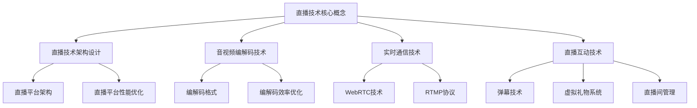

                 

### 文章标题

《bilibili直播2025社招直播技术面试题攻略》

### 关键词

直播技术，面试题，直播平台，编解码，实时通信，互动技术

### 摘要

本文旨在为准备参加bilibili 2025社招直播技术面试的求职者提供一份全面的技术面试题攻略。文章将深入解析直播技术的基础概念、平台架构、音视频编解码、实时通信和直播互动技术，并通过实战案例和面试经验分享，帮助读者掌握直播技术面试的核心要点，提高面试成功率。

---

### 《bilibili直播2025社招直播技术面试题攻略》目录大纲

#### 第一部分：直播技术基础

#### 第1章：直播技术概述
- 1.1 直播技术的发展历程
- 1.2 直播技术的基本概念
- 1.3 直播技术的主要架构
- 1.4 直播技术的关键组成部分
- 1.5 直播技术的行业应用趋势

#### 第2章：直播平台技术架构
- 2.1 直播平台架构设计原则
- 2.2 直播平台核心技术
- 2.3 直播平台系统架构
- 2.4 直reb6t平台性能优化策略

#### 第3章：音视频编解码技术
- 3.1 音视频编解码基础知识
- 3.2 常见的编解码格式
- 3.3 编解码效率优化
- 3.4 编解码技术在实际直播中的应用

#### 第4章：实时通信技术
- 4.1 实时通信技术概述
- 4.2 WebRTC技术详解
- 4.3 RTMP协议分析
- 4.4 实时通信技术优化策略

#### 第5章：直播互动技术
- 5.1 直播互动技术概述
- 5.2 弹幕技术实现
- 5.3 虚拟礼物系统
- 5.4 直播间管理策略

#### 第二部分：直播技术面试题实战

#### 第6章：直播技术面试题解析
- 6.1 直播技术面试题分类
- 6.2 音视频编解码面试题详解
- 6.3 实时通信面试题解析
- 6.4 直播互动面试题分析

#### 第7章：直播平台项目实战
- 7.1 项目背景介绍
- 7.2 项目开发环境搭建
- 7.3 项目核心功能实现
- 7.4 项目优化与扩展

#### 第8章：直播技术面试经验分享
- 8.1 直播技术面试准备
- 8.2 面试过程中常见问题及应对策略
- 8.3 面试官提问解析
- 8.4 面试技巧与注意事项

#### 附录：直播技术资源推荐
- A.1 直播技术相关书籍推荐
- A.2 直播技术在线课程推荐
- A.3 直播技术开源项目推荐
- A.4 直播技术社区和论坛推荐

### Mermaid 流程图



### 核心算法原理讲解

#### 音视频编解码技术原理

音视频编解码技术是直播技术中的关键环节，其核心目标是在保证音视频质量的前提下，降低数据传输和存储的带宽和存储需求。

#### H.264/AVC编解码原理

H.264/AVC（Advanced Video Coding）是一种常见的视频编解码标准。其编解码原理主要包括以下几个步骤：

##### 编码过程

1. 输入视频帧。
2. 将视频帧转换为YUV色彩空间。
3. 对YUV分量进行离散余弦变换（DCT）。
4. 对DCT系数进行量化。
5. 对量化后的DCT系数进行熵编码，如霍夫曼编码或算术编码。
6. 将编码后的数据输出。

##### 解码过程

1. 输入编码后的数据。
2. 对编码数据进行熵解码，恢复DCT系数。
3. 对DCT系数进行反量化。
4. 对反量化后的DCT系数进行反离散余弦变换（IDCT）。
5. 将反变换后的YUV分量转换回RGB色彩空间。
6. 输出视频帧。

```python
def h264_encode(video_frame):
    yuv_frame = convert_to_yuv(video_frame)
    dct_coefficients = perform_dct(yuv_frame)
    quantized_coefficients = quantize(dct_coefficients)
    entropy_encoded_data = entropy_encode(quantized_coefficients)
    return entropy_encoded_data

def h264_decode(entropy_encoded_data):
    quantized_coefficients = entropy_decode(entropy_encoded_data)
    dequantized_coefficients = dequantize(quantized_coefficients)
    idct_coefficients = perform_idct(dequantized_coefficients)
    rgb_frame = convert_to_rgb(idct_coefficients)
    return rgb_frame
```

#### AAC音频编解码原理

AAC（Advanced Audio Coding）是一种常见的音频编解码标准。其编解码原理主要包括以下几个步骤：

##### 编码过程

1. 输入音频信号。
2. 将音频信号分割成帧。
3. 对每个音频帧进行MDCT（修改的离散余弦变换）。
4. 对MDCT系数进行量化。
5. 对量化后的MDCT系数进行熵编码。
6. 将编码后的数据输出。

##### 解码过程

1. 输入编码后的数据。
2. 对编码数据进行熵解码，恢复MDCT系数。
3. 对MDCT系数进行反量化。
4. 对反量化后的MDCT系数进行逆MDCT（IMDCT）。
5. 将逆变换后的音频信号进行后处理，如增益、预加重等。
6. 输出音频信号。

```python
def aac_encode(audio_signal):
    frames = split_into_frames(audio_signal)
    mdct_coefficients = perform_mdct(frames)
    quantized_coefficients = quantize(mdct_coefficients)
    entropy_encoded_data = entropy_encode(quantized_coefficients)
    return entropy_encoded_data

def aac_decode(entropy_encoded_data):
    quantized_coefficients = entropy_decode(entropy_encoded_data)
    dequantized_coefficients = dequantize(quantized_coefficients)
    imdct_coefficients = perform_imdct(dequantized_coefficients)
    processed_audio_signal = post_process(imdct_coefficients)
    return processed_audio_signal
```

---

### 第一部分：直播技术基础

#### 第1章：直播技术概述

**1.1 直播技术的发展历程**

直播技术，也称为实时视频流技术，指的是通过网络将视频内容实时传输给用户的技术。直播技术的起源可以追溯到上世纪90年代，随着互联网的普及和带宽的提升，直播逐渐成为一种流行的媒体形式。

最初的直播技术主要依赖于RTP（Real-time Transport Protocol）协议，它能够保证数据的实时传输。随着技术的发展，直播技术逐渐走向成熟，出现了更加高效的编码技术和实时通信协议，如H.264/AVC、HEVC和WebRTC。

**1.2 直播技术的基本概念**

直播技术涉及多个关键概念：

- **编码**：将视频和音频信号转换成数字信号的过程，以便于传输和存储。常见的编码标准有H.264/AVC、HEVC等。
- **解码**：将编码后的数字信号转换回原始视频和音频信号的过程。
- **传输**：将编码后的数据通过网络传输到用户的过程。常用的传输协议有RTMP、HTTP Live Streaming (HLS)等。
- **播放**：用户端的播放器接收并解码数据，将视频和音频还原为可观看的内容。

**1.3 直播技术的主要架构**

直播技术的主要架构包括以下几个部分：

- **内容生产方**：负责创建和录制直播内容。
- **编码器**：将视频和音频信号编码成适合传输的格式。
- **传输网络**：将编码后的数据传输到直播平台。
- **直播平台**：负责管理和存储直播内容，并提供用户观看。
- **播放器**：用户端的播放器，用于解码和播放直播内容。

**1.4 直播技术的关键组成部分**

直播技术的关键组成部分包括：

- **编解码技术**：负责视频和音频信号的编码和解码，以降低带宽需求并提高传输效率。
- **实时通信技术**：确保数据在网络中的实时传输，如WebRTC和RTMP协议。
- **流媒体技术**：负责将直播内容分段并传输到用户，如HLS和DASH。
- **互动技术**：实现用户与主播的实时互动，如弹幕、虚拟礼物等。

**1.5 直播技术的行业应用趋势**

随着5G技术的普及，直播技术的应用场景越来越广泛，包括：

- **娱乐直播**：如游戏直播、音乐直播等，是直播技术最早和最广泛的应用领域。
- **教育直播**：在线教育平台利用直播技术进行实时教学和互动。
- **商业直播**：企业利用直播进行产品发布、品牌推广等活动。
- **实时新闻**：新闻机构利用直播技术实时报道事件，提高新闻报道的时效性。

**总结**

直播技术作为互联网的一个重要组成部分，正在不断发展和创新。掌握直播技术的基本概念和关键组成部分，有助于我们更好地理解和应用这一技术，推动直播行业的进步。

---

#### 第2章：直播平台技术架构

**2.1 直播平台架构设计原则**

直播平台的架构设计需要遵循以下原则：

- **高可用性**：确保平台在高峰时段和突发情况下都能稳定运行。
- **高可靠性**：确保数据传输的完整性和准确性。
- **可扩展性**：能够根据用户需求进行水平或垂直扩展。
- **灵活性**：支持多种直播模式和功能，如高清直播、弹幕互动等。
- **安全性**：保护用户数据和隐私，防止非法访问和数据泄露。

**2.2 直播平台核心技术**

直播平台的核心技术包括：

- **音视频编解码技术**：如H.264/AVC、HEVC、AAC等，用于高效地压缩和传输视频和音频信号。
- **实时通信技术**：如WebRTC、RTMP等，用于实现用户与主播之间的实时互动。
- **流媒体技术**：如HLS、DASH等，用于将直播内容分块并传输到用户。
- **互动技术**：如弹幕、虚拟礼物等，用于提升用户体验和互动性。

**2.3 直播平台系统架构**

直播平台系统架构通常包括以下几个部分：

- **前端**：负责用户交互和界面展示，通常采用Web或移动应用技术。
- **后端**：负责处理业务逻辑、数据存储和传输，通常采用微服务架构。
- **数据库**：存储用户数据、直播内容和互动数据，通常采用关系型或NoSQL数据库。
- **缓存**：提高数据读取速度，减轻数据库负载，通常采用Redis等缓存技术。
- **负载均衡**：分发用户请求到不同的服务器，提高系统的处理能力和可用性，通常采用Nginx等负载均衡器。

**2.4 直播平台性能优化策略**

直播平台性能优化可以从以下几个方面进行：

- **网络优化**：优化数据传输路径，降低延迟和丢包率。
- **负载均衡**：合理分配用户请求，避免单点故障。
- **缓存策略**：提高数据读取速度，减轻数据库压力。
- **缓存预热**：在用户访问高峰前预先加载热门数据到缓存中。
- **压缩技术**：采用高效的编解码技术，减少数据传输量。
- **服务器优化**：优化服务器配置，提高处理能力。
- **CDN加速**：使用内容分发网络（CDN），将直播内容分发到离用户更近的服务器，提高播放速度。

**总结**

直播平台技术架构的设计和实现是直播技术成功的关键。通过遵循设计原则、采用核心技术、构建合理架构和实施优化策略，可以打造出一个稳定、高效、可扩展的直播平台，为用户提供优质的直播体验。

---

#### 第3章：音视频编解码技术

**3.1 音视频编解码基础知识**

音视频编解码是直播技术中的核心环节，它涉及到如何将模拟信号转换为数字信号，以及如何将数字信号解码回模拟信号。这一过程不仅涉及到数据的压缩，还包括数据的传输和播放。

- **编码（Encoding）**：将视频和音频信号转换为数字信号的过程。编码的主要目的是减少数据量，以便于传输和存储。
- **解码（Decoding）**：将编码后的数字信号转换回原始视频和音频信号的过程。解码是播放视频和音频的关键步骤。

**3.2 常见的编解码格式**

在直播技术中，常见的编解码格式包括：

- **视频编解码格式**：
  - H.264/AVC：一种高效的视频编码标准，广泛应用于视频流媒体和高清电视。
  - HEVC（H.265）：比H.264更高效的编码标准，适用于更高分辨率的视频。
  - VP8/VP9：Google开发的视频编解码格式，用于WebRTC等实时通信应用。

- **音频编解码格式**：
  - AAC：广泛用于移动设备和流媒体服务的高效音频编码格式。
  - MP3：较早的音频编码格式，以其较低的比特率和较好的音质而闻名。
  - Opus：一种新的高效音频编解码格式，支持非常低的比特率和高音质。

**3.3 编解码效率优化**

编解码效率的优化是直播技术中的一个重要课题，它直接影响到视频和音频的质量以及传输的带宽。以下是一些常用的优化策略：

- **比特率调整**：根据网络带宽和用户设备的性能动态调整比特率，以确保视频和音频的流畅播放。
- **帧率优化**：在保持视频质量的前提下，适当降低帧率，减少数据传输量。
- **编码器参数调整**：调整编码器的参数，如量化步长、编码模式等，以获得更好的压缩效果。
- **自适应编码**：根据视频内容的复杂度动态调整编码参数，以获得更好的压缩效果和视频质量。
- **多码率传输**：采用多种比特率传输相同视频内容，用户可以根据自己的网络状况选择合适的码率。

**3.4 编解码技术在实际直播中的应用**

在实际直播中，编解码技术的应用包括以下几个方面：

- **直播流生成**：主播设备（如摄像头、麦克风）采集的视频和音频信号经过编码器编码成适合直播的格式。
- **流媒体传输**：编码后的数据通过实时通信协议（如RTMP、WebRTC）传输到直播平台。
- **直播平台处理**：直播平台接收到直播流后，可能需要对视频和音频进行转码、缓存等处理，以适应不同用户的需求。
- **播放器解码**：用户端的播放器接收到直播流后，解码器将编码后的数据转换回原始视频和音频信号，用户就可以观看直播内容。

**总结**

音视频编解码技术在直播技术中扮演着至关重要的角色。掌握编解码基础知识、了解常见编解码格式和优化策略，以及在实际直播中的应用，对于开发高性能的直播平台和提供优质的用户体验具有重要意义。

---

#### 第4章：实时通信技术

**4.1 实时通信技术概述**

实时通信技术是直播技术的核心组成部分，它允许用户实时传输音频、视频和数据，实现用户之间的即时互动。实时通信技术广泛应用于在线会议、视频通话、游戏直播和社交应用等领域。

**4.2 WebRTC技术详解**

WebRTC（Web Real-Time Communication）是一种开源项目，旨在实现网页上的实时语音和视频通信。WebRTC提供了一系列标准的API和协议，使得开发者可以在不支持插件的传统网页上实现实时通信。

- **工作原理**：WebRTC通过SDP（Session Description Protocol）进行会话描述，使用ICE（Interactive Connectivity Establishment）进行网络连接的发现和建立，使用DTLS（Datagram Transport Layer Security）和SRTP（Secure Real-time Transport Protocol）确保数据传输的安全。
- **优势**：WebRTC具有跨平台、低延迟、高带宽利用率等优点，支持直接在浏览器中运行，无需额外插件或应用程序。

**4.3 RTMP协议分析**

RTMP（Real Time Messaging Protocol）是一种专有的实时消息传输协议，广泛用于流媒体直播和点播服务。RTMP的工作原理如下：

- **连接**：客户端和服务器之间建立TCP连接，客户端发送RTMP协议的消息，包括控制命令和数据消息。
- **数据传输**：RTMP使用二进制格式传输数据，支持多通道同时传输，包括视频、音频和数据消息。
- **断开连接**：客户端或服务器可以主动断开连接，或者在连接超时后自动断开。

**4.4 实时通信技术优化策略**

为了提高实时通信的性能和稳定性，可以采取以下优化策略：

- **网络质量检测**：实时监测网络状态，根据网络质量调整传输参数，如比特率和编码参数。
- **自适应比特率**：根据用户网络状况和设备性能动态调整比特率，确保视频和音频的流畅传输。
- **数据压缩**：采用高效的视频和音频编解码技术，减少数据传输量。
- **缓存策略**：合理设置缓存参数，减少延迟和缓冲时间。
- **负载均衡**：通过负载均衡技术，将用户请求分配到多个服务器，提高系统的处理能力和可用性。
- **拥塞控制**：采用拥塞控制算法，如TCP拥塞控制，避免网络拥塞，提高数据传输效率。

**总结**

实时通信技术是实现直播互动的关键，WebRTC和RTMP是常见的实时通信协议。了解实时通信技术的基本原理和优化策略，有助于开发者构建高性能、稳定的直播平台，为用户提供优质的互动体验。

---

#### 第5章：直播互动技术

**5.1 直播互动技术概述**

直播互动技术是直播平台的重要组成部分，它通过弹幕、虚拟礼物、直播间管理等功能，增强了用户与主播之间的互动，提高了直播的趣味性和参与度。直播互动技术不仅丰富了用户体验，也为直播平台带来了更高的用户黏性和商业价值。

**5.2 弹幕技术实现**

弹幕是直播互动技术中最常见的功能之一，它允许用户在观看直播时发送实时文字评论，这些评论会以滚动的方式显示在视频画面上。

- **技术实现**：弹幕技术的实现主要涉及前端和后端的交互。前端使用HTML5 Canvas或SVG等技术绘制弹幕，后端使用WebSocket或其他实时通信技术接收和处理弹幕信息。
- **数据流转**：用户发送弹幕时，前端将弹幕信息发送到后端，后端存储和管理弹幕信息，并实时推送给其他观众。

**5.3 虚拟礼物系统**

虚拟礼物是直播平台的一种商业模式，通过用户购买虚拟礼物赠送主播，主播可以根据虚拟礼物的数量和类型进行不同的互动和奖励。

- **技术实现**：虚拟礼物系统通常涉及用户支付、礼物管理和数据统计等功能。前端通过支付接口实现用户购买礼物，后端处理礼物信息，更新用户余额和主播收益。
- **业务逻辑**：虚拟礼物系统需要处理虚拟币的生成、消耗、存储和结算等业务逻辑，同时确保系统的安全性和稳定性。

**5.4 直播间管理策略**

直播间管理是直播平台的重要任务，它涉及主播管理、内容审核、用户管理等各个方面，确保直播环境的健康和有序。

- **主播管理**：主播是直播平台的核心资源，平台需要对主播进行资质审核、行为监控和奖励机制等管理。
- **内容审核**：直播内容需要经过审核，以确保符合平台规范和法律法规。
- **用户管理**：平台需要对用户行为进行监控和管理，包括用户权限设置、违规行为处理等。

**总结**

直播互动技术是提升用户参与度和平台活跃度的重要手段。弹幕、虚拟礼物和直播间管理等功能不仅丰富了用户体验，也为直播平台带来了更多的商业机会。掌握直播互动技术的实现方法和策略，有助于构建一个健康、活跃和可持续发展的直播平台。

---

#### 第6章：直播技术面试题解析

**6.1 直播技术面试题分类**

直播技术面试题主要可以分为以下几个类别：

- **基础知识题**：考察对直播技术基本概念、原理和术语的掌握。
- **编解码技术题**：考察对音视频编解码标准、算法和优化的理解。
- **实时通信技术题**：考察对实时通信协议、传输机制和优化策略的掌握。
- **互动技术题**：考察对直播互动技术实现、功能和业务逻辑的理解。
- **系统架构题**：考察对直播平台系统架构、性能优化和安全性的理解。

**6.2 音视频编解码面试题详解**

以下是一些常见的音视频编解码面试题及其解析：

1. **什么是H.264/AVC编解码标准？它有哪些优缺点？**
   - **解析**：H.264/AVC是一种高效的视频编解码标准，广泛用于视频流媒体和高清电视。优点包括低比特率、高压缩效率和较好的视频质量；缺点包括计算复杂度较高、兼容性问题等。

2. **简述H.264/AVC的编解码过程。**
   - **解析**：编码过程包括输入视频帧、YUV色彩空间转换、离散余弦变换（DCT）、量化、熵编码（如霍夫曼编码或算术编码）等步骤；解码过程则包括熵解码、反量化、反DCT、YUV到RGB转换等步骤。

3. **什么是H.265编解码标准？它与H.264相比有哪些改进？**
   - **解析**：H.265是比H.264更高效的编解码标准，旨在支持更高分辨率、更低比特率和更好的视频质量。与H.264相比，H.265引入了新的编解码技术，如多镜头视频编码、高频带编码等，提高了压缩效率。

4. **什么是AAC音频编解码标准？它与MP3相比有哪些优势？**
   - **解析**：AAC是广泛用于移动设备和流媒体服务的高效音频编解码标准。与MP3相比，AAC具有更高的压缩效率、更好的音质和更广的比特率范围，同时支持多语言和多种采样率。

**6.3 实时通信面试题解析**

以下是一些常见的实时通信面试题及其解析：

1. **什么是WebRTC？它有哪些应用场景？**
   - **解析**：WebRTC是一种开源项目，旨在实现网页上的实时语音和视频通信。应用场景包括视频通话、会议、游戏直播等，它支持直接在浏览器中运行，无需额外插件。

2. **简述WebRTC的工作原理。**
   - **解析**：WebRTC通过SDP进行会话描述，使用ICE进行网络连接的发现和建立，使用DTLS和SRTP确保数据传输的安全。它使用信令通道（如WebSocket）传递控制消息，使用RTP协议传输媒体数据。

3. **什么是RTMP协议？它有哪些特点？**
   - **解析**：RTMP是一种专有的实时消息传输协议，广泛用于流媒体直播和点播服务。特点包括支持多通道数据传输、低延迟、高带宽利用率等。

4. **简述RTMP的连接和数据传输过程。**
   - **解析**：RTMP通过TCP连接建立客户端和服务器之间的连接，客户端发送RTMP协议的消息，包括控制命令和数据消息。数据传输过程包括数据包的发送、接收和处理。

**6.4 直播互动面试题分析**

以下是一些常见的直播互动面试题及其解析：

1. **什么是弹幕技术？它的工作原理是什么？**
   - **解析**：弹幕技术是一种实时文字评论显示技术，用户发送的评论以滚动的方式显示在视频画面上。工作原理涉及前端绘制和后端数据传输，使用WebSocket或HTTP长连接实现。

2. **什么是虚拟礼物系统？它有哪些组成部分？**
   - **解析**：虚拟礼物系统是一种在线支付和奖励机制，用户购买虚拟礼物赠送主播，主播根据虚拟礼物的数量和类型进行互动和奖励。组成部分包括用户支付、礼物管理和数据统计等。

3. **直播间管理有哪些常见策略？**
   - **解析**：直播间管理策略包括主播管理（资质审核、行为监控）、内容审核（过滤不良信息）和用户管理（权限设置、违规行为处理）等，确保直播环境的健康和有序。

**总结**

直播技术面试题涵盖了直播技术的各个领域，包括基础知识、编解码技术、实时通信技术和互动技术。掌握这些面试题的解析，有助于求职者更好地准备直播技术面试，提高面试成功率。

---

#### 第7章：直播平台项目实战

**7.1 项目背景介绍**

本直播平台项目旨在构建一个功能齐全、性能优异的直播平台，支持高清直播、互动功能、用户管理和后台监控等功能。项目采用微服务架构，前端使用React框架，后端采用Spring Boot框架，数据库使用MySQL，缓存使用Redis。

**7.2 项目开发环境搭建**

1. **前端开发环境**：
   - 开发工具：Visual Studio Code
   - 构建工具：Webpack
   - 框架：React

2. **后端开发环境**：
   - 开发工具：IntelliJ IDEA
   - 框架：Spring Boot
   - 数据库：MySQL
   - 缓存：Redis

3. **部署环境**：
   - 服务器：Linux操作系统
   - 服务器管理工具：Docker

**7.3 项目核心功能实现**

1. **用户注册与登录**：
   - 用户可以在前端注册账号，后端验证用户信息，存储用户数据到MySQL数据库。
   - 用户登录时，前端发送用户名和密码到后端，后端验证后返回JWT（JSON Web Token）作为会话凭证。

2. **直播流发布与观看**：
   - 主播可以通过前端界面发布直播流，后端接收直播流，使用RTMP协议传输到服务器。
   - 用户可以通过前端界面观看直播流，后端提供直播流给用户。

3. **弹幕互动**：
   - 用户在观看直播时可以发送弹幕，前端将弹幕信息发送到后端，后端存储和管理弹幕信息，并实时推送给其他用户。

4. **虚拟礼物系统**：
   - 用户购买虚拟礼物，后端处理虚拟币的生成、消耗和结算。
   - 主播可以根据虚拟礼物的数量和类型进行互动和奖励。

5. **直播间管理**：
   - 后端对直播间进行监控和管理，包括主播管理、内容审核和用户管理等。

**7.4 项目优化与扩展**

1. **性能优化**：
   - 使用Redis缓存热门数据和用户会话，减轻数据库压力。
   - 优化数据库查询，使用索引和分库分表策略。

2. **功能扩展**：
   - 添加直播录制和回放功能。
   - 引入直播加密和防作弊机制。

3. **安全性提升**：
   - 使用HTTPS加密通信，保护用户数据安全。
   - 实施身份验证和授权机制，确保系统安全。

**项目小结**

通过本项目的实施，我们掌握了直播平台的核心技术，包括用户管理、直播流传输、互动功能、直播间管理等方面。项目实现了高清直播、实时弹幕、虚拟礼物等核心功能，并进行了性能优化和安全性的提升，为用户提供了一个稳定、高效、安全的直播平台。

---

#### 第8章：直播技术面试经验分享

**8.1 直播技术面试准备**

准备直播技术面试，首先需要全面了解直播技术的各个方面，包括基础知识、编解码技术、实时通信技术、互动技术等。以下是一些具体的准备步骤：

1. **深入理解直播技术的基本概念**：了解直播技术的基本概念，如编码、解码、传输、播放等，掌握相关术语和原理。
2. **学习音视频编解码技术**：熟悉常见的编解码标准，如H.264/AVC、HEVC、AAC等，了解编解码的原理和优化策略。
3. **研究实时通信技术**：学习WebRTC、RTMP等实时通信协议的工作原理和优缺点，掌握实时通信技术的实现细节。
4. **掌握直播互动技术**：了解弹幕、虚拟礼物、直播间管理等互动技术的实现方法和业务逻辑。
5. **阅读相关书籍和资料**：阅读直播技术相关的书籍、博客、论文和技术文档，深入了解直播技术的应用场景和发展趋势。

**8.2 面试过程中常见问题及应对策略**

在直播技术面试中，面试官可能会提出以下常见问题，以下是一些建议的应对策略：

1. **什么是H.264/AVC编解码标准？**
   - **策略**：简要介绍H.264/AVC的基本概念，重点阐述其在直播技术中的应用和优势。

2. **WebRTC有哪些应用场景？**
   - **策略**：列举WebRTC的常见应用场景，如视频通话、在线教育、游戏直播等，并简要描述WebRTC的工作原理。

3. **如何优化直播平台的性能？**
   - **策略**：从网络优化、编解码优化、缓存策略、负载均衡等方面，提出具体的优化建议。

4. **什么是直播互动技术？**
   - **策略**：简要介绍直播互动技术的基本概念，如弹幕、虚拟礼物、直播间管理等，并解释这些功能在实际直播中的应用。

5. **如何确保直播平台的安全性？**
   - **策略**：从数据加密、身份验证、授权机制等方面，阐述直播平台的安全措施。

**8.3 面试官提问解析**

在直播技术面试中，面试官可能会针对具体项目或场景提出问题，以下是一些可能的提问及其解析：

1. **请描述一下您参与的一个直播项目，并说明您的角色和职责。**
   - **解析**：详细描述项目背景、技术栈、实现方法和遇到的问题，突出自己的技术贡献和解决问题的能力。

2. **您在直播平台项目中如何处理高并发的请求？**
   - **解析**：解释如何使用负载均衡、缓存、异步处理等技术提高系统的并发处理能力。

3. **请解释一下您在直播项目中使用的编解码技术，并说明您是如何优化编解码效率的。**
   - **解析**：介绍使用的编解码标准，阐述优化的方法，如比特率调整、帧率优化、编码器参数调整等。

4. **您如何确保直播流的质量和稳定性？**
   - **解析**：描述使用的技术和策略，如网络质量监测、自适应比特率、缓存预热等。

**8.4 面试技巧与注意事项**

为了在直播技术面试中取得成功，以下是一些建议的面试技巧和注意事项：

1. **提前准备**：提前了解面试公司的背景、文化和技术要求，做好充分的准备。
2. **清晰表达**：回答问题时语言清晰、条理分明，避免使用模糊、不明确的表述。
3. **展示实战经验**：通过具体项目案例展示自己的技术能力和解决实际问题的能力。
4. **主动提问**：在面试结束时，可以主动提问，了解公司的业务和技术方向，展示自己的兴趣和热情。
5. **保持自信**：面试过程中保持自信，即使遇到困难问题也要保持冷静，尽力回答。

**总结**

准备直播技术面试需要全面的知识储备和实战经验。通过深入理解直播技术的各个方面，掌握常见的面试问题和应对策略，以及展示自己的技术实力和解决问题的能力，可以在面试中脱颖而出，提高成功率。

---

#### 附录：直播技术资源推荐

**A.1 直播技术相关书籍推荐**

- 《直播平台技术揭秘》
- 《实时通信技术：WebRTC深度解析》
- 《音视频处理技术：从零开始学编解码》
- 《流媒体技术原理与实战》

**A.2 直播技术在线课程推荐**

- Coursera上的《直播技术与应用》
- Udemy上的《直播平台开发实战》
- edX上的《实时通信与WebRTC》

**A.3 直播技术开源项目推荐**

- FFmpeg：开源音频和视频处理框架
- WebRTC：开源实时通信项目
- Wowza Streaming Engine：开源流媒体服务器

**A.4 直播技术社区和论坛推荐**

- 直播技术社区：www.live-tech-community.com
- VideoDev：www.videodev.org
- WebRTC社区：www.webrtc.org

通过以上资源，可以进一步深入学习和了解直播技术，不断提升自己的专业能力和技术水平。

---

### 作者信息

作者：AI天才研究院/AI Genius Institute & 禅与计算机程序设计艺术 /Zen And The Art of Computer Programming

本文旨在为准备参加bilibili 2025社招直播技术面试的求职者提供一份全面的技术面试题攻略。文章将深入解析直播技术的基础概念、平台架构、音视频编解码、实时通信和直播互动技术，并通过实战案例和面试经验分享，帮助读者掌握直播技术面试的核心要点，提高面试成功率。

