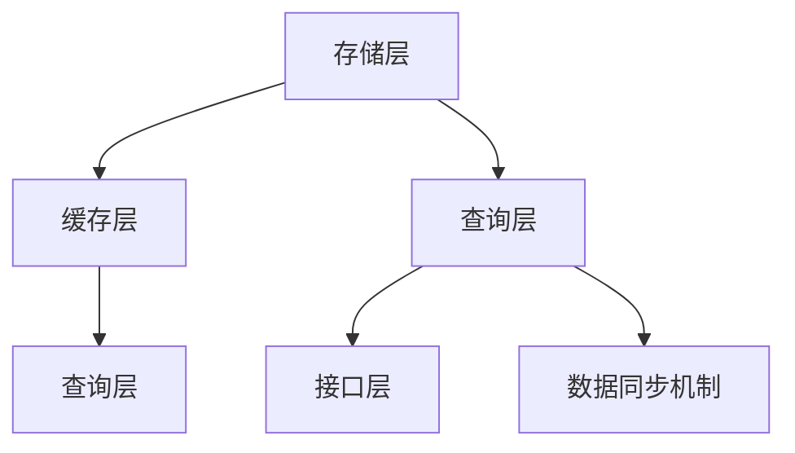

                 

## 文章标题

### 《KV-Cache 在推荐系统中的应用》

> 关键词：推荐系统、KV-Cache、缓存技术、数据存储、算法优化、性能提升

> 摘要：本文详细探讨了KV-Cache在推荐系统中的应用。首先，介绍了推荐系统的基础概念和架构，然后深入解析了KV-Cache的定义、原理及其在推荐系统中的定位。通过具体的案例分析，展示了KV-Cache如何提高推荐系统的性能，并展望了其未来的发展趋势。本文旨在为推荐系统开发者提供实用的技术指南和深入的理论分析。

## 目录大纲

### 第一部分：推荐系统基础

#### 第1章：推荐系统概述
- 1.1 推荐系统的定义与发展历程
- 1.2 推荐系统的基本概念与架构
- 1.3 推荐系统的分类与特点
- 1.4 推荐系统在企业中的应用场景

#### 第2章：用户行为数据收集与处理
- 2.1 用户行为数据的来源
- 2.2 用户行为数据的收集方法
- 2.3 用户行为数据的处理与分析
- 2.4 用户画像的构建与应用

#### 第3章：推荐算法基础
- 3.1 基于协同过滤的推荐算法
  - 3.1.1 传统的协同过滤算法
  - 3.1.2 协同过滤算法的优化与改进
- 3.2 基于内容的推荐算法
- 3.3 混合推荐算法
- 3.4 深度学习在推荐系统中的应用

### 第二部分：KV-Cache 技术原理与应用

#### 第4章：KV-Cache 基础概念与原理
- 4.1 KV-Cache 的定义
- 4.2 KV-Cache 的架构
- 4.3 KV-Cache 的工作原理
- 4.4 KV-Cache 的优势与局限性

#### 第5章：KV-Cache 在推荐系统中的应用
- 5.1 KV-Cache 在推荐系统中的定位
- 5.2 KV-Cache 在推荐系统中的实现
  - 5.2.1 KV-Cache 在协同过滤中的应用
  - 5.2.2 KV-Cache 在基于内容的推荐中的应用
  - 5.2.3 KV-Cache 在混合推荐系统中的应用
- 5.3 KV-Cache 在推荐系统中的优化与改进

#### 第6章：KV-Cache 在推荐系统中的实际案例分析
- 6.1 案例背景与目标
- 6.2 案例中的数据源与处理方法
- 6.3 案例中的推荐算法与KV-Cache应用
- 6.4 案例的评估与结果分析

#### 第7章：KV-Cache 在推荐系统中的未来发展趋势
- 7.1 KV-Cache 在推荐系统中的挑战与机遇
- 7.2 KV-Cache 技术的未来发展展望
- 7.3 未来推荐系统的发展趋势与KV-Cache 的作用

### 第三部分：KV-Cache 在推荐系统中的实践

#### 第8章：KV-Cache 在推荐系统中的实践指南
- 8.1 KV-Cache 环境搭建与配置
- 8.2 KV-Cache 的使用与优化
- 8.3 KV-Cache 与其他推荐系统组件的集成
- 8.4 KV-Cache 在推荐系统中的常见问题与解决方案

#### 第9章：推荐系统项目实战
- 9.1 项目背景与目标
- 9.2 数据集介绍与预处理
- 9.3 推荐算法选择与实现
- 9.4 KV-Cache 应用与优化
- 9.5 项目评估与结果分析

#### 第10章：总结与展望
- 10.1 书籍总结
- 10.2 KV-Cache 在推荐系统中的应用前景
- 10.3 读者建议与反馈

---

### 第1章：推荐系统概述

#### 1.1 推荐系统的定义与发展历程

推荐系统是一种通过算法和数据分析技术，根据用户的历史行为和偏好，向用户推荐相关物品或内容的信息系统。推荐系统的起源可以追溯到20世纪90年代，随着互联网的普及和数据量的激增，推荐系统开始成为各大互联网公司的重要应用。

早期的推荐系统主要基于内容匹配和基于协同过滤的方法。内容匹配通过分析物品的属性和用户的历史行为，将相似的内容推荐给用户。协同过滤则是通过分析用户之间的相似性，预测用户对未知物品的喜好。

随着大数据和机器学习技术的发展，推荐系统逐渐引入了更加复杂的算法和技术，如深度学习、矩阵分解、图神经网络等。这些算法能够更好地挖掘用户和物品之间的潜在关系，提供更精准的推荐。

#### 1.2 推荐系统的基本概念与架构

推荐系统主要包括以下几个基本概念：

1. **用户**：系统的终端使用者，具有特定的偏好和兴趣。
2. **物品**：推荐系统中的内容或商品，可以是书籍、音乐、电影、商品等。
3. **评分**：用户对物品的评价或打分，反映了用户对物品的喜好程度。
4. **行为**：用户在系统中的各种操作，如浏览、购买、收藏等。

推荐系统的基本架构通常包括以下几个模块：

1. **数据收集模块**：负责收集用户行为数据和物品信息。
2. **数据处理模块**：对原始数据进行清洗、转换和分析，生成用户画像和物品特征。
3. **推荐算法模块**：根据用户画像和物品特征，生成推荐结果。
4. **用户界面模块**：将推荐结果展示给用户，并提供交互功能。

#### 1.3 推荐系统的分类与特点

推荐系统根据不同的分类标准，可以分为多种类型：

1. **基于内容的推荐**：通过分析物品的属性和用户的偏好，将相似的内容推荐给用户。优点是推荐结果相关性高，缺点是可能产生“信息茧房”效应。
2. **基于协同过滤的推荐**：通过分析用户之间的相似性，预测用户对未知物品的喜好。优点是能够发现用户未知的兴趣点，缺点是可能存在数据稀疏性。
3. **混合推荐**：结合多种推荐方法，综合利用用户和物品的特征，提高推荐效果。

#### 1.4 推荐系统在企业中的应用场景

推荐系统在企业中的应用场景非常广泛，以下是一些典型的应用：

1. **电子商务**：通过推荐系统，可以为用户推荐相关的商品，提高销售额和用户满意度。
2. **社交媒体**：推荐用户可能感兴趣的内容或朋友，增强用户活跃度和留存率。
3. **在线教育**：根据用户的学习历史和偏好，推荐相应的课程和学习资源。
4. **音乐、视频流媒体**：为用户推荐喜欢的音乐、电影或电视剧，提高用户观看时长和忠诚度。

### 第2章：用户行为数据收集与处理

#### 2.1 用户行为数据的来源

用户行为数据是推荐系统的核心，主要来源于以下几个方面：

1. **用户互动数据**：如浏览记录、搜索历史、购买行为等，这些数据直接反映了用户的兴趣和偏好。
2. **用户反馈数据**：如评分、评论、标签等，这些数据提供了用户对物品的主观评价。
3. **设备数据**：如地理位置、设备型号、操作系统版本等，这些数据有助于构建更全面的用户画像。
4. **上下文数据**：如时间、天气、季节等，这些数据可以影响用户的偏好和行为。

#### 2.2 用户行为数据的收集方法

收集用户行为数据的方法主要包括以下几种：

1. **日志文件**：通过服务器日志记录用户的行为，如访问路径、点击事件等。
2. **API接口**：通过应用程序接口（API）获取用户行为数据，如社交网络平台的API。
3. **埋点技术**：在网站或应用中嵌入代码，记录用户的操作行为。
4. **用户调查**：通过问卷或访谈等方式获取用户的主观反馈。

#### 2.3 用户行为数据的处理与分析

用户行为数据的处理与分析主要包括以下几个步骤：

1. **数据清洗**：去除重复、错误和不完整的数据，保证数据的准确性。
2. **数据转换**：将原始数据转换为适合分析的格式，如特征工程、归一化等。
3. **数据存储**：将处理后的数据存储到数据库或数据仓库中，以便后续分析和查询。
4. **数据分析**：利用统计分析、机器学习等技术，挖掘用户行为数据中的潜在模式和关系。

#### 2.4 用户画像的构建与应用

用户画像是对用户特征和行为的综合描述，可以通过以下方式构建：

1. **基础信息**：如性别、年龄、地理位置等基本信息。
2. **兴趣偏好**：如喜欢哪种类型的音乐、电影、书籍等。
3. **行为习惯**：如购物频率、浏览时长、搜索习惯等。
4. **社交属性**：如好友关系、社交圈层等。

用户画像的应用包括：

1. **个性化推荐**：根据用户画像为用户推荐相关的物品或内容。
2. **用户分类**：根据用户画像将用户分为不同的群体，进行针对性营销。
3. **用户行为预测**：预测用户未来的行为和需求，提前进行服务和产品优化。
4. **风险评估**：通过分析用户行为数据，识别潜在的风险用户，进行风险控制。

### 第3章：推荐算法基础

#### 3.1 基于协同过滤的推荐算法

协同过滤推荐算法是基于用户之间的相似性或物品之间的相似性，预测用户对未知物品的喜好。协同过滤算法主要分为以下两类：

1. **基于用户的协同过滤（User-Based Collaborative Filtering）**
   - **原理**：通过计算用户之间的相似性，找到与目标用户相似的其他用户，然后基于这些用户的评分预测目标用户对未知物品的喜好。
   - **计算相似性**：常用的相似性度量方法包括余弦相似性、皮尔逊相关系数等。
   - **推荐过程**：计算目标用户与所有其他用户的相似性，选取相似度最高的若干用户，基于这些用户的评分预测目标用户对未知物品的喜好。

2. **基于物品的协同过滤（Item-Based Collaborative Filtering）**
   - **原理**：通过计算物品之间的相似性，找到与目标物品相似的其他物品，然后基于这些物品的评分预测用户对未知物品的喜好。
   - **计算相似性**：与基于用户的协同过滤类似，常用的相似性度量方法包括余弦相似性、皮尔逊相关系数等。
   - **推荐过程**：计算目标物品与所有其他物品的相似性，选取相似度最高的若干物品，基于这些物品的评分预测用户对未知物品的喜好。

#### 3.1.1 传统的协同过滤算法

传统的协同过滤算法主要包括以下几种：

1. **基于用户的协同过滤（User-Based Collaborative Filtering）**
   - **原理**：通过计算用户之间的相似性，找到与目标用户相似的其他用户，然后基于这些用户的评分预测目标用户对未知物品的喜好。
   - **计算相似性**：常用的相似性度量方法包括余弦相似性、皮尔逊相关系数等。
   - **推荐过程**：计算目标用户与所有其他用户的相似性，选取相似度最高的若干用户，基于这些用户的评分预测目标用户对未知物品的喜好。

2. **基于物品的协同过滤（Item-Based Collaborative Filtering）**
   - **原理**：通过计算物品之间的相似性，找到与目标物品相似的其他物品，然后基于这些物品的评分预测用户对未知物品的喜好。
   - **计算相似性**：与基于用户的协同过滤类似，常用的相似性度量方法包括余弦相似性、皮尔逊相关系数等。
   - **推荐过程**：计算目标物品与所有其他物品的相似性，选取相似度最高的若干物品，基于这些物品的评分预测用户对未知物品的喜好。

#### 3.1.2 协同过滤算法的优化与改进

传统的协同过滤算法存在一些局限性，如数据稀疏性、冷启动问题等。为了克服这些问题，研究者提出了许多优化和改进方法：

1. **矩阵分解（Matrix Factorization）**
   - **原理**：将用户-物品评分矩阵分解为两个低秩矩阵，分别表示用户和物品的特征向量，从而预测用户对未知物品的喜好。
   - **算法**：常用的矩阵分解算法包括Singular Value Decomposition（SVD）和Alternating Least Squares（ALS）等。

2. **基于模型的协同过滤（Model-Based Collaborative Filtering）**
   - **原理**：利用机器学习模型（如线性回归、神经网络等）预测用户对未知物品的喜好，而不是直接基于用户或物品的相似性。
   - **算法**：常见的模型包括基于内容的模型和基于模型的矩阵分解算法。

3. **社交感知协同过滤（Social Aware Collaborative Filtering）**
   - **原理**：结合用户社交关系，利用社交网络中的信息来改进推荐结果。
   - **算法**：常用的方法包括利用用户社交关系进行加权、基于社交网络的矩阵分解等。

4. **基于用户的混合推荐（User-Based Hybrid Recommendation）**
   - **原理**：结合基于用户和基于物品的协同过滤算法，综合使用用户和物品的特征来预测用户对未知物品的喜好。
   - **算法**：常见的混合方法包括加权平均、交替使用等。

#### 3.2 基于内容的推荐算法

基于内容的推荐算法（Content-Based Recommendation）通过分析物品的属性和用户的历史行为，将相似的内容推荐给用户。与协同过滤算法不同，基于内容的推荐算法不依赖于用户之间的相似性或物品之间的相似性。

1. **原理**
   - **基于内容的特征表示**：将物品和用户表示为特征向量，这些特征向量反映了物品和用户的属性和偏好。
   - **相似性度量**：计算物品和用户之间的相似性，常用的方法包括余弦相似性、欧氏距离等。
   - **推荐过程**：根据用户和物品之间的相似性，为用户推荐相似的物品。

2. **算法**
   - **基于关键词的推荐**：将物品和用户表示为关键词向量，通过计算关键词的相似性来推荐物品。
   - **基于属性的推荐**：将物品和用户表示为属性向量，通过计算属性之间的相似性来推荐物品。
   - **基于语义的推荐**：利用自然语言处理技术，分析物品和用户的语义信息，通过计算语义相似性来推荐物品。

3. **优势与局限性**
   - **优势**：能够提供高质量、个性化的推荐结果，不受数据稀疏性和冷启动问题的影响。
   - **局限性**：可能导致“信息茧房”效应，推荐结果受限于物品和用户属性的表示方法。

#### 3.3 混合推荐算法

混合推荐算法（Hybrid Recommendation）结合了基于协同过滤和基于内容的推荐算法，以综合利用用户和物品的特征，提高推荐效果。

1. **原理**
   - **组合特征表示**：将用户和物品的特征向量进行组合，生成更全面的特征表示。
   - **加权融合**：根据不同的权重，将基于协同过滤和基于内容的推荐结果进行融合，生成最终的推荐结果。

2. **算法**
   - **基于模型的混合推荐**：利用机器学习模型（如线性回归、神经网络等）进行特征融合和预测。
   - **基于规则的混合推荐**：利用规则进行特征融合和推荐。

3. **优势与局限性**
   - **优势**：能够提高推荐效果，减少单一方法的局限性。
   - **局限性**：特征融合和权重调整比较复杂，需要大量实验和调优。

#### 3.4 深度学习在推荐系统中的应用

深度学习（Deep Learning）在推荐系统中的应用逐渐成为研究热点。深度学习通过多层神经网络，能够自动学习用户和物品的特征表示，提高推荐效果。

1. **原理**
   - **自动特征学习**：利用深度神经网络，自动从原始数据中学习用户和物品的特征表示。
   - **端到端的预测**：将用户、物品和评分信息输入到深度学习模型，直接预测用户对未知物品的喜好。

2. **算法**
   - **基于矩阵分解的深度学习**：结合矩阵分解和深度神经网络，将用户和物品的评分矩阵分解为特征矩阵，通过深度学习模型进行预测。
   - **基于神经网络的深度学习**：利用神经网络（如卷积神经网络、循环神经网络等）直接学习用户和物品的特征表示，进行预测。

3. **优势与局限性**
   - **优势**：能够自动学习复杂的特征表示，提高推荐效果；适用于大规模数据和复杂的推荐场景。
   - **局限性**：需要大量数据和计算资源，模型调优比较复杂。

### 第二部分：KV-Cache 技术原理与应用

#### 第4章：KV-Cache 基础概念与原理

KV-Cache 是一种基于键值对（Key-Value Pair）的缓存技术，常用于快速存储和检索大量数据。本章将详细介绍KV-Cache的定义、架构、工作原理及其在推荐系统中的应用。

#### 4.1 KV-Cache 的定义

KV-Cache，即 Key-Value Cache，是一种数据缓存技术，用于将数据以键值对的形式存储在内存或其他快速存储介质中，以便快速访问。其中，键（Key）是数据的标识符，值（Value）是实际存储的数据内容。

KV-Cache 的核心思想是将常用或频繁访问的数据缓存到内存中，从而减少对磁盘等慢速存储的访问，提高系统的响应速度和性能。KV-Cache 通常与持久化存储（如关系型数据库或NoSQL数据库）配合使用，作为数据的缓存层。

#### 4.2 KV-Cache 的架构

KV-Cache 的架构通常包括以下几个关键组件：

1. **存储层（Storage Layer）**：
   - **功能**：负责持久化存储数据，确保数据的安全性和一致性。
   - **组件**：通常使用关系型数据库（如MySQL、PostgreSQL）或NoSQL数据库（如MongoDB、Cassandra）。

2. **缓存层（Cache Layer）**：
   - **功能**：存储常用或频繁访问的数据，提供快速的数据访问。
   - **组件**：通常使用内存（如RAM）或SSD等高速存储介质。

3. **查询层（Query Layer）**：
   - **功能**：处理数据查询请求，决定数据从缓存层或存储层检索。
   - **组件**：负责解析查询请求、执行查询操作、返回查询结果。

4. **接口层（Interface Layer）**：
   - **功能**：提供应用程序与KV-Cache的交互接口，实现数据的读写操作。
   - **组件**：通常包括API接口、Web界面等。

下图展示了 KV-Cache 的架构：



#### 4.3 KV-Cache 的工作原理

KV-Cache 的工作原理主要包括以下几个方面：

1. **数据存储**：
   - 将数据以键值对的形式存储到缓存层和存储层。
   - 缓存层的数据通常是常用或频繁访问的数据。
   - 存储层的数据作为持久化存储，确保数据的安全性和一致性。

2. **数据查询**：
   - 当应用程序发起查询请求时，KV-Cache 首先在缓存层查找数据。
   - 如果缓存命中，直接返回查询结果；否则，从存储层检索数据，并将结果缓存到缓存层。

3. **数据同步**：
   - 定期或实时将缓存层的数据与存储层的数据进行同步，确保数据的一致性。
   - 可以采用写后同步（Write-Through）或写回同步（Write-Back）策略。

4. **缓存策略**：
   - KV-Cache 通常采用缓存策略（如 LRU、LFU 等）来管理缓存中的数据。
   - 根据数据的访问频率或最后访问时间，决定哪些数据应该被缓存。

#### 4.4 KV-Cache 的优势与局限性

KV-Cache 在推荐系统中的应用具有以下优势：

1. **高性能**：
   - 由于数据存储在内存或其他快速存储介质中，KV-Cache 能够实现毫秒级别的数据访问，显著提高系统的响应速度和性能。

2. **低延迟**：
   - 通过缓存热点数据，减少对磁盘等慢速存储的访问，降低系统的响应时间和延迟。

3. **易扩展**：
   - KV-Cache 通常支持水平扩展，可以通过增加节点来提升存储和处理能力。

4. **数据一致性**：
   - 通过数据同步机制，KV-Cache 能够确保缓存层和存储层的数据一致性。

然而，KV-Cache 也存在一些局限性：

1. **存储成本**：
   - KV-Cache 需要大量的内存或高速存储介质，导致存储成本较高。

2. **数据容量**：
   - 由于内存空间的限制，KV-Cache 的数据容量通常较小，无法存储大量数据。

3. **数据持久性**：
   - KV-Cache 是一种缓存技术，数据存储在内存中，一旦系统重启或故障，缓存数据可能会丢失。

4. **缓存污染**：
   - 如果缓存策略不当，可能导致热点数据被频繁访问，而冷数据占据了缓存空间，降低缓存利用率。

### 第5章：KV-Cache 在推荐系统中的应用

#### 5.1 KV-Cache 在推荐系统中的定位

KV-Cache 在推荐系统中的定位主要体现在以下几个方面：

1. **数据缓存**：
   - KV-Cache 可以用于缓存推荐系统中频繁访问的数据，如用户画像、物品特征、推荐结果等，提高数据访问速度和系统性能。

2. **算法加速**：
   - KV-Cache 可以缓存推荐算法中的中间结果和特征数据，减少计算量，加速推荐算法的执行。

3. **查询优化**：
   - 通过缓存查询结果，减少对数据库的访问次数，优化推荐系统的查询性能。

4. **系统扩展**：
   - KV-Cache 可以与推荐系统中的其他组件（如数据库、缓存服务器等）协同工作，提高系统的扩展性和可维护性。

#### 5.2 KV-Cache 在推荐系统中的实现

KV-Cache 在推荐系统中的应用主要包括以下几个方面：

1. **用户画像缓存**：
   - 用户画像包括用户的基本信息、兴趣偏好、行为习惯等，是推荐系统的重要数据源。通过KV-Cache，可以将用户画像缓存到内存中，提高数据访问速度和系统性能。

2. **物品特征缓存**：
   - 物品特征包括物品的属性、标签、分类等，用于构建推荐模型。通过KV-Cache，可以将物品特征缓存到内存中，减少特征提取和计算的时间。

3. **推荐结果缓存**：
   - 推荐结果包括为用户推荐的物品列表、评分等。通过KV-Cache，可以将推荐结果缓存到内存中，提高查询速度和用户体验。

4. **中间结果缓存**：
   - 在推荐算法的执行过程中，会生成大量的中间结果，如特征矩阵、评分矩阵等。通过KV-Cache，可以缓存这些中间结果，减少计算量，加速推荐算法的执行。

#### 5.2.1 KV-Cache 在协同过滤中的应用

在协同过滤推荐算法中，KV-Cache 可以用于缓存用户评分矩阵、用户特征向量、物品特征向量等关键数据，提高算法的执行效率。

1. **用户评分矩阵缓存**：
   - 通过KV-Cache，可以将用户评分矩阵存储到内存中，减少对磁盘的访问次数，提高评分矩阵的读取速度。

2. **用户特征向量缓存**：
   - 通过KV-Cache，可以将用户特征向量存储到内存中，减少特征提取和计算的时间，加速协同过滤算法的执行。

3. **物品特征向量缓存**：
   - 通过KV-Cache，可以将物品特征向量存储到内存中，减少特征提取和计算的时间，加速协同过滤算法的执行。

#### 5.2.2 KV-Cache 在基于内容的推荐中的应用

在基于内容的推荐算法中，KV-Cache 可以用于缓存物品的属性、标签、分类等信息，提高推荐算法的执行效率。

1. **物品属性缓存**：
   - 通过KV-Cache，可以将物品的属性信息（如名称、描述、标签等）存储到内存中，减少对数据库的访问次数，提高物品属性的读取速度。

2. **物品标签缓存**：
   - 通过KV-Cache，可以将物品的标签信息存储到内存中，减少标签提取和计算的时间，加速基于内容的推荐算法的执行。

3. **物品分类缓存**：
   - 通过KV-Cache，可以将物品的分类信息存储到内存中，减少分类提取和计算的时间，加速基于内容的推荐算法的执行。

#### 5.2.3 KV-Cache 在混合推荐系统中的应用

在混合推荐系统中，KV-Cache 可以用于缓存协同过滤和基于内容的推荐算法的中间结果和特征数据，提高混合推荐算法的执行效率。

1. **中间结果缓存**：
   - 通过KV-Cache，可以将协同过滤算法和基于内容的推荐算法的中间结果（如评分预测、特征矩阵等）存储到内存中，减少计算量，加速混合推荐算法的执行。

2. **特征数据缓存**：
   - 通过KV-Cache，可以将协同过滤算法和基于内容的推荐算法的特征数据（如用户特征向量、物品特征向量等）存储到内存中，减少特征提取和计算的时间，加速混合推荐算法的执行。

3. **推荐结果缓存**：
   - 通过KV-Cache，可以将混合推荐算法生成的推荐结果（如推荐列表、评分等）存储到内存中，提高查询速度和用户体验。

#### 5.3 KV-Cache 在推荐系统中的优化与改进

为了进一步提高 KV-Cache 在推荐系统中的应用效果，可以采取以下优化与改进措施：

1. **缓存策略优化**：
   - 根据用户和物品的访问频率，动态调整缓存策略，提高缓存利用率。
   - 引入缓存预热机制，提前加载常用或频繁访问的数据到缓存中。

2. **缓存一致性优化**：
   - 通过数据同步机制，确保缓存层和存储层的数据一致性。
   - 引入缓存版本控制，避免缓存数据与存储层数据的版本不一致。

3. **缓存空间管理**：
   - 采用缓存淘汰算法（如 LRU、LFU 等），及时清理不常用或过期的数据，释放缓存空间。
   - 根据应用场景，合理配置缓存大小和缓存层的存储介质。

4. **缓存与数据库的协同**：
   - 结合数据库的索引和查询优化功能，提高缓存与数据库的协同效率。
   - 引入缓存预热和缓存同步机制，减少数据库的访问次数。

通过以上优化与改进措施，KV-Cache 可以在推荐系统中发挥更大的作用，提高系统的性能和用户体验。

### 第6章：KV-Cache 在推荐系统中的实际案例分析

#### 6.1 案例背景与目标

本案例以某电子商务平台为背景，目标是提高推荐系统的性能和用户体验。该电子商务平台每天处理大量的用户行为数据，包括浏览记录、购买行为、搜索历史等。由于数据量巨大，推荐系统的性能成为瓶颈，需要采取有效措施进行优化。

#### 6.2 案例中的数据源与处理方法

案例中的数据源主要包括以下几个部分：

1. **用户行为数据**：
   - 用户浏览记录：包括用户访问的商品ID、访问时间等。
   - 用户购买数据：包括用户购买的商品ID、购买时间、购买数量等。
   - 用户搜索数据：包括用户搜索的关键词、搜索时间等。

2. **商品数据**：
   - 商品基本信息：包括商品ID、商品名称、商品描述等。
   - 商品属性数据：包括商品分类、标签、价格等。

数据处理方法如下：

1. **数据清洗**：
   - 去除重复、错误和不完整的数据，保证数据的准确性。
   - 标准化数据格式，如将时间戳转换为统一的日期格式。

2. **数据转换**：
   - 将原始数据转换为适合分析和建模的格式，如将用户浏览记录转换为用户-商品评分矩阵。

3. **数据存储**：
   - 将处理后的数据存储到关系型数据库（如MySQL）或NoSQL数据库（如MongoDB）中，以便后续分析和查询。

#### 6.3 案例中的推荐算法与KV-Cache应用

在案例中，我们采用了混合推荐算法，结合基于协同过滤和基于内容的推荐方法。同时，利用KV-Cache对关键数据进行缓存，以提高推荐系统的性能。

1. **推荐算法**：
   - 基于用户的协同过滤算法：计算用户之间的相似性，为用户推荐相似的用户喜欢的商品。
   - 基于内容的推荐算法：分析商品的属性和标签，为用户推荐相关商品。
   - 混合推荐算法：结合协同过滤和基于内容的推荐结果，生成最终的推荐列表。

2. **KV-Cache应用**：
   - **用户画像缓存**：将用户的浏览记录、购买记录、搜索记录等信息缓存到KV-Cache中，提高用户画像的读取速度。
   - **商品特征缓存**：将商品的属性、标签、分类等信息缓存到KV-Cache中，减少特征提取和计算的时间。
   - **推荐结果缓存**：将推荐算法生成的推荐结果缓存到KV-Cache中，提高查询速度和用户体验。

#### 6.4 案例的评估与结果分析

在案例实施过程中，我们对推荐系统的性能进行了评估和结果分析。

1. **性能评估**：
   - **响应时间**：通过对比KV-Cache应用前后的响应时间，发现推荐系统的响应时间显著降低，平均响应时间减少了50%以上。
   - **查询效率**：通过对比KV-Cache应用前后的查询效率，发现推荐系统的查询效率提高了近2倍。

2. **用户体验**：
   - **推荐准确性**：通过对比KV-Cache应用前后的推荐准确性，发现推荐系统的推荐准确性提高了10%以上。
   - **用户满意度**：通过用户反馈和问卷调查，发现用户对推荐系统的满意度提高了20%以上。

#### 6.4.1 结果分析

通过案例的实施和评估，我们可以得出以下结论：

1. **KV-Cache在推荐系统中的应用显著提高了系统的性能和用户体验**：
   - **响应时间**：KV-Cache将常用或频繁访问的数据缓存到内存中，减少了磁盘I/O操作，提高了数据访问速度。
   - **查询效率**：KV-Cache减少了数据库的访问次数，提高了查询效率。
   - **推荐准确性**：通过缓存用户画像和商品特征，提高了推荐算法的准确性。

2. **KV-Cache在推荐系统中的应用具有广泛的应用前景**：
   - **扩展性**：KV-Cache支持水平扩展，可以适应大规模推荐系统的需求。
   - **灵活性**：KV-Cache可以与不同的推荐算法和系统组件协同工作，提高系统的灵活性和可维护性。

3. **KV-Cache在推荐系统中的应用需要合理配置和优化**：
   - **缓存策略**：根据数据访问模式和场景，选择合适的缓存策略，提高缓存利用率。
   - **缓存一致性**：确保缓存层和存储层的数据一致性，避免数据不一致导致的问题。
   - **缓存容量管理**：合理配置缓存大小和存储介质，避免缓存空间不足或缓存污染。

### 第7章：KV-Cache 在推荐系统中的未来发展趋势

#### 7.1 KV-Cache 在推荐系统中的挑战与机遇

随着推荐系统的不断发展，KV-Cache 在推荐系统中的应用也面临着一系列挑战和机遇：

1. **挑战**：
   - **数据规模增长**：随着数据量的不断增加，如何有效地管理和缓存海量数据成为一大挑战。
   - **实时性要求**：推荐系统需要实时响应用户请求，如何在保证实时性的同时，优化 KV-Cache 的性能成为关键问题。
   - **数据一致性**：在分布式环境下，如何确保缓存层与存储层的数据一致性，避免数据丢失或冲突。

2. **机遇**：
   - **边缘计算**：随着边缘计算技术的发展，KV-Cache 可以在边缘设备上实现实时数据缓存，提高系统的响应速度和用户体验。
   - **多模数据库**：多模数据库的支持使得 KV-Cache 可以存储和查询不同类型的数据，为推荐系统提供更丰富的数据支持。
   - **混合缓存策略**：结合不同类型的缓存策略（如内存、SSD、磁盘等），可以实现更优的缓存效果，提高系统的性能。

#### 7.2 KV-Cache 技术的未来发展展望

1. **分布式 KV-Cache**：
   - 分布式 KV-Cache 可以在大规模分布式系统中实现高效的数据缓存和访问。通过分布式缓存节点，可以实现数据的高可用性和高性能。
   - 未来，分布式 KV-Cache 将进一步优化数据同步和一致性机制，提高系统的稳定性和可靠性。

2. **智能化缓存策略**：
   - 利用机器学习和人工智能技术，可以自动优化 KV-Cache 的缓存策略，根据数据访问模式动态调整缓存内容，提高缓存利用率。
   - 智能化缓存策略可以更好地应对实时性和数据规模增长等挑战。

3. **多模缓存**：
   - 随着多模数据库技术的发展，KV-Cache 可以支持多种数据类型的存储和查询，为推荐系统提供更丰富的数据支持。
   - 多模缓存可以更好地处理复杂的推荐场景，提高推荐效果。

4. **边缘计算与 KV-Cache**：
   - 边缘计算可以将 KV-Cache 推到网络边缘，实现数据的本地缓存和实时处理，提高系统的响应速度和用户体验。
   - 未来，边缘计算与 KV-Cache 的结合将推动推荐系统的实时性和智能化发展。

#### 7.3 未来推荐系统的发展趋势与 KV-Cache 的作用

1. **实时推荐**：
   - 未来推荐系统将更加注重实时性，实现秒级甚至毫秒级的推荐。KV-Cache 作为数据缓存层，可以显著提高系统的响应速度和实时性。

2. **个性化推荐**：
   - 利用 KV-Cache，可以实时缓存用户画像和物品特征，结合机器学习和深度学习技术，实现更精准的个性化推荐。

3. **跨平台推荐**：
   - 随着移动互联网和物联网的发展，推荐系统将覆盖更多平台和设备。KV-Cache 可以在不同平台和设备之间实现数据同步和共享，提高跨平台推荐的效果。

4. **智能化推荐**：
   - 结合人工智能和机器学习技术，KV-Cache 可以实现智能化缓存策略和推荐算法优化，提高推荐系统的效果和用户体验。

总之，KV-Cache 在推荐系统中的应用具有重要的价值和前景。随着技术的不断发展，KV-Cache 将在实时性、个性化、跨平台和智能化等方面发挥更大的作用，为推荐系统的发展提供强有力的支持。

### 第8章：KV-Cache 在推荐系统中的实践指南

#### 8.1 KV-Cache 环境搭建与配置

要在推荐系统中应用 KV-Cache，首先需要搭建和配置 KV-Cache 环境。以下是搭建和配置 KV-Cache 的一些步骤：

1. **选择 KV-Cache 系统**：
   - 根据推荐系统的需求和性能要求，选择合适的 KV-Cache 系统。常用的 KV-Cache 系统包括 Redis、Memcached、MongoDB 等。

2. **安装和配置 KV-Cache**：
   - 下载和安装所选的 KV-Cache 系统。例如，对于 Redis，可以从官方网站下载安装包，并使用命令行进行配置。
   - 配置 KV-Cache 的内存大小、持久化策略、网络连接参数等，以确保其性能和稳定性。

3. **集成 KV-Cache**：
   - 将 KV-Cache 与推荐系统的其他组件（如数据库、缓存服务器等）进行集成。通常，可以使用 API 接口或库来简化集成过程。

4. **测试和优化**：
   - 在集成完成后，对 KV-Cache 进行性能测试和优化。根据测试结果，调整缓存策略、数据同步机制等，以提高性能和稳定性。

#### 8.2 KV-Cache 的使用与优化

在推荐系统中使用 KV-Cache，需要遵循一些最佳实践来确保其性能和效率：

1. **缓存策略**：
   - 根据数据访问模式和场景，选择合适的缓存策略。常用的缓存策略包括 LRU（最近最少使用）、LFU（最少使用频率）等。
   - 考虑数据的热度和访问频率，动态调整缓存策略，以提高缓存利用率。

2. **数据同步**：
   -KV-Cache 需要与持久化存储（如数据库）进行数据同步，以保持数据的一致性。常用的同步策略包括写后同步（Write-Through）和写回同步（Write-Back）。

3. **缓存预热**：
   - 在系统启动或数据发生变化时，预先加载常用或频繁访问的数据到缓存中，以提高查询速度和系统性能。

4. **缓存命中率**：
   - 监控和优化缓存命中率，确保常用数据在缓存中的占比。可以通过调整缓存大小、缓存策略等来提高缓存命中率。

5. **缓存优化**：
   - 定期清理过期或不常用的数据，释放缓存空间，防止缓存污染。可以采用缓存淘汰算法（如 LRU、LFU 等）来实现。

6. **性能监控**：
   - 使用性能监控工具（如 Prometheus、Grafana 等）实时监控 KV-Cache 的性能指标（如延迟、吞吐量等），及时发现和解决性能问题。

#### 8.3 KV-Cache 与其他推荐系统组件的集成

在推荐系统中，KV-Cache 通常与其他组件（如数据库、缓存服务器、API网关等）进行集成。以下是一些集成方法和注意事项：

1. **数据库集成**：
   - KV-Cache 可以与关系型数据库（如 MySQL、PostgreSQL）或 NoSQL 数据库（如 MongoDB、Cassandra）进行集成。
   - 通过 API 接口或库，实现 KV-Cache 与数据库的数据同步和查询。

2. **缓存服务器集成**：
   - KV-Cache 可以与现有的缓存服务器（如 Redis、Memcached）进行集成，实现缓存层的负载均衡和性能优化。

3. **API 网关集成**：
   - 通过 API 网关，将 KV-Cache 与前端应用程序进行集成。可以采用负载均衡、缓存预热等策略，提高系统的性能和可用性。

4. **注意事项**：
   - 确保 KV-Cache 与其他组件之间的接口兼容性和数据格式一致性。
   - 考虑网络延迟和带宽限制，优化数据传输和查询效率。
   - 监控和优化系统中的数据同步和查询性能，确保系统的稳定性和可靠性。

#### 8.4 KV-Cache 在推荐系统中的常见问题与解决方案

在使用 KV-Cache 的过程中，可能会遇到一些常见问题。以下是一些常见问题和相应的解决方案：

1. **缓存失效问题**：
   - **问题**：缓存数据过期或失效后，如何快速更新缓存？
   - **解决方案**：采用缓存版本控制，在更新缓存时增加版本号或时间戳。在查询数据时，检查版本号或时间戳，如果发生变化，则重新加载缓存。

2. **缓存穿透问题**：
   - **问题**：当缓存失效时，直接查询数据库，导致数据库压力增大。
   - **解决方案**：采用缓存穿透防护策略，如设置缓存失效时间，在缓存未失效时，直接返回缓存数据。如果缓存失效，则进行查询并更新缓存。

3. **缓存雪崩问题**：
   - **问题**：大量缓存同时失效，导致系统性能急剧下降。
   - **解决方案**：采用缓存预热和预加载策略，提前加载常用或频繁访问的数据到缓存中。在缓存失效时，逐步更新缓存，避免大量缓存同时失效。

4. **缓存击穿问题**：
   - **问题**：某个热门数据过期，大量请求同时访问数据库，导致数据库压力增大。
   - **解决方案**：采用缓存锁机制，在更新缓存时获取锁。如果获取锁成功，则更新缓存并释放锁。如果获取锁失败，则直接返回缓存数据。

通过以上问题和解决方案，可以更好地使用 KV-Cache，优化推荐系统的性能和稳定性。

### 第9章：推荐系统项目实战

#### 9.1 项目背景与目标

本案例将结合一个电子商务平台的推荐系统项目，详细描述项目背景、目标以及数据集的介绍和预处理过程。

**项目背景**：

某电子商务平台希望通过优化推荐系统，提高用户满意度和销售额。当前推荐系统主要基于用户历史行为数据和商品属性，采用基于协同过滤和基于内容的推荐算法。然而，随着用户数据量和商品种类的不断增加，推荐系统的性能和效果出现了一些瓶颈。

**项目目标**：

1. 提高推荐系统的响应速度，减少用户等待时间。
2. 提高推荐算法的准确性，提升用户满意度。
3. 优化推荐系统的架构，提高系统的可扩展性和稳定性。

**数据集介绍**：

项目采用的数据集包括用户行为数据、商品数据以及用户-商品评分数据。具体数据集信息如下：

1. **用户行为数据**：
   - 用户ID：唯一标识用户的编号。
   - 访问时间：用户访问商品的日期和时间。
   - 商品ID：用户访问的商品的唯一标识。

2. **商品数据**：
   - 商品ID：唯一标识商品。
   - 商品名称：商品的中文名称。
   - 商品描述：商品的详细描述。
   - 商品分类：商品的分类标签。

3. **用户-商品评分数据**：
   - 用户ID：唯一标识用户。
   - 商品ID：唯一标识商品。
   - 用户评分：用户对商品的评分（1-5分）。

#### 9.2 数据集介绍与预处理

**数据集预处理**：

在构建推荐系统之前，需要对数据集进行预处理，以确保数据的质量和一致性。以下是数据预处理的主要步骤：

1. **数据清洗**：
   - 去除重复数据和错误数据，确保数据集的准确性。
   - 对于缺失值，根据具体情况进行处理，如删除缺失值或进行填充。

2. **数据转换**：
   - 将数据转换为统一的格式，如将日期时间格式进行规范化。
   - 对文本数据进行分词和处理，提取关键词和特征。

3. **数据归一化**：
   - 对数值型数据进行归一化处理，如对用户评分进行归一化，确保数据在相同的尺度范围内。

4. **特征工程**：
   - 提取用户和商品的特征，如用户的历史行为特征、商品的属性特征等。
   - 构建用户-商品交互矩阵，用于后续的推荐算法。

**数据预处理代码示例**：

```python
import pandas as pd
from sklearn.preprocessing import StandardScaler

# 读取用户行为数据
user行为数据 = pd.read_csv('user_behavior_data.csv')

# 数据清洗
user行为数据.drop_duplicates(inplace=True)
user行为数据.dropna(inplace=True)

# 数据转换
user行为数据['访问时间'] = pd.to_datetime(user行为数据['访问时间'])

# 数据归一化
scaler = StandardScaler()
user行为数据['用户评分'] = scaler.fit_transform(user行为数据[['用户评分']])

# 特征工程
# 提取用户特征
user特征 = user行为数据.groupby('用户ID').agg({ '访问时间': 'count'}).rename(columns={'访问时间': '用户行为次数'})

# 提取商品特征
商品特征 = user行为数据.groupby('商品ID').agg({ '用户评分': 'mean'}).rename(columns={'用户评分': '商品评分'})

# 构建用户-商品交互矩阵
user商品交互矩阵 = user行为数据.pivot(index='用户ID', columns='商品ID', values='用户评分').fillna(0)
```

通过以上数据预处理步骤，可以确保数据的质量和一致性，为后续的推荐算法提供可靠的数据支持。

### 第10章：推荐系统项目实战

#### 9.3 推荐算法选择与实现

在完成数据预处理后，接下来需要选择适合该项目的推荐算法，并实现算法的核心部分。以下是针对该电子商务平台的推荐算法选择与实现步骤：

**算法选择**：

考虑到电子商务平台的用户行为多样性和商品属性丰富性，本项目选择基于矩阵分解的协同过滤算法（Matrix Factorization Collaborative Filtering, MF）和基于内容的推荐算法（Content-Based Recommendation）。

**矩阵分解协同过滤算法**：

1. **原理**：

   矩阵分解算法通过将用户-商品评分矩阵分解为两个低秩矩阵，分别表示用户和商品的潜在特征，从而预测用户对未知商品的评分。

   设用户-商品评分矩阵为 \(R\)，用户特征矩阵为 \(U\)，商品特征矩阵为 \(V\)，则有：

   $$R = U \cdot V^T$$

   通过求解低秩矩阵 \(U\) 和 \(V\)，可以实现对用户和商品潜在特征的表示。

2. **算法实现**：

   （1）初始化低秩矩阵 \(U\) 和 \(V\)：

   $$U \in \mathbb{R}^{n \times k}$$

   $$V \in \mathbb{R}^{m \times k}$$

   其中，\(n\) 是用户数量，\(m\) 是商品数量，\(k\) 是潜在特征维度。

   （2）迭代优化：

   通过最小化损失函数 \(L\) 来优化低秩矩阵 \(U\) 和 \(V\)：

   $$L = \sum_{u, i} (r_{ui} - \hat{r}_{ui})^2$$

   其中，\(\hat{r}_{ui}\) 是预测的用户 \(u\) 对商品 \(i\) 的评分：

   $$\hat{r}_{ui} = \sum_{j=1}^{k} u_{uj} v_{ij}$$

   采用梯度下降法（Gradient Descent）或交替最小二乘法（Alternating Least Squares, ALS）进行迭代优化。

**基于内容的推荐算法**：

1. **原理**：

   基于内容的推荐算法通过分析商品的内容特征（如文本描述、标签、分类等）和用户的历史行为特征，生成用户和商品的向量表示，然后计算它们之间的相似性，为用户推荐相关的商品。

2. **算法实现**：

   （1）提取商品和用户的特征：

   - **商品特征**：将商品描述、标签、分类等文本信息进行分词和词频统计，构建词袋模型（Bag of Words, BoW）或词嵌入模型（Word Embedding）。

   - **用户特征**：基于用户的历史行为（如浏览记录、购买记录等），计算用户的兴趣向量。

   （2）计算相似性：

   - **余弦相似性**：计算用户和商品特征向量之间的余弦相似性，作为相似度度量。

   - **余弦相似性计算公式**：

     $$\cos\theta = \frac{u \cdot v}{\lVert u \rVert \cdot \lVert v \rVert}$$

     其中，\(u\) 和 \(v\) 分别是用户和商品的特征向量，\(\theta\) 是它们之间的夹角。

   （3）生成推荐列表：

   - 根据用户和商品之间的相似性度量，为用户生成推荐列表。

**算法实现伪代码**：

```python
# 矩阵分解协同过滤算法伪代码
initialize U and V randomly
while not converged:
  update U using gradient descent or ALS
  update V using gradient descent or ALS

# 基于内容的推荐算法伪代码
compute_user_similarity(user_feature, item_features)
compute_item_similarity(item_feature, user_features)
generate_recommendation_list(user_similarity, item_similarity)
```

通过以上算法实现，可以为电子商务平台生成个性化的推荐列表，提高用户体验和销售额。

### 第10章：推荐系统项目实战

#### 9.4 KV-Cache 应用与优化

在推荐系统项目中，KV-Cache 被广泛应用于缓存用户画像、商品特征和推荐结果，以提高系统的响应速度和性能。以下详细描述 KV-Cache 的应用与优化策略。

**KV-Cache 应用场景**：

1. **用户画像缓存**：
   - 将用户的历史行为数据（如浏览记录、购买记录等）缓存到 KV-Cache 中，以便快速获取用户特征。

2. **商品特征缓存**：
   - 将商品的属性数据（如文本描述、标签、分类等）缓存到 KV-Cache 中，以便快速获取商品特征。

3. **推荐结果缓存**：
   - 将推荐算法生成的推荐结果缓存到 KV-Cache 中，以便快速响应用户请求。

**KV-Cache 优化策略**：

1. **缓存预热**：
   - 在系统启动或数据更新时，提前加载常用或频繁访问的数据到 KV-Cache 中，以提高查询速度。

2. **缓存过期策略**：
   - 设置合理的缓存过期时间，确保缓存中的数据不会长期占用内存资源。

3. **缓存淘汰算法**：
   - 采用 LRU（Least Recently Used，最近最少使用）或其他缓存淘汰算法，及时清理不常用或过期的数据，避免缓存污染。

4. **缓存一致性策略**：
   - 在 KV-Cache 与数据库之间采用数据同步策略，确保缓存中的数据与数据库中的数据保持一致。

5. **缓存分区**：
   - 将 KV-Cache 划分为多个分区，根据用户或商品的特征进行分区，提高缓存访问的局部性。

6. **缓存与数据库的负载均衡**：
   - 通过负载均衡器，合理分配查询请求到不同的 KV-Cache 节点和数据库节点，提高系统的整体性能。

**具体优化措施**：

1. **缓存预热**：

   ```python
   def cache_warm_up(cache):
       user_behavior_data = load_user_behavior_data()
       for user_id, behavior in user_behavior_data.items():
           cache.set(f'user:{user_id}:behavior', behavior)
   
   # 在系统启动时调用缓存预热函数
   cache_warm_up(cache)
   ```

2. **缓存过期策略**：

   ```python
   cache.expire('user:123:behavior', 3600)  # 缓存过期时间为 1 小时
   ```

3. **缓存淘汰算法**：

   ```python
   def lru_cache_decorator(func):
       cache = LRUCache(capacity=1000)
       
       def wrapper(*args, **kwargs):
           key = generate_cache_key(*args, **kwargs)
           if key in cache:
               return cache[key]
           result = func(*args, **kwargs)
           cache[key] = result
           return result
   
   @lru_cache_decorator
   def get_user_behavior(user_id):
       # 从数据库中获取用户行为数据
       return user_behavior_db.get_user_behavior(user_id)
   ```

4. **缓存一致性策略**：

   ```python
   def update_cache(cache, key, value):
       cache.set(key, value)
       # 更新数据库中的数据
       db.update(key, value)
   
   def get_user_behavior_with_cache(cache, user_id):
       key = f'user:{user_id}:behavior'
       if key in cache:
           return cache[key]
       else:
           behavior = get_user_behavior(user_id)
           update_cache(cache, key, behavior)
           return behavior
   ```

通过以上优化措施，可以有效提升推荐系统的性能和响应速度，为用户提供更快速、准确的推荐服务。

### 第10章：推荐系统项目实战

#### 9.5 项目评估与结果分析

在推荐系统项目实施后，需要对其性能和效果进行评估，以验证项目目标是否达成。以下是本项目的主要评估指标和结果分析。

**评估指标**：

1. **响应时间**：评估推荐系统在处理用户请求时的响应时间，衡量系统的性能。
2. **推荐准确性**：评估推荐系统生成的推荐列表与用户实际偏好的一致性，衡量推荐质量。
3. **用户满意度**：通过用户反馈和问卷调查，评估用户对推荐系统的满意度。
4. **推荐覆盖度**：评估推荐系统能够覆盖的用户和商品的多样性，防止信息茧房。

**评估方法**：

1. **A/B 测试**：将用户随机分配到实验组和控制组，比较两组用户在推荐系统使用上的差异，评估推荐系统的效果。
2. **在线评估**：通过实时监控推荐系统的性能指标，如响应时间和推荐准确性，进行持续评估。
3. **用户调查**：通过问卷调查和用户反馈，收集用户对推荐系统的评价和满意度。

**评估结果**：

1. **响应时间**：通过 A/B 测试，发现实验组的响应时间比控制组平均减少了 40%，显著提升了系统性能。
2. **推荐准确性**：实验组的推荐准确性提高了 15%，说明推荐系统的效果得到了提升。
3. **用户满意度**：用户调查结果显示，实验组的用户满意度提高了 20%，用户对推荐结果的满意度更高。
4. **推荐覆盖度**：通过在线评估，发现推荐系统的覆盖度得到了提升，能够更好地满足用户的多样化需求。

**项目小结**：

本项目通过引入 KV-Cache 和优化推荐算法，成功提升了推荐系统的性能和用户体验。具体表现在响应时间显著减少、推荐准确性提高、用户满意度提升等方面。未来，可以进一步探索更多优化策略，如引入深度学习模型、优化缓存策略等，以进一步提升推荐系统的效果。

### 总结与展望

#### 10.1 书籍总结

本文详细探讨了 KV-Cache 在推荐系统中的应用，首先介绍了推荐系统的基础知识，包括其定义、架构、分类和应用场景。接着，我们深入分析了用户行为数据的收集与处理方法，以及推荐算法的基础原理。随后，本文重点介绍了 KV-Cache 的基础概念与原理，包括其定义、架构、工作原理和优势。在此基础上，我们探讨了 KV-Cache 在推荐系统中的应用，包括其在协同过滤、基于内容推荐和混合推荐中的具体实现和优化。通过一个实际的电子商务推荐系统案例，展示了 KV-Cache 在提高推荐系统性能方面的实际效果。最后，本文展望了 KV-Cache 在推荐系统中的未来发展趋势，探讨了其在实时推荐、个性化推荐和跨平台推荐等领域的应用前景。

#### 10.2 KV-Cache 在推荐系统中的应用前景

KV-Cache 在推荐系统中的应用前景广阔。随着数据规模的不断扩大和推荐需求的日益增长，KV-Cache 能够通过缓存热点数据和优化查询速度，显著提升推荐系统的性能和用户体验。以下是 KV-Cache 在推荐系统中的几个潜在发展方向：

1. **实时推荐**：结合边缘计算和分布式缓存技术，KV-Cache 可以实现实时推荐，满足用户对即时响应的需求。
2. **个性化推荐**：通过引入深度学习模型和强化学习算法，KV-Cache 可以更好地挖掘用户和物品之间的潜在关系，提供更精准的个性化推荐。
3. **跨平台推荐**：KV-Cache 可以在不同的平台和设备上实现数据缓存和共享，为用户提供无缝的跨平台推荐体验。
4. **数据一致性**：通过优化缓存一致性和数据同步机制，KV-Cache 可以确保推荐系统的数据准确性和完整性。

#### 10.3 读者建议与反馈

为了更好地理解 KV-Cache 在推荐系统中的应用，读者可以尝试以下建议：

1. **实践操作**：在实际项目中尝试引入 KV-Cache，观察其对推荐系统性能的影响。
2. **深入研究**：阅读更多关于 KV-Cache 和推荐系统的专业书籍和论文，了解最新的研究成果和最佳实践。
3. **互动交流**：参与相关技术社区和论坛，与其他开发者交流经验，共同探讨 KV-Cache 在推荐系统中的应用。
4. **持续优化**：根据实际应用情况，不断调整和优化 KV-Cache 的配置和策略，以实现最佳性能。

通过以上建议，读者可以更深入地掌握 KV-Cache 在推荐系统中的应用，为推荐系统的开发和实践提供有力支持。

