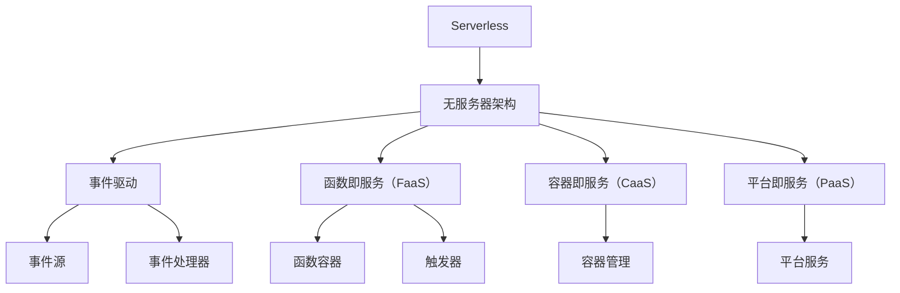
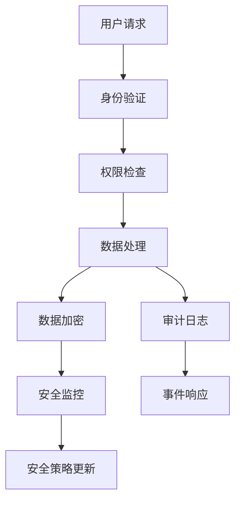

                 

### 文章标题：Serverless应用开发：降低创业成本的新思路

> 关键词：Serverless、无服务器架构、函数即服务、FaaS、实时数据处理、安全性

> 摘要：本文将深入探讨Serverless应用开发的各个方面，从基本概念到应用案例，再到安全性，帮助读者理解Serverless如何成为降低创业成本的有效手段。

### 第一部分：Serverless技术概述

#### 第1章：Serverless概念与背景

**1.1 Serverless定义与特征**

- **定义**：Serverless是一种云计算模型，用户无需管理服务器，只需关注代码的编写和部署。这种模型通常被称为无服务器架构（Serverless Architecture）。

- **特征**：

  - **按需服务**：Serverless服务能够自动扩展和缩放，根据实际需求动态分配资源。

  - **高可用性**：由于无需担心服务器故障，Serverless服务通常具有更高的可用性。

  - **低成本**：用户只需为实际使用的计算资源付费，无需担心基础设施的成本。

**1.2 Serverless的历史与发展**

- **起源**：Serverless概念起源于2010年代，由亚马逊AWS推出的Lambda函数服务率先引起关注。

- **发展**：随着云计算技术的进步，微软Azure、谷歌Cloud Platform等主要云服务提供商也相继推出了自己的Serverless服务。

**1.3 Serverless的优势与局限**

- **优势**：

  - **简化运维**：无需管理服务器，降低了运维成本。

  - **提高开发效率**：开发人员可以专注于代码编写，快速迭代。

  - **弹性伸缩**：自动处理负载，确保系统的高效运行。

- **局限**：

  - **依赖云服务**：可能会限制用户选择云服务提供商的自由。

  - **冷启动**：长时间未调用的函数可能响应时间较长。

**1.4 Serverless应用场景**

- **实时数据处理**：适用于Web后端、物联网数据处理等场景。

- **微服务架构**：用于构建复杂的分布式系统。

- **持续集成/持续部署（CI/CD）**：自动部署和测试。

#### Mermaid 流程图：Serverless核心概念与联系



### 第二部分：Serverless应用开发

#### 第2章：Serverless架构与实现

**2.1 Serverless架构概述**

- **前端**：用户触发事件。

- **后端**：函数执行和数据处理。

- **服务端**：提供函数执行环境。

**2.2 函数即服务（FaaS）**

- **FaaS原理**：

  - **函数容器**：运行函数的独立环境。

  - **触发器**：触发函数执行的事件。

  - **函数部署**：上传函数代码，创建函数容器。

- **FaaS开发流程**：

  - **编写函数**：使用支持的语言（如Node.js、Python）。

  - **测试与调试**：本地环境或云服务提供测试。

  - **部署与监控**：上传函数代码，监控性能。

#### 伪代码：FaaS函数实现

```python
def handle_request(request):
    # 1. 解析请求
    request_data = parse_request(request)

    # 2. 处理请求
    response_data = process_request(request_data)

    # 3. 返回响应
    return generate_response(response_data)
```

### 第三部分：Serverless应用案例

#### 第3章：实时数据处理

**3.1 实时数据处理简介**

- **定义**：在事件发生后立即处理数据。

- **应用领域**：社交媒体、金融交易、物联网。

**3.2 实时数据处理架构**

- **数据收集**：传感器、API调用等。

- **数据处理**：使用流处理框架（如Apache Kafka、Apache Flink）。

- **数据存储**：数据库、数据湖。

#### 数学模型：实时数据处理延迟公式

$$
L = \frac{d}{v}
$$

- **L**：延迟时间。

- **d**：数据传输距离。

- **v**：数据传输速度。

### 第四部分：Serverless安全性

#### 第4章：Serverless安全性与隐私保护

**4.1 Serverless安全挑战**

- **数据泄露**：由于Serverless架构的分布式特性，数据泄露的风险增加。

- **权限滥用**：未经授权的访问可能导致敏感数据泄露。

- **服务中断**：依赖云服务提供商，服务中断可能导致业务中断。

#### Mermaid流程图：Serverless安全架构



### 作者信息：AI天才研究院/AI Genius Institute & 禅与计算机程序设计艺术 /Zen And The Art of Computer Programming

### 结语

Serverless技术为创业公司提供了一种降低成本、提高效率的新思路。通过本文的深入探讨，读者应能理解Serverless的核心概念、架构、应用案例及安全性。在未来的发展中，Serverless将继续发挥重要作用，推动技术创新和业务模式变革。希望本文能为您提供有益的启示，助力您的创业之路更加顺利。

