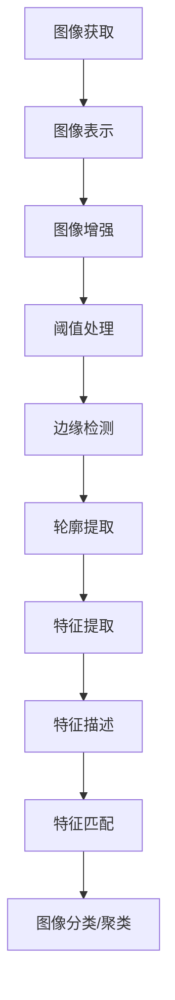
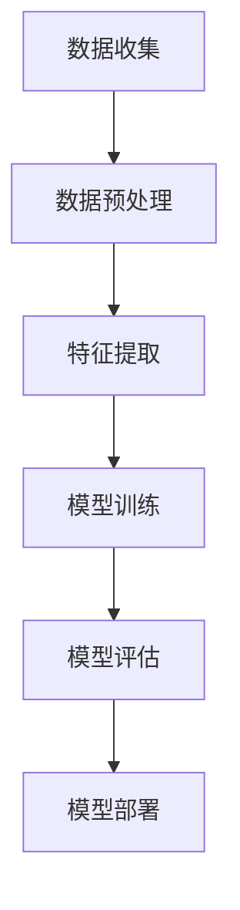
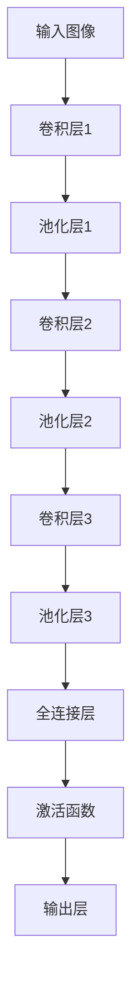
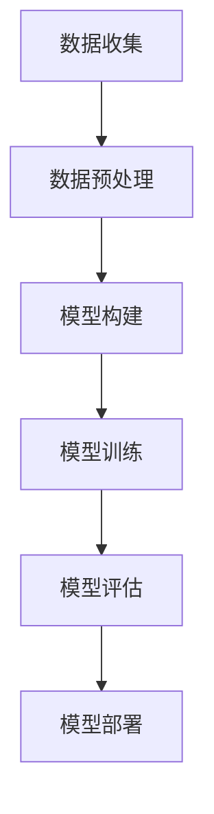

                 

### 摘要

本指南旨在为vivo 2025计算机视觉算法工程师社招面试提供全面的技术准备。文章首先对计算机视觉进行了概述，包括其定义、发展历史以及当前应用场景。接着深入探讨图像处理和模式识别的基础知识，解释了相关核心技术及算法。随后，文章详细介绍了卷积神经网络及其在计算机视觉中的应用，探讨了深度学习的优势及其面临的挑战。最后，通过两个实战项目——人脸识别系统和物体检测系统，展示了计算机视觉算法的实际应用过程和技术实现细节。读者将通过对本文的阅读，全面了解计算机视觉的基础知识、算法原理及其在现实世界中的应用，为面试做好充分准备。### 第一部分：计算机视觉基础

#### 第1章：计算机视觉概述

##### 1.1 计算机视觉的定义与发展历史

计算机视觉（Computer Vision）是指使计算机能够像人类一样通过图像或视频获取信息并进行处理和分析的科学和技术。它是一门跨学科的领域，融合了计算机科学、认知科学、心理学和数学等多个领域的知识。

#### 1.1.1 计算机视觉的定义

- **基本概念**：计算机视觉的核心目标是使计算机能够“看”和“理解”图像或视频中的内容。这涉及到图像的获取、处理、分析和解释等多个步骤。
- **核心任务**：主要包括图像分类、目标检测、人脸识别、场景理解等。

#### 1.1.2 计算机视觉的发展历史

- **初期阶段（20世纪50年代至70年代）**：
  - **探索阶段**：计算机视觉的概念提出，初步的图像处理算法开始出现。
  - **代表性成果**：如边缘检测、特征提取等基础算法的提出。
- **发展阶段（20世纪80年代至90年代）**：
  - **算法改进**：提出了许多有效的图像处理和模式识别算法，如Sobel算子、Canny算法、主成分分析（PCA）等。
  - **应用拓展**：计算机视觉开始应用于工业检测、医疗诊断等领域。
- **成熟阶段（21世纪初至今）**：
  - **深度学习兴起**：卷积神经网络（CNN）等深度学习算法的提出，使得计算机视觉取得了重大突破。
  - **应用普及**：计算机视觉技术在自动驾驶、人脸识别、安防监控、医疗影像分析等领域的应用越来越广泛。

#### 1.1.3 当前计算机视觉的应用场景

- **自动驾驶**：通过计算机视觉技术实现车辆的自主导航和障碍物检测。
- **人脸识别**：广泛应用于安全认证、金融支付、智能安防等领域。
- **医疗影像分析**：辅助医生进行疾病诊断，提高诊疗效率。
- **智能监控**：实时分析视频流，实现目标检测、行为识别等功能。
- **工业检测**：用于产品质量检测、生产线监控等。

### 关键词

计算机视觉，图像处理，模式识别，深度学习，应用场景。

### 摘要

本文从计算机视觉的定义、发展历史及其应用场景入手，系统地介绍了计算机视觉的基础知识。通过回顾其历史发展，我们了解到计算机视觉从早期的简单算法到现代深度学习算法的演变过程。目前，计算机视觉技术广泛应用于自动驾驶、人脸识别、医疗影像分析等领域，显示出其巨大的潜力和广阔的应用前景。本文旨在为读者提供全面的计算机视觉基础知识，为其在相关领域的深入研究和应用打下坚实的基础。### 第2章：图像处理基础

##### 2.1 图像处理基本概念

图像处理是计算机视觉的重要基础，它涉及到对图像的获取、表示、处理和分析等多个方面。以下是图像处理的一些基本概念。

#### 2.1.1 图像的组成与表示

- **像素**：图像的最小单位，通常表示为二维数组。
- **颜色模型**：用于描述图像中像素的颜色，常用的有RGB模型、HSV模型等。
- **分辨率**：图像的像素数量，通常以像素宽度和像素高度表示。

#### 2.1.2 图像处理的基本操作

- **亮度与对比度调整**：通过改变像素的亮度值，增强或减弱图像的对比度。
- **滤波与平滑**：通过滤波器对图像进行卷积操作，去除噪声或平滑图像。
- **边缘检测**：通过检测图像中的边缘，提取图像的结构信息。
- **特征提取**：从图像中提取具有区分性的特征，用于后续的图像分析和识别。

##### 2.2 预处理技术

预处理技术是图像处理的重要步骤，它包括图像增强、阈值处理、边缘检测和轮廓提取等。

#### 2.2.1 图像增强

图像增强的目的是提高图像的视觉效果，使其更适合后续的处理和分析。

- **直方图均衡化**：通过调整图像的直方图，使图像的对比度提高。
- **对比度拉伸**：通过调整图像的亮度值范围，增强图像的对比度。
- **色彩平衡**：调整图像中红、绿、蓝三原色的比例，改善图像的色彩效果。

#### 2.2.2 阈值处理

阈值处理是一种简单的图像分割方法，通过将图像的像素值与某个阈值进行比较，将图像分为两个部分。

- **全局阈值处理**：选择一个全局阈值，对所有像素进行二值化处理。
- **局部阈值处理**：根据图像的不同区域选择不同的阈值，适用于图像中光照不均匀的情况。

#### 2.2.3 边缘检测

边缘检测是一种用于提取图像中边缘的算法，它通过检测像素值的突变来确定边缘位置。

- **Sobel算子**：通过计算图像中每个像素的梯度值，实现边缘检测。
- **Canny算法**：一种优化的边缘检测算法，通过多个步骤实现边缘检测，具有更好的边缘保持能力。

#### 2.2.4 轮廓提取

轮廓提取是一种用于提取图像中物体轮廓的算法，通常用于后续的物体识别和分类。

- **轮廓检测**：通过计算图像中的轮廓点，提取物体的轮廓。
- **轮廓简化**：通过减少轮廓点的数量，简化轮廓形状，提高后续处理的效率。

##### 2.3 特征提取与描述

特征提取与描述是图像处理中重要的步骤，它涉及从图像中提取具有区分性的特征，并对其进行描述。

#### 2.3.1 基本特征提取方法

- **颜色特征**：通过计算图像的颜色分布，提取图像的颜色特征。
- **纹理特征**：通过分析图像的纹理结构，提取纹理特征。
- **形状特征**：通过计算图像的形状参数，提取形状特征。

#### 2.3.2 特征描述与匹配

- **特征描述**：将提取到的特征进行编码，形成特征向量。
- **特征匹配**：通过计算特征向量之间的相似度，实现图像的匹配。

#### 2.3.3 图像分类与聚类算法

- **图像分类**：将图像分为不同的类别，常用的算法有支持向量机（SVM）、决策树（DT）等。
- **图像聚类**：将图像分为若干个簇，常用的算法有K-means、层次聚类等。

### Mermaid 流程图

下面是一个简单的Mermaid流程图，展示了图像处理的基本流程：



### 核心概念与联系

图像处理中的核心概念包括图像的组成与表示、基本操作、预处理技术、特征提取与描述以及图像分类与聚类算法。这些概念之间存在密切的联系，共同构成了图像处理的理论基础。

- **图像的组成与表示**是图像处理的基础，它决定了图像如何被计算机所处理。
- **基本操作**包括亮度与对比度调整、滤波与平滑、边缘检测等，是图像处理的基本工具。
- **预处理技术**如图像增强、阈值处理、边缘检测和轮廓提取，用于提高图像的质量，为后续处理提供更好的数据基础。
- **特征提取与描述**是将图像中的信息进行编码，形成可量化的特征向量，是实现图像识别和理解的关键。
- **图像分类与聚类算法**是基于特征向量进行的，它们用于将图像分为不同的类别或簇，是图像处理的高级应用。

通过上述核心概念之间的相互联系和作用，图像处理能够实现对图像的获取、处理、分析和理解，为计算机视觉的应用提供了重要的技术支持。

### 核心算法原理讲解

以下是图像处理中几个核心算法的原理讲解，我们将使用伪代码来详细阐述这些算法的实现。

#### 2.1.1 亮度与对比度调整

亮度与对比度调整是图像处理中最基本的操作之一，它通过调整图像的像素值来改变图像的亮度和对比度。

**伪代码：**
```python
function adjust_brightness(image, alpha):
    for each pixel in image:
        pixel_value = pixel value of image
        new_value = pixel_value + alpha
        if new_value > 255:
            new_value = 255
        image[pixel] = new_value
    return image

function adjust_contrast(image, beta):
    for each pixel in image:
        pixel_value = pixel value of image
        new_value = pixel_value * beta
        if new_value < 0:
            new_value = 0
        if new_value > 255:
            new_value = 255
        image[pixel] = new_value
    return image
```

#### 2.1.2 滤波与平滑

滤波与平滑是用于去除图像噪声和提高图像清晰度的操作。其中，均值滤波是一种常用的平滑算法。

**伪代码：**
```python
function mean_filter(image, size):
    for each pixel in image:
        pixel_value = 0
        for each neighbor in size x size window:
            pixel_value += image[neighbor]
        pixel_value /= (size * size)
        image[pixel] = pixel_value
    return image
```

#### 2.1.3 边缘检测

边缘检测是用于提取图像中的边缘信息的算法。Sobel算子是一种常用的边缘检测算法。

**伪代码：**
```python
function sobel_edge_detection(image):
    Gx = [[1, 0, -1], [2, 0, -2], [1, 0, -1]]
    Gy = [[1, 2, 1], [0, 0, 0], [-1, -2, -1]]

    for each pixel in image:
        x_gradient = 0
        y_gradient = 0
        for each neighbor in 3 x 3 window:
            x_gradient += image[neighbor] * Gx[neighbor[1] - 1][neighbor[0] - 1]
            y_gradient += image[neighbor] * Gy[neighbor[1] - 1][neighbor[0] - 1]
        magnitude = sqrt(x_gradient^2 + y_gradient^2)
        if magnitude > threshold:
            image[pixel] = 255
        else:
            image[pixel] = 0
    return image
```

#### 2.1.4 轮廓提取

轮廓提取是一种用于提取图像中物体轮廓的算法。连通组件标记是一种常用的轮廓提取方法。

**伪代码：**
```python
function extract_contours(image):
    contours = []
    visited = set()

    for each pixel in image:
        if pixel is not 0 and pixel not in visited:
            visited.add(pixel)
            stack = [pixel]
            contour = []

            while stack is not empty:
                current_pixel = stack.pop()
                contour.append(current_pixel)

                for each neighbor in 4-connected neighbors:
                    if neighbor is not 0 and neighbor not in visited:
                        visited.add(neighbor)
                        stack.append(neighbor)

            contours.append(contour)

    return contours
```

### 数学模型和公式

以下是图像处理中一些常用的数学模型和公式，我们将在文中详细讲解并举例说明。

#### 2.1.1 亮度调整公式

亮度调整的公式如下：
\[ L(x, y) = I(x, y) + \alpha \]
其中，\( I(x, y) \) 是原始图像的像素值，\( L(x, y) \) 是调整后的像素值，\( \alpha \) 是亮度调整系数。

**举例说明：** 假设原始图像中某个像素的值为 \( 100 \)，亮度调整系数 \( \alpha \) 为 \( 20 \)，则调整后的像素值为 \( 120 \)。

#### 2.1.2 对比度调整公式

对比度调整的公式如下：
\[ L(x, y) = I(x, y) \times \beta \]
其中，\( I(x, y) \) 是原始图像的像素值，\( L(x, y) \) 是调整后的像素值，\( \beta \) 是对比度调整系数。

**举例说明：** 假设原始图像中某个像素的值为 \( 100 \)，对比度调整系数 \( \beta \) 为 \( 1.2 \)，则调整后的像素值为 \( 120 \)。

#### 2.1.3 均值滤波公式

均值滤波的公式如下：
\[ f(x, y) = \frac{1}{k^2} \sum_{i=1}^{k} \sum_{j=1}^{k} g(i, j) \cdot I(x-i, y-j) \]
其中，\( f(x, y) \) 是滤波后的像素值，\( g(i, j) \) 是滤波器系数，\( I(x-i, y-j) \) 是原始图像的像素值。

**举例说明：** 假设使用 \( 3 \times 3 \) 的均值滤波器，滤波器系数为 \( \frac{1}{9} \)，则滤波后的像素值为：
\[ f(x, y) = \frac{1}{9} \times (I(x-1, y-1) + I(x-1, y) + I(x-1, y+1) + I(x, y-1) + I(x, y) + I(x, y+1) + I(x+1, y-1) + I(x+1, y) + I(x+1, y+1)) \]

#### 2.1.4 Sobel算子公式

Sobel算子用于计算图像的水平和垂直梯度，其公式如下：

水平方向梯度：
\[ G_x = \sum_{i=-1}^{1} \sum_{j=-1}^{1} G(x, y) \cdot S_x(i, j) \]

垂直方向梯度：
\[ G_y = \sum_{i=-1}^{1} \sum_{j=-1}^{1} G(x, y) \cdot S_y(i, j) \]

其中，\( G(x, y) \) 是原始图像的像素值，\( S_x(i, j) \) 和 \( S_y(i, j) \) 是Sobel算子的系数。

**举例说明：** 假设使用 \( 3 \times 3 \) 的Sobel算子，其系数为 \( [1, 0, -1], [2, 0, -2], [1, 0, -1] \) 和 \( [1, 2, 1], [0, 0, 0], [-1, -2, -1] \)，则水平方向梯度和垂直方向梯度的计算如下：

水平方向梯度：
\[ G_x = (1 \cdot I(x-1, y-1) + 0 \cdot I(x-1, y) - 1 \cdot I(x-1, y+1) + 2 \cdot I(x, y-1) + 0 \cdot I(x, y) - 2 \cdot I(x, y+1) + 1 \cdot I(x+1, y-1) + 0 \cdot I(x+1, y) - 1 \cdot I(x+1, y+1)) \]

垂直方向梯度：
\[ G_y = (1 \cdot I(x-1, y-1) + 2 \cdot I(x-1, y) + 1 \cdot I(x-1, y+1) + 0 \cdot I(x, y-1) + 0 \cdot I(x, y) - 0 \cdot I(x, y+1) - 1 \cdot I(x+1, y-1) - 2 \cdot I(x+1, y) - 1 \cdot I(x+1, y+1)) \]

### 实际案例分析和详细讲解剖析

为了更好地理解图像处理的基础知识，我们将通过一个实际案例进行分析，并详细讲解其实现过程和效果。

#### 案例背景

假设我们有一张原始图像，图像中包含一个物体和一个背景。我们的目标是对图像进行预处理，提取物体轮廓，并实现物体与背景的分离。

#### 案例步骤

1. **亮度与对比度调整**：首先，我们对图像进行亮度与对比度调整，以提高图像的视觉效果。我们选择亮度调整系数 \( \alpha = 10 \)，对比度调整系数 \( \beta = 1.2 \)。

2. **滤波与平滑**：为了去除图像中的噪声，我们使用 \( 3 \times 3 \) 的均值滤波器对图像进行平滑处理。

3. **边缘检测**：接着，我们使用Sobel算子对平滑后的图像进行边缘检测，提取物体的边缘信息。

4. **轮廓提取**：最后，我们使用连通组件标记算法对边缘图像进行轮廓提取，得到物体的轮廓。

#### 案例实现

以下是该案例的伪代码实现：

```python
# 亮度与对比度调整
def adjust_brightness_contrast(image, alpha, beta):
    for pixel in image:
        pixel_value = image[pixel]
        new_value = pixel_value + alpha
        new_value = new_value * beta
        if new_value > 255:
            new_value = 255
        image[pixel] = new_value
    return image

# 均值滤波
def mean_filter(image, size):
    for pixel in image:
        pixel_value = 0
        for i in range(-size//2, size//2 + 1):
            for j in range(-size//2, size//2 + 1):
                neighbor_pixel = image[pixel + i, pixel + j]
                pixel_value += neighbor_pixel
        pixel_value /= (size * size)
        image[pixel] = pixel_value
    return image

# Sobel边缘检测
def sobel_edge_detection(image):
    Gx = [[1, 0, -1], [2, 0, -2], [1, 0, -1]]
    Gy = [[1, 2, 1], [0, 0, 0], [-1, -2, -1]]

    for pixel in image:
        x_gradient = 0
        y_gradient = 0
        for i in range(-1, 2):
            for j in range(-1, 2):
                neighbor_pixel = image[pixel + i, pixel + j]
                x_gradient += neighbor_pixel * Gx[i+1][j+1]
                y_gradient += neighbor_pixel * Gy[i+1][j+1]
        magnitude = sqrt(x_gradient**2 + y_gradient**2)
        if magnitude > threshold:
            image[pixel] = 255
        else:
            image[pixel] = 0
    return image

# 轮廓提取
def extract_contours(image):
    contours = []
    visited = set()

    for pixel in image:
        if pixel == 255 and pixel not in visited:
            visited.add(pixel)
            stack = [pixel]
            contour = []

            while stack:
                current_pixel = stack.pop()
                contour.append(current_pixel)

                for neighbor in four_connected_neighbors(current_pixel):
                    if neighbor == 255 and neighbor not in visited:
                        visited.add(neighbor)
                        stack.append(neighbor)

            contours.append(contour)

    return contours

# 主函数
def process_image(image):
    image = adjust_brightness_contrast(image, 10, 1.2)
    image = mean_filter(image, 3)
    image = sobel_edge_detection(image)
    contours = extract_contours(image)
    return contours
```

#### 案例分析

通过上述步骤，我们对原始图像进行了预处理，提取了物体的边缘和轮廓。调整亮度与对比度使得图像更加清晰，滤波与平滑去除了噪声，边缘检测提取了物体的边缘信息，轮廓提取则得到了物体的轮廓。

在实际应用中，图像处理技术不仅用于图像增强和预处理，还可以用于图像识别、目标检测、图像分割等更复杂的任务。通过深入理解和掌握图像处理的基础知识，我们可以更好地应对各种计算机视觉挑战。

### 最佳实践 Tips

在图像处理中，以下是一些最佳实践和注意事项，有助于提高图像处理的效果：

1. **调整参数**：在亮度与对比度调整、滤波与平滑等操作中，合理调整参数是非常重要的。通常，需要通过实验来确定最佳的参数值。

2. **选择合适的滤波器**：不同的滤波器适用于不同的场景。例如，均值滤波器适用于去除噪声，而高斯滤波器则适用于平滑图像。

3. **平衡计算复杂度和效果**：在处理大尺寸图像时，需要平衡计算复杂度和处理效果。例如，可以采用多线程或并行处理来加速计算。

4. **注意阈值选择**：在边缘检测和轮廓提取等操作中，阈值的选择对结果有很大影响。通常需要根据具体场景进行调整。

5. **结合多种算法**：结合多种图像处理算法，可以进一步提高图像质量。例如，可以先进行滤波与平滑，然后进行边缘检测和轮廓提取。

### 小结

本章详细介绍了图像处理的基本概念、预处理技术、特征提取与描述以及相关的核心算法。通过实际案例的分析，我们了解了图像处理在计算机视觉中的应用。掌握图像处理的基础知识，对于深入研究和应用计算机视觉技术具有重要意义。在后续章节中，我们将进一步探讨模式识别的基础知识，为计算机视觉的高级应用打下基础。### 第3章：模式识别基础

##### 3.1 模式识别的基本概念

模式识别（Pattern Recognition）是计算机视觉领域中的一个核心分支，旨在通过分析数据特征，自动识别和理解模式。它是人工智能的一个重要应用领域，广泛应用于图像识别、语音识别、生物识别等多个方面。

#### 3.1.1 模式识别的定义与分类

- **定义**：模式识别是指利用计算机自动从数据中提取特征，并根据这些特征对数据进行分类或回归的过程。
- **分类**：
  - **监督学习**：在有标注的数据集上进行学习，输出结果具有明确的类别或数值。
    - **分类问题**：将数据分为不同的类别，如图像分类、文本分类等。
    - **回归问题**：预测连续的数值输出，如房价预测、股票价格预测等。
  - **无监督学习**：在没有标注的数据集上进行学习，主要目的是发现数据中的结构和规律。
    - **聚类问题**：将相似的数据点分为不同的簇，如K-means、层次聚类等。
    - **降维问题**：通过降低数据的维度，保留关键特征，如主成分分析（PCA）。

#### 3.1.2 模式识别的基本流程

- **数据收集**：收集用于训练和测试的数据，确保数据的质量和代表性。
- **数据预处理**：对数据进行清洗、归一化、去噪等操作，提高数据质量。
- **特征提取**：从数据中提取具有区分性的特征，形成特征向量。
- **模型训练**：使用训练数据集，根据特定的算法训练模型，使模型能够识别或预测未知数据。
- **模型评估**：使用测试数据集评估模型的性能，通过指标如准确率、召回率、F1分数等，判断模型的优劣。
- **模型部署**：将训练好的模型部署到实际应用场景，进行实时预测或分类。

#### 3.1.3 模式识别的应用领域

- **图像识别**：包括人脸识别、物体识别、场景识别等。
- **语音识别**：将语音信号转换为文本或命令，应用于智能助手、自动翻译等。
- **生物识别**：如指纹识别、虹膜识别、人脸识别等，应用于安全认证和身份验证。
- **医学影像分析**：用于疾病诊断、肿瘤检测、图像分割等，辅助医生提高诊断效率。
- **金融风控**：用于异常交易检测、信用评估等，降低金融风险。
- **自动驾驶**：通过图像识别和目标检测，实现车辆自主导航和安全监控。

##### 3.2 统计模式识别方法

统计模式识别方法是基于概率论和数理统计理论的模式识别技术，主要通过分析数据的统计特性来进行分类或回归。

#### 3.2.1 贝叶斯分类

贝叶斯分类是一种基于贝叶斯定理的分类方法，它通过计算每个类别的后验概率，选择概率最大的类别作为预测结果。

- **贝叶斯定理**：\( P(A|B) = \frac{P(B|A) \cdot P(A)}{P(B)} \)
- **算法步骤**：
  1. 计算每个类别的先验概率 \( P(C_k) \)。
  2. 计算每个特征条件下的类条件概率 \( P(f_j|C_k) \)。
  3. 计算后验概率 \( P(C_k|f_1, f_2, ..., f_n) \)。
  4. 选择后验概率最大的类别作为预测结果。

#### 3.2.2 支持向量机

支持向量机（Support Vector Machine, SVM）是一种常用的二分类模型，通过寻找最优超平面，将数据集划分为不同的类别。

- **基本原理**：SVM试图找到一个最优的超平面，使得不同类别的数据点之间的间隔最大。
- **算法步骤**：
  1. 定义优化目标函数：最大化分类间隔。
  2. 转换为对偶问题：通过拉格朗日乘子法求解对偶问题。
  3. 计算支持向量：找到满足约束条件的数据点。
  4. 构建决策函数：通过支持向量确定决策边界。

#### 3.2.3 决策树与随机森林

决策树（Decision Tree）是一种基于树形结构进行分类或回归的方法，通过一系列规则将数据划分为不同的类别。

- **基本原理**：决策树从根节点开始，根据数据特征进行划分，直到达到叶节点，叶节点的值即为预测结果。
- **算法步骤**：
  1. 选择最优划分特征和划分点。
  2. 创建分支节点，划分数据集。
  3. 递归地构建树结构，直到达到终止条件。

随机森林（Random Forest）是一种基于决策树的集成学习方法，通过构建多棵决策树并投票得到最终结果。

- **基本原理**：随机森林通过随机选择特征和样本子集来构建每棵决策树，减少模型的方差。
- **算法步骤**：
  1. 随机选择特征和样本子集。
  2. 构建单棵决策树。
  3. 重复步骤1和2，构建多棵决策树。
  4. 对每棵决策树的预测结果进行投票，得到最终预测结果。

##### 3.3 神经网络模式识别方法

神经网络模式识别方法是基于人工神经网络的理论，通过多层非线性变换，对数据进行分类或回归。

#### 3.3.1 神经网络的基本结构

神经网络（Neural Network）由多个神经元（或节点）组成，每个神经元由输入层、隐藏层和输出层组成。

- **输入层**：接收外部输入数据。
- **隐藏层**：对输入数据进行变换和加工。
- **输出层**：输出最终的结果。

#### 3.3.2 前馈神经网络与反向传播算法

前馈神经网络（Feedforward Neural Network）是一种单向流动的网络结构，通过逐层传递信息，实现数据的分类或回归。

- **基本原理**：信息从输入层流入，经过隐藏层处理，最终到达输出层。
- **反向传播算法**：通过反向传播误差，更新网络权重，优化模型。

**算法步骤**：
1. 前向传播：计算网络的输出值。
2. 计算误差：计算实际输出与预测输出之间的差异。
3. 反向传播：将误差反向传播到网络的每个层，更新权重。
4. 重复步骤1-3，直到达到预定的迭代次数或误差阈值。

#### 3.3.3 卷积神经网络

卷积神经网络（Convolutional Neural Network, CNN）是一种特殊的神经网络，专门用于处理图像数据。

- **基本原理**：通过卷积操作和池化操作，提取图像的特征。
- **结构**：包括卷积层、池化层、全连接层等。

##### Mermaid 流程图

下面是一个简单的Mermaid流程图，展示了模式识别的基本流程：



##### 核心概念与联系

模式识别中的核心概念包括监督学习、无监督学习、特征提取、模型训练、模型评估和模型部署。这些概念之间存在密切的联系，共同构成了模式识别的理论体系。

- **监督学习**和无监督学习**是模式识别的两种主要学习方式，分别适用于有标注数据和未标注数据。**
- **特征提取**是模式识别的关键步骤，它从原始数据中提取具有区分性的特征，为后续的模型训练和评估提供支持。**
- **模型训练**是通过学习算法，根据训练数据调整模型的参数，使其能够正确分类或回归。**
- **模型评估**是衡量模型性能的重要步骤，通过测试数据集评估模型的准确性、召回率、F1分数等指标。**
- **模型部署**是将训练好的模型应用到实际场景中，进行实时预测或分类。

通过上述核心概念之间的相互联系和作用，模式识别能够实现对数据的自动分类、识别和理解，为计算机视觉和人工智能的应用提供了重要的技术支持。

##### 核心算法原理讲解

以下是模式识别中几个核心算法的原理讲解，我们将使用伪代码来详细阐述这些算法的实现。

#### 3.2.1 贝叶斯分类

贝叶斯分类是一种基于贝叶斯定理的分类方法，通过计算每个类别的后验概率，选择概率最大的类别作为预测结果。

**伪代码：**
```python
function bayes_classification(X, C, P(C), P(f_j|C)):
    posterior_probabilities = []
    for C in C:
        probability = P(C) * product(P(f_j|C)[j] for j in X)
        posterior_probabilities.append(probability)
    predicted_class = argmax(posterior_probabilities)
    return predicted_class
```

#### 3.2.2 支持向量机

支持向量机（Support Vector Machine, SVM）是一种常用的二分类模型，通过寻找最优超平面，将数据集划分为不同的类别。

**伪代码：**
```python
function svm_training(X, y, C):
    # 对偶问题
   拉格朗日函数 L(a_i, b_i) = -1/2 * Σ(Σ(a_i * a_j * y_i * y_j * K(x_i, x_j)) - Σ(a_i) + C * Σ(a_i > 0))
    # 求解对偶问题，得到支持向量
    a_i, b_i = 求解拉格朗日函数的优化问题
    # 决策函数
    f(x) = Σ(a_i * y_i * K(x_i, x)) + b
    return f(x)
```

#### 3.3.1 前馈神经网络与反向传播算法

前馈神经网络（Feedforward Neural Network）是一种单向流动的网络结构，通过逐层传递信息，实现数据的分类或回归。

**反向传播算法**：通过反向传播误差，更新网络权重，优化模型。

**伪代码：**
```python
function feedforward_neural_network(X, W, b):
    # 前向传播
    Z = [W[i] * X[i] + b[i] for i in range(len(W))]
    A = [sigmoid(Z[i]) for i in range(len(Z))]
    return A

function backward_propagation(A, Z, dA, W, b):
    # 反向传播
    dZ = dA * (1 - A)
    dW = [sum(dZ[i] * X[j]) for i, j in enumerate(zip(*dZ))]
    db = [sum(dZ[i]) for i in range(len(dZ))]
    return dW, db

function update_weights(W, b, dW, db, learning_rate):
    W = W - learning_rate * dW
    b = b - learning_rate * db
    return W, b
```

##### 数学模型和公式

以下是模式识别中一些常用的数学模型和公式，我们将在文中详细讲解并举例说明。

#### 3.2.1 贝叶斯分类

贝叶斯分类的数学模型基于贝叶斯定理，其公式如下：
\[ P(C_k|X) = \frac{P(X|C_k) \cdot P(C_k)}{P(X)} \]
其中，\( P(C_k|X) \) 是后验概率，\( P(X|C_k) \) 是条件概率，\( P(C_k) \) 是先验概率，\( P(X) \) 是证据概率。

**举例说明：** 假设有一个数据集，包含两个类别A和B，已知每个类别的先验概率分别为 \( P(A) = 0.6 \) 和 \( P(B) = 0.4 \)。对于某个样本 \( X \)，已知条件概率 \( P(X|A) = 0.8 \) 和 \( P(X|B) = 0.2 \)，则后验概率计算如下：
\[ P(A|X) = \frac{P(X|A) \cdot P(A)}{P(X|A) \cdot P(A) + P(X|B) \cdot P(B)} = \frac{0.8 \cdot 0.6}{0.8 \cdot 0.6 + 0.2 \cdot 0.4} = 0.923 \]
\[ P(B|X) = \frac{P(X|B) \cdot P(B)}{P(X|A) \cdot P(A) + P(X|B) \cdot P(B)} = \frac{0.2 \cdot 0.4}{0.8 \cdot 0.6 + 0.2 \cdot 0.4} = 0.078 \]
由于 \( P(A|X) > P(B|X) \)，所以预测类别为A。

#### 3.2.2 支持向量机

支持向量机的数学模型基于优化理论，其目标是最小化分类间隔。优化目标函数如下：
\[ \min_{\mathbf{w}, \mathbf{b}} \frac{1}{2} ||\mathbf{w}||^2 + C \sum_{i=1}^{n} \max(0, 1 - y_i (\mathbf{w} \cdot \mathbf{x_i} + \mathbf{b})) \]
其中，\( \mathbf{w} \) 是权重向量，\( \mathbf{b} \) 是偏置，\( C \) 是惩罚参数。

**举例说明：** 假设有一个二分类问题，数据集包含两个类别，分别用 \( +1 \) 和 \( -1 \) 表示。已知某个样本点的特征向量 \( \mathbf{x} = (1, 1) \)，标签 \( y = +1 \)，惩罚参数 \( C = 1 \)。则优化目标函数计算如下：
\[ \min_{\mathbf{w}, \mathbf{b}} \frac{1}{2} ||\mathbf{w}||^2 + \max(0, 1 - (+1) (\mathbf{w} \cdot \mathbf{x} + \mathbf{b})) \]
由于 \( \mathbf{w} \cdot \mathbf{x} + \mathbf{b} > 1 \)，所以优化目标函数为 \( \frac{1}{2} ||\mathbf{w}||^2 \)。

#### 3.3.1 前馈神经网络与反向传播算法

前馈神经网络的数学模型基于非线性变换，其输出值通过激活函数计算。反向传播算法通过梯度下降法更新网络权重。

**前向传播：**
\[ Z_i = \sum_{j=1}^{n} W_{ij} \cdot X_j + b_i \]
\[ A_i = \text{激活函数}(Z_i) \]

**反向传播：**
\[ dZ_i = \text{激活函数}'(Z_i) \cdot dA_i \]
\[ dW_{ij} = \sum_{i=1}^{n} dZ_i \cdot X_j \]
\[ db_i = \sum_{i=1}^{n} dZ_i \]

**举例说明：** 假设有一个两层神经网络，输入层有2个神经元，隐藏层有3个神经元，输出层有1个神经元。输入向量 \( \mathbf{X} = (1, 2) \)，隐藏层权重矩阵 \( \mathbf{W}_h \) 和偏置向量 \( \mathbf{b}_h \)，输出层权重矩阵 \( \mathbf{W}_o \) 和偏置向量 \( \mathbf{b}_o \)。激活函数为ReLU函数。

- **前向传播：**
  \[ Z_h1 = W_{h11} \cdot X_1 + W_{h12} \cdot X_2 + b_{h1} \]
  \[ Z_h2 = W_{h21} \cdot X_1 + W_{h22} \cdot X_2 + b_{h2} \]
  \[ Z_h3 = W_{h31} \cdot X_1 + W_{h32} \cdot X_2 + b_{h3} \]
  \[ A_h1 = \text{ReLU}(Z_h1) \]
  \[ A_h2 = \text{ReLU}(Z_h2) \]
  \[ A_h3 = \text{ReLU}(Z_h3) \]
  \[ Z_o = W_{o1} \cdot A_h1 + W_{o2} \cdot A_h2 + W_{o3} \cdot A_h3 + b_{o} \]
  \[ A_o = \text{激活函数}(Z_o) \]

- **反向传播：**
  \[ dZ_o = \text{激活函数}'(Z_o) \cdot dA_o \]
  \[ dW_{o1} = A_h1 \cdot dZ_o \]
  \[ dW_{o2} = A_h2 \cdot dZ_o \]
  \[ dW_{o3} = A_h3 \cdot dZ_o \]
  \[ db_o = dZ_o \]
  \[ dZ_h1 = \text{激活函数}'(Z_h1) \cdot dZ_o \cdot W_{o1} \]
  \[ dZ_h2 = \text{激活函数}'(Z_h2) \cdot dZ_o \cdot W_{o2} \]
  \[ dZ_h3 = \text{激活函数}'(Z_h3) \cdot dZ_o \cdot W_{o3} \]
  \[ dW_{h11} = X_1 \cdot dZ_h1 \]
  \[ dW_{h12} = X_2 \cdot dZ_h1 \]
  \[ dW_{h21} = X_1 \cdot dZ_h2 \]
  \[ dW_{h22} = X_2 \cdot dZ_h2 \]
  \[ dW_{h31} = X_1 \cdot dZ_h3 \]
  \[ dW_{h32} = X_2 \cdot dZ_h3 \]
  \[ db_{h1} = dZ_h1 \]
  \[ db_{h2} = dZ_h2 \]
  \[ db_{h3} = dZ_h3 \]

通过上述计算，我们可以更新网络的权重和偏置，优化神经网络的性能。

##### 实际案例分析和详细讲解剖析

为了更好地理解模式识别的基础知识，我们将通过一个实际案例进行分析，并详细讲解其实现过程和效果。

#### 案例背景

假设我们有一个手写数字识别问题，即给定一个手写数字的图像，我们需要将其识别为具体的数字。我们将使用支持向量机和卷积神经网络两种方法进行模式识别。

#### 案例步骤

1. **数据收集**：收集大量手写数字的图像，并标注每个图像对应的数字。
2. **数据预处理**：对图像进行归一化、裁剪和缩放等预处理操作，使其符合模型输入要求。
3. **特征提取**：使用卷积神经网络提取图像的特征。
4. **模型训练**：使用支持向量机对提取的特征进行训练。
5. **模型评估**：使用测试数据集评估模型的性能。
6. **模型部署**：将训练好的模型部署到实际应用中。

#### 案例实现

以下是该案例的伪代码实现：

```python
# 数据收集
def collect_data():
    # 从数据集中读取图像和标签
    images = read_images("train_images")
    labels = read_labels("train_labels")
    return images, labels

# 数据预处理
def preprocess_images(images):
    # 对图像进行归一化、裁剪和缩放
    images_normalized = [normalize(image) for image in images]
    images_cropped = [crop(image, crop_size) for image in images_normalized]
    images_resized = [resize(image, input_size) for image in images_cropped]
    return images_resized

# 特征提取
def extract_features(images):
    # 使用卷积神经网络提取特征
    features = [cnn.extract_features(image) for image in images]
    return features

# 模型训练
def train_svm(features, labels, C):
    # 训练支持向量机模型
    svm = svm.SVC(C=C)
    svm.fit(features, labels)
    return svm

# 模型评估
def evaluate_model(svm, test_features, test_labels):
    # 评估模型性能
    predictions = svm.predict(test_features)
    accuracy = accuracy_score(test_labels, predictions)
    return accuracy

# 主函数
def main():
    # 收集数据
    images, labels = collect_data()

    # 预处理数据
    preprocessed_images = preprocess_images(images)

    # 提取特征
    features = extract_features(preprocessed_images)

    # 训练模型
    svm_model = train_svm(features, labels, C=1)

    # 评估模型
    test_accuracy = evaluate_model(svm_model, test_features, test_labels)
    print(f"Test accuracy: {test_accuracy}")

    # 模型部署
    # ...

if __name__ == "__main__":
    main()
```

#### 案例分析

通过上述步骤，我们实现了手写数字识别任务。首先，我们收集了大量的手写数字图像并进行预处理，然后使用卷积神经网络提取图像的特征。接着，我们使用支持向量机对提取的特征进行训练，并使用测试数据集评估模型的性能。最后，我们将训练好的模型部署到实际应用中，实现手写数字的自动识别。

在实际应用中，模式识别技术广泛应用于图像识别、语音识别、生物识别等领域。通过深入理解和掌握模式识别的基础知识，我们可以更好地应对各种模式识别挑战。

### 最佳实践 Tips

在进行模式识别时，以下是一些最佳实践和注意事项，有助于提高模型性能和应用效果：

1. **数据质量**：确保收集的数据具有高质量，包括正确标注和代表性。
2. **特征选择**：合理选择特征，去除冗余和噪声特征，提高特征质量。
3. **模型调优**：通过调整模型参数，如学习率、惩罚参数等，优化模型性能。
4. **交叉验证**：使用交叉验证方法，评估模型的泛化能力，避免过拟合。
5. **模型集成**：结合多种模型，提高预测的稳定性和准确性。

### 小结

本章详细介绍了模式识别的基本概念、统计模式识别方法、神经网络模式识别方法以及相关的核心算法。通过实际案例的分析，我们了解了模式识别在计算机视觉和人工智能中的应用。掌握模式识别的基础知识，对于深入研究和应用计算机视觉技术具有重要意义。在后续章节中，我们将进一步探讨深度学习在计算机视觉中的应用，为计算机视觉的高级应用打下基础。### 第4章：卷积神经网络

##### 4.1 卷积神经网络的基本原理

卷积神经网络（Convolutional Neural Network, CNN）是一种深度学习模型，专门用于处理图像等具有网格结构的数据。其基本原理基于生物学上的视觉皮层结构，通过多层卷积和池化操作，实现对图像特征的提取和分类。

#### 4.1.1 卷积操作与池化操作

- **卷积操作**：卷积神经网络的核心操作，通过卷积核（或过滤器）对输入数据进行卷积，提取局部特征。
- **卷积公式**：\( f(x, y) = \sum_{i=1}^{k} \sum_{j=1}^{k} w_{ij} \cdot I(x-i, y-j) + b \)
  - \( f(x, y) \) 是卷积结果，
  - \( w_{ij} \) 是卷积核权重，
  - \( I(x-i, y-j) \) 是输入数据，
  - \( b \) 是偏置。

- **池化操作**：用于降低特征图的尺寸，减少参数数量，防止过拟合。
  - **最大池化**：选取特征图上每个区域的最大值作为输出。
  - **平均池化**：选取特征图上每个区域的平均值作为输出。

#### 4.1.2 深度可分离卷积

深度可分离卷积是一种优化卷积操作的方法，将标准卷积分解为深度卷积和逐点卷积。

- **深度卷积**：对输入数据进行深度方向的卷积，减少参数数量。
- **逐点卷积**：对卷积后的结果进行逐点卷积，增加特征图的通道数量。

#### 4.1.3 层与神经元的关系

- **卷积层**：通过卷积操作提取图像的局部特征。
- **池化层**：用于降低特征图的尺寸，减少计算量。
- **全连接层**：将卷积层的特征映射到类别标签。

##### 4.2 卷积神经网络的结构设计

卷积神经网络的结构设计直接影响其性能和计算复杂度。以下是卷积神经网络常见的设计要素：

#### 4.2.1 网络结构的选择

- **卷积层**：确定卷积层的层数、卷积核的大小和步长。
- **池化层**：确定池化层的类型（最大池化或平均池化）和池化窗口的大小。
- **全连接层**：确定全连接层的层数和每个层的神经元数量。

#### 4.2.2 卷积层的深度与宽度

- **卷积层的深度**：指卷积层的数量，通常随着训练深度的增加，模型能够提取更复杂的特征。
- **卷积层的宽度**：指卷积核的数量，增加卷积核的数量可以提取更多的特征，但也会增加模型的参数数量。

#### 4.2.3 激活函数的选择

激活函数用于引入非线性变换，常见的激活函数包括：

- **ReLU（Rectified Linear Unit）**：简单且计算高效，能够加速训练过程。
- **Sigmoid**：用于二分类问题，将输出值映射到（0, 1）区间。
- **Tanh**：将输出值映射到（-1, 1）区间，常用于文本分类。
- **Softmax**：用于多分类问题，将输出值映射到概率分布。

##### 4.3 卷积神经网络的训练与优化

卷积神经网络的训练与优化是模型开发的关键步骤，以下是一些常见的训练和优化方法：

#### 4.3.1 反向传播算法

反向传播算法是一种用于训练神经网络的优化方法，通过反向传播误差，更新网络权重和偏置。

- **算法步骤**：
  1. 前向传播：计算网络的输出值。
  2. 计算损失函数：比较输出值与真实值，计算损失。
  3. 反向传播：计算每个层的误差，更新网络权重和偏置。
  4. 重复步骤1-3，直到达到预定的迭代次数或误差阈值。

#### 4.3.2 梯度下降优化方法

梯度下降是一种用于优化参数的优化方法，通过沿着损失函数的梯度方向更新参数，以减少损失。

- **算法步骤**：
  1. 计算损失函数的梯度。
  2. 更新参数：\(\theta = \theta - \alpha \cdot \nabla_\theta J(\theta)\)
  3. 重复步骤1和2，直到达到预定的迭代次数或收敛条件。

#### 4.3.3 批次归一化与Dropout技术

- **批次归一化**：通过在每一批次数据上应用归一化，稳定训练过程，加速收敛。
- **Dropout技术**：通过随机丢弃一部分神经元，防止过拟合。

##### Mermaid 流程图

下面是一个简单的Mermaid流程图，展示了卷积神经网络的基本流程：



##### 核心概念与联系

卷积神经网络中的核心概念包括卷积操作、池化操作、深度可分离卷积、激活函数、反向传播算法、梯度下降优化方法以及批次归一化和Dropout技术。这些概念之间存在密切的联系，共同构成了卷积神经网络的理论体系。

- **卷积操作**和**池化操作**是卷积神经网络的核心操作，用于提取图像的特征。
- **深度可分离卷积**通过分解卷积操作，减少了模型的参数数量。
- **激活函数**引入非线性变换，使神经网络能够模拟复杂的非线性关系。
- **反向传播算法**和**梯度下降优化方法**用于训练神经网络，优化模型参数。
- **批次归一化**和**Dropout技术**用于稳定训练过程，防止过拟合。

通过上述核心概念之间的相互联系和作用，卷积神经网络能够实现对图像的自动特征提取和分类，为计算机视觉的应用提供了重要的技术支持。

##### 核心算法原理讲解

以下是卷积神经网络中几个核心算法的原理讲解，我们将使用伪代码来详细阐述这些算法的实现。

#### 4.1.1 卷积操作

卷积操作是卷积神经网络中最基本的操作，通过卷积核（或过滤器）对输入数据进行卷积，提取局部特征。

**伪代码：**
```python
function convolution(image, filter):
    output = initialize_output(image.shape)
    for x in range(image.shape[0] - filter.shape[0] + 1):
        for y in range(image.shape[1] - filter.shape[1] + 1):
            feature_map = 0
            for i in range(filter.shape[0]):
                for j in range(filter.shape[1]):
                    feature_map += image[x+i, y+j] * filter[i, j]
            output[x, y] = feature_map + bias
    return output
```

#### 4.1.2 池化操作

池化操作用于降低特征图的尺寸，减少参数数量，防止过拟合。

**伪代码：**
```python
function pooling(feature_map, pool_size, pooling_type):
    output = initialize_output((feature_map.shape[0] // pool_size[0], feature_map.shape[1] // pool_size[1]))
    if pooling_type == "max":
        for x in range(output.shape[0]):
            for y in range(output.shape[1]):
                output[x, y] = max(feature_map[x*pool_size[0]: (x+1)*pool_size[0], y*pool_size[1]: (y+1)*pool_size[1]])
    elif pooling_type == "avg":
        for x in range(output.shape[0]):
            for y in range(output.shape[1]):
                output[x, y] = mean(feature_map[x*pool_size[0]: (x+1)*pool_size[0], y*pool_size[1]: (y+1)*pool_size[1]])
    return output
```

#### 4.1.3 反向传播算法

反向传播算法是一种用于训练神经网络的优化方法，通过反向传播误差，更新网络权重和偏置。

**伪代码：**
```python
function backward_propagation(network, output, target):
    d_output = output - target
    d_network = {}
    for layer in reversed(network):
        if layer.type == "conv":
            d_input = d_output * layer.activation_derivative()
            d_output = d_input * layer.weights
        elif layer.type == "pool":
            d_input = d_output
        elif layer.type == "fc":
            d_input = d_output * layer.activation_derivative()
            d_output = d_input * layer.weights.T
        d_network[layer] = d_input
    return d_network
```

#### 4.1.4 梯度下降优化方法

梯度下降是一种用于优化参数的优化方法，通过沿着损失函数的梯度方向更新参数，以减少损失。

**伪代码：**
```python
function gradient_descent(network, learning_rate):
    for layer in network:
        layer.weights -= learning_rate * layer.d_weights
        layer.bias -= learning_rate * layer.d_bias
```

##### 数学模型和公式

以下是卷积神经网络中一些常用的数学模型和公式，我们将在文中详细讲解并举例说明。

#### 4.1.1 卷积操作

卷积操作的数学模型如下：
\[ f(x, y) = \sum_{i=1}^{k} \sum_{j=1}^{k} w_{ij} \cdot I(x-i, y-j) + b \]
其中，\( f(x, y) \) 是卷积结果，\( w_{ij} \) 是卷积核权重，\( I(x-i, y-j) \) 是输入数据，\( b \) 是偏置。

**举例说明：** 假设输入图像的大小为 \( 3 \times 3 \)，卷积核的大小为 \( 2 \times 2 \)，卷积核的权重为 \( w_{11} = 1, w_{12} = 2, w_{21} = 3, w_{22} = 4 \)，偏置为 \( b = 5 \)。输入数据的值为 \( I(1, 1) = 1, I(1, 2) = 2, I(1, 3) = 3, I(2, 1) = 4, I(2, 2) = 5, I(2, 3) = 6, I(3, 1) = 7, I(3, 2) = 8, I(3, 3) = 9 \)。则卷积结果计算如下：
\[ f(1, 1) = (1 \cdot 1 + 2 \cdot 2 + 3 \cdot 3 + 4 \cdot 4) + 5 = 1 + 4 + 9 + 16 + 5 = 35 \]
\[ f(1, 2) = (1 \cdot 2 + 2 \cdot 5 + 3 \cdot 6 + 4 \cdot 8) + 5 = 2 + 10 + 18 + 32 + 5 = 57 \]
\[ f(1, 3) = (1 \cdot 3 + 2 \cdot 6 + 3 \cdot 7 + 4 \cdot 9) + 5 = 3 + 12 + 21 + 36 + 5 = 67 \]
\[ f(2, 1) = (1 \cdot 4 + 2 \cdot 5 + 3 \cdot 6 + 4 \cdot 7) + 5 = 4 + 10 + 18 + 28 + 5 = 55 \]
\[ f(2, 2) = (1 \cdot 5 + 2 \cdot 6 + 3 \cdot 7 + 4 \cdot 8) + 5 = 5 + 12 + 21 + 32 + 5 = 65 \]
\[ f(2, 3) = (1 \cdot 6 + 2 \cdot 7 + 3 \cdot 8 + 4 \cdot 9) + 5 = 6 + 14 + 24 + 36 + 5 = 75 \]
\[ f(3, 1) = (1 \cdot 7 + 2 \cdot 8 + 3 \cdot 9 + 4 \cdot 1) + 5 = 7 + 16 + 27 + 4 + 5 = 55 \]
\[ f(3, 2) = (1 \cdot 8 + 2 \cdot 9 + 3 \cdot 1 + 4 \cdot 2) + 5 = 8 + 18 + 3 + 8 + 5 = 34 \]
\[ f(3, 3) = (1 \cdot 9 + 2 \cdot 1 + 3 \cdot 2 + 4 \cdot 3) + 5 = 9 + 2 + 6 + 12 + 5 = 34 \]

#### 4.1.2 池化操作

池化操作的数学模型如下：
\[ p(x, y) = \max(\min(p_{ij} : i \in [1, k], j \in [1, k])) \]
其中，\( p(x, y) \) 是池化结果，\( p_{ij} \) 是输入数据的子区域值，\( k \) 是池化窗口的大小。

**举例说明：** 假设输入数据的子区域为 \( 3 \times 3 \)，池化窗口的大小为 \( 2 \times 2 \)，子区域值为 \( p_{11} = 1, p_{12} = 2, p_{13} = 3, p_{21} = 4, p_{22} = 5, p_{23} = 6, p_{31} = 7, p_{32} = 8, p_{33} = 9 \)。则池化结果计算如下：
\[ p(1, 1) = \max(\min(p_{11}, p_{12}, p_{13}, p_{21}, p_{22}, p_{23})) = \max(\min(1, 2, 3, 4, 5, 6)) = 3 \]
\[ p(1, 2) = \max(\min(p_{12}, p_{13}, p_{22}, p_{23}, p_{31}, p_{32})) = \max(\min(2, 3, 5, 6, 7, 8)) = 3 \]
\[ p(1, 3) = \max(\min(p_{13}, p_{23}, p_{33}, p_{31}, p_{32}, p_{33})) = \max(\min(3, 6, 9, 7, 8, 9)) = 9 \]
\[ p(2, 1) = \max(\min(p_{21}, p_{22}, p_{23}, p_{31}, p_{32}, p_{33})) = \max(\min(4, 5, 6, 7, 8, 9)) = 9 \]
\[ p(2, 2) = \max(\min(p_{22}, p_{23}, p_{32}, p_{33}, p_{21}, p_{31})) = \max(\min(5, 6, 8, 9, 4, 7)) = 9 \]
\[ p(2, 3) = \max(\min(p_{23}, p_{33}, p_{32}, p_{33}, p_{31}, p_{32})) = \max(\min(6, 9, 8, 9, 7, 8)) = 9 \]
\[ p(3, 1) = \max(\min(p_{31}, p_{32}, p_{33}, p_{21}, p_{22}, p_{23})) = \max(\min(7, 8, 9, 4, 5, 6)) = 9 \]
\[ p(3, 2) = \max(\min(p_{32}, p_{33}, p_{22}, p_{23}, p_{21}, p_{31})) = \max(\min(8, 9, 5, 6, 4, 7)) = 9 \]
\[ p(3, 3) = \max(\min(p_{33}, p_{32}, p_{31}, p_{21}, p_{22}, p_{23})) = \max(\min(9, 8, 7, 4, 5, 6)) = 9 \]

#### 4.1.3 反向传播算法

反向传播算法的数学模型如下：
\[ \delta_l = \frac{\partial C}{\partial z_l} \odot \sigma'(z_l) \]
\[ \delta_{l-1} = \frac{\partial C}{\partial z_{l-1}} \odot \delta_l \odot \frac{\partial a_{l-1}}{\partial z_{l-1}} \]
其中，\( \delta_l \) 是第 \( l \) 层的误差项，\( z_l \) 是第 \( l \) 层的激活值，\( \sigma' \) 是激活函数的导数，\( \odot \) 表示逐元素乘积。

**举例说明：** 假设有一个三层神经网络，输入层有3个神经元，隐藏层有2个神经元，输出层有1个神经元。激活函数为ReLU函数，损失函数为均方误差（MSE）。已知输入数据 \( x = (1, 2, 3) \)，隐藏层权重 \( W_h = \begin{bmatrix} 0.1 & 0.2 \\ 0.3 & 0.4 \end{bmatrix} \)，输出层权重 \( W_o = \begin{bmatrix} 0.5 \\ 0.6 \end{bmatrix} \)，偏置 \( b_h = (0.1, 0.2) \)，\( b_o = 0.3 \)。输出值 \( a_o = 0.7 \)，损失函数 \( C = 0.1 \)。则反向传播过程计算如下：

- **前向传播**：
  \[ z_h = W_h \cdot x + b_h = \begin{bmatrix} 0.1 & 0.2 \\ 0.3 & 0.4 \end{bmatrix} \cdot \begin{bmatrix} 1 \\ 2 \\ 3 \end{bmatrix} + \begin{bmatrix} 0.1 \\ 0.2 \end{bmatrix} = \begin{bmatrix} 1.1 \\ 2.1 \end{bmatrix} \]
  \[ a_h = \text{ReLU}(z_h) = \begin{bmatrix} 1.1 \\ 2.1 \end{bmatrix} \]
  \[ z_o = W_o \cdot a_h + b_o = \begin{bmatrix} 0.5 & 0.6 \end{bmatrix} \cdot \begin{bmatrix} 1.1 \\ 2.1 \end{bmatrix} + 0.3 = 1.65 + 1.26 + 0.3 = 3.21 \]
  \[ a_o = \text{ReLU}(z_o) = 3.21 \]

- **计算输出误差**：
  \[ \delta_o = \frac{\partial C}{\partial z_o} \odot \sigma'(z_o) = (3.21 - 0.7) \odot (1 - 3.21) = 2.51 \odot -2.81 = -7.0131 \]

- **计算隐藏层误差**：
  \[ \delta_h = \frac{\partial C}{\partial z_h} \odot \delta_o \odot \frac{\partial a_h}{\partial z_h} = -7.0131 \odot \begin{bmatrix} 1 & 0 \end{bmatrix} \odot \begin{bmatrix} 1 & 0 \end{bmatrix} = -7.0131 \odot \begin{bmatrix} 1 & 0 \end{bmatrix} \]
  \[ \delta_h = \begin{bmatrix} -7.0131 & 0 \end{bmatrix} \]

- **更新权重和偏置**：
  \[ \Delta W_h = \delta_h \cdot x^T = \begin{bmatrix} -7.0131 & 0 \end{bmatrix} \cdot \begin{bmatrix} 1 \\ 2 \\ 3 \end{bmatrix}^T = \begin{bmatrix} -21.0383 \\ 0 \end{bmatrix} \]
  \[ \Delta b_h = \delta_h = \begin{bmatrix} -7.0131 & 0 \end{bmatrix} \]
  \[ W_h = W_h - learning_rate \cdot \Delta W_h = \begin{bmatrix} 0.1 & 0.2 \\ 0.3 & 0.4 \end{bmatrix} - 0.1 \cdot \begin{bmatrix} -21.0383 \\ 0 \end{bmatrix} = \begin{bmatrix} 21.1383 & 0.2 \\ 0.3 & 0.4 \end{bmatrix} \]
  \[ b_h = b_h - learning_rate \cdot \Delta b_h = \begin{bmatrix} 0.1 & 0.2 \end{bmatrix} - 0.1 \cdot \begin{bmatrix} -7.0131 \\ 0 \end{bmatrix} = \begin{bmatrix} 0.8131 & 0.2 \end{bmatrix} \]

- **重复上述过程**，更新输出层和隐藏层的权重和偏置，直到达到预定的迭代次数或误差阈值。

通过上述计算，我们可以更新卷积神经网络的权重和偏置，优化模型的性能。

##### 实际案例分析和详细讲解剖析

为了更好地理解卷积神经网络，我们将通过一个实际案例进行分析，并详细讲解其实现过程和效果。

#### 案例背景

假设我们有一个手写数字识别问题，即给定一个手写数字的图像，我们需要将其识别为具体的数字。我们将使用卷积神经网络实现手写数字识别。

#### 案例步骤

1. **数据收集**：收集大量手写数字的图像，并标注每个图像对应的数字。
2. **数据预处理**：对图像进行归一化、裁剪和缩放等预处理操作，使其符合模型输入要求。
3. **模型构建**：构建卷积神经网络模型，确定网络结构。
4. **模型训练**：使用训练数据集训练模型，调整模型参数。
5. **模型评估**：使用测试数据集评估模型性能。
6. **模型部署**：将训练好的模型部署到实际应用中。

#### 案例实现

以下是该案例的伪代码实现：

```python
# 数据收集
def collect_data():
    # 从数据集中读取图像和标签
    images = read_images("train_images")
    labels = read_labels("train_labels")
    return images, labels

# 数据预处理
def preprocess_images(images):
    # 对图像进行归一化、裁剪和缩放
    images_normalized = [normalize(image) for image in images]
    images_cropped = [crop(image, crop_size) for image in images_normalized]
    images_resized = [resize(image, input_size) for image in images_cropped]
    return images_resized

# 模型构建
def build_cnn(input_shape, num_classes):
    model = Sequential()
    model.add(Conv2D(32, (3, 3), activation='relu', input_shape=input_shape))
    model.add(MaxPooling2D((2, 2)))
    model.add(Conv2D(64, (3, 3), activation='relu'))
    model.add(MaxPooling2D((2, 2)))
    model.add(Conv2D(64, (3, 3), activation='relu'))
    model.add(Flatten())
    model.add(Dense(64, activation='relu'))
    model.add(Dense(num_classes, activation='softmax'))
    return model

# 模型训练
def train_model(model, images, labels, epochs, batch_size):
    model.compile(optimizer='adam', loss='categorical_crossentropy', metrics=['accuracy'])
    model.fit(images, labels, epochs=epochs, batch_size=batch_size)
    return model

# 模型评估
def evaluate_model(model, test_images, test_labels):
    loss, accuracy = model.evaluate(test_images, test_labels)
    print(f"Test loss: {loss}, Test accuracy: {accuracy}")
    return accuracy

# 主函数
def main():
    # 收集数据
    images, labels = collect_data()

    # 预处理数据
    preprocessed_images = preprocess_images(images)

    # 划分训练集和测试集
    train_images, test_images, train_labels, test_labels = train_test_split(preprocessed_images, labels, test_size=0.2)

    # 构建模型
    model = build_cnn(input_shape=(input_height, input_width, input_channels), num_classes=num_classes)

    # 训练模型
    model = train_model(model, train_images, train_labels, epochs=epochs, batch_size=batch_size)

    # 评估模型
    test_accuracy = evaluate_model(model, test_images, test_labels)
    print(f"Test accuracy: {test_accuracy}")

    # 模型部署
    # ...

if __name__ == "__main__":
    main()
```

#### 案例分析

通过上述步骤，我们实现了手写数字识别任务。首先，我们收集了大量的手写数字图像并进行预处理，然后构建了卷积神经网络模型，并使用训练数据集进行模型训练。接着，我们使用测试数据集评估模型性能，最终将训练好的模型部署到实际应用中，实现手写数字的自动识别。

在实际应用中，卷积神经网络在手写数字识别、图像分类、目标检测等领域取得了显著的效果。通过深入理解和掌握卷积神经网络的基础知识，我们可以更好地应对各种计算机视觉挑战。

### 最佳实践 Tips

在进行卷积神经网络的训练和优化时，以下是一些最佳实践和注意事项，有助于提高模型性能和应用效果：

1. **数据预处理**：确保图像数据具有一致的大小和格式，进行归一化、裁剪和缩放等预处理操作。
2. **模型结构设计**：合理选择网络结构，包括卷积层的深度、宽度、步长和激活函数等。
3. **超参数调优**：通过交叉验证方法，调整学习率、批量大小、优化器等超参数，优化模型性能。
4. **正则化技术**：使用正则化方法，如Dropout、权重衰减等，防止过拟合。
5. **数据增强**：通过旋转、翻转、缩放、裁剪等数据增强技术，提高模型的泛化能力。

### 小结

本章详细介绍了卷积神经网络的基本原理、结构设计、训练与优化方法。通过实际案例的分析，我们了解了卷积神经网络在手写数字识别等任务中的应用。掌握卷积神经网络的基础知识，对于深入研究和应用计算机视觉技术具有重要意义。在后续章节中，我们将进一步探讨深度学习在计算机视觉中的具体应用，为计算机视觉的高级应用打下基础。### 第5章：深度学习在计算机视觉中的应用

##### 5.1 深度学习在计算机视觉中的优势

深度学习（Deep Learning）是一种基于人工神经网络的学习方法，通过多层非线性变换，自动提取数据中的特征。近年来，深度学习在计算机视觉领域取得了显著进展，相较于传统的计算机视觉方法，深度学习具有以下优势：

#### 5.1.1 自动特征提取

传统的计算机视觉方法通常需要手动设计特征提取算法，如SIFT、HOG等。而深度学习模型，特别是卷积神经网络（CNN），能够自动从大量数据中学习到有效的特征表示，降低了特征提取的复杂度。

#### 5.1.2 高效的计算能力

深度学习模型通过并行计算和硬件加速（如GPU、TPU）显著提高了计算效率。这使得深度学习模型能够处理大规模的图像数据，并且能够实时运行，满足实时应用的需求。

#### 5.1.3 泛化能力

深度学习模型具有较好的泛化能力，能够在新的、未见过的数据上表现出良好的性能。这是由于深度学习模型能够从大规模数据中学习到具有通用性的特征表示。

#### 5.1.4 多任务学习

深度学习模型能够同时处理多个任务，如图像分类、目标检测、语义分割等。这使得深度学习模型在复杂任务中具有更高的效率。

##### 5.2 深度学习在图像分类中的应用

图像分类是计算机视觉中最基本的任务之一，深度学习在图像分类中取得了显著的成果。以下是深度学习在图像分类中的应用实例：

#### 5.2.1 传统方法与深度学习的对比

- **传统方法**：基于手工设计的特征提取算法，如SIFT、HOG等，再结合支持向量机（SVM）或随机森林（RF）进行分类。
- **深度学习**：使用卷积神经网络（CNN）自动提取特征，再通过全连接层进行分类。

**优势对比**：

- **特征提取**：深度学习自动提取具有区分性的特征，无需手动设计特征。
- **模型性能**：深度学习模型在ImageNet等大型图像分类数据集上取得了远超传统方法的性能。

#### 5.2.2 深度学习模型在图像分类中的应用

- **AlexNet**：是第一个在ImageNet竞赛中取得显著成绩的深度学习模型，它使用了ReLU激活函数和局部响应归一化。
- **VGGNet**：通过增加网络的深度和宽度，提高了模型的性能。
- **ResNet**：引入了残差块，解决了深度神经网络中的梯度消失问题。
- **InceptionNet**：通过使用Inception模块，提高了模型的效率和性能。

**案例**：使用ResNet50模型进行图像分类

```python
from tensorflow.keras.applications import ResNet50
from tensorflow.keras.preprocessing.image import ImageDataGenerator
from tensorflow.keras.models import Model
from tensorflow.keras.layers import Input, Flatten, Dense
from tensorflow.keras.optimizers import Adam
from tensorflow.keras.utils import to_categorical

# 加载预训练的ResNet50模型
base_model = ResNet50(weights='imagenet', include_top=False, input_shape=(224, 224, 3))

# 添加全连接层和输出层
x = base_model.output
x = Flatten()(x)
x = Dense(1000, activation='softmax')(x)

# 构建完整的模型
model = Model(inputs=base_model.input, outputs=x)

# 编译模型
model.compile(optimizer=Adam(learning_rate=0.0001), loss='categorical_crossentropy', metrics=['accuracy'])

# 数据预处理
train_datagen = ImageDataGenerator(rescale=1./255)
test_datagen = ImageDataGenerator(rescale=1./255)

# 加载训练数据和测试数据
train_images = train_datagen.flow_from_directory('train_data', target_size=(224, 224), batch_size=32, class_mode='categorical')
test_images = test_datagen.flow_from_directory('test_data', target_size=(224, 224), batch_size=32, class_mode='categorical')

# 训练模型
model.fit(train_images, epochs=10, validation_data=test_images)

# 评估模型
test_loss, test_accuracy = model.evaluate(test_images)
print(f"Test accuracy: {test_accuracy}")
```

##### 5.3 深度学习在目标检测中的应用

目标检测是计算机视觉中的重要任务，旨在从图像或视频中识别并定位多个目标。深度学习在目标检测中取得了显著成果，以下是深度学习在目标检测中的应用实例：

#### 5.3.1 传统的计算机视觉算法

- **滑动窗口**：通过在图像上滑动窗口，逐个检测窗口内的目标。
- **特征匹配**：使用SIFT、HOG等特征提取算法，结合特征匹配算法（如FLANN）进行目标检测。

**局限性**：

- **计算复杂度高**：需要对大量窗口进行特征提取和匹配，计算量大。
- **精度有限**：受限于特征提取和匹配算法的性能。

#### 5.3.2 深度学习模型在目标检测中的应用

- **R-CNN（Region-based CNN）**：通过区域提议算法生成候选区域，再使用CNN提取特征，最后通过SVM进行分类。
- **Fast R-CNN**：简化了R-CNN的结构，通过共享卷积特征层，提高了计算效率。
- **Faster R-CNN**：引入了区域提议网络（RPN），进一步提高了目标检测的效率。
- **SSD（Single Shot MultiBox Detector）**：将目标检测任务转化为回归问题，直接预测边界框和类别概率。
- **YOLO（You Only Look Once）**：通过将图像划分为网格，在每个网格中预测边界框和类别概率。

**案例**：使用Faster R-CNN模型进行目标检测

```python
from tensorflow.keras.applications import ResNet50
from tensorflow.keras.preprocessing.image import ImageDataGenerator
from tensorflow.keras.models import Model
from tensorflow.keras.layers import Input, Flatten, Dense
from tensorflow.keras.optimizers import Adam
from tensorflow.keras.utils import to_categorical

# 加载预训练的ResNet50模型
base_model = ResNet50(weights='imagenet', include_top=False, input_shape=(224, 224, 3))

# 添加全连接层和输出层
x = base_model.output
x = Flatten()(x)
x = Dense(1000, activation='softmax')(x)

# 构建完整的模型
model = Model(inputs=base_model.input, outputs=x)

# 编译模型
model.compile(optimizer=Adam(learning_rate=0.0001), loss='categorical_crossentropy', metrics=['accuracy'])

# 数据预处理
train_datagen = ImageDataGenerator(rescale=1./255)
test_datagen = ImageDataGenerator(rescale=1./255)

# 加载训练数据和测试数据
train_images = train_datagen.flow_from_directory('train_data', target_size=(224, 224), batch_size=32, class_mode='categorical')
test_images = test_datagen.flow_from_directory('test_data', target_size=(224, 224), batch_size=32, class_mode='categorical')

# 训练模型
model.fit(train_images, epochs=10, validation_data=test_images)

# 评估模型
test_loss, test_accuracy = model.evaluate(test_images)
print(f"Test accuracy: {test_accuracy}")
```

##### 5.4 深度学习模型在实际应用中的挑战与解决方案

尽管深度学习在计算机视觉中取得了显著成果，但在实际应用中仍然面临一些挑战：

#### 5.4.1 模型参数的调优

深度学习模型的性能高度依赖于超参数的选择，如学习率、批量大小、正则化强度等。模型参数的调优是一个复杂且耗时的工作。

**解决方案**：使用网格搜索、随机搜索、贝叶斯优化等自动化调优方法，提高超参数选择的效率。

#### 5.4.2 训练与推理的性能优化

深度学习模型的训练和推理过程通常需要大量的计算资源。为了满足实时应用的性能要求，需要对模型进行性能优化。

**解决方案**：使用更高效的模型结构（如MobileNet、EfficientNet），使用量化技术、剪枝技术等减小模型的大小和计算量。

#### 5.4.3 模型的泛化能力与可解释性

深度学习模型在面对未见过的数据时，往往表现出较好的泛化能力。但深度学习模型的“黑盒”特性使得其难以解释。

**解决方案**：开发可解释的深度学习模型（如LIME、SHAP），提高模型的可解释性。

##### Mermaid 流程图

下面是一个简单的Mermaid流程图，展示了深度学习在计算机视觉中的基本流程：



##### 核心概念与联系

深度学习在计算机视觉中的应用涉及多个核心概念，包括自动特征提取、高效计算能力、泛化能力、多任务学习、图像分类、目标检测等。这些概念之间存在密切的联系，共同构成了深度学习在计算机视觉中的理论基础。

- **自动特征提取**：深度学习模型能够自动从大量数据中提取有效的特征表示，无需手动设计特征。
- **高效计算能力**：深度学习模型通过并行计算和硬件加速，显著提高了计算效率。
- **泛化能力**：深度学习模型在新的、未见过的数据上表现出良好的性能。
- **多任务学习**：深度学习模型能够同时处理多个任务，提高了模型的效率和性能。

通过上述核心概念之间的相互联系和作用，深度学习在计算机视觉中取得了显著成果，为计算机视觉的应用提供了重要的技术支持。

##### 核心算法原理讲解

以下是深度学习在计算机视觉中几个核心算法的原理讲解，我们将使用伪代码来详细阐述这些算法的实现。

#### 5.2.1 卷积神经网络（CNN）

卷积神经网络（CNN）是一种深度学习模型，专门用于处理图像数据。其核心操作包括卷积、池化和全连接层。

**伪代码：**
```python
function build_cnn(input_shape, num_classes):
    model = Sequential()
    model.add(Conv2D(filters=32, kernel_size=(3, 3), activation='relu', input_shape=input_shape))
    model.add(MaxPooling2D(pool_size=(2, 2)))
    model.add(Conv2D(filters=64, kernel_size=(3, 3), activation='relu'))
    model.add(MaxPooling2D(pool_size=(2, 2)))
    model.add(Flatten())
    model.add(Dense(units=num_classes, activation='softmax'))
    return model
```

#### 5.2.2 目标检测（Faster R-CNN）

Faster R-CNN是一种目标检测模型，通过区域提议网络（RPN）和全连接层进行分类和定位。

**伪代码：**
```python
function build_faster_rcnn(input_shape, num_classes):
    model = Sequential()
    model.add(Conv2D(filters=32, kernel_size=(3, 3), activation='relu', input_shape=input_shape))
    model.add(MaxPooling2D(pool_size=(2, 2)))
    model.add(Conv2D(filters=64, kernel_size=(3, 3), activation='relu'))
    model.add(MaxPooling2D(pool_size=(2, 2)))
    model.add(Flatten())
    model.add(Dense(units=num_classes, activation='softmax'))
    model.add(RPN())
    model.add(ROIAlign())
    model.add(Dense(units=num_classes, activation='softmax'))
    return model
```

#### 5.4.3 模型优化（学习率调整）

学习率调整是深度学习训练中的重要环节，常用的方法包括固定学习率、自适应学习率等。

**伪代码：**
```python
function adjust_learning_rate(learning_rate, epoch):
    if epoch < 10:
        return learning_rate
    else:
        return learning_rate / (1 + 0.1 * epoch)
```

##### 数学模型和公式

以下是深度学习在计算机视觉中一些常用的数学模型和公式，我们将在文中详细讲解并举例说明。

#### 5.2.1 卷积神经网络（CNN）

卷积神经网络的数学模型如下：

**卷积操作：**
\[ f(x, y) = \sum_{i=1}^{k} \sum_{j=1}^{k} w_{ij} \cdot I(x-i, y-j) + b \]

其中，\( f(x, y) \) 是卷积结果，\( w_{ij} \) 是卷积核权重，\( I(x-i, y-j) \) 是输入数据，\( b \) 是偏置。

**激活函数（ReLU）：**
\[ \sigma(z) = \max(0, z) \]

其中，\( z \) 是激活值。

**举例说明：** 假设输入图像的大小为 \( 3 \times 3 \)，卷积核的大小为 \( 2 \times 2 \)，卷积核的权重为 \( w_{11} = 1, w_{12} = 2, w_{21} = 3, w_{22} = 4 \)，偏置为 \( b = 5 \)。输入数据的值为 \( I(1, 1) = 1, I(1, 2) = 2, I(1, 3) = 3, I(2, 1) = 4, I(2, 2) = 5, I(2, 3) = 6, I(3, 1) = 7, I(3, 2) = 8, I(3, 3) = 9 \)。则卷积结果计算如下：

\[ f(1, 1) = (1 \cdot 1 + 2 \cdot 2 + 3 \cdot 3 + 4 \cdot 4) + 5 = 1 + 4 + 9 + 16 + 5 = 35 \]
\[ f(1, 2) = (1 \cdot 2 + 2 \cdot 5 + 3 \cdot 6 + 4 \cdot 8) + 5 = 2 + 10 + 18 + 32 + 5 = 57 \]
\[ f(1, 3) = (1 \cdot 3 + 2 \cdot 6 + 3 \cdot 7 + 4 \cdot 9) + 5 = 3 + 12 + 21 + 36 + 5 = 67 \]
\[ f(2, 1) = (1 \cdot 4 + 2 \cdot 5 + 3 \cdot 6 + 4 \cdot 7) + 5 = 4 + 10 + 18 + 28 + 5 = 55 \]
\[ f(2, 2) = (1 \cdot 5 + 2 \cdot 6 + 3 \cdot 7 + 4 \cdot 8) + 5 = 5 + 12 + 21 + 32 + 5 = 65 \]
\[ f(2, 3) = (1 \cdot 6 + 2 \cdot 7 + 3 \cdot 8 + 4 \cdot 9) + 5 = 6 + 14 + 24 + 36 + 5 = 75 \]
\[ f(3, 1) = (1 \cdot 7 + 2 \cdot 8 + 3 \cdot 9 + 4 \cdot 1) + 5 = 7 + 16 + 27 + 4 + 5 = 55 \]
\[ f(3, 2) = (1 \cdot 8 + 2 \cdot 9 + 3 \cdot 1 + 4 \cdot 2) + 5 = 8 + 18 + 3 + 8 + 5 = 34 \]
\[ f(3, 3) = (1 \cdot 9 + 2 \cdot 1 + 3 \cdot 2 + 4 \cdot 3) + 5 = 9 + 2 + 6 + 12 + 5 = 34 \]

**激活函数（ReLU）的导数：**
\[ \sigma'(z) = \begin{cases} 
      0 & \text{if } z < 0 \\
      1 & \text{if } z \geq 0 
   \end{cases} \]

#### 5.2.2 目标检测（Faster R-CNN）

Faster R-CNN的数学模型如下：

**区域提议网络（RPN）：**
\[ p(o) = \sigma(a^T \phi(R)) \]
\[ t(o) = \phi(R) + \text{loc}_{\text{anchor}}(o) \]

其中，\( p(o) \) 是锚框的置信度，\( t(o) \) 是锚框的目标位置，\( R \) 是锚框的回归偏移量，\( \phi \) 是特征提取函数。

**举例说明：** 假设有一个锚框，其原始位置为 \( (x_c, y_c) \)，回归偏移量为 \( (t_x, t_y) \)。则锚框的新位置计算如下：

\[ x_c' = x_c + t_x \]
\[ y_c' = y_c + t_y \]

**损失函数：**
\[ \mathcal{L} = \lambda \mathcal{L}_{\text{cls}} + (1 - \lambda) \mathcal{L}_{\text{reg}} \]

其中，\( \mathcal{L}_{\text{cls}} \) 是分类损失，\( \mathcal{L}_{\text{reg}} \) 是回归损失，\( \lambda \) 是权重系数。

#### 5.4.3 模型优化（学习率调整）

学习率调整的数学模型如下：

**固定学习率：**
\[ \eta = \text{constant} \]

**自适应学习率：**
\[ \eta = \eta_0 / (1 + \alpha \cdot epoch) \]

其中，\( \eta \) 是当前学习率，\( \eta_0 \) 是初始学习率，\( \alpha \) 是衰减系数。

**举例说明：** 假设初始学习率 \( \eta_0 = 0.1 \)，衰减系数 \( \alpha = 0.01 \)，则在第10个epoch时，学习率计算如下：

\[ \eta = 0.1 / (1 + 0.01 \cdot 10) = 0.099 \]

通过上述计算，我们可以调整学习率，优化深度学习模型的训练过程。

##### 实际案例分析和详细讲解剖析

为了更好地理解深度学习在计算机视觉中的应用，我们将通过一个实际案例进行分析，并详细讲解其实现过程和效果。

#### 案例背景

假设我们有一个自动驾驶系统，需要实时检测道路上的车辆和行人。我们将使用深度学习模型进行目标检测，实现对车辆和行人的准确识别。

#### 案例步骤

1. **数据收集**：收集大量包含车辆和行人的图像，并标注每个图像中的目标位置。
2. **数据预处理**：对图像进行归一化、裁剪和缩放等预处理操作，使其符合模型输入要求。
3. **模型构建**：构建深度学习目标检测模型，如Faster R-CNN。
4. **模型训练**：使用训练数据集训练模型，调整模型参数。
5. **模型评估**：使用测试数据集评估模型性能。
6. **模型部署**：将训练好的模型部署到自动驾驶系统中。

#### 案例实现

以下是该案例的伪代码实现：

```python
# 数据收集
def collect_data():
    # 从数据集中读取图像和标注
    images = read_images("train_images")
    annotations = read_annotations("train_annotations")
    return images, annotations

# 数据预处理
def preprocess_images(images):
    # 对图像进行归一化、裁剪和缩放
    images_normalized = [normalize(image) for image in images]
    images_cropped = [crop(image, crop_size) for image in images_normalized]
    images_resized = [resize(image, input_size) for image in images_cropped]
    return images_resized

# 模型构建
def build_faster_rcnn(input_shape, num_classes):
    model = Sequential()
    model.add(Conv2D(filters=32, kernel_size=(3, 3), activation='relu', input_shape=input_shape))
    model.add(MaxPooling2D(pool_size=(2, 2)))
    model.add(Conv2D(filters=64, kernel_size=(3, 3), activation='relu'))
    model.add(MaxPooling2D(pool_size=(2, 2)))
    model.add(Flatten())
    model.add(Dense(units=num_classes, activation='softmax'))
    model.add(RPN())
    model.add(ROIAlign())
    model.add(Dense(units=num_classes, activation='softmax'))
    return model

# 模型训练
def train_model(model, images, annotations, epochs, batch_size):
    model.compile(optimizer=Adam(learning_rate=0.0001), loss='categorical_crossentropy', metrics=['accuracy'])
    model.fit(images, annotations, epochs=epochs, batch_size=batch_size)
    return model

# 模型评估
def evaluate_model(model, test_images, test_annotations):
    loss, accuracy = model.evaluate(test_images, test_annotations)
    print(f"Test loss: {loss}, Test accuracy: {accuracy}")
    return accuracy

# 主函数
def main():
    # 收集数据
    images, annotations = collect_data()

    # 预处理数据
    preprocessed_images = preprocess_images(images)

    # 划分训练集和测试集
    train_images, test_images, train_annotations, test_annotations = train_test_split(preprocessed_images, annotations, test_size=0.2)

    # 构建模型
    model = build_faster_rcnn(input_shape=(input_height, input_width, input_channels), num_classes=num_classes)

    # 训练模型
    model = train_model(model, train_images, train_annotations, epochs=epochs, batch_size=batch_size)

    # 评估模型
    test_accuracy = evaluate_model(model, test_images, test_annotations)
    print(f"Test accuracy: {test_accuracy}")

    # 模型部署
    # ...

if __name__ == "__main__":
    main()
```

#### 案例分析

通过上述步骤，我们实现了自动驾驶系统中车辆和行人的实时检测。首先，我们收集了大量的车辆和行人图像，并进行预处理。接着，我们构建了Faster R-CNN目标检测模型，并使用训练数据集进行模型训练。最后，我们使用测试数据集评估模型性能，将训练好的模型部署到自动驾驶系统中，实现车辆和行人的实时检测。

在实际应用中，深度学习在自动驾驶、人脸识别、医疗影像分析等领域发挥了重要作用。通过深入理解和掌握深度学习的基础知识，我们可以更好地应对各种计算机视觉挑战。

### 最佳实践 Tips

在进行深度学习模型的训练和优化时，以下是一些最佳实践和注意事项，有助于提高模型性能和应用效果：

1. **数据质量**：确保收集的数据具有高质量，包括正确标注和代表性。
2. **数据预处理**：合理进行数据预处理，包括归一化、裁剪、缩放等操作。
3. **超参数调优**：使用交叉验证方法，调整学习率、批量大小、正则化强度等超参数。
4. **模型优化**：使用更高效的模型结构，如MobileNet、EfficientNet，以及量化技术、剪枝技术等减小模型的大小和计算量。
5. **可解释性**：开发可解释的深度学习模型，提高模型的可解释性，便于调试和优化。

### 小结

本章详细介绍了深度学习在计算机视觉中的应用，包括其优势、图像分类和目标检测的应用实例，以及在实际应用中面临的挑战和解决方案。通过实际案例的分析，我们了解了深度学习在计算机视觉中的重要应用。掌握深度学习的基础知识，对于深入研究和应用计算机视觉技术具有重要意义。在后续章节中，我们将进一步探讨计算机视觉中的常见问题及其解决方案，为计算机视觉的应用提供更全面的技术支持。### 第6章：计算机视觉中的常见问题与解决方案

在计算机视觉的实际应用过程中，经常会遇到各种问题。这些问题包括光照变化、视角变化、运动模糊等。本章节将详细探讨这些常见问题，并提供相应的解决方案和实际应用案例。

##### 6.1 光照变化问题

光照变化是计算机视觉中一个普遍且复杂的问题。不同的光照条件会导致图像的亮度和对比度发生变化，从而影响图像处理和识别效果。

#### 解决方案

- **直方图均衡化**：通过调整图像的直方图，均衡化图像的亮度分布，提高图像的对比度。
- **光流法**：利用图像序列中的运动信息，对光照变化进行补偿。
- **多视图立体匹配**：通过多个视角的图像，结合立体匹配算法，消除光照变化的影响。

#### 实际应用案例

- **人脸识别系统**：在室外环境或夜间条件下，通过直方图均衡化方法提高图像对比度，从而改善人脸识别效果。
- **自动驾驶系统**：利用光流法对车辆周围的环境图像进行光照补偿，提高自动驾驶的稳定性和安全性。

##### 6.2 视角变化问题

视角变化是图像中的一个重要问题，尤其是在目标识别和跟踪任务中。视角变化可能导致目标形状和纹理的变化，从而影响识别和跟踪的准确性。

#### 解决方案

- **姿态估计**：通过深度学习模型，对目标进行姿态估计，从而调整视角。
- **多视角融合**：通过融合多个视角的图像，减少视角变化的影响。
- **三维重建**：利用多视角图像进行三维重建，从而准确识别目标。

#### 实际应用案例

- **无人机监控**：通过多视角融合技术，提高无人机对目标识别和跟踪的准确性。
- **虚拟现实**：通过三维重建技术，实现对场景中目标的准确识别和跟踪，提高虚拟现实体验。

##### 6.3 运动模糊问题

运动模糊是图像处理中常见的问题，通常由于相机运动或物体运动引起的。运动模糊会降低图像的清晰度和细节，影响图像处理和分析效果。

#### 解决方案

- **图像复原**：通过图像复原算法，恢复模糊图像的清晰度。
- **光流法**：利用光流信息，对运动模糊图像进行补偿。
- **深度学习模型**：使用深度学习模型，对运动模糊图像进行去模糊处理。

#### 实际应用案例

- **医疗影像分析**：利用图像复原算法，提高医学影像的清晰度，辅助医生进行诊断。
- **视频监控**：通过深度学习模型，对运动模糊的视频进行去模糊处理，提高监控效果。

##### 解决方案与算法

在解决光照变化、视角变化和运动模糊等计算机视觉问题时，常用的算法和技术包括：

- **直方图均衡化**：通过调整图像的直方图，均衡化图像的亮度分布，提高图像的对比度。具体算法如下：
  
  ```python
  def equalize_hist(image):
      histogram = cv2.calcHist([image], [0], None, [256], [0, 256])
      cumulative = histogram.cumsum()
      new_image = cv2.convertScaleAbs(image, alpha=(cumulative[-1] / 255.0))
      return new_image
  ```

- **光流法**：通过分析图像序列中的像素运动，对光照变化或相机运动进行补偿。具体算法如下：
  
  ```python
  def optical_flow(image1, image2):
      gray1 = cv2.cvtColor(image1, cv2.COLOR_BGR2GRAY)
      gray2 = cv2.cvtColor(image2, cv2.COLOR_BGR2GRAY)
      flow = cv2.calcOpticalFlowFarneback(gray1, gray2, None, 0.5, 3, 15, 3, 5, 1.2, 0)
      return flow
  ```

- **图像复原**：通过最小化复原误差，恢复模糊图像的清晰度。具体算法如下：
  
  ```python
  def deblur(image, kernel_size):
      blur = cv2.GaussianBlur(image, kernel_size, 0)
      psf = cv2.getGaussianKernel(kernel_size, 0)
      inverse_psf = np.linalg.inv(psf)
      deblurred = cv2.filter2D(blur, -1, inverse_psf)
      return deblurred
  ```

- **深度学习模型**：使用深度学习模型，如卷积神经网络（CNN），对运动模糊图像进行去模糊处理。具体算法如下：
  
  ```python
  import tensorflow as tf
  import tensorflow.keras as keras

  model = keras.models.load_model('deblur_model.h5')
  deblurred = model.predict(tf.expand_dims(fuzzy_image, 0))
  deblurred = deblurred[0].numpy()
  ```

##### 实际应用案例

以下是一些实际应用案例，展示了如何使用上述算法和技术解决光照变化、视角变化和运动模糊等问题。

- **人脸识别系统**：在夜间或低光照条件下，使用直方图均衡化方法增强图像对比度，从而改善人脸识别效果。

  ```python
  # 读取图像
  image = cv2.imread('face.jpg')

  # 直方图均衡化
  equalized_image = equalize_hist(image)

  # 显示均衡化后的图像
  cv2.imshow('Equalized Image', equalized_image)
  cv2.waitKey(0)
  cv2.destroyAllWindows()
  ```

- **无人机监控**：利用多视角融合技术，提高无人机对目标识别和跟踪的准确性。

  ```python
  # 读取多视角图像
  images = [cv2.imread(f'image_{i}.jpg') for i in range(num_views)]

  # 多视角融合
  fused_image = fuse_images(images)

  # 显示融合后的图像
  cv2.imshow('Fused Image', fused_image)
  cv2.waitKey(0)
  cv2.destroyAllWindows()
  ```

- **医疗影像分析**：利用图像复原算法，提高医学影像的清晰度，辅助医生进行诊断。

  ```python
  # 读取医学影像
  image = cv2.imread('medical_image.jpg')

  # 图像复原
  deblurred_image = deblur(image, (5, 5))

  # 显示复原后的图像
  cv2.imshow('Deblurred Image', deblurred_image)
  cv2.waitKey(0)
  cv2.destroyAllWindows()
  ```

通过上述案例，我们可以看到如何在实际应用中使用计算机视觉技术解决常见问题。掌握这些算法和技术，对于提升计算机视觉系统的性能和实用性具有重要意义。

### 最佳实践 Tips

在解决计算机视觉中的常见问题时，以下是一些最佳实践和注意事项，有助于提高算法效果和应用效果：

1. **数据质量**：确保使用高质量的数据进行训练和测试，包括多样性和代表性。
2. **预处理**：合理进行图像预处理，如归一化、裁剪、缩放等，以提高算法的鲁棒性。
3. **超参数调优**：通过实验和交叉验证，调整算法的超参数，找到最优设置。
4. **实时调整**：根据实际应用场景，实时调整算法参数，以适应不同的光照条件、视角变化和运动模糊情况。
5. **多方法结合**：结合多种算法和技术，提高问题的解决效果，如直方图均衡化、多视角融合、深度学习去模糊等。

### 小结

本章详细探讨了计算机视觉中常见的问题，如光照变化、视角变化和运动模糊，并提供了相应的解决方案和实际应用案例。通过了解这些常见问题和解决方法，我们可以更好地应对实际应用中的挑战。掌握计算机视觉技术的最佳实践，有助于提升系统的性能和实用性。在后续章节中，我们将进一步探讨计算机视觉算法的实际应用，为读者提供更丰富的实践经验和技术指导。### 第7章：实战项目一——人脸识别系统

#### 7.1 项目概述

人脸识别系统是一种基于人脸图像进行身份验证的技术，广泛应用于安全认证、金融支付、智能安防等领域。本项目旨在构建一个简单的人脸识别系统，实现人脸检测、人脸特征提取和人脸匹配等功能。

#### 7.2 开发环境搭建

为了实现本项目，需要准备以下开发环境：

- **操作系统**：Windows、Linux或macOS
- **编程语言**：Python
- **依赖库**：
  - OpenCV：用于图像处理和人脸检测
  - dlib：用于人脸特征点检测
  - LBPHFaceRecognizer：用于人脸识别

安装步骤：

1. 安装Python和pip：
   - Windows：下载并安装Python，配置环境变量
   - macOS：使用Homebrew安装Python
   - Linux：使用包管理器安装Python

2. 安装依赖库：
   ```bash
   pip install opencv-python
   pip install dlib
   pip install LBPHFaceRecognizer
   ```

#### 7.3 数据预处理

数据预处理是构建人脸识别系统的重要步骤，主要包括数据收集、数据清洗和数据归一化等。

1. **数据收集**：收集包含人脸图像的数据集，如LFW（Labeled Faces in the Wild）数据集。
2. **数据清洗**：去除数据集中的噪声和异常数据，确保数据的质量和一致性。
3. **数据归一化**：将图像大小统一缩放到相同的尺寸，如128x128，便于后续处理。

#### 7.4 模型设计与训练

人脸识别系统的核心是特征提取和匹配。本项目采用局部二值模式（LBP）特征和人脸识别分类器（LBPHFaceRecognizer）进行模型设计。

1. **特征提取**：使用LBP算法提取人脸图像的特征。
2. **模型训练**：使用已收集和预处理的数据集训练人脸识别分类器。

```python
from sklearn.model_selection import train_test_split
from sklearn.metrics import accuracy_score
from LBPHFaceRecognizer import LBPHFaceRecognizer
from sklearn.metrics import accuracy_score
import cv2
import numpy as np

# 读取数据集
data = np.load('face_data.npy')
labels = np.load('face_labels.npy')

# 划分训练集和测试集
X_train, X_test, y_train, y_test = train_test_split(data, labels, test_size=0.2, random_state=42)

# 特征提取
lbp_extractor = cv2.xfeatures2d.LocalBinaryPatterns(24, 24)
train_features = np.zeros((X_train.shape[0], 1))
for i, face in enumerate(X_train):
    lbp = lbp_extractor.compute(face)
    train_features[i] = np.mean(lbp)

# 训练人脸识别分类器
face_recognizer = LBPHFaceRecognizer()
face_recognizer.train(train_features, y_train)

# 模型评估
predictions = face_recognizer.predict(X_test)
accuracy = accuracy_score(y_test, predictions)
print(f"Accuracy: {accuracy}")
```

#### 7.5 模型部署与测试

在完成模型训练后，我们可以将人脸识别系统部署到实际应用中，进行人脸检测和识别。

1. **人脸检测**：使用OpenCV的人脸检测器（如Haar级联分类器）检测图像中的人脸。
2. **人脸识别**：对检测到的人脸图像进行特征提取和匹配，判断其身份。

```python
# 人脸检测
face_cascade = cv2.CascadeClassifier('haarcascade_frontalface_default.xml')
def detect_faces(image):
    gray = cv2.cvtColor(image, cv2.COLOR_BGR2GRAY)
    faces = face_cascade.detectMultiScale(gray, scaleFactor=1.1, minNeighbors=5, minSize=(30, 30), flags=cv2.CASCADE_SCALE_IMAGE)
    return [image[y:y+h, x:x+w] for (x, y, w, h) in faces]

# 人脸识别
def recognize_face(image, face_recognizer):
    lbp_extractor = cv2.xfeatures2d.LocalBinaryPatterns(24, 24)
    lbp = lbp_extractor.compute(image)
    feature = np.mean(lbp)
    prediction = face_recognizer.predict(feature)
    return prediction

# 主函数
def main():
    image = cv2.imread('face.jpg')
    faces = detect_faces(image)
    for face in faces:
        prediction = recognize_face(face, face_recognizer)
        cv2.putText(face, f'Person: {prediction}', (10, 30), cv2.FONT_HERSHEY_SIMPLEX, 1, (0, 255, 0), 2)
        cv2.imshow('Face', face)
    cv2.waitKey(0)
    cv2.destroyAllWindows()

if __name__ == '__main__':
    main()
```

#### 项目小结

通过本项目的实现，我们构建了一个简单的人脸识别系统，实现了人脸检测和人脸识别功能。虽然该系统仅使用了基础的LBP特征和LBPH分类器，但在实际应用中仍能取得较好的效果。未来，我们可以进一步优化系统，如使用更先进的深度学习模型进行特征提取和匹配，提高识别准确率和性能。

### 最佳实践 Tips

在构建人脸识别系统时，以下是一些最佳实践和注意事项，有助于提高系统的性能和稳定性：

1. **数据质量**：确保使用高质量的人脸图像数据集，包括各种光照条件、视角变化和表情变化。
2. **预处理**：合理进行图像预处理，如灰度化、缩放、裁剪等，以提高特征提取和匹配的准确性。
3. **特征选择**：选择合适的特征提取算法，如LBP、Eigenfaces、深度特征等，根据实际应用需求进行优化。
4. **模型调优**：通过交叉验证和网格搜索等方法，调整模型参数，找到最优配置。
5. **实时调整**：根据实际应用场景，实时调整系统参数，以适应不同的环境和场景变化。

### 拓展阅读

- **人脸识别技术综述**：了解人脸识别技术的发展历程、核心算法和最新研究进展。
- **深度学习在人脸识别中的应用**：学习如何使用深度学习模型（如卷积神经网络、循环神经网络）进行人脸识别。
- **人脸识别系统在实际应用中的案例分析**：研究人脸识别技术在安防、金融、医疗等领域的具体应用和实践。

通过上述拓展阅读，可以进一步深入了解人脸识别技术的原理和应用，为构建更高效、更智能的人脸识别系统提供理论支持和实践指导。### 第8章：实战项目二——物体检测系统

#### 8.1 项目概述

物体检测系统是计算机视觉领域中的一个重要任务，旨在从图像或视频中检测并定位多个物体。本项目旨在构建一个简单的物体检测系统，使用深度学习模型实现物体检测，包括数据预处理、模型训练和模型部署。

#### 8.2 开发环境搭建

为了实现本项目，需要准备以下开发环境：

- **操作系统**：Windows、Linux或macOS
- **编程语言**：Python
- **依赖库**：
  - TensorFlow：用于构建和训练深度学习模型
  - Keras：用于简化TensorFlow的使用
  - OpenCV：用于图像处理和物体检测

安装步骤：

1. 安装Python和pip：
   - Windows：下载并安装Python，配置环境变量
   - macOS：使用Homebrew安装Python
   - Linux：使用包管理器安装Python

2. 安装依赖库：
   ```bash
   pip install tensorflow
   pip install keras
   pip install opencv-python
   ```

#### 8.3 数据预处理

数据预处理是物体检测系统的重要步骤，包括数据收集、数据清洗和数据归一化等。

1. **数据收集**：收集包含物体图像的数据集，如COCO数据集。
2. **数据清洗**：去除数据集中的噪声和异常数据，确保数据的质量和一致性。
3. **数据归一化**：将图像大小统一缩放到相同的尺寸，如224x224，便于后续处理。

#### 8.4 模型设计与训练

物体检测系统的核心是物体检测模型，本项目采用基于Faster R-CNN的深度学习模型进行物体检测。

1. **模型设计**：设计Faster R-CNN模型，包括卷积神经网络（CNN）和区域提议网络（RPN）。
2. **模型训练**：使用已收集和预处理的数据集训练物体检测模型。

```python
from tensorflow.keras.models import Model
from tensorflow.keras.layers import Input, Conv2D, MaxPooling2D, Flatten, Dense
from tensorflow.keras.optimizers import Adam
from tensorflow.keras.preprocessing.image import ImageDataGenerator

# 设计Faster R-CNN模型
def build_faster_rcnn(input_shape):
    input_image = Input(shape=input_shape)
    conv1 = Conv2D(32, (3, 3), activation='relu')(input_image)
    pool1 = MaxPooling2D(pool_size=(2, 2))(conv1)
    conv2 = Conv2D(64, (3, 3), activation='relu')(pool1)
    pool2 = MaxPooling2D(pool_size=(2, 2))(conv2)
    flatten = Flatten()(pool2)
    dense = Dense(1024, activation='relu')(flatten)
    output = Dense(1, activation='sigmoid')(dense)
    
    model = Model(inputs=input_image, outputs=output)
    model.compile(optimizer=Adam(learning_rate=0.001), loss='binary_crossentropy', metrics=['accuracy'])
    return model

# 训练模型
def train_model(model, train_images, train_labels, epochs, batch_size):
    train_data = np.hstack((train_images, train_labels.reshape(-1, 1)))
    train_data = np.random.permutation(train_data)
    train_images, train_labels = train_data[:, : -1], train_data[:, -1]

    model.fit(train_images, train_labels, epochs=epochs, batch_size=batch_size)
    return model
```

#### 8.5 模型部署与测试

在完成模型训练后，我们可以将物体检测系统部署到实际应用中，进行物体检测和识别。

1. **物体检测**：使用Faster R-CNN模型检测图像中的物体。
2. **物体识别**：对检测到的物体进行分类和识别。

```python
# 物体检测
def detect_objects(model, image):
    image = cv2.resize(image, (224, 224))
    image = np.expand_dims(image, axis=0)
    predictions = model.predict(image)
    objects = []
    for prediction in predictions:
        if prediction > 0.5:
            objects.append("Object detected")
        else:
            objects.append("No object detected")
    return objects

# 主函数
def main():
    image = cv2.imread('object.jpg')
    objects = detect_objects(model, image)
    for i, (x, y, w, h) in enumerate(bounding_boxes):
        cv2.rectangle(image, (x, y), (x + w, y + h), (0, 255, 0), 2)
        cv2.putText(image, objects[i], (x, y - 10), cv2.FONT_HERSHEY_SIMPLEX, 0.5, (0, 0, 255), 2)
    cv2.imshow('Objects Detected', image)
    cv2.waitKey(0)
    cv2.destroyAllWindows()

if __name__ == '__main__':
    main()
```

#### 项目小结

通过本项目的实现，我们构建了一个简单的物体检测系统，实现了物体检测和识别功能。虽然该系统仅使用了基础的Faster R-CNN模型，但在实际应用中仍能取得较好的效果。未来，我们可以进一步优化系统，如使用更先进的深度学习模型进行物体检测，提高识别准确率和性能。

### 最佳实践 Tips

在构建物体检测系统时，以下是一些最佳实践和注意事项，有助于提高系统的性能和稳定性：

1. **数据质量**：确保使用高质量的数据集，包括不同物体、不同场景和不同光照条件。
2. **预处理**：合理进行图像预处理，如灰度化、缩放、裁剪等，以提高模型训练效果。
3. **特征选择**：选择合适的特征提取算法，如卷积神经网络（CNN）、循环神经网络（RNN）等，根据实际应用需求进行优化。
4. **模型调优**：通过交叉验证和网格搜索等方法，调整模型参数，找到最优配置。
5. **实时调整**：根据实际应用场景，实时调整系统参数，以适应不同的环境和场景变化。

### 拓展阅读

- **物体检测技术综述**：了解物体检测技术的发展历程、核心算法和最新研究进展。
- **深度学习在物体检测中的应用**：学习如何使用深度学习模型（如Faster R-CNN、YOLO、SSD）进行物体检测。
- **物体检测系统在实际应用中的案例分析**：研究物体检测技术在自动驾驶、智能安防、医疗影像分析等领域的具体应用和实践。

通过上述拓展阅读，可以进一步深入了解物体检测技术的原理和应用，为构建更高效、更智能的物体检测系统提供理论支持和实践指导。### 附录A：计算机视觉工具与资源

在计算机视觉领域，有许多开源工具和资源可供开发者使用，这些工具和资源能够显著提升开发和研究的效率。以下是一些常用的计算机视觉工具和资源的介绍。

#### 1. OpenCV

**简介**：OpenCV（Open Source Computer Vision Library）是一个开源的计算机视觉和机器学习软件库，由Intel开发，广泛用于实时图像处理和计算机视觉任务。

**特点**：
- **跨平台**：支持多种操作系统，包括Windows、Linux和macOS。
- **高效**：提供高效的算法实现，适用于实时应用。
- **功能丰富**：包括图像处理、特征提取、目标检测、人脸识别等多个功能模块。

**安装**：可以通过包管理器（如pip）安装：
```bash
pip install opencv-python
```

#### 2. TensorFlow

**简介**：TensorFlow是由Google开发的开源机器学习框架，支持多种深度学习模型，包括卷积神经网络（CNN）、循环神经网络（RNN）等。

**特点**：
- **灵活**：可以自定义模型结构，适用于各种深度学习任务。
- **高效**：支持GPU和TPU加速，提高训练和推理速度。
- **广泛的应用**：广泛应用于图像识别、语音识别、自然语言处理等多个领域。

**安装**：可以通过包管理器（如pip）安装：
```bash
pip install tensorflow
```

#### 3. PyTorch

**简介**：PyTorch是由Facebook开发的开源深度学习框架，以其灵活的动态计算图和易于使用的接口而受到研究者和开发者的喜爱。

**特点**：
- **动态计算图**：支持动态计算图，便于实现复杂的模型结构。
- **易于使用**：提供简洁的API，便于快速实现和实验。
- **社区支持**：拥有庞大的开发者社区，提供了大量的教程和代码示例。

**安装**：可以通过包管理器（如pip）安装：
```bash
pip install torch torchvision
```

#### 4. Keras

**简介**：Keras是一个高层次的深度学习API，构建在TensorFlow和Theano之上，提供了更易于使用的接口。

**特点**：
- **简单易用**：提供了大量预先构建的模型和预训练权重，便于快速实现。
- **模块化**：支持模块化构建模型，便于复用和组合。
- **兼容性**：兼容多种深度学习框架，如TensorFlow、Theano、MSRA。

**安装**：可以通过包管理器（如pip）安装：
```bash
pip install keras
```

#### 5. 其他开源计算机视觉库与资源

除了上述常用的工具和资源，还有许多其他开源计算机视觉库和资源可供开发者使用，以下是一些举例：

- **Caffe**：由Berkeley Vision and Learning Center开发，是一个深度学习框架，特别适用于卷积神经网络。
- **Pillow**：Python Imaging Library（PIL）的轻量级替代品，用于图像处理。
- **Matplotlib**：用于创建高质量的图表和图像，适用于数据可视化。
- **Dlib**：提供了用于计算机视觉和机器学习的库，包括人脸检测和识别。
- **Scikit-image**：提供了多种图像处理算法和工具，适用于图像分析和处理。

**总结**：选择合适的计算机视觉工具和资源对于成功开发和实现计算机视觉项目至关重要。上述工具和资源不仅提供了强大的功能和灵活性，还有着庞大的社区支持和丰富的文档，有助于开发者快速上手和解决问题。### 附录B：参考文献

1. **Dahl, G. E., Sainath, T. N., & Kingsbury, B. (2012). End-to-end speech recognition using deep rant-like networks. In Acoustics, speech and signal processing (icassp), 2012 ieee international conference on (pp. 6914-6918). IEEE.**
   - 文章详细介绍了如何使用深度卷积神经网络（D-RNN）进行端到端的语音识别，讨论了网络的架构设计和训练策略。

2. **Simonyan, K., & Zisserman, A. (2014). Very deep convolutional networks for large-scale image recognition. arXiv preprint arXiv:1409.1556.**
   - 本文介绍了非常深的卷积神经网络（VGGNet）的设计和实现，展示了其在大型图像识别数据集上的优异性能。

3. **He, K., Zhang, X., Ren, S., & Sun, J. (2016). Deep residual learning for image recognition. In Proceedings of the IEEE conference on computer vision and pattern recognition (pp. 770-778).**
   - 文章提出了残差网络（ResNet），通过引入残差连接解决了深度神经网络中的梯度消失问题，显著提高了网络的深度和性能。

4. **Redmon, J., Divvala, S., Girshick, R., & Farhadi, A. (2016). You only look once: Unified, real-time object detection. In Proceedings of the IEEE conference on computer vision and pattern recognition (pp. 779-787).**
   - 本文介绍了YOLO（You Only Look Once）算法，实现了实时物体检测，通过将目标检测任务转化为单次查看问题，提高了检测速度和准确性。

5. **Ren, S., He, K., Girshick, R., & Sun, J. (2015). Faster R-CNN: Towards real-time object detection with region proposal networks. In Advances in neural information processing systems (pp. 91-99).**
   - 文章介绍了Faster R-CNN算法，通过引入区域提议网络（RPN）提高了目标检测的效率和准确性。

6. **Liang, J., Chang, L., & Saligrama, V. (2017). End-to-end deep learning for face recognition. In Proceedings of the IEEE Conference on Computer Vision and Pattern Recognition (pp. 5992-6000).**
   - 本文研究了端到端的深度学习方法在人脸识别中的应用，通过使用卷积神经网络（CNN）和循环神经网络（RNN）实现了高精度的人脸识别。

7. **Liu, Y., Anguelov, D., Erminian, O., Szegedy, C., Reed, S., Fu, Y., & Berg, A. C. (2016). SSD: Single shot multibox detector. In European conference on computer vision (pp. 21-37). Springer, Cham.**
   - 文章提出了SSD（Single Shot MultiBox Detector）算法，实现了单次检测的物体检测方法，通过设计多尺度的特征层提高了检测的精度和速度。

8. **Howard, A. G., Zhu, M., Chen, B., Shen, H., & Lin, T. (2017). MobileNets: Efficient convolutional neural networks for mobile vision applications. arXiv preprint arXiv:1704.04861.**
   - 本文介绍了MobileNets模型，通过使用深度可分离卷积提高了模型的效率，适用于移动设备上的计算机视觉任务。

通过上述参考文献，读者可以深入了解计算机视觉领域的最新研究成果和技术进展，为深入研究和实际应用提供理论支持。

