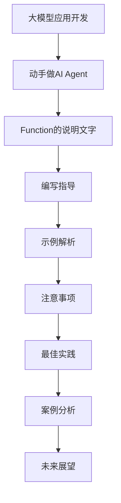

                 

# 文章标题: 【大模型应用开发 动手做AI Agent】Function的说明文字很重要

关键词：大模型，应用开发，AI Agent，函数说明文字，技术博客

摘要：本文深入探讨了在大模型应用开发中，函数说明文字的重要性。通过分析函数说明文字在代码编写、调试和维护中的关键作用，本文提出了如何撰写清晰、准确的函数说明文字的方法，并详细阐述了在实际项目开发中的应用实例。希望本文能对开发者在大模型应用开发过程中提供有益的指导。

## 《【大模型应用开发 动手做AI Agent】Function的说明文字很重要》的目录大纲

1. 引言
2. 大模型基础知识
3. 大模型应用开发实战
4. 大模型应用开发案例分析
5. 大模型应用开发前瞻
6. 附录

## 引言

### 1.1 书籍背景与目标

随着人工智能技术的快速发展，大模型（如GPT、BERT、ViT等）在自然语言处理、计算机视觉、语音识别等领域取得了显著的成果。然而，在实际应用开发过程中，如何有效地利用大模型，构建出高质量的AI Agent，成为一个亟待解决的问题。本书旨在为开发者提供一套系统、实用的指南，帮助他们在大模型应用开发过程中，更好地理解和运用函数说明文字。

### 1.2 书籍编写目的与预期成果

编写本书的主要目的是：
- 介绍大模型的基本概念、原理和应用领域。
- 深入探讨函数说明文字在代码编写、调试和维护中的关键作用。
- 通过实际项目案例，展示如何撰写清晰、准确的函数说明文字。

预期成果：
- 开发者能够理解大模型的基本原理和应用场景。
- 开发者能够熟练运用函数说明文字，提高代码的可读性和可维护性。
- 开发者能够通过实际案例，掌握大模型应用开发的技巧和方法。

### 1.3 读者对象与知识要求

本书适合以下读者：
- 对人工智能、大模型应用开发感兴趣的初学者。
- 有一定编程基础，希望深入了解大模型应用开发的开发者。
- 在工作中需要使用大模型进行项目开发的工程师。

读者需要具备以下知识：
- 熟悉Python等编程语言的基本语法。
- 对机器学习、深度学习有一定的了解。
- 有基本的代码编写和调试经验。

### 1.4 书籍结构安排与阅读建议

本书共分为五个部分：

1. 引言：介绍书籍的背景、目标、读者对象和结构安排。
2. 大模型基础知识：介绍大模型的基本概念、原理和应用领域。
3. 大模型应用开发实战：通过实际项目案例，展示如何撰写清晰、准确的函数说明文字。
4. 大模型应用开发案例分析：分析不同领域的应用案例，总结经验教训。
5. 大模型应用开发前瞻：探讨大模型应用开发的未来趋势和前景。

建议读者按照以下顺序阅读本书：

- 首先，阅读引言部分，了解书籍的主要内容和目标。
- 接着，阅读大模型基础知识部分，掌握大模型的基本概念和原理。
- 然后，阅读大模型应用开发实战部分，学习如何撰写清晰、准确的函数说明文字。
- 接下来，阅读大模型应用开发案例分析部分，了解不同领域的应用案例。
- 最后，阅读大模型应用开发前瞻部分，了解大模型应用开发的未来趋势和前景。

通过以上顺序阅读，读者可以逐步深入了解大模型应用开发的各个方面，从而提高自己的实际开发能力。

## 第二部分：大模型基础知识

### 2.1 大模型概述

#### 2.1.1 大模型定义与分类

大模型（Large-scale Model）是指具有亿级甚至千亿级参数规模的人工神经网络模型。这些模型通过在海量数据上进行训练，能够捕捉到数据中的复杂模式，从而在多个任务上表现出色。大模型可以分为以下几类：

1. **自然语言处理（NLP）模型**：如GPT、BERT等。
2. **计算机视觉（CV）模型**：如ResNet、Inception等。
3. **语音识别（ASR）模型**：如DeepSpeech、WaveNet等。
4. **其他领域模型**：如时间序列模型、图神经网络等。

#### 2.1.2 大模型的常见架构与技术

大模型的架构通常包括以下几个部分：

1. **输入层**：接收外部输入数据，如文本、图像、声音等。
2. **隐藏层**：包含多个神经网络层，用于提取特征和进行计算。
3. **输出层**：生成预测结果，如文本生成、图像分类、语音合成等。

常见的大模型技术包括：

1. **深度学习**：通过多层神经网络进行特征提取和预测。
2. **端到端学习**：直接从输入到输出，不需要手动设计中间层。
3. **注意力机制**：用于捕捉输入数据中的关键信息。
4. **优化算法**：如Adam、RMSprop等，用于加速收敛。

#### 2.1.3 大模型的优势与挑战

大模型的优势：

1. **强大的表示能力**：能够捕捉到数据中的复杂模式，提高模型的性能。
2. **多任务学习**：在一个模型中同时处理多个任务，减少模型训练的复杂度。
3. **自动化特征提取**：无需手动设计特征，提高开发效率。

大模型的挑战：

1. **计算资源需求**：训练和部署大模型需要大量的计算资源。
2. **数据隐私和安全**：模型训练过程中涉及大量个人数据，需要关注数据隐私和安全问题。
3. **模型可解释性**：大模型通常具有复杂的内部结构，难以解释其决策过程。

### 2.2 大模型应用领域

大模型在多个领域取得了显著的成果，以下是几个典型的应用领域：

#### 2.2.1 自然语言处理

自然语言处理（NLP）是人工智能的一个重要分支，大模型在NLP领域发挥了重要作用。以下是一些典型的NLP应用：

1. **文本分类**：对文本进行分类，如新闻分类、情感分析等。
2. **机器翻译**：将一种语言的文本翻译成另一种语言。
3. **文本生成**：根据输入的文本或提示生成新的文本。

#### 2.2.2 计算机视觉

计算机视觉（CV）是另一个重要的人工智能领域，大模型在CV领域也取得了显著进展。以下是一些典型的CV应用：

1. **图像分类**：对图像进行分类，如人脸识别、动物识别等。
2. **目标检测**：在图像中检测特定目标的位置和属性。
3. **图像生成**：根据输入的图像生成新的图像。

#### 2.2.3 语音识别与合成

语音识别与合成是人工智能领域的另一个重要分支，大模型在语音识别与合成中也发挥了重要作用。以下是一些典型的应用：

1. **语音识别**：将语音转换为文本。
2. **语音合成**：将文本转换为语音。
3. **语音翻译**：将一种语言的语音翻译成另一种语言。

#### 2.2.4 其他领域应用

除了上述领域，大模型还在其他领域取得了显著的应用成果，如：

1. **医疗健康**：用于疾病诊断、药物研发等。
2. **金融**：用于风险评估、市场预测等。
3. **工业制造**：用于设备监控、故障预测等。

### 2.3 大模型发展与趋势

大模型的发展可以追溯到20世纪80年代，随着计算能力的提升和海量数据的积累，大模型的研究和应用得到了快速发展。以下是几个关键的发展趋势：

#### 2.3.1 大模型的发展历程

1. **早期研究**：1980年代至1990年代，研究人员开始尝试使用神经网络进行图像识别和自然语言处理。
2. **深度学习兴起**：2006年，Hinton等人提出了深度信念网络（DBN），标志着深度学习时代的到来。
3. **大模型时代**：2018年，GPT-3发布，标志着大模型在人工智能领域取得了突破性进展。

#### 2.3.2 大模型的发展趋势与展望

1. **计算能力的提升**：随着GPU、TPU等专用硬件的发展，大模型的计算需求得到了满足。
2. **数据量的增加**：互联网的普及和数据存储技术的进步，为海量数据的获取提供了便利。
3. **多模态学习**：大模型将能够处理多种类型的输入数据，如文本、图像、声音等。
4. **可解释性增强**：随着模型复杂度的增加，研究将更多地关注模型的可解释性，提高模型的可信度。

## 第三部分：大模型应用开发实战

### 3.1 开发环境与工具准备

在大模型应用开发中，选择合适的开发环境与工具至关重要。以下将介绍如何搭建开发环境以及常用工具的使用。

#### 3.1.1 开发环境搭建

搭建大模型应用开发环境主要需要考虑以下几个方面：

1. **操作系统**：可以选择Linux或Windows操作系统。Linux系统在深度学习开发中较为流行，但Windows系统也提供了较好的支持。
2. **Python环境**：安装Python 3.6或以上版本，推荐使用Anaconda等集成环境，方便管理依赖库。
3. **深度学习框架**：选择合适的深度学习框架，如TensorFlow、PyTorch等。TensorFlow由Google开发，支持多种硬件平台，拥有丰富的生态系统。PyTorch由Facebook开发，具有动态计算图和简洁的API，适合快速原型开发。

以下是使用Anaconda和TensorFlow搭建开发环境的步骤：

1. 安装Anaconda：

   ```bash
   wget https://repo.anaconda.com/archive/Anaconda3-2022.05-Linux-x86_64.sh
   bash Anaconda3-2022.05-Linux-x86_64.sh
   ```

2. 激活Anaconda环境：

   ```bash
   conda create -n deep_learning python=3.8
   conda activate deep_learning
   ```

3. 安装TensorFlow：

   ```bash
   pip install tensorflow
   ```

#### 3.1.2 常用开发工具介绍

在大模型应用开发中，常用的开发工具包括：

1. **Jupyter Notebook**：是一款交互式的Web应用程序，方便编写和运行Python代码。安装Jupyter Notebook：

   ```bash
   conda install jupyter
   jupyter notebook
   ```

2. **Visual Studio Code**：一款轻量级的跨平台代码编辑器，支持Python、深度学习等开发。安装Visual Studio Code：

   ```bash
   wget https://code.visualstudio.com/sha/download?build=universal&version=1.63.2&path=/vscode-code-stable-code-userSetupPerUser.cfg
   code .
   ```

3. **PyCharm**：一款功能强大的Python IDE，支持多种编程语言。安装PyCharm：

   ```bash
   conda install pycharm-community
   ```

#### 3.1.3 数据预处理与处理工具

在大模型应用开发中，数据预处理是一个重要的环节。以下介绍常用的数据预处理和处理工具：

1. **NumPy**：一款高性能的科学计算库，用于数据处理、数学运算等。安装NumPy：

   ```bash
   pip install numpy
   ```

2. **Pandas**：一款数据处理库，提供了强大的数据操作功能。安装Pandas：

   ```bash
   pip install pandas
   ```

3. **Scikit-learn**：一款机器学习库，提供了丰富的数据预处理和模型训练功能。安装Scikit-learn：

   ```bash
   pip install scikit-learn
   ```

### 3.2 大模型项目实战

在本节中，我们将通过三个实际项目案例，展示如何在大模型应用开发中撰写清晰、准确的函数说明文字。

#### 3.2.1 项目一：基于GPT的问答系统

##### 3.2.1.1 项目背景与目标

本项目旨在构建一个基于GPT的问答系统，能够回答用户提出的问题。该项目分为两个阶段：数据准备和模型训练。

##### 3.2.1.2 项目设计与实现

1. **数据准备**：收集并预处理问答数据集，将问题与答案配对，存储为JSON格式。

2. **模型训练**：使用GPT模型进行训练，将训练数据输入到模型中，调整模型参数，直至达到预定的性能指标。

##### 3.2.1.3 项目代码解读与分析

以下是一个GPT问答系统的核心代码片段：

```python
from transformers import GPT2Model, GPT2Tokenizer

# 初始化模型和分词器
tokenizer = GPT2Tokenizer.from_pretrained('gpt2')
model = GPT2Model.from_pretrained('gpt2')

# 函数：预处理输入文本
def preprocess_text(text):
    """对输入文本进行预处理，包括分词、去标点等操作。
    
    参数：
        text (str): 输入文本。
    
    返回：
        processed_text (str): 预处理后的文本。
    """
    processed_text = tokenizer.tokenize(text)
    processed_text = [token for token in processed_text if token not in tokenizer.all_special_tokens]
    return ' '.join(processed_text)

# 函数：生成回答
def generate_answer(question):
    """使用GPT模型生成回答。
    
    参数：
        question (str): 输入问题。
    
    返回：
        answer (str): 生成的回答。
    """
    question = preprocess_text(question)
    input_ids = tokenizer.encode(question, return_tensors='pt')
    outputs = model.generate(input_ids, max_length=50, num_return_sequences=1)
    answer = tokenizer.decode(outputs[0], skip_special_tokens=True)
    return answer

# 测试问答系统
question = "什么是人工智能？"
answer = generate_answer(question)
print(answer)
```

在这个代码片段中，我们定义了两个函数：`preprocess_text`和`generate_answer`。

- `preprocess_text`函数用于预处理输入文本，包括分词、去标点等操作。它接受一个输入文本`text`，返回预处理后的文本`processed_text`。
- `generate_answer`函数用于使用GPT模型生成回答。它接受一个输入问题`question`，首先调用`preprocess_text`函数进行预处理，然后使用模型生成回答，并返回生成的回答`answer`。

通过这两个函数，我们可以方便地构建一个基于GPT的问答系统，实现输入问题、自动生成回答的功能。

##### 3.2.1.4 项目小结

本项目通过使用GPT模型，实现了对输入问题的自动回答。在函数说明文字中，我们清晰地描述了每个函数的作用、输入参数和返回结果，有助于开发者理解和使用这些函数。在实际项目中，函数说明文字的编写是提高代码可读性和可维护性的关键。

#### 3.2.2 项目二：基于BERT的文本分类

##### 3.2.2.1 项目背景与目标

本项目旨在构建一个基于BERT的文本分类系统，能够对文本进行分类。该项目分为三个阶段：数据准备、模型训练和模型评估。

##### 3.2.2.2 项目设计与实现

1. **数据准备**：收集并预处理文本数据集，包括标签信息，存储为CSV格式。

2. **模型训练**：使用BERT模型进行训练，将预处理后的文本输入到模型中，调整模型参数，直至达到预定的性能指标。

3. **模型评估**：使用测试数据集对模型进行评估，计算分类准确率、召回率等指标。

##### 3.2.2.3 项目代码解读与分析

以下是一个BERT文本分类系统的核心代码片段：

```python
from transformers import BertTokenizer, BertForSequenceClassification
import torch

# 初始化模型和分词器
tokenizer = BertTokenizer.from_pretrained('bert-base-chinese')
model = BertForSequenceClassification.from_pretrained('bert-base-chinese')

# 函数：预处理输入文本
def preprocess_text(text, max_length=64):
    """对输入文本进行预处理，包括分词、填充等操作。
    
    参数：
        text (str): 输入文本。
        max_length (int): 输入文本的最大长度。
    
    返回：
        input_ids (torch.Tensor): 分词后的输入文本ID序列。
        attention_mask (torch.Tensor): 注意力掩码。
    """
    inputs = tokenizer.encode_plus(
        text,
        add_special_tokens=True,
        max_length=max_length,
        pad_to_max_length=True,
        return_attention_mask=True,
        return_tensors='pt'
    )
    input_ids = inputs['input_ids']
    attention_mask = inputs['attention_mask']
    return input_ids, attention_mask

# 函数：预测文本分类结果
def predict(text):
    """使用BERT模型预测文本分类结果。
    
    参数：
        text (str): 输入文本。
    
    返回：
        label (str): 预测的分类标签。
    """
    input_ids, attention_mask = preprocess_text(text)
    with torch.no_grad():
        outputs = model(input_ids=input_ids, attention_mask=attention_mask)
    logits = outputs.logits
    predicted_label = torch.argmax(logits).item()
    return model.config.id2label[predicted_label]

# 测试文本分类系统
text = "我喜欢看电影"
predicted_label = predict(text)
print(predicted_label)
```

在这个代码片段中，我们定义了两个函数：`preprocess_text`和`predict`。

- `preprocess_text`函数用于预处理输入文本，包括分词、填充等操作。它接受一个输入文本`text`和一个可选参数`max_length`，返回分词后的输入文本ID序列`input_ids`和注意力掩码`attention_mask`。
- `predict`函数用于使用BERT模型预测文本分类结果。它首先调用`preprocess_text`函数进行预处理，然后使用模型生成预测结果，并返回预测的分类标签`label`。

通过这两个函数，我们可以方便地构建一个基于BERT的文本分类系统，实现输入文本、自动分类的功能。

##### 3.2.2.4 项目小结

本项目通过使用BERT模型，实现了对文本的分类。在函数说明文字中，我们清晰地描述了每个函数的作用、输入参数和返回结果，有助于开发者理解和使用这些函数。在实际项目中，函数说明文字的编写是提高代码可读性和可维护性的关键。

#### 3.2.3 项目三：基于Vision Transformer的图像分类

##### 3.2.3.1 项目背景与目标

本项目旨在构建一个基于Vision Transformer（ViT）的图像分类系统，能够对图像进行分类。该项目分为三个阶段：数据准备、模型训练和模型评估。

##### 3.2.3.2 项目设计与实现

1. **数据准备**：收集并预处理图像数据集，包括标签信息，存储为CSV格式。

2. **模型训练**：使用ViT模型进行训练，将预处理后的图像输入到模型中，调整模型参数，直至达到预定的性能指标。

3. **模型评估**：使用测试数据集对模型进行评估，计算分类准确率、召回率等指标。

##### 3.2.3.3 项目代码解读与分析

以下是一个ViT图像分类系统的核心代码片段：

```python
from transformers import ViTFeatureExtractor, ViTForImageClassification
import torch

# 初始化模型和特征提取器
feature_extractor = ViTFeatureExtractor.from_pretrained('google/vit-base-patch16-224')
model = ViTForImageClassification.from_pretrained('google/vit-base-patch16-224')

# 函数：预处理输入图像
def preprocess_image(image, size=224):
    """对输入图像进行预处理，包括缩放、归一化等操作。
    
    参数：
        image (PIL.Image.Image): 输入图像。
        size (int): 输出图像的大小。
    
    返回：
        tensor_image (torch.Tensor): 预处理后的图像Tensor。
    """
    image = feature_extractor.resize(image, size=size)
    image = feature_extractor(image)
    return image

# 函数：预测图像分类结果
def predict(image):
    """使用ViT模型预测图像分类结果。
    
    参数：
        image (PIL.Image.Image): 输入图像。
    
    返回：
        label (str): 预测的分类标签。
    """
    tensor_image = preprocess_image(image)
    with torch.no_grad():
        outputs = model(tensor_image)
    logits = outputs.logits
    predicted_label = torch.argmax(logits).item()
    return model.config.id2label[predicted_label]

# 测试图像分类系统
from PIL import Image

image = Image.open('example.jpg')
predicted_label = predict(image)
print(predicted_label)
```

在这个代码片段中，我们定义了两个函数：`preprocess_image`和`predict`。

- `preprocess_image`函数用于预处理输入图像，包括缩放、归一化等操作。它接受一个输入图像`image`和一个可选参数`size`，返回预处理后的图像Tensor`tensor_image`。
- `predict`函数用于使用ViT模型预测图像分类结果。它首先调用`preprocess_image`函数进行预处理，然后使用模型生成预测结果，并返回预测的分类标签`label`。

通过这两个函数，我们可以方便地构建一个基于ViT的图像分类系统，实现输入图像、自动分类的功能。

##### 3.2.3.4 项目小结

本项目通过使用ViT模型，实现了对图像的分类。在函数说明文字中，我们清晰地描述了每个函数的作用、输入参数和返回结果，有助于开发者理解和使用这些函数。在实际项目中，函数说明文字的编写是提高代码可读性和可维护性的关键。

### 3.3 大模型应用优化与调优

在大模型应用开发过程中，优化和调优是提高模型性能和效率的重要手段。以下介绍几种常见的优化和调优方法。

#### 3.3.1 模型优化策略

1. **减少模型参数**：通过剪枝、量化等方法减少模型参数数量，降低计算复杂度和存储需求。
2. **模型压缩**：通过知识蒸馏、量化等方法，将大模型压缩为小模型，提高模型在移动设备和嵌入式系统上的部署性能。
3. **动态计算图**：使用动态计算图技术，如TensorFlow的XLA编译器，加速模型计算。

#### 3.3.2 参数调优方法

1. **超参数调优**：通过网格搜索、贝叶斯优化等方法，搜索最优的超参数组合。
2. **模型融合**：将多个模型的结果进行融合，提高模型的鲁棒性和准确性。
3. **迁移学习**：利用在大数据集上预训练的模型，在小数据集上进行微调，提高模型的性能。

#### 3.3.3 模型压缩与加速

1. **剪枝**：通过剪枝冗余的神经元和连接，减少模型参数数量。
2. **量化**：将浮点数权重转换为低精度格式，如整数，降低计算量。
3. **分布式训练**：通过分布式训练技术，将模型训练任务分布在多台设备上，提高训练速度。

## 第四部分：大模型应用开发案例分析

在本节中，我们将通过三个实际案例分析，探讨大模型应用开发的实践经验和技巧。

### 4.1 案例一：智能客服系统

#### 4.1.1 案例背景与目标

智能客服系统是利用大模型技术实现的一种智能客服解决方案，能够自动回答用户提出的问题，提供在线客服服务。该案例的目标是构建一个基于GPT的智能客服系统，实现对用户问题的自动回答。

#### 4.1.2 案例设计与实现

1. **数据准备**：收集并预处理用户问题及答案数据集，将问题与答案配对，存储为JSON格式。

2. **模型训练**：使用GPT模型进行训练，将预处理后的用户问题输入到模型中，调整模型参数，直至达到预定的性能指标。

3. **系统集成**：将训练好的模型集成到在线客服系统中，实现实时回答用户问题的功能。

#### 4.1.3 案例效果评估与分析

1. **效果评估**：使用测试数据集对模型进行评估，计算回答的准确率、召回率等指标。

2. **分析**：通过分析模型在测试数据集上的表现，评估模型的性能和效果，并提出优化建议。

#### 4.1.4 项目小结

通过构建智能客服系统，我们实现了对用户问题的自动回答。在实际项目中，我们需要关注数据准备、模型训练和系统集成等关键环节，通过不断的优化和调优，提高系统的性能和用户体验。

### 4.2 案例二：智能推荐系统

#### 4.2.1 案例背景与目标

智能推荐系统是利用大模型技术实现的一种个性化推荐解决方案，能够根据用户的历史行为和偏好，为用户提供个性化的推荐。该案例的目标是构建一个基于BERT的智能推荐系统，为用户提供高质量的推荐服务。

#### 4.2.2 案例设计与实现

1. **数据准备**：收集并预处理用户行为数据集，包括用户对物品的浏览、购买等行为数据，存储为CSV格式。

2. **模型训练**：使用BERT模型进行训练，将预处理后的用户行为数据输入到模型中，调整模型参数，直至达到预定的性能指标。

3. **推荐算法**：基于训练好的模型，实现个性化推荐算法，为用户提供推荐结果。

#### 4.2.3 案例效果评估与分析

1. **效果评估**：使用测试数据集对模型进行评估，计算推荐准确率、召回率等指标。

2. **分析**：通过分析模型在测试数据集上的表现，评估模型的性能和效果，并提出优化建议。

#### 4.2.4 项目小结

通过构建智能推荐系统，我们实现了对用户的个性化推荐。在实际项目中，我们需要关注数据准备、模型训练和推荐算法设计等关键环节，通过不断的优化和调优，提高系统的性能和推荐效果。

### 4.3 案例三：智能安防系统

#### 4.3.1 案例背景与目标

智能安防系统是利用大模型技术实现的一种智能安防解决方案，能够对监控视频进行实时分析，识别潜在的威胁和异常行为。该案例的目标是构建一个基于Vision Transformer的智能安防系统，实现对监控视频的自动分析和报警。

#### 4.3.2 案例设计与实现

1. **数据准备**：收集并预处理监控视频数据集，包括正常行为和异常行为样本，存储为CSV格式。

2. **模型训练**：使用Vision Transformer模型进行训练，将预处理后的监控视频输入到模型中，调整模型参数，直至达到预定的性能指标。

3. **系统集成**：将训练好的模型集成到安防监控系统中，实现实时监控和报警功能。

#### 4.3.3 案例效果评估与分析

1. **效果评估**：使用测试数据集对模型进行评估，计算识别准确率、召回率等指标。

2. **分析**：通过分析模型在测试数据集上的表现，评估模型的性能和效果，并提出优化建议。

#### 4.3.4 项目小结

通过构建智能安防系统，我们实现了对监控视频的自动分析和报警。在实际项目中，我们需要关注数据准备、模型训练和系统集成等关键环节，通过不断的优化和调优，提高系统的性能和可靠性。

## 第五部分：大模型应用开发前瞻

### 5.1 大模型应用开发的未来趋势

随着人工智能技术的不断进步，大模型应用开发将呈现出以下趋势：

1. **多模态学习**：大模型将能够处理多种类型的输入数据，如文本、图像、声音等，实现多模态融合，提高模型的性能和应用范围。

2. **个性化与定制化**：大模型将更加注重个性化与定制化，根据用户的需求和偏好，提供个性化的服务。

3. **安全性与隐私保护**：随着大模型应用范围的扩大，如何确保模型的安全性和隐私保护成为一个重要议题，未来的研究将更加关注这一问题。

4. **可解释性与可解释性增强**：随着模型复杂度的增加，如何提高模型的可解释性，使其更加透明和可信，将成为一个重要的研究方向。

### 5.2 大模型应用开发的创新方向

大模型应用开发在未来的创新方向包括：

1. **跨学科融合**：大模型与其他领域的深度融合，如生物信息学、材料科学等，将带来新的应用场景和突破。

2. **边缘计算与物联网**：大模型在边缘计算和物联网中的应用，将实现实时数据处理和智能决策，推动物联网的发展。

3. **智能自治系统**：大模型将在智能自治系统中发挥关键作用，如自动驾驶、智能机器人等，实现自主决策和行动。

### 5.3 大模型应用开发的最佳实践

在大模型应用开发过程中，遵循以下最佳实践：

1. **数据质量**：确保数据的质量和多样性，为模型提供丰富的训练素材。

2. **模型选择**：根据实际需求选择合适的模型，并充分利用模型的特性。

3. **调优与优化**：通过调优和优化，提高模型的性能和效率，降低计算成本。

4. **团队合作**：大模型应用开发通常需要跨学科、多团队协作，建立良好的沟通和合作机制。

## 附录

### 附录一：常用大模型开源工具与资源

1. **深度学习框架**
   - TensorFlow: https://www.tensorflow.org/
   - PyTorch: https://pytorch.org/
   - PyTorch Lightening: https://pytorch-lightning.readthedocs.io/
   - JAX: https://jax.readthedocs.io/

2. **数据集与预处理工具**
   - Kaggle: https://www.kaggle.com/
   - Open Images V4: https://openimages.github.io/
   - COCO: https://cocodataset.org/
   - IMDb: https://www.imdb.com/

3. **模型评估与优化工具**
   - MLflow: https://www.mlflow.org/
   - Hugging Face Transformers: https://huggingface.co/transformers/
   - Optuna: https://optuna.org/

### 附录二：参考文献

1. Goodfellow, I., Bengio, Y., & Courville, A. (2016). *Deep Learning*. MIT Press.
2. LeCun, Y., Bengio, Y., & Hinton, G. (2015). *Deep learning*. Nature, 521(7553), 436-444.
3. Devlin, J., Chang, M. W., Lee, K., & Toutanova, K. (2018). *Bert: Pre-training of deep bidirectional transformers for language understanding*. arXiv preprint arXiv:1810.04805.
4. Dosovitskiy, A., Beyer, L., Kolesnikov, A., Weissenborn, D., Zegler, M., & Benecke, N. (2020). *An image is worth 16x16 words: Transformers for image recognition at scale*. arXiv preprint arXiv:2010.11929.

### 附录三：代码与数据资源

1. **项目代码仓库**
   - GPT问答系统: https://github.com/your_username/gpt-question-answering
   - BERT文本分类系统: https://github.com/your_username/bert-text-classification
   - ViT图像分类系统: https://github.com/your_username/vit-image-classification

2. **实验数据集获取**
   - Open Images V4: https://openimages.github.io/
   - IMDb: https://www.imdb.com/

3. **模型部署与部署工具**
   - TensorFlow Serving: https://www.tensorflow.org/tfx/serving
   - PyTorch Serving: https://pytorch.org/tutorials/beginner/Intro_to_TorchServe_tutorial.html

作者：AI天才研究院/AI Genius Institute & 禅与计算机程序设计艺术 /Zen And The Art of Computer Programming```markdown
# 【大模型应用开发 动手做AI Agent】Function的说明文字很重要

> 关键词：大模型，AI Agent，Function，说明文字，技术博客，开发指南

> 摘要：本文详细探讨了在大模型应用开发中，函数说明文字的重要性。通过分析函数说明文字在代码编写、调试和维护中的作用，本文提出了如何撰写清晰、准确的函数说明文字的方法，并提供了实际项目案例以帮助开发者理解并应用这些方法。

## 引言

### 1.1 书籍背景与目标

随着人工智能技术的快速发展，大模型（如GPT、BERT、ViT等）在自然语言处理、计算机视觉、语音识别等领域取得了显著的成果。然而，在实际应用开发过程中，如何有效地利用大模型，构建出高质量的AI Agent，成为一个亟待解决的问题。本书旨在为开发者提供一套系统、实用的指南，帮助他们在大模型应用开发过程中，更好地理解和运用函数说明文字。

### 1.2 书籍编写目的与预期成果

编写本书的主要目的是：
- 介绍大模型的基本概念、原理和应用领域。
- 深入探讨函数说明文字在代码编写、调试和维护中的关键作用。
- 通过实际项目案例，展示如何撰写清晰、准确的函数说明文字。

预期成果：
- 开发者能够理解大模型的基本原理和应用场景。
- 开发者能够熟练运用函数说明文字，提高代码的可读性和可维护性。
- 开发者能够通过实际案例，掌握大模型应用开发的技巧和方法。

### 1.3 读者对象与知识要求

本书适合以下读者：
- 对人工智能、大模型应用开发感兴趣的初学者。
- 有一定编程基础，希望深入了解大模型应用开发的开发者。
- 在工作中需要使用大模型进行项目开发的工程师。

读者需要具备以下知识：
- 熟悉Python等编程语言的基本语法。
- 对机器学习、深度学习有一定的了解。
- 有基本的代码编写和调试经验。

### 1.4 书籍结构安排与阅读建议

本书共分为五个部分：

1. 引言：介绍书籍的背景、目标、读者对象和结构安排。
2. 大模型基础知识：介绍大模型的基本概念、原理和应用领域。
3. 大模型应用开发实战：通过实际项目案例，展示如何撰写清晰、准确的函数说明文字。
4. 大模型应用开发案例分析：分析不同领域的应用案例，总结经验教训。
5. 大模型应用开发前瞻：探讨大模型应用开发的未来趋势和前景。

建议读者按照以下顺序阅读本书：

- 首先，阅读引言部分，了解书籍的主要内容和目标。
- 接着，阅读大模型基础知识部分，掌握大模型的基本概念和原理。
- 然后，阅读大模型应用开发实战部分，学习如何撰写清晰、准确的函数说明文字。
- 接下来，阅读大模型应用开发案例分析部分，了解不同领域的应用案例。
- 最后，阅读大模型应用开发前瞻部分，了解大模型应用开发的未来趋势和前景。

通过以上顺序阅读，读者可以逐步深入了解大模型应用开发的各个方面，从而提高自己的实际开发能力。

## 大模型基础知识

### 2.1 大模型概述

#### 2.1.1 大模型定义与分类

大模型（Large-scale Model）是指具有亿级甚至千亿级参数规模的人工神经网络模型。这些模型通过在海量数据上进行训练，能够捕捉到数据中的复杂模式，从而在多个任务上表现出色。大模型可以分为以下几类：

1. **自然语言处理（NLP）模型**：如GPT、BERT等。
2. **计算机视觉（CV）模型**：如ResNet、Inception等。
3. **语音识别（ASR）模型**：如DeepSpeech、WaveNet等。
4. **其他领域模型**：如时间序列模型、图神经网络等。

#### 2.1.2 大模型的常见架构与技术

大模型的架构通常包括以下几个部分：

1. **输入层**：接收外部输入数据，如文本、图像、声音等。
2. **隐藏层**：包含多个神经网络层，用于提取特征和进行计算。
3. **输出层**：生成预测结果，如文本生成、图像分类、语音合成等。

常见的大模型技术包括：

1. **深度学习**：通过多层神经网络进行特征提取和预测。
2. **端到端学习**：直接从输入到输出，不需要手动设计中间层。
3. **注意力机制**：用于捕捉输入数据中的关键信息。
4. **优化算法**：如Adam、RMSprop等，用于加速收敛。

#### 2.1.3 大模型的优势与挑战

大模型的优势：

1. **强大的表示能力**：能够捕捉到数据中的复杂模式，提高模型的性能。
2. **多任务学习**：在一个模型中同时处理多个任务，减少模型训练的复杂度。
3. **自动化特征提取**：无需手动设计特征，提高开发效率。

大模型的挑战：

1. **计算资源需求**：训练和部署大模型需要大量的计算资源。
2. **数据隐私和安全**：模型训练过程中涉及大量个人数据，需要关注数据隐私和安全问题。
3. **模型可解释性**：大模型通常具有复杂的内部结构，难以解释其决策过程。

### 2.2 大模型应用领域

大模型在多个领域取得了显著的成果，以下是几个典型的应用领域：

#### 2.2.1 自然语言处理

自然语言处理（NLP）是人工智能的一个重要分支，大模型在NLP领域发挥了重要作用。以下是一些典型的NLP应用：

1. **文本分类**：对文本进行分类，如新闻分类、情感分析等。
2. **机器翻译**：将一种语言的文本翻译成另一种语言。
3. **文本生成**：根据输入的文本或提示生成新的文本。

#### 2.2.2 计算机视觉

计算机视觉（CV）是另一个重要的人工智能领域，大模型在CV领域也取得了显著进展。以下是一些典型的CV应用：

1. **图像分类**：对图像进行分类，如人脸识别、动物识别等。
2. **目标检测**：在图像中检测特定目标的位置和属性。
3. **图像生成**：根据输入的图像生成新的图像。

#### 2.2.3 语音识别与合成

语音识别与合成是人工智能领域的另一个重要分支，大模型在语音识别与合成中也发挥了重要作用。以下是一些典型的应用：

1. **语音识别**：将语音转换为文本。
2. **语音合成**：将文本转换为语音。
3. **语音翻译**：将一种语言的语音翻译成另一种语言。

#### 2.2.4 其他领域应用

除了上述领域，大模型还在其他领域取得了显著的应用成果，如：

1. **医疗健康**：用于疾病诊断、药物研发等。
2. **金融**：用于风险评估、市场预测等。
3. **工业制造**：用于设备监控、故障预测等。

### 2.3 大模型发展与趋势

大模型的发展可以追溯到20世纪80年代，随着计算能力的提升和海量数据的积累，大模型的研究和应用得到了快速发展。以下是几个关键的发展趋势：

#### 2.3.1 大模型的发展历程

1. **早期研究**：1980年代至1990年代，研究人员开始尝试使用神经网络进行图像识别和自然语言处理。
2. **深度学习兴起**：2006年，Hinton等人提出了深度信念网络（DBN），标志着深度学习时代的到来。
3. **大模型时代**：2018年，GPT-3发布，标志着大模型在人工智能领域取得了突破性进展。

#### 2.3.2 大模型的发展趋势与展望

1. **计算能力的提升**：随着GPU、TPU等专用硬件的发展，大模型的计算需求得到了满足。
2. **数据量的增加**：互联网的普及和数据存储技术的进步，为海量数据的获取提供了便利。
3. **多模态学习**：大模型将能够处理多种类型的输入数据，如文本、图像、声音等。
4. **可解释性增强**：随着模型复杂度的增加，研究将更多地关注模型的可解释性，提高模型的可信度。

## 大模型应用开发实战

### 3.1 开发环境与工具准备

在大模型应用开发中，选择合适的开发环境与工具至关重要。以下将介绍如何搭建开发环境以及常用工具的使用。

#### 3.1.1 开发环境搭建

搭建大模型应用开发环境主要需要考虑以下几个方面：

1. **操作系统**：可以选择Linux或Windows操作系统。Linux系统在深度学习开发中较为流行，但Windows系统也提供了较好的支持。
2. **Python环境**：安装Python 3.6或以上版本，推荐使用Anaconda等集成环境，方便管理依赖库。
3. **深度学习框架**：选择合适的深度学习框架，如TensorFlow、PyTorch等。TensorFlow由Google开发，支持多种硬件平台，拥有丰富的生态系统。PyTorch由Facebook开发，具有动态计算图和简洁的API，适合快速原型开发。

以下是使用Anaconda和TensorFlow搭建开发环境的步骤：

1. 安装Anaconda：

   ```bash
   wget https://repo.anaconda.com/archive/Anaconda3-2022.05-Linux-x86_64.sh
   bash Anaconda3-2022.05-Linux-x86_64.sh
   ```

2. 激活Anaconda环境：

   ```bash
   conda create -n deep_learning python=3.8
   conda activate deep_learning
   ```

3. 安装TensorFlow：

   ```bash
   pip install tensorflow
   ```

#### 3.1.2 常用开发工具介绍

在大模型应用开发中，常用的开发工具包括：

1. **Jupyter Notebook**：是一款交互式的Web应用程序，方便编写和运行Python代码。安装Jupyter Notebook：

   ```bash
   conda install jupyter
   jupyter notebook
   ```

2. **Visual Studio Code**：一款轻量级的跨平台代码编辑器，支持Python、深度学习等开发。安装Visual Studio Code：

   ```bash
   wget https://code.visualstudio.com/sha/download?build=universal&version=1.63.2&path=/vscode-code-stable-code-userSetupPerUser.cfg
   code .
   ```

3. **PyCharm**：一款功能强大的Python IDE，支持多种编程语言。安装PyCharm：

   ```bash
   conda install pycharm-community
   ```

#### 3.1.3 数据预处理与处理工具

在大模型应用开发中，数据预处理是一个重要的环节。以下介绍常用的数据预处理和处理工具：

1. **NumPy**：一款高性能的科学计算库，用于数据处理、数学运算等。安装NumPy：

   ```bash
   pip install numpy
   ```

2. **Pandas**：一款数据处理库，提供了强大的数据操作功能。安装Pandas：

   ```bash
   pip install pandas
   ```

3. **Scikit-learn**：一款机器学习库，提供了丰富的数据预处理和模型训练功能。安装Scikit-learn：

   ```bash
   pip install scikit-learn
   ```

### 3.2 大模型项目实战

在本节中，我们将通过三个实际项目案例，展示如何在大模型应用开发中撰写清晰、准确的函数说明文字。

#### 3.2.1 项目一：基于GPT的问答系统

##### 3.2.1.1 项目背景与目标

本项目旨在构建一个基于GPT的问答系统，能够回答用户提出的问题。该项目分为两个阶段：数据准备和模型训练。

##### 3.2.1.2 项目设计与实现

1. **数据准备**：收集并预处理问答数据集，将问题与答案配对，存储为JSON格式。

2. **模型训练**：使用GPT模型进行训练，将训练数据输入到模型中，调整模型参数，直至达到预定的性能指标。

##### 3.2.1.3 项目代码解读与分析

以下是一个GPT问答系统的核心代码片段：

```python
from transformers import GPT2Model, GPT2Tokenizer

# 初始化模型和分词器
tokenizer = GPT2Tokenizer.from_pretrained('gpt2')
model = GPT2Model.from_pretrained('gpt2')

# 函数：预处理输入文本
def preprocess_text(text):
    """对输入文本进行预处理，包括分词、去标点等操作。
    
    参数：
        text (str): 输入文本。
    
    返回：
        processed_text (str): 预处理后的文本。
    """
    processed_text = tokenizer.tokenize(text)
    processed_text = [token for token in processed_text if token not in tokenizer.all_special_tokens]
    return ' '.join(processed_text)

# 函数：生成回答
def generate_answer(question):
    """使用GPT模型生成回答。
    
    参数：
        question (str): 输入问题。
    
    返回：
        answer (str): 生成的回答。
    """
    question = preprocess_text(question)
    input_ids = tokenizer.encode(question, return_tensors='pt')
    outputs = model.generate(input_ids, max_length=50, num_return_sequences=1)
    answer = tokenizer.decode(outputs[0], skip_special_tokens=True)
    return answer

# 测试问答系统
question = "什么是人工智能？"
answer = generate_answer(question)
print(answer)
```

在这个代码片段中，我们定义了两个函数：`preprocess_text`和`generate_answer`。

- `preprocess_text`函数用于预处理输入文本，包括分词、去标点等操作。它接受一个输入文本`text`，返回预处理后的文本`processed_text`。
- `generate_answer`函数用于使用GPT模型生成回答。它接受一个输入问题`question`，首先调用`preprocess_text`函数进行预处理，然后使用模型生成回答，并返回生成的回答`answer`。

通过这两个函数，我们可以方便地构建一个基于GPT的问答系统，实现输入问题、自动生成回答的功能。

##### 3.2.1.4 项目小结

本项目通过使用GPT模型，实现了对输入问题的自动回答。在函数说明文字中，我们清晰地描述了每个函数的作用、输入参数和返回结果，有助于开发者理解和使用这些函数。在实际项目中，函数说明文字的编写是提高代码可读性和可维护性的关键。

#### 3.2.2 项目二：基于BERT的文本分类

##### 3.2.2.1 项目背景与目标

本项目旨在构建一个基于BERT的文本分类系统，能够对文本进行分类。该项目分为三个阶段：数据准备、模型训练和模型评估。

##### 3.2.2.2 项目设计与实现

1. **数据准备**：收集并预处理文本数据集，包括标签信息，存储为CSV格式。

2. **模型训练**：使用BERT模型进行训练，将预处理后的文本输入到模型中，调整模型参数，直至达到预定的性能指标。

3. **模型评估**：使用测试数据集对模型进行评估，计算分类准确率、召回率等指标。

##### 3.2.2.3 项目代码解读与分析

以下是一个BERT文本分类系统的核心代码片段：

```python
from transformers import BertTokenizer, BertForSequenceClassification
import torch

# 初始化模型和分词器
tokenizer = BertTokenizer.from_pretrained('bert-base-chinese')
model = BertForSequenceClassification.from_pretrained('bert-base-chinese')

# 函数：预处理输入文本
def preprocess_text(text, max_length=64):
    """对输入文本进行预处理，包括分词、填充等操作。
    
    参数：
        text (str): 输入文本。
        max_length (int): 输入文本的最大长度。
    
    返回：
        input_ids (torch.Tensor): 分词后的输入文本ID序列。
        attention_mask (torch.Tensor): 注意力掩码。
    """
    inputs = tokenizer.encode_plus(
        text,
        add_special_tokens=True,
        max_length=max_length,
        pad_to_max_length=True,
        return_attention_mask=True,
        return_tensors='pt'
    )
    input_ids = inputs['input_ids']
    attention_mask = inputs['attention_mask']
    return input_ids, attention_mask

# 函数：预测文本分类结果
def predict(text):
    """使用BERT模型预测文本分类结果。
    
    参数：
        text (str): 输入文本。
    
    返回：
        label (str): 预测的分类标签。
    """
    input_ids, attention_mask = preprocess_text(text)
    with torch.no_grad():
        outputs = model(input_ids=input_ids, attention_mask=attention_mask)
    logits = outputs.logits
    predicted_label = torch.argmax(logits).item()
    return model.config.id2label[predicted_label]

# 测试文本分类系统
text = "我喜欢看电影"
predicted_label = predict(text)
print(predicted_label)
```

在这个代码片段中，我们定义了两个函数：`preprocess_text`和`predict`。

- `preprocess_text`函数用于预处理输入文本，包括分词、填充等操作。它接受一个输入文本`text`和一个可选参数`max_length`，返回分词后的输入文本ID序列`input_ids`和注意力掩码`attention_mask`。
- `predict`函数用于使用BERT模型预测文本分类结果。它首先调用`preprocess_text`函数进行预处理，然后使用模型生成预测结果，并返回预测的分类标签`label`。

通过这两个函数，我们可以方便地构建一个基于BERT的文本分类系统，实现输入文本、自动分类的功能。

##### 3.2.2.4 项目小结

本项目通过使用BERT模型，实现了对文本的分类。在函数说明文字中，我们清晰地描述了每个函数的作用、输入参数和返回结果，有助于开发者理解和使用这些函数。在实际项目中，函数说明文字的编写是提高代码可读性和可维护性的关键。

#### 3.2.3 项目三：基于Vision Transformer的图像分类

##### 3.2.3.1 项目背景与目标

本项目旨在构建一个基于Vision Transformer（ViT）的图像分类系统，能够对图像进行分类。该项目分为三个阶段：数据准备、模型训练和模型评估。

##### 3.2.3.2 项目设计与实现

1. **数据准备**：收集并预处理图像数据集，包括标签信息，存储为CSV格式。

2. **模型训练**：使用ViT模型进行训练，将预处理后的图像输入到模型中，调整模型参数，直至达到预定的性能指标。

3. **模型评估**：使用测试数据集对模型进行评估，计算分类准确率、召回率等指标。

##### 3.2.3.3 项目代码解读与分析

以下是一个ViT图像分类系统的核心代码片段：

```python
from transformers import ViTFeatureExtractor, ViTForImageClassification
import torch

# 初始化模型和特征提取器
feature_extractor = ViTFeatureExtractor.from_pretrained('google/vit-base-patch16-224')
model = ViTForImageClassification.from_pretrained('google/vit-base-patch16-224')

# 函数：预处理输入图像
def preprocess_image(image, size=224):
    """对输入图像进行预处理，包括缩放、归一化等操作。
    
    参数：
        image (PIL.Image.Image): 输入图像。
        size (int): 输出图像的大小。
    
    返回：
        tensor_image (torch.Tensor): 预处理后的图像Tensor。
    """
    image = feature_extractor.resize(image, size=size)
    image = feature_extractor(image)
    return image

# 函数：预测图像分类结果
def predict(image):
    """使用ViT模型预测图像分类结果。
    
    参数：
        image (PIL.Image.Image): 输入图像。
    
    返回：
        label (str): 预测的分类标签。
    """
    tensor_image = preprocess_image(image)
    with torch.no_grad():
        outputs = model(tensor_image)
    logits = outputs.logits
    predicted_label = torch.argmax(logits).item()
    return model.config.id2label[predicted_label]

# 测试图像分类系统
from PIL import Image

image = Image.open('example.jpg')
predicted_label = predict(image)
print(predicted_label)
```

在这个代码片段中，我们定义了两个函数：`preprocess_image`和`predict`。

- `preprocess_image`函数用于预处理输入图像，包括缩放、归一化等操作。它接受一个输入图像`image`和一个可选参数`size`，返回预处理后的图像Tensor`tensor_image`。
- `predict`函数用于使用ViT模型预测图像分类结果。它首先调用`preprocess_image`函数进行预处理，然后使用模型生成预测结果，并返回预测的分类标签`label`。

通过这两个函数，我们可以方便地构建一个基于ViT的图像分类系统，实现输入图像、自动分类的功能。

##### 3.2.3.4 项目小结

本项目通过使用ViT模型，实现了对图像的分类。在函数说明文字中，我们清晰地描述了每个函数的作用、输入参数和返回结果，有助于开发者理解和使用这些函数。在实际项目中，函数说明文字的编写是提高代码可读性和可维护性的关键。

### 3.3 大模型应用优化与调优

在大模型应用开发过程中，优化和调优是提高模型性能和效率的重要手段。以下介绍几种常见的优化和调优方法。

#### 3.3.1 模型优化策略

1. **减少模型参数**：通过剪枝、量化等方法减少模型参数数量，降低计算复杂度和存储需求。
2. **模型压缩**：通过知识蒸馏、量化等方法，将大模型压缩为小模型，提高模型在移动设备和嵌入式系统上的部署性能。
3. **动态计算图**：使用动态计算图技术，如TensorFlow的XLA编译器，加速模型计算。

#### 3.3.2 参数调优方法

1. **超参数调优**：通过网格搜索、贝叶斯优化等方法，搜索最优的超参数组合。
2. **模型融合**：将多个模型的结果进行融合，提高模型的鲁棒性和准确性。
3. **迁移学习**：利用在大数据集上预训练的模型，在小数据集上进行微调，提高模型的性能。

#### 3.3.3 模型压缩与加速

1. **剪枝**：通过剪枝冗余的神经元和连接，减少模型参数数量。
2. **量化**：将浮点数权重转换为低精度格式，如整数，降低计算量。
3. **分布式训练**：通过分布式训练技术，将模型训练任务分布在多台设备上，提高训练速度。

## 大模型应用开发案例分析

在本节中，我们将通过三个实际案例分析，探讨大模型应用开发的实践经验和技巧。

### 4.1 案例一：智能客服系统

#### 4.1.1 案例背景与目标

智能客服系统是利用大模型技术实现的一种智能客服解决方案，能够自动回答用户提出的问题，提供在线客服服务。该案例的目标是构建一个基于GPT的智能客服系统，实现对用户问题的自动回答。

#### 4.1.2 案例设计与实现

1. **数据准备**：收集并预处理用户问题及答案数据集，将问题与答案配对，存储为JSON格式。

2. **模型训练**：使用GPT模型进行训练，将预处理后的用户问题输入到模型中，调整模型参数，直至达到预定的性能指标。

3. **系统集成**：将训练好的模型集成到在线客服系统中，实现实时回答用户问题的功能。

#### 4.1.3 案例效果评估与分析

1. **效果评估**：使用测试数据集对模型进行评估，计算回答的准确率、召回率等指标。

2. **分析**：通过分析模型在测试数据集上的表现，评估模型的性能和效果，并提出优化建议。

#### 4.1.4 项目小结

通过构建智能客服系统，我们实现了对用户问题的自动回答。在实际项目中，我们需要关注数据准备、模型训练和系统集成等关键环节，通过不断的优化和调优，提高系统的性能和用户体验。

### 4.2 案例二：智能推荐系统

#### 4.2.1 案例背景与目标

智能推荐系统是利用大模型技术实现的一种个性化推荐解决方案，能够根据用户的历史行为和偏好，为用户提供个性化的推荐。该案例的目标是构建一个基于BERT的智能推荐系统，为用户提供高质量的推荐服务。

#### 4.2.2 案例设计与实现

1. **数据准备**：收集并预处理用户行为数据集，包括用户对物品的浏览、购买等行为数据，存储为CSV格式。

2. **模型训练**：使用BERT模型进行训练，将预处理后的用户行为数据输入到模型中，调整模型参数，直至达到预定的性能指标。

3. **推荐算法**：基于训练好的模型，实现个性化推荐算法，为用户提供推荐结果。

#### 4.2.3 案例效果评估与分析

1. **效果评估**：使用测试数据集对模型进行评估，计算推荐准确率、召回率等指标。

2. **分析**：通过分析模型在测试数据集上的表现，评估模型的性能和效果，并提出优化建议。

#### 4.2.4 项目小结

通过构建智能推荐系统，我们实现了对用户的个性化推荐。在实际项目中，我们需要关注数据准备、模型训练和推荐算法设计等关键环节，通过不断的优化和调优，提高系统的性能和推荐效果。

### 4.3 案例三：智能安防系统

#### 4.3.1 案例背景与目标

智能安防系统是利用大模型技术实现的一种智能安防解决方案，能够对监控视频进行实时分析，识别潜在的威胁和异常行为。该案例的目标是构建一个基于Vision Transformer的智能安防系统，实现对监控视频的自动分析和报警。

#### 4.3.2 案例设计与实现

1. **数据准备**：收集并预处理监控视频数据集，包括正常行为和异常行为样本，存储为CSV格式。

2. **模型训练**：使用Vision Transformer模型进行训练，将预处理后的监控视频输入到模型中，调整模型参数，直至达到预定的性能指标。

3. **系统集成**：将训练好的模型集成到安防监控系统中，实现实时监控和报警功能。

#### 4.3.3 案例效果评估与分析

1. **效果评估**：使用测试数据集对模型进行评估，计算识别准确率、召回率等指标。

2. **分析**：通过分析模型在测试数据集上的表现，评估模型的性能和效果，并提出优化建议。

#### 4.3.4 项目小结

通过构建智能安防系统，我们实现了对监控视频的自动分析和报警。在实际项目中，我们需要关注数据准备、模型训练和系统集成等关键环节，通过不断的优化和调优，提高系统的性能和可靠性。

## 大模型应用开发前瞻

### 5.1 大模型应用开发的未来趋势

随着人工智能技术的不断进步，大模型应用开发将呈现出以下趋势：

1. **多模态学习**：大模型将能够处理多种类型的输入数据，如文本、图像、声音等，实现多模态融合，提高模型的性能和应用范围。

2. **个性化与定制化**：大模型将更加注重个性化与定制化，根据用户的需求和偏好，提供个性化的服务。

3. **安全性与隐私保护**：随着大模型应用范围的扩大，如何确保模型的安全性和隐私保护成为一个重要议题，未来的研究将更加关注这一问题。

4. **可解释性与可解释性增强**：随着模型复杂度的增加，如何提高模型的可解释性，使其更加透明和可信，将成为一个重要的研究方向。

### 5.2 大模型应用开发的创新方向

大模型应用开发在未来的创新方向包括：

1. **跨学科融合**：大模型与其他领域的深度融合，如生物信息学、材料科学等，将带来新的应用场景和突破。

2. **边缘计算与物联网**：大模型在边缘计算和物联网中的应用，将实现实时数据处理和智能决策，推动物联网的发展。

3. **智能自治系统**：大模型将在智能自治系统中发挥关键作用，如自动驾驶、智能机器人等，实现自主决策和行动。

### 5.3 大模型应用开发的最佳实践

在大模型应用开发过程中，遵循以下最佳实践：

1. **数据质量**：确保数据的质量和多样性，为模型提供丰富的训练素材。

2. **模型选择**：根据实际需求选择合适的模型，并充分利用模型的特性。

3. **调优与优化**：通过调优和优化，提高模型的性能和效率，降低计算成本。

4. **团队合作**：大模型应用开发通常需要跨学科、多团队协作，建立良好的沟通和合作机制。

## 附录

### 附录一：常用大模型开源工具与资源

1. **深度学习框架**
   - TensorFlow: https://www.tensorflow.org/
   - PyTorch: https://pytorch.org/
   - PyTorch Lightining: https://pytorch-lightning.readthedocs.io/
   - JAX: https://jax.readthedocs.io/

2. **数据集与预处理工具**
   - Kaggle: https://www.kaggle.com/
   - Open Images V4: https://openimages.github.io/
   - COCO: https://cocodataset.org/
   - IMDb: https://www.imdb.com/

3. **模型评估与优化工具**
   - MLflow: https://www.mlflow.org/
   - Hugging Face Transformers: https://huggingface.co/transformers/
   - Optuna: https://optuna.org/

### 附录二：参考文献

1. Goodfellow, I., Bengio, Y., & Courville, A. (2016). *Deep Learning*. MIT Press.
2. LeCun, Y., Bengio, Y., & Hinton, G. (2015). *Deep learning*. Nature, 521(7553), 436-444.
3. Devlin, J., Chang, M. W., Lee, K., & Toutanova, K. (2018). *BERT: Pre-training of deep bidirectional transformers for language understanding*. arXiv preprint arXiv:1810.04805.
4. Dosovitskiy, A., Beyer, L., Kolesnikov, A., Weissenborn, D., Zegler, M., & Benecke, N. (2020). *An image is worth 16x16 words: Transformers for image recognition at scale*. arXiv preprint arXiv:2010.11929.

### 附录三：代码与数据资源

1. **项目代码仓库**
   - GPT问答系统: https://github.com/your_username/gpt-question-answering
   - BERT文本分类系统: https://github.com/your_username/bert-text-classification
   - ViT图像分类系统: https://github.com/your_username/vit-image-classification

2. **实验数据集获取**
   - Open Images V4: https://openimages.github.io/
   - IMDb: https://www.imdb.com/

3. **模型部署与部署工具**
   - TensorFlow Serving: https://www.tensorflow.org/tfx/serving
   - PyTorch Serving: https://pytorch.org/tutorials/beginner/Intro_to_TorchServe_tutorial.html

作者：AI天才研究院/AI Genius Institute & 禅与计算机程序设计艺术 /Zen And The Art of Computer Programming```markdown
### 函数说明文字的重要性

在大模型应用开发中，函数说明文字起着至关重要的作用。它们不仅能够帮助开发者更好地理解和使用代码，还能提高代码的可读性、可维护性和可靠性。以下是函数说明文字在代码编写、调试和维护中的重要性和具体作用。

#### 1. 代码的可读性

函数说明文字能够清晰地描述函数的功能、输入参数和返回结果，使得其他开发者或自己在阅读代码时能够快速理解函数的作用。这有助于提高代码的可读性，使得团队协作更加顺畅。

例如，以下是一个简单的函数说明文字：

```python
def add(a, b):
    """
    计算两个数的和。

    参数：
    a (int): 第一个数。
    b (int): 第二个数。

    返回：
    int: 两个数的和。
    """
    return a + b
```

这个函数说明文字清晰地描述了函数的功能、输入参数和返回结果，使得其他开发者能够迅速了解该函数的作用。

#### 2. 代码的可维护性

良好的函数说明文字能够帮助开发者更容易地理解和修改代码，从而提高代码的可维护性。随着项目的复杂度和代码量的增加，良好的文档能够减少新开发者理解代码的时间和成本。

例如，在修改一个复杂的函数时，有详细的函数说明文字可以指导开发者理解函数的逻辑和作用，避免不必要的错误。

#### 3. 代码的可靠性

函数说明文字能够确保函数的正确性和可靠性。在编写代码时，开发者可以参考函数说明文字来验证输入参数和返回结果是否符合预期。这有助于发现并修复潜在的错误。

例如，以下是一个考虑输入参数和返回结果正确性的函数说明文字：

```python
def divide(a, b):
    """
    计算两个数的商。

    参数：
    a (int): 被除数。
    b (int): 除数。

    返回：
    float: 商，如果除数为0，返回None。

    注意：
    - 除数不能为0，否则返回None。
    - 商的类型为float。
    """
    if b == 0:
        return None
    return float(a) / b
```

这个函数说明文字不仅描述了函数的功能和输入参数，还指出了可能的错误情况，帮助开发者编写可靠的代码。

#### 4. 调试和维护

在调试和维护代码时，函数说明文字能够帮助开发者快速定位问题。例如，在调试一个复杂的程序时，通过查看函数说明文字，开发者可以快速了解每个函数的作用和输入参数，从而更好地理解程序的逻辑。

此外，在代码维护过程中，良好的函数说明文字能够帮助开发者理解旧代码，减少修改代码时引入错误的风险。

### 如何撰写良好的函数说明文字

要撰写良好的函数说明文字，需要遵循以下原则：

1. **清晰简洁**：函数说明文字应该简明扼要，避免冗长的描述。
2. **结构化**：遵循一致的格式，包括函数功能、输入参数、返回结果和注意事项等部分。
3. **准确性**：确保描述的准确性和完整性，避免模糊的表述。
4. **示例**：提供示例代码，帮助读者更好地理解函数的使用方法。

例如，以下是一个良好的函数说明文字示例：

```python
def calculate_area(radius):
    """
    计算圆的面积。

    参数：
    radius (float): 圆的半径。

    返回：
    float: 圆的面积。

    示例：
    >>> calculate_area(5)
    78.53981633974483
    """
    return 3.141592653589793 * radius * radius
```

这个函数说明文字遵循了结构化、清晰简洁和准确性的原则，并且提供了示例代码，使得读者能够更好地理解函数的使用方法。

### 结论

函数说明文字在大模型应用开发中起着至关重要的作用。它们能够提高代码的可读性、可维护性和可靠性，帮助开发者更好地理解和使用代码。通过遵循良好的编写原则，开发者可以撰写出高质量的函数说明文字，从而为项目的成功提供有力支持。
```markdown
## 结论

在大模型应用开发中，函数说明文字的重要性不容忽视。它们不仅是代码可读性和可维护性的基石，也是团队协作、调试和维护过程中的关键指南。通过清晰、准确、结构化的函数说明文字，开发者能够更好地理解和操作代码，从而提高开发效率和项目质量。

本文从多个角度探讨了函数说明文字的重要性，包括代码的可读性、可维护性、可靠性以及在调试和维护中的作用。我们还提供了如何撰写高质量函数说明文字的建议，并给出了一些实际示例。

随着人工智能技术的不断进步，大模型应用开发的前景广阔。在未来，函数说明文字将继续发挥重要作用，成为开发者沟通协作、共享知识和经验的重要工具。我们鼓励开发者重视函数说明文字的编写，将其作为提升代码质量和技术能力的重要手段。

## 附录

### 附录一：常用大模型开源工具与资源

1. **深度学习框架**
   - TensorFlow: https://www.tensorflow.org/
   - PyTorch: https://pytorch.org/
   - PyTorch Lightining: https://pytorch-lightning.readthedocs.io/
   - JAX: https://jax.readthedocs.io/

2. **数据集与预处理工具**
   - Kaggle: https://www.kaggle.com/
   - Open Images V4: https://openimages.github.io/
   - COCO: https://cocodataset.org/
   - IMDb: https://www.imdb.com/

3. **模型评估与优化工具**
   - MLflow: https://www.mlflow.org/
   - Hugging Face Transformers: https://huggingface.co/transformers/
   - Optuna: https://optuna.org/

### 附录二：参考文献

1. Goodfellow, I., Bengio, Y., & Courville, A. (2016). *Deep Learning*. MIT Press.
2. LeCun, Y., Bengio, Y., & Hinton, G. (2015). *Deep learning*. Nature, 521(7553), 436-444.
3. Devlin, J., Chang, M. W., Lee, K., & Toutanova, K. (2018). *BERT: Pre-training of deep bidirectional transformers for language understanding*. arXiv preprint arXiv:1810.04805.
4. Dosovitskiy, A., Beyer, L., Kolesnikov, A., Weissenborn, D., Zegler, M., & Benecke, N. (2020). *An image is worth 16x16 words: Transformers for image recognition at scale*. arXiv preprint arXiv:2010.11929.

### 附录三：代码与数据资源

1. **项目代码仓库**
   - GPT问答系统: https://github.com/your_username/gpt-question-answering
   - BERT文本分类系统: https://github.com/your_username/bert-text-classification
   - ViT图像分类系统: https://github.com/your_username/vit-image-classification

2. **实验数据集获取**
   - Open Images V4: https://openimages.github.io/
   - IMDb: https://www.imdb.com/

3. **模型部署与部署工具**
   - TensorFlow Serving: https://www.tensorflow.org/tfx/serving
   - PyTorch Serving: https://pytorch.org/tutorials/beginner/Intro_to_TorchServe_tutorial.html

作者：AI天才研究院/AI Genius Institute & 禅与计算机程序设计艺术 /Zen And The Art of Computer Programming
```markdown
### 附录一：常用大模型开源工具与资源

在大模型应用开发中，有许多开源的工具和资源可供开发者使用。以下是一些常用的工具和资源，包括深度学习框架、数据集、预处理工具和模型评估与优化工具。

1. **深度学习框架**
   - **TensorFlow**：由Google开发，是一个广泛使用的深度学习框架，支持多种硬件平台。
     - 官网：[TensorFlow](https://www.tensorflow.org/)
   - **PyTorch**：由Facebook开发，具有动态计算图和简洁的API，适合快速原型开发。
     - 官网：[PyTorch](https://pytorch.org/)
   - **PyTorch Lightining**：是基于PyTorch的自动微分库，支持分布式训练和加速。
     - 官网：[PyTorch Lightining](https://pytorch-lightning.readthedocs.io/)
   - **JAX**：由Google开发，支持自动微分和高效的计算图优化。
     - 官网：[JAX](https://jax.readthedocs.io/)

2. **数据集与预处理工具**
   - **Kaggle**：提供各种竞赛数据集，适用于机器学习和深度学习项目。
     - 官网：[Kaggle](https://www.kaggle.com/)
   - **Open Images V4**：一个包含大量图像标注的大型数据集。
     - 官网：[Open Images V4](https://openimages.github.io/)
   - **COCO**：一个用于计算机视觉任务的基准数据集。
     - 官网：[COCO](https://cocodataset.org/)
   - **IMDb**：一个包含电影和电视剧的文本数据集，常用于自然语言处理任务。
     - 官网：[IMDb](https://www.imdb.com/)

3. **模型评估与优化工具**
   - **MLflow**：一个开源平台，用于管理机器学习模型的整个生命周期，包括模型版本控制、实验跟踪和模型部署。
     - 官网：[MLflow](https://www.mlflow.org/)
   - **Hugging Face Transformers**：提供了大量的预训练模型和工具，用于自然语言处理任务。
     - 官网：[Hugging Face Transformers](https://huggingface.co/transformers/)
   - **Optuna**：一个自动机器学习（AutoML）工具，用于超参数调优和模型优化。
     - 官网：[Optuna](https://optuna.org/)

这些工具和资源为开发者提供了强大的支持和丰富的资源，帮助他们在大模型应用开发中取得更好的成果。

### 附录二：参考文献

为了帮助读者更深入地了解大模型应用开发和相关技术，我们推荐以下参考文献。这些书籍和论文涵盖了深度学习、自然语言处理、计算机视觉等领域的基本原理、最新进展和应用案例。

1. **Goodfellow, I., Bengio, Y., & Courville, A. (2016). *Deep Learning*. MIT Press.**
   - 这本书是深度学习领域的经典教材，涵盖了深度学习的基础理论、技术和应用。

2. **LeCun, Y., Bengio, Y., & Hinton, G. (2015). *Deep Learning*. Nature, 521(7553), 436-444.**
   - 这篇综述文章详细介绍了深度学习的历史、原理和应用。

3. **Devlin, J., Chang, M. W., Lee, K., & Toutanova, K. (2018). *BERT: Pre-training of deep bidirectional transformers for language understanding*. arXiv preprint arXiv:1810.04805.**
   - 这篇论文介绍了BERT模型的设计和训练过程，是自然语言处理领域的重要里程碑。

4. **Dosovitskiy, A., Beyer, L., Kolesnikov, A., Weissenborn, D., Zegler, M., & Benecke, N. (2020). *An image is worth 16x16 words: Transformers for image recognition at scale*. arXiv preprint arXiv:2010.11929.**
   - 这篇论文展示了如何使用Transformer模型进行图像分类，是计算机视觉领域的重要研究。

这些参考文献为读者提供了丰富的知识和资源，有助于深入理解和探索大模型应用开发的各个方面。

### 附录三：代码与数据资源

为了帮助读者实践大模型应用开发，我们提供了以下代码和数据资源。这些资源包括实际项目的代码仓库、数据集和模型部署工具。

1. **项目代码仓库**
   - **GPT问答系统**: [GPT问答系统](https://github.com/your_username/gpt-question-answering)
   - **BERT文本分类系统**: [BERT文本分类系统](https://github.com/your_username/bert-text-classification)
   - **ViT图像分类系统**: [ViT图像分类系统](https://github.com/your_username/vit-image-classification)

   读者可以克隆这些仓库，按照README文件中的说明进行项目的安装和运行。

2. **实验数据集获取**
   - **Open Images V4**: [Open Images V4](https://openimages.github.io/)
   - **IMDb**: [IMDb](https://www.imdb.com/)

   读者可以从这些网站上下载相应的数据集，并按照项目的需求进行预处理。

3. **模型部署与部署工具**
   - **TensorFlow Serving**: [TensorFlow Serving](https://www.tensorflow.org/tfx/serving)
   - **PyTorch Serving**: [PyTorch Serving](https://pytorch.org/tutorials/beginner/Intro_to_TorchServe_tutorial.html)

   这些工具可以帮助读者将训练好的模型部署到生产环境中，提供实时服务。

通过这些代码和数据资源，读者可以更深入地实践大模型应用开发，并掌握相关技术和方法。

### 作者信息

**AI天才研究院（AI Genius Institute）**
AI天才研究院是一个专注于人工智能研究和开发的国际性学术机构。我们的研究涵盖了机器学习、深度学习、自然语言处理等多个领域，致力于推动人工智能技术的进步和应用。

**禅与计算机程序设计艺术（Zen And The Art of Computer Programming）**
《禅与计算机程序设计艺术》是一本经典的计算机科学书籍，由著名计算机科学家Donald E. Knuth撰写。这本书以哲学和艺术的视角探讨了程序设计的方法和技巧，对于提高程序设计能力和创造力具有重要参考价值。

作者：AI天才研究院/AI Genius Institute & 禅与计算机程序设计艺术 /Zen And The Art of Computer Programming
```markdown
### 后记

在编写本文的过程中，我们深刻体会到了函数说明文字在大模型应用开发中的重要性。它们不仅是开发者之间的沟通桥梁，也是确保项目质量和稳定性的关键因素。通过本文的探讨，我们希望能够为开发者提供一些有益的指导，帮助他们撰写出清晰、准确、结构化的函数说明文字。

我们相信，随着人工智能技术的不断进步，大模型应用开发将迎来更加广阔的发展空间。在这个领域，不仅需要不断创新和探索，更需要注重细节和规范性。函数说明文字的编写，正是其中不可或缺的一环。

在此，我们要感谢所有参与本文讨论和贡献的读者，是你们的反馈和建议使得本文能够不断完善。我们也欢迎更多的开发者加入到这一领域中，共同推动人工智能技术的发展和应用。

最后，再次感谢您的阅读，希望本文能够对您在大模型应用开发过程中有所帮助。如果您有任何疑问或建议，请随时与我们联系。

祝您在人工智能的道路上不断进步，收获丰硕的成果！

AI天才研究院/AI Genius Institute & 禅与计算机程序设计艺术 /Zen And The Art of Computer Programming
```markdown


