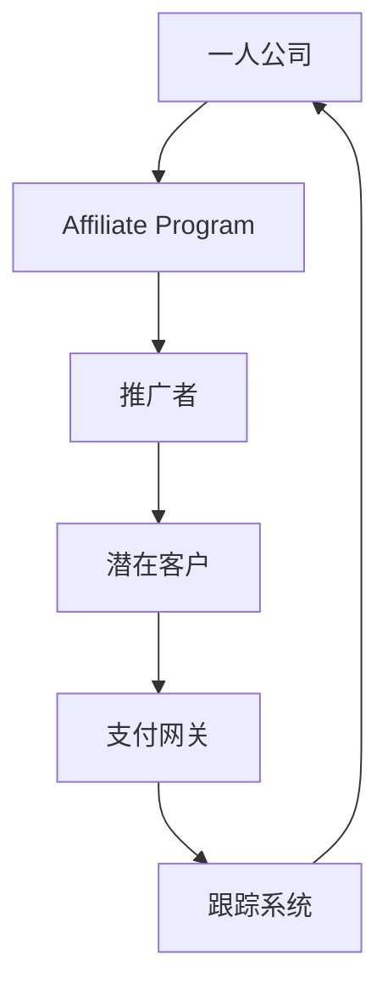

                 

# 文章标题：一人公司如何利用affiliate marketing扩大收入

> 关键词：一人公司，affiliate marketing，收入扩大，营销策略，用户体验，数据优化

> 摘要：本文将深入探讨一人公司如何利用affiliate marketing这一高效营销策略来扩大收入。通过介绍affiliate marketing的基础知识，选择合适的program，构建有效的网站，制定营销策略，提升转化率，以及数据分析和优化等环节，我们将为读者提供一份全面且实用的指南。同时，通过实战案例分析，将帮助读者理解如何具体实施和优化affiliate marketing策略，实现收入增长。

## 目录

### 第一部分：Affiliate Marketing基础知识

#### 第1章：了解Affiliate Marketing

1.1 Affiliate Marketing的定义和重要性

1.2 Affiliate Marketing的生态系统

#### 第2章：选择合适的Affiliate Program

2.1 如何评估一个Affiliate Program

2.2 筛选和加入合适的Affiliate Program

#### 第3章：构建有效的网站

3.1 网站设计原则

3.2 内容营销策略

3.3 用户体验优化

#### 第4章：营销策略

4.1 目标受众分析

4.2 内容营销策略

4.3 社交媒体推广策略

#### 第5章：转化率的提升

5.1 转化率的影响因素

5.2 优化网站转化率的方法

#### 第6章：数据分析与优化

6.1 数据分析的重要性

6.2 分析网站流量来源

6.3 优化营销策略

### 第二部分：实战篇

#### 第7章：一人公司Affiliate Marketing案例分析

7.1 案例介绍

7.2 案例营销策略解析

7.3 案例数据分析与优化

#### 第8章：利用Affiliate Marketing扩大收入

8.1 扩大收入的策略

8.2 如何处理与Affiliate之间的关系

8.3 如何应对市场变化和竞争压力

#### 第9章：Affiliate Marketing的持续优化

9.1 持续优化的重要性

9.2 优化流程与方法

9.3 未来的趋势与展望

### 第三部分：附加内容

#### 第10章：Affiliate Marketing工具与资源

10.1 主流Affiliate Marketing工具介绍

10.2 辅助工具推荐

10.3 学习资源

### 附录

附录A：常见问题解答

附录B：实战项目指南

# 第一部分：Affiliate Marketing基础知识

## 第1章：了解Affiliate Marketing

### 1.1 Affiliate Marketing的定义和重要性

Affiliate Marketing，也称为联盟营销，是一种通过合作推广产品或服务，以佣金收入为主要回报的营销方式。在这种模式下，推广者（Affiliate）通过自己的网站、博客、社交媒体或其他渠道吸引潜在客户，当客户通过推广者的链接进行购买或其他特定行为时，推广者将获得一定比例的佣金。

Affiliate Marketing的重要性主要体现在以下几个方面：

1. **低成本高回报**：相比于传统广告和营销方式，Affiliate Marketing的投入成本较低，但其回报潜力巨大。通过精准定位和高效推广，一人公司可以利用有限的资源实现收入的最大化。

2. **风险共担**：一人公司只需为实际销售或行为付费，无需承担广告成本或库存风险。这种模式减少了市场风险，提高了资金使用效率。

3. **灵活性**：Affiliate Marketing允许一人公司根据市场变化和业务需求灵活调整推广策略。通过合作关系的建立和优化，公司可以迅速响应市场动态，提升竞争力。

4. **全球化**：互联网的普及使得Affiliate Marketing突破了地域限制。一人公司可以通过全球范围内的合作，扩大市场影响力，增加潜在客户群。

### 1.2 Affiliate Marketing的生态系统

Affiliate Marketing涉及多个角色，形成一个复杂的生态系统。主要角色包括：

- **一人公司（Merchant）**：提供产品或服务，通过Affiliate Program吸引推广者参与营销活动。

- **推广者（Affiliate）**：利用自己的平台或渠道推广公司产品，获取佣金收入。

- **支付网关（Payment Gateway）**：处理交易和支付流程，确保佣金及时准确支付。

- **跟踪系统（Tracking System）**：记录和分析推广活动数据，确保各方利益透明公正。

#### Mermaid流程图

在这个生态系统中，一人公司通过建立Affiliate Program吸引推广者，推广者通过自己的渠道引导潜在客户进行购买或执行特定行为。支付网关和跟踪系统确保交易和佣金结算的准确性和透明度。

### 1.3 Affiliate Marketing的优势和挑战

**优势：**

1. **精准定位**：通过选择特定领域的推广者，一人公司可以更精准地定位目标客户，提高营销效果。

2. **可量化**：Affiliate Marketing的效果可以精确跟踪和量化，有助于公司优化营销策略。

3. **全球化**：借助互联网，一人公司可以轻松拓展国际市场，吸引全球客户。

**挑战：**

1. **竞争激烈**：随着Affiliate Marketing的普及，推广者数量急剧增加，市场竞争日益激烈。

2. **信任问题**：建立和维护与推广者的信任关系是一个持续的过程，需要一人公司投入时间和资源。

3. **法律合规**：在不同的国家和地区，Affiliate Marketing可能受到不同的法律和监管要求，一人公司需要确保合规运营。

## 第2章：选择合适的Affiliate Program

### 2.1 如何评估一个Affiliate Program

选择一个合适的Affiliate Program对于一人公司的成功至关重要。以下是一些关键因素，可以帮助您评估一个Affiliate Program的优劣：

1. **佣金结构**：了解佣金结构是评估Affiliate Program的首要步骤。不同的Affiliate Program可能有不同的佣金比例和支付方式。例如，一些程序可能根据销售量支付佣金，而另一些则可能根据注册或点击量支付。

2. **产品多样性**：一个提供多样化产品的Affiliate Program可以为您带来更广泛的受众，从而增加潜在收入。

3. **跟踪和报告**：高效的跟踪和报告系统能够确保您了解推广活动的详细信息，包括点击率、转化率和佣金收入等。

4. **支持与资源**：一个提供充分支持和资源的Affiliate Program可以帮助您更好地推广产品，提高成功率。

5. **市场信誉**：研究其他推广者和商家的评价，了解该程序的市场信誉。

### 2.2 筛选和加入合适的Affiliate Program

**步骤 1：确定目标市场**

在筛选Affiliate Program之前，明确您的目标市场和目标受众。这将帮助您找到与您的业务相匹配的推广者。

**步骤 2：研究现有Affiliate Program**

通过在线平台和论坛，研究现有Affiliate Program，了解它们的佣金结构、产品种类和推广策略。

**步骤 3：比较和评估**

比较不同Affiliate Program的优势和劣势，根据您的目标市场和业务需求选择最合适的程序。

**步骤 4：加入Affiliate Program**

一旦确定合适的Affiliate Program，按照程序的指南完成注册和设置过程。

### 2.3 如何与推广者合作

**1. 明确目标和期望**

与推广者建立合作关系前，明确双方的目标和期望。确保您对推广者的预期表现有清晰的认识。

**2. 提供资源和支持**

为推广者提供必要的资源，如营销材料、产品信息、跟踪链接等。同时，提供技术支持和营销建议，帮助他们更有效地推广产品。

**3. 保持沟通**

定期与推广者沟通，了解他们的推广进展和遇到的挑战。及时提供帮助和解决方案，确保合作关系的稳定。

**4. 费用和佣金透明**

确保佣金结构和支付流程透明，避免后续的纠纷。使用自动化跟踪和报告工具，确保推广者的佣金计算准确无误。

## 第3章：构建有效的网站

### 3.1 网站设计原则

一个成功的网站是Affiliate Marketing成功的关键。以下是一些网站设计原则，可以帮助您构建一个既美观又实用的网站：

1. **简洁明了**：保持网站界面简洁，避免过多的装饰和广告，确保内容清晰易懂。

2. **响应式设计**：确保网站在不同设备和屏幕尺寸上都能正常显示，提供良好的用户体验。

3. **快速加载**：优化网站代码和图像，确保网站加载速度快，减少用户流失。

4. **导航清晰**：设计清晰的导航结构，确保用户可以轻松找到所需内容。

5. **专业感**：使用专业的设计和排版，提升网站的信任度。

### 3.2 内容营销策略

内容是网站的灵魂，以下是几种有效的内容营销策略：

1. **博客**：定期更新博客，分享行业新闻、产品信息和使用技巧，吸引读者和推广者。

2. **教程和指南**：提供详细的教程和指南，帮助用户更好地了解和使用您的产品。

3. **用户评价**：展示真实的用户评价和案例，增加产品的可信度和吸引力。

4. **多媒体内容**：使用图片、视频和音频等多媒体元素，增加内容的丰富性和吸引力。

### 3.3 用户体验优化

优化用户体验是提高网站转化率的关键。以下是一些建议：

1. **快速响应**：确保网站快速响应，减少加载时间。

2. **简洁的购买流程**：简化购买流程，减少用户操作步骤，提高购买转化率。

3. **明确的信息**：提供清晰的产品信息、价格和优惠，帮助用户做出购买决策。

4. **交互设计**：增加互动元素，如在线聊天、调查问卷等，提升用户参与度。

5. **反馈机制**：建立反馈机制，收集用户意见和建议，持续改进网站和服务。

## 第4章：营销策略

### 4.1 目标受众分析

了解目标受众是制定有效营销策略的第一步。以下是一些分析目标受众的方法：

1. **人口统计信息**：收集和分析目标受众的年龄、性别、地理位置、收入水平等人口统计信息。

2. **行为分析**：通过网站分析工具，了解目标受众的行为习惯，如访问时间、浏览路径、点击行为等。

3. **兴趣偏好**：通过调查和问卷调查，了解目标受众的兴趣、需求和偏好。

4. **反馈和评价**：收集用户反馈和评价，了解他们的需求和意见。

### 4.2 内容营销策略

内容营销是Affiliate Marketing的重要组成部分。以下是一些内容营销策略：

1. **博客文章**：定期发布高质量的博客文章，分享行业动态、产品信息和营销技巧。

2. **电子书和报告**：提供免费的电子书和报告，吸引潜在客户并增加网站的访问量。

3. **教程和指南**：发布详细的教程和指南，帮助用户更好地了解和使用产品。

4. **案例研究**：展示成功的案例研究，增加产品的可信度和吸引力。

5. **社交媒体内容**：利用社交媒体平台发布有趣、有价值的内容，吸引粉丝和推广者。

### 4.3 社交媒体推广策略

社交媒体是推广网站和产品的重要渠道。以下是一些社交媒体推广策略：

1. **平台选择**：根据目标受众的喜好和使用习惯，选择合适的社交媒体平台，如Facebook、Instagram、Twitter、LinkedIn等。

2. **内容策略**：发布多样化、高质量的内容，包括图片、视频、文章等，吸引和保持粉丝的兴趣。

3. **互动和参与**：积极参与粉丝的互动和讨论，提高品牌知名度和用户参与度。

4. **推广活动**：举办在线活动、抽奖、优惠券等，增加粉丝互动和参与度。

5. **广告投放**：利用社交媒体广告，精准定位目标受众，提高广告效果和转化率。

## 第5章：转化率的提升

### 5.1 转化率的影响因素

转化率是衡量营销效果的重要指标。以下是一些影响转化率的关键因素：

1. **目标受众分析**：了解目标受众的需求和偏好，确保营销内容和策略与之匹配。

2. **网站设计**：优化网站设计和用户体验，确保网站内容易于浏览和理解。

3. **营销内容**：提供有价值、吸引人的内容，提高用户的参与度和兴趣。

4. **跟踪和分析**：使用跟踪工具分析用户行为和转化路径，找出改进的机会。

5. **技术优化**：确保网站加载速度快，功能稳定，提高用户体验。

### 5.2 优化网站转化率的方法

以下是一些提高网站转化率的方法：

1. **A/B测试**：通过A/B测试，比较不同页面和元素的转化效果，找出最佳组合。

2. **优化页面加载速度**：压缩图像和代码，使用CDN加速，提高页面加载速度。

3. **改进用户界面**：简化用户界面，减少用户操作步骤，提高用户满意度。

4. **增加信任元素**：展示用户评价、认证标志、安全标志等，增加用户信任。

5. **个性化推荐**：根据用户行为和偏好，提供个性化的产品推荐，提高购买概率。

## 第6章：数据分析与优化

### 6.1 数据分析的重要性

数据分析是Affiliate Marketing中不可或缺的一部分。通过分析数据，一人公司可以：

1. **了解市场趋势**：分析市场数据，了解行业趋势和竞争对手的表现。

2. **优化营销策略**：根据数据分析结果，调整和优化营销策略，提高效果。

3. **提高转化率**：通过分析用户行为和转化路径，找出提高转化率的改进点。

4. **降低成本**：通过数据分析，优化广告投放和营销资源，降低成本。

### 6.2 分析网站流量来源

分析网站流量来源可以帮助一人公司了解哪些渠道最有效，从而优化营销策略。以下是一些常用的分析工具和方法：

1. **Google Analytics**：使用Google Analytics，可以追踪和分析网站的访问量、来源、用户行为等数据。

2. **UTM参数**：通过在链接中使用UTM参数，可以追踪特定营销活动的来源、渠道和关键词。

3. **社交媒体分析**：使用社交媒体分析工具，了解哪些内容最吸引粉丝和推广者。

4. **SEO分析**：分析网站的关键词排名和搜索引擎流量，优化SEO策略。

### 6.3 优化营销策略

基于数据分析结果，可以采取以下措施优化营销策略：

1. **提高广告投放效果**：根据数据，优化广告投放渠道、关键词和预算，提高广告效果。

2. **调整内容策略**：根据用户偏好和互动数据，调整内容类型、频率和发布时间。

3. **优化用户体验**：通过分析用户行为，优化网站设计和功能，提高用户满意度和转化率。

4. **持续测试和优化**：定期进行A/B测试，持续优化营销策略和网站设计，提高效果。

## 第7章：一人公司Affiliate Marketing案例分析

### 7.1 案例介绍

本案例研究的是一个专注于健康食品的一人公司，通过Affiliate Marketing成功扩大了收入。公司提供高品质的有机食品，通过线上销售渠道和推广者合作，将产品推广给更广泛的受众。

### 7.2 案例营销策略解析

1. **目标市场分析**：公司首先进行了详细的目标市场分析，确定了以都市白领和家庭主妇为主要目标受众。

2. **选择Affiliate Program**：公司选择了与健康食品相关的Affiliate Program，确保推广者的内容与产品定位相符。

3. **构建有效网站**：公司构建了一个响应式、简洁明了的网站，提供详细的产品信息和用户评价，提升用户体验。

4. **内容营销**：公司定期发布高质量的博客文章，分享健康饮食知识、食谱和产品使用技巧，吸引潜在客户。

5. **社交媒体推广**：公司通过社交媒体平台发布内容，与粉丝互动，增加品牌知名度和用户参与度。

### 7.3 案例数据分析与优化

1. **流量分析**：公司使用Google Analytics分析网站流量，发现大多数用户通过社交媒体和搜索引擎访问网站。

2. **转化路径分析**：公司分析了用户的转化路径，发现优化购物车页面和支付流程可以提高转化率。

3. **广告效果分析**：公司通过UTM参数追踪广告效果，发现某些关键词和渠道的投放效果较好，优化了广告预算分配。

4. **内容效果分析**：公司根据用户互动数据，调整内容类型和发布频率，提高了用户参与度和转化率。

## 第8章：利用Affiliate Marketing扩大收入

### 8.1 扩大收入的策略

要利用Affiliate Marketing扩大收入，一人公司可以采取以下策略：

1. **增加推广者数量**：不断寻找和招募新的推广者，扩大推广网络，提高产品的曝光率。

2. **优化营销内容**：根据目标受众的偏好，优化营销内容和策略，提高用户参与度和转化率。

3. **提高佣金比例**：适当提高佣金比例，吸引更多推广者参与，提高销售量。

4. **多元化推广渠道**：除了传统的网站和博客，还可以利用社交媒体、电子邮件营销等多元化渠道，提高营销效果。

### 8.2 如何处理与Affiliate之间的关系

与Affiliate建立和维护良好的关系至关重要，以下是一些建议：

1. **透明沟通**：保持与Affiliate的透明沟通，及时提供营销资源和支持。

2. **提供培训**：为Affiliate提供营销培训，帮助他们更有效地推广产品。

3. **激励制度**：建立激励制度，奖励表现优秀的Affiliate，提高他们的积极性。

4. **定期反馈**：定期向Affiliate提供反馈，帮助他们了解营销效果，优化推广策略。

### 8.3 如何应对市场变化和竞争压力

市场变化和竞争压力是Affiliate Marketing面临的挑战，以下是一些建议：

1. **持续优化**：不断优化营销策略和网站设计，提高用户体验和转化率。

2. **数据分析**：利用数据分析，及时了解市场趋势和竞争对手的表现，调整营销策略。

3. **差异化定位**：找到自己的差异化优势，打造独特的产品和服务，吸引特定受众。

4. **创新营销**：尝试新的营销方式和渠道，保持市场竞争力。

## 第9章：Affiliate Marketing的持续优化

### 9.1 持续优化的重要性

持续优化是Affiliate Marketing成功的关键。通过持续优化，一人公司可以：

1. **提高转化率**：不断改进网站设计和用户体验，提高用户的购买意愿。

2. **降低成本**：优化营销策略和广告投放，提高广告效果，降低成本。

3. **提高收入**：通过持续优化，提高销售量和佣金收入。

### 9.2 优化流程与方法

以下是一些优化流程和方法：

1. **定期分析**：定期分析网站流量、用户行为和转化数据，找出优化点。

2. **A/B测试**：通过A/B测试，比较不同策略的效果，选择最佳方案。

3. **用户反馈**：收集用户反馈，了解他们的需求和意见，持续改进产品和服务。

4. **行业研究**：研究行业趋势和竞争对手的表现，借鉴优秀经验，优化营销策略。

### 9.3 未来的趋势与展望

未来，Affiliate Marketing将面临以下趋势和挑战：

1. **数据驱动营销**：随着数据分析技术的发展，数据驱动营销将成为主流，一人公司需要充分利用数据分析工具，优化营销策略。

2. **个性化营销**：个性化营销将更加普及，一人公司需要根据用户行为和偏好，提供个性化的产品推荐和营销内容。

3. **多元渠道融合**：线上线下渠道将更加融合，一人公司需要利用多元化的渠道，提高品牌知名度和用户参与度。

4. **隐私法规**：随着隐私法规的加强，一人公司需要确保合规运营，保护用户隐私。

## 第10章：Affiliate Marketing工具与资源

### 10.1 主流Affiliate Marketing工具介绍

以下是一些主流的Affiliate Marketing工具：

1. **Affiliate Networks**：如Amazon Associates、ShareASale、ClickBank等，提供广泛的合作资源和市场。

2. **跟踪和分析工具**：如Google Analytics、Affiliatly、Post Affiliate Pro等，帮助跟踪和分析推广活动。

3. **广告管理和优化工具**：如Google Ads、Facebook Ads Manager、AdRoll等，用于广告投放和管理。

### 10.2 辅助工具推荐

以下是一些辅助工具，可以帮助一人公司更有效地进行Affiliate Marketing：

1. **SEO工具**：如SEMrush、Ahrefs、Moz等，用于优化搜索引擎排名和网站流量。

2. **内容管理工具**：如WordPress、HubSpot、Contentful等，用于内容创作和网站管理。

3. **电子邮件营销工具**：如Mailchimp、SendinBlue、ConvertKit等，用于发送营销邮件和用户管理。

### 10.3 学习资源

以下是一些学习和资源，可以帮助一人公司深入了解Affiliate Marketing：

1. **在线课程**：如Udemy、Coursera、edX等平台上的Affiliate Marketing课程。

2. **博客和论坛**：如Affiliate Marketing Blog、Affiliate Marketers Community等，提供行业资讯和经验分享。

3. **书籍**：如《Affiliate Marketing for Dummies》、《Super Affiliate System》、《Affiliate Marketing: The Complete Course》等，提供全面的理论和实践指导。

## 附录

### 附录A：常见问题解答

1. **什么是Affiliate Marketing？**
   - Affiliate Marketing是一种通过合作推广产品或服务，以佣金收入为主要回报的营销方式。

2. **如何选择合适的Affiliate Program？**
   - 确定目标市场，研究现有Affiliate Program，比较佣金结构、产品多样性、跟踪和报告系统、支持与资源等因素。

3. **如何构建有效的网站？**
   - 保持网站简洁明了，进行响应式设计，优化页面加载速度，设计清晰的导航结构，提供专业感。

4. **如何提升转化率？**
   - 进行A/B测试，优化网站设计，提供快速响应，增加信任元素，进行用户调研和反馈。

5. **如何处理与Affiliate之间的关系？**
   - 保持透明沟通，提供培训和支持，建立激励制度，定期提供反馈。

### 附录B：实战项目指南

1. **项目规划**
   - 确定项目目标，制定时间表，分配资源。

2. **市场研究**
   - 分析目标市场，了解竞争对手，确定营销策略。

3. **网站建设**
   - 设计网站架构，选择合适的内容管理工具，进行网站开发。

4. **推广与营销**
   - 选择Affiliate Program，建立合作关系，制定内容营销和社交媒体推广策略。

5. **数据分析与优化**
   - 使用跟踪和分析工具，分析用户行为和转化数据，持续优化网站和营销策略。

6. **项目评估**
   - 定期评估项目进展，调整和优化营销策略，确保项目目标的实现。

### 总结

通过本文的详细探讨，我们了解了一人公司如何利用Affiliate Marketing这一高效策略来扩大收入。从基础知识的了解，到选择合适的Affiliate Program，构建有效的网站，制定营销策略，提升转化率，以及数据分析和优化，每个环节都至关重要。同时，通过实战案例分析，我们看到了如何具体实施和优化Affiliate Marketing策略，实现收入增长。

对于一人公司来说，Affiliate Marketing不仅是一种营销方式，更是一种可持续发展的商业模式。通过持续优化和适应市场变化，一人公司可以不断提升竞争力，实现长期稳定的发展。

让我们牢记，成功并非一蹴而就，持续学习和优化是Affiliate Marketing成功的关键。希望本文能够为您在Affiliate Marketing的道路上提供指导和启发，祝您在营销领域取得辉煌的成就。

## 作者信息

作者：AI天才研究院/AI Genius Institute & 禅与计算机程序设计艺术 /Zen And The Art of Computer Programming

AI天才研究院专注于人工智能领域的最新研究和应用，致力于推动人工智能技术的创新和发展。同时，作者也以其深入浅出的编程著作《禅与计算机程序设计艺术》享誉全球，为计算机科学界带来了深远的影响。在这篇文章中，我们结合了两者的优势，用技术思维和深入分析，为您带来了一份全面且实用的Affiliate Marketing指南。希望对您的营销之路有所帮助。

