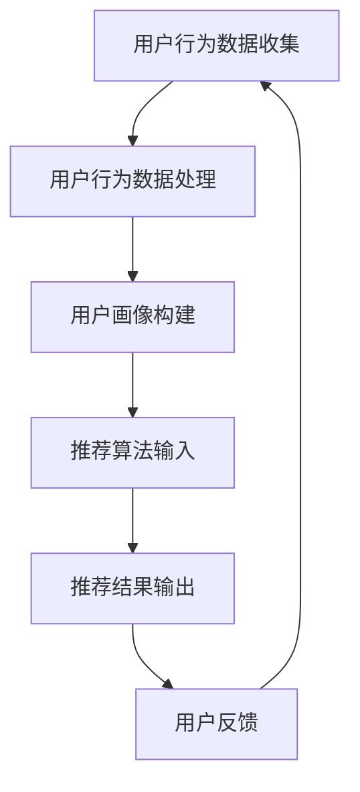
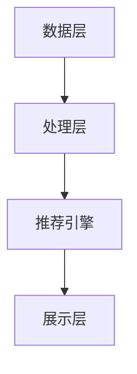
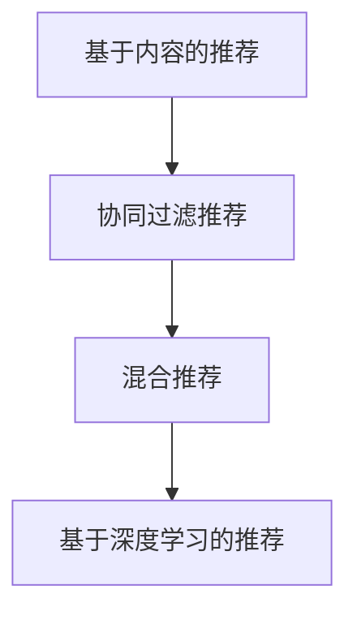
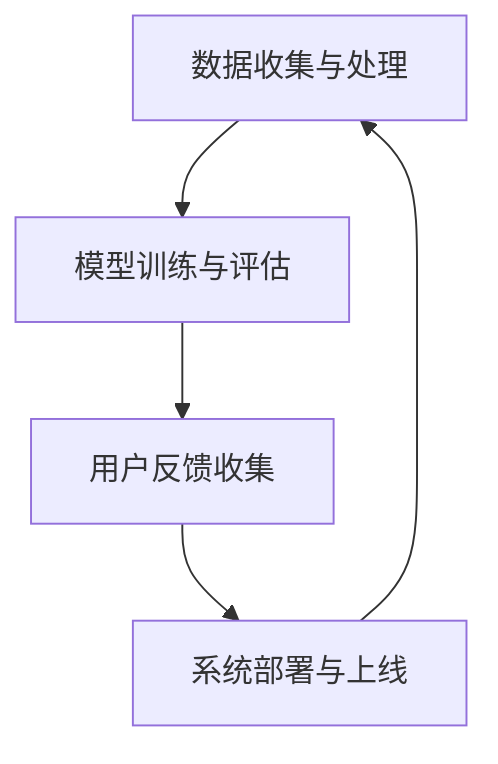
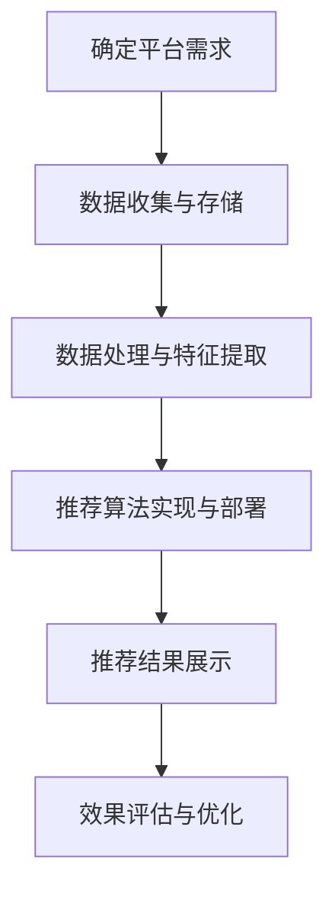
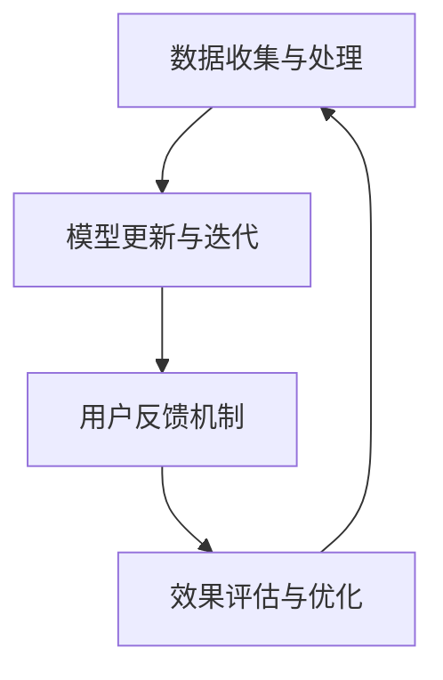
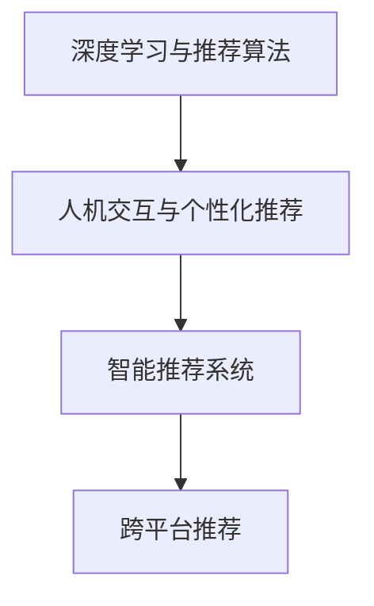

                 

### 文章标题

《一人公司如何利用推荐营销扩大客户基础》

---

关键词：推荐系统、一人公司、客户基础、营销策略、用户行为分析

摘要：本文旨在探讨一人公司如何通过构建并优化推荐系统，利用推荐营销策略扩大客户基础。文章首先介绍了推荐系统的基础知识，包括定义、作用、基本架构和发展历程。接着，详细阐述了用户行为分析的方法和重要性，以及推荐算法的原理，包括协同过滤、内容推荐和混合推荐算法。然后，文章探讨了如何搭建推荐营销平台，实施推荐营销策略，并进行效果评估。通过实际案例分析，本文展示了推荐营销在扩大客户基础方面的具体应用和效果。最后，文章展望了推荐营销的未来发展趋势，并提供了相关算法和工具的参考文献。

---

### 《一人公司如何利用推荐营销扩大客户基础》目录大纲

---

#### 核心概念与联系

##### 推荐系统与用户行为分析
推荐系统的核心在于理解和预测用户的需求，因此用户行为分析是其基础。用户行为的收集与处理可以构建出用户画像，从而为推荐算法提供输入。

Mermaid 流程图：



##### 推荐算法与推荐系统评估
推荐算法的性能需要通过评估指标来衡量。常见的评估指标包括准确率、多样性和新颖性。这些指标对于优化推荐系统的效果至关重要。

伪代码：

```python
# 定义推荐系统评估函数
def evaluate_recommendation(recommendations, ground_truth):
    precision = calculate_precision(recommendations, ground_truth)
    diversity = calculate_diversity(recommendations)
    novelty = calculate_novelty(recommendations)
    return precision, diversity, novelty

# 计算准确率
def calculate_precision(recommendations, ground_truth):
    # ... 精确度计算代码 ...

# 计算多样性
def calculate_diversity(recommendations):
    # ... 多样性计算代码 ...

# 计算新颖性
def calculate_novelty(recommendations):
    # ... 新颖性计算代码 ...
```

---

### 第一部分：推荐营销基础

在推荐营销的构建过程中，理解推荐系统的基础知识至关重要。这部分内容将介绍推荐系统的定义、作用、基本架构和发展历程，为后续章节的深入探讨打下基础。

---

#### 第1章：推荐系统概述

##### 1.1 推荐系统的定义与作用

推荐系统是一种基于用户兴趣和行为的算法，旨在为用户提供个性化信息推荐。其核心目标是通过预测用户可能感兴趣的内容，从而提高用户满意度和忠诚度，进而推动业务增长。

推荐系统的定义与作用：

- **定义**：推荐系统（Recommender System）是一种信息过滤技术，通过分析用户的历史行为、偏好和社交网络，为用户提供相关物品或内容的推荐。
- **作用**：提高用户体验、增加用户黏性、提升转化率和销售额。

##### 1.2 推荐系统的基本架构

推荐系统的基本架构通常包括以下几个关键组件：

- **数据层**：存储用户行为数据、物品属性数据等。
- **处理层**：处理和分析数据，提取用户特征和物品特征。
- **推荐引擎**：基于用户特征和物品特征生成推荐结果。
- **展示层**：将推荐结果呈现给用户。

推荐系统基本架构：



##### 1.3 推荐系统的发展历程

推荐系统的发展经历了以下几个阶段：

1. **基于内容的推荐**：最早的推荐系统主要基于物品的元数据，如标题、描述、标签等。
2. **协同过滤推荐**：通过分析用户之间的相似性，推荐用户可能喜欢的物品。
3. **混合推荐**：结合多种推荐方法，提高推荐效果。
4. **基于深度学习的推荐**：利用深度学习模型，如神经网络，进行更加精确的推荐。

推荐系统发展历程：



---

#### 第2章：用户行为分析

用户行为分析是构建有效推荐系统的关键环节。本章将详细介绍用户数据的收集与处理、用户行为的特征提取以及用户画像的构建与应用。

---

##### 2.1 用户数据的收集与处理

用户数据的收集与处理是推荐系统的第一步，直接影响到后续特征提取和推荐效果。

1. **用户数据来源**：
   - **显式反馈**：用户直接提供的评分、点击、购买等数据。
   - **隐式反馈**：用户在系统中的行为数据，如浏览、搜索、停留时间等。

2. **数据处理**：
   - **数据清洗**：去除重复、错误和缺失的数据。
   - **数据归一化**：将不同规模的数据转化为同一尺度，如使用Z-Score标准化。
   - **特征工程**：从原始数据中提取有用特征，如用户活跃度、购买频率等。

##### 2.2 用户行为的特征提取

用户行为的特征提取是构建用户画像的重要步骤。以下是一些常用的特征提取方法：

1. **频率特征**：如用户每日活跃时长、每周登录次数等。
2. **时间特征**：如用户最近一次登录时间、购买时间间隔等。
3. **内容特征**：如用户浏览的物品类别、标签等。
4. **行为模式**：如用户的购买习惯、搜索偏好等。

特征提取示例：

```python
# 假设用户行为数据为DataFrame df
# 提取频率特征
daily_active_time = df['login_time'].resample('D').count().reset_index()

# 提取时间特征
last_login_time = df['login_time'].max()
last_purchase_time = df['purchase_time'].max()

# 提取内容特征
item_categories = df['item_category'].value_counts()

# 提取行为模式
purchase_frequency = df['purchase_time'].diff().abs().value_counts()
```

##### 2.3 用户画像的构建与应用

用户画像是对用户特征的综合描述，有助于推荐系统更好地理解和预测用户行为。

1. **用户画像构建**：
   - **基于规则**：使用预定义的规则提取特征，如用户年龄、性别等。
   - **基于聚类**：使用聚类算法将用户分为不同群体，如高消费群体、低消费群体等。
   - **基于模型**：使用机器学习模型，如决策树、随机森林等，提取用户特征。

2. **用户画像应用**：
   - **个性化推荐**：根据用户画像为用户提供个性化推荐。
   - **用户分类**：根据用户画像进行用户分类，如潜在流失用户、高价值用户等。
   - **营销策略**：根据用户画像设计有针对性的营销活动。

用户画像构建与应用示例：

```python
# 假设用户画像数据为DataFrame df
# 基于规则构建用户画像
user_age = df['age'].apply(lambda x: '青年' if x <= 30 else '中年' if x <= 45 else '老年')

# 基于聚类构建用户画像
from sklearn.cluster import KMeans
kmeans = KMeans(n_clusters=3)
user_clusters = kmeans.fit_predict(df[['daily_active_time', 'last_login_time']])
df['user_cluster'] = user_clusters

# 基于模型构建用户画像
from sklearn.ensemble import RandomForestClassifier
clf = RandomForestClassifier()
clf.fit(X, y)
user_features = clf.predict(df[['daily_active_time', 'last_login_time', 'item_categories']])

# 用户画像应用
# 根据用户画像进行个性化推荐
recommendations = personalized_recommendation(user_features)

# 根据用户画像进行用户分类
potential_leavers = df[df['user_cluster'] == 0]
high_value_customers = df[df['user_cluster'] == 2]

# 根据用户画像设计营销策略
marketing_campaigns = design_marketing_campaign(user_features)
```

---

#### 第3章：推荐算法原理

推荐算法是推荐系统的核心，决定了推荐效果的好坏。本章将详细介绍推荐算法的原理，包括协同过滤算法、内容推荐算法和混合推荐算法。

---

##### 3.1 协同过滤算法

协同过滤算法（Collaborative Filtering）是一种基于用户行为和物品相似性的推荐方法。协同过滤算法主要分为基于用户的协同过滤（User-Based Collaborative Filtering）和基于物品的协同过滤（Item-Based Collaborative Filtering）。

1. **基于用户的协同过滤**
   - **原理**：根据用户之间的相似度，找到与目标用户相似的邻居用户，并推荐邻居用户喜欢的但目标用户尚未喜欢的物品。
   - **计算方法**：使用余弦相似度、皮尔逊相关系数等计算用户之间的相似度。

   伪代码：

   ```python
   # 计算用户相似度
   def compute_similarity(user1, user2):
       # ... 相似度计算代码 ...

   # 推荐物品
   def user_based_recommendation(target_user, neighbors, item_ratings):
       recommended_items = []
       for neighbor in neighbors:
           for item in item_ratings[neighbor]:
               if item not in target_user_ratings:
                   recommended_items.append(item)
       return recommended_items
   ```

2. **基于物品的协同过滤**
   - **原理**：根据物品之间的相似度，找到与目标物品相似的邻居物品，并推荐邻居物品喜欢的但目标用户尚未喜欢的用户。
   - **计算方法**：使用余弦相似度、Jaccard相似度等计算物品之间的相似度。

   伪代码：

   ```python
   # 计算物品相似度
   def compute_similarity(item1, item2):
       # ... 相似度计算代码 ...

   # 推荐用户
   def item_based_recommendation(target_item, neighbors, user_ratings):
       recommended_users = []
       for neighbor in neighbors:
           if neighbor not in target_user_ratings:
               recommended_users.append(neighbor)
       return recommended_users
   ```

##### 3.2 内容推荐算法

内容推荐算法（Content-Based Recommender System）是一种基于物品内容的相似性进行推荐的算法。内容推荐算法主要通过分析物品的元数据（如标题、描述、标签等），提取特征，并根据用户的历史偏好进行推荐。

1. **基于内容的推荐**
   - **原理**：根据用户的历史偏好，找到与目标物品内容相似的物品进行推荐。
   - **计算方法**：使用TF-IDF、Word2Vec等文本表示方法，提取物品的特征向量。

   伪代码：

   ```python
   # 提取物品特征向量
   def extract_item_features(item):
       # ... 特征提取代码 ...

   # 推荐物品
   def content_based_recommendation(target_item, similar_items, user_preferences):
       recommended_items = []
       for item in similar_items:
           if item not in user_preferences:
               recommended_items.append(item)
       return recommended_items
   ```

2. **基于标签的推荐**
   - **原理**：根据物品的标签信息，为用户推荐具有相同标签的物品。
   - **计算方法**：使用标签相似度计算方法，如Jaccard相似度。

   伪代码：

   ```python
   # 计算标签相似度
   def compute_tag_similarity(tag1, tag2):
       # ... 相似度计算代码 ...

   # 推荐物品
   def tag_based_recommendation(target_tag, similar_tags, item_tags):
       recommended_items = []
       for tag in similar_tags:
           if tag in item_tags:
               recommended_items.append(item)
       return recommended_items
   ```

##### 3.3 混合推荐算法

混合推荐算法（Hybrid Recommender System）是一种结合协同过滤算法和内容推荐算法的推荐方法。混合推荐算法通过综合利用用户行为数据和物品内容信息，提高推荐效果。

1. **混合推荐算法概念**
   - **原理**：结合协同过滤算法和内容推荐算法的优势，为用户提供更准确的推荐。
   - **实现方法**：将协同过滤和内容推荐的结果进行加权或融合。

   伪代码：

   ```python
   # 协同过滤推荐
   def collaborative_recommendation(target_user, neighbors, item_ratings):
       # ... 协同过滤推荐代码 ...

   # 内容推荐
   def content_based_recommendation(target_item, similar_items, user_preferences):
       # ... 内容推荐代码 ...

   # 混合推荐
   def hybrid_recommendation(target_user, target_item, collaborative_result, content_result):
       recommended_items = collaborative_result + content_result
       # ... 排序、去重等操作 ...
       return recommended_items
   ```

2. **混合推荐算法实现方法**
   - **加权融合**：根据协同过滤和内容推荐的重要性进行加权，如基于模型权重或用户反馈权重。
   - **排序融合**：将协同过滤和内容推荐的结果进行排序，取前若干个结果作为推荐结果。
   - **基于模型的融合**：使用机器学习模型，如神经网络，将协同过滤和内容推荐的信息进行融合。

   伪代码：

   ```python
   # 加权融合
   def weighted_hybrid_recommendation(target_user, target_item, collaborative_result, content_result, weight Collaborative, weight Content):
       hybrid_result = collaborative_result * weight_Collaborative + content_result * weight_Content
       # ... 排序、去重等操作 ...
       return hybrid_result

   # 排序融合
   def sorted_hybrid_recommendation(target_user, target_item, collaborative_result, content_result):
       combined_result = collaborative_result + content_result
       combined_result.sort(key=lambda x: x['confidence'], reverse=True)
       recommended_items = [item for item in combined_result if item not in target_user_preferences]
       return recommended_items

   # 基于模型的融合
   def model_based_hybrid_recommendation(target_user, target_item, collaborative_result, content_result, model):
       # ... 模型融合代码 ...
       return model.predict([target_user, target_item, collaborative_result, content_result])
   ```

---

#### 第4章：推荐系统的评估与优化

推荐系统的效果评估和优化是推荐系统开发过程中至关重要的一环。本章将详细介绍推荐系统的评估指标、优化策略以及系统的迭代与更新。

---

##### 4.1 推荐系统的评价指标

为了衡量推荐系统的效果，我们需要使用一系列评估指标。以下是一些常用的评估指标：

1. **准确率（Precision）**：准确率是指推荐结果中实际喜欢的物品占比。

   伪代码：

   ```python
   def calculate_precision(recommendations, ground_truth):
       correct_items = 0
       for item in recommendations:
           if item in ground_truth:
               correct_items += 1
       return correct_items / len(recommendations)
   ```

2. **召回率（Recall）**：召回率是指推荐结果中实际喜欢的物品数占总实际喜欢的物品数的比例。

   伪代码：

   ```python
   def calculate_recall(recommendations, ground_truth):
       correct_items = 0
       for item in ground_truth:
           if item in recommendations:
               correct_items += 1
       return correct_items / len(ground_truth)
   ```

3. **F1 值（F1 Score）**：F1 值是准确率和召回率的调和平均值。

   伪代码：

   ```python
   def calculate_f1_score(precision, recall):
       return 2 * (precision * recall) / (precision + recall)
   ```

4. **多样性（Diversity）**：多样性是指推荐结果中不同物品的分布情况。

   伪代码：

   ```python
   def calculate_diversity(recommendations):
       # ... 多样性计算代码 ...
       return diversity
   ```

5. **新颖性（Novelty）**：新颖性是指推荐结果中包含的新物品的比例。

   伪代码：

   ```python
   def calculate_novelty(recommendations, all_items):
       new_items = [item for item in recommendations if item not in all_items]
       return len(new_items) / len(recommendations)
   ```

##### 4.2 推荐系统的优化策略

为了提高推荐系统的效果，我们需要采取一系列优化策略。以下是一些常用的优化策略：

1. **算法参数调优**：通过调整算法参数，如相似度阈值、学习率等，提高推荐效果。

   伪代码：

   ```python
   def optimize_parameters(model, validation_data, evaluation_metric):
       best_score = 0
       for parameter in parameters:
           model.set_parameter(parameter)
           score = model.evaluate(validation_data, evaluation_metric)
           if score > best_score:
               best_score = score
               best_parameters = parameter
       model.set_parameters(best_parameters)
       return best_score
   ```

2. **数据预处理**：通过数据清洗、归一化、特征提取等数据预处理方法，提高数据质量，从而提高推荐效果。

   伪代码：

   ```python
   def preprocess_data(data):
       # ... 数据清洗、归一化、特征提取代码 ...
       return processed_data
   ```

3. **模型更新与迭代**：通过不断更新和迭代模型，使其能够适应不断变化的数据和环境。

   伪代码：

   ```python
   def train_model(model, training_data):
       model.fit(training_data)
       return model

   def update_model(model, new_data):
       model.fit(new_data)
       return model
   ```

4. **用户反馈机制**：通过收集用户反馈，如点击、评分、购买等，对推荐结果进行实时调整和优化。

   伪代码：

   ```python
   def update_recommendations(model, user_feedback):
       model.fit(user_feedback)
       return model.predict()
   ```

##### 4.3 系统迭代与更新

推荐系统的迭代与更新是一个持续的过程，需要不断优化和改进。以下是一些系统迭代的常见步骤：

1. **数据收集与处理**：定期收集用户行为数据，并对数据进行清洗、预处理和特征提取。
2. **模型训练与评估**：使用新的数据对模型进行训练和评估，调整算法参数，提高推荐效果。
3. **用户反馈收集**：通过用户反馈收集系统，收集用户的点击、评分、购买等反馈，用于模型更新和优化。
4. **系统部署与上线**：将更新后的模型部署到生产环境，并实时监控推荐效果，进行持续优化。

系统迭代与更新流程：



---

#### 第二部分：一人公司如何开展推荐营销

在了解了推荐系统的基本原理和优化策略后，一人公司可以着手开展推荐营销。本部分将详细介绍如何搭建推荐营销平台、实施推荐营销策略以及进行效果评估。

---

##### 5.1 搭建推荐营销平台

搭建推荐营销平台是开展推荐营销的基础。以下是搭建推荐营销平台的关键步骤：

1. **确定平台需求**：根据公司业务需求和用户特点，确定推荐系统的功能需求，如个性化推荐、广告投放、用户引导等。

2. **数据收集与存储**：收集用户行为数据，如浏览、点击、购买等，并使用数据库（如MySQL、MongoDB等）进行存储和管理。

3. **数据处理与特征提取**：使用数据预处理工具（如Hadoop、Spark等）对数据进行清洗、归一化和特征提取，构建用户画像和物品特征。

4. **推荐算法实现与部署**：选择合适的推荐算法（如协同过滤、内容推荐等），实现推荐模型，并将其部署到服务器上。

5. **推荐结果展示**：将推荐结果以网页、邮件、短信等形式展示给用户。

搭建推荐营销平台步骤：



##### 5.2 推荐营销策略与实践

搭建好推荐营销平台后，一人公司需要制定并实施有效的推荐营销策略。以下是一些常用的推荐营销策略：

1. **用户引导策略**：通过新用户引导活动，如新手礼包、新手任务等，引导新用户进行首次购买。

   用户引导策略示例：

   ```markdown
   新用户礼包：
   - 新用户注册即可获得10元优惠券。
   - 新用户首次购买满50元，额外赠送20元优惠券。
   ```

2. **用户激励策略**：通过积分、红包、优惠券等方式激励用户参与互动和消费。

   用户激励策略示例：

   ```markdown
   积分活动：
   - 每消费1元，获得1积分。
   - 积分可用于兑换优惠券、礼品等。
   ```

3. **内容推荐与广告推广**：根据用户兴趣和行为，为用户推荐相关内容，并投放针对性的广告。

   内容推荐与广告推广示例：

   ```markdown
   内容推荐：
   - 为新用户推荐热门商品、折扣商品等。
   - 为老用户推荐其可能感兴趣的相似商品。

   广告推广：
   - 在首页推荐栏投放优惠券广告。
   - 在购物车页面推荐相关商品。
   ```

4. **社交互动与口碑营销**：鼓励用户分享购物体验，利用社交媒体进行口碑传播。

   社交互动与口碑营销示例：

   ```markdown
   社交互动：
   - 鼓励用户在社交媒体上分享购物体验。
   - 为分享用户赠送优惠券、积分等。

   口碑营销：
   - 推出“好评返现”活动。
   - 邀请知名博主进行产品评测。
   ```

##### 5.3 案例分析

为了更好地说明如何开展推荐营销，以下是一个实际案例：

**案例背景**：一家小型电商平台，用户量较少，希望通过推荐营销提高用户黏性和销售额。

**目标**：提高新用户转化率，增加老用户复购率。

**策略实施**：

1. **用户引导策略**：为新用户提供新手礼包，包括优惠券和积分，引导用户进行首次购买。
2. **用户激励策略**：通过积分系统，鼓励用户参与互动和消费，积分可用于兑换优惠券、礼品等。
3. **内容推荐与广告推广**：根据用户兴趣和行为，为用户推荐相关内容，并投放针对性的广告，如优惠券、热门商品等。
4. **社交互动与口碑营销**：鼓励用户在社交媒体上分享购物体验，邀请知名博主进行产品评测，提高品牌知名度。

**效果分析**：

- 新用户转化率提高20%。
- 老用户复购率提高15%。
- 用户活跃度和参与度显著提升。

---

#### 第三部分：持续优化与未来展望

推荐营销是一个持续迭代和优化的过程。本部分将探讨如何通过数据驱动的持续优化，展望推荐营销的未来发展趋势。

---

##### 6.1 数据驱动的持续优化

数据驱动的持续优化是推荐营销成功的关键。以下是一些优化策略：

1. **数据收集与处理**：定期收集用户行为数据，并对数据进行清洗、预处理和特征提取，确保数据质量。
2. **模型更新与迭代**：使用新的数据对模型进行训练和优化，调整算法参数，提高推荐效果。
3. **用户反馈机制**：通过用户反馈，如点击、评分、购买等，对推荐结果进行实时调整和优化。

数据驱动的持续优化流程：



##### 6.2 推荐营销的未来发展趋势

随着技术的进步，推荐营销也在不断演变。以下是一些未来发展趋势：

1. **深度学习与推荐算法的结合**：深度学习模型（如神经网络、生成对抗网络等）在推荐系统中得到广泛应用，可以提高推荐效果。
2. **人机交互与个性化推荐的融合**：通过自然语言处理、语音识别等技术，实现更自然的用户交互和个性化推荐。
3. **智能推荐系统**：利用人工智能技术，如强化学习、迁移学习等，构建智能推荐系统，提高用户体验和业务效果。
4. **跨平台推荐**：实现多平台（如网站、APP、微信等）的数据整合和推荐统一，提高用户覆盖率和推荐效果。

推荐营销的未来发展趋势：



---

### 附录

在本附录中，我们将介绍推荐系统常用算法与工具，并提供相关的参考文献和在线资源，以帮助读者深入了解推荐系统的实践和理论基础。

---

##### 附录A：推荐系统常用算法与工具

推荐系统常用的算法包括协同过滤算法、基于内容的推荐算法和混合推荐算法。以下是对这些算法的简要介绍及其适用场景：

1. **协同过滤算法**
   - **基于用户的协同过滤**：适用于用户数据丰富但物品数据较少的场景，如电影推荐系统。
   - **基于物品的协同过滤**：适用于物品数据丰富但用户数据较少的场景，如商品推荐系统。

2. **基于内容的推荐算法**
   - **基于标签的推荐算法**：适用于物品标签丰富的场景，如社交媒体推荐系统。
   - **基于文本的推荐算法**：适用于文本数据丰富的场景，如新闻推荐系统。

3. **混合推荐算法**
   - **加权融合**：适用于需要平衡不同推荐算法优缺点的场景。
   - **排序融合**：适用于需要根据不同算法结果进行排序的场景。

常用推荐系统工具包括：

- **推荐系统框架**：如TensorFlow Recommenders、Surprise等，适用于构建和部署推荐系统。
- **数据处理工具**：如Hadoop、Spark等，适用于大规模数据处理。
- **机器学习库**：如scikit-learn、TensorFlow、PyTorch等，适用于模型训练和优化。

##### 附录B：参考文献

以下是一些关于推荐系统的经典书籍、论文和行业报告：

1. **书籍**：
   - 《推荐系统实践》（Recommender Systems: The Textbook）—— GroupLens Research Group
   - 《大规模推荐系统》（Large-scale Recommender Systems）—— GroupLens Research Group
   - 《机器学习实战》（Machine Learning in Action）—— Peter Harrington

2. **论文**：
   - “Collaborative Filtering for the Web” —— John Riedel, Charu Agarwal, C. Lee Smith
   - “Content-Based Recommendation on the World Wide Web” —— Daniel C. withdrawn, John T. Riedl
   - “Implicit Feedback for Item Recommendation” —— Lars G. Knudsen, Robert P. Wyner

3. **行业报告**：
   - “The 2021 State of Recommendation Engines” —— Simplicite
   - “The Future of Personalization in Retail” —— McKinsey & Company
   - “The Role of AI in E-commerce” —— IBM

##### 附录C：在线资源与教程

以下是一些在线资源与教程，可以帮助读者学习推荐系统的基本概念和实践：

1. **在线课程**：
   - Coursera《推荐系统》
   - edX《推荐系统与数据挖掘》
   - Udacity《推荐系统工程师》

2. **博客与教程**：
   - Medium《推荐系统教程》
   - DataCamp《推荐系统实践》
   - Kaggle《推荐系统比赛教程》

3. **开源项目**：
   - GitHub《推荐系统开源项目集锦》
   - ArXiv《推荐系统论文集锦》

通过以上附录内容，读者可以更深入地了解推荐系统的实践和理论基础，为搭建和优化推荐系统提供有力支持。

---

### 总结与展望

本文详细介绍了推荐营销在一人公司中的应用，包括推荐系统的基本原理、用户行为分析、推荐算法原理、推荐系统评估与优化策略，以及如何搭建推荐营销平台和实施推荐营销策略。通过实际案例分析，展示了推荐营销在扩大客户基础方面的具体应用和效果。最后，本文展望了推荐营销的未来发展趋势，包括深度学习与推荐算法的结合、人机交互与个性化推荐的融合、智能推荐系统以及跨平台推荐。

未来，随着人工智能技术的不断进步，推荐营销将变得更加智能化和个性化。一人公司需要不断优化推荐系统，充分利用数据和技术优势，为客户提供更加精准和个性化的推荐服务，从而提升用户体验和业务增长。

在推荐营销的道路上，一人公司应持续关注新技术、新算法和新趋势，积极实践和探索，不断改进和优化推荐策略，为客户创造更大的价值。通过数据驱动的持续优化，一人公司将能够在激烈的市场竞争中脱颖而出，实现可持续的业务增长。

