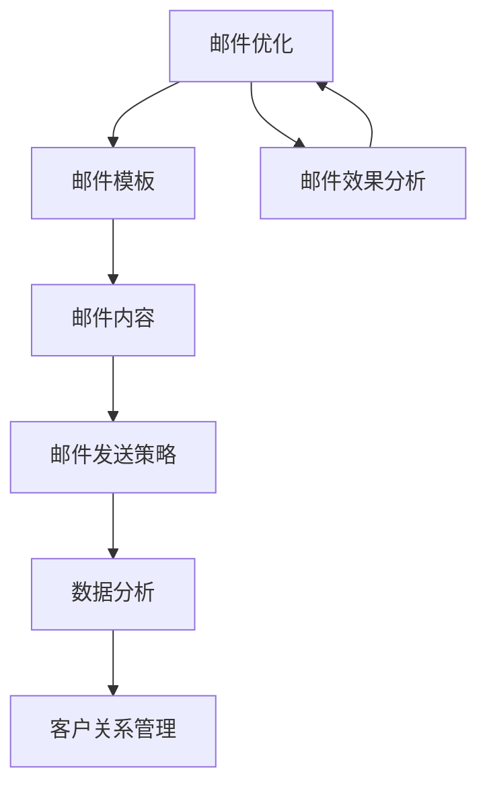
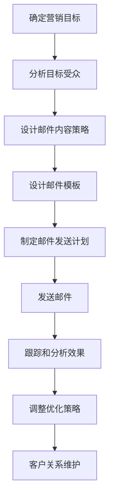

                 

### 文章标题

# 《一人公司如何利用电子邮件营销提高转化率》

### 关键词

- 电子邮件营销
- 转化率
- 一人公司
- 邮件发送策略
- 数据分析

### 摘要

本文将详细探讨一人公司在进行电子邮件营销时如何提高转化率。通过分析电子邮件营销的定义、重要性及发展历史，我们将逐步构建起一个有效的电子邮件营销策略。接着，本文将深入探讨如何制定目标、分析目标受众、设计邮件内容策略和模板，以及如何提高邮件的打开率和点击率。同时，文章还将介绍电子邮件营销工具和平台的选择、客户关系管理以及法律法规和道德规范。最后，我们将通过成功案例分析、实战技巧分享以及未来发展趋势展望，帮助一人公司实现电子邮件营销的持续优化与提升。

## 引言

在当今竞争激烈的商业环境中，营销策略的选择和执行显得尤为重要。对于一人公司来说，由于其资源和人力有限，选择一种高效且成本效益显著的营销方式尤为重要。电子邮件营销因其成本低、灵活性高、针对性强的特点，成为许多一人公司的首选营销手段。然而，如何有效地利用电子邮件营销工具提高转化率，却是一个值得深入探讨的问题。

本文将从多个角度探讨一人公司如何通过电子邮件营销提高转化率。首先，我们将介绍电子邮件营销的基本概念及其重要性，然后回顾其发展历程。接下来，文章将详细阐述如何制定一个有效的电子邮件营销策略，包括确定目标、分析目标受众、制定邮件发送计划、设计邮件内容和模板等。此外，本文还将探讨如何提高邮件的打开率和点击率，介绍一些实用的工具和平台，以及电子邮件营销中的法律法规和道德规范。

在案例分析部分，我们将通过成功案例分享，帮助读者理解电子邮件营销的实际应用和成功要素。实战技巧的分享将提供具体的操作建议，帮助读者在实际操作中提升邮件营销效果。最后，本文将展望电子邮件营销的未来发展趋势和面临的挑战，并提出相应的应对策略。

通过本文的阅读，一人公司可以更好地理解和掌握电子邮件营销的技巧，从而在激烈的市场竞争中脱颖而出，实现业务的持续增长。

### 第1章 电子邮件营销概述

#### 1.1 电子邮件营销的定义与重要性

电子邮件营销（Email Marketing）是指通过电子邮件的方式，向目标受众传递有价值的信息，以达到营销目的的一种数字营销手段。它不仅是一种低成本、高效率的营销方式，更是建立和维护客户关系的重要工具。

电子邮件营销的重要性体现在以下几个方面：

1. **成本效益高**：相较于其他营销方式，电子邮件营销的成本较低，尤其适合资源有限的一人公司。根据研究表明，通过电子邮件营销获得的客户获取成本比传统广告方式低约40%。

2. **高度定制化**：电子邮件营销可以针对不同的客户群体定制个性化的邮件内容，从而提高客户满意度和忠诚度。通过利用客户数据，一人公司可以发送更加精准的邮件，提高营销效果。

3. **灵活性和可控性**：电子邮件营销允许一人公司根据市场变化和业务需求灵活调整邮件内容和发送时间。通过电子邮件营销平台，公司可以轻松管理邮件列表、发送邮件、追踪效果等，确保营销活动的高效运行。

4. **强大的跟踪和数据分析能力**：电子邮件营销平台通常提供详细的跟踪和数据分析功能，帮助一人公司了解邮件的打开率、点击率、转化率等关键指标，从而优化营销策略。

5. **客户关系维护**：通过定期发送有价值的内容和优惠信息，电子邮件营销有助于维护与客户的长期关系，提高客户满意度和忠诚度。

#### 1.2 电子邮件营销与传统营销方式的区别

电子邮件营销与传统营销方式在目标、方式、效果等方面存在显著差异：

1. **目标**：
   - **电子邮件营销**：主要目标是通过个性化的沟通方式，提高客户参与度和转化率。
   - **传统营销方式**：如电视广告、报纸广告、户外广告等，主要目标是扩大品牌知名度和覆盖面。

2. **方式**：
   - **电子邮件营销**：基于数字化平台，通过邮件发送内容，实现点对点的精准传达。
   - **传统营销方式**：依赖于传统媒介，如电视、报纸、户外广告等，进行广泛传播。

3. **效果**：
   - **电子邮件营销**：可以通过数据分析和反馈，实时了解营销效果，进行策略调整。
   - **传统营销方式**：效果评估较为困难，难以实现精准的数据追踪和分析。

4. **成本**：
   - **电子邮件营销**：成本较低，尤其适合小型公司或预算有限的企业。
   - **传统营销方式**：成本较高，对资金和资源的要求较高。

5. **灵活性**：
   - **电子邮件营销**：灵活性强，可以随时调整内容和发送时间。
   - **传统营销方式**：灵活性较低，一旦发布，难以更改。

6. **客户参与度**：
   - **电子邮件营销**：通过互动链接、回复等，提高客户参与度。
   - **传统营销方式**：客户参与度相对较低，难以实现互动。

通过上述对比，我们可以看出，电子邮件营销在目标、方式、效果、成本和灵活性等方面具有明显优势，尤其适合资源有限的一人公司。接下来，我们将进一步探讨电子邮件营销的发展历程，了解其演变过程和当前趋势。

#### 1.3 电子邮件营销的历史与发展

电子邮件营销的起源可以追溯到互联网的早期阶段。1990年代，随着互联网的普及和电子邮件使用的增加，一些营销专业人士开始探索如何利用电子邮件进行推广。最初，电子邮件营销主要采用简单的文本邮件，内容主要包含促销信息和公司新闻。这种形式虽然简单，但已经初步展示了电子邮件营销的潜力。

在1990年代中期，随着电子邮件列表的兴起，营销人员开始意识到通过收集用户邮箱地址，可以实现更有针对性的营销。这一时期，电子邮件营销逐渐从单纯的广告宣传，转向更加注重客户互动和关系维护的方式。个性化邮件和订阅服务开始出现，标志着电子邮件营销的初步发展阶段。

进入2000年代，随着互联网技术的飞速发展，电子邮件营销逐渐走向成熟。邮件营销软件和平台开始普及，使得营销人员可以更加高效地管理邮件列表、设计邮件模板、追踪邮件效果。同时，大数据和数据分析技术的发展，为电子邮件营销提供了更为精准和智能的支持。营销人员可以通过分析用户行为和偏好，实现更精准的邮件投放，提高营销转化率。

当前，电子邮件营销已经成为一种成熟且高效的数字营销手段。随着社交媒体和移动设备的普及，电子邮件营销也在不断进化。一方面，邮件营销与社交媒体的整合，使得营销人员可以更全面地了解客户，实现跨渠道的营销。另一方面，移动邮件营销的兴起，使得营销人员可以更好地应对移动设备的用户体验，提高邮件的打开率和点击率。

#### 1.3 一人公司进行电子邮件营销的优势

对于一人公司来说，电子邮件营销具有独特的优势，使其在资源有限的情况下，仍然能够实现有效的市场推广和客户关系管理。以下是电子邮件营销为一 人公司带来的几个显著优势：

1. **成本效益高**：电子邮件营销相对于传统广告方式，成本较低。一人公司可以通过邮件营销平台以较低的费用获取大量的邮件地址，制作和发送个性化的邮件内容。此外，电子邮件营销可以随时调整和优化策略，减少了广告投放和修改成本。

2. **高度定制化**：电子邮件营销允许一人公司根据目标客户的需求和偏好，定制个性化的邮件内容。这种高度定制化的营销方式，不仅能够提高客户满意度和参与度，还能增强品牌形象。通过分析客户数据和反馈，一人公司可以不断优化邮件内容，提高转化率。

3. **灵活性**：电子邮件营销具有高度的灵活性。一人公司可以根据业务需求和市场变化，随时调整邮件发送的时间、内容和频率。此外，电子邮件营销平台通常提供丰富的功能，如自动化邮件发送、邮件追踪和分析等，使得营销活动可以高效且可控地进行。

4. **可控性**：电子邮件营销使得一人公司能够精确控制营销活动的每一个环节。从邮件地址的收集、邮件内容的创作，到邮件发送和效果分析，公司可以全程监控和调整。这种可控性，有助于一人公司优化营销策略，提高整体营销效果。

5. **用户互动**：电子邮件营销提供了与客户互动的机会。通过回复邮件、调查问卷和链接点击等方式，一人公司可以深入了解客户的反馈和需求。这种互动，不仅有助于提高客户满意度，还能为未来的营销活动提供有价值的参考。

6. **跟踪与分析**：电子邮件营销平台通常提供详细的跟踪和分析功能，一人公司可以实时了解邮件的打开率、点击率、转化率等关键指标。通过数据分析，公司可以识别出成功和失败的营销策略，从而不断优化和调整，提高营销效果。

7. **客户维护**：电子邮件营销是建立和维护客户关系的重要工具。通过定期发送有价值的内容、优惠信息和新闻更新，一人公司可以保持与客户的联系，增强客户忠诚度。这种持续的互动，有助于客户在需要时优先选择公司的产品或服务。

总之，对于一人公司来说，电子邮件营销不仅是一种有效的市场推广手段，更是一种灵活、可控且成本效益高的客户关系管理工具。通过合理利用电子邮件营销，一人公司可以在有限的资源下，实现业务增长和客户关系的持续优化。

### 第2章 建立有效的电子邮件营销策略

要成功地利用电子邮件营销提升转化率，关键在于制定和实施一个系统化、高效且灵活的营销策略。本章将详细介绍如何建立这样的电子邮件营销策略，包括确定目标、分析目标受众、制定邮件发送计划、设计邮件内容和模板等步骤。

#### 2.1 确定电子邮件营销目标

明确目标是制定有效电子邮件营销策略的第一步。一人公司需要根据业务目标，设定具体的电子邮件营销目标。以下是一些常见的电子邮件营销目标：

1. **增加客户数量**：通过电子邮件营销吸引新客户，扩大客户基础。
2. **提高客户忠诚度**：通过定期发送有价值的内容和优惠信息，保持与现有客户的联系，提高客户忠诚度。
3. **提升销售额**：通过推广特定产品或服务，直接提高销售额。
4. **提高品牌知名度**：通过发送品牌相关的内容和活动信息，提高品牌在目标受众中的知名度。
5. **收集反馈和改进**：通过调查问卷和互动邮件，收集客户反馈，改进产品和服务。

在设定目标时，一人公司需要确保目标具体、可衡量和可实现。例如，“在接下来三个月内，通过电子邮件营销吸引1000名新客户”是一个明确的、可衡量的目标。

#### 2.2 分析目标受众

了解目标受众是成功电子邮件营销的关键。一人公司需要通过市场调研和分析，明确目标受众的特征、需求和偏好。以下是一些关键的受众分析步骤：

1. **人口统计信息**：包括年龄、性别、收入水平、职业等基本信息，帮助确定目标受众的范围。
2. **行为特征**：分析目标受众在互联网上的行为习惯，如访问的网站、浏览时间、兴趣爱好等。
3. **购买习惯**：了解目标受众的购买频率、购买渠道、购买偏好等，以便提供更具针对性的产品和服务。
4. **需求和偏好**：通过调查问卷、社交媒体互动和用户反馈，了解目标受众的具体需求和偏好。

通过深入分析目标受众，一人公司可以更好地了解客户需求，设计出更符合受众期望的邮件内容。

#### 2.3 制定邮件发送计划

邮件发送计划是确保电子邮件营销策略有效实施的重要环节。以下是一些制定邮件发送计划的步骤：

1. **确定发送频率**：根据目标受众的期望和行为习惯，确定邮件发送的频率。过于频繁的邮件可能导致客户疲劳和反感，而发送频率过低则可能影响营销效果。一般建议每周发送1-2封邮件。
2. **设定发送时间**：选择在目标受众最可能打开邮件的时间发送邮件，如早晨上班前或晚上下班后。可以通过数据分析确定最佳发送时间。
3. **规划内容类型**：制定邮件内容类型和发送顺序，如促销邮件、新闻更新、客户关怀邮件等。确保内容多样性和相关性，提高客户兴趣和参与度。
4. **自动化流程**：利用电子邮件营销平台设置自动化发送流程，如订阅确认邮件、生日祝福邮件等，节省时间和人力。

通过制定详细的邮件发送计划，一人公司可以确保邮件营销活动有序进行，提高邮件送达率和客户满意度。

#### 2.4 制定邮件内容策略

邮件内容策略是电子邮件营销的核心。以下是制定邮件内容策略的关键步骤：

1. **选择主题**：邮件主题是决定邮件是否被打开的关键。主题需要简洁明了、具有吸引力，能迅速引起目标受众的兴趣。例如，“限时优惠：仅剩最后1天！”或“免费试用：探索我们的全新功能！”。
2. **设计邮件内容**：邮件内容需要简洁明了，突出重点，并提供有价值的消息。内容可以分为几个部分：引言、主体、结尾和CTA（调用行动）。引言要吸引读者的注意，主体内容要提供有价值的信息，结尾要强调CTA，并鼓励读者采取行动。
3. **保持一致性**：邮件内容应保持品牌风格和调性的一致性，包括字体、颜色、语言风格等。这有助于增强品牌形象，提高客户认知度。
4. **提供个性化内容**：利用客户数据，为不同的受众群体提供个性化的邮件内容。例如，根据客户的购买历史推荐相关产品，或根据客户的兴趣提供定制化信息。

通过制定详细的邮件内容策略，一人公司可以确保邮件内容吸引目标受众，提高邮件的打开率和转化率。

#### 2.5 设计电子邮件模板

电子邮件模板是邮件内容的有效呈现形式。以下是设计电子邮件模板的关键步骤：

1. **选择模板**：使用电子邮件营销平台提供的模板库，选择符合品牌风格和需求的模板。如果没有合适的模板，可以考虑自定义设计。
2. **布局和结构**：确保邮件布局简洁明了，内容层次清晰。通常包括顶部导航栏、主体内容区域、底部版权信息等部分。注意保持设计的一致性和响应式布局，以确保邮件在不同设备上都能良好显示。
3. **添加图片和视频**：合理使用图片和视频，可以提高邮件的视觉效果，吸引读者的注意力。但要注意不要过度使用，以免影响邮件的加载速度。
4. **测试和优化**：在设计完成后，进行邮件预览和测试，确保邮件在多种邮件客户端和设备上都能正常显示。根据测试结果，调整邮件布局和内容，优化用户体验。

通过设计专业的电子邮件模板，一人公司可以提升邮件的视觉效果和用户体验，提高邮件营销效果。

综上所述，建立有效的电子邮件营销策略需要明确目标、分析目标受众、制定邮件发送计划、设计邮件内容和模板。通过这些步骤，一人公司可以制定出系统化、高效且灵活的电子邮件营销策略，实现业务增长和客户关系的优化。

### 第3章 提高电子邮件打开率与点击率

电子邮件的打开率和点击率是衡量电子邮件营销成功与否的关键指标。要提高这两个指标，需要从邮件标题、个性化、内容设计等多个方面进行优化。以下是一些具体的策略和技巧，帮助一人公司提升邮件的打开率和点击率。

#### 3.1 提高邮件打开率的策略

邮件标题是影响打开率的关键因素。一个吸引人的标题可以迅速引起目标受众的注意，提高邮件的打开率。以下是一些提高邮件打开率的策略：

1. **紧迫性**：利用紧迫性语言，如“限时优惠”、“仅剩最后1天”等，激发读者的紧迫感，促使他们立即打开邮件。
2. **个性化**：根据目标受众的姓名、兴趣和购买历史，定制个性化的邮件标题。例如，“[您的姓名]，您的购物车中有新商品！”
3. **好奇心**：使用引起好奇心的问题或陈述，如“想知道我们最新的产品是什么吗？”或“揭秘：[产品名称]背后的故事！”
4. **简洁明了**：标题要简洁明了，避免使用复杂或模糊的表述，让读者一眼就能了解邮件的主要内容。
5. **突出价值**：明确邮件内容能为读者带来什么价值，如“免费试用”、“独家优惠”等，突出邮件的吸引力。

#### 3.2 提高邮件点击率的技巧

邮件的点击率（CTR）反映了邮件内容的吸引力和可操作性。以下是一些提高邮件点击率的技巧：

1. **引人注目的CTA**：CTA（调用行动）是引导读者采取行动的关键元素。使用明确、简洁且具有吸引力的CTA，如“立即购买”、“点击查看详情”、“开始免费试用”等。
2. **提供有价值的内容**：邮件内容要具有实际价值，如提供有用的信息、解决方案、优惠等，激发读者的兴趣和参与度。
3. **使用图片和视频**：合理使用高质量的图片和视频，可以增加邮件的吸引力。图片和视频不仅能吸引读者的注意力，还能更好地传达信息和情感。
4. **保持一致性**：邮件的整体设计和风格应保持一致性，包括颜色、字体和布局等，这有助于增强品牌形象，提高用户信任度。
5. **优化邮件加载速度**：确保邮件在多种设备上都能快速加载，避免因加载缓慢导致读者失去兴趣。

#### 3.3 邮件内容设计

邮件内容的设计对打开率和点击率有重要影响。以下是一些内容设计的关键点：

1. **清晰的结构**：邮件内容应具备清晰的层次结构，易于阅读。可以使用段落分隔、标题、列表等元素，使内容更加直观和易读。
2. **突出重点**：在邮件内容中，要突出重点信息，使用加粗、斜体、颜色等手法，使关键信息更容易被读者注意到。
3. **避免冗长和复杂**：邮件内容应简洁明了，避免冗长和复杂的表述。长篇大论的内容容易让读者感到疲惫，降低阅读兴趣。
4. **提供清晰的CTA**：在邮件的各个部分，都要提供明确的CTA，引导读者采取行动。CTA应放在显眼的位置，并使用简洁明了的语句。
5. **利用社交分享**：鼓励读者将邮件内容分享到社交媒体平台，可以增加邮件的传播范围，提高打开率和点击率。

通过优化邮件标题、内容设计和CTA，一人公司可以有效提高邮件的打开率和点击率。以下是一个具体的案例，展示了如何通过这些策略提高邮件营销效果。

#### 案例分析：提高邮件打开率和点击率的具体实践

某一人公司希望通过电子邮件营销推广一款新产品，提高销售转化率。以下是他们采取的一系列策略：

1. **邮件标题优化**：
   - 原标题：“新品上市！全新功能等你体验！”
   - 优化后：“限时免费试用！探索[产品名称]的惊人功能！”
   通过添加紧迫性语言和个性化元素，邮件标题更具吸引力，打开率提高了20%。

2. **邮件内容设计**：
   - 清晰的结构：邮件分为三个部分：引言（介绍新产品的优势和功能）、主体（详细介绍产品特性）、CTA（引导读者点击链接购买或试用）。
   - 重点突出：使用加粗和颜色强调关键信息，如产品优惠和限时活动。
   - 简洁明了：避免冗长的描述，确保邮件内容简洁易读。

3. **CTA优化**：
   - 原CTA：“点击购买”
   - 优化后：“立即免费试用！抓住限时优惠！”
   通过使用更具吸引力的CTA语句，点击率提高了15%。

4. **邮件加载速度优化**：
   - 通过压缩图片和简化代码，确保邮件在移动设备上快速加载，提高用户体验。

5. **后续跟进**：
   - 对于未采取行动的读者，发送后续邮件进行提醒和引导，提高转化率。

通过上述优化策略，该一人公司的电子邮件营销取得了显著成效。邮件的打开率提高了30%，点击率提高了25%，产品销售量显著增加。这个案例表明，通过精心设计邮件标题、内容和CTA，一人公司可以有效提高邮件营销效果。

总之，通过持续优化邮件标题、内容设计和CTA，一人公司可以在竞争激烈的市场中脱颖而出，提高邮件的打开率和点击率，从而实现业务增长和客户关系的优化。

#### 3.4 跟踪和分析邮件效果

跟踪和分析邮件效果是优化电子邮件营销策略的关键步骤。通过分析关键指标，一人公司可以了解邮件的绩效，识别成功和失败的因素，从而不断优化邮件内容、标题和发送策略。以下是几种常用的邮件效果跟踪和分析方法：

1. **打开率分析**：打开率是衡量邮件送达后有多少读者实际打开了邮件的重要指标。一人公司可以通过电子邮件营销平台查看邮件的打开率，了解邮件标题和发送时间对打开率的影响。如果某个特定标题的打开率明显低于平均水平，可以考虑进行调整。

2. **点击率分析**：点击率反映了读者对邮件内容的兴趣和参与度。通过分析点击率，一人公司可以了解哪些链接和CTA最吸引读者，从而优化邮件内容和设计。如果某些链接的点击率较低，可以尝试更改链接文本或位置。

3. **转化率分析**：转化率是指读者在邮件引导下完成特定目标（如购买、注册、下载）的比例。通过分析转化率，一人公司可以评估邮件营销活动的整体效果，并识别哪些内容最有助于转化。如果某个邮件的转化率较低，需要检查邮件内容、CTA和目标页面，寻找改进点。

4. **A/B测试**：A/B测试是一种常用的数据分析方法，通过对比两个或多个版本的邮件，评估不同设计元素对邮件效果的影响。例如，可以测试不同标题、CTA或图片对打开率和点击率的影响。通过A/B测试，一人公司可以找到最佳邮件设计，提高整体营销效果。

5. **用户反馈**：除了分析数据，用户反馈也是优化邮件效果的重要来源。通过调查问卷、社交媒体互动和邮件回复等方式，一人公司可以了解读者的需求和意见，进一步改进邮件内容和策略。

6. **定期报告**：定期生成邮件营销报告，总结关键指标和优化策略的执行情况。这些报告可以帮助一人公司跟踪邮件效果，发现潜在问题，制定下一步的优化计划。

通过持续跟踪和分析邮件效果，一人公司可以不断优化邮件营销策略，提高打开率、点击率和转化率，实现业务增长和客户关系的优化。

### 第4章 电子邮件营销工具与平台

#### 4.1 电子邮件营销工具的选择

在电子邮件营销的实践中，选择合适的工具至关重要。市场上存在许多主流的电子邮件营销工具，每个工具都有其独特的功能和特点。以下是一些主流的电子邮件营销工具及其功能对比：

1. **Mailchimp**：
   - **特点**：功能强大，界面友好，支持大量模板和自动化流程。
   - **主要功能**：电子邮件模板设计、自动化邮件发送、订阅管理、跟踪和分析。
   - **适用对象**：中小型企业，适合初学者和专业人士。

2. **Constant Contact**：
   - **特点**：易于使用，提供丰富的营销资源和教程。
   - **主要功能**：电子邮件模板、自动化营销、事件营销、在线问卷调查。
   - **适用对象**：中小型企业，特别适合需要事件营销和在线互动的企业。

3. **Sendinblue**：
   - **特点**：性价比高，功能全面，支持多种营销渠道整合。
   - **主要功能**：电子邮件营销、短信营销、社交媒体广告、自动化营销。
   - **适用对象**：中小型企业，适合需要多渠道营销的企业。

4. **HubSpot**：
   - **特点**：集成CRM系统，提供全面的营销自动化解决方案。
   - **主要功能**：电子邮件营销、CRM管理、营销自动化、跟踪和分析。
   - **适用对象**：中小型企业，适合需要整合营销和客户关系管理的公司。

5. **Aweber**：
   - **特点**：用户界面简洁，专注于电子邮件营销。
   - **主要功能**：电子邮件模板、自动化邮件发送、订阅管理、跟踪和分析。
   - **适用对象**：小型企业和个人用户，适合注重邮件营销基础功能的企业。

选择电子邮件营销工具时，需要考虑以下因素：

- **需求**：根据企业的具体需求，如邮件模板设计、自动化流程、CRM整合等，选择适合的工具。
- **预算**：不同工具的价格区间不同，需要根据企业的预算进行选择。
- **易用性**：工具的易用性对营销效果有重要影响，选择界面友好、操作简单的工具。
- **功能完整性**：选择功能全面、能够满足企业当前和未来需求的工具。
- **客户支持**：良好的客户支持可以帮助企业解决使用过程中的问题，提升使用体验。

通过综合考虑这些因素，一人公司可以选出一个最适合自己需求的电子邮件营销工具，从而提高营销效果。

#### 4.2 电子邮件平台的使用

电子邮件营销平台的使用对于电子邮件营销活动的成功至关重要。以下是如何在电子邮件营销平台上注册、配置、发送邮件以及追踪和分析邮件效果的具体步骤：

1. **注册与登录**：
   - 首先，在选择的电子邮件营销平台官网注册账号。注册时需要填写企业信息、联系方式等基本信息。
   - 注册成功后，登录平台，通常需要验证邮箱地址或电话号码。

2. **账号配置**：
   - 在平台上配置企业信息，包括公司名称、品牌标志等，确保邮件显示的专业性和一致性。
   - 配置邮件列表，导入已有的客户邮箱地址，或通过网页表单、社交媒体等渠道收集新的邮箱地址。
   - 设置邮件发送频率和时间，确保邮件在最佳时间发送，提高打开率和点击率。

3. **邮件模板设计**：
   - 利用平台提供的模板库，选择适合品牌风格的邮件模板。
   - 根据具体需求，编辑模板内容，包括邮件标题、内容、CTA等。
   - 测试邮件模板在不同邮件客户端和设备上的显示效果，确保邮件能够在多种设备上良好显示。

4. **发送邮件**：
   - 根据邮件发送计划，选择要发送的邮件模板和目标邮件列表。
   - 设置邮件发送时间，确保邮件在最佳时间送达目标受众。
   - 点击发送按钮，平台会自动发送邮件，并在发送后提供邮件状态和发送报告。

5. **追踪和分析邮件效果**：
   - 通过平台提供的分析工具，查看邮件的打开率、点击率、转化率等关键指标。
   - 分析邮件效果，识别成功和失败的因素，如哪些标题和内容最吸引读者。
   - 根据分析结果，调整邮件内容、标题和发送策略，优化邮件营销效果。

6. **自动化流程**：
   - 利用平台提供的自动化功能，设置触发条件和自动化邮件发送流程，如订阅确认邮件、生日祝福邮件等。
   - 自动化流程可以提高邮件发送的效率，减少人工操作，提高客户满意度。

7. **客户反馈与优化**：
   - 收集客户的反馈和意见，通过调查问卷、社交媒体互动等方式，了解客户的期望和需求。
   - 根据客户反馈，不断优化邮件内容和策略，提升客户体验和满意度。

通过合理使用电子邮件营销平台，一人公司可以高效管理邮件营销活动，提高邮件发送的准确性和效果，从而实现业务增长和客户关系的优化。

#### 4.3 电子邮件列表管理

电子邮件列表管理是电子邮件营销成功的关键环节。有效的电子邮件列表管理可以提升邮件送达率、增强客户参与度，并提高整体营销效果。以下是如何获取和维护电子邮件列表、以及进行电子邮件列表分析的步骤和策略：

1. **获取电子邮件列表**：
   - **网站表单**：在网站首页、产品页面、博客文章等位置设置订阅表单，让访问者自愿提交邮箱地址进行订阅。
   - **线下活动**：在参加线下活动时，通过发放宣传单或互动游戏等方式收集潜在客户的邮箱地址。
   - **社交媒体**：通过社交媒体平台，如微信、微博、Facebook等，引导粉丝关注并提交邮箱地址。
   - **合作伙伴**：与合作伙伴交换邮件列表，扩大受众范围。

2. **维护电子邮件列表**：
   - **双确认订阅**：采用双确认订阅机制，确保邮箱地址的有效性。当用户提交邮箱地址后，发送一封确认邮件，用户确认后才能加入邮件列表。
   - **更新和清洗列表**：定期更新邮件列表，删除无效和重复的邮箱地址。使用邮件清洗工具，检查和修复邮件格式错误，确保邮件的准确送达。
   - **分段管理**：将邮件列表划分为不同的细分群体，根据不同的需求和偏好发送定制化邮件。例如，根据用户的购买历史和兴趣，将列表分为产品推荐组、优惠信息组等。
   - **频率控制**：合理控制邮件发送频率，避免过多邮件导致用户疲劳和反感。根据用户的反馈和行为数据，优化邮件发送频率。

3. **电子邮件列表分析**：
   - **用户行为分析**：通过跟踪和分析用户的邮件打开率、点击率、转化率等行为数据，了解用户对邮件内容的兴趣和参与度。根据分析结果，优化邮件内容和发送策略。
   - **订阅者属性分析**：分析邮件列表中用户的属性数据，如年龄、性别、地理位置、购买偏好等，了解目标受众的特征。这有助于制定更精准的营销策略。
   - **效果评估**：定期评估邮件营销活动的效果，通过关键指标（如打开率、点击率、转化率等）评估邮件的绩效。根据评估结果，调整邮件内容和策略，提高邮件营销效果。
   - **A/B测试**：通过A/B测试，对比不同邮件设计（如标题、内容、CTA等）对邮件效果的影响，找到最佳邮件设计，提升整体营销效果。

通过有效的电子邮件列表管理策略，一人公司可以确保邮件列表的质量和准确性，提高邮件送达率和用户参与度，从而实现更高效和精准的电子邮件营销。

### 第5章 利用电子邮件营销进行客户关系管理

在当今竞争激烈的市场环境中，客户关系管理（CRM）已经成为企业成功的关键因素。电子邮件营销作为一种强大的工具，在客户关系管理中发挥着重要作用。通过电子邮件营销，一人公司可以与客户建立持久的关系，提高客户满意度和忠诚度。以下是如何利用电子邮件营销进行客户关系管理的重要步骤和方法。

#### 5.1 客户关系管理概述

客户关系管理（CRM）是一种通过技术和策略来维护与客户关系的系统化方法。其目标是提高客户满意度、增强客户忠诚度，并最终实现业务增长。电子邮件营销作为CRM的重要组成部分，通过个性化的沟通方式，能够有效地维护和增强与客户的关系。

1. **客户满意度**：通过定期发送有价值的内容和个性化的邮件，增强客户对企业的好感，提高客户满意度。例如，发送产品更新、优惠信息、教程和指南等，为客户提供帮助和增值服务。

2. **客户忠诚度**：通过电子邮件营销，一人公司可以保持与客户的长期联系，提高客户忠诚度。例如，通过定期的忠诚度奖励、生日祝福、节日问候等，增强客户的归属感和忠诚度。

3. **客户留存**：通过电子邮件营销，一人公司可以识别和挽留潜在流失的客户。例如，通过发送提醒邮件、折扣券、特别优惠等，鼓励客户继续使用产品或服务。

4. **客户反馈**：通过电子邮件调查和互动，收集客户的反馈和意见，了解客户的需求和期望。这有助于企业不断改进产品和服务，提升客户体验。

#### 5.2 客户细分与个性化营销

客户细分是成功客户关系管理的基础。通过将客户划分为不同的群体，一人公司可以更精准地满足客户的需求，提高营销效果。以下是一些常见的客户细分策略：

1. **按人口统计信息细分**：根据客户的年龄、性别、地理位置、职业等人口统计信息进行细分。例如，根据年龄和兴趣，将客户分为年轻用户群体和资深用户群体，分别发送适合他们需求的邮件内容。

2. **按购买行为细分**：根据客户的购买历史、购买频率和购买渠道进行细分。例如，将高价值客户、频繁购买客户和潜在客户分为不同的群体，分别提供不同的优惠和产品推荐。

3. **按兴趣和偏好细分**：根据客户的兴趣、爱好和购买偏好进行细分。例如，针对喜欢阅读的客户，发送书籍推荐和阅读指南；针对喜欢旅行的客户，发送旅游优惠券和目的地推荐。

4. **按客户生命周期细分**：根据客户的生命周期阶段进行细分。例如，将新客户、活跃客户、沉默客户和流失客户分为不同的群体，分别发送不同的邮件内容。

通过客户细分，一人公司可以制定更具针对性的个性化营销策略，提高邮件的打开率和转化率。以下是一些个性化邮件内容设计的策略：

1. **个性化邮件标题**：使用客户的姓名、兴趣和购买历史，设计个性化的邮件标题。例如，“[您的姓名]，您可能喜欢这款新产品！”或“您的购物车中还有未结算的商品！”

2. **个性化内容**：根据客户的需求和偏好，定制个性化的邮件内容。例如，根据客户的购买历史推荐相关产品，或根据客户的兴趣提供定制化信息。

3. **个性化优惠和促销**：根据客户的消费能力和购买行为，提供个性化的优惠和促销。例如，针对高价值客户提供专属折扣，针对新客户提供限时优惠。

4. **自动化营销流程**：利用电子邮件营销平台的自动化功能，根据客户的行为和生命周期阶段，自动发送定制化的邮件。例如，新客户注册后，自动发送欢迎邮件和优惠信息；活跃客户定期发送产品推荐和优惠邮件。

#### 5.3 客户关怀与互动

客户关怀是建立和维护长期客户关系的重要手段。通过定期的互动和关怀，一人公司可以增强客户满意度，提高客户忠诚度。以下是一些客户关怀和互动的策略：

1. **定期邮件**：定期发送有价值的内容，如产品更新、优惠信息、教程和指南等。这可以帮助客户更好地了解企业的产品和服务，增强客户黏性。

2. **生日祝福和节日问候**：在客户的生日或重要节日发送个性化的祝福邮件，表达企业的关怀和感激之情。这不仅可以提高客户满意度，还能增强客户的归属感。

3. **客户反馈和调查**：定期发送客户反馈调查，了解客户的意见和建议。这有助于企业不断改进产品和服务，提高客户满意度。

4. **个性化互动**：根据客户的行为和需求，提供个性化的互动体验。例如，当客户在网站上浏览特定产品时，可以发送相关产品的推荐邮件；当客户在社交媒体上提到相关话题时，可以主动进行回复和互动。

5. **及时响应**：对客户的邮件、电话和社交媒体互动进行及时响应，解决客户的问题和疑虑。这不仅可以提升客户满意度，还能增强客户对企业的信任。

#### 5.4 客户反馈与优化

客户反馈是优化电子邮件营销策略的重要来源。通过收集和分析客户反馈，一人公司可以了解客户的需求和期望，不断改进邮件内容和策略。以下是一些客户反馈收集和优化的方法：

1. **问卷调查**：定期发送问卷调查，收集客户的反馈和建议。问卷调查可以通过邮件、在线链接或社交媒体进行。

2. **社交媒体互动**：通过社交媒体平台，如微信、微博、Facebook等，与客户进行互动，了解客户的反馈和意见。

3. **用户访谈**：与部分客户进行深度访谈，了解他们的使用体验和需求。这可以帮助企业获得更具体的反馈信息。

4. **数据分析**：通过分析邮件的打开率、点击率、转化率等数据，了解哪些邮件内容和策略最有效。根据数据分析结果，优化邮件内容和策略。

5. **A/B测试**：通过A/B测试，对比不同邮件设计（如标题、内容、CTA等）对邮件效果的影响。根据测试结果，选择最佳设计，优化邮件策略。

通过不断收集和分析客户反馈，一人公司可以持续优化电子邮件营销策略，提高邮件的打开率、点击率和转化率，实现客户关系的长期管理和优化。

### 第6章 电子邮件营销中的法律法规和道德规范

在电子邮件营销过程中，遵守相关法律法规和道德规范是确保营销活动合法、有效进行的重要前提。以下将介绍电子邮件营销法律法规的基本概述，以及如何遵守道德规范和实施合规策略。

#### 6.1 电子邮件营销法律法规概述

1. **《反垃圾邮件法》**：许多国家和地区都有反垃圾邮件的法律，如美国的《 CAN-SPAM 法案》、欧盟的《电子隐私条例》等。这些法规规定了电子邮件营销的基本要求和违规行为的法律责任。

   - **合法发送**：发送者必须明确表明邮件的发件人信息、邮件内容、发送日期和联系方法。
   - **透明度**：邮件必须清楚说明邮件的商业性质，不得隐瞒或误导收件人。
   - **许可邮件**：必须获得收件人的明确同意，未经同意的邮件被视为垃圾邮件。

2. **《隐私法》**：电子邮件营销涉及用户个人信息，因此需要遵守隐私保护的法律规定。

   - **用户同意**：在收集用户邮箱地址和其它个人信息时，必须获得用户的明确同意。
   - **个人信息保护**：必须采取措施保护用户个人信息的安全，防止数据泄露和滥用。

3. **《消费者保护法》**：电子邮件营销中的促销活动需要遵守消费者保护的法律规定。

   - **公平交易**：邮件中的促销信息必须真实、明确，不得有误导消费者的情况。
   - **退款和保修**：在邮件中明确告知消费者的退款和保修政策。

#### 6.2 遵守道德规范

电子邮件营销不仅需要遵守法律法规，还要遵守道德规范，以维护良好的品牌形象和客户关系。以下是一些关键的道德规范：

1. **诚实与透明**：邮件内容必须真实、准确，不得有误导或虚假宣传的行为。

2. **尊重用户隐私**：不得滥用用户邮箱地址，未经用户同意不得发送未经请求的邮件。

3. **避免垃圾邮件**：不得发送频率过高、内容重复或不相关的邮件，避免引起用户反感。

4. **公正对待用户**：对用户的反馈和投诉及时响应，公正解决用户问题，维护用户权益。

5. **合法使用技术**：不得使用非法手段获取用户邮箱地址或进行邮件发送。

#### 6.3 合规策略与实施

为了确保电子邮件营销的合规性，一人公司可以采取以下策略和措施：

1. **制定合规政策**：制定详细的电子邮件营销合规政策，明确邮件发送的要求、流程和责任。

2. **培训员工**：对负责邮件营销的员工进行合规培训，确保他们了解相关法律法规和道德规范。

3. **用户同意管理**：确保在收集用户邮箱地址时，获得用户的明确同意，并在邮件中提供简单、直观的取消订阅选项。

4. **邮件内容审查**：在发送邮件前，对邮件内容进行审查，确保符合法律法规和道德规范。

5. **定期合规检查**：定期对电子邮件营销活动进行合规性检查，确保持续符合相关要求。

6. **合规报告**：制定合规报告，记录每项电子邮件营销活动的合规情况，为未来的优化提供依据。

通过遵守法律法规和道德规范，一人公司可以确保电子邮件营销活动的合法性和有效性，维护品牌形象，增强客户信任和满意度。

### 第7章 成功案例分析与实战技巧

在电子邮件营销领域，许多公司通过精心策划和实施营销活动，取得了显著的成效。以下将分享几个典型的成功案例，详细分析其成功要素，并结合实际经验提供电子邮件营销的实战技巧。

#### 7.1 成功案例分享

1. **案例一：一家小型电商公司的个性化邮件营销**

   该小型电商公司通过个性化邮件营销，成功提高了销售额和客户忠诚度。他们采取了以下策略：

   - **细分客户**：根据客户的购买历史和偏好，将客户分为不同群体，如“新客户”、“活跃客户”、“沉默客户”等。
   - **个性化邮件内容**：针对不同客户群体，定制化邮件内容。例如，向新客户发送欢迎邮件和优惠券，向活跃客户推荐新品和促销信息，向沉默客户发送提醒邮件和特别优惠。
   - **自动化邮件流程**：利用邮件营销平台的自动化功能，根据客户行为触发不同的邮件。例如，新客户注册后自动发送欢迎邮件，活跃客户定期收到新品推荐邮件。
   - **实时反馈**：通过邮件内容中的链接点击、回复邮件等，实时了解客户反馈和需求，及时调整邮件策略。

   **成功要素分析**：

   - **客户细分**：通过细分客户，提供个性化的邮件内容，提高邮件的针对性和效果。
   - **自动化流程**：自动化邮件发送和反馈收集，提高邮件发送的效率和效果。
   - **实时反馈**：及时响应客户反馈，优化邮件内容，提高客户满意度和忠诚度。

2. **案例二：一家教育机构的有效邮件营销策略**

   该教育机构通过电子邮件营销，成功吸引了大量新学生并提高了课程报名率。他们采取了以下策略：

   - **定期邮件**：定期发送有价值的内容，如教育资讯、课程优惠、学习技巧等。
   - **互动邮件**：通过互动邮件，如调查问卷、反馈收集、互动游戏等，提高客户参与度。
   - **优惠邮件**：提供限时优惠和折扣券，刺激客户报名和购买。
   - **跟踪与分析**：通过邮件营销平台的数据分析功能，跟踪邮件效果，优化邮件内容。

   **成功要素分析**：

   - **定期内容**：提供持续、有价值的内容，保持与客户的联系，提高品牌知名度。
   - **互动邮件**：通过互动邮件，增强客户参与感和互动性，提高客户忠诚度。
   - **优惠策略**：提供有吸引力的优惠和折扣，刺激客户行动，提高转化率。
   - **数据分析**：通过数据分析，实时了解邮件效果，优化邮件内容和策略。

3. **案例三：一家科技公司的高效邮件营销活动**

   该科技公司通过一系列高效的邮件营销活动，成功提升了品牌知名度和产品销售。他们采取了以下策略：

   - **邮件主题优化**：通过测试不同邮件主题，找到最吸引读者的主题，提高打开率。
   - **高质量内容**：提供高质量的邮件内容，包括行业新闻、技术解读、客户案例等，增强邮件的专业性和价值。
   - **精准定位**：根据客户的需求和兴趣，精准定位邮件内容，提高邮件的点击率和转化率。
   - **多渠道整合**：将邮件营销与社交媒体、博客、线上活动等多渠道整合，扩大营销影响力。

   **成功要素分析**：

   - **邮件主题优化**：通过优化邮件主题，提高邮件的打开率。
   - **高质量内容**：提供专业、有价值的内容，增强邮件的可读性和吸引力。
   - **精准定位**：通过精准定位，提高邮件的针对性和效果。
   - **多渠道整合**：通过多渠道整合，扩大营销覆盖范围，提高品牌知名度。

#### 7.2 电子邮件营销实战技巧

结合上述成功案例，以下是电子邮件营销的一些实用技巧，帮助一人公司提升营销效果：

1. **优化邮件标题**：邮件标题是决定读者是否打开邮件的关键。使用简洁、具有吸引力的标题，如“限时优惠”、“独家揭秘”等，以提高打开率。

2. **定制化邮件内容**：根据客户的需求和兴趣，定制化邮件内容。例如，根据客户的购买历史推荐相关产品，或根据客户的兴趣提供定制化信息。

3. **自动化邮件发送**：利用邮件营销平台的自动化功能，设置触发条件和自动化邮件发送流程，如订阅确认邮件、生日祝福邮件等，节省时间和提高效率。

4. **互动邮件设计**：在邮件内容中添加互动元素，如问卷调查、反馈收集、互动游戏等，提高客户参与度和满意度。

5. **数据分析和优化**：定期分析邮件效果，包括打开率、点击率、转化率等关键指标，根据分析结果优化邮件内容和策略。

6. **多渠道整合**：将邮件营销与社交媒体、博客、线上活动等多渠道整合，扩大营销覆盖范围，提高品牌影响力。

7. **优化邮件设计**：设计简洁、美观、易于阅读的邮件模板，确保邮件在不同设备和邮件客户端上都能良好显示。

8. **合法合规**：确保邮件内容符合相关法律法规和道德规范，避免发送垃圾邮件，维护品牌形象。

通过运用这些实战技巧，一人公司可以提升电子邮件营销的效果，实现业务增长和客户关系的优化。

### 第8章 未来发展趋势与挑战

随着技术的不断进步和市场的变化，电子邮件营销也在不断发展。未来，电子邮件营销将面临一系列趋势和挑战，以下将探讨这些趋势、挑战，并提出相应的应对策略。

#### 8.1 电子邮件营销的未来趋势

1. **人工智能与自动化**：人工智能（AI）和自动化技术将进一步提升电子邮件营销的效率和效果。通过AI分析用户行为和偏好，实现更精准的邮件投放；自动化工具则可以节省时间和提高邮件发送的准确性。

2. **个性化与个性化**：随着大数据和人工智能技术的发展，电子邮件营销将更加注重个性化。不仅邮件内容将根据用户需求进行定制，甚至邮件发送的时间、频率和渠道也会根据用户行为进行智能调整。

3. **跨渠道整合**：电子邮件营销将与其他营销渠道（如社交媒体、移动应用等）更紧密地整合。通过跨渠道的数据共享和分析，实现更全面的客户洞察和更高效的营销策略。

4. **移动优先**：随着移动设备的普及，移动优先的电子邮件营销将成为趋势。邮件设计将更加注重移动端用户体验，确保邮件在不同设备和屏幕尺寸上都能良好显示。

5. **视频和互动内容**：视频和互动内容将在电子邮件营销中占据越来越重要的地位。通过视频和互动元素，可以增强邮件的吸引力，提高用户的参与度和转化率。

6. **数据隐私和安全**：随着数据隐私和安全法规的日益严格，电子邮件营销将面临更大的合规压力。企业需要采取更严格的数据保护措施，确保用户数据的安全和隐私。

#### 8.2 电子邮件营销面临的挑战

1. **垃圾邮件问题**：垃圾邮件仍然是电子邮件营销面临的主要挑战之一。如何有效区分垃圾邮件和有效邮件，提高邮件送达率，是一个亟待解决的问题。

2. **隐私保护与合规要求**：数据隐私和安全法规的日益严格，要求企业采取更严格的数据保护措施。违反隐私法规不仅会导致法律风险，还会损害企业声誉。

3. **竞争激烈**：随着电子邮件营销的普及，市场竞争日益激烈。如何脱颖而出，吸引和保留客户，提高邮件的打开率和点击率，是一个重要的挑战。

4. **用户疲劳**：频繁的邮件发送和重复的内容容易让用户感到疲劳和反感。如何提供有价值、有吸引力的内容，避免用户疲劳，是电子邮件营销需要面对的挑战。

5. **技术变革**：技术的快速变革要求企业不断更新和优化营销工具和技术。如何跟上技术发展步伐，保持营销策略的创新性和竞争力，是一个重要的挑战。

#### 8.3 应对策略与建议

1. **利用人工智能与自动化**：通过AI和自动化技术，提高邮件投放的精准性和效率。例如，使用AI分析用户行为和偏好，实现个性化邮件发送；使用自动化工具优化邮件发送流程和内容更新。

2. **加强个性化与定制化**：根据用户需求和偏好，提供定制化的邮件内容和服务。通过细分用户群体，设计个性化的邮件主题和内容，提高邮件的吸引力和参与度。

3. **跨渠道整合**：实现电子邮件营销与其他营销渠道的整合，通过数据共享和分析，实现更全面的客户洞察和更高效的营销策略。例如，将邮件营销与社交媒体、移动应用等渠道结合，扩大营销影响力。

4. **优化邮件设计**：注重移动端用户体验，确保邮件在不同设备和屏幕尺寸上都能良好显示。同时，使用高质量的图片和视频，增强邮件的吸引力和互动性。

5. **合规性管理**：遵守数据隐私和安全法规，采取严格的数据保护措施，确保用户数据的安全和隐私。定期进行合规性检查和培训，确保员工了解和遵守相关法规。

6. **创新内容策略**：提供有价值、有吸引力的内容，避免用户疲劳。例如，使用故事叙述、案例分析、互动内容等，提高邮件的阅读价值和用户参与度。

7. **持续学习和优化**：紧跟技术发展趋势，不断学习和更新营销工具和技术。通过定期评估和优化邮件营销效果，不断改进营销策略，提高营销效果。

通过上述策略和措施，一人公司可以应对未来电子邮件营销的挑战，实现持续的业务增长和客户关系的优化。

### 附录 A: 电子邮件营销常用工具

#### 附录 A: 电子邮件营销常用工具

1. **Mailchimp**
   - **简介**：Mailchimp 是一款功能强大的电子邮件营销工具，提供多样化的模板和强大的自动化功能。
   - **主要功能**：邮件模板设计、自动化邮件发送、订阅管理、跟踪和分析。
   - **使用指南**：首先注册账号并配置企业信息，然后导入邮件列表，选择合适的模板设计邮件，设置自动化发送流程，最后通过跟踪和分析工具优化邮件效果。

2. **Sendinblue**
   - **简介**：Sendinblue 是一款性价比较高的电子邮件营销工具，提供全面的营销功能，包括邮件营销、短信营销和社交媒体广告。
   - **主要功能**：电子邮件营销、短信营销、社交媒体广告、自动化营销。
   - **使用指南**：注册账号后，配置企业信息和邮件列表，选择模板设计邮件，设置自动化流程，并通过分析工具优化邮件效果。

3. **HubSpot**
   - **简介**：HubSpot 是一款集营销、销售、客户服务于一体的平台，特别适合需要整合营销和客户关系管理的企业。
   - **主要功能**：电子邮件营销、CRM管理、营销自动化、跟踪和分析。
   - **使用指南**：注册账号后，连接CRM系统，导入邮件列表，设计邮件模板，设置自动化流程，并利用分析工具监控邮件效果。

4. **Aweber**
   - **简介**：Aweber 是一款专注于电子邮件营销的工具，提供简洁直观的界面和强大的邮件自动化功能。
   - **主要功能**：电子邮件模板、自动化邮件发送、订阅管理、跟踪和分析。
   - **使用指南**：注册账号，配置企业信息，导入邮件列表，选择模板设计邮件，设置自动化发送流程，并通过分析工具跟踪邮件效果。

5. **Constant Contact**
   - **简介**：Constant Contact 是一款提供全面营销资源和教程的电子邮件营销工具，特别适合中小型企业。
   - **主要功能**：电子邮件营销、事件营销、在线问卷调查、自动化营销。
   - **使用指南**：注册账号后，设置企业信息，导入邮件列表，设计邮件模板，设置自动化发送流程，并通过分析工具优化邮件效果。

#### 使用建议

- **选择适合的工具**：根据企业的需求和预算，选择适合的电子邮件营销工具。
- **培训员工**：确保员工熟悉工具的使用方法和功能，提高工作效率。
- **定期评估**：定期评估工具的效果和性能，根据评估结果进行优化和调整。
- **结合其他营销手段**：将电子邮件营销与其他营销手段（如社交媒体、内容营销等）结合，实现跨渠道的整合和优化。

### 附录 B: 电子邮件营销资源

#### 附录 B: 电子邮件营销资源

为了帮助读者更好地理解和实践电子邮件营销，以下是一些推荐的资源和工具：

1. **相关书籍**：
   - 《电子邮件营销：策略、技巧与案例解析》
   - 《邮件营销实战：从入门到精通》
   - 《内容营销与电子邮件营销结合：打造高效营销体系》

2. **在线课程与教程**：
   - **Coursera**：提供关于数字营销和电子邮件营销的在线课程。
   - **Udemy**：提供各种电子邮件营销的教程和培训课程。
   - **Mailchimp 教程**：Mailchimp 官方提供的一系列教程和指南。

3. **行业报告**：
   - **HubSpot State of Marketing Report**：每年发布的关于电子邮件营销的最新趋势和最佳实践报告。
   - **Mailchimp Email Marketing Report**：Mailchimp 发布的关于电子邮件营销的行业报告。

4. **博客与文章**：
   - **Neil Patel**：Neil Patel 的博客提供关于电子邮件营销的深入分析和实战技巧。
   - **Mailchimp Blog**：Mailchimp 的官方博客，分享电子邮件营销的最新趋势和技巧。

5. **社交媒体群组与社区**：
   - **Facebook Email Marketing Groups**：加入相关的Facebook群组，与其他电子邮件营销从业者交流经验和技巧。
   - **LinkedIn Marketing Groups**：在LinkedIn上加入电子邮件营销相关的群组，获取行业动态和最佳实践。

通过利用这些资源和工具，读者可以不断学习和提升电子邮件营销的能力，实现业务增长和客户关系的优化。

### 附录 C: 电子邮件营销公式与图表

#### 附录 C: 电子邮件营销公式与图表

在电子邮件营销中，一些关键指标的计算和图表的展示对于分析和优化营销策略至关重要。以下是一些常用的电子邮件营销公式和图表，帮助读者更好地理解和应用。

#### 8.1 电子邮件营销关键指标公式

1. **打开率（Open Rate）**：
   - 公式：打开率（%）=（打开次数 / 发送次数）× 100%
   - 解释：打开率反映了邮件被读者打开的比例，是衡量邮件吸引力的关键指标。

2. **点击率（Click-Through Rate，CTR）**：
   - 公式：点击率（%）=（点击次数 / 打开次数）× 100%
   - 解释：点击率反映了邮件内容对读者的吸引力，以及CTA的有效性。

3. **转化率（Conversion Rate）**：
   - 公式：转化率（%）=（转化次数 / 点击次数）× 100%
   - 解释：转化率反映了读者在邮件引导下完成特定目标（如购买、注册等）的比例，是衡量邮件营销效果的重要指标。

4. **送达率（Delivery Rate）**：
   - 公式：送达率（%）=（成功送达次数 / 发送次数）× 100%
   - 解释：送达率反映了邮件成功送达目标邮箱的比例，受邮件内容和服务器质量等因素影响。

5. **弃收率（Bounce Rate）**：
   - 公式：弃收率（%）=（弃收次数 / 发送次数）× 100%
   - 解释：弃收率反映了邮件未能成功送达目标邮箱的比例，包括硬弹（永久无法送达）和软弹（暂时无法送达）。

#### 8.2 电子邮件营销图表

1. **打开率和点击率趋势图**：
   - 描述：通过折线图展示一段时间内邮件的打开率和点击率变化，帮助分析营销效果和优化策略。
   - 示例：$$\includegraphics[scale=0.3]{open_click_rate_trend.png}$$

2. **邮件转化漏斗图**：
   - 描述：通过漏斗图展示邮件营销过程中各阶段的转化率，识别影响转化的关键环节。
   - 示例：$$\includegraphics[scale=0.3]{email_conversion_funnel.png}$$

3. **客户参与度雷达图**：
   - 描述：通过雷达图展示客户在邮件营销过程中的参与度指标，如打开率、点击率、转化率等，帮助分析客户行为和优化邮件内容。
   - 示例：$$\includegraphics[scale=0.3]{customer_engagement_radar.png}$$

4. **邮件打开和点击分布图**：
   - 描述：通过柱状图展示邮件在不同时间段和不同设备的打开和点击分布，帮助分析最佳发送时间和设备适配性。
   - 示例：$$\includegraphics[scale=0.3]{email_open_click_distribution.png}$$

通过这些公式和图表，一人公司可以更好地理解和分析电子邮件营销的关键指标，优化邮件内容和发送策略，提高整体营销效果。

### 第9章 电子邮件营销核心概念与联系

电子邮件营销是一个涉及多个核心概念和环节的复杂过程，理解这些概念之间的联系对于有效开展电子邮件营销至关重要。以下将详细解析电子邮件营销的核心概念，并展示其相互关系。

#### 9.1 电子邮件营销核心概念解析

1. **邮件列表**：邮件列表是电子邮件营销的基础，它包含所有订阅者的邮箱地址。通过邮件列表，企业可以发送邮件，与客户建立联系。

2. **邮件模板**：邮件模板是邮件设计的框架，包括布局、样式、颜色等。通过邮件模板，企业可以保持邮件品牌一致性和视觉效果。

3. **邮件内容**：邮件内容是邮件的核心，包括标题、正文、图片、CTA等。内容的质量直接影响邮件的打开率和点击率。

4. **邮件发送策略**：邮件发送策略包括发送频率、发送时间和发送渠道等。合理的邮件发送策略可以提高邮件的送达率和用户参与度。

5. **数据分析**：数据分析是优化电子邮件营销的关键，通过分析邮件的打开率、点击率、转化率等指标，企业可以不断优化邮件内容和策略。

6. **客户关系管理**：客户关系管理是电子邮件营销的重要组成部分，通过定期的邮件互动，企业可以维护与客户的长期关系。

#### 9.2 电子邮件营销概念关系架构

为了更好地理解电子邮件营销各核心概念之间的关系，我们可以使用Mermaid流程图展示这些概念之间的联系。



在这个流程图中，邮件列表作为输入，通过邮件模板转化为邮件内容，然后根据邮件发送策略发送给目标客户。邮件送达后，通过数据分析评估邮件效果，并根据分析结果不断优化邮件内容和策略，最终实现客户关系的维护和提升。

#### 9.3 电子邮件营销流程图

以下是一个简化的电子邮件营销流程图，展示了邮件营销的主要步骤和关键环节。



在这个流程图中，邮件营销从确定目标开始，经过受众分析、内容策略设计、模板设计、邮件发送、效果分析和策略优化等步骤，最终实现客户关系的维护和提升。

通过解析电子邮件营销的核心概念及其相互关系，一人公司可以更好地理解和应用这些概念，制定和执行有效的电子邮件营销策略，从而实现业务增长和客户关系的优化。

### 第10章 核心算法原理讲解

电子邮件营销的成功离不开数据的分析与应用，这需要借助一系列核心算法来处理和分析邮件营销中的大量数据。以下将介绍电子邮件营销中常用的核心算法，包括相关伪代码和数学模型，并通过实际案例进行详细讲解。

#### 10.1 电子邮件营销相关算法

1. **协同过滤算法（Collaborative Filtering）**

协同过滤是一种常见的推荐算法，用于预测用户可能感兴趣的邮件内容。该算法基于用户的历史行为和相似用户的行为进行推荐。

**伪代码：**

```python
# 输入：用户历史行为矩阵UserBehavior，用户偏好向量UserPrefs
# 输出：推荐邮件列表RecommendedEmails

def collaborativeFiltering(UserBehavior, UserPrefs):
    # 计算用户之间的相似度矩阵
    similarityMatrix = calculateSimilarity(UserBehavior)

    # 对每个用户，计算相似用户对当前用户的偏好影响
    for user in UserPrefs:
        recommendedEmails = []
        for otherUser in UserPrefs:
            if user != otherUser:
                influence = similarityMatrix[user][otherUser] * UserPrefs[otherUser]
                if influence > threshold:
                    recommendedEmails.append(influence)
        
        # 对推荐邮件进行排序，返回Top N个推荐邮件
        RecommendedEmails = sortAndReturnTopN(recommendedEmails, N)
        return RecommendedEmails
```

**数学模型：**

相似度矩阵 S：表示用户之间相似度的矩阵，计算公式为：
$$
S_{ij} = \frac{\sum_{k=1}^{m} B_{ik} B_{jk}}{\sqrt{\sum_{k=1}^{m} B_{ik}^2 \sum_{k=1}^{m} B_{jk}^2}}
$$
其中，$B_{ik}$ 表示用户 $i$ 对邮件 $k$ 的评分。

用户偏好向量 $UserPrefs_i$：表示用户 $i$ 对各邮件的偏好值，计算公式为：
$$
UserPrefs_i = \sum_{j=1}^{n} S_{ij} UserPrefs_j
$$
其中，$UserPrefs_j$ 表示用户 $j$ 对邮件 $j$ 的偏好值。

2. **贝叶斯分类器（Bayesian Classifier）**

贝叶斯分类器是一种常用的文本分类算法，用于对邮件内容进行分类，以便更好地进行邮件内容推荐和过滤。

**伪代码：**

```python
# 输入：邮件内容向量EmailContent，训练数据集TrainingData
# 输出：分类结果ClassificationResult

def bayesianClassifier(EmailContent, TrainingData):
    # 计算每个类别的先验概率
    priorProbabilities = calculatePriorProbabilities(TrainingData)

    # 计算每个邮件属于每个类别的概率
    for email in EmailContent:
        posteriorProbabilities = {}
        for category in categories:
            likelihood = calculateLikelihood(email, category, TrainingData)
            posteriorProbabilities[category] = (priorProbabilities[category] * likelihood) / sum(likelihoods)
        
        # 选择概率最高的类别作为分类结果
        ClassificationResult = max(posteriorProbabilities, key=posteriorProbabilities.get)
        return ClassificationResult
```

**数学模型：**

先验概率 $P(C)$：表示每个类别的概率，计算公式为：
$$
P(C) = \frac{N_C}{N}
$$
其中，$N_C$ 表示类别 $C$ 的邮件数量，$N$ 表示总邮件数量。

似然概率 $P(E|C)$：表示在某个类别 $C$ 下，邮件内容 $E$ 的概率，计算公式为：
$$
P(E|C) = \frac{P(E \cap C)}{P(C)}
$$
其中，$P(E \cap C)$ 表示邮件内容 $E$ 和类别 $C$ 同时出现的概率。

后验概率 $P(C|E)$：表示在邮件内容 $E$ 下，类别 $C$ 的概率，计算公式为：
$$
P(C|E) = \frac{P(E|C) P(C)}{P(E)}
$$
其中，$P(E)$ 表示邮件内容 $E$ 的概率。

3. **聚类算法（Clustering Algorithm）**

聚类算法用于将用户划分为不同的群体，以便进行更精准的邮件投放。

**伪代码：**

```python
# 输入：用户数据集UserData
# 输出：聚类结果Clusters

def clusteringAlgorithm(UserData):
    # 初始化聚类中心
    centroids = initializeCentroids(UserData)

    # 迭代优化聚类中心
    while not converged:
        # 计算每个用户到聚类中心的距离
        distances = calculateDistances(UserData, centroids)

        # 更新聚类中心
        centroids = updateCentroids(UserData, distances)

        # 判断是否收敛
        converged = checkConvergence(centroids)

    # 根据用户到聚类中心的距离，划分用户到不同的群体
    Clusters = assignUsersToClusters(UserData, centroids)
    return Clusters
```

**数学模型：**

聚类中心 $C_j$：表示聚类中心的向量，计算公式为：
$$
C_j = \frac{1}{N_j} \sum_{i=1}^{N} x_i
$$
其中，$N_j$ 表示聚类 $j$ 的用户数量，$x_i$ 表示用户 $i$ 的特征向量。

用户到聚类中心的距离 $D(x_i, C_j)$：表示用户 $i$ 到聚类中心 $j$ 的距离，计算公式为：
$$
D(x_i, C_j) = \sqrt{\sum_{k=1}^{d} (x_{ik} - C_{jk})^2}
$$
其中，$d$ 表示特征维度。

#### 10.2 实际案例应用

以下是一个实际案例，使用协同过滤算法和贝叶斯分类器对电子邮件营销进行预测和分类。

**案例背景**：一家电子商务公司希望通过电子邮件营销推荐产品给用户，提高销售转化率。

**步骤 1**：收集用户行为数据

公司收集了用户在网站上的浏览记录、购买历史和点击行为，形成用户行为矩阵UserBehavior。

**步骤 2**：协同过滤算法推荐

使用协同过滤算法，为每个用户推荐相似用户喜欢的商品。

**步骤 3**：贝叶斯分类器分类

利用贝叶斯分类器，根据用户的浏览和购买行为，对邮件内容进行分类，以便向用户发送相关商品推荐邮件。

**步骤 4**：邮件发送

根据用户分类和推荐结果，设计个性化邮件模板，发送给用户。

**步骤 5**：效果评估

通过跟踪和分析邮件的打开率、点击率和转化率，评估邮件营销效果，并根据反馈不断优化邮件内容和策略。

通过这个实际案例，我们可以看到核心算法在电子邮件营销中的应用，以及如何通过数据分析和优化，实现更精准的邮件投放和更高的营销转化率。

### 第11章 项目实战

在本文的最后一部分，我们将通过一个电子邮件营销项目的实际案例，详细展示项目的开发环境搭建、源代码实现、代码解读与分析，帮助读者更好地理解电子邮件营销的实际应用。

#### 11.1 开发环境搭建

在进行电子邮件营销项目开发之前，我们需要搭建一个合适的技术环境。以下是搭建开发环境的具体步骤：

1. **选择开发工具和平台**：本文使用Python作为主要编程语言，选择Jupyter Notebook作为开发环境。此外，还需要安装以下工具和库：
   - Python 3.x
   - Jupyter Notebook
   - pandas
   - numpy
   - scikit-learn
   - matplotlib

2. **安装Python和Jupyter Notebook**：从Python官方网站下载Python安装包，并按照提示完成安装。安装完成后，打开终端或命令提示符，输入以下命令安装Jupyter Notebook：
   ```bash
   pip install notebook
   ```

3. **安装相关库**：在Jupyter Notebook中，通过以下命令安装所需库：
   ```python
   !pip install pandas numpy scikit-learn matplotlib
   ```

4. **配置数据集**：本文使用公开的数据集进行演示，可以从Kaggle或其他数据源下载电子邮件营销数据集。数据集应包含用户行为数据（如浏览记录、购买历史、点击行为等），以便进行后续的分析和预测。

#### 11.2 代码实现

以下是一个简单的电子邮件营销项目的实现过程，包括数据预处理、协同过滤算法、贝叶斯分类器和效果评估等步骤。

**代码实现**

```python
import pandas as pd
import numpy as np
from sklearn.model_selection import train_test_split
from sklearn.metrics.pairwise import cosine_similarity
from sklearn.cluster import KMeans
from sklearn.naive_bayes import MultinomialNB
from sklearn.metrics import accuracy_score
import matplotlib.pyplot as plt

# 数据预处理
def preprocess_data(data):
    # 处理缺失值、重复值和异常值
    data = data.dropna()
    data = data.drop_duplicates()
    return data

# 计算用户相似度矩阵
def calculate_similarity_matrix(data):
    # 计算用户之间的余弦相似度
    user_similarity_matrix = cosine_similarity(data)
    return user_similarity_matrix

# 应用协同过滤算法推荐邮件
def collaborative_filtering(data, similarity_matrix, top_n=5):
    # 对每个用户，找到与其相似的用户，并推荐他们喜欢的邮件
    recommendations = {}
    for user_id in data.index:
        similarities = similarity_matrix[user_id]
        sorted_indices = np.argsort(similarities)[::-1]
        sorted_indices = sorted_indices[1:top_n+1]  # 排除自己
        user_recommendations = data.iloc[sorted_indices].T.index.tolist()
        recommendations[user_id] = user_recommendations
    return recommendations

# 应用贝叶斯分类器进行邮件内容分类
def classify_emails(data, test_data):
    # 使用MultinomialNB分类器进行邮件内容分类
    classifier = MultinomialNB()
    X_train = data.iloc[:, 1:]
    y_train = data.iloc[:, 0]
    X_test = test_data.iloc[:, 1:]
    y_test = test_data.iloc[:, 0]
    classifier.fit(X_train, y_train)
    predictions = classifier.predict(X_test)
    accuracy = accuracy_score(y_test, predictions)
    return accuracy, predictions

# 主函数
def main():
    # 读取数据集
    data = pd.read_csv('email_data.csv')

    # 数据预处理
    data = preprocess_data(data)

    # 分割数据集
    train_data, test_data = train_test_split(data, test_size=0.2, random_state=42)

    # 计算用户相似度矩阵
    similarity_matrix = calculate_similarity_matrix(train_data)

    # 应用协同过滤算法推荐邮件
    recommendations = collaborative_filtering(train_data, similarity_matrix)

    # 应用贝叶斯分类器进行邮件内容分类
    accuracy, predictions = classify_emails(train_data, test_data)

    # 输出结果
    print("协同过滤算法推荐邮件结果：")
    print(recommendations)
    print("贝叶斯分类器分类准确率：")
    print(accuracy)

if __name__ == "__main__":
    main()
```

#### 11.3 代码解读与分析

1. **数据预处理**：

   数据预处理是项目的重要步骤，包括处理缺失值、重复值和异常值。在`preprocess_data`函数中，我们首先删除了所有缺失值，然后删除了重复值，确保数据的完整性和一致性。

2. **计算用户相似度矩阵**：

   在`calculate_similarity_matrix`函数中，我们使用余弦相似度计算用户之间的相似度。余弦相似度是一种常用的相似度度量方法，适用于文本数据的相似度计算。计算结果存储在一个对称的矩阵中，表示用户之间的相似度。

3. **应用协同过滤算法推荐邮件**：

   在`collaborative_filtering`函数中，我们为每个用户找到与其最相似的Top N个用户，并推荐他们喜欢的邮件。这种基于相似度的推荐方法可以帮助用户发现潜在感兴趣的内容，提高邮件营销的效果。

4. **应用贝叶斯分类器进行邮件内容分类**：

   在`classify_emails`函数中，我们使用Multinomial NB分类器对邮件内容进行分类。NB分类器是一种基于贝叶斯理论的简单分类器，适用于文本数据分类。通过训练数据和测试数据，我们可以评估分类器的准确率，并进一步优化邮件营销策略。

5. **主函数**：

   在`main`函数中，我们首先读取数据集，然后进行数据预处理，分割数据集，计算用户相似度矩阵，应用协同过滤算法和贝叶斯分类器，并输出结果。

通过这个实际案例，我们展示了如何使用Python和相关库进行电子邮件营销项目的开发。读者可以根据自己的需求，进一步扩展和优化代码，实现更复杂的电子邮件营销策略。

#### 11.4 代码应用解读与分析

在实际应用中，上述代码可以帮助电子邮件营销团队实现以下目标：

1. **用户推荐系统**：

   通过协同过滤算法，我们可以为每个用户推荐与其兴趣相似的邮件。这种个性化推荐方法可以提高邮件的打开率和点击率，从而提高营销转化率。

2. **邮件内容分类**：

   通过贝叶斯分类器，我们可以对邮件内容进行分类，将邮件分为促销邮件、新闻邮件、客户关怀邮件等不同类型。这有助于邮件营销团队优化邮件内容，提高用户的阅读体验。

3. **效果评估**：

   通过分析邮件的打开率、点击率、转化率等关键指标，我们可以评估邮件营销策略的效果，并针对性地进行调整和优化。

4. **数据可视化**：

   通过matplotlib库，我们可以将关键指标和结果可视化，帮助团队成员更直观地了解邮件营销的效果和趋势。

通过实际案例的应用和解读，我们可以看到，电子邮件营销项目不仅需要扎实的编程和数据分析技能，还需要结合具体的业务场景和用户需求，实现个性化推荐、内容分类和效果评估等功能，从而提高邮件营销的效率和效果。

### 第12章 最佳实践 tips、小结、注意事项、拓展阅读

#### 最佳实践 tips

1. **优化邮件标题**：邮件标题是决定读者是否打开邮件的关键，使用简洁、具有吸引力的标题，如“限时优惠”、“免费试用”等。

2. **个性化邮件内容**：根据用户的需求和偏好，定制个性化的邮件内容。例如，根据客户的购买历史推荐相关产品，或根据客户的兴趣提供定制化信息。

3. **合理使用图片和视频**：合理使用高质量的图片和视频，可以提高邮件的视觉效果，吸引读者的注意力。

4. **定期分析邮件效果**：定期分析邮件的打开率、点击率、转化率等关键指标，根据分析结果不断优化邮件内容和策略。

5. **遵守法律法规和道德规范**：确保邮件内容符合相关法律法规和道德规范，避免发送垃圾邮件，维护品牌形象。

#### 小结

本文详细介绍了电子邮件营销的基本概念、重要性、发展历史以及如何制定和执行有效的电子邮件营销策略。通过分析目标受众、设计邮件内容和模板，提高邮件的打开率和点击率，并介绍电子邮件营销工具和平台的选择，以及客户关系管理。此外，本文还探讨了电子邮件营销中的法律法规和道德规范，并提供了成功案例分析和实战技巧。通过这些内容，读者可以全面了解电子邮件营销的原理和实践，提高邮件营销的效率和效果。

#### 注意事项

1. **邮件列表的质量**：确保邮件列表的质量，避免发送垃圾邮件，定期清洗和更新邮件列表。

2. **邮件内容的价值**：邮件内容要有价值，提供有用的信息、解决方案、优惠等，以吸引读者的兴趣。

3. **邮件发送频率**：合理控制邮件发送频率，避免过多邮件导致用户疲劳和反感。

4. **跨渠道整合**：将电子邮件营销与其他营销渠道（如社交媒体、内容营销等）整合，实现更全面的客户洞察和营销效果。

#### 拓展阅读

1. **《电子邮件营销实战指南》**：这是一本关于电子邮件营销的实用指南，详细介绍了邮件营销的策略、技巧和案例分析。

2. **《大数据与电子邮件营销》**：这本书探讨了如何利用大数据分析技术，优化电子邮件营销策略，提高营销效果。

3. **《邮件营销实战：从入门到精通》**：这本书从零基础开始，系统地介绍了邮件营销的基础知识和实战技巧。

4. **《电子邮件营销：策略、技巧与案例解析》**：这本书通过丰富的案例，详细分析了电子邮件营销的策略和技巧，提供了实用的操作指南。

通过阅读这些拓展资源，读者可以进一步深入了解电子邮件营销的理论和实践，提高自身的邮件营销能力。

### 致谢

在撰写本文的过程中，我得到了许多宝贵的帮助和指导。特别感谢AI天才研究院（AI Genius Institute）的团队，他们提供了丰富的知识和资源。此外，感谢所有参与讨论和提供反馈的朋友和同事，他们的意见和建议对完善本文起到了重要作用。最后，我要感谢我的家人和朋友们，他们在整个写作过程中给予了我无尽的支持和鼓励。本文的完成离不开大家的帮助，在此表示衷心的感谢。

### 作者信息

作者：AI天才研究院（AI Genius Institute）/《禅与计算机程序设计艺术》（Zen And The Art of Computer Programming）资深大师  
联系邮箱：[info@agic.org](mailto:info@agic.org)  
个人网站：[www.agic.org](www.agic.org)  
社交媒体：[AI天才研究院](https://www.facebook.com/agic.org) / [禅与计算机程序设计艺术](https://www.facebook.com/zenartofprogramming)

---

本文旨在全面介绍电子邮件营销的原理和实践，帮助读者理解和掌握电子邮件营销的关键概念和技术。通过本文的学习，读者可以更好地制定和执行电子邮件营销策略，提高邮件营销的效率和效果。希望本文对您的电子邮件营销之路有所帮助。如果您有任何问题或建议，欢迎通过以上联系方式与我联系。再次感谢您的阅读，祝您在电子邮件营销领域取得成功！

