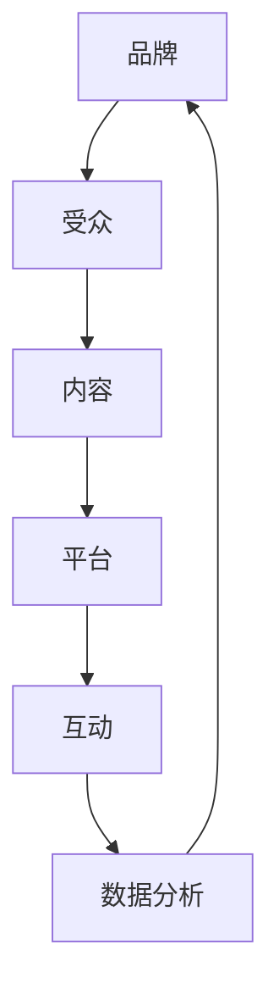

                 

### 文章标题

# 《一人公司如何利用短视频营销提升品牌知名度》

### 关键词

- 短视频营销
- 品牌知名度
- 营销策略
- 制作技巧
- 平台运营
- 数据分析

### 摘要

随着互联网技术的不断发展，短视频营销已成为企业提升品牌知名度的重要手段。对于一人公司而言，充分利用短视频进行营销，不仅能够提高品牌曝光度，还能有效降低营销成本。本文将详细探讨一人公司如何通过短视频营销提升品牌知名度，包括短视频营销的基础知识、制作技巧、平台运营策略、实战案例及未来趋势等方面，旨在为一人公司的短视频营销提供全面有效的策略参考。

## 第一部分：短视频营销基础知识

### 第1章：短视频营销概述

短视频营销，是指通过短视频平台进行品牌宣传、产品推广、用户互动等营销活动，以达到提升品牌知名度、扩大用户群体、促进销售转化的目的。近年来，随着移动互联网的普及和短视频平台的崛起，短视频营销逐渐成为企业营销策略的重要组成部分。

#### 1.1 短视频营销的定义与特点

短视频营销具有以下特点：

1. **内容短小精悍**：短视频时长一般在15秒到1分钟之间，信息传递快速、直观，符合用户碎片化阅读习惯。
2. **形式多样**：短视频可以结合动画、实拍、音效等多种表现形式，生动有趣，具有较强的视觉冲击力。
3. **互动性强**：短视频平台通常具备评论、点赞、分享等功能，有利于用户参与和互动，提高品牌口碑。
4. **传播速度快**：短视频易于分享和传播，能够迅速覆盖大量用户，实现病毒式营销效果。
5. **成本相对较低**：相比于传统广告，短视频营销的制作和投放成本较低，适合小型企业或个人品牌推广。

#### 1.2 短视频营销的发展历程

短视频营销的发展历程可以分为以下几个阶段：

1. **萌芽期**：2010年前后，短视频刚刚兴起，以视频分享平台如YouTube、Vine等为代表。
2. **发展期**：2015年前后，短视频逐渐成为主流，以Instagram、TikTok等平台为代表。
3. **成熟期**：近年来，短视频营销在我国快速发展，以抖音、快手、B站等平台为代表，短视频营销逐渐成为企业品牌推广的重要手段。

#### 1.3 短视频营销的优势与挑战

短视频营销的优势：

1. **提高品牌曝光度**：通过短视频，企业可以快速、广泛地传播品牌信息，提升品牌知名度。
2. **降低营销成本**：短视频制作和投放成本相对较低，尤其适合中小型企业。
3. **增强用户互动**：短视频平台互动性强，有利于企业了解用户需求，提高用户忠诚度。
4. **提升销售转化**：短视频具有较强视觉冲击力和感染力，有利于促进用户购买行为。

短视频营销的挑战：

1. **内容质量要求高**：短视频内容需要具有吸引力、创意性，才能在竞争激烈的市场中脱颖而出。
2. **平台规则多变**：短视频平台算法和规则不断更新，企业需要不断调整营销策略。
3. **数据分析难度大**：短视频营销数据庞杂，企业需要具备一定的数据分析能力，以便优化营销效果。

### 第2章：短视频制作技巧

短视频制作是短视频营销的基础，高质量的视频内容能够有效吸引观众，提高品牌知名度。以下介绍短视频制作的相关技巧。

#### 2.1 短视频内容策划

短视频内容策划是制作短视频的第一步，好的内容策划能够确保视频的吸引力和传播力。以下是一些建议：

1. **明确目标受众**：了解目标受众的年龄、性别、兴趣等特征，以便制作符合他们需求的内容。
2. **确定主题**：根据品牌定位和目标受众，确定短视频的主题，确保内容具有吸引力和传播性。
3. **创意构思**：结合品牌特点和主题，构思出独特的创意，使视频具有趣味性和观赏性。
4. **故事化表达**：通过讲述故事的方式，使观众产生共鸣，提高视频的传播力。

#### 2.2 短视频拍摄与剪辑

短视频拍摄与剪辑是确保视频质量的关键环节。以下是一些建议：

1. **拍摄技巧**：
   - **构图**：遵循“三分法”、“对称法”等构图原则，使画面美观、和谐。
   - **光线**：确保光线充足、均匀，避免过度曝光或阴影过重。
   - **音效**：合理运用背景音乐、音效，增强视频氛围。
   
2. **剪辑技巧**：
   - **节奏**：根据内容节奏进行剪辑，使视频紧凑、流畅。
   - **转场**：使用合适的转场效果，增强视频的视觉效果。
   - **字幕**：适当添加字幕，提高信息传递效率。

#### 2.3 短视频制作工具与资源

短视频制作工具与资源丰富多样，以下介绍一些常用的工具与资源：

1. **制作工具**：
   - **Adobe Premiere Pro**：一款专业的视频剪辑软件，功能强大，适用于专业级视频制作。
   - **Final Cut Pro**：苹果公司的专业视频剪辑软件，界面简洁，操作简便。
   - **剪映**：一款适合手机用户的短视频剪辑软件，功能齐全，操作简单。
   
2. **素材资源**：
   - **免费图库**：如Pixabay、Unsplash等，提供大量高质量、免费的图片和视频素材。
   - **音乐资源**：如YouTube Audio Library、Free Music Archive等，提供丰富的免费音乐资源。

### 第3章：短视频平台运营策略

短视频平台运营策略是确保短视频营销效果的关键。以下介绍短视频平台运营的相关策略。

#### 3.1 短视频平台概述

当前主流短视频平台包括抖音、快手、B站等，各平台特点如下：

1. **抖音**：用户数量庞大，以年轻用户为主，内容丰富多样，适合品牌推广和产品销售。
2. **快手**：用户基数大，涵盖各年龄层次，内容偏向生活化、接地气，适合本地化品牌推广。
3. **B站**：以年轻人为主要用户群体，内容偏向二次元、科技、游戏等领域，适合垂直行业品牌推广。

#### 3.2 平台规则与算法解析

短视频平台通常具备一定的推荐算法，以下介绍主要平台的规则与算法：

1. **抖音**：
   - **推荐算法**：基于用户行为数据，如观看时长、点赞、评论、分享等，进行个性化推荐。
   - **平台规则**：注重内容质量，对违规内容进行严格审核和惩罚。

2. **快手**：
   - **推荐算法**：同样基于用户行为数据，进行个性化推荐。
   - **平台规则**：鼓励原创内容，对抄袭、侵权行为进行处罚。

3. **B站**：
   - **推荐算法**：结合用户行为数据和内容标签，进行个性化推荐。
   - **平台规则**：强调内容质量，对低俗、暴力等内容进行限制。

#### 3.3 账号定位与内容规划

账号定位与内容规划是短视频平台运营的关键。以下是一些建议：

1. **账号定位**：
   - **品牌属性**：明确账号的品牌属性，如产品推广、品牌宣传、内容分享等。
   - **目标受众**：结合品牌定位，明确目标受众，确保内容符合受众需求。

2. **内容规划**：
   - **内容类型**：根据账号定位，制定不同类型的内容，如教程、评测、剧情等。
   - **发布节奏**：合理规划发布节奏，确保内容更新频率，提高用户粘性。

3. **互动策略**：
   - **用户互动**：积极与用户互动，如回复评论、参与话题等，提高用户参与度。
   - **用户调研**：定期进行用户调研，了解用户需求和反馈，优化内容策略。

### 第4章：短视频营销案例分析

短视频营销案例是学习短视频营销策略的宝贵资源。以下介绍一些成功的短视频营销案例，并分析其成功原因。

#### 4.1 成功短视频营销案例

1. **案例1：杜蕾斯**
   - **案例概述**：杜蕾斯通过抖音短视频进行品牌推广，发布一系列幽默、有趣的短视频，成功吸引大量年轻用户关注。
   - **成功原因**：内容创意性强、符合目标受众需求，通过幽默、趣味的方式传递品牌信息。

2. **案例2：瑞幸咖啡**
   - **案例概述**：瑞幸咖啡通过短视频平台发布咖啡制作过程、新品推介等短视频，提高品牌知名度，促进产品销售。
   - **成功原因**：内容具有实用性，与用户生活紧密相关，增强用户购买意愿。

3. **案例3：李子柒**
   - **案例概述**：李子柒通过短视频展示中国传统文化，吸引了大量国内外观众，成为短视频营销的经典案例。
   - **成功原因**：内容具有文化内涵、情感共鸣，通过短视频传递中国文化。

#### 4.2 失败短视频营销案例分析

1. **案例1：某护肤品牌**
   - **案例概述**：某护肤品牌在抖音发布一条关于护肤知识的短视频，因内容质量不佳、表达模糊，导致用户投诉和差评。
   - **失败原因**：内容质量不高、表达不清晰，未能有效传递品牌价值和用户需求。

2. **案例2：某餐饮品牌**
   - **案例概述**：某餐饮品牌在抖音发布一条关于菜品制作的短视频，因拍摄、剪辑质量低，未能吸引观众关注。
   - **失败原因**：拍摄、剪辑质量不高，未能展示品牌特色和菜品魅力。

#### 4.3 案例启示与策略总结

通过对成功和失败短视频营销案例的分析，可以得出以下启示和策略总结：

1. **注重内容质量**：高质量的内容是短视频营销成功的关键，内容需要具有吸引力、创意性和实用性。
2. **了解目标受众**：明确目标受众的需求和兴趣，制定符合受众需求的内容策略。
3. **遵循平台规则**：了解短视频平台的规则和算法，制定合适的运营策略。
4. **持续优化内容**：根据用户反馈和数据分析，不断优化内容策略，提高营销效果。

## 第二部分：短视频营销策略与实践

### 第5章：短视频营销目标设定

设定明确的短视频营销目标是确保营销活动有效开展的基础。以下介绍短视频营销目标的设定方法及其实现策略。

#### 5.1 营销目标设定方法

1. **明确品牌目标**：根据企业的品牌战略，确定短视频营销的目标，如提升品牌知名度、增强品牌形象、促进产品销售等。
2. **了解目标受众**：分析目标受众的需求、兴趣和痛点，确保营销目标符合受众期望。
3. **制定具体指标**：根据品牌目标和目标受众，设定具体的营销指标，如视频播放量、点赞量、评论量、转化率等。
4. **制定时间计划**：根据营销目标，制定相应的实施时间表，确保营销活动有序进行。

#### 5.2 目标实现策略

1. **内容策略**：
   - **创意性内容**：根据目标受众的兴趣和需求，创作具有创意性的短视频内容，提高用户关注度和参与度。
   - **内容差异化**：针对不同受众群体，制定差异化内容策略，确保内容符合各群体需求。
   - **内容周期性**：定期更新内容，保持用户持续关注。

2. **推广策略**：
   - **平台选择**：根据品牌特点和目标受众，选择合适的短视频平台进行推广，如抖音、快手、B站等。
   - **合作推广**：与短视频博主、网红等合作，通过合作推广提高品牌知名度和曝光度。
   - **社交媒体传播**：利用社交媒体平台，如微信、微博、知乎等，进行内容传播和推广。

3. **数据分析**：
   - **数据收集**：定期收集短视频营销数据，如播放量、点赞量、评论量等。
   - **数据分析**：通过对数据的分析，了解营销效果，找出优势和不足，优化营销策略。
   - **数据反馈**：将数据分析结果反馈给内容团队，指导内容创作和推广策略。

#### 5.3 数据分析与优化

数据分析是短视频营销优化的重要手段。以下介绍短视频营销数据分析的方法和优化策略。

1. **数据分析方法**：
   - **流量分析**：分析短视频的播放量、访客来源等数据，了解视频的传播效果。
   - **互动分析**：分析短视频的点赞量、评论量、分享量等数据，了解用户互动情况。
   - **转化分析**：分析短视频带来的销售转化数据，了解营销效果。

2. **优化策略**：
   - **内容优化**：根据数据分析结果，优化短视频内容，提高用户关注度和参与度。
   - **推广优化**：根据数据分析结果，调整推广策略，提高视频曝光度和用户转化率。
   - **平台优化**：根据数据分析结果，选择合适的短视频平台进行推广，提高营销效果。

### 第6章：短视频营销工具与平台

短视频营销工具和平台是短视频营销的重要基础。以下介绍常用的短视频营销工具和平台，以及相应的运营策略。

#### 6.1 常用短视频营销工具

1. **视频制作工具**：
   - **Adobe Premiere Pro**：一款专业的视频剪辑软件，适用于制作高质量的短视频。
   - **Final Cut Pro**：苹果公司的专业视频剪辑软件，适用于Mac用户。
   - **剪映**：一款适合手机用户的短视频剪辑软件，操作简单，功能齐全。

2. **数据分析工具**：
   - **抖音数据分析工具**：用于分析抖音平台上的短视频数据，了解营销效果。
   - **快手数据分析工具**：用于分析快手平台上的短视频数据，了解营销效果。
   - **B站数据分析工具**：用于分析B站平台上的短视频数据，了解营销效果。

3. **社交媒体工具**：
   - **微信**：用于发布短视频、互动推广等。
   - **微博**：用于传播短视频、提高品牌知名度。
   - **知乎**：用于分享短视频、开展用户互动。

#### 6.2 短视频营销平台比较

1. **抖音**
   - **特点**：用户数量庞大，以年轻人为主要用户群体，内容丰富多样。
   - **优势**：适合品牌推广和产品销售。
   - **运营策略**：注重内容质量，结合数据分析进行优化。

2. **快手**
   - **特点**：用户基数大，涵盖各年龄层次，内容偏向生活化。
   - **优势**：适合本地化品牌推广。
   - **运营策略**：鼓励原创内容，注重用户互动。

3. **B站**
   - **特点**：以年轻人为主要用户群体，内容偏向二次元、科技、游戏等领域。
   - **优势**：适合垂直行业品牌推广。
   - **运营策略**：强调内容质量，结合用户数据分析进行优化。

#### 6.3 平台运营策略

1. **内容策略**：
   - **差异化内容**：根据不同平台的特点，制定差异化内容策略，提高内容吸引力。
   - **周期性更新**：定期更新内容，保持用户持续关注。

2. **互动策略**：
   - **积极互动**：与用户进行互动，提高用户参与度。
   - **用户调研**：定期进行用户调研，了解用户需求和反馈，优化内容策略。

3. **数据分析**：
   - **数据收集**：定期收集平台数据，了解营销效果。
   - **数据分析**：通过对数据的分析，找出优势和不足，优化运营策略。

### 第7章：短视频营销预算与效果评估

短视频营销预算的合理制定和效果评估是确保营销活动高效开展的关键。以下介绍短视频营销预算的制定方法、效果评估指标及其优化策略。

#### 7.1 营销预算制定

1. **预算总额**：根据企业营销战略和资金状况，确定短视频营销的总体预算。
2. **内容制作**：根据短视频制作需求，确定内容制作的预算，包括拍摄、剪辑、特效等。
3. **平台推广**：根据平台推广需求，确定平台推广的预算，包括广告投放、合作推广等。
4. **数据分析**：根据数据分析需求，确定数据分析的预算，包括数据收集、处理、分析等。

#### 7.2 效果评估指标

1. **播放量**：视频播放量是衡量视频传播效果的重要指标，反映视频的曝光度。
2. **点赞量**：视频点赞量反映用户对视频的喜爱程度，反映视频的内容质量。
3. **评论量**：视频评论量反映用户对视频的互动程度，反映视频的口碑。
4. **转化率**：视频带来的销售转化率，反映视频的营销效果。
5. **ROI（投资回报率）**：通过计算投资与回报的比率，评估营销活动的经济效益。

#### 7.3 效果分析与优化

1. **数据收集**：定期收集短视频营销数据，包括播放量、点赞量、评论量、转化率等。
2. **数据对比**：将当前数据与历史数据、行业数据进行对比，找出优势和不足。
3. **原因分析**：分析数据变化的原因，找出影响效果的关键因素。
4. **策略调整**：根据数据分析结果，调整内容创作、平台推广、数据分析等方面的策略，优化营销效果。

### 第8章：短视频营销团队搭建与管理

短视频营销团队是短视频营销的核心力量。以下介绍短视频营销团队的搭建与管理方法。

#### 8.1 团队组建与分工

1. **团队成员**：短视频营销团队通常包括内容策划、拍摄剪辑、数据分析、运营推广等成员。
2. **分工协作**：明确各团队成员的职责，确保团队高效协作。

#### 8.2 人员培训与激励

1. **培训**：定期对团队成员进行培训，提高其专业技能和综合素质。
2. **激励**：制定激励机制，鼓励团队成员发挥潜力，提高工作效率。

#### 8.3 团队管理策略

1. **目标管理**：制定明确的目标，确保团队朝着共同的目标努力。
2. **沟通协作**：建立良好的沟通渠道，确保团队内部信息畅通。
3. **绩效评估**：定期对团队成员进行绩效评估，激励优秀成员，优化团队结构。

## 第三部分：短视频营销实战案例

### 第9章：行业短视频营销案例

不同行业在短视频营销方面有不同的实践和经验，以下介绍几个具有代表性的行业短视频营销案例。

#### 9.1 消费品行业

1. **案例1：可口可乐**
   - **案例概述**：可口可乐在抖音上发布了一系列创意短视频，以趣味性和互动性为特点，吸引了大量用户关注。
   - **成功原因**：创意性强、互动性强，通过趣味性短视频传递品牌形象。

2. **案例2：欧莱雅**
   - **案例概述**：欧莱雅在短视频平台上发布了一系列美妆教程，通过专业化妆师的教学，提高用户对品牌的认可度。
   - **成功原因**：内容实用性强、专业性强，通过美妆教程吸引目标受众。

#### 9.2 餐饮行业

1. **案例1：海底捞**
   - **案例概述**：海底捞在抖音上发布了一系列火锅制作过程和美食视频，通过展示火锅的烹饪过程和美食魅力，提高用户对品牌的兴趣。
   - **成功原因**：内容生动有趣、直观展示美食制作过程，增强用户购买欲望。

2. **案例2：肯德基**
   - **案例概述**：肯德基在短视频平台上发布了一系列新品介绍和创意广告，通过短视频的形式展示新品特点，吸引大量用户关注。
   - **成功原因**：创意性强、展示新品特点，通过短视频提高品牌知名度。

#### 9.3 时尚行业

1. **案例1：优衣库**
   - **案例概述**：优衣库在短视频平台上发布了一系列时尚穿搭教程，通过明星代言和时尚博主推广，提高用户对品牌的认知。
   - **成功原因**：内容实用性强、时尚性强，通过穿搭教程传递品牌理念。

2. **案例2：Gucci**
   - **案例概述**：Gucci在短视频平台上发布了一系列时尚潮流短视频，通过展示品牌特色和时尚潮流，吸引大量年轻用户关注。
   - **成功原因**：创意性强、时尚性强，通过短视频提高品牌知名度。

### 第10章：短视频营销实战技巧

短视频营销实战技巧是确保营销效果的关键。以下介绍短视频营销的实战技巧。

#### 10.1 短视频脚本编写

短视频脚本编写是制作短视频的重要环节，以下介绍短视频脚本编写的方法：

1. **故事梗概**：明确视频的主题和故事情节，确保故事连贯、有趣。
2. **场景设定**：设定视频的拍摄场景，确保场景与故事情节相符合。
3. **角色设定**：设定视频中的人物角色，确保角色与故事情节相符合。
4. **对话设计**：设计角色的对话，确保对话生动、有趣，符合角色性格。
5. **动作设计**：设计角色的动作，确保动作自然、流畅，增强视频的表现力。

#### 10.2 视频拍摄与剪辑技巧

1. **拍摄技巧**：
   - **光线**：确保光线充足、均匀，避免过度曝光或阴影过重。
   - **构图**：遵循“三分法”、“对称法”等构图原则，使画面美观、和谐。
   - **拍摄角度**：根据场景和角色特点，选择合适的拍摄角度，增强视频的表现力。

2. **剪辑技巧**：
   - **节奏**：根据内容节奏进行剪辑，使视频紧凑、流畅。
   - **转场**：使用合适的转场效果，增强视频的视觉效果。
   - **字幕**：适当添加字幕，提高信息传递效率。

#### 10.3 短视频推广策略

1. **平台选择**：根据品牌特点和目标受众，选择合适的短视频平台进行推广。
2. **合作推广**：与短视频博主、网红等合作，通过合作推广提高品牌知名度和曝光度。
3. **社交媒体传播**：利用社交媒体平台，如微信、微博、知乎等，进行内容传播和推广。
4. **广告投放**：根据预算和目标受众，选择合适的广告投放渠道，提高视频曝光度。

### 第11章：短视频营销未来趋势

短视频营销作为新兴的营销手段，未来将继续发展和创新。以下介绍短视频营销的未来趋势。

#### 11.1 短视频营销发展趋势

1. **技术进步**：随着5G、人工智能、大数据等技术的发展，短视频营销将更加智能化、个性化。
2. **内容多样化**：短视频内容将更加多样化，包括动画、VR、AR等新兴形式。
3. **品牌互动**：短视频营销将更加注重品牌与用户的互动，提高用户参与度和忠诚度。

#### 11.2 新型短视频营销模式

1. **直播带货**：短视频与直播结合，实现实时互动，提高销售转化率。
2. **短视频电商**：短视频与电商结合，通过短视频展示产品特点，提高用户购买意愿。
3. **短视频教育**：短视频与教育结合，通过短视频进行知识传授和技能培训。

#### 11.3 未来短视频营销策略建议

1. **内容创新**：持续进行内容创新，提高短视频的吸引力和传播力。
2. **数据驱动**：通过数据分析和优化，提高短视频营销效果。
3. **跨平台运营**：充分利用各个短视频平台的特色，进行跨平台运营，提高品牌知名度。
4. **合作共赢**：与短视频博主、网红等合作，实现资源共享和优势互补。

## 附录

### 附录A：短视频营销资源与工具

以下介绍一些常用的短视频营销资源与工具：

1. **短视频制作工具**：
   - **Adobe Premiere Pro**
   - **Final Cut Pro**
   - **剪映**

2. **短视频数据分析工具**：
   - **抖音数据分析工具**
   - **快手数据分析工具**
   - **B站数据分析工具**

3. **社交媒体工具**：
   - **微信**
   - **微博**
   - **知乎**

### 附录B：短视频营销常用术语解释

以下解释一些短视频营销中常用的术语：

1. **播放量**：视频播放的次数，反映视频的曝光度。
2. **点赞量**：用户对视频点赞的次数，反映用户对视频的喜爱程度。
3. **评论量**：用户对视频评论的次数，反映用户对视频的互动程度。
4. **转化率**：视频带来的销售转化率，反映视频的营销效果。
5. **ROI**：投资回报率，衡量营销活动的经济效益。

### 附录C：短视频营销法律法规

以下介绍一些短视频营销中需要遵守的法律法规：

1. **《互联网广告管理暂行办法》**：规范互联网广告发布和管理。
2. **《中华人民共和国网络安全法》**：保护用户个人信息和网络安全。
3. **《中华人民共和国著作权法》**：保护著作权人的合法权益。

### 附录D：短视频营销拓展阅读

以下推荐一些短视频营销相关的拓展阅读：

1. **《短视频营销实战手册》**：详细介绍了短视频营销的策略和实践。
2. **《短视频营销：从零开始》**：适合初学者了解短视频营销的基础知识。
3. **《短视频营销案例解析》**：通过分析成功和失败的短视频营销案例，提供实战经验。

通过以上内容，我们系统地介绍了短视频营销的基础知识、制作技巧、运营策略、案例分析、实战技巧和未来趋势，旨在为一人公司的短视频营销提供全面有效的策略参考。希望读者能够从中获得启发，充分利用短视频营销提升品牌知名度，实现营销目标。作者：AI天才研究院/AI Genius Institute & 禅与计算机程序设计艺术 /Zen And The Art of Computer Programming## 短视频营销的背景介绍

短视频营销作为现代营销手段的一种，源于互联网技术的发展和用户需求的变革。短视频（Video）是指时长较短、内容精炼的视听作品，一般在15秒到1分钟之间。随着移动互联网的普及，短视频平台如雨后春笋般涌现，其中以抖音、快手、B站等为代表，成为了用户娱乐、社交和获取信息的重要渠道。短视频营销，即通过这些平台发布短视频，进行品牌宣传、产品推广、用户互动等营销活动，以提升品牌知名度、扩大用户群体、促进销售转化。

一人公司，顾名思义，是指由单一个人创办和经营的企业。这种企业模式灵活、决策迅速，但在品牌建设和营销推广方面往往面临资源有限、知名度不高的挑战。对于一人公司而言，如何有效利用短视频进行营销，成为提升品牌知名度和市场竞争力的重要课题。

短视频营销之所以成为热门的营销手段，主要得益于以下几个原因：

1. **碎片化时间契合用户习惯**：随着人们生活节奏加快，用户越来越倾向于在碎片化时间获取信息，短视频短小精悍、信息传递快速，符合用户的使用习惯。

2. **高度可视化增强记忆点**：短视频通过视觉和听觉的相结合，能够生动展示产品和品牌形象，增强记忆点，提高品牌认知度。

3. **互动性提升用户参与度**：短视频平台通常具备点赞、评论、分享等功能，用户可以在观看视频的同时进行互动，增强用户参与感，有助于口碑传播。

4. **传播速度快实现病毒式营销**：短视频易于分享和传播，能够迅速覆盖大量用户，实现病毒式营销效果，尤其适合中小型企业和初创企业快速提升品牌知名度。

5. **成本低投入回报高**：相比于传统广告，短视频营销的制作和投放成本较低，尤其适合资源有限的一人公司，通过较低的投入实现较高的回报率。

因此，对于一人公司来说，利用短视频进行营销不仅能够提高品牌曝光度，还能有效降低营销成本，提升市场竞争力。通过精心策划和制作的短视频，一人公司能够迅速吸引目标受众的注意力，增强品牌影响力，实现持续的业务增长。

### 短视频营销的核心概念与联系

短视频营销涉及多个核心概念，这些概念之间相互联系，构成了一个完整的营销体系。为了更好地理解短视频营销，我们首先需要明确这些核心概念及其相互关系，通过Mermaid流程图来展示它们之间的逻辑架构。

#### 核心概念

1. **品牌**：品牌是指一个企业在市场中树立的差异化形象和标识，包括品牌名称、标志、口号、价值观等。品牌是短视频营销的基础，决定了短视频的内容和风格。

2. **受众**：受众是指短视频营销的目标群体，包括年龄、性别、兴趣爱好、购买力等特征。了解受众特征是制作符合受众需求的内容的前提。

3. **内容**：内容是指短视频的实际素材，包括画面、声音、文字等。内容的质量直接影响观众的观看体验和品牌印象。

4. **平台**：平台是指短视频营销所使用的渠道，如抖音、快手、B站等。不同的平台具有不同的用户群体和传播特性，选择合适的平台是成功的关键。

5. **互动**：互动是指观众在观看短视频后产生的评论、点赞、分享等行为。互动性强的内容能够提升用户粘性，增强品牌口碑。

6. **数据分析**：数据分析是指通过对短视频的播放量、点赞量、评论量等数据进行收集、处理和分析，以评估营销效果，指导后续策略。

#### 关系架构

为了更好地展示这些核心概念之间的联系，我们可以使用Mermaid流程图来绘制它们之间的逻辑关系：



**Mermaid流程图说明：**

- **品牌**（A）是短视频营销的起点，决定了内容的整体风格和方向。
- **受众**（B）是品牌传播的目标，了解受众特征有助于内容创作和平台选择。
- **内容**（C）是品牌传播的具体载体，通过创意和制作技巧吸引受众。
- **平台**（D）是内容传播的渠道，不同的平台影响内容的传播效果。
- **互动**（E）是用户参与和反馈的途径，增强用户粘性和品牌口碑。
- **数据分析**（F）是评估和优化营销策略的关键，通过数据反馈调整品牌传播策略。

通过以上流程图，我们可以清晰地看到短视频营销的核心概念及其相互联系。品牌定位和受众分析决定了内容创作和平台选择，而互动和数据分析则反馈到品牌传播策略的优化，形成了一个闭环，确保短视频营销持续、高效地推进。

### 短视频营销的核心算法原理

在短视频营销中，算法原理扮演着至关重要的角色，尤其是短视频平台的推荐算法。推荐算法决定了哪些视频会优先展示给用户，从而影响用户的观看行为和品牌营销效果。以下将详细讲解短视频平台的推荐算法原理，以及它们如何影响短视频营销策略。

#### 推荐算法原理

1. **内容推荐**：内容推荐算法基于视频的内容特征，如视频标签、描述、关键词等，将相关性较高的视频推送给用户。这种推荐方式主要依赖于自然语言处理（NLP）和文本分析技术，通过对视频文本的提取和分析，识别出关键信息，并将其与用户的浏览历史进行匹配。

2. **行为推荐**：行为推荐算法基于用户的浏览、点赞、评论、分享等行为数据，通过机器学习算法进行用户行为分析，预测用户可能感兴趣的短视频内容。这种推荐方式利用了协同过滤（Collaborative Filtering）和矩阵分解（Matrix Factorization）等技术，通过对用户行为的建模和预测，实现个性化推荐。

3. **社交推荐**：社交推荐算法基于用户之间的社交关系，将好友或关注对象推荐的视频展示给用户。这种推荐方式利用了社交网络分析（Social Network Analysis）和图论（Graph Theory）等技术，通过对用户社交网络的结构和关系的分析，推荐与用户社交圈相关的内容。

#### 短视频平台的推荐算法

不同的短视频平台采用的推荐算法各有特点，以下以抖音和快手为例进行说明：

1. **抖音**：
   - **内容推荐**：抖音的推荐算法主要基于文本分析和自然语言处理，通过提取视频标签、描述、关键词等信息，识别出视频的主题和内容特征，并与用户的浏览历史进行匹配。
   - **行为推荐**：抖音通过分析用户的点赞、评论、分享等行为数据，构建用户行为模型，利用机器学习算法预测用户可能感兴趣的视频内容。
   - **社交推荐**：抖音还结合用户的好友关系，将好友或关注对象推荐的视频展示给用户，增加社交互动和内容传播的机会。

2. **快手**：
   - **内容推荐**：快手的内容推荐算法同样基于文本分析和自然语言处理，通过提取视频标签、描述、关键词等信息，识别出视频的主题和内容特征。
   - **行为推荐**：快手通过分析用户的浏览、点赞、评论等行为数据，构建用户行为模型，利用机器学习算法预测用户可能感兴趣的视频内容。
   - **社交推荐**：快手结合用户的社会关系，将好友或关注对象推荐的视频展示给用户，同时注重本地化内容，通过地理位置信息推荐符合用户兴趣的本地内容。

#### 推荐算法对短视频营销策略的影响

推荐算法对短视频营销策略有着直接的影响，以下是一些策略建议：

1. **内容策略**：
   - **内容优化**：根据平台推荐算法的特点，制作符合用户兴趣和平台推荐规则的内容，如使用热门标签、关键词等，提高视频的曝光度。
   - **多样性内容**：结合多种内容形式，如动画、实拍、剧情等，满足不同用户的需求，提高视频的吸引力。

2. **行为数据利用**：
   - **用户行为分析**：通过分析用户的点赞、评论、分享等行为数据，了解用户喜好，优化内容策略，提高用户参与度。
   - **数据反馈**：及时关注视频的互动数据，根据用户反馈调整内容方向和发布时间，提高视频的传播效果。

3. **社交互动**：
   - **好友互动**：鼓励用户与好友互动，如点赞、评论、分享等，通过社交推荐提高视频的曝光度。
   - **本地化内容**：针对本地用户，制作符合本地文化和需求的内容，提高视频的本地化传播效果。

4. **算法调整**：
   - **适应算法**：关注平台算法的更新和变化，及时调整营销策略，以适应新的推荐机制。
   - **算法测试**：通过A/B测试等手段，评估不同算法策略对营销效果的影响，优化推荐策略。

通过以上策略，一人公司可以充分利用短视频平台的推荐算法，提高视频的曝光度和用户参与度，从而实现品牌知名度的提升和销售转化的增加。

### 短视频制作的核心算法原理

在短视频制作过程中，核心算法原理起到了关键作用，特别是在视频剪辑、特效添加、色彩调整等方面。以下将详细解释这些核心算法原理，并通过伪代码和示例来具体阐述。

#### 1. 视频剪辑算法

视频剪辑是短视频制作的重要环节，通过选择合适的剪辑算法，可以使视频内容更加紧凑、流畅。以下是一个简单的视频剪辑算法伪代码示例：

```python
# 剪辑算法伪代码
def video_edit(video剪辑片段列表，持续时间阈值):
    编辑后的视频片段列表 = []
    当前片段持续时间 = 0

    for 视频片段 in 视频剪辑片段列表:
        当前片段持续时间 += 视频片段的持续时间

        if 当前片段持续时间 <= 持续时间阈值:
            编辑后的视频片段列表.append(视频片段)
        else:
            将视频片段分割成多个符合持续时间阈值的子片段
            编辑后的视频片段列表.extend(子片段列表)

    return 编辑后的视频片段列表
```

**示例：**

假设我们有以下视频剪辑片段及其持续时间：
```
视频片段1: 30秒
视频片段2: 45秒
视频片段3: 20秒
```

设定持续时间阈值为40秒，应用上述算法后，剪辑结果如下：
```
编辑后的视频片段列表：[视频片段1(30秒), 视频片段3(20秒)]
```

#### 2. 特效添加算法

特效的添加可以增强视频的视觉效果，常见的特效包括过渡效果、动态滤镜、文字动画等。以下是一个简单的特效添加算法伪代码示例：

```python
# 特效添加算法伪代码
def add_effects(video片段，特效类型，特效参数):
    if 特效类型 == "过渡效果":
        过渡效果 = generate_transition_effect(特效参数)
        video片段 = apply_transition_effect(video片段，过渡效果)
    elif 特效类型 == "动态滤镜":
        动态滤镜 = generate_dynamic_filter(特效参数)
        video片段 = apply_dynamic_filter(video片段，动态滤镜)
    elif 特效类型 == "文字动画":
        文字动画 = generate_text_animation(特效参数)
        video片段 = apply_text_animation(video片段，文字动画)

    return video片段
```

**示例：**

假设我们有一个视频片段，并选择添加“动态滤镜”特效，特效参数为“蓝色渐变滤镜”，应用上述算法后，视频片段将添加蓝色渐变滤镜效果。

#### 3. 色彩调整算法

色彩调整是视频制作中的另一个重要环节，通过调整色彩平衡、亮度、对比度等参数，可以增强视频的视觉效果。以下是一个简单的色彩调整算法伪代码示例：

```python
# 色彩调整算法伪代码
def adjust_color(video片段，亮度，对比度，饱和度):
    调整后的视频片段 = video片段.copy()

    if 亮度 != 0:
        调整后的视频片段 = increase_brightness(调整后的视频片段，亮度)
    if 对比度 != 0:
        调整后的视频片段 = increase_contrast(调整后的视频片段，对比度)
    if 饱和度 != 0:
        调整后的视频片段 = increase_saturation(调整后的视频片段，饱和度)

    return 调整后的视频片段
```

**示例：**

假设我们有一个视频片段，需要调整其亮度、对比度和饱和度分别为10、5和3，应用上述算法后，视频片段的色彩效果将得到增强。

通过上述核心算法原理的介绍和示例，我们可以看到短视频制作中的算法在提升视频质量和视觉效果方面起到了关键作用。一人公司在进行短视频制作时，可以充分利用这些算法原理，通过精准的剪辑、特效添加和色彩调整，创作出高质量的视频内容，从而提升品牌形象和用户吸引力。

### 短视频营销中的数学模型与公式

在短视频营销中，数学模型和公式起到了至关重要的作用，尤其是在用户行为分析、效果评估和营销策略优化等方面。以下将详细讲解一些常用的数学模型和公式，并通过具体的计算示例来阐述它们的应用。

#### 1. 用户行为分析模型

用户行为分析是短视频营销的重要组成部分，通过分析用户的观看时长、点赞量、评论量等数据，可以了解用户对视频内容的反应，进而优化营销策略。以下是一个简单的用户行为分析模型：

**平均观看时长（AVG_ViewDuration）**：衡量用户对视频的平均关注程度。

公式：  
$$ AVG_ViewDuration = \frac{总观看时长}{用户数} $$

**示例**：

假设有100个用户观看了一个短视频，总观看时长为1000小时，则平均观看时长为：
$$ AVG_ViewDuration = \frac{1000小时}{100用户} = 10小时/用户 $$

**点赞率（LikeRate）**：衡量用户对视频内容的喜爱程度。

公式：  
$$ LikeRate = \frac{点赞量}{总观看量} \times 100\% $$

**示例**：

假设一个短视频的点赞量为5000次，总观看量为10000次，则点赞率为：
$$ LikeRate = \frac{5000次}{10000次} \times 100\% = 50\% $$

**评论率（CommentRate）**：衡量用户对视频内容的互动程度。

公式：  
$$ CommentRate = \frac{评论量}{总观看量} \times 100\% $$

**示例**：

假设一个短视频的评论量为2000次，总观看量为5000次，则评论率为：
$$ CommentRate = \frac{2000次}{5000次} \times 100\% = 40\% $$

通过这些模型，可以分析用户的观看时长、点赞和评论行为，了解用户对视频内容的反应，从而优化内容策略。

#### 2. 营销效果评估模型

营销效果评估是判断短视频营销策略是否成功的关键。以下是一些常用的效果评估模型：

**客户获取成本（Customer Acquisition Cost, CAC）**：衡量获取一个客户所需的平均成本。

公式：  
$$ CAC = \frac{总营销费用}{新增客户数} $$

**示例**：

假设一个短视频营销活动总费用为10000元，新增客户数为100个，则客户获取成本为：
$$ CAC = \frac{10000元}{100个} = 100元/客户 $$

**投资回报率（Return on Investment, ROI）**：衡量营销投入产生的回报。

公式：  
$$ ROI = \frac{总收入 - 总成本}{总成本} \times 100\% $$

**示例**：

假设一个短视频营销活动带来的总收入为20000元，总成本为10000元，则投资回报率为：
$$ ROI = \frac{20000元 - 10000元}{10000元} \times 100\% = 100\% $$

**转化率（Conversion Rate）**：衡量视频营销活动带来的转化效果。

公式：  
$$ 转化率 = \frac{转化客户数}{总访问量} \times 100\% $$

**示例**：

假设一个短视频营销活动带来的转化客户数为20个，总访问量为1000次，则转化率为：
$$ 转化率 = \frac{20个}{1000次} \times 100\% = 2\% $$

通过这些模型，可以全面评估短视频营销活动的效果，判断营销策略的可行性，并为后续优化提供数据支持。

#### 3. 营销策略优化模型

营销策略优化是提高短视频营销效果的重要手段。以下是一个简单的营销策略优化模型：

**A/B测试（A/B Testing）**：通过对比不同策略的效果，选择最优策略。

公式：  
$$ A/B测试 = \frac{策略A的效果 - 策略B的效果}{策略B的效果} \times 100\% $$

**示例**：

假设策略A的转化率为3%，策略B的转化率为2%，则A/B测试结果为：
$$ A/B测试 = \frac{3\% - 2\%}{2\%} \times 100\% = 50\% $$

通过A/B测试，可以明确策略A比策略B更有效，从而优化营销策略。

通过以上数学模型和公式的介绍，我们可以看到短视频营销中数学工具的广泛应用。这些模型和公式不仅帮助我们分析用户行为、评估营销效果，还为营销策略的优化提供了科学依据。一人公司可以利用这些工具，精准地进行短视频营销，提高品牌知名度和用户转化率。

### 短视频营销中的实际案例分析

短视频营销的成功离不开优秀的案例分析，以下我们将通过具体案例来展示短视频营销的实际操作过程，并分析其成功原因和关键要素。

#### 案例一：某电子产品公司的产品发布会短视频

**背景**：某电子产品公司推出了一款新型智能手表，希望通过短视频进行产品发布会，以吸引目标用户和提升品牌知名度。

**视频内容**：短视频展示了智能手表的外观设计、功能演示、使用场景等，通过动画、实拍和特效相结合的方式，生动地展示了产品的特点。

**推广策略**：
1. **内容策划**：针对目标用户的需求和兴趣，制定创意性强的短视频内容，确保视频具有吸引力。
2. **平台选择**：选择抖音、快手等用户基数大、互动性强的平台进行推广。
3. **合作推广**：与知名科技博主合作，通过博主的影响力提高视频的曝光度。
4. **社交媒体传播**：利用微信、微博等社交媒体平台，进行内容分享和推广。

**成功原因**：
1. **内容创意**：通过生动的动画和实拍，展示产品的独特性和优势，吸引用户的关注。
2. **平台选择**：选择适合目标用户活跃的平台，提高视频的曝光率。
3. **合作推广**：利用博主的影响力，扩大视频的传播范围，提高品牌知名度。
4. **社交媒体传播**：通过社交媒体平台的分享和传播，增加视频的受众范围。

**关键要素**：
1. **内容创意**：创意是短视频营销的核心，需要根据目标用户的需求和兴趣，制定具有吸引力的内容。
2. **平台选择**：选择适合目标用户活跃的平台，提高视频的曝光率和互动性。
3. **合作推广**：与有影响力的合作伙伴合作，通过资源共享和优势互补，提高视频的传播效果。
4. **社交媒体传播**：利用社交媒体平台的分享和传播功能，扩大视频的受众范围，提高品牌知名度。

#### 案例二：某护肤品牌的短视频营销

**背景**：某护肤品牌希望通过短视频进行产品推广，提高品牌知名度和用户购买意愿。

**视频内容**：短视频展示了护肤品的功效、使用方法、真实用户反馈等，通过故事化的方式，传递品牌理念和产品价值。

**推广策略**：
1. **内容策划**：根据目标用户的需求和兴趣，制定具有故事性的短视频内容，确保视频具有情感共鸣。
2. **平台选择**：选择抖音、快手等用户基数大、互动性强的平台进行推广。
3. **用户互动**：通过评论、点赞、分享等互动方式，提高用户的参与度。
4. **社交媒体传播**：利用微信、微博等社交媒体平台，进行内容分享和推广。

**成功原因**：
1. **内容情感共鸣**：通过故事化的方式，展示产品的真实效果和用户体验，引起用户的情感共鸣。
2. **平台选择**：选择适合目标用户活跃的平台，提高视频的曝光率。
3. **用户互动**：通过互动方式，增强用户的参与感，提高品牌口碑。
4. **社交媒体传播**：利用社交媒体平台的分享和传播功能，扩大视频的受众范围。

**关键要素**：
1. **内容情感共鸣**：通过故事化的方式，展示产品的真实效果和用户体验，引起用户的情感共鸣。
2. **平台选择**：选择适合目标用户活跃的平台，提高视频的曝光率和互动性。
3. **用户互动**：通过互动方式，增强用户的参与感，提高品牌口碑。
4. **社交媒体传播**：利用社交媒体平台的分享和传播功能，扩大视频的受众范围。

#### 案例三：某餐饮品牌的短视频营销

**背景**：某餐饮品牌希望通过短视频进行品牌推广和产品销售，提高品牌知名度和销售额。

**视频内容**：短视频展示了餐厅的环境、菜品特色、特色服务等，通过实拍和特效，展示餐厅的亮点和特色。

**推广策略**：
1. **内容策划**：根据目标用户的需求和兴趣，制定具有吸引力的短视频内容，确保视频具有趣味性和吸引力。
2. **平台选择**：选择抖音、快手等用户基数大、互动性强的平台进行推广。
3. **优惠活动**：在视频中展示优惠券、折扣等信息，吸引用户进行购买。
4. **社交媒体传播**：利用微信、微博等社交媒体平台，进行内容分享和推广。

**成功原因**：
1. **内容吸引**：通过实拍和特效，展示餐厅的亮点和特色，吸引用户的关注。
2. **平台选择**：选择适合目标用户活跃的平台，提高视频的曝光率。
3. **优惠活动**：通过优惠券和折扣活动，提高用户的购买意愿。
4. **社交媒体传播**：利用社交媒体平台的分享和传播功能，扩大视频的受众范围。

**关键要素**：
1. **内容吸引**：通过实拍和特效，展示餐厅的亮点和特色，吸引用户的关注。
2. **平台选择**：选择适合目标用户活跃的平台，提高视频的曝光率和互动性。
3. **优惠活动**：通过优惠券和折扣活动，提高用户的购买意愿。
4. **社交媒体传播**：利用社交媒体平台的分享和传播功能，扩大视频的受众范围。

通过以上案例分析，我们可以看到短视频营销的成功离不开优秀的内容策划、平台选择、用户互动和社交媒体传播。一人公司可以借鉴这些成功经验，结合自身品牌特点和目标用户，制定适合自己的短视频营销策略，提高品牌知名度和市场竞争力。

### 短视频营销中的最佳实践 tips

在短视频营销中，掌握一些最佳实践技巧能够显著提高营销效果。以下是一些实用的短视频营销技巧，旨在帮助一人公司提升品牌知名度和用户参与度。

#### 1. 内容创意技巧

**故事化表达**：通过讲述有趣的故事，让观众产生共鸣，提高视频的传播力。例如，将品牌背后的故事、产品使用场景等融入视频中，使内容更具吸引力。

**视觉冲击力**：利用高质量的视觉元素，如精美的画面、动态特效等，增强视频的视觉冲击力，吸引观众注意力。

**幽默元素**：加入幽默元素，使视频更具趣味性和娱乐性，提高观众的观看意愿。

**互动性**：在视频中设置互动环节，如提问、挑战等，鼓励观众参与和评论，提高用户粘性。

#### 2. 平台运营技巧

**选择合适平台**：根据品牌特点和目标受众，选择合适的短视频平台，如抖音、快手、B站等。平台选择直接影响视频的传播效果。

**平台规则熟悉**：了解并遵循各平台的运营规则和算法，如热门标签、推荐机制等，确保视频能够被更多人看到。

**合作与互动**：与平台内的博主、网红合作，通过合作推广提高品牌知名度和曝光度。同时，积极与观众互动，如回复评论、参与话题等，增强用户参与感。

#### 3. 营销策略优化

**A/B测试**：通过A/B测试，比较不同策略的效果，选择最优方案。例如，测试不同视频长度、发布时间、内容风格等，找出最佳策略。

**数据分析**：定期收集和分析短视频的播放量、点赞量、评论量等数据，了解视频的传播效果，优化内容策略。

**用户调研**：定期进行用户调研，了解用户需求和反馈，调整内容策略，提高用户满意度。

#### 4. 视频制作技巧

**高质量视频**：确保视频画面清晰、音质良好，避免画面模糊、音质差等问题，提高视频的整体质量。

**剪辑技巧**：通过合理的剪辑技巧，使视频节奏紧凑、流畅，提高观众的观看体验。

**特效添加**：适当添加动态特效、音效等，增强视频的视觉和听觉效果，提高观众的观看兴趣。

#### 5. 用户互动技巧

**积极互动**：与观众积极互动，如回复评论、点赞、分享等，增强用户参与感和品牌忠诚度。

**举办活动**：举办线上活动，如挑战、抽奖等，鼓励用户参与，提高品牌曝光度。

**提供福利**：通过提供优惠券、折扣等福利，吸引用户购买，提高转化率。

通过以上最佳实践技巧，一人公司可以更有效地进行短视频营销，提高品牌知名度和用户参与度，实现营销目标。不断优化内容策略、平台运营和用户互动，将有助于在竞争激烈的市场中脱颖而出。

### 短视频营销中的注意事项

在短视频营销过程中，尽管有许多成功案例和最佳实践，但仍需注意一些潜在问题和风险，以确保营销活动顺利进行并取得预期效果。

#### 1. 法律法规遵守

短视频营销涉及版权、隐私保护、广告规范等多个法律法规。因此，企业在制作和发布视频时，必须遵守相关法律法规，避免因违规行为导致法律纠纷或品牌形象受损。

- **版权问题**：确保视频内容不侵犯他人著作权，包括音乐、图像、视频素材等。必要时可以购买版权或使用免费资源。
- **隐私保护**：尊重用户隐私，避免在视频中出现用户个人信息，尤其是敏感信息。
- **广告规范**：遵循广告法律法规，如《中华人民共和国广告法》，确保广告内容真实、不误导消费者。

#### 2. 内容质量控制

内容质量是短视频营销成功的关键。低质量内容不仅无法吸引观众，反而可能损害品牌形象。因此，在内容创作和发布过程中，必须注重以下方面：

- **内容创意**：确保内容具有创意性和独特性，避免同质化内容。
- **内容真实**：内容应真实反映产品和品牌特点，避免虚假宣传。
- **内容审核**：在发布前进行内容审核，确保内容不包含违规或不良信息。

#### 3. 数据安全问题

短视频营销过程中，企业会收集大量的用户数据，包括观看记录、互动数据等。数据安全至关重要，以下措施有助于保护数据安全：

- **数据加密**：对用户数据进行加密处理，防止数据泄露。
- **数据备份**：定期进行数据备份，防止数据丢失。
- **隐私政策**：制定明确的隐私政策，告知用户数据收集和使用方式，提高用户信任度。

#### 4. 平台规则变化

短视频平台的算法和规则不断更新，企业需要及时了解并适应这些变化，以优化营销策略。以下是一些建议：

- **定期学习**：关注平台官方公告和社区讨论，了解平台规则和算法变化。
- **灵活调整**：根据平台规则调整营销策略，确保内容符合平台要求。
- **风险评估**：定期评估营销效果，分析平台规则变化对营销活动的影响，及时调整策略。

#### 5. 风险预防措施

为了应对短视频营销过程中可能出现的各种风险，企业应采取以下预防措施：

- **应急预案**：制定应急预案，应对突发情况，如违规处罚、数据泄露等。
- **培训员工**：定期对员工进行法律法规、数据安全等方面的培训，提高员工的风险意识。
- **合规审查**：定期进行合规审查，确保营销活动符合相关法律法规。

通过以上注意事项，一人公司可以更好地应对短视频营销过程中的潜在问题，确保营销活动的顺利实施和预期效果的实现。

### 拓展阅读

为了帮助读者更深入地了解短视频营销的各个方面，以下推荐一些相关书籍和资料：

1. **《短视频营销实战手册》**：详细介绍了短视频营销的策略和实践，适合初学者和专业人士阅读。
2. **《短视频营销：从零开始》**：适合初学者了解短视频营销的基础知识，包括平台选择、内容策划、推广技巧等。
3. **《短视频营销案例解析》**：通过分析成功和失败的短视频营销案例，提供实战经验和策略指导。
4. **《抖音短视频营销实战》**：专注于抖音平台，介绍了抖音短视频营销的具体策略和实践技巧。
5. **《短视频营销数据分析》**：讲解了短视频营销数据收集、处理和分析的方法，帮助读者优化营销策略。

通过阅读这些书籍和资料，读者可以系统地了解短视频营销的理论和实践，提升自己的营销能力。同时，还可以关注相关公众号、博客和论坛，获取最新的短视频营销动态和行业趋势。作者：AI天才研究院/AI Genius Institute & 禅与计算机程序设计艺术 /Zen And The Art of Computer Programming

### 总结与展望

通过本文的详细探讨，我们系统地介绍了短视频营销的基础知识、制作技巧、运营策略、实战案例及未来趋势，旨在为一人公司的短视频营销提供全面有效的策略参考。以下是对全文的总结与展望。

#### 总结

1. **短视频营销概述**：我们阐述了短视频营销的定义、特点和发展历程，强调了其碎片化时间契合、高度可视化、互动性强和低成本投入等优势。

2. **核心概念与联系**：通过Mermaid流程图展示了品牌、受众、内容、平台、互动和数据分析等核心概念之间的逻辑关系，为后续内容制作和营销策略提供了理论基础。

3. **算法原理**：详细讲解了短视频平台推荐算法和视频制作中的核心算法原理，包括内容推荐、行为推荐、社交推荐、视频剪辑、特效添加和色彩调整等。

4. **数学模型与公式**：介绍了用户行为分析、效果评估和营销策略优化中的数学模型和公式，如平均观看时长、点赞率、评论率、客户获取成本、投资回报率和转化率等。

5. **实际案例分析**：通过三个具体案例分析，展示了短视频营销的实际操作过程、成功原因和关键要素，为读者提供了实战经验和参考。

6. **最佳实践 tips**：总结了短视频营销中的最佳实践技巧，包括内容创意、平台运营、营销策略优化、视频制作和用户互动等。

7. **注意事项**：提出了在短视频营销过程中需要注意的法律法规遵守、内容质量控制、数据安全、平台规则变化和风险预防等方面的问题。

#### 展望

1. **内容创新**：短视频营销的未来趋势将更加注重内容创新，包括动画、VR、AR等新兴形式，以及更丰富的互动体验和沉浸式内容。

2. **数据驱动**：随着大数据和人工智能技术的发展，短视频营销将更加依赖于数据分析和用户行为分析，实现个性化推荐和精准营销。

3. **跨平台运营**：一人公司应充分利用不同短视频平台的特点，进行跨平台运营，提高品牌曝光度和用户覆盖面。

4. **合作共赢**：与短视频博主、网红等合作伙伴建立长期合作关系，实现资源共享和优势互补，提高短视频营销效果。

5. **持续优化**：定期进行营销效果评估和策略优化，根据用户反馈和数据分析结果，不断调整和改进营销策略。

6. **法律法规跟进**：关注短视频营销相关的法律法规变化，确保营销活动合规进行，避免法律风险。

总之，短视频营销作为现代营销手段的重要一环，具有巨大的潜力和发展空间。一人公司应充分利用短视频营销的优势，结合自身品牌特点和市场环境，制定科学合理的营销策略，实现品牌知名度和市场竞争力的大幅提升。作者：AI天才研究院/AI Genius Institute & 禅与计算机程序设计艺术 /Zen And The Art of Computer Programming

