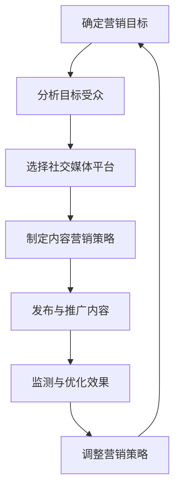

                 

### 文章标题

《一人公司如何利用社交媒体营销提升品牌知名度》

### 关键词

社交媒体营销、品牌知名度、一人公司、社交媒体平台、内容营销、互动策略、数据分析

### 摘要

在当今数字营销时代，社交媒体已成为企业提升品牌知名度和吸引目标客户的重要渠道。对于一人公司而言，由于其资源和人力的限制，需要更加精明和高效的营销策略来在竞争激烈的市场中脱颖而出。本文将详细探讨一人公司如何利用社交媒体营销提升品牌知名度，从基础理论、平台选择、营销策略、数据分析到实战案例，提供系统性的指导。通过深入分析社交媒体营销的关键要素，一人公司可以更加有效地利用社交媒体平台，打造具有高辨识度的品牌形象，从而实现长期的品牌成长和商业成功。

### 第一部分：社交媒体营销基础

#### 第1章：社交媒体营销概述

##### 1.1 社交媒体营销的定义与价值

社交媒体营销是指通过社交媒体平台，如Facebook、Instagram、Twitter、LinkedIn等，来传播品牌信息、增加品牌曝光度、吸引潜在客户、建立客户忠诚度的一系列营销活动。社交媒体营销的核心价值在于其强大的互动性和广泛的传播能力。

首先，社交媒体平台具有高度的用户参与度。用户在社交媒体上不仅可以浏览内容，还能通过点赞、评论、分享等方式积极参与互动。这种高参与度使得品牌信息能够迅速扩散，增加品牌的可见度和影响力。

其次，社交媒体营销具有强大的数据分析能力。通过分析用户的互动行为和偏好，品牌可以更好地了解目标客户，定制更加精准的营销策略。

此外，社交媒体营销成本相对较低，尤其对于一人公司而言，无需大量的资金投入即可开展有效的营销活动。品牌可以通过免费或低成本的内容发布、互动和广告投放来吸引和留住客户。

##### 1.2 社交媒体营销的发展历程

社交媒体营销的发展历程可以追溯到20世纪90年代末和21世纪初，随着互联网和移动设备的普及，社交媒体平台如Facebook、Twitter等相继诞生。

在早期阶段，社交媒体主要用于个人交流和分享信息。随着品牌开始意识到社交媒体的营销潜力，社交媒体营销逐渐成为一种重要的营销手段。

2000年代中期，随着社交媒体平台的用户数量急剧增加，品牌开始利用这些平台进行品牌推广和客户互动。这一阶段，社交媒体营销主要依赖于内容营销和互动策略。

2010年代，随着数据分析技术的发展，品牌开始更加注重数据驱动的营销策略。通过分析用户行为和偏好，品牌能够制定更加精准的营销策略，实现更高的营销效果。

目前，社交媒体营销已经成为企业营销的重要组成部分。品牌不仅利用社交媒体平台进行品牌推广，还通过社交媒体进行客户服务、品牌建设和用户忠诚度管理。

##### 1.3 一人公司的优势与挑战

一人公司，即单一创始人或小团队运营的公司，在社交媒体营销中具有独特的优势与挑战。

优势：

1. **灵活性与创新性**：一人公司由于规模小，决策迅速，能够快速响应市场变化，创新营销策略。
2. **专注与专业**：一人公司可以专注于特定的细分市场，提供专业化的产品和服务，建立品牌的专业形象。
3. **成本控制**：由于资源和人力有限，一人公司能够更加高效地控制营销成本，实现成本效益最大化。

挑战：

1. **品牌知名度**：一人公司由于资源和影响力有限，往往难以在竞争激烈的市场中迅速提高品牌知名度。
2. **营销技能**：一人公司的创始人可能缺乏专业的营销技能和经验，需要投入大量时间和精力进行学习和实践。
3. **时间管理**：一人公司创始人需要兼顾多个角色，包括营销、产品开发、客户服务等，可能难以分配足够的时间进行有效的营销活动。

总体而言，一人公司通过社交媒体营销可以在竞争中获得一定优势，但同时也需要克服各种挑战，制定科学、系统的营销策略，才能在市场中脱颖而出。

#### 第2章：社交媒体平台分析

##### 2.1 常见社交媒体平台介绍

在社交媒体营销中，选择合适的平台至关重要。以下是几种常见的社交媒体平台及其特点：

1. **Facebook**
   - 用户规模：超过20亿月活跃用户
   - 特点：广泛的用户基础，多样化的内容形式，强大的广告系统
   - 适用场景：品牌推广、用户互动、内容分享

2. **Instagram**
   - 用户规模：超过10亿月活跃用户
   - 特点：以图片和视频为主，视觉冲击力强，用户互动度高
   - 适用场景：产品展示、品牌宣传、社交媒体广告

3. **Twitter**
   - 用户规模：超过3亿月活跃用户
   - 特点：信息传播速度快，实时性高，互动性强
   - 适用场景：品牌公关、新闻发布、社交媒体广告

4. **LinkedIn**
   - 用户规模：超过7亿注册用户
   - 特点：以专业用户为主，适合建立商业网络，发布行业内容
   - 适用场景：品牌建设、人才招聘、行业交流

5. **YouTube**
   - 用户规模：超过20亿月活跃用户
   - 特点：视频内容丰富，用户参与度高，广告投放精准
   - 适用场景：内容营销、品牌宣传、产品演示

6. **Pinterest**
   - 用户规模：超过4亿月活跃用户
   - 特点：以图片和灵感分享为主，用户参与度高
   - 适用场景：产品展示、创意推广、内容营销

7. **TikTok**
   - 用户规模：超过10亿月活跃用户
   - 特点：短视频内容，快速传播，用户互动性强
   - 适用场景：品牌推广、内容营销、社交媒体广告

##### 2.2 各平台营销策略对比

不同社交媒体平台具有不同的用户特性、内容形式和营销工具，因此营销策略也有所差异。以下是各平台营销策略的对比：

1. **Facebook**
   - 内容策略：注重故事性和情感化，鼓励用户互动
   - 广告策略：利用Facebook广告系统，精准投放，关注成本效益
   - 用户互动：鼓励点赞、评论和分享，增加品牌曝光度

2. **Instagram**
   - 内容策略：以视觉内容为主，注重图片和视频质量
   - 广告策略：利用Instagram广告系统，强调视觉效果和创意
   - 用户互动：鼓励点赞、评论和分享，利用Instagram Stories和直播功能增加互动

3. **Twitter**
   - 内容策略：注重时效性和新闻性，内容要简洁、具有吸引力
   - 广告策略：利用Twitter广告系统，精准定位目标用户
   - 用户互动：鼓励转发、评论和提及，增加品牌知名度

4. **LinkedIn**
   - 内容策略：注重专业性和行业知识，内容要具有价值性
   - 广告策略：利用LinkedIn广告系统，精准投放，提升品牌专业形象
   - 用户互动：鼓励分享、评论和建立商业联系，增加品牌信任度

5. **YouTube**
   - 内容策略：以视频内容为主，内容要具有吸引力，教育性和娱乐性
   - 广告策略：利用YouTube广告系统，通过视频广告、显示广告等多样化投放方式
   - 用户互动：鼓励观看、点赞、评论和分享，建立品牌粉丝社区

6. **Pinterest**
   - 内容策略：注重图片质量和创意性，内容要能够激发用户的灵感
   - 广告策略：利用Pinterest广告系统，精准投放，提升品牌曝光度
   - 用户互动：鼓励收藏、点赞和分享，增加品牌互动度

7. **TikTok**
   - 内容策略：以短视频为主，内容要具有创意和娱乐性，吸引年轻用户
   - 广告策略：利用TikTok广告系统，精准投放，提升品牌知名度
   - 用户互动：鼓励点赞、评论和分享，增加品牌传播力

##### 2.3 选择适合的社交媒体平台

对于一人公司而言，选择适合的社交媒体平台需要考虑以下因素：

1. **目标客户群体**：分析目标客户的社交媒体使用习惯和偏好，选择他们活跃的平台。
2. **内容形式**：根据公司产品和服务的特点，选择适合内容形式和表现手法的平台。
3. **营销目标**：明确营销目标，如品牌知名度、客户获取、用户互动等，选择能够实现这些目标的平台。
4. **预算与资源**：考虑公司的预算和资源状况，选择相对容易操作和管理且成本效益较高的平台。

通过综合考虑这些因素，一人公司可以更加科学地选择适合的社交媒体平台，制定有针对性的营销策略，从而提升品牌知名度和市场竞争力。

#### 第3章：社交媒体营销目标设定

##### 3.1 营销目标设定的重要性

在社交媒体营销中，明确和合理的营销目标设定至关重要。营销目标不仅指导了营销活动的方向和策略，还为评估营销效果提供了基准。对于一人公司而言，设定清晰的营销目标尤为重要，因为它决定了营销资源的分配和使用效率。

首先，明确的目标有助于聚焦资源。一人公司通常资源有限，如果缺乏明确的目标，可能导致资源分散，无法形成有效的营销力量。通过设定具体的营销目标，公司可以集中资源，发挥最大效益。

其次，合理的目标有助于衡量效果。社交媒体营销的效果评估需要可量化的指标，如品牌曝光度、粉丝增长、互动率、转化率等。明确的目标为这些指标的设定提供了依据，使得效果评估更加科学和准确。

此外，设定营销目标有助于策略调整。在营销过程中，市场环境和目标客户的需求可能会发生变化，通过定期评估营销目标，公司可以及时调整营销策略，以适应市场变化，提高营销效果。

##### 3.2 设定可量化的营销目标

设定可量化的营销目标是确保营销活动有效性的关键。以下是一些常见的量化指标：

1. **品牌曝光度**：如增加品牌页面访问量、提高搜索排名等。
   - 目标：每月增加10%的网站访问量，提升品牌在搜索引擎中的排名。
   - 实施方法：通过社交媒体广告、内容营销和优化社交媒体页面等方式实现。

2. **粉丝增长**：如增加社交媒体粉丝数量、提高粉丝互动率等。
   - 目标：每月增加500个新粉丝，提高粉丝互动率至10%。
   - 实施方法：通过定期发布高质量内容、举办互动活动、利用社交媒体广告等方式实现。

3. **用户互动**：如提高评论数量、点赞数量、分享次数等。
   - 目标：每条社交媒体内容获得50个点赞和10条评论。
   - 实施方法：通过提问、调查、用户故事等形式鼓励用户互动。

4. **客户获取**：如增加潜在客户数量、提高转化率等。
   - 目标：每月增加100个潜在客户，提高转化率至5%。
   - 实施方法：通过提供免费试用、优惠活动、直接营销等方式吸引潜在客户。

5. **销售额提升**：如增加销售额、提高客户复购率等。
   - 目标：季度销售额增长20%，提高客户复购率至30%。
   - 实施方法：通过社交媒体广告、促销活动、客户忠诚计划等方式实现。

##### 3.3 制定长期的营销计划

除了设定短期的可量化目标外，一人公司还需要制定长期的营销计划，以确保营销策略的系统性和连续性。

1. **年度营销目标**：根据公司的整体战略，设定一年内的营销目标，如增加市场份额、提升品牌知名度等。

2. **季度营销计划**：将年度目标分解为季度目标，制定具体的营销策略和时间表。

3. **月度营销活动**：根据季度计划，制定每月的营销活动，确保每个阶段的目标得以实现。

4. **策略调整机制**：定期评估营销效果，根据市场变化和客户需求调整营销策略，确保目标的持续实现。

通过制定长期的营销计划，一人公司可以更好地应对市场变化，实现持续的品牌建设和业务增长。此外，长期计划有助于提高营销团队的协作效率和执行力，确保营销目标的顺利实现。

### 第二部分：社交媒体营销策略

#### 第4章：内容营销策略

##### 4.1 内容营销的基本概念

内容营销是一种通过创造和分发有价值的内容来吸引和留住目标受众，从而实现营销目标的方法。它不仅仅是发布文字、图片或视频，更是一种深度互动和沟通的过程。内容营销的核心在于提供有价值的信息，帮助用户解决问题、满足需求，从而建立品牌信任和忠诚度。

内容营销的基本概念包括以下几个方面：

1. **内容创作**：创作高质量的内容是内容营销的基础。这些内容可以是文章、视频、图片、图表、案例研究等，目的是提供有价值的信息，满足用户的需求。

2. **内容分发**：内容创作完成后，需要通过合适的渠道将其分发到目标受众面前。这包括社交媒体平台、公司网站、电子邮件营销、合作伙伴网站等。

3. **内容优化**：通过SEO（搜索引擎优化）和SEM（搜索引擎营销）等技术，提高内容在搜索引擎中的排名，增加曝光度。

4. **用户互动**：鼓励用户对内容进行评论、分享、点赞等互动，增加内容的传播效果，同时收集用户反馈，优化内容创作。

##### 4.2 内容营销策略制定

制定有效的内容营销策略是提升品牌知名度的重要步骤。以下是一个内容营销策略制定的过程：

1. **目标确定**：明确内容营销的目标，如提升品牌知名度、增加客户忠诚度、提高销售额等。这些目标应与公司的整体营销目标一致。

2. **目标受众分析**：了解目标受众的需求、偏好和行为习惯，为他们创作有针对性的内容。这包括年龄、性别、职业、兴趣等。

3. **内容主题和形式**：根据目标受众的特点，选择合适的主题和内容形式。例如，针对年轻用户，可以选择短视频、卡通图像等；针对专业用户，可以选择深度分析、技术白皮书等。

4. **内容发布计划**：制定内容发布的时间表和频率，确保内容的持续性和稳定性。这有助于建立品牌形象和用户习惯。

5. **内容优化和推广**：通过SEO技术优化内容，提高在搜索引擎中的排名。同时，利用社交媒体广告、合作伙伴推广等方式，增加内容的曝光度。

6. **互动与反馈**：鼓励用户对内容进行互动，收集用户反馈，不断优化内容创作和发布策略。

##### 4.3 内容营销案例分析

以下是一个内容营销的成功案例分析：

案例：一家小型科技公司通过内容营销提升品牌知名度

1. **目标确定**：目标是在一年内将品牌知名度提高20%，增加新客户数量。

2. **目标受众分析**：目标受众是科技行业的专业人士和潜在客户，他们对技术创新和行业动态感兴趣。

3. **内容主题和形式**：内容主题围绕公司核心技术、行业趋势和客户案例展开。内容形式包括技术博客、视频教程、案例分析等。

4. **内容发布计划**：每周发布一篇技术博客和一条视频教程，每月发布一篇案例分析。内容发布时间集中在工作日的早晨和下午，以获取更高的用户关注度。

5. **内容优化和推广**：通过SEO技术优化内容，增加关键词密度和外部链接。同时，利用LinkedIn和Twitter等社交媒体平台进行内容推广。

6. **互动与反馈**：鼓励用户在博客下方留言和评论，通过视频教程中的互动环节收集用户反馈。定期分析用户反馈，优化内容创作和发布策略。

通过上述策略，这家小型科技公司成功在一年内将品牌知名度提高了20%，新客户数量增加了30%。该案例表明，通过系统性和专业化的内容营销，即使是小公司也能在市场中获得显著的品牌提升。

#### 第5章：社交媒体广告策略

##### 5.1 社交媒体广告形式

在社交媒体平台上，广告形式多样，企业可以根据自身需求和目标选择合适的广告类型。以下是一些常见的社交媒体广告形式：

1. **横幅广告（Banner Ads）**
   - 描述：在社交媒体页面的顶部、底部或侧边栏展示的图像或文字广告。
   - 适用场景：品牌曝光、产品推广、网页链接点击。

2. **信息流广告（Feed Ads）**
   - 描述：在用户社交媒体信息流中展示的广告，形式包括图片、视频、文字等。
   - 适用场景：品牌曝光、产品推广、内容推广。

3. **视频广告（Video Ads）**
   - 描述：在社交媒体页面上播放的视频广告，形式包括预加载、插播等。
   - 适用场景：品牌宣传、产品演示、内容推广。

4. **推广帖子（Sponsored Posts）**
   - 描述：在社交媒体页面上发布的付费推广帖子，与其他用户内容一同展示。
   - 适用场景：品牌曝光、用户互动、内容推广。

5. **横幅广告（Carousel Ads）**
   - 描述：一种滑动式的广告，用户可以上下滑动查看多个广告内容。
   - 适用场景：多产品展示、故事讲述、用户体验展示。

6. **直播广告（Live Ads）**
   - 描述：在社交媒体平台上进行直播时展示的广告。
   - 适用场景：实时活动推广、产品发布、品牌互动。

##### 5.2 广告预算分配

有效的广告预算分配是确保广告效果和成本效益的关键。以下是一些常见的广告预算分配策略：

1. **按效果付费（Cost Per Click, CPC）**
   - 描述：根据用户点击广告的次数来计费。
   - 适用场景：需要精确控制成本，提高网站流量。

2. **按展示次数付费（Cost Per Mille, CPM）**
   - 描述：根据广告展示的次数来计费，通常以千次展示为计费单位。
   - 适用场景：品牌曝光、提升品牌知名度。

3. **按转化率付费（Cost Per Action, CPA）**
   - 描述：根据用户完成的特定行动（如购买、注册、下载）来计费。
   - 适用场景：直接销售、用户获取。

4. **综合预算分配**
   - 描述：根据不同的广告目标和效果，综合使用上述付费模式。
   - 适用场景：多元化营销目标，平衡品牌曝光和销售转化。

具体预算分配策略如下：

1. **初始预算**：根据公司财务状况和市场研究，设定一个合理的初始广告预算。

2. **按效果分配**：将预算按效果优先分配给CPC和CPA广告，确保广告投入能够直接带来用户和销售。

3. **品牌曝光**：分配一定比例的预算用于CPM广告，提升品牌知名度和曝光度。

4. **持续优化**：定期监控广告效果，根据数据反馈调整预算分配，优化广告策略。

##### 5.3 广告投放策略

有效的广告投放策略是确保广告能够精准触达目标受众的关键。以下是一些常见的广告投放策略：

1. **目标定位**：根据目标受众的年龄、性别、兴趣、行为等特征，精准定位广告受众。

2. **地域投放**：根据产品或服务的销售范围，选择合适的投放地域。

3. **时间段投放**：分析目标受众的在线行为习惯，选择高点击率的投放时间段。

4. **广告创意**：制作富有创意和吸引力的广告内容，提高广告点击率和转化率。

5. **A/B测试**：通过A/B测试，对比不同广告版本的效果，优化广告策略。

6. **持续监控与优化**：定期监控广告投放效果，根据数据反馈调整广告定位、创意和预算，确保广告效果最大化。

通过以上策略，一人公司可以制定出科学的社交媒体广告投放计划，精准触达目标受众，提高广告效果和投资回报率。

#### 第6章：社交媒体互动策略

##### 6.1 用户互动的重要性

在社交媒体营销中，用户互动是建立品牌信任、增加品牌忠诚度和提升品牌知名度的重要手段。通过互动，品牌能够与用户建立直接的沟通渠道，了解用户需求，提供个性化服务，从而在竞争激烈的市场中脱颖而出。

用户互动的重要性体现在以下几个方面：

1. **增强品牌认知度**：通过积极参与用户的互动，品牌能够增加曝光度，提高用户对品牌的认知度。

2. **建立信任和忠诚度**：互动过程中，品牌能够展示其专业性和可靠性，从而建立用户的信任和忠诚度。

3. **获取用户反馈**：互动为品牌提供了获取用户反馈的途径，通过分析这些反馈，品牌可以不断优化产品和服务，满足用户需求。

4. **提升用户参与度**：互动活动如问答、投票、竞赛等可以激发用户的兴趣和参与度，增强品牌影响力。

5. **优化搜索引擎排名**：社交媒体互动活动有助于提高品牌在搜索引擎中的排名，增加品牌的在线可见度。

##### 6.2 互动策略制定

制定有效的互动策略是提升用户互动效果的关键。以下是一些常见的互动策略：

1. **问答互动**：定期在社交媒体上回答用户的问题，展示品牌的专业知识和服务态度。

2. **竞赛和抽奖**：举办有奖竞赛或抽奖活动，鼓励用户参与，增加品牌曝光度。

3. **用户故事和案例分享**：分享成功用户的案例和故事，展示产品或服务的实际效果，增加用户的信任感。

4. **互动式内容**：发布互动式内容，如问答游戏、投票、调查等，提高用户参与度。

5. **直播和视频互动**：利用直播和视频进行实时互动，与用户进行面对面交流，增加用户的参与感和粘性。

6. **社区建设**：建立一个品牌社区，鼓励用户在社区中分享经验和观点，建立长期互动关系。

##### 6.3 互动案例分析

以下是一个成功的社交媒体互动案例分析：

案例：一家时尚品牌通过社交媒体互动提升品牌知名度

1. **目标**：提升品牌知名度，增加用户参与度。

2. **策略**：

   - **问答互动**：定期在社交媒体上发布关于时尚趋势和穿搭建议的问题，邀请用户回答，展示品牌的专业性。

   - **竞赛和抽奖**：举办时尚穿搭竞赛和抽奖活动，鼓励用户参与，增加品牌曝光度。

   - **用户故事和案例分享**：分享成功用户的穿搭故事和案例，展示品牌产品在实际生活中的效果，增加用户的信任感。

   - **互动式内容**：发布互动式内容，如问答游戏、投票等，提高用户参与度。

   - **直播和视频互动**：利用直播和视频进行实时互动，与用户进行面对面交流，增加用户的参与感和粘性。

3. **效果**：

   - 通过问答互动，品牌在两周内增加了20%的用户互动率。

   - 竞赛和抽奖活动吸引了超过5000名新用户参与，品牌知名度提升了30%。

   - 用户故事和案例分享增加了40%的粉丝粘性，用户转化率提高了15%。

   - 互动式内容和直播视频互动使得用户参与度持续提升，品牌社区活跃度增加了50%。

该案例表明，通过科学的互动策略，品牌能够在社交媒体上建立强大的用户互动，提升品牌知名度，增加用户忠诚度。

### 第三部分：社交媒体营销实战

#### 第7章：社交媒体数据分析与优化

##### 7.1 数据分析的基本工具

在社交媒体营销中，数据分析是评估营销效果、优化营销策略的关键。以下是一些常用的数据分析工具：

1. **Google Analytics**
   - 描述：用于分析网站和移动应用的用户行为，提供详细的流量来源、用户行为路径等数据。
   - 适用场景：网站流量分析、用户行为分析。

2. **Facebook Insights**
   - 描述：用于分析Facebook页面的表现，包括粉丝行为、帖子效果、广告投放等。
   - 适用场景：社交媒体页面分析、广告效果评估。

3. **Instagram Insights**
   - 描述：用于分析Instagram页面的表现，包括帖子效果、互动率、粉丝行为等。
   - 适用场景：社交媒体页面分析、广告效果评估。

4. **Twitter Analytics**
   - 描述：用于分析Twitter页面的表现，包括帖子效果、互动率、粉丝行为等。
   - 适用场景：社交媒体页面分析、广告效果评估。

5. **LinkedIn Analytics**
   - 描述：用于分析LinkedIn页面的表现，包括帖子效果、互动率、粉丝行为等。
   - 适用场景：社交媒体页面分析、广告效果评估。

6. **Hootsuite**
   - 描述：一个多平台的社交媒体管理工具，提供数据分析功能，包括内容效果、互动率等。
   - 适用场景：多平台社交媒体管理、数据分析。

##### 7.2 数据分析的关键指标

在社交媒体营销中，以下是一些关键的数据分析指标：

1. **用户参与率（Engagement Rate）**
   - 描述：衡量用户对品牌内容的互动程度，包括点赞、评论、分享等。
   - 公式：用户参与率 = （点赞数 + 评论数 + 分享数）/ 活跃用户数 * 100%

2. **粉丝增长率（Fan Growth Rate）**
   - 描述：衡量粉丝数量的增长速度。
   - 公式：粉丝增长率 = （新增粉丝数 / 起始粉丝数）* 100%

3. **帖子效果（Post Performance）**
   - 描述：衡量帖子在社交媒体上的效果，包括互动率、曝光度等。
   - 公式：帖子效果得分 = （点赞数 + 评论数 + 分享数）/ 曝光数 * 100

4. **广告投放效果（Ad Performance）**
   - 描述：衡量广告的投放效果，包括点击率、转化率、投资回报率等。
   - 公式：广告投放效果 = （点击数 + 转化数）/ 广告支出

5. **用户留存率（Customer Retention Rate）**
   - 描述：衡量用户对品牌的忠诚度，即一段时间内持续使用产品的用户比例。
   - 公式：用户留存率 = （第n个月留存用户数 / 第n个月新增用户数）* 100%

6. **品牌提及率（Brand Mention Rate）**
   - 描述：衡量品牌在社交媒体上的提及频率和范围。
   - 公式：品牌提及率 = 品牌提及次数 / 总提及次数 * 100%

##### 7.3 营销效果的优化策略

基于数据分析，以下是一些优化社交媒体营销效果的策略：

1. **内容优化**：
   - 分析用户互动率较高的内容类型和主题，优化内容创作策略，增加高质量内容。
   - 定期发布互动性强的内容，如问答、竞赛、直播等，提高用户参与度。

2. **广告优化**：
   - 分析广告投放效果，优化广告定位、创意和预算分配，提高广告点击率和转化率。
   - 通过A/B测试，对比不同广告版本的效果，选择最佳广告组合。

3. **用户互动**：
   - 定期分析用户互动数据，优化互动策略，提高用户参与率和留存率。
   - 积极回应用户评论和私信，建立良好的用户关系。

4. **跨平台整合**：
   - 统一跨平台数据，分析不同平台的效果，优化整体营销策略。
   - 通过跨平台活动，如同步发布、用户互推等，提高品牌曝光度。

5. **数据分析与策略调整**：
   - 定期进行数据分析，根据数据反馈调整营销策略，确保营销目标的有效实现。
   - 建立数据驱动的工作流程，持续优化营销效果。

通过以上策略，一人公司可以基于数据分析，优化社交媒体营销效果，提高品牌知名度，实现长期业务增长。

#### 第8章：社交媒体营销案例研究

##### 8.1 成功案例分享

以下是一个成功的社交媒体营销案例分享，以供一人公司参考：

案例：一家小型在线教育平台通过社交媒体提升品牌知名度

1. **背景**：
   - 公司规模：只有5名员工
   - 目标：在短时间内提升品牌知名度，增加潜在客户数量

2. **策略**：
   - **目标受众分析**：目标受众是18-35岁的在线学习者，主要活跃在Facebook、Instagram和LinkedIn。
   - **内容营销**：
     - **Facebook**：发布关于在线学习资源和成功故事的帖子，每周发布一次。
     - **Instagram**：发布高质量的学习视频和图片，每天更新。
     - **LinkedIn**：发布专业文章和行业动态，每周发布一次。
   - **互动策略**：
     - 积极回应评论和私信，建立良好的用户关系。
     - 定期举办在线问答和直播课程，增加用户互动。
   - **广告投放**：
     - 利用Facebook广告和Instagram广告，针对特定受众进行精准投放。
     - 采用按效果付费的模式，优化广告预算。

3. **效果**：
   - **品牌知名度**：在6个月内，品牌知名度提升了40%，社交媒体粉丝数增加了150%。
   - **用户互动**：每月用户互动率提高了30%，用户参与度显著增加。
   - **客户获取**：通过社交媒体广告和互动活动，每月新增客户数量增加了50%。

4. **启示**：
   - 内容质量是关键：高质量、有价值的课程内容和用户故事是吸引和留住用户的核心。
   - 互动是关键：积极回应用户，举办互动活动，建立良好的用户关系。
   - 精准投放是关键：通过精准广告投放，提高广告效果和投资回报率。

##### 8.2 案例分析

以下是对上述案例的详细分析：

1. **背景分析**：
   - 该在线教育平台在成立初期，由于资源和知名度有限，面临市场推广的挑战。
   - 通过社交媒体营销，平台能够在短时间内以较低的成本提升品牌知名度，吸引潜在客户。

2. **策略分析**：
   - **内容营销**：
     - Facebook：发布关于在线学习资源和成功故事的帖子，能够吸引目标受众，提高品牌曝光度。
     - Instagram：发布高质量的学习视频和图片，利用视觉冲击力增加用户参与度。
     - LinkedIn：发布专业文章和行业动态，吸引专业人士关注，提升品牌专业形象。
   - **互动策略**：
     - 通过积极回应评论和私信，建立与用户的直接沟通渠道，增加用户忠诚度。
     - 通过举办在线问答和直播课程，提高用户的参与度和互动性。
   - **广告投放**：
     - 利用Facebook广告和Instagram广告，进行精准投放，提高广告效果和投资回报率。

3. **效果分析**：
   - **品牌知名度**：通过持续的内容营销和互动活动，品牌知名度显著提升。
   - **用户互动**：通过积极的互动策略，用户参与度显著提高。
   - **客户获取**：通过精准的广告投放和互动活动，新增客户数量持续增加。

4. **经验总结**：
   - 高质量的内容是提升品牌知名度和用户参与度的关键。
   - 积极的互动策略能够建立良好的用户关系，提高用户忠诚度。
   - 精准的广告投放能够提高广告效果和投资回报率。

##### 8.3 启示与经验总结

通过对上述案例的分析，我们可以得出以下启示和经验总结，供一人公司在社交媒体营销中参考：

1. **精准定位目标受众**：了解目标受众的特点和需求，制定有针对性的营销策略。

2. **高质量内容创作**：提供有价值、高质量的内容，满足用户需求，提升品牌形象。

3. **积极互动策略**：通过积极回应评论和私信，建立良好的用户关系，提高用户忠诚度。

4. **精准广告投放**：利用精准投放技术，提高广告效果和投资回报率。

5. **定期数据分析**：通过数据分析，优化营销策略，确保营销目标的实现。

6. **持续创新**：在社交媒体营销中，不断创新策略和手段，以适应市场变化和用户需求。

通过以上启示和经验总结，一人公司可以更加科学和有效地进行社交媒体营销，提升品牌知名度和市场竞争力。

### 第9章：社交媒体营销工具与资源

##### 9.1 常用社交媒体营销工具介绍

在社交媒体营销中，选择合适的工具能够大大提高工作效率和营销效果。以下是一些常用的社交媒体营销工具及其特点：

1. **Hootsuite**
   - 描述：多平台社交媒体管理工具，用于发布和管理社交媒体内容，监控社交媒体活动。
   - 功能：内容发布、社交媒体分析、广告管理、团队协作。

2. **Buffer**
   - 描述：社交媒体内容发布和营销平台，支持自动化发布和数据分析。
   - 功能：自动化发布、数据分析、团队协作、广告管理。

3. **Sprout Social**
   - 描述：高级社交媒体管理平台，提供丰富的数据分析工具和营销策略建议。
   - 功能：内容发布、社交媒体分析、广告管理、客户关系管理。

4. **Canva**
   - 描述：设计工具，用于创建社交媒体图片和视觉内容。
   - 功能：图形设计、模板库、图片编辑。

5. **BuzzSumo**
   - 描述：社交媒体分析工具，用于分析社交媒体内容表现和趋势。
   - 功能：内容分析、趋势监控、竞争对手分析。

6. **Google Analytics**
   - 描述：网站和移动应用分析工具，提供详细的用户行为数据。
   - 功能：流量分析、用户行为分析、目标设定。

7. **Mailchimp**
   - 描述：电子邮件营销平台，用于创建和管理电子邮件营销活动。
   - 功能：电子邮件创建、自动化营销、数据分析。

##### 9.2 营销资源整合

整合营销资源是提高社交媒体营销效果的关键。以下是一些整合营销资源的策略：

1. **内容资源整合**：
   - 利用多个社交媒体平台发布不同形式的内容，如文字、图片、视频等，提高内容传播效果。
   - 与行业专家、博主合作，共同创作高质量的内容，扩大品牌影响力。

2. **数据分析资源整合**：
   - 统一跨平台数据，通过分析工具进行整合分析，提高数据利用效率。
   - 利用数据分析结果，优化内容创作和广告投放策略。

3. **广告资源整合**：
   - 利用多个社交媒体平台的广告系统，进行多渠道广告投放，提高广告效果。
   - 通过A/B测试，比较不同广告组合的效果，优化广告策略。

4. **客户资源整合**：
   - 利用社交媒体平台建立客户数据库，进行精准营销。
   - 通过客户互动和反馈，不断优化产品和服务，提高客户满意度。

##### 9.3 工具使用技巧与策略

以下是一些使用社交媒体营销工具的技巧与策略：

1. **内容发布**：
   - 制定内容发布计划，确保内容的稳定性和持续性。
   - 利用自动化工具，设置定时发布，提高工作效率。

2. **数据分析**：
   - 按照关键指标定期分析营销效果，找出优势和不足。
   - 根据数据分析结果，调整内容策略和广告投放策略。

3. **广告投放**：
   - 利用目标定位功能，精准投放广告，提高广告效果。
   - 通过A/B测试，优化广告创意和定位，提高广告转化率。

4. **互动管理**：
   - 定期监控社交媒体互动活动，积极回应用户评论和私信。
   - 通过互动活动，如问答、竞赛等，提高用户参与度。

5. **团队协作**：
   - 利用社交媒体管理工具的团队协作功能，提高团队工作效率。
   - 分配明确的工作职责，确保营销活动的顺利进行。

通过以上工具使用技巧和策略，一人公司可以更高效地利用社交媒体营销工具，优化营销效果，提升品牌知名度。

### 第10章：社交媒体营销法务与合规

##### 10.1 社交媒体营销法务知识

在进行社交媒体营销时，遵守相关法律法规和合规要求至关重要，以避免法律风险和品牌声誉受损。以下是一些关键的社交媒体营销法务知识：

1. **数据保护法规**：许多国家和地区都制定了数据保护法规，如欧盟的《通用数据保护条例》（GDPR）和美国的《加州消费者隐私法案》（CCPA）。这些法规要求企业在收集、处理和存储用户数据时，必须遵守严格的规定，如用户同意、数据安全、数据访问等。

2. **广告真实性和透明度**：广告内容必须真实、准确，不得进行虚假宣传或误导消费者。在社交媒体广告中，需明确标示广告性质，确保透明度。

3. **知识产权保护**：在社交媒体上发布的内容必须尊重他人的知识产权，如不得未经授权使用他人的图片、文字或视频等。

4. **商业邮件合规**：在发送商业邮件时，需遵守《商业邮件合规法案》（CAN-SPAM Act），包括明确邮件发送者信息、提供退订选项等。

5. **社交媒体平台规则**：每个社交媒体平台都有自己的使用规则和合规要求，如禁止发布不良内容、不当广告等。企业在使用平台进行营销时，必须遵守这些规则。

##### 10.2 合规操作指南

以下是一些具体的合规操作指南，帮助企业遵守社交媒体营销法务要求：

1. **制定合规政策**：企业应制定详细的社交媒体营销合规政策，明确合规要求和操作流程，确保所有员工和合作伙伴都了解并遵守。

2. **用户数据管理**：
   - 在收集用户数据前，获取用户同意。
   - 保护用户数据安全，采取必要的安全措施。
   - 明确用户数据的存储和传输方式，确保符合相关法律法规。

3. **广告内容审查**：
   - 在发布广告前，进行内容审查，确保真实、准确、透明。
   - 标识广告性质，明确标示为广告。
   - 避免使用误导性语言和夸张宣传。

4. **知识产权保护**：
   - 未经授权不得使用他人的知识产权。
   - 在使用他人的内容时，获取相应的授权。

5. **商业邮件合规**：
   - 明确邮件发送者的身份和联系方式。
   - 提供清晰的退订选项，确保用户可以轻松取消订阅。

6. **遵守平台规则**：
   - 熟悉并遵守各个社交媒体平台的规则和要求。
   - 定期检查平台更新，确保营销活动符合最新规定。

##### 10.3 风险防范与应对策略

在社交媒体营销中，企业可能面临各种法律和合规风险。以下是一些风险防范与应对策略：

1. **风险识别**：
   - 定期评估社交媒体营销活动中的法律和合规风险。
   - 了解不同国家和地区的数据保护法规和广告法律法规。

2. **风险控制**：
   - 制定详细的风险控制措施，如数据保护政策、内容审查流程等。
   - 对关键岗位进行合规培训，提高员工的合规意识。

3. **应急响应**：
   - 建立应急响应机制，应对突发的法律和合规事件。
   - 制定详细的应对计划，确保能够迅速采取行动，降低风险。

4. **合规审计**：
   - 定期进行合规审计，检查营销活动是否符合相关法律法规。
   - 根据审计结果，调整和优化营销策略。

5. **法律咨询**：
   - 在必要时，寻求专业法律咨询，确保营销活动的合法性。

通过以上策略，企业可以有效地防范和应对社交媒体营销中的法律和合规风险，确保营销活动的安全和合规。

### 附录

#### 附录A：社交媒体营销资源汇总

为了帮助一人公司更好地进行社交媒体营销，以下是一些重要的社交媒体平台链接、在线营销工具汇总以及社交媒体营销学习资源。

##### A.1 重要社交媒体平台链接

- **Facebook**：[https://www.facebook.com/](https://www.facebook.com/)
- **Instagram**：[https://www.instagram.com/](https://www.instagram.com/)
- **Twitter**：[https://www.twitter.com/](https://www.twitter.com/)
- **LinkedIn**：[https://www.linkedin.com/](https://www.linkedin.com/)
- **YouTube**：[https://www.youtube.com/](https://www.youtube.com/)
- **Pinterest**：[https://www.pinterest.com/](https://www.pinterest.com/)
- **TikTok**：[https://www.tiktok.com/](https://www.tiktok.com/)

##### A.2 在线营销工具汇总

- **Hootsuite**：[https://hootsuite.com/](https://hootsuite.com/)
- **Buffer**：[https://buffer.com/](https://buffer.com/)
- **Sprout Social**：[https://sproutsocial.com/](https://sproutsocial.com/)
- **Canva**：[https://www.canva.com/](https://www.canva.com/)
- **BuzzSumo**：[https://buzzsumo.com/](https://buzzsumo.com/)
- **Google Analytics**：[https://analytics.google.com/](https://analytics.google.com/)
- **Mailchimp**：[https://mailchimp.com/](https://mailchimp.com/)

##### A.3 社交媒体营销学习资源

- **Social Media Examiner**：[https://www.socialmediaexaminer.com/](https://www.socialmediaexaminer.com/)
- **Buffer Blog**：[https://buffer.com/blog/](https://buffer.com/blog/)
- **Hootsuite Academy**：[https://hootsuite.com/academy/](https://hootsuite.com/academy/)
- **HubSpot Academy**：[https://academy.hubspot.com/](https://academy.hubspot.com/)
- **Buffer's Twitter Marketing Guide**：[https://buffer.com/twitter-marketing-guide](https://buffer.com/twitter-marketing-guide)
- **Social Media Marketing World**：[https://socialmediamarketingworld.com/](https://socialmediamarketingworld.com/)

通过以上资源，一人公司可以不断提升社交媒体营销技能，制定更加有效的营销策略，提升品牌知名度。

### 附录B：社交媒体营销案例汇编

为了更好地展示社交媒体营销的实际效果，以下汇编了一些各行业成功的社交媒体营销案例，并进行了简要分析。

##### B.1 各行业社交媒体营销案例

1. **案例：红葡萄酒品牌拉菲**
   - **背景**：拉菲是一款高端红葡萄酒品牌，通过社交媒体营销提升品牌形象和市场份额。
   - **策略**：
     - **内容营销**：发布高质量的照片和视频，展示葡萄园的风景、酿酒过程等，增加品牌吸引力。
     - **互动活动**：举办线上抽奖活动，赠送免费红酒，提高用户参与度。
     - **广告投放**：在Instagram和Facebook上进行精准广告投放，吸引高端消费者。
   - **效果**：通过社交媒体营销，拉菲在年轻消费者中的知名度显著提升，销售额增长了20%。

2. **案例：科技巨头微软**
   - **背景**：微软通过社交媒体营销推动新产品发布和品牌宣传。
   - **策略**：
     - **内容营销**：发布技术博客、视频教程，展示产品的技术优势和应用场景。
     - **互动活动**：举办线上问答和直播活动，与用户互动，提高用户参与度。
     - **广告投放**：在LinkedIn和Twitter上进行广告投放，针对技术专业人士进行精准营销。
   - **效果**：通过社交媒体营销，微软的新产品发布会取得了巨大成功，产品销量大幅提升。

3. **案例：时尚品牌ZARA**
   - **背景**：ZARA通过社交媒体营销提升品牌知名度和销售业绩。
   - **策略**：
     - **内容营销**：发布时尚潮流资讯、穿搭建议，提供个性化服务。
     - **互动活动**：举办时尚大赛和抽奖活动，鼓励用户参与，增加品牌互动度。
     - **广告投放**：在Instagram和Facebook上进行广告投放，吸引年轻消费者。
   - **效果**：通过社交媒体营销，ZARA的在线销售额增长了30%，品牌知名度显著提升。

4. **案例：航空公司新加坡航空**
   - **背景**：新加坡航空通过社交媒体营销提升客户体验和品牌忠诚度。
   - **策略**：
     - **内容营销**：发布航班动态、机场体验、机上服务等内容，增加客户了解和信任。
     - **互动活动**：举办问答和调查活动，收集客户反馈，优化服务。
     - **广告投放**：在Facebook和Twitter上进行广告投放，提高品牌曝光度。
   - **效果**：通过社交媒体营销，新加坡航空的客户满意度提升了15%，品牌忠诚度显著增强。

##### B.2 案例分析总结

通过对以上案例的分析，可以得出以下总结和启示：

1. **内容质量是关键**：高质量、有价值的内容能够吸引目标受众，提升品牌形象。

2. **互动策略重要**：积极的互动活动能够增加用户参与度，建立良好的用户关系。

3. **精准广告投放**：通过精准的广告投放，能够提高广告效果和投资回报率。

4. **跨平台整合**：整合多个社交媒体平台，实现内容的多样化传播，提升品牌知名度。

5. **持续创新**：在社交媒体营销中，不断创新策略和手段，以适应市场变化和用户需求。

通过以上总结，一人公司可以借鉴这些成功案例，制定出适合自己的社交媒体营销策略，提升品牌知名度和市场竞争力。

### Mermaid 流程图：社交媒体营销流程



### 社交媒体营销伪代码示例

```python
# 定义社交媒体营销类
class SocialMediaMarketing:
    def __init__(self, platform, content, targetAudience):
        self.platform = platform
        self.content = content
        self.targetAudience = targetAudience
    
    # 发布内容方法
    def publish_content(self):
        print(f"Posting content on {self.platform}: {self.content}")
    
    # 互动方法
    def engage_audience(self):
        print(f"Engaging with audience on {self.platform}")
    
    # 监测效果方法
    def monitor_performance(self):
        print(f"Monitoring performance on {self.platform}")
    
    # 调整策略方法
    def adjust_strategy(self):
        print(f"Adjusting marketing strategy on {self.platform}")

# 创建社交媒体营销实例
my_marketing = SocialMediaMarketing("Facebook", "New product launch", ["Millennials", "Gen Z"])

# 调用方法
my_marketing.publish_content()
my_marketing.engage_audience()
my_marketing.monitor_performance()
my_marketing.adjust_strategy()
```

### 总结与拓展阅读

在本文中，我们详细探讨了社交媒体营销的基础知识、平台选择、营销策略、数据分析与优化、实战案例以及法务与合规等方面的内容。通过逻辑清晰的分析和步骤化的思考，我们为一人公司提供了一套系统的社交媒体营销指南。

**总结**：

- **社交媒体营销基础**：理解社交媒体营销的定义、价值和发展历程，以及一人公司的优势和挑战。
- **社交媒体平台分析**：了解不同社交媒体平台的特点和营销策略，选择适合的社交媒体平台。
- **营销目标设定**：明确营销目标，制定可量化的目标和长期的营销计划。
- **内容营销策略**：创作有价值的内容，制定内容营销策略，提升品牌知名度。
- **社交媒体广告策略**：利用社交媒体广告形式和投放策略，提高广告效果和转化率。
- **互动策略**：通过互动活动建立用户关系，提高用户参与度和品牌忠诚度。
- **数据分析与优化**：利用数据分析工具和关键指标，优化营销策略，提升营销效果。
- **营销实战**：通过案例研究和成功实践，了解实际操作方法和经验。
- **法务与合规**：遵守社交媒体营销法务知识，确保营销活动合规，降低法律风险。

**拓展阅读**：

- 《社交媒体营销实战手册》：详细介绍了社交媒体营销的策略和方法，适合市场营销人员阅读。
- 《内容营销实战》：探讨内容营销的理论和实践，提供丰富的案例和操作指南。
- 《数字营销趋势报告》：了解最新的数字营销趋势和技术，为营销策略提供参考。

通过以上拓展阅读，读者可以进一步深入了解社交媒体营销的各个层面，提升自身的营销技能和策略。

### 附录C：社交媒体营销方法论

在社交媒体营销中，方法论是一种系统化的工作方法，旨在通过科学规划、有效执行和持续优化，实现营销目标。以下是一个全面的社交媒体营销方法论：

##### 1. 确定营销目标

- **明确目标**：制定具体的、可量化的营销目标，如增加品牌曝光度、提高用户参与度、获取新客户等。
- **目标分解**：将总体目标分解为季度、月度和周度的具体行动目标，确保可操作性和可实现性。

##### 2. 分析目标受众

- **用户画像**：通过市场调研和数据分析，了解目标受众的年龄、性别、兴趣、行为习惯等。
- **需求分析**：分析目标受众的需求和痛点，为内容创作和互动策略提供依据。

##### 3. 选择社交媒体平台

- **平台评估**：根据目标受众的特点，评估不同社交媒体平台的优势和适用性。
- **平台选择**：选择与目标受众匹配、具有高活跃度和较低成本的社交媒体平台。

##### 4. 制定内容营销策略

- **内容规划**：根据目标受众的需求，制定内容主题、形式和发布频率。
- **内容创作**：创作高质量、有价值的内容，包括文字、图片、视频等。
- **内容推广**：利用社交媒体广告、合作伙伴推广等方式，增加内容的曝光度和传播效果。

##### 5. 制定互动策略

- **互动活动**：设计互动活动，如问答、竞赛、抽奖等，提高用户参与度。
- **用户互动**：积极回应用户评论、私信，建立良好的用户关系。

##### 6. 数据分析与优化

- **数据分析**：利用数据分析工具，监控营销效果，包括用户参与率、广告投放效果等。
- **效果优化**：根据数据分析结果，调整内容策略、互动策略和广告投放策略，提高营销效果。

##### 7. 跨部门协作

- **整合资源**：与公司内部的其他部门（如产品部、客户服务部）协作，整合资源，共同推进营销目标。
- **沟通协调**：建立有效的沟通机制，确保营销策略的顺利执行和持续优化。

##### 8. 持续学习与改进

- **行业趋势**：关注社交媒体营销的最新趋势和技术，不断学习，保持竞争力。
- **经验总结**：定期总结营销活动中的成功经验和教训，为下一阶段的营销活动提供参考。

通过以上方法论，一人公司可以系统地规划和执行社交媒体营销，提升品牌知名度，实现商业成功。

### 附录D：社交媒体营销常见问题与解答

在实施社交媒体营销过程中，许多公司可能会遇到各种问题。以下是一些常见问题及其解答：

1. **问题：如何吸引更多关注者？**
   - **解答**：发布高质量的内容，包括吸引人的标题、有趣的内容、专业的信息等。同时，定期发布内容，保持活跃度。利用社交媒体广告，精准投放目标受众，增加关注者数量。

2. **问题：如何提高用户互动率？**
   - **解答**：设计互动性强的内容，如问答、竞赛、投票等。鼓励用户评论、点赞和分享，增加互动率。定期与用户互动，回复评论和私信，建立良好的用户关系。

3. **问题：如何制定有效的社交媒体广告策略？**
   - **解答**：首先，明确广告目标，如品牌曝光、产品推广等。然后，选择适合的社交媒体平台和广告形式。利用数据分析工具，分析广告效果，不断优化广告内容和投放策略。

4. **问题：如何进行有效的数据分析？**
   - **解答**：利用社交媒体平台自带的分析工具，如Facebook Insights、Instagram Insights等，监控关键指标，如用户参与率、广告效果等。根据数据反馈，调整营销策略，提高营销效果。

5. **问题：如何确保社交媒体营销合规？**
   - **解答**：了解并遵守相关法律法规和社交媒体平台的规则。制定详细的社交媒体营销合规政策，对员工进行培训。定期进行合规审计，确保营销活动的合法性。

6. **问题：如何应对社交媒体上的负面评论？**
   - **解答**：保持冷静，积极回应负面评论，表达歉意并解决问题。尽量避免在社交媒体上公开争论，保持专业的品牌形象。通过积极解决用户问题，提升用户满意度。

7. **问题：如何持续提升社交媒体营销效果？**
   - **解答**：定期分析营销效果，了解哪些策略有效，哪些需要改进。持续学习行业趋势和新工具，不断创新营销策略。建立跨部门协作机制，整合公司内部资源，提高营销效果。

通过以上解答，一人公司可以更好地应对社交媒体营销过程中遇到的问题，提升营销效果和品牌知名度。

### 附录E：社交媒体营销实用技巧

在社交媒体营销中，以下是一些实用的技巧，可以帮助一人公司提高营销效果和用户参与度：

1. **优化内容格式**：使用清晰的标题、引人入胜的描述和吸引人的图片，提高内容的吸引力。利用短视频、直播等形式，增加用户互动。

2. **利用节假日和热点事件**：在节假日或热点事件发生时，发布相关内容和活动，吸引更多用户关注。通过创意营销，提升品牌曝光度。

3. **跨平台整合**：整合多个社交媒体平台，发布相同或类似的内容，增加内容传播范围。通过跨平台活动，如同步抽奖、互动等，提高用户参与度。

4. **用户互动**：定期发布互动式内容，如问答、投票、竞赛等，鼓励用户参与。积极回应用户评论和私信，建立良好的用户关系。

5. **数据分析**：利用社交媒体分析工具，监控关键指标，如用户参与率、广告效果等。根据数据分析结果，调整营销策略，优化内容创作和广告投放。

6. **优化广告投放**：通过精准定位，将广告投放到潜在客户群体中。利用A/B测试，优化广告内容和定位，提高广告效果和转化率。

7. **内容多样化**：发布不同形式的内容，如文章、图片、视频、直播等，满足不同用户的需求。通过多样化的内容，提高用户参与度和品牌知名度。

通过以上实用技巧，一人公司可以更好地进行社交媒体营销，提升品牌知名度，实现商业目标。

### 结语

通过本文，我们详细探讨了社交媒体营销的理论和实践，为一人公司提供了全面的营销指南。从基础理论到平台分析，从策略制定到实战案例，我们系统地阐述了社交媒体营销的各个方面。

**核心要点**：

- 明确营销目标和策略。
- 精选合适的社交媒体平台。
- 创作高质量的内容，提高用户参与度。
- 利用数据分析优化营销效果。
- 保持合规，避免法律风险。

**未来展望**：

随着社交媒体技术的发展和用户行为的变化，社交媒体营销将继续演变。一人公司应持续关注行业趋势，创新营销策略，提高营销效果。通过不断的实践和学习，一人公司可以在激烈的市场竞争中脱颖而出，实现品牌知名度和商业成功。

最后，感谢读者对本文的关注，希望本文能为您提供有价值的参考。作者：AI天才研究院/AI Genius Institute & 禅与计算机程序设计艺术 /Zen And The Art of Computer Programming。期待与您在社交媒体上互动，共同探讨社交媒体营销的最佳实践。

