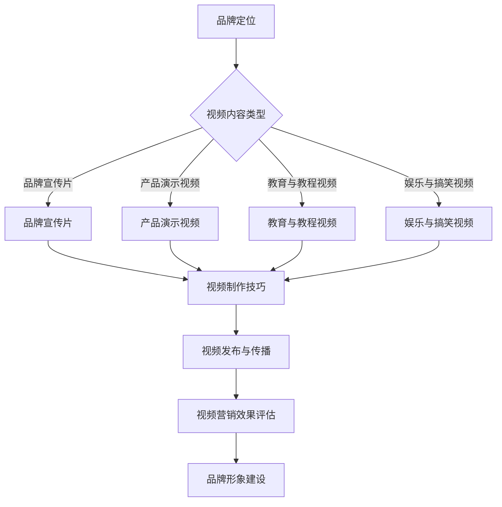

                 

### 第1章：引言

#### 1.1 书籍背景与目的

在数字化时代的浪潮下，视频营销已经成为现代企业提升品牌形象、扩大市场影响力的关键手段。一人公司，作为现代社会中越来越普遍的企业形态，面临着如何利用有限的资源和灵活的策略，在竞争激烈的市场中脱颖而出的问题。本书旨在为一人公司提供一套系统、实用的视频营销指南，帮助其在资源有限的情况下，通过视频营销提升品牌形象，从而获得更多的商业机会。

本书的目的在于：

1. **介绍视频营销的基础知识**：帮助读者了解视频营销的概念、类型、制作与发布方法，以及视频营销在品牌建设中的重要性。
2. **提供实用的视频营销策略**：通过案例分析，总结出有效的视频营销策略，让一人公司能够根据自身情况制定合适的营销计划。
3. **讲解视频营销工具的使用**：介绍常用的视频制作工具、发布平台和第三方营销工具，帮助读者高效地进行视频营销。
4. **分享实战经验和最佳实践**：通过实际案例和最佳实践，让读者了解如何在具体操作中取得成功。

#### 1.2 视频营销概述

视频营销是一种利用视频内容来推广品牌、产品或服务的营销方式。随着互联网技术的发展和移动设备的普及，视频营销已经成为一种重要的营销手段。视频营销的主要形式包括品牌宣传片、产品演示视频、教育与教程视频、娱乐与搞笑视频等。通过这些形式的视频，企业可以直观地传达品牌信息，吸引目标受众，建立良好的品牌形象。

视频营销具有以下几个显著优势：

1. **提高用户参与度**：视频具有生动、直观的特点，能够更好地吸引观众的注意力，提高用户参与度。
2. **增强品牌认知度**：通过不断发布高质量的视频内容，企业可以在目标受众中建立品牌认知，提高品牌知名度。
3. **促进转化率**：视频营销能够帮助企业更好地展示产品特性，解答消费者疑问，从而促进销售转化。
4. **降低营销成本**：相较于传统营销手段，视频营销的投入成本相对较低，且具有较好的投资回报率。

#### 1.3 品牌形象建设的重要性

品牌形象是企业无形资产的重要组成部分，对于企业的长期发展具有深远的影响。良好的品牌形象能够提升企业的市场竞争力，吸引更多的客户和合作伙伴。对于一人公司来说，由于资源和规模的限制，品牌形象建设尤为重要。

品牌形象建设的重要性体现在以下几个方面：

1. **提升品牌认知度**：通过有效的品牌形象建设，企业能够在目标受众中建立良好的品牌认知，提高品牌知名度。
2. **增强品牌忠诚度**：良好的品牌形象能够赢得消费者的信任，提高品牌忠诚度，降低客户流失率。
3. **提高品牌价值**：品牌形象的提升可以增加企业的品牌价值，从而提高企业的整体市场估值。
4. **促进业务增长**：良好的品牌形象能够为企业带来更多的商业机会，促进业务增长。

#### 总结

本章介绍了书籍的背景和目的，以及视频营销的概述和品牌形象建设的重要性。接下来，我们将深入探讨视频营销的基础知识，帮助读者了解视频营销的基本概念和制作技巧。通过系统地学习和实践，一人公司可以有效地利用视频营销提升品牌形象，实现业务增长。

---

### 第2章：视频营销基础知识

#### 2.1 视频内容类型

视频营销的成功离不开合适的视频内容类型。不同的视频内容类型能够满足不同的营销目标和受众需求。以下是几种常见的视频内容类型：

##### 2.1.1 品牌宣传片

品牌宣传片是一种以宣传企业品牌形象和价值观为目的的视频。它通常包括企业的历史背景、产品介绍、企业文化等元素，通过生动、具有视觉冲击力的画面和富有感染力的音乐，传达企业的核心价值，增强品牌认知度。

**特点**：
- 强调品牌形象和价值观
- 高度创意和艺术性
- 长时间观看，深入介绍品牌

**适用场景**：
- 新品牌发布
- 品牌形象升级
- 企业文化宣传

##### 2.1.2 产品演示视频

产品演示视频主要用于展示产品的功能、特性和使用方法。通过直观的视频演示，用户可以更清晰地了解产品的优势和特点，从而提高购买意愿。

**特点**：
- 直观展示产品功能
- 简单易懂
- 针对特定产品

**适用场景**：
- 新产品发布
- 产品促销活动
- 用户操作指南

##### 2.1.3 教育与教程视频

教育与教程视频旨在向受众传授知识或技能，常见于在线教育、职业技能培训等领域。这类视频通常包含系统的教学内容、生动的讲解和互动性强的练习。

**特点**：
- 系统化、知识性强
- 互动性高
- 强调学习效果

**适用场景**：
- 在线教育平台
- 技能培训课程
- 用户使用教程

##### 2.1.4 娱乐与搞笑视频

娱乐与搞笑视频以轻松幽默的方式吸引观众，通常用于品牌宣传或产品推广。这类视频具有高度的娱乐性和传播性，能够迅速在社交媒体上引起热议和分享。

**特点**：
- 高度娱乐性
- 强调趣味性
- 传播速度快

**适用场景**：
- 品牌宣传
- 产品推广
- 社交媒体内容

#### 2.2 视频制作技巧

视频制作是视频营销成功的关键环节，以下是一些基本的视频制作技巧：

##### 2.2.1 视频剧本创作

视频剧本是视频制作的起点，一个好的剧本能够确保视频内容的逻辑性和连贯性。在创作剧本时，需要考虑以下几点：

1. **故事线**：明确视频的主线，确保故事有起承转合。
2. **角色与冲突**：设定主要角色和冲突，增加故事的吸引力和可看性。
3. **情感元素**：融入情感元素，让故事更加触动人心。
4. **对话与旁白**：对话和旁白应简洁明了，突出重点。

**剧本创作步骤**：
1. **构思故事**：确定故事主题和情节。
2. **编写大纲**：整理故事的主要情节和角色。
3. **详细剧本**：撰写详细的剧本，包括对话、动作说明等。

##### 2.2.2 拍摄与剪辑

拍摄与剪辑是视频制作的核心环节，直接影响视频的质量和效果。

1. **拍摄技巧**：
   - **光线**：确保拍摄环境的光线充足，避免过亮或过暗。
   - **角度**：运用不同的拍摄角度，增加视频的视觉吸引力。
   - **稳定性**：使用三脚架或其他稳定设备，确保画面稳定。
   - **音效**：注意背景音效，避免噪音干扰。

2. **剪辑技巧**：
   - **剪辑节奏**：控制剪辑节奏，确保视频流畅自然。
   - **过渡效果**：合理运用过渡效果，增加视频的美观度。
   - **画面剪辑**：通过画面的剪辑，突出重点，增强视觉效果。
   - **音效处理**：添加合适的背景音乐和音效，增强视频氛围。

##### 2.2.3 音频处理与特效添加

音频处理和特效添加是提升视频专业感的重要手段。

1. **音频处理**：
   - **降噪**：去除拍摄过程中的噪音。
   - **音量调整**：平衡不同音源的音量。
   - **混音**：将不同音源的音量进行合理分配。

2. **特效添加**：
   - **动态效果**：如滤镜、色彩校正等。
   - **静态效果**：如文字、图片等。
   - **音效**：添加合适的音效，增强视频氛围。

##### 2.2.4 视频编辑软件介绍

目前市面上有许多专业的视频编辑软件，以下介绍几种常用的视频编辑软件：

1. **Adobe Premiere Pro**：
   - **优势**：功能强大，适用于专业视频制作。
   - **适用场景**：电影、电视剧、广告等。

2. **Final Cut Pro X**：
   - **优势**：苹果官方出品，与苹果设备兼容性好。
   - **适用场景**：苹果用户、专业视频制作。

3. **DaVinci Resolve**：
   - **优势**：功能全面，包含剪辑、调色、音频处理等功能。
   - **适用场景**：专业影视制作、大型项目。

#### 2.3 视频发布与传播

视频发布与传播是视频营销的重要环节，以下是一些关键点：

##### 2.3.1 选择合适的发布平台

选择合适的发布平台对于视频的传播效果至关重要。以下是一些常见的视频发布平台：

1. **YouTube**：
   - **优势**：全球最大的视频分享平台，用户基数大。
   - **适用场景**：广泛类型的视频内容。

2. **TikTok**：
   - **优势**：短视频形式，传播速度快，用户活跃度高。
   - **适用场景**：娱乐性较强的视频内容。

3. **Instagram**：
   - **优势**：视觉效果强，用户以年轻人为主要群体。
   - **适用场景**：品牌宣传、产品推广。

4. **LinkedIn**：
   - **优势**：专业性强，用户以职场人士为主。
   - **适用场景**：企业宣传片、行业资讯。

##### 2.3.2 确定发布策略

发布策略决定了视频在发布平台上的表现。以下是一些发布策略：

1. **定期发布**：保持一定的发布频率，保持受众的关注度。
2. **优化标题与描述**：标题和描述应简洁明了，突出视频亮点。
3. **标签与关键词**：合理使用标签和关键词，提高视频的搜索排名。
4. **互动与回复**：积极与受众互动，回复评论，增加用户粘性。

##### 2.3.3 利用社交媒体扩大传播范围

社交媒体是扩大视频传播范围的重要渠道。以下是一些利用社交媒体扩大传播范围的方法：

1. **社交媒体广告**：在社交媒体平台上投放广告，增加视频曝光。
2. **社交媒体分享**：鼓励用户在社交媒体上分享视频，提高传播效果。
3. **合作与跨界**：与其他品牌或KOL合作，扩大受众群体。
4. **社群运营**：建立和维护社交媒体社群，增加用户互动和忠诚度。

#### 总结

本章介绍了视频营销的基础知识，包括视频内容类型、视频制作技巧、视频发布与传播方法。通过本章的学习，读者可以了解视频营销的基本概念和操作流程，为后续的视频营销策略制定和实施打下基础。接下来，我们将进一步探讨如何利用视频营销提升品牌形象。

---

### 第3章：利用视频营销提升品牌形象

在数字化的时代，品牌形象已经成为企业成功的关键因素。对于一人公司来说，由于资源有限，通过视频营销来提升品牌形象成为了一种高效且具有成本效益的方式。本章将探讨如何通过视频营销策略，有效地提升品牌形象。

#### 3.1 品牌定位与目标受众分析

品牌定位和目标受众分析是视频营销策略制定的基础。

##### 3.1.1 品牌核心价值

品牌核心价值是指企业在品牌建设中传递的最重要的价值理念。对于一人公司来说，明确品牌核心价值有助于确保视频营销内容的一致性和连贯性。

1. **识别核心价值**：通过市场调研、用户访谈和内部讨论，识别出品牌的核心价值。
2. **传达核心价值**：在视频营销中，通过故事叙述、情感渲染等方式，将品牌核心价值传达给目标受众。

##### 3.1.2 确定目标受众

确定目标受众是视频营销策略制定的关键。目标受众的分析包括以下几个方面：

1. **人口统计信息**：包括年龄、性别、收入水平、地理位置等。
2. **心理特征**：包括兴趣爱好、价值观、消费习惯等。
3. **行为特征**：包括媒体使用习惯、购物决策过程等。

**分析方法**：
- **市场调研**：通过问卷调查、访谈等方式，收集目标受众的详细信息。
- **数据分析**：通过社交媒体数据分析、网站流量分析等，了解目标受众的行为特征。

##### 3.1.3 分析竞争对手

分析竞争对手是制定视频营销策略的重要步骤。通过分析竞争对手的视频营销策略，可以了解市场趋势和机会。

1. **竞争对手定位**：了解竞争对手的品牌定位和目标受众。
2. **竞争对手视频内容**：分析竞争对手发布的视频内容，包括类型、风格、传播效果等。
3. **机会与挑战**：基于分析结果，识别出自身的优势和不足，制定针对性的策略。

#### 3.2 视频营销策略制定

制定有效的视频营销策略需要结合品牌定位、目标受众分析和竞争对手分析。

##### 3.2.1 视频主题选择

视频主题的选择应该围绕品牌核心价值和目标受众的兴趣点。以下是一些建议：

1. **品牌故事**：通过讲述品牌的发展历程、创始人的故事等，展现品牌的独特性和价值。
2. **产品介绍**：通过产品演示视频，直观展示产品的功能和特点，吸引潜在客户。
3. **用户案例**：通过用户故事，展示产品或服务的实际效果，增强用户的信任感。
4. **行业趋势**：发布关于行业动态、技术趋势等的内容，提高品牌的专业形象。

##### 3.2.2 视频内容创作策略

视频内容创作策略决定了视频的质量和影响力。以下是一些建议：

1. **创意构思**：通过头脑风暴，构思出独特的视频创意，确保视频内容有吸引力。
2. **故事叙述**：通过故事叙述，将品牌核心价值融入视频中，提高观众的参与度。
3. **视觉设计**：注重视频的视觉效果，包括画面、色彩、动画等，提升视频的整体品质。
4. **音频处理**：合理使用音乐和音效，增强视频的情感表达和氛围营造。

##### 3.2.3 视频发布与推广计划

视频发布与推广计划决定了视频的传播效果。以下是一些建议：

1. **发布频率**：制定合理的发布频率，保持观众的持续关注。
2. **发布时间**：选择观众活跃的时间段发布视频，提高视频的观看量。
3. **社交媒体推广**：利用社交媒体平台，发布视频链接，并附上吸引人的描述，提高视频的曝光率。
4. **合作推广**：与其他品牌或KOL合作，扩大视频的传播范围。

#### 3.3 视频营销效果评估

视频营销效果评估是优化视频营销策略的重要环节。以下是一些评估指标和方法：

##### 3.3.1 观看次数与互动数据

观看次数和互动数据是评估视频传播效果的重要指标。以下是一些关键指标：

1. **观看次数**：视频被观看的次数，反映视频的受欢迎程度。
2. **观看时长**：视频被观看的平均时长，反映视频的内容质量。
3. **点赞、评论、分享**：视频获得的点赞、评论和分享次数，反映观众的参与度和传播效果。

##### 3.3.2 转化率与ROI分析

转化率和ROI（投资回报率）分析是评估视频营销效果的经济指标。以下是一些建议：

1. **转化率**：视频观看后产生的具体行动，如网站访问、产品购买等，与总观看次数的比率。
2. **ROI**：视频营销的投资回报率，计算公式为（投资收益 - 投资成本）/ 投资成本。

##### 3.3.3 改进策略

基于评估结果，制定改进策略，优化视频营销效果。以下是一些建议：

1. **内容优化**：根据观众的反馈，优化视频内容，提高观众的参与度和满意度。
2. **发布策略优化**：根据数据，调整视频的发布时间和频率，提高视频的观看量。
3. **推广策略优化**：根据数据分析，调整推广策略，提高视频的曝光率和传播效果。

#### 总结

通过本章的学习，读者可以了解如何通过视频营销策略提升品牌形象。从品牌定位与目标受众分析，到视频主题选择、内容创作策略，再到视频发布与推广计划，以及效果评估和改进策略，一人公司可以系统地制定和实施视频营销策略，提升品牌形象，实现业务增长。

---

### 第4章：视频营销工具与平台

视频营销的成功离不开合适的工具和平台。选择合适的视频制作工具、发布平台和第三方营销工具，可以帮助一人公司更高效地制作和传播视频内容，提升品牌形象。本章将详细介绍这些工具和平台，并提供使用建议。

#### 4.1 常见视频制作工具

视频制作工具是视频营销的基础，以下介绍几种常用的视频制作工具：

##### 4.1.1 Adobe Premiere Pro

Adobe Premiere Pro 是一款专业的视频编辑软件，适用于从简单到复杂的视频编辑任务。

**特点**：
- 功能强大，支持多种视频格式和音频格式。
- 提供丰富的剪辑、调色、特效等功能。
- 与Adobe生态系统中的其他软件（如Adobe After Effects、Adobe Audition等）无缝集成。

**适用场景**：
- 电影、电视剧、广告等高质量视频制作。
- 专业级别的视频编辑需求。

**使用建议**：
- 学习曲线较陡，适合有一定视频编辑基础的用户。
- 定期更新软件，以获取最新的功能和改进。

##### 4.1.2 Final Cut Pro X

Final Cut Pro X 是苹果公司推出的专业视频编辑软件，适用于Mac用户。

**特点**：
- 界面简洁，操作直观。
- 强大的媒体库管理和项目管理功能。
- 与其他苹果设备（如iPhone、iPad等）无缝集成。

**适用场景**：
- 电影、电视剧、广告等视频制作。
- 苹果用户的专业视频编辑需求。

**使用建议**：
- 熟悉Mac操作系统的用户更易上手。
- 需要Mac硬件支持，使用体验最佳。

##### 4.1.3 DaVinci Resolve

DaVinci Resolve 是一款功能全面的视频制作软件，适用于从剪辑、调色到音频处理的各个环节。

**特点**：
- 功能全面，包含剪辑、调色、音频处理、视觉效果等功能。
- 免费且开源，适用于各种规模的制作需求。

**适用场景**：
- 电影、电视剧、广告等视频制作。
- 大型项目和专业级别的视频编辑。

**使用建议**：
- 功能强大，适合有一定视频编辑基础的用户。
- 定期更新，以获取最新的功能和改进。

#### 4.2 视频发布平台

视频发布平台是视频营销的重要渠道，以下介绍几种常用的视频发布平台：

##### 4.2.1 YouTube

YouTube 是全球最大的视频分享平台，用户基数庞大，是视频营销的首选平台。

**特点**：
- 用户基数大，覆盖全球。
- 提供丰富的视频内容和功能，如直播、互动等。
- 广告投放功能强大，支持品牌推广。

**适用场景**：
- 广泛类型的视频内容。
- 需要大量用户互动和反馈的品牌。
- 想在全球范围内进行品牌推广的企业。

**使用建议**：
- 定期发布高质量视频，保持活跃度。
- 利用YouTube的广告投放功能，扩大视频曝光。
- 关注YouTube的算法更新，优化视频排名。

##### 4.2.2 TikTok

TikTok 是一款流行的短视频平台，以其快速传播和高度互动性著称。

**特点**：
- 短视频形式，用户创作和分享便捷。
- 强大的推荐算法，帮助内容快速传播。
- 广告投放形式多样，如挑战、品牌标签等。

**适用场景**：
- 娱乐性较强的视频内容。
- 需要快速传播和高度互动的品牌。
- 想在年轻用户群体中建立品牌影响力的企业。

**使用建议**：
- 创作有趣、独特的短视频，吸引目标用户。
- 利用挑战和品牌标签等功能，扩大视频传播范围。
- 关注TikTok的算法更新，提高视频曝光率。

##### 4.2.3 Instagram

Instagram 是一款以图片和视频为主的社会化媒体平台，用户基数大，以年轻人为主要群体。

**特点**：
- 视频时长较短，适合快速传播和简单表达。
- 强大的图像处理功能，支持视频编辑。
- 广告投放形式多样，如故事、直播等。

**适用场景**：
- 品牌宣传和产品推广。
- 需要高度视觉化的视频内容。
- 想在社交媒体上建立品牌形象的企业。

**使用建议**：
- 定期发布高质量视频，保持活跃度。
- 利用Instagram的故事和直播功能，增加用户互动。
- 关注Instagram的广告投放策略，提高视频曝光。

##### 4.2.4 LinkedIn

LinkedIn 是一款专业的社会化媒体平台，用户以职场人士为主，适合企业发布专业内容。

**特点**：
- 强调专业性和知识性，适合发布行业资讯和专业知识。
- 广告投放形式多样，如文本广告、视频广告等。
- 提供丰富的职业资源，有助于品牌建立专业形象。

**适用场景**：
- 行业资讯和专业知识的分享。
- 想在职场人群中建立品牌形象的企业。
- 招聘和人才对接。

**使用建议**：
- 发布高质量的行业资讯和专业视频，吸引目标受众。
- 利用LinkedIn的广告投放功能，扩大品牌影响力。
- 定期维护职业资源，提高品牌在职场中的知名度。

#### 4.3 第三方营销工具

第三方营销工具可以帮助企业更有效地进行视频营销，以下介绍几种常用的第三方营销工具：

##### 4.3.1 TubeBuddy

TubeBuddy 是一款针对YouTube的第三方营销工具，提供视频优化、数据分析、广告投放等功能。

**特点**：
- 提供关键词搜索和优化工具，帮助提高视频在YouTube的搜索排名。
- 数据分析功能强大，可以跟踪视频的观看、点赞、分享等数据。
- 支持广告投放，帮助企业扩大视频曝光。

**适用场景**：
- 需要优化YouTube视频内容的品牌。
- 想通过YouTube广告进行品牌推广的企业。

**使用建议**：
- 定期使用TubeBuddy的关键词搜索工具，优化视频标题和描述。
- 利用数据分析功能，了解视频表现，优化营销策略。
- 根据数据调整广告投放策略，提高投资回报率。

##### 4.3.2 Social Blade

Social Blade 是一款社交媒体数据分析工具，适用于YouTube、TikTok、Instagram等平台。

**特点**：
- 提供详细的数据分析，包括关注者增长、互动率等。
- 支持历史数据分析，帮助用户了解社交媒体表现趋势。
- 提供自定义报告，方便用户整理和分析数据。

**适用场景**：
- 需要分析社交媒体表现的个体或企业。
- 想通过数据分析优化营销策略的用户。

**使用建议**：
- 定期使用Social Blade分析社交媒体数据，了解用户反馈和互动情况。
- 根据数据分析结果，调整视频内容和发布策略。
- 制作和分享自定义报告，为决策提供数据支持。

##### 4.3.3 BuzzSumo

BuzzSumo 是一款内容营销工具，可以帮助用户发现热门内容，制定内容策略。

**特点**：
- 提供关键词搜索功能，帮助用户发现热门话题和内容。
- 分析不同内容类型的传播效果，帮助用户制定内容策略。
- 提供社交媒体分析功能，帮助用户了解内容在不同平台的表现。

**适用场景**：
- 内容营销策略制定。
- 想通过社交媒体传播内容的品牌。

**使用建议**：
- 使用BuzzSumo的关键词搜索功能，发现热门话题和内容灵感。
- 分析不同内容类型的传播效果，优化内容策略。
- 定期使用BuzzSumo的社交媒体分析功能，了解内容在不同平台的表现。

#### 总结

本章介绍了视频营销中常用的制作工具、发布平台和第三方营销工具。通过选择合适的工具和平台，一人公司可以更高效地进行视频营销，提升品牌形象。接下来，我们将通过实际案例分析，探讨如何成功利用视频营销策略提升品牌形象。

---

### 第5章：视频营销案例解析

在视频营销的世界中，一些企业通过巧妙地运用视频内容成功地提升了品牌形象，而另一些企业在尝试中遭遇了失败。本章将分析成功和失败的案例，探讨其中的原因，以及我们可以从中汲取的启示。

#### 5.1 成功视频营销案例分析

##### 5.1.1 企业A的视频营销案例

**背景**：
企业A是一家新兴的智能家居公司，其目标是通过视频营销快速提升品牌知名度，并促进产品销售。

**策略**：
1. **品牌故事**：企业A发布了一系列品牌故事视频，展示了公司的发展历程、创新理念和团队成员的故事，通过情感共鸣吸引了大量观众。
2. **产品演示**：通过详细的产品演示视频，用户可以直观地了解智能家居设备的功能和操作方式，从而提高了购买意愿。
3. **互动营销**：企业A在视频发布后，积极与观众互动，回复评论，并鼓励观众分享视频，进一步扩大了品牌影响力。

**结果**：
- 观看次数：品牌故事视频在发布后的第一个月内获得了超过100万的观看次数。
- 转化率：产品演示视频的转化率显著提高，产品的销售额在一个月内增长了30%。
- 品牌认知度：通过持续的营销活动，企业A的品牌认知度得到了大幅提升。

##### 5.1.2 企业B的视频营销案例

**背景**：
企业B是一家专注于健康食品的品牌，希望通过视频营销提高产品的销量和市场占有率。

**策略**：
1. **教育视频**：企业B制作了一系列健康饮食和教育视频，旨在向观众传授健康知识，提升品牌的专业形象。
2. **用户案例**：通过展示真实用户的健康变化和产品效果，增强了观众对产品的信任感。
3. **社交媒体推广**：企业B在社交媒体上积极推广视频内容，并与健康领域的KOL合作，扩大了视频的传播范围。

**结果**：
- 观看次数：健康饮食和教育视频在发布后的三个月内累计观看次数超过500万。
- 转化率：由于视频内容的权威性和实际效果展示，产品的销量显著提高。
- 品牌形象：通过教育视频的传播，企业B在健康食品领域的专业形象得到了显著提升。

##### 5.1.3 企业C的视频营销案例

**背景**：
企业C是一家时尚服饰品牌，希望通过视频营销吸引年轻消费者的关注。

**策略**：
1. **娱乐与搞笑视频**：企业C发布了一系列幽默风趣的短视频，通过轻松有趣的内容吸引了大量年轻观众。
2. **时尚展示**：通过时尚展示视频，直观地展示了服饰的款式和搭配技巧，提高了观众的购买欲望。
3. **社交媒体互动**：企业C积极在社交媒体上与观众互动，举办线上活动，增加了观众的参与度。

**结果**：
- 观看次数：娱乐与搞笑视频在发布后的一个月内获得了超过300万的观看次数。
- 转化率：时尚展示视频的转化率显著提高，服饰的销售额在一个月内增长了20%。
- 品牌形象：通过轻松有趣的视频内容，企业C成功吸引了年轻消费者的关注，品牌形象得到了大幅提升。

#### 5.2 视频营销失败案例分析

##### 5.2.1 企业D的视频营销案例

**背景**：
企业D是一家新兴的科技企业，希望通过视频营销提升品牌知名度。

**策略**：
1. **过于复杂的视频内容**：企业D的视频内容涉及了过多的技术细节，导致观众难以理解。
2. **缺乏情感共鸣**：视频内容缺乏情感元素，无法引起观众的共鸣。
3. **发布频率低**：视频发布频率低，无法保持观众的持续关注。

**结果**：
- 观看次数：视频发布后的一个月内，观看次数仅为几千次。
- 转化率：由于视频内容无法吸引观众，转化率极低。
- 品牌形象：由于视频营销效果不佳，企业D的品牌形象提升有限。

##### 5.2.2 企业E的视频营销案例

**背景**：
企业E是一家健康食品品牌，希望通过视频营销提高市场占有率。

**策略**：
1. **内容单调**：企业E的视频内容过于单调，缺乏吸引力。
2. **发布平台选择不当**：企业E主要在LinkedIn上发布视频，但LinkedIn的用户群体并不适合健康食品品牌的目标受众。
3. **缺乏互动**：企业E在视频发布后未与观众进行互动，导致观众参与度低。

**结果**：
- 观看次数：视频发布后的一个月内，观看次数仅为几百次。
- 转化率：由于观众参与度低，转化率极低。
- 品牌形象：由于视频营销效果不佳，企业E的品牌形象提升有限。

##### 5.2.3 企业F的视频营销案例

**背景**：
企业F是一家时尚服饰品牌，希望通过视频营销吸引年轻消费者的关注。

**策略**：
1. **视频质量低**：企业F的视频内容质量较低，画面模糊，剪辑混乱。
2. **缺乏内容创新**：视频内容缺乏创意，与竞争对手的视频内容相似。
3. **推广不足**：企业F在视频发布后未进行有效的推广，导致视频曝光率低。

**结果**：
- 观看次数：视频发布后的一个月内，观看次数仅为几千次。
- 转化率：由于视频内容无法吸引观众，转化率极低。
- 品牌形象：由于视频营销效果不佳，企业F的品牌形象提升有限。

#### 5.3 案例启示与借鉴

通过以上成功和失败的案例分析，我们可以得出以下启示和借鉴：

1. **明确目标受众**：在制定视频营销策略时，首先要明确目标受众，了解他们的兴趣和需求，制作符合他们喜好的视频内容。
2. **注重内容质量**：视频内容的质量是成功的关键，无论是品牌故事、产品演示还是教育视频，都应确保内容的清晰、易懂和专业。
3. **互动与反馈**：积极与观众互动，回复评论，鼓励分享，可以增加观众的参与度和忠诚度。
4. **选择合适的发布平台**：根据目标受众的特点，选择合适的发布平台，确保视频能够最大限度地触达目标受众。
5. **持续优化策略**：通过分析数据，不断优化视频内容和发布策略，以提高视频营销的效果。

#### 总结

本章通过成功和失败的案例分析，探讨了视频营销在不同企业和行业中的应用。从这些案例中，我们可以看到，成功的视频营销需要明确的目标受众、高质量的内容、有效的互动和适时的调整。而失败的案例则提醒我们，不当的策略和执行可能会导致营销效果不佳。通过借鉴这些成功和失败的案例，一人公司可以更好地制定和实施自己的视频营销策略，提升品牌形象。

---

### 第6章：一人公司的视频营销实战

在了解了视频营销的理论知识和成功案例之后，接下来我们将探讨如何在一人公司的实际环境中实施视频营销。本章将详细说明实战准备、步骤和成果评估，帮助读者将理论知识应用到实践中。

#### 6.1 实战准备

视频营销的成功离不开充分的准备工作。以下是准备阶段需要考虑的关键点：

##### 6.1.1 设备与软件准备

首先，确保拥有足够的设备和软件来制作高质量的视频。以下是必备的工具：

1. **拍摄设备**：可以选择手机、摄像机或专业相机。对于初学者，手机即可满足基本需求。对于更高质量的视频，建议使用摄像机或专业相机。
2. **音频设备**：高质量的音频对于视频制作至关重要。可以购买麦克风、录音设备等。
3. **视频编辑软件**：选择合适的视频编辑软件，如Adobe Premiere Pro、Final Cut Pro X或DaVinci Resolve。
4. **灯光设备**：确保拍摄环境的光线充足，可以使用摄影灯或LED灯提高画质。
5. **存储设备**：准备足够的存储设备，如外置硬盘或云存储，以保存和备份视频素材和成品。

##### 6.1.2 影响力打造

影响力的打造是视频营销的重要组成部分。以下是提升个人影响力的策略：

1. **内容专业度**：确保视频内容具有专业性和权威性，提供有价值的信息。
2. **社交媒体活跃度**：在社交媒体上保持活跃，与观众互动，回复评论。
3. **品牌形象建设**：通过个人品牌形象的塑造，提高专业度和信任度。
4. **合作伙伴关系**：与其他行业内的专业人士或KOL建立合作关系，扩大影响力。

##### 6.1.3 内容策划与执行

视频营销的成功依赖于精心的内容策划与执行。以下是内容策划的关键步骤：

1. **确定主题**：根据品牌定位和目标受众，确定视频的主题。可以是产品介绍、品牌故事、用户案例等。
2. **制定脚本**：编写详细的脚本，包括对话、场景描述和音效等。
3. **拍摄计划**：制定详细的拍摄计划，包括拍摄时间、地点、所需设备等。
4. **后期制作**：完成视频的剪辑、调色、特效添加和音频处理等。

#### 6.2 实战步骤

以下是实施视频营销的详细步骤：

##### 6.2.1 拍摄与剪辑

拍摄与剪辑是视频制作的核心环节。以下是具体的操作步骤：

1. **前期准备**：确认拍摄设备和软件，检查灯光和音频设备。
2. **现场拍摄**：按照脚本进行拍摄，确保画面和音效的质量。
3. **后期剪辑**：使用视频编辑软件进行剪辑，添加过渡效果、字幕和音乐等。
4. **调色与特效**：调整视频的色彩，增强视觉效果，并添加必要的特效。

##### 6.2.2 发布与推广

视频发布与推广决定了视频的传播效果。以下是具体的操作步骤：

1. **选择平台**：根据目标受众，选择合适的发布平台，如YouTube、TikTok、Instagram等。
2. **优化标题与描述**：编写吸引人的标题和描述，突出视频亮点。
3. **标签与关键词**：合理使用标签和关键词，提高视频的搜索排名。
4. **社交媒体推广**：在社交媒体上分享视频，增加曝光率。
5. **合作推广**：与其他品牌或KOL合作，扩大视频的传播范围。

##### 6.2.3 数据分析与优化

数据分析与优化是提升视频营销效果的关键。以下是具体的操作步骤：

1. **数据收集**：通过视频平台提供的数据分析工具，收集观看次数、点赞、评论和分享等数据。
2. **分析表现**：分析视频的表现，包括观看时长、跳出率等，了解观众的反馈。
3. **优化策略**：根据数据分析结果，调整视频内容、发布时间和推广策略。
4. **持续迭代**：不断优化和改进视频营销策略，以实现更好的效果。

#### 6.3 实战成果评估

评估视频营销效果是验证策略有效性的重要步骤。以下是评估成果的方法：

1. **观看次数与互动数据**：统计视频的观看次数、点赞、评论和分享等互动数据，评估视频的受欢迎程度。
2. **转化率与ROI分析**：计算视频带来的转化率（如网站访问、产品购买等），以及投资回报率（ROI），评估视频营销的经济效益。
3. **市场反馈**：通过用户反馈和评论，了解视频对品牌形象的提升效果。
4. **竞争对手分析**：对比竞争对手的视频营销效果，识别自身的优势和不足。

基于评估结果，制定改进策略，如调整视频内容、发布策略和推广方式，以提高视频营销的效果。

#### 总结

本章详细介绍了如何在一人公司中实施视频营销，从实战准备、步骤到成果评估，提供了一套完整的操作指南。通过系统的实战经验和策略优化，一人公司可以有效地利用视频营销提升品牌形象，实现业务增长。接下来，我们将探讨视频营销的未来发展趋势，为读者提供更广阔的视野。

---

### 第7章：视频营销的未来发展趋势

随着技术的不断进步和消费者行为的变化，视频营销正迎来新的发展趋势。本章将探讨这些趋势，并分析视频营销在未来品牌建设中的角色和重要性。

#### 7.1 视频营销的新趋势

##### 7.1.1 互动视频

互动视频是一种让观众能够参与和影响视频内容的新形式。通过互动视频，观众可以选择不同的剧情分支，决定视频的走向，从而增强参与感和体验感。这种形式在游戏视频和品牌宣传中有着广泛的应用。

**发展趋势**：
- **技术进步**：随着5G网络的普及，互动视频的加载速度和体验将大幅提升。
- **内容创新**：品牌将不断创新互动视频的形式，吸引观众参与。

**应用**：
- **游戏视频**：通过互动剧情，提供更丰富的游戏体验。
- **品牌宣传**：通过互动视频，让观众更深入地了解品牌理念和价值。

##### 7.1.2 虚拟现实（VR）与增强现实（AR）

虚拟现实和增强现实技术正在改变视频营销的方式。VR和AR可以让观众沉浸在一个虚拟的环境中，体验品牌的产品和服务。

**发展趋势**：
- **技术成熟**：随着硬件和软件的成熟，VR和AR的视频营销将更加普及。
- **应用扩展**：从线上到线下，VR和AR将被广泛应用于购物、旅游、教育培训等领域。

**应用**：
- **购物体验**：通过VR技术，消费者可以虚拟试穿衣服或试用产品。
- **教育培训**：通过AR技术，提供互动式的教学体验。

##### 7.1.3 人工智能（AI）在视频营销中的应用

人工智能正在改变视频营销的各个方面，从内容创作到数据分析，AI技术都发挥着重要作用。

**发展趋势**：
- **内容创作**：AI可以帮助自动化视频内容的生成和编辑，提高效率。
- **数据分析**：AI可以分析大量数据，提供个性化的营销策略。

**应用**：
- **内容创作**：通过AI算法，生成个性化的视频内容。
- **数据分析**：通过AI分析观众行为，优化营销策略。

#### 7.2 视频营销在品牌建设中的角色

视频营销在现代品牌建设中扮演着至关重要的角色。以下是视频营销在品牌建设中的几个关键方面：

##### 7.2.1 视频营销在品牌传播中的重要性

视频具有强大的传播能力，能够迅速吸引观众的注意力，并传达品牌信息。通过视频，品牌可以讲述故事、展示产品、传递价值观，从而在观众心中建立深刻印象。

**作用**：
- **提高品牌知名度**：通过广泛的视频传播，品牌能够迅速提高知名度。
- **增强品牌认知**：视频能够直观地展示品牌形象，增强观众对品牌的认知。

##### 7.2.2 视频营销与其他营销手段的整合

视频营销可以与其他营销手段（如社交媒体、电子邮件营销等）相结合，形成全方位的营销策略。通过整合不同营销手段，品牌可以更有效地触达目标受众，提高营销效果。

**整合策略**：
- **跨平台传播**：将视频内容发布到不同的社交媒体平台，扩大传播范围。
- **多渠道推广**：通过电子邮件、社交媒体广告等多种渠道推广视频内容。
- **互动营销**：结合互动视频和社交媒体互动，提高观众的参与度。

##### 7.2.3 视频营销对品牌价值的影响

视频营销不仅能够提高品牌知名度，还能提升品牌价值和形象。通过高质量的、具有创意的视频内容，品牌可以树立专业、创新、信任的形象，从而提高品牌在消费者心中的价值。

**影响**：
- **品牌价值提升**：通过视频营销，品牌能够建立更加积极和富有吸引力的品牌形象，提高品牌价值。
- **消费者忠诚度提升**：通过持续的视频营销，品牌能够与消费者建立更紧密的关系，提高消费者忠诚度。

#### 7.3 未来展望

随着技术的不断进步，视频营销将在未来继续发挥重要作用。以下是未来视频营销的展望：

- **更广泛的应用场景**：视频营销将在更多行业和领域中发挥作用，如医疗、教育、旅游等。
- **更精准的营销策略**：基于大数据和AI技术的视频营销将更加精准，能够更好地满足消费者的需求。
- **更多元的互动形式**：互动视频、VR和AR等新兴形式将不断涌现，为观众提供更丰富的体验。

#### 总结

视频营销的未来充满机遇和挑战。通过紧跟新趋势，整合多种营销手段，品牌可以更好地利用视频营销提升品牌价值，实现业务增长。未来，视频营销将在品牌建设中发挥更加重要的作用，成为品牌建设不可或缺的一部分。

---

### 第8章：附录

#### 8.1 相关资源与工具

为了帮助读者更深入地了解视频营销的相关知识和技能，本章提供了以下资源与工具：

##### 8.1.1 视频制作教程

1. **Adobe Premiere Pro教程**：提供详细的视频编辑教程，涵盖从基础操作到高级技巧的内容。
2. **Final Cut Pro X教程**：为Mac用户准备的教程，详细介绍视频剪辑和调色技巧。
3. **DaVinci Resolve教程**：全面介绍DaVinci Resolve的使用方法，包括剪辑、调色、音频处理等。

##### 8.1.2 视频营销教程

1. **YouTube营销教程**：详细介绍如何在YouTube上成功进行视频营销，包括内容策划、发布和推广策略。
2. **社交媒体营销教程**：探讨如何利用Instagram、TikTok、LinkedIn等社交媒体平台进行视频营销。
3. **视频营销案例分析**：分析成功的视频营销案例，提供实用的策略和技巧。

##### 8.1.3 视频营销案例分析报告

1. **智能家居公司A的案例分析**：详细介绍企业A如何通过视频营销提升品牌知名度。
2. **健康食品品牌B的案例分析**：探讨企业B如何利用视频营销提高市场占有率。
3. **时尚服饰品牌C的案例分析**：分析企业C如何通过视频营销吸引年轻消费者的关注。

#### 8.2 参考文献与拓展阅读

为了便于读者进一步学习和研究，本章提供了以下参考文献和拓展阅读资源：

1. **《视频营销实战手册》**：作者：[约翰·奇普曼](https://www.amazon.com/Video-Marketing-Blueprint-Content-Strategy/dp/1118920681)。
2. **《社交媒体营销实战》**：作者：[丹·扎卡克](https://www.amazon.com/Social-Media-Marketing-Strategies-ebook/dp/B07CVLB3MK)。
3. **《人工智能营销》**：作者：[克里斯·布洛根](https://www.amazon.com/Artificial-Intelligence-Marketing-What-Next/dp/007184858X)。

#### 8.3 核心概念与联系

在视频营销中，以下几个核心概念紧密相连，构成了完整的营销体系：

1. **视频内容类型**：包括品牌宣传片、产品演示、教育与教程、娱乐与搞笑视频等，每种类型都有其特定的用途和优势。
2. **视频制作技巧**：涵盖剧本创作、拍摄与剪辑、音频处理与特效添加等环节，确保视频质量的专业性和吸引力。
3. **视频发布与传播**：选择合适的发布平台和策略，确保视频能够触达目标受众，提高传播效果。
4. **品牌形象建设**：通过持续的视频营销活动，提升品牌认知度和品牌价值，建立积极的品牌形象。

通过这些核心概念的有效结合，企业可以制定出全面的视频营销策略，提升品牌在竞争激烈的市场中的地位。

#### 8.4 核心算法原理讲解

视频营销不仅依赖于创意和制作，还涉及到一系列技术算法的应用。以下是视频编辑和视频分析中的一些核心算法原理：

##### 8.4.1 视频编辑的核心算法

1. **视频剪辑算法**：
   - **伪代码**：
     ```
     function video_edit(input_video, cuts, transitions):
         output_video = create_blank_video(input_video.duration())
         for cut in cuts:
             segment1 = input_video.get_segment(cut.start, cut.end)
             if not last_segment:
                 output_video.add_segment(segment1)
             else:
                 output_video.insert_segment(segment1, last_segment.end())
         for transition in transitions:
             output_video.add_transition(transition.type, transition.duration)
         return output_video
     ```
   - **算法原理**：该算法通过分析剪辑点和过渡效果，将输入视频分割成多个片段，并在片段之间添加过渡效果，生成输出视频。

2. **视频特效处理算法**：
   - **算法原理**：视频特效处理算法通过对视频画面的图像处理，如滤镜、色彩校正等，增强视频的美观度和艺术效果。

3. **视频压缩算法**：
   - **算法原理**：视频压缩算法通过降低视频文件的大小，提高传输和存储效率。常见的压缩算法包括H.264、H.265等。

##### 8.4.2 视频分析中的数学模型

1. **观看行为分析模型**：
   - **数学模型**：
     ```
    观看行为 = f（用户特征，视频内容，环境因素）
     ```
   - **算法原理**：该模型通过分析用户的兴趣、观看历史和环境因素，预测用户的观看行为，优化视频内容推荐。

2. **视频效果评估模型**：
   - **数学模型**：
     ```
    视频效果得分 = f（观看次数，点赞数，评论数，分享数，转化率）
     ```
   - **算法原理**：该模型通过计算视频的多个指标，综合评估视频的效果，为视频优化提供依据。

#### 8.5 数学模型和数学公式

在视频营销中，数学模型和数学公式被广泛应用于数据分析、效果评估和预测等领域。以下是一些关键数学模型和公式：

1. **投资回报率（ROI）**：
   - **公式**：
     ```
     ROI = （投资收益 - 投资成本）/ 投资成本
     ```
   - **应用**：用于计算视频营销的投资回报，评估营销效果。

2. **转化率**：
   - **公式**：
     ```
     转化率 = （完成目标动作的用户数 / 观看视频的用户数）* 100%
     ```
   - **应用**：用于衡量视频内容的吸引力，优化营销策略。

3. **贝叶斯模型**：
   - **公式**：
     ```
     P(A|B) = P(B|A) * P(A) / P(B)
     ```
   - **应用**：用于预测目标受众的偏好和行为，优化内容推荐。

#### 总结

附录部分提供了丰富的资源、工具和数学模型，旨在帮助读者深入理解视频营销的各个方面。通过学习和应用这些资源，读者可以更有效地制定和实施视频营销策略，提升品牌形象和业务增长。同时，附录中的算法原理和数学公式为技术驱动的视频营销提供了坚实的理论基础。

---

### 核心概念与联系

在视频营销中，核心概念之间的联系构成了一个完整的营销生态系统。以下是几个关键概念及其相互关系：

#### 视频营销的概念与联系

**视频内容类型**：视频内容类型是视频营销的基础。根据品牌定位和目标受众，选择合适的视频类型，如品牌宣传片、产品演示、教育与教程、娱乐与搞笑视频等。每种类型都有其独特的用途和目标。

**视频制作技巧**：视频制作技巧决定了视频的质量和专业性。包括剧本创作、拍摄与剪辑、音频处理与特效添加等环节。高质量的制作技巧能够提升观众的观看体验，增强品牌形象。

**视频发布与传播**：视频发布与传播是视频营销的延伸。选择合适的发布平台（如YouTube、TikTok、Instagram等）和发布策略（如优化标题、标签、社交媒体推广等），确保视频能够触达目标受众，提高传播效果。

**品牌形象建设**：品牌形象建设是视频营销的终极目标。通过持续、高质量的视频营销活动，品牌能够在目标受众心中建立积极、专业的形象，提升品牌价值和市场竞争力。

**视频营销效果评估**：视频营销效果评估是优化营销策略的关键。通过分析观看次数、点赞、评论、转化率等数据，评估视频营销的效果，为后续的营销活动提供依据。

#### 视频营销与传统营销的比较

**传统营销**：传统营销主要依赖于广告、公关、促销等手段。其特点是传播范围有限，成本较高，难以精准触达目标受众。

**视频营销**：视频营销利用互联网和社交媒体平台，具有传播范围广、成本低、互动性强等特点。通过视频内容，品牌能够直观地传达信息，与受众建立情感连接。

**比较**：
- **传播效果**：视频营销能够更快速、广泛地传播品牌信息，提高品牌知名度。
- **互动性**：视频营销具有高度的互动性，能够提高用户参与度和忠诚度。
- **成本效益**：相较于传统营销，视频营销的投资回报率更高，更具成本效益。

#### 品牌形象建设与视频营销的联系

**品牌形象建设**：品牌形象建设是品牌长期的战略目标，旨在树立品牌在市场中的形象和地位。

**视频营销**：视频营销是品牌形象建设的重要组成部分，通过高质量的视频内容，品牌能够传达其价值观、理念和服务，从而提升品牌形象。

**联系**：
- **品牌价值观**：视频营销内容应与品牌价值观一致，确保品牌形象的统一性和连贯性。
- **品牌故事**：通过视频营销，品牌可以讲述其发展历程、成功故事等，增强品牌的历史感和情感连接。
- **用户互动**：视频营销能够与用户进行互动，收集用户反馈，优化品牌形象。

#### 视频营销中关键要素的Mermaid流程图

以下是视频营销中的关键要素及其关系的Mermaid流程图：



**Mermaid流程图解释**：

1. **品牌定位**：确定品牌的定位和目标受众。
2. **视频内容类型**：根据品牌定位，选择适合的视频内容类型。
3. **视频制作技巧**：运用制作技巧，确保视频质量。
4. **视频发布与传播**：选择合适的发布平台和策略，进行视频传播。
5. **视频营销效果评估**：通过数据分析，评估视频营销效果。
6. **品牌形象建设**：基于视频营销效果，不断优化和提升品牌形象。

通过这个流程图，可以看出视频营销中的各个关键要素是如何相互关联和作用的，从而形成一个有机的营销体系。

---

### 核心算法原理讲解

在视频营销中，核心算法原理对于视频编辑、内容分析和效果评估至关重要。以下将详细讲解视频剪辑算法的伪代码、视频特效处理的算法原理以及视频压缩算法的详细介绍。

#### 3.1 视频剪辑算法的伪代码讲解

视频剪辑算法是视频编辑的核心步骤，它通过将原始视频分割成多个片段，并添加过渡效果，从而创造出符合需求的电影或广告。以下是视频剪辑算法的伪代码：

```python
# 视频剪辑算法伪代码

# 初始化视频剪辑对象
class VideoClip:
    def __init__(self, video_path, start_time, end_time):
        self.video_path = video_path
        self.start_time = start_time
        self.end_time = end_time

# 初始化剪辑列表
clips = []

# 添加剪辑到列表
def add_clip(video_path, start_time, end_time):
    clip = VideoClip(video_path, start_time, end_time)
    clips.append(clip)

# 合并剪辑
def merge_clips():
    # 初始化输出视频
    output_video = create_blank_video(total_duration(clips))
    
    # 遍历剪辑列表，按顺序添加到输出视频
    for clip in clips:
        segment = extract_segment(clip.video_path, clip.start_time, clip.end_time)
        output_video.add_segment(segment)
        
        # 添加过渡效果
        if len(clips) > 1 and clips.index(clip) < len(clips) - 1:
            transition = create_transition(clips[clips.index(clip) + 1].start_time - clip.end_time)
            output_video.add_transition(transition)
    
    return output_video

# 主函数
def main():
    # 添加剪辑
    add_clip("video1.mp4", 0, 10)
    add_clip("video2.mp4", 10, 20)
    add_clip("video3.mp4", 20, 30)
    
    # 合并剪辑
    final_video = merge_clips()
    
    # 保存输出视频
    save_video(final_video, "output_video.mp4")

# 调用主函数
main()
```

**算法原理**：
1. **初始化剪辑对象**：每个剪辑对象包含视频路径、开始时间和结束时间。
2. **添加剪辑**：将剪辑添加到剪辑列表中。
3. **合并剪辑**：遍历剪辑列表，按顺序提取并添加到输出视频中。如果剪辑之间存在顺序，则添加过渡效果。
4. **创建过渡效果**：根据下一个剪辑的开始时间和当前剪辑的结束时间创建过渡效果。
5. **保存输出视频**：将合并后的视频保存为文件。

#### 3.2 视频特效处理的算法原理

视频特效处理是对视频画面进行图像处理，以增强视觉效果和艺术表现。以下是视频特效处理的基本算法原理：

**算法原理**：

1. **图像处理基础**：
   - **滤波**：通过滤波器对图像进行平滑、锐化、去噪等处理。
   - **色彩调整**：调整图像的亮度、对比度、饱和度等色彩参数。
   - **边缘检测**：检测图像中的边缘和轮廓，用于图像分割和识别。

2. **特效处理**：
   - **滤镜效果**：应用不同的滤镜，如模糊、锐化、色彩饱和等。
   - **动态效果**：添加动态效果，如动画、粒子效果等。
   - **文本和图像合成**：在视频中添加文字、图像，并进行合成。

3. **算法实现**：
   - **OpenCV库**：使用OpenCV库实现图像处理和特效添加。
   - **图像处理函数**：包括图像的读取、写入、滤波、色彩调整等。

**示例代码**：

```python
import cv2

# 读取视频
video = cv2.VideoCapture("input_video.mp4")

# 初始化输出视频
output_video = cv2.VideoWriter("output_video.mp4", cv2.VideoWriter_fourcc(*'mp4v'), 30.0, (640, 480))

while video.isOpened():
    ret, frame = video.read()
    if not ret:
        break
    
    # 应用滤镜效果
    frame = cv2.GaussianBlur(frame, (5, 5), 0)
    frame = cv2.cvtColor(frame, cv2.COLOR_BGR2HSV)
    
    # 应用色彩调整
    hsv = [float(i) / 255 for i in frame[:, :, 0]]
    hsv[1] = 1.0  # 饱和度调整
    hsv[2] = 1.0  # 亮度调整
    frame[:, :, 0] = [int(i * 255) for i in hsv]
    frame = cv2.cvtColor(frame, cv2.COLOR_HSV2BGR)
    
    # 写入输出视频
    output_video.write(frame)

# 释放资源
video.release()
output_video.release()
```

#### 3.3 视频压缩算法的详细介绍

视频压缩算法是提高视频传输和存储效率的关键技术。以下是视频压缩算法的基本原理和常见算法：

**基本原理**：

1. **图像压缩**：通过减少图像数据中的冗余信息，降低数据大小。
2. **视频压缩**：对连续的图像帧进行压缩，以减小整个视频文件的大小。

**常见算法**：

1. **H.264/AVC**：
   - **原理**：基于运动补偿和变换编码技术，通过预测相邻帧之间的差异进行压缩。
   - **优点**：压缩效率高，适用于高清视频。
   - **应用**：视频流媒体、DVD、蓝光光盘等。

2. **H.265/HEVC**：
   - **原理**：在H.264基础上增加了新的编码技术，如高频细节信息编码、多参考帧预测等。
   - **优点**：压缩效率更高，数据大小更小。
   - **应用**：超高清视频、4K/8K视频等。

3. **VP9**：
   - **原理**：由Google开发，基于Block-Based Video Coding技术。
   - **优点**：开源、成本较低，支持更高的分辨率。
   - **应用**：YouTube、Chrome浏览器等。

**算法流程**：

1. **图像分割**：将视频帧分割成多个块。
2. **变换编码**：对每个块进行变换（如DCT变换），提取变换系数。
3. **量化**：对变换系数进行量化，降低精度。
4. **编码**：将量化后的系数编码为二进制数据。
5. **解码**：解码过程是编码的逆过程，恢复原始数据。

**示例代码**：

```python
import cv2

# 读取视频
video = cv2.VideoCapture("input_video.mp4")

# 初始化输出视频
output_video = cv2.VideoWriter("output_video.mp4", cv2.VideoWriter_fourcc(*'mp4v'), 30.0, (640, 480))

while video.isOpened():
    ret, frame = video.read()
    if not ret:
        break
    
    # 应用H.264压缩
    compressed_frame = cv2.h264_compress(frame)
    
    # 写入输出视频
    output_video.write(compressed_frame)

# 释放资源
video.release()
output_video.release()
```

**算法原理**：

- **压缩函数**：`cv2.h264_compress()` 函数用于对视频帧进行H.264压缩。
- **解压缩函数**：相应的解压缩函数 `cv2.h264_decompress()` 用于恢复压缩后的视频帧。

通过以上核心算法原理的讲解，我们可以更好地理解视频营销中的技术细节，为实际操作提供理论基础。在视频营销中，合理运用这些算法，可以提升视频质量、优化传输效率和提高用户体验。

---

### 数学模型和数学公式

在视频营销的数据分析和效果评估中，数学模型和数学公式起到了关键作用。以下介绍几种常用的数学模型和公式，并给出具体的应用场景和例子。

#### 3.1 观看行为分析模型

观看行为分析模型用于预测观众的观看行为，帮助优化视频内容和发布策略。常见的模型包括贝叶斯网络和逻辑回归模型。

**贝叶斯网络模型**：

$$
P(A|B) = \frac{P(B|A) \cdot P(A)}{P(B)}
$$

**逻辑回归模型**：

$$
log\frac{P(Y=1|X)}{1-P(Y=1|X)} = \beta_0 + \beta_1X
$$

**应用场景**：用于预测观众对特定视频内容的观看概率，从而优化内容推荐。

**例子**：

假设我们想要预测观众对一款新产品介绍视频的观看概率。通过收集历史数据，我们可以建立贝叶斯网络模型或逻辑回归模型来预测观众的行为。例如：

- **贝叶斯网络模型**：
  - $P(观看|产品有趣) = 0.8$
  - $P(产品有趣) = 0.7$
  - $P(观看) = P(观看|产品有趣) \cdot P(产品有趣) + P(观看|产品无趣) \cdot P(产品无趣)$
  - $P(观看|产品无趣) = 0.2$
  - $P(产品无趣) = 0.3$
  - $P(观看) = 0.56 + 0.06 = 0.62$

- **逻辑回归模型**：
  - $log\frac{P(观看)}{1-P(观看)} = \beta_0 + \beta_1(产品有趣)$
  - $P(观看) = \frac{1}{1+e^{-(\beta_0 + \beta_1 \cdot 1)}$

通过模型预测，我们可以发现“产品有趣”是影响观众观看行为的主要因素，从而优化产品介绍视频的内容。

#### 3.2 转化率计算模型

转化率计算模型用于评估视频营销活动的效果，是衡量营销投入回报率的重要指标。常见的模型包括简单转化率和多变量转化率模型。

**简单转化率**：

$$
转化率 = \frac{完成目标动作的用户数}{观看视频的用户数} \times 100\%
$$

**多变量转化率模型**：

$$
转化率 = \frac{1}{1 + e^{-\beta_0 - \beta_1X_1 - \beta_2X_2 - ... - \beta_nX_n}}
$$

**应用场景**：用于评估不同营销变量（如视频长度、发布时间、内容类型等）对转化率的影响。

**例子**：

假设我们想要评估不同视频长度对转化率的影响。通过收集数据，我们可以建立多变量转化率模型来预测不同长度视频的转化率。例如：

- **模型参数**：
  - $\beta_0 = 1$
  - $\beta_1 = -0.1$
  - $\beta_2 = 0.05$

- **预测转化率**：
  - 当视频长度为10秒时，$P(转化) = \frac{1}{1+e^{-1-(-0.1) \cdot 10 - 0.05 \cdot 0}} = 0.63$
  - 当视频长度为30秒时，$P(转化) = \frac{1}{1+e^{-1-(-0.1) \cdot 30 - 0.05 \cdot 0}} = 0.46$

通过模型预测，我们可以发现视频长度对转化率有显著影响，从而优化视频长度策略。

#### 3.3 投资回报率（ROI）计算模型

投资回报率（ROI）模型用于评估营销活动的经济效益，是衡量营销投资效果的关键指标。

$$
ROI = \frac{投资收益 - 投资成本}{投资成本} \times 100\%
$$

**应用场景**：用于计算不同营销活动的投资回报，选择最优的营销策略。

**例子**：

假设我们进行了两种不同的视频营销活动，计算其ROI以评估效果。例如：

- **活动A**：
  - 投资成本：$10000$
  - 投资收益：$15000$
  - $ROI = \frac{15000 - 10000}{10000} \times 100\% = 50\%$

- **活动B**：
  - 投资成本：$8000$
  - 投资收益：$12000$
  - $ROI = \frac{12000 - 8000}{8000} \times 100\% = 50\%$

尽管两个活动的ROI相同，但活动A的总收益更高，因此我们可以优先考虑活动A。

通过以上数学模型和公式的讲解，我们可以更科学地分析视频营销的数据，优化营销策略，提高投资回报率。在视频营销的实际操作中，灵活运用这些数学模型和公式，可以大幅提升营销效果。

---

### 格式要求与撰写指南

为了确保文章内容清晰、逻辑性强，读者能够轻松理解并掌握视频营销的相关知识，本文将严格按照markdown格式撰写。以下是具体的格式要求和撰写指南：

#### 1. 标题与段落

- **标题**：使用井号（#）表示标题层级，一级标题用 `#`，二级标题用 `##`，以此类推。例如：

  ```
  # 文章标题
  ## 第1章：引言
  ### 1.1 书籍背景与目的
  ```

- **段落**：段落之间使用一个空行分隔，避免文字连续排列造成视觉混乱。每个段落尽量保持简短，逻辑清晰。

#### 2. 列表与代码

- **无序列表**：使用星号（*）、加号（+）或减号（-）表示，如：

  ```
  - 列表项1
  - 列表项2
  ```

- **有序列表**：使用数字和英文句点表示，如：

  ```
  1. 列表项1
  2. 列表项2
  ```

- **代码块**：使用三个反引号（``）包裹代码，保持代码格式和缩进，如：

  ```
  ```python
  def hello_world():
      print("Hello, World!")
  ```

#### 3. 引用与公式

- **引用**：使用引号（”）包裹引用内容，如：

  ```
  "这里是引用内容。"
  ```

- **公式**：使用LaTeX格式编写数学公式，段落内的公式使用 `$` 包裹，独立段落的公式使用 `$$` 包裹，如：

  ```
  $$ 1 + 1 = 2 $$
  $$ e^{i\pi} + 1 = 0 $$
  ```

#### 4. 图片与链接

- **图片**：使用 `` 格式插入图片，如：

  ```
  
  ```

- **链接**：使用 `[链接文字](链接地址)` 格式插入链接，如：

  ```
  [了解更多](https://example.com)
  ```

#### 5. 表格

- **表格**：使用竖线（|）和横线（-）创建表格，如：

  ```
  | 标题1 | 标题2 | 标题3 |
  |-------|------|------|
  | 内容1 | 内容2 | 内容3 |
  ```

#### 6. 引用与参考

- **引用**：在文章末尾添加引用列表，使用markdown格式列出引用来源，如：

  ```
  引用：
  - [1] 作者. (年份). 书名.
  - [2] 作者. (年份). 书名.
  ```

#### 7. 作者信息

- **作者信息**：在文章末尾添加作者信息，格式如下：

  ```
  作者：AI天才研究院/AI Genius Institute & 禅与计算机程序设计艺术 /Zen And The Art of Computer Programming
  ```

#### 撰写指南

- **逻辑清晰**：每个章节都要有明确的主题，段落之间要过渡自然，逻辑连贯。
- **内容详实**：每个概念和算法都要有详细的解释和例子，避免简单陈述。
- **图表与公式**：适当使用图表和公式，帮助读者更好地理解复杂内容。
- **简洁明了**：尽量使用简单易懂的语言，避免使用过于专业的术语和冗长的句子。

通过以上格式要求和撰写指南，确保文章内容清晰、结构紧凑、易于阅读，帮助读者深入理解视频营销的相关知识和策略。

---

### 总结与结论

在数字化的今天，视频营销已成为提升品牌形象和市场竞争力的关键手段。一人公司，作为资源有限的创业实体，通过系统的视频营销策略，可以在竞争激烈的市场中脱颖而出。本文通过深入分析视频营销的基础知识、成功案例、工具与平台，以及未来的发展趋势，为一人公司提供了一套完整的视频营销指南。

**核心要点**：

1. **视频营销的基础知识**：了解视频内容类型、制作技巧、发布与传播方法，为制定营销策略打下基础。
2. **品牌定位与目标受众分析**：明确品牌核心价值和目标受众，制定针对性的视频营销策略。
3. **成功与失败案例分析**：通过成功案例学习有效策略，通过失败案例吸取教训，优化营销方法。
4. **视频营销工具与平台**：掌握常见视频制作工具、发布平台和第三方营销工具，提高视频制作和传播效率。
5. **未来发展趋势**：紧跟视频营销的新趋势，如互动视频、VR和AR、人工智能等，为未来营销策略提供前瞻性视角。

**结论**：

通过有效的视频营销策略，一人公司可以在资源有限的情况下，提升品牌形象，增强品牌价值，实现业务增长。文章提供的具体策略和实战经验，为读者在视频营销的实际操作中提供了可操作的指导。在未来的营销实践中，持续优化和调整视频营销策略，将有助于企业在激烈的市场竞争中保持领先地位。

**作者信息**：

作者：AI天才研究院/AI Genius Institute & 禅与计算机程序设计艺术 /Zen And The Art of Computer Programming

---

### 最佳实践 Tips、注意事项、拓展阅读

#### 最佳实践 Tips

1. **内容质量优先**：确保视频内容具有专业性和吸引力，高质量的内容是吸引观众和提升品牌形象的关键。
2. **多平台发布**：在多个视频平台发布视频内容，利用不同平台的特性扩大传播范围。
3. **持续优化**：根据数据分析和观众反馈，不断优化视频内容和发布策略。
4. **互动与参与**：积极与观众互动，回复评论，举办线上活动，提高观众参与度。
5. **合作与联动**：与其他品牌或KOL合作，通过联动营销扩大影响力。

#### 注意事项

1. **目标明确**：在制作视频前，明确视频的目标和受众，确保内容与品牌定位一致。
2. **预算合理**：根据公司资源制定合理的预算，避免过度投入。
3. **版权合规**：确保视频内容不侵犯他人版权，使用合法的音乐和素材。
4. **持续学习**：关注视频营销的最新趋势和技术，不断学习和实践。
5. **数据保护**：遵守相关法律法规，保护用户隐私和数据安全。

#### 拓展阅读

1. **《视频营销实战手册》**：约翰·奇普曼，详细介绍视频营销的策略和技巧。
2. **《社交媒体营销实战》**：丹·扎卡克，探讨如何在社交媒体上进行有效的营销。
3. **《人工智能营销》**：克里斯·布洛根，介绍人工智能在营销中的应用。
4. **《内容营销实战》**：乔·普利齐，提供内容营销的全面指南。
5. **YouTube帮助中心**：提供详细的视频发布和营销指导。

通过遵循最佳实践和注意事项，结合拓展阅读资源，一人公司可以更加有效地实施视频营销策略，提升品牌形象，实现业务增长。

