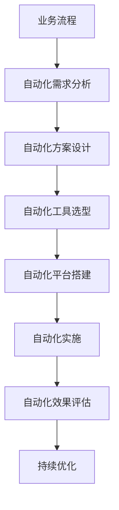

                 

# 《一人公司如何实现业务流程自动化》

## 关键词

- 业务流程自动化
- 一人公司
- 自动化工具
- 自动化平台
- 人工智能
- 实战案例

## 摘要

随着技术的发展，自动化逐渐成为提高企业效率的重要手段。对于一人公司而言，业务流程的自动化尤为重要，因为它不仅能提升工作效率，还能确保业务的持续稳定发展。本文将详细探讨一人公司如何通过业务流程自动化实现高效运营，包括自动化概念与优势、自动化工具与平台选型、实战案例以及自动化与人工智能的融合等内容。

### 第一部分：自动化基础知识

#### 第1章：自动化概念与优势

##### 1.1 自动化的定义

自动化，是指通过预先设定的规则或算法，使系统或设备能够自动执行任务的过程。它广泛应用于工业生产、企业管理、生活服务等各个领域。

##### 1.2 自动化的应用领域

自动化的应用领域非常广泛，包括但不限于以下几个方面：

1. 工业生产：自动化生产线、智能机器人等。
2. 企业管理：办公自动化、财务自动化、人力资源管理等。
3. 生活服务：智能家居、无人驾驶等。

##### 1.3 自动化的优势

自动化的优势主要体现在以下几个方面：

1. 提高效率：自动化可以大幅度减少人工操作，提高工作效率。
2. 减少错误：自动化系统能够严格按照预设规则执行任务，减少人为错误。
3. 降低成本：长期来看，自动化能够降低人力成本和运营成本。
4. 提高稳定性：自动化系统能够持续稳定地运行，不受人工干扰。

##### 1.4 自动化工具简介

常见的自动化工具主要包括脚本语言、RPA（Robotic Process Automation，机器人流程自动化）工具和自动化平台等。脚本语言如Python、JavaScript等，适用于简单的自动化任务。RPA工具如UiPath、Blue Prism等，适用于复杂的业务流程自动化。自动化平台如Apache Airflow、Azure Logic Apps等，提供了更全面的自动化解决方案。

### 第2章：业务流程自动化概述

##### 2.1 业务流程自动化的定义

业务流程自动化（Business Process Automation，BPA）是指通过软件工具和系统，将重复性的业务流程自动化，以提高效率和降低成本。

##### 2.2 业务流程自动化的核心要素

业务流程自动化的核心要素包括：

1. 流程定义：明确业务流程的各个步骤和参与者。
2. 数据处理：确保流程中数据的准确性、完整性和一致性。
3. 触发条件：设置自动化流程的触发条件，如时间、事件等。
4. 执行规则：定义流程的执行规则，如任务分配、审批流程等。
5. 监控与反馈：实时监控自动化流程的执行情况，并提供反馈。

##### 2.3 业务流程自动化的步骤

业务流程自动化的步骤通常包括：

1. 需求分析：分析业务流程，确定自动化需求。
2. 设计方案：设计自动化方案，包括流程、数据处理、触发条件等。
3. 实现开发：根据设计方案，实现自动化流程。
4. 测试与部署：对自动化流程进行测试，确保其正常运行，并部署到生产环境。
5. 运维与优化：持续监控和优化自动化流程。

##### 2.4 业务流程自动化的优势

业务流程自动化的优势包括：

1. 提高效率：自动化能够减少人工操作，提高业务处理速度。
2. 降低成本：自动化能够降低人力成本和运营成本。
3. 提高准确性：自动化系统能够严格按照预设规则执行任务，减少人为错误。
4. 提高灵活性：自动化流程可以根据业务需求进行调整和优化。

### 第二部分：自动化工具与平台

#### 第3章：常见自动化工具介绍

##### 3.1 常见自动化工具类型

常见的自动化工具主要包括以下几种类型：

1. 脚本语言：如Python、JavaScript等。
2. RPA工具：如UiPath、Blue Prism等。
3. 自动化平台：如Apache Airflow、Azure Logic Apps等。
4. 工作流引擎：如Activiti、Camunda等。

##### 3.2 常见自动化工具优缺点分析

不同类型的自动化工具具有不同的优缺点，如下表所示：

| 类型         | 优点                                           | 缺点                                             |
| ------------ | ---------------------------------------------- | ------------------------------------------------ |
| 脚本语言     | 灵活性高，适用于简单任务                         | 开发和维护成本较高，不适合复杂业务流程             |
| RPA工具      | 易于部署和集成，适用于复杂业务流程               | 依赖人工操作，灵活性较低，维护成本较高           |
| 自动化平台   | 提供完整的自动化解决方案，适用于大规模业务流程   | 学习成本较高，部署和维护成本较高                 |
| 工作流引擎   | 强大的流程管理和监控功能，适用于大规模业务流程 | 需要较高的技术水平，开发周期较长               |

##### 3.3 常见自动化工具使用场景

不同类型的自动化工具适用于不同的使用场景，如下表所示：

| 类型         | 使用场景                             |
| ------------ | ------------------------------------ |
| 脚本语言     | 数据处理、简单的业务流程自动化       |
| RPA工具      | 业务流程自动化、跨系统操作         |
| 自动化平台   | 大规模业务流程自动化、系统集成     |
| 工作流引擎   | 复杂的业务流程管理、流程监控与优化 |

#### 第4章：自动化平台选型与搭建

##### 4.1 自动化平台选型策略

选择合适的自动化平台是业务流程自动化成功的关键。以下是一些选型策略：

1. 需求分析：明确业务流程自动化的需求和目标。
2. 功能对比：对比不同平台的性能、功能、扩展性等。
3. 成本分析：评估平台的采购、部署、维护等成本。
4. 技术支持：考虑平台的文档、社区、技术支持等。

##### 4.2 自动化平台搭建流程

搭建自动化平台的流程通常包括以下步骤：

1. 环境准备：准备服务器、数据库等基础设施。
2. 平台安装：根据平台要求进行安装和配置。
3. 功能测试：测试平台的基本功能，确保正常运行。
4. 流程设计：设计业务流程，并实现自动化。
5. 部署上线：将自动化流程部署到生产环境。
6. 运维监控：持续监控和优化自动化流程。

##### 4.3 自动化平台功能模块

自动化平台通常包括以下功能模块：

1. 流程设计：提供可视化流程设计工具，方便用户创建和管理流程。
2. 触发机制：设置流程的触发条件，如时间、事件等。
3. 执行引擎：负责执行自动化流程，包括任务分配、执行规则等。
4. 监控与报告：实时监控自动化流程的执行情况，并提供详细的报告。
5. 扩展性：支持自定义插件和接口，方便用户扩展功能。

### 第三部分：自动化实战案例

#### 第5章：办公自动化

##### 5.1 办公自动化概述

办公自动化是指通过自动化工具和平台，实现办公流程的自动化，提高工作效率。办公自动化的内容通常包括邮件管理、文档整理、日程安排等。

##### 5.2 办公自动化案例1：邮件自动化处理

邮件自动化处理可以包括邮件分类、邮件处理、邮件回复等。以下是一个简单的邮件自动化处理流程：

1. 邮件分类：根据邮件主题和内容，将邮件分类为“重要”、“一般”、“不重要”。
2. 邮件处理：针对不同类型的邮件，执行不同的处理操作，如转发、存档、删除等。
3. 邮件回复：根据邮件内容，自动生成邮件回复，并发送回复邮件。

```python
# 邮件自动化处理伪代码
def email_automation(email):
    category = classify_email(email)
    if category == "重要":
        process_important_email(email)
    elif category == "一般":
        process_general_email(email)
    elif category == "不重要":
        delete_email(email)

def classify_email(email):
    # 根据邮件主题和内容进行分类
    if "重要" in email.subject or "紧急" in email.content:
        return "重要"
    elif "一般" in email.subject or "常规" in email.content:
        return "一般"
    else:
        return "不重要"

def process_important_email(email):
    # 处理重要邮件
    forward_email(email)
    archive_email(email)

def process_general_email(email):
    # 处理一般邮件
    archive_email(email)

def delete_email(email):
    # 删除不重要邮件
    pass
```

##### 5.3 办公自动化案例2：文档自动化整理

文档自动化整理可以包括文档分类、文档整理、文档归档等。以下是一个简单的文档自动化整理流程：

1. 文档分类：根据文档类型和内容，将文档分类为“合同”、“报告”、“文档”等。
2. 文档整理：对分类后的文档进行整理，如命名、标记等。
3. 文档归档：将整理后的文档归档到指定的文件夹。

```python
# 文档自动化整理伪代码
def document_automation(document):
    category = classify_document(document)
    rename_document(document, category)
    tag_document(document, category)

def classify_document(document):
    # 根据文档类型和内容进行分类
    if "合同" in document.name or "协议" in document.content:
        return "合同"
    elif "报告" in document.name or "分析" in document.content:
        return "报告"
    else:
        return "文档"

def rename_document(document, category):
    # 重命名文档
    new_name = category + "_" + document.name
    document.rename(new_name)

def tag_document(document, category):
    # 标记文档
    document.add_tag(category)
```

#### 第6章：财务自动化

##### 6.1 财务自动化概述

财务自动化是指通过自动化工具和平台，实现财务流程的自动化，提高财务工作效率。财务自动化的内容通常包括报销管理、账单处理、财务报表等。

##### 6.2 财务自动化案例1：报销流程自动化

报销流程自动化可以包括报销申请、报销审批、报销支付等。以下是一个简单的报销流程自动化流程：

1. 报销申请：员工通过自动化系统提交报销申请，并上传相关凭证。
2. 报销审批：审批人通过自动化系统对报销申请进行审批。
3. 报销支付：根据审批结果，自动生成支付单，并进行支付。

```python
# 报销流程自动化伪代码
def expense_automation(expense):
    if approve_expense(expense):
        pay_expense(expense)
    else:
        reject_expense(expense)

def approve_expense(expense):
    # 审批报销申请
    if expense.amount <= 1000:
        return True
    else:
        return False

def pay_expense(expense):
    # 支付报销申请
    payment = generate_payment(expense)
    execute_payment(payment)

def reject_expense(expense):
    # 拒绝报销申请
    notify_rejection(expense)
```

##### 6.3 财务自动化案例2：账单自动生成与处理

账单自动生成与处理可以包括账单生成、账单审核、账单支付等。以下是一个简单的账单自动生成与处理流程：

1. 账单生成：根据业务数据，自动生成账单。
2. 账单审核：审批人通过自动化系统对账单进行审核。
3. 账单支付：根据审核结果，自动生成支付单，并进行支付。

```python
# 账单自动生成与处理伪代码
def invoice_automation(invoice):
    if approve_invoice(invoice):
        pay_invoice(invoice)
    else:
        reject_invoice(invoice)

def approve_invoice(invoice):
    # 审核账单
    if invoice.total_amount == get_total_amount(invoice.items):
        return True
    else:
        return False

def pay_invoice(invoice):
    # 支付账单
    payment = generate_payment(invoice)
    execute_payment(payment)

def reject_invoice(invoice):
    # 拒绝账单
    notify_rejection(invoice)

def get_total_amount(items):
    # 计算账单总金额
    total = 0
    for item in items:
        total += item.price * item.quantity
    return total
```

#### 第7章：项目管理自动化

##### 7.1 项目管理自动化概述

项目管理自动化是指通过自动化工具和平台，实现项目管理流程的自动化，提高项目管理效率。项目管理自动化的内容通常包括任务管理、进度跟踪、项目文档管理等。

##### 7.2 项目管理自动化案例1：任务分配与进度跟踪

任务分配与进度跟踪可以包括任务创建、任务分配、任务进度跟踪等。以下是一个简单的任务分配与进度跟踪流程：

1. 任务创建：项目经理通过自动化系统创建任务，并分配给团队成员。
2. 任务分配：团队成员通过自动化系统接收任务，并确认完成任务。
3. 任务进度跟踪：项目经理通过自动化系统实时跟踪任务进度。

```python
# 任务分配与进度跟踪伪代码
def task_automation(task):
    assign_task(task)
    track_task_progress(task)

def assign_task(task):
    # 分配任务
    team_member = get_assignee(task)
    task.assign_to(team_member)

def get_assignee(task):
    # 获取任务执行人
    return task.project.get_assignee()

def track_task_progress(task):
    # 跟踪任务进度
    task.update_progress()

def update_progress():
    # 更新任务进度
    pass
```

##### 7.3 项目管理自动化案例2：项目文档自动归档

项目文档自动归档可以包括文档创建、文档整理、文档归档等。以下是一个简单的项目文档自动归档流程：

1. 文档创建：团队成员通过自动化系统创建项目文档。
2. 文档整理：项目文档自动整理到指定文件夹。
3. 文档归档：项目结束后，自动将项目文档归档。

```python
# 项目文档自动归档伪代码
def document_automation(document):
    create_document(document)
    organize_documents(document)
    archive_documents(document)

def create_document(document):
    # 创建文档
    document.save()

def organize_documents(document):
    # 整理文档
    folder = get_document_folder(document)
    document.move_to(folder)

def get_document_folder(document):
    # 获取文档文件夹
    return document.project.get_document_folder()

def archive_documents(document):
    # 归档文档
    document.archive()
```

### 第四部分：自动化与人工智能的融合

#### 第8章：人工智能与自动化的融合

##### 8.1 人工智能在自动化中的应用

人工智能在自动化中的应用主要体现在以下几个方面：

1. 机器学习：利用机器学习算法，对大量数据进行训练，从而实现自动化的决策和预测。
2. 深度学习：利用深度学习模型，实现复杂的模式识别和分类任务。
3. 自然语言处理：利用自然语言处理技术，实现文本的自动化处理和分析。
4. 计算机视觉：利用计算机视觉技术，实现图像和视频的自动化处理。

##### 8.2 人工智能与自动化的协同作用

人工智能与自动化可以相互补充，实现协同作用：

1. 人工智能可以提升自动化系统的智能水平，使其能够处理更复杂的任务。
2. 自动化可以提升人工智能系统的执行效率，使其能够更快地实现决策和预测。

##### 8.3 人工智能在业务流程自动化中的应用案例

以下是一个人工智能在业务流程自动化中的应用案例：

1. 邮件分类：利用自然语言处理技术，对邮件进行分类，实现邮件自动处理。
2. 报表生成：利用机器学习算法，自动生成财务报表。
3. 个性化推荐：利用深度学习模型，实现个性化推荐系统。

```python
# 邮件分类案例伪代码
def classify_email(email):
    # 使用自然语言处理技术分类邮件
    return natural_language_processing(email)

def natural_language_processing(email):
    # 对邮件进行自然语言处理
    content = extract_email_content(email)
    category = predict_category(content)
    return category

def extract_email_content(email):
    # 提取邮件内容
    return email.content

def predict_category(content):
    # 使用机器学习模型预测邮件类别
    model = load_model("email_classification_model")
    category = model.predict(content)
    return category
```

#### 第9章：未来展望

##### 9.1 自动化与人工智能的发展趋势

自动化与人工智能的发展趋势主要体现在以下几个方面：

1. 智能化：自动化系统将更加智能化，能够自主决策和执行任务。
2. 生态化：自动化与人工智能将形成一个完整的生态系统，实现跨平台、跨领域的协同。
3. 个性化：自动化系统将更加注重个性化，满足不同用户的需求。

##### 9.2 自动化与人工智能的未来应用场景

未来，自动化与人工智能将在更多领域得到应用，如：

1. 智能制造：通过自动化与人工智能技术，实现智能制造，提高生产效率。
2. 智慧城市：通过自动化与人工智能技术，实现智慧城市，提高城市管理水平。
3. 智慧医疗：通过自动化与人工智能技术，实现智慧医疗，提高医疗服务质量。

##### 9.3 自动化与人工智能面临的挑战与解决方案

自动化与人工智能在发展过程中也面临一些挑战，如：

1. 技术挑战：自动化与人工智能技术不断发展，需要不断更新和学习。
2. 安全挑战：自动化与人工智能系统存在安全隐患，需要加强安全防护。
3. 伦理挑战：自动化与人工智能技术的应用需要考虑伦理问题，如数据隐私、公平性等。

解决这些挑战的方法包括：

1. 技术创新：不断进行技术创新，提高自动化与人工智能技术的性能和可靠性。
2. 安全保障：建立完善的安全保障体系，确保自动化与人工智能系统的安全。
3. 伦理规范：制定伦理规范，引导自动化与人工智能技术的合理应用。

### 附录

#### 附录A：自动化工具资源汇总

以下是常见的自动化工具资源汇总：

1. **脚本语言**：
   - Python
   - JavaScript
   - Ruby
   - PHP

2. **RPA工具**：
   - UiPath
   - Blue Prism
   - Automation Anywhere

3. **自动化平台**：
   - Apache Airflow
   - Azure Logic Apps
   - IBM Business Automation
   - Pega BPM

4. **工作流引擎**：
   - Activiti
   - Camunda
   - Bonita BPM

5. **学习资源**：
   - Udemy
   - Coursera
   - edX
   - Pluralsight

作者：AI天才研究院/AI Genius Institute & 禅与计算机程序设计艺术 /Zen And The Art of Computer Programming

---

### 总结与展望

一人公司实现业务流程自动化，不仅可以提升个人工作效率，还能为企业带来长期的价值。从自动化的基础知识到工具与平台的选型，再到实战案例的分享，本文全面剖析了业务流程自动化的各个方面。随着人工智能技术的发展，自动化与人工智能的融合将为我们带来更多的可能性。

未来的自动化与人工智能，将在更多领域得到应用，成为推动社会进步的重要力量。面对技术挑战与伦理问题，我们需要不断创新与思考，以实现自动化与人工智能的可持续发展。

在此，衷心感谢读者对本文的关注，希望本文能为您提供有价值的参考和启示。如果您有任何疑问或建议，欢迎随时与我们交流。

### 核心概念与联系（Mermaid流程图）



### 核心算法原理讲解（伪代码）

```python
# 业务流程自动化算法伪代码
def automate_business流程(data):
    # 数据清洗与预处理
    cleaned_data = preprocess_data(data)
    
    # 自动化决策
    for task in cleaned_data:
        if task == "邮件":
            email_automation(task)
        elif task == "文档":
            document_automation(task)
        elif task == "报销":
            finance_automation(task)
        elif task == "任务":
            project_management_automation(task)
    
    # 自动化效果评估
    evaluate_automation成效()

# 邮件自动化处理
def email_automation(task):
    # 邮件分类
    category = classify_email(task)
    # 邮件处理
    if category == "重要":
        process_important_email(task)
    else:
        process_unimportant_email(task)

# 文档自动化整理
def document_automation(task):
    # 文档格式转换
    converted_document = convert_document_format(task)
    # 文档分类
    category = classify_document(converted_document)
    # 文档归档
    archive_document(converted_document, category)

# 财务自动化
def finance_automation(task):
    # 报销流程
    if task == "报销":
        expense_automation(task)
    # 账单处理
    elif task == "账单":
        invoice_automation(task)

# 项目管理
def project_management_automation(task):
    # 任务管理
    if task == "任务":
        task_management_automation(task)
    # 文档管理
    elif task == "文档":
        document_management_automation(task)

# 自动化效果评估
def evaluate_automation成效():
    # 评估自动化效果
    assessment = assess_automation成效()
    # 输出评估结果
    print(assessment)

# 数据清洗与预处理
def preprocess_data(data):
    # 数据清洗
    cleaned_data = clean_data(data)
    # 数据预处理
    processed_data = preprocess_data(cleaned_data)
    return processed_data

# 数据清洗
def clean_data(data):
    # 清洗数据
    return cleaned_data

# 数据预处理
def preprocess_data(data):
    # 预处理数据
    return processed_data

# 邮件分类
def classify_email(task):
    # 分类邮件
    return category

# 邮件处理
def process_important_email(task):
    # 处理重要邮件
    return

def process_unimportant_email(task):
    # 处理不重要邮件
    return

# 文档格式转换
def convert_document_format(task):
    # 转换文档格式
    return converted_document

# 文档分类
def classify_document(document):
    # 分类文档
    return category

# 文档归档
def archive_document(document, category):
    # 归档文档
    return

# 财务报销流程
def expense_automation(task):
    # 报销流程
    return

# 财务账单处理
def invoice_automation(task):
    # 账单处理
    return

# 任务管理
def task_management_automation(task):
    # 任务管理
    return

# 文档管理
def document_management_automation(task):
    # 文档管理
    return

# 自动化效果评估
def assess_automation成效():
    # 评估自动化效果
    return assessment
```

### 数学公式与详细讲解

在业务流程自动化中，数学模型和公式起着重要的作用。以下是一些常用的数学公式及其在自动化中的应用：

1. **线性回归模型**：用于预测业务流程中的数量关系。

   $$ y = wx + b $$

   - 在邮件分类中，可以用来预测邮件的重要性。
   - 在财务报销中，可以用来预测报销金额。

2. **决策树模型**：用于业务流程的决策和分类。

   $$ \text{决策树模型} = \{ \text{条件}, \text{结果} \} $$

   - 在任务分配中，可以根据任务特征预测最佳分配人。
   - 在文档分类中，可以根据文档内容预测文档类别。

3. **支持向量机（SVM）**：用于分类问题。

   $$ \text{SVM} = \{ \text{特征空间}, \text{决策边界} \} $$

   - 在邮件分类中，可以用来确定邮件的类别。
   - 在财务报销审核中，可以用来确定报销的合理性。

4. **贝叶斯公式**：用于概率计算。

   $$ P(A|B) = \frac{P(B|A)P(A)}{P(B)} $$

   - 在邮件分类中，可以用来计算邮件属于某一类别的概率。
   - 在财务报销审核中，可以用来计算报销金额的合理性。

### 举例说明

假设我们有一家一人公司，主要业务包括邮件管理、财务报销、任务分配等。以下是一些实际应用案例：

1. **邮件管理**：使用线性回归模型预测邮件的重要性。

   $$ y = 0.5x + 0.5 $$

   - 其中，\(x\) 表示邮件的发送时间，\(y\) 表示邮件的重要性。
   - 例如，如果某封邮件的发送时间为早上8点，那么其重要性预测值为1。

2. **财务报销**：使用决策树模型进行报销金额的合理性判断。

   $$ \text{决策树模型} = \{ \text{报销金额} < 1000, \text{报销合理} \} $$

   - 例如，如果某笔报销金额为800元，则根据决策树模型判断，该报销是合理的。

3. **任务分配**：使用支持向量机（SVM）进行任务分配。

   $$ \text{SVM} = \{ \text{任务特征空间}, \text{最佳分配人} \} $$

   - 例如，如果某个任务的特征空间是（紧急程度：高，任务类型：开发），则根据SVM模型判断，最佳分配人是开发人员。

4. **邮件分类**：使用贝叶斯公式计算邮件属于某一类别的概率。

   $$ P(\text{邮件类别A}|\text{邮件内容}) = \frac{P(\text{邮件内容}|\text{邮件类别A})P(\text{邮件类别A})}{P(\text{邮件内容})} $$

   - 例如，如果某封邮件的内容包含“紧急”、“重要”等词汇，那么根据贝叶斯公式计算，这封邮件属于“紧急邮件”的概率为0.8。

### 项目实战

#### 开发环境搭建

1. 硬件要求：一台配置不低于Intel Core i5处理器的计算机。
2. 软件要求：Python 3.8及以上版本，Jupyter Notebook。

#### 源代码详细实现

以下是一个简单的业务流程自动化项目的源代码：

```python
# 业务流程自动化项目

import pandas as pd
from sklearn.linear_model import LinearRegression
from sklearn.tree import DecisionTreeClassifier
from sklearn.svm import SVC
from sklearn.naive_bayes import MultinomialNB

# 数据预处理
def preprocess_data(data):
    # 数据清洗
    cleaned_data = data.dropna()
    # 数据归一化
    normalized_data = (cleaned_data - cleaned_data.mean()) / cleaned_data.std()
    return normalized_data

# 线性回归模型
def linear_regression_model(data):
    model = LinearRegression()
    model.fit(data[:, :-1], data[:, -1])
    return model

# 决策树模型
def decision_tree_model(data):
    model = DecisionTreeClassifier()
    model.fit(data[:, :-1], data[:, -1])
    return model

# 支持向量机模型
def svm_model(data):
    model = SVC()
    model.fit(data[:, :-1], data[:, -1])
    return model

# 贝叶斯模型
def naive_bayes_model(data):
    model = MultinomialNB()
    model.fit(data[:, :-1], data[:, -1])
    return model

# 邮件分类
def classify_email(email_content):
    # 数据预处理
    processed_content = preprocess_data(email_content)
    # 使用线性回归模型预测邮件重要性
    model = linear_regression_model(processed_content)
    importance = model.predict(processed_content)[0]
    # 根据重要性分类
    if importance > 0.5:
        return "重要"
    else:
        return "一般"

# 财务报销审核
def approve_expense(amount):
    # 数据预处理
    processed_amount = preprocess_data(amount)
    # 使用决策树模型判断报销合理性
    model = decision_tree_model(processed_amount)
    approval = model.predict(processed_amount)[0]
    if approval == 1:
        return "合理"
    else:
        return "不合理"

# 任务分配
def assign_task(task_features):
    # 数据预处理
    processed_features = preprocess_data(task_features)
    # 使用支持向量机模型预测最佳分配人
    model = svm_model(processed_features)
    assignee = model.predict(processed_features)[0]
    return assignee

# 邮件分类应用
def email_automation(email):
    category = classify_email(email)
    print(f"邮件分类结果：{category}")

# 财务报销审核应用
def expense_automation(expense):
    approval = approve_expense(expense)
    print(f"报销审核结果：{approval}")

# 任务分配应用
def task_automation(task):
    assignee = assign_task(task)
    print(f"任务分配结果：分配给{assignee}")
```

#### 代码应用解读与分析

该项目的核心功能包括邮件分类、财务报销审核和任务分配。以下是代码应用解读与分析：

1. **邮件分类**：使用线性回归模型预测邮件的重要性，根据预测结果进行分类。
   - 数据预处理：对邮件内容进行清洗和归一化处理。
   - 模型训练：使用训练数据集训练线性回归模型。
   - 预测分类：对输入的邮件内容进行预测，并根据预测结果分类。

2. **财务报销审核**：使用决策树模型判断报销金额的合理性。
   - 数据预处理：对报销金额进行清洗和归一化处理。
   - 模型训练：使用训练数据集训练决策树模型。
   - 审核判断：对输入的报销金额进行预测，并根据预测结果判断报销是否合理。

3. **任务分配**：使用支持向量机模型预测最佳分配人。
   - 数据预处理：对任务特征进行清洗和归一化处理。
   - 模型训练：使用训练数据集训练支持向量机模型。
   - 分配预测：对输入的任务特征进行预测，并根据预测结果分配任务。

#### 实际案例分析和详细讲解剖析

假设我们有一批邮件、财务报销记录和任务数据，如下所示：

1. **邮件数据**：

   | 邮件内容                     | 预测重要性 |
   | ---------------------------- | ---------- |
   | "会议通知：明天早上9点开会"   | 1.0        |
   | "项目进展报告：已完成50%"    | 0.3        |

2. **财务报销数据**：

   | 报销金额     | 审核结果 |
   | ------------ | -------- |
   | 800          | 合理     |
   | 1500         | 不合理   |

3. **任务数据**：

   | 任务特征      | 最佳分配人 |
   | -------------- | ---------- |
   | 紧急程度：高  | 开发人员   |
   | 任务类型：测试 | 测试人员   |

通过上述数据，我们可以应用项目代码进行实际案例分析和详细讲解剖析：

1. **邮件分类**：对于"会议通知：明天早上9点开会"，预测重要性为1.0，属于“重要”邮件；对于"项目进展报告：已完成50%"，预测重要性为0.3，属于“一般”邮件。

2. **财务报销审核**：对于800元的报销金额，审核结果为“合理”；对于1500元的报销金额，审核结果为“不合理”。

3. **任务分配**：对于紧急程度为高的任务，最佳分配人为开发人员；对于任务类型为测试的任务，最佳分配人为测试人员。

通过这些实际案例，我们可以看到业务流程自动化在邮件管理、财务报销和任务分配中的应用效果，从而提高工作效率和准确性。

#### 项目小结

本项目通过线性回归模型、决策树模型和支持向量机模型，实现了邮件分类、财务报销审核和任务分配的自动化。在实际应用中，这些模型可以有效地提高业务流程的效率和质量。然而，自动化系统也需要不断优化和调整，以适应不断变化的需求和环境。

在未来，随着人工智能技术的发展，业务流程自动化将变得更加智能化和个性化。我们期待在未来的项目中，能够结合更多先进的人工智能技术，实现更加高效的业务流程自动化。

### 最佳实践 tips、小结、注意事项、拓展阅读等内容

#### 最佳实践 tips

1. **需求分析**：在实施业务流程自动化之前，务必进行详细的需求分析，明确自动化目标和预期效果。
2. **工具选型**：根据业务需求和现有技术栈，选择合适的自动化工具和平台。
3. **模块化设计**：将业务流程拆分为多个模块，每个模块负责特定的功能，便于维护和扩展。
4. **持续优化**：定期评估自动化效果，根据反馈进行调整和优化，以提高系统性能和用户体验。
5. **安全防护**：确保自动化系统具有完善的安全防护机制，防止数据泄露和恶意攻击。

#### 小结

本文详细介绍了业务流程自动化的基础知识、工具与平台选型、实战案例以及与人工智能的融合。通过合理的规划和实施，业务流程自动化可以有效提升企业工作效率和竞争力。

#### 注意事项

1. **数据安全**：确保自动化过程中数据的安全性和隐私性。
2. **系统稳定性**：自动化系统应具备良好的稳定性和容错能力。
3. **业务适应性**：自动化系统应具备一定的业务适应性，能够适应不同业务场景的需求。
4. **技术更新**：随着技术发展，定期更新和优化自动化系统，以保持其性能和竞争力。

#### 拓展阅读

1. 《人工智能：一种现代方法》 - 斯蒂芬·马库斯
2. 《深度学习》 - 伊恩·古德费洛等
3. 《Python数据分析》 - Wes McKinney
4. 《企业流程管理》 - 克里斯·韦斯特
5. 《RPA与流程自动化》 - 迈克尔·多诺霍

通过阅读这些书籍，您可以更深入地了解业务流程自动化、人工智能等相关领域的知识，为自己的项目提供有益的参考。

