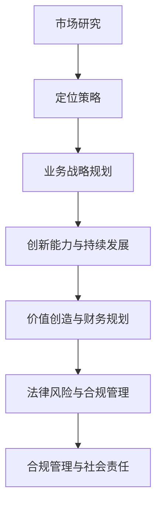

                 

### 《一人公司如何实现业务的可持续发展和价值创造》

> 关键词：一人公司、可持续发展、价值创造、业务模式、市场定位、风险管理

> 摘要：本文旨在探讨一人公司在当前商业环境中的生存和发展之道。通过对一人公司的概念、优势、组建与运营、市场研究、业务战略规划、创新能力、价值创造、财务规划、法律风险与合规管理等方面进行深入分析，结合实际案例，为读者提供一套实现业务可持续发展和价值创造的实用策略。

## 第一部分：一人公司的概述与基础

### 第1章：一人公司的概念与优势

#### 1.1 一人公司的定义与法律特征

**一人公司**，即只有一个股东和董事的公司。根据不同国家和地区的法律规定，一人公司可能具有不同的形式和名称。例如，在中国，一人有限责任公司（简称“一人公司”）是指只有一个自然人股东或者一个法人股东的有限责任公司。

**法律特征**：

- **股东责任**：一人公司的股东对公司债务承担有限责任，即仅限于其出资额。
- **公司治理**：一人公司由于股东和董事合一，决策过程相对简单，运营效率较高。
- **税收优惠**：在某些国家和地区，一人公司可能享受一定的税收优惠。

#### 1.2 一人公司的优势

**灵活性**：

一人公司无需经过繁琐的董事会决策程序，决策效率高，能够快速响应市场变化。

**成本效益**：

一人公司运营成本较低，没有大量员工和管理层的开支，适合初创企业和小型企业。

**易于管理**：

由于股东和董事合一，一人公司管理相对简单，无需复杂的组织架构和治理机制。

### 第2章：一人公司的组建与运营

#### 2.1 组建一人公司的步骤

**步骤一：选择公司类型**

在选择一人公司类型时，需要考虑所在国家的法律规定和税收政策。在中国，一人有限责任公司较为常见。

**步骤二：注册过程**

- 提交公司名称预核准申请
- 准备公司注册所需文件
- 办理公司注册手续
- 领取营业执照

**步骤三：公司章程的制定**

公司章程应包括公司的经营宗旨、组织架构、股东权益等内容，明确股东的权利和义务。

#### 2.2 一人公司的运营与管理

**财务管理**：

一人公司由于规模较小，财务管理尤为重要。需建立完善的财务制度，确保公司的财务状况透明、合规。

**人力资源**：

尽管一人公司规模较小，但仍需关注人力资源的管理。招聘合适的员工，建立合理的薪酬体系，保持员工稳定性。

**业务拓展**：

一人公司需不断寻求业务拓展机会，通过市场研究、定位策略、业务模式设计等手段，实现业务的可持续增长。

## 第二部分：业务的可持续发展和价值创造

### 第3章：市场研究与定位

#### 3.1 市场研究的重要性

市场研究是业务发展的重要基础，能够帮助一人公司：

- **了解市场趋势**：通过分析市场数据，了解行业的增长点和趋势，把握市场机遇。
- **分析竞争对手**：了解竞争对手的产品、价格、市场份额等，制定有针对性的竞争策略。
- **确定目标客户**：明确目标客户的需求和偏好，提供更符合市场需求的 产品和服务。

#### 3.2 定位策略

**产品定位**：

根据市场研究和客户需求分析，确定产品的独特卖点和竞争优势，形成差异化定位。

**市场定位**：

根据产品的定位和目标市场的特点，选择合适的市场进入策略和推广渠道。

### 第4章：业务战略规划

#### 4.1 业务模式设计

**盈利模式**：

设计合理的盈利模式，确保公司能够持续盈利。例如，通过产品销售、服务收费、广告收入等多种途径实现盈利。

**业务扩展策略**：

根据公司的资源和技术优势，制定业务扩展策略，实现业务规模和范围的持续增长。

#### 4.2 风险管理

**风险识别**：

对业务运营过程中的潜在风险进行识别和分析，包括市场风险、财务风险、运营风险等。

**风险管理策略**：

制定风险应对策略，通过风险预防、风险转移、风险承担等方式，降低风险对公司的影响。

### 第5章：创新能力与持续发展

#### 5.1 创新的重要性

**创新的概念**：

创新是指通过引入新的思想、方法、产品或服务，实现公司竞争力的提升和业务增长。

**创新的优势**：

创新能够带来新的市场和客户，提高公司的盈利能力和市场占有率。

#### 5.2 创新能力的培养

**内部创新**：

建立创新团队，鼓励员工提出创新想法，推动公司内部的创新活动。

**外部合作**：

与其他企业、研究机构、高校等合作，共同进行技术创新和产品开发。

### 第6章：价值创造与财务规划

#### 6.1 价值创造的途径

**产品价值**：

通过提供高质量、差异化的产品和服务，满足客户的需求，创造产品价值。

**品牌价值**：

通过品牌建设和营销活动，提高品牌知名度和美誉度，创造品牌价值。

**客户价值**：

通过提供优质的客户体验和服务，增强客户忠诚度，创造客户价值。

#### 6.2 财务规划

**预算管理**：

建立完善的预算管理体系，确保公司财务状况的透明和可控。

**盈利能力分析**：

定期进行盈利能力分析，评估公司的盈利状况和盈利能力，制定改进措施。

## 第三部分：法律风险与合规管理

### 第7章：法律风险与合规管理

#### 8.1 法律风险的类型

**合同风险**：

在合同签订和履行过程中，可能出现的合同争议、违约等问题。

**税务风险**：

涉及税务申报、税务合规等方面的问题，可能导致税务罚款、滞纳金等风险。

#### 8.2 法律风险防范措施

**合同管理**：

建立完善的合同管理制度，确保合同的合法性和有效性，降低合同风险。

**税务筹划**：

合理规划税务事项，降低税务负担，避免税务风险。

### 第9章：合规管理与社会责任

#### 9.1 合规管理的重要性

合规管理是确保公司经营合法性和风险可控的重要手段。合规管理包括：

- **法律法规遵守**：确保公司的经营行为符合相关法律法规的要求。
- **内部控制**：建立完善的内部控制体系，防止违规行为的发生。

#### 9.2 社会责任

**企业社会责任**：

企业在经营过程中应承担社会责任，关注环境保护、员工福利、社区贡献等方面。

**环境责任**：

企业应积极履行环境责任，采取环保措施，减少对环境的影响。

## 附录

### 附录 A：一人公司注册与运营指南

- **注册流程图**：
  ```mermaid
  graph TD
      A[提交申请] --> B[审核通过]
      B --> C[领取营业执照]
      C --> D[开设银行账户]
      D --> E[运营管理]
  ```

- **运营管理指南**：

  - 建立完善的财务管理制度
  - 关注人力资源管理
  - 持续进行市场研究

### 附录 B：常用法律法规参考

- **公司法律**：
  - 公司章程
  - 公司登记管理条例

- **税务法律**：
  - 企业所得税法
  - 个人所得税法

- **劳动法律**：
  - 劳动合同法
  - 劳动争议调解仲裁法

## 核心概念与联系

### Mermaid 流程图



## 核心算法原理讲解

### 伪代码

```pseudo
// 伪代码示例：市场定位策略
function marketPositioning(product, marketData) {
    // 分析市场数据
    marketTrends = analyzeMarketTrends(marketData)
    targetCustomer = findTargetCustomer(marketTrends)

    // 确定产品定位
    positioningStrategy = determinePositioning(product, targetCustomer)

    return positioningStrategy
}
```

### latex 数学公式

#### 演化博弈论中的纳什均衡

$$
\begin{aligned}
\pi_i &= \sum_{j\in\Omega} p_j [u_i(s_j,x_j) - u_i(s_j,y_j)] \\
\end{aligned}
$$

## 项目实战

### 代码实际案例

#### 代码实现与解读

- **开发环境搭建**：选择合适的开发环境，如 Python、Java 等。

- **源代码详细实现**：

  ```python
  # 实例：市场定位分析
  def marketAnalysis(product, marketData):
      # 分析市场数据
      marketTrends = analyzeMarketTrends(marketData)
      targetCustomer = findTargetCustomer(marketTrends)

      # 确定产品定位
      positioningStrategy = determinePositioning(product, targetCustomer)

      return positioningStrategy
  ```

- **代码解读与分析**：

  - `marketAnalysis` 函数：负责市场定位分析的整体流程。
  - `analyzeMarketTrends` 函数：分析市场趋势。
  - `findTargetCustomer` 函数：确定目标客户。
  - `determinePositioning` 函数：确定产品定位策略。

### 实例

#### 市场定位分析实例

```python
# 假设市场数据已准备好
marketData = {
    'trends': ['数字化升级', '环保理念普及'],
    'targetCustomer': ['年轻消费者', '环保意识强烈的消费者']
}

# 调用市场定位分析函数
positioningStrategy = marketAnalysis('环保智能家居产品', marketData)

print(positioningStrategy)
```

#### 分析与解读

- 根据市场数据和产品特点，确定了针对年轻消费者和环保意识强烈的消费者的市场定位策略。
- 定位策略包括：强调产品的环保特性，如使用可再生材料、节能设计等，以满足目标客户的需求。

### 项目小结

- 通过实际案例，展示了市场定位分析的核心步骤和实现方法。
- 市场定位是业务发展的重要环节，对公司的产品策略和市场营销策略具有重要影响。

## 最佳实践 Tips

- **保持市场敏感性**：定期进行市场研究，及时调整业务策略。
- **重视财务管理**：建立完善的财务制度，确保公司财务健康。
- **培养创新能力**：鼓励内部创新，与外部合作，共同推动公司发展。

### 小结

一人公司在当前商业环境中具有独特的优势，如灵活性、成本效益和易于管理。然而，实现业务的可持续发展和价值创造仍需在市场研究、业务战略规划、创新能力培养、价值创造与财务规划等方面下功夫。同时，法律风险与合规管理也是确保公司稳健发展的重要保障。通过本文的讨论，希望能为广大一人公司提供有益的借鉴和启示。

### 注意事项

- 在运营过程中，一人公司应注重团队建设，确保核心团队稳定。
- 面对市场变化，一人公司应具备快速调整战略的能力。

### 拓展阅读

- 《商业洞察力：如何洞察市场变化，把握商机》
- 《企业创新管理：如何激发企业创新能力，推动企业持续发展》
- 《财务智慧：如何进行有效的财务管理和财务分析》

### 作者信息

作者：AI天才研究院/AI Genius Institute & 禅与计算机程序设计艺术 /Zen And The Art of Computer Programming

