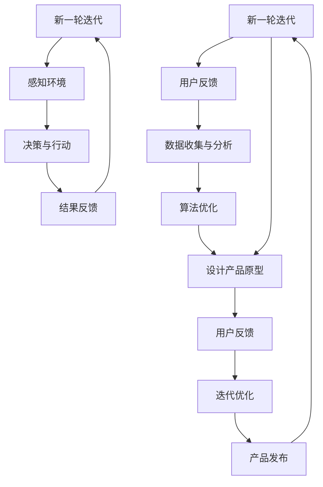

                 

### 文章标题：一人公司如何实现产品的数字化创新和智能化迭代

关键词：一人公司、数字化创新、智能化迭代、产品开发、人工智能

摘要：本文旨在探讨一人公司在实现产品数字化创新和智能化迭代方面的策略和方法。通过分析数字化创新与智能化迭代的基本概念，介绍相关的工具与技术，提出产品数字化转型的策略和智能化迭代的方法论，并结合实际案例，为一人公司提供具体可行的实践指导。同时，本文还讨论了数字化创新与智能化迭代的结合优势、挑战以及个性化定制的实现方法，为读者提供全面的视角和深入的理解。

### 目录大纲

#### 第一部分：背景与概念

##### 第1章：数字化创新与智能化迭代的基础

- **1.1 数字化创新的基本概念**
  - 数字化转型的定义
  - 数字化创新的重要性
  - 数字化创新与智能化的关系

- **1.2 智能化迭代的概念**
  - 智能化迭代的目标
  - 智能化迭代与产品进化的关系
  - 智能化迭代的关键因素

##### 第2章：数字化工具与技术

- **2.1 常见数字化工具**
  - 云计算平台
  - 大数据技术
  - 人工智能应用

- **2.2 常见智能化技术**
  - 物联网技术
  - 机器学习技术
  - 人工智能算法

#### 第二部分：数字化创新实践

##### 第3章：产品数字化转型的策略

- **3.1 数字化转型的目标与规划**
  - 确定数字化转型的目标
  - 制定数字化转型策略
  - 实施数字化转型的步骤

- **3.2 产品数字化改造案例分析**
  - 数字化改造的具体案例
  - 数字化改造的成效分析

##### 第4章：智能化迭代的方法论

- **4.1 智能化迭代的流程**
  - 智能化迭代的基本流程
  - 智能化迭代的迭代周期
  - 智能化迭代的反馈机制

- **4.2 智能化迭代的关键技术**
  - 智能感知技术
  - 智能决策技术
  - 智能交互技术

##### 第5章：数字化创新与智能化迭代的结合

- **5.1 数字化与智能化结合的优势**
  - 提升产品竞争力
  - 优化运营效率
  - 增强用户体验

- **5.2 数字化与智能化结合的挑战**
  - 技术融合的难度
  - 数据安全和隐私保护
  - 系统稳定性和可扩展性

##### 第6章：个性化定制与智能化迭代

- **6.1 个性化定制的基本概念**
  - 个性化定制的定义
  - 个性化定制的重要性
  - 个性化定制与数字化创新的关系

- **6.2 个性化定制的技术实现**
  - 数据分析技术
  - 机器学习算法
  - 个性化推荐的实现

##### 第7章：案例研究与经验分享

- **7.1 数字化创新与智能化迭代的成功案例**
  - 案例一：智能硬件产品的数字化升级
  - 案例二：电子商务平台的智能化推荐
  - 案例三：金融行业的数字化风险管理

- **7.2 数字化创新与智能化迭代的经验与教训**
  - 贡献与挑战
  - 成功要素
  - 未来展望

#### 第三部分：展望与未来

##### 第8章：数字化创新与智能化迭代的趋势

- **8.1 新技术的影响**
  - 5G、物联网、区块链等新兴技术的应用
  - 新技术对数字化创新和智能化迭代的影响

- **8.2 数字化创新与智能化迭代的发展方向**
  - 产业链的数字化整合
  - 智能化技术的突破

##### 第9章：未来一人公司的数字化创新路径

- **9.1 一人公司的特点**
  - 单一创始人的决策优势
  - 灵活性与响应速度
  - 资源整合的挑战

- **9.2 一人公司的数字化创新路径**
  - 建立数字化战略
  - 实现产品智能化迭代
  - 打造个性化服务体验

### 附录

- **附录 A：数字化创新与智能化迭代常用工具与资源**
  - 数字化工具介绍
  - 智能化技术资源
  - 开发与学习资源

### 核心概念与联系

为了更好地理解数字化创新与智能化迭代之间的关系，我们可以通过Mermaid流程图来展示它们的核心概念与联系。



这个流程图清晰地展示了数字化创新与智能化迭代之间的互动关系。数字化创新通过识别用户需求、设计产品原型、用户反馈和迭代优化来实现产品的持续改进。同时，智能化迭代通过感知环境、决策与行动以及结果反馈来实现产品的智能化升级。两者相互促进，共同推动产品的创新和进化。

### 核心算法原理讲解

在数字化创新与智能化迭代的过程中，机器学习算法发挥着至关重要的作用。下面我们将通过伪代码来讲解一个简单的机器学习算法在产品智能化迭代中的应用。

```python
# 输入：训练数据集 X，标签数据集 Y
# 输出：训练好的机器学习模型

def train_model(X, Y):
    # 初始化模型参数
    model_params = initialize_params()

    # 设置训练循环的迭代次数
    num_iterations = 1000
    learning_rate = 0.01

    # 训练模型
    for i in range(num_iterations):
        # 前向传播计算预测值
        predictions = forward_pass(X, model_params)

        # 计算损失函数值
        loss = compute_loss(Y, predictions)

        # 反向传播更新模型参数
        model_params = backward_pass(X, Y, model_params, learning_rate)

        # 打印当前迭代次数和损失函数值
        print(f"Iteration {i+1}, Loss: {loss}")

    return model_params

# 输入：训练数据集 X，标签数据集 Y
# 输出：预测结果

def make_predictions(X, model_params):
    predictions = forward_pass(X, model_params)
    return predictions
```

在这个伪代码中，`train_model` 函数负责训练机器学习模型。首先，我们初始化模型参数，然后通过前向传播计算预测值，并使用损失函数计算预测值与真实值之间的差距。接着，通过反向传播更新模型参数，以最小化损失函数值。这个过程重复进行，直到达到预设的迭代次数。

`make_predictions` 函数则用于使用训练好的模型进行预测。它通过前向传播计算输入数据的新预测值。

通过这样的机器学习算法，一人公司可以不断优化其产品，使其更加智能和适应用户需求。例如，在电子商务平台上，可以通过机器学习算法分析用户的行为数据，推荐个性化的商品，提高用户体验和销售转化率。

### 第一部分：背景与概念

#### 第1章：数字化创新与智能化迭代的基础

##### 1.1 数字化创新的基本概念

数字化创新是指通过应用数字技术，对传统业务模式、流程、产品和服务进行改造和升级，以实现业务效率的提升、成本降低和竞争力的增强。数字化转型（Digital Transformation）是数字化创新的核心，它涉及企业战略、组织结构、业务流程、技术平台等各方面的变革。

数字化转型的重要性在于：

- **提升效率**：数字化技术能够自动化和优化业务流程，减少人工干预，提高工作效率。
- **降低成本**：通过数字化手段，企业可以减少硬件设备、人力和资源的投入，实现成本优化。
- **增强竞争力**：数字化创新可以帮助企业更好地了解市场需求，快速响应市场变化，提高市场竞争力。
- **拓展业务模式**：数字化技术为企业提供了新的商业模式和收入来源，如在线服务、数据驱动的决策等。

数字化创新与智能化的关系在于，数字化技术为智能化提供了基础。通过数字化，企业可以获得大量的数据，这些数据可以用于训练和优化智能算法，从而实现智能化功能。例如，在智能制造领域，通过数字化收集设备运行数据，可以应用机器学习算法实现预测维护，提高生产效率。

##### 1.2 智能化迭代的概念

智能化迭代是指通过应用人工智能技术，对产品和服务进行持续优化和升级，以提高其智能化水平和用户体验。智能化迭代的目标是使产品和服务能够自我学习、自我优化和自我进化，从而更好地满足用户需求。

智能化迭代与产品进化的关系在于，智能化迭代是产品进化的一种重要方式。传统的产品进化主要通过迭代改进，而智能化迭代则通过引入人工智能技术，实现产品的智能化升级。智能化迭代的关键因素包括：

- **数据质量**：高质量的数据是智能化的基础，数据质量直接影响智能算法的性能。
- **算法能力**：智能算法的设计和实现能力决定了产品的智能化水平和迭代速度。
- **用户体验**：用户反馈是智能化迭代的驱动力，只有不断优化用户体验，才能推动产品智能化升级。

##### 1.3 数字化创新的重要性

数字化创新对于一人公司来说具有特殊的意义。首先，一人公司通常具有更快的决策速度和灵活性，这使得数字化创新更容易实施和推广。其次，数字化创新可以帮助一人公司更好地了解市场需求，快速响应市场变化，从而保持竞争优势。

具体来说，数字化创新的重要性体现在以下几个方面：

- **提升决策能力**：通过数字化工具，一人公司可以实时获取市场数据，进行数据分析和预测，从而做出更准确的决策。
- **优化运营效率**：数字化技术可以自动化和优化业务流程，减少人工干预，提高运营效率。
- **降低成本**：通过数字化手段，一人公司可以减少硬件设备、人力和资源的投入，实现成本优化。
- **增强用户体验**：数字化创新可以提供更个性化和定制化的服务，提高用户满意度和忠诚度。
- **开拓新市场**：数字化创新可以帮助一人公司探索新的业务模式和收入来源，开拓新的市场机会。

总之，数字化创新为一入公司提供了强大的动力，使其能够在竞争激烈的市场中脱颖而出。通过数字化创新，一人公司可以实现产品的智能化迭代，提升整体竞争力，实现可持续发展。

#### 第2章：数字化工具与技术

##### 2.1 常见数字化工具

在实现数字化创新的过程中，选择合适的数字化工具至关重要。以下是一些常见的数字化工具，它们在数字化创新中扮演着重要的角色：

- **云计算平台**：云计算平台为企业提供了灵活、可扩展的计算资源，帮助企业实现高效的数据处理和存储。常见的云计算平台包括亚马逊AWS、微软Azure和谷歌云等。这些平台提供了丰富的API和工具，方便开发者进行云服务的开发和部署。

- **大数据技术**：大数据技术帮助企业在海量数据中提取有价值的信息，实现数据驱动的决策。常见的大数据技术包括数据采集、数据存储、数据处理和分析等。Hadoop、Spark和Flink等是常用的大数据技术框架。

- **人工智能应用**：人工智能技术在数字化创新中发挥着关键作用。通过人工智能算法，企业可以实现自动化、智能化和个性化的服务和产品。常见的AI应用包括自然语言处理、计算机视觉、机器学习等。TensorFlow、PyTorch和Keras等是常用的AI开发框架。

##### 2.2 常见智能化技术

智能化技术是数字化创新的重要组成部分，以下是一些常见的智能化技术：

- **物联网技术**：物联网（IoT）技术通过传感器和网络连接，实现物理设备与互联网的互联互通。物联网技术可以帮助企业实现设备监控、远程控制和智能分析。常见的物联网平台包括阿里云物联网平台、AWS IoT和微软Azure IoT等。

- **机器学习技术**：机器学习（ML）技术通过算法从数据中学习模式，实现自动化和预测。常见的机器学习算法包括线性回归、决策树、支持向量机、神经网络等。TensorFlow、PyTorch和Scikit-learn等是常用的机器学习库。

- **人工智能算法**：人工智能（AI）算法是智能化技术的核心，包括深度学习、强化学习、自然语言处理等。深度学习框架如TensorFlow和PyTorch，强化学习库如OpenAI Gym，自然语言处理库如NLTK和spaCy等，都是常用的AI工具。

这些数字化工具和智能化技术在实现一人公司的数字化创新和智能化迭代中扮演着重要角色。通过云计算平台，一人公司可以实现高效的数据处理和存储；通过大数据技术，可以提取有价值的信息，支持数据驱动的决策；通过人工智能应用，可以开发智能化产品和服务，提升用户体验。物联网技术、机器学习技术和人工智能算法等智能化技术，则为一入公司的产品和服务提供了智能化升级的可能。

通过合理选择和利用这些数字化工具和智能化技术，一人公司可以快速实现产品的数字化创新和智能化迭代，提高市场竞争力，实现可持续发展。

#### 第3章：产品数字化转型的策略

##### 3.1 数字化转型的目标与规划

数字化转型是一人公司实现产品创新和竞争力提升的关键路径。为了确保数字化转型的成功，明确数字化转型的目标和制定详细的规划至关重要。

首先，数字化转型的主要目标包括：

- **提升客户体验**：通过数字化技术，提供更加个性化和定制化的产品和服务，满足客户不断变化的需求。
- **优化运营效率**：利用数字化工具和智能化技术，自动化和优化业务流程，减少人工干预，提高工作效率和生产力。
- **增强数据驱动的决策能力**：通过收集、分析和利用大量数据，实现数据驱动的决策，提高决策的准确性和时效性。
- **开拓新市场和业务模式**：利用数字化技术，探索新的业务模式和市场机会，实现业务增长和多元化。

为了实现这些目标，制定一个详细的数字化转型规划是必不可少的。以下是制定数字化转型规划的主要步骤：

1. **确定数字化转型的愿景和目标**：明确数字化转型所要达成的愿景和具体目标。这些目标应具有可量化、可实现和有时间限制的特点。

2. **进行现状评估**：评估当前的业务流程、技术基础设施、员工技能和客户需求等，找出数字化转型的痛点和瓶颈。

3. **制定数字化战略**：基于现状评估，制定数字化战略，明确数字化转型的方向和优先级。数字化战略应包括技术选型、业务模式创新、组织架构调整等方面的内容。

4. **制定实施计划**：根据数字化战略，制定详细的实施计划，包括项目进度、资源分配、关键里程碑等。实施计划应具有灵活性和适应性，以应对不确定性和变化。

5. **组织保障和资源配置**：确保数字化转型的顺利实施，需要建立专门的数字化转型团队，明确职责和权限。同时，配置必要的资源和预算，确保项目顺利推进。

6. **培训和能力建设**：数字化转型需要员工具备相应的数字技能和知识。因此，开展培训和能力建设，提升员工的数字素养和技能水平，是数字化转型成功的关键。

7. **持续监控和优化**：在数字化转型过程中，定期监控项目进度和成效，根据实际情况进行调整和优化。通过持续改进，确保数字化转型的目标和效果得到实现。

##### 3.2 产品数字化改造案例分析

为了更好地理解产品数字化改造的策略和实践，下面我们通过几个实际案例来进行分析。

**案例一：智能硬件产品的数字化升级**

某智能硬件公司通过数字化转型，将传统硬件产品升级为智能硬件。具体措施如下：

- **数据采集与传输**：在硬件设备中嵌入传感器和通信模块，实时采集设备运行数据，并通过云平台传输至中央服务器。
- **数据分析与可视化**：利用大数据技术，对采集到的设备数据进行实时分析和可视化，提供设备运行状态、故障预测等信息。
- **远程监控与控制**：通过物联网技术，实现设备的远程监控和远程控制，提高设备使用效率和安全性。
- **用户个性化服务**：基于用户数据，提供个性化推荐和服务，提升用户体验和满意度。

**案例二：电子商务平台的智能化推荐**

某电子商务平台通过数字化转型，实现了智能化推荐功能。具体步骤如下：

- **用户行为数据采集**：通过用户浏览、购买、评价等行为，采集用户兴趣和行为数据。
- **数据分析和用户画像**：利用大数据技术，分析用户行为数据，构建用户画像，了解用户兴趣和偏好。
- **推荐算法实现**：使用机器学习算法，根据用户画像和商品属性，实现个性化推荐，提高用户购买转化率和满意度。
- **推荐结果反馈与优化**：通过用户反馈和行为数据，不断优化推荐算法，提高推荐质量和用户体验。

**案例三：金融行业的数字化风险管理**

某金融机构通过数字化转型，实现了数字化风险管理。具体措施如下：

- **数据采集与整合**：整合内部和外部数据，包括客户信息、交易数据、市场数据等，建立统一的数据平台。
- **数据分析和风险预测**：利用大数据和机器学习技术，分析客户行为和市场趋势，预测潜在风险。
- **风险预警与控制**：通过风险预测模型，实现风险预警和及时控制，降低风险损失。
- **合规与监控**：利用数字化工具，实现合规监控和操作风险管理，确保业务合规性和稳定性。

这些案例展示了产品数字化改造的不同方面和具体措施。通过数字化改造，这些企业不仅提升了产品的智能化水平，还优化了业务流程，提高了运营效率和用户体验。这些成功经验可以为一人公司的数字化转型提供有益的启示和参考。

#### 第4章：智能化迭代的方法论

##### 4.1 智能化迭代的流程

智能化迭代是产品持续改进和优化的过程，通过引入人工智能技术，实现产品的智能化升级。以下是智能化迭代的基本流程：

1. **需求识别**：首先，需要识别用户的需求和痛点，这可以通过用户调研、市场分析等方式进行。了解用户的需求和期望，是智能化迭代的基础。

2. **数据采集**：在产品运行过程中，通过传感器、用户行为数据、日志数据等方式，收集与用户需求相关的数据。这些数据是训练和优化智能算法的重要资源。

3. **数据预处理**：对收集到的原始数据进行清洗、转换和归一化处理，使其符合算法的要求。数据预处理是保证算法性能的关键步骤。

4. **算法设计**：根据需求识别和数据特点，选择合适的算法进行设计。常见的算法包括机器学习算法、深度学习算法、强化学习算法等。

5. **模型训练**：利用预处理后的数据，对算法模型进行训练。模型训练的过程包括前向传播、反向传播和参数优化等步骤。通过不断的迭代训练，提高模型的预测和分类能力。

6. **模型评估**：在训练完成后，需要对模型进行评估，以确定其性能和准确性。常用的评估指标包括准确率、召回率、F1分数等。

7. **迭代优化**：根据模型评估结果，对算法和模型进行优化和调整。这包括调整模型参数、优化算法结构和增加训练数据等。

8. **产品发布**：将训练好的模型部署到实际产品中，实现智能化功能。同时，持续收集用户反馈和数据，为下一轮迭代提供输入。

9. **用户反馈与监控**：在产品发布后，收集用户的反馈和使用数据，监控产品的性能和用户满意度。这有助于发现新的需求问题和优化方向。

10. **新一轮迭代**：根据用户反馈和监控数据，开始新一轮的智能化迭代。这个过程是一个持续循环的过程，不断优化产品，提高用户体验和产品价值。

##### 4.2 智能化迭代的迭代周期

智能化迭代的迭代周期是指从一次迭代开始到下一次迭代结束的时间段。一个合理的迭代周期应该综合考虑以下因素：

- **产品复杂性**：产品越复杂，迭代周期通常越长。因为需要更多的时间和资源来设计和实现产品功能。
- **市场需求**：市场需求的变化速度越快，迭代周期通常越短。这样可以快速响应市场变化，提高产品竞争力。
- **团队能力**：团队的技术能力和协作效率也会影响迭代周期。能力较强的团队可以更快速地完成迭代。
- **资源限制**：资源（如资金、人力、时间等）的限制也会影响迭代周期。需要在有限的资源下，合理安排迭代计划。

一般来说，智能化迭代的迭代周期可以分为以下几种类型：

- **短周期迭代**：短周期迭代通常在几周到几个月之间。这种方式适用于市场需求变化快、产品复杂度较低的场景。通过短周期迭代，可以快速响应市场变化，提高产品竞争力。
- **中周期迭代**：中周期迭代通常在几个月到一年之间。这种方式适用于市场需求相对稳定、产品复杂度适中的场景。通过中周期迭代，可以在保证产品稳定性的同时，逐步优化产品功能。
- **长周期迭代**：长周期迭代通常在一年以上。这种方式适用于市场需求变化较慢、产品复杂度较高的场景。通过长周期迭代，可以确保产品的完整性和可靠性，同时逐步实现产品的智能化升级。

合理的迭代周期有助于优化产品开发过程，提高产品品质和市场竞争力。通过合理安排迭代周期，一人公司可以更好地实现产品的智能化迭代，提升用户体验和产品价值。

##### 4.3 智能化迭代的反馈机制

在智能化迭代过程中，反馈机制是至关重要的一环。一个有效的反馈机制可以帮助企业及时了解用户需求和市场变化，从而优化产品功能和用户体验。以下是构建智能化迭代反馈机制的主要步骤：

1. **用户反馈收集**：首先，需要建立用户反馈的收集渠道，包括在线调查、用户访谈、用户行为数据分析等。通过多种途径收集用户对产品的意见和建议。

2. **数据分析和处理**：对收集到的用户反馈数据进行分析和处理，提取有价值的信息。可以通过文本分析、情感分析等方法，了解用户的真实需求和痛点。

3. **反馈分类与整理**：根据分析结果，将用户反馈进行分类和整理，识别出高频次、重要的问题和需求。这样可以优先解决用户关注的问题，提高用户满意度。

4. **问题解决与优化**：针对用户反馈中识别出的问题，制定解决方案并进行优化。这包括改进产品功能、优化用户体验、调整产品性能等。

5. **反馈验证与确认**：在问题解决后，通过用户测试和反馈验证，确认问题的解决效果。确保用户对改进措施满意，并解决新的问题。

6. **反馈闭环**：将问题解决和优化结果反馈给用户，形成闭环。这有助于建立用户对产品的信任，提高用户忠诚度。

7. **持续优化与迭代**：根据用户反馈，持续优化产品功能和用户体验，实现产品的不断进化。通过持续的反馈机制，确保产品能够快速响应市场变化，保持竞争力。

有效的反馈机制不仅可以帮助企业了解用户需求，提高产品品质，还可以增强用户对产品的信任和满意度。通过建立和完善反馈机制，一人公司可以实现产品的持续优化和智能化升级，提升市场竞争力。

#### 第5章：数字化创新与智能化迭代的结合

##### 5.1 数字化与智能化结合的优势

数字化创新与智能化迭代的结合为一人公司带来了显著的优势，这些优势不仅提升了产品的竞争力，还优化了运营效率和用户体验。

**提升产品竞争力**：通过数字化创新，一人公司可以更快速地响应市场需求，开发出具有竞争力的新产品。同时，智能化迭代使产品能够自我学习和优化，提高产品的性能和用户体验。例如，智能硬件产品可以通过物联网技术实时收集用户数据，优化产品功能，提升用户满意度。

**优化运营效率**：数字化工具和智能化技术的应用，可以自动化和优化业务流程，减少人工干预，提高工作效率。通过云计算平台和大数据技术，企业可以实现高效的数据处理和分析，快速做出数据驱动的决策。智能化技术如自动化机器人、智能调度系统等，可以大幅降低运营成本，提高生产效率。

**增强用户体验**：数字化创新和智能化迭代的结合，使一人公司能够提供更加个性化和定制化的服务。通过用户数据分析，企业可以了解用户需求和行为习惯，提供个性化的推荐和服务。智能化交互技术如语音助手、聊天机器人等，可以提供更加自然和便捷的用户体验。

**数据驱动**：数字化创新与智能化迭代的结合，使企业能够实现数据驱动的产品和服务开发。通过收集和分析大量用户数据，企业可以深入了解市场需求和用户行为，优化产品设计和功能。这种数据驱动的开发模式，有助于企业不断改进产品，提升用户满意度。

**快速迭代**：数字化创新和智能化迭代的结合，使企业能够实现快速迭代和持续优化。通过敏捷开发方法和持续集成/持续部署（CI/CD）流程，企业可以快速开发、测试和部署新产品和功能。这种快速迭代的能力，使企业能够更快地响应市场变化，保持竞争优势。

**创新性**：数字化创新和智能化迭代的结合，激发了企业的创新潜力。通过引入新技术和工具，企业可以探索新的商业模式和服务形式，实现产品和服务创新。例如，通过人工智能技术，企业可以实现智能客服、智能营销等新型服务，提升用户价值。

总之，数字化创新与智能化迭代的结合，为一人公司带来了多重优势，使其在激烈的市场竞争中脱颖而出。通过充分利用数字化工具和智能化技术，一人公司可以实现产品的持续创新和优化，提升市场竞争力，实现可持续发展。

##### 5.2 数字化与智能化结合的挑战

虽然数字化创新与智能化迭代的结合为一人公司带来了显著的优势，但这一过程也面临着一系列的挑战，这些挑战需要在实施过程中加以重视和解决。

**技术融合难度**：数字化和智能化技术的融合是一个复杂的过程，需要多学科的知识和技能。一人公司需要整合不同的技术，如云计算、大数据、人工智能等，以实现产品的智能化升级。技术融合的难度主要体现在以下几个方面：

1. **技术协同**：不同技术之间的协同和兼容性问题。例如，物联网设备与云计算平台的集成，需要确保数据传输的稳定性和安全性。
2. **系统集成**：将现有系统与新的数字化和智能化技术进行集成，可能面临系统架构的调整和兼容性问题。
3. **技术更新**：数字化和智能化技术发展迅速，一人公司需要不断更新技术，以保持竞争力。技术更新的频率和复杂性增加了技术融合的难度。

**数据安全和隐私保护**：数字化和智能化技术的应用，产生了大量的用户数据，这些数据的价值不可低估。然而，数据安全和隐私保护成为了一大挑战。主要问题包括：

1. **数据泄露风险**：用户数据的泄露可能导致严重的隐私问题和法律风险。一人公司需要采取严格的数据安全措施，如数据加密、访问控制等。
2. **隐私合规**：随着数据隐私法规的不断完善，一人公司需要确保数据处理和存储过程符合相关法规，如欧盟的《通用数据保护条例》（GDPR）。
3. **数据滥用风险**：大量用户数据的积累，可能引发数据滥用的问题。一人公司需要建立健全的数据治理机制，防止数据滥用。

**系统稳定性和可扩展性**：数字化和智能化系统的稳定性和可扩展性是确保其长期运行的关键。主要挑战包括：

1. **系统稳定性**：随着用户规模和数据量的增加，系统的稳定运行面临巨大压力。一人公司需要确保系统的稳定性和高可用性，避免系统崩溃或服务中断。
2. **可扩展性**：系统需要能够随着业务的发展进行扩展，以满足不断增长的需求。这要求系统具有高扩展性和灵活性，能够快速适应变化。
3. **性能优化**：数字化和智能化系统需要高效地处理大量数据，保持良好的性能。性能优化是一个持续的过程，需要不断调整和优化系统架构和算法。

**人才需求**：数字化和智能化技术的实施，需要大量具备相关技能的人才。一人公司需要招聘和培养具备以下技能的人才：

1. **技术人才**：包括软件工程师、数据科学家、人工智能专家等，负责技术研发和系统集成。
2. **业务人才**：包括业务分析师、产品经理等，负责理解市场需求，推动业务和技术的融合。
3. **运维人才**：负责系统运维、安全保障和性能优化。

**组织文化和管理**：数字化和智能化技术的实施，不仅需要技术和人才的支持，还需要组织文化的变革和管理方法的调整。主要挑战包括：

1. **文化变革**：推动企业从传统思维方式向数字化和智能化思维方式转变，建立创新、协作和持续学习的企业文化。
2. **管理变革**：传统的管理方法和组织结构可能不适合数字化和智能化环境，需要建立新的管理模式，如敏捷管理、扁平化管理等。

总之，尽管数字化创新与智能化迭代为一人公司带来了巨大的机遇，但这一过程中也面临着诸多挑战。一人公司需要全面考虑这些挑战，制定相应的策略和措施，以确保数字化和智能化转型的成功。

#### 第6章：个性化定制与智能化迭代

##### 6.1 个性化定制的基本概念

个性化定制是一种根据用户需求、行为习惯和偏好，为用户提供量身定制的产品和服务。它通过大数据和人工智能技术，实现产品和服务的高度定制化和个性化，满足用户的独特需求。个性化定制的重要性体现在以下几个方面：

**提升用户满意度**：通过个性化定制，企业能够更好地满足用户的需求，提高用户的满意度和忠诚度。用户感受到产品的定制化和专属化，更愿意持续使用和推荐。

**增加产品竞争力**：个性化定制能够使企业在激烈的市场竞争中脱颖而出。与标准化的产品相比，个性化定制的产品更具吸引力，能够吸引更多的潜在用户。

**优化运营效率**：个性化定制可以帮助企业优化运营流程，减少不必要的库存和资源浪费。通过预测用户需求，企业可以更精准地安排生产计划，提高生产效率。

**挖掘潜在市场**：个性化定制可以挖掘出潜在的市场需求，帮助企业发现新的业务机会。通过分析用户数据，企业可以了解不同用户群体的需求和偏好，开发出新的产品和服务。

##### 6.2 个性化定制的技术实现

个性化定制的技术实现主要包括以下几方面：

**数据分析技术**：通过数据分析技术，企业可以挖掘用户行为数据，了解用户的偏好和需求。常用的数据分析方法包括数据挖掘、聚类分析、关联规则挖掘等。

- **数据挖掘**：通过数据挖掘技术，从大量数据中发现潜在的模式和趋势，识别用户的兴趣和行为。例如，使用关联规则挖掘算法，可以识别出用户喜欢的商品组合。
- **聚类分析**：通过聚类分析，将具有相似特征的用户进行分组，形成用户群体。这样可以针对不同用户群体提供定制化的产品和服务。
- **关联规则挖掘**：通过关联规则挖掘算法，分析用户行为数据中的关联关系，发现用户之间的共同点和差异点。这有助于企业了解用户需求，优化产品设计和推广策略。

**机器学习算法**：机器学习算法在个性化定制中发挥着关键作用，可以自动学习和预测用户行为。常用的机器学习算法包括：

- **协同过滤**：通过协同过滤算法，根据用户的历史行为和偏好，推荐用户可能感兴趣的商品或服务。协同过滤分为基于用户的协同过滤和基于物品的协同过滤两种类型。
- **决策树和随机森林**：通过决策树和随机森林算法，可以预测用户的购买行为和偏好，从而提供个性化的推荐。
- **神经网络**：神经网络是一种强大的机器学习模型，可以通过深度学习技术，对大量数据进行自动学习和特征提取，实现高度个性化的推荐。

**用户画像技术**：用户画像是对用户特征和行为的全面描述，是个性化定制的基础。通过构建用户画像，企业可以更深入地了解用户的需求和偏好。

- **静态画像**：静态画像包括用户的基本信息、兴趣爱好、购买历史等。这些信息通常在用户注册时收集，用于初步了解用户。
- **动态画像**：动态画像包括用户的实时行为数据，如浏览记录、搜索历史、点击行为等。通过分析动态画像，可以实时了解用户的需求变化，提供个性化的推荐和服务。

**个性化推荐的实现**：个性化推荐是实现个性化定制的重要手段。以下是一个简单的个性化推荐系统实现流程：

1. **用户数据采集**：收集用户的行为数据，如浏览记录、点击行为、购买历史等。
2. **数据预处理**：对采集到的数据进行清洗、转换和归一化处理，确保数据的质量和一致性。
3. **特征工程**：通过特征工程，提取用户和商品的特征，如用户标签、商品属性等。
4. **模型训练**：使用机器学习算法，如协同过滤、决策树、神经网络等，对用户特征和商品特征进行训练，构建推荐模型。
5. **推荐生成**：根据用户特征和商品特征，利用训练好的推荐模型，生成个性化的推荐结果。
6. **推荐展示**：将推荐结果展示给用户，如推荐商品列表、个性化广告等。

通过上述技术，企业可以实现产品的个性化定制，提供高度定制化的产品和服务，提升用户满意度和忠诚度。

#### 第7章：案例研究与经验分享

##### 7.1 数字化创新与智能化迭代的成功案例

**案例一：智能硬件产品的数字化升级**

某智能硬件公司通过数字化创新和智能化迭代，成功实现了产品升级和市场份额的提升。具体措施如下：

1. **数据采集与传输**：公司在产品中嵌入传感器和通信模块，实时采集设备运行数据，并通过云平台传输至中央服务器。
2. **数据分析与可视化**：利用大数据技术，对采集到的设备数据进行实时分析和可视化，提供设备运行状态、故障预测等信息。
3. **远程监控与控制**：通过物联网技术，实现设备的远程监控和远程控制，提高设备使用效率和安全性。
4. **用户个性化服务**：基于用户数据，提供个性化推荐和服务，提升用户体验和满意度。

**案例二：电子商务平台的智能化推荐**

某电子商务平台通过数字化创新和智能化迭代，实现了智能化推荐功能，提升了用户购买转化率和满意度。具体步骤如下：

1. **用户行为数据采集**：通过用户浏览、购买、评价等行为，采集用户兴趣和行为数据。
2. **数据分析和用户画像**：利用大数据技术，分析用户行为数据，构建用户画像，了解用户兴趣和偏好。
3. **推荐算法实现**：使用机器学习算法，根据用户画像和商品属性，实现个性化推荐，提高用户购买转化率和满意度。
4. **推荐结果反馈与优化**：通过用户反馈和行为数据，不断优化推荐算法，提高推荐质量和用户体验。

**案例三：金融行业的数字化风险管理**

某金融机构通过数字化创新和智能化迭代，实现了数字化风险管理，降低了风险损失。具体措施如下：

1. **数据采集与整合**：整合内部和外部数据，包括客户信息、交易数据、市场数据等，建立统一的数据平台。
2. **数据分析和风险预测**：利用大数据和机器学习技术，分析客户行为和市场趋势，预测潜在风险。
3. **风险预警与控制**：通过风险预测模型，实现风险预警和及时控制，降低风险损失。
4. **合规与监控**：利用数字化工具，实现合规监控和操作风险管理，确保业务合规性和稳定性。

这些案例展示了数字化创新和智能化迭代在不同行业中的应用和成效。通过数字化创新，企业实现了产品的智能化升级，提高了运营效率和用户体验。通过智能化迭代，企业能够持续优化产品功能，提升市场竞争力。这些成功经验为一人公司的数字化创新和智能化迭代提供了有益的借鉴和参考。

##### 7.2 数字化创新与智能化迭代的经验与教训

**贡献与挑战**

数字化创新与智能化迭代为一入公司带来了显著贡献，但也伴随着一定的挑战。以下是这些经验与教训：

**贡献：**

1. **提升产品竞争力**：通过数字化创新和智能化迭代，企业可以快速响应市场变化，开发出具有竞争力的新产品，提高市场份额。
2. **优化运营效率**：数字化工具和智能化技术的应用，可以自动化和优化业务流程，减少人工干预，提高工作效率，降低运营成本。
3. **增强用户体验**：通过个性化定制和智能化服务，企业可以提供更加贴心和便捷的用户体验，提升用户满意度和忠诚度。
4. **数据驱动**：数字化创新和智能化迭代使企业能够实现数据驱动的决策，基于数据分析和预测，做出更准确和及时的业务决策。
5. **创新商业模式**：数字化技术为企业的商业模式创新提供了新的可能性，如通过线上平台、人工智能客服等，拓展新的市场和收入来源。

**挑战：**

1. **技术融合难度**：数字化和智能化技术的融合是一个复杂的过程，需要多学科的知识和技能。技术之间的协同和兼容性问题，以及系统集成难度较大，需要投入大量资源和时间。
2. **数据安全和隐私保护**：数字化创新和智能化迭代过程中，大量用户数据的收集和处理，带来了数据安全和隐私保护的问题。如何确保数据的安全性和合规性，是一个重要的挑战。
3. **系统稳定性和可扩展性**：随着用户规模和数据量的增加，系统的稳定性和可扩展性成为关键挑战。确保系统的稳定运行和高效扩展，需要持续的技术投入和优化。
4. **人才需求**：数字化创新和智能化迭代需要大量具备相关技能的人才。企业需要招聘和培养具备软件工程、数据分析、人工智能等领域专业知识的员工，这对于企业的人才管理是一个挑战。
5. **组织文化和管理变革**：数字化创新和智能化迭代要求企业进行文化和管理变革，建立创新、协作和持续学习的企业文化，以及适应数字化环境的管理模式。

**成功要素：**

1. **明确目标和规划**：制定清晰的数字化创新和智能化迭代目标，确保战略方向正确，有计划地推进项目实施。
2. **技术选型和整合**：选择合适的技术工具和平台，实现技术的协同和整合，确保系统的高效运行。
3. **数据驱动**：重视数据的价值，建立完善的数据收集、分析和利用机制，实现数据驱动的业务决策和产品优化。
4. **用户参与**：积极收集用户反馈，了解用户需求和体验，将用户需求融入产品设计和迭代过程中。
5. **持续学习和优化**：保持持续学习和优化，不断引入新技术和工具，提升产品和服务的智能化水平。

**未来展望：**

随着技术的不断进步，数字化创新和智能化迭代将在更多领域得到应用。未来，一人公司可以关注以下方向：

1. **新兴技术的应用**：如5G、物联网、区块链等新兴技术，将为企业提供更多的创新机会和应用场景。
2. **产业链数字化整合**：通过数字化技术，实现产业链上下游企业的信息共享和协同，提升整个产业链的效率和竞争力。
3. **智能化服务**：利用人工智能技术，提供更加智能化、个性化的服务，提升用户体验和满意度。
4. **数据隐私和安全**：随着数据隐私法规的不断完善，企业需要更加重视数据安全和隐私保护，确保合规运营。

通过不断探索和实践，一人公司可以进一步实现产品的数字化创新和智能化迭代，提升市场竞争力，实现可持续发展。

#### 第8章：数字化创新与智能化迭代的趋势

##### 8.1 新技术的影响

随着科技的快速发展，一系列新兴技术正在对数字化创新与智能化迭代产生深远影响。这些新技术包括5G、物联网、区块链等，它们的应用为一人公司带来了新的机遇和挑战。

**5G技术**：5G（第五代移动通信技术）具有高速、低延迟和高可靠性的特点，使得海量设备的互联互通成为可能。5G技术将推动物联网（IoT）的广泛应用，实现智能硬件、智能交通、智能医疗等领域的创新。对于一人公司来说，5G技术可以提升产品的实时性和响应速度，优化用户体验。

**物联网技术**：物联网技术通过将物理设备连接到互联网，实现设备之间的互联互通和数据交换。物联网技术的广泛应用，如智能家居、智能城市、智能工厂等，将推动数字化创新与智能化迭代的进程。一人公司可以通过物联网技术，实现产品的智能化升级，提高生产效率和用户体验。

**区块链技术**：区块链技术具有去中心化、不可篡改和透明等特性，为数据安全和隐私保护提供了新的解决方案。区块链技术在供应链管理、金融交易、智能合约等领域的应用，将提升数字化创新与智能化迭代的可信度和透明度。一人公司可以利用区块链技术，构建安全可信的数字化生态系统。

**人工智能算法**：随着人工智能技术的不断发展，深度学习、强化学习等算法在数据处理和模型训练中的应用越来越广泛。人工智能算法的提升，使得智能化迭代的速度和质量得到大幅提升。一人公司可以利用先进的算法，优化产品的智能化功能，提升用户体验和竞争力。

这些新技术不仅为一人公司提供了丰富的创新工具，还带来了数据安全和隐私保护、系统稳定性和可扩展性等方面的挑战。一人公司需要积极应对这些挑战，制定相应的技术策略和管理措施，以实现数字化创新与智能化迭代的可持续发展。

##### 8.2 数字化创新与智能化迭代的发展方向

未来的数字化创新与智能化迭代将呈现以下几大发展趋势：

**1. 产业链的数字化整合**

数字化技术将在产业链的各个环节得到广泛应用，实现产业链的全面数字化整合。一人公司可以通过数字化工具和智能化技术，与供应链上下游企业进行信息共享和协同，提升整个产业链的效率和竞争力。具体措施包括：

- **数字化供应链管理**：利用物联网技术，实现供应链的实时监控和智能调度，降低库存成本，提高供应链的响应速度。
- **数字化生产管理**：通过工业互联网技术，实现生产设备的互联互通和数据共享，优化生产流程，提高生产效率。
- **数字化市场推广**：利用大数据分析和人工智能算法，实现精准营销和个性化推荐，提高市场推广效果和用户满意度。

**2. 智能化技术的突破**

未来的智能化技术将实现更多突破，推动产品的智能化水平和用户体验的提升。一人公司可以关注以下领域：

- **人工智能算法**：通过深度学习、强化学习等先进算法，实现更精准的数据分析和预测，优化产品的智能化功能。
- **自然语言处理**：利用自然语言处理技术，实现智能语音助手、智能客服等应用，提供更自然和便捷的用户交互体验。
- **计算机视觉**：通过计算机视觉技术，实现图像识别、物体检测等应用，提升产品的智能化水平和用户体验。

**3. 个性化和定制化服务**

随着用户需求的多样化，个性化定制和个性化服务将成为数字化创新与智能化迭代的重要方向。一人公司可以通过以下措施实现个性化和定制化服务：

- **用户数据采集与分析**：通过收集用户行为数据，构建用户画像，了解用户需求和偏好，实现个性化推荐和服务。
- **智能制造**：利用智能制造技术，实现个性化定制和生产，提高产品的定制化水平和生产效率。
- **客户关系管理**：通过客户关系管理系统，实现客户需求的快速响应和个性化服务，提升客户满意度和忠诚度。

**4. 数据安全和隐私保护**

随着数字化和智能化水平的提升，数据安全和隐私保护成为关键挑战。一人公司需要采取以下措施保障数据安全和隐私：

- **数据加密与访问控制**：通过数据加密和访问控制技术，确保数据的安全性和隐私性。
- **数据隐私法规合规**：严格遵守数据隐私法规，如欧盟的《通用数据保护条例》（GDPR），确保数据处理过程的合规性。
- **安全监测与应急响应**：建立完善的数据安全监测和应急响应机制，及时发现和应对数据安全和隐私保护问题。

通过以上发展方向，一人公司可以实现产品的数字化创新和智能化迭代，提升市场竞争力，实现可持续发展。

#### 第9章：未来一人公司的数字化创新路径

##### 9.1 一人公司的特点

一人公司的特点决定了其在数字化创新和智能化迭代方面的独特优势与挑战。以下是这些特点的详细解析：

**单一创始人的决策优势**：一人公司通常由单一创始人或领导团队运营，这使得决策过程更加迅速和灵活。创始人可以直接参与公司的战略规划、产品开发和市场推广，无需经过复杂的决策层级。这种决策优势有助于快速响应市场变化，抓住机遇。

**灵活性与响应速度**：一人公司通常规模较小，运营结构简单，这使得其能够快速调整业务策略和市场定位。在面对市场波动或技术变革时，一人公司可以迅速做出调整，保持竞争力。

**资源整合的挑战**：虽然一人公司具有决策优势和灵活性，但也面临着资源整合的挑战。由于规模较小，一人公司在资金、人力资源和技术资源等方面可能较为有限，这限制了其在某些领域的拓展和投入。

**技术积累和创新能力**：一人公司通常由技术背景的创始人领导，具备较强的技术积累和创新能力。这为公司的数字化创新和智能化迭代提供了坚实的基础。

**市场竞争压力**：一人公司往往在市场竞争中面临较大压力，因为大型企业通常拥有更多的资源和市场影响力。为了在竞争中脱颖而出，一人公司需要不断提升产品的创新性和用户体验。

**用户关系的直接性**：一人公司通常与用户建立了直接的用户关系，这使得公司能够更好地了解用户需求和市场动态。这种直接的用户关系有助于公司快速调整产品策略，满足用户需求。

##### 9.2 一人公司的数字化创新路径

为了实现产品的数字化创新和智能化迭代，一人公司可以采取以下路径：

**1. 建立数字化战略**

制定清晰的数字化战略是数字化创新的第一步。一人公司需要明确数字化转型的目标、方向和优先级，确保战略的执行和落地。具体步骤包括：

- **明确数字化愿景**：设定公司数字化转型的愿景，如提升客户体验、优化运营效率、开拓新市场等。
- **制定数字化目标**：根据数字化愿景，设定具体的数字化目标，如实现智能化推荐、优化生产流程、提升客户满意度等。
- **制定实施计划**：制定详细的数字化实施计划，包括技术选型、资源分配、时间表和关键里程碑等。

**2. 实现产品智能化迭代**

通过智能化迭代，一人公司可以不断提升产品的智能化水平和用户体验。以下是实现产品智能化迭代的步骤：

- **数据收集与处理**：利用物联网、大数据等技术，收集用户行为数据，对数据进行清洗、转换和存储。
- **数据分析和用户画像**：通过数据分析和机器学习算法，构建用户画像，了解用户需求和偏好。
- **算法优化与模型训练**：根据用户画像和需求，优化推荐算法和预测模型，提高智能化水平。
- **产品迭代与优化**：将智能化算法应用于产品，实现产品的自我学习和优化，持续提升用户体验。

**3. 打造个性化服务体验**

个性化服务体验是数字化创新的核心目标之一。一人公司可以通过以下方法打造个性化服务体验：

- **个性化推荐**：基于用户画像和偏好，提供个性化的产品推荐和服务。
- **定制化产品**：根据用户需求，提供定制化的产品和服务，满足用户的个性化需求。
- **智能客服**：利用自然语言处理和机器学习技术，提供智能客服，提高客户服务质量和效率。

**4. 利用新兴技术**

一人公司应积极利用新兴技术，如5G、物联网、区块链等，实现产品的智能化升级和数字化创新。以下是利用新兴技术的具体措施：

- **5G技术**：通过5G技术，实现产品的低延迟和高带宽通信，提升用户体验。
- **物联网技术**：通过物联网技术，实现设备的互联互通和数据共享，优化产品的智能化功能。
- **区块链技术**：通过区块链技术，实现数据的安全存储和透明交易，提升系统的可信度和透明度。

**5. 持续学习和优化**

数字化创新和智能化迭代是一个持续的过程，一人公司需要不断学习和优化，以适应市场的变化和技术的发展。具体措施包括：

- **员工培训**：定期开展员工培训，提升员工的数字化技能和创新能力。
- **技术升级**：持续关注新技术的发展趋势，及时进行技术升级和优化。
- **用户反馈**：积极收集用户反馈，优化产品功能和用户体验。

通过以上路径，一人公司可以实现产品的数字化创新和智能化迭代，提升市场竞争力，实现可持续发展。

### 附录

**附录A：数字化创新与智能化迭代常用工具与资源**

为了帮助读者更好地理解数字化创新与智能化迭代的相关概念，并实践相关技术，以下列出了一些常用的工具与资源：

**数字化工具：**

- **云计算平台**：
  - 亚马逊AWS
  - 微软Azure
  - 谷歌云

- **大数据技术**：
  - Hadoop
  - Spark
  - Flink

- **人工智能应用**：
  - TensorFlow
  - PyTorch
  - Keras

- **物联网平台**：
  - 阿里云物联网平台
  - AWS IoT
  - 微软Azure IoT

**智能化技术资源：**

- **机器学习库**：
  - Scikit-learn
  - Pandas
  - NumPy

- **深度学习框架**：
  - TensorFlow
  - PyTorch
  - Theano

- **自然语言处理库**：
  - NLTK
  - spaCy
  -gensim

**开发与学习资源：**

- **在线课程与教程**：
  - Coursera
  - Udemy
  - edX

- **技术博客与论坛**：
  - Medium
  - Stack Overflow
  - GitHub

- **开源项目与代码库**：
  - GitHub
  - GitLab
  - Bitbucket

通过利用这些工具和资源，读者可以深入了解数字化创新与智能化迭代的相关技术，提升自身的数字化技能，并在实际项目中应用这些技术。

### 总结与展望

通过本文的探讨，我们详细阐述了数字化创新与智能化迭代的基本概念、工具技术、实践策略和未来趋势。对于一人公司而言，数字化创新和智能化迭代不仅是提升产品竞争力、优化运营效率、增强用户体验的重要手段，更是实现可持续发展的关键路径。

一人公司的特点决定了其在数字化创新和智能化迭代中的独特优势与挑战。通过建立明确的数字化战略、实现产品智能化迭代、打造个性化服务体验、利用新兴技术和持续学习优化，一人公司可以不断提升自身的数字化水平和市场竞争力。

展望未来，随着5G、物联网、区块链等新兴技术的不断发展，数字化创新与智能化迭代将在更多领域得到应用。一人公司应紧跟技术发展趋势，积极探索和利用这些新技术，实现产品的智能化升级和数字化整合。

最后，我们鼓励读者积极实践数字化创新与智能化迭代的理念，结合本文提供的方法和案例，不断探索和优化，为企业的数字化转型和智能化升级贡献力量。

### 作者信息

作者：AI天才研究院/AI Genius Institute & 禅与计算机程序设计艺术 /Zen And The Art of Computer Programming

AI天才研究院（AI Genius Institute）是一所以人工智能为核心技术的顶级研究机构，致力于推动人工智能技术的创新和应用。禅与计算机程序设计艺术（Zen And The Art of Computer Programming）是作者对计算机编程和人工智能领域深入思考的结晶，展示了其在技术领域的独特见解和深刻理解。

