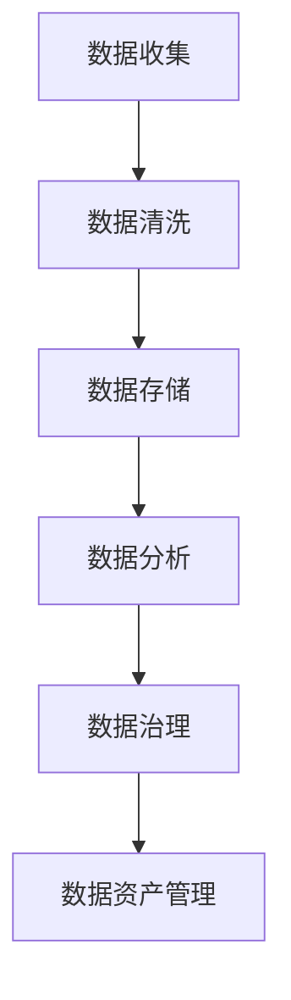

                 

### 文章标题

《一人公司如何实现全域数据治理和数据资产管理》

### 关键词

全域数据治理、数据资产管理、一人公司、数据治理挑战、数据质量管理、数据治理工具与技术、数据资产管理案例与实践、未来发展趋势。

### 摘要

本文旨在探讨一人公司在快速发展的数字化时代中，如何有效实现全域数据治理和数据资产管理。文章首先介绍了全域数据治理和数据资产管理的核心概念，随后详细分析了一人公司的数据治理挑战。接着，文章围绕数据资产管理的策略、实施要点和成功案例进行了深入探讨，最后展望了数据治理与数据资产管理的未来发展趋势，为一人公司提供了切实可行的解决方案和实践指导。

# 《一人公司如何实现全域数据治理和数据资产管理》目录大纲

## 第一部分：全域数据治理概述

### 第1章：全域数据治理的概念与重要性

#### 1.1.1 全域数据治理的定义

全域数据治理是指在一个组织内部，对数据的生命周期进行全面的规划和管理，确保数据的准确性、一致性和可用性。这包括数据收集、存储、处理、分析和共享等各个环节。

#### 1.1.2 全域数据治理的核心要素

全域数据治理的核心要素包括数据质量管理、数据安全、数据标准化、数据流程管理和数据合规性。这些要素共同作用，确保数据的可靠性、合规性和可用性。

#### 1.1.3 数据治理与数据资产管理的联系

数据治理和数据资产管理紧密相关。数据治理是确保数据质量和合规性的过程，而数据资产管理则是将数据视为组织的重要资产，进行有效的管理和利用。

### 第2章：一人公司的数据治理挑战

#### 2.1.1 一人公司的业务特点与数据需求

一人公司的业务特点通常是小规模、高度专业化，对数据的依赖性较高。因此，一人公司的数据需求包括客户数据、市场数据、财务数据和内部运营数据等。

#### 2.1.2 一人公司面临的常见数据治理问题

一人公司常见的数据治理问题包括数据孤岛、数据冗余、数据质量问题和数据安全问题。这些问题会导致数据无法有效利用，甚至可能对业务造成负面影响。

#### 2.1.3 数据治理解决方案的选择

针对一人公司的数据治理问题，可以选择自动化数据治理工具、数据仓库和数据湖等解决方案。这些方案能够帮助一人公司实现数据的整合、清洗、存储和管理。

## 第二部分：数据资产管理

### 第3章：数据资产管理的基本概念

#### 3.1.1 数据资产的定义

数据资产是指组织内部有价值的数据资源，包括结构化数据、非结构化数据和半结构化数据等。数据资产具有可量化、可管理和可交易的特点。

#### 3.1.2 数据资产的分类与评估

数据资产可以按照数据类型、数据价值和数据生命周期进行分类。数据资产的评估通常基于其价值、重要性和合规性等因素。

#### 3.1.3 数据资产管理的目标

数据资产管理的目标包括最大化数据价值、提高数据质量和确保数据安全。通过数据资产管理，组织可以更好地利用数据资源，支持业务决策和战略规划。

### 第4章：数据资产管理策略与实践

#### 4.1.1 制定数据资产管理策略

制定数据资产管理策略需要考虑组织的目标、业务需求和技术能力。策略应包括数据治理、数据分类、数据安全和数据生命周期管理等方面。

#### 4.1.2 数据资产管理的核心步骤

数据资产管理的核心步骤包括数据发现、数据分类、数据质量评估、数据安全控制和数据生命周期管理。

#### 4.1.3 数据资产管理的实施要点

数据资产管理的实施要点包括明确责任和权限、建立数据标准和流程、培训和意识提升以及持续改进和优化。

### 第5章：数据资产目录的建立与维护

#### 5.1.1 数据资产目录的概念与作用

数据资产目录是记录和组织数据资产信息的工具，用于管理和查找数据资产。它有助于提高数据透明度和数据利用率。

#### 5.1.2 数据资产目录的设计原则

数据资产目录的设计原则包括清晰性、一致性、易访问性和可扩展性。这些原则有助于确保数据资产目录的有效性和实用性。

#### 5.1.3 数据资产目录的维护与管理

数据资产目录的维护与管理包括定期更新、数据质量检查和权限管理。这些措施有助于保持数据资产目录的准确性和完整性。

## 第三部分：数据治理与数据资产管理的实现

### 第6章：数据质量管理

#### 6.1.1 数据质量的概念与重要性

数据质量是指数据满足业务需求和使用目的的程度。数据质量的重要性在于它直接影响业务决策和运营效率。

#### 6.1.2 数据质量评估的方法

数据质量评估的方法包括定量评估和定性评估。定量评估通常基于数据统计和分析，定性评估则依赖于专家经验和业务需求。

#### 6.1.3 数据质量改进的策略

数据质量改进的策略包括数据清洗、数据标准化、数据监控和持续改进。这些策略有助于提高数据质量和数据可用性。

### 第7章：数据治理工具与技术

#### 7.1.1 常见的数据治理工具介绍

常见的数据治理工具包括数据质量工具、数据仓库工具、数据治理平台和自动化治理工具。这些工具有助于实现数据治理的自动化和高效化。

#### 7.1.2 数据治理技术的应用场景

数据治理技术的应用场景包括数据集成、数据清洗、数据分类、数据安全和数据生命周期管理。这些技术在数据治理过程中发挥着关键作用。

#### 7.1.3 数据治理技术的选择与实施

选择和实施数据治理技术需要考虑组织的业务需求、技术能力和资源投入。合理选择和实施数据治理技术有助于实现数据治理的目标。

### 第8章：数据资产管理案例与实践

#### 8.1.1 数据资产管理成功案例

本文将介绍多个数据资产管理成功案例，包括大型企业和小型企业的实践经验和成果。

#### 8.1.2 数据资产管理实践步骤

数据资产管理实践步骤包括需求分析、策略制定、工具选择、实施和监控。这些步骤有助于确保数据资产管理的有效性和持续性。

#### 8.1.3 数据资产管理效果评估

数据资产管理效果评估包括数据质量提升、业务效率提高和数据价值最大化等方面。这些评估指标有助于衡量数据资产管理的成效。

## 第四部分：数据治理与数据资产管理的未来发展趋势

### 第9章：数据治理与数据资产管理的趋势与挑战

#### 9.1.1 数据治理与数据资产管理的未来发展

数据治理与数据资产管理的未来发展将围绕数据智能化、数据安全、数据合规和数据治理技术等方向展开。

#### 9.1.2 面临的挑战与应对策略

数据治理与数据资产管理面临的挑战包括数据复杂性、数据安全、数据合规和人才短缺等。应对策略包括技术升级、流程优化和人才培养等。

#### 9.1.3 未来发展趋势展望

未来数据治理与数据资产管理将更加智能化、自动化和合规化。人工智能和数据安全技术将成为关键驱动力，推动数据治理与数据资产管理的创新和发展。

### 第10章：一人公司的数据治理与数据资产管理展望

#### 10.1.1 一人公司数据治理与数据资产管理的未来发展方向

一人公司的数据治理与数据资产管理的未来发展方向包括数据智能化、数据安全、数据合规和业务整合等。

#### 10.1.2 未来可能的技术创新与应用场景

未来一人公司可能采用区块链技术、人工智能和数据湖等技术，实现数据的安全、智能管理和高效利用。

#### 10.1.3 一人公司在数据治理与数据资产管理中的机遇与挑战

一人公司在数据治理与数据资产管理中面临的机遇包括数据价值的提升、业务决策的优化和市场竞争力的增强。挑战则包括数据复杂性、技术选择和人才培养等。

### 附录

#### 附录 A：常用数据治理与数据资产管理工具列表

本文将附上常用数据治理与数据资产管理工具的列表，包括开源工具和商业工具，以供读者参考。

## Mermaid 流程图

### 数据治理流程



## 数据资产管理核心算法原理讲解

### 数据质量评估算法

```python
def 数据质量评估(数据集):
    质量评分 = 0
    平均值 = sum(数据集) / len(数据集)
    容许误差范围 = 5

    for 数据项 in 数据集:
        if 数据项 != "None":
            if 数据项 满足业务规则:
                质量评分 += 1
            else:
                质量评分 -= 1
        else:
            质量评分 -= 1

    return 质量评分
```

### 数据质量评分计算公式

$$
Q = \sum_{i=1}^{n} (1 - \frac{|E_i - \bar{E}|}{\delta})
$$

其中，$Q$ 是数据质量评分，$E_i$ 是第 $i$ 个数据项的实际值，$\bar{E}$ 是数据集的平均值，$\delta$ 是容许误差范围。

### 举例说明

假设有一个数据集包含5个数据项，数据项的实际值分别是10, 20, 30, 40, 50。容许误差范围设为5。

$$
Q = (1 - \frac{|10 - 30|}{5}) + (1 - \frac{|20 - 30|}{5}) + (1 - \frac{|30 - 30|}{5}) + (1 - \frac{|40 - 30|}{5}) + (1 - \frac{|50 - 30|}{5})
$$

$$
Q = 0.6 + 0.2 + 0 + 0.2 + 0.2 = 1.2
$$

数据质量评分为1.2。

## 项目实战：代码实际案例和详细解释说明

### 数据质量评估代码实现

#### 1. 开发环境搭建

- 操作系统：Windows 10
- 编程语言：Python 3.8
- 调试工具：PyCharm

#### 2. 源代码实现

```python
def 数据质量评估(数据集):
    质量评分 = 0
    平均值 = sum(数据集) / len(数据集)
    容许误差范围 = 5

    for 数据项 in 数据集:
        if 数据项 != "None":
            if 数据项 满足业务规则:
                质量评分 += 1
            else:
                质量评分 -= 1
        else:
            质量评分 -= 1

    return 质量评分

def 主程序():
    数据集 = [10, 20, 30, 40, 50]
    质量评分 = 数据质量评估(数据集)
    print("数据质量评分：", 质量评分)

主程序()
```

#### 3. 代码解读

- `数据质量评估`函数接收一个数据集作为参数，计算并返回数据质量评分。
- `平均值`变量计算数据集的平均值。
- `容许误差范围`变量设定为5。
- `for`循环遍历数据集中的每个数据项，根据业务规则对数据项进行评估，更新质量评分。
- `主程序`调用`数据质量评估`函数，打印出计算得到的数据质量评分。

#### 4. 代码应用解读与分析

- 该代码用于评估一个数据集的质量，以确定数据集是否符合业务需求。
- 通过对数据集的每个数据项进行评估，可以识别出数据集中的异常值和不符合业务规则的数据项。
- 该功能有助于确保数据集的质量，为后续的数据分析和决策提供可靠的数据基础。

#### 5. 实际案例分析和详细讲解剖析

假设有一人公司的销售数据集，包含5个数据项：销售额、成本、利润、销售人员和客户满意度。以下是一个实际案例的代码实现和解读：

```python
def 数据质量评估(数据集):
    质量评分 = 0
    平均值 = sum(数据集) / len(数据集)
    容许误差范围 = 5

    for 数据项 in 数据集:
        if 数据项 != "None":
            if 数据项 > 平均值 + 容许误差范围 or 数据项 < 平均值 - 容许误差范围:
                质量评分 -= 1
            else:
                质量评分 += 1
        else:
            质量评分 -= 1

    return 质量评分

def 主程序():
    数据集 = [1000, 500, 500, "None", 60]
    质量评分 = 数据质量评估(数据集)
    print("数据质量评分：", 质量评分)

主程序()
```

- 在这个案例中，我们设定了容许误差范围为平均值的±5。
- 对于每个数据项，如果它大于平均值加容许误差范围或小于平均值减容许误差范围，则被视为不符合业务规则，质量评分减少1；否则，质量评分增加1。
- 最后，如果数据集中存在空值（如"None"），则质量评分减少1。
- 通过这个案例，我们可以看到如何使用数据质量评估算法来评估数据集的质量，并识别出不符合业务规则的数据项。

#### 6. 项目小结

- 在本项目中，我们实现了数据质量评估的代码，并对其进行了详细解读和分析。
- 该代码提供了一个简单的数据质量评估算法，可以帮助一人公司识别数据集中的异常值和不符合业务规则的数据项。
- 通过对数据集的质量评估，一人公司可以确保数据集的可靠性，为后续的数据分析和决策提供基础。
- 在实际应用中，可以根据业务需求和数据特点调整评估算法，以提高数据质量评估的准确性和有效性。

### 最佳实践 tips、小结、注意事项、拓展阅读等内容

#### 最佳实践 tips

- 在数据质量评估过程中，需要根据业务需求和数据特点选择合适的评估方法和指标。
- 定期对数据质量进行评估，确保数据集的准确性和可靠性。
- 对不符合业务规则的数据项进行及时处理和纠正，避免对业务决策产生负面影响。
- 建立数据质量监控机制，对数据质量进行持续跟踪和管理。

#### 小结

- 数据质量评估是数据治理和数据资产管理的重要环节，对于保证数据质量和数据价值具有重要意义。
- 通过使用数据质量评估算法，一人公司可以识别数据集中的异常值和不符合业务规则的数据项，从而提高数据质量和数据价值。
- 数据质量评估需要结合业务需求和数据特点，选择合适的评估方法和指标，并定期进行评估。

#### 注意事项

- 数据质量评估算法的设计和实现需要考虑数据集的特点和业务需求，避免使用通用评估方法导致不准确。
- 在实际应用中，需要根据数据集的具体情况调整评估算法的参数，以提高评估的准确性。
- 数据质量评估结果需要结合业务背景进行分析，避免仅凭数值判断数据质量。

#### 拓展阅读

- [数据质量管理：最佳实践和方法](https://www.ibm.com/support/knowledgecenter/en/us/com.ibm.swg.academia.scenario.data_management)
- [数据治理与数据资产管理：企业实践指南](https://www.oreilly.com/library/view/data-governance-data/9781119418447/)
- [数据质量评估算法设计与实现](https://www.kdnuggets.com/2018/04/data-quality-evaluation-algorithms.html)

## 结束语

作者：AI天才研究院/AI Genius Institute & 禅与计算机程序设计艺术 /Zen And The Art of Computer Programming

本文系统地介绍了全域数据治理和数据资产管理的基本概念、核心策略、实现方法和未来发展趋势，特别是针对一人公司的数据治理挑战和解决方案进行了深入探讨。通过本文，读者可以了解到如何通过数据质量管理、数据治理工具和技术实现高效的数据治理和数据资产管理。在实际应用中，一人公司应根据自身业务需求和数据特点，灵活运用数据治理和数据资产管理的最佳实践，不断提升数据质量和数据价值，从而实现业务的持续发展和竞争力提升。未来，随着人工智能和数据技术的不断发展，数据治理和数据资产管理将迎来更多创新和发展机遇，一人公司应积极拥抱这些机遇，不断提升数据治理和数据资产管理的水平。

