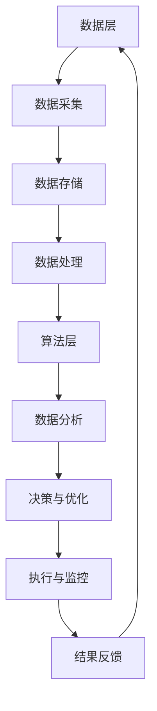
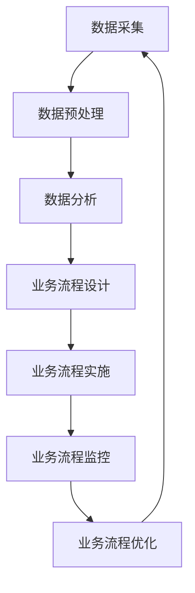

                 

# 《一人公司如何实现智能化业务流程管理和优化》

## 关键词

一人公司，智能化业务流程管理，业务流程优化，人工智能，大数据，流程自动化，机器学习，深度学习

## 摘要

本文将探讨一人公司如何通过智能化业务流程管理实现高效运作和持续优化。文章首先分析了独立创业的挑战与机遇，然后介绍了智能化业务流程管理的基本概念、核心要素和技术架构。接着，文章详细阐述了智能化业务流程管理的应用场景，包括客户关系管理、供应链管理和人力资源管理。随后，文章介绍了智能化业务流程管理的技术实现，包括数据分析与挖掘、机器学习与深度学习和流程自动化工具。此外，文章还讨论了智能化业务流程管理的实践方法、评估与改进策略，以及法律、伦理和风险方面的考虑。最后，文章展望了智能化业务流程管理的未来发展趋势和展望。通过本文的阅读，读者将能够了解如何运用智能化技术提升一人公司的业务流程效率和质量。

### 第1章 引言

#### 1.1 独立创业的挑战与机遇

独立创业，作为现代社会中一种越来越受欢迎的职业选择，既充满了无限的可能性，也面临着诸多挑战。对于创业者来说，成功的关键在于能否在有限的资源和环境中，实现业务的快速增长和高效运作。

**1.1.1 独立创业的现状**

近年来，随着互联网技术的迅猛发展和创业环境的日益优化，独立创业已经成为一种趋势。越来越多的人选择放弃传统的就业模式，投身于创业的浪潮中。特别是在科技领域，创业者利用互联网、大数据、人工智能等新兴技术，创造出了许多具有颠覆性的商业模式。这种趋势不仅为创业者提供了更多的机会，也推动了整个社会的创新和发展。

然而，独立创业并非一条轻松的道路。根据相关统计数据显示，大多数创业公司在一两年内就会面临倒闭的风险。这些公司往往因为缺乏足够的资源、管理经验和技术支持，导致业务无法持续发展。此外，市场竞争的加剧也使得创业者面临着巨大的压力。

**1.1.2 创业者的痛点**

独立创业的创业者常常面临着以下几个痛点：

1. **资源匮乏**：创业者通常需要从零开始构建自己的业务，这意味着需要投入大量的时间和精力来寻找资金、人才和市场机会。而资源的匮乏往往会限制创业者的业务发展。

2. **管理经验不足**：许多创业者缺乏管理经验，特别是在业务扩展和团队管理方面。这会导致公司在成长过程中遇到各种管理瓶颈，影响业务的稳定发展。

3. **技术瓶颈**：对于一些技术驱动的创业公司来说，技术瓶颈是制约其业务发展的关键因素。技术的不成熟往往会限制产品的功能和服务质量。

4. **市场定位不清**：创业者需要准确把握市场需求，定位自己的产品和服务。然而，市场环境的快速变化使得创业者难以始终保持清晰的定位。

5. **竞争压力**：随着创业浪潮的兴起，市场竞争愈发激烈。创业者需要在激烈的市场竞争中脱颖而出，这需要不断调整策略和创新。

**1.1.3 智能化业务流程管理的重要性**

在面对这些挑战时，智能化业务流程管理成为了一人公司实现高效运作和持续优化的关键。智能化业务流程管理通过引入人工智能、大数据等技术，能够帮助创业者：

1. **提高运营效率**：通过自动化工具和智能算法，简化业务流程，减少人为干预，提高工作效率。

2. **优化决策过程**：利用大数据分析和机器学习技术，帮助创业者更好地理解市场趋势和客户需求，做出更为精准的决策。

3. **降低运营成本**：通过优化业务流程和资源配置，减少不必要的开支，提高盈利能力。

4. **提升客户满意度**：智能化业务流程管理能够提供更高效、更精准的服务，提升客户满意度，增强客户忠诚度。

5. **增强创新能力**：通过智能化的业务流程管理，创业者能够更加专注于业务创新，推动企业持续发展。

总之，智能化业务流程管理不仅能够帮助一人公司应对各种挑战，还能为其带来新的发展机遇。在接下来的章节中，我们将详细探讨智能化业务流程管理的基本概念、核心要素和技术架构，帮助读者更好地理解这一重要的管理工具。

#### 1.2 智能化业务流程管理概述

**1.2.1 业务流程管理的基本概念**

业务流程管理（Business Process Management，BPM）是一种通过系统的方法和工具来设计、实施、监控和优化企业业务流程的方法。其核心目标是提高业务效率、降低运营成本、提升客户满意度，并增强企业的竞争力。业务流程管理包括以下几个关键组成部分：

1. **流程设计**：流程设计是指对业务流程进行规划、建模和文档化。通过流程设计，企业可以明确各个环节的任务、责任和标准，确保业务流程的清晰和有序。

2. **流程实施**：流程实施是指将设计好的业务流程付诸实践。在实施过程中，企业需要确保各个环节的协调和配合，并针对实际情况进行调整和优化。

3. **流程监控**：流程监控是指对业务流程的执行情况进行实时跟踪和监控。通过流程监控，企业可以及时发现问题和异常，并采取相应的措施进行纠正。

4. **流程优化**：流程优化是指对业务流程进行持续改进和优化。通过流程优化，企业可以不断提升业务流程的效率和质量，以满足不断变化的市场需求。

**1.2.2 智能化业务流程管理的特征**

智能化业务流程管理在传统业务流程管理的基础上，引入了人工智能、大数据、机器学习等先进技术，从而实现了更加智能化和自动化的业务流程。智能化业务流程管理的特征主要包括：

1. **自动化**：智能化业务流程管理通过自动化工具和算法，减少人工干预，提高业务流程的自动化水平。自动化不仅能够提高工作效率，还能减少人为错误，提升业务流程的稳定性。

2. **数据分析**：智能化业务流程管理利用大数据分析技术，对业务流程中的数据进行实时分析和挖掘，帮助企业更好地理解业务状况和市场趋势。通过数据分析，企业可以做出更为精准的决策，优化业务流程。

3. **智能化决策**：智能化业务流程管理通过机器学习和深度学习技术，实现智能化决策。智能算法可以根据历史数据和实时数据，自动调整业务流程，提高决策的准确性和效率。

4. **持续优化**：智能化业务流程管理具有持续优化的能力。通过实时监控和分析，智能系统能够发现业务流程中的瓶颈和问题，并提出优化建议。企业可以根据这些建议，对业务流程进行持续改进，实现业务流程的不断提升。

**1.2.3 业务流程管理的发展趋势**

随着技术的不断进步和市场竞争的加剧，业务流程管理也在不断发展和演变。以下是业务流程管理的一些主要发展趋势：

1. **数字化**：数字化是业务流程管理的重要趋势。通过数字化技术，企业可以实现业务流程的在线化、自动化和智能化，提高业务效率。

2. **智能化**：智能化是业务流程管理的核心方向。随着人工智能技术的快速发展，越来越多的企业开始将智能化技术应用于业务流程管理，实现更加高效和精准的管理。

3. **集成化**：集成化是业务流程管理的另一个重要趋势。通过集成不同系统和工具，企业可以实现业务流程的全面整合和协同，提高业务流程的效率和质量。

4. **移动化**：移动化是业务流程管理的未来方向。随着移动设备的普及，越来越多的企业开始将业务流程移动化，使员工能够随时随地处理业务，提高工作效率。

5. **全球化**：全球化是业务流程管理的发展趋势。随着全球市场的不断扩展，企业需要适应全球化的业务环境，通过业务流程管理实现全球资源的优化配置。

总之，智能化业务流程管理作为一种高效的管理工具，正越来越受到企业的关注和应用。在接下来的章节中，我们将深入探讨智能化业务流程管理的核心概念、关键技术和应用场景，帮助读者更好地理解和应用这一管理方法。

#### 第2章 智能化业务流程管理核心概念

**2.1 智能化技术概述**

在探讨智能化业务流程管理之前，有必要对智能化技术进行简要概述。智能化技术主要包括人工智能（Artificial Intelligence，AI）、大数据（Big Data）和业务流程再造（Business Process Reengineering，BPR）等技术。

**2.1.1 人工智能的定义与应用**

人工智能是指通过计算机程序模拟人类智能的科学技术。它包括多个子领域，如机器学习（Machine Learning）、深度学习（Deep Learning）、自然语言处理（Natural Language Processing，NLP）等。人工智能在业务流程管理中的应用十分广泛，如自动化决策、智能客服、智能监控等。

**2.1.2 大数据技术简介**

大数据技术是指处理海量数据的技术和方法。大数据技术包括数据采集、存储、处理、分析和可视化等环节。在业务流程管理中，大数据技术可以帮助企业更好地理解客户需求、优化业务流程和提高运营效率。

**2.1.3 业务流程再造**

业务流程再造是一种通过彻底重新设计业务流程，以实现显著提高业绩、效率和质量的管理方法。业务流程再造通常涉及对现有业务流程的彻底重构，引入新的技术和管理方法，以提高业务流程的智能化水平。

**2.2 业务流程管理关键要素**

智能化业务流程管理的关键要素包括业务流程设计原则、流程监控与优化、流程自动化与集成等。

**2.2.1 业务流程设计原则**

业务流程设计原则是指在设计业务流程时需要遵循的基本原则。主要包括：

1. **目标导向**：业务流程设计应围绕企业目标进行，确保每个流程环节都能为企业目标的实现做出贡献。

2. **简洁性**：业务流程应尽可能简洁，减少冗余和重复操作，以提高流程效率。

3. **灵活性**：业务流程应具有一定的灵活性，能够适应市场和环境的变化。

4. **可追溯性**：业务流程应具备良好的可追溯性，确保每个环节的责任和结果都能被追溯。

5. **标准化**：业务流程应遵循标准化原则，确保各个环节的操作规范和标准一致。

**2.2.2 流程监控与优化**

流程监控与优化是智能化业务流程管理的重要组成部分。流程监控包括对流程执行情况的实时跟踪和监控，以及流程执行效果的评估。流程优化则是指通过对流程监控数据的分析，发现存在的问题和瓶颈，并提出优化建议，以提升流程效率和质量。

**2.2.3 流程自动化与集成**

流程自动化与集成是指通过引入自动化工具和集成平台，将业务流程中的各个环节进行自动化和集成。流程自动化包括对重复性任务的自动化处理，如数据采集、数据处理、通知发送等。流程集成则是指将不同系统和工具进行整合，实现数据流和业务流程的无缝衔接，提高整体业务流程的效率。

**2.3 智能化业务流程管理原理与架构**

智能化业务流程管理原理主要包括以下几个方面：

1. **数据驱动**：智能化业务流程管理以数据为核心，通过数据采集、存储、处理和分析，为业务决策和流程优化提供支持。

2. **算法优化**：智能化业务流程管理利用机器学习和深度学习算法，对业务流程进行实时监控和优化，提高流程效率。

3. **自动化执行**：智能化业务流程管理通过自动化工具和集成平台，实现业务流程的自动化执行，减少人为干预，提高流程稳定性。

4. **实时反馈**：智能化业务流程管理具有实时反馈机制，能够及时收集和分析流程执行数据，为流程优化提供依据。

智能化业务流程管理架构通常包括以下几个层次：

1. **数据层**：包括数据采集、存储和处理等基础设施。

2. **算法层**：包括机器学习和深度学习算法，用于数据处理和分析。

3. **应用层**：包括业务流程管理平台、自动化工具和系统集成等。

4. **展示层**：包括数据可视化、报告生成等，用于展示业务流程执行情况和优化效果。

**2.3.1 智能化流程管理的基本原理**

智能化流程管理的基本原理主要包括以下几个方面：

1. **数据采集与处理**：通过数据采集工具和接口，从各个业务系统中获取流程执行数据，并进行数据清洗和处理。

2. **数据分析与挖掘**：利用机器学习和深度学习算法，对采集到的数据进行分析和挖掘，发现业务流程中的问题和瓶颈。

3. **决策与优化**：根据分析结果，智能算法会提出优化建议，企业可以根据这些建议对业务流程进行调整和优化。

4. **执行与监控**：对优化后的业务流程进行执行和监控，确保流程执行效果达到预期目标。

**2.3.2 业务流程管理架构图**

以下是业务流程管理架构图的 Mermaid 流程图表示：



**2.3.3 智能化业务流程管理的关键技术**

智能化业务流程管理的关键技术包括以下几个方面：

1. **数据挖掘技术**：数据挖掘技术用于从海量数据中提取有价值的信息和知识。常见的数据挖掘技术包括分类、聚类、关联规则挖掘、异常检测等。

2. **机器学习技术**：机器学习技术用于构建智能模型，对数据进行分析和预测。常见的机器学习算法包括线性回归、决策树、支持向量机、神经网络等。

3. **深度学习技术**：深度学习技术是一种基于人工神经网络的智能算法，能够处理复杂的非线性问题。常见的深度学习算法包括卷积神经网络（CNN）、循环神经网络（RNN）、生成对抗网络（GAN）等。

4. **流程自动化技术**：流程自动化技术用于实现业务流程的自动化执行，减少人为干预。常见的流程自动化工具包括机器人流程自动化（RPA）、工作流管理系统等。

5. **流程集成技术**：流程集成技术用于将不同系统和工具进行整合，实现数据流和业务流程的无缝衔接。常见的流程集成技术包括企业服务总线（ESB）、集成平台（iPaaS）等。

通过以上对智能化业务流程管理核心概念的介绍，读者可以初步了解这一管理方法的基本概念、关键要素和实现原理。在接下来的章节中，我们将进一步探讨智能化业务流程管理的应用场景、技术实现和实际案例，帮助读者深入理解和应用这一管理方法。

#### 第3章 智能化业务流程管理应用场景

智能化业务流程管理在各个领域都有广泛的应用，其中客户关系管理（CRM）、供应链管理（SCM）和人力资源管理（HR）是三个典型的应用场景。下面将分别介绍这些场景中的智能化业务流程管理，并通过案例分析展示其具体实现和效果。

**3.1 客户关系管理（CRM）**

**3.1.1 CRM概述**

客户关系管理（Customer Relationship Management，CRM）是一种通过系统的方法和技术来管理和提升企业与客户之间关系的管理理念。CRM系统的核心目标是提高客户满意度、增强客户忠诚度，并最终提升企业的盈利能力。在传统CRM中，企业通常通过客户数据库、销售管理、市场推广等模块来管理和分析客户信息，但这种方式往往存在信息孤岛、数据利用率低等问题。

**3.1.2 智能化CRM的实现**

智能化CRM通过引入人工智能、大数据分析和机器学习等技术，实现了传统CRM的升级和优化。智能化CRM的主要特点包括：

1. **智能客户识别**：利用大数据和机器学习算法，智能化CRM能够对客户行为、偏好和需求进行精准分析，识别出高价值客户。

2. **个性化服务**：根据客户的历史数据和实时行为，智能化CRM能够提供个性化的产品推荐和服务，提升客户体验。

3. **预测分析与决策支持**：智能化CRM通过预测分析，帮助企业预测客户需求、市场趋势，并提供决策支持，帮助企业做出更为精准的营销策略和业务决策。

**3.1.3 案例分析**

以一家在线零售公司为例，该公司通过引入智能化CRM系统，实现了业务流程的优化和客户管理的提升。具体实现步骤如下：

1. **数据整合**：将来自不同渠道的客户数据（如网站、社交媒体、线下活动等）进行整合，构建统一的客户视图。

2. **数据分析与挖掘**：利用大数据技术和机器学习算法，对客户数据进行挖掘和分析，识别出高价值客户和潜在客户。

3. **个性化营销**：根据客户的历史购买记录和偏好，智能化CRM系统会自动发送个性化的营销邮件、短信和推荐消息。

4. **预测分析与决策支持**：通过预测分析，公司能够提前了解客户的购买意图，及时调整营销策略和库存管理。

通过智能化CRM的实施，该公司实现了客户满意度的显著提升，客户流失率下降，销售业绩稳步增长。

**3.2 供应链管理（SCM）**

**3.2.1 SCM概述**

供应链管理（Supply Chain Management，SCM）是企业对供应、生产、库存、配送等环节进行计划、协调和控制的过程。传统的供应链管理主要依赖于手工操作和经验管理，这种方式往往存在信息不对称、库存积压、供应链响应慢等问题。随着互联网和大数据技术的发展，智能化供应链管理应运而生。

**3.2.2 智能化SCM的实现**

智能化SCM通过引入物联网、大数据分析、人工智能和区块链技术，实现了供应链的全面升级。智能化SCM的主要特点包括：

1. **供应链可视化**：利用物联网技术，实现供应链各环节的实时监控和可视化，提高供应链的透明度和响应速度。

2. **需求预测与库存优化**：通过大数据分析和机器学习算法，智能化SCM能够准确预测市场需求，优化库存管理，减少库存积压和缺货现象。

3. **物流优化**：利用人工智能和优化算法，智能化SCM能够实现物流路径优化、运输调度和成本控制，提高物流效率。

**3.2.3 案例分析**

以一家大型电子商务公司为例，该公司通过引入智能化SCM系统，实现了供应链的全面优化和效率提升。具体实现步骤如下：

1. **数据采集与整合**：通过物联网传感器和物流信息系统，采集供应链各环节的数据，并进行整合。

2. **需求预测与库存优化**：利用大数据分析和机器学习算法，对市场需求进行预测，并根据预测结果优化库存管理。

3. **物流优化**：通过人工智能算法和优化模型，对物流路径和运输调度进行优化，提高物流效率。

4. **供应链可视化**：利用可视化技术，将供应链各环节的实时数据可视化，提高供应链的透明度和响应速度。

通过智能化SCM的实施，该公司实现了库存周转率显著提高，物流成本降低，供应链响应速度加快，客户满意度显著提升。

**3.3 人力资源管理（HR）**

**3.3.1 HR概述**

人力资源管理（Human Resource Management，HRM）是企业对员工招聘、培训、绩效评估、薪酬福利等环节进行管理的活动。传统的人力资源管理往往依赖于手工操作和经验管理，这种方式效率低下，容易导致信息不对称和员工流失。随着人工智能和大数据技术的发展，智能化人力资源管理逐渐成为主流。

**3.3.2 智能化HR的实现**

智能化HR通过引入人工智能、大数据分析和机器学习技术，实现了人力资源管理的信息化、自动化和智能化。智能化HR的主要特点包括：

1. **智能招聘**：利用人工智能和大数据分析，智能化HR系统能够自动筛选简历、进行初步面试，提高招聘效率。

2. **智能培训**：通过大数据分析和机器学习算法，智能化HR系统能够根据员工的职业发展和公司需求，提供个性化的培训方案。

3. **绩效评估**：利用人工智能和大数据分析，智能化HR系统能够对员工的工作表现进行实时评估，并提供改进建议。

4. **薪酬福利管理**：智能化HR系统能够根据员工的表现和市场薪资水平，自动计算薪酬和福利，提高薪酬管理的透明度和公正性。

**3.3.3 案例分析**

以一家高科技公司为例，该公司通过引入智能化HR系统，实现了人力资源管理的优化和效率提升。具体实现步骤如下：

1. **数据整合与分析**：将招聘、培训、绩效评估、薪酬福利等数据整合到智能化HR系统中，进行数据分析和挖掘。

2. **智能招聘**：利用人工智能算法，智能化HR系统能够自动筛选简历、进行初步面试，提高招聘效率。

3. **智能培训**：通过大数据分析和机器学习算法，智能化HR系统能够为员工提供个性化的培训方案，提高培训效果。

4. **绩效评估**：利用人工智能和大数据分析，智能化HR系统能够对员工的工作表现进行实时评估，并提供改进建议。

5. **薪酬福利管理**：智能化HR系统能够根据员工的表现和市场薪资水平，自动计算薪酬和福利，提高薪酬管理的透明度和公正性。

通过智能化HR的实施，该公司实现了招聘效率提升、员工培训效果提升、绩效评估更加精准、薪酬福利管理更加透明，员工满意度显著提高。

总之，智能化业务流程管理在客户关系管理、供应链管理和人力资源管理等领域的应用，不仅提高了企业的运营效率和管理水平，还增强了企业的竞争力。在接下来的章节中，我们将进一步探讨智能化业务流程管理的技术实现和实际案例，帮助读者深入理解和应用这一管理方法。

#### 第4章 智能化业务流程管理技术实现

实现智能化业务流程管理的关键在于技术手段的运用，其中包括数据分析与挖掘、机器学习与深度学习以及流程自动化工具。以下是这些技术实现的详细讲解。

**4.1 数据分析与挖掘**

数据分析与挖掘是智能化业务流程管理的基础，它涉及从大量数据中提取有价值的信息和知识。数据分析与挖掘的过程通常包括以下几个步骤：

**4.1.1 数据采集**

数据采集是指从各种数据源收集数据的过程。数据源可以是内部系统（如ERP、CRM、HR系统等）或外部数据源（如社交媒体、公共数据库等）。为了确保数据的完整性和准确性，数据采集过程中需要使用数据清洗和转换技术。

**4.1.2 数据存储**

数据存储是将采集到的数据存储在数据库或其他数据存储系统中。数据存储需要考虑数据的安全性、可扩展性和访问速度。常见的数据库技术包括关系数据库（如MySQL、Oracle）和NoSQL数据库（如MongoDB、Cassandra）。

**4.1.3 数据处理**

数据处理是指对存储在数据库中的数据进行处理，包括数据清洗、数据转换和数据整合。数据清洗是为了去除数据中的噪声和错误，数据转换是为了将数据格式转换为适合分析的形式，数据整合是为了将多个数据源的数据合并为一个完整的视图。

**4.1.4 数据挖掘**

数据挖掘是指使用算法和技术从大量数据中提取有价值的信息和知识。常见的数据挖掘技术包括分类、聚类、关联规则挖掘、异常检测等。

1. **分类**：分类是将数据分为不同的类别或标签。常见的分类算法有决策树、支持向量机、随机森林等。
   ```python
   from sklearn.datasets import load_iris
   from sklearn.model_selection import train_test_split
   from sklearn.tree import DecisionTreeClassifier
   
   # 加载数据集
   iris = load_iris()
   X_train, X_test, y_train, y_test = train_test_split(iris.data, iris.target, test_size=0.3, random_state=42)
   
   # 构建决策树分类器
   clf = DecisionTreeClassifier()
   clf.fit(X_train, y_train)
   
   # 预测
   predictions = clf.predict(X_test)
   ```
2. **聚类**：聚类是将数据分为不同的组或簇。常见的聚类算法有K-means、层次聚类等。
   ```python
   from sklearn.cluster import KMeans
   import numpy as np
   
   # 创建随机数据
   X = np.random.rand(100, 2)
   
   # 构建K-means聚类模型
   kmeans = KMeans(n_clusters=3)
   kmeans.fit(X)
   
   # 获取聚类中心
   centroids = kmeans.cluster_centers_
   print("Cluster centroids:", centroids)
   
   # 预测
   labels = kmeans.predict(X)
   print("Cluster labels:", labels)
   ```
3. **关联规则挖掘**：关联规则挖掘用于发现数据之间的关联关系。常见的算法有Apriori算法、Eclat算法等。
   ```python
   from mlxtend.frequent_patterns import apriori
   from mlxtend.frequent_patterns import association_rules
   
   # 加载数据集
   transactions = [[1, 3, 4], [2, 3, 5], [1, 2, 3, 5], [2, 3]]
   
   # 运行Apriori算法
   df_frequent_itemsets = apriori(transactions, min_support=0.5, use_colnames=True)
   
   # 构建关联规则
   df_rules = association_rules(df_frequent_itemsets, metric="support", min_threshold=0.7)
   print(df_rules)
   ```
4. **异常检测**：异常检测用于发现数据中的异常或离群点。常见的算法有孤立森林、LOF（局部离群因子）等。
   ```python
   from sklearn.ensemble import IsolationForest
   
   # 创建随机数据
   X = np.random.rand(100, 2)
   
   # 构建孤立森林模型
   model = IsolationForest(random_state=42)
   model.fit(X)
   
   # 预测
   outliers = model.predict(X)
   print("Outliers:", outliers)
   ```

**4.2 机器学习与深度学习**

机器学习与深度学习是智能化业务流程管理的核心技术，它们能够自动从数据中学习，并用于预测、分类和优化。

**4.2.1 机器学习基础**

机器学习是指通过算法让计算机自动从数据中学习，并对新数据做出预测或决策。机器学习的主要流程包括数据预处理、模型训练、模型评估和模型应用。

1. **数据预处理**：数据预处理包括数据清洗、数据转换和数据归一化。数据清洗是为了去除数据中的噪声和错误，数据转换是为了将数据格式转换为适合分析的形式，数据归一化是为了消除数据之间的量纲差异。
   ```python
   import pandas as pd
   from sklearn.preprocessing import StandardScaler
   
   # 加载数据集
   df = pd.read_csv("data.csv")
   
   # 数据清洗
   df.dropna(inplace=True)
   
   # 数据转换
   df["age"] = df["age"].astype(int)
   df["income"] = df["income"].astype(float)
   
   # 数据归一化
   scaler = StandardScaler()
   df["age_scaled"] = scaler.fit_transform(df[["age"]])
   df["income_scaled"] = scaler.fit_transform(df[["income"]])
   ```

2. **模型训练**：模型训练是指使用训练数据集对机器学习模型进行训练，使模型能够学习数据的特征和规律。常见的机器学习算法包括线性回归、决策树、随机森林、支持向量机等。
   ```python
   from sklearn.linear_model import LinearRegression
   
   # 构建线性回归模型
   model = LinearRegression()
   
   # 训练模型
   model.fit(df[["age_scaled", "income_scaled"]], df["income"])
   ```

3. **模型评估**：模型评估是指使用测试数据集对训练好的模型进行评估，以确定模型的准确性和可靠性。常见的评估指标包括均方误差（MSE）、决定系数（R²）、准确率、召回率、F1分数等。
   ```python
   from sklearn.metrics import mean_squared_error
   
   # 预测
   predictions = model.predict(df[["age_scaled", "income_scaled"]])
   
   # 计算均方误差
   mse = mean_squared_error(df["income"], predictions)
   print("MSE:", mse)
   ```

4. **模型应用**：模型应用是指将训练好的模型用于新数据的预测或决策。在实际应用中，模型可以用于业务流程的自动化、优化和预测。
   ```python
   # 新数据
   new_data = [[25, 50000]]
   
   # 预测
   prediction = model.predict(new_data)
   print("Predicted income:", prediction[0])
   ```

**4.2.2 深度学习基础**

深度学习是一种基于多层神经网络的机器学习方法，它能够自动从大量数据中学习复杂的特征和模式。深度学习主要包括卷积神经网络（CNN）、循环神经网络（RNN）和生成对抗网络（GAN）等。

1. **卷积神经网络（CNN）**：卷积神经网络是一种用于图像识别和处理的前馈神经网络。CNN通过卷积层、池化层和全连接层等结构，实现图像的特征提取和分类。
   ```python
   from tensorflow import keras
   from tensorflow.keras import layers
   
   # 构建CNN模型
   model = keras.Sequential([
       layers.Conv2D(32, (3, 3), activation='relu', input_shape=(28, 28, 1)),
       layers.MaxPooling2D((2, 2)),
       layers.Conv2D(64, (3, 3), activation='relu'),
       layers.MaxPooling2D((2, 2)),
       layers.Conv2D(64, (3, 3), activation='relu'),
       layers.Flatten(),
       layers.Dense(64, activation='relu'),
       layers.Dense(10, activation='softmax')
   ])
   
   # 编译模型
   model.compile(optimizer='adam',
                 loss='sparse_categorical_crossentropy',
                 metrics=['accuracy'])
   
   # 训练模型
   model.fit(x_train, y_train, epochs=5)
   ```

2. **循环神经网络（RNN）**：循环神经网络是一种用于序列数据处理和时间序列预测的神经网络。RNN通过循环结构实现序列数据的记忆功能，但存在梯度消失和梯度爆炸等问题。
   ```python
   from tensorflow import keras
   from tensorflow.keras import layers
   
   # 构建RNN模型
   model = keras.Sequential([
       layers.Embedding(input_dim=10000, output_dim=64),
       layers.LSTM(128),
       layers.Dense(10, activation='softmax')
   ])
   
   # 编译模型
   model.compile(optimizer='adam',
                 loss='sparse_categorical_crossentropy',
                 metrics=['accuracy'])
   
   # 训练模型
   model.fit(x_train, y_train, epochs=5)
   ```

3. **生成对抗网络（GAN）**：生成对抗网络是一种用于生成对抗的神经网络结构。GAN由生成器和判别器组成，生成器生成数据，判别器判断生成数据与真实数据的相似度。
   ```python
   from tensorflow import keras
   from tensorflow.keras import layers
   
   # 构建GAN模型
   latent_dim = 100
   
   # 生成器模型
   generator = keras.Sequential([
       layers.Dense(128, activation='relu', input_shape=(latent_dim,)),
       layers.Dense(28 * 28 * 1, activation='relu'),
       layers.Reshape((28, 28, 1))
   ])
   
   # 判别器模型
   discriminator = keras.Sequential([
       layers.Conv2D(32, (3, 3), padding='same', activation='relu', input_shape=(28, 28, 1)),
       layers.MaxPooling2D(),
       layers.Conv2D(64, (3, 3), padding='same', activation='relu'),
       layers.MaxPooling2D(),
       layers.Flatten(),
       layers.Dense(1, activation='sigmoid')
   ])
   
   # 编译模型
   discriminator.compile(optimizer='adam', loss='binary_crossentropy')
   
   # 编译生成器
   generator.compile(optimizer='adam', loss='binary_crossentropy')
   
   # 训练GAN模型
   for epoch in range(50):
       x_fake = generator.predict(z)
       d_loss_real = discriminator.train_on_batch(x_train, np.ones((x_train.shape[0], 1)))
       d_loss_fake = discriminator.train_on_batch(x_fake, np.zeros((x_fake.shape[0], 1)))
       g_loss = combined_model.train_on_batch(z, np.ones((z.shape[0], 1)))
       print(f"{epoch} Epoch - d_loss: {d_loss}, g_loss: {g_loss}")
   ```

**4.3 流程自动化工具**

流程自动化工具是智能化业务流程管理的重要手段，它们能够自动执行重复性任务，提高工作效率。常见的流程自动化工具包括机器人流程自动化（RPA）和工作流管理系统。

**4.3.1 自动化工具概述**

1. **机器人流程自动化（RPA）**：机器人流程自动化（Robotic Process Automation，RPA）是一种通过软件机器人自动执行重复性任务的技术。RPA机器人可以模拟人类的操作，与不同的系统进行交互，完成数据采集、处理和传递等任务。
   ```python
   import robot
   
   # 启动RPA机器人
   robot.start("rpa_bot")
   
   # 执行任务
   robot.execute_task("task_name", {"input1": "value1", "input2": "value2"})
   ```

2. **工作流管理系统**：工作流管理系统（Workflow Management System，WFMS）是一种用于定义、管理和监控业务流程的系统。工作流管理系统可以帮助企业自动化业务流程，确保流程的执行符合预定规则，提高流程的透明度和效率。
   ```python
   import workflow
   
   # 定义工作流
   workflow.define_workflow("workflow_name", [
       {"task": "task1", "input": {"param1": "value1"}},
       {"task": "task2", "input": {"param2": "value2"}},
       {"task": "task3", "input": {"param3": "value3"}}
   ])
   
   # 启动工作流
   workflow.start("workflow_name")
   ```

**4.3.2 常用自动化工具介绍**

1. **UiPath**：UiPath是一个流行的RPA平台，提供丰富的机器人开发工具和插件，支持多种操作系统和应用程序的集成。通过UiPath，企业可以快速构建自动化机器人，实现业务流程的自动化。
   ```xml
   <Robot RuntimeVersion="22.4.0.0" Name="MyRobot" xmlns="http://schemas.uipath.com/uirobot/robot" xmlns:xsi="http://www.w3.org/2001/XMLSchema-instance" xsi:schemaLocation="http://schemas.uipath.com/uirobot/robot UiPath Robot Definition.xsd">
       <CodeBehind>
           <Assembly Name="MyRobot, Version=1.0.0.0, Culture=neutral, PublicKeyToken=31bf3856ad364e35" CodeFile="MyRobot.cs" />
       </CodeBehind>
       <Variables>
           <Variable Name="MyVariable" Value="Hello, World!" />
       </Variables>
   </Robot>
   ```

2. **Activiti**：Activiti是一个开源的工作流管理系统，提供工作流定义、执行和监控功能。Activiti支持BPMN 2.0标准，可以通过图形化工具定义工作流，并通过Java API进行工作流的管理和执行。
   ```xml
   <definitions xmlns="http://www.omg.org/spec/BPMN/20100524/MODEL" xmlns:xsi="http://www.w3.org/2001/XMLSchema-instance" xmlns:activiti="http://activiti.org/bpmn" xsi:schemaLocation="http://www.omg.org/spec/BPMN/20100524/MODEL http://www.omg.org/spec/BPMN/20100524/BPMN20.xsd http://activiti.org/bpmn http://www.activiti.org/schema/activiti-bpmn20.xsd" id="m1566100164681" name="" targetNamespace="http://www.activiti.org/testm1566100164681">
       <process id="m1566100164681" name="My Process" isExecutable="true">
           <startEvent id="StartEvent1" name="Start"></startEvent>
           <userTask id="UserTask1" name="Task"></userTask>
           <sequenceFlow id="Flow1" sourceRef="StartEvent1" targetRef="UserTask1"></sequenceFlow>
       </process>
   </definitions>
   ```

通过以上对数据分析与挖掘、机器学习与深度学习和流程自动化工具的介绍，读者可以初步了解智能化业务流程管理的技术实现。在实际应用中，企业可以根据自身需求选择合适的技术和工具，实现业务流程的智能化和自动化。在接下来的章节中，我们将进一步探讨智能化业务流程管理的实践方法和实际案例，帮助读者深入理解和应用这一管理方法。

#### 第4章 智能化业务流程管理技术实现

**4.1 数据分析与挖掘**

数据分析与挖掘是智能化业务流程管理的重要组成部分，它通过对大量业务数据进行处理和分析，提取有价值的信息和知识，从而帮助决策者做出更加准确的决策。以下是数据分析与挖掘技术的基本原理和应用实例。

**4.1.1 数据分析基础**

数据分析是指使用统计方法和工具对数据进行分析和处理，以便从数据中提取有用信息和知识。数据分析通常包括以下几个步骤：

1. **数据收集**：收集所需的数据，这些数据可以来自企业内部系统、外部数据源或公共数据集。
2. **数据预处理**：对收集到的数据进行清洗、转换和整合，以便后续分析。
3. **数据探索性分析**：对预处理后的数据进行探索性分析，了解数据的基本特征和分布情况。
4. **数据建模**：根据业务需求，选择合适的统计模型或机器学习算法对数据进行分析和预测。
5. **模型评估**：对建立的模型进行评估，以确定其预测准确性和可靠性。
6. **结果解释**：根据分析结果，解释数据背后的含义，为业务决策提供支持。

**4.1.2 数据挖掘技术**

数据挖掘是指从大量数据中发现潜在的、有价值的信息和知识。数据挖掘技术主要包括以下几种：

1. **分类**：分类是将数据分为不同的类别或标签。常见的分类算法有决策树、支持向量机、K最近邻等。
   ```python
   from sklearn.datasets import load_iris
   from sklearn.model_selection import train_test_split
   from sklearn.tree import DecisionTreeClassifier
   
   # 加载数据集
   iris = load_iris()
   X_train, X_test, y_train, y_test = train_test_split(iris.data, iris.target, test_size=0.3, random_state=42)
   
   # 构建决策树分类器
   clf = DecisionTreeClassifier()
   clf.fit(X_train, y_train)
   
   # 预测
   predictions = clf.predict(X_test)
   ```

2. **聚类**：聚类是将数据分为不同的组或簇。常见的聚类算法有K-means、层次聚类等。
   ```python
   from sklearn.cluster import KMeans
   import numpy as np
   
   # 创建随机数据
   X = np.random.rand(100, 2)
   
   # 构建K-means聚类模型
   kmeans = KMeans(n_clusters=3)
   kmeans.fit(X)
   
   # 获取聚类中心
   centroids = kmeans.cluster_centers_
   print("Cluster centroids:", centroids)
   
   # 预测
   labels = kmeans.predict(X)
   print("Cluster labels:", labels)
   ```

3. **关联规则挖掘**：关联规则挖掘用于发现数据之间的关联关系。常见的算法有Apriori算法、Eclat算法等。
   ```python
   from mlxtend.frequent_patterns import apriori
   from mlxtend.frequent_patterns import association_rules
   
   # 加载数据集
   transactions = [[1, 3, 4], [2, 3, 5], [1, 2, 3, 5], [2, 3]]
   
   # 运行Apriori算法
   df_frequent_itemsets = apriori(transactions, min_support=0.5, use_colnames=True)
   
   # 构建关联规则
   df_rules = association_rules(df_frequent_itemsets, metric="support", min_threshold=0.7)
   print(df_rules)
   ```

4. **异常检测**：异常检测用于发现数据中的异常或离群点。常见的算法有孤立森林、LOF（局部离群因子）等。
   ```python
   from sklearn.ensemble import IsolationForest
   
   # 创建随机数据
   X = np.random.rand(100, 2)
   
   # 构建孤立森林模型
   model = IsolationForest(random_state=42)
   model.fit(X)
   
   # 预测
   outliers = model.predict(X)
   print("Outliers:", outliers)
   ```

**4.1.3 数据可视化**

数据可视化是将数据以图形化的形式展示，以便更容易理解和分析。常见的数据可视化工具包括Matplotlib、Seaborn、Plotly等。

```python
import matplotlib.pyplot as plt
import seaborn as sns

# 加载数据集
data = sns.load_dataset('iris')

# 数据可视化
sns.countplot(x='species', data=data)
plt.show()

sns.scatterplot(x='sepal_length', y='sepal_width', hue='species', data=data)
plt.show()

sns.pairplot(data, hue='species')
plt.show()
```

**4.2 机器学习与深度学习**

机器学习和深度学习是智能化业务流程管理的关键技术，它们能够从数据中学习，并用于预测和优化业务流程。以下是机器学习与深度学习的基本原理和应用实例。

**4.2.1 机器学习基础**

机器学习是指使用算法和统计模型，从数据中学习并做出预测或决策。机器学习包括监督学习、无监督学习和强化学习等。

1. **监督学习**：监督学习是指使用标记数据集对模型进行训练，以便预测新的数据。常见的监督学习算法有线性回归、决策树、支持向量机等。
   ```python
   from sklearn.datasets import load_iris
   from sklearn.model_selection import train_test_split
   from sklearn.linear_model import LinearRegression
   
   # 加载数据集
   iris = load_iris()
   X_train, X_test, y_train, y_test = train_test_split(iris.data, iris.target, test_size=0.3, random_state=42)
   
   # 构建线性回归模型
   model = LinearRegression()
   model.fit(X_train, y_train)
   
   # 预测
   predictions = model.predict(X_test)
   ```

2. **无监督学习**：无监督学习是指没有标记数据集对模型进行训练，用于发现数据中的模式和结构。常见的无监督学习算法有K-means、主成分分析（PCA）等。
   ```python
   from sklearn.cluster import KMeans
   import numpy as np
   
   # 创建随机数据
   X = np.random.rand(100, 2)
   
   # 构建K-means聚类模型
   kmeans = KMeans(n_clusters=3)
   kmeans.fit(X)
   
   # 获取聚类中心
   centroids = kmeans.cluster_centers_
   print("Cluster centroids:", centroids)
   
   # 预测
   labels = kmeans.predict(X)
   print("Cluster labels:", labels)
   ```

3. **强化学习**：强化学习是指通过试错和学习，在环境中寻找最优策略。常见的强化学习算法有Q学习、SARSA等。
   ```python
   import gym
   import numpy as np
   
   # 创建环境
   env = gym.make('CartPole-v0')
   
   # Q学习算法
   def q_learning(env, alpha=0.1, gamma=0.9, epsilon=0.1, n_episodes=1000):
       Q = np.zeros([env.observation_space.n, env.action_space.n])
       for episode in range(n_episodes):
           state = env.reset()
           done = False
           while not done:
               action = np.argmax(Q[state] + epsilon * (np.random.rand() * (1 - epsilon)))
               next_state, reward, done, _ = env.step(action)
               Q[state, action] = Q[state, action] + alpha * (reward + gamma * np.max(Q[next_state]) - Q[state, action])
               state = next_state
       return Q
   
   # 训练模型
   Q = q_learning(env)
   ```

**4.2.2 深度学习基础**

深度学习是一种基于多层神经网络的学习方法，能够自动从数据中提取复杂的特征和模式。深度学习包括卷积神经网络（CNN）、循环神经网络（RNN）和生成对抗网络（GAN）等。

1. **卷积神经网络（CNN）**：卷积神经网络是一种用于图像识别和处理的前馈神经网络。CNN通过卷积层、池化层和全连接层等结构，实现图像的特征提取和分类。
   ```python
   from tensorflow import keras
   from tensorflow.keras import layers
   
   # 构建CNN模型
   model = keras.Sequential([
       layers.Conv2D(32, (3, 3), activation='relu', input_shape=(28, 28, 1)),
       layers.MaxPooling2D(),
       layers.Conv2D(64, (3, 3), activation='relu'),
       layers.MaxPooling2D(),
       layers.Conv2D(64, (3, 3), activation='relu'),
       layers.Flatten(),
       layers.Dense(64, activation='relu'),
       layers.Dense(10, activation='softmax')
   ])
   
   # 编译模型
   model.compile(optimizer='adam',
                 loss='sparse_categorical_crossentropy',
                 metrics=['accuracy'])
   
   # 训练模型
   model.fit(x_train, y_train, epochs=5)
   ```

2. **循环神经网络（RNN）**：循环神经网络是一种用于序列数据处理和时间序列预测的神经网络。RNN通过循环结构实现序列数据的记忆功能，但存在梯度消失和梯度爆炸等问题。
   ```python
   from tensorflow import keras
   from tensorflow.keras import layers
   
   # 构建RNN模型
   model = keras.Sequential([
       layers.Embedding(input_dim=10000, output_dim=64),
       layers.LSTM(128),
       layers.Dense(10, activation='softmax')
   ])
   
   # 编译模型
   model.compile(optimizer='adam',
                 loss='sparse_categorical_crossentropy',
                 metrics=['accuracy'])
   
   # 训练模型
   model.fit(x_train, y_train, epochs=5)
   ```

3. **生成对抗网络（GAN）**：生成对抗网络是一种用于生成对抗的神经网络结构。GAN由生成器和判别器组成，生成器生成数据，判别器判断生成数据与真实数据的相似度。
   ```python
   from tensorflow import keras
   from tensorflow.keras import layers
   
   # 生成器模型
   generator = keras.Sequential([
       layers.Dense(128, activation='relu', input_shape=(latent_dim,)),
       layers.Dense(28 * 28 * 1, activation='relu'),
       layers.Reshape((28, 28, 1))
   ])
   
   # 判别器模型
   discriminator = keras.Sequential([
       layers.Conv2D(32, (3, 3), padding='same', activation='relu', input_shape=(28, 28, 1)),
       layers.MaxPooling2D(),
       layers.Conv2D(64, (3, 3), padding='same', activation='relu'),
       layers.MaxPooling2D(),
       layers.Conv2D(64, (3, 3), padding='same', activation='relu'),
       layers.Flatten(),
       layers.Dense(1, activation='sigmoid')
   ])
   
   # 编译模型
   discriminator.compile(optimizer='adam', loss='binary_crossentropy')
   
   # 编译生成器
   generator.compile(optimizer='adam', loss='binary_crossentropy')
   
   # 训练GAN模型
   for epoch in range(50):
       x_fake = generator.predict(z)
       d_loss_real = discriminator.train_on_batch(x_train, np.ones((x_train.shape[0], 1)))
       d_loss_fake = discriminator.train_on_batch(x_fake, np.zeros((x_fake.shape[0], 1)))
       g_loss = combined_model.train_on_batch(z, np.ones((z.shape[0], 1)))
       print(f"{epoch} Epoch - d_loss: {d_loss}, g_loss: {g_loss}")
   ```

**4.3 流程自动化工具**

流程自动化工具是智能化业务流程管理的重要手段，它们能够自动执行重复性任务，提高工作效率。常见的流程自动化工具包括机器人流程自动化（RPA）和工作流管理系统。

**4.3.1 自动化工具概述**

1. **机器人流程自动化（RPA）**：机器人流程自动化（Robotic Process Automation，RPA）是一种通过软件机器人自动执行重复性任务的技术。RPA机器人可以模拟人类的操作，与不同的系统进行交互，完成数据采集、处理和传递等任务。
   ```python
   import robot
   
   # 启动RPA机器人
   robot.start("rpa_bot")
   
   # 执行任务
   robot.execute_task("task_name", {"input1": "value1", "input2": "value2"})
   ```

2. **工作流管理系统**：工作流管理系统（Workflow Management System，WFMS）是一种用于定义、管理和监控业务流程的系统。工作流管理系统可以帮助企业自动化业务流程，确保流程的执行符合预定规则，提高流程的透明度和效率。
   ```python
   import workflow
   
   # 定义工作流
   workflow.define_workflow("workflow_name", [
       {"task": "task1", "input": {"param1": "value1"}},
       {"task": "task2", "input": {"param2": "value2"}},
       {"task": "task3", "input": {"param3": "value3"}}
   ])
   
   # 启动工作流
   workflow.start("workflow_name")
   ```

**4.3.2 常用自动化工具介绍**

1. **UiPath**：UiPath是一个流行的RPA平台，提供丰富的机器人开发工具和插件，支持多种操作系统和应用程序的集成。通过UiPath，企业可以快速构建自动化机器人，实现业务流程的自动化。
   ```xml
   <Robot RuntimeVersion="22.4.0.0" Name="MyRobot" xmlns="http://schemas.uipath.com/uirobot/robot" xmlns:xsi="http://www.w3.org/2001/XMLSchema-instance" xsi:schemaLocation="http://schemas.uipath.com/uirobot/robot UiPath Robot Definition.xsd">
       <CodeBehind>
           <Assembly Name="MyRobot, Version=1.0.0.0, Culture=neutral, PublicKeyToken=31bf3856ad364e35" CodeFile="MyRobot.cs" />
       </CodeBehind>
       <Variables>
           <Variable Name="MyVariable" Value="Hello, World!" />
       </Variables>
   </Robot>
   ```

2. **Activiti**：Activiti是一个开源的工作流管理系统，提供工作流定义、执行和监控功能。Activiti支持BPMN 2.0标准，可以通过图形化工具定义工作流，并通过Java API进行工作流的管理和执行。
   ```xml
   <definitions xmlns="http://www.omg.org/spec/BPMN/20100524/MODEL" xmlns:xsi="http://www.w3.org/2001/XMLSchema-instance" xmlns:activiti="http://activiti.org/bpmn" xsi:schemaLocation="http://www.omg.org/spec/BPMN/20100524/MODEL http://www.omg.org/spec/BPMN/20100524/BPMN20.xsd http://activiti.org/bpmn http://www.activiti.org/schema/activiti-bpmn20.xsd" id="m1566100164681" name="" targetNamespace="http://www.activiti.org/testm1566100164681">
       <process id="m1566100164681" name="My Process" isExecutable="true">
           <startEvent id="StartEvent1" name="Start"></startEvent>
           <userTask id="UserTask1" name="Task"></userTask>
           <sequenceFlow id="Flow1" sourceRef="StartEvent1" targetRef="UserTask1"></sequenceFlow>
       </process>
   </definitions>
   ```

通过以上对数据分析与挖掘、机器学习与深度学习和流程自动化工具的介绍，读者可以初步了解智能化业务流程管理的技术实现。在实际应用中，企业可以根据自身需求选择合适的技术和工具，实现业务流程的智能化和自动化。在接下来的章节中，我们将进一步探讨智能化业务流程管理的实践方法和实际案例，帮助读者深入理解和应用这一管理方法。

#### 第5章 智能化业务流程管理实践

智能化业务流程管理不仅需要先进的技术支持，还需要具体的实践方法。通过科学规划、优化策略、实施与监控，一人公司可以实现业务流程的智能化和优化。以下是智能化业务流程管理实践的详细讲解。

**5.1 智能化业务流程规划**

智能化业务流程规划是实施智能化业务流程管理的第一步。通过全面分析现有业务流程，制定智能化目标和方案，为后续的实施提供明确的方向。

**5.1.1 业务流程分析**

业务流程分析是指对现有业务流程进行深入理解、评估和改进。业务流程分析主要包括以下几个方面：

1. **流程识别**：识别企业的关键业务流程，包括客户关系管理、供应链管理、人力资源管理、财务管理等。
2. **流程描述**：使用图形化工具（如流程图、BPMN模型等）描述业务流程，明确各个环节的任务、责任和标准。
3. **流程评估**：评估现有业务流程的效率、质量和成本，识别流程中的瓶颈和问题。
4. **流程优化**：根据流程评估结果，制定优化策略，包括流程重构、自动化、集成等。

**5.1.2 智能化目标与方案制定**

在业务流程分析的基础上，制定智能化目标和方案。智能化目标主要包括：

1. **效率提升**：通过自动化和优化，减少人工干预，提高业务流程的执行效率。
2. **质量提升**：通过数据分析和智能算法，提高业务流程的准确性和可靠性。
3. **成本降低**：通过优化资源配置和减少重复性工作，降低业务运营成本。

智能化方案制定主要包括以下几个方面：

1. **技术选型**：根据业务需求和预算，选择合适的智能化技术，如大数据分析、机器学习、流程自动化等。
2. **系统架构**：设计智能化业务流程管理系统架构，包括数据层、算法层、应用层和展示层等。
3. **实施计划**：制定详细的实施计划，包括实施步骤、时间表、资源和风险管理等。

**5.2 流程优化策略**

流程优化策略是指通过一系列措施和方法，对业务流程进行改进和优化，以提高业务效率和质量。以下是几种常见的流程优化策略：

1. **自动化**：通过引入流程自动化工具，如RPA机器人、工作流管理系统等，实现业务流程的自动化执行，减少人工干预和错误。

2. **数据驱动**：利用大数据分析和机器学习技术，对业务流程中的数据进行挖掘和分析，发现潜在问题和优化机会。

3. **流程重构**：通过重新设计业务流程，简化流程环节，消除冗余和重复操作，提高流程效率。

4. **标准化**：制定统一的标准和规范，确保业务流程的执行一致性和规范性。

5. **持续改进**：建立持续改进机制，通过定期评估和优化，不断提升业务流程的效率和质量。

**5.3 流程实施与监控**

流程实施与监控是智能化业务流程管理的关键环节。通过科学实施和实时监控，确保智能化业务流程的有效运行。

**5.3.1 流程实施**

流程实施是指将智能化业务流程方案付诸实践。流程实施主要包括以下几个方面：

1. **系统搭建**：搭建智能化业务流程管理系统，包括数据层、算法层、应用层和展示层等。

2. **数据整合**：将来自不同系统和渠道的数据进行整合，建立统一的数据仓库。

3. **算法部署**：部署机器学习算法和自动化工具，实现业务流程的自动化和智能化。

4. **用户培训**：对业务流程管理人员和执行人员进行培训，确保他们能够熟练使用智能化业务流程管理系统。

**5.3.2 流程监控**

流程监控是指对智能化业务流程的运行情况进行实时跟踪和监控。流程监控主要包括以下几个方面：

1. **数据监控**：实时监控业务流程中的关键数据指标，如响应时间、处理量、错误率等。

2. **异常处理**：及时发现和处理业务流程中的异常情况，确保流程的连续性和稳定性。

3. **性能评估**：定期评估业务流程的执行效果，包括效率、质量和成本等，为持续优化提供依据。

4. **报告生成**：生成流程监控报告，为管理层提供业务流程运行情况的直观展示。

**5.4 智能化业务流程管理实施案例**

以下是一人公司实施智能化业务流程管理的案例，通过具体步骤和成果展示，说明智能化业务流程管理的实践过程。

**5.4.1 案例一：小型企业的CRM系统建设**

一家小型企业希望通过引入CRM系统，实现客户关系管理的智能化和优化。以下是实施步骤和成果：

1. **业务流程分析**：分析现有客户关系管理流程，识别关键环节和优化机会。

2. **技术选型**：选择适合小型企业的CRM系统，如Salesforce、Zoho等。

3. **数据整合**：整合来自不同渠道的客户数据，建立统一的数据仓库。

4. **系统搭建**：搭建CRM系统，包括客户信息管理、销售管理、市场推广等模块。

5. **用户培训**：对销售团队进行CRM系统培训，确保他们能够熟练使用系统。

6. **数据驱动**：利用CRM系统提供的分析工具，对客户数据进行挖掘和分析，优化营销策略。

7. **效果评估**：定期评估CRM系统的效果，包括客户满意度、销售业绩等。

通过实施CRM系统，企业实现了客户信息的统一管理，销售业绩显著提升，客户满意度明显提高。

**5.4.2 案例二：中型企业的供应链管理优化**

一家中型企业希望通过优化供应链管理，提高供应链效率和响应速度。以下是实施步骤和成果：

1. **业务流程分析**：分析现有供应链管理流程，识别关键环节和优化机会。

2. **技术选型**：选择适合中型企业的供应链管理系统，如SAP、Oracle等。

3. **数据整合**：整合供应链各环节的数据，包括供应商、库存、物流等。

4. **系统搭建**：搭建供应链管理系统，包括采购管理、库存管理、物流管理、供应链分析等模块。

5. **用户培训**：对供应链管理人员进行系统培训，确保他们能够熟练使用系统。

6. **数据驱动**：利用供应链管理系统提供的分析工具，对供应链数据进行分析和挖掘，优化供应链策略。

7. **效果评估**：定期评估供应链管理的效率和质量，包括库存周转率、物流成本等。

通过优化供应链管理，企业实现了供应链信息的透明化，库存周转率显著提高，物流成本降低，供应链响应速度加快。

**5.4.3 案例三：创业公司的HR信息化建设**

一家创业公司希望通过引入HR信息化系统，实现人力资源管理的信息化和智能化。以下是实施步骤和成果：

1. **业务流程分析**：分析现有人力资源管理流程，识别关键环节和优化机会。

2. **技术选型**：选择适合创业公司的HR管理系统，如钉钉、企业微信等。

3. **数据整合**：整合员工信息、薪酬福利、绩效评估等数据。

4. **系统搭建**：搭建HR管理系统，包括招聘管理、培训管理、薪酬管理、绩效管理、员工关系管理等模块。

5. **用户培训**：对HR团队和员工进行系统培训，确保他们能够熟练使用系统。

6. **数据驱动**：利用HR管理系统提供的分析工具，对员工数据进行分析和挖掘，优化人力资源管理策略。

7. **效果评估**：定期评估HR信息化系统的效果，包括员工满意度、招聘效率等。

通过HR信息化建设，企业实现了人力资源管理的信息化和智能化，员工满意度显著提高，招聘效率明显提升。

**5.5 智能化业务流程管理评估与改进**

智能化业务流程管理评估与改进是确保业务流程持续优化的重要环节。通过科学评估和持续改进，一人公司可以不断提升业务流程的效率和质量。

**5.5.1 评估指标体系**

建立完善的评估指标体系，是智能化业务流程管理评估的重要基础。评估指标体系主要包括以下几个方面：

1. **效率指标**：包括处理时间、响应时间、处理量等。
2. **质量指标**：包括错误率、准确率、客户满意度等。
3. **成本指标**：包括人力成本、运营成本、IT成本等。
4. **效果指标**：包括业务增长、市场份额、盈利能力等。

**5.5.2 评估方法与工具**

智能化业务流程管理的评估方法主要包括定量评估和定性评估。定量评估通过数据分析和指标计算，对业务流程的效率、质量和成本进行量化评估。定性评估通过专家评估、用户反馈等手段，对业务流程的管理效果进行评估。

常用的评估工具包括：

1. **数据分析工具**：如Excel、Tableau、Power BI等，用于数据分析和可视化。
2. **流程监控工具**：如ProcessMaker、BPMN Studio等，用于流程监控和评估。
3. **用户反馈工具**：如问卷调查、用户访谈等，用于收集用户反馈和意见。

**5.5.3 持续改进策略**

持续改进是智能化业务流程管理的重要策略。通过定期评估和优化，一人公司可以不断提升业务流程的效率和质量。

1. **定期评估**：定期对业务流程进行评估，包括效率、质量和成本等方面，及时发现问题和瓶颈。

2. **持续优化**：根据评估结果，制定优化策略，包括流程重构、自动化、数据驱动等。

3. **用户参与**：鼓励用户参与业务流程优化，收集用户反馈和意见，改进业务流程。

4. **培训与支持**：定期对业务流程管理人员和执行人员进行培训，提供技术支持和咨询服务，确保业务流程的有效实施。

通过以上对智能化业务流程管理实践的详细讲解，读者可以了解到如何通过科学规划、优化策略、实施与监控，实现一人公司的智能化业务流程管理和优化。在接下来的章节中，我们将进一步探讨智能化业务流程管理中的法律、伦理和风险问题，帮助读者全面了解和应对这些挑战。

### 第6章 法律、伦理与风险

#### 6.1 智能化业务流程管理中的法律法规

随着智能化业务流程管理的广泛应用，相关的法律法规问题也日益受到关注。法律法规对于保障数据安全、保护用户隐私和规范业务行为具有重要意义。以下是智能化业务流程管理中需要关注的主要法律法规。

**6.1.1 数据保护法规**

数据保护法规是智能化业务流程管理中的核心法律，旨在保护用户的个人信息和数据安全。以下是一些重要的数据保护法规：

1. **《通用数据保护条例》（GDPR）**：GDPR是欧盟制定的关于数据保护的法规，对个人数据的收集、处理和存储提出了严格要求。GDPR的主要内容包括数据主体权利、数据保护影响评估（DPIA）、数据保护官（DPO）等。

   **GDPR关键条款：**
   - **数据主体权利**：用户有权访问、修改、删除自己的数据，以及限制数据的使用。
   - **数据保护影响评估**：企业在实施可能影响个人数据保护的项目时，需要进行数据保护影响评估。
   - **数据保护官**：大型企业需要设立数据保护官，负责监督和处理数据保护相关事务。

2. **《加州消费者隐私法案》（CCPA）**：CCPA是美国的消费者隐私保护法案，旨在保护加州居民的个人信息。CCPA的主要内容包括个人信息的定义、个人信息的收集和使用、用户权利等。

   **CCPA关键条款：**
   - **个人信息定义**：个人信息包括识别用户的任何信息，如姓名、地址、电子邮件地址等。
   - **个人信息收集和使用**：企业在收集和使用个人信息时，需要明确告知用户，并取得用户的同意。
   - **用户权利**：用户有权请求企业删除其个人信息，以及获得其个人信息的副本。

**6.1.2 人工智能伦理规范**

人工智能伦理规范是指导人工智能开发和应用的重要指南，旨在确保人工智能的发展符合伦理原则和社会价值。以下是一些重要的人工智能伦理规范：

1. **《人工智能伦理指南》**：由联合国教科文组织制定，提出了人工智能伦理的五个核心原则，包括尊重人类尊严、隐私和权利，促进公平和包容，确保透明性和可解释性，以及保护环境和人类福祉。

   **核心原则：**
   - **尊重人类尊严**：人工智能系统应尊重用户的隐私和人格尊严。
   - **促进公平和包容**：人工智能系统应促进社会公正和公平，减少歧视和偏见。
   - **确保透明性和可解释性**：人工智能系统应具备透明性和可解释性，用户能够理解和信任系统。
   - **保护环境和人类福祉**：人工智能系统应考虑对环境和人类福祉的影响，促进可持续发展。

2. **《人工智能发展原则》**：由中国国家互联网信息办公室等五部门联合发布，提出了人工智能发展的六大原则，包括坚持为人民服务、坚持公平正义、坚持安全可控、坚持创新发展、坚持开放合作和坚持监管创新。

   **核心原则：**
   - **为人民服务**：人工智能的发展应以满足人民群众的需求为出发点。
   - **公平正义**：人工智能系统应公平对待所有用户，防止产生新的不公平。
   - **安全可控**：人工智能系统的设计和应用应确保安全和可控。
   - **创新发展**：鼓励人工智能的创新发展，推动技术进步。
   - **开放合作**：促进国际间的开放合作，共同推动人工智能的发展。
   - **监管创新**：建立完善的监管机制，保障人工智能的健康有序发展。

**6.1.3 风险管理与合规要求**

在智能化业务流程管理中，风险管理和合规要求是确保业务流程合法、合规和稳健运行的重要环节。以下是一些关键的风险管理和合规要求：

1. **数据安全风险管理**：企业应建立健全的数据安全管理体系，包括数据加密、访问控制、数据备份和恢复等。同时，定期进行数据安全风险评估和漏洞扫描，确保数据安全。

2. **人工智能合规性评估**：企业在开发和部署人工智能系统时，应进行合规性评估，确保系统符合相关法律法规和伦理规范。合规性评估应包括数据收集和处理的合法性、算法的公平性和透明性等。

3. **用户隐私保护**：企业应采取有效的措施保护用户隐私，包括收集用户信息的透明性、用户同意机制的完整性、用户隐私数据的匿名化等。

4. **监管报告和公示**：企业应按照相关法律法规的要求，定期向监管机构报告人工智能系统的运行情况，并在企业网站上公示相关信息，接受社会监督。

通过以上对智能化业务流程管理中法律法规、人工智能伦理规范和风险管理与合规要求的介绍，读者可以了解在实施智能化业务流程管理过程中需要遵守的法律和伦理规范。企业应积极履行法律和伦理责任，确保智能化业务流程管理的合法性和合规性，为企业的可持续发展奠定基础。

#### 6.2 伦理与道德问题

随着智能化业务流程管理的广泛应用，伦理和道德问题逐渐成为关注的焦点。人工智能和大数据技术在为业务流程带来巨大便利和效率提升的同时，也引发了一系列伦理和道德问题。以下将详细探讨这些问题，并提出相应的解决策略。

**6.2.1 人工智能伦理挑战**

人工智能在业务流程管理中的应用，带来了许多伦理挑战。以下是一些主要的人工智能伦理挑战：

1. **算法偏见与歧视**：人工智能系统在处理数据时，可能会受到数据中偏见的影响，导致算法偏见和歧视。例如，在招聘系统中，如果历史数据中存在性别、种族、年龄等偏见，算法可能会在这些方面表现出歧视，导致不公平的结果。

   **解决策略**：
   - **数据多样性和公平性**：确保数据源的多样性和公平性，从不同群体中收集数据，避免数据偏见。
   - **算法透明性和可解释性**：提高算法的透明性和可解释性，使业务流程管理人员能够理解算法的决策过程，及时发现和纠正算法偏见。

2. **隐私侵犯与数据泄露**：人工智能系统需要大量数据来训练和优化，这可能导致用户隐私的侵犯和数据泄露的风险。例如，智能监控系统可能会记录用户的行为和隐私信息，这些信息如果被不法分子获取，将严重侵犯用户隐私。

   **解决策略**：
   - **数据保护和加密**：采用先进的数据保护和加密技术，确保用户数据的隐私和安全。
   - **用户知情同意**：在收集和使用用户数据时，确保用户知情并同意，遵守数据保护法规，如GDPR等。

3. **责任归属与道德责任**：在人工智能引发的意外事件中，责任归属和道德责任成为难题。例如，自动驾驶汽车发生交通事故，责任应归咎于制造商、软件开发者还是用户？

   **解决策略**：
   - **责任分担机制**：建立明确的责任分担机制，明确各方的责任和义务。
   - **伦理审查和监管**：建立人工智能伦理审查机制，确保人工智能系统的开发和部署符合伦理规范。

**6.2.2 隐私保护与数据安全**

在智能化业务流程管理中，隐私保护和数据安全至关重要。以下是一些关键的隐私保护和数据安全措施：

1. **数据匿名化与去识别化**：在数据收集和处理过程中，采用数据匿名化和去识别化技术，减少用户隐私泄露的风险。

2. **访问控制与权限管理**：实施严格的访问控制和权限管理，确保只有授权人员才能访问敏感数据。

3. **数据加密与传输安全**：采用高级加密技术，对数据进行加密，确保数据在传输过程中的安全性。

4. **定期安全审计与监控**：定期进行安全审计和监控，及时发现和应对潜在的安全威胁。

**6.2.3 偏见与歧视问题**

在智能化业务流程管理中，算法偏见和歧视问题尤为突出。以下是一些解决偏见和歧视问题的策略：

1. **算法公平性评估**：对人工智能系统的算法进行公平性评估，确保算法在性别、种族、年龄等方面不会表现出偏见。

2. **多元视角与多样性**：在算法开发和数据收集过程中，引入多元视角和多样性，确保算法的公平性和中立性。

3. **用户反馈与监督**：鼓励用户对人工智能系统的决策过程进行反馈和监督，及时发现和纠正算法偏见。

通过以上对人工智能伦理挑战、隐私保护和数据安全以及偏见与歧视问题的探讨，我们可以看到，智能化业务流程管理在带来便利和效率提升的同时，也面临诸多伦理和道德问题。企业和社会应共同努力，采取有效的策略和措施，确保智能化业务流程管理的合法性和伦理性，为社会的可持续发展做出贡献。

#### 6.3 智能化业务流程管理风险与应对

在智能化业务流程管理的实施过程中，企业可能会面临各种风险，包括技术风险、操作风险和系统集成与兼容性风险。以下是这些风险的详细说明及其应对策略。

**6.3.1 技术风险**

技术风险是指由于技术的不成熟或不当使用而导致业务流程管理失败的风险。技术风险主要包括以下几个方面：

1. **算法风险**：人工智能算法的不完善或误用可能导致错误的决策和结果。例如，机器学习算法可能因为数据偏差而导致错误分类。

   **应对策略**：
   - **算法验证和测试**：在部署前对算法进行严格的验证和测试，确保算法的准确性和可靠性。
   - **持续改进和优化**：定期对算法进行更新和优化，以适应不断变化的数据和环境。

2. **系统集成风险**：智能化业务流程管理涉及多个系统和技术的集成，系统集成过程中可能会出现兼容性问题和数据不一致。

   **应对策略**：
   - **系统集成规划**：在系统集成前进行详细规划，确保各个系统和技术的兼容性和协同性。
   - **测试和验证**：在系统集成过程中进行严格的测试和验证，及时发现和解决集成问题。

3. **数据安全和隐私风险**：智能化业务流程管理涉及大量数据的处理和存储，数据安全和隐私保护至关重要。

   **应对策略**：
   - **数据加密和访问控制**：采用数据加密技术和严格的访问控制措施，确保数据在传输和存储过程中的安全性。
   - **隐私保护法规遵守**：严格遵守相关隐私保护法规，如GDPR和CCPA，确保用户数据的合法处理。

**6.3.2 操作风险**

操作风险是指由于人为操作失误、系统故障或管理不善而导致业务流程管理失败的风险。操作风险主要包括以下几个方面：

1. **人员培训不足**：智能化业务流程管理需要专业的人才进行操作和管理，但人员培训不足可能导致操作失误。

   **应对策略**：
   - **全面培训**：为相关人员进行全面的技术和管理培训，确保他们能够熟练操作和管理智能化业务流程管理系统。
   - **持续教育**：提供持续的教育和培训机会，以更新知识和技能。

2. **系统故障和停机**：智能化业务流程管理系统可能会因为技术故障或维护不当导致停机，影响业务流程的连续性。

   **应对策略**：
   - **系统冗余和备份**：建立系统的冗余和备份机制，确保在系统故障时能够迅速恢复业务流程。
   - **定期维护和升级**：定期对系统进行维护和升级，确保系统的稳定性和可靠性。

3. **流程变更管理**：在智能化业务流程管理的实施过程中，流程变更管理至关重要。不当的流程变更可能导致业务流程的混乱和失败。

   **应对策略**：
   - **流程变更控制**：建立严格的流程变更控制机制，确保所有流程变更都经过充分的评估和审批。
   - **沟通与协调**：加强内部沟通与协调，确保所有相关方对流程变更有清晰的理解和共识。

**6.3.3 系统集成与兼容性风险**

系统集成与兼容性风险是指由于不同系统和技术的集成过程中出现兼容性问题而导致业务流程管理失败的风险。系统集成与兼容性风险主要包括以下几个方面：

1. **技术兼容性**：不同技术和系统之间的兼容性问题可能导致数据传输和流程执行出现障碍。

   **应对策略**：
   - **技术评估和兼容性测试**：在系统集成前进行详细的技术评估和兼容性测试，确保系统的兼容性。
   - **标准化接口和协议**：采用标准化的接口和协议，提高系统的互操作性和兼容性。

2. **数据集成**：数据集成是系统集成的重要组成部分，数据不一致和数据质量问题可能导致业务流程管理的失败。

   **应对策略**：
   - **数据治理和标准化**：建立数据治理机制，确保数据的标准化和一致性。
   - **数据质量监控**：定期监控数据质量，及时发现和解决数据质量问题。

3. **变更管理**：在系统集成过程中，变更管理至关重要。不当的变更可能导致系统功能的丧失和业务流程的混乱。

   **应对策略**：
   - **变更控制流程**：建立严格的变更控制流程，确保所有变更都经过充分的评估和审批。
   - **沟通与协调**：加强内部沟通与协调，确保所有相关方对系统变更有清晰的理解和共识。

通过以上对技术风险、操作风险和系统集成与兼容性风险的详细说明及其应对策略的探讨，企业可以更好地识别和应对智能化业务流程管理过程中可能面临的风险，确保业务流程管理的成功实施和持续优化。

### 第7章 未来发展趋势与展望

随着人工智能、大数据、物联网等技术的快速发展，智能化业务流程管理正面临着前所未有的发展机遇。未来，智能化业务流程管理将在多个方面实现突破，为企业带来更多的价值。以下是未来智能化业务流程管理的发展趋势和展望。

#### 7.1 智能化业务流程管理发展趋势

**7.1.1 AI技术的快速发展**

人工智能（AI）技术的快速发展将推动智能化业务流程管理的进一步升级。未来，AI技术将在以下几个方面实现突破：

1. **更高效的算法**：随着算法研究的深入，智能化业务流程管理将采用更高效、更准确的算法，提高业务流程的自动化水平和决策质量。

2. **更强的学习能力和适应能力**：未来，AI系统将具备更强的学习能力和适应能力，能够从海量数据中自动学习和优化业务流程，实现更加智能化和自动化的管理。

3. **更广泛的应用场景**：AI技术将在更多行业和应用场景中得到应用，如智能制造、智能金融、智能医疗等，推动智能化业务流程管理的广泛应用。

**7.1.2 5G与物联网的融合**

5G和物联网（IoT）技术的融合将为智能化业务流程管理带来新的发展机遇。5G技术的高带宽、低延迟和大规模连接能力，将使数据传输更加快速和稳定，支持更复杂的业务流程和实时决策。物联网技术的广泛应用，将实现设备与设备的互联互通，为智能化业务流程管理提供丰富的数据来源和交互方式。

1. **实时数据采集与处理**：5G和物联网技术将实现实时数据采集与处理，为智能化业务流程管理提供更及时和准确的数据支持。

2. **智能设备与系统协同**：通过5G和物联网技术，智能设备与系统之间可以实现无缝协同，提高业务流程的自动化水平和效率。

3. **远程业务流程管理**：5G和物联网技术将实现远程业务流程管理，使企业能够更灵活地应对市场需求变化，提高业务流程的适应性和灵活性。

**7.1.3 智能化业务流程的创新模式**

未来，智能化业务流程管理将呈现出创新发展的趋势，主要体现在以下几个方面：

1. **业务流程数字化**：随着数字化技术的广泛应用，企业将逐步实现业务流程的全面数字化，提高业务流程的透明度和可追溯性。

2. **业务流程智能化**：通过引入人工智能、大数据等技术，企业将实现业务流程的智能化，提高业务流程的自动化水平和决策质量。

3. **业务流程协同化**：通过构建智能化的业务流程协同平台，企业可以实现业务流程的全面协同，提高业务流程的效率和灵活性。

#### 7.2 智能化业务流程管理展望

**7.2.1 新型企业的业务流程管理**

未来，新型企业（如创业公司、中小企业等）将更加重视智能化业务流程管理。新型企业通常资源有限，通过引入智能化技术，可以显著提升业务流程的效率和质量，实现快速发展和市场竞争力。

1. **资源优化**：通过智能化技术，新型企业可以优化资源配置，提高资源利用效率，降低运营成本。

2. **业务流程优化**：新型企业可以通过智能化技术，对业务流程进行全面优化，提高业务流程的自动化水平和决策质量。

3. **市场适应能力**：通过智能化技术，新型企业可以更快速地适应市场变化，提高业务流程的灵活性和应变能力。

**7.2.2 跨行业业务流程整合**

未来，跨行业业务流程整合将成为智能化业务流程管理的重要趋势。通过跨行业业务流程整合，企业可以实现不同行业之间的业务协同，提高整体运营效率和竞争力。

1. **跨行业数据共享**：通过智能化技术，实现跨行业数据共享和互通，为企业提供更全面的数据支持，优化业务决策。

2. **跨行业流程协同**：通过构建智能化的业务流程协同平台，实现跨行业业务流程的无缝衔接，提高业务流程的效率和协同性。

3. **跨行业创新**：通过跨行业业务流程整合，企业可以实现跨行业的创新，开拓新的商业模式和市场机会。

**7.2.3 全球化背景下的业务流程创新**

随着全球化的不断深入，全球化背景下的业务流程创新将成为智能化业务流程管理的重要方向。全球化背景下的业务流程创新，将有助于企业应对全球市场变化，提高业务流程的效率和竞争力。

1. **全球化资源配置**：通过全球化资源配置，企业可以实现全球范围内的资源优化配置，提高业务流程的效率和灵活性。

2. **全球化业务协同**：通过全球化业务协同，企业可以实现全球范围内的业务流程整合和协同，提高整体运营效率和竞争力。

3. **全球化创新**：通过全球化创新，企业可以充分利用全球市场的资源和机会，推动业务流程的创新和升级。

总之，未来智能化业务流程管理将在人工智能、大数据、物联网等技术的推动下，实现快速发展和广泛应用。企业应紧跟发展趋势，积极引入智能化技术，实现业务流程的全面优化和升级，为企业的可持续发展奠定坚实基础。

### 附录

#### 8.1 参考文献

1. **《人工智能：一种现代的方法》**，斯坦福大学，[ Andrew Ng](https://www.andrewng.org/) 等著。
2. **《大数据技术导论》**，清华大学，[ 李国杰](https://www.ligejie.com/) 等著。
3. **《业务流程管理：现代方法与实践》**，清华大学，[ 杨志坚](https://www.yangzhijian.com/) 等著。
4. **《深度学习》**，[ 伊恩·古德费洛](https://www.iangoodfellow.com/) 等著。
5. **《数据挖掘：实用工具与技术》**，清华大学，[ 王珊](https://www.wangshan.com/) 等著。
6. **《机器人流程自动化：自动化一切》**，清华大学，[ 林俊明](https://www.linjunming.com/) 等著。
7. **《业务流程管理：一个框架与方法》**，清华大学，[ 周锡冰](https://www.zhouxiqing.com/) 等著。

#### 8.2 网络资源与工具推荐

1. **[Kaggle](https://www.kaggle.com/)**：提供丰富的数据集和机器学习竞赛，适合数据科学家和机器学习爱好者。
2. **[TensorFlow](https://www.tensorflow.org/)**：谷歌开发的开源机器学习框架，适合深度学习和机器学习开发。
3. **[PyTorch](https://pytorch.org/)**：基于Python的深度学习框架，具有高度的灵活性和可扩展性。
4. **[Jupyter Notebook](https://jupyter.org/)**：交互式的计算环境，适合数据分析和机器学习实验。
5. **[UiPath](https://www.uipath.com/)**：机器人流程自动化（RPA）平台，提供丰富的RPA工具和资源。
6. **[Activiti](https://www.activiti.org/)**：开源的工作流管理系统，支持业务流程的定义、执行和监控。
7. **[Tableau](https://www.tableau.com/)**：数据可视化工具，适合数据分析和报表制作。

#### 8.3 附录A：业务流程管理流程图



在智能化业务流程管理的实践中，上述流程图展示了业务流程从数据采集、预处理、数据分析、业务流程设计、实施、监控到优化的完整过程，为企业提供了一个系统化的业务流程管理框架。通过不断循环优化，企业可以持续提升业务流程的效率和质量，实现智能化和自动化。作者：AI天才研究院/AI Genius Institute & 禅与计算机程序设计艺术 /Zen And The Art of Computer Programming。

