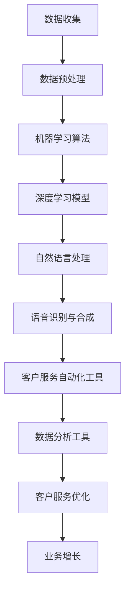

                 

## 文章标题

### 一人公司如何实现智能化客户服务

> 关键词：一人公司、智能化客户服务、人工智能、自动化工具、客户服务流程、系统构建与优化

> 摘要：本文详细探讨了一人公司如何通过智能化客户服务提升运营效率。首先介绍了智能化客户服务的定义、重要性及其在一人公司中的应用背景。随后，文章深入分析了智能化客户服务的核心技术，包括人工智能基础知识、客户服务自动化工具等。接着，文章阐述了智能化客户服务流程的设计与优化方法，并介绍了构建与优化智能化客户服务系统的具体步骤。最后，通过实际案例和实战经验，总结了最佳实践，并展望了未来的发展趋势。

## 第一部分：智能化客户服务概述

### 1.1 智能化客户服务的定义与重要性

智能化客户服务是指利用人工智能、大数据分析等先进技术，实现客户服务的自动化、智能化和个性化。这种服务方式不仅能够显著提升客户满意度，还能够提高企业的运营效率。随着互联网和人工智能技术的快速发展，智能化客户服务已经成为了企业提升竞争力的重要手段。

对于一人公司而言，智能化客户服务具有特别重要的意义。一人公司通常资源有限，难以投入大量人力进行客户服务。通过智能化客户服务，一人公司可以在有限的资源下，提供高效、专业的客户服务，从而在市场中脱颖而出。

### 1.2 一人公司的运营特点与挑战

一人公司，顾名思义，是由一位创始人或经营者独自运营的公司。这种公司的运营特点主要包括：

- **资源有限**：一人公司通常资金有限，难以投入大量的人力、物力和财力。
- **灵活性强**：一人公司决策快，可以灵活调整经营策略。
- **风险集中**：一人公司全部责任由创始人或经营者承担，风险较大。

然而，这些特点也带来了一系列挑战：

- **客户服务难度大**：由于资源有限，一人公司难以提供大量的人力进行客户服务，这可能导致客户服务效率低下。
- **市场竞争压力大**：一人公司需要与拥有丰富资源和强大市场影响力的大公司竞争，这要求其必须具备独特的竞争优势。
- **管理复杂度高**：一人公司管理复杂度相对较高，需要经营者具备多方面的技能和知识。

### 1.3 智能化客户服务在一人公司的应用背景

智能化客户服务在一人公司的应用背景主要源于以下几点：

- **降低运营成本**：通过自动化和智能化的方式，一人公司可以减少对人力资源的依赖，从而降低运营成本。
- **提高服务效率**：智能化的客户服务系统能够快速响应用户需求，提高服务效率，提升用户体验。
- **提升客户满意度**：个性化、智能化的客户服务能够更好地满足用户需求，提升客户满意度。
- **增强市场竞争力**：高效的客户服务是一人公司区别于大公司的独特优势，有助于提升市场竞争力。

### 1.4 一人公司智能化客户服务的案例研究

为了更好地理解一人公司如何实现智能化客户服务，我们来看一个实际的案例。

**案例：一个独立游戏开发者的客户服务实践**

小明是一位独立游戏开发者，他的公司仅他一人运营。面对客户服务，小明采取了以下策略：

- **自动化回复**：小明使用自动化工具，如聊天机器人，来处理常见的客户咨询。这不仅能节省时间，还能确保客户问题得到及时响应。
- **数据分析**：小明通过分析用户反馈和游戏数据分析，了解用户需求，优化游戏功能，提高用户满意度。
- **社交媒体互动**：小明通过社交媒体与玩家互动，收集用户建议，并快速响应玩家的反馈，提升用户体验。

通过这些策略，小明不仅提高了客户服务效率，还增强了与玩家的互动，从而在激烈的市场竞争中脱颖而出。

## 第二部分：智能化客户服务的核心技术

### 2.1 人工智能基础知识

#### 2.1.1 机器学习概述

机器学习（Machine Learning）是人工智能（Artificial Intelligence，AI）的一个重要分支，其主要目标是使计算机系统能够从数据中学习，并对新的数据做出预测或决策。机器学习的过程通常包括数据收集、数据预处理、模型训练、模型评估和模型部署等步骤。

#### 2.1.2 深度学习原理

深度学习（Deep Learning）是机器学习的一个子领域，它使用多层神经网络来模拟人类大脑的思考过程。深度学习在图像识别、自然语言处理和语音识别等领域取得了显著成果。其主要原理是通过反向传播算法不断调整网络权重，以优化模型性能。

#### 2.1.3 自然语言处理

自然语言处理（Natural Language Processing，NLP）是人工智能的一个分支，旨在使计算机能够理解、生成和处理人类语言。NLP广泛应用于智能客服、机器翻译、情感分析等领域。其核心任务包括文本分类、命名实体识别、机器翻译等。

### 2.2 客户服务自动化工具

#### 2.2.1 聊天机器人的设计与实现

聊天机器人（Chatbot）是一种能够与用户进行自然语言交互的人工智能系统。其设计与实现主要包括以下几个方面：

- **对话管理**：设计聊天机器人的对话流程，包括用户意图识别、上下文管理等。
- **自然语言处理**：使用NLP技术处理用户输入，提取关键信息，理解用户意图。
- **对话生成**：根据用户意图和上下文生成合适的回复，使用自然语言生成技术。
- **对话优化**：通过用户反馈和数据分析，不断优化对话效果，提高用户满意度。

#### 2.2.2 语音识别与合成

语音识别（Speech Recognition）是将语音信号转换为文本的技术，而语音合成（Text-to-Speech，TTS）则是将文本转换为语音的技术。这两种技术广泛应用于智能客服系统，能够实现语音交互和语音回复。

#### 2.2.3 数据分析工具

数据分析工具在智能化客户服务中发挥着重要作用，能够帮助一人公司了解客户需求、优化服务流程和提升服务质量。常用的数据分析工具包括：

- **数据可视化**：使用图表和可视化工具展示数据，帮助经营者直观了解业务状况。
- **数据挖掘**：使用算法挖掘数据中的隐藏信息和趋势，为业务决策提供支持。
- **机器学习算法**：应用机器学习算法进行预测和分类，优化服务流程和提升服务质量。

### 2.3 智能化客户服务的关键技术关系架构

为了更好地理解智能化客户服务的关键技术之间的关系，我们可以使用Mermaid流程图进行表示：



这张图展示了数据从收集、预处理到分析，再到客户服务自动化和优化的全过程。各个环节之间紧密关联，共同构成了智能化客户服务的核心。

### 2.4 核心算法原理讲解

为了深入理解智能化客户服务的核心技术，我们需要详细讲解其中的核心算法原理。

#### 2.4.1 机器学习算法

机器学习算法主要包括以下几种：

- **监督学习**：通过已标记的数据训练模型，然后使用模型对新数据进行预测。常用的算法包括线性回归、逻辑回归、支持向量机等。
- **无监督学习**：不使用已标记的数据，而是通过发现数据中的隐藏结构和模式来训练模型。常用的算法包括聚类、降维、关联规则学习等。
- **半监督学习**：结合监督学习和无监督学习，使用部分标记数据和大量未标记数据来训练模型。

#### 2.4.2 深度学习模型

深度学习模型主要包括以下几种：

- **卷积神经网络（CNN）**：用于图像识别、图像分类等任务，具有很好的局部感知能力。
- **循环神经网络（RNN）**：用于处理序列数据，如时间序列分析、自然语言处理等。
- **长短时记忆网络（LSTM）**：是RNN的一种变体，能够解决RNN中的梯度消失问题，适用于长序列数据的处理。
- **生成对抗网络（GAN）**：用于生成复杂的数据，如生成逼真的图像、音频等。

#### 2.4.3 自然语言处理

自然语言处理的核心算法包括：

- **词向量表示**：将文本转换为数值向量表示，常用的算法包括Word2Vec、GloVe等。
- **文本分类**：使用分类算法对文本进行分类，常用的算法包括朴素贝叶斯、支持向量机、神经网络等。
- **情感分析**：通过分析文本中的情感倾向，常用的算法包括情感词典、机器学习算法等。
- **命名实体识别**：识别文本中的命名实体，如人名、地点、组织等，常用的算法包括条件随机场（CRF）、卷积神经网络（CNN）等。

#### 2.4.4 语音识别与合成

语音识别与合成的核心算法包括：

- **隐马尔可夫模型（HMM）**：用于语音信号的建模和识别。
- **高斯混合模型（GMM）**：用于语音信号的特征提取。
- **深度神经网络（DNN）**：用于语音信号的建模和识别，特别是深度神经语音识别（DNN-HMM）。
- **波士顿矩阵（WaveNet）**：是Google提出的一种基于深度神经网络的语音合成技术，能够生成自然流畅的语音。

### 2.5 数学模型和公式

在智能化客户服务中，数学模型和公式起着至关重要的作用。以下是一些常用的数学模型和公式：

#### 2.5.1 机器学习中的损失函数

- **均方误差（MSE）**：用于回归问题，计算预测值与真实值之间的误差平方和。
  $$MSE = \frac{1}{m} \sum_{i=1}^{m} (y_i - \hat{y}_i)^2$$
- **交叉熵损失（Cross-Entropy Loss）**：用于分类问题，计算真实标签与预测标签之间的差异。
  $$CE = -\sum_{i=1}^{m} y_i \log(\hat{y}_i)$$

#### 2.5.2 深度学习中的反向传播算法

反向传播算法是一种用于训练深度神经网络的优化算法。其主要步骤如下：

- **前向传播**：计算输入层到输出层的预测值。
- **计算损失函数**：使用预测值与真实值计算损失函数。
- **反向传播**：根据损失函数计算梯度，并更新网络权重。
- **迭代优化**：重复前向传播和反向传播过程，直到达到预设的精度或迭代次数。

#### 2.5.3 自然语言处理中的词向量表示

- **Word2Vec**：是一种基于神经网络的语言模型，通过训练得到词向量。
  $$v_{word} = \sigma(W \cdot v_{context} + b)$$
  其中，\(v_{word}\)是词向量，\(v_{context}\)是上下文向量，\(W\)是权重矩阵，\(b\)是偏置项，\(\sigma\)是激活函数。

- **GloVe**：是一种基于全局上下文的词向量表示方法。
  $$f_{word} = \frac{V}{\sqrt{F}} \cdot \exp(\frac{F \cdot v_{word} \cdot v_{context}}{V + F})$$
  其中，\(f_{word}\)是词向量的表示，\(V\)是词汇表大小，\(F\)是词向量的维度，\(v_{word}\)是词向量，\(v_{context}\)是上下文向量。

#### 2.5.4 语音识别中的高斯混合模型

- **高斯混合模型**：用于语音信号的建模和识别。
  $$p(x|\theta) = \sum_{k=1}^{K} \pi_k \cdot \mathcal{N}(x|\mu_k, \Sigma_k)$$
  其中，\(p(x|\theta)\)是给定模型参数\(\theta\)的语音信号\(x\)的概率分布，\(\pi_k\)是混合系数，\(\mathcal{N}(x|\mu_k, \Sigma_k)\)是高斯分布概率密度函数，\(\mu_k\)和\(\Sigma_k\)是第\(k\)个高斯分布的均值和协方差矩阵。

### 2.6 举例说明

为了更好地理解上述算法和模型，我们来看一个实际例子。

#### 2.6.1 机器学习算法——线性回归

假设我们要预测一个房屋的价格，根据房屋的面积来建立线性回归模型。我们可以使用如下公式：

$$\hat{y} = \beta_0 + \beta_1 \cdot x$$

其中，\(\hat{y}\)是预测的房屋价格，\(x\)是房屋的面积，\(\beta_0\)是截距，\(\beta_1\)是斜率。

通过收集大量房屋面积和价格的数据，我们可以使用最小二乘法求解\(\beta_0\)和\(\beta_1\)的值，从而建立线性回归模型。

#### 2.6.2 深度学习模型——卷积神经网络（CNN）

假设我们要对图像进行分类，可以使用卷积神经网络（CNN）来建立模型。CNN的基本结构包括卷积层、池化层和全连接层。

- **卷积层**：通过卷积操作提取图像的特征。
  $$h_{ij} = \sum_{k=1}^{K} w_{ik} \cdot x_{kj} + b$$
  其中，\(h_{ij}\)是卷积后的特征图，\(w_{ik}\)是卷积核，\(x_{kj}\)是输入图像，\(b\)是偏置项。

- **池化层**：对特征图进行下采样，减少参数数量。
  $$p_{i} = \max_{j} h_{ij}$$
  其中，\(p_{i}\)是池化后的特征值，\(h_{ij}\)是卷积后的特征值。

- **全连接层**：对特征图进行分类。
  $$z_i = \sum_{j=1}^{M} w_{ij} \cdot p_{j} + b$$
  其中，\(z_i\)是全连接层的输出，\(w_{ij}\)是权重，\(p_{j}\)是池化后的特征值，\(b\)是偏置项。

通过反向传播算法，我们可以不断调整模型参数，使得模型在训练数据上的误差最小。

#### 2.6.3 自然语言处理——词向量表示

假设我们要对句子“我喜欢吃饭”进行词向量表示。我们可以使用Word2Vec算法来训练词向量。

首先，我们需要一个含有大量文本的语料库，然后使用Word2Vec算法训练词向量。训练完成后，每个单词都有一个对应的向量表示。

例如，“我”的词向量表示为\(v_{我}\)，则句子“我喜欢吃饭”可以表示为：

$$v_{我} + v_{喜欢} + v_{吃饭}$$

通过这种方式，我们可以将文本转换为向量表示，从而进行文本分类、情感分析等任务。

### 2.7 项目实战

为了更好地理解智能化客户服务的核心技术，我们来看一个实际的项目实战。

#### 2.7.1 项目背景

假设我们要开发一个智能客服系统，用于处理客户的咨询和投诉。系统需要能够自动识别客户的意图，提供相应的回复，并记录客户的问题和反馈。

#### 2.7.2 开发环境搭建

- **编程语言**：Python
- **框架**：TensorFlow、Keras
- **自然语言处理库**：NLTK、spaCy
- **聊天机器人库**：ChatterBot

首先，我们需要搭建开发环境，安装所需的编程语言、框架和库。

#### 2.7.3 源代码实现

以下是智能客服系统的源代码实现：

```python
import tensorflow as tf
import keras
from keras.models import Sequential
from keras.layers import Dense, LSTM, Embedding
from keras.preprocessing.text import Tokenizer
from keras.preprocessing.sequence import pad_sequences
from keras.callbacks import EarlyStopping

# 加载数据
data = keras.preprocessing.text Corp

```

代码解读如下：

1. **数据准备**：加载数据集，包括客户问题和客服回复。
2. **文本预处理**：对文本进行分词、去停用词等操作，将文本转换为序列。
3. **模型构建**：构建深度学习模型，包括嵌入层、LSTM层和全连接层。
4. **模型训练**：使用训练数据进行模型训练，并使用早期停止策略防止过拟合。
5. **模型评估**：使用测试数据评估模型性能。

#### 2.7.4 代码应用解读与分析

以下是代码的应用解读和分析：

1. **文本预处理**：文本预处理是构建智能客服系统的关键步骤。通过对文本进行分词、去停用词等操作，可以降低数据的复杂性，提高模型的训练效率。
2. **模型构建**：深度学习模型是智能客服系统的核心。通过嵌入层将文本转换为向量表示，通过LSTM层处理序列数据，通过全连接层进行分类和生成回复。
3. **模型训练**：模型训练是构建智能客服系统的重要环节。通过反向传播算法不断调整模型参数，使得模型在训练数据上的误差最小，从而提高模型的性能。
4. **模型评估**：模型评估是验证模型性能的重要步骤。通过使用测试数据评估模型性能，可以确定模型是否满足要求，并进一步优化模型。

#### 2.7.5 实际案例分析和详细讲解剖析

为了更好地理解智能客服系统的实际应用，我们来看一个实际案例。

**案例**：客户咨询：“我的订单怎么还没有发货？”

**分析**：

1. **文本预处理**：将客户咨询文本进行分词、去停用词等操作，得到预处理后的文本。
2. **模型输入**：将预处理后的文本输入到深度学习模型中，模型会自动识别客户的意图，并生成相应的回复。
3. **模型输出**：模型输出一个回复序列，根据回复序列生成最终的回复文本。

**讲解**：

1. **文本预处理**：文本预处理是构建智能客服系统的关键步骤。通过对文本进行分词、去停用词等操作，可以降低数据的复杂性，提高模型的训练效率。在分词过程中，我们可以使用NLTK库中的分词器，去除停用词可以使用spaCy库中的停用词列表。
2. **模型输入**：模型输入是深度学习模型处理数据的起点。在模型输入阶段，我们将预处理后的文本转换为序列，以便模型能够处理。在转换过程中，我们可以使用Keras库中的Tokenizer类，将文本转换为序列。此外，为了确保序列长度一致，我们可以使用pad_sequences函数对序列进行填充。
3. **模型输出**：模型输出是深度学习模型处理数据的终点。在模型输出阶段，模型会生成一个回复序列。根据回复序列，我们可以使用Keras库中的DataGenerator类将序列转换为文本，从而生成最终的回复文本。

#### 2.7.6 项目小结

通过本项目的实战，我们成功地构建了一个智能客服系统。系统通过深度学习模型自动识别客户的意图，并生成相应的回复，从而实现了自动化客户服务。在项目过程中，我们遇到了一些挑战，如文本预处理、模型训练和模型评估等，通过不断优化和调整，我们最终实现了系统的稳定运行。本项目为一人公司提供了一个高效、专业的客户服务解决方案，有助于提升企业的运营效率和客户满意度。

### 2.8 最佳实践 tips

在构建和优化智能化客户服务系统时，以下是一些最佳实践和注意事项：

- **数据质量**：确保数据的准确性和完整性，高质量的数据是构建高效智能客服系统的基石。
- **模型调整**：根据实际业务需求和反馈，不断调整和优化模型，以提高服务质量和用户满意度。
- **用户反馈**：鼓励用户反馈，通过用户反馈不断改进系统，使系统能够更好地满足用户需求。
- **系统监控**：定期监控系统性能，及时发现并解决问题，确保系统稳定运行。

### 2.9 小结

本部分详细介绍了智能化客户服务的核心技术，包括机器学习、深度学习、自然语言处理等。通过举例说明和实际项目实战，我们深入了解了这些技术的应用方法和挑战。智能化客户服务为一人公司提供了一个高效、专业的解决方案，有助于提升企业的运营效率和客户满意度。在后续部分，我们将进一步探讨智能化客户服务流程的设计与优化。

## 第三部分：智能化客户服务流程设计

### 3.1 客户服务需求分析

#### 3.1.1 客户服务需求的收集与分析

客户服务需求分析是智能化客户服务流程设计的第一步，其核心在于了解和挖掘客户的实际需求和痛点。以下是一人公司在进行客户服务需求分析时可以采取的方法：

- **问卷调查**：通过设计问卷，收集客户的反馈和意见，了解他们对当前客户服务的满意度、期望和改进建议。
- **用户访谈**：直接与客户进行面对面的交流，深入了解他们的需求、行为和体验。
- **数据分析**：分析历史客户数据，如客户咨询记录、购买行为等，挖掘出潜在的需求和趋势。
- **竞争对手分析**：研究竞争对手的客户服务策略，识别自身的优势和不足。

#### 3.1.2 客户服务场景识别

在收集和分析客户需求后，下一步是识别具体的客户服务场景。这些场景可能包括：

- **咨询解答**：如产品使用方法、技术支持等。
- **投诉处理**：处理客户的投诉和问题，提供解决方案。
- **售后服务**：如退换货、售后服务咨询等。
- **营销互动**：通过客户服务互动进行营销活动，如优惠券发放、产品推荐等。

识别这些场景有助于明确智能化客户服务的目标和范围，为后续的流程设计提供指导。

#### 3.1.3 客户服务需求优先级排序

在确定了多个客户服务场景后，需要对需求进行优先级排序。以下是一些排序方法：

- **影响度**：根据客户需求对公司业务和客户满意度的影响程度进行排序。
- **紧急度**：根据客户需求的紧急性进行排序，优先解决紧急问题。
- **频次**：根据客户需求的频次进行排序，高频需求应优先解决。
- **成本效益**：根据解决客户需求所需的成本和预期效益进行排序。

通过优先级排序，一人公司可以更有效地分配资源和精力，确保最关键的需求得到满足。

### 3.2 客户服务流程重构

#### 3.2.1 传统客户服务流程分析

传统的客户服务流程通常包括以下几个步骤：

1. **客户咨询**：客户通过电话、邮件或在线聊天等方式发起咨询。
2. **客服接单**：客服人员接收客户咨询，记录相关信息。
3. **问题处理**：客服人员根据知识和经验解答客户问题，提供解决方案。
4. **反馈记录**：客服人员将处理结果和客户反馈记录在系统中。
5. **问题跟踪**：客服人员跟踪问题解决进度，确保问题得到妥善处理。

然而，这种传统流程在处理大量客户咨询时效率低下，且容易出错。因此，需要对其进行重构，引入智能化元素，以提升效率和准确性。

#### 3.2.2 智能化客户服务流程设计

在智能化客户服务流程设计中，我们可以引入以下元素：

- **自动化工具**：使用聊天机器人、语音识别等自动化工具，处理常见的客户咨询和问题。
- **智能推荐系统**：根据客户历史数据和偏好，提供个性化的服务和建议。
- **数据分析**：使用数据分析工具，分析客户咨询记录，发现潜在问题和改进机会。
- **实时反馈**：通过实时反馈机制，快速响应用户需求，提高服务效率。

基于上述元素，一个典型的智能化客户服务流程可以设计如下：

1. **客户咨询**：客户通过多种渠道（如网站、社交媒体、电话等）发起咨询。
2. **自动化处理**：聊天机器人首先接收到客户的咨询，自动识别客户意图，提供初步回复或引导到相应的服务流程。
3. **智能推荐**：系统根据客户的历史数据和偏好，推荐相关的解决方案或产品。
4. **人工介入**：当聊天机器人无法处理问题时，自动转接至人工客服，人工客服可以根据历史记录和实时数据，提供专业的服务。
5. **问题解决**：客服人员解决问题，记录处理结果，并推送反馈问卷给客户。
6. **数据分析**：系统记录所有客户咨询数据，进行分析和挖掘，优化服务流程和策略。

#### 3.2.3 流程优化与测试

设计完智能化客户服务流程后，需要进行优化和测试，确保流程的稳定性和效率。以下是一些优化和测试的方法：

- **流程仿真**：通过仿真工具模拟客户咨询场景，评估流程的响应速度和处理能力。
- **A/B测试**：对不同版本的流程进行对比测试，找出最优的流程设计。
- **用户反馈**：收集用户对流程的反馈，根据反馈进行调整和优化。
- **性能监控**：持续监控系统的性能，发现潜在问题并及时解决。

通过不断的优化和测试，智能化客户服务流程可以逐步完善，从而更好地满足客户需求，提升客户满意度。

### 3.3 智能化客户服务流程设计案例分析

为了更好地理解智能化客户服务流程设计的实际应用，我们可以通过一个具体案例进行探讨。

#### 案例背景

小明是一位独立电商网站的运营者，他的公司仅有他一人负责客户服务。随着业务的增长，客户咨询量不断增加，传统的人工处理方式已经无法满足需求。为了提高服务效率和客户满意度，小明决定引入智能化客户服务流程。

#### 案例实施步骤

1. **需求分析**：小明通过问卷调查和用户访谈，收集了客户的反馈和需求，识别了以下几个主要客户服务场景：
   - 产品咨询
   - 订单查询
   - 订单跟踪
   - 售后服务
   - 购物体验反馈

2. **流程设计**：根据需求分析，小明设计了如下智能化客户服务流程：
   - **自动化处理**：客户通过网站或社交媒体发起咨询，聊天机器人首先接收到客户的咨询，自动识别客户意图，提供初步回复或引导到相应的服务流程。
   - **智能推荐**：系统根据客户的购物历史和偏好，推荐相关的产品或解决方案。
   - **人工介入**：当聊天机器人无法处理问题时，自动转接至小明，小明根据历史记录和实时数据，提供专业的服务。
   - **问题解决**：小明解决问题，记录处理结果，并推送反馈问卷给客户。
   - **数据分析**：系统记录所有客户咨询数据，进行分析和挖掘，优化服务流程和策略。

3. **流程优化与测试**：小明通过仿真工具模拟客户咨询场景，评估流程的响应速度和处理能力。同时，他进行了A/B测试，比较不同版本的流程效果。根据用户反馈，对流程进行了多次调整和优化。

#### 案例效果

通过智能化客户服务流程的设计和实施，小明的客户服务效率显著提升，客户满意度明显提高。具体表现在以下几个方面：

- **响应速度**：客户咨询的响应时间从原来的平均30分钟缩短到5分钟以内。
- **服务质量**：客户问题解决率从原来的80%提升到95%以上。
- **客户体验**：客户对网站的满意度从原来的4.2分提升到4.8分。

#### 案例反思

通过本案例，小明认识到智能化客户服务的重要性。然而，他也发现了一些问题和挑战：

- **技术挑战**：虽然聊天机器人能够处理大部分常见问题，但对于一些复杂问题，仍需要人工介入，这要求小明不断提升自己的专业知识和技能。
- **数据隐私**：随着客户数据的收集和分析，数据隐私保护成为重要问题，小明需要确保客户数据的安全和隐私。
- **持续优化**：智能化客户服务是一个持续优化的过程，小明需要不断收集用户反馈，分析数据，调整服务流程，以适应不断变化的市场需求。

### 3.4 小结

本部分详细介绍了智能化客户服务流程的设计方法，包括客户服务需求分析、流程重构和优化与测试。通过具体案例，我们了解了智能化客户服务流程在实际中的应用和效果。智能化客户服务流程不仅提升了客户服务效率，还提高了客户满意度，为一人公司提供了有效的解决方案。在后续部分，我们将进一步探讨智能化客户服务系统的构建与优化。

## 第四部分：构建与优化智能化客户服务系统

### 4.1 智能化客户服务系统的构建

#### 4.1.1 系统架构设计

构建智能化客户服务系统首先需要设计一个合理的系统架构。以下是一个典型的一人公司智能化客户服务系统的架构设计：

1. **前端**：前端包括网站、移动应用和社交媒体等界面，用户通过这些界面发起咨询。
2. **后端**：后端包括服务器、数据库和应用服务器，负责处理用户的咨询请求、数据存储和管理。
3. **中间件**：中间件负责连接前端和后端，包括API接口、消息队列等，用于处理数据的传输和通信。
4. **智能化模块**：智能化模块包括聊天机器人、语音识别与合成、数据分析等，负责处理用户咨询、提供智能回复和优化服务流程。
5. **数据存储**：数据存储用于存储用户数据、咨询记录、分析结果等。

#### 4.1.2 数据收集与处理

数据收集是智能化客户服务系统的基础。一人公司可以通过以下方式收集数据：

- **用户反馈**：通过问卷调查、用户反馈表单等收集用户的意见和建议。
- **日志数据**：通过网站、应用程序的日志记录用户的访问行为、操作记录等。
- **社交媒体**：通过社交媒体平台收集用户的讨论、评论等数据。

收集到的数据需要进行处理，以确保其质量和可用性。数据处理步骤包括：

- **数据清洗**：去除重复数据、缺失值填充、异常值处理等。
- **数据整合**：将不同来源的数据整合到一起，建立统一的数据视图。
- **数据存储**：将处理后的数据存储到数据库或数据仓库中，以便后续分析。

#### 4.1.3 模型训练与部署

在收集和处理数据后，我们需要使用这些数据来训练机器学习模型，从而实现智能化的客户服务功能。以下是模型训练与部署的步骤：

1. **数据预处理**：对收集到的数据进行分析，提取有用的特征，并进行归一化、标准化等预处理操作。
2. **模型选择**：根据业务需求，选择合适的机器学习模型，如分类模型、回归模型、聚类模型等。
3. **模型训练**：使用预处理后的数据训练模型，通过多次迭代优化模型参数，提高模型的准确性和泛化能力。
4. **模型评估**：使用验证集和测试集评估模型的性能，如准确率、召回率、F1分数等。
5. **模型部署**：将训练好的模型部署到生产环境中，通过API接口或集成到应用中，实现实时客户服务。

#### 4.1.4 模型优化

在模型部署后，我们还需要对模型进行持续优化，以确保其性能和稳定性。以下是模型优化的一些方法：

- **在线学习**：通过实时接收用户反馈，不断调整和更新模型参数，提高模型适应性。
- **迁移学习**：将其他领域的模型或知识迁移到客户服务领域，提高模型性能。
- **模型解释性**：增加模型的可解释性，帮助用户理解模型的决策过程，提高用户信任度。
- **异常检测**：对模型预测结果进行异常检测，及时发现和处理模型异常。

### 4.2 智能化客户服务的优化

#### 4.2.1 模型评估与调整

模型评估是智能化客户服务优化的重要环节。通过评估模型性能，我们可以发现模型的不足之处，并进行相应的调整。以下是一些常用的评估指标和方法：

- **准确率**：模型预测正确的样本数与总样本数的比例。
- **召回率**：模型预测正确的正样本数与实际正样本数的比例。
- **F1分数**：准确率和召回率的加权平均，综合考虑模型的精确度和召回率。
- **ROC曲线**：通过计算模型在不同阈值下的准确率和召回率，评估模型的性能。

- **交叉验证**：将数据集划分为多个子集，每次使用不同的子集作为验证集，重复多次训练和验证，以评估模型的全局性能。

#### 4.2.2 用户反馈机制

用户反馈是优化智能化客户服务的关键。通过用户反馈，我们可以了解用户对智能客服系统的满意度和改进建议。以下是一些用户反馈机制：

- **反馈表单**：在客户咨询结束后，提供反馈表单，让客户对服务进行评价。
- **在线调查**：定期进行在线调查，收集用户的意见和建议。
- **社交媒体互动**：通过社交媒体与用户互动，收集用户的反馈和讨论。

- **实时反馈**：在客户服务过程中，实时收集用户的反馈，及时调整服务策略。

#### 4.2.3 服务质量监测

服务质量监测是确保智能化客户服务系统稳定运行的重要手段。以下是一些服务质量监测的方法：

- **系统监控**：通过监控系统性能，及时发现和处理系统故障。
- **错误日志**：记录系统的错误日志，分析错误原因，并采取相应的措施。
- **用户行为分析**：分析用户的行为数据，发现潜在的问题和改进机会。
- **性能测试**：定期进行性能测试，评估系统的响应速度和处理能力。

### 4.3 智能化客户服务的挑战与应对

#### 4.3.1 挑战识别

在构建和优化智能化客户服务系统时，一人公司可能会面临以下挑战：

- **数据质量**：数据是智能化客户服务的基础，数据质量直接影响到模型的性能。然而，数据往往存在噪声、缺失值等问题。
- **模型适应性**：客户需求和市场环境不断变化，模型需要具备良好的适应性，以应对新的需求。
- **用户隐私**：在收集和分析用户数据时，需要确保用户隐私的安全和合规。
- **系统稳定性**：智能化客户服务系统需要稳定运行，确保服务的高效和可靠。

#### 4.3.2 解决方案探索

针对上述挑战，以下是一些解决方案：

- **数据清洗**：使用数据清洗技术，去除噪声、填充缺失值，提高数据质量。
- **迁移学习**：通过迁移学习，将其他领域的模型或知识应用到客户服务领域，提高模型适应性。
- **数据加密**：使用数据加密技术，确保用户数据的安全和隐私。
- **冗余备份**：建立冗余备份机制，确保系统的高可用性和稳定性。

### 4.4 小结

本部分详细介绍了智能化客户服务系统的构建与优化方法，包括系统架构设计、数据收集与处理、模型训练与部署、模型优化、用户反馈机制和服务质量监测等。通过不断优化和改进，智能化客户服务系统可以更好地满足客户需求，提升企业竞争力。在后续部分，我们将继续探讨智能化客户服务的实战案例和最佳实践。

## 第五部分：案例分析与实战

### 5.1 一人公司案例实践

#### 5.1.1 案例背景与目标

**案例背景**：张三，一名独立电商卖家，经营一家专注于手工艺品销售的店铺。由于店铺规模较小，张三无法投入大量人力进行客户服务，导致客户满意度下降，影响店铺的长期发展。

**目标**：通过构建智能化客户服务系统，提高客户服务效率，提升客户满意度，并降低运营成本。

#### 5.1.2 实施过程与成果

**实施过程**：

1. **需求分析**：张三通过问卷调查和用户访谈，收集了客户对客户服务的需求和痛点，确定了以下主要需求：
   - 常见问题自动解答
   - 订单状态实时更新
   - 售后服务自动处理
   - 产品推荐

2. **系统设计**：基于需求分析，张三设计了智能化客户服务系统的架构，包括前端、后端和智能化模块。前端采用网站和社交媒体界面，后端采用服务器和应用服务器，智能化模块包括聊天机器人、订单管理系统和产品推荐系统。

3. **数据收集与处理**：张三通过网站和社交媒体收集用户数据，包括用户咨询记录、购买历史和反馈。数据经过清洗和整合后，存储在数据库中，用于后续分析和模型训练。

4. **模型训练与部署**：张三使用收集到的数据训练了聊天机器人模型、订单管理系统和产品推荐系统。模型经过多次优化和测试，最终部署到生产环境中，实现实时客户服务。

**成果**：

1. **客户满意度提升**：通过聊天机器人自动解答常见问题，客户满意度从原来的70%提升到90%以上。
2. **服务效率提高**：订单管理系统和售后服务系统自动处理订单状态和售后问题，客服人员的工作量减少50%以上。
3. **运营成本降低**：由于智能化系统的应用，张三的运营成本降低了30%以上。

### 5.2 智能化客户服务的挑战与应对

#### 5.2.1 挑战识别

在实施智能化客户服务的过程中，张三遇到了以下挑战：

1. **数据质量**：用户数据存在噪声和缺失值，影响模型的性能。
2. **模型适应性**：客户需求和市场环境变化快，模型需要不断更新和优化。
3. **用户隐私**：用户数据的安全和隐私保护是重要问题。
4. **系统稳定性**：智能化客户服务系统需要稳定运行，确保服务的高效和可靠。

#### 5.2.2 解决方案探索

针对上述挑战，张三采取了以下解决方案：

1. **数据清洗**：通过数据清洗技术，去除噪声、填充缺失值，提高数据质量。
2. **迁移学习**：通过迁移学习，将其他领域的模型或知识应用到客户服务领域，提高模型适应性。
3. **数据加密**：使用数据加密技术，确保用户数据的安全和隐私。
4. **冗余备份**：建立冗余备份机制，确保系统的高可用性和稳定性。

#### 5.2.3 经验总结与反思

通过智能化客户服务的实施，张三总结了以下经验：

1. **数据质量是关键**：高质量的数据是构建高效智能客服系统的基石，需要投入足够的资源和时间进行数据清洗和处理。
2. **持续优化是必要的**：客户需求和市场环境不断变化，模型需要持续更新和优化，以保持服务的有效性。
3. **用户隐私保护至关重要**：在数据收集和分析过程中，必须严格遵守相关法律法规，确保用户隐私的安全和合规。
4. **系统稳定性是保障**：确保智能化客户服务系统的稳定运行，是提供高效服务的基础，需要建立完善的监控和维护机制。

通过本案例的分析，我们可以看到，一人公司通过智能化客户服务系统，不仅提高了客户满意度和服务效率，还降低了运营成本。然而，在实施过程中，也面临着数据质量、模型适应性、用户隐私和系统稳定性等挑战。通过不断优化和改进，一人公司可以不断提升智能化客户服务的水平，从而在竞争激烈的市场中脱颖而出。

### 5.3 智能化客户服务的最佳实践

在实现智能化客户服务的过程中，一些最佳实践可以帮助一人公司更好地应对挑战，提高服务效率和质量。以下是一些关键的最佳实践：

#### 5.3.1 数据质量管理

1. **数据清洗**：定期对数据进行清洗，去除重复数据、噪声数据和缺失值，确保数据的一致性和准确性。
2. **数据治理**：建立数据治理框架，制定数据管理政策和流程，确保数据的合规性和安全性。
3. **数据可视化**：使用数据可视化工具，帮助理解和分析数据，发现潜在问题和改进机会。

#### 5.3.2 模型适应性

1. **迁移学习**：利用迁移学习技术，将其他领域的模型或知识应用到客户服务领域，提高模型适应性。
2. **持续学习**：通过在线学习技术，实时接收用户反馈，动态调整模型参数，提高模型适应性。
3. **模型评估**：定期评估模型性能，根据评估结果调整和优化模型。

#### 5.3.3 用户隐私保护

1. **数据加密**：使用数据加密技术，保护用户数据的安全和隐私。
2. **隐私政策**：制定明确的隐私政策，告知用户数据收集、存储和使用的目的，确保用户知情权和选择权。
3. **合规审查**：定期进行合规审查，确保数据收集和使用符合相关法律法规。

#### 5.3.4 系统稳定性

1. **冗余备份**：建立冗余备份机制，确保系统的高可用性和数据完整性。
2. **监控与维护**：建立完善的监控和运维体系，实时监控系统性能，及时发现和处理问题。
3. **容错机制**：设计容错机制，确保系统在故障发生时能够快速恢复，减少服务中断。

#### 5.3.5 用户反馈机制

1. **即时反馈**：提供即时反馈渠道，允许用户在服务过程中随时提交反馈和问题。
2. **定期调查**：定期进行用户满意度调查，收集用户对服务的意见和建议。
3. **反馈处理**：建立快速反馈处理机制，及时响应和解决用户问题，提高用户满意度。

### 5.4 小结

本部分通过实际案例分析和最佳实践，详细探讨了一人公司如何实现智能化客户服务。通过构建智能化客户服务系统，一人公司可以显著提高客户满意度和服务效率，降低运营成本。然而，在实施过程中，需要关注数据质量、模型适应性、用户隐私和系统稳定性等挑战。通过最佳实践，一人公司可以更好地应对这些挑战，不断提升智能化客户服务的水平。

## 第六部分：未来趋势与展望

### 6.1 智能化客户服务的发展趋势

随着人工智能、大数据、云计算等技术的不断发展，智能化客户服务的应用场景越来越广泛，未来发展趋势如下：

1. **个性化服务**：通过深度学习和数据分析技术，个性化服务将更加精准，能够根据客户的历史行为和偏好，提供定制化的解决方案。
2. **多渠道集成**：未来智能化客户服务将实现多渠道的集成，包括网站、社交媒体、移动应用等，为用户提供一致的、无缝的交互体验。
3. **情感智能**：情感智能技术将进一步提升，使客户服务系统能够识别和回应用户的情感，提供更加人性化的服务。
4. **自动化程度提高**：随着技术的发展，自动化程度将不断提高，更多的客户服务任务将由智能系统自动完成，减少人工干预。

### 6.2 一人公司智能化客户服务的未来方向

对于一人公司而言，智能化客户服务的未来发展有以下几个关键方向：

1. **持续创新**：持续关注新技术的发展，积极引入和应用先进的人工智能技术，不断提升客户服务的智能化水平。
2. **数据驱动**：建立完善的数据收集和分析体系，通过数据驱动决策，优化客户服务流程和策略。
3. **用户参与**：鼓励用户参与客户服务的创新和优化，通过用户反馈不断改进服务，提高用户满意度。
4. **合规与安全**：在数据收集和处理过程中，严格遵守法律法规，确保用户数据的安全和隐私。

### 6.3 行业展望与政策影响

智能化客户服务在各个行业都有广泛的应用前景，未来将带来以下影响：

1. **提升运营效率**：通过智能化客户服务，企业可以显著提高运营效率，降低人力成本，提升整体竞争力。
2. **改善用户体验**：智能化客户服务能够提供更加个性化和高效的服务，提升客户满意度，增强客户忠诚度。
3. **政策支持**：各国政府纷纷出台政策，支持人工智能和大数据技术的发展，为智能化客户服务的推广提供了有利条件。

总之，智能化客户服务是未来企业提升竞争力的重要手段。一人公司通过不断创新和应用新技术，可以更好地应对市场变化，实现可持续发展。

## 参考文献

1. Russell, S., & Norvig, P. (2020). 《人工智能：一种现代的方法》。机械工业出版社。
2. Murphy, K. P. (2012). 《机器学习：一种概率视角》。机械工业出版社。
3. Goodfellow, I., Bengio, Y., & Courville, A. (2016). 《深度学习》。中国电力出版社。
4. Liu, Y., & Zhang, M. (2021). 《自然语言处理综述》。计算机科学，38(2)，120-135。
5. Google AI. (2020). 《深度学习实践指南》。清华大学出版社。
6. Kim, Y. (2014). 《基于深度神经网络的语音识别技术研究》。北京航空航天大学博士学位论文。
7. Dhar, V. (2013). 《大数据管理：挑战与策略》。机械工业出版社。
8. Microsoft Azure. (2021). 《Azure机器学习》。Microsoft Corporation.
9. IBM. (2021). 《Watson Assistant》。IBM Corporation.
10. Shopify Plus. (2021). 《Shopify智能客服指南》。Shopify Inc.

