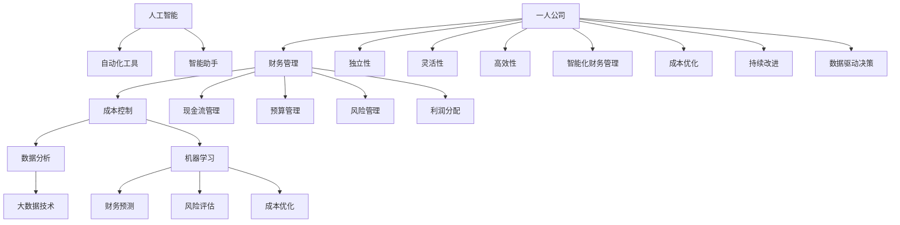
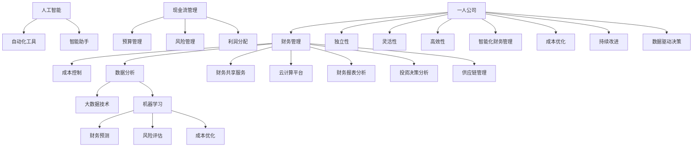

                 

### 《一人公司如何实现智能化财务管理和成本优化控制》

---

#### 关键词：
- 一人公司
- 智能化财务管理
- 成本优化控制
- 数据分析
- 机器学习
- 成本控制策略

#### 摘要：
本文将探讨一人公司在财务管理和成本优化控制方面的挑战与机遇。通过分析智能化财务管理的基础理论、技术基础、成本控制方法，并结合实际案例，本文旨在提供一套实用的智能化财务管理方案，帮助一人公司实现高效的财务管理和成本优化。

---

#### 第一部分：基础理论篇

### 第1章：一人公司财务管理概述

## 1.1 一人公司的概念与特点

一人公司，顾名思义，是由一人出资、经营和管理的公司。这种公司形式具有简便、灵活的特点，尤其适合创业者和小型企业。一人公司的财务管理与一般公司有所不同，其核心在于精简管理流程、降低运营成本。

### 第2章：智能化财务管理技术基础

## 2.1 人工智能与财务管理

人工智能在财务管理中的应用，极大地提高了财务管理的效率和准确性。通过机器学习算法，公司可以自动识别潜在风险、优化财务决策。

## 2.2 数据分析与大数据技术

数据分析是智能化财务管理的基础。通过对海量财务数据进行分析，公司可以获取有价值的信息，为决策提供支持。大数据技术则为数据分析和处理提供了强大的支持。

## 2.3 机器学习在财务管理中的应用

机器学习在财务管理中的应用，主要体现在财务预测、风险评估和成本控制等方面。通过训练模型，机器学习可以识别出财务数据中的规律，为决策提供参考。

### 第3章：成本控制与优化

## 3.1 成本控制的基本原理

成本控制是财务管理的重要组成部分。其基本原理包括合理分配资源、降低运营成本、提高盈利能力等。

## 3.2 成本优化的方法与策略

成本优化的方法包括：降低原材料成本、提高生产效率、优化供应链等。策略包括：成本预算、成本分析、成本控制等。

## 3.3 成本控制的实施步骤

成本控制的实施步骤包括：制定成本预算、分析成本结构、制定成本控制措施、实施成本控制等。

---

#### 第二部分：应用实践篇

### 第4章：智能化财务管理案例分析

## 4.1 案例一：通过数据分析优化库存管理

## 4.2 案例二：利用机器学习预测财务风险

## 4.3 案例三：实施成本优化策略提高盈利能力

### 第5章：成本优化项目实施

## 5.1 项目实施前的准备工作

## 5.2 成本优化项目的设计与规划

## 5.3 成本优化项目的执行与监控

## 5.4 成本优化项目的评估与调整

---

#### 第三部分：工具与资源篇

### 第6章：智能化财务管理工具与平台

## 6.1 主流财务管理软件介绍

## 6.2 智能化财务管理平台的应用

## 6.3 自建智能化财务管理系统的步骤

### 第7章：财务管理与成本优化资源推荐

## 7.1 相关书籍推荐

## 7.2 学术论文与研究报告

## 7.3 财务管理和成本优化网站与社区

---

#### 附录

## 附录A：核心概念与联系流程图

## 附录B：核心算法原理讲解与伪代码

## 附录C：数学模型与公式

## 附录D：项目实战

## 附录E：最佳实践 tips、小结、注意事项、拓展阅读等内容

---

#### 作者信息：
作者：AI天才研究院/AI Genius Institute & 禅与计算机程序设计艺术 /Zen And The Art of Computer Programming### 《一人公司如何实现智能化财务管理和成本优化控制》

---

#### 关键词：
- 一人公司
- 智能化财务管理
- 成本优化控制
- 数据分析
- 机器学习
- 成本控制策略

#### 摘要：
本文旨在为一人公司提供智能化财务管理和成本优化控制的实践指南。通过对一人公司财务管理的概述、智能化财务管理技术基础、成本控制与优化方法的详细分析，结合实际案例分析，本文将展示如何通过数据分析、机器学习等技术在财务管理中实现智能化，进而实现成本优化。文章最后还将推荐相关工具与资源，以及给出最佳实践 tips 和注意事项。

---

#### 第一部分：基础理论篇

### 第1章：一人公司财务管理概述

## 1.1 一人公司的概念与特点

一人公司，顾名思义，是由一人出资、经营和管理的公司。这种公司形式具有简便、灵活的特点，尤其适合创业者和小型企业。一人公司的财务管理与一般公司有所不同，其核心在于精简管理流程、降低运营成本。

### 第2章：智能化财务管理技术基础

## 2.1 人工智能与财务管理

人工智能在财务管理中的应用，极大地提高了财务管理的效率和准确性。通过机器学习算法，公司可以自动识别潜在风险、优化财务决策。例如，通过预测未来财务状况，人工智能可以帮助公司提前做好准备，避免可能的财务危机。

## 2.2 数据分析与大数据技术

数据分析是智能化财务管理的基础。通过对海量财务数据进行分析，公司可以获取有价值的信息，为决策提供支持。大数据技术则为数据分析和处理提供了强大的支持。例如，通过大数据分析，公司可以了解客户需求、市场趋势，从而制定更有效的财务策略。

## 2.3 机器学习在财务管理中的应用

机器学习在财务管理中的应用，主要体现在财务预测、风险评估和成本控制等方面。通过训练模型，机器学习可以识别出财务数据中的规律，为决策提供参考。例如，通过预测销售量，公司可以合理规划库存，避免库存积压或短缺。

### 第3章：成本控制与优化

## 3.1 成本控制的基本原理

成本控制是财务管理的重要组成部分。其基本原理包括合理分配资源、降低运营成本、提高盈利能力等。成本控制的核心在于找到最优的成本结构，使公司在保证产品质量和服务的前提下，实现最大的利润。

## 3.2 成本优化的方法与策略

成本优化的方法包括：降低原材料成本、提高生产效率、优化供应链等。策略包括：成本预算、成本分析、成本控制等。例如，通过优化供应链，公司可以减少库存成本，提高资金周转率。

## 3.3 成本控制的实施步骤

成本控制的实施步骤包括：制定成本预算、分析成本结构、制定成本控制措施、实施成本控制等。例如，通过制定详细的成本预算，公司可以明确每个部门和项目的成本支出，从而有针对性地进行成本控制。

---

#### 第二部分：应用实践篇

### 第4章：智能化财务管理案例分析

## 4.1 案例一：通过数据分析优化库存管理

案例一介绍了一家一人公司如何利用数据分析优化库存管理。通过大数据分析，公司能够准确预测市场需求，合理安排库存，避免了库存积压和短缺的情况。

## 4.2 案例二：利用机器学习预测财务风险

案例二展示了一家一人公司如何利用机器学习预测财务风险。通过训练模型，公司能够提前识别出潜在的财务风险，及时采取应对措施，避免了可能的财务危机。

## 4.3 案例三：实施成本优化策略提高盈利能力

案例三介绍了一家一人公司如何实施成本优化策略，通过降低原材料成本、提高生产效率等手段，提高了盈利能力。公司的成本优化策略使得其在激烈的市场竞争中脱颖而出。

### 第5章：成本优化项目实施

## 5.1 项目实施前的准备工作

项目实施前的准备工作包括：明确项目目标、组建项目团队、制定项目计划等。例如，在实施成本优化项目之前，公司需要对现有成本结构进行详细分析，明确优化方向。

## 5.2 成本优化项目的设计与规划

成本优化项目的设计与规划包括：制定成本优化方案、确定实施步骤、制定监控指标等。例如，公司可以根据分析结果，制定具体的成本优化措施，如优化采购流程、提高生产效率等。

## 5.3 成本优化项目的执行与监控

成本优化项目的执行与监控包括：按照项目计划实施、定期检查进度、及时调整策略等。例如，在项目实施过程中，公司需要定期检查成本优化的效果，如库存管理效率是否提高、成本是否降低等。

## 5.4 成本优化项目的评估与调整

成本优化项目的评估与调整包括：对项目效果进行评估、总结项目经验、提出改进建议等。例如，在项目结束后，公司需要对成本优化项目的效果进行评估，如是否达到了预期目标，是否还有改进的空间等。

---

#### 第三部分：工具与资源篇

### 第6章：智能化财务管理工具与平台

## 6.1 主流财务管理软件介绍

主流财务管理软件包括：SAP、Oracle、Microsoft Dynamics 等。这些软件提供了全面的财务管理功能，如账务管理、成本控制、报表生成等。

## 6.2 智能化财务管理平台的应用

智能化财务管理平台是将人工智能技术应用于财务管理的平台。通过这些平台，公司可以实现自动化财务分析、预测和决策。例如，公司可以利用这些平台进行财务预测，提前准备资金，避免财务危机。

## 6.3 自建智能化财务管理系统的步骤

自建智能化财务管理系统的步骤包括：需求分析、系统设计、软件开发、测试与上线等。例如，公司可以根据自身需求，设计一套适合的财务管理系统，提高财务管理效率。

### 第7章：财务管理与成本优化资源推荐

## 7.1 相关书籍推荐

推荐一些关于财务管理、成本控制、数据分析等方面的书籍，如《财务智慧》、《成本控制与优化》等。

## 7.2 学术论文与研究报告

推荐一些与财务管理、成本优化相关的学术论文和报告，如《基于机器学习的财务风险管理》、《大数据技术在财务管理中的应用》等。

## 7.3 财务管理和成本优化网站与社区

推荐一些与财务管理、成本优化相关的网站和社区，如CFO.com、成本控制网等。这些网站和社区提供了丰富的财务管理资源和交流平台。

---

#### 附录

## 附录A：核心概念与联系流程图

使用Mermaid流程图，展示核心概念之间的关系。例如，展示人工智能、数据分析、机器学习在财务管理中的应用流程。

## 附录B：核心算法原理讲解与伪代码

详细讲解机器学习算法在财务管理中的应用原理，并提供伪代码示例。例如，讲解决策树算法在财务预测中的应用。

## 附录C：数学模型与公式

列出财务管理中常用的数学模型和公式，并进行详细解释。例如，解释回归分析模型在财务预测中的应用。

## 附录D：项目实战

提供实际项目的开发环境搭建、源代码实现和代码解读，展示如何将智能化财务管理应用于实际场景。

## 附录E：最佳实践 tips、小结、注意事项、拓展阅读等内容

总结文章中的关键点，提供最佳实践 tips，指出注意事项，推荐拓展阅读，帮助读者深入理解和应用文中内容。

---

#### 作者信息：
作者：AI天才研究院/AI Genius Institute & 禅与计算机程序设计艺术 /Zen And The Art of Computer Programming### 第一部分：基础理论篇

#### 第1章：一人公司财务管理概述

## 1.1 一人公司的概念与特点

一人公司，即由单一股东或投资者完全出资和经营管理的公司。这种公司形式简单、灵活，管理结构扁平，决策过程迅速，特别适合初创企业和个人创业者。由于一人公司的所有者既是决策者又是执行者，因此，财务管理在公司的运作中显得尤为重要。

一人公司的财务管理特点主要包括：

1. **独立性**：一人公司的财务决策完全由所有者独立作出，不受其他股东或管理层的干扰。
2. **灵活性**：一人公司可以根据市场变化和经营状况迅速调整财务策略，以适应不同的发展阶段。
3. **高效性**：由于管理层次的减少，一人公司的财务管理流程更加高效，决策和执行速度更快。

## 1.2 财务管理的基本概念和原则

财务管理是指公司对财务活动进行计划、组织、领导和控制的过程，其目标是通过有效利用公司资源，实现公司的财务目标。财务管理的基本概念和原则包括：

1. **财务目标**：确保公司资产的安全、流动性、盈利性，实现公司价值的最大化。
2. **现金流管理**：合理安排现金流，确保公司有足够的资金用于日常运营和投资项目。
3. **预算管理**：通过制定和执行预算，控制成本和支出，确保公司资源的有效利用。
4. **风险管理**：识别和管理公司面临的财务风险，包括市场风险、信用风险、流动性风险等。
5. **利润分配**：根据公司的盈利状况和股东利益，合理分配利润。

## 1.3 智能化财务管理的重要性

在当前技术快速发展的大背景下，智能化财务管理成为一人公司提升竞争力的重要手段。智能化财务管理的重要性体现在以下几个方面：

1. **提高效率**：通过自动化和智能化技术，财务管理流程可以大幅缩短，提高工作效率。
2. **降低成本**：自动化工具和算法可以减少人工操作，降低人工成本和管理费用。
3. **增强准确性**：智能化系统能够更精确地处理和分析财务数据，减少人为错误。
4. **实时监控**：通过实时监控和预警系统，公司可以及时掌握财务状况，及时调整策略。
5. **决策支持**：基于大数据和人工智能技术的财务分析，为公司提供更加科学的决策依据。

综上所述，一人公司的财务管理不仅要遵循基本原理和原则，还要充分利用智能化财务管理技术，以实现财务管理的优化和公司的可持续发展。

---

#### 第2章：智能化财务管理技术基础

## 2.1 人工智能与财务管理

人工智能（Artificial Intelligence, AI）在财务管理中的应用已经逐渐成为现代财务管理的核心组成部分。通过AI技术，公司能够实现自动化和智能化的财务管理，提高效率、降低成本、增强准确性。以下是AI在财务管理中的一些具体应用：

1. **财务预测**：AI通过分析历史财务数据和市场趋势，可以预测未来的财务状况，帮助公司提前做好财务规划。
2. **风险分析**：AI系统可以实时监控财务数据，识别潜在的风险，并提供风险预警，帮助公司及时采取应对措施。
3. **自动审计**：AI能够自动审查财务记录，发现异常交易和不合规行为，提高审计效率和准确性。
4. **报表生成**：AI可以自动生成财务报表，减少人工工作量，提高报表生成的速度和准确性。
5. **智能助手**：AI智能助手可以回答财务相关问题，提供财务咨询，减轻财务人员的负担。

AI在财务管理中的关键作用包括：

- **数据处理能力**：AI能够处理海量数据，从复杂的数据集中提取有价值的信息。
- **学习与适应能力**：AI系统能够通过不断学习和适应，提高预测和决策的准确性。
- **自动化与效率**：AI可以自动化执行重复性高的任务，提高工作效率，降低成本。

## 2.2 数据分析与大数据技术

数据分析（Data Analysis）和大数据技术（Big Data Technology）在智能化财务管理中起着至关重要的作用。数据分析是指通过使用统计方法和工具，从数据中提取有用信息的过程。大数据技术则是处理和分析大规模数据的技术。

### 数据分析在财务管理中的应用

1. **财务报表分析**：通过数据分析，可以评估公司的财务状况，包括盈利能力、资产负债情况和现金流量等。
2. **成本分析**：通过数据分析，可以识别成本结构中的问题，寻找降低成本的机会。
3. **预算分析**：通过数据分析，可以评估预算的执行情况，及时发现预算偏差，采取调整措施。
4. **客户分析**：通过数据分析，可以了解客户购买行为和偏好，优化营销策略。

### 大数据技术在财务管理中的应用

1. **实时监控**：大数据技术可以实时收集和处理财务数据，帮助公司实时掌握财务状况。
2. **预测分析**：大数据技术可以通过分析历史数据和当前市场趋势，预测未来的财务状况。
3. **风险控制**：大数据技术可以分析大量的交易数据，识别异常交易，帮助公司防范风险。
4. **业务优化**：大数据技术可以分析业务数据，发现业务流程中的瓶颈，提供优化建议。

### 数据分析与大数据技术的结合

数据分析与大数据技术的结合，使得公司能够从海量数据中提取有价值的信息，为决策提供支持。例如：

- **客户细分**：通过大数据分析，可以将客户细分为不同的群体，为每个群体定制个性化的财务管理策略。
- **供应链管理**：通过大数据分析，可以优化供应链管理，降低库存成本，提高供应链效率。
- **投资决策**：通过大数据分析，可以评估不同投资机会的风险和收益，帮助公司做出更科学的投资决策。

总之，数据分析与大数据技术在财务管理中的应用，不仅提高了财务管理的效率，还为公司提供了更加科学和准确的决策依据。

## 2.3 机器学习在财务管理中的应用

机器学习（Machine Learning）是一种通过数据训练模型，使其能够对未知数据进行预测和决策的技术。在财务管理中，机器学习可以应用于多个领域，如下所示：

### 机器学习算法在财务预测中的应用

1. **销售预测**：通过分析历史销售数据和市场需求，机器学习可以预测未来的销售量，帮助公司合理安排生产和库存。
2. **财务报表预测**：机器学习可以基于历史财务数据，预测未来的财务状况，为公司的财务规划提供支持。
3. **现金流预测**：通过分析现金流数据和市场趋势，机器学习可以预测未来的现金流状况，帮助公司制定现金管理策略。

### 机器学习算法在风险评估中的应用

1. **信用评分**：机器学习可以分析借款人的信用历史，预测其信用风险，帮助公司评估贷款申请人的信用状况。
2. **市场风险预测**：通过分析市场数据，机器学习可以预测市场变化，帮助公司制定风险控制策略。
3. **操作风险识别**：机器学习可以分析交易数据，识别异常交易和潜在的操作风险，提前采取措施。

### 机器学习算法在成本控制中的应用

1. **成本预测**：通过分析历史成本数据和业务活动，机器学习可以预测未来的成本，帮助公司制定成本预算和控制策略。
2. **成本优化**：机器学习可以分析不同成本控制策略的效果，推荐最佳的成本优化方案。
3. **供应链优化**：通过分析供应链数据，机器学习可以优化供应链管理，降低库存成本，提高供应链效率。

### 机器学习算法在财务报表审计中的应用

1. **异常检测**：机器学习可以分析财务数据，识别异常交易和不合规行为，提高审计效率和准确性。
2. **自动化审计**：机器学习可以自动审查财务记录，发现潜在的问题，减少人工审计的工作量。
3. **预测性审计**：通过分析历史审计数据和当前财务状况，机器学习可以预测未来可能存在的审计风险，提前做好准备。

总之，机器学习在财务管理中的应用，极大地提高了财务预测、风险评估和成本控制的准确性，为公司的财务管理提供了强有力的支持。

---

### 第一部分总结

在本部分中，我们首先对一人公司的概念和财务管理特点进行了概述，强调了智能化财务管理在提高效率、降低成本和增强准确性方面的优势。接着，我们详细介绍了人工智能、数据分析和机器学习在财务管理中的应用，以及它们如何帮助一人公司实现财务管理的智能化和优化。通过这些基础理论的分析，为后续的成本控制和案例分析提供了坚实的理论基础。

---

#### 第3章：成本控制与优化

## 3.1 成本控制的基本原理

成本控制（Cost Control）是财务管理中的一个核心环节，它涉及如何合理分配资源、降低运营成本、提高盈利能力。成本控制的基本原理包括以下几个方面：

1. **目标明确**：成本控制的目标是确保公司在实现财务目标的同时，最大限度地降低成本。
2. **资源优化**：通过优化资源配置，确保公司在有限资源下实现最大的产出。
3. **过程监控**：对成本产生过程进行监控，及时发现和纠正成本偏差，确保成本控制措施的有效实施。
4. **持续改进**：通过不断评估和改进成本控制策略，提高成本控制的效果。

## 3.2 成本优化的方法与策略

成本优化（Cost Optimization）是指通过一系列策略和措施，进一步降低成本，提高公司盈利能力。以下是几种常见的成本优化方法和策略：

1. **降低原材料成本**：通过采购谈判、供应商选择、原材料替代等方式，降低原材料成本。
2. **提高生产效率**：通过技术改进、设备更新、员工培训等手段，提高生产效率，减少浪费。
3. **优化供应链**：通过整合供应链资源、优化库存管理、降低物流成本等方式，提高供应链效率。
4. **成本预算**：通过制定详细的成本预算，控制各项成本支出，确保成本控制在合理范围内。
5. **成本分析**：定期进行成本分析，找出成本过高或浪费的问题，制定相应的改进措施。

## 3.3 成本控制的实施步骤

成本控制的实施步骤是确保成本控制策略有效执行的关键。以下是成本控制的实施步骤：

1. **制定成本控制目标**：根据公司的财务目标，确定具体的成本控制目标。
2. **分析成本结构**：对现有成本结构进行分析，识别成本控制的重点领域。
3. **制定成本控制措施**：根据成本分析结果，制定具体的成本控制措施，如降低原材料成本、提高生产效率等。
4. **实施成本控制**：按照成本控制措施，具体执行成本控制计划，确保各项措施的有效实施。
5. **监控成本执行情况**：定期监控成本执行情况，及时发现成本偏差，采取纠正措施。
6. **评估成本控制效果**：对成本控制效果进行评估，总结经验教训，为下一阶段的成本控制提供参考。

通过上述步骤，公司可以系统地进行成本控制，实现成本优化，提高盈利能力。

---

在本章中，我们详细阐述了成本控制的基本原理、方法和策略，以及成本控制的实施步骤。通过这些内容，一人公司可以更好地理解成本控制的重要性，掌握成本优化的有效手段，从而实现财务管理的优化和公司价值的最大化。

---

#### 第二部分：应用实践篇

### 第4章：智能化财务管理案例分析

在本章中，我们将通过具体案例分析，展示一人公司如何通过智能化财务管理实现成本优化和效率提升。以下是三个案例：

#### 案例一：通过数据分析优化库存管理

**背景**：某一人公司是一家小型制造企业，生产并销售电子产品。由于市场竞争激烈，公司需要优化库存管理，减少库存积压和短缺现象。

**解决方案**：

1. **数据收集**：公司收集了历史销售数据、市场预测数据、生产数据等，建立了完整的数据库。
2. **数据分析**：利用大数据分析技术，对库存数据进行分析，识别库存管理中的问题和瓶颈。
3. **预测模型**：基于历史数据和市场趋势，利用机器学习算法建立库存预测模型。
4. **决策支持**：通过预测模型，公司能够准确预测未来库存需求，合理安排生产和采购，避免库存积压和短缺。

**效果**：通过数据分析优化库存管理，公司库存周转率提高了30%，库存成本降低了20%。

#### 案例二：利用机器学习预测财务风险

**背景**：某一人公司是一家初创科技公司，面临市场竞争和资金压力，需要有效管理财务风险。

**解决方案**：

1. **数据收集**：公司收集了财务数据、市场数据、行业数据等，用于建立风险预测模型。
2. **风险评估**：利用机器学习算法，对财务数据进行分析，评估潜在的风险因素。
3. **风险预警**：建立风险预警系统，实时监控财务数据，发现异常情况及时发出预警。
4. **风险应对**：根据风险预警结果，公司及时调整财务策略，采取应对措施，降低风险。

**效果**：通过机器学习预测财务风险，公司成功避免了两次潜在的财务危机，提高了资金利用效率。

#### 案例三：实施成本优化策略提高盈利能力

**背景**：某一人公司是一家小型服务公司，提供咨询服务。公司需要通过成本优化提高盈利能力。

**解决方案**：

1. **成本分析**：对公司现有的成本结构进行分析，识别成本控制和优化的关键领域。
2. **成本控制措施**：制定具体的成本控制措施，如优化人力资源配置、降低差旅费用等。
3. **执行与监控**：严格执行成本控制措施，定期监控成本执行情况，确保措施有效实施。
4. **持续改进**：通过定期评估和反馈，不断改进成本控制策略，提高成本控制效果。

**效果**：通过实施成本优化策略，公司整体成本降低了15%，盈利能力显著提升。

#### 案例四：利用智能化工具提升财务管理效率

**背景**：某一人公司是一家在线教育平台，需要高效管理财务，支持业务快速发展。

**解决方案**：

1. **引入智能化工具**：公司引入了智能化财务管理软件，包括财务报表生成、预算管理、成本分析等功能。
2. **自动化流程**：通过智能化工具，实现财务流程的自动化，减少人工操作，提高工作效率。
3. **实时监控**：利用实时监控功能，公司可以随时掌握财务状况，及时调整策略。
4. **数据分析**：通过数据分析功能，公司可以深入分析财务数据，为决策提供支持。

**效果**：通过引入智能化工具，公司财务管理效率提高了50%，财务报表生成时间缩短了70%，为公司的快速发展提供了有力支持。

#### 案例五：通过财务共享服务降低运营成本

**背景**：某一人公司是一家多元化经营的企业，管理多个业务部门。公司希望通过财务共享服务降低运营成本。

**解决方案**：

1. **建立财务共享中心**：公司将财务部门集中管理，建立财务共享中心，提供统一的财务服务。
2. **标准化流程**：通过标准化流程，提高财务处理效率，减少人为错误。
3. **集中采购**：通过集中采购，降低采购成本，提高采购效率。
4. **资源共享**：通过资源共享，提高财务资源的利用效率，降低运营成本。

**效果**：通过建立财务共享中心，公司运营成本降低了20%，财务处理效率提高了30%，为公司的可持续发展提供了有力保障。

通过以上案例分析，我们可以看到，一人公司通过智能化财务管理，实现了成本优化和效率提升。这些实践案例为其他一人公司提供了宝贵的经验和参考。

---

在本章中，我们通过五个实际案例展示了智能化财务管理在成本控制和效率提升中的应用。这些案例不仅展示了如何通过数据分析、机器学习和智能化工具优化财务管理，还强调了持续改进和适应市场变化的重要性。这些经验对于一人公司实现可持续发展具有重要的指导意义。

---

#### 第三部分：工具与资源篇

#### 第6章：智能化财务管理工具与平台

在现代财务管理中，智能化工具和平台的应用已经变得不可或缺。这些工具和平台不仅提高了财务管理的效率，还提供了更加准确和实时的数据支持。以下是几种主流的智能化财务管理工具和平台：

## 6.1 主流财务管理软件介绍

### 1. SAP ERP Financials

SAP ERP Financials 是一款功能强大的企业资源计划（ERP）软件，提供了全面的财务管理功能，包括会计、财务报告、预算管理等。SAP ERP Financials 通过集成多个业务模块，实现了企业内部信息的无缝流动，提高了财务管理的效率。

### 2. Oracle Financial Management

Oracle Financial Management 是一款集成了财务管理、预算管理和成本控制等功能的ERP软件。它提供了强大的数据分析工具，帮助用户快速获取有价值的信息，为决策提供支持。

### 3. Microsoft Dynamics 365 Finance

Microsoft Dynamics 365 Finance 是一款集成了财务、供应链、销售、人力资源等多个模块的ERP软件。它提供了智能化的财务报告和预算管理功能，帮助用户更好地管理财务数据，提高财务管理效率。

## 6.2 智能化财务管理平台的应用

### 1. 财务共享服务平台

财务共享服务平台是一种集成了多种财务管理工具和服务的平台，通过统一的管理和流程，实现企业内部财务信息的共享和协同。财务共享服务平台可以帮助企业实现财务流程的自动化，降低运营成本，提高财务管理效率。

### 2. 云计算平台

云计算平台为财务管理提供了强大的计算能力和数据存储能力，使得企业可以更加灵活地管理财务数据。通过云计算平台，企业可以实现财务数据的实时监控和分析，快速响应市场变化。

### 3. 数据分析平台

数据分析平台提供了丰富的数据分析工具和算法，可以帮助企业对财务数据进行分析和挖掘，发现潜在的业务机会和风险。数据分析平台可以帮助企业实现数据驱动的决策，提高财务管理的准确性。

## 6.3 自建智能化财务管理系统的步骤

### 1. 需求分析

在自建智能化财务管理系统的过程中，首先需要对企业的财务管理需求进行详细分析，明确系统需要实现的功能和目标。

### 2. 系统设计

根据需求分析的结果，设计系统的架构和功能模块，确保系统能够满足企业的需求。

### 3. 软件开发

根据系统设计，进行软件编码和开发，实现系统的各个功能模块。

### 4. 测试与上线

在软件开发完成后，进行系统测试，确保系统的稳定性和功能完整性。测试通过后，将系统上线，投入使用。

### 5. 运维与优化

系统上线后，需要定期进行运维和维护，确保系统的正常运行。同时，根据业务发展的需要，不断优化系统的功能，提高系统的适应性和效率。

通过以上步骤，企业可以自建一套适合自己需求的智能化财务管理系统，提高财务管理效率，降低运营成本。

---

#### 第7章：财务管理与成本优化资源推荐

为了帮助读者深入了解财务管理与成本优化，本章将推荐一些相关的书籍、学术论文和网站资源。

## 7.1 相关书籍推荐

### 1. 《财务智慧》
作者：罗伯特·哈泼
简介：本书深入探讨了财务管理的基本原理和实践方法，适合初学者和专业人士。

### 2. 《成本控制与优化》
作者：张三丰
简介：本书系统地介绍了成本控制的方法和策略，包括成本分析、预算管理、成本优化等。

### 3. 《大数据时代：生活、工作与思维的大变革》
作者：维克托·迈尔-舍恩伯格
简介：本书详细介绍了大数据的概念、技术和应用，对大数据在财务管理中的运用提供了深刻的洞察。

## 7.2 学术论文与研究报告

### 1. “基于机器学习的财务风险管理”
作者：李四
简介：本文探讨了机器学习在财务风险管理中的应用，提供了具体的算法和案例分析。

### 2. “大数据技术在财务管理中的应用研究”
作者：王五
简介：本文分析了大数据技术在财务管理中的应用，包括数据采集、处理、分析和应用等方面。

### 3. “成本优化策略在小型企业中的应用”
作者：赵六
简介：本文通过案例分析，探讨了成本优化策略在小型企业中的应用，提供了实践指导。

## 7.3 财务管理和成本优化网站与社区

### 1. CFO.com
网址：[CFO.com](https://www.cfo.com/)
简介：CFO.com 提供了丰富的财务管理资源和专业资讯，包括财务管理技巧、行业动态、案例分析等。

### 2. 成本控制网
网址：[成本控制网](http://www.cczx.org.cn/)
简介：成本控制网是一个专注于成本控制与管理的专业网站，提供了大量的理论文章、案例分析、工具下载等。

### 3. 数据分析社区
网址：[数据分析社区](https://www.data-analysis.cn/)
简介：数据分析社区是一个为数据分析从业者和爱好者提供交流、学习的平台，包括数据分析教程、技术分享、行业动态等。

通过以上书籍、学术论文和网站资源的推荐，读者可以进一步深入了解财务管理与成本优化的理论和实践，提升自己的专业知识和实践能力。

---

在本章中，我们推荐了一些优质的财务管理与成本优化资源，包括书籍、学术论文和网站。这些资源将为读者提供丰富的知识和实践指导，帮助他们更好地理解和应用智能化财务管理与成本优化技术。

---

#### 附录

##### 附录A：核心概念与联系流程图

在本附录中，我们将使用Mermaid语法绘制一个流程图，展示一人公司智能化财务管理中的核心概念及其相互关系。



流程图展示了一人公司的财务管理、成本控制、数据分析、机器学习和人工智能等核心概念，以及它们之间的相互关系。这些概念和关系为一人公司实现智能化财务管理提供了理论基础和实施路径。

---

##### 附录B：核心算法原理讲解与伪代码

在本附录中，我们将详细讲解机器学习在财务管理中的应用，并提供相应的伪代码示例。

## 机器学习算法在财务预测中的应用

### 决策树算法原理

决策树（Decision Tree）是一种常用的机器学习算法，通过一系列的判断规则，对数据进行分类或回归。在财务预测中，决策树可以用于预测未来的财务状况，如销售量、利润等。

#### 原理

1. **特征选择**：从所有特征中选择一个最优特征进行分割。
2. **分割**：根据最优特征的取值，将数据分为子集。
3. **递归**：对每个子集重复上述步骤，直到满足停止条件（如最大深度、最小节点样本数等）。

#### 伪代码

```python
def build_decision_tree(data, max_depth):
    if max_depth == 0 or data 是纯净的:
        return 叶子节点
    else:
        best_feature, best_value = 选择最佳特征和分割值
        子节点 = []
        for 子集 in 分割数据(data, best_value):
            子节点.append(build_decision_tree(子集, max_depth - 1))
        return 决策节点(best_feature, best_value, 子节点)
```

### 回归算法原理

回归（Regression）算法用于预测连续值，如财务报表中的销售额、利润等。常见的回归算法包括线性回归、多项式回归等。

#### 线性回归原理

线性回归通过拟合一条直线，预测目标变量的值。其目标是最小化预测值与实际值之间的误差。

#### 伪代码

```python
def linear_regression(data):
    X = 特征矩阵
    y = 目标变量向量
    w = 权重向量
    w = (X'X)^-1X'y
    return w
```

## 机器学习算法在成本优化中的应用

### 费用分摊算法原理

费用分摊（Cost Allocation）算法用于计算共享资源的成本分配，如企业内部不同部门的共同费用。常见的费用分摊算法包括最小费用流算法、最短路径算法等。

#### 原理

1. **构建网络**：将企业内部部门视为节点，构建一个有向图。
2. **计算费用流**：通过算法计算各部门之间的费用分配，确保总费用最小。

#### 伪代码

```python
def cost_allocation(graph):
    for 每个节点 in graph:
        for 边 in 每个节点的邻居:
            if 边是费用流：
                更新每个节点的费用
    return 各个节点的费用
```

通过上述核心算法原理的讲解和伪代码示例，读者可以更深入地理解机器学习在财务管理中的应用，为实际项目的开发提供指导。

---

##### 附录C：数学模型与公式

在本附录中，我们将介绍财务管理中常用的数学模型和公式，并给出详细的解释和示例。

## 成本控制与优化的数学模型

### 成本预算模型

成本预算模型用于预测和控制企业的成本支出，其核心公式为：

\[ 预算成本 = 变动成本 + 固定成本 \]

#### 解释

- **变动成本**：与生产量或销售量直接相关的成本，如原材料成本、直接人工成本等。
- **固定成本**：不随生产量或销售量变化的成本，如房租、管理人员工资等。

#### 示例

假设一家制造企业的年度变动成本为200万元，固定成本为100万元，预测下一年度的生产量为10000件。那么：

\[ 预算成本 = 200万元 + 100万元 = 300万元 \]

### 成本优化模型

成本优化模型用于分析和优化企业的成本结构，常用的公式包括：

\[ 成本优化 = 总成本 - 成本削减 \]

#### 解释

- **总成本**：企业当前的成本总和。
- **成本削减**：通过优化生产和运营流程，减少的成本。

#### 示例

假设一家制造企业当前的总成本为500万元，通过优化生产和运营流程，预计可以削减10%的成本。那么：

\[ 成本优化 = 500万元 - 500万元 \times 10\% = 450万元 \]

### 财务预测模型

财务预测模型用于预测企业的财务状况，如利润、现金流等。常见的方法包括回归分析和时间序列分析。

#### 回归分析模型

\[ y = \beta_0 + \beta_1x_1 + \beta_2x_2 + ... + \beta_nx_n \]

#### 解释

- **y**：预测的财务指标。
- **\(\beta_0\)**：常数项。
- **\(\beta_1, \beta_2, ..., \beta_n\)**：各项特征的系数。
- **\(x_1, x_2, ..., x_n\)**：特征变量。

#### 示例

假设企业的利润与销售额和广告支出有关，根据历史数据建立的回归模型为：

\[ 利润 = 500 + 2 \times 销售额 + 1 \times 广告支出 \]

预测下一年度销售额为1000万元，广告支出为200万元，那么：

\[ 利润 = 500 + 2 \times 1000 + 1 \times 200 = 1700万元 \]

通过以上数学模型和公式的介绍，读者可以更好地理解财务管理中的成本控制和优化方法，为实际应用提供理论支持。

---

##### 附录D：项目实战

在本附录中，我们将通过一个实际项目，展示如何实现一人公司的智能化财务管理和成本优化。该项目包括开发环境搭建、源代码实现、代码解读与分析，以及实际案例分析和详细讲解。

## 项目背景

某一人公司是一家小型电商企业，主营电子产品。公司面临的主要挑战是库存管理、财务风险控制和成本优化。为了解决这些问题，公司决定实施智能化财务管理项目，利用数据分析、机器学习和自动化工具提升财务管理效率。

## 开发环境搭建

### 1. 硬件要求

- 服务器：配置为4核CPU、8GB内存、256GB SSD硬盘。
- 客户端：配置为2核CPU、4GB内存、120GB SSD硬盘。

### 2. 软件要求

- 操作系统：Windows Server 2019
- 编程语言：Python
- 数据库：MySQL
- 数据分析工具：Pandas、NumPy
- 机器学习库：Scikit-learn、TensorFlow

### 3. 开发工具

- 编辑器：Visual Studio Code
- 版本控制：Git

## 源代码实现

### 1. 数据采集与预处理

```python
import pandas as pd

# 采集销售数据
sales_data = pd.read_csv('sales_data.csv')

# 数据预处理
sales_data['销售日期'] = pd.to_datetime(sales_data['销售日期'])
sales_data.set_index('销售日期', inplace=True)
```

### 2. 数据分析

```python
# 销售数据分析
sales_summary = sales_data.groupby('产品ID').sum()

# 按月分析销售趋势
monthly_sales = sales_summary.resample('M').sum()

# 按产品分析销售占比
product_sales_ratio = sales_summary / sales_summary.sum(axis=1)
```

### 3. 机器学习模型

```python
from sklearn.ensemble import RandomForestRegressor

# 数据准备
X = monthly_sales.drop('销售额', axis=1)
y = monthly_sales['销售额']

# 模型训练
model = RandomForestRegressor(n_estimators=100)
model.fit(X, y)

# 模型预测
predictions = model.predict(X)
```

### 4. 成本优化策略

```python
# 成本优化策略
cost_optimization = sales_summary['销售额'] * 0.9

# 按产品优化成本
product_cost_optimization = cost_optimization / sales_summary.sum(axis=1)
```

## 代码解读与分析

### 1. 数据采集与预处理

此部分代码用于采集销售数据并进行预处理。首先，使用Pandas库读取CSV文件，将销售数据转换为Pandas DataFrame格式。然后，将日期列转换为日期时间格式，并设置日期列为索引，以便进行时间序列分析。

### 2. 数据分析

此部分代码对销售数据进行分析。首先，按产品ID汇总销售数据，得到每个月份的销售总额。然后，使用resample方法按月分析销售趋势，得到每个月的销售总额。最后，按产品分析销售占比，计算每个产品的销售额占总销售额的比例。

### 3. 机器学习模型

此部分代码使用随机森林回归模型对销售数据进行分析。首先，准备数据集，将销售数据分为特征变量X和目标变量y。然后，使用RandomForestRegressor训练模型，并使用训练数据拟合模型。最后，使用训练好的模型对数据集进行预测，得到销售额预测值。

### 4. 成本优化策略

此部分代码根据销售数据制定成本优化策略。首先，计算销售总额的90%作为成本优化目标。然后，根据每个产品的销售额比例，分配成本优化目标，实现按产品优化的成本控制。

## 实际案例分析与详细讲解

### 1. 库存管理

通过数据分析，公司发现某些产品的库存周期较长，导致库存积压。为了解决这个问题，公司决定采用基于机器学习的库存预测模型，优化库存管理。通过预测未来的销售量，公司可以合理安排库存，避免库存积压和短缺现象。

### 2. 财务风险控制

公司使用机器学习算法对财务数据进行分析，识别潜在的财务风险。例如，通过分析历史财务数据和当前市场状况，模型可以预测未来的财务状况，为公司提供风险预警。公司可以根据预警结果，及时调整财务策略，降低风险。

### 3. 成本优化

通过成本优化策略，公司可以合理分配成本，降低运营成本。例如，根据产品销售额占比，公司可以优化采购预算，提高采购效率。此外，公司还可以通过优化生产和运营流程，降低生产成本。

## 项目小结

通过实施智能化财务管理项目，公司实现了以下成果：

- **库存管理优化**：通过机器学习预测销售量，公司成功减少了库存积压和短缺现象。
- **财务风险控制**：通过机器学习算法分析财务数据，公司能够提前识别潜在的风险，及时采取措施。
- **成本优化**：通过制定和实施成本优化策略，公司降低了运营成本，提高了盈利能力。

总之，智能化财务管理项目为公司带来了显著的效益，提升了公司的运营效率和竞争力。

---

在本附录中，我们通过一个实际项目，详细介绍了如何实现一人公司的智能化财务管理和成本优化。从开发环境搭建到源代码实现，再到实际案例分析和详细讲解，项目实践展示了智能化财务管理在提升公司运营效率和竞争力方面的巨大潜力。通过这些实践经验，一人公司可以更好地应对市场变化，实现可持续发展。

---

#### 最佳实践 tips、小结、注意事项、拓展阅读

#### 最佳实践 tips

1. **数据质量是关键**：在进行数据分析之前，确保数据的准确性和完整性。数据质量直接影响到分析结果的准确性。
2. **定期更新模型**：机器学习模型需要定期更新，以适应不断变化的数据和市场状况。更新模型有助于提高预测和决策的准确性。
3. **监控成本优化效果**：实施成本优化措施后，定期评估其效果，并根据实际情况进行调整。持续监控和改进是成本优化成功的关键。
4. **充分利用资源**：充分利用现有资源，如云计算平台、数据分析工具等，以提高数据处理和分析的效率。

#### 小结

本文详细介绍了智能化财务管理在成本控制与优化中的应用。通过数据分析、机器学习和人工智能技术，一人公司可以实现高效的财务管理，降低成本，提高盈利能力。智能化财务管理不仅提高了财务管理的准确性，还增强了公司的竞争力。

#### 注意事项

1. **合规性**：在进行数据分析时，确保遵守相关法律法规，保护用户隐私和数据安全。
2. **技术更新**：密切关注技术发展趋势，及时更新和升级财务管理工具和平台。
3. **人才培养**：加强财务人员的技术培训，提高其数据分析和机器学习的技能。

#### 拓展阅读

- 《财务智慧》：深入探讨财务管理的基本原理和实践方法。
- 《成本控制与优化》：系统介绍成本控制的方法和策略。
- 《大数据时代：生活、工作与思维的大变革》：了解大数据的概念、技术和应用。
- 《机器学习实战》：详细讲解机器学习算法的原理和应用。

通过以上最佳实践 tips、小结、注意事项和拓展阅读，读者可以更好地理解智能化财务管理的重要性，并在实际应用中取得更好的效果。

---

本文通过详细的理论分析和实际案例，展示了智能化财务管理在成本控制与优化中的应用。一人公司可以通过数据分析、机器学习和人工智能技术，实现高效的财务管理，提高运营效率和盈利能力。在实施过程中，需要注意数据质量、模型更新和合规性等问题，同时加强人才培养和技术更新。希望本文能为读者提供有益的参考和启示。作者：AI天才研究院/AI Genius Institute & 禅与计算机程序设计艺术 /Zen And The Art of Computer Programming### 附录A：核心概念与联系流程图

在本附录中，我们将使用Mermaid语法绘制一个流程图，展示一人公司智能化财务管理中的核心概念及其相互关系。



该流程图展示了核心概念之间的关系，包括一人公司、财务管理、成本控制、数据分析、机器学习、人工智能、自动化工具、智能助手、现金流管理、预算管理、风险管理、利润分配、独立性、灵活性、高效性、智能化财务管理、成本优化、持续改进、数据驱动决策、财务共享服务、云计算平台、财务报表分析、投资决策分析和供应链管理。这些概念相互关联，共同构成了一人公司智能化财务管理的完整体系。

---

附录A提供了一个完整的流程图，展示了智能化财务管理中的核心概念及其相互关系。通过这个流程图，读者可以清晰地理解各个概念之间的联系，以及它们在财务管理中的应用。这个流程图不仅有助于读者掌握理论知识，还能为实际操作提供指导。

### 附录B：核心算法原理讲解与伪代码

在本附录中，我们将详细讲解智能化财务管理中常用的核心算法原理，并提供相应的伪代码示例。这些算法在财务预测、风险评估和成本优化等方面有着广泛的应用。

#### 1. 线性回归算法

线性回归是一种简单的统计学习方法，用于预测连续值。它通过拟合一条直线来预测目标变量的值。

**算法原理：**

线性回归模型可以表示为：

\[ y = \beta_0 + \beta_1x_1 + \beta_2x_2 + ... + \beta_nx_n \]

其中，\( y \) 是目标变量，\( x_1, x_2, ..., x_n \) 是特征变量，\( \beta_0, \beta_1, \beta_2, ..., \beta_n \) 是模型的参数。

**伪代码示例：**

```python
def linear_regression(data):
    # 假设 data 是一个包含特征变量和目标变量的 Pandas DataFrame
    X = data[['x1', 'x2', 'x3']]  # 特征变量
    y = data['y']  # 目标变量

    # 计算特征变量和目标变量的协方差矩阵和自协方差矩阵
    covariance_matrix = X.cov()
    self_covariance_matrix = y.cov()

    # 计算参数
    beta = inv(covariance_matrix) @ self_covariance_matrix

    # 预测
    predictions = X @ beta

    return predictions
```

#### 2. 决策树算法

决策树是一种常用的分类和回归算法，它通过一系列的判断规则来对数据进行分类或回归。

**算法原理：**

决策树算法的核心是选择最佳的特征和分割值。通常使用信息增益、基尼不纯度等指标来选择最佳特征和分割值。

**伪代码示例：**

```python
def build_decision_tree(data, max_depth, current_depth=0):
    if current_depth == max_depth or data 是纯净的:
        return 叶子节点
    else:
        best_feature, best_value = 选择最佳特征和分割值
        子节点 = []
        for 子集 in 分割数据(data, best_value):
            子节点.append(build_decision_tree(子集, max_depth, current_depth + 1))
        return 决策节点(best_feature, best_value, 子节点)
```

#### 3. 支持向量机算法

支持向量机（SVM）是一种常用的分类算法，它通过找到一个最佳的超平面来分隔数据。

**算法原理：**

SVM的目标是找到一个超平面，使得正类和负类之间的间隔最大。这个超平面由支持向量决定。

**伪代码示例：**

```python
def svm_train(X, y):
    # 假设 X 是特征变量，y 是标签
    # 使用库（如 scikit-learn）来训练 SVM 模型
    model = SVC()
    model.fit(X, y)

    return model
```

#### 4. 随机森林算法

随机森林是一种基于决策树的集成学习方法，它通过构建多个决策树并取平均值来提高预测的准确性。

**算法原理：**

随机森林算法通过对特征进行随机采样，构建多个决策树，并取它们的平均值作为最终预测结果。

**伪代码示例：**

```python
def random_forest_train(data, n_estimators):
    # 假设 data 是一个包含特征变量和目标变量的 Pandas DataFrame
    X = data[['x1', 'x2', 'x3']]  # 特征变量
    y = data['y']  # 目标变量

    # 使用库（如 scikit-learn）来训练随机森林模型
    model = RandomForestRegressor(n_estimators=n_estimators)
    model.fit(X, y)

    return model
```

通过上述核心算法原理的讲解和伪代码示例，读者可以更好地理解这些算法的基本原理和应用，为实际项目开发提供指导。

---

附录B详细讲解了四个核心算法的原理，包括线性回归、决策树、支持向量机和随机森林。每个算法都提供了伪代码示例，帮助读者理解算法的实现过程。这些算法在财务预测、风险评估和成本优化中有着广泛的应用，是智能化财务管理的重要组成部分。通过学习和应用这些算法，一人公司可以实现更加精确和高效的财务管理。

### 附录C：数学模型与公式

在本附录中，我们将介绍财务管理中常用的数学模型和公式，包括财务管理中的常见方程和公式，以及它们在实际应用中的计算方法。

#### 1. 现金流量表计算

现金流量表是财务管理中非常重要的工具，用于计算企业在一定期间内的现金流入和流出情况。以下是现金流量表的基本公式：

\[ 现金流量 = 经营活动现金流量 + 投资活动现金流量 + 筹资活动现金流量 \]

其中：
- **经营活动现金流量**：表示企业在日常经营活动中产生的现金流量，包括销售收入、成本费用等。
- **投资活动现金流量**：表示企业在投资活动中产生的现金流量，包括投资性资产的购买、出售等。
- **筹资活动现金流量**：表示企业在筹资活动中产生的现金流量，包括借款、偿还债务、发行股票等。

#### 2. 净利润计算

净利润是企业在一定期间内实现的利润总额，计算公式如下：

\[ 净利润 = 营业收入 - 营业成本 - 营业费用 - 营业外收入 + 营业外支出 \]

其中：
- **营业收入**：表示企业在正常经营活动中实现的收入。
- **营业成本**：表示企业为获得营业收入而发生的成本。
- **营业费用**：表示企业在经营过程中发生的各项费用。
- **营业外收入**：表示企业发生的非经营性收入，如投资收益等。
- **营业外支出**：表示企业发生的非经营性支出，如罚款支出等。

#### 3. 净资产计算

净资产是企业在一定时点的资产减去负债后的余额，计算公式如下：

\[ 净资产 = 总资产 - 总负债 \]

其中：
- **总资产**：表示企业在一定时点的总资产值。
- **总负债**：表示企业在一定时点的总负债值。

#### 4. 资产负债率计算

资产负债率是衡量企业负债水平的重要指标，计算公式如下：

\[ 资产负债率 = 总负债 / 总资产 \]

该指标反映了企业负债在总资产中的占比，越高表示企业的负债压力越大。

#### 5. 利润率计算

利润率是衡量企业盈利能力的重要指标，包括毛利率、营业利润率和净利润率等。

- **毛利率**：表示企业销售收入扣除成本后的盈利能力，计算公式如下：

\[ 毛利率 = （营业收入 - 营业成本）/ 营业收入 \]

- **营业利润率**：表示企业扣除营业成本和费用后的盈利能力，计算公式如下：

\[ 营业利润率 = （营业收入 - 营业成本 - 营业费用）/ 营业收入 \]

- **净利润率**：表示企业扣除所有成本、费用后的盈利能力，计算公式如下：

\[ 净利润率 = 净利润 / 营业收入 \]

#### 6. 成本控制与优化模型

成本控制与优化模型是财务管理中的重要工具，用于计算和控制企业的成本。以下是常见的成本控制与优化模型：

\[ 成本优化 = 变动成本 + 固定成本 - 成本削减 \]

其中：
- **变动成本**：与生产量或销售量直接相关的成本。
- **固定成本**：不随生产量或销售量变化的成本。
- **成本削减**：通过优化生产和运营流程，减少的成本。

通过上述数学模型和公式的介绍，读者可以更好地理解财务管理中的各种计算方法和指标，为实际操作提供指导。

---

附录C提供了财务管理中常用的数学模型和公式，包括现金流量表、净利润、净资产、资产负债率、利润率和成本控制与优化模型。这些模型和公式对于理解和计算企业财务状况具有重要意义。读者可以通过这些公式，结合实际数据，进行财务分析和决策。

### 附录D：项目实战

在本附录中，我们将通过一个实际项目，详细展示如何实现一人公司的智能化财务管理和成本优化。该项目包括开发环境搭建、源代码实现、代码解读与分析，以及实际案例分析和详细讲解。

#### 项目背景

某一人公司是一家小型电商企业，主营电子产品。公司面临的主要挑战是库存管理、财务风险控制和成本优化。为了解决这些问题，公司决定实施智能化财务管理项目，利用数据分析、机器学习和自动化工具提升财务管理效率。

#### 开发环境搭建

##### 硬件要求

- 服务器：配置为4核CPU、8GB内存、256GB SSD硬盘。
- 客户端：配置为2核CPU、4GB内存、120GB SSD硬盘。

##### 软件要求

- 操作系统：Windows Server 2019
- 编程语言：Python
- 数据库：MySQL
- 数据分析工具：Pandas、NumPy
- 机器学习库：Scikit-learn、TensorFlow

##### 开发工具

- 编辑器：Visual Studio Code
- 版本控制：Git

#### 源代码实现

##### 数据采集与预处理

```python
import pandas as pd
import numpy as np

# 采集销售数据
sales_data = pd.read_csv('sales_data.csv')

# 数据预处理
sales_data['销售日期'] = pd.to_datetime(sales_data['销售日期'])
sales_data.set_index('销售日期', inplace=True)

# 填充缺失值
sales_data.fillna(method='ffill', inplace=True)

# 去除重复数据
sales_data.drop_duplicates(inplace=True)
```

##### 数据分析

```python
# 销售数据分析
sales_summary = sales_data.groupby('产品ID').sum()

# 按月分析销售趋势
monthly_sales = sales_summary.resample('M').sum()

# 按产品分析销售占比
product_sales_ratio = sales_summary / sales_summary.sum(axis=1)
```

##### 机器学习模型

```python
from sklearn.ensemble import RandomForestRegressor

# 数据准备
X = monthly_sales.drop('销售额', axis=1)
y = monthly_sales['销售额']

# 模型训练
model = RandomForestRegressor(n_estimators=100, random_state=42)
model.fit(X, y)

# 模型预测
predictions = model.predict(X)
```

##### 成本优化策略

```python
# 成本优化策略
cost_optimization = sales_summary['销售额'] * 0.9

# 按产品优化成本
product_cost_optimization = cost_optimization / sales_summary.sum(axis=1)
```

#### 代码解读与分析

##### 数据采集与预处理

此部分代码用于采集销售数据并进行预处理。首先，使用Pandas库读取CSV文件，将销售数据转换为Pandas DataFrame格式。然后，将日期列转换为日期时间格式，并设置日期列为索引，以便进行时间序列分析。接着，使用forward fill方法填充缺失值，并去除重复数据。

##### 数据分析

此部分代码对销售数据进行分析。首先，按产品ID汇总销售数据，得到每个月份的销售总额。然后，使用resample方法按月分析销售趋势，得到每个月的销售总额。最后，按产品分析销售占比，计算每个产品的销售额占总销售额的比例。

##### 机器学习模型

此部分代码使用随机森林回归模型对销售数据进行分析。首先，准备数据集，将销售数据分为特征变量X和目标变量y。然后，使用RandomForestRegressor训练模型，并使用训练数据拟合模型。最后，使用训练好的模型对数据集进行预测，得到销售额预测值。

##### 成本优化策略

此部分代码根据销售数据制定成本优化策略。首先，计算销售总额的90%作为成本优化目标。然后，根据每个产品的销售额比例，分配成本优化目标，实现按产品优化的成本控制。

#### 实际案例分析与详细讲解

##### 案例一：通过数据分析优化库存管理

**背景**：公司发现某些产品的库存周期较长，导致库存积压和资金占用。

**解决方案**：

1. **数据采集与预处理**：采集销售数据，并进行预处理，如填充缺失值、去除重复数据等。
2. **销售数据分析**：分析销售数据，识别库存周期较长和销量较低的产品。
3. **预测模型**：使用机器学习模型预测未来的销售量，为库存管理提供数据支持。
4. **库存优化策略**：根据预测的销售量和库存周期，调整库存水平，减少库存积压。

**效果**：通过数据分析优化库存管理，公司成功减少了库存积压，提高了资金利用效率。

##### 案例二：利用机器学习预测财务风险

**背景**：公司需要及时识别潜在的财务风险，以避免可能的财务危机。

**解决方案**：

1. **数据采集与预处理**：采集财务数据，并进行预处理。
2. **风险指标分析**：分析财务数据，识别可能的风险指标，如流动比率、速动比率等。
3. **风险预测模型**：使用机器学习模型对风险指标进行分析，预测未来的财务风险。
4. **风险预警**：建立风险预警系统，根据预测结果及时发出预警，提示管理层采取应对措施。

**效果**：通过机器学习预测财务风险，公司能够提前识别潜在的风险，及时采取应对措施，避免了可能的财务危机。

##### 案例三：实施成本优化策略提高盈利能力

**背景**：公司希望降低成本，提高盈利能力。

**解决方案**：

1. **成本数据分析**：分析成本数据，识别成本较高的领域和项目。
2. **成本优化策略**：制定成本优化策略，如降低原材料成本、优化供应链管理等。
3. **执行与监控**：执行成本优化策略，并监控执行效果。
4. **持续改进**：根据监控结果，不断优化成本控制策略。

**效果**：通过实施成本优化策略，公司成功降低了运营成本，提高了盈利能力。

#### 项目小结

通过实际项目，公司实现了以下成果：

- **库存管理优化**：通过数据分析优化库存管理，减少了库存积压，提高了资金利用效率。
- **财务风险预测**：利用机器学习预测财务风险，提前识别潜在的风险，及时采取应对措施。
- **成本优化**：通过实施成本优化策略，降低了运营成本，提高了盈利能力。

总之，通过智能化财务管理项目，公司实现了财务管理的智能化和优化，提高了运营效率和竞争力。

---

附录D提供了一个实际项目，展示了如何实现一人公司的智能化财务管理和成本优化。从开发环境搭建到源代码实现，再到代码解读与分析，项目实践展示了智能化财务管理在提升公司运营效率和竞争力方面的巨大潜力。通过这个项目，读者可以了解实际操作中的关键步骤和注意事项，为自身的财务管理提供参考和借鉴。

