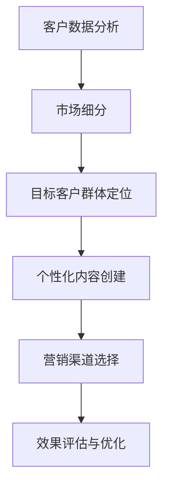
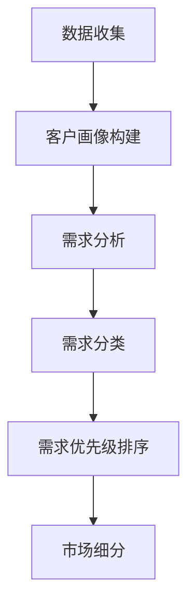

                 

### 文章标题

一人公司如何实现精准营销和客户个性化服务优化

### 关键词

一人公司、精准营销、客户个性化服务、数据分析、数字化营销渠道、客户关系管理

### 摘要

在当今市场竞争日益激烈的环境中，一人公司如何通过精准营销和客户个性化服务提升竞争力成为关键问题。本文将深入探讨一人公司在实现精准营销和客户个性化服务优化方面的策略和实践。首先，我们将回顾营销基础和精准营销原理，分析数据在营销中的作用以及市场细分的方法。接着，我们将探讨多种数字营销渠道与工具的应用，包括社交媒体营销、电子邮件营销、搜索引擎营销和内容营销。随后，文章将讨论客户关系管理的重要性，并介绍个性化服务的策略和设计原则。最后，我们将分析客户体验优化的方法，以及营销与个性化服务的整合策略，并通过实际案例提供实战指导。全文旨在为一人公司提供系统的营销与个性化服务优化思路，助力其在竞争中获得优势。

### 第一部分：营销策略与工具

#### 第1章：营销基础与精准营销原理

##### 1.1 营销的定义与核心目标

营销是一种商业活动，旨在通过创造、沟通、传递和交换产品或服务来满足顾客和自身需求。其核心目标是增加销售、提高市场份额、建立品牌知名度和忠诚度。营销不仅包括传统的广告和销售推广，还涵盖了市场研究、产品开发、定价策略和分销渠道等多个方面。

在营销的定义中，关键是理解交换和满足需求的概念。一人公司作为一个独立运营的企业，其营销目标可能与大型企业有所不同。但无论规模大小，营销的最终目的是识别并满足目标顾客的需求，从而实现业务增长和盈利。

##### 1.2 传统营销与精准营销的比较

传统营销通常依赖于广泛的媒体投放、广告和促销活动，其特点是覆盖面广但精准度较低。这种模式依赖于“广撒网，多捞鱼”的策略，往往无法精确触达目标顾客。

相比之下，精准营销则更加注重数据分析和目标客户群体的细分。它利用大数据、人工智能和客户关系管理（CRM）系统，通过对客户行为、偏好和购买历史的数据分析，来识别和吸引最有可能对产品或服务感兴趣的顾客。精准营销的核心在于“精确打击”，通过个性化内容和定制化服务提高营销效果和客户满意度。

##### 1.3 精准营销的基本概念与步骤

精准营销包括以下基本概念和步骤：

1. **客户数据分析**：通过收集和分析客户数据，了解客户的购买行为、兴趣爱好、消费习惯等。
   
2. **市场细分**：根据客户数据分析结果，将市场划分为具有相似特征的子市场。

3. **目标客户群体定位**：选择最具潜力的子市场作为目标客户群体，进行针对性营销。

4. **个性化内容创建**：根据目标客户群体的特点和需求，定制化内容和服务。

5. **营销渠道选择**：利用社交媒体、电子邮件、搜索引擎等数字渠道进行精准投放。

6. **效果评估与优化**：通过跟踪和分析营销活动的效果，不断优化策略和内容。

##### 1.4 Mermaid 流程图：精准营销核心环节与流程

通过上述步骤，一人公司可以更有效地吸引和保留客户，提高营销效率和转化率。

#### 第2章：数据分析与市场细分

##### 2.1 数据分析在精准营销中的作用

数据分析是精准营销的核心，其作用体现在以下几个方面：

1. **了解客户行为**：通过数据分析，可以深入了解客户的购买行为、浏览习惯和互动偏好，从而识别他们的需求和期望。
   
2. **优化营销策略**：基于数据分析的结果，营销策略可以进行有针对性的调整，以提高营销效果和投资回报率（ROI）。

3. **提高客户满意度**：通过分析客户反馈和行为数据，可以改进产品和服务，从而提高客户满意度和忠诚度。

4. **预测市场趋势**：数据分析还可以帮助企业预测市场趋势和未来需求，以便及时调整营销策略。

##### 2.2 市场细分的基本原则与方法

市场细分是将一个广泛的市场划分为若干具有相似特征的子市场，以便更有效地针对不同群体进行营销。市场细分的基本原则包括：

1. **可衡量性**：细分的市场群体应具备可衡量的特征，以便进行后续的数据分析和评估。
   
2. **可盈利性**：细分的市场群体应该具有足够的规模和潜力，以确保营销活动的投资能够带来盈利。

3. **差异性**：不同市场群体在需求、行为和偏好上应该具有明显的差异性，以确保营销策略的针对性。

市场细分的方法包括：

1. **地理细分**：根据地理位置、城市规模和人口特征等因素进行细分。
   
2. **人口细分**：根据年龄、性别、收入、教育水平等因素进行细分。

3. **心理细分**：根据消费者的生活方式、价值观、兴趣爱好和心理特征等因素进行细分。

4. **行为细分**：根据消费者的购买行为、使用习惯和忠诚度等因素进行细分。

##### 2.3 客户群体分析与需求挖掘

客户群体分析是精准营销的重要环节。通过客户群体分析，一人公司可以更准确地识别目标客户群体，并挖掘他们的需求。

1. **客户画像**：通过收集和分析客户数据，构建详细的客户画像。客户画像包括基本信息（如年龄、性别、职业等）和购买行为特征（如购买频率、购买偏好等）。

2. **需求分析**：分析客户的行为数据和反馈，挖掘客户的需求和痛点。这可以通过问卷调查、用户访谈、市场调研等方式进行。

3. **需求分类**：根据需求分析的结果，将客户需求进行分类，如基本需求、个性化需求等。

4. **需求优先级排序**：根据需求的紧迫性和影响力，对客户需求进行优先级排序，以便在资源有限的情况下，优先满足关键需求。

##### 2.4 Mermaid 流程图：数据分析与市场细分流程

通过上述流程，一人公司可以更系统地开展数据分析和市场细分工作，为精准营销奠定基础。

### 第二部分：客户个性化服务

#### 第4章：客户关系管理

##### 4.1 客户关系管理的定义与重要性

客户关系管理（CRM）是一种商业策略，旨在通过改善与客户的互动和关系，提高客户满意度和忠诚度，从而实现业务增长和盈利。CRM的核心在于理解并满足客户的需求，通过提供优质的服务和个性化的体验，建立长期的合作关系。

客户关系管理的重要性体现在以下几个方面：

1. **提高客户满意度**：通过CRM系统，企业可以更好地了解客户的需求和偏好，提供个性化的服务，从而提高客户满意度。

2. **增加客户忠诚度**：优质的客户服务可以增强客户的信任和忠诚度，降低客户流失率。

3. **提高销售效率**：CRM系统可以帮助企业更好地管理销售过程，提高销售团队的效率。

4. **降低运营成本**：通过自动化和优化流程，CRM系统可以降低运营成本，提高资源利用效率。

##### 4.2 客户关系管理的核心要素

客户关系管理包括以下几个核心要素：

1. **客户数据管理**：收集、存储和管理客户数据，包括基本信息、购买历史、互动记录等。

2. **销售管理**：管理销售过程，包括潜在客户跟踪、销售机会管理、销售预测等。

3. **客户服务**：提供优质的客户服务，包括售前咨询、售后服务、投诉处理等。

4. **营销自动化**：通过自动化工具进行营销活动管理，包括邮件营销、社交媒体营销、广告投放等。

5. **分析报告**：通过数据分析，评估客户关系管理的成效，为决策提供依据。

##### 4.3 客户生命周期管理

客户生命周期管理（CLM）是CRM的一个重要组成部分，它关注客户从首次接触到最后一次购买的全过程。客户生命周期管理的主要目的是延长客户生命周期，提高客户价值。

1. **客户获取**：通过有效的营销策略，吸引潜在客户，提高客户获取量。

2. **客户发展**：通过个性化服务和高质量的产品，增强客户满意度和忠诚度。

3. **客户留存**：通过持续的服务和沟通，降低客户流失率，提高客户留存率。

4. **客户拓展**：通过提供增值服务和交叉销售，增加客户价值，促进客户拓展。

##### 4.4 客户关系管理工具介绍

当前市场上存在多种客户关系管理工具，它们可以根据企业的规模和需求进行选择。以下是几种常见的CRM工具：

1. **Salesforce**：全球领先的CRM解决方案提供商，功能强大，支持多种行业应用。

2. **Microsoft Dynamics 365**：整合了销售、营销、客户服务和现场服务功能，适合大型企业。

3. **Zoho CRM**：功能全面，价格亲民，适合中小型企业。

4. **HubSpot CRM**：免费提供基本功能，适合初创企业和小型企业。

5. **freshworks**：提供全面的CRM解决方案，包括销售、客户服务和营销功能。

通过选择合适的CRM工具，一人公司可以更有效地管理客户关系，提高业务效率和客户满意度。

### 第三部分：实战与案例分析

#### 第8章：一人公司的营销与个性化服务实战

##### 8.1 一人公司的市场定位

市场定位是营销战略的核心，一人公司需要明确自己在市场中的定位，以吸引目标客户。市场定位包括以下方面：

1. **目标客户群体**：确定一人公司的目标客户群体，如年龄、性别、职业、收入水平等。

2. **独特卖点（USP）**：明确一人公司的产品或服务与其他竞争对手的区别，找到独特的卖点。

3. **品牌形象**：通过视觉设计、品牌口号和营销内容，塑造独特的品牌形象。

##### 8.2 一人公司的营销战略制定

制定营销战略是实施精准营销和客户个性化服务的关键步骤。一人公司可以从以下几个方面入手：

1. **市场研究**：通过市场调研，了解目标客户群体的需求和偏好。

2. **定位策略**：根据市场调研结果，确定一人公司的市场定位和营销目标。

3. **内容营销**：创建有价值的内容，如博客文章、视频教程、案例分享等，以吸引目标客户。

4. **数字营销渠道选择**：选择适合的数字营销渠道，如社交媒体、电子邮件、搜索引擎等。

5. **个性化服务设计**：根据客户数据，设计个性化的客户服务体验。

##### 8.3 一人公司的客户个性化服务实施

个性化服务的实施需要一系列技术和工具的支持。以下是具体的实施步骤：

1. **客户数据收集**：通过网站、社交媒体、客户互动等方式，收集客户的个人信息和行为数据。

2. **数据分析**：使用数据分析工具，如Excel、Google Analytics等，对客户数据进行分析和挖掘。

3. **客户细分**：根据数据分析结果，将客户划分为不同的细分市场，为每个细分市场设计个性化的营销和服务策略。

4. **个性化内容创建**：根据客户细分结果，创建个性化的内容和服务，如定制化邮件、推荐商品等。

5. **服务渠道整合**：将不同的服务渠道（如网站、社交媒体、客服热线等）整合，提供一致且个性化的客户体验。

##### 8.4 一人公司的营销与个性化服务效果评估

营销与个性化服务的实施效果需要定期评估，以确定策略的有效性并做出相应的调整。以下是评估的几个关键指标：

1. **转化率**：评估营销活动的转化率，如点击率、购买转化率等。

2. **客户满意度**：通过调查问卷、客户反馈等方式，评估客户对服务满意度的评价。

3. **客户留存率**：评估客户流失率和客户留存率，以了解个性化服务的有效性。

4. **ROI**：计算营销活动的投资回报率，以评估营销策略的经济效益。

通过定期评估和优化，一人公司可以不断提升营销和个性化服务的质量，实现业务增长。

### 第四部分：成功案例与启示

#### 第9章：成功案例与启示

##### 9.1 国内外成功案例介绍

在国内外，许多一人公司通过精准营销和客户个性化服务取得了显著的成功。以下是一些典型案例：

1. **案例一：国内电商创业公司**  
   这家公司通过大数据分析和个性化推荐，成功将客户留存率和转化率提高了30%以上。他们的成功经验包括：

   - **精准市场定位**：明确目标客户群体，专注于中高端市场。
   - **大数据分析**：通过用户行为数据分析，了解客户偏好，提供个性化推荐。
   - **高效客服**：提供7x24小时在线客服，快速响应客户需求。

2. **案例二：国外独立设计师品牌**  
   这位独立设计师通过社交媒体和电子邮件营销，成功建立了稳定的客户群体。他们的成功经验包括：

   - **社交媒体营销**：在Instagram、Pinterest等平台上展示作品，吸引潜在客户。
   - **个性化邮件营销**：根据客户购买历史和偏好，发送个性化的邮件内容。
   - **客户互动**：通过社交媒体和邮件与客户建立良好的互动关系，增强客户忠诚度。

##### 9.2 案例分析：成功背后的关键因素

成功案例之所以成功，背后通常有几个关键因素：

1. **精准市场定位**：明确目标客户群体，提供符合市场需求的产品和服务。

2. **大数据分析**：利用大数据技术，深入了解客户行为和需求，为营销策略提供数据支持。

3. **个性化服务**：根据客户数据和需求，提供个性化的内容和体验，增强客户满意度。

4. **高效执行**：制定详细的营销策略和执行计划，确保每个环节都能高效实施。

5. **持续优化**：定期评估营销效果，根据反馈进行调整和优化，不断提升服务质量。

##### 9.3 启示与借鉴

一人公司可以从上述成功案例中吸取以下启示和借鉴：

1. **重视数据分析**：充分利用数据分析工具，深入了解客户行为和需求，为营销策略提供依据。

2. **提供个性化服务**：根据客户数据，提供个性化的内容和体验，提高客户满意度和忠诚度。

3. **建立良好的客户关系**：通过社交媒体和电子邮件等渠道，与客户建立互动关系，增强客户黏性。

4. **持续学习和优化**：不断总结经验和教训，持续优化营销策略和服务流程。

通过借鉴这些成功经验，一人公司可以更好地实现精准营销和客户个性化服务，提升竞争力。

### 第五部分：总结与展望

#### 第10章：总结与展望

##### 10.1 全书总结

本文系统地探讨了如何实现一人公司的精准营销和客户个性化服务优化。首先，我们介绍了营销的基础和精准营销原理，分析了数据在营销中的作用以及市场细分的方法。接着，我们探讨了多种数字营销渠道与工具的应用，包括社交媒体营销、电子邮件营销、搜索引擎营销和内容营销。随后，我们讨论了客户关系管理的重要性，并介绍了个性化服务的策略和设计原则。最后，我们分析了客户体验优化的方法，以及营销与个性化服务的整合策略，并通过实际案例提供了实战指导。

##### 10.2 营销与个性化服务的发展趋势

随着技术的不断进步和消费者行为的变迁，营销与个性化服务的发展趋势包括：

1. **数据驱动决策**：越来越多的企业将数据分析作为决策的核心依据，通过数据洞察指导营销策略。

2. **个性化体验**：个性化服务将成为营销的重要趋势，通过数据分析和算法，为企业提供更个性化的产品和服务。

3. **多渠道整合**：企业将整合线上线下渠道，提供无缝的跨渠道体验，满足消费者的多元化需求。

4. **人工智能应用**：人工智能技术在营销中的应用将更加广泛，包括自动化营销、智能客服等。

##### 10.3 一人公司的未来挑战与机遇

一人公司在未来将面临以下挑战和机遇：

1. **挑战**：数据隐私和安全、营销成本上升、市场竞争加剧等。

2. **机遇**：个性化服务需求的增长、新兴技术的应用、消费者购买习惯的变化等。

##### 10.4 作者寄语

最后，我想对读者说，精准营销和客户个性化服务是实现业务增长和提升客户满意度的关键。希望本文能为您提供有价值的指导，助力您在竞争激烈的市场中脱颖而出。持续学习和创新，将为您的事业带来无限可能。

### 附录

#### 附录 A：营销与个性化服务工具资源

##### A.1 常用营销工具介绍

1. **Google Analytics**：分析网站流量和用户行为，帮助制定更有效的营销策略。
   
2. **Mailchimp**：电子邮件营销工具，提供模板和自动化功能，便于发送个性化邮件。

3. **Hootsuite**：社交媒体管理工具，帮助管理多个社交媒体账号，进行多渠道营销。

4. **HubSpot CRM**：客户关系管理工具，提供销售、营销和客户服务功能，助力企业实现自动化和高效管理。

5. **Unsplash**：免费高清图片资源网站，为营销内容和社交媒体提供高质量的视觉素材。

##### A.2 客户关系管理工具使用指南

1. **Salesforce**：通过销售自动化和客户数据分析，提高销售效率和客户满意度。

2. **Zoho CRM**：提供全面的功能，适合中小型企业，支持客户数据管理、销售管理和客户服务。

3. **freshworks**：功能全面的CRM工具，包括销售自动化、客户服务和营销功能，支持多渠道客户互动。

4. **HubSpot CRM**：免费提供基本功能，适合初创企业和小型企业，支持自动化营销、销售和客户服务。

##### A.3 个性化服务技术资源推荐

1. **Python**：一种流行的编程语言，用于数据分析和机器学习，是实现个性化服务的技术基础。

2. **R语言**：一种专门用于统计分析和图形表示的语言，适合进行复杂的客户数据分析。

3. **TensorFlow**：一种开源机器学习框架，可用于构建和部署深度学习模型，实现个性化推荐系统。

4. **Azure Machine Learning**：微软提供的云端机器学习服务，提供丰富的算法和工具，支持大规模数据分析和模型训练。

##### A.4 在线学习资源与推荐阅读

1. **Coursera**：提供各种在线课程，包括数据分析、机器学习和市场营销等，适合提升专业技能。

2. **edX**：哈佛大学和麻省理工学院等知名机构提供的在线课程平台，涵盖多个学科领域。

3. **Udemy**：提供广泛的在线课程，包括编程、数据分析、市场营销等，适合自学和技能提升。

4. **书籍推荐**：

   - 《精准营销：大数据时代的营销革命》
   - 《客户服务心理学：如何赢得客户的心》
   - 《客户关系管理实战手册》
   - 《机器学习实战》

这些资源和书籍将有助于读者进一步了解营销与个性化服务领域的最新发展和实用技巧。通过利用这些工具和资源，一人公司可以更好地实现精准营销和客户个性化服务，提升市场竞争力。

