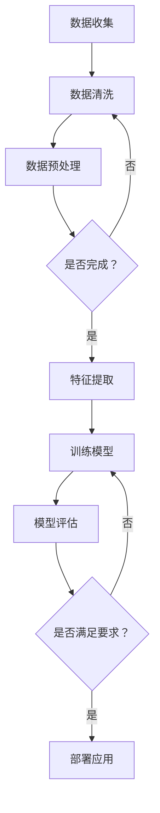

                 

### 文章标题

《一人公司如何应对规模化挑战：AI技术的关键作用》

### 关键词

AI技术、规模化挑战、一人公司、营销策略、客户服务、供应链管理、人力资源、机器学习、神经网络、深度学习、决策树、支持向量机、预测性营销、智能客服系统、供应链优化、招聘与筛选、绩效评估、员工培训与发展。

### 摘要

在当今快速变化的市场环境中，一人公司面临着诸多规模化挑战。本文通过深入分析AI技术的核心原理及其在企业中的应用，探讨了AI技术在帮助一人公司应对规模化挑战中的关键作用。文章首先介绍了AI技术的基础概念和发展历程，然后详细讲解了机器学习、深度学习、神经网络等关键算法原理及数学模型。接着，文章分别从营销策略、客户服务、供应链管理和人力资源等方面，阐述了AI技术在规模化挑战中的应用案例和实践指导。最后，文章通过案例研究，总结了AI技术在规模化挑战中的成功经验和未来发展趋势，为一人公司的未来发展提供了宝贵的参考。

### 第一部分：引入与概述

#### 第1章：一人公司的背景与挑战

**1.1 一人公司的概念**

一人公司，顾名思义，是指由一个独立个体经营的公司。这种公司形式在创业初期或特定领域内具有独特的优势。一人公司通常由创始人或CEO负责所有业务运营，包括产品研发、市场营销、客户服务以及财务管理等。由于公司规模较小，决策过程更加迅速，灵活性较高，能够在短时间内迅速响应市场变化。

**1.2 一人公司的优势与局限性**

一人公司的优势主要体现在以下几个方面：

1. **决策迅速**：由于公司结构简单，决策层级较少，一人公司能够在短时间内做出决策，迅速应对市场变化。
2. **灵活性强**：一人公司可以根据市场需求灵活调整产品和服务，适应市场变化。
3. **成本较低**：一人公司的运营成本相对较低，能够在资源有限的情况下实现盈利。
4. **创新能力**：一人公司通常注重创新，由于决策者集中，更容易实现创新想法。

然而，一人公司也面临一些局限性：

1. **资源有限**：一人公司由于规模较小，资源有限，难以承担大规模的研发和市场推广活动。
2. **专业能力有限**：一人公司的管理者可能无法在所有领域都具备专业能力，这可能导致在某些关键领域的能力不足。
3. **管理风险**：一人公司的管理者在决策过程中承担了全部责任，一旦决策失误，可能对整个公司产生重大影响。

**1.3 规模化挑战的来源**

随着市场环境的变化，一人公司逐步面临以下规模化挑战：

1. **市场竞争加剧**：随着市场的日益成熟，竞争者数量增多，一人公司需要提升自身竞争力，以应对激烈的市场竞争。
2. **用户需求多样化**：用户需求日益多样化，一人公司需要提供更加个性化的产品和服务，以满足不同用户的需求。
3. **数据管理挑战**：随着业务的发展，一人公司需要处理越来越多的数据，如何高效管理数据成为一大挑战。
4. **管理复杂性增加**：随着业务的扩展，一人公司的管理复杂性增加，需要更加高效的管理体系来应对。

一人公司如何应对这些规模化挑战，成为亟待解决的问题。接下来，本文将深入探讨AI技术在应对规模化挑战中的关键作用，为一人公司提供可行的解决方案。

#### 第2章：AI技术在企业中的应用

**2.1 AI技术的发展历程**

AI（人工智能）技术的发展可以追溯到20世纪50年代，当时科学家们首次提出“人工智能”这一概念。自那时起，AI技术经历了多个发展阶段。早期，人工智能主要关注符号主义和推理技术，代表性成果包括专家系统和逻辑推理。然而，这些方法在处理大规模数据和复杂问题时存在诸多限制。

随着计算机性能的提升和算法的改进，20世纪80年代以来，AI技术逐渐转向基于数据的方法，包括机器学习和深度学习。这一转变使得AI在图像识别、自然语言处理、预测建模等领域取得了显著成果。

**2.2 AI技术对企业的潜在影响**

AI技术对企业的潜在影响体现在多个方面：

1. **提高生产效率**：通过自动化和智能化技术，企业能够大幅提高生产效率。例如，智能制造生产线能够实时监测设备状态，预测故障，减少停机时间。
2. **优化决策**：AI技术能够处理大量数据，为企业的战略决策提供有力支持。例如，基于大数据分析的营销策略能够更精准地预测用户需求，提高市场占有率。
3. **增强客户体验**：AI技术在客户服务中的应用，如智能客服、个性化推荐等，能够显著提升客户满意度。例如，电商平台通过AI技术分析用户行为，提供个性化的购物建议，提高销售额。
4. **降低运营成本**：AI技术能够帮助企业降低运营成本。例如，通过智能监控和预测性维护，企业能够减少设备维修和停机时间，降低运营成本。

**2.3 AI技术在企业中的实际应用案例**

AI技术在企业中的实际应用案例层出不穷，以下是一些典型的应用场景：

1. **智能制造**：智能制造是AI技术在制造业中的重要应用。通过AI技术，企业能够实现生产线的自动化和智能化。例如，通用电气公司利用AI技术对其发电设备进行实时监测和预测性维护，大幅降低了维修成本和停机时间。

2. **营销策略**：AI技术在营销策略中的应用主要体现在用户行为分析和预测性营销。例如，阿里巴巴通过大数据和AI技术，对用户行为进行分析，为用户提供个性化的购物推荐，提高了销售额。

3. **客户服务**：AI技术在客户服务中的应用，如智能客服和虚拟助手，已经成为企业提高客户满意度的有效手段。例如，苹果公司利用AI技术开发的智能客服系统，能够快速响应用户问题，提供高质量的客户服务。

4. **供应链管理**：AI技术在供应链管理中的应用，如库存管理和物流优化，能够显著提高供应链效率。例如，沃尔玛通过AI技术优化其库存管理，减少了库存成本，提高了物流效率。

通过以上分析，我们可以看到AI技术在企业中的应用具有广泛的前景。接下来，本文将深入探讨AI技术的基础概念和核心原理，为后续章节的内容奠定基础。

#### 第二部分：AI技术核心原理

##### 第3章：AI基础概念与架构

**3.1 机器学习的基本概念**

机器学习（Machine Learning）是人工智能（AI）的一个重要分支，主要研究如何通过数据驱动的方式，使计算机系统具备自主学习和改进能力。机器学习的基本概念包括以下几个要点：

1. **数据集（Dataset）**：数据集是机器学习的基础，包含了输入特征和对应的输出标签。输入特征用于描述数据样本的各种属性，输出标签则是我们希望模型预测的结果。

2. **特征（Feature）**：特征是数据集中用来描述样本的属性或变量。例如，在图像识别任务中，像素值可以作为特征。

3. **模型（Model）**：模型是机器学习算法对数据进行分析和处理的结果。模型通常由一系列参数组成，这些参数通过学习过程被调整，以最小化预测误差。

4. **算法（Algorithm）**：算法是实现机器学习任务的具体步骤和方法。常见的机器学习算法包括线性回归、决策树、支持向量机、神经网络等。

**3.2 深度学习与神经网络**

深度学习（Deep Learning）是机器学习的一种特殊形式，其核心是神经网络（Neural Networks）。神经网络通过模拟生物神经元的工作原理，对大量数据进行学习，从而实现复杂的数据处理任务。

1. **神经网络的基本结构**：神经网络由多个层次组成，包括输入层、隐藏层和输出层。每个层次包含多个神经元，神经元之间通过连接（权重）进行信息传递。

2. **前向传播与反向传播**：神经网络通过前向传播（Forward Propagation）和反向传播（Backpropagation）进行学习。前向传播过程中，输入数据从输入层传递到输出层，每个神经元计算输出值。反向传播过程中，模型根据预测误差，调整权重和偏置，以优化模型性能。

3. **激活函数（Activation Function）**：激活函数是神经网络中的关键组件，用于引入非线性特性。常见的激活函数包括 sigmoid、ReLU、Tanh 等。

**3.3 AI系统的基本架构**

AI系统通常包括以下几个主要组成部分：

1. **数据处理模块**：负责数据清洗、预处理和特征提取，为模型训练提供高质量的数据集。

2. **模型训练模块**：负责选择合适的算法和架构，对数据进行训练，调整模型参数，以优化模型性能。

3. **模型评估模块**：负责评估模型在训练集和测试集上的性能，包括准确性、召回率、F1分数等指标。

4. **模型部署模块**：负责将训练好的模型部署到实际应用场景中，实现模型的实时预测和推理功能。

通过以上分析，我们可以看到AI技术的核心原理和基本架构。接下来，本文将详细探讨关键AI算法的原理，进一步了解AI技术的实际应用潜力。

##### 第4章：关键AI算法原理

**4.1 神经网络算法原理**

神经网络（Neural Networks）是深度学习的基础，其算法原理主要涉及以下几个关键组成部分：

1. **神经元模型**：神经网络中的基本计算单元称为神经元，每个神经元接收多个输入信号，通过加权求和后，再通过激活函数产生输出。

2. **前向传播**：在前向传播过程中，输入信号从输入层传递到隐藏层，然后传递到输出层。每个神经元的输出是前一层所有神经元输出的加权求和，再加上一个偏置项，通过激活函数得到最终输出。

3. **反向传播**：在反向传播过程中，模型根据实际输出和期望输出的差异，计算预测误差。通过误差反向传播，调整每个神经元的权重和偏置，以最小化预测误差。

4. **优化算法**：为了加速模型收敛，神经网络通常采用梯度下降（Gradient Descent）及其变种，如随机梯度下降（Stochastic Gradient Descent, SGD）、Adam优化器等。

**伪代码示例：**

```python
# 前向传播
for each layer from input to hidden:
    for each neuron in the layer:
        z = sum(input * weight) + bias
        output = activation_function(z)

# 反向传播
for each layer from output to input:
    for each neuron in the layer:
        delta = (predicted_output - actual_output) * activation_function_derivative(output)
        for each input:
            weight_gradient = delta * input
            bias_gradient = delta
```

**4.2 决策树与随机森林**

决策树（Decision Trees）是一种基于树形结构进行决策的机器学习算法。每个内部节点代表一个特征，每个分支代表该特征的某个取值，叶节点代表最终的决策结果。

1. **构建决策树**：决策树通过递归划分特征空间，在每个节点选择最优特征进行划分，直到满足停止条件（如最大深度、最小叶节点样本数等）。

2. **随机森林（Random Forest）**：随机森林是一种集成学习方法，通过构建多个决策树，并对每个树的结果进行投票，提高模型的预测性能。

**伪代码示例：**

```python
# 构建决策树
def build_decision_tree(data, features, target):
    if stop_condition(data):
        return leaf_node(target)
    else:
        best_feature, best_value = find_best_split(data, features, target)
        node = TreeNode(feature=best_feature, value=best_value)
        for value in possible_values(best_feature):
            subset = filter_data(data, best_feature, value)
            node.children[value] = build_decision_tree(subset, features, target)
        return node

# 随机森林预测
def random_forest_predict(tree, instance):
    predictions = []
    for i in range(num_trees):
        tree = build_decision_tree(train_data, features, target)
        prediction = tree.predict(instance)
        predictions.append(prediction)
    return majority_vote(predictions)
```

**4.3 支持向量机**

支持向量机（Support Vector Machine, SVM）是一种基于最大化间隔的分类算法。SVM通过寻找一个最优超平面，将不同类别的数据点分开，并最大化分类间隔。

1. **硬间隔与软间隔**：硬间隔是指完全正确分类所有数据点的情况，软间隔则允许一定的分类错误。

2. **线性SVM与非线性SVM**：线性SVM适用于线性可分的数据集，通过求解线性方程组来找到最优超平面。非线性SVM通过核函数将数据映射到高维空间，实现非线性分类。

**伪代码示例：**

```python
# 线性SVM
def linear_svm(train_data, train_labels):
    # Solve the optimization problem to find the optimal hyperplane
    # w, b = solve_linear_equation(train_data, train_labels)
    return w, b

# 非线性SVM
def nonlinear_svm(train_data, train_labels, kernel):
    # Map data to high-dimensional space
    # train_data_high_dim = apply_kernel(train_data, kernel)
    # Solve the optimization problem in the high-dimensional space
    # w, b = solve_linear_equation(train_data_high_dim, train_labels)
    return w, b
```

**4.4 贝叶斯分类器**

贝叶斯分类器是基于贝叶斯定理的统计分类方法。贝叶斯分类器通过计算每个类别的后验概率，选择具有最高后验概率的类别作为预测结果。

1. **朴素贝叶斯分类器**：朴素贝叶斯分类器是一种简化的贝叶斯分类器，假设特征之间相互独立。朴素贝叶斯分类器在文本分类、垃圾邮件过滤等领域具有广泛的应用。

2. **贝叶斯网络**：贝叶斯网络是一种图形模型，通过有向无环图（DAG）表示变量之间的依赖关系。贝叶斯网络可以用于复杂的数据分析和预测任务。

**伪代码示例：**

```python
# 朴素贝叶斯分类器
def naive_bayes_classify(instance, prior_probabilities, likelihoods):
    posteriors = {}
    for class_label in classes:
        posterior = prior_probabilities[class_label] * multiply likelihoods[instance]
        posteriors[class_label] = posterior
    return max(posteriors, key=posteriors.get)
```

通过以上对关键AI算法原理的详细讲解和伪代码示例，我们可以更好地理解这些算法在实际应用中的工作原理和实现方法。这些算法在数据挖掘、图像识别、自然语言处理等领域发挥着重要作用，为人公司应对规模化挑战提供了强有力的技术支持。接下来，本文将深入探讨AI技术在企业中的具体应用，以进一步阐述其在规模化挑战中的作用。

##### 第5章：数学模型与公式解析

**5.1 神经网络数学模型**

神经网络的核心是神经元之间的数学运算。下面我们将详细解析神经网络中的主要数学模型，包括激活函数、损失函数和优化算法。

**1. 激活函数**

激活函数是神经网络中引入非线性特性的关键组件。常见的激活函数包括：

- **Sigmoid函数**：
  $$f(x) = \frac{1}{1 + e^{-x}}$$
  Sigmoid函数将输入映射到(0, 1)区间，常用于二分类问题。

- **ReLU函数**（Rectified Linear Unit）：
  $$f(x) = \max(0, x)$$
 ReLU函数在输入为负时输出0，输入为正时输出输入值，常用于隐藏层神经元。

- **Tanh函数**：
  $$f(x) = \frac{e^x - e^{-x}}{e^x + e^{-x}}$$
  Tanh函数将输入映射到(-1, 1)区间，具有对称性。

**2. 损失函数**

损失函数用于衡量模型预测值与真实值之间的差异。常见的损失函数包括：

- **均方误差（MSE）**：
  $$MSE(y, \hat{y}) = \frac{1}{m} \sum_{i=1}^{m} (y_i - \hat{y}_i)^2$$
  均方误差是预测值与真实值差的平方的平均值。

- **交叉熵（Cross-Entropy）**：
  $$H(y, \hat{y}) = -\sum_{i=1}^{m} y_i \log(\hat{y}_i)$$
  交叉熵用于分类问题，衡量预测概率分布与真实概率分布之间的差异。

**3. 优化算法**

优化算法用于调整神经网络的权重和偏置，以最小化损失函数。以下是几种常用的优化算法：

- **梯度下降（Gradient Descent）**：
  $$w_{t+1} = w_t - \alpha \frac{\partial J(w)}{\partial w}$$
  梯度下降通过计算损失函数关于权重的梯度，反向调整权重，以最小化损失。

- **随机梯度下降（Stochastic Gradient Descent, SGD）**：
  $$w_{t+1} = w_t - \alpha \frac{\partial J(w)}{\partial w}$$
  随机梯度下降在每次迭代中随机选择一个样本，计算该样本的梯度，进行权重更新。

- **Adam优化器**：
  $$m_t = \beta_1 m_{t-1} + (1 - \beta_1) \frac{\partial J(w)}{\partial w}$$
  $$v_t = \beta_2 v_{t-1} + (1 - \beta_2) (\frac{\partial J(w)}{\partial w})^2$$
  $$w_{t+1} = w_t - \alpha \frac{m_t}{\sqrt{v_t} + \epsilon}$$
  Adam优化器结合了SGD和动量方法，具有较好的收敛性和适应性。

**5.2 正则化技术**

正则化技术用于防止模型过拟合，提高泛化能力。以下是一些常见的正则化方法：

- **L1正则化（L1 Regularization）**：
  $$J(w) = \sum_{i=1}^{n} (y_i - \hat{y}_i)^2 + \lambda \sum_{i=1}^{n} |w_i|$$
  L1正则化通过在损失函数中添加L1范数，惩罚权重绝对值。

- **L2正则化（L2 Regularization）**：
  $$J(w) = \sum_{i=1}^{n} (y_i - \hat{y}_i)^2 + \lambda \sum_{i=1}^{n} w_i^2$$
  L2正则化通过在损失函数中添加L2范数，惩罚权重平方。

- **Dropout**：
  Dropout是一种在训练过程中随机丢弃部分神经元的方法，以减少模型复杂度，防止过拟合。

通过以上对神经网络数学模型的详细解析，我们可以更好地理解神经网络的工作原理和实现方法。接下来，本文将结合实际应用案例，进一步探讨AI技术在规模化挑战中的具体应用。

##### 第6章：AI技术在规模化挑战中的应用

**6.1 用户行为分析**

在规模化挑战中，理解用户行为对于优化营销策略和提高客户满意度至关重要。AI技术，尤其是机器学习和深度学习，为用户行为分析提供了强有力的工具。

**1. 用户行为数据分析**

用户行为分析涉及收集和分析用户在网站、移动应用或其他数字平台上的行为数据。这些数据包括点击记录、浏览路径、购买行为、评论等。通过机器学习算法，可以从这些数据中提取出有价值的信息，如用户的兴趣偏好、购买倾向和行为模式。

**2. 关键算法**

- **聚类算法**：例如K-means聚类，用于将用户划分为不同的群体，以便更好地理解用户特征和需求。
- **协同过滤**：通过分析用户之间的相似性，推荐用户可能感兴趣的内容或商品。
- **时间序列分析**：例如使用ARIMA模型，预测用户的行为趋势，为营销策略提供数据支持。

**3. 应用场景**

- **个性化推荐**：基于用户行为数据，为用户推荐个性化的产品和服务，提高用户满意度和转化率。
- **市场细分**：通过聚类分析，将用户分为不同的细分市场，制定针对性的营销策略。

**6.2 预测性营销**

预测性营销利用AI技术预测用户未来的行为，从而提前采取行动，提高营销效果。这种方法有助于企业更精准地触达潜在客户，提高营销投入的回报率。

**1. 预测性营销原理**

预测性营销的核心是建立用户行为与结果之间的关联模型，通过模型预测用户的未来行为。常见的预测任务包括：

- **用户流失预测**：预测哪些用户可能会在未来某个时间点取消订阅或停止使用服务。
- **需求预测**：预测未来的市场需求，以便企业提前备货和调整生产计划。

**2. 关键算法**

- **逻辑回归**：用于预测用户流失等二分类问题。
- **时间序列模型**：例如ARIMA、LSTM等，用于预测未来的时间序列数据。
- **集成方法**：如随机森林、XGBoost等，通过集成多个模型提高预测精度。

**3. 应用场景**

- **精准营销**：通过预测用户行为，提前制定针对性的营销策略，提高营销效果。
- **库存管理**：通过预测市场需求，优化库存管理，减少库存成本。

**6.3 营销自动化**

营销自动化通过AI技术自动化执行营销任务，提高营销效率和效果。营销自动化工具可以自动执行一系列营销活动，如邮件发送、社交媒体推广、广告投放等。

**1. 营销自动化原理**

营销自动化基于用户行为数据和预设的规则，自动执行营销活动。常见的自动化流程包括：

- **自动化邮件营销**：根据用户行为触发邮件发送，如欢迎邮件、优惠券、提醒邮件等。
- **自动化社交媒体推广**：自动发布社交媒体内容，监测用户互动，优化推广策略。
- **自动化广告投放**：根据用户行为和市场需求，自动调整广告投放策略，提高广告效果。

**2. 应用场景**

- **客户关系管理**：通过营销自动化，自动化执行客户关系管理任务，提高客户满意度。
- **销售预测**：通过自动化数据分析，预测销售趋势，优化销售策略。

通过以上分析，我们可以看到AI技术在用户行为分析、预测性营销和营销自动化等方面的广泛应用。这些应用不仅提高了企业的运营效率，还显著提升了用户体验，为企业应对规模化挑战提供了有力支持。接下来，本文将探讨AI技术在客户服务中的应用。

##### 第7章：AI技术在客户服务中的应用

在规模化挑战中，客户服务的质量和效率对于企业的竞争力至关重要。AI技术，特别是自然语言处理和机器学习，为提升客户服务质量提供了强有力的工具。

**7.1 智能客服系统**

智能客服系统利用AI技术，通过聊天机器人、语音识别等技术，自动回答客户问题，提供24/7全天候服务，大幅提升客户满意度。

**1. 智能客服系统原理**

智能客服系统主要包括以下几个模块：

- **自然语言处理（NLP）**：用于理解客户的问题和意图。NLP技术包括文本预处理、词向量表示、实体识别、情感分析等。
- **机器学习模型**：用于训练智能客服系统的回答模型。常见的模型包括序列到序列模型（如Seq2Seq）、长短期记忆网络（LSTM）等。
- **对话管理**：用于管理对话流程，包括意图识别、上下文维护、回答生成等。

**2. 关键技术**

- **意图识别**：通过分析客户问题的语义和上下文，识别客户的意图。常见的方法包括基于规则的方法和基于机器学习的方法。
- **上下文维护**：在对话过程中，智能客服系统需要理解客户的上下文，以便提供连贯的回答。这通常通过维护对话状态和上下文历史来实现。
- **回答生成**：根据识别的意图和上下文，智能客服系统生成合适的回答。常见的回答生成方法包括模板匹配、规则推理和生成对抗网络（GAN）等。

**3. 应用场景**

- **自动回答常见问题**：智能客服系统能够自动回答客户关于产品信息、订单状态、退换货政策等常见问题，提高客户满意度。
- **智能路由**：智能客服系统可以根据客户问题的复杂程度，自动将客户路由到合适的人工客服或部门，提高服务效率。

**7.2 客户关系管理**

客户关系管理（CRM）利用AI技术，通过数据分析、预测模型和自动化工具，帮助企业更好地理解客户需求，提供个性化的服务，提高客户忠诚度。

**1. 客户关系管理原理**

客户关系管理主要包括以下几个模块：

- **数据集成**：将来自不同渠道的客户数据（如购买记录、互动记录、社交媒体数据等）整合到一个统一的客户数据库中。
- **数据分析**：通过数据分析，发现客户的共同特征、需求和行为模式，为营销和服务提供数据支持。
- **预测模型**：建立预测模型，如客户流失预测、需求预测等，帮助企业提前采取行动，提高客户满意度。

**2. 关键技术**

- **客户细分**：通过数据分析，将客户分为不同的细分群体，以便提供个性化的服务和营销策略。
- **行为预测**：通过分析客户的历史行为和互动数据，预测客户的未来行为，如购买意向、流失风险等。
- **自动化工具**：利用自动化工具，如营销自动化、客户服务自动化等，提高客户管理的效率。

**3. 应用场景**

- **个性化营销**：通过分析客户数据，为不同的客户群体提供个性化的产品推荐、促销活动等，提高转化率和客户满意度。
- **客户体验优化**：通过实时分析客户互动数据，优化客户服务流程，提供更优质的客户体验。

**7.3 个性化服务**

个性化服务利用AI技术，根据客户的需求和行为，提供个性化的产品和服务，提高客户满意度。

**1. 个性化服务原理**

个性化服务主要包括以下几个模块：

- **需求识别**：通过分析客户的历史行为和互动数据，识别客户的需求和偏好。
- **推荐系统**：根据识别出的需求和偏好，推荐合适的产品和服务。
- **反馈循环**：根据客户的反馈，不断优化推荐系统，提高推荐精度。

**2. 关键技术**

- **协同过滤**：通过分析用户之间的相似性，推荐用户可能感兴趣的内容或商品。
- **基于内容的推荐**：根据产品或内容的特征，推荐相似的产品或内容。
- **上下文感知推荐**：结合用户的上下文信息（如时间、位置、浏览历史等），提供更准确的推荐。

**3. 应用场景**

- **个性化推荐**：根据客户的需求和偏好，推荐个性化的产品和服务，提高转化率和客户满意度。
- **定制化服务**：根据客户的需求，提供定制化的产品和服务，满足客户的特殊需求。

通过以上对AI技术在客户服务中的应用分析，我们可以看到AI技术在提升客户服务质量、优化客户关系管理和提供个性化服务方面的巨大潜力。这些应用不仅提高了客户满意度，还有效地支持了企业的规模化发展。接下来，本文将探讨AI技术在供应链管理中的应用。

##### 第8章：AI技术在供应链管理中的应用

在规模化挑战中，供应链管理对于企业的效率和成本控制至关重要。AI技术的引入，使得供应链管理更加智能化、自动化，从而提高了整个供应链的运作效率。

**8.1 供应链数据分析**

供应链数据分析利用AI技术，对供应链中的各种数据进行深入分析，以优化供应链决策。这些数据包括库存数据、运输数据、生产数据、需求预测数据等。

**1. 数据收集与预处理**

- **数据收集**：通过物联网设备、传感器、ERP系统等，收集供应链各个环节的数据。
- **数据预处理**：包括数据清洗、去噪、缺失值填补等，以确保数据的质量和完整性。

**2. 数据分析技术**

- **时间序列分析**：用于分析历史数据中的趋势和周期性，预测未来的需求。
- **聚类分析**：将类似的供应商、产品或客户进行分组，以便制定更有效的供应链策略。
- **关联规则挖掘**：发现供应链中不同环节之间的关联性，优化供应链流程。

**3. 应用场景**

- **需求预测**：通过分析历史销售数据和季节性因素，预测未来的需求，以便企业提前备货和调整生产计划。
- **库存优化**：通过分析库存水平和库存周期，优化库存管理，减少库存成本。

**8.2 预测性维护**

预测性维护利用AI技术，通过对设备数据的实时监测和分析，预测设备的故障和维修需求，从而提高设备的利用率和降低维修成本。

**1. 预测性维护原理**

预测性维护主要包括以下几个模块：

- **数据收集与处理**：通过传感器和监测设备，收集设备运行数据，包括温度、压力、振动等。
- **故障预测模型**：利用机器学习算法，如回归分析、神经网络等，建立故障预测模型。
- **决策支持**：根据预测结果，制定维护计划和预防措施。

**2. 关键技术**

- **时序分析**：通过分析设备的历史运行数据，发现故障的前兆和周期性规律。
- **故障诊断**：利用分类算法，对设备运行状态进行诊断，预测可能的故障类型。
- **多模型融合**：结合多个预测模型，提高故障预测的准确性。

**3. 应用场景**

- **设备维护**：通过预测性维护，提前发现设备的潜在故障，避免突发性故障，提高设备利用率。
- **成本控制**：通过预测性维护，优化维修计划和资源分配，降低维修成本。

**8.3 供应链优化**

供应链优化利用AI技术，通过对供应链各个环节的优化，提高供应链的整体效率。这包括运输优化、库存优化、生产计划优化等。

**1. 供应链优化原理**

供应链优化主要包括以下几个模块：

- **成本分析**：通过数据分析和成本模型，分析供应链各个环节的成本。
- **优化算法**：利用优化算法，如线性规划、遗传算法等，优化供应链决策。
- **实时监控**：通过实时数据监测，调整供应链策略，以应对市场变化。

**2. 关键技术**

- **路径优化**：通过优化运输路线和配送计划，减少运输成本和时间。
- **库存控制**：通过优化库存水平和库存策略，减少库存成本和库存周转时间。
- **生产计划优化**：通过优化生产计划和生产流程，提高生产效率和产品质量。

**3. 应用场景**

- **运输优化**：通过优化运输路线和配送计划，提高运输效率和降低运输成本。
- **库存管理**：通过优化库存水平和库存策略，减少库存成本和库存周转时间。
- **生产计划**：通过优化生产计划和生产流程，提高生产效率和产品质量。

通过以上对AI技术在供应链管理中的应用分析，我们可以看到AI技术在供应链数据分析、预测性维护和供应链优化方面的广泛应用。这些应用不仅提高了供应链的效率，还有效地降低了成本，为企业应对规模化挑战提供了有力支持。接下来，本文将探讨AI技术在人力资源中的应用。

##### 第9章：AI技术在人力资源中的应用

在规模化挑战中，人力资源管理的效率和准确性对于企业的发展至关重要。AI技术的引入，使得人力资源管理更加智能化、数据驱动化，从而提高了招聘、绩效评估和员工培训等环节的效率。

**9.1 招聘与筛选**

AI技术在招聘与筛选中的应用，能够大幅提高招聘效率和准确性。

**1. 数据驱动的招聘策略**

- **职位需求分析**：通过分析历史招聘数据，识别关键职位的需求特征和常见问题，为招聘策略提供数据支持。
- **简历筛选**：利用自然语言处理（NLP）和机器学习算法，自动筛选和评估简历，提高简历处理的效率。

**2. 关键技术**

- **关键字匹配**：通过分析职位描述和简历内容，提取关键字，进行匹配评分。
- **文本分类**：利用文本分类算法，将简历分为不同的类别，如技术简历、管理简历等。
- **推荐系统**：通过分析候选人的简历和技能，推荐合适的职位。

**3. 应用场景**

- **自动化简历筛选**：通过AI技术自动筛选简历，提高招聘效率。
- **个性化推荐**：根据候选人的技能和经验，推荐合适的职位，提高匹配度。

**9.2 绩效评估**

绩效评估是人力资源管理中的重要环节，AI技术为绩效评估提供了新的方法和工具。

**1. 数据驱动的绩效评估**

- **绩效指标分析**：通过分析历史绩效数据，确定关键绩效指标（KPI），为绩效评估提供依据。
- **实时监控**：通过实时监控员工的工作表现，及时发现问题并进行调整。

**2. 关键技术**

- **时间序列分析**：通过分析员工的工作时间、工作量等数据，识别工作绩效的趋势。
- **多因素回归分析**：通过分析多个因素（如工作时长、项目完成情况等）对绩效的影响，建立绩效评估模型。
- **情感分析**：通过分析员工在邮件、聊天记录等文本内容中的情感倾向，评估员工的工作状态和满意度。

**3. 应用场景**

- **自动化绩效评估**：通过AI技术自动收集和分析员工的工作数据，生成绩效评估报告，提高评估的准确性。
- **个性化反馈**：根据员工的绩效表现，提供个性化的改进建议，帮助员工提高工作能力。

**9.3 员工培训与发展**

AI技术在员工培训与发展中的应用，能够提高培训效果和员工职业发展。

**1. 培训需求分析**

- **数据分析**：通过分析员工的工作表现和技能需求，确定培训内容和重点。
- **个性化推荐**：根据员工的兴趣和职业发展需求，推荐合适的培训课程。

**2. 关键技术**

- **知识图谱**：通过构建知识图谱，将员工的知识结构和技能需求进行关联，提供针对性的培训建议。
- **学习路径推荐**：根据员工的技能水平和职业目标，推荐最佳的学习路径。

**3. 应用场景**

- **自动化培训**：通过AI技术自动生成和推送培训课程，提高培训的覆盖率和效果。
- **职业发展规划**：根据员工的兴趣和职业目标，提供个性化的职业发展规划建议。

通过以上对AI技术在人力资源管理中的应用分析，我们可以看到AI技术在招聘与筛选、绩效评估和员工培训与发展等方面的巨大潜力。这些应用不仅提高了人力资源管理的效率，还有效地支持了企业的规模化发展。接下来，本文将结合实际案例，进一步探讨AI技术在规模化挑战中的应用效果。

##### 第10章：一人公司AI技术应用案例研究

**10.1 案例一：A公司营销自动化实践**

A公司是一家小型电商公司，专注于个性化家居用品。随着市场竞争的加剧，A公司面临用户获取成本高、客户留存率低等挑战。为了应对这些挑战，A公司决定引入AI技术，实施营销自动化策略。

**1. 项目背景**

- **用户获取成本高**：A公司在社交媒体和搜索引擎上进行广告投放，但用户转化率较低，导致用户获取成本较高。
- **客户留存率低**：A公司的客户购买后较少复购，导致客户留存率低。

**2. AI技术应用**

- **用户行为分析**：A公司利用自然语言处理和机器学习技术，分析用户在社交媒体、网站和移动应用上的行为数据，提取用户兴趣和偏好。
- **个性化推荐**：基于用户行为分析结果，A公司开发了个性化推荐系统，为不同用户推荐个性化的家居用品。
- **营销自动化**：通过营销自动化工具，A公司实现自动发送欢迎邮件、优惠券和推荐邮件，提高用户参与度和复购率。

**3. 项目效果**

- **用户转化率提高**：个性化推荐系统显著提高了用户转化率，尤其是在广告投放环节。
- **客户留存率提升**：通过营销自动化策略，A公司提高了客户留存率，增加了复购率。
- **降低运营成本**：营销自动化减少了人工干预，降低了营销运营成本。

**10.2 案例二：B公司智能客服系统应用**

B公司是一家在线教育平台，提供各类在线课程。随着用户数量的增加，B公司的客服需求急剧上升，人工客服无法满足用户需求。为了提高客户服务质量，B公司决定引入智能客服系统。

**1. 项目背景**

- **客服需求高**：随着用户数量的增加，B公司的客服需求急剧上升，人工客服工作量巨大。
- **客户满意度低**：由于人工客服响应速度慢，导致客户满意度较低。

**2. AI技术应用**

- **自然语言处理**：B公司利用自然语言处理技术，实现对用户咨询的语义理解和自动回答。
- **智能路由**：根据用户问题的复杂程度，智能客服系统自动将用户路由到合适的人工客服或部门。
- **情感分析**：通过情感分析，智能客服系统识别用户的情绪，提供更贴心的服务。

**3. 项目效果**

- **客服效率提高**：智能客服系统自动回答常见问题，降低了人工客服的工作量。
- **客户满意度提升**：智能客服系统快速响应用户，提供高质量的客户服务，提高了客户满意度。
- **降低运营成本**：通过智能客服系统，B公司降低了客服运营成本。

**10.3 案例三：C公司供应链优化案例分析**

C公司是一家电子产品制造公司，随着业务规模的扩大，供应链管理面临效率低、成本高等挑战。为了优化供应链，C公司决定引入AI技术。

**1. 项目背景**

- **供应链效率低**：C公司的库存管理和物流优化不到位，导致供应链效率低下。
- **成本高**：C公司的库存成本和运输成本较高，影响企业盈利能力。

**2. AI技术应用**

- **供应链数据分析**：C公司利用AI技术，对供应链各个环节的数据进行分析，识别供应链瓶颈和优化潜力。
- **预测性维护**：通过预测性维护，C公司提前发现设备故障和维修需求，减少设备停机和维修成本。
- **运输优化**：利用路径优化算法，C公司优化运输路线和配送计划，降低运输成本。

**3. 项目效果**

- **供应链效率提高**：通过供应链数据分析，C公司优化了库存管理和物流流程，提高了供应链效率。
- **成本降低**：预测性维护和运输优化显著降低了库存成本和运输成本，提高了企业盈利能力。
- **质量提升**：通过优化供应链，C公司提高了产品质量和交货准时率。

通过以上案例研究，我们可以看到AI技术在一人公司中的实际应用效果。AI技术的引入，不仅提高了运营效率，降低了成本，还显著提升了客户满意度和企业竞争力。接下来，本文将探讨AI技术在规模化挑战中的实践指导。

##### 第11章：AI技术在规模化挑战中的实践指导

**11.1 实践步骤与策略**

为了有效利用AI技术应对规模化挑战，一人公司可以遵循以下实践步骤与策略：

**1. 需求分析与目标设定**

- **需求分析**：深入分析公司的业务需求和面临的挑战，明确AI技术可以解决的问题。
- **目标设定**：根据需求分析结果，设定具体可行的AI应用目标，如提高生产效率、优化客户服务、降低运营成本等。

**2. 数据收集与预处理**

- **数据收集**：收集与业务相关的数据，包括内部数据（如销售记录、客户互动数据）和外部数据（如市场趋势、行业数据）。
- **数据预处理**：对数据进行清洗、去噪、缺失值填补等预处理操作，确保数据质量。

**3. 算法选择与模型训练**

- **算法选择**：根据业务需求和数据特点，选择合适的算法，如机器学习、深度学习、自然语言处理等。
- **模型训练**：利用高质量的数据集，训练AI模型，并进行模型调优，以提高模型性能。

**4. 模型部署与评估**

- **模型部署**：将训练好的AI模型部署到实际应用场景中，实现模型的实时预测和推理功能。
- **模型评估**：定期评估模型在真实环境中的表现，包括准确性、效率、稳定性等指标，确保模型持续有效。

**5. 持续优化与反馈**

- **持续优化**：根据实际应用反馈，不断优化模型和算法，提高解决方案的适应性和性能。
- **反馈机制**：建立反馈机制，收集用户和业务部门的使用反馈，为后续优化提供依据。

**11.2 成功关键因素**

**1. 数据质量**

数据是AI技术的核心，高质量的数据是模型训练和预测准确性的基础。一人公司需要确保数据收集的全面性、准确性和实时性。

**2. 技术团队**

技术团队是AI项目成功的关键，团队应具备深厚的AI技术知识和经验，能够应对各种复杂的技术挑战。

**3. 业务融合**

AI技术应与业务紧密融合，通过深入了解业务需求和流程，设计出切实可行的解决方案。

**4. 持续投入**

持续投入是AI技术成功的关键，一人公司需要为AI项目提供充足的资源和资金支持，确保项目的持续推进和优化。

**11.3 失败原因分析及对策**

**1. 数据不足或质量差**

对策：加强数据收集和预处理，确保数据质量和完整性。

**2. 技术团队经验不足**

对策：招聘和培养具有AI技术经验和能力的团队成员，提高团队整体技术水平。

**3. 业务融合不充分**

对策：加强与业务部门的沟通和合作，深入了解业务需求和痛点，设计出更贴合业务需求的解决方案。

**4. 缺乏持续优化和反馈**

对策：建立持续优化和反馈机制，定期评估模型性能，收集用户和业务部门的反馈，为后续优化提供依据。

通过以上实践指导，一人公司可以更好地应对规模化挑战，利用AI技术实现业务的持续增长和优化。接下来，本文将探讨AI技术在企业中的未来发展，以及规模化挑战的长期影响。

##### 第12章：未来的发展趋势与展望

**12.1 AI技术在企业中的未来发展**

随着AI技术的不断进步和应用的深入，其在企业中的未来发展潜力巨大。以下是AI技术在企业中的几个可能的发展方向：

**1. 智能化决策**

未来的企业将更加依赖AI技术进行智能化决策。通过深度学习和大数据分析，AI技术将帮助企业从大量数据中提取有价值的信息，提供更为精准的预测和决策支持。

**2. 自动化与协同**

AI技术的自动化和协同能力将进一步提升。例如，机器人流程自动化（RPA）与AI技术相结合，将实现业务流程的全面自动化，提高效率。同时，AI技术与物联网（IoT）的结合，将实现设备间的智能协同，优化生产和管理流程。

**3. 个性化服务**

随着AI技术在用户行为分析和个性化推荐方面的不断进步，企业将能够提供更加个性化的产品和服务，提高客户满意度和忠诚度。

**4. 安全与隐私**

随着AI技术在企业中的广泛应用，数据安全和隐私保护将越来越重要。未来的企业需要建立完善的数据安全框架和隐私保护机制，确保数据的安全和合规。

**12.2 规模化挑战的长期影响**

规模化挑战对企业的长期影响将是深远和多方面的：

**1. 竞争格局重塑**

规模化挑战将推动企业不断优化自身业务模式，提升竞争力。在这个过程中，那些能够有效应对规模化挑战的企业将获得更大的市场份额和竞争优势。

**2. 业务模式创新**

规模化挑战将促使企业不断创新业务模式，以适应不断变化的市场环境。例如，通过AI技术实现智能化营销、供应链优化和客户服务提升等。

**3. 人力资源转型**

规模化挑战将推动企业人力资源管理的转型。AI技术将帮助企业优化招聘、绩效评估和员工培训等环节，提高人力资源管理效率。

**4. 风险与挑战**

规模化挑战也带来了一系列风险和挑战。例如，数据安全和隐私保护、技术依赖性增加、人才竞争加剧等。企业需要制定相应的风险管理策略，以应对这些挑战。

**12.3 一人公司的未来前景**

对于一人公司而言，AI技术的应用将为其未来发展带来新的机遇：

**1. 效率提升**

通过AI技术的应用，一人公司可以大幅提升运营效率，降低运营成本。这将为一人公司提供更多的资源，支持其业务的持续增长。

**2. 创新驱动**

AI技术将为人一公司带来更多的创新机会，使其在竞争激烈的市场中脱颖而出。通过AI技术的应用，一人公司可以开发出更具有竞争力的产品和服务。

**3. 灵活应变**

一人公司通常具备较高的灵活性和应变能力。在AI技术的支持下，一人公司可以更加迅速地适应市场变化，抓住新的商业机会。

**4. 持续学习**

通过AI技术的应用，一人公司可以建立持续学习机制，不断提高自身的业务能力和竞争力。这将为一人公司的长期发展奠定坚实基础。

综上所述，AI技术在企业中的应用前景广阔，一人公司也不例外。通过有效利用AI技术，一人公司可以应对规模化挑战，实现业务的持续增长和优化。未来，AI技术将成为一人公司发展的关键驱动力。

### 附录：AI技术相关资源与工具

**13.1 开源机器学习框架**

- **TensorFlow**：由Google开发的开源机器学习框架，广泛应用于深度学习和强化学习领域。
- **PyTorch**：由Facebook开发的开源机器学习框架，具有灵活的动态计算图和高效的GPU支持。
- **Scikit-learn**：一个基于Python的机器学习库，提供了丰富的算法实现和工具。

**13.2 AI开发工具与平台**

- **Google Cloud AI**：提供全面的人工智能服务，包括机器学习、自然语言处理、计算机视觉等。
- **Amazon Web Services (AWS)**：提供强大的AI工具和服务，包括Amazon SageMaker、Rekognition、Lex等。
- **Azure AI**：提供全面的人工智能服务，包括机器学习、自然语言处理、计算机视觉等。

**13.3 数据集与库资源**

- **Kaggle**：一个提供大量公开数据集的社区平台，适合数据科学家和机器学习爱好者。
- **UCI机器学习库**：提供多种领域的数据集，适合进行机器学习研究和实验。
- **OpenML**：一个开放机器学习平台，提供数据集、算法和工具，支持机器学习项目的完整生命周期。

通过以上资源与工具，读者可以进一步了解和掌握AI技术的相关知识和应用方法，为实际项目开发提供有力支持。

### Mermaid 流程图示例

下面是一个简单的Mermaid流程图示例，用于展示数据处理的基本流程：



在这个流程图中，`A` 表示数据收集，`B` 表示数据清洗，`C` 表示数据预处理，`E` 表示特征提取，`F` 表示训练模型，`G` 表示模型评估，`H` 表示是否满足要求，`I` 表示部署应用。流程图通过条件判断（`D` 和 `H`），实现了根据实际情况进行调整的流程控制。这样的流程图可以帮助读者更直观地理解数据处理和模型训练的过程。

