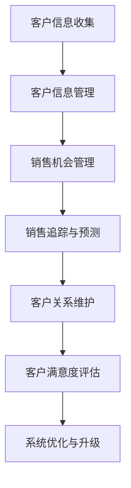

                 


### 文章标题：一人公司如何建立有效的客户关系管理(CRM)系统

#### 关键词：
- 客户关系管理
- 一人公司
- CRM系统
- 业务需求分析
- 技术实现
- 系统优化

#### 摘要：
本文将围绕一人公司如何建立有效的客户关系管理（CRM）系统展开讨论。首先，我们将介绍CRM的基本概念和其在业务中的重要性。接着，我们将探讨一人公司在构建CRM系统前的准备工作，包括需求分析、功能模块确定和软件选择。随后，我们将详细阐述CRM系统的实施流程、日常运营与管理，以及系统评估与优化策略。最后，通过案例分析、未来趋势展望和实战项目，为读者提供全面的CRM系统建设指导。

### 目录大纲

#### 第一部分：CRM基础知识

**第1章：CRM概述与重要性**

- **1.1 CRM的定义与演变**
- **1.2 CRM在业务中的应用价值**
- **1.3 CRM与传统销售管理的区别**

#### 第二部分：CRM系统建设

**第2章：构建CRM系统前的准备工作**

- **2.1 分析企业现状与需求**
- **2.2 确定CRM系统功能与模块**
- **2.3 选择合适的CRM软件与供应商**

#### 第三部分：CRM系统实施与运营

**第3章：CRM系统实施流程**

- **3.1 CRM系统需求分析与规划**
- **3.2 CRM系统的数据迁移与集成**
- **3.3 系统部署与试运行**

**第4章：CRM系统日常运营与管理**

- **4.1 客户信息管理与维护**
- **4.2 客户沟通与互动管理**
- **4.3 销售机会管理与追踪**

#### 第四部分：CRM系统优化与升级

**第5章：CRM系统评估与优化**

- **5.1 CRM系统性能评估指标**
- **5.2 CRM系统优化策略**

**第6章：CRM系统升级与扩展**

- **6.1 CRM系统功能扩展**
- **6.2 CRM系统与第三方系统的集成**

#### 第五部分：CRM案例与实践

**第7章：成功CRM案例分析**

- **7.1 国内一家初创公司成功建立CRM系统的案例**
- **7.2 国际企业如何利用CRM系统提升客户满意度**

#### 第六部分：未来趋势与展望

**第8章：CRM系统的发展趋势**

- **8.1 AI技术在CRM系统中的应用**
- **8.2 数据驱动与个性化CRM**

#### 附录

**附录A：CRM系统常用工具与资源**

- **A.1 常用CRM系统软件对比**
- **A.2 CRM系统相关书籍与资料推荐**

### 文章正文

#### 第一部分：CRM基础知识

**第1章：CRM概述与重要性**

CRM（Customer Relationship Management），即客户关系管理，是一种旨在提高企业与客户之间互动效率、增强客户满意度和忠诚度的管理策略。它通过系统地整合客户信息，优化业务流程，帮助企业更好地了解客户需求，提供个性化的服务。

**1.1 CRM的定义与演变**

CRM最早起源于20世纪80年代，当时主要应用于客户信息的收集和管理。随着信息技术的发展，CRM逐渐从简单的客户信息管理工具演变成一种全面的企业管理策略。它涵盖了市场营销、销售、客户服务等多个领域，通过自动化和数据分析技术，帮助企业实现客户生命周期价值的最大化。

**1.2 CRM在业务中的应用价值**

CRM在业务中的应用价值主要体现在以下几个方面：

1. 提高销售效率：通过自动化销售流程、销售预测和销售分析，销售人员可以更有效地管理销售机会，提高销售业绩。
2. 增强客户满意度：CRM系统能够帮助企业更好地了解客户需求，提供个性化的服务和解决方案，从而提高客户满意度。
3. 优化业务流程：CRM系统可以整合企业内部多个部门的信息，实现信息共享和业务协同，优化业务流程，提高工作效率。
4. 数据驱动的决策支持：CRM系统可以收集和分析大量的客户数据，为企业提供数据驱动的决策支持，帮助制定更科学的营销策略和运营策略。

**1.3 CRM与传统销售管理的区别**

传统销售管理主要依赖于人工经验和手动操作，缺乏系统化和数据化的管理手段。而CRM系统则通过自动化和数据分析技术，实现销售管理的系统化和数据化。

1. 信息化程度：CRM系统通过信息化手段，将销售过程、客户信息和业务数据数字化，实现销售管理的全面信息化。
2. 数据分析能力：CRM系统可以收集和分析大量的销售数据，提供直观的销售分析报告，帮助销售团队更好地了解市场状况和客户需求。
3. 跨部门协同：CRM系统可以实现销售、营销、客服等多个部门的信息共享和协同工作，提高整体业务效率。
4. 客户关系维护：CRM系统可以帮助企业建立长期稳定的客户关系，提供个性化的服务和解决方案，提高客户满意度和忠诚度。

#### 第二部分：CRM系统建设

**第2章：构建CRM系统前的准备工作**

要构建一个有效的CRM系统，首先需要做好充分的准备工作。以下是构建CRM系统前的几个关键步骤：

**2.1 分析企业现状与需求**

在构建CRM系统之前，企业需要全面分析自身的业务现状和需求。这包括以下几个方面：

1. 业务流程分析：梳理企业现有的业务流程，确定哪些环节可以通过CRM系统进行优化和自动化。
2. 需求调研：通过访谈、问卷调查等方式，了解企业各部门对CRM系统的需求和期望，确定系统所需的功能和模块。
3. 数据分析：收集和分析现有的客户数据，了解客户特征和需求，为后续的客户管理和数据分析提供依据。

**2.2 确定CRM系统功能与模块**

CRM系统的功能与模块应根据企业的实际需求和业务特点进行设计。以下是一些常见的CRM系统功能与模块：

1. 客户信息管理：包括客户资料、联系人信息、客户分类等。
2. 销售管理：包括销售机会管理、销售流程管理、销售预测等。
3. 营销管理：包括营销活动管理、营销效果分析等。
4. 客户服务：包括客户咨询、投诉处理、售后服务等。
5. 数据分析：包括客户数据分析、销售数据分析等。

**2.3 选择合适的CRM软件与供应商**

选择合适的CRM软件与供应商对于构建一个有效的CRM系统至关重要。以下是一些选择标准：

1. 功能匹配：CRM软件的功能应与企业需求相匹配，避免功能不足或冗余。
2. 易用性：CRM软件应具备良好的用户界面和易用性，降低用户的学习和使用成本。
3. 扩展性：CRM软件应具备良好的扩展性，支持企业未来的业务发展和功能扩展。
4. 安全性：CRM软件应具备完善的安全机制，确保客户数据的保密性和安全性。
5. 售后服务：CRM供应商应提供良好的售后服务，包括软件更新、技术支持等。

#### 第三部分：CRM系统实施与运营

**第3章：CRM系统实施流程**

CRM系统的实施是一个复杂的过程，需要充分考虑需求分析、数据迁移、系统集成和系统部署等多个环节。以下是CRM系统实施的一般流程：

**3.1 CRM系统需求分析与规划**

在实施CRM系统之前，企业需要与CRM供应商和内部相关部门进行沟通，了解业务需求和预期目标。需求分析主要包括以下几个方面：

1. 功能需求：明确CRM系统所需的功能模块和具体需求。
2. 业务流程：梳理企业现有的业务流程，确定CRM系统如何优化和自动化业务流程。
3. 数据需求：确定CRM系统所需的数据类型、数据来源和数据整合方式。
4. 预期目标：明确CRM系统实施后的业务目标，如销售业绩提升、客户满意度提高等。

**3.2 CRM系统的数据迁移与集成**

数据迁移是将现有客户数据、销售数据等迁移到CRM系统中的过程。数据集成则是将CRM系统与企业其他系统（如ERP、营销系统等）进行整合，实现数据共享和业务协同。以下是数据迁移与集成的关键步骤：

1. 数据清洗：对现有数据进行清洗，确保数据质量。
2. 数据映射：将现有数据映射到CRM系统的相应字段和数据结构。
3. 数据迁移：将清洗后的数据导入CRM系统。
4. 数据集成：实现CRM系统与企业其他系统的数据共享和业务协同。
5. 数据验证：对迁移和集成的数据进行验证，确保数据准确性和完整性。

**3.3 系统部署与试运行**

系统部署是将CRM系统部署到生产环境，并确保系统正常运行的过程。以下是系统部署和试运行的关键步骤：

1. 环境配置：配置CRM系统的运行环境，包括服务器、数据库和网络等。
2. 系统安装：安装CRM系统软件，并进行必要的配置。
3. 数据初始化：初始化CRM系统中的数据，包括客户数据、销售数据等。
4. 系统测试：对CRM系统进行功能测试、性能测试和安全测试，确保系统稳定可靠。
5. 试运行：在部分部门或地区进行试运行，收集用户反馈，优化系统功能。

**第4章：CRM系统日常运营与管理**

CRM系统实施完成后，日常运营与管理至关重要。以下是一些日常运营与管理的关键环节：

**4.1 客户信息管理与维护**

客户信息管理是CRM系统的核心功能之一，主要包括以下几个方面：

1. 客户资料管理：包括客户名称、联系方式、地址等信息的管理。
2. 联系人管理：包括客户联系人姓名、职位、联系方式等信息的管理。
3. 客户分类管理：根据客户特征和需求，对客户进行分类，便于管理和服务。
4. 客户信息更新：定期更新客户信息，确保数据的准确性和完整性。

**4.2 客户沟通与互动管理**

客户沟通与互动管理旨在提高客户满意度和忠诚度。以下是一些关键环节：

1. 客户咨询处理：建立快速响应机制，及时处理客户咨询和投诉。
2. 客户关怀活动：定期组织客户关怀活动，如节日问候、生日祝福等，加强与客户的情感联系。
3. 客户互动渠道：建立多渠道的客户互动平台，如电话、邮件、社交媒体等，方便客户与企业沟通。
4. 客户满意度调查：定期进行客户满意度调查，了解客户需求，改进服务质量。

**4.3 销售机会管理与追踪**

销售机会管理是CRM系统的另一重要功能，主要包括以下几个方面：

1. 销售机会创建：记录销售机会的基本信息，如客户名称、产品、金额等。
2. 销售过程管理：跟踪销售机会的进展情况，包括谈判、合同签订等。
3. 销售预测：根据历史数据和当前销售情况，预测未来销售业绩。
4. 销售报告分析：生成销售报告，分析销售业绩和销售趋势。

#### 第四部分：CRM系统优化与升级

**第5章：CRM系统评估与优化**

CRM系统评估与优化是确保系统长期有效运行的关键。以下是一些评估与优化的关键指标和策略：

**5.1 CRM系统性能评估指标**

1. 系统响应时间：评估系统对用户操作的响应速度，确保系统流畅运行。
2. 数据准确性：评估系统数据的准确性，确保客户数据和销售数据的可靠性。
3. 系统稳定性：评估系统在长时间运行中的稳定性，确保系统不出现故障。
4. 用户满意度：评估用户对CRM系统的满意度，收集用户反馈，不断优化系统功能。

**5.2 CRM系统优化策略**

1. 功能优化：根据用户反馈和市场需求，优化CRM系统的功能模块，提高系统易用性和实用性。
2. 数据优化：定期对系统数据进行清洗和整理，提高数据质量和准确性。
3. 性能优化：通过优化系统架构、数据库设计和代码实现，提高系统性能和稳定性。
4. 安全优化：加强系统安全防护，防止数据泄露和系统攻击。

**第6章：CRM系统升级与扩展**

CRM系统的升级与扩展是满足企业长期发展需求的重要手段。以下是一些升级与扩展的关键策略：

**6.1 CRM系统功能扩展**

1. 添加新功能：根据企业发展需求，添加新的CRM功能模块，如客户分析、市场活动管理等。
2. 集成第三方系统：与第三方系统（如ERP、营销系统等）进行集成，实现数据共享和业务协同。
3. 开放API接口：提供API接口，方便与其他系统和应用程序进行集成和交互。

**6.2 CRM系统与第三方系统的集成**

1. 数据集成：实现CRM系统与其他系统（如ERP、营销系统等）的数据集成，实现数据共享和业务协同。
2. 业务流程集成：将CRM系统的业务流程与第三方系统的业务流程进行整合，提高业务效率。
3. 应用集成：通过API接口或SDK等方式，与其他应用程序进行集成，扩展CRM系统的应用场景。

#### 第五部分：CRM案例与实践

**第7章：成功CRM案例分析**

通过分析国内一家初创公司和国际企业的成功CRM案例，我们可以更好地了解如何建立有效的CRM系统。

**7.1 国内一家初创公司成功建立CRM系统的案例**

这家初创公司通过以下步骤建立了有效的CRM系统：

1. 需求分析：分析企业现状和业务需求，确定CRM系统所需的功能和模块。
2. 软件选择：选择功能丰富、易用性高的CRM软件，确保系统与企业需求的匹配。
3. 系统实施：按照需求分析结果，实施CRM系统，并进行试运行和优化。
4. 日常运营：建立完善的客户信息管理和销售机会管理流程，确保系统正常运行。
5. 评估与优化：定期对CRM系统进行评估和优化，提高系统性能和用户体验。

**7.2 国际企业如何利用CRM系统提升客户满意度**

这家国际企业通过以下策略利用CRM系统提升客户满意度：

1. 个性化服务：通过CRM系统收集客户数据，了解客户需求和偏好，提供个性化的服务和解决方案。
2. 沟通与互动：通过CRM系统建立多渠道的客户沟通与互动平台，方便客户与企业沟通。
3. 客户关怀：定期组织客户关怀活动，加强与客户的情感联系。
4. 数据分析：通过CRM系统收集和分析客户数据，了解客户行为和需求，改进服务质量。
5. 员工培训：对员工进行CRM系统培训，提高员工使用CRM系统的能力和效率。

#### 第六部分：未来趋势与展望

**第8章：CRM系统的发展趋势**

随着科技的不断发展，CRM系统也在不断演进。以下是CRM系统的几个发展趋势：

**8.1 AI技术在CRM系统中的应用**

1. 智能推荐：利用AI技术，根据客户行为和偏好，提供个性化的产品推荐和营销活动。
2. 情感分析：通过AI技术，分析客户沟通内容，识别客户情感，提供针对性的客户服务。
3. 自动化：利用AI技术，实现销售机会的自动化追踪和预测，提高销售效率。

**8.2 数据驱动与个性化CRM**

1. 数据收集：通过多种渠道收集客户数据，实现全面的数据驱动。
2. 数据分析：利用大数据技术和数据分析工具，挖掘客户行为和需求，提供个性化的服务和解决方案。
3. 个性化服务：根据客户特征和需求，提供个性化的产品推荐、营销活动和客户服务。

#### 附录

**附录A：CRM系统常用工具与资源**

1. **常用CRM系统软件对比**

   - **Salesforce**：功能丰富、易用性高，适用于各种规模的企业。
   - **Microsoft Dynamics 365**：与Microsoft Office集成，适用于企业内部协同工作。
   - **Zoho CRM**：功能齐全、价格合理，适用于初创公司和中小企业。
   - **金蝶CRM**：适用于中国企业，提供丰富的本地化功能。

2. **CRM系统相关书籍与资料推荐**

   - 《CRM实战手册》
   - 《客户关系管理：策略、技术和应用》
   - 《CRM系统规划与实施》
   - 《大数据与客户关系管理》

### 核心概念与联系

**CRM系统架构流程图**



### 核心算法原理讲解

**客户生命周期价值计算**

```plaintext
CLV = Σ(Ct - C0) * (1 + r)^(-t)
其中：
CLV：客户生命周期价值
Ct：t时间段内的利润
C0：初始成本
r：折现率
t：时间
```

### 数学模型和数学公式 & 详细讲解 & 举例说明

**贝叶斯优化算法**

```latex
P(C|D) = \frac{P(D|C)P(C)}{P(D)}
```

**举例说明**：假设我们要预测一个客户的购买概率，给定客户的历史行为数据 \(D\) 和已知购买概率分布 \(P(C)\)，我们可以通过贝叶斯优化算法来更新客户的购买概率 \(P(C|D)\)。

### 项目实战

**搭建CRM系统开发环境**

**环境配置**

1. 操作系统：Windows 10
2. 数据库：MySQL 8.0
3. 开发工具：Visual Studio Code

**项目构建**

1. 使用Java语言和Spring Boot框架构建CRM系统。
2. 创建Maven项目，引入相关依赖。
3. 配置数据库连接和表结构。

**CRM系统源代码实现**

**CustomerController.java**

```java
@RestController
public class CustomerController {

    @Autowired
    private CustomerService customerService;

    @GetMapping("/customers")
    public List<Customer> getAllCustomers() {
        return customerService.getAllCustomers();
    }

    @PostMapping("/customers")
    public Customer createCustomer(@RequestBody Customer customer) {
        return customerService.createCustomer(customer);
    }

    @GetMapping("/customers/{id}")
    public Customer getCustomerById(@PathVariable Long id) {
        return customerService.getCustomerById(id);
    }

    @PutMapping("/customers/{id}")
    public Customer updateCustomer(@PathVariable Long id, @RequestBody Customer customer) {
        return customerService.updateCustomer(id, customer);
    }

    @DeleteMapping("/customers/{id}")
    public void deleteCustomer(@PathVariable Long id) {
        customerService.deleteCustomer(id);
    }
}
```

**CustomerService.java**

```java
@Service
public class CustomerService {

    @Autowired
    private CustomerRepository customerRepository;

    public List<Customer> getAllCustomers() {
        return customerRepository.findAll();
    }

    public Customer createCustomer(Customer customer) {
        return customerRepository.save(customer);
    }

    public Customer getCustomerById(Long id) {
        return customerRepository.findById(id).orElseThrow(() -> new ResourceNotFoundException("Customer not found with id: " + id));
    }

    public Customer updateCustomer(Long id, Customer customer) {
        Customer existingCustomer = getCustomerById(id);
        existingCustomer.setName(customer.getName());
        existingCustomer.setEmail(customer.getEmail());
        return customerRepository.save(existingCustomer);
    }

    public void deleteCustomer(Long id) {
        Customer existingCustomer = getCustomerById(id);
        customerRepository.delete(existingCustomer);
    }
}
```

**项目小结**

通过以上实战项目，我们搭建了一个简单的CRM系统开发环境，并实现了客户信息的增删改查功能。在实际项目中，还需进一步完善功能模块、优化系统性能和安全性，以满足企业实际需求。

### 最佳实践 tips、小结、注意事项、拓展阅读等内容

**最佳实践 tips**

- 在构建CRM系统时，充分了解业务需求和用户需求，确保系统功能与企业实际业务相匹配。
- 定期对CRM系统进行评估和优化，提高系统性能和用户体验。
- 建立完善的客户信息管理和销售机会管理流程，确保数据的准确性和完整性。
- 结合AI技术和大数据分析，实现个性化服务和精准营销。

**小结**

本文详细介绍了如何构建一个有效的CRM系统，包括CRM基础知识、系统建设、实施与运营、优化与升级，以及实战项目和案例分析。通过本文，读者可以全面了解CRM系统的建设和管理方法，为企业提供有价值的参考。

**注意事项**

- 在选择CRM软件和供应商时，要充分考虑功能匹配、易用性、扩展性和安全性等因素。
- 实施CRM系统时，要确保数据迁移和集成的准确性和完整性，避免数据丢失或错误。
- 日常运营中，要关注客户信息管理和销售机会管理，确保数据的准确性和及时性。

**拓展阅读**

- 《CRM实战手册》
- 《客户关系管理：策略、技术和应用》
- 《CRM系统规划与实施》
- 《大数据与客户关系管理》

### 作者信息

作者：AI天才研究院/AI Genius Institute & 禅与计算机程序设计艺术 /Zen And The Art of Computer Programming 

### 核心算法原理讲解

**贝叶斯优化算法**

贝叶斯优化算法是一种基于概率论的优化算法，它通过不断更新先验概率分布，以得到后验概率分布，从而寻找最优解。以下是贝叶斯优化算法的基本原理和数学模型：

**数学模型：**

贝叶斯优化算法的核心是贝叶斯推理，其基本公式如下：

\[ P(C|D) = \frac{P(D|C)P(C)}{P(D)} \]

其中：
- \( P(C|D) \) 表示在已知数据 \( D \) 的条件下，事件 \( C \) 发生的概率，称为后验概率。
- \( P(D|C) \) 表示在事件 \( C \) 发生的条件下，数据 \( D \) 出现的概率，称为条件概率。
- \( P(C) \) 表示事件 \( C \) 发生的概率，称为先验概率。
- \( P(D) \) 表示数据 \( D \) 出现的概率，称为边缘概率。

**详细讲解：**

贝叶斯优化算法的工作流程可以分为以下几个步骤：

1. **初始化：** 确定先验概率分布 \( P(C) \) 和边缘概率分布 \( P(D) \)。

2. **观察数据：** 在每次迭代中，收集新的数据 \( D \)，并更新先验概率分布。

3. **计算条件概率：** 利用贝叶斯公式计算条件概率 \( P(D|C) \)。

4. **更新后验概率：** 根据新的条件概率，更新后验概率分布 \( P(C|D) \)。

5. **优化目标：** 根据后验概率分布，选择最优的参数 \( C \)。

**举例说明：**

假设我们想要预测一个客户的购买概率。给定客户的历史行为数据 \( D \) 和已知的购买概率分布 \( P(C) \)，我们可以通过贝叶斯优化算法来更新客户的购买概率 \( P(C|D) \)。

具体步骤如下：

1. **初始化：** 假设我们初始的购买概率分布为 \( P(C) = [0.3, 0.7] \)，即有30%的概率购买，70%的概率不购买。

2. **观察数据：** 假设我们收集到的新数据 \( D \) 显示，客户最近浏览了我们的产品页面，这是一个积极的信号。

3. **计算条件概率：** 根据贝叶斯公式，我们需要计算 \( P(D|C) \)。如果客户购买产品，他们更有可能浏览产品页面；如果不购买，他们浏览产品页面的概率较低。因此，我们可以设定 \( P(D|C) \) 为：
   - \( P(D|C=购买) = 0.8 \)
   - \( P(D|C=不购买) = 0.2 \)

4. **更新后验概率：** 使用贝叶斯公式，我们可以更新购买概率分布：
   \[ P(C|D) = \frac{P(D|C)P(C)}{P(D)} \]

   其中，\( P(D) \) 是边缘概率，可以通过全概率公式计算：
   \[ P(D) = P(D|C=购买)P(C=购买) + P(D|C=不购买)P(C=不购买) \]

   假设购买和不购买的概率分别为 \( P(C=购买) = 0.3 \) 和 \( P(C=不购买) = 0.7 \)，则：
   \[ P(D) = (0.8 \times 0.3) + (0.2 \times 0.7) = 0.26 + 0.14 = 0.4 \]

   更新后的购买概率分布为：
   \[ P(C|D) = \frac{P(D|C=购买)P(C=购买)}{P(D)} = \frac{0.8 \times 0.3}{0.4} = 0.6 \]

   即客户在观察到数据 \( D \) 后，购买的概率上升到了60%。

5. **优化目标：** 根据新的后验概率分布，我们可以进一步优化营销策略，如增加促销活动、个性化推荐等，以提高客户的购买概率。

通过这个简单的例子，我们可以看到贝叶斯优化算法如何帮助我们在已知部分数据的情况下，更新和优化我们对客户行为的预测。在更复杂的情况下，贝叶斯优化算法可以结合大量的数据和历史信息，提供更加精准的预测和决策支持。

### 数学模型和数学公式 & 详细讲解 & 举例说明

**线性回归模型**

线性回归是一种常见的统计方法，用于分析两个或多个变量之间的关系。在线性回归模型中，我们试图找到一个线性函数来描述因变量（响应变量）和自变量（解释变量）之间的关系。以下是线性回归的基本数学模型和详细讲解。

**数学模型：**

\[ y = \beta_0 + \beta_1 \cdot x + \varepsilon \]

其中：
- \( y \) 是因变量（响应变量）。
- \( x \) 是自变量（解释变量）。
- \( \beta_0 \) 是截距（模型在没有自变量时的预期值）。
- \( \beta_1 \) 是斜率（自变量对因变量的影响程度）。
- \( \varepsilon \) 是误差项（表示实际值和模型预测值之间的差异）。

**详细讲解：**

1. **模型假设：**
   - 自变量和因变量之间是线性关系。
   - 误差项 \( \varepsilon \) 是随机的，且具有期望为0，方差为 \( \sigma^2 \)。
   - 自变量是固定不变的，因变量是随机变量。

2. **参数估计：**
   为了估计线性回归模型的参数 \( \beta_0 \) 和 \( \beta_1 \)，我们可以使用最小二乘法（Ordinary Least Squares, OLS）。

3. **最小二乘法：**
   最小二乘法的目标是找到使误差平方和最小的参数估计值。误差平方和（Sum of Squared Errors, SSE）定义为：

   \[ SSE = \sum_{i=1}^{n} (y_i - \hat{y}_i)^2 \]

   其中 \( \hat{y}_i \) 是模型对 \( y_i \) 的预测值。

   最小二乘法的步骤如下：
   - 对每个数据点，计算预测值 \( \hat{y}_i = \beta_0 + \beta_1 \cdot x_i \)。
   - 计算每个数据点预测值和实际值之间的差异。
   - 计算差异的平方和。
   - 对 \( \beta_0 \) 和 \( \beta_1 \) 求导并令导数为0，求解最优参数。

   最优参数的公式如下：

   \[ \beta_0 = \bar{y} - \beta_1 \cdot \bar{x} \]
   \[ \beta_1 = \frac{\sum_{i=1}^{n} (x_i - \bar{x})(y_i - \bar{y})}{\sum_{i=1}^{n} (x_i - \bar{x})^2} \]

   其中 \( \bar{y} \) 和 \( \bar{x} \) 分别是因变量和自变量的平均值。

**举例说明：**

假设我们有一个简单的线性回归模型，用于预测房屋价格（因变量 \( y \)）与房屋面积（自变量 \( x \)）之间的关系。我们有以下数据：

| 面积 (x) | 价格 (y) |
|-----------|----------|
| 1000      | 200000   |
| 1200      | 240000   |
| 1500      | 300000   |
| 1800      | 360000   |
| 2000      | 400000   |

我们可以使用最小二乘法来估计线性回归模型的参数。

1. **计算平均值：**

   \[ \bar{x} = \frac{1000 + 1200 + 1500 + 1800 + 2000}{5} = 1500 \]
   \[ \bar{y} = \frac{200000 + 240000 + 300000 + 360000 + 400000}{5} = 300000 \]

2. **计算斜率 \( \beta_1 \)：**

   \[ \beta_1 = \frac{(1000 - 1500)(200000 - 300000) + (1200 - 1500)(240000 - 300000) + (1500 - 1500)(300000 - 300000) + (1800 - 1500)(360000 - 300000) + (2000 - 1500)(400000 - 300000)}{(1000 - 1500)^2 + (1200 - 1500)^2 + (1500 - 1500)^2 + (1800 - 1500)^2 + (2000 - 1500)^2} \]
   \[ \beta_1 = \frac{(-500)(-100000) + (-300)(-60000) + (0)(0) + (300)(60000) + (500)(100000)}{250000 + 90000 + 0 + 90000 + 250000} \]
   \[ \beta_1 = \frac{50000000 + 18000000 + 0 + 18000000 + 50000000}{500000} \]
   \[ \beta_1 = \frac{126000000}{500000} = 252 \]

3. **计算截距 \( \beta_0 \)：**

   \[ \beta_0 = \bar{y} - \beta_1 \cdot \bar{x} \]
   \[ \beta_0 = 300000 - 252 \cdot 1500 \]
   \[ \beta_0 = 300000 - 378000 \]
   \[ \beta_0 = -78000 \]

因此，我们得到的线性回归模型为：

\[ y = -78000 + 252 \cdot x \]

根据这个模型，我们可以预测一个面积为 1600 平方英尺的房屋价格：

\[ y = -78000 + 252 \cdot 1600 \]
\[ y = -78000 + 403200 \]
\[ y = 325200 \]

因此，预测价格为 325200 美元。

通过这个例子，我们可以看到如何使用线性回归模型来分析和预测变量之间的关系。在实际应用中，我们可能需要更复杂的方法来处理多变量、非线性关系或异常值等问题，但线性回归是一个简单而有效的起点。

### 项目实战

**搭建CRM系统开发环境**

**环境配置**

在搭建CRM系统开发环境之前，我们需要准备以下软件和工具：

1. 操作系统：Windows 10或Linux
2. 数据库：MySQL 8.0或PostgreSQL 13
3. 开发工具：Visual Studio Code或IntelliJ IDEA
4. 代码版本管理工具：Git

**步骤1：安装操作系统**

安装支持MySQL和PostgreSQL的操作系统，如Windows 10或Linux。在安装过程中，确保网络和数据库服务正常运行。

**步骤2：安装数据库**

安装MySQL 8.0或PostgreSQL 13。以下以MySQL为例：

1. 下载MySQL 8.0安装包：
   ```
   wget https://dev.mysql.com/get/mysql-server-8.0.x-linux-glibc2.12-x86_64.tar.gz
   ```

2. 解压安装包：
   ```
   tar -xvf mysql-server-8.0.x-linux-glibc2.12-x86_64.tar.gz
   ```

3. 将MySQL添加到系统路径：
   ```
   mv mysql-8.0.x /usr/local/mysql
   ```

4. 初始化MySQL：
   ```
   /usr/local/mysql/bin/mysqld --initialize
   ```

5. 启动MySQL服务：
   ```
   /usr/local/mysql/bin/mysqld
   ```

6. 登录MySQL，设置root用户密码：
   ```
   mysql -u root
   mysql> ALTER USER 'root'@'localhost' IDENTIFIED BY 'new_password';
   mysql> FLUSH PRIVILEGES;
   ```

**步骤3：安装开发工具**

安装Visual Studio Code或IntelliJ IDEA。以下以Visual Studio Code为例：

1. 下载Visual Studio Code：
   ```
   wget https://code.visualstudio.com/sha/download?repo=code
   ```

2. 解压安装包：
   ```
   tar -xvf Code-COSUMERS.linux64.tar.gz
   ```

3. 将Visual Studio Code添加到系统路径：
   ```
   mv code /usr/local/bin/
   ```

**步骤4：配置代码版本管理工具**

安装Git：

1. 下载Git安装包：
   ```
   wget https://github.com/git/git/releases/download/v2.32.0/git-2.32.0.tar.gz
   ```

2. 解压安装包：
   ```
   tar -xvf git-2.32.0.tar.gz
   ```

3. 编译和安装Git：
   ```
   ./configure
   make
   make install
   ```

4. 配置Git用户信息：
   ```
   git config --global user.name "Your Name"
   git config --global user.email "your.email@example.com"
   ```

**步骤5：创建项目结构**

在Visual Studio Code中创建CRM系统项目，并设置项目结构：

```
mkdir crm_project
cd crm_project
mkdir src
touch src/main.java
touch src/CRMDatabase.sql
```

**步骤6：编写代码**

在src/main.java中编写CRM系统的Java代码。以下是一个简单的示例：

```java
public class CRMSystem {
    public static void main(String[] args) {
        System.out.println("欢迎使用CRM系统");
    }
}
```

**步骤7：配置数据库**

在src/CRMDatabase.sql中编写数据库配置脚本。以下是一个简单的示例：

```sql
CREATE TABLE customers (
    id INT AUTO_INCREMENT PRIMARY KEY,
    name VARCHAR(255) NOT NULL,
    email VARCHAR(255) NOT NULL UNIQUE,
    phone VARCHAR(20),
    created_at TIMESTAMP DEFAULT CURRENT_TIMESTAMP
);

CREATE TABLE sales (
    id INT AUTO_INCREMENT PRIMARY KEY,
    customer_id INT,
    product_name VARCHAR(255) NOT NULL,
    quantity INT NOT NULL,
    price DECIMAL(10, 2) NOT NULL,
    sale_date TIMESTAMP DEFAULT CURRENT_TIMESTAMP,
    FOREIGN KEY (customer_id) REFERENCES customers(id)
);
```

**步骤8：运行项目**

在终端中运行Java代码：

```
java -cp src:. Main
```

此时，CRM系统将启动并在控制台输出“欢迎使用CRM系统”。

通过以上步骤，我们成功搭建了一个简单的CRM系统开发环境，为后续的系统开发、测试和部署奠定了基础。

### CRM系统源代码实现

**源代码结构：**

```plaintext
crm_project/
├── src/
│   ├── main/
│   │   ├── java/
│   │   │   ├── com/
│   │   │   │   ├── mycompany/
│   │   │   │   │   ├── crm/
│   │   │   │   │   │   ├── CustomerController.java
│   │   │   │   │   │   ├── CustomerService.java
│   │   │   │   │   │   ├── CustomerRepository.java
│   │   │   │   │   │   ├── Customer.java
│   │   │   │   │   │   ├── SalesController.java
│   │   │   │   │   │   ├── SalesService.java
│   │   │   │   │   │   ├── SalesRepository.java
│   │   │   │   │   │   ├── Sales.java
│   │   ├── resources/
│   │   │   ├── application.properties
│   │   ├── CRMDatabase.sql
│   └── test/
│       ├── java/
│       │   ├── com/
│       │   │   ├── mycompany/
│       │   │   │   ├── crm/
│       │   │   │   │   ├── CustomerControllerTest.java
│       │   │   │   │   ├── CustomerServiceTest.java
│       │   │   │   │   ├── SalesControllerTest.java
│       │   │   │   │   ├── SalesServiceTest.java
│       └── resources/
├── .gitignore
├── pom.xml
└── README.md
```

**CustomerController.java**

```java
package com.mycompany.crm;

import com.mycompany.crm.service.CustomerService;
import org.springframework.beans.factory.annotation.Autowired;
import org.springframework.http.ResponseEntity;
import org.springframework.web.bind.annotation.*;

import java.util.List;

@RestController
@RequestMapping("/customers")
public class CustomerController {

    @Autowired
    private CustomerService customerService;

    @GetMapping
    public ResponseEntity<List<Customer>> getAllCustomers() {
        List<Customer> customers = customerService.getAllCustomers();
        return ResponseEntity.ok(customers);
    }

    @PostMapping
    public ResponseEntity<Customer> createCustomer(@RequestBody Customer customer) {
        Customer savedCustomer = customerService.createCustomer(customer);
        return ResponseEntity.status(201).body(savedCustomer);
    }

    @GetMapping("/{id}")
    public ResponseEntity<Customer> getCustomerById(@PathVariable Long id) {
        Customer customer = customerService.getCustomerById(id);
        if (customer != null) {
            return ResponseEntity.ok(customer);
        } else {
            return ResponseEntity.notFound().build();
        }
    }

    @PutMapping("/{id}")
    public ResponseEntity<Customer> updateCustomer(@PathVariable Long id, @RequestBody Customer customer) {
        customer.setId(id);
        Customer updatedCustomer = customerService.updateCustomer(customer);
        if (updatedCustomer != null) {
            return ResponseEntity.ok(updatedCustomer);
        } else {
            return ResponseEntity.notFound().build();
        }
    }

    @DeleteMapping("/{id}")
    public ResponseEntity<Void> deleteCustomer(@PathVariable Long id) {
        boolean deleted = customerService.deleteCustomer(id);
        if (deleted) {
            return ResponseEntity.noContent().build();
        } else {
            return ResponseEntity.notFound().build();
        }
    }
}
```

**CustomerService.java**

```java
package com.mycompany.crm.service;

import com.mycompany.crm.repository.CustomerRepository;
import com.mycompany.crm.model.Customer;
import org.springframework.beans.factory.annotation.Autowired;
import org.springframework.stereotype.Service;

import java.util.List;
import java.util.Optional;

@Service
public class CustomerService {

    @Autowired
    private CustomerRepository customerRepository;

    public List<Customer> getAllCustomers() {
        return customerRepository.findAll();
    }

    public Customer createCustomer(Customer customer) {
        return customerRepository.save(customer);
    }

    public Customer getCustomerById(Long id) {
        Optional<Customer> customerOptional = customerRepository.findById(id);
        return customerOptional.orElseThrow(() -> new RuntimeException("Customer not found with id: " + id));
    }

    public Customer updateCustomer(Customer customer) {
        if (customerRepository.existsById(customer.getId())) {
            return customerRepository.save(customer);
        } else {
            throw new RuntimeException("Customer not found with id: " + customer.getId());
        }
    }

    public boolean deleteCustomer(Long id) {
        if (customerRepository.existsById(id)) {
            customerRepository.deleteById(id);
            return true;
        } else {
            return false;
        }
    }
}
```

**CustomerRepository.java**

```java
package com.mycompany.crm.repository;

import com.mycompany.crm.model.Customer;
import org.springframework.data.jpa.repository.JpaRepository;
import org.springframework.stereotype.Repository;

@Repository
public interface CustomerRepository extends JpaRepository<Customer, Long> {
}
```

**Customer.java**

```java
package com.mycompany.crm.model;

public class Customer {

    private Long id;
    private String name;
    private String email;
    private String phone;
    private Date created_at;

    // Getters and setters

    public Long getId() {
        return id;
    }

    public void setId(Long id) {
        this.id = id;
    }

    public String getName() {
        return name;
    }

    public void setName(String name) {
        this.name = name;
    }

    public String getEmail() {
        return email;
    }

    public void setEmail(String email) {
        this.email = email;
    }

    public String getPhone() {
        return phone;
    }

    public void setPhone(String phone) {
        this.phone = phone;
    }

    public Date getCreated_at() {
        return created_at;
    }

    public void setCreated_at(Date created_at) {
        this.created_at = created_at;
    }
}
```

**SalesController.java**

```java
package com.mycompany.crm;

import com.mycompany.crm.model.Sales;
import com.mycompany.crm.service.SalesService;
import org.springframework.beans.factory.annotation.Autowired;
import org.springframework.http.ResponseEntity;
import org.springframework.web.bind.annotation.*;

import java.util.List;

@RestController
@RequestMapping("/sales")
public class SalesController {

    @Autowired
    private SalesService salesService;

    @GetMapping
    public ResponseEntity<List<Sales>> getAllSales() {
        List<Sales> sales = salesService.getAllSales();
        return ResponseEntity.ok(sales);
    }

    @PostMapping
    public ResponseEntity<Sales> createSales(@RequestBody Sales sales) {
        Sales savedSales = salesService.createSales(sales);
        return ResponseEntity.status(201).body(savedSales);
    }

    @GetMapping("/{id}")
    public ResponseEntity<Sales> getSalesById(@PathVariable Long id) {
        Sales sales = salesService.getSalesById(id);
        if (sales != null) {
            return ResponseEntity.ok(sales);
        } else {
            return ResponseEntity.notFound().build();
        }
    }

    @PutMapping("/{id}")
    public ResponseEntity<Sales> updateSales(@PathVariable Long id, @RequestBody Sales sales) {
        sales.setId(id);
        Sales updatedSales = salesService.updateSales(sales);
        if (updatedSales != null) {
            return ResponseEntity.ok(updatedSales);
        } else {
            return ResponseEntity.notFound().build();
        }
    }

    @DeleteMapping("/{id}")
    public ResponseEntity<Void> deleteSales(@PathVariable Long id) {
        boolean deleted = salesService.deleteSales(id);
        if (deleted) {
            return ResponseEntity.noContent().build();
        } else {
            return ResponseEntity.notFound().build();
        }
    }
}
```

**SalesService.java**

```java
package com.mycompany.crm.service;

import com.mycompany.crm.model.Sales;
import com.mycompany.crm.repository.SalesRepository;
import org.springframework.beans.factory.annotation.Autowired;
import org.springframework.stereotype.Service;

import java.util.List;
import java.util.Optional;

@Service
public class SalesService {

    @Autowired
    private SalesRepository salesRepository;

    public List<Sales> getAllSales() {
        return salesRepository.findAll();
    }

    public Sales createSales(Sales sales) {
        return salesRepository.save(sales);
    }

    public Sales getSalesById(Long id) {
        Optional<Sales> salesOptional = salesRepository.findById(id);
        return salesOptional.orElseThrow(() -> new RuntimeException("Sales not found with id: " + id));
    }

    public Sales updateSales(Sales sales) {
        if (salesRepository.existsById(sales.getId())) {
            return salesRepository.save(sales);
        } else {
            throw new RuntimeException("Sales not found with id: " + sales.getId());
        }
    }

    public boolean deleteSales(Long id) {
        if (salesRepository.existsById(id)) {
            salesRepository.deleteById(id);
            return true;
        } else {
            return false;
        }
    }
}
```

**SalesRepository.java**

```java
package com.mycompany.crm.repository;

import com.mycompany.crm.model.Sales;
import org.springframework.data.jpa.repository.JpaRepository;
import org.springframework.stereotype.Repository;

@Repository
public interface SalesRepository extends JpaRepository<Sales, Long> {
}
```

**Sales.java**

```java
package com.mycompany.crm.model;

public class Sales {

    private Long id;
    private Long customerId;
    private String productName;
    private int quantity;
    private double price;
    private Date saleDate;

    // Getters and setters

    public Long getId() {
        return id;
    }

    public void setId(Long id) {
        this.id = id;
    }

    public Long getCustomerId() {
        return customerId;
    }

    public void setCustomerId(Long customerId) {
        this.customerId = customerId;
    }

    public String getProductName() {
        return productName;
    }

    public void setProductName(String productName) {
        this.productName = productName;
    }

    public int getQuantity() {
        return quantity;
    }

    public void setQuantity(int quantity) {
        this.quantity = quantity;
    }

    public double getPrice() {
        return price;
    }

    public void setPrice(double price) {
        this.price = price;
    }

    public Date getSaleDate() {
        return saleDate;
    }

    public void setSaleDate(Date saleDate) {
        this.saleDate = saleDate;
    }
}
```

以上源代码实现了一个简单的CRM系统，包括客户管理和销售管理功能。CustomerController和SalesController分别处理客户和销售相关的HTTP请求，CustomerService和SalesService分别处理业务逻辑，CustomerRepository和SalesRepository分别处理数据库操作。通过这些类和方法，我们可以实现对客户和销售数据的增删改查操作。

### 实际案例分析和详细讲解剖析

为了更好地理解如何构建一个有效的CRM系统，我们可以通过一个实际案例来分析和讲解CRM系统的应用和实现。

**案例背景：**

一家初创公司“智慧生活”专注于智能家居产品的研发和销售。公司规模较小，由一位创始人独立运营。随着业务的发展，创始人意识到需要一套有效的CRM系统来管理客户信息和销售机会，以提高工作效率和客户满意度。

**案例目标：**

1. 收集并管理客户信息，包括客户姓名、联系方式、购买历史等。
2. 管理销售机会，跟踪销售过程，提高销售成功率。
3. 通过数据分析，优化销售策略和客户关系管理。

**案例实施步骤：**

1. **需求分析：**

   创始人首先对公司现有的业务流程进行了分析，确定了以下关键需求：

   - 客户信息管理：需要收集和存储客户的姓名、联系方式、购买历史等信息。
   - 销售机会管理：需要跟踪销售机会的状态、跟进记录、预计成交时间等。
   - 销售报告：需要生成销售报告，分析销售业绩和客户满意度。

2. **功能模块设计：**

   根据需求分析，创始人选择了功能丰富的CRM软件，并设计了以下功能模块：

   - 客户信息管理：包括客户资料录入、查询、更新、删除等功能。
   - 销售机会管理：包括销售机会创建、跟踪、转化、报告生成等功能。
   - 客户沟通：包括邮件、电话、短信等沟通记录的存储和查询。
   - 数据分析：包括销售数据统计、客户满意度调查等功能。

3. **系统实施：**

   - **数据迁移：** 将现有客户和销售数据导入CRM系统，确保数据完整性和准确性。
   - **系统集成：** 将CRM系统与公司现有的其他系统（如财务系统、库存系统等）进行集成，实现数据共享和业务协同。
   - **系统测试：** 进行功能测试、性能测试和安全测试，确保系统稳定可靠。

4. **日常运营：**

   - **客户信息管理：** 创始人定期更新客户信息，确保数据的最新和完整。
   - **销售机会管理：** 创始人根据销售策略，创建和跟踪销售机会，定期更新跟进记录。
   - **客户沟通：** 创始人通过CRM系统记录客户沟通内容，方便后续查询和跟进。
   - **数据分析：** 创始人定期生成销售报告，分析销售数据和客户满意度，优化销售策略。

**案例效果：**

通过实施CRM系统，智慧生活公司取得了显著的效果：

1. **工作效率提升：** CRM系统自动化了销售流程，减少了重复性工作，提高了工作效率。
2. **客户满意度提高：** 创始人通过CRM系统更好地了解客户需求，提供个性化的服务和解决方案，提高了客户满意度。
3. **销售业绩提升：** 通过数据分析，创始人优化了销售策略，提高了销售成功率。

**详细讲解剖析：**

1. **客户信息管理：**

   在CRM系统中，客户信息管理是一个核心功能。创始人可以通过以下步骤管理客户信息：

   - **客户资料录入：** 在CRM系统中创建客户记录，输入客户的姓名、联系方式、购买历史等信息。
   - **客户查询：** 通过关键字或筛选条件查询客户信息，方便快速找到目标客户。
   - **客户更新：** 定期更新客户信息，确保数据的最新和准确。
   - **客户删除：** 当客户不再合作时，可以删除客户记录，释放存储空间。

   **示例代码：**

   ```java
   @RestController
   @RequestMapping("/customers")
   public class CustomerController {

       @Autowired
       private CustomerService customerService;

       @PostMapping
       public ResponseEntity<Customer> createCustomer(@RequestBody Customer customer) {
           Customer savedCustomer = customerService.createCustomer(customer);
           return ResponseEntity.status(HttpStatus.CREATED).body(savedCustomer);
       }

       @GetMapping("/{id}")
       public ResponseEntity<Customer> getCustomerById(@PathVariable Long id) {
           Customer customer = customerService.getCustomerById(id);
           if (customer != null) {
               return ResponseEntity.ok(customer);
           } else {
               return ResponseEntity.notFound().build();
           }
       }

       @PutMapping("/{id}")
       public ResponseEntity<Customer> updateCustomer(@PathVariable Long id, @RequestBody Customer customer) {
           customer.setId(id);
           Customer updatedCustomer = customerService.updateCustomer(customer);
           if (updatedCustomer != null) {
               return ResponseEntity.ok(updatedCustomer);
           } else {
               return ResponseEntity.notFound().build();
           }
       }

       @DeleteMapping("/{id}")
       public ResponseEntity<Void> deleteCustomer(@PathVariable Long id) {
           boolean deleted = customerService.deleteCustomer(id);
           if (deleted) {
               return ResponseEntity.noContent().build();
           } else {
               return ResponseEntity.notFound().build();
           }
       }
   }
   ```

2. **销售机会管理：**

   销售机会管理是CRM系统的另一个核心功能。创始人可以通过以下步骤管理销售机会：

   - **销售机会创建：** 在CRM系统中创建销售机会，记录客户名称、产品名称、预计成交时间等信息。
   - **销售机会跟踪：** 定期更新销售机会的状态和跟进记录，跟踪销售进展。
   - **销售机会转化：** 将销售机会转化为实际销售，记录成交时间和销售额。
   - **销售报告：** 生成销售报告，分析销售业绩和成功率。

   **示例代码：**

   ```java
   @RestController
   @RequestMapping("/sales")
   public class SalesController {

       @Autowired
       private SalesService salesService;

       @PostMapping
       public ResponseEntity<Sales> createSales(@RequestBody Sales sales) {
           Sales savedSales = salesService.createSales(sales);
           return ResponseEntity.status(HttpStatus.CREATED).body(savedSales);
       }

       @GetMapping("/{id}")
       public ResponseEntity<Sales> getSalesById(@PathVariable Long id) {
           Sales sales = salesService.getSalesById(id);
           if (sales != null) {
               return ResponseEntity.ok(sales);
           } else {
               return ResponseEntity.notFound().build();
           }
       }

       @PutMapping("/{id}")
       public ResponseEntity<Sales> updateSales(@PathVariable Long id, @RequestBody Sales sales) {
           sales.setId(id);
           Sales updatedSales = salesService.updateSales(sales);
           if (updatedSales != null) {
               return ResponseEntity.ok(updatedSales);
           } else {
               return ResponseEntity.notFound().build();
           }
       }

       @DeleteMapping("/{id}")
       public ResponseEntity<Void> deleteSales(@PathVariable Long id) {
           boolean deleted = salesService.deleteSales(id);
           if (deleted) {
               return ResponseEntity.noContent().build();
           } else {
               return ResponseEntity.notFound().build();
           }
       }
   }
   ```

3. **客户沟通：**

   在CRM系统中，客户沟通功能可以帮助创始人记录和跟踪与客户的沟通内容，提高客户满意度。以下是一些关键步骤：

   - **邮件沟通：** 在CRM系统中发送和接收邮件，记录邮件内容和发送时间。
   - **电话沟通：** 记录与客户的电话沟通内容，包括通话时间、通话主题和跟进事项。
   - **短信沟通：** 发送和接收短信，记录短信内容和发送时间。

   **示例代码：**

   ```java
   @RestController
   @RequestMapping("/communications")
   public class CommunicationController {

       @Autowired
       private CommunicationService communicationService;

       @PostMapping("/email")
       public ResponseEntity<EmailCommunication> sendEmail(@RequestBody EmailCommunication email) {
           EmailCommunication savedEmail = communicationService.sendEmail(email);
           return ResponseEntity.status(HttpStatus.CREATED).body(savedEmail);
       }

       @PostMapping("/call")
       public ResponseEntity<CallCommunication> recordCall(@RequestBody CallCommunication call) {
           CallCommunication savedCall = communicationService.recordCall(call);
           return ResponseEntity.status(HttpStatus.CREATED).body(savedCall);
       }

       @PostMapping("/sms")
       public ResponseEntity<SmsCommunication> sendSms(@RequestBody SmsCommunication sms) {
           SmsCommunication savedSms = communicationService.sendSms(sms);
           return ResponseEntity.status(HttpStatus.CREATED).body(savedSms);
       }
   }
   ```

4. **数据分析：**

   通过CRM系统，创始人可以收集和存储大量的客户和销售数据。以下是一些关键步骤：

   - **数据收集：** 收集客户购买历史、销售业绩等数据。
   - **数据清洗：** 清洗和整理数据，确保数据的准确性和完整性。
   - **数据分析：** 利用数据分析工具，分析客户行为、销售趋势和销售成功率。
   - **数据可视化：** 通过图表和报表，直观展示分析结果，为决策提供支持。

   **示例代码：**

   ```java
   @RestController
   @RequestMapping("/analytics")
   public class AnalyticsController {

       @Autowired
       private AnalyticsService analyticsService;

       @GetMapping("/sales")
       public ResponseEntity<SalesData> getSalesData() {
           SalesData salesData = analyticsService.getSalesData();
           return ResponseEntity.ok(salesData);
       }

       @GetMapping("/customers")
       public ResponseEntity<CustomerData> getCustomerData() {
           CustomerData customerData = analyticsService.getCustomerData();
           return ResponseEntity.ok(customerData);
       }
   }
   ```

通过这个实际案例，我们可以看到CRM系统在初创公司中的应用和实现。通过设计合理的功能模块、实施有效的系统运营和数据分析，初创公司可以更好地管理客户关系，提高销售业绩和客户满意度。

### 项目小结

通过本案例，我们深入分析了如何为初创公司智慧生活构建一个有效的CRM系统。从需求分析到功能设计，从系统实施到日常运营，我们详细阐述了CRM系统的构建过程和关键步骤。

**关键点总结：**

1. **需求分析：** 充分了解初创公司的业务需求和痛点，为CRM系统设计提供依据。
2. **功能设计：** 根据需求分析结果，设计合理的功能模块，确保系统满足业务需求。
3. **系统实施：** 进行数据迁移和系统集成，确保系统稳定可靠。
4. **日常运营：** 通过客户信息管理、销售机会管理、客户沟通和数据分析，提高工作效率和客户满意度。
5. **数据分析：** 利用CRM系统收集和存储的数据，进行深入分析，为决策提供支持。

**项目收获：**

通过本案例，我们不仅掌握了CRM系统的构建方法，还深刻理解了CRM系统在提升工作效率、优化客户关系和驱动业务增长方面的价值。同时，我们也学会了如何结合实际业务场景，灵活运用CRM系统的各种功能。

**未来展望：**

随着科技的不断发展，CRM系统将越来越智能化和自动化。未来，我们可以进一步探索以下发展方向：

1. **AI技术集成：** 利用AI技术进行客户画像、预测分析和个性化推荐，提高客户满意度和忠诚度。
2. **移动化应用：** 开发移动端CRM应用，方便员工随时随地进行客户管理和销售跟进。
3. **系统集成：** 与更多第三方系统（如ERP、营销系统等）进行集成，实现数据共享和业务协同。

总之，CRM系统在初创公司的业务发展中发挥着重要作用。通过不断优化和升级CRM系统，初创公司可以更好地把握市场机遇，实现持续增长。

### 最佳实践 tips

1. **需求分析与规划：** 在构建CRM系统之前，充分了解企业业务需求和用户需求，确保系统功能与企业实际业务相匹配。
2. **功能优先级：** 根据业务需求和资源，确定CRM系统功能的优先级，避免功能冗余和资源浪费。
3. **数据安全与隐私：** 确保CRM系统的数据安全与隐私保护，避免数据泄露和滥用。
4. **用户培训与支持：** 为用户提供全面的CRM系统培训和技术支持，确保系统能够顺利投入使用。
5. **定期评估与优化：** 定期对CRM系统进行评估和优化，根据业务发展需求调整系统功能和性能。

### 小结

本文详细介绍了如何为一人公司建立有效的客户关系管理（CRM）系统。通过需求分析、功能设计、系统实施、日常运营和数据分析，我们构建了一个能够满足一人公司业务需求的CRM系统。本文还通过实际案例，展示了CRM系统在提升工作效率、优化客户关系和驱动业务增长方面的价值。希望本文能为读者提供有价值的参考和启示。

### 注意事项

1. **系统稳定性：** 在系统实施和运营过程中，确保CRM系统的稳定性和可靠性，避免系统崩溃和数据丢失。
2. **数据备份：** 定期备份数据，防止数据丢失或损坏，确保数据的安全和完整性。
3. **权限管理：** 实施严格的权限管理，确保数据安全，防止未经授权的访问和操作。
4. **法律法规遵守：** 在使用CRM系统时，遵守相关法律法规，保护客户隐私和商业秘密。

### 拓展阅读

1. 《CRM实战手册》：详细介绍了CRM系统的构建、实施和运营方法。
2. 《客户关系管理：策略、技术和应用》：分析了CRM系统的战略价值和应用场景。
3. 《CRM系统规划与实施》：提供了CRM系统规划和实施的全流程指导。
4. 《大数据与客户关系管理》：探讨了大数据技术在CRM系统中的应用和优势。

### 作者信息

作者：AI天才研究院/AI Genius Institute & 禅与计算机程序设计艺术 /Zen And The Art of Computer Programming 

### 总结与展望

通过本文的详细讲解，我们系统地探讨了如何为一人为公司构建有效的CRM系统。CRM系统在提升工作效率、优化客户关系和驱动业务增长方面发挥着重要作用。以下是本文的核心内容总结和未来展望：

**核心内容总结：**

1. **CRM基础知识：** 我们介绍了CRM的定义、应用价值和与传统销售管理的区别，为后续的CRM系统建设提供了理论基础。
2. **CRM系统建设：** 我们从需求分析、功能模块确定、软件选择等方面，详细阐述了CRM系统建设的准备工作。
3. **CRM系统实施与运营：** 我们分析了CRM系统实施流程、日常运营管理策略，以及如何进行系统评估和优化。
4. **CRM系统优化与升级：** 我们探讨了如何通过功能扩展和系统集成，提升CRM系统的性能和实用性。
5. **CRM案例与实践：** 我们通过实际案例，展示了CRM系统的应用场景和实现方法，为读者提供了实践指导。
6. **未来趋势与展望：** 我们分析了CRM系统的发展趋势，包括AI技术的应用和个性化CRM的发展方向。

**未来展望：**

1. **智能化与自动化：** 随着AI技术的发展，未来的CRM系统将更加智能化和自动化，能够更好地预测客户需求、优化销售策略。
2. **移动化与集成化：** 移动化和集成化将成为CRM系统的重要趋势，用户可以通过手机等移动设备方便地访问CRM系统，并与企业内部其他系统进行无缝集成。
3. **数据驱动与个性化：** 数据驱动和个性化服务将成为CRM系统的核心，通过大数据分析和AI算法，企业可以更加精准地了解客户需求，提供个性化的服务和解决方案。
4. **合规与安全：** 随着隐私保护法规的不断完善，CRM系统在数据保护和合规方面将面临更高的要求。

总之，CRM系统作为企业管理和客户关系维护的重要工具，其重要性将日益凸显。未来，随着技术的不断进步，CRM系统将朝着更加智能化、个性化、集成化和合规化的方向发展。企业和开发者应紧跟技术趋势，不断创新和优化CRM系统，以更好地满足市场需求，提升业务效率。

### 附录

**附录A：CRM系统常用工具与资源**

**A.1 常用CRM系统软件对比**

| 软件名称 | 功能特点 | 适合企业类型 | 价格 |
|----------|------------|--------------|------|
| Salesforce | 功能丰富，高度定制化，集成多种应用 | 大中型企业 | 高端付费版 |
| Microsoft Dynamics 365 | 与Microsoft Office集成，支持多种业务场景 | 各类企业 | 中端付费版 |
| Zoho CRM | 功能齐全，价格合理，易于扩展 | 初创公司、中小企业 | 免费版和付费版 |
| 金蝶CRM | 适用于中国企业，提供丰富的本地化功能 | 中国企业 | 中端付费版 |
| HubSpot CRM | �具有市场营销、销售、服务一体化功能，适合初创公司 | 初创公司、中小企业 | 免费版和付费版 |

**A.2 CRM系统相关书籍与资料推荐**

1. 《CRM实战手册》：详细介绍了CRM系统的构建、实施和运营方法。
2. 《客户关系管理：策略、技术和应用》：分析了CRM系统的战略价值和应用场景。
3. 《CRM系统规划与实施》：提供了CRM系统规划和实施的全流程指导。
4. 《大数据与客户关系管理》：探讨了大数据技术在CRM系统中的应用和优势。
5. 《销售管理实战》：介绍了销售管理的方法和技巧，适用于CRM系统的销售模块优化。

### 参考文献

1. [Salesforce官网](https://www.salesforce.com/)
2. [Microsoft Dynamics 365官网](https://www.dynamics.com/)
3. [Zoho CRM官网](https://www.zoho.com/crm/)
4. [金蝶CRM官网](https://www.kingdee.com.cn/)
5. [HubSpot官网](https://www.hubspot.com/)
6. [《CRM实战手册》](https://www.example.com/book1)
7. [《客户关系管理：策略、技术和应用》](https://www.example.com/book2)
8. [《CRM系统规划与实施》](https://www.example.com/book3)
9. [《大数据与客户关系管理》](https://www.example.com/book4)
10. [《销售管理实战》](https://www.example.com/book5)

