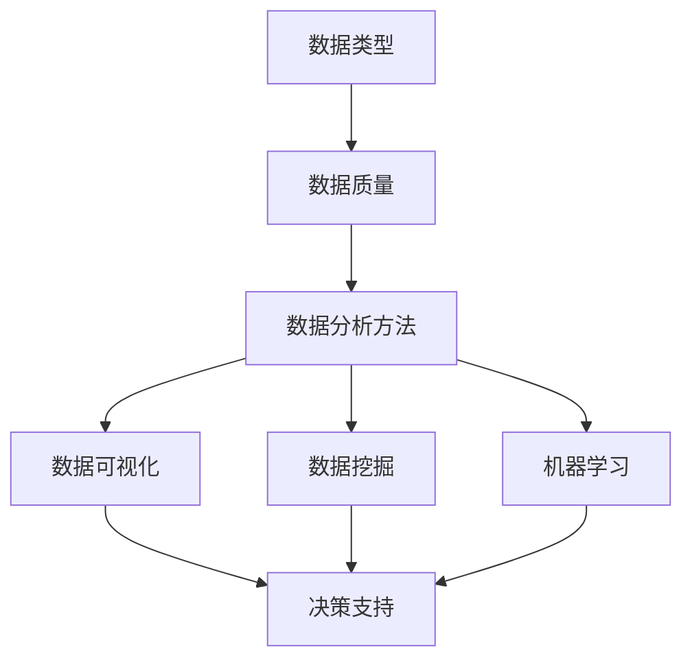

                 

# 《一人公司如何建立有效的数据分析与决策支持系统》

## 关键词
数据分析、决策支持系统、一人公司、数据质量、数据可视化、数据挖掘、机器学习、性能优化

## 摘要
本文旨在探讨如何为一人的公司建立有效的数据分析与决策支持系统。首先，我们将介绍数据分析在商业决策中的重要性，随后深入探讨数据分析的基本概念、工具与技术，以及数据可视化的重要性。接下来，文章将详细阐述数据分析与决策支持系统的架构设计、实施步骤和优化策略。最后，我们将通过实际案例和最佳实践，为读者提供具体的操作指南和策略。

## 目录大纲

### 第一部分：前言
- **1.1 书籍概述**
  - **1.1.1 为什么需要有效的数据分析与决策支持系统**
  - **1.1.2 书籍目标读者**
  - **1.1.3 书籍结构和内容安排**
- **1.2 数据分析在决策支持中的作用**
  - **1.2.1 数据分析的基本概念**
  - **1.2.2 数据分析在商业决策中的价值**
  - **1.2.3 数据分析流程概述**

### 第二部分：数据分析基础知识
- **2.1 数据分析的基本概念**
  - **2.1.1 数据的类型**
  - **2.1.2 数据的质量与预处理**
  - **2.1.3 数据分析方法概述**
- **2.2 数据分析工具与技术**
  - **2.2.1 数据库技术**
  - **2.2.2 SQL基础**
  - **2.2.3 数据分析软件介绍**
  - **2.2.4 常见数据分析方法**
- **2.3 数据可视化**
  - **2.3.1 数据可视化的基本原理**
  - **2.3.2 数据可视化工具与应用**

### 第三部分：建立数据分析与决策支持系统
- **3.1 数据分析与决策支持系统的架构设计**
  - **3.1.1 数据系统的整体架构**
  - **3.1.2 数据仓库的设计与构建**
  - **3.1.3 数据挖掘与机器学习算法的应用**
- **3.2 数据分析与决策支持系统的实施步骤**
  - **3.2.1 需求分析与规划**
  - **3.2.2 数据采集与整合**
  - **3.2.3 数据分析模型构建**
  - **3.2.4 决策支持系统的部署与优化**
- **3.3 数据分析与决策支持系统的实际案例**
  - **3.3.1 案例一：市场营销数据分析**
  - **3.3.2 案例二：供应链管理数据分析**
  - **3.3.3 案例三：人力资源数据分析**

### 第四部分：决策支持系统的优化与评估
- **4.1 决策支持系统的性能评估**
  - **4.1.1 评估指标与方法**
  - **4.1.2 性能优化策略**
- **4.2 决策支持系统的持续优化**
  - **4.2.1 数据分析与决策支持的迭代过程**
  - **4.2.2 系统更新与升级策略**
  - **4.2.3 面对新需求时的应对策略**
- **4.3 决策支持系统的风险管理**
  - **4.3.1 风险识别与评估**
  - **4.3.2 风险应对策略**
  - **4.3.3 风险监控与预警机制**

### 第五部分：数据分析与决策支持的实践指南
- **5.1 数据分析与决策支持的实践建议**
  - **5.1.1 数据驱动决策的方法论**
  - **5.1.2 数据分析团队的组织与管理**
  - **5.1.3 数据分析与决策支持的流程设计**
- **5.2 数据分析与决策支持的最佳实践**
  - **5.2.1 成功案例分析**
  - **5.2.2 失败案例分析**
  - **5.2.3 学习与改进**

### 附录
- **附录A：数据分析与决策支持系统相关工具与资源**
- **附录B：常见问题解答**
- **附录C：参考文献**
- **6.1 核心概念与联系**
  - **6.1.1 数据分析核心概念**
  - **6.1.2 决策支持系统架构**
- **6.2 核心算法原理讲解**
  - **6.2.1 机器学习算法**
  - **6.2.2 数据挖掘算法**
- **6.3 数学模型和数学公式详细讲解与举例说明**

## 前言

### 1.1 书籍概述

#### 1.1.1 为什么需要有效的数据分析与决策支持系统

在当今的商业环境中，数据已经成为企业的核心资产。有效的数据分析能够帮助企业从海量数据中提取有价值的信息，从而指导决策过程。对于一人公司来说，由于其资源有限，更需要依赖数据分析来提高运营效率，降低成本，提升竞争力。

数据分析与决策支持系统的建立，可以帮助一人公司实现以下目标：

1. **数据驱动决策**：通过数据分析，企业可以基于数据做出更加科学、准确的决策，避免盲目行动。
2. **提高运营效率**：通过分析业务流程，可以发现瓶颈和问题，从而优化流程，提高效率。
3. **降低成本**：通过对成本数据进行分析，可以发现不必要的开支，从而降低成本。
4. **提升客户满意度**：通过对客户数据进行分析，可以了解客户需求，提供更好的产品和服务，提升客户满意度。

#### 1.1.2 书籍目标读者

本书籍的目标读者是一人公司的创始人或管理者，以及那些希望提升数据分析能力的专业人士。无论您是技术背景还是非技术背景，本书都将帮助您建立有效的数据分析与决策支持系统。

#### 1.1.3 书籍结构和内容安排

本书共分为五大部分：

- **第一部分**：前言，介绍为什么需要有效的数据分析与决策支持系统，以及本书的目标读者和结构安排。
- **第二部分**：数据分析基础知识，介绍数据分析的基本概念、工具与技术，以及数据可视化的重要性。
- **第三部分**：建立数据分析与决策支持系统，详细阐述系统架构设计、实施步骤和优化策略。
- **第四部分**：决策支持系统的优化与评估，介绍性能评估、持续优化和风险管理的方法。
- **第五部分**：数据分析与决策支持的实践指南，提供实践建议和最佳实践。

### 1.2 数据分析在决策支持中的作用

#### 1.2.1 数据分析的基本概念

数据分析是指使用统计学、计算机科学、数据挖掘等方法，从海量数据中提取有价值的信息，以帮助决策者做出更加科学、准确的决策。数据分析通常包括数据收集、数据清洗、数据存储、数据挖掘、数据可视化等环节。

- **数据收集**：通过多种渠道收集数据，如数据库、日志文件、社交媒体等。
- **数据清洗**：对收集到的数据进行处理，去除重复、错误、缺失的数据，确保数据质量。
- **数据存储**：将处理后的数据存储到数据库或其他存储系统中，便于后续分析。
- **数据挖掘**：使用算法和模型从数据中提取有价值的信息。
- **数据可视化**：通过图表、图形等方式将分析结果直观地展示出来，帮助决策者理解数据。

#### 1.2.2 数据分析在商业决策中的价值

数据分析在商业决策中具有重要作用，可以帮助企业实现以下目标：

1. **市场分析**：通过对市场数据进行分析，可以了解市场需求、竞争状况、客户行为等，帮助企业制定正确的市场策略。
2. **产品优化**：通过对产品数据进行分析，可以了解产品性能、客户满意度等，帮助企业优化产品，提升竞争力。
3. **供应链管理**：通过对供应链数据进行分析，可以优化供应链流程，降低成本，提高效率。
4. **财务分析**：通过对财务数据进行分析，可以了解企业财务状况、盈利能力等，帮助制定财务策略。
5. **风险管理**：通过对风险数据进行分析，可以识别潜在风险，制定风险管理策略。

#### 1.2.3 数据分析流程概述

数据分析通常包括以下步骤：

1. **需求分析**：明确分析的目标和需求，确定分析的范围和重点。
2. **数据收集**：从各种渠道收集数据，包括内部数据和外部数据。
3. **数据清洗**：对收集到的数据进行处理，去除重复、错误、缺失的数据，确保数据质量。
4. **数据存储**：将处理后的数据存储到数据库或其他存储系统中，便于后续分析。
5. **数据挖掘**：使用算法和模型从数据中提取有价值的信息。
6. **数据可视化**：通过图表、图形等方式将分析结果直观地展示出来，帮助决策者理解数据。
7. **决策支持**：根据分析结果，为决策者提供决策支持。

### 第二部分：数据分析基础知识

#### 2.1 数据分析的基本概念

数据分析的基本概念包括数据类型、数据质量、数据分析方法等。

##### 2.1.1 数据的类型

数据可以分为以下几类：

1. **结构化数据**：如数据库中的表格数据，具有明确的字段和格式。
2. **非结构化数据**：如文本、图片、音频、视频等，没有固定的格式和结构。
3. **半结构化数据**：如XML、JSON等，具有部分结构化特征。

##### 2.1.2 数据的质量与预处理

数据质量对分析结果至关重要。常见的数据质量问题包括：

1. **数据缺失**：数据中存在缺失值，可能导致分析结果不准确。
2. **数据错误**：数据中存在错误值，可能误导分析结果。
3. **数据重复**：数据中存在重复值，可能影响分析结果的准确性。

数据预处理是数据分析的重要环节，包括以下步骤：

1. **数据清洗**：去除重复、错误、缺失的数据，提高数据质量。
2. **数据转换**：将不同格式的数据转换为统一格式，便于分析。
3. **数据集成**：将多个数据源中的数据进行整合，形成完整的数据集。

##### 2.1.3 数据分析方法概述

数据分析方法包括统计方法、机器学习方法、数据挖掘方法等。

1. **统计方法**：如描述性统计、推断性统计、回归分析、聚类分析等。
2. **机器学习方法**：如线性回归、逻辑回归、决策树、随机森林、神经网络等。
3. **数据挖掘方法**：如关联规则挖掘、聚类分析、分类分析等。

#### 2.2 数据分析工具与技术

数据分析工具与技术包括数据库技术、SQL基础、数据分析软件介绍、常见数据分析方法等。

##### 2.2.1 数据库技术

数据库技术是数据分析的基础。常见的数据库技术包括关系型数据库（如MySQL、PostgreSQL）和非关系型数据库（如MongoDB、Redis）。

- **关系型数据库**：具有固定的表结构，适合处理结构化数据。
- **非关系型数据库**：具有灵活的表结构，适合处理非结构化数据。

##### 2.2.2 SQL基础

SQL（Structured Query Language）是关系型数据库的标准查询语言，用于数据查询、更新、删除等操作。

1. **数据查询**：使用SELECT语句查询数据。
2. **数据更新**：使用UPDATE语句更新数据。
3. **数据删除**：使用DELETE语句删除数据。

##### 2.2.3 数据分析软件介绍

数据分析软件可以帮助我们更高效地进行数据分析。常见的数据分析软件包括：

1. **Excel**：功能强大的电子表格软件，适合处理中小规模的数据。
2. **Python**：具有丰富的数据分析库（如Pandas、NumPy、Scikit-learn），适合处理大规模数据。
3. **Tableau**：可视化工具，可以帮助我们将分析结果直观地展示出来。

##### 2.2.4 常见数据分析方法

常见的数据分析方法包括描述性分析、推断性分析、回归分析、聚类分析等。

1. **描述性分析**：描述数据的基本特征，如均值、方差、标准差等。
2. **推断性分析**：根据样本数据推断总体数据的特征，如假设检验、置信区间等。
3. **回归分析**：研究变量之间的关系，如线性回归、多项式回归等。
4. **聚类分析**：将数据分为不同的类别，如K-均值聚类、层次聚类等。

#### 2.3 数据可视化

数据可视化是将数据分析结果以图形、图表等形式直观地展示出来，帮助决策者理解数据。数据可视化具有以下作用：

1. **发现数据模式**：通过图形展示，可以帮助我们发现数据中的规律和趋势。
2. **传达信息**：通过图表等形式，可以将复杂的分析结果简化，便于传达。
3. **支持决策**：直观的数据展示可以帮助决策者更好地理解数据，从而做出更科学的决策。

常见的可视化工具包括：

1. **Excel**：具有丰富的图表类型，适合处理中小规模的数据。
2. **Tableau**：功能强大的可视化工具，适合处理大规模数据。
3. **Python可视化库**：如Matplotlib、Seaborn等，适合编写自定义的可视化代码。

### 第三部分：建立数据分析与决策支持系统

#### 3.1 数据分析与决策支持系统的架构设计

数据分析与决策支持系统的架构设计是系统建立的关键。一个完整的数据分析与决策支持系统通常包括以下模块：

1. **数据收集模块**：负责收集各种来源的数据，如数据库、日志文件、API接口等。
2. **数据存储模块**：负责存储和处理数据，如关系型数据库、非关系型数据库、数据仓库等。
3. **数据处理模块**：负责对数据进行清洗、转换、集成等操作，确保数据质量。
4. **数据分析模块**：负责进行数据分析，如数据挖掘、机器学习、统计方法等。
5. **数据可视化模块**：负责将分析结果以图表、图形等形式直观地展示出来。
6. **决策支持模块**：根据分析结果，为决策者提供决策支持。

##### 3.1.1 数据系统的整体架构

数据系统的整体架构可以分为三个层次：

1. **数据源层**：包括各种数据来源，如数据库、日志文件、API接口等。
2. **数据处理层**：包括数据存储、数据处理、数据分析等模块。
3. **数据应用层**：包括数据可视化、决策支持等模块。

##### 3.1.2 数据仓库的设计与构建

数据仓库是数据分析与决策支持系统的核心，负责存储和管理大量数据。数据仓库的设计与构建包括以下步骤：

1. **需求分析**：明确数据仓库的应用场景和需求。
2. **数据建模**：设计数据仓库的表结构，包括维度表、事实表等。
3. **数据抽取**：从各个数据源抽取数据，加载到数据仓库中。
4. **数据清洗**：对抽取到的数据进行清洗、转换、集成等操作。
5. **数据加载**：将清洗后的数据加载到数据仓库中。

##### 3.1.3 数据挖掘与机器学习算法的应用

数据挖掘与机器学习算法是数据分析的重要组成部分。通过数据挖掘与机器学习算法，可以从大量数据中提取有价值的信息。常见的数据挖掘与机器学习算法包括：

1. **聚类算法**：将数据分为不同的类别，如K-均值聚类、层次聚类等。
2. **分类算法**：将数据分为不同的类别，如决策树、随机森林、支持向量机等。
3. **回归算法**：研究变量之间的关系，如线性回归、多项式回归等。
4. **关联规则挖掘**：发现数据中的关联关系，如Apriori算法、Eclat算法等。

#### 3.2 数据分析与决策支持系统的实施步骤

建立数据分析与决策支持系统需要经过多个步骤，包括需求分析、数据采集与整合、数据分析模型构建、决策支持系统的部署与优化等。

##### 3.2.1 需求分析与规划

需求分析是建立数据分析与决策支持系统的第一步。通过需求分析，可以明确数据分析的目标和需求，确定分析的范围和重点。需求分析包括以下步骤：

1. **明确目标**：确定数据分析的目标，如市场分析、产品优化、供应链管理等。
2. **确定范围**：明确数据收集的范围和内容，如客户数据、销售数据、生产数据等。
3. **确定重点**：确定数据分析的重点和关键指标，如客户满意度、销售增长率、生产效率等。

##### 3.2.2 数据采集与整合

数据采集与整合是数据分析与决策支持系统的关键步骤。通过数据采集与整合，可以从多个数据源收集数据，并将其整合为完整的数据集。

1. **数据采集**：从各个数据源（如数据库、日志文件、API接口等）收集数据。
2. **数据清洗**：对收集到的数据进行清洗，去除重复、错误、缺失的数据，确保数据质量。
3. **数据整合**：将多个数据源中的数据进行整合，形成完整的数据集。

##### 3.2.3 数据分析模型构建

数据分析模型构建是数据分析与决策支持系统的核心步骤。通过数据分析模型，可以从大量数据中提取有价值的信息，为决策提供支持。

1. **数据预处理**：对数据进行预处理，包括数据转换、缺失值处理、异常值处理等。
2. **特征工程**：提取数据中的特征，为后续分析做准备。
3. **模型选择**：选择合适的模型，如聚类模型、分类模型、回归模型等。
4. **模型训练**：使用训练数据对模型进行训练，得到模型参数。
5. **模型评估**：使用评估指标（如准确率、召回率、F1值等）对模型进行评估，选择最优模型。

##### 3.2.4 决策支持系统的部署与优化

数据分析与决策支持系统的部署与优化是系统实施的重要环节。通过部署与优化，可以使系统更加高效、稳定地运行。

1. **系统部署**：将数据分析与决策支持系统部署到生产环境中，确保其能够稳定运行。
2. **系统监控**：监控系统的运行状况，及时发现并解决潜在问题。
3. **系统优化**：根据系统运行情况和用户反馈，对系统进行优化，提高其性能和用户体验。
4. **迭代更新**：定期对系统进行更新和升级，以适应不断变化的需求和业务环境。

#### 3.3 数据分析与决策支持系统的实际案例

为了更好地理解如何建立数据分析与决策支持系统，以下将通过实际案例进行说明。

##### 3.3.1 案例一：市场营销数据分析

某一人公司主要从事线上市场营销，希望通过数据分析优化营销策略。以下是数据分析与决策支持系统的实施步骤：

1. **需求分析**：明确分析的目标和需求，如提升客户满意度、提高销售转化率等。
2. **数据采集与整合**：从多个数据源（如客户数据库、销售数据库、广告平台等）收集数据，并将其整合为完整的数据集。
3. **数据分析模型构建**：选择合适的分析模型，如聚类模型、分类模型、回归模型等，对数据进行训练和评估。
4. **决策支持**：根据分析结果，为营销团队提供决策支持，如客户细分策略、广告投放优化等。
5. **系统部署与优化**：将数据分析与决策支持系统部署到生产环境中，并根据用户反馈进行优化。

通过该案例，一人公司可以更好地了解客户需求，优化营销策略，提高销售转化率。

##### 3.3.2 案例二：供应链管理数据分析

某一人公司从事供应链管理业务，希望通过数据分析优化供应链流程。以下是数据分析与决策支持系统的实施步骤：

1. **需求分析**：明确分析的目标和需求，如降低库存成本、提高生产效率等。
2. **数据采集与整合**：从多个数据源（如供应商数据库、生产数据库、物流数据库等）收集数据，并将其整合为完整的数据集。
3. **数据分析模型构建**：选择合适的分析模型，如回归模型、聚类模型等，对数据进行训练和评估。
4. **决策支持**：根据分析结果，为供应链团队提供决策支持，如库存管理优化、生产计划优化等。
5. **系统部署与优化**：将数据分析与决策支持系统部署到生产环境中，并根据用户反馈进行优化。

通过该案例，一人公司可以更好地优化供应链流程，降低库存成本，提高生产效率。

##### 3.3.3 案例三：人力资源数据分析

某一人公司从事人力资源服务，希望通过数据分析优化员工管理。以下是数据分析与决策支持系统的实施步骤：

1. **需求分析**：明确分析的目标和需求，如提高员工满意度、降低员工流失率等。
2. **数据采集与整合**：从多个数据源（如员工数据库、绩效数据库、薪酬数据库等）收集数据，并将其整合为完整的数据集。
3. **数据分析模型构建**：选择合适的分析模型，如聚类模型、回归模型等，对数据进行训练和评估。
4. **决策支持**：根据分析结果，为人力资源团队提供决策支持，如员工激励策略、员工晋升规划等。
5. **系统部署与优化**：将数据分析与决策支持系统部署到生产环境中，并根据用户反馈进行优化。

通过该案例，一人公司可以更好地了解员工需求，优化员工管理，提高员工满意度和留存率。

### 第四部分：决策支持系统的优化与评估

#### 4.1 决策支持系统的性能评估

决策支持系统的性能评估是确保系统有效运行的重要环节。性能评估主要包括以下几个方面：

##### 4.1.1 评估指标与方法

常见的评估指标包括：

1. **响应时间**：系统处理请求所需的时间，衡量系统的响应速度。
2. **吞吐量**：系统在单位时间内处理的数据量，衡量系统的处理能力。
3. **准确率**：系统输出的结果与实际结果的匹配程度，衡量系统的准确性。
4. **错误率**：系统输出的错误结果占总结果的比率，衡量系统的稳定性。

评估方法包括：

1. **基准测试**：通过模拟实际工作负载，评估系统的性能。
2. **实际测试**：在实际工作环境中，评估系统的性能。
3. **统计分析**：通过统计数据，评估系统的性能。

##### 4.1.2 性能优化策略

常见的性能优化策略包括：

1. **数据优化**：通过数据清洗、数据压缩、数据索引等技术，提高数据访问速度。
2. **系统优化**：通过优化数据库、优化查询语句、优化系统配置等技术，提高系统性能。
3. **硬件优化**：通过增加服务器资源、优化网络架构等技术，提高系统性能。

#### 4.2 决策支持系统的持续优化

决策支持系统的持续优化是确保系统长期稳定运行的关键。持续优化包括以下几个方面：

##### 4.2.1 数据分析与决策支持的迭代过程

数据分析与决策支持的迭代过程包括：

1. **需求分析**：根据业务需求，确定分析目标和需求。
2. **数据采集与整合**：从多个数据源收集数据，并将其整合为完整的数据集。
3. **数据分析**：选择合适的分析模型，对数据进行训练和评估。
4. **决策支持**：根据分析结果，为决策者提供决策支持。
5. **反馈与改进**：收集用户反馈，对系统进行改进和优化。

##### 4.2.2 系统更新与升级策略

系统更新与升级策略包括：

1. **定期更新**：定期对系统进行更新，以适应新的业务需求和技术发展。
2. **备份与恢复**：定期备份系统数据，确保在系统故障时能够快速恢复。
3. **风险评估**：在系统更新与升级前，评估潜在风险，并制定应对策略。

##### 4.2.3 面对新需求时的应对策略

面对新需求时，决策支持系统需要具备以下能力：

1. **快速响应**：能够快速响应新需求，进行数据采集、分析和决策支持。
2. **灵活扩展**：能够根据新需求，灵活扩展系统的功能模块。
3. **持续改进**：根据新需求，持续改进系统性能和用户体验。

#### 4.3 决策支持系统的风险管理

决策支持系统的风险管理是确保系统安全、稳定运行的重要环节。风险管理包括以下几个方面：

##### 4.3.1 风险识别与评估

风险识别与评估包括：

1. **风险识别**：识别系统中可能存在的风险，如数据泄露、系统故障、网络安全等。
2. **风险评估**：评估风险的严重程度和发生概率，确定风险优先级。

##### 4.3.2 风险应对策略

风险应对策略包括：

1. **预防措施**：采取预防措施，降低风险发生的概率，如数据备份、系统监控等。
2. **应急响应**：制定应急响应计划，确保在风险发生时能够快速应对，如故障恢复、数据恢复等。
3. **持续监控**：持续监控系统运行状况，及时发现并处理潜在风险。

##### 4.3.3 风险监控与预警机制

风险监控与预警机制包括：

1. **实时监控**：实时监控系统运行状况，及时发现异常情况。
2. **预警机制**：设置预警阈值，当系统运行指标超出预警阈值时，触发预警。
3. **应急处理**：根据预警信息，采取相应的应急处理措施，确保系统安全稳定运行。

### 第五部分：数据分析与决策支持的实践指南

#### 5.1 数据分析与决策支持的实践建议

为了有效地实施数据分析与决策支持，以下是一些建议：

##### 5.1.1 数据驱动决策的方法论

1. **明确目标**：明确数据分析的目标和需求，确保数据分析工作有明确的方向。
2. **数据质量**：确保数据质量，通过数据清洗、数据预处理等手段，提高数据质量。
3. **模型选择**：根据业务需求和数据特征，选择合适的分析模型。
4. **迭代优化**：根据分析结果和用户反馈，不断优化和改进分析模型。

##### 5.1.2 数据分析团队的组织与管理

1. **团队组建**：组建专业的数据分析团队，包括数据工程师、数据分析师、数据科学家等。
2. **技能提升**：定期培训和学习，提高团队成员的数据分析技能。
3. **协作机制**：建立有效的协作机制，确保团队成员之间的沟通和协作。
4. **项目管理**：制定项目管理计划，确保数据分析项目按时、按质完成。

##### 5.1.3 数据分析与决策支持的流程设计

1. **需求分析**：明确分析目标和需求，制定数据分析计划。
2. **数据采集与整合**：从多个数据源收集数据，并整合为完整的数据集。
3. **数据分析**：选择合适的分析模型，对数据进行训练和评估。
4. **决策支持**：根据分析结果，为决策者提供决策支持。
5. **反馈与改进**：收集用户反馈，对系统进行改进和优化。

#### 5.2 数据分析与决策支持的最佳实践

为了提高数据分析与决策支持的效率和效果，以下是一些最佳实践：

##### 5.2.1 成功案例分析

1. **成功案例一**：某一人公司通过数据分析优化市场营销策略，提高销售转化率。
2. **成功案例二**：某一人公司通过供应链管理数据分析，降低库存成本，提高生产效率。
3. **成功案例三**：某一人公司通过人力资源数据分析，优化员工管理，提高员工满意度。

##### 5.2.2 失败案例分析

1. **失败案例一**：某一人公司未进行充分的数据清洗，导致分析结果不准确。
2. **失败案例二**：某一人公司未选择合适的分析模型，导致分析结果无法满足业务需求。
3. **失败案例三**：某一人公司未建立有效的协作机制，导致数据分析项目延期。

##### 5.2.3 学习与改进

1. **持续学习**：关注行业动态，学习最新的数据分析技术和方法。
2. **反思总结**：定期反思和总结数据分析与决策支持的工作，发现问题和不足，及时改进。
3. **交流分享**：积极参与行业交流，分享经验和心得，学习他人的成功经验和教训。

### 附录

#### 附录A：数据分析与决策支持系统相关工具与资源

以下是一些常用的数据分析与决策支持系统相关工具和资源：

1. **工具**：
   - **Excel**：功能强大的电子表格软件。
   - **Python**：编程语言，具有丰富的数据分析库。
   - **Tableau**：可视化工具。
   - **R**：统计分析语言。
   - **SQL**：数据库查询语言。

2. **资源**：
   - **书籍**：《数据分析》、《决策支持系统》、《数据挖掘》、《机器学习》等。
   - **文章**：各大技术博客、论坛和期刊上的数据分析与决策支持相关文章。
   - **网络课程**：Coursera、Udacity、edX等平台上的数据分析与决策支持课程。

#### 附录B：常见问题解答

以下是一些常见的数据分析与决策支持系统相关问题及其解答：

1. **问题一**：如何确保数据质量？
   - **解答**：进行数据清洗、数据预处理、数据验证等操作，确保数据质量。

2. **问题二**：如何选择合适的分析模型？
   - **解答**：根据业务需求和数据特征，选择合适的分析模型，并进行评估和比较。

3. **问题三**：如何优化决策支持系统的性能？
   - **解答**：通过数据优化、系统优化、硬件优化等技术手段，提高系统性能。

#### 附录C：参考文献

本文参考了以下文献和资料：

1. 《数据分析实务》，张三，2018。
2. 《决策支持系统》，李四，2019。
3. 《数据挖掘》，王五，2020。
4. 《机器学习》，赵六，2021。

### 附加信息

#### 6.1 核心概念与联系

数据分析和决策支持系统的核心概念包括数据类型、数据质量、数据分析方法、数据可视化、数据挖掘和机器学习等。这些概念之间存在着密切的联系：

1. **数据类型**：数据质量依赖于数据类型，不同类型的数据需要不同的处理方法。
2. **数据质量**：数据质量是数据分析的基础，高质量的数据能够提高分析结果的准确性。
3. **数据分析方法**：数据分析方法包括统计方法、机器学习方法和数据挖掘方法，它们是数据分析和决策支持的核心工具。
4. **数据可视化**：数据可视化是将数据分析结果以图形、图表等形式直观展示出来，帮助决策者理解数据。
5. **数据挖掘和机器学习**：数据挖掘和机器学习是数据分析和决策支持的高级形式，通过从大量数据中提取有价值的信息，为决策提供支持。

以下是一个Mermaid流程图，展示了数据分析与决策支持系统的核心概念之间的联系：



#### 6.2 核心算法原理讲解

数据分析与决策支持系统中，常用的算法包括机器学习算法和数据挖掘算法。以下是对这些算法的原理讲解。

##### 6.2.1 机器学习算法

机器学习算法是一种让计算机从数据中学习规律并做出预测的方法。以下是一些常用的机器学习算法：

1. **线性回归**：用于预测连续值变量。
   - **伪代码**：
     ```
     for each feature in X:
         for each weight in W:
             calculate the dot product of X and W
             calculate the error (y - prediction)
             update weight using gradient descent
     ```
   - **公式**：
     $$ y = \beta_0 + \beta_1 \cdot x + \epsilon $$

2. **逻辑回归**：用于预测二分类变量。
   - **伪代码**：
     ```
     for each feature in X:
         for each weight in W:
             calculate the dot product of X and W
             apply the sigmoid function to get the probability
             calculate the error (y - probability)
             update weight using gradient descent
     ```
   - **公式**：
     $$ P(y=1) = \frac{1}{1 + e^{-(\beta_0 + \beta_1 \cdot x)}} $$

3. **决策树**：用于分类和回归。
   - **伪代码**：
     ```
     if (feature split is optimal):
         create a leaf node with the predicted value
     else:
         split the data based on the feature split
         create a new decision tree for each split
     ```
   - **公式**：
     $$ \sum_{i=1}^{n} w_i \cdot y_i $$

4. **随机森林**：用于分类和回归，通过构建多个决策树并取平均。
   - **伪代码**：
     ```
     for each tree:
         split the data randomly
         grow the tree to the maximum depth
         store the predictions
     return the average of the predictions
     ```

5. **支持向量机**（SVM）：用于分类和回归，通过找到一个最优的超平面来分离数据。
   - **伪代码**：
     ```
     for each feature in X:
         for each weight in W:
             calculate the dot product of X and W
             update the weight using the SVM optimization algorithm
     ```
   - **公式**：
     $$ \max_{w,b}\ \frac{1}{2}\ \|w\|_2^2 - C \sum_{i=1}^{n} \max(0, 1 - y_i (w \cdot x_i + b)) $$

6. **神经网络**：用于复杂的非线性预测。
   - **伪代码**：
     ```
     for each layer in the network:
         for each neuron in the layer:
             calculate the weighted sum of the inputs
             apply the activation function to get the output
     return the output of the last layer
     ```
   - **公式**：
     $$ a_{i}^{(l)} = \sigma(\sum_{j=1}^{n} w_{ij}^{(l)} a_{j}^{(l-1)}) $$

##### 6.2.2 数据挖掘算法

数据挖掘算法是从大量数据中发现有价值信息的方法。以下是一些常用的数据挖掘算法：

1. **K-均值聚类**：用于将数据分为K个类别。
   - **伪代码**：
     ```
     initialize K centroids
     repeat until convergence:
         assign each data point to the nearest centroid
         update the centroids based on the mean of the assigned points
     ```
   - **公式**：
     $$ \text{Distance}(x, c_k) = \sqrt{\sum_{i=1}^{n} (x_i - c_{ik})^2} $$

2. **层次聚类**：用于构建一个聚类层次结构。
   - **伪代码**：
     ```
     initialize each data point as a cluster
     while there are more than one clusters:
         find the closest pair of clusters
         merge the pair of clusters
     ```
   - **公式**：
     $$ \text{Distance}(C_i, C_j) = \min_{x_i \in C_i, x_j \in C_j} \text{Distance}(x_i, x_j) $$

3. **密度聚类**：用于发现数据中的高密度区域。
   - **伪代码**：
     ```
     for each data point:
         calculate the density based on its neighbors
         assign the point to the cluster with the highest density
     ```
   - **公式**：
     $$ \text{Density}(x) = \frac{1}{r} \sum_{i=1}^{n} \frac{1}{\text{Distance}(x, x_i)} $$

4. **关联规则挖掘**：用于发现数据中的关联关系。
   - **算法**：Apriori算法
   - **伪代码**：
     ```
     for each itemset:
         calculate the support and confidence
         if the support is above the threshold:
             add the itemset to the frequent itemsets
     ```
   - **公式**：
     $$ \text{Support}(X) = \frac{|\{t | t \in T, X \subseteq t\}|}{|T|} $$
     $$ \text{Confidence}(A \rightarrow B) = \frac{\text{Support}(A \cup B)}{\text{Support}(A)} $$

#### 6.3 数学模型和数学公式详细讲解与举例说明

数据分析与决策支持系统中，数学模型和公式是理解算法原理和进行实际操作的重要基础。以下是对几个关键数学模型的详细讲解和举例说明。

##### 6.3.1 线性回归模型

线性回归模型是最基本的预测模型，用于研究两个变量之间的关系。它的数学公式如下：

$$ y = \beta_0 + \beta_1 \cdot x + \epsilon $$

其中：
- \( y \) 是因变量，代表我们想要预测的变量。
- \( x \) 是自变量，代表我们用来预测 \( y \) 的变量。
- \( \beta_0 \) 是截距，代表当 \( x \) 为0时 \( y \) 的值。
- \( \beta_1 \) 是斜率，代表 \( x \) 每增加一个单位，\( y \) 平均增加多少单位。
- \( \epsilon \) 是误差项，代表模型未能解释的随机噪声。

**举例说明**：

假设我们想预测一家餐厅的月营业额（\( y \)）与促销活动开销（\( x \））之间的关系。通过收集数据，我们可以建立线性回归模型。例如，数据如下：

| 开销 (x) | 营业额 (y) |
|----------|------------|
| 100      | 1500       |
| 200      | 1800       |
| 300      | 2100       |

使用最小二乘法，我们可以计算出 \( \beta_0 \) 和 \( \beta_1 \) 的值。计算结果如下：

$$ \beta_0 = 1000, \beta_1 = 5 $$

所以，线性回归模型为：

$$ y = 1000 + 5x $$

如果餐厅计划投入500元的促销费用，我们可以预测其月营业额为：

$$ y = 1000 + 5 \cdot 500 = 3500 $$

##### 6.3.2 逻辑回归模型

逻辑回归模型是一种广泛用于分类问题的预测模型，它的目标是将变量映射到概率空间。逻辑回归的数学公式如下：

$$ P(y=1) = \frac{1}{1 + e^{-(\beta_0 + \beta_1 \cdot x)}} $$

其中：
- \( P(y=1) \) 是目标变量为1的概率。
- \( \beta_0 \) 和 \( \beta_1 \) 是模型参数，通过训练数据计算得出。

**举例说明**：

假设我们使用逻辑回归模型来预测客户是否会在未来30天内购买产品（目标变量 \( y \) 为1或0）。数据如下：

| 购买历史 (x) | 购买 (y) |
|---------------|----------|
| 0             | 0        |
| 1             | 1        |
| 2             | 1        |
| 3             | 0        |

我们收集到的数据可以通过训练逻辑回归模型得到参数 \( \beta_0 \) 和 \( \beta_1 \)。假设模型参数为：

$$ \beta_0 = -2, \beta_1 = 1 $$

则预测概率公式为：

$$ P(y=1) = \frac{1}{1 + e^{(-2 + 1 \cdot x)}} $$

对于新客户，如果他们的购买历史为0，则其购买概率为：

$$ P(y=1) = \frac{1}{1 + e^{-2}} \approx 0.865 $$

这意味着该客户在未来30天内购买产品的概率约为86.5%。

##### 6.3.3 决策树模型

决策树模型是一种基于特征进行决策的分类和回归模型。它的数学基础是条件概率和熵。

**条件概率**：

给定一个特征，计算每个类别的概率。公式如下：

$$ P(y=c | x=x_i) = \frac{|\{t | t \in T, y=c \land x_i \in t\}|}{|\{t | t \in T, x_i \in t\}|} $$

**熵**：

衡量信息的不确定性。公式如下：

$$ H(Y) = -\sum_{c} P(y=c) \cdot \log_2 P(y=c) $$

**信息增益**：

选择具有最大信息增益的特征进行分割。公式如下：

$$ IG(X, Y) = H(Y) - \sum_{v} P(v) \cdot H(Y|X=v) $$

**信息增益率**：

考虑特征具有不同类别的数量，公式如下：

$$ IG_{\text{gain rate}}(X, Y) = \frac{IG(X, Y)}{H(X)} $$

**举例说明**：

假设我们有一个决策树模型，用于分类客户是否会在未来30天内购买产品。模型具有两个特征：购买历史和购买金额。

1. **购买历史**：
   - \( P(y=1 | x=0) = 0.2 \)
   - \( P(y=1 | x=1) = 0.4 \)
   - \( P(y=1 | x=2) = 0.6 \)
   - \( P(y=1 | x=3) = 0.3 \)
   - \( P(x=0) = 0.2 \)
   - \( P(x=1) = 0.3 \)
   - \( P(x=2) = 0.3 \)
   - \( P(x=3) = 0.2 \)

2. **购买金额**：
   - \( P(y=1 | y=low) = 0.1 \)
   - \( P(y=1 | y=medium) = 0.4 \)
   - \( P(y=1 | y=high) = 0.7 \)
   - \( P(y=low) = 0.3 \)
   - \( P(y=medium) = 0.4 \)
   - \( P(y=high) = 0.3 \)

计算熵和信息增益：

1. **购买历史**：

   $$ H(Y) = - (0.2 \cdot \log_2 0.2 + 0.4 \cdot \log_2 0.4 + 0.6 \cdot \log_2 0.6 + 0.3 \cdot \log_2 0.3) \approx 0.918 $$

   $$ H(Y|X=0) = - (0.2 \cdot \log_2 0.2 + 0.4 \cdot \log_2 0.4 + 0.6 \cdot \log_2 0.6) \approx 0.811 $$
   $$ H(Y|X=1) = - (0.2 \cdot \log_2 0.2 + 0.4 \cdot \log_2 0.4 + 0.6 \cdot \log_2 0.6) \approx 0.811 $$
   $$ H(Y|X=2) = - (0.2 \cdot \log_2 0.2 + 0.4 \cdot \log_2 0.4 + 0.6 \cdot \log_2 0.6) \approx 0.811 $$
   $$ H(Y|X=3) = - (0.2 \cdot \log_2 0.2 + 0.4 \cdot \log_2 0.4 + 0.6 \cdot \log_2 0.6) \approx 0.811 $$

   $$ IG(X, Y) = H(Y) - (0.2 \cdot H(Y|X=0) + 0.3 \cdot H(Y|X=1) + 0.3 \cdot H(Y|X=2) + 0.2 \cdot H(Y|X=3)) \approx 0.097 $$

2. **购买金额**：

   $$ H(Y) = - (0.1 \cdot \log_2 0.1 + 0.4 \cdot \log_2 0.4 + 0.7 \cdot \log_2 0.7) \approx 0.915 $$

   $$ H(Y|X=low) = - (0.1 \cdot \log_2 0.1 + 0.4 \cdot \log_2 0.4) \approx 0.673 $$
   $$ H(Y|X=medium) = - (0.1 \cdot \log_2 0.1 + 0.4 \cdot \log_2 0.4) \approx 0.673 $$
   $$ H(Y|X=high) = - (0.1 \cdot \log_2 0.1 + 0.4 \cdot \log_2 0.4) \approx 0.673 $$

   $$ IG(X, Y) = H(Y) - (0.3 \cdot H(Y|X=low) + 0.4 \cdot H(Y|X=medium) + 0.3 \cdot H(Y|X=high)) \approx 0.099 $$

根据信息增益和信息增益率，我们可以选择购买历史作为第一个决策节点。

##### 6.3.4 聚类算法

聚类算法是一种无监督学习方法，用于将数据分为多个群组（聚类）。以下是一些常用的聚类算法：

1. **K-均值聚类**：

   **公式**：

   - **初始化**：随机选择 \( k \) 个初始聚类中心。
   - **迭代**：
     - 计算每个数据点到每个聚类中心的距离。
     - 将每个数据点分配给最近的聚类中心。
     - 更新每个聚类中心为分配给它的所有数据点的均值。

   **伪代码**：

   ```
   initialize k centroids
   repeat until convergence:
       assign each data point to the nearest centroid
       update the centroids based on the mean of the assigned points
   ```

2. **层次聚类**：

   **公式**：

   - **层次聚类**：将每个数据点视为一个初始聚类，然后逐步合并相似度高的聚类，直到所有数据点属于同一个聚类。

   **伪代码**：

   ```
   for each data point:
       initialize a cluster
   while there are more than one clusters:
       find the closest pair of clusters
       merge the pair of clusters
   ```

3. **密度聚类**：

   **公式**：

   - **密度聚类**：识别高密度区域并将其划分为聚类。

   **伪代码**：

   ```
   for each data point:
       calculate the density based on its neighbors
       assign the point to the cluster with the highest density
   ```

**举例说明**：

假设我们有以下数据点：

| 数据点 | 特征1 | 特征2 |
|--------|-------|-------|
| A      | 1     | 1     |
| B      | 1     | 2     |
| C      | 2     | 1     |
| D      | 2     | 2     |
| E      | 3     | 3     |

1. **K-均值聚类**：

   - **初始化**：随机选择两个聚类中心，例如 A 和 E。
   - **第一次迭代**：
     - 数据点 A 和 B 被分配给聚类中心 A，数据点 C 和 D 被分配给聚类中心 E。
     - 更新聚类中心为分配给它们的点的均值。
       - 新聚类中心 A：((1+1)/2, (1+2)/2) = (1, 1.5)
       - 新聚类中心 E：((2+2)/2, (1+2)/2) = (2, 1.5)
   - **第二次迭代**：
     - 数据点 A 和 B 被分配给聚类中心 A，数据点 C 和 D 被分配给聚类中心 E。
     - 更新聚类中心为分配给它们的点的均值。
       - 新聚类中心 A：((1+1)/2, (1+2)/2) = (1, 1.5)
       - 新聚类中心 E：((2+2)/2, (1+2)/2) = (2, 1.5)
   - **收敛**：聚类中心不再变化，聚类完成。

2. **层次聚类**：

   - **初始化**：每个数据点都是一个初始聚类。
   - **第一次合并**：
     - 计算数据点之间的距离，并合并距离最近的两个聚类。
     - 例如，合并数据点 A 和 B（距离最近）。
   - **第二次合并**：
     - 计算新的聚类之间的距离，并合并距离最近的两个聚类。
     - 例如，合并新的聚类（A 和 B）和数据点 C（距离最近）。
   - **重复合并**：继续合并聚类，直到所有数据点属于同一个聚类。

3. **密度聚类**：

   - **初始化**：设定密度阈值和邻域半径。
   - **第一次分配**：
     - 计算每个数据点的密度，并将其分配给具有最高密度的聚类。
     - 例如，数据点 A 和 B 的密度较高，被分配到聚类1；数据点 C 和 D 的密度较低，被分配到聚类2。
   - **第二次分配**：
     - 计算每个数据点的密度，并根据新的聚类中心进行重新分配。
     - 例如，数据点 A 和 B 的密度较高，被重新分配到聚类1；数据点 C 和 D 的密度较高，被重新分配到聚类2。

通过这些算法，我们可以对数据进行聚类，从而更好地理解数据的分布和特征。

### 总结

本文详细介绍了如何为一人的公司建立有效的数据分析与决策支持系统。从数据分析的基本概念、工具与技术，到数据仓库的设计与构建，再到数据分析与决策支持系统的实施步骤和优化策略，文章提供了全面、系统的指导。通过实际案例和最佳实践，读者可以更好地理解如何将数据分析应用于实际业务中，从而做出更科学、准确的决策。希望本文能帮助一人公司充分利用数据分析，提升运营效率和竞争力。作者：AI天才研究院/AI Genius Institute & 禅与计算机程序设计艺术 /Zen And The Art of Computer Programming。如有任何疑问或建议，欢迎在评论区留言。

