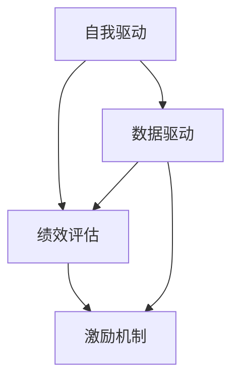

                 

### 文章标题：一人公司如何建立有效的绩效评估与激励机制

### 关键词：一人公司、绩效评估、激励机制、管理策略、自我驱动

### 摘要：
本文旨在探讨一人公司在构建有效的绩效评估与激励机制方面的策略与路径。首先，通过对一人公司的定义与特点进行概述，帮助读者理解这种组织形式的独特性及其面临的挑战。接着，深入分析绩效评估的基础概念、具体实施方法以及工具与软件的应用。随后，探讨激励机制的基础概念、薪酬激励设计以及非财务激励的实施。文章最后结合实际案例，总结绩效评估与激励机制的有效结合，提供实践中的最佳经验和注意事项。

### 《一人公司如何建立有效的绩效评估与激励机制》目录大纲

---

# 《一人公司如何建立有效的绩效评估与激励机制》

## 第一部分：一人公司概述与绩效评估

### 第1章：一人公司的定义与特点
#### 1.1 一人公司的定义
#### 1.2 一人公司的优势与挑战
#### 1.3 一人公司的管理模式

### 第2章：绩效评估的基础概念
#### 2.1 绩效评估的定义与目的
#### 2.2 绩效评估的类型
#### 2.3 绩效评估的流程与步骤

## 第二部分：绩效评估的具体实施方法

### 第3章：定量绩效评估方法
#### 3.1 关键绩效指标（KPI）的设定
#### 3.2 目标管理法（MBO）的应用
#### 3.3 数据驱动的绩效评估

### 第4章：定性绩效评估方法
#### 4.1 360度反馈法
#### 4.2 行为事件访谈法（BEI）
#### 4.3 主观评分法的应用

### 第5章：绩效评估的工具与软件
#### 5.1 绩效管理软件的选择
#### 5.2 常用的绩效评估工具
#### 5.3 绩效评估软件的实施与操作

## 第三部分：激励机制的设计与实施

### 第6章：激励机制的基础概念
#### 6.1 激励机制的分类
#### 6.2 激励理论的应用
#### 6.3 激励机制的设定原则

### 第7章：薪酬激励设计
#### 7.1 基本薪酬与绩效薪酬
#### 7.2 奖金与提成制度
#### 7.3 股权激励方案的设计

### 第8章：非财务激励
#### 8.1 工作环境与员工关怀
#### 8.2 培训与职业发展
#### 8.3 荣誉与认可制度

## 第四部分：绩效评估与激励机制的综合应用

### 第9章：绩效评估与激励机制的有效结合
#### 9.1 绩效评估与激励机制的关系
#### 9.2 绩效评估结果在激励机制中的应用
#### 9.3 绩效评估与激励机制的反馈与改进

### 第10章：案例分析
#### 10.1 成功案例分析
#### 10.2 失败案例分析
#### 10.3 案例启示与经验总结

# 附录

## 附录A：常用绩效评估与激励机制工具表格
## 附录B：绩效评估与激励机制相关法律法规
## 附录C：参考文献与推荐阅读

---

### 文章正文部分内容将按照上述大纲逐步展开，每个章节都将结合实际案例和深度分析，以帮助读者全面理解和应用一人公司绩效评估与激励机制。文章将采用markdown格式，确保内容的可读性和可操作性。## 第1章：一人公司的定义与特点

### 1.1 一人公司的定义

一人公司，顾名思义，是指公司中仅有一名员工或股东的公司。这种组织形式在法律上是完全合法的，尤其是在一些国家如新加坡、英国和美国等地，一人公司已经成为一种普遍存在的公司形式。根据各国公司法的规定，一人公司可以采用私人股份有限公司、有限责任公司等形式，但公司名称通常会在公司名字后面加上“LLC”、“LLP”或“Sole Proprietorship”等字样，以明确其一人公司的性质。

一人公司的出现主要源于以下几个原因。首先，随着互联网和电子商务的快速发展，创业者们可以轻松地在全球范围内开展业务，而不再受限于地域和物理空间的限制。其次，一人公司具有较低的设立和维护成本，创业者可以更加灵活地控制公司的运营和管理。最后，一人公司为创业者提供了一个独立的风险隔离平台，使得他们在创业过程中可以更加专注于业务的发展而无需过多担忧法律和财务风险。

### 1.2 一人公司的优势与挑战

#### 优势

1. **灵活性**：一人公司的管理结构相对简单，决策过程迅速，不需要经过繁琐的董事会会议和股东会决议，使得公司能够更加灵活地应对市场变化。
2. **成本效益**：一人公司的设立和维护成本较低，创业者无需承担额外的法律和会计费用，可以节省大量的运营成本。
3. **风险隔离**：一人公司可以有效隔离个人财产与公司资产，降低个人风险，确保创业者个人财产的安全。
4. **个性化**：由于公司仅有一名员工，公司文化和管理风格可以更加个性化，有助于建立独特的品牌形象。

#### 挑战

1. **人才瓶颈**：一人公司往往难以吸引和留住高水平的专业人才，这对于公司的长期发展可能会形成瓶颈。
2. **管理难度**：一人公司的管理责任全部集中在创始人一人身上，管理难度较大，可能难以全面兼顾公司各项事务。
3. **资源限制**：一人公司可能面临资源受限的问题，包括资金、信息和人脉等，这可能会影响公司的竞争力和创新能力。
4. **缺乏监督**：一人公司缺乏外部监督，创始人可能会在决策时缺乏客观性和专业性。

### 1.3 一人公司的管理模式

一人公司的管理模式与传统公司存在显著差异，以下是一些关键的管理策略：

#### 灵活的管理结构

一人公司的管理结构通常非常简单，通常由创始人自己负责所有关键职能，如战略规划、市场营销、客户服务和财务管理等。为了提高效率，创始人可能会采用“角色分离”策略，即在不同时间扮演不同的角色，例如，在 mornings负责市场营销，在afternoons负责客户服务，在 evenings负责财务管理。

#### 自我驱动的工作文化

一人公司需要建立一种自我驱动的工作文化，以激励创始人保持高效率和积极的态度。这可以通过设定明确的目标和关键绩效指标（KPI），并定期进行自我评估来实现。同时，建立一套合理的激励机制，如奖金、股权激励等，可以进一步激发创始人的工作热情。

#### 数据驱动的决策

一人公司应该充分利用数据来驱动决策。创始人需要定期收集和分析业务数据，如销售额、客户满意度、市场趋势等，以便做出更明智的决策。数据驱动的决策可以帮助创始人更好地了解市场动态，优化业务流程，提高公司竞争力。

#### 外部合作与资源整合

尽管一人公司规模较小，但通过外部合作与资源整合，可以有效弥补内部资源的不足。例如，与供应商建立长期合作关系，可以确保原材料供应的稳定；与专业顾问合作，可以获得专业的咨询建议；参加行业会议和研讨会，可以拓展人脉和信息渠道。

### 总结

一人公司在当前商业环境中具有独特的优势，如灵活性、成本效益和风险隔离等。然而，它们也面临着人才瓶颈、管理难度和资源限制等挑战。为了克服这些挑战，一人公司需要采用灵活的管理模式，建立自我驱动的工作文化，利用数据驱动决策，并积极寻求外部合作与资源整合。通过这些策略，一人公司可以在竞争激烈的市场中保持竞争力，实现可持续发展。

### 背景介绍

随着全球经济的不断发展和技术的迅速进步，创业环境变得更加开放和包容。一人公司作为创业的一种新型模式，逐渐得到了越来越多创业者的青睐。这种公司形式不仅降低了创业门槛，还使得创业者可以更加专注于业务本身，而不必过多考虑组织结构和运营成本。然而，一人公司在管理、绩效评估和激励机制方面也面临着独特的挑战。

首先，一人公司通常缺乏人力资源，这意味着创始人需要同时扮演多个角色，如战略规划、市场营销、客户服务和财务管理等。这种多任务处理对创始人的时间管理能力和工作压力提出了极高的要求。因此，如何有效地进行自我管理和提高工作效率成为一人公司必须解决的问题。

其次，由于一人公司规模较小，员工数量有限，因此很难吸引和留住高水平的专业人才。这给公司的长期发展带来了潜在的瓶颈。如何建立有效的激励机制，提高员工满意度和忠诚度，成为一人公司亟需解决的重要问题。

此外，一人公司在绩效评估方面也面临独特的挑战。传统的绩效评估方法往往依赖于团队协作和外部反馈，而一人公司由于缺乏团队和外部反馈，如何建立科学的绩效评估体系成为一个难题。有效的绩效评估不仅能够帮助创始人了解自身的工作表现，还能为未来的发展规划提供重要的参考依据。

最后，一人公司需要在财务和业务数据的基础上做出快速、准确的决策。然而，由于数据收集和分析的能力相对有限，如何通过数据驱动决策，优化业务流程，提高公司竞争力，成为一人公司必须克服的另一个挑战。

总的来说，一人公司在享受灵活性、低成本等优势的同时，也面临着人才瓶颈、管理难度和绩效评估等一系列挑战。这些挑战需要通过科学的管理策略和有效的激励机制来解决，以实现公司的可持续发展。

### 核心概念与联系

在探讨一人公司如何进行绩效评估与激励机制之前，我们首先需要明确几个核心概念，并理解它们之间的相互关系。以下是几个关键概念的定义及其相互关系：

#### 1. 绩效评估

绩效评估是指通过一定的标准和指标，对员工的工作表现进行客观、公正的评估和反馈。其目的是为了激发员工的工作积极性，提高工作效率和业绩，同时为员工的职业发展提供参考。

#### 2. 激励机制

激励机制是指通过一系列措施，如薪酬、奖金、股权激励等，来激发员工的工作热情和积极性。激励机制的目的是为了提高员工的满意度和忠诚度，从而提高整体绩效。

#### 3. 自我驱动

自我驱动是指员工在没有外部压力的情况下，能够主动地完成工作任务，并追求卓越。自我驱动是绩效评估与激励机制的核心，它能够帮助员工克服工作上的困难，提高工作效率和业绩。

#### 4. 数据驱动

数据驱动是指基于实际数据进行分析和决策，而不是仅仅依赖于经验和直觉。数据驱动可以帮助一人公司更加科学地制定绩效评估标准和激励机制，提高管理效率和决策质量。

#### 关系架构

以上概念之间的关系可以用Mermaid流程图来表示：

#### 解释

- **自我驱动** 是绩效评估与激励机制的基础。只有当员工具备自我驱动力时，他们才会更加积极主动地完成工作任务，从而提高绩效。
- **数据驱动** 为绩效评估与激励机制提供了科学依据。通过收集和分析数据，一人公司可以更加准确地制定绩效评估标准和激励机制，从而提高管理效率和决策质量。
- **绩效评估** 是连接自我驱动和数据驱动的桥梁。通过绩效评估，一人公司可以了解员工的工作表现，为激励机制的制定提供参考。
- **激励机制** 则是绩效评估的结果应用。通过激励机制，一人公司可以激发员工的自我驱动，提高工作效率和业绩。

通过这个关系架构，我们可以看到绩效评估与激励机制在一个闭环中相互作用，共同促进一人公司的可持续发展。理解这些核心概念及其相互关系，对于一人公司建立有效的绩效评估与激励机制至关重要。

### 第2章：绩效评估的基础概念

### 2.1 绩效评估的定义与目的

绩效评估是一种系统性的过程，通过一系列的指标和标准，对员工在工作中的表现进行评估和反馈。绩效评估的定义可以简单概括为：对员工的工作成效、工作能力和工作行为进行客观、公正的评估，以便为员工的职业发展、晋升和薪酬调整提供依据。

#### 目的

绩效评估的目的主要有以下几个方面：

1. **提高工作效率**：通过绩效评估，员工可以明确自己的工作目标和任务，了解自己在工作中的表现，从而有针对性地进行改进，提高工作效率。
2. **激励员工积极性**：绩效评估的结果可以作为激励机制的重要依据，通过奖励优秀员工、提升他们的职业发展机会，激发全体员工的工作积极性。
3. **促进职业发展**：绩效评估为员工的职业发展提供了反馈和指导，员工可以根据评估结果制定个人职业规划，不断提升自己的能力和业绩。
4. **优化人力资源配置**：通过绩效评估，公司可以识别出高绩效员工和需要改进的员工，从而合理配置人力资源，提高整体人力资源管理水平。

### 2.2 绩效评估的类型

绩效评估可以分为多种类型，根据不同的评估目的和方式，可以分为以下几种：

1. **定量绩效评估**：定量绩效评估主要依靠量化的指标和标准，对员工的工作表现进行评估。例如，通过销售额、客户满意度、项目完成度等具体数据来衡量员工的表现。定量绩效评估的优点是客观、可量化，缺点是可能忽视员工的工作质量和工作态度。
   
2. **定性绩效评估**：定性绩效评估主要通过主观评价和描述，对员工的工作表现进行评估。例如，通过上级领导、同事、客户的评价和反馈，对员工的工作态度、团队协作能力、创新能力等进行评估。定性绩效评估的优点是全面、细致，缺点是主观性强，容易受到评估者的个人偏见影响。

3. **360度反馈评估**：360度反馈评估是一种全面评估方法，通过收集来自员工的上司、同事、下属和客户的反馈，对员工的工作表现进行全面评估。这种方法可以提供多角度、多层面的反馈，帮助员工更全面地了解自己的工作表现。360度反馈评估的优点是全面、客观，缺点是操作复杂，需要投入大量时间和资源。

4. **行为事件访谈法（BEI）**：行为事件访谈法是一种通过深入访谈，了解员工在工作中的具体行为和表现的方法。通过分析员工在关键事件中的行为，评估员工的能力和潜力。这种方法优点是详细、具体，缺点是耗时较长，对访谈者的要求较高。

### 2.3 绩效评估的流程与步骤

绩效评估的流程通常包括以下几个步骤：

1. **制定绩效计划**：在评估周期开始时，公司应该明确评估的目标和标准，并与员工共同制定绩效计划。绩效计划应包括具体的绩效指标、评估周期和评估方法等。

2. **日常跟踪与记录**：在日常工作中，管理者需要及时跟踪员工的工作表现，并记录关键事件和行为。这些记录将为后续的绩效评估提供重要的依据。

3. **评估周期内的反馈**：在评估周期内，管理者应定期与员工进行沟通和反馈，及时指出员工的工作优点和需要改进的地方，帮助员工不断提升。

4. **绩效评估会议**：在评估周期结束时，管理者应组织绩效评估会议，根据前期记录和反馈，对员工的工作表现进行综合评估。

5. **绩效反馈与改进**：在绩效评估会议结束后，管理者应向员工提供详细的绩效反馈，并制定改进计划。员工应根据反馈进行自我提升和调整。

6. **绩效结果应用**：绩效评估的结果可以应用于薪酬调整、晋升和职业发展等多个方面。通过将绩效结果与激励措施相结合，可以有效激发员工的工作热情和积极性。

通过上述流程和步骤，一人公司可以建立一套科学、合理的绩效评估体系，为员工的工作表现提供客观、公正的评估，同时为公司的管理决策提供重要依据。

### 第3章：定量绩效评估方法

### 3.1 关键绩效指标（KPI）的设定

关键绩效指标（KPI）是定量绩效评估的核心工具，用于衡量员工在特定维度上的工作表现。设定有效的KPI对一人公司的绩效评估至关重要。以下是如何设定KPI的详细步骤：

#### 1. 确定公司目标

首先，一人公司需要明确其业务目标和战略方向。公司目标应具体、可衡量，例如提高销售额、提升客户满意度、缩短产品开发周期等。这些目标将成为设定KPI的基础。

#### 2. 确定关键成功因素

在明确公司目标后，需要识别实现这些目标的关键成功因素。例如，如果目标是提高销售额，关键成功因素可能包括销售数量、客户满意度、市场占有率等。

#### 3. 制定具体的KPI

根据关键成功因素，制定具体的KPI。这些KPI应与公司目标直接相关，并能够量化员工的工作表现。以下是一些常见的KPI：

- **销售业绩**：通过销售额、销售数量、订单数量等指标来衡量。
- **客户满意度**：通过客户满意度调查、投诉率、客户保留率等指标来衡量。
- **工作效率**：通过工作完成时间、任务完成率、错误率等指标来衡量。
- **创新能力**：通过新产品开发数量、创新提案数量、专利申请数量等指标来衡量。

#### 4. 确保KPI的可实现性

在设定KPI时，需要确保这些指标是可实现的。这意味着KPI应既具有挑战性，又要符合员工的实际能力。例如，设定一个过高的销售额目标可能会使员工感到沮丧和无法实现。

#### 5. 与员工沟通

在设定KPI后，应与员工进行充分沟通，确保他们理解KPI的含义和评估方法。员工应参与KPI的制定过程，以提高他们的参与感和责任感。

### 3.2 目标管理法（MBO）的应用

目标管理法（MBO）是一种以目标和绩效为导向的管理方法，强调上下级之间共同制定目标，并通过持续沟通和反馈来确保目标的实现。以下是MBO在定量绩效评估中的应用步骤：

#### 1. 制定整体目标

一人公司的管理者应首先制定公司的整体目标，这些目标应与公司的战略和愿景一致。例如，公司可能设定在下一季度提高销售额20%的目标。

#### 2. 分解目标

将整体目标分解为更具体、可操作的分目标，并将其分配给各个员工。例如，如果整体目标是提高销售额，每个销售团队或销售人员可以设定具体的销售目标。

#### 3. 设定评估标准

为每个分目标设定评估标准，这些标准应明确、量化，以便于后续的绩效评估。例如，销售额可以按月或季度进行衡量。

#### 4. 沟通与共识

与员工讨论并确定他们的个人目标和评估标准，确保员工理解并认同这些目标。通过沟通和共识，可以增强员工的参与感和责任感。

#### 5. 持续跟踪与反馈

在整个目标实现过程中，管理者应定期与员工进行沟通和反馈，了解目标的进展情况，并提供必要的支持和指导。这有助于确保目标按计划进行。

#### 6. 绩效评估

在目标实现周期结束后，根据设定的评估标准对员工的工作表现进行评估。通过绩效评估，可以确定员工是否达到目标，并为下一步的工作提供参考。

### 3.3 数据驱动的绩效评估

数据驱动的绩效评估依赖于准确的数据收集和分析，以下是如何实现数据驱动绩效评估的步骤：

#### 1. 数据收集

一人公司需要建立一套完善的数据收集系统，确保能够收集到准确、全面的数据。数据来源可以包括业务系统、客户反馈、市场调研等。

#### 2. 数据清洗与整合

收集到的数据需要进行清洗和整合，确保数据的质量和一致性。清洗过程包括删除重复数据、纠正错误数据等。

#### 3. 数据分析

对清洗后的数据进行分析，提取有价值的信息。数据分析可以使用各种统计方法和技术，如回归分析、时间序列分析、聚类分析等。

#### 4. 绩效指标计算

根据分析结果，计算相应的绩效指标。例如，根据销售额数据计算销售增长率，根据客户满意度调查结果计算客户满意度得分等。

#### 5. 绩效评估报告

将分析结果和绩效指标制作成评估报告，报告中应详细说明各项指标的计算方法、数据来源和分析结果。

#### 6. 绩效反馈与改进

根据绩效评估报告，与员工进行反馈和沟通，讨论绩效表现和改进措施。通过数据驱动的绩效评估，可以确保评估的客观性和公正性，从而提高员工的工作效率和积极性。

通过上述定量绩效评估方法，一人公司可以建立一套科学、合理的绩效评估体系，为员工的工作表现提供客观、准确的评估。这不仅有助于提高员工的工作效率和绩效，还能够为公司的长期发展提供有力的支持。

### 第4章：定性绩效评估方法

### 4.1 360度反馈法

360度反馈法是一种全面的绩效评估方法，通过收集来自员工的上司、同事、下属和客户的反馈，对员工的工作表现进行全面评估。以下是360度反馈法的具体步骤和优点：

#### 步骤：

1. **确定反馈对象**：在实施360度反馈时，需要确定反馈的来源，包括员工的直接上司、同事、下属和外部客户等。

2. **设计问卷**：根据评估目标，设计一套全面的问卷，涵盖员工的工作表现、团队合作能力、沟通能力、创新能力和客户服务等方面。

3. **匿名反馈**：为了确保反馈的真实性和客观性，反馈过程应保持匿名，员工可以放心地表达自己的看法。

4. **收集反馈**：通过线上问卷或纸质问卷的方式，收集来自各个反馈对象的评价。

5. **数据分析**：对收集到的反馈进行整理和分析，提取关键信息和数据。

6. **绩效反馈会议**：组织绩效反馈会议，向员工提供详细的反馈结果，并讨论改进措施。

#### 优点：

1. **全面性**：360度反馈法能够从多个角度收集反馈，全面了解员工的工作表现，有助于发现潜在问题。

2. **客观性**：由于反馈来自不同对象，可以减少个人偏见和主观判断的影响，提高评估的客观性。

3. **发展导向**：通过反馈，员工可以获得多方面的意见和建议，有助于他们的个人发展和职业成长。

### 4.2 行为事件访谈法（BEI）

行为事件访谈法（BEI）是一种深入访谈的方法，通过了解员工在工作中的具体行为和表现，评估他们的能力和潜力。以下是BEI的具体步骤和应用场景：

#### 步骤：

1. **确定访谈目标**：明确访谈的目的，例如评估员工的项目管理能力、客户沟通能力等。

2. **选择访谈对象**：选择具有代表性的员工作为访谈对象，确保访谈结果具有代表性。

3. **准备访谈问题**：设计一系列开放性问题，引导员工回忆和描述他们在工作中的关键事件和表现。

4. **进行访谈**：在访谈过程中，访谈者需要保持开放和倾听的态度，鼓励员工详细描述事件和行为。

5. **记录与分析**：对访谈内容进行记录和分析，提取关键信息，形成评估报告。

#### 应用场景：

1. **能力评估**：通过BEI，可以深入了解员工在实际工作中的能力和表现，评估他们的综合素质。

2. **潜力评估**：通过分析员工在关键事件中的行为，可以预测他们在未来工作中的潜力和发展前景。

3. **职业发展指导**：根据BEI的结果，为员工提供个性化的职业发展建议和指导。

### 4.3 主观评分法的应用

主观评分法是一种基于评估者主观判断的绩效评估方法，通过评估者对员工工作表现的评分，来衡量员工的工作成效。以下是主观评分法的具体步骤和应用：

#### 步骤：

1. **制定评分标准**：根据绩效目标和公司战略，制定一套明确的评分标准，确保评估的客观性和公正性。

2. **评分过程**：评估者根据评分标准，对员工的工作表现进行评分。评分可以采用百分制、五级制或其他适用的评分方法。

3. **评分反馈**：在评分完成后，评估者应向员工提供详细的评分结果和反馈，讨论评分依据和改进措施。

#### 应用：

1. **晋升和调薪**：主观评分法常用于晋升和调薪的决策，通过评估员工的综合表现，确定合适的晋升人选和调薪幅度。

2. **员工发展**：通过主观评分法，评估者可以识别员工的强项和短板，为员工提供有针对性的发展建议和培训。

3. **绩效改进**：员工可以根据评分结果和反馈，制定改进计划，提升自身的工作表现。

### 总结

定性绩效评估方法包括360度反馈法、行为事件访谈法（BEI）和主观评分法等，这些方法各有优缺点，适用于不同的评估场景和目的。360度反馈法能够提供全面的、多角度的反馈，有助于发现潜在问题；行为事件访谈法（BEI）能够深入了解员工的具体行为，评估其能力和潜力；主观评分法则简便易行，适用于晋升和调薪等具体应用场景。通过综合运用这些方法，一人公司可以建立科学、合理的绩效评估体系，为员工的发展和公司的绩效提升提供有力支持。

### 第5章：绩效评估的工具与软件

### 5.1 绩效管理软件的选择

在构建有效的绩效评估体系时，选择合适的绩效管理软件至关重要。以下是一人公司在选择绩效管理软件时需要考虑的关键因素：

#### 1. **功能完善性**

绩效管理软件应具备全面的绩效评估功能，包括KPI设定、目标管理、绩效反馈、数据分析和报告生成等。此外，软件还应支持自定义流程和报表，以满足个性化需求。

#### 2. **用户友好性**

软件应具备直观的用户界面，易于操作，确保员工和管理者都能够快速上手。用户友好性可以减少学习成本，提高使用效率。

#### 3. **数据安全性**

由于绩效评估涉及敏感的个人和业务数据，因此软件必须具备严格的数据安全措施，包括数据加密、访问控制和备份恢复等。

#### 4. **集成性**

软件应能够与企业其他管理系统（如人力资源管理系统、客户关系管理系统等）无缝集成，以便于数据的共享和统一管理。

#### 5. **成本效益**

一人公司的预算有限，因此软件的成本效益尤为重要。软件的价格应与其提供的功能和性能相匹配，避免过度投资。

#### 6. **客户支持**

软件供应商应提供优质的客户支持服务，包括安装指导、技术支持和用户培训等，确保软件能够顺利实施和运营。

#### 常见绩效管理软件推荐

1. **Lattice**：Lattice是一款功能强大的绩效管理软件，支持KPI设定、目标管理、反馈机制和数据分析等功能。它还提供个性化建议和实时反馈，帮助员工和经理进行有效沟通。

2. **15Five**：15Five是一款易于使用的绩效管理工具，专注于日常目标和反馈。它提供了简洁的界面和强大的分析功能，可以帮助员工和管理者更好地跟踪和评估工作进度。

3. **ClearCompany**：ClearCompany是一款集成了招聘、绩效管理和员工反馈功能的综合性人力资源解决方案。它提供了灵活的定制选项，适用于各种规模和行业的企业。

### 5.2 常用的绩效评估工具

除了绩效管理软件，一人公司还可以使用以下常用的绩效评估工具来支持其绩效评估过程：

1. **绩效评估问卷**：通过设计针对不同维度的问卷，收集员工的工作表现和反馈。问卷可以采用电子形式，方便数据收集和分析。

2. **员工自评表**：员工自评表是一种自我评估工具，员工可以根据设定的标准对自己在工作中的表现进行评估。这有助于增强员工的自我驱动力和责任感。

3. **360度反馈问卷**：通过收集来自员工上司、同事、下属和客户的反馈，进行全面的绩效评估。360度反馈问卷通常包含多个维度，如团队合作、沟通能力、领导力等。

4. **行为事件访谈法（BEI）**：通过深度访谈，了解员工在工作中的具体行为和表现。BEI适用于评估员工的能力和潜力，特别是对于关键职位和潜力人才的评估。

### 5.3 绩效评估软件的实施与操作

以下是绩效评估软件实施与操作的步骤：

#### 1. 需求分析与选型

首先，公司应明确绩效评估的需求，包括功能需求、用户需求和预算等。根据需求，选择合适的绩效管理软件，并进行试用和评估。

#### 2. 系统部署

与软件供应商合作，进行系统部署。这包括安装软件、配置系统参数和设置用户权限等。在部署过程中，应确保数据的安全性和系统的稳定性。

#### 3. 培训与测试

为员工和管理者提供软件培训，确保他们熟悉软件的操作流程和功能。在培训完成后，进行系统测试，确保软件能够正常运行。

#### 4. 正式运行

在系统测试通过后，正式开始绩效评估工作。员工和管理者应按照软件操作流程，进行绩效数据的录入和评估。

#### 5. 持续优化

根据使用情况和用户反馈，不断优化和改进绩效评估软件。通过定期更新和升级，确保软件功能的完善和性能的提升。

### 总结

选择合适的绩效管理软件和工具是构建有效绩效评估体系的重要环节。通过全面的功能、用户友好的界面和强大的数据安全性，一人公司可以建立科学、合理的绩效评估体系，提高员工的工作效率和管理水平。有效的绩效评估不仅有助于激发员工的工作热情和积极性，还能为公司的长期发展提供有力的支持。

### 第6章：激励机制的基础概念

### 6.1 激励机制的分类

激励机制是指通过一系列的措施和手段，激发员工的积极性和工作热情，从而提高工作效率和业绩。激励机制可以分为以下几种类型：

#### 1. 薪酬激励

薪酬激励是通过提供具有竞争力的薪酬待遇，激发员工的工作积极性。薪酬激励包括基本薪酬、绩效薪酬、奖金和提成等。基本薪酬是员工的基本收入保障，而绩效薪酬和奖金则与员工的工作表现直接相关。提成制度则通常应用于销售岗位，根据销售业绩进行提成奖励。

#### 2. 股权激励

股权激励是指通过给予员工公司股权或期权，使他们成为公司的一部分，分享公司发展的成果。股权激励能够提高员工的归属感和长期忠诚度，激发他们的创新精神和拼搏精神。

#### 3. 非财务激励

非财务激励是指除了薪酬和股权之外的其他激励手段，如荣誉与认可、培训与职业发展、工作环境与员工关怀等。非财务激励能够从多个维度满足员工的需求，提高员工的满意度和工作积极性。

### 6.2 激励理论的应用

激励理论是指导激励机制设计和实施的科学基础。以下是一些主要的激励理论：

#### 1. 马斯洛需求层次理论

马斯洛需求层次理论认为，人的需求分为生理需求、安全需求、社交需求、尊重需求和自我实现需求。不同层次的满足可以激发员工的不同需求，从而提高工作积极性。

#### 2. 双因素理论（赫兹伯格理论）

双因素理论指出，工作满意度由两种因素决定：一是保健因素，如薪酬、工作环境等，这些因素的改善可以防止员工产生不满；二是激励因素，如工作挑战、成就等，这些因素的改善可以激发员工的工作热情。

#### 3. 目标设置理论

目标设置理论认为，明确、具体和具有挑战性的目标可以激发员工的工作动力，提高工作效率和业绩。目标设置理论强调目标的设置应该符合员工的实际能力和公司的战略目标。

#### 4. 公平理论

公平理论认为，员工的激励程度取决于他们感觉到的公平性。员工会将自己的工作回报与他人的工作回报进行比较，如果感觉不公平，可能会产生不满和消极情绪。

### 6.3 激励机制的设定原则

为了设计有效的激励机制，一人公司应遵循以下原则：

#### 1. 目标导向

激励机制应与公司的战略目标和业务目标紧密结合，确保激励方向与公司发展方向一致。

#### 2. 公平公正

激励机制应公平公正，确保每位员工都有机会获得激励，避免产生不公平感和消极情绪。

#### 3. 可行性

激励机制应具有可行性，确保实施过程中能够顺利执行，不会对公司的正常运营造成负面影响。

#### 4. 持续性

激励机制应具备持续性，长期稳定地激励员工，而不是短期行为。

#### 5. 个性化

激励机制应充分考虑员工的个性化需求，提供多样化的激励措施，满足员工的多种需求。

### 总结

激励机制是提高员工工作积极性和公司绩效的重要手段。通过薪酬激励、股权激励和非财务激励等多种方式，结合马斯洛需求层次理论、双因素理论、目标设置理论和公平理论等激励理论，一人公司可以设计出有效的激励机制，实现员工个人与公司发展的双赢。

### 第7章：薪酬激励设计

#### 7.1 基本薪酬与绩效薪酬

薪酬激励是激励机制中的核心部分，它直接关系到员工的工作积极性和满意度。薪酬激励主要包括基本薪酬和绩效薪酬两部分。

#### 7.1.1 基本薪酬

基本薪酬是员工的基础收入，通常根据员工的工作岗位、技能水平和市场薪酬水平来确定。基本薪酬的设计原则应包括以下几点：

1. **市场竞争力**：基本薪酬应具有市场竞争力，能够吸引和留住优秀人才。公司可以通过市场调研，了解同行业同岗位的平均薪酬水平，确保基本薪酬具备吸引力。

2. **公平公正**：基本薪酬应公平公正，避免因性别、年龄等因素导致的不公平现象。公司应制定透明的薪酬政策，确保每位员工的薪酬都有明确的标准。

3. **阶梯性**：基本薪酬应具有阶梯性，即随着员工的工作年限和技能水平的提升，薪酬应逐步增加。这有助于激励员工不断提升自身能力和业绩。

4. **稳定性**：基本薪酬应具有稳定性，不应频繁变动，以保障员工的预期收入。

#### 7.1.2 绩效薪酬

绩效薪酬与员工的工作表现直接相关，是基本薪酬的补充。绩效薪酬的设计原则应包括以下几点：

1. **明确性**：绩效薪酬的考核标准应明确具体，员工应清楚了解自己的工作目标和考核指标。

2. **相关性**：绩效薪酬的设定应与公司的战略目标和业务目标紧密相关，确保员工的工作能够对公司的业绩产生直接影响。

3. **灵活性**：绩效薪酬的设定应具备一定的灵活性，根据市场变化和公司实际情况进行调整。

4. **及时性**：绩效薪酬的发放应及时，通常在绩效周期结束后迅速兑现，以提高激励效果。

#### 7.2 奖金与提成制度

奖金和提成是薪酬激励的重要组成部分，通常用于奖励在特定项目或任务中表现出色的员工。

#### 7.2.1 奖金

奖金制度可以分为以下几种类型：

1. **项目奖金**：根据项目完成情况发放的奖金，通常用于奖励在项目中表现出色的团队或个人。

2. **年度奖金**：根据员工一年的工作表现和公司的业绩情况发放的奖金，通常在年底或次年年初进行发放。

3. **特别奖励**：对于在某个特殊时刻或事件中做出突出贡献的员工，公司可以发放特别奖励。

奖金制度的设计原则应包括以下几点：

1. **明确标准**：奖金的发放标准应明确具体，员工应清楚知道何时何因可以获得奖金。

2. **公正合理**：奖金的分配应公正合理，避免因主观因素导致的不公平现象。

3. **激励性**：奖金的金额应具有激励性，能够有效激发员工的工作热情和积极性。

#### 7.2.2 提成

提成制度通常应用于销售岗位，根据销售业绩进行提成奖励。提成制度的设计原则应包括以下几点：

1. **合理提成比例**：提成比例应根据行业特点和市场状况进行合理设定，既要激励员工，又不会对公司的利润造成过大影响。

2. **明确提成条件**：提成条件应明确具体，员工应清楚知道在何种情况下可以获得提成。

3. **灵活性**：提成制度应具备一定的灵活性，根据销售周期和市场变化进行调整。

4. **透明性**：提成制度的操作过程应透明，员工应了解提成计算方法和分配流程。

#### 7.3 股权激励方案的设计

股权激励是吸引和留住核心人才的重要手段，通过给予员工公司股权或期权，使其成为公司的一部分，分享公司发展的成果。

#### 7.3.1 股权激励方案的设计原则

1. **长期激励**：股权激励应具有长期性，使员工能够分享公司长期发展的成果，从而提高员工的长期忠诚度。

2. **公平性**：股权激励应公平合理，确保每位员工都有机会获得股权激励，避免因股权分配不均导致的不满和矛盾。

3. **透明性**：股权激励的分配和操作过程应透明，员工应清楚了解股权激励的规则和权益。

4. **灵活性**：股权激励方案应具备灵活性，根据公司实际情况和市场环境进行调整。

#### 7.3.2 股权激励方案的实施步骤

1. **制定股权激励计划**：公司应制定详细的股权激励计划，明确激励对象、股权比例、授予条件、锁定期限等。

2. **评估和筛选激励对象**：根据公司的战略目标和业务需求，评估和筛选符合条件的激励对象。

3. **签署股权激励协议**：与激励对象签订股权激励协议，明确双方的权益和责任。

4. **股权授予和登记**：在满足授予条件后，公司应向激励对象授予股权，并进行登记。

5. **持续跟踪与管理**：公司应持续跟踪和管理股权激励计划的实施情况，确保激励效果。

### 总结

薪酬激励是提高员工工作积极性和公司绩效的重要手段。通过科学设计基本薪酬与绩效薪酬、奖金与提成制度以及股权激励方案，一人公司可以构建一个公平、合理和具有激励性的薪酬激励机制，从而实现员工个人与公司发展的双赢。

### 第8章：非财务激励

#### 8.1 工作环境与员工关怀

工作环境是员工日常工作的场所，对员工的工作满意度和工作效率具有重要影响。优化工作环境包括以下方面：

1. **舒适的工作空间**：为员工提供宽敞、舒适的工作空间，配备适当的办公设备和设施，如舒适的办公椅、可调节的办公桌、良好的照明等。

2. **良好的工作氛围**：营造积极、友好、和谐的工作氛围，鼓励团队合作和开放沟通。可以通过组织团队建设活动、员工聚会等增强团队凝聚力。

3. **灵活的工作时间**：提供灵活的工作时间安排，如弹性工作时间、远程办公等，以适应员工的个人需求，提高工作满意度。

4. **健康关怀**：关注员工的健康，提供健康体检、健身房会员卡、健康讲座等福利，帮助员工保持良好的身体健康。

#### 8.2 培训与职业发展

提供全面的培训与职业发展机会，是提高员工满意度和忠诚度的有效手段。以下是培训与职业发展的具体措施：

1. **内部培训**：定期组织内部培训课程，包括技能培训、管理培训、领导力培训等，帮助员工提升专业技能和管理能力。

2. **外部培训**：支持员工参加行业会议、研讨会、专业认证等外部培训，拓展视野，提升专业水平。

3. **职业发展规划**：为员工制定个性化的职业发展规划，明确职业目标和发展路径，提供晋升机会和职业发展支持。

4. **导师制度**：建立导师制度，让经验丰富的员工担任导师，帮助新员工快速融入工作，提升工作能力。

#### 8.3 荣誉与认可制度

荣誉与认可制度是激励员工的重要手段，通过公开表彰和奖励优秀员工，可以激发他们的工作热情和积极性。以下是荣誉与认可制度的实施：

1. **年度评选**：每年举行一次年度评选，评选出优秀员工、最佳团队、最佳创新项目等，并颁发荣誉证书或奖品。

2. **即时奖励**：对于在特定项目或任务中表现出色的员工，及时给予奖励和表彰，如颁发奖状、奖金等。

3. **公开表彰**：通过公司内部公告、社交媒体等渠道，公开表彰优秀员工，增强员工的荣誉感和成就感。

4. **员工推荐**：鼓励员工推荐优秀人才，对推荐成功的员工给予奖励，激发员工的推荐热情。

#### 8.4 工作与生活的平衡

帮助员工实现工作与生活的平衡，是提高员工满意度和幸福感的重要措施。以下是实现工作与生活平衡的具体措施：

1. **弹性工作时间**：提供弹性工作时间，允许员工根据自己的需求调整工作时间，减少工作压力。

2. **家庭关怀**：关注员工的家庭需求，提供家庭关怀服务，如员工子女教育支持、家庭紧急援助等。

3. **休假政策**：提供灵活的休假政策，如带薪休假、年假、病假等，确保员工在需要时能够得到充足的休息。

4. **工作与生活平衡培训**：定期组织工作与生活平衡培训，帮助员工掌握时间管理和压力管理技巧，提升生活满意度。

### 总结

非财务激励在提高员工满意度和忠诚度方面发挥着重要作用。通过优化工作环境、提供培训与职业发展机会、建立荣誉与认可制度以及帮助员工实现工作与生活的平衡，一人公司可以构建一个积极、和谐的工作氛围，激发员工的工作热情和创造力，实现公司业绩的持续提升。

### 第9章：绩效评估与激励机制的有效结合

#### 9.1 绩效评估与激励机制的关系

绩效评估和激励机制是相辅相成的两个重要管理工具。绩效评估旨在客观、公正地评估员工的工作表现，而激励机制则通过提供奖励和福利来激励员工，提高其工作积极性和效率。两者之间的关系可以总结为以下几点：

1. **目标一致性**：绩效评估的指标和目标与激励机制的设计应保持一致，确保激励机制能够有效地支持绩效目标的实现。
2. **评估依据**：激励机制的设计应基于绩效评估的结果，通过对绩效数据的分析，确定激励对象和激励力度。
3. **反馈循环**：绩效评估的结果应作为激励机制反馈的一部分，通过持续的沟通和反馈，帮助员工了解自身的表现，调整工作策略，提高绩效。
4. **持续改进**：绩效评估和激励机制应形成一种动态的反馈循环，通过不断的评估和调整，优化激励机制，提高其有效性。

#### 9.2 绩效评估结果在激励机制中的应用

将绩效评估结果应用于激励机制，有助于实现激励的公平性和有效性。以下是如何将绩效评估结果应用于激励机制的具体方法：

1. **奖金分配**：根据绩效评估结果，为表现优秀的员工发放奖金，奖励其卓越的工作表现。奖金的发放可以按照一定的比例分配，如前10%的优秀员工获得双倍奖金，以突出优秀员工的贡献。
2. **晋升机会**：绩效评估结果可以作为晋升决策的重要依据，对表现突出的员工给予晋升机会，提升其职位和薪酬水平。
3. **培训与发展**：为绩效评估中表现优秀的员工提供额外的培训和发展机会，如领导力培训、专业技能提升等，帮助他们进一步提升能力。
4. **荣誉与认可**：通过公开表彰、颁发荣誉证书等手段，对表现优秀的员工进行荣誉与认可，增强其成就感和自豪感。
5. **员工福利**：根据绩效评估结果，为表现优秀的员工提供额外的福利，如带薪休假、健康体检、家庭关怀服务等，提高员工的生活质量和满意度。

#### 9.3 绩效评估与激励机制的反馈与改进

为了确保绩效评估与激励机制的有效性，公司应建立一套反馈与改进机制，以下是一些关键步骤：

1. **定期回顾**：定期回顾绩效评估和激励机制的实施情况，分析存在的问题和不足，为改进提供依据。
2. **员工反馈**：鼓励员工对绩效评估和激励机制提供反馈，了解他们的感受和建议，确保激励机制符合员工的需求和期望。
3. **数据分析**：通过对绩效数据和激励数据的分析，评估激励机制的效应，确定哪些激励措施有效，哪些需要改进。
4. **调整与优化**：根据反馈和数据分析结果，对绩效评估和激励机制进行调整和优化，确保其持续有效性。
5. **沟通与培训**：定期与员工进行沟通和培训，解释绩效评估和激励机制的目的和规则，提高员工的理解和参与度。

通过绩效评估与激励机制的有效结合，一人公司可以建立一个公平、合理、激励性强的管理机制，激发员工的工作热情和创造力，提高公司整体绩效和竞争力。

### 第10章：案例分析

#### 10.1 成功案例分析

**案例公司：X科技公司**

X科技公司是一家专注于人工智能领域的小型科技公司，公司规模虽然不大，但在绩效评估与激励机制方面取得了显著成效。以下是X科技公司成功的关键要素：

1. **明确的绩效目标**：X科技公司制定了明确的绩效目标，并与公司的战略目标紧密结合。每个员工都清楚自己的工作目标和绩效考核指标，这有助于员工集中精力完成重要任务。

2. **全面的绩效评估**：X科技公司采用了定量与定性相结合的绩效评估方法。定量评估通过关键绩效指标（KPI）来衡量员工的工作成果，定性评估则通过360度反馈和行为事件访谈（BEI）来评估员工的工作态度和能力。

3. **个性化的激励机制**：X科技公司根据员工的绩效表现和个性需求，设计了多种激励机制。对表现优异的员工，公司不仅提供奖金和股权激励，还为他们提供了额外的培训机会和职业发展支持。同时，公司注重非财务激励，如团队建设活动和荣誉表彰，以增强员工的归属感和满意度。

4. **持续反馈与改进**：X科技公司建立了定期的反馈机制，通过与员工的一对一谈话和绩效会议，及时了解员工的意见和需求，并根据反馈调整绩效评估和激励机制。这种持续改进的方法有助于保持激励机制的灵活性和有效性。

**案例启示**：

- 明确的绩效目标是激励员工的重要基础。
- 绩效评估应结合定量和定性方法，全面评估员工的工作表现。
- 个性化的激励机制能够更好地满足员工的多样化需求。
- 持续反馈与改进是确保激励机制有效性的关键。

#### 10.2 失败案例分析

**案例公司：Y电商平台**

Y电商平台是一家在线零售公司，在绩效评估与激励机制方面曾遇到过一些挑战，以下是一些失败的原因：

1. **缺乏明确的绩效目标**：Y电商平台在初期未能为员工设定明确的绩效目标，导致员工在工作中缺乏方向感，绩效评估结果也不尽如人意。

2. **单一的绩效评估方法**：Y电商平台主要采用定量绩效评估方法，过于依赖关键绩效指标（KPI），忽视了员工的工作态度和团队协作能力。这导致一些员工过于关注短期业绩，而忽视了长期发展和团队合作。

3. **不合理的激励机制**：Y电商平台的激励机制过于单一，主要依赖于奖金和提成，未能充分考虑员工的个性化需求。一些员工认为激励措施不够公平，导致工作积极性下降。

4. **缺乏反馈与改进**：Y电商平台在实施绩效评估和激励机制后，未能及时进行反馈和改进，导致绩效评估结果和激励机制逐渐失去效力。

**案例启示**：

- 明确的绩效目标是确保员工工作方向和绩效评估有效性的基础。
- 绩效评估应结合定量与定性方法，全面评估员工的工作表现。
- 激励机制应多样化，满足员工的个性化需求。
- 定期反馈与改进是保持激励机制有效性的关键。

#### 10.3 案例启示与经验总结

通过成功与失败的案例分析，我们可以得出以下启示和经验总结：

1. **明确绩效目标**：为员工设定明确的绩效目标，有助于员工了解自己的工作方向和责任。
2. **综合评估方法**：绩效评估应结合定量和定性方法，全面评估员工的工作表现，包括业绩、工作态度和团队合作能力。
3. **多样化激励机制**：根据员工的个性化需求，设计多样化的激励机制，包括薪酬激励、股权激励和非财务激励。
4. **持续反馈与改进**：建立定期的反馈机制，及时了解员工的意见和需求，并根据反馈调整绩效评估和激励机制。
5. **员工参与**：鼓励员工参与绩效评估和激励机制的设计与实施，提高员工的参与感和责任感。

通过借鉴这些经验和教训，一人公司可以构建一套科学、合理、激励性强的绩效评估与激励机制，促进公司的长期发展和员工个人成长。

### 附录A：常用绩效评估与激励机制工具表格

以下是一个简单的表格，列举了一些常用的绩效评估与激励机制工具及其特点：

| 工具名称          | 主要特点                                                     | 适用场景                           |
|-------------------|--------------------------------------------------------------|-----------------------------------|
| 关键绩效指标（KPI） | 量化工作表现，可操作性较强                               | 适用于各类岗位，特别是结果导向的工作 |
| 目标管理法（MBO）  | 强调目标设定和自我驱动，提高员工参与感                     | 适用于所有岗位，特别是需要自我管理的员工 |
| 360度反馈评估     | 多角度收集反馈，全面了解员工表现                           | 适用于需要全面评估员工的岗位           |
| 行为事件访谈法（BEI）| 深入了解员工在工作中的具体行为和表现                         | 适用于能力评估和潜力评估             |
| 主观评分法        | 主观评价工作表现，灵活性强                               | 适用于晋升和调薪等具体应用场景         |
| 绩效管理软件      | 提供全面的功能和自动化管理，提高效率                       | 适用于各种规模和行业的企业           |
| 股权激励方案      | 通过股权或期权激励员工，增强员工归属感                     | 适用于需要长期激励的岗位和关键人才     |
| 荣誉与认可制度    | 通过公开表彰和奖励，提高员工荣誉感和成就感                 | 适用于全体员工，特别是表现优异的员工   |

### 附录B：绩效评估与激励机制相关法律法规

以下是一些与绩效评估与激励机制相关的法律法规，供参考：

1. **《中华人民共和国劳动合同法》**：规定了劳动合同的订立、履行、变更、解除和终止等方面的内容，保障了劳动者的合法权益。

2. **《中华人民共和国劳动法》**：规定了劳动关系的建立、劳动者的权益、工资分配、工作时间和休息休假、劳动安全卫生等方面的内容。

3. **《中华人民共和国个人所得税法》**：规定了个人所得税的征收范围、税率和税收优惠等内容，涉及薪酬激励中的个人所得税问题。

4. **《中华人民共和国公司法》**：规定了公司的设立、组织结构、股东权益等方面的内容，涉及股权激励的法律规定。

5. **《中华人民共和国劳动争议调解仲裁法》**：规定了劳动争议的调解、仲裁和诉讼程序，为解决劳动争议提供了法律依据。

6. **《中华人民共和国劳动合同法实施条例》**：对劳动合同法进行了进一步的解释和细化，明确了具体实施操作中的问题。

### 附录C：参考文献与推荐阅读

1. **詹姆斯·库泽斯 & 巴里·波斯纳**，《领导力：从E到O》，中国人民大学出版社，2018年。
2. **斯蒂芬·罗宾斯**，《组织行为学》，中国人民大学出版社，2019年。
3. **唐·泰平 & 史蒂夫·高夫**，《目标管理：实践中的策略与技巧》，机械工业出版社，2017年。
4. **菲利普·库克**，《绩效考核与激励》，机械工业出版社，2016年。
5. **马斯洛**，《人类动机的理论与测量》，中国人民大学出版社，2015年。
6. **彼得·德鲁克**，《管理的实践》，机械工业出版社，2014年。
7. **史蒂芬·罗宾斯**，《激励理论》，机械工业出版社，2013年。
8. **哈佛商业评论**，《激励员工：新策略与新方法》，电子工业出版社，2012年。

通过以上参考文献和推荐阅读，读者可以进一步了解绩效评估与激励机制的理论和实践，为建立有效的绩效评估与激励机制提供参考。

### 总结

本文从多个角度详细探讨了如何在一人公司中建立有效的绩效评估与激励机制。首先，我们概述了一人公司的定义与特点，分析了其优势与挑战，并提出了针对性的管理模式。接着，我们深入探讨了绩效评估的基础概念，包括定义、类型和流程，并介绍了定量绩效评估方法，如关键绩效指标（KPI）、目标管理法（MBO）和数据驱动的绩效评估。然后，我们讨论了定性绩效评估方法，如360度反馈法、行为事件访谈法（BEI）和主观评分法。在此基础上，我们详细介绍了绩效评估工具与软件的选择和应用，以及如何通过绩效管理软件实施绩效评估。随后，我们阐述了激励机制的基础概念、分类及设定原则，包括薪酬激励、股权激励和非财务激励。最后，我们结合实际案例，分析了绩效评估与激励机制的有效结合，提供了实践中的最佳经验和注意事项。

通过本文的探讨，我们得出了以下几点结论：

1. **明确绩效目标**：为员工设定明确的绩效目标是激励员工的重要基础。
2. **综合评估方法**：绩效评估应结合定量与定性方法，全面评估员工的工作表现。
3. **多样化激励机制**：根据员工的个性化需求，设计多样化的激励机制，满足员工的多样化需求。
4. **持续反馈与改进**：建立定期的反馈机制，及时了解员工的意见和需求，并根据反馈调整绩效评估和激励机制。
5. **员工参与**：鼓励员工参与绩效评估和激励机制的设计与实施，提高员工的参与感和责任感。

总之，通过科学、合理的绩效评估与激励机制，一人公司可以构建一个公平、合理、激励性强的管理机制，激发员工的工作热情和创造力，促进公司的长期发展和员工个人成长。

### 最佳实践 Tips

1. **明确目标和期望**：在设定绩效目标和激励机制时，确保员工清楚了解期望和目标，减少误解和冲突。
2. **个性化激励方案**：根据员工的个性、能力和需求，设计个性化的激励机制，提高激励效果。
3. **透明和公正**：确保绩效评估和激励机制的过程和结果透明、公正，避免不公平感和负面情绪。
4. **定期反馈和沟通**：定期与员工进行绩效反馈和沟通，及时解决问题和改进措施，提高工作满意度和效率。
5. **持续改进**：不断评估和改进绩效评估与激励机制，确保其适应公司发展和员工需求的变化。

### 注意事项

1. **避免过度依赖薪酬激励**：过于依赖薪酬激励可能导致员工工作动机单一，忽视了内在激励和长期发展。
2. **合理控制激励成本**：在设计和实施激励机制时，需考虑公司的财务状况，避免过度投入导致成本压力。
3. **关注非财务激励**：除了薪酬激励，非财务激励如培训、职业发展、荣誉认可等同样重要，有助于提升员工满意度和忠诚度。
4. **确保法律合规**：在设计和实施激励机制时，需遵守相关法律法规，确保激励措施的合法性和合规性。

### 拓展阅读

1. **《领导力的五个层次》** - 史蒂芬·柯维，了解如何通过不同层次的领导力提升个人和团队绩效。
2. **《绩效管理实战手册》** - 张建国，详细探讨绩效管理的实际操作和策略。
3. **《激励原理与应用》** - 罗伯特·豪斯，深入分析不同激励理论及其在实际中的应用。

通过以上最佳实践 Tips 和注意事项，以及拓展阅读的推荐，读者可以进一步深化对绩效评估与激励机制的理解，并在实际工作中应用这些知识和技巧。

