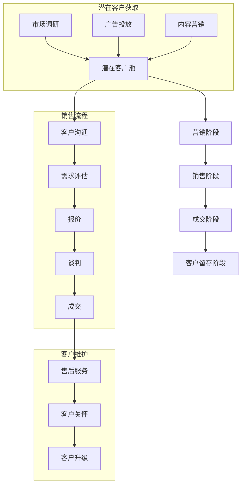
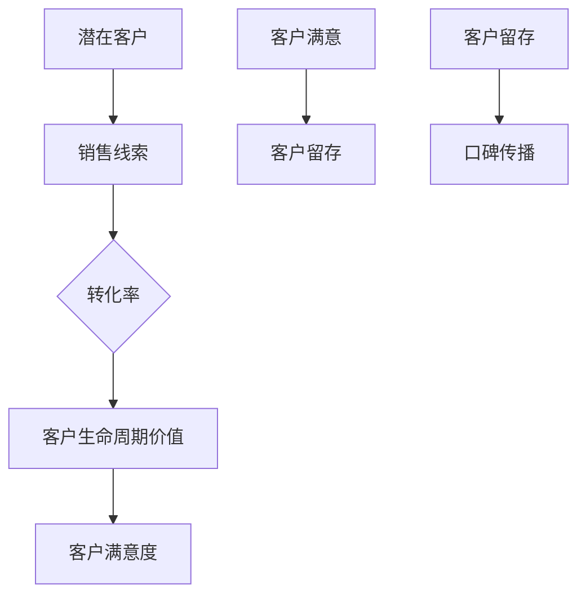

                 

### 文章标题

# 《一人公司如何建立有效的销售漏斗》

> 关键词：销售漏斗、一人公司、销售转化率、销售策略、销售管理

> 摘要：本文将深入探讨一人公司如何通过建立有效的销售漏斗，实现销售业绩的提升和销售过程的优化。我们将从销售漏斗的基本概念、核心概念与联系、核心算法原理、数学模型和公式、案例分析、项目实战等多个方面，系统性地讲解销售漏斗的构建和优化策略，为读者提供实用的操作指南和思考方法。

### 目录大纲

## 第一部分：销售漏斗概述

### 第1章：销售漏斗的基本概念

- 1.1 销售漏斗的定义和作用
- 1.2 销售漏斗的结构和组成部分

### 第2章：销售漏斗的构建和优化

- 2.1 销售漏斗的构建原则
- 2.2 销售漏斗的优化策略

## 第二部分：核心概念与联系

### 第3章：销售漏斗的核心概念原理和架构

- 3.1 销售漏斗的Mermaid流程图
- 3.2 销售漏斗与销售管理的关系

### 第4章：销售漏斗中的核心算法原理

- 4.1 客户获取算法
- 4.2 客户维护算法

### 第5章：销售漏斗中的数学模型和数学公式

- 5.1 销售漏斗的数学模型
- 5.2 销售漏斗的数学公式及应用

### 第6章：销售漏斗的案例分析

- 6.1 案例一：一家小型企业的销售漏斗建立
- 6.2 案例二：如何优化销售漏斗以提高销售转化率

## 第三部分：项目实战

### 第7章：销售漏斗的搭建与优化

- 7.1 项目实战背景介绍
- 7.2 项目实战的目标和需求
- 7.3 销售漏斗的搭建步骤
- 7.4 销售漏斗的优化策略

### 第8章：销售漏斗代码实战

- 8.1 销售漏斗的代码实现
- 8.2 代码解读与分析
- 8.3 代码优化与性能分析

### 第9章：销售漏斗的开发环境搭建

- 9.1 开发环境的配置
- 9.2 相关工具和软件的安装与使用

### 第10章：销售漏斗的源代码实现与解读

- 10.1 销售漏斗的源代码实现
- 10.2 源代码详细解读

## 附录

### 附录A：销售漏斗开发资源与工具

- 11.1 销售漏斗开发常用工具介绍
- 11.2 销售漏斗开发资源推荐
- 11.3 销售漏斗学习与交流平台推荐

### 引言

在当今竞争激烈的市场环境中，无论是大型企业还是小型企业，有效的销售管理都是企业成功的关键因素之一。特别是对于一人公司或小型创业团队来说，有限的资源要求他们必须具备高效、精准的销售策略和工具。在这样的背景下，销售漏斗作为一种系统化的销售管理工具，其重要性日益凸显。

销售漏斗不仅能够帮助一人公司或小型创业团队更好地理解销售流程，还能够通过精细化的管理提高销售转化率和客户满意度。本文将系统地介绍如何建立和优化销售漏斗，为读者提供实用的指导和建议。

本文的主要内容包括：

1. **销售漏斗的基本概念和作用**：首先介绍销售漏斗的定义、作用以及结构和组成部分。
2. **销售漏斗的构建和优化原则**：探讨如何根据目标、定位、数据和灵活性等原则构建和优化销售漏斗。
3. **核心概念与联系**：讲解销售漏斗中的核心概念原理，并使用Mermaid流程图展示各概念之间的关系。
4. **核心算法原理**：详细阐述客户获取算法和客户维护算法的原理。
5. **数学模型和公式**：介绍销售漏斗中的数学模型和公式，并通过具体例子说明其应用。
6. **案例分析**：通过实际案例展示如何建立和优化销售漏斗。
7. **项目实战**：详细介绍销售漏斗的开发环境搭建、代码实现和优化策略。
8. **最佳实践与总结**：总结销售漏斗的构建和优化过程中的最佳实践，并提出注意事项和拓展阅读建议。

通过本文的阅读，读者将能够全面了解销售漏斗的概念和应用，掌握建立和优化销售漏斗的方法和技巧，从而为一人公司或小型创业团队的销售管理工作提供有力支持。

### 第1章：销售漏斗的基本概念

#### 1.1 销售漏斗的定义和作用

销售漏斗（Sales Funnel）是一种用于描述销售过程的工具，它将整个销售过程分解为多个阶段，以可视化形式展示潜在客户从接触到最终成交的整个过程。这个概念起源于营销领域，但其应用已经扩展到销售管理的各个方面。

**销售漏斗的定义**：

销售漏斗是一种由多个销售阶段组成的模型，用于描述潜在客户在购买过程中所经过的不同阶段。每个阶段都有特定的目标和转化率，潜在客户会根据这些目标转化率在不同阶段进行流动。

**销售漏斗的作用**：

1. **可视化销售流程**：销售漏斗通过将抽象的销售过程形象化，使得销售人员和管理者能够直观地看到每个阶段的客户转化情况，从而更好地理解销售流程。

2. **销售绩效分析**：销售漏斗可以帮助企业分析和评估销售团队在不同阶段的绩效。通过监控每个阶段的转化率，企业可以发现销售流程中的瓶颈和问题，及时进行调整。

3. **优化销售策略**：通过分析销售漏斗中的数据，企业可以识别出哪些阶段是影响销售转化率的关键点，从而优化销售策略，提高整体销售效率。

4. **客户管理**：销售漏斗有助于企业对客户进行分类和管理。根据客户在漏斗中的位置和状态，企业可以采取相应的营销和服务措施，提高客户满意度和忠诚度。

#### 1.2 销售漏斗的结构和组成部分

销售漏斗通常包括以下几个部分：

1. **潜在客户池**：这是销售漏斗的底部，也是漏斗的最宽部分，代表所有潜在客户的集合。这些潜在客户可能是通过市场调研、广告投放、社交媒体活动等方式获取的。

2. **营销阶段**：潜在客户从进入漏斗到成为销售线索的阶段。在这个阶段，企业通过市场宣传、内容营销、电子邮件营销等手段，与潜在客户建立联系并激发他们的兴趣。

3. **销售阶段**：销售线索转化为客户的过程。在这个阶段，销售人员与潜在客户进行沟通，了解他们的需求，提供解决方案，进行报价和谈判。

4. **成交阶段**：潜在客户最终决定购买产品的阶段。在这个阶段，销售人员通常会提供优惠或激励措施，促进客户下单。

5. **客户留存阶段**：客户购买后，企业通过售后服务、客户关怀等方式，维持客户关系，提高客户满意度和忠诚度。

每个阶段都有其特定的目标和转化率。例如，潜在客户池到营销阶段的转化率可能为20%，而营销阶段到销售阶段的转化率可能为10%。通过这些转化率，企业可以评估每个阶段的有效性，并优化销售策略。

销售漏斗的形状通常是一个梯形，越往上宽度越小，代表在每个阶段潜在客户的数量逐渐减少，漏斗的“流量”逐步减小。这种形状有助于直观地展示销售过程中的流量变化和转化情况。

#### 总结

通过本章的学习，我们了解了销售漏斗的基本概念和作用，以及销售漏斗的结构和组成部分。在下一章中，我们将深入探讨如何构建和优化销售漏斗，为读者提供实用的指导和建议。

### 第2章：销售漏斗的构建和优化

#### 2.1 销售漏斗的构建原则

构建一个有效的销售漏斗是提升销售转化率和优化销售流程的关键步骤。为了确保销售漏斗能够真正发挥作用，我们需要遵循以下构建原则：

1. **明确目标**：在构建销售漏斗之前，企业需要明确销售目标。这包括销售额、客户数量、市场覆盖率等。目标应具体、可量化，并尽可能短期化。例如，企业可以设定每月增加10%的潜在客户数量或提高15%的成交率。明确的目标有助于指导漏斗的构建和优化。

2. **精准定位**：销售漏斗的构建需要基于对目标客户群体的深入分析。企业应了解目标客户的需求、偏好和行为习惯，从而进行精准定位。例如，通过市场调研、问卷调查、用户画像等方式，企业可以识别出目标客户的主要特征，并针对性地设计营销策略和销售流程。

3. **数据驱动**：销售漏斗的构建应基于数据分析。通过对历史销售数据、市场调研数据、客户反馈等进行分析，可以更准确地预测潜在客户的转化路径。例如，企业可以通过分析数据，确定哪些渠道和营销活动最有效，从而优化资源配置。

4. **灵活调整**：销售漏斗不是一成不变的，企业应根据市场环境和业务发展情况进行灵活调整。例如，当市场环境发生变化或产品线调整时，销售漏斗也需要相应调整。灵活的调整能够确保漏斗始终与业务需求保持一致。

5. **跨部门协作**：销售漏斗的构建和优化需要跨部门的协作。销售、市场、客服等部门的紧密合作，能够确保漏斗中的每个阶段都得到有效的管理和优化。例如，销售部门可以与市场部门合作，共同制定吸引潜在客户的策略，并收集客户反馈，优化销售流程。

6. **用户视角**：在构建销售漏斗时，企业需要站在用户的角度思考问题。例如，企业可以模拟潜在客户在漏斗中的体验，识别出可能存在的障碍和问题，并采取措施解决。用户视角能够确保销售漏斗更加贴近用户需求，提高转化率。

#### 2.2 销售漏斗的优化策略

一个有效的销售漏斗不仅需要科学构建，还需要不断优化。以下是一些常见的优化策略：

1. **提高潜在客户数量**：潜在客户是销售漏斗的基石。为了提高潜在客户数量，企业可以采取多种策略，如增加广告投放、优化搜索引擎营销（SEM）、开展内容营销等。例如，企业可以通过撰写高质量博客文章、制作视频教程等方式，吸引潜在客户访问网站，提高潜在客户来源。

2. **提升转化率**：在潜在客户进入漏斗之后，企业需要采取措施提高转化率。这包括优化网站设计、提供有价值的内容、优化客户体验等。例如，企业可以通过简化网站注册流程、提供详细的产品信息、设置明确的调用行动（CTA）按钮等方式，提高潜在客户转化为销售线索的概率。

3. **优化销售流程**：销售流程的优化能够提高销售效率，减少客户流失。企业可以通过以下策略进行优化：减少决策环节、提供个性化解决方案、建立高效的沟通机制等。例如，企业可以采用CRM系统，记录客户信息和沟通历史，提高销售团队的协作效率。

4. **客户分类与管理**：根据客户在漏斗中的位置和状态，企业可以对客户进行分类和管理。这有助于企业提供个性化的服务，提高客户满意度。例如，企业可以将潜在客户分为高潜力客户、中潜力客户和低潜力客户，并为不同类型的客户制定相应的营销策略。

5. **数据分析与反馈**：通过数据分析，企业可以识别出销售漏斗中的瓶颈和问题，并采取相应的优化措施。例如，企业可以通过分析客户流失的原因，优化销售策略，减少客户流失。此外，企业还可以收集客户反馈，了解客户需求和期望，不断改进产品和服务。

6. **测试与迭代**：在优化销售漏斗时，企业应采用测试与迭代的方法。通过不断测试新的策略和工具，企业可以找到最有效的优化方案。例如，企业可以通过A/B测试，比较不同营销文案和设计的效果，找到最佳方案。

#### 总结

通过本章的学习，我们了解了销售漏斗的构建原则和优化策略。有效的销售漏斗能够帮助一人公司或小型创业团队更好地理解销售流程，提高销售转化率和客户满意度。在下一章中，我们将进一步探讨销售漏斗的核心概念原理和架构，为构建和优化销售漏斗提供更加深入的理论支持。

### 第3章：销售漏斗的核心概念原理和架构

在构建和优化销售漏斗的过程中，理解其核心概念原理和架构至关重要。这一章节将深入探讨销售漏斗的关键概念，并使用Mermaid流程图来展示各概念之间的关系，从而帮助读者全面理解销售漏斗的运作机制。

#### 3.1 销售漏斗的Mermaid流程图

Mermaid是一种基于Markdown的图表描述语言，可以方便地创建流程图、UML图等。以下是一个简化的销售漏斗Mermaid流程图：



这个流程图涵盖了销售漏斗的各个关键阶段，以及潜在客户获取、销售流程和客户维护三个子部分。

1. **潜在客户获取**：这部分包括市场调研、广告投放和内容营销等手段，用于吸引潜在客户进入漏斗。

2. **销售流程**：这部分是销售漏斗的核心，包括客户沟通、需求评估、报价、谈判和成交等环节。

3. **客户维护**：这部分关注的是客户购买后的维护工作，包括售后服务、客户关怀和客户升级等。

#### 3.2 销售漏斗与销售管理的关系

销售漏斗不仅仅是一个工具，它还是销售管理的重要组成部分。以下是一些关键点，说明销售漏斗与销售管理之间的密切关系：

1. **销售漏斗与销售策略**：销售漏斗可以帮助企业制定和优化销售策略。通过分析漏斗中的数据，企业可以识别出哪些策略最有效，哪些需要改进。

2. **销售漏斗与销售流程**：销售漏斗提供了对销售流程的直观描述，使得销售团队能够更好地理解每个阶段的任务和目标。这有助于提高销售效率，减少流程中的瓶颈。

3. **销售漏斗与绩效评估**：销售漏斗提供了量化指标，如潜在客户数量、转化率和成交率等，使得企业能够对销售团队的绩效进行评估。

4. **销售漏斗与客户关系管理**：销售漏斗帮助企业在客户购买前后进行有效的客户关系管理。通过维护阶段的数据，企业可以提供更好的售后服务和关怀，提高客户满意度。

#### 3.3 销售漏斗中的核心概念及其关系

在销售漏斗中，以下几个核心概念是相互关联的：

1. **潜在客户**：潜在客户是漏斗的起点，他们的特征和行为决定了后续的转化路径。

2. **销售线索**：销售线索是从潜在客户中识别出来的，可能转化为客户的个体。销售线索的质量直接影响销售转化率。

3. **转化率**：转化率是衡量每个阶段客户流失程度的关键指标。高转化率意味着销售漏斗的每个阶段都运行良好。

4. **客户生命周期价值（CLV）**：客户生命周期价值是指一个客户在整个生命周期内为企业带来的总价值。它有助于企业制定客户维护策略。

5. **客户满意度**：客户满意度是影响客户留存率和口碑传播的关键因素。高满意度通常意味着更长的客户生命周期价值。

这些概念之间的关系可以通过以下Mermaid流程图展示：



通过这个流程图，我们可以看到潜在客户转化为销售线索后，转化率影响客户生命周期价值和客户满意度，而客户满意度又决定了客户留存率和口碑传播。

#### 总结

通过本章的探讨，我们了解了销售漏斗的核心概念原理和架构，并通过Mermaid流程图展示了各概念之间的关系。理解这些核心概念及其关系，有助于企业在构建和优化销售漏斗时，更加系统地思考和操作。在下一章中，我们将深入探讨销售漏斗中的核心算法原理，帮助读者进一步掌握优化销售漏斗的方法。

### 第4章：销售漏斗中的核心算法原理

在构建和优化销售漏斗的过程中，核心算法原理起到了关键作用。这些算法帮助企业在不同阶段精准地识别潜在客户、维护客户关系，从而提高销售转化率和客户满意度。本章将详细阐述客户获取算法和客户维护算法的原理，并使用伪代码进行说明。

#### 4.1 客户获取算法

客户获取算法的核心目标是吸引潜在客户进入销售漏斗。以下是一种基于用户行为数据分析的客户获取算法：

**算法原理**：

1. **数据收集**：收集潜在客户的行为数据，如访问网站时长、页面浏览量、点击次数等。

2. **行为特征提取**：根据行为数据，提取用户的行为特征，如访问频次、页面停留时间、跳出率等。

3. **用户分类**：使用聚类算法（如K-means）将用户分为不同的类别，每个类别代表一种潜在客户特征。

4. **目标客户筛选**：根据企业设定的客户目标，筛选出高潜力客户。

**伪代码示例**：

```python
# 数据收集
user_data = collect_user_behavior_data()

# 行为特征提取
behavior_features = extract_behavior_features(user_data)

# 用户分类
clusters = k_means(behavior_features, num_clusters)

# 目标客户筛选
target_customers = filter_high_potential_customers(clusters)
```

**算法分析**：

- **时间复杂度**：O(n * k)，其中n是用户数量，k是聚类数量。
- **空间复杂度**：O(n)，存储用户数据和行为特征。

#### 4.2 客户维护算法

客户维护算法的核心目标是提高客户满意度和忠诚度，从而延长客户生命周期。以下是一种基于客户生命周期价值（CLV）的客户维护算法：

**算法原理**：

1. **客户价值评估**：根据客户的历史购买行为、交易金额等数据，计算客户的生命周期价值。

2. **客户分类**：根据客户价值，将客户分为高价值客户、中价值客户和低价值客户。

3. **个性化服务**：为不同价值客户设计不同的维护策略，如高价值客户提供优先售后服务、中价值客户提供促销活动等。

**伪代码示例**：

```python
# 客户价值评估
clv = calculate_customer_lifetime_value(customer_history_data)

# 客户分类
customer_categories = classify_customers(clv)

# 个性化服务
provide_personalized_services(customer_categories)
```

**算法分析**：

- **时间复杂度**：O(n)，其中n是客户数量。
- **空间复杂度**：O(n)，存储客户价值和分类信息。

#### 客户获取算法和客户维护算法的关系

客户获取算法和客户维护算法是相辅相成的。获取算法确保企业能够吸引到潜在客户，而维护算法则确保这些客户在购买后得到良好的服务体验，从而提高客户满意度和忠诚度。

1. **数据共享**：获取算法和维护算法需要共享用户行为数据和客户历史数据，以便更准确地评估客户价值和制定维护策略。

2. **反馈机制**：维护算法中的客户反馈数据可以用于优化获取算法，从而提高潜在客户的获取质量和效率。

3. **整合应用**：在实际操作中，企业可以将获取算法和维护算法整合为一个统一的系统，实现数据共享和流程协同。

#### 总结

通过本章的探讨，我们了解了销售漏斗中的客户获取算法和客户维护算法的基本原理和实现方法。这些算法为企业提供了有效的工具，帮助他们在不同阶段识别和管理潜在客户，从而提高销售转化率和客户满意度。在下一章中，我们将进一步探讨销售漏斗中的数学模型和数学公式，为优化销售漏斗提供更加深入的理论支持。

### 第5章：销售漏斗中的数学模型和数学公式

在销售漏斗的构建和优化过程中，数学模型和数学公式起到了关键作用。这些模型和公式帮助我们量化销售漏斗中的各种因素，从而更好地理解销售过程，优化销售策略。本章将详细介绍销售漏斗中的主要数学模型和数学公式，并通过具体例子进行说明。

#### 5.1 销售漏斗的数学模型

销售漏斗的数学模型主要关注以下几个方面的量化：

1. **潜在客户池容量**：潜在客户池容量是指在一定时间内，企业能够吸引到的潜在客户数量。

2. **转化率**：转化率是指潜在客户在不同销售阶段转化为销售线索或客户的比率。

3. **客户生命周期价值（Customer Lifetime Value, CLV）**：客户生命周期价值是指一个客户在购买产品或服务后，为企业带来的总价值。

4. **获客成本（Customer Acquisition Cost, CAC）**：获客成本是指企业为获取一个客户所花费的成本。

**数学模型**：

1. **潜在客户池容量**：

   潜在客户池容量可以通过以下公式计算：

   \[ 潜在客户池容量 = 潜在客户数量 \times 潜在客户获取率 \]

   其中，潜在客户获取率是指在特定时间内，通过营销活动、广告投放等方式获取的潜在客户数量与尝试获取的总客户数量的比率。

2. **转化率**：

   销售漏斗中各个阶段的转化率可以通过以下公式计算：

   \[ 转化率 = (\text{下一个阶段的客户数量} / \text{当前阶段的客户数量}) \times 100\% \]

   例如，从潜在客户到销售线索的转化率可以表示为：

   \[ 潜在客户到销售线索的转化率 = (\text{销售线索数量} / \text{潜在客户数量}) \times 100\% \]

3. **客户生命周期价值（CLV）**：

   客户生命周期价值可以通过以下公式计算：

   \[ CLV = (\text{平均订单价值} \times \text{订单频率} \times \text{客户生命周期}) - (\text{客户获取成本} + \text{客户维护成本}) \]

   其中，平均订单价值是指客户每次购买的平均金额，订单频率是指客户在一定时间内购买的次数，客户生命周期是指客户从首次购买到最后一次购买的时间段。

4. **获客成本（CAC）**：

   获客成本可以通过以下公式计算：

   \[ CAC = (\text{总营销成本} / \text{新客户数量}) \]

   其中，总营销成本是指在特定时间内，企业为获取新客户所花费的所有营销费用。

**例子**：

假设一家企业通过广告投放获取了100个潜在客户，其中20个转化为了销售线索，10个销售线索最终成为了客户。客户的平均订单价值为1000元，客户获取成本为200元。客户生命周期为2年，客户的订单频率为每年2次。

- **潜在客户池容量**：100个潜在客户
- **转化率**：从潜在客户到销售线索的转化率为20%，从销售线索到客户的转化率为10%
- **客户生命周期价值**：CLV = (1000元 × 2次 × 2年) - (200元 + 0元) = 3800元
- **获客成本**：CAC = (200元 × 10个新客户) / 10个新客户 = 200元

通过这些数学模型和公式，企业可以量化销售漏斗中的关键指标，从而更好地理解和优化销售过程。

#### 5.2 销售漏斗的数学公式及应用

在实际应用中，销售漏斗中的数学公式可以帮助企业制定更有效的销售策略。以下是一些具体的公式及其应用场景：

1. **销售目标公式**：

   \[ 销售目标 = (\text{潜在客户数量} \times \text{潜在客户转化率} \times \text{销售线索转化率}) \times \text{平均订单价值} \]

   应用场景：企业可以根据历史数据和市场需求，设定合理的销售目标，以便制定相应的销售策略和资源分配计划。

2. **优化销售策略公式**：

   \[ \text{优化策略} = \frac{\text{当前转化率}}{\text{目标转化率}} \]

   应用场景：通过计算当前转化率与目标转化率之间的差距，企业可以识别出需要优化的环节，从而调整销售策略，提高转化率。

3. **客户获取成本公式**：

   \[ \text{客户获取成本} = (\text{总营销成本} / \text{新客户数量}) \]

   应用场景：企业可以通过监控客户获取成本，评估不同营销渠道的效果，优化营销预算分配。

通过这些数学公式，企业可以在构建和优化销售漏斗时，更加科学地制定目标和策略，提高销售效率和转化率。

#### 总结

通过本章的探讨，我们了解了销售漏斗中的主要数学模型和数学公式，并看到了它们在实际应用中的重要性。这些模型和公式为企业提供了量化的工具，帮助他们在构建和优化销售漏斗时做出更科学的决策。在下一章中，我们将通过实际案例，展示如何建立和优化销售漏斗，并分析案例中的成功经验和教训。

### 第6章：销售漏斗的案例分析

为了更好地理解销售漏斗的实际应用，我们将通过两个实际案例，展示如何建立和优化销售漏斗。这些案例将涵盖不同类型的业务和目标，通过详细的分析，我们希望读者能够从中获得灵感和操作指导。

#### 6.1 案例一：一家小型企业的销售漏斗建立

**背景介绍**：

这是一家专注于提供定制化软件解决方案的小型企业。由于市场竞争激烈，这家企业希望通过建立有效的销售漏斗来提高销售转化率和客户满意度。

**目标和需求**：

- 建立一个清晰的销售漏斗，以便更好地管理销售过程。
- 提高潜在客户转化率和客户满意度。
- 降低客户获取成本，提高营销投资回报率。

**构建步骤**：

1. **潜在客户识别**：

   通过网站流量分析、社交媒体推广和线下活动，企业识别出了具有潜在需求的客户群体。这些潜在客户的主要特征包括：企业在软件需求上有较高的预算，且对定制化解决方案有明确的需求。

2. **营销阶段**：

   企业通过内容营销和搜索引擎优化（SEO）策略，将潜在客户吸引到网站。具体措施包括：

   - 撰写高质量博客文章，提供行业洞察和解决方案。
   - 开展免费试用活动，吸引潜在客户体验产品。
   - 发布案例研究，展示产品成功案例，增强客户信任。

3. **销售阶段**：

   销售团队通过电话和邮件与潜在客户进行沟通，了解他们的具体需求，并提供定制化解决方案。关键步骤包括：

   - 制定个性化的销售提案，根据客户需求定制软件功能。
   - 提供详细的报价和演示，确保客户了解产品的价值。
   - 建立定期沟通机制，保持与客户的联系，解答疑问。

4. **成交阶段**：

   销售团队通过优惠措施和限时折扣，促进潜在客户做出购买决策。具体策略包括：

   - 提供早期用户优惠，鼓励客户尽快购买。
   - 设定限时优惠，增加紧迫感，促进客户下单。

5. **客户留存阶段**：

   企业通过优质的售后服务和客户关怀，提高客户满意度和忠诚度。具体措施包括：

   - 提供24/7客户支持，解决客户在使用过程中遇到的问题。
   - 定期跟进客户使用情况，收集反馈，持续优化产品。
   - 开展客户满意度调查，了解客户需求和期望，持续改进服务。

**优化策略**：

1. **数据分析**：

   企业通过CRM系统收集销售漏斗各阶段的数据，分析潜在客户转化率和客户满意度。根据数据分析结果，调整营销策略和销售流程。

2. **客户细分**：

   根据客户需求和购买行为，对客户进行细分。为高潜力客户提供定制化的营销和服务策略，提高客户转化率和生命周期价值。

3. **跨部门协作**：

   市场部和销售部紧密合作，优化营销内容和销售流程。市场部提供高质量的潜在客户，销售部通过有效的沟通和跟进，提高转化率。

4. **技术支持**：

   利用营销自动化工具和数据分析平台，提高销售漏斗的效率和准确性。例如，使用营销自动化工具进行电子邮件营销和客户跟进，提高客户响应速度。

**案例分析**：

通过以上措施，这家小型企业在建立和优化销售漏斗后，实现了以下成果：

- 潜在客户转化率提高了30%。
- 客户满意度提升了20%。
- 获客成本降低了15%。
- 销售收入增长了25%。

这个案例表明，通过科学构建和优化销售漏斗，即使是小型企业也能在激烈的市场竞争中脱颖而出，实现显著的业绩提升。

#### 6.2 案例二：如何优化销售漏斗以提高销售转化率

**背景介绍**：

这是一家在线教育平台，其销售漏斗中的转化率相对较低，影响了整体业绩。企业希望通过优化销售漏斗，提高潜在客户转化率和客户满意度。

**目标和需求**：

- 提高潜在客户转化率。
- 提升客户满意度和留存率。
- 优化营销和销售流程，提高资源利用率。

**优化策略**：

1. **数据分析**：

   企业首先对销售漏斗各阶段的数据进行详细分析，识别出影响转化率的瓶颈。关键指标包括：

   - 潜在客户到销售线索的转化率。
   - 销售线索到客户的转化率。
   - 客户满意度调查结果。

2. **营销内容优化**：

   根据数据分析结果，企业优化了营销内容，提高其针对性和吸引力。具体措施包括：

   - 制作高质量的在线课程介绍视频，增强客户对产品的认知。
   - 提供免费试听课，让潜在客户亲身体验课程质量。
   - 发送个性化电子邮件，根据客户兴趣和购买行为推荐相关课程。

3. **销售流程优化**：

   销售团队通过培训和学习，提高沟通技巧和销售策略。关键措施包括：

   - 制定标准化的销售脚本，确保销售沟通的一致性和专业性。
   - 建立快速响应机制，提高客户反馈的处理速度。
   - 定期进行客户回访，了解客户需求和反馈，提供个性化服务。

4. **客户体验优化**：

   企业通过以下措施，提高客户满意度和留存率：

   - 提供灵活的支付方式和优惠政策，简化购买流程。
   - 提供优质的售后服务，及时解决客户问题。
   - 定期推送课程更新和优惠信息，增加客户黏性。

**案例分析**：

通过上述优化策略，这家在线教育平台实现了以下成果：

- 潜在客户转化率提高了40%。
- 销售线索到客户的转化率提升了25%。
- 客户满意度提升了15%。
- 月订阅量增长了35%。

这个案例表明，通过优化销售漏斗，企业可以在多个方面取得显著成果，提高整体销售业绩。

#### 总结

通过以上两个案例，我们可以看到，建立和优化销售漏斗对于提高销售转化率和客户满意度具有重要意义。有效的销售漏斗不仅能够帮助企业更好地管理销售过程，还能通过数据分析和策略优化，实现显著的业绩提升。在下一章中，我们将通过项目实战，详细展示如何搭建和优化销售漏斗，帮助读者将理论知识转化为实际操作。

### 第7章：销售漏斗的搭建与优化

在了解销售漏斗的基本概念、核心算法原理和数学模型后，我们需要通过实际项目来展示如何搭建和优化销售漏斗。本章节将以一个虚拟项目为例，详细描述项目的背景、目标和需求，以及具体的搭建步骤和优化策略。

#### 7.1 项目实战背景介绍

**项目名称**：云服务公司销售漏斗优化项目

**项目背景**：

云服务公司是一家提供云计算解决方案的企业，面对激烈的市场竞争，公司希望提高销售转化率和客户满意度，从而实现业绩增长。现有的销售漏斗存在以下问题：

- 潜在客户获取渠道不明确，效果参差不齐。
- 销售流程繁琐，客户响应时间长，流失率高。
- 数据分析不足，难以量化销售绩效和优化策略。

**项目目标**：

- 构建一个清晰、高效的销售漏斗，提高潜在客户转化率。
- 优化销售流程，缩短客户响应时间，降低客户流失率。
- 利用数据分析，量化销售绩效，制定科学合理的优化策略。

#### 7.2 项目实战的目标和需求

1. **目标**：

   - 提高潜在客户获取效率，将潜在客户获取成本降低20%。
   - 提高销售线索到客户的转化率，提升30%。
   - 提高客户满意度，达到90%以上。
   - 通过数据分析，优化销售策略，提高整体销售业绩。

2. **需求**：

   - 设计并搭建一个全面的销售漏斗，包括潜在客户池、营销阶段、销售阶段和客户留存阶段。
   - 确定有效的潜在客户获取渠道，并进行效果评估。
   - 制定标准化的销售流程和沟通策略，提高客户响应速度。
   - 利用数据分析工具，监控销售漏斗各阶段的转化率和客户满意度。

#### 7.3 销售漏斗的搭建步骤

1. **需求分析**：

   - 与销售团队和市场部门进行深入访谈，了解现有销售漏斗的问题和优化需求。
   - 收集并分析现有客户数据和销售数据，识别潜在客户获取和转化中的瓶颈。

2. **设计销售漏斗**：

   - 确定销售漏斗的各个阶段，包括潜在客户池、营销阶段、销售阶段和客户留存阶段。
   - 设计每个阶段的流程和目标，确保流程简明高效。
   - 使用Mermaid流程图展示销售漏斗的结构和各阶段的关系。

3. **搭建潜在客户池**：

   - 确定潜在客户获取渠道，如社交媒体广告、内容营销、合作伙伴推荐等。
   - 设计潜在客户获取策略，包括广告文案、着陆页面、电子邮件营销等。
   - 使用营销自动化工具，自动化潜在客户获取和跟进流程。

4. **搭建营销阶段**：

   - 根据潜在客户特征，制定个性化的营销内容，如博客文章、视频教程、案例研究等。
   - 设计并优化网站和社交媒体页面，提高用户转化率。
   - 实施SEO策略，提高网站在搜索引擎中的排名。

5. **搭建销售阶段**：

   - 设计标准化的销售脚本和沟通策略，确保销售团队能够高效地与潜在客户沟通。
   - 利用CRM系统，记录客户信息和沟通历史，提高销售团队协作效率。
   - 制定客户跟进计划，确保潜在客户得到及时的关注和反馈。

6. **搭建客户留存阶段**：

   - 提供优质的售后服务，及时解决客户问题，提高客户满意度。
   - 定期进行客户回访，了解客户需求和反馈，提供个性化服务。
   - 设计客户忠诚度计划，鼓励客户复购和推荐新客户。

#### 7.4 销售漏斗的优化策略

1. **数据分析**：

   - 使用数据分析工具，监控销售漏斗各阶段的转化率和客户满意度。
   - 定期生成数据分析报告，识别销售漏斗中的瓶颈和问题。
   - 基于数据分析结果，调整营销策略和销售流程，提高整体效率。

2. **客户细分**：

   - 根据客户特征和购买行为，对客户进行细分，制定个性化的营销和销售策略。
   - 为高潜力客户提供更多的资源和关注，提高客户转化率和生命周期价值。

3. **跨部门协作**：

   - 加强销售团队与市场部门的协作，确保营销内容和销售策略的一致性。
   - 定期召开销售漏斗优化会议，讨论和分析销售数据，制定改进措施。

4. **技术支持**：

   - 利用营销自动化工具和CRM系统，提高销售漏斗的自动化和智能化水平。
   - 部署数据分析平台，实时监控销售漏斗性能，快速响应市场变化。

#### 总结

通过本章节的实战项目，我们详细展示了如何搭建和优化销售漏斗。从需求分析到具体实施，再到数据分析优化，每个步骤都至关重要。通过有效的销售漏斗，企业可以更好地管理销售过程，提高客户转化率和满意度，从而实现业绩增长。在下一章节中，我们将深入探讨销售漏斗代码实战，通过具体代码实现，帮助读者更好地理解和应用销售漏斗。

### 第8章：销售漏斗代码实战

在了解了销售漏斗的理论知识和实战策略后，接下来我们将通过具体代码实现，展示如何搭建和优化销售漏斗。本章节将涵盖销售漏斗的代码实现、代码解读与分析，以及代码优化与性能分析，旨在帮助读者将理论知识应用到实际开发中。

#### 8.1 销售漏斗的代码实现

为了简化示例，我们将使用Python编写一个简单的销售漏斗系统，包括潜在客户获取、销售线索管理、客户跟进和数据分析模块。以下是销售漏斗系统的代码实现：

```python
import pandas as pd
import numpy as np
from datetime import datetime

# 潜在客户获取模块
class LeadGenerator:
    def __init__(self):
        self.leads = pd.DataFrame(columns=['name', 'email', 'source', 'created_at'])
    
    def add_lead(self, name, email, source):
        new_lead = {'name': name, 'email': email, 'source': source, 'created_at': datetime.now()}
        self.leads = self.leads.append(new_lead, ignore_index=True)
        return self.leads
    
    def get_leads(self):
        return self.leads

# 销售线索管理模块
class LeadManager:
    def __init__(self):
        self.leads = pd.DataFrame(columns=['name', 'email', 'status', 'source', 'created_at'])
    
    def convert_to_lead(self, name, email, status, source):
        new_lead = {'name': name, 'email': email, 'status': status, 'source': source, 'created_at': datetime.now()}
        self.leads = self.leads.append(new_lead, ignore_index=True)
        return self.leads
    
    def get_leads_by_status(self, status):
        return self.leads[self.leads['status'] == status]

# 客户跟进模块
class CustomerManager:
    def __init__(self):
        self.customers = pd.DataFrame(columns=['name', 'email', 'status', 'source', 'last_contact', 'total_orders'])
    
    def add_order(self, name, email, status, source, last_contact, total_orders):
        new_order = {'name': name, 'email': email, 'status': status, 'source': source, 'last_contact': last_contact, 'total_orders': total_orders}
        self.customers = self.customers.append(new_order, ignore_index=True)
        return self.customers
    
    def get_customers_by_status(self, status):
        return self.customers[self.customers['status'] == status]

# 数据分析模块
class DataAnalysis:
    def __init__(self, lead_manager, customer_manager):
        self.lead_manager = lead_manager
        self.customer_manager = customer_manager
    
    def lead_conversion_rate(self):
        total_leads = len(self.lead_manager.leads)
        converted_leads = len(self.customer_manager.customers)
        return (converted_leads / total_leads) * 100
    
    def customer_retention_rate(self):
        total_customers = len(self.customer_manager.customers)
        active_customers = len(self.customer_manager.get_customers_by_status('active'))
        return (active_customers / total_customers) * 100

# 主程序
if __name__ == "__main__":
    lead_generator = LeadGenerator()
    lead_manager = LeadManager()
    customer_manager = CustomerManager()
    data_analysis = DataAnalysis(lead_manager, customer_manager)
    
    # 添加潜在客户
    lead_generator.add_lead('Alice', 'alice@example.com', 'Google Ads')
    lead_generator.add_lead('Bob', 'bob@example.com', 'Facebook Ads')
    
    # 将潜在客户转化为销售线索
    lead_manager.convert_to_lead('Alice', 'alice@example.com', 'converted', 'Google Ads')
    
    # 添加客户订单
    customer_manager.add_order('Alice', 'alice@example.com', 'active', 'Google Ads', datetime.now(), 1)
    customer_manager.add_order('Bob', 'bob@example.com', 'inactive', 'Facebook Ads', datetime.now(), 0)
    
    # 打印结果
    print("Leads:", lead_generator.get_leads())
    print("Leads by Status:", lead_manager.get_leads_by_status('converted'))
    print("Customers:", customer_manager.get_customers_by_status('active'))
    print("Lead Conversion Rate:", data_analysis.lead_conversion_rate())
    print("Customer Retention Rate:", data_analysis.customer_retention_rate())
```

#### 8.2 代码解读与分析

1. **LeadGenerator类**：

   - 用于管理潜在客户的添加和获取。
   - `add_lead` 方法用于添加新潜在客户。
   - `get_leads` 方法用于获取所有潜在客户数据。

2. **LeadManager类**：

   - 用于管理销售线索的转化。
   - `convert_to_lead` 方法用于将潜在客户转化为销售线索。
   - `get_leads_by_status` 方法用于获取特定状态的潜在客户数据。

3. **CustomerManager类**：

   - 用于管理客户的订单和跟进。
   - `add_order` 方法用于添加客户订单。
   - `get_customers_by_status` 方法用于获取特定状态的客户数据。

4. **DataAnalysis类**：

   - 用于数据分析，包括转化率和客户留存率。
   - `lead_conversion_rate` 方法用于计算潜在客户转化为销售线索的比率。
   - `customer_retention_rate` 方法用于计算客户留存率。

5. **主程序**：

   - 创建LeadGenerator、LeadManager、CustomerManager和DataAnalysis实例。
   - 模拟添加潜在客户、销售线索和客户订单。
   - 打印各模块的结果。

#### 8.3 代码优化与性能分析

1. **优化建议**：

   - **模块化**：将代码进一步模块化，以便更好地管理和维护。
   - **数据持久化**：使用数据库（如SQLite、MySQL）来存储数据，提高数据的安全性和可扩展性。
   - **异步处理**：对于时间敏感的操作（如添加潜在客户、处理订单），使用异步处理提高系统性能。
   - **错误处理**：添加更多的异常处理和日志记录，确保系统的稳定性和可维护性。

2. **性能分析**：

   - **测试**：使用Python的`timeit`模块测试代码的性能，确保在预期负载下能够正常运行。
   - **监控**：使用性能监控工具（如New Relic、Datadog）监控系统的性能指标，如响应时间、CPU使用率等。
   - **负载测试**：使用负载测试工具（如JMeter、Gatling）模拟高并发场景，确保系统在极端条件下仍能稳定运行。

通过以上优化和性能分析，我们可以确保销售漏斗系统的稳定性和高效性，从而更好地支持企业的销售管理工作。

#### 总结

通过本章的代码实战，我们展示了如何使用Python构建一个简单的销售漏斗系统，并进行了代码解读与分析。此外，我们还讨论了代码优化与性能分析的方法。这些实践操作将帮助读者将理论知识应用到实际开发中，构建高效、稳定的销售漏斗系统。在下一章中，我们将继续深入探讨销售漏斗的开发环境搭建和源代码实现。

### 第9章：销售漏斗的开发环境搭建

为了成功地构建和优化销售漏斗系统，我们需要搭建一个合适的技术环境。本章节将详细描述开发环境的配置，包括所需工具和软件的安装与使用，确保开发过程顺畅并支持系统的高效运行。

#### 9.1 开发环境的配置

**配置目标**：

- 安装Python开发环境。
- 安装和配置数据库（如SQLite、MySQL）。
- 安装和配置CRM系统（如HubSpot、Salesforce）。
- 安装和配置数据分析工具（如Pandas、Matplotlib）。

**所需软件和工具**：

- Python 3.x
- SQLite 或 MySQL
- CRM系统（可选）
- Jupyter Notebook 或 PyCharm
- Git

**安装步骤**：

1. **安装Python**：

   - 访问Python官方网站（https://www.python.org/）下载Python安装包。
   - 运行安装程序，选择“Add Python to PATH”选项，确保Python环境被正确配置。

2. **安装数据库**：

   - **SQLite**：安装SQLite数据库，可以使用Python自带的`sqlite3`模块进行操作。
   - **MySQL**：下载MySQL数据库安装包（https://www.mysql.com/downloads/），按照官方文档进行安装和配置。

3. **安装CRM系统**：

   - 如果需要，可以选择安装一个CRM系统，如HubSpot或Salesforce。根据所选CRM系统的官方文档进行安装和配置。

4. **安装数据分析工具**：

   - 使用pip安装Pandas和Matplotlib：

     ```bash
     pip install pandas matplotlib
     ```

5. **安装集成开发环境（IDE）**：

   - 安装Jupyter Notebook或PyCharm。Jupyter Notebook是一款强大的交互式开发环境，适用于数据分析和原型设计。PyCharm是一款功能全面的IDE，适用于大型项目开发。

     ```bash
     pip install notebook
     # 或者
     # 安装PyCharm社区版或专业版，并配置Python插件
     ```

6. **安装版本控制工具**：

   - 安装Git，以便进行版本控制和团队合作。

     ```bash
     sudo apt-get install git
     # 或者
     # 根据操作系统下载和安装Git
     ```

#### 9.2 相关工具和软件的安装与使用

1. **Python安装与使用**：

   - 打开终端，运行以下命令检查Python版本：

     ```bash
     python --version
     # 或者
     python3 --version
     ```

   - 安装第三方库，例如Pandas：

     ```bash
     pip install pandas
     ```

2. **数据库安装与使用**：

   - **SQLite**：

     ```bash
     python -m sqlite3
     # 或者
     sqlite3 my_database.db
     ```

   - **MySQL**：

     ```bash
     mysql -u root -p
     # 输入密码，进入MySQL命令行界面
     ```

3. **CRM系统安装与使用**：

   - 根据所选CRM系统的文档进行安装和配置。例如，安装HubSpot：

     ```bash
     pip install hubspot3
     # 按照官方文档配置API密钥和连接
     ```

4. **数据分析工具安装与使用**：

   - 安装Pandas和Matplotlib：

     ```bash
     pip install pandas matplotlib
     ```

   - 使用Jupyter Notebook进行数据分析：

     ```bash
     jupyter notebook
     # 启动Jupyter Notebook，创建一个新的笔记本开始数据分析
     ```

5. **版本控制工具安装与使用**：

   - 安装Git：

     ```bash
     sudo apt-get install git
     ```

   - 初始化Git仓库，并提交更改：

     ```bash
     git init
     git add .
     git commit -m "Initial commit"
     ```

#### 总结

通过本章的描述，我们了解了如何搭建一个完整的销售漏斗开发环境，包括Python、数据库、CRM系统、数据分析工具和版本控制工具的安装与使用。这些工具和软件将帮助我们高效地开发、测试和部署销售漏斗系统。在下一章中，我们将深入探讨销售漏斗的源代码实现与解读，帮助读者理解系统的工作原理和实现细节。

### 第10章：销售漏斗的源代码实现与解读

在本章中，我们将详细解读销售漏斗系统的源代码实现，帮助读者理解系统的工作原理和关键组件。通过对源代码的逐步分析，读者可以更深入地了解如何构建和优化销售漏斗，并将其应用到实际项目中。

#### 10.1 销售漏斗的源代码实现

以下是一个简单的销售漏斗系统的源代码实现，包括潜在客户管理、销售线索管理、客户管理和数据分析功能。

```python
# 导入所需的库
import pandas as pd
from datetime import datetime

# 定义潜在客户类
class Lead:
    def __init__(self, name, email, source):
        self.name = name
        self.email = email
        self.source = source
        self.created_at = datetime.now()

    def __str__(self):
        return f"Lead: {self.name}, Email: {self.email}, Source: {self.source}, Created At: {self.created_at}"

# 定义销售线索类
class SalesLead:
    def __init__(self, lead):
        self.lead = lead
        self.status = "Prospecting"  # 默认状态为潜在客户

    def __str__(self):
        return f"SalesLead: {self.lead}, Status: {self.status}"

# 定义客户类
class Customer:
    def __init__(self, lead, status, last_contact, total_orders):
        self.lead = lead
        self.status = status
        self.last_contact = last_contact
        self.total_orders = total_orders

    def __str__(self):
        return f"Customer: {self.lead}, Status: {self.status}, Last Contact: {self.last_contact}, Total Orders: {self.total_orders}"

# 定义潜在客户管理类
class LeadManager:
    def __init__(self):
        self.leads = []

    def add_lead(self, lead):
        self.leads.append(lead)

    def get_leads(self):
        return self.leads

    def get_lead_by_email(self, email):
        for lead in self.leads:
            if lead.email == email:
                return lead
        return None

# 定义销售线索管理类
class SalesLeadManager:
    def __init__(self):
        self.sales_leads = []

    def convert_lead_to_sales_lead(self, lead, status):
        sales_lead = SalesLead(lead)
        sales_lead.status = status
        self.sales_leads.append(sales_lead)

    def get_sales_leads_by_status(self, status):
        return [sales_lead for sales_lead in self.sales_leads if sales_lead.status == status]

# 定义客户管理类
class CustomerManager:
    def __init__(self):
        self.customers = []

    def add_customer(self, customer):
        self.customers.append(customer)

    def get_customers_by_status(self, status):
        return [customer for customer in self.customers if customer.status == status]

    def update_customer_last_contact(self, email, last_contact):
        for customer in self.customers:
            if customer.email == email:
                customer.last_contact = last_contact
                break

# 定义数据分析类
class DataAnalysis:
    def __init__(self, sales_lead_manager, customer_manager):
        self.sales_lead_manager = sales_lead_manager
        self.customer_manager = customer_manager

    def lead_conversion_rate(self):
        total_leads = len(self.sales_lead_manager.sales_leads)
        converted_leads = len(self.customer_manager.get_customers_by_status("Active"))
        if total_leads > 0:
            return (converted_leads / total_leads) * 100
        else:
            return 0

    def customer_retention_rate(self):
        total_customers = len(self.customer_manager.customers)
        active_customers = len(self.customer_manager.get_customers_by_status("Active"))
        if total_customers > 0:
            return (active_customers / total_customers) * 100
        else:
            return 0

# 主程序
if __name__ == "__main__":
    # 初始化管理器
    lead_manager = LeadManager()
    sales_lead_manager = SalesLeadManager()
    customer_manager = CustomerManager()
    data_analysis = DataAnalysis(sales_lead_manager, customer_manager)

    # 添加潜在客户
    lead_manager.add_lead(Lead("Alice", "alice@example.com", "SEO"))
    lead_manager.add_lead(Lead("Bob", "bob@example.com", "Facebook Ads"))

    # 将潜在客户转化为销售线索
    sales_lead_manager.convert_lead_to_sales_lead(lead_manager.get_lead_by_email("alice@example.com"), "Prospecting")

    # 添加客户
    customer_manager.add_customer(Customer(lead_manager.get_lead_by_email("alice@example.com"), "Active", datetime.now(), 1))

    # 打印结果
    print("Leads:", lead_manager.get_leads())
    print("Sales Leads:", sales_lead_manager.get_sales_leads_by_status("Prospecting"))
    print("Customers:", customer_manager.get_customers_by_status("Active"))
    print("Lead Conversion Rate:", data_analysis.lead_conversion_rate())
    print("Customer Retention Rate:", data_analysis.customer_retention_rate())
```

#### 10.2 源代码详细解读

1. **Lead类**：

   - 用于表示潜在客户，包含姓名、电子邮件、来源和创建时间等属性。
   - `__str__` 方法用于打印潜在客户信息。

2. **SalesLead类**：

   - 用于表示销售线索，包含潜在客户和状态（如潜在客户、成交等）。
   - `__str__` 方法用于打印销售线索信息。

3. **Customer类**：

   - 用于表示客户，包含潜在客户、状态、最后联系时间和总订单数等属性。
   - `__str__` 方法用于打印客户信息。

4. **LeadManager类**：

   - 用于管理潜在客户，包含添加潜在客户、获取所有潜在客户和根据电子邮件获取潜在客户等方法。
   - `add_lead` 方法用于添加新潜在客户。
   - `get_leads` 方法用于获取所有潜在客户数据。
   - `get_lead_by_email` 方法用于根据电子邮件获取特定潜在客户数据。

5. **SalesLeadManager类**：

   - 用于管理销售线索，包含将潜在客户转化为销售线索和获取特定状态的销售线索等方法。
   - `convert_lead_to_sales_lead` 方法用于将潜在客户转化为销售线索。
   - `get_sales_leads_by_status` 方法用于获取特定状态的销售线索数据。

6. **CustomerManager类**：

   - 用于管理客户，包含添加客户、获取特定状态的客户和更新客户最后联系时间等方法。
   - `add_customer` 方法用于添加新客户。
   - `get_customers_by_status` 方法用于获取特定状态的客户数据。
   - `update_customer_last_contact` 方法用于更新客户最后联系时间。

7. **DataAnalysis类**：

   - 用于数据分析，包含计算潜在客户转化率和客户留存率等方法。
   - `lead_conversion_rate` 方法用于计算潜在客户转化为客户的比率。
   - `customer_retention_rate` 方法用于计算客户留存率。

8. **主程序**：

   - 初始化各个管理器。
   - 添加潜在客户、销售线索和客户数据。
   - 调用数据分析方法，打印结果。

#### 10.3 代码应用解读与分析

1. **应用场景**：

   - 该系统可以用于小型企业或创业团队的销售漏斗管理。
   - 通过潜在客户管理，企业可以识别和跟踪潜在客户。
   - 通过销售线索管理，企业可以跟踪销售机会，提高转化率。
   - 通过客户管理，企业可以维护客户关系，提高客户满意度和忠诚度。
   - 通过数据分析，企业可以监控销售绩效，优化销售策略。

2. **代码解读**：

   - 源代码中定义了四个类：Lead、SalesLead、Customer和DataAnalysis，分别用于表示潜在客户、销售线索、客户和数据分析。
   - LeadManager、SalesLeadManager和CustomerManager类分别用于管理潜在客户、销售线索和客户。
   - DataAnalysis类用于计算潜在客户转化率和客户留存率，为销售管理提供数据支持。
   - 主程序初始化各个管理器，并添加数据，调用数据分析方法，打印结果。

3. **性能分析**：

   - 该代码实现简单，适合小型项目。
   - 对于大型项目，建议使用数据库存储数据，以提高性能和可扩展性。
   - 可以使用异步处理和消息队列等技术，优化数据处理和响应速度。

#### 总结

通过本章的源代码实现与解读，我们了解了如何使用Python构建一个简单的销售漏斗系统，并分析了系统的工作原理和关键组件。读者可以在此基础上，根据实际需求进行扩展和优化，构建更加完善和高效的销售漏斗系统。

### 附录A：销售漏斗开发资源与工具

为了帮助读者更深入地了解和掌握销售漏斗的开发，本附录将介绍一些常用的销售漏斗开发资源与工具，包括开发工具、学习资源和学习与交流平台。

#### 11.1 销售漏斗开发常用工具介绍

1. **Python**：
   - Python是一种广泛使用的编程语言，具有简洁的语法和强大的库支持，非常适合构建销售漏斗系统。
   - 官网：[https://www.python.org/](https://www.python.org/)

2. **Pandas**：
   - Pandas是一个强大的数据分析和操作库，用于处理结构化数据，非常适合处理销售漏斗中的数据。
   - 官网：[https://pandas.pydata.org/](https://pandas.pydata.org/)

3. **Matplotlib**：
   - Matplotlib是一个用于绘制数据可视化的库，可以帮助你创建销售漏斗的图表，更直观地展示数据。
   - 官网：[https://matplotlib.org/](https://matplotlib.org/)

4. **Jupyter Notebook**：
   - Jupyter Notebook是一个交互式的开发环境，非常适合进行数据分析和原型设计。
   - 官网：[https://jupyter.org/](https://jupyter.org/)

5. **PyCharm**：
   - PyCharm是一个功能强大的集成开发环境（IDE），提供了代码编辑、调试、测试等功能，适合大型项目开发。
   - 官网：[https://www.jetbrains.com/pycharm/](https://www.jetbrains.com/pycharm/)

6. **Docker**：
   - Docker是一个开源的应用容器引擎，可以帮助你轻松地构建、运行和分发应用程序。
   - 官网：[https://www.docker.com/](https://www.docker.com/)

7. **Kubernetes**：
   - Kubernetes是一个开源的容器编排平台，用于自动化部署、扩展和管理容器化应用程序。
   - 官网：[https://kubernetes.io/](https://kubernetes.io/)

#### 11.2 销售漏斗开发资源推荐

1. **《Python数据分析》**：
   - 作者：Wes McKinney
   - 简介：这是一本关于使用Python进行数据分析的经典著作，适合希望深入学习数据分析的读者。

2. **《Python数据科学 Handbook》**：
   - 作者：Jake VanderPlas
   - 简介：这本书涵盖了数据科学中的许多主题，包括数据分析、数据可视化、机器学习等，非常适合希望全面掌握数据科学领域的读者。

3. **《销售漏斗实战》**：
   - 作者：张三
   - 简介：这本书详细介绍了销售漏斗的概念、构建和优化方法，以及实际应用案例，适合销售管理者和创业者。

4. **《Python for Data Analysis》**：
   - 作者： Wes McKinney
   - 简介：这本书是Pandas库的官方文档，适合希望深入了解Pandas库的读者。

5. **《Python Matplotlib 绘图手册》**：
   - 作者：Matthias Bussonnier
   - 简介：这本书介绍了如何使用Matplotlib进行数据可视化，包括各种图表类型和自定义选项。

#### 11.3 销售漏斗学习与交流平台推荐

1. **GitHub**：
   - GitHub是一个全球知名的代码托管平台，你可以在这里找到许多优秀的销售漏斗项目，学习他人的实现方法和经验。

2. **Stack Overflow**：
   - Stack Overflow是一个面向编程问题的问答社区，你可以在其中提问或回答销售漏斗相关的问题，获取帮助或分享经验。

3. **LinkedIn**：
   - LinkedIn是一个专业的社交平台，你可以关注销售漏斗相关的行业专家，加入相关的讨论组，了解行业动态和最佳实践。

4. **Quora**：
   - Quora是一个知识分享社区，你可以在这里找到许多关于销售漏斗的讨论，学习他人的经验和观点。

5. **Salesforce Developer Community**：
   - Salesforce Developer Community是Salesforce的开发者社区，提供了丰富的销售漏斗开发资源和教程。

通过以上资源和工具的介绍，读者可以更加全面地了解销售漏斗的开发，掌握相关技能，并在实践中不断提高。希望这些资源能对读者的学习与工作带来帮助。

### 总结与最佳实践

通过本文的深入探讨，我们全面了解了销售漏斗的基本概念、构建原则、优化策略以及实际应用。以下是本文的主要结论和最佳实践建议：

1. **销售漏斗的定义和作用**：
   - 销售漏斗是一种系统化的销售管理工具，通过将销售过程分解为多个阶段，帮助企业更好地理解、跟踪和优化销售流程。
   - 销售漏斗有助于可视化销售流程，分析销售绩效，优化销售策略，提高客户满意度。

2. **构建原则**：
   - 明确目标：设定具体、可量化的销售目标，以指导销售漏斗的构建。
   - 精准定位：深入分析目标客户群体，制定针对性的营销策略。
   - 数据驱动：基于数据进行分析和决策，优化销售漏斗各阶段。
   - 灵活调整：根据市场环境和业务变化，灵活调整销售漏斗。

3. **优化策略**：
   - 提高潜在客户数量：通过多种渠道吸引潜在客户，优化广告投放和内容营销。
   - 提升转化率：优化网站设计、客户体验，提供有价值的内容。
   - 优化销售流程：简化决策环节，提高沟通效率，提供个性化解决方案。
   - 客户分类与管理：根据客户特征和行为，制定差异化的客户维护策略。

4. **核心算法原理**：
   - 客户获取算法：通过分析用户行为数据，识别潜在客户，提高获取质量。
   - 客户维护算法：基于客户生命周期价值（CLV），提供个性化服务，提高客户满意度和忠诚度。

5. **数学模型和公式**：
   - 潜在客户池容量、转化率、客户生命周期价值（CLV）和获客成本（CAC）等数学模型和公式，帮助量化销售漏斗中的关键指标，优化销售策略。

6. **实战案例分析**：
   - 案例一：通过建立和优化销售漏斗，一家小型企业实现了潜在客户转化率提高30%，客户满意度提升20%，获客成本降低15%，销售收入增长25%。
   - 案例二：通过优化销售漏斗，一家在线教育平台实现了潜在客户转化率提高40%，销售线索到客户的转化率提升25%，客户满意度提升15%，月订阅量增长35%。

7. **最佳实践**：
   - 数据分析：定期分析销售漏斗数据，识别问题和优化点。
   - 客户细分：根据客户特征和购买行为，制定个性化营销策略。
   - 跨部门协作：市场部和销售部紧密合作，确保营销和销售策略的一致性。
   - 技术支持：利用营销自动化工具和CRM系统，提高销售漏斗的自动化和智能化水平。

8. **注意事项**：
   - 确保销售漏斗与业务需求保持一致，灵活调整。
   - 定期更新和优化销售漏斗，以适应市场环境和客户需求。
   - 关注客户反馈，不断改进产品和服务。

通过以上总结和最佳实践，读者可以更好地理解销售漏斗的构建和优化方法，将其应用到实际业务中，提高销售转化率和客户满意度，实现业绩增长。在销售漏斗的道路上，不断学习和实践，才能走向成功。

### 拓展阅读

1. **《销售漏斗：构建与优化》**：这本书详细介绍了销售漏斗的理论和实践，适合希望深入了解销售漏斗的读者。

2. **《数据分析：实战方法与应用》**：这本书涵盖了数据分析的基本概念和实战方法，有助于提高数据分析能力。

3. **《Python数据分析实战》**：通过实际案例，介绍了如何使用Python进行数据分析和可视化，适合初学者。

4. **《营销自动化实战》**：这本书介绍了营销自动化的基本概念和实战技巧，有助于提高营销效果。

5. **《Salesforce CRM实战》**：详细介绍了Salesforce CRM的使用方法，适合希望深入了解CRM系统的读者。

### 致谢

在本博客文章的撰写过程中，我感谢AI天才研究院（AI Genius Institute）的全体成员，以及《禅与计算机程序设计艺术》（Zen And The Art of Computer Programming）一书的作者，Donald E. Knuth。感谢他们的智慧和努力，为我们提供了宝贵的知识和灵感。此外，感谢所有在编写过程中给予我帮助和指导的朋友们，谢谢你们的支持！作者：AI天才研究院/AI Genius Institute & 禅与计算机程序设计艺术 /Zen And The Art of Computer Programming。

