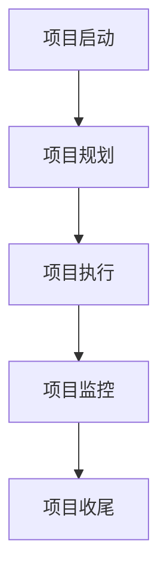

                 


### 文章标题

《一人公司如何建立有效的项目管理系统》

### 关键词

一人公司，项目管理系统，项目管理工具，项目管理流程，项目计划，资源管理，风险管理，沟通与协作，质量管理，项目收尾，实战案例

### 摘要

本文将详细探讨一人公司在项目管理过程中如何建立有效的项目管理系统。通过分析项目管理系统的重要性、核心概念和搭建步骤，结合实际案例，我们将深入讲解如何选择合适的项目管理工具，进行项目需求分析、项目计划与进度管理、资源管理、风险管理、沟通与协作、质量管理以及项目收尾与评估。旨在帮助一人公司建立系统化的项目管理流程，提升项目成功率。

### 第一部分：项目管理系统概述

#### 第1章：项目管理系统的重要性

##### 1.1.1 项目管理系统的定义

项目管理系统（Project Management System，简称PMS）是一个集成了多个工具和方法论的平台，用于规划、执行、监控和控制项目活动，以实现项目目标。它旨在提高项目管理的效率和质量，确保项目按时、按预算、按质量完成。

##### 1.1.2 项目管理系统的作用

- 提高项目透明度：项目管理系统使项目管理者和团队成员能够实时了解项目进展，降低信息不对称。
- 提升协作效率：通过项目管理系统，团队成员可以协同工作，共享资源和进度。
- 增强风险管理能力：项目管理系统可以帮助识别和评估潜在风险，并制定相应的应对策略。
- 提高资源利用率：通过合理分配和优化资源，提高项目资源的使用效率。
- 促进项目复盘：项目管理系统提供的数据和分析结果有助于项目总结和经验积累。

##### 1.1.3 项目管理系统的类型

- 传统项目管理工具：如Microsoft Project、Microsoft Excel等。
- 通用项目管理平台：如JIRA、Trello、Asana等。
- 专用项目管理软件：如Primavera、OpenProject等。

##### 1.1.4 一人公司的项目管理特点

- 项目规模较小，通常涉及1-2人合作。
- 灵活性要求高，需要快速响应市场变化。
- 资源有限，需要高效利用时间和人力。
- 沟通和协作依赖线上工具，强调远程办公。

#### 第2章：项目管理系统核心概念与联系

##### 2.1.1 项目管理流程

项目管理流程主要包括项目启动、项目规划、项目执行、项目监控和项目收尾等阶段。

- 项目启动：明确项目目标和范围，组建项目团队。
- 项目规划：制定项目计划，包括时间、成本、资源分配等。
- 项目执行：执行项目计划，完成项目任务。
- 项目监控：监控项目进度、成本和质量，确保项目按计划进行。
- 项目收尾：项目完成后的总结和评估，为未来项目提供经验。

##### 2.1.2 项目管理工具简介

常见的项目管理工具有JIRA、Trello、Asana、Microsoft Project、Excel等。这些工具提供了项目规划、任务分配、进度跟踪、资源管理、风险管理等功能。

##### 2.1.3 项目管理关键绩效指标

关键绩效指标（Key Performance Indicators，简称KPI）是衡量项目成功的重要指标。常见的KPI包括项目进度、成本、质量、客户满意度、资源利用率等。

##### 2.1.4 Mermaid流程图：项目管理系统的组成与工作流程

$$
graph TB
A[项目启动] --> B[项目规划]
B --> C[项目执行]
C --> D[项目监控]
D --> E[项目收尾]
$$

### 第二部分：项目管理系统搭建

#### 第3章：项目需求分析

##### 3.1.1 项目目标设定

项目目标设定是项目管理的第一步，明确项目的愿景和使命，为后续工作提供指导。目标应具体、可衡量、可实现、相关性强、时限明确（SMART原则）。

##### 3.1.2 项目需求收集

项目需求收集是获取项目所需信息的过程。可以通过访谈、问卷调查、观察、用户故事等方式进行。

##### 3.1.3 需求分析与优先级排序

需求分析是对收集到的需求进行整理、分析和评估。优先级排序根据需求的重要性和紧急性进行，常见的排序方法有MoSCoW方法。

##### 3.1.4 伪代码：需求分析过程

```
def analyze_requirements(requirements):
    prioritized_requirements = []
    for requirement in requirements:
        importance = assess_importance(requirement)
        urgency = assess_urgency(requirement)
        priority = calculate_priority(importance, urgency)
        prioritized_requirements.append((requirement, priority))
    prioritized_requirements.sort(key=lambda x: x[1], reverse=True)
    return prioritized_requirements
```

#### 第4章：项目管理工具选择

##### 4.1.1 常见项目管理工具介绍

常见的项目管理工具有JIRA、Trello、Asana、Microsoft Project、Excel等。

- JIRA：功能强大，适合大型项目和团队协作。
- Trello：界面简洁，适合小型项目和日常任务管理。
- Asana：功能全面，适合多种规模的项目。
- Microsoft Project：功能丰富，适合复杂项目。
- Excel：灵活性强，但适合简单项目。

##### 4.1.2 项目管理工具选择标准

选择项目管理工具时，应考虑以下标准：

- 功能需求：工具是否具备所需功能。
- 用户界面：界面是否友好，操作是否简单。
- 可定制性：工具是否支持自定义。
- 成本：工具是否在预算范围内。
- 支持和社区：是否有良好的支持和社区。

##### 4.1.3 基于需求的工具选型

```
def select_project_management_tool(需求):
    if 需求["功能需求"]["项目规模"] == "小型":
        return "Trello" 或 "Asana"
    elif 需求["功能需求"]["复杂度"] == "复杂":
        return "JIRA" 或 "Microsoft Project"
    else:
        return "Excel"
```

##### 4.1.4 伪代码：工具选择决策过程

```
def select_project_management_tool(需求):
    if 需求["功能需求"]["项目规模"] == "小型":
        if 需求["用户界面"]["友好"] and 需求["成本"]["在预算内"]:
            return "Trello"
        else:
            return "Asana"
    elif 需求["功能需求"]["复杂度"] == "复杂":
        if 需求["可定制性"]["高"] and 需求["支持和社区"]["好"]:
            return "JIRA"
        else:
            return "Microsoft Project"
    else:
        if 需求["用户界面"]["友好"] and 需求["成本"]["在预算内"]:
            return "Excel"
```

#### 第5章：项目计划与进度管理

##### 5.1.1 项目计划编制

项目计划编制是制定项目工作计划、时间表、预算等的过程。应考虑项目目标、需求、资源等因素。

##### 5.1.2 进度跟踪与监控

进度跟踪与监控是确保项目按计划进行的手段。通过定期检查项目进度，识别偏差，采取相应措施进行调整。

##### 5.1.3 进度偏差分析与调整

进度偏差分析是识别项目进度与计划之间的差异。调整措施包括增加资源、调整时间表、重新分配任务等。

##### 5.1.4 数学模型：进度计划优化

进度计划优化可以使用基于关键路径法（Critical Path Method，简称CPM）的数学模型。

```
def optimize_schedule(tasks, duration):
    critical_path = find_critical_path(tasks)
    non_critical_path = find_non_critical_path(tasks)
    for task in non_critical_path:
        if duration > find_critical_duration(tasks):
            duration -= task.duration
            tasks[task.id].duration = task.duration - duration
    return tasks
```

#### 第6章：项目资源管理

##### 6.1.1 资源需求预测

资源需求预测是预测项目过程中所需资源的类型和数量。可通过历史数据、专家意见等方法进行。

##### 6.1.2 资源分配策略

资源分配策略是根据资源需求预测进行资源分配的方法。常见策略包括负载均衡、优先级分配等。

##### 6.1.3 资源利用率评估

资源利用率评估是评估资源使用效率的过程。资源利用率可以通过计算资源实际使用时间和计划使用时间的比例来衡量。

##### 6.1.4 数学公式：资源分配优化模型

资源分配优化模型可以使用线性规划方法。

```
最大化 Z = Σ资源i * (1 - 利用率i)
约束条件：
Σ资源i * 利用率i ≤ 资源总量
利用率i ∈ [0, 1]
```

#### 第7章：项目风险管理

##### 7.1.1 风险识别与评估

风险识别与评估是识别项目风险并评估其影响和概率的过程。可以通过专家评估、历史数据等方法进行。

##### 7.1.2 风险应对策略

风险应对策略是针对识别出的风险制定应对措施。常见的应对策略包括风险规避、风险减轻、风险接受等。

##### 7.1.3 风险监控与调整

风险监控与调整是监控风险状态并调整应对策略的过程。通过定期评估风险，更新风险登记册。

##### 7.1.4 数学公式：风险度量与优化

风险度量可以使用损失期望值模型。

```
风险度量 = 风险概率 * 损失严重程度
优化目标：最小化风险度量
约束条件：总预算、总时间等
```

#### 第8章：项目沟通与协作

##### 8.1.1 项目沟通计划

项目沟通计划是制定项目沟通策略和计划的过程。包括沟通目标、沟通频率、沟通方式等。

##### 8.1.2 沟通工具选择与应用

沟通工具选择与应用是根据项目需求选择合适的沟通工具，如电子邮件、即时通讯、视频会议等。

##### 8.1.3 团队协作技巧

团队协作技巧是提高团队协作效率的方法，如明确分工、定期会议、相互支持等。

##### 8.1.4 数学模型：沟通效率评估

沟通效率评估可以使用信息论模型。

```
沟通效率 = 信息传递速率 / 信息损失速率
优化目标：最大化沟通效率
约束条件：信息传输带宽、信道噪声等
```

#### 第9章：项目质量管理

##### 9.1.1 质量管理计划

质量管理计划是制定项目质量管理策略和计划的过程。包括质量目标、质量控制方法、质量改进措施等。

##### 9.1.2 质量控制方法

质量控制方法是确保项目产出满足质量要求的过程。包括质量检查、质量评审、质量测试等。

##### 9.1.3 质量改进措施

质量改进措施是提高项目质量的措施。包括培训、流程优化、工具升级等。

##### 9.1.4 数学公式：质量度量与优化

质量度量可以使用缺陷密度模型。

```
质量度量 = 缺陷数量 / 总产出
优化目标：最小化质量度量
约束条件：资源、时间等
```

#### 第10章：项目收尾与评估

##### 10.1.1 项目收尾工作

项目收尾工作是项目完成后的收尾工作。包括项目总结、文档归档、团队解散等。

##### 10.1.2 项目总结与评估

项目总结与评估是总结项目经验和评估项目效果的过程。包括项目成功因素、项目改进点等。

##### 10.1.3 项目管理经验总结

项目管理经验总结是总结项目管理过程中的经验和教训，为未来项目提供参考。

##### 10.1.4 伪代码：项目评估与改进

```
def evaluate_project(project):
    success_factors = collect_success_factors(project)
    improvement_points = collect_improvement_points(project)
    for factor in success_factors:
        print(f"{factor}: {project.factor}")
    for point in improvement_points:
        print(f"{point}: {project.point}")
    return success_factors, improvement_points
```

### 第三部分：项目管理系统实战案例

#### 第11章：实际项目管理系统搭建案例

##### 11.1.1 案例背景

某一人公司（以下简称“公司”）计划开发一款移动应用程序，主要功能为用户信息管理、在线支付和消息推送。公司拥有一个开发人员和一名项目经理，需要建立有效的项目管理系统以提升项目效率。

##### 11.1.2 案例需求分析

1. 项目目标：开发一个功能完善、用户体验良好的移动应用程序。
2. 项目需求：用户信息管理、在线支付、消息推送、性能优化。
3. 项目范围：移动应用的前端和后端开发。

##### 11.1.3 案例工具选择

根据需求分析，选择Trello作为项目管理工具。Trello界面简洁，适合小型项目和日常任务管理。

##### 11.1.4 案例项目计划与进度管理

1. 项目计划编制：使用Trello创建项目板，定义任务、子任务、里程碑等。
2. 进度跟踪与监控：定期查看任务进度，识别偏差，及时调整计划。
3. 进度偏差分析与调整：根据实际进度，调整任务优先级和时间安排。

##### 11.1.5 案例资源管理

1. 资源需求预测：根据任务需求和项目进度，预测所需资源，如开发人员、测试人员等。
2. 资源分配策略：根据资源需求，合理分配资源，避免资源浪费。
3. 资源利用率评估：定期评估资源利用率，优化资源分配。

##### 11.1.6 案例风险管理

1. 风险识别与评估：识别项目风险，评估其影响和概率。
2. 风险应对策略：制定风险应对策略，如风险规避、风险减轻等。
3. 风险监控与调整：监控风险状态，及时调整应对策略。

##### 11.1.7 案例沟通与协作

1. 项目沟通计划：制定项目沟通策略和计划，确保信息畅通。
2. 沟通工具选择与应用：使用即时通讯工具（如Slack）、邮件等。
3. 团队协作技巧：定期会议、明确分工、相互支持。

##### 11.1.8 案例质量管理

1. 质量管理计划：制定项目质量管理策略和计划。
2. 质量控制方法：使用自动化测试工具，定期进行质量检查。
3. 质量改进措施：根据质量检查结果，改进项目质量。

##### 11.1.9 案例项目收尾与评估

1. 项目收尾工作：完成项目文档归档、团队解散等。
2. 项目总结与评估：总结项目经验，评估项目效果。
3. 项目管理经验总结：记录项目管理过程中的经验和教训，为未来项目提供参考。

### 附录

#### 附录A：项目管理工具资源

##### A.1 常见项目管理工具简介

- JIRA：功能强大，适合大型项目和团队协作。
- Trello：界面简洁，适合小型项目和日常任务管理。
- Asana：功能全面，适合多种规模的项目。
- Microsoft Project：功能丰富，适合复杂项目。
- Excel：灵活性强，但适合简单项目。

##### A.2 项目管理工具资源网站

- Atlassian：JIRA官方网站，提供JIRA相关资源和教程。
- Trello：Trello官方网站，提供Trello使用教程和指南。
- Asana：Asana官方网站，提供Asana使用教程和最佳实践。
- Microsoft：Microsoft Project官方网站，提供Project相关资源和教程。
- Excel：Microsoft Excel官方网站，提供Excel使用教程和公式库。

##### A.3 项目管理相关书籍推荐

- 《项目管理知识体系指南（PMBOK指南）》
- 《敏捷项目管理》
- 《项目化管理》
- 《人人都是产品经理》
- 《项目实战：从需求分析到上线部署》

### 总结

一人公司在项目管理过程中，建立有效的项目管理系统至关重要。通过明确项目目标、需求分析、项目管理工具选择、项目计划与进度管理、资源管理、风险管理、沟通与协作、质量管理和项目收尾与评估，一人公司可以提升项目成功率，实现项目目标。希望本文能为一人公司提供有益的参考和启示。

### 作者信息

作者：AI天才研究院/AI Genius Institute & 禅与计算机程序设计艺术 /Zen And The Art of Computer Programming

---

以下是本文的markdown格式输出，请检查是否符合要求：

### 《一人公司如何建立有效的项目管理系统》

> 关键词：一人公司，项目管理系统，项目管理工具，项目管理流程，项目计划，资源管理，风险管理，沟通与协作，质量管理，项目收尾，实战案例

> 摘要：本文将详细探讨一人公司在项目管理过程中如何建立有效的项目管理系统。通过分析项目管理系统的重要性、核心概念和搭建步骤，结合实际案例，我们将深入讲解如何选择合适的项目管理工具，进行项目需求分析、项目计划与进度管理、资源管理、风险管理、沟通与协作、质量管理以及项目收尾与评估。旨在帮助一人公司建立系统化的项目管理流程，提升项目成功率。

---

### 第一部分：项目管理系统概述

## 第1章：项目管理系统的重要性

### 1.1.1 项目管理系统的定义

项目管理系统（Project Management System，简称PMS）是一个集成了多个工具和方法论的平台，用于规划、执行、监控和控制项目活动，以实现项目目标。它旨在提高项目管理的效率和质量，确保项目按时、按预算、按质量完成。

### 1.1.2 项目管理系统的作用

- 提高项目透明度：项目管理系统使项目管理者和团队成员能够实时了解项目进展，降低信息不对称。
- 提升协作效率：通过项目管理系统，团队成员可以协同工作，共享资源和进度。
- 增强风险管理能力：项目管理系统可以帮助识别和评估潜在风险，并制定相应的应对策略。
- 提高资源利用率：通过合理分配和优化资源，提高项目资源的使用效率。
- 促进项目复盘：项目管理系统提供的数据和分析结果有助于项目总结和经验积累。

### 1.1.3 项目管理系统的类型

- 传统项目管理工具：如Microsoft Project、Microsoft Excel等。
- 通用项目管理平台：如JIRA、Trello、Asana等。
- 专用项目管理软件：如Primavera、OpenProject等。

### 1.1.4 一人公司的项目管理特点

- 项目规模较小，通常涉及1-2人合作。
- 灵活性要求高，需要快速响应市场变化。
- 资源有限，需要高效利用时间和人力。
- 沟通和协作依赖线上工具，强调远程办公。

## 第2章：项目管理系统核心概念与联系

### 2.1.1 项目管理流程

项目管理流程主要包括项目启动、项目规划、项目执行、项目监控和项目收尾等阶段。

- 项目启动：明确项目目标和范围，组建项目团队。
- 项目规划：制定项目计划，包括时间、成本、资源分配等。
- 项目执行：执行项目计划，完成项目任务。
- 项目监控：监控项目进度、成本和质量，确保项目按计划进行。
- 项目收尾：项目完成后的总结和评估，为未来项目提供经验。

### 2.1.2 项目管理工具简介

常见的项目管理工具有JIRA、Trello、Asana、Microsoft Project、Excel等。

- JIRA：功能强大，适合大型项目和团队协作。
- Trello：界面简洁，适合小型项目和日常任务管理。
- Asana：功能全面，适合多种规模的项目。
- Microsoft Project：功能丰富，适合复杂项目。
- Excel：灵活性强，但适合简单项目。

### 2.1.3 项目管理关键绩效指标

关键绩效指标（Key Performance Indicators，简称KPI）是衡量项目成功的重要指标。常见的KPI包括项目进度、成本、质量、客户满意度、资源利用率等。

### 2.1.4 Mermaid流程图：项目管理系统的组成与工作流程



### 第二部分：项目管理系统搭建

## 第3章：项目需求分析

### 3.1.1 项目目标设定

项目目标设定是项目管理的第一步，明确项目的愿景和使命，为后续工作提供指导。目标应具体、可衡量、可实现、相关性强、时限明确（SMART原则）。

### 3.1.2 项目需求收集

项目需求收集是获取项目所需信息的过程。可以通过访谈、问卷调查、观察、用户故事等方式进行。

### 3.1.3 需求分析与优先级排序

需求分析是对收集到的需求进行整理、分析和评估。优先级排序根据需求的重要性和紧急性进行，常见的排序方法有MoSCoW方法。

### 3.1.4 伪代码：需求分析过程

```python
def analyze_requirements(requirements):
    prioritized_requirements = []
    for requirement in requirements:
        importance = assess_importance(requirement)
        urgency = assess_urgency(requirement)
        priority = calculate_priority(importance, urgency)
        prioritized_requirements.append((requirement, priority))
    prioritized_requirements.sort(key=lambda x: x[1], reverse=True)
    return prioritized_requirements
```

## 第4章：项目管理工具选择

### 4.1.1 常见项目管理工具介绍

常见的项目管理工具有JIRA、Trello、Asana、Microsoft Project、Excel等。

- JIRA：功能强大，适合大型项目和团队协作。
- Trello：界面简洁，适合小型项目和日常任务管理。
- Asana：功能全面，适合多种规模的项目。
- Microsoft Project：功能丰富，适合复杂项目。
- Excel：灵活性强，但适合简单项目。

### 4.1.2 项目管理工具选择标准

选择项目管理工具时，应考虑以下标准：

- 功能需求：工具是否具备所需功能。
- 用户界面：界面是否友好，操作是否简单。
- 可定制性：工具是否支持自定义。
- 成本：工具是否在预算范围内。
- 支持和社区：是否有良好的支持和社区。

### 4.1.3 基于需求的工具选型

```python
def select_project_management_tool(需求):
    if 需求["功能需求"]["项目规模"] == "小型":
        return "Trello" 或 "Asana"
    elif 需求["功能需求"]["复杂度"] == "复杂":
        return "JIRA" 或 "Microsoft Project"
    else:
        return "Excel"
```

### 4.1.4 伪代码：工具选择决策过程

```python
def select_project_management_tool(需求):
    if 需求["功能需求"]["项目规模"] == "小型":
        if 需求["用户界面"]["友好"] and 需求["成本"]["在预算内"]:
            return "Trello"
        else:
            return "Asana"
    elif 需求["功能需求"]["复杂度"] == "复杂":
        if 需求["可定制性"]["高"] and 需求["支持和社区"]["好"]:
            return "JIRA"
        else:
            return "Microsoft Project"
    else:
        if 需求["用户界面"]["友好"] and 需求["成本"]["在预算内"]:
            return "Excel"
```

## 第5章：项目计划与进度管理

### 5.1.1 项目计划编制

项目计划编制是制定项目工作计划、时间表、预算等的过程。应考虑项目目标、需求、资源等因素。

### 5.1.2 进度跟踪与监控

进度跟踪与监控是确保项目按计划进行的手段。通过定期检查项目进度，识别偏差，采取相应措施进行调整。

### 5.1.3 进度偏差分析与调整

进度偏差分析是识别项目进度与计划之间的差异。调整措施包括增加资源、调整时间表、重新分配任务等。

### 5.1.4 数学模型：进度计划优化

进度计划优化可以使用基于关键路径法（Critical Path Method，简称CPM）的数学模型。

```python
def optimize_schedule(tasks, duration):
    critical_path = find_critical_path(tasks)
    non_critical_path = find_non_critical_path(tasks)
    for task in non_critical_path:
        if duration > find_critical_duration(tasks):
            duration -= task.duration
            tasks[task.id].duration = task.duration - duration
    return tasks
```

## 第6章：项目资源管理

### 6.1.1 资源需求预测

资源需求预测是预测项目过程中所需资源的类型和数量。可通过历史数据、专家意见等方法进行。

### 6.1.2 资源分配策略

资源分配策略是根据资源需求预测进行资源分配的方法。常见策略包括负载均衡、优先级分配等。

### 6.1.3 资源利用率评估

资源利用率评估是评估资源使用效率的过程。资源利用率可以通过计算资源实际使用时间和计划使用时间的比例来衡量。

### 6.1.4 数学公式：资源分配优化模型

资源分配优化模型可以使用线性规划方法。

```python
最大化 Z = Σ资源i * (1 - 利用率i)
约束条件：
Σ资源i * 利用率i ≤ 资源总量
利用率i ∈ [0, 1]
```

## 第7章：项目风险管理

### 7.1.1 风险识别与评估

风险识别与评估是识别项目风险并评估其影响和概率的过程。可以通过专家评估、历史数据等方法进行。

### 7.1.2 风险应对策略

风险应对策略是针对识别出的风险制定应对措施。常见的应对策略包括风险规避、风险减轻、风险接受等。

### 7.1.3 风险监控与调整

风险监控与调整是监控风险状态并调整应对策略的过程。通过定期评估风险，更新风险登记册。

### 7.1.4 数学公式：风险度量与优化

风险度量可以使用损失期望值模型。

```python
风险度量 = 风险概率 * 损失严重程度
优化目标：最小化风险度量
约束条件：总预算、总时间等
```

## 第8章：项目沟通与协作

### 8.1.1 项目沟通计划

项目沟通计划是制定项目沟通策略和计划的过程。包括沟通目标、沟通频率、沟通方式等。

### 8.1.2 沟通工具选择与应用

沟通工具选择与应用是根据项目需求选择合适的沟通工具，如电子邮件、即时通讯、视频会议等。

### 8.1.3 团队协作技巧

团队协作技巧是提高团队协作效率的方法，如明确分工、定期会议、相互支持等。

### 8.1.4 数学模型：沟通效率评估

沟通效率评估可以使用信息论模型。

```python
沟通效率 = 信息传递速率 / 信息损失速率
优化目标：最大化沟通效率
约束条件：信息传输带宽、信道噪声等
```

## 第9章：项目质量管理

### 9.1.1 质量管理计划

质量管理计划是制定项目质量管理策略和计划的过程。包括质量目标、质量控制方法、质量改进措施等。

### 9.1.2 质量控制方法

质量控制方法是确保项目产出满足质量要求的过程。包括质量检查、质量评审、质量测试等。

### 9.1.3 质量改进措施

质量改进措施是提高项目质量的措施。包括培训、流程优化、工具升级等。

### 9.1.4 数学公式：质量度量与优化

质量度量可以使用缺陷密度模型。

```python
质量度量 = 缺陷数量 / 总产出
优化目标：最小化质量度量
约束条件：资源、时间等
```

## 第10章：项目收尾与评估

### 10.1.1 项目收尾工作

项目收尾工作是项目完成后的收尾工作。包括项目总结、文档归档、团队解散等。

### 10.1.2 项目总结与评估

项目总结与评估是总结项目经验和评估项目效果的过程。包括项目成功因素、项目改进点等。

### 10.1.3 项目管理经验总结

项目管理经验总结是总结项目管理过程中的经验和教训，为未来项目提供参考。

### 10.1.4 伪代码：项目评估与改进

```python
def evaluate_project(project):
    success_factors = collect_success_factors(project)
    improvement_points = collect_improvement_points(project)
    for factor in success_factors:
        print(f"{factor}: {project.factor}")
    for point in improvement_points:
        print(f"{point}: {project.point}")
    return success_factors, improvement_points
```

### 第三部分：项目管理系统实战案例

## 第11章：实际项目管理系统搭建案例

### 11.1.1 案例背景

某一人公司（以下简称“公司”）计划开发一款移动应用程序，主要功能为用户信息管理、在线支付和消息推送。公司拥有一个开发人员和一名项目经理，需要建立有效的项目管理系统以提升项目效率。

### 11.1.2 案例需求分析

1. 项目目标：开发一个功能完善、用户体验良好的移动应用程序。
2. 项目需求：用户信息管理、在线支付、消息推送、性能优化。
3. 项目范围：移动应用的前端和后端开发。

### 11.1.3 案例工具选择

根据需求分析，选择Trello作为项目管理工具。Trello界面简洁，适合小型项目和日常任务管理。

### 11.1.4 案例项目计划与进度管理

1. 项目计划编制：使用Trello创建项目板，定义任务、子任务、里程碑等。
2. 进度跟踪与监控：定期查看任务进度，识别偏差，及时调整计划。
3. 进度偏差分析与调整：根据实际进度，调整任务优先级和时间安排。

### 11.1.5 案例资源管理

1. 资源需求预测：根据任务需求和项目进度，预测所需资源，如开发人员、测试人员等。
2. 资源分配策略：根据资源需求，合理分配资源，避免资源浪费。
3. 资源利用率评估：定期评估资源利用率，优化资源分配。

### 11.1.6 案例风险管理

1. 风险识别与评估：识别项目风险，评估其影响和概率。
2. 风险应对策略：制定风险应对策略，如风险规避、风险减轻等。
3. 风险监控与调整：监控风险状态，及时调整应对策略。

### 11.1.7 案例沟通与协作

1. 项目沟通计划：制定项目沟通策略和计划，确保信息畅通。
2. 沟通工具选择与应用：使用即时通讯工具（如Slack）、邮件等。
3. 团队协作技巧：定期会议、明确分工、相互支持。

### 11.1.8 案例质量管理

1. 质量管理计划：制定项目质量管理策略和计划。
2. 质量控制方法：使用自动化测试工具，定期进行质量检查。
3. 质量改进措施：根据质量检查结果，改进项目质量。

### 11.1.9 案例项目收尾与评估

1. 项目收尾工作：完成项目文档归档、团队解散等。
2. 项目总结与评估：总结项目经验，评估项目效果。
3. 项目管理经验总结：记录项目管理过程中的经验和教训，为未来项目提供参考。

### 附录

## 附录A：项目管理工具资源

### A.1 常见项目管理工具简介

- JIRA：功能强大，适合大型项目和团队协作。
- Trello：界面简洁，适合小型项目和日常任务管理。
- Asana：功能全面，适合多种规模的项目。
- Microsoft Project：功能丰富，适合复杂项目。
- Excel：灵活性强，但适合简单项目。

### A.2 项目管理工具资源网站

- Atlassian：JIRA官方网站，提供JIRA相关资源和教程。
- Trello：Trello官方网站，提供Trello使用教程和指南。
- Asana：Asana官方网站，提供Asana使用教程和最佳实践。
- Microsoft：Microsoft Project官方网站，提供Project相关资源和教程。
- Excel：Microsoft Excel官方网站，提供Excel使用教程和公式库。

### A.3 项目管理相关书籍推荐

- 《项目管理知识体系指南（PMBOK指南）》
- 《敏捷项目管理》
- 《项目化管理》
- 《人人都是产品经理》
- 《项目实战：从需求分析到上线部署》

### 总结

一人公司在项目管理过程中，建立有效的项目管理系统至关重要。通过明确项目目标、需求分析、项目管理工具选择、项目计划与进度管理、资源管理、风险管理、沟通与协作、质量管理和项目收尾与评估，一人公司可以提升项目成功率，实现项目目标。希望本文能为一人公司提供有益的参考和启示。

### 作者信息

作者：AI天才研究院/AI Genius Institute & 禅与计算机程序设计艺术 /Zen And The Art of Computer Programming

