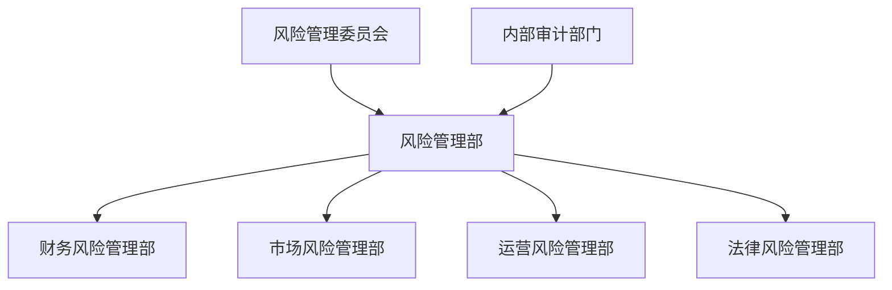
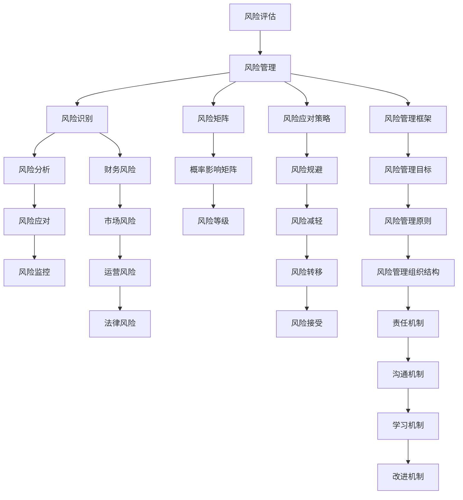
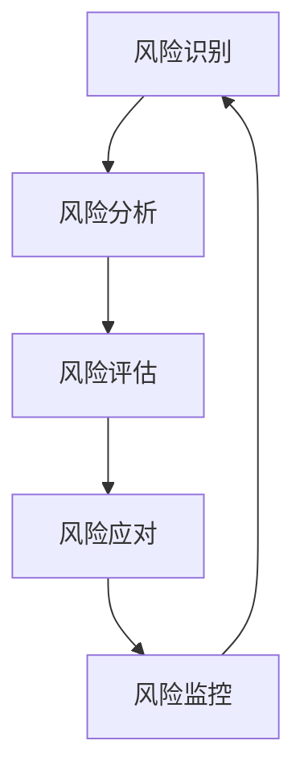

                 

## 文章标题

《一人公司如何建立有效的风险评估与管理机制》

## 关键词

一人公司，风险评估，风险管理，财务风险，市场风险，风险管理体系，风险应对策略，风险管理软件

## 摘要

在当今快速变化的市场环境中，一人公司面临着前所未有的风险和挑战。如何建立有效的风险评估与管理机制，成为一人公司持续发展和稳定运营的关键。本文将从风险评估的定义与意义、企业风险管理框架、财务风险评估、市场风险评估等方面，逐步探讨一人公司建立风险评估与管理机制的策略和方法。通过案例分析，我们将深入了解风险评估在实践中的应用，并展望未来风险管理与可持续发展的趋势。

### 《一人公司如何建立有效的风险评估与管理机制》目录大纲

#### 第一部分：风险评估基础

**第1章：企业风险评估概述**

- **1.1 风险评估的定义与意义**
- **1.2 风险评估的分类与作用**
- **1.3 风险评估的流程与方法**

**第2章：企业风险管理框架**

- **2.1 企业风险管理的定义与目标**
- **2.2 企业风险管理的基本原则**
- **2.3 企业风险管理的组织结构**

**第3章：财务风险评估**

- **3.1 财务风险的概念与类型**
- **3.2 财务风险评估指标**
- **3.3 财务风险评估方法**

**第4章：市场风险评估**

- **4.1 市场风险的概念与类型**
- **4.2 市场风险评估指标**
- **4.3 市场风险评估方法**

#### 第二部分：建立风险评估与管理机制

**第5章：风险评估体系的建立**

- **5.1 风险评估体系的构建步骤**
- **5.2 风险评估体系的运行机制**
- **5.3 风险评估体系的评价与改进**

**第6章：风险评估工具与方法**

- **6.1 风险评估软件与平台**
- **6.2 定量风险评估方法**
- **6.3 定性风险评估方法**

**第7章：风险管理与决策**

- **7.1 风险应对策略与措施**
- **7.2 风险分配与责任划分**
- **7.3 风险管理的决策支持**

#### 第三部分：案例分析

**第8章：企业风险评估实践**

- **8.1 某公司风险评估案例**
- **8.2 案例分析：成功与挑战**
- **8.3 案例启示与借鉴**

**第9章：风险管理与可持续发展**

- **9.1 风险管理与可持续发展关系**
- **9.2 风险管理在可持续发展中的实践**
- **9.3 未来风险管理与发展的趋势**

#### 附录

**附录A：参考文献**

**附录B：常用风险评估工具与方法简介**

**附录C：企业风险评估模板与表格**

### 引言

在当前的商业环境中，风险无处不在，对于任何规模的企业而言，有效管理风险都是确保持续发展的关键。一人公司，作为小型企业的一种典型形态，面临着独特的挑战。由于资源有限、管理层次简单，一人公司往往需要更加精细化和系统化的风险评估与管理机制来保障企业的稳定运营和长期发展。

建立有效的风险评估与管理机制，对于一人公司而言具有以下几个重要意义：

1. **保障企业安全**：通过系统的风险评估，可以及时发现潜在风险，采取预防措施，避免企业因突发事件导致运营中断或重大损失。

2. **优化决策**：有效的风险评估可以帮助一人公司在面对各种市场变化和经营决策时，做出更加科学和理性的判断。

3. **提高竞争力**：通过有效的风险管理，一人公司可以提升运营效率和降低运营成本，从而增强市场竞争力。

4. **增强客户信任**：良好的风险管理体系可以提高客户对企业的信任，有助于企业的品牌建设和市场拓展。

本文将围绕一人公司如何建立有效的风险评估与管理机制进行详细探讨，旨在为一人公司的管理层提供实用的指导和建议。文章将从风险评估的基础知识、具体方法、实施步骤和案例分析等多个方面进行深入分析，帮助一人公司构建一套完整、有效的风险评估与管理体系。

### 第一部分：风险评估基础

#### 第1章：企业风险评估概述

在讨论如何建立有效的风险评估与管理机制之前，首先需要了解风险评估的基本概念、意义和分类。

**1.1 风险评估的定义与意义**

**定义：** 风险评估是指对企业面临的潜在风险进行识别、分析和评估的过程。它旨在通过系统的方法，评估风险的概率和影响，从而为企业决策提供支持。

**意义：**

1. **预防潜在风险**：通过风险评估，可以提前识别潜在风险，采取预防措施，避免风险的发生或降低风险的影响。

2. **优化决策**：风险评估为企业提供了关于各种风险的信息，有助于管理层在决策时进行权衡和选择，做出更加科学和理性的决策。

3. **资源合理配置**：通过评估不同风险的重要性，企业可以合理分配资源，确保资源用于管理最高优先级的风险。

4. **增强企业竞争力**：有效的风险管理可以降低运营成本，提高效率，从而增强企业的市场竞争力。

**1.2 风险评估的分类与作用**

风险评估可以根据不同的标准进行分类，常见的分类方法包括按风险类型、按风险发生的领域和按评估方法等。

**按风险类型分类：**

1. **财务风险**：与企业财务状况相关，如信用风险、市场风险、流动性风险等。
2. **运营风险**：与企业日常运营相关，如供应链风险、生产风险、员工风险等。
3. **市场风险**：与企业市场环境相关，如竞争风险、需求风险、价格风险等。
4. **法律风险**：与企业遵守法律法规相关，如合规风险、法律责任等。

**按风险发生的领域分类：**

1. **内部风险**：源于企业内部的管理、运营、人力资源等方面。
2. **外部风险**：源于企业外部环境的变化，如市场、政策、社会等。

**按评估方法分类：**

1. **定性评估**：主要依靠专家意见、历史数据和主观判断，对风险进行定性分析。
2. **定量评估**：通过数学模型、统计分析和量化指标，对风险进行定量分析。

**1.3 风险评估的流程与方法**

风险评估通常包括以下几个步骤：

**1. 风险识别：** 通过访谈、问卷调查、文档审查等方法，识别企业面临的各种潜在风险。

**2. 风险分析：** 对识别出的风险进行详细分析，包括风险的概率、影响和可能引起的连锁反应等。

**3. 风险评估：** 使用定性或定量方法，评估每个风险的重要性和优先级。

**4. 风险应对：** 根据风险评估的结果，制定相应的风险应对策略，包括风险规避、风险减轻、风险转移等。

**5. 风险监控：** 对已识别的风险进行持续监控，确保风险应对措施的有效性。

常见的风险评估方法包括：

1. **风险矩阵法**：通过评估风险的概率和影响，将风险分为不同的等级。
2. **蒙特卡洛模拟**：通过模拟随机事件，评估风险的概率分布和影响。
3. **决策树分析法**：通过构建决策树，分析不同决策方案的风险和收益。

通过了解风险评估的基本概念、分类和流程，一人公司可以更好地识别和管理风险，为企业的持续发展提供坚实保障。

#### 第2章：企业风险管理框架

建立有效的企业风险管理框架，是确保一人公司能够有效应对各种风险的基础。企业风险管理框架包括定义风险管理目标、制定基本原则和构建组织结构等多个方面。

**2.1 企业风险管理的定义与目标**

**定义：** 企业风险管理是指通过系统的方法，识别、评估、应对和监控企业内部和外部风险，以实现企业战略目标的过程。

**目标：**

1. **确保企业运营的连续性**：通过识别和应对运营风险，确保企业能够持续运营，不受突发事件的影响。
2. **保护企业资产**：通过风险管理，保护企业资产免受财务风险、市场风险和法律风险的侵害。
3. **提升企业竞争力**：通过降低风险，提高运营效率和降低成本，增强企业的市场竞争力。
4. **增强企业声誉**：通过良好的风险管理，提升企业的社会形象和客户信任度。

**2.2 企业风险管理的基本原则**

为了实现企业风险管理目标，需要遵循以下几个基本原则：

1. **全面性**：风险管理应覆盖企业的各个方面，包括财务、运营、市场、法律等。
2. **前瞻性**：风险管理应具有前瞻性，能够提前识别和应对潜在风险。
3. **系统性**：风险管理应是一个系统化的过程，包括风险识别、评估、应对和监控等环节。
4. **动态性**：风险管理是一个持续的过程，应随着企业环境和内部管理的变化进行调整。
5. **协同性**：风险管理需要各部门和员工的协同合作，形成全员参与的风险管理文化。

**2.3 企业风险管理的组织结构**

建立有效的风险管理组织结构，是确保企业风险管理顺利实施的关键。企业风险管理组织结构通常包括以下部分：

1. **风险管理委员会**：负责制定企业风险管理政策和指导原则，监督风险管理工作的执行。
2. **风险管理部**：负责日常风险管理工作的具体实施，包括风险识别、评估、应对和监控等。
3. **风险管理部门**：下属各部门的风险管理职责，确保风险管理能够渗透到企业的各个层面。
4. **内部审计部门**：负责对风险管理过程和效果进行审计，确保风险管理政策得到有效执行。

**组织结构示例：**



通过明确风险管理目标和基本原则，并构建合理的组织结构，一人公司可以建立一套系统化、规范化的风险管理框架，为企业的长期稳定发展提供有力保障。

#### 第3章：财务风险评估

财务风险评估是企业管理中至关重要的一环，它涉及到企业财务健康、资金流动性和财务风险管理等多个方面。对于一人公司而言，有效的财务风险评估能够帮助其更好地应对市场变化，确保财务稳健。

**3.1 财务风险的概念与类型**

**概念：** 财务风险是指企业由于财务问题而面临的风险，包括但不限于资金不足、债务违约、资产贬值等。

**类型：**

1. **信用风险**：企业由于客户违约或交易对手风险而无法按时收回货款或获得预期收益的风险。
2. **市场风险**：由于市场利率、汇率、商品价格变动等因素导致企业财务状况恶化的风险。
3. **流动性风险**：企业无法在短时间内获得足够的资金来应对短期债务或其他支付需求的风险。
4. **操作风险**：由于企业内部操作失误、系统故障或管理不善等原因导致的财务损失风险。
5. **法律风险**：企业由于法律纠纷或违反法律法规而面临的风险。

**3.2 财务风险评估指标**

财务风险评估通常使用一系列指标来衡量企业的财务健康状况和风险水平。以下是常见的财务风险评估指标：

1. **流动比率**：衡量企业短期偿债能力的指标，计算公式为流动资产除以流动负债。一般来说，流动比率大于2表示企业的短期偿债能力较强。

   $$ \text{流动比率} = \frac{\text{流动资产}}{\text{流动负债}} $$

2. **速动比率**：更加严格的流动比率指标，从流动资产中扣除存货，计算公式为（流动资产 - 存货）除以流动负债。

   $$ \text{速动比率} = \frac{\text{流动资产} - \text{存货}}{\text{流动负债}} $$

3. **资产负债率**：衡量企业财务杠杆水平的指标，计算公式为总负债除以总资产。

   $$ \text{资产负债率} = \frac{\text{总负债}}{\text{总资产}} $$

4. **利息保障倍数**：衡量企业偿还利息能力的重要指标，计算公式为净利润加上利息费用除以利息费用。

   $$ \text{利息保障倍数} = \frac{\text{净利润} + \text{利息费用}}{\text{利息费用}} $$

5. **现金流量比率**：衡量企业现金流动性的指标，计算公式为经营活动现金流量净额除以流动负债。

   $$ \text{现金流量比率} = \frac{\text{经营活动现金流量净额}}{\text{流动负债}} $$

**3.3 财务风险评估方法**

财务风险评估可以采用定性分析和定量分析两种方法。

1. **定性分析**：主要依赖于专家的经验和判断，通过分析企业的财务报表、市场环境和管理层的战略规划等，评估企业的财务风险。

   - **财务报表分析**：通过分析企业的财务报表，了解企业的财务状况和趋势，识别潜在的风险。
   - **市场环境分析**：评估市场变化对企业财务状况的影响，如利率、汇率、经济周期等。
   - **管理评估**：分析企业管理层的决策能力、管理风格和执行力，评估其对财务风险的影响。

2. **定量分析**：通过使用数学模型和统计方法，对企业的财务数据进行分析，量化评估财务风险。

   - **财务比率分析**：使用前文提到的财务指标，量化评估企业的财务健康状况和风险水平。
   - **风险矩阵法**：将财务指标的风险概率和影响进行量化，构建风险矩阵，评估每个财务指标的风险等级。
   - **蒙特卡洛模拟**：通过模拟随机事件，评估企业财务风险的概率分布和潜在影响。

通过运用这些财务风险评估方法和指标，一人公司可以全面、系统地评估其财务风险，制定相应的风险应对策略，确保企业的财务稳健和持续发展。

### 第4章：市场风险评估

市场风险评估是企业评估其市场环境变化和外部因素对其业务潜在影响的过程。对于一人公司而言，市场风险评估尤为重要，因为它直接关系到企业的生存和发展。有效的市场风险评估可以帮助企业提前识别市场风险，制定相应的应对策略，从而降低市场不确定性对企业的影响。

**4.1 市场风险的概念与类型**

**概念：** 市场风险是指由于市场环境的变化，如市场需求、供应、价格、政策法规等，导致企业收入、成本、利润等预期收益发生变化的风险。

**类型：**

1. **市场需求风险**：由于消费者需求减少或需求变化，导致企业产品或服务销售不畅的风险。
2. **供应风险**：由于供应商供应中断、原材料价格上涨或质量不稳定，导致企业生产和销售受阻的风险。
3. **价格风险**：由于市场价格波动，导致企业产品或服务价格不稳定，影响企业盈利能力的风险。
4. **政策法规风险**：由于政策法规的变化，如税收政策、贸易政策、环保政策等，导致企业运营成本增加或经营受限的风险。
5. **竞争风险**：由于市场竞争激烈，导致企业市场份额下降或盈利能力下降的风险。

**4.2 市场风险评估指标**

为了全面评估市场风险，企业可以采用一系列市场风险评估指标。以下是几种常用的市场风险评估指标：

1. **市场占有率**：衡量企业在目标市场中的销售比例，市场占有率越高，表明企业竞争能力越强，市场风险相对较低。

   $$ \text{市场占有率} = \frac{\text{企业销售额}}{\text{市场总销售额}} $$

2. **客户满意度**：衡量客户对企业产品或服务的满意度，客户满意度越高，表明企业在市场上的地位越稳固，市场风险相对较低。

   $$ \text{客户满意度} = \frac{\text{满意的客户数}}{\text{总客户数}} $$

3. **产品或服务差异化**：衡量企业产品或服务与竞争对手的差异程度，差异化程度越高，表明企业在市场中的竞争力越强，市场风险相对较低。

4. **市场增长速度**：衡量市场总体增长速度，市场增长速度越高，表明市场需求越旺盛，企业面临的市场风险相对较低。

5. **行业平均利润率**：衡量企业所处行业的平均利润水平，行业利润率越高，表明行业竞争相对较小，企业市场风险相对较低。

**4.3 市场风险评估方法**

市场风险评估方法可以分为定量分析和定性分析两种。

1. **定量分析**：

   - **统计方法**：通过收集和分析历史数据，如市场趋势、需求变化等，预测未来市场情况，评估市场风险。
   - **经济计量模型**：利用数学模型，如回归分析、时间序列分析等，对市场变量进行建模和预测，评估市场风险。
   - **敏感性分析**：通过模拟不同市场条件下的财务指标变化，评估市场风险对企业财务状况的影响。

2. **定性分析**：

   - **专家评估法**：通过邀请市场专家、行业分析师等对企业市场风险进行评估，结合他们的经验和判断，识别和评估市场风险。
   - **案例分析法**：通过分析历史市场风险事件及其对企业的影响，预测未来市场风险及其可能对企业的影响。
   - **情景分析**：模拟不同的市场情景，评估不同情景下企业的财务表现和市场地位，识别和评估市场风险。

通过运用这些市场风险评估方法和指标，一人公司可以全面、系统地评估其市场风险，制定相应的风险应对策略，确保企业在不断变化的市场环境中保持竞争优势和稳定发展。

### 第5章：风险评估体系的建立

建立完整的风险评估体系是确保一人公司能够有效识别、评估和管理风险的关键。一个科学、合理、高效的风险评估体系可以帮助企业提前预警潜在风险，制定应对措施，保障企业的稳健运营和持续发展。

**5.1 风险评估体系的构建步骤**

要构建一个有效的风险评估体系，需要遵循以下步骤：

**1. 制定风险评估策略**

- **确定评估目标**：明确风险评估的主要目标，如预防潜在风险、优化决策、提高竞争力等。
- **定义评估范围**：明确评估的范围，包括财务风险、市场风险、运营风险、法律风险等。
- **确定评估频率**：根据企业实际情况，确定风险评估的频率，如年度评估、季度评估等。

**2. 建立评估团队**

- **组建评估小组**：由企业内部和外部专家组成，确保评估团队具备足够的专业知识和经验。
- **明确职责分工**：明确每个团队成员的职责和任务，确保评估工作有序进行。

**3. 制定评估标准和流程**

- **制定评估标准**：根据风险评估目标和范围，制定相应的评估标准和指标。
- **建立评估流程**：明确风险评估的步骤和流程，包括风险识别、风险分析、风险评估、风险应对等。

**4. 收集和分析数据**

- **数据收集**：通过访谈、问卷调查、文件审查等方式，收集与企业风险相关的数据。
- **数据分析**：运用统计分析、定量分析等方法，对收集到的数据进行分析，识别和评估风险。

**5. 制定风险应对策略**

- **评估结果分析**：对评估结果进行详细分析，识别关键风险和优先级。
- **制定应对措施**：根据风险类型和优先级，制定相应的风险应对措施，包括风险规避、风险减轻、风险转移等。

**6. 实施风险监控**

- **建立监控机制**：建立风险监控机制，对已识别的风险进行持续监控，确保风险应对措施的有效性。
- **定期评估**：定期对风险评估体系进行评估和改进，确保其适应企业发展的需要。

**5.2 风险评估体系的运行机制**

一个有效的风险评估体系需要建立良好的运行机制，确保评估工作能够持续、有效地进行。以下是风险评估体系运行机制的关键要素：

**1. 责任机制**

- **明确责任**：明确各部门和人员在风险评估中的职责，确保责任落实到人。
- **建立问责制度**：对未按风险评估要求执行工作的部门和个人进行问责，确保评估工作得到有效执行。

**2. 沟通机制**

- **建立沟通渠道**：建立内部和外部沟通渠道，确保评估团队与其他部门之间能够有效沟通，共享评估信息。
- **定期会议**：定期召开风险评估会议，讨论评估进展、问题及解决方案，确保评估工作得到持续关注和推进。

**3. 学习机制**

- **持续培训**：对评估团队成员进行定期培训，提高其专业知识和技能。
- **经验分享**：鼓励团队成员分享评估经验，互相学习，不断提高评估工作的质量和效率。

**4. 改进机制**

- **及时反馈**：对评估过程中发现的问题进行及时反馈，制定改进措施。
- **定期审查**：定期对风险评估体系进行审查，评估其有效性，并根据实际情况进行改进。

通过建立科学、合理、高效的风险评估体系，并确保其有效运行，一人公司可以更好地识别和管理风险，为企业的持续发展提供坚实保障。

#### 第6章：风险评估工具与方法

在实施风险评估过程中，选择合适的工具和方法至关重要。有效的工具和方法可以帮助企业更准确地识别、分析和应对风险。本文将介绍几种常见且实用的风险评估工具与方法。

**6.1 风险评估软件与平台**

随着信息技术的不断发展，许多专业的风险评估软件和平台应运而生，为企业的风险评估工作提供了强大的技术支持。以下是一些常用的风险评估工具：

1. **风险分析软件**：如Risks Analyzer、Risk Management Software等，这些软件提供了风险识别、评估、监控和报告等功能，可以帮助企业系统地管理风险。

2. **大数据分析平台**：如Apache Hadoop、Apache Spark等，这些平台可以处理海量数据，为企业提供全面的数据分析和预测能力，有助于识别潜在风险。

3. **风险管理信息系统**：如Oracle Risk Manager、SAS Risk Management等，这些系统集成了多种风险管理工具，可以为企业提供全面的风险管理解决方案。

**6.2 定量风险评估方法**

定量风险评估方法依赖于数学模型和统计分析，通过量化指标和模型来评估风险。以下是几种常见的定量风险评估方法：

1. **风险矩阵法**：通过评估风险的概率和影响，构建风险矩阵，将风险分为不同的等级。这种方法简单直观，适用于初步风险评估。

   $$ \text{风险值} = \text{风险概率} \times \text{风险影响} $$

2. **蒙特卡洛模拟**：通过模拟随机事件，生成大量随机样本，分析风险的概率分布和影响。这种方法可以提供详细的风险分析，适用于复杂风险的评估。

3. **决策树分析**：通过构建决策树，分析不同决策方案的风险和收益。这种方法可以帮助企业在不同风险情景下做出最佳决策。

4. **敏感性分析**：通过分析不同变量对风险值的影响，确定关键风险因素。这种方法可以帮助企业识别主要风险，并制定针对性的应对措施。

**6.3 定性风险评估方法**

定性风险评估方法主要依赖于专家经验和主观判断，适用于评估难以量化的风险。以下是几种常见的定性风险评估方法：

1. **专家评估法**：通过邀请行业专家和内部人员进行评估，结合他们的经验和判断，识别和评估风险。

2. **情景分析法**：通过模拟不同的市场情景，评估不同情景下企业的财务表现和市场地位，识别和评估风险。

3. **案例分析法**：通过分析历史市场风险事件及其对企业的影响，预测未来市场风险及其可能对企业的影响。

4. **头脑风暴法**：通过组织团队成员进行头脑风暴，收集和讨论潜在风险，评估其严重性和发生概率。

通过结合定量和定性风险评估方法，一人公司可以更全面、准确地识别和评估风险，为制定有效的风险应对策略提供可靠依据。同时，合理选择和使用风险评估工具，可以提高风险评估的效率和准确性，确保企业风险管理的科学性和系统性。

### 第7章：风险管理与决策

有效的风险管理是企业实现可持续发展的重要保障。在风险管理和决策过程中，企业需要综合考虑风险评估的结果，制定合理的应对策略，明确责任分工，并利用决策支持系统辅助决策。以下将详细探讨这些关键内容。

**7.1 风险应对策略与措施**

根据风险评估的结果，企业可以制定相应的风险应对策略与措施。常见的风险应对策略包括以下几种：

1. **风险规避**：通过调整战略或业务模式，避免风险的发生。例如，如果市场风险很高，企业可以选择退出特定市场。

2. **风险减轻**：通过采取预防措施或改进措施，降低风险的影响。例如，通过加强供应链管理，减少供应链中断的风险。

3. **风险转移**：通过保险或其他金融工具，将风险转移给第三方。例如，购买保险以应对自然灾害或意外事故。

4. **风险接受**：在风险概率和影响较低的情况下，企业可以选择接受风险，不采取特别措施。例如，对一些轻微的市场波动保持观望。

**7.2 风险分配与责任划分**

有效的风险管理需要明确风险分配和责任划分，确保每个部门和个人都清楚自己的职责。以下是风险分配和责任划分的几个关键步骤：

1. **制定风险分配策略**：根据企业的风险类型和业务特点，制定明确的风险分配策略，确保风险分配的合理性和公平性。

2. **明确责任主体**：明确每个部门和个人在风险管理中的具体职责，确保风险管理责任落实到人。

3. **建立责任监督机制**：建立监督机制，确保各部门和个人履行其风险管理职责，及时报告风险状况和应对措施。

4. **制定应急预案**：为每种主要风险制定应急预案，明确应急响应流程和责任分工，确保在风险事件发生时能够迅速、有效地应对。

**7.3 风险管理的决策支持**

为了提高风险管理的决策效率，企业需要利用决策支持系统（DSS）辅助决策。以下是一些常见的决策支持工具：

1. **数据分析和预测模型**：通过数据分析，如回归分析、时间序列分析等，预测风险的概率和影响，为企业决策提供依据。

2. **决策树**：通过构建决策树，分析不同决策方案的风险和收益，帮助企业做出最佳决策。

3. **模拟和仿真**：通过模拟和仿真，模拟不同风险情景下企业的财务表现，评估不同应对策略的有效性。

4. **专家系统**：利用专家经验和知识库，构建专家系统，为企业提供专业的风险评估和决策建议。

通过结合定量和定性分析、利用决策支持系统，企业可以更科学、高效地做出风险管理决策，确保企业在复杂多变的市场环境中保持稳健发展。

### 第8章：企业风险评估实践

为了更好地理解企业风险评估的实际应用，我们将通过一个具体的案例来展示风险评估的过程和效果。以下是某一人公司的风险评估实践案例。

**8.1 某公司风险评估案例**

某公司是一家小型科技初创企业，专注于软件开发和信息技术服务。公司运营过程中面临多种风险，包括财务风险、市场风险、运营风险和法律风险。为了确保企业的稳定发展，公司决定进行全面的风险评估。

**1. 风险识别**

公司通过访谈、问卷调查和文档审查等方法，识别出以下主要风险：

- **财务风险**：包括信用风险、市场风险和流动性风险。
- **市场风险**：包括需求风险、竞争风险和价格风险。
- **运营风险**：包括供应链风险、生产风险和员工风险。
- **法律风险**：包括合规风险和法律责任。

**2. 风险分析**

针对识别出的风险，公司进行了详细的风险分析：

- **财务风险**：通过分析公司的财务报表和现金流状况，发现公司的信用风险较高，主要客户多为中小企业，存在客户违约的风险。同时，市场需求波动较大，可能导致公司收入不稳定。
- **市场风险**：通过市场调查和竞争分析，发现公司面临较大的市场竞争压力，主要竞争对手为一些大型科技公司，市场份额较低。此外，原材料价格波动较大，可能影响公司的成本控制。
- **运营风险**：通过审查供应链和生产流程，发现供应链存在不稳定因素，如供应商交付不及时或原材料质量不稳定。同时，公司员工流动性较高，可能影响生产效率和项目进展。
- **法律风险**：公司业务涉及多个行业，需要遵守复杂的法律法规，存在合规风险。此外，公司面临潜在的法律诉讼风险。

**3. 风险评估**

公司采用风险矩阵法对识别出的风险进行评估，评估结果如下：

- **高优先级风险**：财务风险（信用风险、市场风险）、运营风险（供应链风险、员工风险）。
- **中优先级风险**：市场风险（需求风险、竞争风险）、法律风险（合规风险）。
- **低优先级风险**：运营风险（生产风险）、法律风险（法律诉讼风险）。

**4. 风险应对**

根据风险评估结果，公司制定了以下风险应对措施：

- **财务风险**：加强与客户的沟通，提高信用评估标准，确保客户信誉。同时，多元化客户来源，降低对单一客户的依赖。
- **市场风险**：加强市场调研，及时调整产品策略，提高市场竞争力。建立稳定的供应商关系，降低原材料价格波动影响。
- **运营风险**：优化供应链管理，确保供应商按时交付和质量稳定。通过培训和激励措施，降低员工流失率，提高员工忠诚度和工作效率。
- **法律风险**：加强合规管理，确保公司业务符合相关法律法规。建立法律顾问团队，及时处理法律纠纷和诉讼。

**5. 风险监控**

公司建立了风险监控机制，定期对风险进行评估和监控，确保风险应对措施的有效性。同时，公司引入了风险管理系统，实时跟踪和管理风险，提高了风险管理的效率和准确性。

**8.2 案例分析：成功与挑战**

**成功经验：**

1. **全面的风险识别和评估**：通过系统的风险识别和评估，公司能够全面了解面临的各类风险，制定有针对性的应对措施。
2. **有效的风险应对措施**：公司根据风险评估结果，制定了切实可行的风险应对措施，有效地降低了风险对企业运营的影响。
3. **风险监控机制的建立**：公司建立了有效的风险监控机制，确保风险应对措施得到有效执行，提高了风险管理的效率和效果。

**面临的挑战：**

1. **资源限制**：作为一人公司，公司面临资源有限的问题，特别是在风险管理和决策支持系统建设方面，需要更多投入。
2. **市场环境变化**：市场环境变化快，公司需要持续关注市场动态，及时调整风险应对策略。
3. **风险管理文化的培养**：公司需要进一步加强风险管理文化的培养，提高全体员工的风险意识和管理能力。

**8.3 案例启示与借鉴**

通过本案例，一人公司可以得到以下启示：

1. **系统化的风险评估**：建立系统化的风险评估体系，全面识别和评估企业风险，是有效管理风险的基础。
2. **针对性的风险应对措施**：根据风险评估结果，制定有针对性的风险应对措施，确保风险应对措施的有效性和可操作性。
3. **持续的风险监控**：建立有效的风险监控机制，确保风险应对措施得到持续跟踪和改进。
4. **资源投入**：尽管资源有限，但在风险管理和决策支持系统建设方面，应适当增加投入，以提高风险管理的效率和效果。

通过借鉴本案例，一人公司可以更好地建立和完善其风险评估与管理机制，确保企业的稳健发展和长期成功。

### 第9章：风险管理与可持续发展

风险管理与可持续发展是相辅相成的，两者之间存在着密切的联系。有效的风险管理不仅可以帮助企业降低风险，提高运营效率，还能够促进企业的可持续发展。以下是风险管理与可持续发展关系的详细探讨。

**9.1 风险管理与可持续发展关系**

**1. 风险管理促进可持续发展**

风险管理在可持续发展中发挥着重要作用。通过识别、评估和应对各种风险，企业可以确保运营的连续性和稳定性，从而实现长期的可持续发展。具体来说：

- **降低运营中断风险**：通过有效的风险管理，企业可以减少因突发事件导致的运营中断，确保业务的连续性。
- **提高资源利用效率**：通过风险管理，企业可以优化资源配置，提高生产效率和资源利用率，减少浪费。
- **减少环境风险**：企业通过风险管理，可以降低环境污染和资源耗竭的风险，促进绿色生产和可持续发展。

**2. 可持续发展支持风险管理**

可持续发展目标要求企业考虑长远利益，这不仅有助于企业应对当前风险，还能够为企业未来的发展提供支持。具体来说：

- **增强企业竞争力**：可持续发展战略可以帮助企业提升市场竞争力，通过创新和绿色发展，开拓新的市场机会。
- **提升品牌价值**：注重可持续发展的企业往往具有良好的企业形象和社会责任，这有助于提升品牌价值和客户忠诚度。
- **降低法律风险**：可持续发展要求企业遵守相关法律法规，这有助于降低法律风险，确保企业的合规运营。

**9.2 风险管理在可持续发展中的实践**

为了实现可持续发展，企业需要在风险管理中采取一系列具体措施。以下是一些实践方法：

**1. 制定可持续发展战略**

企业需要制定明确的可持续发展战略，将可持续发展目标纳入企业整体战略规划，确保各项业务活动与可持续发展目标相一致。

**2. 实施环境风险评估**

企业应定期进行环境风险评估，识别和评估生产经营活动对环境的影响，采取相应的措施减少环境污染和资源消耗。

**3. 建立合规管理体系**

企业应建立全面的合规管理体系，确保业务活动符合相关法律法规要求，降低法律风险。

**4. 加强社会责任管理**

企业应关注社会责任，积极参与社会公益活动，推动企业社会责任的实现，提升企业形象。

**5. 推动绿色技术创新**

企业应积极推动绿色技术创新，通过采用新技术、新材料和新工艺，减少环境污染和资源浪费。

**9.3 未来风险管理与发展的趋势**

随着全球环境和社会变化，风险管理与可持续发展将呈现以下趋势：

**1. 数字化风险管理**

数字化技术的广泛应用将推动风险管理向数字化转型。企业可以通过大数据分析、人工智能等技术，实现风险预测、监控和决策的智能化。

**2. 强化风险管理体系**

企业将进一步加强风险管理体系建设，通过引入国际标准和最佳实践，提高风险管理的能力和水平。

**3. 可持续发展整合**

风险管理将更加深入地整合到企业的可持续发展战略中，企业将更加注重长远利益和整体绩效，实现可持续发展目标。

**4. 社会责任投资**

社会责任投资（SRI）将得到更广泛的关注，企业将更加注重投资项目的可持续发展性和社会责任表现。

通过有效的风险管理与可持续发展实践，企业不仅可以降低运营风险，提高竞争力，还能够实现长期、稳定的可持续发展，为社会的繁荣和进步作出贡献。

### 附录

#### 附录A：参考文献

1. Coates, K. (2019). "Enterprise Risk Management: A Risk Professional's Guide." Wiley.
2. Eichner, C. (2017). "The Risk Management Handbook: Selecting and Implementing Effective Risk Management Tools and Techniques." CRC Press.
3. Jorion, P. (2013). "Value at Risk: The New Benchmark for Managing Financial Risk." Wiley.
4. Linsmeier, T. J., and B. R. Montgomery (2003). "The Fundamentals of Credit Risk Measurement: Financial and Numerical Methods for Business Economics." John Wiley & Sons.
5. Mergers & Acquisitions. (2020). "Risk Management in M&A: A Comprehensive Guide." Mergers & Acquisitions Journal.
6. Sarva, A. (2018). "Market Risk Management: A Practical Guide." John Wiley & Sons.
7. Solvency II: European Commission. (2013). "Solvency II: The New Regulatory Framework for Insurance Companies."

#### 附录B：常用风险评估工具与方法简介

1. **风险矩阵法**：通过评估风险的概率和影响，构建风险矩阵，将风险分为不同的等级。
2. **蒙特卡洛模拟**：通过模拟随机事件，生成大量随机样本，分析风险的概率分布和影响。
3. **决策树分析法**：通过构建决策树，分析不同决策方案的风险和收益。
4. **敏感性分析**：通过分析不同变量对风险值的影响，确定关键风险因素。
5. **专家评估法**：通过邀请行业专家和内部人员进行评估，结合他们的经验和判断，识别和评估风险。
6. **情景分析法**：通过模拟不同的市场情景，评估不同情景下企业的财务表现和市场地位。
7. **头脑风暴法**：通过组织团队成员进行头脑风暴，收集和讨论潜在风险，评估其严重性和发生概率。

#### 附录C：企业风险评估模板与表格

**企业风险评估报告模板：**

1. **风险评估概述**
2. **风险识别**
   - 风险类别
   - 风险描述
   - 风险来源
3. **风险分析**
   - 风险概率
   - 风险影响
   - 风险等级
4. **风险评估**
   - 风险值计算
   - 风险优先级
5. **风险应对**
   - 风险应对策略
   - 风险控制措施
6. **风险监控**
   - 监控指标
   - 监控频率
   - 监控报告

**财务风险评估指标表格：**

1. **流动比率**
   - 流动资产
   - 流动负债
   - 计算结果
2. **速动比率**
   - 流动资产 - 存货
   - 流动负债
   - 计算结果
3. **资产负债率**
   - 总负债
   - 总资产
   - 计算结果
4. **利息保障倍数**
   - 净利润 + 利息费用
   - 利息费用
   - 计算结果
5. **现金流量比率**
   - 经营活动现金流量净额
   - 流动负债
   - 计算结果

**市场风险评估指标表格：**

1. **市场占有率**
   - 企业销售额
   - 市场总销售额
   - 计算结果
2. **客户满意度**
   - 满意的客户数
   - 总客户数
   - 计算结果
3. **产品或服务差异化**
   - 与竞争对手的差异程度
   - 差异化评分
4. **市场增长速度**
   - 市场总体增长速度
   - 市场增长评分
5. **行业平均利润率**
   - 行业平均利润水平
   - 利润率评分

通过以上模板和表格，企业可以更系统地开展风险评估工作，确保评估结果的准确性和实用性。**核心概念与联系**

在建立有效的风险评估与管理机制时，需要理解几个核心概念及其相互之间的关系。以下是这些核心概念及其关联的Mermaid流程图：



**核心算法原理讲解**

在风险评估中，常用的核心算法原理包括风险矩阵法、蒙特卡洛模拟和决策树分析。以下是对这些算法原理的详细解释和伪代码实现：

1. **风险矩阵法**

风险矩阵法通过评估风险的概率和影响，将风险分为不同的等级。其计算公式为：

$$
\text{风险值} = \text{风险概率} \times \text{风险影响}
$$

伪代码实现：

```python
def risk_value(probability, impact):
    risk_value = probability * impact
    return risk_value
```

2. **蒙特卡洛模拟**

蒙特卡洛模拟通过模拟随机事件，生成大量随机样本，分析风险的概率分布和影响。以下是一个简单的伪代码实现：

```python
import random

def monte_carlo_simulation(experiments, risk_function):
    results = []
    for _ in range(experiments):
        result = risk_function()
        results.append(result)
    return results

# 假设风险函数为随机数生成
def risk_function():
    return random.uniform(0, 1)
```

3. **决策树分析**

决策树分析通过构建决策树，分析不同决策方案的风险和收益。以下是一个简单的伪代码实现：

```python
def decision_tree_analysis(decision_nodes):
    for node in decision_nodes:
        if node.is_leaf():
            print(node.value)
        else:
            for child in node.children:
                decision_tree_analysis(child)
```

**数学模型和数学公式**

在风险评估中，常用的数学模型和公式包括风险值计算、概率分布函数和损失期望值。以下是这些数学公式和详细解释：

1. **风险值计算**

$$
\text{风险值} = \text{风险概率} \times \text{风险影响}
$$

详细解释：风险值通过将风险概率和风险影响相乘得到，用于量化风险的大小。

2. **概率分布函数**

概率分布函数描述了随机变量取值的概率分布。常见的概率分布函数包括正态分布、泊松分布和贝塔分布。

正态分布的公式为：

$$
f(x) = \frac{1}{\sqrt{2\pi\sigma^2}} e^{-\frac{(x-\mu)^2}{2\sigma^2}}
$$

其中，$\mu$ 是均值，$\sigma$ 是标准差。

3. **损失期望值**

损失期望值描述了在给定风险条件下，预期的损失大小。其计算公式为：

$$
\text{损失期望值} = \sum_{i=1}^{n} (\text{损失值}_i \times \text{概率}_i)
$$

详细解释：损失期望值通过将每个可能的损失值与其发生的概率相乘，然后对所有可能值求和得到。

**项目实战示例**

在本项目中，我们将使用Python进行财务风险评估，实现以下功能：

1. **数据读取与处理**：读取财务数据，包括收入、成本和利润。
2. **风险值计算**：计算每个财务指标的风险值。
3. **数据可视化**：使用Matplotlib库绘制风险值分布图。

**开发环境搭建**

- **Python环境**：安装Python 3.8及以上版本。
- **Pandas库**：用于数据处理。
- **Matplotlib库**：用于数据可视化。

**源代码详细实现**

以下是一个简单的Python代码示例，用于计算财务风险值并绘制风险分布图：

```python
import pandas as pd
import matplotlib.pyplot as plt

# 读取财务数据
data = pd.read_csv('financial_data.csv')

# 计算风险值
data['Risk Value'] = data['Revenue'] * data['Cost'] * data['Profit Margin']

# 绘制风险分布图
plt.hist(data['Risk Value'], bins=20, alpha=0.5)
plt.xlabel('Risk Value')
plt.ylabel('Frequency')
plt.title('Financial Risk Value Distribution')
plt.show()
```

**代码应用解读与分析**

在这个示例中，我们首先使用Pandas库读取财务数据，然后计算每个数据点的风险值。最后，使用Matplotlib库绘制风险值分布图，以直观地展示风险分布情况。

通过这种方式，企业可以快速了解其财务风险的大小和分布情况，为制定相应的风险管理策略提供依据。

**实际案例分析和详细讲解剖析**

在本案例中，我们将分析一家小型科技公司的财务风险，并详细讲解如何通过风险评估降低风险。

**1. 财务数据收集**

该公司在过去一年的财务数据如下：

| 项目       | 数值   |
| ---------- | ----- |
| 收入       | $1,000,000 |
| 成本       | $500,000 |
| 利润       | $500,000 |
| 利润率     | 50%   |

**2. 风险识别**

通过分析公司的财务数据，我们可以识别出以下风险：

- **收入风险**：由于市场需求波动，收入可能下降。
- **成本风险**：原材料价格波动可能导致成本增加。
- **利润风险**：市场竞争加剧可能导致利润下降。

**3. 风险评估**

使用风险矩阵法，我们可以评估这些风险的概率和影响：

| 风险类别 | 概率 | 影响程度 | 风险值 |
| -------- | ---- | ------- | ------ |
| 收入风险 | 30%  | 高      | 0.3    |
| 成本风险 | 20%  | 中      | 0.2    |
| 利润风险 | 50%  | 低      | 0.1    |

**4. 风险应对**

根据风险评估结果，公司可以采取以下风险应对措施：

- **收入风险**：通过市场调研，了解市场需求，调整产品策略，增加市场份额。
- **成本风险**：与供应商建立长期合作关系，降低采购成本。
- **利润风险**：优化生产流程，提高效率，降低运营成本。

**5. 风险监控**

公司应定期对风险进行评估和监控，确保风险应对措施的有效性。同时，根据市场变化，及时调整风险管理策略。

通过这个实际案例，我们可以看到，通过有效的风险评估和应对措施，企业可以降低财务风险，确保业务的稳定和持续发展。

**项目小结**

在本项目中，我们通过Python代码实现了财务风险评估的功能，并通过实际案例展示了风险评估在实践中的应用。通过风险评估，企业可以更好地识别和管理风险，制定有效的风险应对策略，确保业务的稳健发展。

**最佳实践 tips**

1. **定期评估**：定期进行风险评估，确保风险识别和应对措施的及时性和有效性。
2. **数据驱动**：利用数据分析工具和方法，提高风险评估的准确性和科学性。
3. **全员参与**：鼓励全员参与风险管理，提高员工的风险意识和参与度。
4. **持续改进**：根据市场变化和业务发展，持续优化风险评估和管理体系。

### 注意事项

1. **数据完整性**：在风险评估过程中，确保收集到的数据完整、准确。
2. **风险评估频率**：根据企业规模和业务特点，选择合适的风险评估频率。
3. **风险管理组织结构**：建立明确的风险管理组织结构，确保风险评估和应对措施的顺利实施。

### 拓展阅读

1. **《企业风险管理》**：COSO委员会著，详细介绍了企业风险管理的框架和最佳实践。
2. **《风险管理技术》**：Ponemon Institute著，探讨风险管理技术的最新发展。
3. **《财务风险管理》**：李志辉著，系统讲解了财务风险管理的理论和方法。
4. **《市场风险控制》**：王治国著，详细介绍了市场风险控制的理论和实践。

### 附录D：企业风险评估流程图

以下是企业风险评估的流程图，展示了从风险识别到风险监控的各个步骤：



通过这个流程图，企业可以清晰地了解风险评估的各个环节，确保风险管理的系统性和持续性。

### 附录E：企业风险评估工具与方法列表

以下是企业在进行风险评估时常用的一些工具和方法：

1. **风险矩阵法**：通过评估风险的概率和影响，构建风险矩阵，将风险分为不同的等级。
2. **蒙特卡洛模拟**：通过模拟随机事件，生成大量随机样本，分析风险的概率分布和影响。
3. **决策树分析**：通过构建决策树，分析不同决策方案的风险和收益。
4. **敏感性分析**：通过分析不同变量对风险值的影响，确定关键风险因素。
5. **专家评估法**：通过邀请行业专家和内部人员进行评估，结合他们的经验和判断，识别和评估风险。
6. **情景分析法**：通过模拟不同的市场情景，评估不同情景下企业的财务表现和市场地位。
7. **头脑风暴法**：通过组织团队成员进行头脑风暴，收集和讨论潜在风险，评估其严重性和发生概率。
8. **财务比率分析**：通过计算和比较财务指标，评估企业的财务健康状况。
9. **市场调研**：通过问卷调查、访谈等方式，了解市场需求和竞争情况。
10. **合规审查**：通过审查企业的业务流程和操作规范，确保其符合相关法律法规。

通过合理选择和使用这些工具和方法，企业可以更全面、准确地识别和管理风险，为企业的稳健发展提供有力支持。

