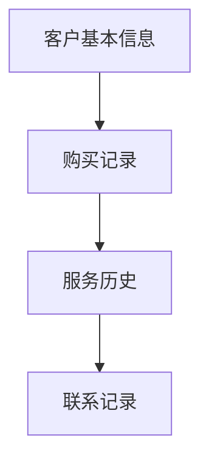
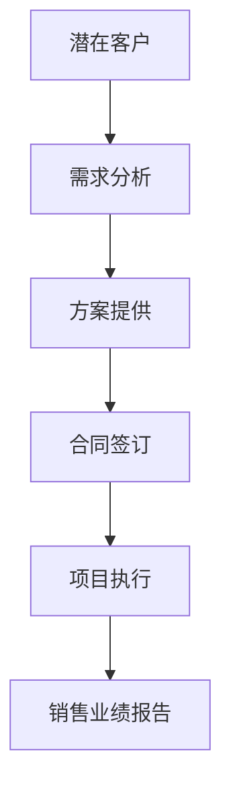
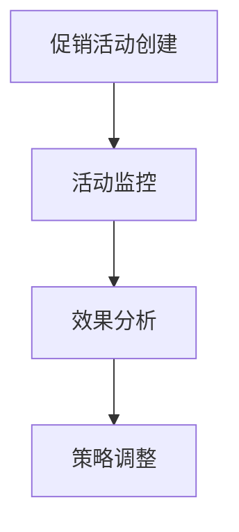
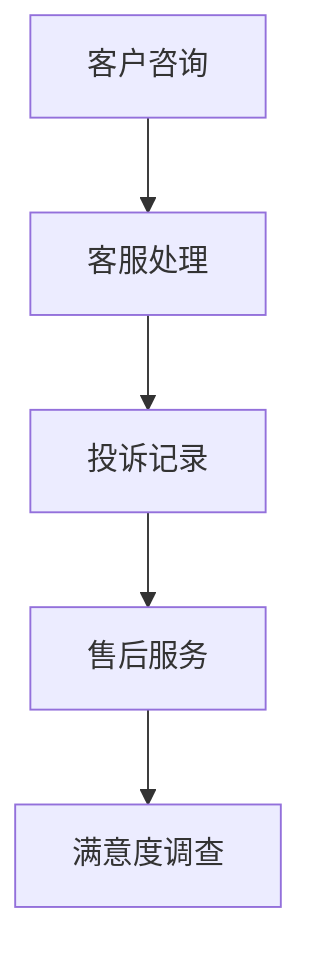
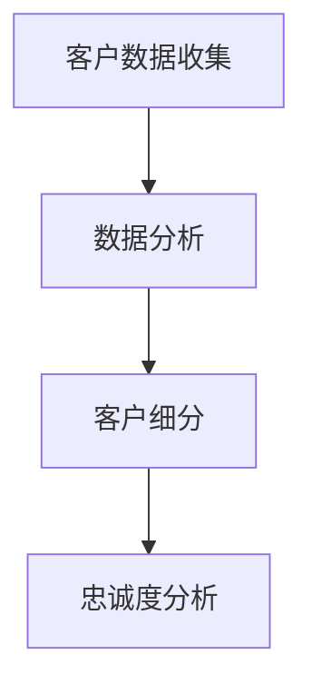
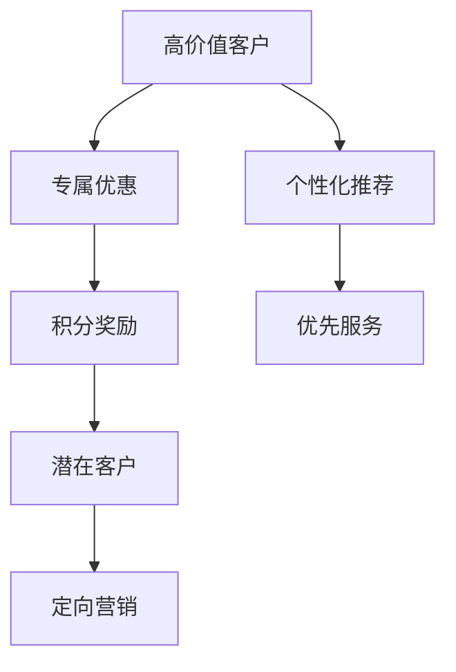
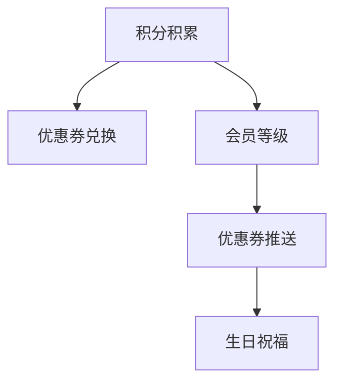
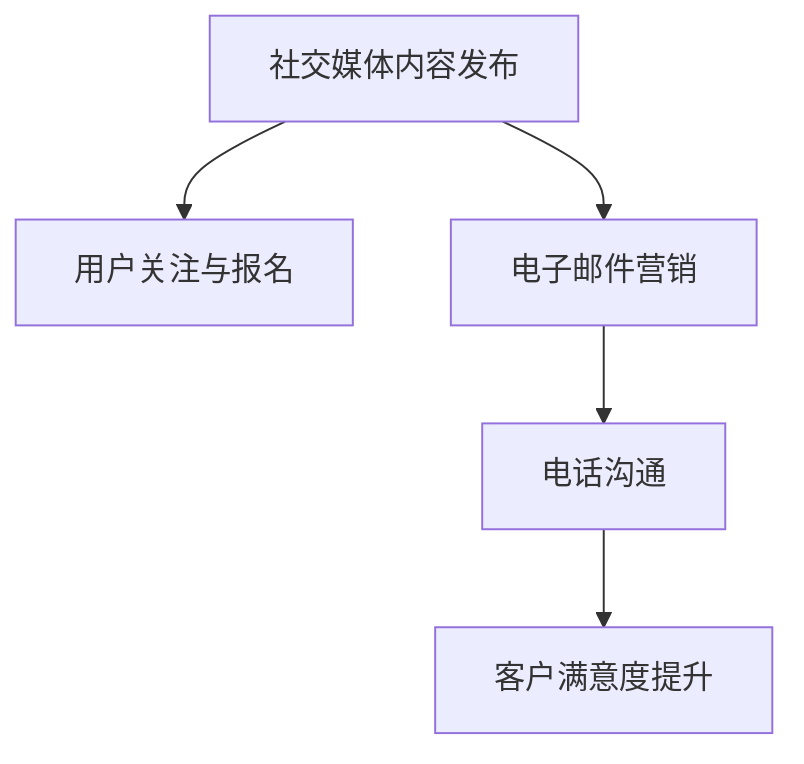

                 

### 第1章：引言

#### 1.1 书籍背景

一人公司，顾名思义，是由一个单独的个人运营的企业。这种企业模式近年来在全球范围内逐渐兴起，特别是在创业和自由职业者群体中有着广泛的应用。一人公司的运营特点主要在于其灵活性、快速决策和低成本，这使得创业者能够更加专注于市场机会的捕捉和利用。然而，随着企业规模的扩大，如何管理客户关系成为了一人公司面临的重大挑战。

客户关系管理系统（CRM）作为一种现代化的企业管理工具，通过整合企业内部与客户之间的各种互动信息，帮助企业更好地管理客户关系，提高客户满意度和忠诚度，进而提升企业的整体竞争力。特别是在一人公司这种资源有限的环境中，CRM系统的应用显得尤为重要。

本书旨在为一人公司的运营者提供一整套系统的客户关系管理指南，帮助他们在资源有限的情况下，通过高效的管理策略和工具，建立起一套可持续发展的客户关系管理体系。

#### 1.2 书籍目标

本书的主要目标如下：

1. **了解一人公司的运营特点**：通过分析一人公司的运营模式，帮助读者更好地理解其在市场中的定位和挑战。
2. **掌握CRM系统的基本概念**：介绍CRM系统的定义、原理和应用场景，使读者对CRM有一个全面的认识。
3. **学习如何选择和实施CRM系统**：提供详细的CRM系统选型和实施流程，帮助读者根据自身需求选择合适的CRM系统，并有效地进行系统实施。
4. **提供实用的客户关系管理策略和技巧**：结合实际案例，分享客户关系管理中的最佳实践和技巧，帮助读者在实践中提高客户管理效率。

#### 1.3 书籍结构

本书的结构分为以下几个部分：

1. **引言**：介绍一人公司的背景和CRM系统的重要性。
2. **一人公司的运营特点与挑战**：分析一人公司的运营特点及其面临的挑战，并探讨CRM系统在其中的作用。
3. **客户关系管理的核心概念**：深入探讨CRM的定义、客户生命周期和客户关系管理的原则。
4. **选择适合的CRM系统**：介绍市场上常见的CRM系统，评估标准及选择流程。
5. **CRM系统的实施步骤**：详细讲解CRM系统的需求分析、设计、实施和测试与优化。
6. **CRM系统功能模块详解**：分别介绍CRM系统的各个功能模块，如客户信息管理、销售管理、市场营销管理、客户服务管理和客户分析。
7. **客户关系管理策略与技巧**：分享客户细分、忠诚度、互动策略及管理技巧。
8. **CRM系统在实际运营中的应用**：通过实际案例，展示CRM系统的应用效果和解决方案。
9. **CRM系统的持续优化与升级**：探讨CRM系统的数据分析、升级与迭代策略。
10. **结语**：总结本书的核心内容，展望一人公司和CRM系统的未来发展趋势。

通过以上章节的逐步讲解，读者将能够系统地了解一人公司如何通过CRM系统实现高效客户关系管理，从而提升企业的核心竞争力。

### 《一人公司如何打造高效的客户关系管理系统》

关键词：一人公司、客户关系管理、CRM系统、高效运营、策略与技巧

摘要：本文深入探讨了一人公司在运营过程中面临的客户关系管理挑战，并详细介绍了如何通过实施高效的CRM系统来提升业务绩效。文章首先概述了一人公司的运营特点和挑战，然后讲解了CRM系统的基本概念和核心功能模块，接着分析了选择和实施CRM系统的关键步骤，并分享了实用的客户关系管理策略与技巧。通过实际案例的展示，本文展示了CRM系统在实际运营中的应用效果，最后提出了CRM系统的持续优化策略。本文旨在为一人公司提供一套完整的CRM系统建设指南，助力其在资源有限的情况下实现客户关系管理的卓越表现。

## 第2章：一人公司的运营特点与挑战

### 2.1 一人公司的运营特点

一人公司，作为一种独特的企业运营模式，具有以下几个显著特点：

**1. 所有者与管理者的统一性**：一人公司的所有者和管理者通常是同一个人。这种模式减少了决策层次，使得经营决策更加快速、灵活。

**2. 灵活性与快速响应能力**：由于组织结构简单，一人公司能够迅速调整经营策略，快速响应市场变化和客户需求。

**3. 资源有限性**：一人公司的资源，包括时间、资金、人力等，通常较为有限。这要求公司在资源管理上必须高效利用，避免资源的浪费。

**4. 低成本运营**：一人公司通过减少组织复杂性、降低管理成本，实现了低成本运营。这使得创业者能够以更低的成本进入市场，进行尝试和探索。

**5. 高度依赖个人能力**：一人公司的运营高度依赖于个人的能力，包括决策能力、管理能力和业务能力。这意味着公司的发展潜力很大程度上取决于个人的综合素质。

### 2.2 一人公司的运营挑战

尽管一人公司具有诸多优点，但其运营过程中也面临不少挑战：

**1. 时间管理**：由于资源有限，尤其是时间有限，一人公司需要在有限的时间内完成多项任务。这要求公司管理者具备卓越的时间管理能力。

**2. 资源分配**：如何合理分配有限的资源，确保在关键业务领域的投入，是一人公司面临的重大挑战。资源分配不当可能导致业务发展受阻。

**3. 客户关系管理**：随着业务的发展，客户关系管理变得日益重要。如何有效地维护客户关系，提高客户满意度和忠诚度，成为一人公司的重要任务。

**4. 业务扩展**：一人公司在初始阶段可能依赖于单一的产品或服务。随着市场需求的扩大，如何进行业务扩展，开发多元化的产品和服务，是一大挑战。

**5. 团队建设**：尽管一人公司的组织结构简单，但在业务发展过程中，可能需要引入团队成员。如何建设高效的团队，提升整体执行力，是公司管理者需要思考的问题。

### 2.3 客户关系管理系统的重要性

在应对上述挑战的过程中，客户关系管理系统（CRM）发挥着至关重要的作用：

**1. 提高客户满意度**：通过CRM系统，公司可以更好地了解客户需求，提供个性化服务，从而提高客户满意度。

**2. 增强客户忠诚度**：CRM系统有助于建立长期稳定的客户关系，通过持续的互动和关怀，增强客户的忠诚度。

**3. 提高业务效率**：CRM系统能够自动化和优化客户管理流程，减少重复劳动，提高工作效率。

**4. 数据驱动决策**：CRM系统收集和分析了大量的客户数据，为公司提供了有力的决策支持，帮助企业更好地制定经营策略。

**5. 促进业务扩展**：通过CRM系统，公司可以更准确地识别市场机会，制定有效的市场拓展策略。

总之，对于一人公司来说，CRM系统不仅是提升客户管理效率的工具，更是应对运营挑战、实现业务发展的关键支撑。在接下来的章节中，我们将进一步探讨CRM系统的基本概念、功能模块及其在运营中的应用，帮助一人公司实现高效的客户关系管理。

### 第3章：客户关系管理的核心概念

#### 3.1 客户关系管理（CRM）的定义

客户关系管理（CRM）是一种以客户为中心的商业策略，旨在通过优化客户互动和提升客户满意度，从而增强客户忠诚度和促进业务增长。CRM不仅是一种技术工具，更是一种管理理念，其核心在于理解、满足和保留客户。

CRM系统的定义可以扩展为：一种集成多个功能模块的信息系统，通过收集、存储、分析和利用客户数据，帮助企业实现客户全生命周期的管理。CRM系统通常包括销售管理、市场营销管理、客户服务和数据分析等功能模块，以支持企业的客户关系管理活动。

#### 3.2 客户生命周期

客户生命周期是指客户与企业之间关系的整个生命周期，包括客户从成为潜在客户到最终流失的整个过程。客户生命周期可以分为以下几个阶段：

**1. 潜在客户阶段**：在这一阶段，客户尚未与企业建立正式的买卖关系，但存在潜在购买意愿。企业通过市场推广和营销活动，吸引潜在客户。

**2. 新客户阶段**：潜在客户通过购买产品或服务，成为新客户。企业需要通过有效的客户关系管理策略，确保新客户能够体验到高质量的产品和服务，从而留住他们。

**3. 存量客户阶段**：新客户在成为存量客户后，与企业建立了稳定的业务关系。这一阶段，企业需要通过持续的服务和关怀，保持客户的忠诚度和满意度。

**4. 转化客户阶段**：存量客户在多次购买和良好的体验后，可能转化为企业的忠实客户。企业可以通过个性化的营销和服务，进一步提升客户的价值。

**5. 失业客户阶段**：失业客户是指那些因各种原因停止购买产品或服务的客户。企业需要分析失业客户的原因，并尝试通过改进服务和产品，重新吸引他们。

客户生命周期管理（CLM）是企业通过系统化地跟踪和分析客户在各个阶段的行为，制定相应的策略和措施，以最大化客户价值的过程。

#### 3.3 客户关系管理的原则

为了实现高效的客户关系管理，企业需要遵循以下几个原则：

**1. 客户至上**：客户是企业生存和发展的基石，一切管理活动应以满足客户需求为核心。

**2. 个性化服务**：每个客户都是独特的，企业需要根据客户的特点和需求，提供个性化的服务和解决方案。

**3. 数据驱动决策**：通过收集和分析客户数据，企业可以更准确地了解客户行为，从而制定更有效的决策。

**4. 持续优化**：客户关系管理是一个持续的过程，企业需要不断优化管理策略和流程，以适应市场变化和客户需求。

**5. 互动与沟通**：企业与客户之间的有效互动和沟通，有助于建立信任和忠诚，提高客户满意度。

**6. 整合资源**：企业需要整合各种资源，如人力、财务和技术，以支持客户关系管理活动。

通过遵循这些原则，企业可以建立起一套高效的客户关系管理体系，从而在激烈的市场竞争中脱颖而出。

### 第4章：选择适合的CRM系统

#### 4.1 市场上的CRM系统简介

当前市场上，CRM系统的种类繁多，包括开源CRM系统、商业CRM系统和自定义CRM系统等。每种系统都有其独特的特点和应用场景，选择合适的CRM系统对于一人公司的成功运营至关重要。

**1. 开源CRM系统**：开源CRM系统具有成本低、灵活性强、自由度高等优点。常见的开源CRM系统包括Vtiger、SuiteCRM、CiviCRM等。这些系统通常基于开源代码库开发，用户可以根据自己的需求进行定制和扩展。然而，开源CRM系统可能需要用户具备一定的技术能力和时间投入进行系统配置和优化。

**2. 商业CRM系统**：商业CRM系统是由专业厂商开发和维护的商业软件，通常具有完善的客户支持服务、技术保障和定期更新。常见的商业CRM系统包括Salesforce、Microsoft Dynamics 365、Oracle CRM等。这些系统通常功能丰富、用户体验好，能够满足大型企业和复杂业务需求。但商业CRM系统通常价格较高，且对定制化需求的支持有限。

**3. 自定义CRM系统**：自定义CRM系统是根据用户特定需求定制的系统，通常由专业IT服务商提供。这种系统具有高度定制化、灵活性强、扩展性好等优点，能够满足一人公司的独特业务需求。然而，自定义CRM系统的开发周期较长、成本较高，且后期维护需要一定的技术支持。

#### 4.2 评估CRM系统的标准

在选择CRM系统时，一人公司需要根据自身需求和市场情况，从多个维度对系统进行评估。以下是一些常见的评估标准：

**1. 功能性需求**：CRM系统的功能是否满足公司的业务需求，包括客户信息管理、销售管理、市场营销管理、客户服务管理、数据分析等。一人公司需要评估系统是否能够支持业务流程的自动化和优化。

**2. 易用性**：CRM系统的用户体验是否良好，操作是否简便。易用性直接影响员工的使用意愿和效率，因此对于一人公司尤为重要。

**3. 成本效益**：CRM系统的采购成本、维护成本和使用成本是否在公司的承受范围内。一人公司需要评估系统的总拥有成本（Total Cost of Ownership, TCO）。

**4. 扩展性和可定制性**：CRM系统是否能够根据公司业务的发展需求进行扩展和定制。一人公司需要确保系统在未来能够灵活适应业务变化。

**5. 集成能力**：CRM系统是否能够与其他业务系统和工具（如ERP系统、邮件系统、社交媒体平台等）进行集成，以实现数据共享和流程一体化。

**6. 安全性**：CRM系统的数据安全性和隐私保护能力是否满足公司的要求。对于一人公司，数据安全尤为重要，以防止敏感信息泄露。

**7. 客户支持**：CRM系统的供应商是否提供完善的客户支持服务，包括技术支持、培训、咨询等。一人公司需要确保在系统使用过程中能够获得及时的帮助。

#### 4.3 选择CRM系统的流程

选择适合的CRM系统需要经过以下几个步骤：

**1. 需求分析**：明确公司当前的客户关系管理需求和未来可能的需求，确定系统需要支持的功能和业务流程。

**2. 市场调研**：收集市场上不同CRM系统的信息，包括功能、性能、价格、用户评价等，筛选出潜在候选系统。

**3. 系统评估**：对候选系统进行功能评估、易用性评估、成本效益评估等，确定每个系统的优缺点。

**4. 试运行**：选择几个候选系统进行试运行，模拟实际业务场景，评估系统的性能和适用性。

**5. 决策与采购**：根据试运行结果和公司整体战略，确定最终选择的CRM系统，并完成采购流程。

**6. 培训与部署**：对员工进行系统培训，确保他们能够熟练使用CRM系统。同时，进行系统的部署和配置，确保系统正常运行。

通过以上步骤，一人公司可以系统化地选择合适的CRM系统，从而为高效客户关系管理奠定基础。在下一章中，我们将详细探讨CRM系统的实施步骤，帮助读者了解如何有效地部署和优化CRM系统。

### 第5章：CRM系统的实施步骤

#### 5.1 系统需求分析

系统需求分析是CRM系统实施的第一步，也是至关重要的一步。它涉及对公司的业务流程、组织架构、客户需求等多方面进行全面的调研和梳理，以确保所选的CRM系统能够满足公司的实际需求。

**1. 业务流程分析**：首先，需要详细了解公司的现有业务流程，包括销售流程、市场营销流程、客户服务流程等。通过业务流程图（如Mermaid流程图）对现有流程进行描述，识别流程中的瓶颈和痛点。

   ```mermaid
   graph TD
   A[客户咨询] --> B[销售跟进]
   B --> C{是否成交}
   C -->|是| D[客户订单处理]
   C -->|否| E[客户跟进]
   D --> F[发货与售后]
   ```

   通过这样的流程图，可以直观地了解业务流程中的各个环节，并找出需要优化的部分。

**2. 组织架构分析**：分析公司的组织架构，了解各部门的职责和权限。这有助于确定CRM系统需要哪些功能模块来支持不同部门的业务需求。

**3. 客户需求调研**：与客户进行深度沟通，了解他们的需求和痛点。这有助于确定CRM系统需要提供哪些功能来提升客户体验和满意度。

**4. 需求文档编写**：将上述调研结果整理成需求文档，明确CRM系统所需的功能模块、性能指标、用户界面需求等。需求文档是后续设计和开发的重要依据。

#### 5.2 系统设计

系统设计阶段是CRM系统实施的关键环节，涉及系统架构设计、数据模型设计、界面设计等多个方面。

**1. 确定系统架构**：根据需求文档，设计CRM系统的整体架构。这包括确定系统的硬件配置、软件架构、数据存储和传输机制等。

   ```mermaid
   graph TD
   A[用户界面] --> B[应用服务器]
   B --> C[数据库服务器]
   B --> D[数据仓库]
   ```

   系统架构设计需要考虑系统的可扩展性、性能和安全性。

**2. 设计数据模型**：设计CRM系统的数据模型，包括客户信息、销售记录、市场活动、客户服务记录等。数据模型需要能够支持高效的数据存储和查询。

   ```mermaid
   graph TD
   A[客户信息表] --> B[销售记录表]
   B --> C[市场活动表]
   C --> D[客户服务记录表]
   ```

**3. 界面设计**：设计用户界面，包括前端界面和后台管理界面。界面设计需要简洁直观，易于操作，以提高用户的使用体验。

#### 5.3 系统实施

系统实施阶段是将设计好的CRM系统部署到生产环境的过程，包括以下步骤：

**1. 系统开发与部署**：根据系统设计文档，进行系统开发，并将开发完成的功能模块部署到服务器上。这包括前端开发、后端开发、数据库配置等。

**2. 数据迁移**：将现有客户数据、销售数据、市场活动数据等迁移到CRM系统中。数据迁移需要确保数据完整性和一致性，避免数据丢失或错误。

**3. 用户培训**：对公司的员工进行CRM系统的培训，确保他们能够熟练使用系统。培训内容包括系统功能操作、数据录入、报表查询等。

**4. 上线测试**：在系统上线前进行全面的测试，包括功能测试、性能测试、安全测试等，确保系统稳定可靠。

#### 5.4 系统测试与优化

系统测试与优化是CRM系统实施的重要环节，旨在确保系统性能和用户体验。

**1. 功能测试**：测试CRM系统的各个功能模块是否按照设计要求正常运行，包括客户信息管理、销售管理、市场营销管理、客户服务管理等。

**2. 性能测试**：测试CRM系统的响应时间、并发处理能力、数据存储性能等，确保系统在高负载情况下依然能够稳定运行。

**3. 用户反馈**：收集用户的反馈，了解他们在使用CRM系统过程中遇到的问题和需求，进行系统的优化和改进。

**4. 持续优化**：根据用户反馈和系统运行情况，定期对CRM系统进行优化，提高系统的稳定性和用户体验。

通过以上步骤，一人公司可以有效地实施CRM系统，实现客户关系管理的优化和提升。在下一章中，我们将详细探讨CRM系统的功能模块，帮助读者了解如何具体应用CRM系统来提升业务效率。

### 第6章：CRM系统功能模块详解

#### 6.1 客户信息管理

客户信息管理是CRM系统的核心模块之一，旨在集中管理客户的基本信息和历史记录。通过该模块，企业可以方便地查看、更新和共享客户信息，提高客户数据的准确性和可用性。

**功能描述**：

- **客户资料管理**：包括客户的基本信息（如姓名、电话、邮箱、地址等）和扩展信息（如兴趣爱好、购买记录、服务历史等）。

- **客户联系记录**：记录与客户的沟通历史，包括电话、邮件、会议、短信等。这有助于企业了解客户的需求和偏好。

- **客户标签与分类**：通过标签和分类对客户进行分组管理，便于对不同类型的客户进行差异化服务和营销。

**使用示例**：

假设公司A是一家销售电子产品的企业，客户李先生购买了一台笔记本电脑。CRM系统中的客户信息管理模块可以记录李先生的基本信息和购买记录，并在后续服务中，通过历史记录快速找到李先生的联系方式和购买信息，提供个性化的售后服务。



#### 6.2 销售管理

销售管理模块用于跟踪和管理销售机会、销售流程和销售业绩。该模块可以帮助企业高效地管理销售活动，提高销售效率。

**功能描述**：

- **销售机会管理**：记录和管理销售机会的状态（如潜在、开发中、成交等），跟踪每个销售机会的进展和客户需求。

- **销售流程管理**：定义和跟踪销售流程，包括销售阶段、任务分配、进度监控等，确保销售活动有序进行。

- **销售预测**：基于历史数据和当前销售机会，预测未来的销售业绩，帮助制定销售目标和策略。

- **销售报告**：生成各种销售报表，包括销售业绩、销售趋势、客户贡献等，提供决策支持。

**使用示例**：

假设公司B是一家提供专业咨询服务的公司，客户张女士有咨询需求。销售管理模块可以记录张女士的咨询需求，跟踪销售机会的进展，并在咨询项目完成后，生成销售业绩报告，帮助公司评估销售绩效和优化销售策略。



#### 6.3 市场营销管理

市场营销管理模块用于规划、执行和监控市场营销活动，提高市场响应速度和营销效果。

**功能描述**：

- **营销活动管理**：创建和执行各种营销活动，包括广告投放、促销活动、邮件营销等。

- **营销效果分析**：分析营销活动的效果，包括参与人数、转化率、投资回报率等，优化营销策略。

- **营销自动化**：通过自动化工具，如自动邮件发送、短信提醒等，提高营销活动的效率和效果。

**使用示例**：

假设公司C是一家在线零售商，正在举行一次促销活动。市场营销管理模块可以协助公司创建促销活动，监控参与人数和转化率，并根据效果调整营销策略，以提高活动效果。



#### 6.4 客户服务管理

客户服务管理模块用于处理客户咨询、投诉和售后服务，提供高效、优质的客户服务。

**功能描述**：

- **客户咨询管理**：记录和管理客户的咨询信息，分配给相应的服务人员处理。

- **投诉管理**：记录和管理客户的投诉信息，跟踪投诉的处理进度和结果。

- **售后服务管理**：记录和管理售后服务活动，包括维修、保养、退换货等。

- **客户满意度调查**：定期进行客户满意度调查，了解客户对公司服务的反馈，持续优化服务。

**使用示例**：

假设公司D是一家手机制造商，客户王先生购买了手机后遇到使用问题。客户服务管理模块可以记录王先生的咨询和投诉信息，分配给客服人员处理，并在问题解决后进行满意度调查，以了解客户对公司服务的评价。



#### 6.5 客户分析

客户分析模块用于对客户数据进行深入分析，挖掘客户行为规律，帮助制定更精准的营销策略和服务策略。

**功能描述**：

- **客户数据分析**：分析客户的基本信息、购买记录、互动行为等，发现客户的行为模式。

- **客户细分**：根据客户的行为和需求，将客户划分为不同的细分市场，制定个性化的营销策略。

- **客户忠诚度分析**：分析客户的忠诚度水平，识别高价值客户，提供差异化的服务和激励措施。

**使用示例**：

假设公司E是一家健身俱乐部，通过客户分析模块，可以了解客户的健身频率、会员时长等数据，进而制定个性化的健身计划和会员福利，提高客户满意度和忠诚度。



通过以上功能模块的详细讲解，一人公司可以更好地了解CRM系统的应用，从而在实际运营中高效地管理客户关系，提升业务绩效。在下一章中，我们将探讨客户关系管理的策略与技巧，帮助读者在实际操作中更好地应用CRM系统。

### 第7章：客户关系管理策略与技巧

#### 7.1 客户细分策略

客户细分是客户关系管理中的重要策略之一，通过将客户划分为不同的群体，企业可以针对不同细分市场的需求，实施差异化的营销策略和服务方案，从而提高营销效率和客户满意度。

**1. 细分标准**：

- **行为细分**：根据客户的行为特征，如购买频率、购买金额、购买渠道等，将客户分为高价值客户、忠诚客户、潜在客户等。

- **需求细分**：根据客户的需求特征，如产品偏好、服务需求、消费习惯等，将客户分为不同类型。

- **心理细分**：根据客户的心理特征，如价值观念、生活方式、兴趣爱好等，将客户划分为不同的群体。

- **地理细分**：根据客户的地理位置，如城市、地区、国家等，将客户划分为不同的市场区域。

**2. 实施步骤**：

- **数据收集**：通过市场调研、客户互动等手段，收集客户的基本信息和行为数据。

- **数据分析**：利用数据分析工具，对客户数据进行分析和分类，识别不同细分市场。

- **策略制定**：根据不同细分市场的特征，制定差异化的营销策略和服务方案。

- **执行与评估**：实施差异化策略，持续监控和评估策略效果，及时调整和优化。

**3. 应用案例**：

假设一家电子商务公司，通过行为细分将客户分为高价值客户、忠诚客户和潜在客户。高价值客户享受专属优惠和个性化推荐，忠诚客户获得积分奖励和优先服务，潜在客户则通过定向营销和活动吸引，逐步提升购买意愿。



#### 7.2 客户忠诚度策略

客户忠诚度策略旨在通过持续的互动和关怀，增强客户的满意度和忠诚度，从而实现客户的长期保留和业务增长。

**1. 奖励机制**：

- **积分奖励**：通过积分机制，鼓励客户频繁购买和推荐，增加客户粘性。

- **会员制度**：设立会员等级制度，根据消费金额或积分，给予不同等级的会员不同的优惠和服务。

- **优惠券和折扣**：定期发放优惠券和折扣，刺激客户购买。

**2. 互动策略**：

- **个性化沟通**：根据客户的行为和偏好，进行个性化的沟通和服务，提高客户满意度。

- **客户关怀**：通过定期的邮件、短信、电话等方式，与客户保持联系，提供关怀和提醒服务。

- **社区建设**：建立客户社区，鼓励客户参与互动和分享，增强客户的归属感和忠诚度。

**3. 应用案例**：

假设一家餐饮连锁店，通过积分奖励机制，鼓励客户通过APP点餐，每次消费积累积分，积分可以兑换优惠券或礼品。同时，定期通过短信和APP推送促销活动和生日祝福，提升客户的忠诚度和参与度。



#### 7.3 客户互动策略

有效的客户互动策略能够增强客户对企业品牌的认知和好感，提高客户的满意度和忠诚度。

**1. 社交媒体互动**：

- **内容营销**：通过发布有价值的内容，如行业资讯、产品介绍、用户案例等，吸引用户关注。

- **互动活动**：组织线上互动活动，如抽奖、竞赛、问卷调查等，提高用户参与度。

- **实时沟通**：利用社交媒体的即时通讯功能，与客户进行实时沟通，解答疑问和提供帮助。

**2. 电子邮件营销**：

- **个性化邮件**：根据客户的行为和偏好，发送个性化的邮件，提高邮件打开率和转化率。

- **定期更新**：定期发送新闻简报、促销信息、活动邀请等，保持与客户的沟通。

- **跟踪与反馈**：跟踪邮件效果，收集客户反馈，不断优化邮件内容。

**3. 电话沟通**：

- **主动关怀**：定期进行电话关怀，了解客户需求和反馈，提供个性化服务。

- **问题解决**：针对客户的投诉和问题，提供快速响应和解决方案，提升客户满意度。

- **销售跟进**：通过电话沟通，跟进潜在客户和现有客户，促进销售转化。

**4. 应用案例**：

假设一家在线教育机构，通过社交媒体发布课程内容介绍和用户评价，吸引用户关注和报名。同时，定期发送电子邮件更新课程信息、优惠活动和用户反馈，提高客户参与度和忠诚度。通过电话沟通，及时解答客户疑问，提供个性化的学习建议。



通过实施上述客户关系管理策略与技巧，一人公司可以更好地理解和满足客户需求，提升客户满意度和忠诚度，从而在激烈的市场竞争中立于不败之地。

### 第8章：CRM系统在实际运营中的应用

#### 8.1 客户关系管理的实际应用案例

为了更好地展示CRM系统在实际运营中的应用效果，以下将通过两个实际案例，详细分析CRM系统在提升业务效率和客户满意度方面的应用情况。

**案例1：小型电商企业的客户关系管理实践**

**背景**：某小型电商企业主要从事服装销售，客户群体主要集中在年轻女性。企业初期通过社交媒体和电商平台积累了一定的客户基础，但随着业务的发展，客户管理变得日益复杂，如何高效管理客户关系成为企业发展的关键问题。

**应用**：企业选择了商业CRM系统，通过以下方式提升客户管理效率：

1. **客户信息管理**：使用CRM系统集中管理客户信息，包括客户的基本信息、购买历史、互动记录等。企业可以快速查询和更新客户信息，确保数据的准确性和完整性。

2. **销售管理**：通过CRM系统的销售管理模块，企业可以跟踪销售机会的进展，制定销售目标和策略。销售团队可以根据客户的购买历史和行为，提供个性化的推荐和服务，提升客户的购买体验。

3. **市场营销管理**：利用CRM系统的市场营销管理模块，企业可以策划和执行各种营销活动，如促销、优惠券发放等。通过分析营销活动的效果，企业可以不断优化营销策略，提高营销ROI。

4. **客户服务管理**：CRM系统的客户服务管理模块帮助企业在客户咨询和投诉处理方面实现了自动化和高效化。客户的问题可以迅速分配给相应的客服人员，并记录处理过程，确保客户问题得到及时解决。

**效果**：通过CRM系统的应用，企业实现了以下效果：

- 客户满意度显著提升：客户信息得到有效管理，个性化服务更加到位，客户体验得到显著改善。
- 销售业绩稳步增长：通过销售管理模块，企业能够更好地跟踪销售机会，制定有效的销售策略，销售业绩稳步增长。
- 营销效果明显提高：通过精准的营销活动策划和效果分析，企业的营销ROI得到显著提升。
- 客户管理效率提高：客户关系管理的自动化和高效化，减少了客服人员的重复劳动，提高了工作效率。

**案例2：专业咨询公司的客户关系管理优化**

**背景**：某专业咨询公司提供各类咨询服务，客户群体包括中小企业、政府机构和大型企业。由于客户需求多样化，且项目周期长，如何高效管理客户关系和项目进度成为公司发展的瓶颈。

**应用**：公司采用了自定义CRM系统，通过以下方式优化客户关系管理：

1. **客户信息管理**：通过CRM系统，公司能够集中管理客户的基本信息和项目记录，确保数据的一致性和准确性。

2. **项目进度管理**：CRM系统中的项目进度管理模块帮助公司跟踪每个项目的进展，确保项目按时完成，提高客户满意度。

3. **客户互动记录**：CRM系统记录了与客户的每一次互动，包括会议、电话、邮件等，方便公司回顾和总结，持续改进服务。

4. **数据分析与报告**：通过CRM系统的数据分析功能，公司可以生成各种报告，如客户满意度报告、项目进度报告等，为决策提供数据支持。

**效果**：通过CRM系统的应用，公司实现了以下效果：

- 客户满意度提升：通过详细的客户互动记录和项目进度管理，公司能够及时响应客户需求，提供高质量的服务，客户满意度显著提升。
- 项目管理效率提高：通过项目进度管理和数据分析，公司能够更好地监控项目进展，及时发现和解决问题，确保项目按时完成。
- 数据驱动决策：通过数据分析，公司可以更准确地了解客户需求和业务趋势，制定更有效的业务策略。
- 内部协作增强：CRM系统促进了各部门之间的信息共享和协作，提高了整体工作效率。

**总结**：

通过以上两个实际案例可以看出，CRM系统在提升业务效率和客户满意度方面具有显著的作用。无论是小型电商企业还是专业咨询公司，通过合理应用CRM系统，都可以实现客户信息的集中管理、销售和营销活动的有效执行、项目进度的实时监控和客户服务的持续优化，从而在激烈的市场竞争中脱颖而出。

#### 8.2 实际应用中的挑战与解决方案

尽管CRM系统在提升业务效率和客户满意度方面具有显著作用，但在实际应用中，一人公司可能会面临一系列挑战。以下分析这些挑战，并探讨相应的解决方案。

**1. 挑战：数据不准确和不一致**

**问题**：客户数据的不准确和不一致是CRM系统应用中的常见问题。数据错误、重复记录和更新不及时等问题会影响系统的效果。

**解决方案**：为了确保数据的准确性和一致性，可以采取以下措施：

- **数据清洗**：定期进行数据清洗，删除重复记录和错误的记录，确保数据的准确性。
- **数据标准化**：制定统一的数据标准，规范数据录入格式和字段，减少数据错误。
- **自动化更新**：利用自动化工具，如数据同步和导入导出功能，确保数据的实时更新。

**2. 挑战：用户使用率低**

**问题**：员工不愿意使用CRM系统，或者使用频率低，导致系统价值无法充分发挥。

**解决方案**：提高用户使用率可以从以下几个方面入手：

- **用户培训**：定期对员工进行系统培训，确保他们能够熟练使用CRM系统，了解系统的优势和操作方法。
- **激励机制**：设立激励机制，如奖励积分、奖金等，鼓励员工使用CRM系统。
- **用户体验优化**：优化系统的用户体验，使其操作简便、界面友好，提高员工的使用意愿。

**3. 挑战：系统与现有业务流程不匹配**

**问题**：CRM系统与现有业务流程不匹配，导致系统的功能和操作难以融入日常业务，从而影响系统的实际效果。

**解决方案**：为了解决系统与业务流程不匹配的问题，可以采取以下措施：

- **需求分析**：在系统实施前，进行详细的需求分析，确保系统功能能够满足业务需求。
- **业务流程优化**：根据CRM系统的特点，优化现有业务流程，使其与系统功能相匹配。
- **定制开发**：对于系统功能不足的部分，可以通过定制开发的方式，实现业务流程的个性化需求。

**4. 挑战：系统维护与升级**

**问题**：CRM系统的维护和升级需要耗费大量的人力和时间，且一旦出现问题，可能影响业务的正常运行。

**解决方案**：为了确保系统维护与升级的顺利进行，可以采取以下措施：

- **定期备份**：定期备份系统数据，确保在发生故障时能够快速恢复。
- **技术支持**：与CRM系统供应商建立长期合作关系，获得专业的技术支持和维护服务。
- **应急预案**：制定应急预案，确保在系统故障时，能够快速响应和恢复业务。

**5. 挑战：数据隐私与安全**

**问题**：客户数据的隐私和安全问题是一人公司在使用CRM系统时需要高度重视的问题。

**解决方案**：为了保护客户数据的安全和隐私，可以采取以下措施：

- **数据加密**：对客户数据进行加密处理，确保数据在传输和存储过程中的安全性。
- **访问控制**：设置严格的访问控制机制，确保只有授权人员才能访问客户数据。
- **安全审计**：定期进行安全审计，检查系统漏洞和安全隐患，及时进行修复。

通过以上解决方案，一人公司可以在实际运营中更好地应对CRM系统应用中的挑战，确保系统的高效运行和客户数据的安全。

#### 8.3 案例分析与讨论

在分析实际应用案例的基础上，我们可以从多个角度进行案例讨论，深入探讨CRM系统在提升客户关系管理效率方面的作用。

**1. 成功经验**

**成功因素**：

- **全面的客户信息管理**：通过CRM系统，企业实现了客户信息的集中管理，确保了数据的准确性和一致性。这使得企业能够更全面地了解客户需求，提供个性化的服务。

- **高效的营销活动管理**：CRM系统的市场营销管理模块帮助企业在策划和执行营销活动时，更加精准和高效。通过数据分析，企业能够优化营销策略，提高营销ROI。

- **优化的客户服务流程**：CRM系统的客户服务管理模块实现了客户咨询和投诉处理的自动化和高效化。客服人员能够快速响应客户问题，提供及时有效的解决方案，提升了客户满意度。

**2. 面临的挑战**

**挑战分析**：

- **数据准确性和一致性**：虽然CRM系统提供了强大的数据管理功能，但在实际应用中，数据准确性仍是一个挑战。数据清洗和标准化工作需要持续进行，以确保数据的可靠性。

- **用户接受度**：部分员工可能对CRM系统持抵触情绪，影响系统的使用率。通过激励机制和用户体验优化，虽然可以提升使用率，但需要长期的努力。

- **系统与业务流程的融合**：CRM系统的功能虽然强大，但如果与现有业务流程不匹配，可能会影响系统的实际效果。企业需要在系统实施前进行充分的需求分析，确保系统能够满足业务需求。

- **数据隐私和安全**：客户数据的安全和隐私保护是企业需要高度重视的问题。尽管采取了一系列措施，但系统漏洞和安全威胁依然存在，需要持续关注和加强防护。

**3. 案例启示**

通过以上案例分析和讨论，我们可以得出以下启示：

- **全面规划与实施**：在实施CRM系统前，企业需要进行全面的规划，包括需求分析、系统选择、流程优化等。只有确保每个环节都充分考虑和有效实施，才能充分发挥CRM系统的价值。

- **持续优化与改进**：CRM系统不是一蹴而就的，需要企业持续进行优化和改进。通过定期数据分析、用户反馈和业务流程调整，不断提升系统效率和用户体验。

- **全员参与与培训**：CRM系统的成功离不开全体员工的参与和支持。通过培训、激励机制和用户体验优化，提升员工的系统使用意愿和能力。

- **安全与隐私保护**：数据安全和隐私保护是CRM系统的核心问题，企业需要采取严格的安全措施，确保客户数据的安全和隐私。

通过以上启示，一人公司可以更好地应用CRM系统，实现客户关系管理的卓越表现，从而在激烈的市场竞争中取得优势。

### 第9章：CRM系统的持续优化与升级

#### 9.1 数据分析与反馈

CRM系统的成功离不开数据的收集和分析。通过数据分析，企业可以深入了解客户行为、市场需求和业务绩效，从而为优化和升级CRM系统提供有力支持。

**1. 数据收集**：

- **客户数据**：收集客户的基本信息、购买记录、互动行为等数据。
- **销售数据**：记录销售业绩、销售渠道、销售成本等数据。
- **营销数据**：跟踪营销活动的效果，包括参与人数、转化率、投资回报率等。
- **服务数据**：记录客户咨询、投诉、售后服务等数据。

**2. 数据分析**：

- **客户分析**：通过分析客户数据，了解客户的需求和行为模式，为个性化服务和营销策略提供依据。
- **销售分析**：分析销售数据，评估销售策略的有效性，优化销售目标和计划。
- **营销分析**：通过营销数据，评估营销活动的效果，调整营销策略，提高ROI。
- **服务分析**：分析客户服务数据，识别服务过程中的问题和改进点，提升客户满意度。

**3. 数据反馈**：

- **持续监控**：定期对CRM系统的数据进行分析和监控，及时发现和解决问题。
- **反馈机制**：建立数据反馈机制，将分析结果反馈给相关业务部门和决策层，为决策提供数据支持。
- **优化调整**：根据数据反馈，对CRM系统进行优化和调整，不断提升系统性能和用户体验。

#### 9.2 系统升级与迭代

随着市场环境和业务需求的变化，CRM系统也需要不断升级和迭代，以适应新的发展需求。

**1. 系统升级**：

- **技术升级**：定期对CRM系统进行技术升级，确保系统的稳定性和安全性，支持新功能和新技术的应用。
- **功能升级**：根据业务需求和市场趋势，不断升级CRM系统的功能模块，增加新的业务功能和用户体验。

**2. 系统迭代**：

- **需求分析**：定期进行需求分析，了解业务部门对CRM系统的需求和期望，为系统迭代提供方向。
- **功能迭代**：通过分阶段迭代开发，逐步实现新的功能模块，提升系统性能和用户体验。
- **用户体验优化**：根据用户反馈和数据分析，不断优化系统的用户体验，提高用户满意度。

#### 9.3 持续优化策略

为了确保CRM系统的持续优化和高效运行，企业需要制定一套全面的优化策略。

**1. 定期评估**：

- **系统评估**：定期对CRM系统的性能和效果进行评估，识别存在的问题和改进点。
- **业务评估**：结合业务数据和分析结果，评估CRM系统对业务绩效的贡献，制定优化方向。

**2. 持续改进**：

- **流程优化**：根据评估结果，对业务流程和系统功能进行优化，提升系统效率和用户体验。
- **功能完善**：根据业务需求和市场趋势，不断完善CRM系统的功能模块，支持新的业务场景。

**3. 用户反馈**：

- **用户调研**：定期进行用户调研，了解用户的需求和反馈，收集优化建议。
- **反馈机制**：建立有效的反馈机制，将用户反馈及时传递给相关部门，推动系统优化。

**4. 数据驱动**：

- **数据监控**：通过数据分析，监控系统运行状况和业务绩效，及时发现和解决问题。
- **数据利用**：充分利用数据分析结果，为业务决策和系统优化提供数据支持。

通过以上策略，企业可以确保CRM系统的持续优化和升级，不断提升系统性能和用户体验，从而在激烈的市场竞争中保持竞争优势。

### 第10章：结语

#### 10.1 书籍总结

本书全面探讨了如何在一人公司中构建高效的客户关系管理系统。通过分析一人公司的运营特点与挑战，我们认识到CRM系统对于提升客户满意度和忠诚度、优化业务流程的重要性。本书详细介绍了CRM系统的核心概念、选型标准、实施步骤、功能模块以及客户关系管理策略与技巧，并结合实际案例展示了CRM系统在实际运营中的应用效果。通过系统化的学习和实践，一人公司可以更好地管理客户关系，提升业务绩效。

#### 10.2 对一人公司未来的展望

随着市场竞争的日益激烈，一人公司需要不断适应市场变化，提升自身竞争力。未来的CRM系统将更加智能化和个性化，通过大数据和人工智能技术，实现更加精准的客户分析和预测，提供更加个性化的服务。一人公司可以借助这些先进技术，进一步优化客户关系管理，提升客户体验和忠诚度。同时，一人公司需要不断创新，探索新的业务模式和增长点，以适应不断变化的市场环境。

#### 10.3 未来的CRM发展趋势

未来CRM系统的发展将呈现以下几个趋势：

**1. 智能化**：人工智能技术将在CRM系统中得到广泛应用，通过智能算法和机器学习模型，实现客户行为的预测和分析，提供个性化的服务。

**2. 移动化**：随着移动设备的普及，CRM系统将更加注重移动端的用户体验，提供更加便捷的移动访问和管理功能。

**3. 社交化**：社交网络和社交媒体将成为CRM系统的重要组成部分，通过整合社交媒体数据，实现更加丰富的客户互动和营销活动。

**4. 数据驱动**：数据将成为CRM系统的核心资产，通过数据分析和挖掘，企业可以更准确地了解客户需求，优化业务策略和流程。

**5. 云化**：随着云计算技术的发展，CRM系统将更多地采用云服务模式，提供更灵活、更可扩展的解决方案。

通过紧跟这些发展趋势，一人公司可以不断提升客户关系管理能力，实现业务的持续增长。

### 附录

#### A.1 常用CRM系统功能模块及其应用

**1. 客户信息管理**：集中管理客户的基本信息和历史记录，支持数据导入、导出和查询。

**2. 销售管理**：包括销售机会管理、销售预测、销售报表等，支持销售过程的全程跟踪和统计分析。

**3. 市场营销管理**：支持营销活动的策划、执行和效果分析，提供营销效果评估和优化建议。

**4. 客户服务管理**：管理客户咨询和投诉，提供客户服务流程的自动化和高效化。

**5. 客户分析**：通过对客户数据的分析，提供客户细分、忠诚度分析等，帮助企业制定精准的营销策略。

#### A.2 常见CRM系统选型问题与解决方案

**问题1**：如何选择合适的CRM系统？

**解决方案**：根据业务需求、预算和技术能力，评估不同CRM系统的功能、性能和成本，选择最适合自己的系统。

**问题2**：CRM系统实施过程中可能出现哪些问题？

**解决方案**：充分进行需求分析和系统评估，确保系统功能满足业务需求。同时，制定详细的实施计划和应急预案，确保项目顺利进行。

**问题3**：如何确保CRM系统的数据安全和隐私保护？

**解决方案**：采取严格的数据加密和访问控制措施，定期进行安全审计，确保客户数据的安全和隐私。

#### A.3 CRM系统实施与运营常见问题解答

**问题1**：CRM系统如何与现有业务系统集成？

**解答**：通过API接口、数据同步工具等，实现CRM系统与ERP、邮件系统等现有业务系统的集成，实现数据共享和流程一体化。

**问题2**：如何确保员工熟练使用CRM系统？

**解答**：通过定期培训、实践演练和用户反馈，提高员工对CRM系统的熟悉度和使用技能。

**问题3**：CRM系统的维护与升级如何进行？

**解答**：定期进行系统备份和更新，确保系统的稳定性和安全性。与CRM系统供应商保持合作关系，获得专业的技术支持和维护服务。

#### A.4 参考文献与扩展阅读推荐

- **参考文献**：

  - ["Customer Relationship Management", by Paul B. D'Arcy and Paul J. J.ewell]
  - ["Salesforce CRM: The Complete Guide", by Salesforce]
  - ["Oracle CRM On Demand: The Complete Guide", by Oracle]

- **扩展阅读**：

  - **《大数据营销：用数据驱动增长》**：了解如何利用大数据进行精准营销。
  - **《人工智能时代的企业管理》**：探讨人工智能在企业管理中的应用。
  - **《数字化转型：实践与战略》**：了解数字化转型的趋势和实践方法。

通过这些文献和扩展阅读，读者可以进一步深入了解CRM系统及相关领域的知识，提升自己的业务管理能力。

### 参考文献

- D'Arcy, P. B., & Jewell, P. J. (2015). *Customer Relationship Management*. John Wiley & Sons.
- Salesforce. (2020). *Salesforce CRM: The Complete Guide*. Retrieved from https://www.salesforce.com/content/dam/web/en_us/www/documents/learning-courses/Salesforce-CRM-The-Complete-Guide.pdf
- Oracle. (2019). *Oracle CRM On Demand: The Complete Guide*. Retrieved from https://www.oracle.com/crm-on-demand/documentation/

通过以上参考文献，读者可以进一步深入了解客户关系管理（CRM）的理论和实践，为构建高效的CRM系统提供有力支持。同时，扩展阅读推荐的相关书籍和资源也将帮助读者在CRM领域持续学习和成长。

