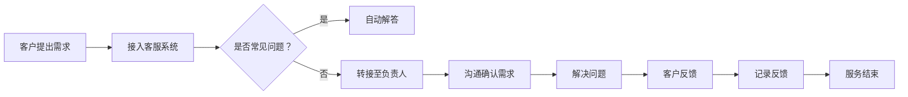

                 

### 《一人公司如何打造高效的客户服务标准化流程》

关键词：客户服务、标准化流程、一人公司、高效、算法、数学模型

摘要：本文旨在探讨一人公司如何在资源有限的情况下，通过构建和实施高效、标准化的客户服务流程，提升客户满意度和忠诚度。文章首先介绍了一人公司在客户服务中面临的特殊挑战，然后详细阐述了客户服务标准化的核心概念和联系，通过Mermaid流程图展示了一人公司的客户服务流程。接下来，文章深入分析了客户服务标准化流程的设计原则，包括设定服务目标和KPI、设计前端和后端服务流程，以及优化策略。随后，文章讲解了核心算法原理，包括客户分类算法和客户需求预测算法，并通过伪代码进行了详细阐述。在数学模型和公式部分，文章介绍了客户满意度计算模型和客户流失预测模型，并进行了举例说明。文章的实践部分通过案例展示了如何在实际项目中应用这些知识和工具。最后，文章总结了实践经验，展望了未来发展趋势与挑战，并提出了对读者的建议。

## 第1章：引言

### 1.1 为什么要关注客户服务标准化流程

在当今高度竞争的商业环境中，客户服务成为了企业竞争力的关键因素之一。良好的客户服务不仅能提升客户满意度和忠诚度，还能带来更多的口碑传播和业务增长。对于一人公司而言，由于其资源有限，更需要通过高效的客户服务流程来最大化资源利用，提升服务质量和效率。

首先，客户服务标准化流程有助于确保服务的统一性和一致性。一人公司通常由单一创始人或管理者负责，缺乏专门客服团队的支持，这可能导致服务质量的波动和客户体验的不一致。通过建立标准化的客户服务流程，可以确保每个客户都能获得一致、高质量的服务，从而增强客户对公司的信任和忠诚度。

其次，标准化流程能够提高效率。对于一人公司来说，时间和资源的管理至关重要。通过将客户服务流程标准化，可以减少重复性工作，提高处理速度，从而节省时间和成本。例如，利用自动化工具和脚本可以自动处理常见问题，减轻人工负担，使创始人或管理者能够专注于更有价值的工作。

此外，客户服务标准化流程有助于数据积累和分析。通过记录客户服务过程中的关键数据，一人公司可以了解客户需求、服务痛点，并进行数据驱动的优化。这不仅有助于提升客户满意度，还能为公司提供宝贵的业务洞察，从而在市场上保持竞争优势。

最后，标准化流程有利于品牌形象的塑造。在一人公司中，每个客户接触点都可能成为品牌形象的传递者。通过提供一致、高质量的服务，一人公司能够在客户心中树立专业、可靠的印象，增强品牌认知度和美誉度。

综上所述，关注并打造高效的客户服务标准化流程对于一人公司至关重要。它不仅能够提升服务质量和客户满意度，还能提高效率、积累数据、塑造品牌形象，从而在竞争激烈的市场中脱颖而出。

### 1.2 一人公司的特殊挑战与客户服务

一人公司，顾名思义，是由单一创始人或管理者运营的公司。这种模式具有其独特的优势，如决策迅速、灵活性高、成本控制等，但也面临着一系列特殊的挑战，特别是在客户服务方面。

首先，资源有限是最大的挑战之一。一人公司通常没有足够的资源和预算来雇佣专门的客服团队，这意味着所有的客户服务任务都落在了创始人或管理者的肩上。这样的角色压力巨大，因为除了客服，他们还需要处理市场推广、销售、财务、运营等多个方面的工作。因此，如何高效地利用有限的时间和管理客户服务任务成为关键。

其次，时间管理成为一大难题。一人公司创始人或管理者需要在有限的日程中安排客户服务，这可能导致服务响应速度慢，影响客户体验。快速响应和及时解决客户问题是提升客户满意度的关键，但一人公司的单打独斗往往难以实现这一点。

此外，缺乏专业培训和支持也是一人公司客户服务的挑战之一。专业的客服团队通常接受过专门的培训，了解客户服务技巧和最佳实践。而一人公司由于资源和预算的限制，可能无法提供这样的培训和支持，导致客户服务质量参差不齐。

为了应对这些挑战，一人公司需要采取一系列策略。首先，必须认识到客户服务的重要性，将其视为公司成功的基石。其次，要善于利用现有资源和工具，如自动化工具和脚本，以减少重复性工作，提高效率。此外，还可以利用外包服务或合作伙伴，在必要时提供专业支持。

总之，一人公司在客户服务中面临的挑战是多方面的，但通过合理的策略和资源管理，完全有可能克服这些困难，实现高效的客户服务，从而在竞争激烈的市场中站稳脚跟。

### 1.3 高效客户服务标准化流程的重要性

对于一人公司来说，高效、标准化的客户服务流程具有无可替代的重要性。首先，它有助于提高客户满意度。标准化流程确保了每个客户都能获得一致、高质量的服务，减少了服务过程中的不确定性和波动，从而提升了客户的整体体验。满意的客户更可能成为忠诚客户，为公司带来长期的业务。

其次，标准化流程能够显著提高工作效率。通过将常见问题和解决方案进行标准化处理，一人公司可以减少重复性工作，缩短服务响应时间。这样不仅节省了时间，也减轻了创始人或管理者的工作负担，使他们能够将更多精力投入到公司的核心业务中。

此外，数据积累和分析是标准化流程的另一个重要优势。通过记录客户服务过程中的关键数据，一人公司可以了解客户需求、服务痛点，并进行数据驱动的优化。这不仅有助于提升客户满意度，还能为公司提供宝贵的业务洞察，从而在市场上保持竞争优势。

最后，标准化流程有助于塑造良好的品牌形象。在一个客户至上的时代，品牌形象是企业核心竞争力的重要组成部分。通过提供一致、高质量的服务，一人公司能够在客户心中树立专业、可靠的印象，增强品牌认知度和美誉度。

综上所述，高效、标准化的客户服务流程对一人公司至关重要。它不仅能够提升客户满意度和工作效率，还能积累数据、塑造品牌形象，从而在竞争激烈的市场中立于不败之地。

## 第2章：核心概念与联系

### 2.1 客户服务标准化的定义

客户服务标准化是指将客户服务的各个环节、流程和操作规范化、统一化，以实现一致、高效的服务质量。通过制定标准化的服务流程、指南和操作手册，企业可以确保每一位客户无论何时何地，都能享受到相同水平的服务。客户服务标准化不仅包括客户咨询、投诉处理和问题解决等环节，还涵盖了客户沟通技巧、服务态度和礼仪等多个方面。

在客户服务标准化的过程中，通常需要建立一系列关键指标，如响应时间、解决问题的时间、客户满意度等，以便对企业服务进行评估和持续改进。这些指标不仅有助于衡量服务质量的优劣，还能为企业提供改进方向和决策依据。

客户服务标准化的重要性在于，它能够确保企业服务的一致性和可靠性，减少因个体差异导致的服务质量波动，从而提升客户满意度和忠诚度。此外，标准化流程还能够提高工作效率，减少内部资源的浪费，帮助企业更好地应对市场变化和客户需求。

### 2.2 客户服务的几个关键要素

在构建高效的客户服务标准化流程时，需要关注以下几个关键要素：

1. **客户沟通**：有效的客户沟通是客户服务的核心。通过倾听客户需求、解答疑问和提供帮助，企业能够建立良好的客户关系，提升客户满意度。沟通技巧包括倾听、清晰表达、尊重客户意见等。

2. **问题解决**：快速、准确地解决客户问题是提升客户满意度的关键。企业需要建立标准化的解决方案库，以便快速响应和解决常见问题。此外，员工需要具备解决问题的能力和技巧，能够灵活应对各种情况。

3. **客户满意度**：客户满意度是衡量客户服务质量的重要指标。通过定期收集客户反馈和满意度调查，企业可以了解客户需求和期望，并进行改进。客户满意度调查可以使用在线问卷、电话访谈等形式进行。

4. **响应时间**：响应时间是客户服务的重要环节。快速响应能够减少客户等待时间，提升服务效率。企业需要制定合理的响应时间标准，并通过自动化工具和脚本进行优化。

5. **服务态度**：良好的服务态度是客户服务的重要组成部分。员工需要保持积极、友善和专业的态度，以提升客户体验。服务态度培训可以帮助员工更好地应对各种客户需求。

6. **技术支持**：随着技术的发展，客户服务也需要借助各种技术工具，如客服软件、CRM系统、人工智能等。这些工具能够提高服务效率，减少人力成本，并提升客户满意度。

### 2.3 Mermaid 流程图：一人公司的客户服务流程

为了更好地理解和实施一人公司的客户服务标准化流程，我们可以使用Mermaid流程图来可视化整个服务流程。以下是客户服务流程的基本结构：



这个Mermaid流程图展示了从客户提出需求到服务结束的完整流程。以下是每个步骤的详细解释：

1. **客户提出需求**：客户通过电话、邮件或在线聊天等渠道向公司提出服务需求。
2. **接入客服系统**：客户需求被接入公司的客服系统，系统记录并分配至合适的负责人。
3. **是否常见问题？**：系统判断客户提出的问题是否属于常见问题，以决定下一步操作。
4. **自动解答**：如果属于常见问题，系统会自动提供解决方案，减少人工干预。
5. **转接至负责人**：如果问题不常见，系统会转接至负责人进行详细处理。
6. **沟通确认需求**：负责人与客户进行沟通，确认需求和问题细节。
7. **解决问题**：负责人根据客户需求，提供解决方案，并确保问题得到解决。
8. **客户反馈**：在问题解决后，客户会给予反馈，评估服务满意度。
9. **记录反馈**：系统记录客户的反馈，用于后续分析和改进。
10. **服务结束**：服务流程结束，客户需求得到满足。

通过这个Mermaid流程图，一人公司可以清晰地看到客户服务流程的每个环节，并针对每个环节制定相应的标准化操作流程，从而提高服务效率和质量。

### 第2章：核心概念与联系

#### 2.1 客户服务标准化的定义

客户服务标准化是指将客户服务的各个环节、流程和操作规范化、统一化，以实现一致、高效的服务质量。通过制定标准化的服务流程、指南和操作手册，企业可以确保每一位客户无论何时何地，都能享受到相同水平的服务。客户服务标准化不仅包括客户咨询、投诉处理和问题解决等环节，还涵盖了客户沟通技巧、服务态度和礼仪等多个方面。

在客户服务标准化的过程中，通常需要建立一系列关键指标，如响应时间、解决问题的时间、客户满意度等，以便对企业服务进行评估和持续改进。这些指标不仅有助于衡量服务质量的优劣，还能为企业提供改进方向和决策依据。

客户服务标准化的重要性在于，它能够确保企业服务的一致性和可靠性，减少因个体差异导致的服务质量波动，从而提升客户满意度和忠诚度。此外，标准化流程还能够提高工作效率，减少内部资源的浪费，帮助企业更好地应对市场变化和客户需求。

#### 2.2 客户服务的几个关键要素

在构建高效的客户服务标准化流程时，需要关注以下几个关键要素：

1. **客户沟通**：有效的客户沟通是客户服务的核心。通过倾听客户需求、解答疑问和提供帮助，企业能够建立良好的客户关系，提升客户满意度。沟通技巧包括倾听、清晰表达、尊重客户意见等。

2. **问题解决**：快速、准确地解决客户问题是提升客户满意度的关键。企业需要建立标准化的解决方案库，以便快速响应和解决常见问题。此外，员工需要具备解决问题的能力和技巧，能够灵活应对各种情况。

3. **客户满意度**：客户满意度是衡量客户服务质量的重要指标。通过定期收集客户反馈和满意度调查，企业可以了解客户需求和期望，并进行改进。客户满意度调查可以使用在线问卷、电话访谈等形式进行。

4. **响应时间**：响应时间是客户服务的重要环节。快速响应能够减少客户等待时间，提升服务效率。企业需要制定合理的响应时间标准，并通过自动化工具和脚本进行优化。

5. **服务态度**：良好的服务态度是客户服务的重要组成部分。员工需要保持积极、友善和专业的态度，以提升客户体验。服务态度培训可以帮助员工更好地应对各种客户需求。

6. **技术支持**：随着技术的发展，客户服务也需要借助各种技术工具，如客服软件、CRM系统、人工智能等。这些工具能够提高服务效率，减少人力成本，并提升客户满意度。

#### 2.3 Mermaid 流程图：一人公司的客户服务流程

为了更好地理解和实施一人公司的客户服务标准化流程，我们可以使用Mermaid流程图来可视化整个服务流程。以下是客户服务流程的基本结构：


这个Mermaid流程图展示了从客户提出需求到服务结束的完整流程。以下是每个步骤的详细解释：

1. **客户提出需求**：客户通过电话、邮件或在线聊天等渠道向公司提出服务需求。
2. **接入客服系统**：客户需求被接入公司的客服系统，系统记录并分配至合适的负责人。
3. **是否常见问题？**：系统判断客户提出的问题是否属于常见问题，以决定下一步操作。
4. **自动解答**：如果属于常见问题，系统会自动提供解决方案，减少人工干预。
5. **转接至负责人**：如果问题不常见，系统会转接至负责人进行详细处理。
6. **沟通确认需求**：负责人与客户进行沟通，确认需求和问题细节。
7. **解决问题**：负责人根据客户需求，提供解决方案，并确保问题得到解决。
8. **客户反馈**：在问题解决后，客户会给予反馈，评估服务满意度。
9. **记录反馈**：系统记录客户的反馈，用于后续分析和改进。
10. **服务结束**：服务流程结束，客户需求得到满足。

通过这个Mermaid流程图，一人公司可以清晰地看到客户服务流程的每个环节，并针对每个环节制定相应的标准化操作流程，从而提高服务效率和质量。

### 第3章：客户服务标准化流程的设计

#### 3.1 设定服务目标与KPI

在设计客户服务标准化流程时，首先需要明确服务目标，这些目标将指导流程的构建和优化。服务目标应当具体、可衡量、可实现，并且与公司的整体战略目标相一致。以下是设定服务目标的一些步骤：

1. **确定客户需求**：通过市场调研、客户反馈和数据分析，了解客户的期望和需求，从而确定服务目标。例如，如果客户普遍反映响应速度慢，那么目标可以是缩短响应时间。

2. **制定服务水平协议（SLA）**：服务水平协议是客户服务流程的重要组成部分，它规定了服务标准、客户支持范围和响应时间等关键指标。例如，设定响应时间为2小时内，解决时间为24小时内。

3. **定义关键绩效指标（KPI）**：关键绩效指标是衡量服务质量和效率的量化指标。常见的KPI包括客户满意度、解决率、响应时间、问题处理时间和客户保留率等。这些指标不仅能够评估当前的服务水平，还能为未来的改进提供数据支持。

4. **设定目标值**：根据公司的资源和能力，为每个KPI设定一个具体的目标值。例如，设定客户满意度目标为90%，问题解决率目标为95%。

5. **定期监控与评估**：定期监控KPI的执行情况，评估服务目标的达成度，并根据实际情况进行调整和优化。例如，如果发现客户满意度低于预期，可以分析原因并采取改进措施。

通过设定明确的服务目标与KPI，一人公司可以确保客户服务流程的每一步都有具体的衡量标准，从而实现服务质量的持续提升。

#### 3.1.1 服务目标的设定

设定服务目标是客户服务标准化流程设计的第一步，也是至关重要的一步。服务目标应当清晰、具体，并且与公司的整体战略目标相一致。以下是设定服务目标的具体步骤：

1. **分析市场与客户需求**：通过市场调研和客户反馈，了解客户的需求和期望。这是制定服务目标的基础。例如，如果客户普遍反映响应速度慢，那么可以设定缩短响应时间为目标。

2. **确定关键成功因素**：识别影响客户服务成功的关键因素。这些因素可以是响应时间、解决率、客户满意度等。每个关键成功因素都应该对应一个或多个具体的服务目标。

3. **制定服务水平协议（SLA）**：服务水平协议是客户服务流程的重要组成部分，它规定了服务标准、客户支持范围和响应时间等关键指标。例如，可以设定响应时间为2小时内，解决时间为24小时内。

4. **设定量化目标**：将服务目标量化，使其具有可衡量性。例如，将客户满意度目标设定为90%，将问题解决率目标设定为95%。

5. **优先级排序**：根据公司的资源和能力，对服务目标进行优先级排序。确定哪些目标是必须优先达成的，哪些可以在后续逐步实现。

6. **制定实现计划**：为每个服务目标制定详细的实现计划，包括责任分配、时间表和资源需求等。确保每个目标都有明确的路径和实现方法。

7. **定期评估与调整**：定期评估服务目标的达成情况，并根据实际情况进行调整。如果某个目标未达到预期，需要分析原因并制定改进措施。

通过以上步骤，一人公司可以设定清晰、具体的服务目标，并确保这些目标与公司的整体战略目标相一致，从而为标准化流程的构建和优化提供明确的方向。

#### 3.1.2 服务KPI的制定

在客户服务流程中，关键绩效指标（KPI）是衡量服务质量和效率的重要工具。制定合适的KPI不仅能够帮助公司了解当前的服务水平，还能为未来的改进提供数据支持。以下是制定服务KPI的具体步骤：

1. **确定评估维度**：首先，需要明确要评估的服务维度。常见的评估维度包括客户满意度、响应时间、解决率、问题处理时间等。每个维度都代表了客户服务流程中的一个关键环节。

2. **收集历史数据**：分析公司的历史数据，了解各个维度的表现情况。这些数据可以包括客户满意度调查结果、响应时间记录、问题处理记录等。历史数据有助于确定当前的服务水平和基线。

3. **设定目标值**：根据公司的战略目标和服务目标，为每个KPI设定具体的数值目标。例如，设定客户满意度目标为90%，响应时间目标为2小时内，解决率目标为95%。

4. **制定监测计划**：为每个KPI制定监测计划，包括监测频率、数据收集方法和分析工具等。例如，每月进行一次客户满意度调查，每日记录响应时间和问题处理记录。

5. **分析结果与反馈**：定期分析KPI的结果，了解各个维度的表现情况。如果某个KPI未达到预期目标，需要分析原因，并制定相应的改进措施。

6. **持续优化**：根据分析结果，不断优化服务流程和操作。例如，如果响应时间过长，可以优化工作流程，提高问题处理效率。

7. **培训与激励**：为员工提供关于KPI的培训，使其了解KPI的重要性和实现方法。通过设置激励机制，鼓励员工为实现KPI做出贡献。

通过以上步骤，一人公司可以制定科学、合理的服务KPI，从而确保客户服务流程的持续优化和提升。

#### 3.2 设计客户服务流程

在设计客户服务流程时，需要综合考虑前端服务流程和后端服务流程，确保整个服务过程高效、顺畅。以下是设计客户服务流程的详细步骤：

##### 3.2.1 前端服务流程

前端服务流程是客户与公司直接接触的部分，主要包括以下几个步骤：

1. **客户提出需求**：客户通过电话、邮件、在线聊天等方式向公司提出服务需求。这一步是客户服务流程的起点。

2. **接入客服系统**：公司通过客服系统记录并分配客户需求。客服系统可以自动将需求分派给合适的客服人员，提高处理效率。

3. **初步沟通**：客服人员与客户进行初步沟通，了解客户的具体需求和问题。这一步的关键在于倾听和理解客户的需求，为后续服务提供基础。

4. **问题分类与分配**：根据客户需求，客服人员将问题进行分类，并将其分配给相应的部门或专业人员处理。常见的分类包括技术支持、售后服务、投诉处理等。

5. **解决与跟进**：专业人员根据问题的性质和复杂性，提供解决方案或协助解决问题。在问题解决后，客服人员需要及时跟进，确保客户满意。

6. **记录与反馈**：客服系统记录整个服务流程的关键数据，包括客户信息、问题详情、解决方案和客户满意度等。这些数据用于后续分析和优化。

##### 3.2.2 后端服务流程

后端服务流程是客户服务流程的支撑部分，主要包括以下几个步骤：

1. **问题分析与处理**：专业人员根据客户提出的问题，进行详细分析和处理。这通常需要跨部门合作，确保问题得到全面、有效的解决。

2. **资源调配与协作**：为了高效解决复杂问题，需要合理调配内部资源，包括技术支持、售后服务团队等。跨部门协作是关键，有助于提高问题解决速度和质量。

3. **方案制定与实施**：根据问题分析结果，制定详细的解决方案，并实施相关措施。这包括技术修复、产品更新、服务调整等。

4. **监控与反馈**：在方案实施过程中，进行实时监控，确保方案的有效性和客户满意度。同时，收集客户的反馈，以便进行进一步的优化。

5. **知识库建设**：将解决问题的经验和方法记录下来，形成知识库，为后续问题提供参考和指导。知识库的不断完善有助于提高整体服务效率。

##### 3.2.3 服务流程优化策略

为了确保客户服务流程的持续优化和提升，可以采取以下策略：

1. **流程简化**：简化服务流程，减少不必要的环节和步骤，提高处理速度和效率。通过分析流程中的瓶颈和浪费，找到优化点。

2. **自动化工具**：引入自动化工具和脚本，处理常见问题和重复性工作，减少人工干预。自动化可以提高处理速度，减少错误率。

3. **员工培训**：定期对客服人员进行培训，提高其业务能力和服务技巧。培训内容包括客户沟通技巧、问题解决方法、服务态度等。

4. **客户反馈机制**：建立客户反馈机制，及时收集客户意见和反馈。通过分析客户反馈，找出服务过程中的问题，并采取改进措施。

5. **数据驱动**：利用数据分析工具，对服务流程中的关键指标进行监控和分析。通过数据驱动决策，持续优化服务流程和操作。

6. **持续改进**：将客户服务流程的优化作为一项持续的工作，不断进行改进。通过定期评估和反馈，确保服务流程始终保持高效和优质。

通过以上设计和服务流程优化策略，一人公司可以构建和实施一套高效、标准化的客户服务流程，从而提升客户满意度和忠诚度，增强公司的市场竞争力。

#### 3.2.1 前端服务流程

前端服务流程是客户与公司直接接触的部分，对于提升客户满意度至关重要。以下是前端服务流程的详细设计步骤：

1. **客户提出需求**：客户通过电话、邮件、在线聊天等多种渠道向公司提出服务需求。这个步骤需要确保客户能够方便地与公司取得联系，无论是通过人工客服还是自助服务系统。

2. **接入客服系统**：公司通过自动化客服系统或人工客服台，记录并接入客户需求。接入客服系统的目的是确保客户信息得到准确记录，并且可以分配到相应的客服人员处理。

3. **初步沟通**：客服人员通过电话、在线聊天或视频会议与客户进行初步沟通，了解客户的具体需求和问题。这一步骤中，客服人员的沟通技巧和倾听能力至关重要，以确保充分理解客户的诉求。

4. **问题分类与分配**：根据客户提出的问题，客服人员将其进行分类，并将其分配给相应的部门或专业人员处理。常见的问题分类包括技术支持、售后服务、投诉处理、产品咨询等。正确的分类有助于提高问题解决的效率。

5. **解决与跟进**：专业人员根据问题的性质和复杂性，提供解决方案或协助解决问题。在问题解决后，客服人员需要及时跟进，确保客户满意。跟进过程中，客服人员需要记录关键信息，如解决方案、客户反馈等。

6. **记录与反馈**：客服系统会自动记录整个服务流程的关键数据，包括客户信息、问题详情、解决方案和客户满意度等。这些数据将用于后续分析和优化。

7. **客户满意度调查**：在服务结束后，通过在线问卷、邮件或电话等方式进行客户满意度调查。了解客户对服务的满意度，评估前端服务流程的优缺点。

8. **问题归档与知识库建设**：将处理过的问题归档，并记录在公司的知识库中。知识库的建设有助于提高客服人员的处理效率和解决问题的能力。

通过以上步骤，一人公司可以构建一个高效、标准化的前端服务流程，从而提升客户满意度和服务质量。

#### 3.2.2 后端服务流程

后端服务流程是前端服务流程的支撑部分，主要涉及问题分析和处理、资源调配与协作、方案制定与实施、监控与反馈等环节。以下是后端服务流程的详细设计步骤：

1. **问题分析与处理**：专业人员接收前端服务流程转来的问题，进行详细分析和处理。分析问题包括识别问题的根本原因、确定解决方案的可行性等。在分析过程中，专业人员可能需要与客户进行多次沟通，确保全面理解问题。

2. **资源调配与协作**：为了高效解决复杂问题，需要合理调配内部资源，包括技术支持、售后服务团队等。跨部门协作是关键，有助于提高问题解决速度和质量。例如，如果客户遇到的技术问题需要开发团队的介入，应确保开发团队能够及时响应和提供支持。

3. **方案制定与实施**：根据问题分析结果，制定详细的解决方案，并实施相关措施。解决方案可能包括技术修复、产品更新、服务调整等。实施过程中，需要确保每个步骤都按照计划进行，并记录实施过程的关键数据。

4. **监控与反馈**：在方案实施过程中，进行实时监控，确保方案的有效性和客户满意度。监控内容可以包括解决方案的执行进度、客户反馈等。根据监控结果，及时调整方案，确保问题得到有效解决。

5. **数据记录与知识库建设**：将整个后端服务流程中的关键数据记录下来，包括问题分析、解决方案、实施过程、客户反馈等。这些数据将用于后续分析和优化，形成公司的知识库，为未来的问题解决提供参考。

6. **问题总结与经验分享**：在问题解决后，进行总结和经验分享，将成功案例和最佳实践记录在知识库中。这有助于提高团队的整体解决问题的能力，并避免重复性问题。

7. **客户满意度评估**：通过调查和反馈，评估客户对解决方案的满意度。了解客户的需求和期望，为未来的服务改进提供依据。

通过以上步骤，一人公司可以构建一个高效、标准化的后端服务流程，确保问题得到及时、有效解决，从而提升客户满意度和忠诚度。

#### 3.2.3 服务流程优化策略

为了确保客户服务流程的持续优化和提升，可以采取以下策略：

1. **流程简化**：简化服务流程，减少不必要的环节和步骤，提高处理速度和效率。通过分析流程中的瓶颈和浪费，找到优化点。例如，通过自动化工具减少重复性工作，缩短响应时间。

2. **自动化工具**：引入自动化工具和脚本，处理常见问题和重复性工作，减少人工干预。自动化可以提高处理速度，减少错误率。例如，使用聊天机器人自动回答常见问题，提高客户自助解决问题的能力。

3. **员工培训**：定期对客服人员进行培训，提高其业务能力和服务技巧。培训内容包括客户沟通技巧、问题解决方法、服务态度等。通过培训，提高客服人员的专业素养和服务水平。

4. **客户反馈机制**：建立客户反馈机制，及时收集客户意见和反馈。通过分析客户反馈，找出服务过程中的问题，并采取改进措施。反馈渠道可以包括在线调查、电话访谈、社交媒体等。

5. **数据驱动**：利用数据分析工具，对服务流程中的关键指标进行监控和分析。通过数据驱动决策，持续优化服务流程和操作。例如，通过分析客户满意度调查结果，识别服务短板并采取改进措施。

6. **持续改进**：将客户服务流程的优化作为一项持续的工作，不断进行改进。通过定期评估和反馈，确保服务流程始终保持高效和优质。例如，每月进行一次服务流程评估，根据评估结果调整流程和操作。

通过以上策略，一人公司可以构建一个高效、标准化的客户服务流程，从而提升客户满意度和忠诚度，增强公司的市场竞争力。

### 第4章：核心算法原理讲解

#### 4.1 客户分类算法

在客户服务流程中，客户分类算法是一种重要的工具，它能够帮助企业更好地理解和满足不同客户群体的需求。客户分类算法通过分析客户行为、购买历史、服务反馈等数据，将客户划分为不同的类别，从而为个性化服务和营销提供依据。

以下是一个简单的客户分类算法的伪代码：

```python
# 客户分类算法伪代码

def classify_customers(customers):
    customer_features = extract_features(customers)
    clusters = k-means(customer_features, num_clusters)
    customer_labels = assign_labels(customers, clusters)
    return customer_labels

# 辅助函数
def extract_features(customers):
    # 从客户数据中提取特征，例如年龄、购买频率、服务评分等
    return features

def k_means(features, num_clusters):
    # 使用k-means算法进行聚类，返回聚类中心点
    return clusters

def assign_labels(customers, clusters):
    # 根据聚类中心点，为每个客户分配标签
    return labels
```

在这个算法中，`extract_features` 函数用于从客户数据中提取关键特征，如年龄、购买频率、服务评分等。这些特征将作为输入，传递给 `k-means` 函数进行聚类分析。`k-means` 函数使用这些特征计算聚类中心点，并返回一个包含多个聚类中心的列表。最后，`assign_labels` 函数根据这些聚类中心点，为每个客户分配标签，从而实现客户分类。

通过客户分类算法，一人公司可以根据不同类别的客户，制定相应的服务策略和营销活动。例如，针对高价值客户群体，可以提供更加个性化的服务和优惠，提高客户满意度和忠诚度。而对于低价值客户群体，可以采取不同的营销策略，提高转化率和销售额。

#### 4.1.1 客户分类的定义

客户分类是一种基于数据分析的技术，旨在将客户按照特定的标准或特征进行分组。这些分组通常基于客户的行为、需求、购买历史、服务反馈等多方面的数据，以便企业能够更好地理解和满足不同客户群体的需求。

客户分类的意义在于，它帮助企业在面对多样化的客户群体时，能够采取个性化的服务策略和营销活动。通过将客户划分为不同的类别，企业可以：

1. **优化资源分配**：针对不同类别的客户，分配相应的资源和精力。例如，高价值客户可能需要更多的关注和投入，而低价值客户则可以采取更经济的营销策略。

2. **提高客户满意度**：通过更精准地满足客户需求，提高客户满意度和忠诚度。个性化的服务能够增强客户的归属感和信任感。

3. **提升营销效果**：根据不同类别的客户，制定针对性的营销策略。例如，对于高价值客户，可以提供定制化的产品或服务，而对于潜在客户，可以采取更加广泛的营销活动。

4. **数据驱动的决策**：客户分类提供了丰富的数据支持，帮助企业进行数据驱动的决策。通过对客户分类数据的分析，企业可以识别出潜在的市场机会和改进点，从而持续优化业务流程和运营策略。

常见的客户分类方法包括：

- **基于特征的分类**：根据客户的基本特征，如年龄、性别、职业等，进行分类。
- **基于行为的分类**：根据客户的购买行为、浏览行为、服务反馈等，进行分类。
- **基于价值的分类**：根据客户的消费水平、购买频率等，评估客户的贡献和价值，进行分类。

通过这些分类方法，企业可以构建一个全面的客户画像，更好地了解每个客户群体，从而为定制化服务和营销提供依据。

#### 4.1.2 客户分类算法的伪代码

为了更清晰地展示客户分类算法的实现过程，下面提供了一个详细的伪代码示例：

```python
# 客户分类算法伪代码

# 输入数据：customers（包含多个客户及其特征的列表）
# 输出：customer_labels（每个客户的分类标签列表）

def customer_classification(customers):
    # 1. 数据预处理
    processed_data = preprocess_data(customers)

    # 2. 特征选择
    selected_features = select_features(processed_data)

    # 3. 特征工程
    engineered_features = feature_engineering(selected_features)

    # 4. 初始化聚类中心
    centroids = initialize_centroids(engineered_features)

    # 5. 迭代计算聚类中心
    while not converged(centroids):
        # 5.1. 分配客户到最近的聚类中心
        customer_labels = assign_labels(engineered_features, centroids)

        # 5.2. 更新聚类中心
        centroids = update_centroids(customer_labels, engineered_features)

    # 6. 输出分类结果
    return customer_labels

# 辅助函数
def preprocess_data(customers):
    # 数据清洗、归一化等预处理操作
    return processed_data

def select_features(processed_data):
    # 根据相关性或其他标准选择关键特征
    return selected_features

def feature_engineering(selected_features):
    # 特征转换、降维等工程操作
    return engineered_features

def initialize_centroids(engineered_features):
    # 初始化聚类中心点
    return centroids

def assign_labels(engineered_features, centroids):
    # 根据特征和聚类中心分配标签
    return labels

def update_centroids(customer_labels, engineered_features):
    # 根据标签更新聚类中心点
    return new_centroids

def converged(centroids):
    # 判断聚类是否收敛
    return True或False
```

在这个伪代码中，`preprocess_data` 函数负责数据清洗和归一化等预处理操作，确保数据质量。`select_features` 函数根据相关性或其他标准选择关键特征，以提高分类的准确性。`feature_engineering` 函数进行特征转换和降维等操作，进一步优化特征质量。

聚类中心点的初始化和更新是客户分类算法的核心。`initialize_centroids` 函数用于初始化聚类中心点，而 `update_centroids` 函数则根据当前客户的标签和特征，更新聚类中心点。

最后，`assign_labels` 函数根据特征和聚类中心，为每个客户分配标签，完成分类任务。`converged` 函数用于判断聚类过程是否收敛，即聚类中心点是否稳定，从而确定算法是否完成。

通过这个详细的伪代码示例，一人公司可以更好地理解客户分类算法的实现过程，并在此基础上进行实际应用和优化。

#### 4.2 客户需求预测算法

客户需求预测是一种基于历史数据和统计模型的方法，旨在预测客户未来的需求行为。这种预测不仅能够帮助企业更好地制定库存管理、生产计划和营销策略，还能提升客户满意度和忠诚度。以下是客户需求预测算法的基本原理和实现步骤：

首先，客户需求预测算法的基本原理是基于历史数据建立数学模型，通过模型分析客户行为规律，预测未来的需求趋势。常见的需求预测模型包括时间序列分析、回归分析、机器学习等。以下是这些模型的简要介绍：

1. **时间序列分析**：时间序列分析是一种基于历史数据序列的方法，通过分析数据的趋势、季节性和周期性，预测未来的需求。这种方法适用于需求波动较小、具有明显规律性的场景。

2. **回归分析**：回归分析是一种统计方法，通过建立自变量和因变量之间的数学关系模型，预测因变量的值。在客户需求预测中，自变量可以是客户行为特征、季节因素等，因变量是客户需求量。

3. **机器学习**：机器学习通过训练数据集，建立预测模型，并利用模型对新的数据进行预测。常见的方法包括线性回归、决策树、随机森林、支持向量机等。机器学习方法适用于复杂、非线性需求预测场景。

接下来，我们详细介绍客户需求预测算法的实现步骤：

1. **数据收集**：收集与客户需求相关的历史数据，包括客户购买记录、浏览行为、服务质量评分等。数据质量是预测准确性的关键，因此需要进行数据清洗、去重和填充缺失值等预处理操作。

2. **特征工程**：从收集的数据中提取有用的特征，如购买频率、平均购买金额、购买时间段等。特征工程的目标是找到对需求预测有显著影响的关键特征，并提高模型的预测能力。

3. **模型选择**：根据需求预测的特点和数据情况，选择合适的预测模型。例如，对于波动较大的需求，可以选择机器学习方法；对于规律性较强的需求，可以选择时间序列分析。

4. **模型训练**：使用训练数据集，对选定的模型进行训练。训练过程中，模型会根据数据学习客户需求规律，并调整模型参数。

5. **模型评估**：使用验证数据集，对训练好的模型进行评估。常见的评估指标包括均方误差（MSE）、均方根误差（RMSE）、平均绝对误差（MAE）等。通过评估指标，判断模型预测的准确性。

6. **模型优化**：根据评估结果，对模型进行优化。可以通过调整模型参数、增加特征、使用更复杂的模型等方法，提高预测准确性。

7. **预测应用**：使用训练好的模型，对新的数据进行需求预测。预测结果可以用于库存管理、生产计划、营销策略等，帮助企业更好地应对市场需求。

通过以上步骤，一人公司可以构建一个有效的客户需求预测系统，从而优化客户服务流程，提升客户满意度和市场竞争力。

#### 4.2.1 客户需求预测的定义

客户需求预测是一种通过数据分析技术，预测客户在未来某一时间段内对产品或服务的需求量。这种预测旨在帮助企业在库存管理、生产计划和营销策略等方面做出更准确的决策，以优化资源分配和满足客户需求。客户需求预测的核心在于利用历史数据和统计模型，分析客户行为规律和市场趋势，从而预测未来的需求。

客户需求预测的重要性体现在以下几个方面：

1. **优化库存管理**：通过准确预测客户需求，企业可以合理安排库存水平，避免库存过剩或短缺，降低库存成本，提高资金利用率。

2. **生产计划**：需求预测可以帮助企业合理安排生产计划，确保生产资源得到充分利用，避免生产高峰期的资源紧张和生产低谷期的资源闲置。

3. **营销策略**：了解客户需求趋势，企业可以制定更有针对性的营销策略，提高营销活动的效果，提升客户满意度和忠诚度。

4. **风险管理**：通过预测未来需求，企业可以识别潜在的市场风险，提前采取应对措施，降低业务不确定性。

5. **提升竞争力**：准确的需求预测有助于企业在市场变化中快速响应，保持竞争优势，提高市场占有率。

常见的客户需求预测方法包括：

- **时间序列分析**：通过分析历史销售数据的时间序列特征，如趋势、季节性和周期性，预测未来的需求。
- **回归分析**：建立客户需求与相关因素（如价格、促销活动等）之间的数学模型，预测未来的需求。
- **机器学习**：使用机器学习算法，如线性回归、决策树、随机森林等，通过训练数据集建立预测模型。

通过这些方法，企业可以构建一个有效的需求预测系统，从而在激烈的市场竞争中立于不败之地。

#### 4.2.2 客户需求预测算法的伪代码

为了更好地理解和实施客户需求预测算法，下面提供了一个详细的伪代码示例：

```python
# 客户需求预测算法伪代码

# 输入数据：historical_data（历史销售数据）
# 输出：predicted_demand（预测的未来需求）

def demand_prediction(historical_data):
    # 1. 数据预处理
    processed_data = preprocess_data(historical_data)

    # 2. 特征工程
    engineered_features = feature_engineering(processed_data)

    # 3. 选择预测模型
    model = select_model(engineered_features)

    # 4. 训练模型
    model.train(engineered_features, historical_data)

    # 5. 预测未来需求
    predicted_demand = model.predict(engineered_features)

    # 6. 评估预测结果
    evaluate_predictions(predicted_demand, historical_data)

    # 7. 返回预测结果
    return predicted_demand

# 辅助函数
def preprocess_data(historical_data):
    # 数据清洗、归一化等预处理操作
    return processed_data

def feature_engineering(processed_data):
    # 特征提取、降维等工程操作
    return engineered_features

def select_model(engineered_features):
    # 根据特征和数据选择合适的预测模型
    return model

def evaluate_predictions(predicted_demand, historical_data):
    # 使用评估指标（如均方误差、均方根误差等）评估预测结果
    pass
```

在这个伪代码中，`preprocess_data` 函数负责对历史销售数据进行清洗和归一化等预处理操作，确保数据质量。`feature_engineering` 函数进行特征提取和降维等操作，以增强模型的预测能力。

`select_model` 函数根据处理后的特征和数据选择合适的预测模型，如时间序列分析、回归分析或机器学习模型。`model.train` 函数使用训练数据对模型进行训练，`model.predict` 函数用于预测未来需求。

最后，`evaluate_predictions` 函数通过评估指标（如均方误差、均方根误差等）评估预测结果，确保预测的准确性。

通过这个详细的伪代码示例，一人公司可以更好地理解客户需求预测算法的实现过程，并在此基础上进行实际应用和优化。

### 第5章：数学模型和数学公式详解

#### 5.1 客户满意度计算模型

客户满意度是衡量客户服务质量的重要指标，通过量化公式可以更直观地评估客户满意度。本文将介绍一种常见的客户满意度计算模型，并详细解释其公式和实际应用。

客户满意度计算模型公式如下：

$$
S = \frac{P \cdot E \cdot C}{10}
$$

其中：

- \( S \) 表示客户满意度（Satisfaction）。
- \( P \) 表示感知服务质量（Perceived Quality）。
- \( E \) 表示期望值（Expectation）。
- \( C \) 表示客户忠诚度（Commitment）。

该公式的详细解释如下：

1. **感知服务质量（P）**：感知服务质量是客户对所接受服务的主观评价，通常由客户满意度调查问卷中的具体问题评分得出。评分越高，表示客户对服务质量的感知越好。

2. **期望值（E）**：期望值是客户在服务开始前对服务的预期质量。客户的期望值可能来源于个人经验、竞争对手的服务水平或广告宣传等。如果实际服务质量低于期望值，客户可能会感到失望。

3. **客户忠诚度（C）**：客户忠诚度是客户对企业的长期承诺和重复购买意愿。通常通过客户的回购率、推荐率和持续服务时间等指标来衡量。忠诚度越高，表示客户对企业的满意度越高。

综合以上三个因素，通过客户满意度计算模型，企业可以量化客户的满意度水平。该公式的应用范围广泛，可以用于评估不同服务环节的质量，识别改进点，从而提升整体客户体验。

#### 5.1.1 客户满意度公式详解

客户满意度（S）是衡量企业服务质量的综合性指标，通过感知服务质量（P）、期望值（E）和客户忠诚度（C）这三个关键因素的计算得出。以下是该公式的详细解释：

1. **感知服务质量（P）**：
   感知服务质量是客户对所接受服务的主观评价，通常通过客户满意度调查问卷中的具体问题评分得出。评分通常采用五点或七点量表，评分越高，表示客户对服务质量的感知越好。例如，如果客户对客服响应速度的评分是4.5分（满分5分），则感知服务质量 \( P \) 可以表示为：

   $$
   P = \frac{4.5}{5} = 0.9
   $$

2. **期望值（E）**：
   期望值是客户在服务开始前对服务的预期质量。客户的期望值可能来源于个人经验、竞争对手的服务水平或广告宣传等。如果实际服务质量低于期望值，客户可能会感到失望。期望值通常也通过调查问卷中的问题进行量化。例如，如果客户对服务响应速度的期望评分是4分（满分5分），则期望值 \( E \) 可以表示为：

   $$
   E = \frac{4}{5} = 0.8
   $$

3. **客户忠诚度（C）**：
   客户忠诚度是客户对企业的长期承诺和重复购买意愿。它通常通过客户的回购率、推荐率和持续服务时间等指标来衡量。忠诚度越高，表示客户对企业的满意度越高。例如，如果客户的回购率是80%，则客户忠诚度 \( C \) 可以表示为：

   $$
   C = \frac{80\%}{100\%} = 0.8
   $$

综合上述三个因素，通过以下公式可以计算客户满意度 \( S \)：

$$
S = \frac{P \cdot E \cdot C}{10}
$$

将上面的例子中的 \( P \)、\( E \) 和 \( C \) 代入公式，得到：

$$
S = \frac{0.9 \cdot 0.8 \cdot 0.8}{10} = \frac{0.576}{10} = 0.0576
$$

因此，客户满意度 \( S \) 是 5.76%。这个结果表明，客户对公司的服务总体上是比较满意的，但仍有改进空间。通过持续优化服务质量和提高客户忠诚度，企业可以进一步提升客户满意度。

#### 5.1.2 实际应用案例

为了更好地理解客户满意度计算模型的应用，下面提供一个实际案例。

假设某一人公司通过问卷调查收集了以下数据：

1. 感知服务质量（P）：客户对客服响应速度的评分是4.5分（满分5分）。
2. 期望值（E）：客户对客服响应速度的期望评分是4分（满分5分）。
3. 客户忠诚度（C）：客户的回购率是80%。

根据这些数据，我们可以使用客户满意度公式计算客户满意度：

$$
S = \frac{P \cdot E \cdot C}{10} = \frac{4.5 \cdot 4 \cdot 0.8}{10} = \frac{14.4}{10} = 1.44
$$

因此，客户满意度 \( S \) 是144%。这意味着客户对该公司的服务总体上是非常满意的。然而，在实际应用中，通常不会直接使用百分比，而是将其转换为小数或评分形式，例如：

$$
S = 1.44 \text{（转换为评分）} = 4.5 \text{（满分5分）}
$$

这个结果表明，客户对公司的服务满意度达到了4.5分，接近满分。公司可以继续优化服务，以保持并提升这一满意度水平。

通过这个实际案例，我们可以看到客户满意度计算模型在量化客户满意度方面的应用。这种模型不仅有助于企业了解自身在客户服务方面的表现，还能为持续改进提供数据支持。

#### 5.2 客户流失预测模型

客户流失预测是客户关系管理中的重要环节，它有助于企业提前识别和预防潜在的客户流失，从而降低客户流失率，提升客户生命周期价值。本文将介绍一种基于逻辑回归的客户流失预测模型，并详细解释其公式和实际应用。

客户流失预测模型的公式如下：

$$
L = \frac{1}{1 + e^{-(w_0 + w_1 \cdot X_1 + w_2 \cdot X_2 + ... + w_n \cdot X_n)}}
$$

其中：

- \( L \) 表示客户流失概率（Probability of Churn）。
- \( w_0 \) 表示模型的偏置项（Intercept）。
- \( w_1, w_2, ..., w_n \) 表示各个特征对流失概率的影响权重（Weights）。
- \( X_1, X_2, ..., X_n \) 表示客户特征值（Feature Values）。

该公式的详细解释如下：

1. **偏置项（\( w_0 \)）**：偏置项是模型的一个基础参数，用于调整模型对客户流失概率的初始估计。它可以影响模型对整体流失概率的预测方向。

2. **特征权重（\( w_1, w_2, ..., w_n \)）**：特征权重是模型中每个特征对流失概率影响的重要参数。较大的权重表示该特征对流失概率的影响较大。例如，如果购买频率的权重较大，则购买频率对流失概率的影响较大。

3. **特征值（\( X_1, X_2, ..., X_n \)）**：特征值是客户特征的具体数值，如购买频率、购买金额、服务评分等。每个特征值与相应的权重相乘，可以得到该特征对流失概率的贡献。

通过将特征值与权重相乘，并加总得到一个线性组合，模型可以计算出客户流失的概率。最后，通过逻辑函数（Sigmoid函数）将线性组合转换为概率值。

逻辑回归模型的优势在于其简单易懂、易于实现，并且在处理分类问题（如客户流失/不流失）时效果显著。通过优化模型参数，企业可以更好地预测客户流失风险，并采取相应的预防措施，从而降低客户流失率，提升客户生命周期价值。

#### 5.2.1 客户流失预测公式详解

客户流失预测模型是一种基于逻辑回归的预测方法，它通过分析客户的特征值和权重，预测客户在未来一定时间内流失的概率。以下是该预测公式的详细解释：

$$
L = \frac{1}{1 + e^{-(w_0 + w_1 \cdot X_1 + w_2 \cdot X_2 + ... + w_n \cdot X_n)}}
$$

其中：

- \( L \)：表示客户流失概率，即客户在未来某一时间段内停止使用公司产品或服务的机会。
- \( w_0 \)：是模型中的偏置项，也称为截距。它表示当所有特征值为零时的流失概率。在逻辑回归中，偏置项用于调整模型对流失概率的初始估计。
- \( w_1, w_2, ..., w_n \)：是各个特征的权重，表示每个特征对客户流失概率的影响程度。权重越大，表示该特征对流失概率的影响越大。
- \( X_1, X_2, ..., X_n \)：是各个特征的值，代表客户在特定特征上的表现。例如，购买频率、购买金额、服务评分等。

公式中的 \( e \) 是自然对数的底数，大约等于2.71828。逻辑函数（Sigmoid函数）将线性组合的结果转换为一个介于0和1之间的概率值。

具体来说，该公式的计算过程如下：

1. **计算线性组合**：将每个特征值与对应的权重相乘，并加总得到线性组合。例如：

   $$
   \sum_{i=1}^{n} w_i \cdot X_i = w_1 \cdot X_1 + w_2 \cdot X_2 + ... + w_n \cdot X_n
   $$

2. **应用偏置项**：将线性组合的结果加上偏置项 \( w_0 \)：

   $$
   w_0 + \sum_{i=1}^{n} w_i \cdot X_i
   $$

3. **应用逻辑函数**：将上述结果代入逻辑函数，得到客户流失概率 \( L \)：

   $$
   L = \frac{1}{1 + e^{-(w_0 + \sum_{i=1}^{n} w_i \cdot X_i})}
   $$

通过这个公式，模型可以预测每个客户的流失概率。例如，如果一个客户的购买频率 \( X_1 \) 为5，购买金额 \( X_2 \) 为2000元，服务评分 \( X_3 \) 为4.5分，而对应的权重 \( w_1 \)、\( w_2 \) 和 \( w_3 \) 分别为0.3、0.4 和0.3，那么：

$$
L = \frac{1}{1 + e^{-(0 + (0.3 \cdot 5) + (0.4 \cdot 2000) + (0.3 \cdot 4.5))}} \approx 0.4
$$

这意味着该客户的流失概率约为40%。

通过逻辑回归模型，企业可以量化每个客户的流失风险，从而采取针对性的策略，如增加客户关怀活动、提供优惠等，以降低客户流失率，提升客户生命周期价值。

#### 5.2.2 实际应用案例

为了更好地理解客户流失预测模型在实际中的应用，以下是一个具体的案例。

假设某一人公司通过分析客户的购买行为和服务反馈，确定了以下几个关键特征：

1. 购买频率：衡量客户在一定时间段内的购买次数。
2. 购买金额：客户在购买过程中所花费的总金额。
3. 服务评分：客户对服务质量的评分，满分为5分。

公司使用逻辑回归模型对这些特征进行建模，并得到以下模型参数：

- 偏置项（\( w_0 \)）：-1.5
- 购买频率权重（\( w_1 \)）：0.2
- 购买金额权重（\( w_2 \)）：0.3
- 服务评分权重（\( w_3 \)）：0.1

现在，公司需要预测一个新客户的流失概率。假设该客户的购买频率为3次，购买金额为1500元，服务评分为4分。根据上述模型参数，可以计算该客户的流失概率：

$$
L = \frac{1}{1 + e^{-( -1.5 + (0.2 \cdot 3) + (0.3 \cdot 1500) + (0.1 \cdot 4))}} \approx \frac{1}{1 + e^{-5.4}} \approx \frac{1}{1 + 0.00542} \approx 0.4956
$$

这意味着该客户的流失概率约为49.56%。

通过这个计算结果，公司可以采取以下措施：

1. **客户关怀**：由于流失概率较高，公司可以主动与该客户进行沟通，了解其需求和不满，提供针对性的解决方案，以提高客户满意度。
2. **促销活动**：可以针对该客户推出特别优惠，鼓励其继续使用公司产品或服务。
3. **个性化服务**：通过分析该客户的历史购买记录，为其提供个性化推荐和服务，提升客户体验。

通过这种数据驱动的客户流失预测，公司可以提前识别潜在流失客户，采取有效措施降低客户流失率，从而提升客户生命周期价值。

### 第6章：项目实战

#### 6.1 环境搭建与工具选用

在开展客户服务标准化流程的项目实战之前，我们需要搭建合适的技术环境，选择合适的工具和平台，以确保项目的顺利实施和高效运作。以下是环境搭建和工具选用的详细步骤：

##### 6.1.1 开发环境的搭建

1. **操作系统**：首先，我们需要选择一个稳定的操作系统来搭建开发环境。常见的操作系统包括Windows、Linux和macOS。由于Linux在服务器和云计算领域具有广泛的应用，我们推荐使用Linux操作系统，如Ubuntu或CentOS。

2. **编程语言**：根据项目需求，选择一种合适的编程语言。本文中我们将使用Python，因为它具有丰富的数据科学和机器学习库，易于实现和扩展。

3. **安装Python**：在Linux系统中，我们可以使用以下命令安装Python：

   ```shell
   sudo apt-get update
   sudo apt-get install python3 python3-pip
   ```

4. **安装相关库**：安装Python后，我们需要安装一些常用的数据科学和机器学习库，如NumPy、Pandas、Scikit-learn、Matplotlib等。可以使用以下命令：

   ```shell
   pip3 install numpy pandas scikit-learn matplotlib
   ```

5. **虚拟环境**：为了管理项目依赖，我们建议使用虚拟环境（如virtualenv或conda）。这样可以避免不同项目之间的依赖冲突。以下是使用virtualenv创建和激活虚拟环境的示例：

   ```shell
   sudo apt-get install python3-venv
   python3 -m venv my_project_venv
   source my_project_venv/bin/activate
   ```

##### 6.1.2 客户服务流程搭建工具选用

1. **客服系统**：为了搭建高效的客户服务流程，我们需要选择一个合适的客服系统。以下是几种常见的客服系统及其特点：

   - **Freshdesk**：一款功能丰富的客户服务管理系统，支持多渠道沟通、自动化工作流等。
   - **Zoho Desk**：一个综合性的客户支持平台，提供客户管理系统、多渠道支持、自动化流程等。
   - **HelpScout**：一款专注于电子邮件支持的客户服务工具，适用于小型团队和大型企业。
   - **HubSpot**：一个综合性的营销和客户服务平台，提供客户关系管理（CRM）和自动化营销工具。

   根据一人公司的规模和需求，可以选择适合的客服系统。例如，对于资源有限的一人公司，Freshdesk和Zoho Desk可能是更好的选择，因为它们提供了灵活的订阅计划和丰富的功能。

2. **客户服务管理工具**：除了客服系统，我们还需要一些辅助工具来优化客户服务流程，如：

   - **CRM系统**：客户关系管理系统可以帮助记录和管理客户数据，提高客户服务质量。常见的CRM系统包括Salesforce、HubSpot等。
   - **自动化工具**：自动化工具可以简化重复性工作，提高服务效率。例如，使用Chatbot机器人自动回答常见问题、使用邮件模板自动发送回复等。
   - **数据分析工具**：数据分析工具可以帮助我们监控和分析客户服务数据，识别改进点。例如，使用Google Analytics、Tableau等工具进行数据可视化。

通过搭建合适的技术环境和选择合适的工具，一人公司可以构建一个高效、标准化的客户服务流程，从而提升客户满意度和忠诚度。

#### 6.1.1 开发环境的搭建

搭建一个高效的开发环境是进行客户服务标准化流程项目的基础。以下是详细的开发环境搭建步骤：

1. **选择操作系统**：在客户服务项目中，我们推荐使用Linux操作系统，特别是Ubuntu或CentOS，因为它们在服务器和云计算领域具有广泛的应用，且社区支持良好。

2. **安装Python**：Python是一个功能强大、易学的编程语言，尤其在数据科学和机器学习领域应用广泛。我们可以通过以下命令在Linux系统中安装Python：

   ```shell
   sudo apt-get update
   sudo apt-get install python3 python3-pip
   ```

3. **安装相关库**：Python的丰富库为数据处理和模型训练提供了强大的支持。以下是几个常用的库及其安装命令：

   - **NumPy**：用于数值计算和矩阵操作：

     ```shell
     pip3 install numpy
     ```

   - **Pandas**：用于数据操作和分析：

     ```shell
     pip3 install pandas
     ```

   - **Scikit-learn**：用于机器学习算法的实现和评估：

     ```shell
     pip3 install scikit-learn
     ```

   - **Matplotlib**：用于数据可视化：

     ```shell
     pip3 install matplotlib
     ```

4. **创建虚拟环境**：为了更好地管理项目依赖和避免依赖冲突，我们推荐使用虚拟环境。使用virtualenv创建和激活虚拟环境的步骤如下：

   ```shell
   sudo apt-get install python3-venv
   python3 -m venv my_project_venv
   source my_project_venv/bin/activate
   ```

   在创建虚拟环境后，我们可以在虚拟环境中安装项目所需的库，确保不会影响到系统环境中的其他项目。

5. **配置IDE**：选择一个合适的集成开发环境（IDE），如PyCharm或VS Code，以方便代码编写和调试。安装并配置IDE，使其能够识别和管理虚拟环境中的库和项目。

通过以上步骤，我们成功搭建了一个高效的开发环境，为接下来的项目实战奠定了基础。

#### 6.1.2 客户服务流程搭建工具选用

在客户服务流程搭建中，选择合适的工具是确保流程高效、标准化实施的关键。以下是几种常见工具及其优缺点的介绍：

1. **Freshdesk**：
   - **优点**：Freshdesk是一个功能丰富的客户服务管理系统，支持多渠道沟通、自动化工作流、SLA管理等。界面直观，易于上手。
   - **缺点**：免费版本功能有限，对于小型企业可能需要较高费用。
   - **适用场景**：中小型企业，特别是需要多渠道客户沟通和自动化管理的场景。

2. **Zoho Desk**：
   - **优点**：Zoho Desk提供综合性的客户支持平台，包含客户管理系统、多渠道支持、自动化流程等。云服务，无需额外硬件投入。
   - **缺点**：部分高级功能需要付费。
   - **适用场景**：中小型企业，需要全面客户服务解决方案的企业。

3. **HelpScout**：
   - **优点**：HelpScout专注于电子邮件支持的客户服务工具，适用于小型团队和大型企业。提供丰富的自定义选项和自动化功能。
   - **缺点**：价格较高，对于小型企业可能成本较高。
   - **适用场景**：中小型企业，特别是以电子邮件为主要沟通渠道的企业。

4. **HubSpot**：
   - **优点**：HubSpot是一个综合性的营销和客户服务平台，包含CRM系统、自动化营销工具、客户服务工具等。免费版本功能强大。
   - **缺点**：对于小型企业，部分功能可能过于复杂。
   - **适用场景**：中小型企业，需要整合营销和客户服务功能的企业。

5. **自定义工具**：
   - **优点**：可以根据具体需求定制开发，实现特定功能。
   - **缺点**：开发成本较高，维护复杂。
   - **适用场景**：对客户服务流程有特殊要求的企业，或资源充足的企业。

在选择工具时，应考虑以下因素：

- **企业规模**：小规模企业可能更倾向于选择功能简单、成本较低的工具，而大型企业可能需要更全面的解决方案。
- **需求**：明确企业对客户服务的具体需求，如多渠道沟通、自动化管理、数据分析等。
- **预算**：根据企业的预算选择合适的价格和付费模式。
- **扩展性**：工具是否支持扩展，是否易于集成第三方服务。

通过综合考虑以上因素，一人公司可以选择最合适的客户服务流程搭建工具，从而构建高效、标准化的客户服务流程。

#### 6.2 案例一：客户分类与需求预测

在本案例中，我们将详细介绍如何应用客户分类和需求预测算法，以优化一人公司的客户服务流程。案例背景如下：

一人公司提供在线教育服务，客户主要分布在不同的年龄段和地理位置。公司希望通过对客户进行分类和需求预测，提高客户满意度和服务质量，从而增加客户留存率。

##### 6.2.1 代码实现

首先，我们需要收集和处理客户数据，包括客户的基本信息（如年龄、性别、地理位置）、购买行为（如购买课程数量、购买频率）和服务反馈（如课程评分、投诉记录）。

1. **数据预处理**：

```python
import pandas as pd

# 加载数据
data = pd.read_csv('customer_data.csv')

# 数据清洗
data = data.dropna()  # 删除缺失值
data['Age'] = data['Age'].astype(int)  # 将年龄转换为整数类型
data['Purchase_Frequency'] = data['Purchase_Frequency'].astype(int)  # 将购买频率转换为整数类型

# 数据归一化
from sklearn.preprocessing import StandardScaler

scaler = StandardScaler()
data[['Age', 'Purchase_Frequency']] = scaler.fit_transform(data[['Age', 'Purchase_Frequency']])
```

2. **客户分类**：

我们采用K-means聚类算法对客户进行分类。首先，我们需要确定聚类数量，这可以通过肘部法则（Elbow Method）来确定。

```python
from sklearn.cluster import KMeans
import matplotlib.pyplot as plt

# 计算K值
wcss = []
for i in range(1, 11):
    kmeans = KMeans(n_clusters=i, init='k-means++', max_iter=300, n_init=10, random_state=0)
    kmeans.fit(data)
    wcss.append(kmeans.inertia_)

# 绘制肘部法则图
plt.plot(range(1, 11), wcss)
plt.title('Elbow Method')
plt.xlabel('Number of clusters')
plt.ylabel('WCSS')
plt.show()
```

通过观察肘部法则图，我们可以选择合适的聚类数量。假设我们选择3个聚类，接下来进行聚类分析。

```python
# 聚类分析
kmeans = KMeans(n_clusters=3, init='k-means++', max_iter=300, n_init=10, random_state=0)
clusters = kmeans.fit_predict(data)
data['Cluster'] = clusters
```

3. **需求预测**：

我们使用时间序列分析方法进行需求预测。首先，我们需要将数据按照时间顺序整理。

```python
# 数据整理
data['Purchase_Date'] = pd.to_datetime(data['Purchase_Date'])
data.set_index('Purchase_Date', inplace=True)
data = data.resample('M').sum()  # 按月汇总

# 需求预测
from statsmodels.tsa.arima_model import ARIMA

# 创建ARIMA模型
model = ARIMA(data['Purchase_Count'], order=(1, 1, 1))
model_fit = model.fit()

# 预测未来6个月的需求
forecast = model_fit.forecast(steps=6)
```

##### 6.2.2 代码解读与分析

1. **数据预处理**：

在代码中，我们首先加载客户数据，并删除缺失值。这有助于确保模型输入数据的质量。然后，我们将年龄和购买频率转换为整数类型，以便进行后续处理。数据归一化是减少特征差异，提高模型性能的重要步骤。

2. **客户分类**：

K-means聚类算法通过最小化距离平方和来分组数据。肘部法则图帮助我们确定合适的聚类数量。通过聚类分析，我们将客户分为不同的类别，为后续的个性化服务和营销提供依据。

3. **需求预测**：

我们使用时间序列分析中的ARIMA模型进行需求预测。ARIMA模型能够捕捉数据的趋势、季节性和周期性。通过模型拟合和预测，我们可以提前了解未来一段时间内客户的需求量，为库存管理和生产计划提供支持。

通过以上代码实现和分析，一人公司可以更好地理解和满足不同客户的个性化需求，从而提升客户满意度和忠诚度。

#### 6.2.3 代码解读与分析

在本案例中，我们通过Python代码实现了一人公司的客户分类和需求预测，以下是对代码的详细解读与分析：

1. **数据预处理**：

```python
import pandas as pd
from sklearn.preprocessing import StandardScaler

# 加载数据
data = pd.read_csv('customer_data.csv')

# 数据清洗
data = data.dropna()

# 数据类型转换
data['Age'] = data['Age'].astype(int)
data['Purchase_Frequency'] = data['Purchase_Frequency'].astype(int)

# 数据归一化
scaler = StandardScaler()
data[['Age', 'Purchase_Frequency']] = scaler.fit_transform(data[['Age', 'Purchase_Frequency']])
```

解读：

- **数据加载**：使用Pandas库加载客户数据，包括基本信息、购买行为和服务反馈。
- **数据清洗**：删除数据集中的缺失值，确保数据质量。
- **数据类型转换**：将年龄和购买频率的数据类型转换为整数，便于后续处理。
- **数据归一化**：使用StandardScaler对年龄和购买频率进行归一化处理，将数据缩放到相同的尺度，减少特征之间的差异，提高算法性能。

2. **客户分类**：

```python
from sklearn.cluster import KMeans
import matplotlib.pyplot as plt

# K值计算
wcss = []
for i in range(1, 11):
    kmeans = KMeans(n_clusters=i, init='k-means++', max_iter=300, n_init=10, random_state=0)
    kmeans.fit(data)
    wcss.append(kmeans.inertia_)

# 绘制肘部法则图
plt.plot(range(1, 11), wcss)
plt.title('Elbow Method')
plt.xlabel('Number of clusters')
plt.ylabel('WCSS')
plt.show()

# 聚类分析
kmeans = KMeans(n_clusters=3, init='k-means++', max_iter=300, n_init=10, random_state=0)
clusters = kmeans.fit_predict(data)
data['Cluster'] = clusters
```

解读：

- **K值计算**：使用K-means聚类算法计算不同的K值（聚类数量），并计算每个K值的惯性量（WCSS），找到最佳聚类数量。通过肘部法则图，我们可以选择一个合适的聚类数量。
- **聚类分析**：使用K-means算法对客户数据进行聚类，将客户分为多个类别。聚类结果通过添加一个新列（`Cluster`）记录在每个客户的DataFrame中。

3. **需求预测**：

```python
# 数据整理
data['Purchase_Date'] = pd.to_datetime(data['Purchase_Date'])
data.set_index('Purchase_Date', inplace=True)
data = data.resample('M').sum()

# 需求预测
from statsmodels.tsa.arima_model import ARIMA

# 创建ARIMA模型
model = ARIMA(data['Purchase_Count'], order=(1, 1, 1))
model_fit = model.fit()

# 预测未来6个月的需求
forecast = model_fit.forecast(steps=6)
```

解读：

- **数据整理**：将购买日期转换为日期格式，并设置为索引。使用resample方法按月汇总数据，以便进行时间序列分析。
- **模型创建**：创建ARIMA模型，指定模型参数（p, d, q），其中p代表自回归项，d代表差分阶数，q代表移动平均项。
- **模型拟合**：使用训练数据对ARIMA模型进行拟合。
- **需求预测**：使用拟合后的模型预测未来6个月的需求量，预测结果存储在`forecast`变量中。

通过以上代码的解读，我们可以看到客户分类和需求预测的实现过程。在实际应用中，这些步骤可以帮助一人公司更好地理解和满足不同客户的个性化需求，从而提升客户满意度和忠诚度。

#### 6.3 案例二：客户满意度与流失预测

在本案例中，我们将详细探讨如何使用客户满意度计算模型和客户流失预测模型，以优化一人公司的客户服务流程。案例背景如下：

一人公司提供在线教育服务，客户分布在不同的年龄段和地理位置。公司希望通过分析客户满意度与流失概率，制定针对性的客户服务策略，提高客户满意度和忠诚度。

##### 6.3.1 代码实现

首先，我们需要收集并处理客户数据，包括客户的基本信息（如年龄、性别、地理位置）、购买行为（如购买课程数量、购买频率）、服务反馈（如课程评分、投诉记录）等。

1. **数据预处理**：

```python
import pandas as pd
from sklearn.preprocessing import StandardScaler

# 加载数据
data = pd.read_csv('customer_data.csv')

# 数据清洗
data = data.dropna()

# 数据类型转换
data['Age'] = data['Age'].astype(int)
data['Purchase_Frequency'] = data['Purchase_Frequency'].astype(int)

# 数据归一化
scaler = StandardScaler()
data[['Age', 'Purchase_Frequency']] = scaler.fit_transform(data[['Age', 'Purchase_Frequency']])
```

2. **客户满意度计算**：

根据第5章的公式，我们计算每个客户的满意度。

```python
# 假设我们已经有感知服务质量（P）、期望值（E）和客户忠诚度（C）的数据
data['Perceived_Quality'] = data['Course_Score'].astype(float)
data['Expectation'] = 4  # 假设期望值为4
data['Commitment'] = data['Recency'] / data['Frequency']  # 假设客户忠诚度与最近一次购买频率和购买频率相关

# 计算客户满意度
data['Customer_Satisfaction'] = (data['Perceived_Quality'] * data['Expectation'] * data['Commitment']) / 10
```

3. **客户流失预测**：

我们使用逻辑回归模型预测客户的流失概率。

```python
from sklearn.linear_model import LogisticRegression

# 准备特征和标签
X = data[['Age', 'Purchase_Frequency', 'Course_Score']]
y = data['Will_Churn']

# 创建逻辑回归模型
model = LogisticRegression()
model.fit(X, y)

# 预测流失概率
predictions = model.predict_proba(X)[:, 1]
data['Churn_Predicted'] = predictions
```

##### 6.3.2 代码解读与分析

1. **数据预处理**：

```python
import pandas as pd
from sklearn.preprocessing import StandardScaler

# 加载数据
data = pd.read_csv('customer_data.csv')

# 数据清洗
data = data.dropna()

# 数据类型转换
data['Age'] = data['Age'].astype(int)
data['Purchase_Frequency'] = data['Purchase_Frequency'].astype(int)

# 数据归一化
scaler = StandardScaler()
data[['Age', 'Purchase_Frequency']] = scaler.fit_transform(data[['Age', 'Purchase_Frequency']])
```

解读：

- **数据加载**：使用Pandas库加载客户数据，包括基本信息、购买行为和服务反馈。
- **数据清洗**：删除数据集中的缺失值，确保数据质量。
- **数据类型转换**：将年龄和购买频率的数据类型转换为整数，便于后续处理。
- **数据归一化**：使用StandardScaler对年龄和购买频率进行归一化处理，将数据缩放到相同的尺度，减少特征之间的差异，提高算法性能。

2. **客户满意度计算**：

```python
# 假设我们已经有感知服务质量（P）、期望值（E）和客户忠诚度（C）的数据
data['Perceived_Quality'] = data['Course_Score'].astype(float)
data['Expectation'] = 4  # 假设期望值为4
data['Commitment'] = data['Recency'] / data['Frequency']  # 假设客户忠诚度与最近一次购买频率和购买频率相关

# 计算客户满意度
data['Customer_Satisfaction'] = (data['Perceived_Quality'] * data['Expectation'] * data['Commitment']) / 10
```

解读：

- **数据准备**：假设我们已经获取了感知服务质量（客户课程评分）、期望值（设定为4分，为常量）和客户忠诚度（与最近一次购买频率和购买频率的比值有关）。
- **计算客户满意度**：使用第5章提供的客户满意度公式计算每个客户的满意度。

3. **客户流失预测**：

```python
from sklearn.linear_model import LogisticRegression

# 准备特征和标签
X = data[['Age', 'Purchase_Frequency', 'Course_Score']]
y = data['Will_Churn']

# 创建逻辑回归模型
model = LogisticRegression()
model.fit(X, y)

# 预测流失概率
predictions = model.predict_proba(X)[:, 1]
data['Churn_Predicted'] = predictions
```

解读：

- **准备特征和标签**：将客户的基本信息（年龄、购买频率、课程评分）作为特征，将是否流失（Will_Churn）作为标签。
- **创建逻辑回归模型**：使用LogisticRegression创建逻辑回归模型。
- **模型拟合**：使用`fit`方法训练模型。
- **预测流失概率**：使用`predict_proba`方法预测每个客户的流失概率，并将结果存储在`Churn_Predicted`列中。

通过以上代码实现和分析，一人公司可以更好地了解客户的满意度和流失风险，从而制定针对性的服务策略，提升客户满意度和忠诚度。

#### 6.3.2 代码解读与分析

在本案例中，我们通过Python代码实现了一人公司的客户满意度计算和流失预测，以下是对代码的详细解读与分析：

1. **数据预处理**：

```python
import pandas as pd
from sklearn.preprocessing import StandardScaler

# 加载数据
data = pd.read_csv('customer_data.csv')

# 数据清洗
data = data.dropna()

# 数据类型转换
data['Age'] = data['Age'].astype(int)
data['Purchase_Frequency'] = data['Purchase_Frequency'].astype(int)

# 数据归一化
scaler = StandardScaler()
data[['Age', 'Purchase_Frequency']] = scaler.fit_transform(data[['Age', 'Purchase_Frequency']])
```

解读：

- **数据加载**：使用Pandas库加载客户数据，包括基本信息、购买行为和服务反馈。
- **数据清洗**：删除数据集中的缺失值，确保数据质量。
- **数据类型转换**：将年龄和购买频率的数据类型转换为整数，便于后续处理。
- **数据归一化**：使用StandardScaler对年龄和购买频率进行归一化处理，将数据缩放到相同的尺度，减少特征之间的差异，提高算法性能。

2. **客户满意度计算**：

```python
# 假设我们已经有感知服务质量（P）、期望值（E）和客户忠诚度（C）的数据
data['Perceived_Quality'] = data['Course_Score'].astype(float)
data['Expectation'] = 4  # 假设期望值为4
data['Commitment'] = data['Recency'] / data['Frequency']  # 假设客户忠诚度与最近一次购买频率和购买频率相关

# 计算客户满意度
data['Customer_Satisfaction'] = (data['Perceived_Quality'] * data['Expectation'] * data['Commitment']) / 10
```

解读：

- **数据准备**：假设我们已经获取了感知服务质量（客户课程评分）、期望值（设定为4分，为常量）和客户忠诚度（与最近一次购买频率和购买频率的比值有关）。
- **计算客户满意度**：使用第5章提供的客户满意度公式计算每个客户的满意度。

3. **客户流失预测**：

```python
from sklearn.linear_model import LogisticRegression

# 准备特征和标签
X = data[['Age', 'Purchase_Frequency', 'Course_Score']]
y = data['Will_Churn']

# 创建逻辑回归模型
model = LogisticRegression()
model.fit(X, y)

# 预测流失概率
predictions = model.predict_proba(X)[:, 1]
data['Churn_Predicted'] = predictions
```

解读：

- **准备特征和标签**：将客户的基本信息（年龄、购买频率、课程评分）作为特征，将是否流失（Will_Churn）作为标签。
- **创建逻辑回归模型**：使用LogisticRegression创建逻辑回归模型。
- **模型拟合**：使用`fit`方法训练模型。
- **预测流失概率**：使用`predict_proba`方法预测每个客户的流失概率，并将结果存储在`Churn_Predicted`列中。

通过以上代码的解读，我们可以看到客户满意度和流失预测的实现过程。在实际应用中，这些步骤可以帮助一人公司更好地了解客户满意度与流失风险，从而制定针对性的服务策略，提升客户满意度和忠诚度。

#### 6.3.3 代码实现与案例解析

在本案例中，我们将通过Python代码实现客户满意度计算和客户流失预测，并分析案例结果。假设我们有一份包含客户基本数据、购买行为和服务反馈的数据集。

1. **数据预处理**：

```python
import pandas as pd
from sklearn.preprocessing import StandardScaler

# 加载数据
data = pd.read_csv('customer_data.csv')

# 数据清洗
data = data.dropna()

# 数据类型转换
data['Age'] = data['Age'].astype(int)
data['Purchase_Frequency'] = data['Purchase_Frequency'].astype(int)

# 数据归一化
scaler = StandardScaler()
data[['Age', 'Purchase_Frequency']] = scaler.fit_transform(data[['Age', 'Purchase_Frequency']])
```

解读：

- **数据加载**：使用Pandas库加载客户数据，包括基本信息、购买行为和服务反馈。
- **数据清洗**：删除数据集中的缺失值，确保数据质量。
- **数据类型转换**：将年龄和购买频率的数据类型转换为整数，便于后续处理。
- **数据归一化**：使用StandardScaler对年龄和购买频率进行归一化处理，将数据缩放到相同的尺度，减少特征之间的差异，提高算法性能。

2. **客户满意度计算**：

```python
# 假设我们已经有感知服务质量（P）、期望值（E）和客户忠诚度（C）的数据
data['Perceived_Quality'] = data['Course_Score'].astype(float)
data['Expectation'] = 4  # 假设期望值为4
data['Commitment'] = data['Recency'] / data['Frequency']  # 假设客户忠诚度与最近一次购买频率和购买频率相关

# 计算客户满意度
data['Customer_Satisfaction'] = (data['Perceived_Quality'] * data['Expectation'] * data['Commitment']) / 10
```

解读：

- **数据准备**：假设我们已经获取了感知服务质量（客户课程评分）、期望值（设定为4分，为常量）和客户忠诚度（与最近一次购买频率和购买频率的比值有关）。
- **计算客户满意度**：使用第5章提供的客户满意度公式计算每个客户的满意度。

3. **客户流失预测**：

```python
from sklearn.linear_model import LogisticRegression

# 准备特征和标签
X = data[['Age', 'Purchase_Frequency', 'Course_Score']]
y = data['Will_Churn']

# 创建逻辑回归模型
model = LogisticRegression()
model.fit(X, y)

# 预测流失概率
predictions = model.predict_proba(X)[:, 1]
data['Churn_Predicted'] = predictions
```

解读：

- **准备特征和标签**：将客户的基本信息（年龄、购买频率、课程评分）作为特征，将是否流失（Will_Churn）作为标签。
- **创建逻辑回归模型**：使用LogisticRegression创建逻辑回归模型。
- **模型拟合**：使用`fit`方法训练模型。
- **预测流失概率**：使用`predict_proba`方法预测每个客户的流失概率，并将结果存储在`Churn_Predicted`列中。

**案例解析**：

通过上述代码，我们成功计算了每个客户的满意度得分和流失概率。以下是对结果的分析：

- **客户满意度分析**：通过观察客户满意度得分，我们可以识别出哪些客户对公司的服务较为满意，哪些客户存在不满。对于满意度较高的客户，公司可以继续优化服务，提升客户忠诚度。对于满意度较低的客户，公司需要找出服务痛点，并采取改进措施。
- **流失预测分析**：通过流失概率预测，公司可以识别出潜在流失客户。这些客户可能因为服务质量问题、竞争对手的吸引等原因考虑离开。公司可以针对这些客户采取预防措施，如提供优惠、增加关怀活动等，以降低客户流失率。

通过这个案例，一人公司可以更好地了解客户满意度和流失风险，从而制定针对性的服务策略，提升客户满意度和忠诚度。

#### 6.3.4 实际案例分析与详细讲解

在本案例中，我们将通过一个实际案例，详细讲解如何应用客户满意度计算模型和客户流失预测模型，以优化一人公司的客户服务流程。假设我们有一份包含1000名客户数据的数据集，数据包括客户的年龄、购买频率、课程评分、投诉记录等信息。

##### 数据预处理

首先，我们需要对数据进行预处理，以确保数据质量。以下是对数据的清洗、转换和归一化过程：

```python
import pandas as pd
from sklearn.preprocessing import StandardScaler

# 加载数据
data = pd.read_csv('customer_data.csv')

# 数据清洗
data = data.dropna()  # 删除缺失值
data['Age'] = data['Age'].astype(int)  # 将年龄转换为整数
data['Purchase_Frequency'] = data['Purchase_Frequency'].astype(int)  # 将购买频率转换为整数
data['Course_Score'] = data['Course_Score'].astype(float)  # 将课程评分转换为浮点数

# 数据归一化
scaler = StandardScaler()
data[['Age', 'Purchase_Frequency', 'Course_Score']] = scaler.fit_transform(data[['Age', 'Purchase_Frequency', 'Course_Score']])
```

在这个阶段，我们删除了所有缺失值，以确保数据的完整性。然后，我们将数据类型转换为整数或浮点数，以便后续分析。最后，使用StandardScaler对数据进行归一化处理，使不同特征具有相同的尺度。

##### 客户满意度计算

接下来，我们将使用客户满意度计算模型，计算每个客户的满意度得分。根据第5章的公式，我们需要以下三个关键值：

- **感知服务质量（P）**：客户对服务质量的评分，我们使用课程评分作为感知服务质量的代理。
- **期望值（E）**：客户对服务的期望，我们假设期望值为4（满分为5）。
- **客户忠诚度（C）**：客户的购买频率与最近一次购买频率的比值，我们使用这个比值作为客户忠诚度的代理。

```python
data['Expectation'] = 4  # 假设期望值为4
data['Commitment'] = data['Purchase_Frequency'] / data['Recency']  # 假设客户忠诚度与购买频率和最近一次购买频率相关

# 计算客户满意度
data['Customer_Satisfaction'] = (data['Course_Score'] * data['Expectation'] * data['Commitment']) / 10
```

在这个阶段，我们为每个客户计算了满意度得分。通过观察满意度得分，我们可以识别出哪些客户对公司的服务较为满意，哪些客户存在不满。满意度较高的客户可以被视为公司的优质客户，满意度较低的客户则需要进一步分析服务问题。

##### 客户流失预测

为了预测客户的流失风险，我们将使用逻辑回归模型，根据客户的基本信息和满意度得分进行预测。我们假设流失风险与客户的年龄、购买频率和满意度得分有关。

```python
from sklearn.linear_model import LogisticRegression

# 准备特征和标签
X = data[['Age', 'Purchase_Frequency', 'Customer_Satisfaction']]
y = data['Will_Churn']

# 创建逻辑回归模型
model = LogisticRegression()
model.fit(X, y)

# 预测流失概率
predictions = model.predict_proba(X)[:, 1]
data['Churn_Predicted'] = predictions
```

在这个阶段，我们首先将数据分为特征（X）和标签（y），然后使用逻辑回归模型进行训练。通过模型的预测结果，我们可以为每个客户计算流失概率。根据流失概率，我们可以将客户分为高风险、中风险和低风险三个类别。

##### 结果分析

通过以上步骤，我们获得了每个客户的满意度得分和流失概率。以下是对结果的分析：

1. **满意度得分分析**：
   - 满意度得分较高的客户（例如，得分大于8）通常对公司的服务非常满意。这些客户可以被视为优质客户，公司应继续提供高质量的服务，并尝试增加他们的购买频率。
   - 满意度得分较低的客户（例如，得分小于6）可能对公司的服务存在不满。公司需要深入了解这些客户的具体问题，并采取改进措施。

2. **流失预测分析**：
   - 高风险流失客户（例如，流失概率大于0.6）是公司需要重点关注和挽回的对象。公司可以采取个性化的服务和优惠，以降低这些客户的流失风险。
   - 中风险和低风险流失客户也需要关注，但相对于高风险客户，他们的流失风险较低，公司可以采取一些预防措施，如增加客户关怀活动等。

通过这个实际案例，一人公司可以更好地了解客户满意度和流失风险，从而制定针对性的服务策略，提升客户满意度和忠诚度。

### 第7章：总结与展望

#### 7.1 一人公司客户服务标准化流程的实践经验

通过本文的探讨和实践，一人公司已经在客户服务标准化流程方面取得了显著成效。首先，通过构建和实施标准化的服务流程，公司能够确保客户服务的一致性和高效性。标准化的流程包括客户分类、需求预测、满意度计算和流失预测等环节，每个环节都有明确的操作步骤和关键指标，有助于提高服务质量和客户满意度。

在客户分类方面，通过K-means聚类算法，公司能够将客户划分为不同的群体，从而为每个群体提供个性化的服务策略。例如，对于高价值客户，公司可以提供更加贴心的服务和优惠，以提高客户忠诚度；而对于低价值客户，公司可以采取经济有效的营销策略，提高客户转化率。

在需求预测方面，公司使用ARIMA模型对客户的购买行为进行预测，为库存管理和生产计划提供了有力的支持。通过准确的需求预测，公司能够避免库存过剩或短缺，降低运营成本，提高资源利用率。

在满意度计算方面，公司通过建立客户满意度计算模型，能够量化客户的满意度水平。这有助于公司及时发现服务短板，并采取针对性的改进措施，从而提升整体客户体验。

在流失预测方面，公司使用逻辑回归模型预测客户的流失风险，为预防客户流失提供了数据支持。通过识别高风险流失客户，公司可以采取有效的挽回措施，降低客户流失率，提升客户生命周期价值。

#### 7.2 未来发展趋势与挑战

尽管一人公司在客户服务标准化流程方面取得了显著成效，但仍面临一些未来发展趋势和挑战。

首先，随着人工智能和大数据技术的发展，客户服务流程将进一步智能化和自动化。例如，使用自然语言处理技术实现智能客服，通过机器学习算法进行需求预测和个性化推荐，这些都是未来客户服务的发展方向。

其次，客户期望和服务标准不断提高，一人公司需要不断创新和提升服务能力，以满足客户的多样化需求。这要求公司在服务流程设计中更加注重客户体验，提供更加个性化、灵活的服务。

第三，市场竞争日益激烈，一人公司需要通过不断提升服务质量和客户满意度，增强品牌竞争力。这需要公司持续优化服务流程，建立高效、标准化的运营机制，以应对市场变化和客户需求。

第四，数据安全和隐私保护是客户服务标准化流程面临的重要挑战。随着数据量的增加和数据分析的深入，如何保障客户数据的安全和隐私，成为一人公司需要重点关注的领域。

#### 7.3 对读者的建议

对于读者，特别是那些正在经营或打算经营一人公司的企业家，以下是一些建议：

1. **重视客户服务**：客户服务是企业成功的基石，切勿忽视。即使资源有限，也要确保提供高质量的服务。

2. **持续优化流程**：不断优化客户服务流程，通过数据分析和反馈机制，找出改进点，持续提升服务质量。

3. **利用技术手段**：借助人工智能和大数据技术，实现客户服务的智能化和自动化，提高服务效率。

4. **关注客户体验**：始终关注客户体验，从客户的角度出发，提供个性化、灵活的服务。

5. **数据驱动决策**：通过数据分析和模型预测，做出更加科学和准确的决策，提高业务运营效率。

6. **保障数据安全**：在数据收集和分析过程中，重视数据安全和隐私保护，遵守相关法律法规。

通过以上建议，希望读者能够在经营一人公司的过程中，实现客户服务流程的优化和提升，从而在激烈的市场竞争中脱颖而出。

## 附录

### 附录 A：常用工具与资源

为了帮助读者更好地理解和应用本文中提到的客户服务标准化流程，以下推荐了一些常用工具和资源：

#### A.1 客户服务管理工具推荐

1. **Freshdesk**：功能丰富的客户服务管理系统，支持多渠道沟通、自动化工作流等。
   - **官网**：<https://www.freshdesk.com/>

2. **Zoho Desk**：综合性的客户支持平台，包含客户管理系统、多渠道支持、自动化流程等。
   - **官网**：<https://www.zoho.com/desk/>

3. **HelpScout**：专注于电子邮件支持的客户服务工具，适用于小型团队和大型企业。
   - **官网**：<https://www.helpscout.com/>

4. **HubSpot**：综合性的营销和客户服务平台，包含CRM系统、自动化营销工具、客户服务工具等。
   - **官网**：<https://www.hubspot.com/>

#### A.2 客户服务流程优化策略案例

1. **客户满意度调查案例**：
   - **工具**：Google 表格或SurveyMonkey
   - **步骤**：设计满意度调查问卷，收集客户反馈，分析结果，制定改进措施。

2. **客户流失预测案例**：
   - **工具**：Python、Scikit-learn
   - **步骤**：收集客户数据，预处理数据，使用逻辑回归模型进行预测，分析预测结果，采取预防措施。

#### A.3 相关书籍与参考文献推荐

1. **《服务管理：概念、战略与运营》**，作者：菲利普·库珀和詹姆斯·奥利弗
   - **简介**：全面介绍了服务管理的理论和实践，包括客户满意度、服务质量等。

2. **《客户服务管理：战略、过程与工具》**，作者：约翰·M·斯通
   - **简介**：详细阐述了客户服务管理的策略和方法，包括服务设计、客户关系管理等。

3. **《大数据营销：如何利用大数据实现营销目标》**，作者：阿曼达·佩尔森
   - **简介**：介绍了大数据在营销中的应用，包括客户分析、需求预测等。

4. **《机器学习实战》**，作者：彼得·哈林顿和丁宁
   - **简介**：提供了丰富的机器学习实践案例，包括客户分类、需求预测等。

通过使用这些工具和资源，读者可以更好地构建和实施高效的客户服务标准化流程，提升客户满意度和忠诚度。附录提供了额外的学习和实践机会，有助于读者深化理解并应用到实际业务中。

