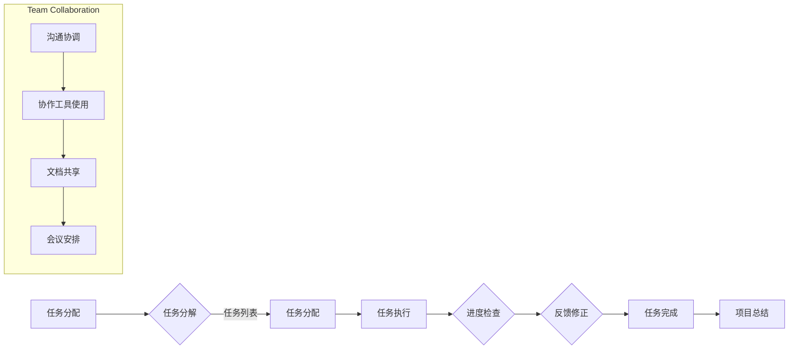
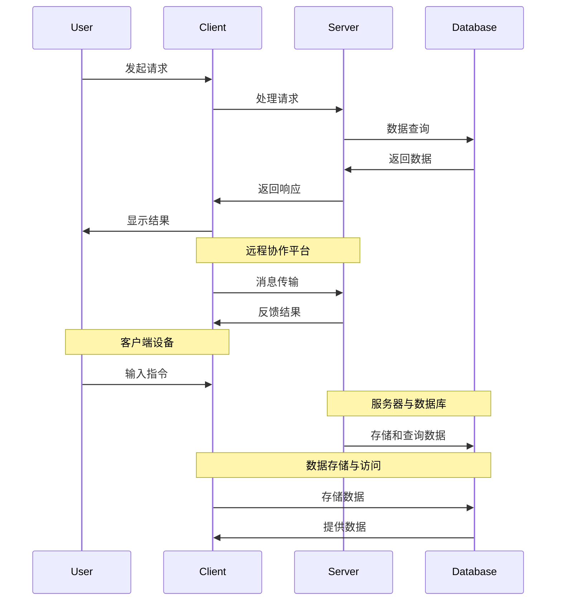

                 

### 文章标题

# 《一人公司如何打造高效的远程协作环境》

### 关键词

- 远程协作
- 效率提升
- 远程工作
- 硬件设施
- 网络环境
- 沟通技巧

### 摘要

在当今快速变化的工作环境中，一人公司通过远程协作来实现高效运作显得尤为重要。本文将深入探讨一人公司如何利用现代技术工具和最佳实践，打造一个高效、可靠的远程协作环境。本文分为三大部分：远程协作的基础知识、构建高效远程协作环境、以及成功案例分析。通过详细的分析和实例，为一人公司提供切实可行的策略，以在远程协作中实现最大化的效率和生产力。

## 《一人公司如何打造高效的远程协作环境》目录大纲

### 第一部分：远程协作的基础知识

#### 第1章：远程协作概述

##### 1.1 远程协作的概念和重要性

##### 1.2 远程协作的发展历程

##### 1.3 远程协作的优势与挑战

#### 第2章：远程协作工具与平台

##### 2.1 常见的远程协作工具

##### 2.2 远程协作平台的比较与选择

##### 2.3 工具与平台的集成与优化

#### 第3章：远程协作的最佳实践

##### 3.1 远程会议与沟通技巧

##### 3.2 远程团队建设与管理

##### 3.3 远程协作中的个人效率提升

### 第二部分：构建高效远程协作环境

#### 第4章：远程协作环境搭建

##### 4.1 远程工作空间的规划

##### 4.2 硬件设施的选择与配置

##### 4.3 网络环境与安全性的保障

#### 第5章：任务管理与项目协作

##### 5.1 任务管理的工具与方法

##### 5.2 项目协作流程的设计

##### 5.3 项目进度与质量的监控

#### 第6章：沟通与反馈机制

##### 6.1 远程沟通的技巧与策略

##### 6.2 及时有效的反馈机制

##### 6.3 团队成员间的信任建立与维护

### 第三部分：案例研究与应用

#### 第7章：成功案例分析

##### 7.1 国内成功案例解析

##### 7.2 国际远程协作典范

##### 7.3 案例启示与借鉴

#### 第8章：实战项目指导

##### 8.1 远程协作项目策划

##### 8.2 项目执行与监控

##### 8.3 项目总结与反思

#### 第9章：未来展望与趋势

##### 9.1 远程协作的未来发展方向

##### 9.2 技术创新与挑战

##### 9.3 远程协作在新冠后的影响与变革

### 附录

#### 附录 A：远程协作工具与资源汇总

##### A.1 常用远程协作工具汇总

##### A.2 远程协作平台推荐

##### A.3 开源资源与学习资料推荐

#### 附录 B：流程图与架构图

##### B.1 远程协作流程图

##### B.2 远程协作架构图

##### B.3 其他相关图表与图解

#### 附录 C：常见问题与解答

##### C.1 远程协作常见问题

##### C.2 工具使用疑难解答

##### C.3 管理与沟通技巧答疑

## 第一部分：远程协作的基础知识

### 第1章：远程协作概述

#### 1.1 远程协作的概念和重要性

远程协作指的是利用互联网和信息技术，让团队成员在不同的地理位置上协同完成工作的方式。随着全球化和互联网的普及，远程协作已成为现代企业运营的重要组成部分。

远程协作的重要性体现在多个方面：

1. **提高灵活性**：远程协作使得团队成员可以不受地理限制，随时随地进行工作，从而提高了工作的灵活性和响应速度。
2. **降低成本**：通过远程协作，企业可以减少实体办公场所的租赁费用、通勤时间和办公设备投入。
3. **扩展人才池**：远程协作使得企业可以招聘来自全球的优秀人才，而不受地域限制，从而提高团队的整体实力。
4. **提升员工满意度**：灵活的工作时间和地点可以显著提高员工的工作满意度和幸福感。

#### 1.2 远程协作的发展历程

远程协作并非新兴概念，其历史可以追溯到20世纪末。以下为远程协作的发展历程：

1. **电子邮件时代**：最早的远程协作工具是电子邮件，通过电子邮件，团队成员可以在不同的地点发送和接收信息。
2. **即时通讯工具**：随着互联网技术的发展，即时通讯工具如QQ、MSN等开始普及，提供了实时沟通的渠道。
3. **协同办公平台**：20世纪末到21世纪初，如Google Docs、微软Office 365等在线办公工具的出现，使得远程协作进入了一个新的阶段，多人可以实时编辑同一份文档。
4. **远程协作平台**：近年来，远程协作平台如Slack、Trello、Asana等得到了广泛应用，它们集成了沟通、协作、任务管理等多种功能，为远程协作提供了更加全面的支持。

#### 1.3 远程协作的优势与挑战

**优势**：

1. **灵活性**：远程协作使得员工可以根据自身情况灵活安排工作时间，提高了工作效率。
2. **成本效益**：远程协作可以减少企业的办公场所和设备投入，降低运营成本。
3. **多样性**：远程协作可以吸引全球各地的优秀人才，提高团队的多样性。
4. **提高生产力**：远程协作可以打破传统的办公限制，实现更加高效的团队合作。

**挑战**：

1. **沟通障碍**：由于地理位置的差异，远程协作中的沟通可能存在延迟和误解。
2. **团队凝聚力**：远程工作可能导致团队成员间的互动减少，影响团队凝聚力。
3. **时间管理**：远程工作者可能面临时间管理方面的挑战，容易陷入工作与生活的界限模糊。
4. **技术依赖**：远程协作对互联网和通信技术的依赖程度较高，一旦出现技术问题，可能会影响工作进度。

在接下来的章节中，我们将进一步探讨远程协作所需的工具与平台，以及最佳实践，帮助一人公司克服挑战，实现高效远程协作。

## 第2章：远程协作工具与平台

#### 2.1 常见的远程协作工具

远程协作工具是支持远程团队高效运作的核心。以下是一些常见的远程协作工具及其功能：

1. **即时通讯工具**：
   - **Slack**：Slack是一个集成了沟通、文件共享、任务分配等多种功能的即时通讯平台。它允许团队成员通过渠道（Channels）进行分组讨论，并通过私信（Direct Messages）进行一对一沟通。
   - **Microsoft Teams**：Microsoft Teams是微软推出的综合通信和协作平台，支持语音、视频通话、即时消息传递和共享文档等功能，与微软的其他办公软件紧密集成。

2. **在线会议工具**：
   - **Zoom**：Zoom是一款功能强大的视频会议工具，支持高清视频、音频和屏幕共享，适用于在线会议、培训和研讨会等场景。
   - **Google Meet**：Google Meet是Google推出的视频会议解决方案，与Google Workspace集成，支持最多100人的会议。

3. **文档协作工具**：
   - **Google Docs**：Google Docs是一个在线文档编辑工具，支持实时协作，多人可以同时编辑同一份文档，并提供版本历史记录。
   - **Microsoft Office 365**：Microsoft Office 365包括Word、Excel、PowerPoint等在线办公软件，支持多人在线协作，同时提供了文档共享和权限管理功能。

4. **项目管理工具**：
   - **Trello**：Trello是一个基于看板（Kanban）的视觉项目管理工具，可以帮助团队成员清晰地了解项目的进度和任务分配。
   - **Asana**：Asana是一个灵活的任务管理和项目协作工具，支持任务分配、进度追踪和报告生成等功能，适用于各种规模的项目管理。

5. **代码协作工具**：
   - **GitHub**：GitHub是一个基于Git的代码托管平台，支持团队协作、代码审查和项目进度追踪，广泛应用于软件开发项目。
   - **GitLab**：GitLab是一个自托管的开源版本控制系统，与GitHub类似，支持代码协作、项目管理、持续集成和持续交付等功能。

#### 2.2 远程协作平台的比较与选择

选择合适的远程协作平台对一人公司至关重要。以下为几个主要平台的比较：

1. **Slack vs. Microsoft Teams**：
   - **功能**：Slack和Microsoft Teams都提供了丰富的沟通和协作功能，但Slack的集成能力更强，支持更多的第三方应用和服务。
   - **成本**：Slack提供了免费版本和多种付费套餐，而Microsoft Teams是微软办公套件的一部分，需要订阅Microsoft 365。
   - **适用场景**：Slack更适合小型团队和初创公司，而Microsoft Teams更适合大型企业和需要与其他Microsoft软件深度集成的团队。

2. **Zoom vs. Google Meet**：
   - **功能**：Zoom在视频会议的清晰度和功能上具有优势，支持更多的高级功能如虚拟背景和屏幕共享。Google Meet则提供了更紧密的Google Workspace集成。
   - **成本**：Zoom的免费版本限制较多，而Google Meet的部分功能需要Google Workspace订阅。
   - **适用场景**：Zoom适用于需要高质量视频会议的企业，而Google Meet适用于Google Workspace用户。

3. **Trello vs. Asana**：
   - **功能**：Trello以简洁直观的看板界面著称，适合简单的项目管理。Asana则提供了更丰富的功能，如任务依赖、甘特图和自定义字段等。
   - **成本**：Trello的免费版本功能较为全面，而Asana的免费版本功能有限。
   - **适用场景**：Trello适用于简单的任务管理，而Asana适用于复杂的项目管理和需要详细进度的团队。

4. **GitHub vs. GitLab**：
   - **功能**：GitHub是全球最流行的代码托管平台，提供了强大的社区支持和市场生态系统。GitLab则提供了更多的自托管和定制化功能。
   - **成本**：GitHub提供了免费版本和企业版本，而GitLab是完全免费的，但需要自托管。
   - **适用场景**：GitHub适用于开源项目和个人项目，而GitLab适用于企业内部项目和管理。

#### 2.3 工具与平台的集成与优化

为了实现远程协作的高效性，集成和优化各种工具和平台是关键。以下是一些最佳实践：

1. **集成工作流**：通过集成不同的工具和平台，可以减少切换应用的时间和复杂度。例如，将Slack与Trello或Asana集成，可以在讨论中直接创建任务和查看进度。
2. **自动化流程**：利用自动化工具如 Zapier 和 Integromat，可以实现不同平台之间的自动化操作，例如将Slack中的消息同步到Google Sheets中。
3. **权限管理**：确保每个团队成员都有适当的权限，访问他们需要的内容，但避免过多权限导致安全风险。
4. **定期评估**：定期评估团队的工作流程和使用工具的效果，根据反馈进行调整和优化。

通过合理选择和集成远程协作工具与平台，一人公司可以打造一个高效、灵活且安全的远程工作环境，从而提高团队的协作效率和生产力。

### 第3章：远程协作的最佳实践

#### 3.1 远程会议与沟通技巧

远程会议是远程协作中不可或缺的一部分。以下是一些提高远程会议效率和沟通效果的最佳实践：

1. **提前准备**：在会议前，确保所有参会者都了解会议议程和讨论主题。提前发送会议材料，并提醒参会者准备好所需的工具和设备。
2. **明确会议目标**：每次会议都应该有一个清晰的目标，确保会议内容集中且高效。会议前明确讨论要点和预期成果，有助于提高会议的针对性。
3. **利用技术工具**：充分利用远程会议工具的功能，如Zoom的虚拟背景、屏幕共享、投票和实时问答等，提高会议互动性和参与度。
4. **遵守时间管理**：确保会议时间控制在合理范围内，避免冗长和无意义的讨论。设定明确的开始和结束时间，并提醒参会者在规定时间内发言。

**沟通技巧**：

1. **主动沟通**：在远程协作中，主动沟通尤为重要。确保团队成员之间保持频繁且有效的沟通，及时反馈问题和进展。
2. **使用清晰的语言**：在沟通时使用简单明了的语言，避免使用专业术语或复杂句式，确保信息的准确传达。
3. **倾听和回应**：在讨论中，确保每个人都有机会发言，认真倾听他人的意见，并在适当时候给予回应和反馈。
4. **使用非文字沟通**：除了文字和语音，非文字沟通手段如表情符号、图表和图片等可以增强信息的传达效果。

#### 3.2 远程团队建设与管理

远程团队建设和管理是保持团队凝聚力、激发团队潜力和提高工作效率的关键。以下是一些最佳实践：

**团队建设**：

1. **定期团建活动**：通过在线团建活动，如虚拟聚会、团队游戏和分享会等，增强团队成员间的情感联系和团队意识。
2. **建立共同目标**：确保团队成员都了解团队的目标和愿景，共同为团队的成功而努力。
3. **鼓励开放交流**：建立一个开放、透明和包容的沟通环境，鼓励团队成员提出建议和意见，共同改进团队工作。

**团队管理**：

1. **合理分配任务**：根据团队成员的技能和兴趣，合理分配任务，确保每个人都有适当的角色和职责。
2. **设定明确的期望**：为每个任务设定明确的期望和目标，确保团队成员了解任务的要求和预期成果。
3. **提供必要的支持**：确保团队成员在完成任务时得到必要的资源和支持，如培训、工具和技术支持等。

**管理工具**：

1. **使用项目管理工具**：使用项目管理工具如Trello、Asana等，可以清晰地追踪任务进度、分配任务和监控项目状态。
2. **定期团队会议**：定期召开团队会议，检查任务进度、解决问题和讨论改进措施。
3. **利用即时通讯工具**：利用即时通讯工具如Slack、Microsoft Teams等，快速解决日常工作和沟通中的问题，提高响应速度。

通过有效的远程团队建设和管理，一人公司可以保持团队的凝聚力，激发团队成员的潜力，从而实现高效远程协作。

#### 3.3 远程协作中的个人效率提升

在远程协作环境中，个人的工作效率直接影响到整个团队的表现。以下是一些提升个人效率的最佳实践：

**时间管理**：

1. **设定优先级**：每天开始工作前，列出任务清单，并按照优先级排序，确保先完成最重要的任务。
2. **使用时间跟踪工具**：使用时间跟踪工具如Toggl或RescueTime，监控自己的时间使用情况，找出时间浪费的环节，并进行优化。
3. **设定工作与休息时间**：合理规划工作与休息时间，避免长时间连续工作导致疲劳，提高工作效率。

**自我管理**：

1. **保持工作环境整洁**：保持工作环境的整洁和有序，有助于提高工作效率和专注力。
2. **设定工作目标**：为每个工作阶段设定具体的目标和预期成果，有助于保持工作动力和方向。
3. **避免多任务处理**：尽量避免同时处理多个任务，这会分散注意力，降低工作效率。

**工具优化**：

1. **选择合适的工具**：根据工作需求和团队协作方式，选择合适的远程协作工具，避免工具过多导致混乱。
2. **整合工具功能**：将不同的远程协作工具进行整合，如将邮件、日程安排和任务管理集成到一个平台上，提高工作效率。
3. **定期更新工具**：定期更新工具的版本，确保使用的是最新、最稳定的版本，避免因工具问题导致工作受阻。

通过以上个人效率提升的最佳实践，一人公司中的每个成员都可以更好地适应远程工作环境，提高工作效率和生产力。

## 第二部分：构建高效远程协作环境

### 第4章：远程协作环境搭建

#### 4.1 远程工作空间的规划

一个良好的远程工作空间是确保工作效率和舒适度的基础。以下是一些关于远程工作空间规划的要点：

**选择合适的地点**：

1. **安静的环境**：确保工作地点安静，避免干扰。如果可能，选择一个独立的房间或安静的角落，以减少外部干扰。
2. **良好的光线**：确保工作区域有充足的自然光线或人工光源，以减少眼睛疲劳。
3. **舒适的座椅和桌子**：选择符合人体工程学的座椅和桌子，以减少长时间工作带来的身体不适。

**设计合理的工作布局**：

1. **工作区和生活区分离**：尽量将工作区和家庭生活区分离，避免工作与生活混淆，有助于提高工作效率和减少压力。
2. **多功能工作台**：选择一个多功能工作台，可以方便地进行电脑、文档和其他设备的摆放，提高空间利用效率。
3. **合理的储存和整理**：合理规划工作区域的储存空间，确保文件、工具和设备有序存放，便于查找和使用。

**优化办公设备**：

1. **高性能电脑和设备**：选择高性能的电脑和硬件设备，确保在工作中运行流畅，提高效率。
2. **无线网络**：使用无线网络，减少电缆的杂乱，提高工作环境的整洁度。
3. **备用电源**：确保工作空间有稳定的电源供应，并准备备用电源设备，如UPS不间断电源，以防止意外断电影响工作。

#### 4.2 硬件设施的选择与配置

硬件设施是远程协作环境搭建的重要一环，以下是一些关于硬件设施的选择与配置的要点：

**电脑和笔记本电脑**：

1. **处理器和内存**：选择具有较高处理器性能和足够内存的电脑，以确保多任务处理和应用程序运行的流畅性。
2. **存储容量**：根据工作需求，选择具有足够存储容量的硬盘或固态硬盘，以存储大量的数据和文档。
3. **端口和扩展性**：确保电脑具备足够的端口和扩展性，以便连接外部设备如显示器、键盘和鼠标等。

**显示器和音视频设备**：

1. **分辨率和尺寸**：选择高分辨率和大尺寸的显示器，以提高视觉舒适度和工作效率。
2. **音频设备**：选择高质量的耳机或麦克风，确保远程会议中的声音清晰，减少噪音干扰。
3. **摄像头**：选择高清摄像头，以获得更好的视频会议体验。

**网络设备**：

1. **路由器和调制解调器**：选择性能稳定、支持无线网络和WPA3安全标准的路由器和调制解调器，确保网络连接的稳定性和安全性。
2. **Wi-Fi信号增强器**：在大型住宅或办公室中，安装Wi-Fi信号增强器，确保工作区域内的信号覆盖良好。
3. **网络安全设备**：配置防火墙和反病毒软件，确保网络安全，防止数据泄露和恶意攻击。

**其他设备**：

1. **便携式硬盘**：备份重要数据和文档，以防硬件故障或丢失。
2. **移动设备**：确保手机和备用电池充电器充足，以便在需要时随时保持联系。

通过合理选择和配置硬件设施，一人公司可以打造一个高效、稳定且舒适的远程工作环境，从而提高团队的工作效率和生产率。

#### 4.3 网络环境与安全性的保障

网络环境是远程协作的基础，保障网络环境的稳定性和安全性至关重要。以下是一些关于网络环境与安全性的保障措施：

**网络稳定性**：

1. **带宽优化**：确保网络带宽足够支持远程协作工具的运行，如视频会议、文件传输等。对于带宽不足的情况，可以考虑增加带宽或使用网络加速器。
2. **备份网络连接**：在主要网络连接出现故障时，备用网络连接如4G或5G网络可以提供临时的解决方案。
3. **网络监控**：使用网络监控工具，实时监测网络状态和流量，及时发现并解决网络问题。

**网络安全**：

1. **防火墙设置**：配置企业级防火墙，限制不必要的外部访问，防止网络攻击和数据泄露。
2. **VPN（虚拟私人网络）**：使用VPN加密网络通信，确保数据在传输过程中不被截获或篡改。
3. **定期安全检查**：定期进行网络安全检查，更新系统补丁和防病毒软件，确保系统安全。

**数据安全**：

1. **数据备份**：定期备份重要数据，并存储在安全的地方，如云存储或远程备份服务器。
2. **访问控制**：实施严格的访问控制策略，确保只有授权人员可以访问敏感数据和系统。
3. **数据加密**：对存储和传输中的敏感数据进行加密，确保即使数据泄露，也无法被未授权人员读取。

**远程访问安全**：

1. **多因素认证**：启用多因素认证（MFA），确保只有通过双重验证的用户才能访问系统。
2. **远程桌面协议（RDP）安全**：使用安全的远程桌面协议，如RDP加密，防止未经授权的远程访问。
3. **远程工作设备管理**：确保远程工作设备受到严格的管理和控制，如安装企业级反病毒软件、配置防火墙等。

通过上述措施，一人公司可以构建一个稳定、安全且高效的远程工作网络环境，从而保障远程协作的顺利进行。

### 第5章：任务管理与项目协作

#### 5.1 任务管理的工具与方法

任务管理是远程协作中至关重要的一环，选择合适的工具和方法有助于提高工作效率和项目进度。以下是一些常用的任务管理工具和方法：

**常用的任务管理工具**：

1. **Trello**：Trello是一个基于看板的任务管理工具，通过卡片和列表的形式，直观地展示任务的状态和进度。
2. **Asana**：Asana提供了灵活的任务分配、进度追踪和报告生成功能，适合复杂的项目管理。
3. **Jira**：Jira是一个强大的敏捷项目管理工具，适用于软件开发和IT项目，支持任务跟踪、敏捷迭代和自动化工作流程。

**任务管理方法**：

1. **任务分解**：将大任务分解成小任务，明确每个任务的开始和结束时间，以及责任人。
2. **优先级排序**：根据任务的紧急程度和重要性，对任务进行优先级排序，确保先完成最重要的任务。
3. **定期更新**：定期更新任务的进度和状态，确保所有团队成员都能实时了解项目进展。
4. **透明沟通**：通过任务管理工具，团队成员可以随时查看任务的进度和状态，确保信息的透明和沟通的及时。

**任务分配与跟进**：

1. **明确责任人**：为每个任务分配明确的责任人，确保任务有人负责。
2. **任务跟进**：定期跟进任务的进展，确保任务按时完成。
3. **提醒机制**：设置任务的提醒机制，提前通知责任人任务截止时间，避免任务延误。

通过合理选择和运用任务管理工具与方法，一人公司可以有效地管理和跟踪项目进度，提高团队协作效率。

#### 5.2 项目协作流程的设计

项目协作流程的设计是确保项目顺利进行的关键。以下是一些关于项目协作流程设计的关键要素和步骤：

**关键要素**：

1. **项目目标**：明确项目的目标和预期成果，确保所有团队成员对项目目标有清晰的认识。
2. **项目范围**：界定项目的范围，明确哪些工作内容属于项目，哪些工作内容不属于项目。
3. **项目团队**：组建合适的团队，包括项目经理、团队成员和资源，确保团队具备完成项目的必要能力。
4. **项目计划**：制定详细的项目计划，包括任务分配、时间表、资源需求和预算等。

**设计步骤**：

1. **需求分析**：与项目利益相关者沟通，了解项目的需求和要求，明确项目的目标和范围。
2. **任务分解**：将项目任务分解成可执行的小任务，明确每个任务的开始和结束时间，以及责任人。
3. **资源分配**：根据任务需求和团队资源情况，合理分配任务和资源，确保每个任务都有合适的人选。
4. **时间表制定**：制定详细的时间表，明确每个任务的开始和结束时间，以及关键里程碑的完成时间。
5. **风险评估**：评估项目可能面临的风险和挑战，制定相应的应对策略和应急预案。
6. **沟通与协作**：设计有效的沟通和协作机制，确保团队成员之间的信息传递和协作顺畅。

通过科学合理地设计项目协作流程，一人公司可以确保项目按计划进行，提高项目成功率和团队协作效率。

#### 5.3 项目进度与质量的监控

项目进度与质量的监控是确保项目按时完成和满足质量要求的关键。以下是一些关于项目进度与质量监控的方法和工具：

**进度监控方法**：

1. **定期检查**：定期检查项目的进展情况，与计划进行对比，及时发现偏差和问题。
2. **实时跟踪**：使用项目管理工具，如Trello、Asana等，实时跟踪任务进度和项目状态。
3. **项目报告**：定期生成项目报告，包括进度更新、任务完成情况和资源使用情况，确保所有团队成员对项目进展有清晰的认识。

**质量监控方法**：

1. **质量标准**：制定明确的质量标准，确保所有工作都符合既定的质量要求。
2. **质量检查**：在任务完成时进行质量检查，确保任务符合质量标准，及时发现和修复问题。
3. **用户反馈**：收集用户反馈，了解项目的实际使用情况和用户体验，根据反馈进行改进。

**工具使用**：

1. **项目管理工具**：使用项目管理工具，如Jira、Asana等，可以方便地跟踪任务进度和质量，生成报告和图表。
2. **自动化测试工具**：如Selenium、Jenkins等，可以用于自动化测试和持续集成，确保项目的质量和稳定性。
3. **代码审查工具**：如GitHub、GitLab等，可以用于代码审查和协作，确保代码质量。

通过科学合理地监控项目进度和质量，一人公司可以确保项目按时完成，并满足质量要求，提高项目的成功率和客户满意度。

### 第6章：沟通与反馈机制

#### 6.1 远程沟通的技巧与策略

在远程协作环境中，沟通是确保团队协作顺畅和目标一致的关键。以下是一些关于远程沟通的技巧与策略：

**主动沟通**：

1. **保持频繁的沟通**：定期与团队成员进行沟通，确保信息的及时传达和问题的及时解决。
2. **提前规划沟通**：在会议或任务开始前，提前规划沟通内容和方式，确保沟通有目的性和针对性。
3. **多样化沟通方式**：利用不同的沟通方式，如即时消息、电子邮件、电话、视频会议等，根据具体情况选择合适的沟通方式。

**有效表达**：

1. **清晰表达**：在沟通时，使用简单明了的语言，避免使用复杂的术语或模糊的表述，确保信息的准确传达。
2. **倾听与回应**：认真倾听他人的意见，给予及时的回应和反馈，建立互信和互动。
3. **使用非文字沟通**：适当使用表情符号、图表和图片等非文字沟通手段，增强信息的传达效果和沟通的趣味性。

**管理沟通**：

1. **沟通渠道的设定**：根据团队的不同需求和沟通内容，设定不同的沟通渠道，如专门的聊天室、邮件列表、项目管理系统等。
2. **沟通时间的安排**：合理安排沟通时间，避免在团队成员忙碌或休息时进行沟通。
3. **沟通进度的控制**：在沟通中，控制沟通的进度和节奏，确保每个议题都能得到充分讨论，避免沟通拖延或中断。

#### 6.2 及时有效的反馈机制

有效的反馈机制是确保团队成员工作质量和工作满意度的关键。以下是一些关于及时有效的反馈机制的构建和实施方法：

**构建反馈机制**：

1. **设定反馈目标**：明确反馈的目的和目标，确保反馈有针对性，如改进工作、提升技能等。
2. **反馈渠道的开放**：建立开放的反馈渠道，确保团队成员可以随时随地提出意见和建议。
3. **反馈形式的多样化**：提供多种反馈形式，如书面反馈、口头反馈、匿名反馈等，满足不同团队成员的反馈需求。

**实施反馈机制**：

1. **定期反馈**：定期进行反馈，如每周、每月或每季度进行一次反馈会议，确保团队成员的工作进展和问题得到及时关注。
2. **正面反馈为主**：在反馈中，以正面反馈为主，鼓励团队成员的工作积极性和创造力。
3. **具体和建设性的反馈**：提供具体和建设性的反馈，明确指出问题和改进的方向，帮助团队成员更好地提升工作质量。

**反馈的接受与处理**：

1. **接受反馈**：团队成员应积极接受反馈，对待反馈持开放态度，勇于面对和改正问题。
2. **及时处理**：对反馈的问题进行及时处理，制定改进计划和措施，确保问题得到有效解决。
3. **反馈的闭环**：在问题解决后，进行反馈的闭环，确认问题是否得到解决，并总结反馈过程中的经验教训。

通过构建和实施有效的反馈机制，一人公司可以不断提升团队成员的工作质量和工作满意度，促进团队的持续改进和发展。

#### 6.3 团队成员间的信任建立与维护

在远程协作环境中，建立和维护团队成员间的信任至关重要。以下是一些关于团队成员信任建立与维护的方法：

**建立信任的方法**：

1. **透明沟通**：确保团队成员之间的沟通是透明和开放的，避免信息的不对称和误解。通过定期更新项目进展、分享工作成果和面对问题，增强团队成员之间的信任。
2. **尊重与理解**：尊重每个团队成员的观点和意见，倾听和理解他们的需求和困难。通过建立互相尊重和理解的关系，增强团队成员之间的信任。
3. **诚信与责任**：团队成员应保持诚信，遵守承诺，并对自己的工作负责。诚信是建立信任的基础，责任感是确保团队目标实现的保障。

**维护信任的方法**：

1. **及时反馈与支持**：及时给予团队成员反馈和支持，帮助他们解决问题和克服困难。通过积极的反馈和支持，增强团队成员之间的信任和团队凝聚力。
2. **公平对待**：在团队中，公平对待每个成员，确保他们有公平的机会和资源。公平是维护团队成员信任的关键，有助于避免团队成员之间的不满和冲突。
3. **共同目标**：明确团队的目标和愿景，确保所有团队成员都朝着一个共同的目标努力。共同的目标可以增强团队成员之间的协作和信任。

通过建立和维护团队成员间的信任，一人公司可以促进团队的协作和凝聚力，提高工作效率和项目成功率。

### 第7章：成功案例分析

#### 7.1 国内成功案例解析

**案例一：腾讯云的远程协作实践**

腾讯云在国内远程协作方面有着丰富的经验和成功实践。以下为他们的主要做法：

1. **工具集成**：腾讯云使用了多种远程协作工具，如企业微信、腾讯会议、腾讯文档等，实现了沟通、会议和文档协作的一体化。
2. **定期培训**：腾讯云定期为员工提供远程协作工具的使用培训，确保员工能够熟练使用相关工具，提高工作效率。
3. **团队文化建设**：腾讯云注重团队文化建设，通过线上团建活动和虚拟聚会，增强团队成员之间的情感联系和团队凝聚力。

**案例启示**：腾讯云的成功经验表明，合理选择和使用远程协作工具、定期培训和关注团队文化建设，是提升远程协作效率的关键。

**案例二：字节跳动的远程团队管理**

字节跳动在远程团队管理方面有着独到之处，以下为他们的主要做法：

1. **明确角色与职责**：字节跳动在远程团队中明确了每个成员的角色和职责，确保任务分配合理，责任清晰。
2. **任务跟踪与进度管理**：字节跳动使用了项目管理工具如Trello和Asana，实时跟踪任务进度，确保项目按计划进行。
3. **定期团队会议**：字节跳动定期召开线上团队会议，检查任务进度、讨论问题和规划下一步工作。

**案例启示**：字节跳动的成功经验表明，明确角色与职责、科学任务跟踪和定期团队会议，是提升远程团队管理效率的重要手段。

#### 7.2 国际远程协作典范

**案例一：GitHub的分布式团队协作**

GitHub是全球著名的代码托管平台，其分布式团队协作模式具有代表性。以下为他们的主要做法：

1. **全球人才池**：GitHub吸引了来自全球的顶尖开发者和工程师，通过远程协作实现了团队的高效运作。
2. **敏捷开发**：GitHub采用了敏捷开发方法，通过短周期迭代和频繁的代码审查，提高了项目的开发效率和质量。
3. **灵活工作安排**：GitHub允许团队成员灵活安排工作时间，根据个人情况和工作需求，选择最适合自己的工作方式。

**案例启示**：GitHub的经验表明，全球人才池、敏捷开发和灵活工作安排，是提升远程协作效率和团队凝聚力的重要策略。

**案例二：Buffer的远程团队管理**

Buffer是一家全球性的社交媒体管理工具公司，以其高效的远程团队管理而著称。以下为他们的主要做法：

1. **清晰的沟通策略**：Buffer制定了明确的沟通策略，包括日常站会、周报和月度回顾等，确保团队成员之间的沟通畅通无阻。
2. **团队文化**：Buffer注重团队文化建设，通过线上团建活动和虚拟聚会，增强团队成员之间的情感联系和团队凝聚力。
3. **反馈机制**：Buffer建立了有效的反馈机制，鼓励团队成员提出意见和建议，及时解决问题，提高团队协作效率。

**案例启示**：Buffer的经验表明，清晰的沟通策略、团队文化建设和反馈机制，是构建高效远程团队的关键。

#### 7.3 案例启示与借鉴

从上述国内和国际的成功案例中，我们可以得出以下启示和借鉴：

1. **工具集成与培训**：合理选择和集成远程协作工具，并定期为员工提供工具使用培训，提高工作效率。
2. **明确角色与职责**：在远程团队中，明确每个成员的角色和职责，确保任务分配合理，责任清晰。
3. **敏捷开发与灵活工作**：采用敏捷开发方法，实现短周期迭代和频繁代码审查，提高项目开发效率和质量；允许团队成员灵活安排工作时间，提升团队凝聚力。
4. **沟通策略与文化建设**：制定清晰的沟通策略，定期进行团队会议和反馈，确保团队协作顺畅；注重团队文化建设，通过线上团建活动和虚拟聚会，增强团队成员之间的情感联系和团队凝聚力。
5. **反馈机制**：建立有效的反馈机制，鼓励团队成员提出意见和建议，及时解决问题，提高团队协作效率。

通过借鉴这些成功案例，一人公司可以构建一个高效、灵活且具有凝聚力的远程协作环境，从而提高团队的工作效率和生产力。

### 第8章：实战项目指导

#### 8.1 远程协作项目策划

成功的远程协作项目需要精心策划，以下为项目策划的关键步骤：

**项目目标设定**：

1. **明确项目目标**：在项目启动前，明确项目的目标和预期成果，确保所有团队成员对项目目标有清晰的认识。
2. **分解项目目标**：将大目标分解成可执行的小任务，明确每个任务的开始和结束时间，以及责任人。

**资源准备**：

1. **人员配备**：根据项目需求和团队成员的技能，合理配置人员，确保每个任务都有合适的人选。
2. **工具与技术**：选择合适的远程协作工具和技术，如项目管理工具、远程会议工具和文档协作工具等，确保项目顺利执行。

**时间表制定**：

1. **制定详细时间表**：制定详细的时间表，明确每个任务的开始和结束时间，以及关键里程碑的完成时间。
2. **预留缓冲时间**：在时间表中预留一定的缓冲时间，以应对突发情况和任务延误。

**风险管理**：

1. **识别风险**：评估项目可能面临的风险和挑战，如技术问题、人员变动、沟通障碍等。
2. **制定应对策略**：为每个风险制定相应的应对策略和应急预案，确保项目能够顺利推进。

**沟通与协作机制**：

1. **建立沟通渠道**：根据项目需求，设定不同的沟通渠道，如项目微信群、邮件列表和项目管理工具等。
2. **明确沟通流程**：制定明确的沟通流程和规则，确保信息的准确传达和及时反馈。

通过以上步骤，一人公司可以有效地策划远程协作项目，确保项目顺利进行和成功完成。

#### 8.2 项目执行与监控

项目执行是确保项目目标实现的关键环节，以下为项目执行和监控的关键要点：

**任务分配与跟进**：

1. **明确任务分配**：根据项目时间表和资源情况，将任务合理分配给团队成员，确保每个任务都有明确的责任人。
2. **定期跟进**：定期检查任务的完成情况，与责任人沟通，确保任务按时完成。

**进度监控**：

1. **使用项目管理工具**：利用项目管理工具如Trello、Asana等，实时跟踪任务进度和项目状态。
2. **项目报告**：定期生成项目报告，包括任务进度、资源使用情况和风险状况，确保所有团队成员对项目进展有清晰的认识。

**问题解决**：

1. **及时反馈**：在发现问题时，及时反馈给项目负责人和团队成员，确保问题得到及时解决。
2. **制定应对措施**：针对发现的问题，制定相应的应对措施，确保项目能够继续推进。

通过科学合理地执行和监控项目，一人公司可以确保项目按计划进行，提高项目成功率和团队协作效率。

#### 8.3 项目总结与反思

项目总结是项目执行结束后的重要环节，通过总结可以评估项目成效、识别问题，并为未来项目提供改进建议。以下为项目总结和反思的关键要点：

**评估项目成效**：

1. **目标达成情况**：检查项目目标是否实现，分析项目成果是否符合预期。
2. **资源使用情况**：评估项目资源的利用效率，包括人力、物力和财力，总结资源分配和使用的优缺点。
3. **团队协作效果**：评估团队在项目中的协作效果，分析团队成员的沟通、合作和协调情况。

**识别问题**：

1. **沟通障碍**：分析项目中存在的沟通障碍，如信息传递不及时、误解等，提出改进措施。
2. **任务延误**：识别项目中任务延误的原因，如资源不足、技术问题等，制定相应的预防措施。
3. **风险管理**：总结项目中的风险应对效果，评估风险管理的有效性，为未来项目提供风险管理建议。

**改进建议**：

1. **优化流程**：针对项目中发现的问题，优化项目流程和操作规范，提高项目执行效率。
2. **培训与支持**：为团队成员提供必要的培训和技能支持，提升团队整体能力。
3. **持续改进**：建立持续改进机制，鼓励团队成员提出改进建议，并根据反馈进行持续优化。

通过项目总结和反思，一人公司可以不断改进项目执行和管理方法，提高项目成功率和团队协作效率。

### 第9章：未来展望与趋势

#### 9.1 远程协作的未来发展方向

随着技术的不断进步和全球化的深入发展，远程协作的未来发展方向呈现出多样性和创新性。以下为未来远程协作的主要发展方向：

1. **人工智能与自动化**：人工智能和自动化技术的发展将进一步提升远程协作的效率和智能化水平。例如，智能会议助手可以自动记录会议内容、生成会议纪要和任务分配，减少人工干预，提高会议效率。

2. **虚拟现实与增强现实**：虚拟现实（VR）和增强现实（AR）技术的应用将为远程协作带来全新的体验。通过VR和AR，团队成员可以感受到身临其境的远程协作环境，增强虚拟会议的互动性和沉浸感。

3. **区块链技术**：区块链技术的引入将进一步提高远程协作的安全性和透明性。通过区块链，可以实现去中心化的数据存储和权限管理，确保数据的真实性和安全性。

4. **云计算与边缘计算**：云计算和边缘计算的结合将为远程协作提供更加灵活和高效的服务。通过云计算，可以实现大规模数据处理和存储，而边缘计算则可以降低数据传输延迟，提高实时协作的响应速度。

5. **个性化和定制化**：随着对远程协作需求的多样化，未来的远程协作工具将更加注重个性化和定制化。通过用户行为分析和数据挖掘，可以提供更加符合个人需求的协作工具和服务。

#### 9.2 技术创新与挑战

在远程协作的发展过程中，技术创新带来了诸多机遇，同时也伴随着一系列挑战。以下为技术创新带来的主要挑战：

1. **数据隐私和安全**：随着远程协作的数据量不断增加，数据隐私和安全问题日益凸显。如何确保数据在传输和存储过程中的安全，防止数据泄露和黑客攻击，是远程协作面临的重大挑战。

2. **技术稳定性和可靠性**：远程协作依赖于互联网和通信技术，技术稳定性和可靠性直接影响协作效果。如何保证网络连接的稳定性和设备性能的可靠性，是远程协作技术发展需要解决的重要问题。

3. **跨平台与兼容性**：远程协作工具和平台的多样性增加了跨平台和兼容性的挑战。如何实现不同平台和工具之间的无缝对接和数据共享，是远程协作技术需要攻克的难题。

4. **技术技能和培训**：随着技术的不断更新和迭代，团队成员需要不断学习和掌握新技术。如何提供及时有效的技术培训和支持，帮助团队成员适应新技术，是远程协作面临的挑战。

5. **平衡工作与生活**：远程协作虽然提供了灵活的工作方式，但也可能导致工作与生活的界限模糊，影响员工的生活质量。如何帮助团队成员平衡工作与生活，提高工作满意度和幸福感，是远程协作需要关注的重要问题。

#### 9.3 远程协作在新冠后的影响与变革

新冠疫情的爆发对远程协作产生了深远的影响，推动了远程协作的快速发展和变革。以下为新冠后远程协作的主要影响和变革：

1. **远程协作的普及**：疫情促使大量企业和员工转向远程工作，远程协作工具和平台得到了广泛应用。远程协作不再局限于特定行业或领域，逐渐成为企业运营的常态。

2. **工作方式的转变**：远程协作改变了传统的办公模式，员工不再受限于地理位置和时间，工作方式更加灵活和个性化。这种转变提高了员工的工作满意度和生产力。

3. **企业结构的调整**：远程协作促使企业重新审视其组织结构和运营模式，一些企业开始尝试去中心化管理和分布式团队，提高了企业的灵活性和适应能力。

4. **远程协作技术的进步**：疫情推动了远程协作技术的快速发展和创新，如虚拟现实、区块链、人工智能等技术的应用，进一步提升了远程协作的效率和安全性。

5. **社交和沟通的挑战**：远程协作虽然提供了便利，但也带来了社交和沟通的挑战。团队成员之间的面对面交流和互动减少，可能影响团队凝聚力和工作氛围。

总体来说，新冠后的远程协作不仅改变了企业的运营方式，也推动了技术的进步和变革，为未来远程协作的发展提供了新的机遇和挑战。

### 附录 A：远程协作工具与资源汇总

#### A.1 常用远程协作工具汇总

在远程协作中，选择合适的工具是关键。以下为一些常用的远程协作工具及其主要功能：

1. **即时通讯工具**：
   - **Slack**：提供即时消息传递、文件共享和任务分配功能，适用于团队沟通和协作。
   - **Microsoft Teams**：集成了聊天、会议、视频通话和文档协作功能，与Microsoft Office紧密集成。
   - **WhatsApp**：支持文本、语音和视频聊天，适用于个人和团队沟通。

2. **在线会议工具**：
   - **Zoom**：提供高清视频会议、屏幕共享和虚拟背景功能，适用于各种规模的在线会议。
   - **Google Meet**：与Google Workspace集成，支持多人视频会议和实时协作。
   - **Skype**：提供视频通话、语音通话和即时消息功能，适用于个人和团队沟通。

3. **文档协作工具**：
   - **Google Docs**：支持多人实时编辑同一文档，提供版本控制和共享功能。
   - **Microsoft Office 365**：包括Word、Excel、PowerPoint等在线办公软件，支持多人协作。
   - **Notion**：提供笔记、数据库、看板等多种功能，适用于个人和组织知识管理。

4. **项目管理工具**：
   - **Trello**：基于看板的任务管理工具，适用于项目规划和任务分配。
   - **Asana**：提供任务跟踪、项目规划和报告生成功能，适用于复杂项目协作。
   - **Jira**：适用于软件开发团队，支持敏捷开发、任务跟踪和持续集成。

5. **代码协作工具**：
   - **GitHub**：提供代码托管、协作和版本控制功能，适用于软件开发项目。
   - **GitLab**：与GitHub类似，支持自托管和持续集成，适用于企业内部项目。
   - **Bitbucket**：Atlassian旗下代码托管平台，提供Git仓库和协作功能。

#### A.2 远程协作平台推荐

以下是一些推荐的远程协作平台，适用于不同规模和类型的团队：

1. **小型团队**：
   - **Notion**：功能强大，适合知识管理和团队协作。
   - **Slack**：提供即时沟通和任务管理功能，适用于快速协作。
   - **Trello**：直观易用，适用于简单的任务分配和项目管理。

2. **中型团队**：
   - **Microsoft Teams**：与Office 365集成，适用于企业级协作。
   - **Asana**：功能丰富，适用于复杂项目协作和管理。
   - **Jira**：适用于软件开发团队，支持敏捷开发和持续集成。

3. **大型团队**：
   - **Zoom**：提供高质量的在线会议和视频协作功能。
   - **Google Workspace**：包括Gmail、Google Docs、Google Meet等多种工具，适用于企业级协作。
   - **Confluence**：知识管理和协作平台，适用于团队知识共享和项目管理。

#### A.3 开源资源与学习资料推荐

对于希望深入了解远程协作技术或自行开发协作工具的读者，以下为一些开源资源和学习资料推荐：

1. **开源协作平台**：
   - **GitHub**：全球最大的代码托管平台，提供丰富的开源项目和协作工具。
   - **GitLab**：自托管的Git仓库和协作平台，支持持续集成和持续交付。
   - **GitSCM**：基于Git的开源版本控制系统，适用于个人和团队协作。

2. **远程协作框架**：
   - **Socket.io**：实时双向通信框架，适用于构建实时应用程序。
   - **WebSocket**：基于TCP协议的通信协议，适用于构建实时数据和通信应用程序。
   - **RESTful API**：RESTful架构风格，适用于构建分布式系统和远程协作应用。

3. **在线教程和文档**：
   - **remote.co**：提供关于远程工作和协作的全面教程和资源。
   - **GitHub Guides**：GitHub官方教程，涵盖Git、GitHub操作和代码协作技巧。
   - **Trello Help Center**：Trello官方帮助文档，提供详细的操作指南和最佳实践。

通过利用这些开源资源和学习资料，读者可以深入了解远程协作技术，提升自身技能，为构建高效的远程协作环境打下坚实基础。

### 附录 B：流程图与架构图

#### B.1 远程协作流程图

远程协作流程图如下所示，展示了从任务分配到项目完成的全过程：

**解释**：
- **A 任务分配**：项目经理或负责人根据项目需求分配任务。
- **B 任务分解**：将大任务分解成小任务，明确每个任务的开始和结束时间。
- **C 任务列表**：将任务列表分配给团队成员，确保每个任务有明确的责任人。
- **D 任务执行**：团队成员按照任务要求开始执行任务。
- **E 进度检查**：定期检查任务进度，确保项目按计划进行。
- **F 反馈修正**：根据进度检查结果，及时修正任务中的问题。
- **G 任务完成**：任务完成后进行验收，确保任务符合质量要求。
- **H 项目总结**：项目完成后进行总结，评估项目成效和团队成员表现。
- **I 沟通协调**：确保团队成员之间的沟通畅通，协调任务进度和资源。
- **J 协作工具使用**：使用远程协作工具进行任务管理、文档共享和会议安排。
- **K 文档共享**：确保所有团队成员可以访问和编辑共享的文档。
- **L 会议安排**：定期召开会议，讨论项目进展、问题和改进措施。

#### B.2 远程协作架构图

远程协作架构图如下所示，展示了远程协作系统的整体架构和关键组件：

**解释**：
- **User 用户**：远程协作系统的最终用户，使用客户端设备发起请求和输入指令。
- **Client 客户端**：处理用户请求的客户端应用程序，与远程协作平台进行通信。
- **Server 服务器**：接收客户端请求、处理数据查询和反馈结果的服务器，是远程协作系统的核心组件。
- **Database 数据库**：存储和查询数据的数据存储系统，支持远程协作平台的任务管理、文档共享和用户信息等数据。

通过流程图和架构图的展示，读者可以更加直观地理解远程协作的过程和系统架构，从而更好地设计和优化远程协作环境。

### 附录 C：常见问题与解答

#### C.1 远程协作常见问题

**Q1：如何确保远程会议的参与度？**

A1：要提高远程会议的参与度，可以采取以下措施：
1. **提前通知**：提前通知会议议程和参会人员，确保他们有充分的时间准备。
2. **设定明确目标**：每次会议都要有明确的讨论目标和议程，避免冗长的无意义讨论。
3. **积极互动**：鼓励参会者在会议中发言，提问和分享观点，可以使用投票、实时问答等互动功能。
4. **定期反馈**：会议后收集参会者的反馈，了解他们对会议的感受和建议，持续改进会议质量。

**Q2：如何处理远程协作中的沟通障碍？**

A2：处理远程协作中的沟通障碍可以采取以下策略：
1. **使用多样化的沟通工具**：根据任务和沟通内容，选择合适的沟通工具，如即时通讯、电子邮件、电话和视频会议等。
2. **明确沟通规则**：制定明确的沟通规则和流程，确保信息的准确传达和及时反馈。
3. **建立沟通渠道**：建立多层次的沟通渠道，如项目群、邮件列表和项目管理工具等，确保信息传递畅通。
4. **定期沟通**：定期召开团队会议，检查项目进展、解决问题和分享经验，增强团队成员之间的沟通。

**Q3：如何确保远程协作项目的进度和质量？**

A3：确保远程协作项目的进度和质量可以采取以下措施：
1. **明确项目目标和范围**：在项目启动前，明确项目目标和范围，确保所有团队成员对项目目标有清晰的认识。
2. **合理分配任务**：根据团队成员的技能和兴趣，合理分配任务，确保每个任务都有合适的人选。
3. **定期进度检查**：定期检查项目进度，与计划进行对比，及时发现偏差和问题。
4. **质量监控**：制定质量标准和监控机制，确保项目成果符合质量要求，及时进行质量检查和反馈。

**Q4：如何平衡远程工作与家庭生活？**

A4：平衡远程工作与家庭生活可以采取以下策略：
1. **设定工作时间和边界**：明确工作时间和休息时间，避免工作与家庭生活混淆。
2. **合理规划日程**：合理规划工作日程，确保有足够的时间处理家庭事务。
3. **灵活安排工作时间**：允许团队成员根据个人情况灵活安排工作时间，提高工作效率。
4. **关注心理健康**：关注团队成员的心理健康，提供必要的心理支持和帮助，确保工作与生活的平衡。

#### C.2 工具使用疑难解答

**Q1：如何配置和使用Slack？**

A1：配置和使用Slack可以按照以下步骤进行：
1. **注册账号**：在Slack官网注册账号，并登录。
2. **创建团队**：创建一个新的团队，邀请团队成员加入。
3. **设置渠道**：创建不同的渠道（Channels），用于不同主题的讨论和沟通。
4. **发送消息**：在相应渠道中发送消息，进行讨论和交流。
5. **使用功能**：利用Slack的多种功能，如私信、文件共享、任务分配和提醒等。

**Q2：如何使用Zoom进行在线会议？**

A2：使用Zoom进行在线会议可以按照以下步骤进行：
1. **注册账号**：在Zoom官网注册账号，并登录。
2. **创建会议**：创建新的会议，设置会议时间和参会者。
3. **发送会议邀请**：通过邮件或即时通讯工具发送会议邀请，邀请参会者。
4. **开始会议**：在会议开始时间，主持会议，并允许参会者加入。
5. **使用功能**：利用Zoom的多种功能，如屏幕共享、聊天、投票和虚拟背景等。

**Q3：如何使用Trello进行任务管理？**

A3：使用Trello进行任务管理可以按照以下步骤进行：
1. **注册账号**：在Trello官网注册账号，并登录。
2. **创建板**：创建一个新的板（Board），用于管理项目或任务。
3. **添加列表**：在板中添加列表（Lists），用于分类任务。
4. **创建卡片**：在列表中创建卡片（Cards），代表具体任务。
5. **分配任务**：将任务卡片分配给团队成员，并设置截止日期。
6. **跟踪进度**：通过卡片的状态和标签，跟踪任务进度。

#### C.3 管理与沟通技巧答疑

**Q1：如何提高远程团队的合作效率？**

A1：提高远程团队的合作效率可以采取以下策略：
1. **明确角色与职责**：确保每个团队成员都明确自己的角色和职责，避免职责重叠和冲突。
2. **建立共同目标**：确保团队成员都了解团队的目标和愿景，共同为团队的成功而努力。
3. **强化沟通与协作**：建立有效的沟通和协作机制，如定期团队会议、即时通讯工具和项目管理工具等。
4. **提供培训与支持**：为团队成员提供必要的培训和支持，提高他们的技能和协作能力。
5. **激励与反馈**：建立激励和反馈机制，鼓励团队成员积极参与协作，及时给予表扬和反馈。

**Q2：如何建立远程团队的文化？**

A2：建立远程团队的文化可以采取以下措施：
1. **制定价值观**：明确团队的核心价值观，确保团队成员都认同并遵循。
2. **建立共享的目标**：确保团队成员都了解团队的目标和愿景，共同为团队的成功而努力。
3. **定期团建活动**：通过线上团建活动和虚拟聚会，增强团队成员之间的情感联系和团队凝聚力。
4. **鼓励开放交流**：建立一个开放、透明和包容的沟通环境，鼓励团队成员提出建议和意见。
5. **尊重与理解**：尊重每个团队成员的观点和意见，倾听和理解他们的需求和困难。

通过以上常见问题与解答，希望为读者提供有关远程协作的实用指导和建议，帮助他们在远程协作中克服挑战，提高工作效率和团队协作质量。作者信息

**作者：AI天才研究院/AI Genius Institute & 禅与计算机程序设计艺术 /Zen And The Art of Computer Programming**

AI天才研究院（AI Genius Institute）是一家专注于人工智能研究和开发的高科技公司，致力于推动人工智能技术在各个领域的应用。研究院汇聚了一批世界顶级的人工智能专家、程序员和软件架构师，拥有丰富的理论知识和实践经验。

同时，作者还著有《禅与计算机程序设计艺术》（Zen And The Art of Computer Programming）一书，该书深入探讨了计算机编程的核心原理和方法，对计算机科学的发展产生了深远的影响。作者以其深刻的洞察力和卓越的思考方式，为读者提供了一部富有启发性和实用性的编程经典，深受读者喜爱和推崇。

