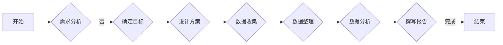
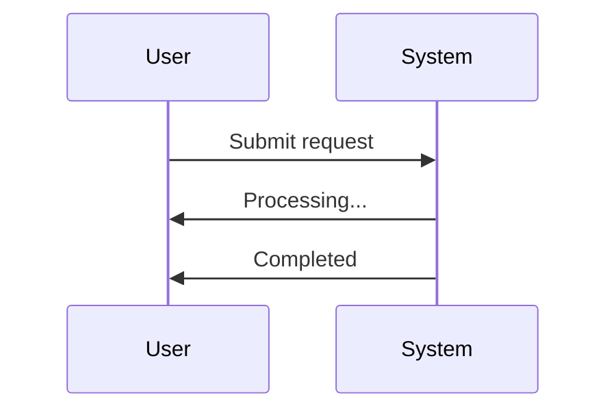
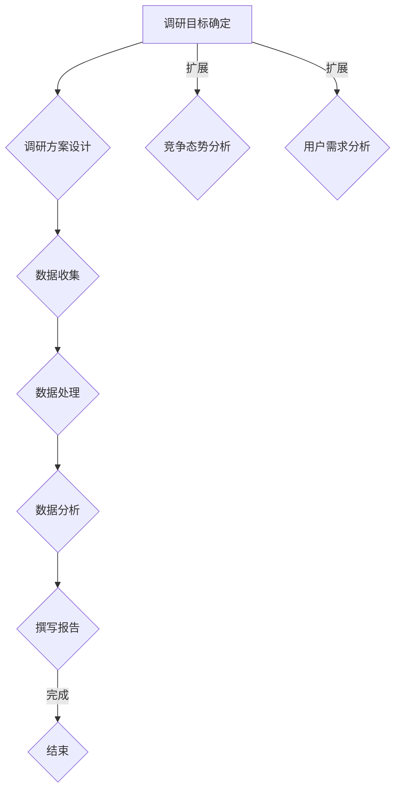

                 

### 文章标题：一人公司如何进行有效的市场调研

关键词：市场调研、一人公司、需求分析、竞争对手、营销策略、数据分析

摘要：在竞争激烈的市场环境中，即使是单人公司也需要通过有效的市场调研来确保自身在市场中立于不败之地。本文将深入探讨一人公司在市场调研中的独特挑战与应对策略，从基础概念到实战应用，全面解析市场调研的各个环节，帮助单人公司制定出切实可行的市场调研计划，从而在市场中找到自己的立足点并实现持续成长。

---

#### 引言

市场调研是企业了解市场需求、评估竞争态势、制定战略决策的重要手段。对一人公司而言，市场调研更具有特殊的重要性，因为它们通常资源有限，无法像大公司那样投入大量人力物力进行市场研究。因此，如何利用有限的资源进行高效的市场调研，成为了决定一人公司成败的关键。

市场调研的重要性不言而喻。它不仅可以帮助一人公司确定市场需求，发现潜在的商业机会，还能帮助企业识别竞争对手，避免盲目进入不利的市场环境。同时，通过市场调研，一人公司可以更好地了解目标客户的需求和行为习惯，从而制定出更加精准的营销策略。

然而，对于一人公司来说，市场调研面临着诸多挑战。首先，资源有限使得一人公司在调研过程中难以进行大规模的、全方位的市场调查。其次，时间也是一个重要的制约因素，一人公司通常需要兼顾研发、销售、运营等多个方面的工作，市场调研可能需要被排在一个相对次要的位置。此外，由于缺乏专业的市场调研团队，一人公司在数据收集、分析和解读方面可能面临更大的困难。

本书旨在解决一人公司进行市场调研的难题，通过系统性地介绍市场调研的基础知识、方法与技巧，以及实战应用案例，帮助一人公司实现高效的市场调研，从而在激烈的市场竞争中脱颖而出。

本文将分为以下几个部分：

1. **市场调研基础**：介绍市场调研的定义、分类、基本流程以及常用的调研方法和工具。
2. **市场需求分析**：讨论市场需求分析的重要性、步骤与方法，包括用户画像、需求挖掘和竞争对手分析。
3. **市场调研实战**：详细描述市场调研的实战步骤，包括制定调研计划、数据收集与处理、数据分析与解读以及调研报告的撰写。
4. **市场定位与营销策略**：探讨市场定位策略、市场细分以及营销策略的制定。
5. **持续市场调研**：强调市场环境变化监测、用户需求变化跟踪以及调研结果的应用与改进。
6. **市场调研工具与资源**：介绍常用的市场调研工具与资源，帮助一人公司选择适合的工具和资源进行市场调研。
7. **案例分析**：通过实际案例，展示市场调研的应用和效果，提供参考和启示。
8. **附录**：提供市场调研常用的公式、计算方法、模板以及相关技术术语的解释。

通过以上内容的系统讲解，本文旨在为一人公司提供一套完整、实用的市场调研指南，帮助其在市场中找到立足点，实现可持续发展。

### 第1章 市场调研的重要性

市场调研是企业了解市场动态、把握市场趋势、制定科学决策的关键环节。对于一人公司而言，市场调研的重要性更是不容忽视。首先，市场调研能够帮助企业准确识别市场需求，发现潜在的商业机会。在一人公司资源有限的情况下，精准的市场需求分析能够帮助公司集中有限资源，优先开发市场需求量大的产品或服务，避免资源浪费。

其次，市场调研有助于一人公司了解竞争对手的动态，识别自身在市场中的位置和优劣势。通过分析竞争对手的产品、市场策略、用户反馈等信息，一人公司可以找到自身与竞争对手的差距，从而制定出有针对性的改进措施，提升市场竞争力。

另外，市场调研还能帮助一人公司更好地了解目标客户的需求和偏好。通过用户画像、需求挖掘等技术手段，公司可以深入了解客户的行为习惯、消费偏好等，从而制定出更加精准的营销策略。例如，在产品开发过程中，可以根据用户需求进行功能优化，提高产品满意度；在市场营销过程中，可以根据客户偏好选择合适的推广渠道和策略，提升营销效果。

市场调研的重要性还体现在其对战略决策的支持上。通过对市场趋势、竞争对手、用户需求等方面的全面分析，一人公司可以更准确地制定发展战略和业务计划，避免盲目跟风和资源浪费。例如，在产品开发阶段，可以通过市场调研确定产品方向和功能需求，确保产品符合市场预期；在市场推广阶段，可以通过市场调研评估不同营销策略的效果，优化推广策略，提高市场占有率。

总之，市场调研对于一人公司来说不仅是一种工具，更是一种思维方式。通过系统、科学的市场调研，一人公司可以更好地把握市场机会，规避风险，实现可持续发展。在接下来的章节中，我们将进一步探讨市场调研的具体方法和实践技巧，帮助一人公司实现高效的市场调研。

#### 第2章 市场调研基础

市场调研是企业在进行市场活动前的一项基础工作，它涉及对市场环境、市场需求、竞争态势等多方面的深入分析。理解市场调研的定义、分类、基本流程以及常用的调研方法和工具，是进行有效市场调研的前提。

##### 2.1 市场调研的定义与分类

**定义**：市场调研是指通过科学的方法和手段，系统性地收集、整理和分析与市场相关的信息，以便为企业的市场决策提供依据。市场调研不仅仅是对数据的简单收集，更包括对数据的分析、解读和利用。

**分类**：市场调研可以根据不同的标准进行分类。以下是几种常见的分类方法：

- **按调研对象分类**：市场调研可以分为宏观市场调研和微观市场调研。宏观市场调研关注市场总体情况，如市场规模、市场趋势等；微观市场调研则侧重于具体市场细分，如某个产品或服务的市场需求分析。

- **按调研目的分类**：市场调研可以分为探索性调研、描述性调研和因果性调研。探索性调研主要用于初步了解市场情况，确定调研方向；描述性调研则是对市场现状进行详细描述，如用户行为、市场占有率等；因果性调研旨在探讨变量之间的因果关系，如市场需求与产品价格之间的关系。

- **按调研方法分类**：市场调研可以分为定量调研和定性调研。定量调研通过数据统计和分析，获得定量结论；定性调研则通过深度访谈、小组讨论等方式，获得定性结论。

##### 2.2 市场调研的基本流程

市场调研的基本流程可以分为以下几个阶段：

1. **确定调研目标**：这是市场调研的起点。调研目标应明确、具体，有助于后续调研工作的开展。

2. **设计调研方案**：在明确调研目标后，设计具体的调研方案，包括选择调研方法、确定调研对象、制定调研问卷等。

3. **数据收集**：根据调研方案，通过问卷调查、访谈、观察等方式，收集市场信息。

4. **数据整理与分析**：对收集到的数据进行整理、清洗和统计分析，提取有用信息。

5. **撰写调研报告**：根据分析结果，撰写调研报告，为决策提供依据。

##### 2.3 市场调研的方法与工具

**定量调研方法**：

- **问卷调查**：通过设计问卷，收集大量样本的定量数据，是最常用的定量调研方法之一。
- **实验法**：通过控制变量，观察不同处理条件下的市场反应，以了解变量之间的因果关系。
- **统计分析法**：利用统计学方法，对收集到的数据进行处理和分析，以提取有用的信息。

**定性调研方法**：

- **深度访谈**：通过与受访者进行面对面的深入交流，获取对市场现象的深入理解。
- **小组讨论**：组织一组具有相关背景的受访者，进行集体讨论，获取多角度的观点。
- **观察法**：通过直接观察市场行为或用户行为，获取第一手资料。

**市场调研工具**：

- **在线调研工具**：如问卷星、腾讯问卷等，方便快速地设计和分发问卷。
- **数据分析工具**：如SPSS、R、Python等，用于对收集到的数据进行分析和处理。
- **社交媒体分析工具**：如微博、微信、抖音等，用于分析用户行为和市场需求。

通过以上对市场调研基础知识的介绍，我们可以看出，市场调研是一项系统性和科学性的工作。无论是单人公司还是大型企业，理解和掌握市场调研的基本概念和方法，都是成功进行市场调研的前提。在接下来的章节中，我们将进一步探讨市场需求分析、市场调研实战等具体内容，帮助一人公司更好地进行市场调研。

#### 第3章 市场需求分析

市场需求分析是市场调研的核心环节之一，对于一人公司来说尤为重要。通过深入分析市场需求，一人公司可以明确目标客户群体的需求，从而制定出精准的产品策略和营销策略。

##### 3.1 需求分析的重要性

市场需求分析的重要性体现在以下几个方面：

1. **指导产品开发**：通过市场需求分析，一人公司可以了解客户对产品功能、性能、价格等方面的期望，从而在产品开发过程中进行有针对性的调整，确保产品符合市场需求。

2. **优化资源配置**：市场需求分析有助于一人公司合理配置资源，避免因市场需求不足而导致资源浪费。例如，在确定市场需求较大的产品或服务后，公司可以优先投入资源进行开发和推广。

3. **制定营销策略**：了解市场需求可以帮助一人公司制定出更加精准的营销策略，提高营销效果。例如，通过分析市场需求，公司可以选择合适的营销渠道和推广方式，提高市场占有率。

4. **提升客户满意度**：通过深入分析客户需求，一人公司可以更好地满足客户期望，提高客户满意度。例如，通过改进产品功能和用户体验，提升客户对产品的认可度和忠诚度。

##### 3.2 需求分析的步骤与方法

需求分析通常包括以下几个步骤：

1. **确定分析目标**：明确需求分析的具体目标，例如了解某个产品或服务的市场需求、用户行为等。

2. **收集需求信息**：通过问卷调查、深度访谈、用户反馈等方式，收集与需求相关的信息。

3. **整理与分析信息**：对收集到的信息进行整理、分类和分析，提取有价值的信息。

4. **绘制用户画像**：基于收集到的信息，绘制用户画像，包括用户的基本属性、需求特征、行为习惯等。

5. **确定需求优先级**：根据用户画像和市场需求，确定需求的优先级，以便有针对性地进行产品开发和营销策略制定。

需求分析的方法包括定量分析和定性分析：

- **定量分析**：通过数据统计和分析，对市场需求进行量化分析。例如，通过调查问卷收集的数据，可以计算出不同用户群体的需求分布和需求强度。

- **定性分析**：通过深度访谈、小组讨论等方式，对市场需求进行定性分析。例如，通过访谈了解用户对产品功能的期望和意见，从而发现潜在需求。

##### 3.3 用户画像与需求挖掘

用户画像是指对目标用户的特征进行综合描述，包括用户的年龄、性别、教育背景、职业、兴趣爱好、购买行为等。通过用户画像，一人公司可以更加精准地了解目标客户群体的特征和需求。

需求挖掘是指通过数据分析和用户画像，发现用户的需求和行为模式。需求挖掘的方法包括以下几种：

1. **数据挖掘技术**：利用数据挖掘算法，如关联规则挖掘、分类算法、聚类算法等，分析用户行为数据，发现用户的需求规律。

2. **文本分析技术**：通过对用户反馈、评论等文本数据的分析，提取用户的关键需求和意见。

3. **问卷调查**：通过设计问卷，收集用户的需求信息，进行定量分析。

4. **深度访谈**：通过与用户进行面对面的深度交流，获取用户对产品和服务的详细需求。

##### 3.4 竞争对手分析

竞争对手分析是市场需求分析的重要组成部分，通过分析竞争对手的产品、市场策略、用户反馈等信息，一人公司可以找到自身的优劣势，从而制定出有针对性的市场策略。

竞争对手分析的方法包括：

1. **产品分析**：对比分析竞争对手的产品功能、性能、价格等，了解竞争对手在产品方面的优势和不足。

2. **市场策略分析**：分析竞争对手的市场定位、营销策略、推广渠道等，了解竞争对手在市场运营方面的方法和手段。

3. **用户反馈分析**：通过用户反馈、评论等渠道，了解用户对竞争对手产品的评价和意见，发现竞争对手的用户群体和需求。

通过以上对市场需求分析的内容介绍，我们可以看出，市场需求分析不仅需要从定量和定性两个角度进行，还需要结合用户画像和竞争对手分析，从而全面、深入地了解市场需求。在接下来的章节中，我们将进一步探讨市场调研的实战步骤，帮助一人公司实现高效的市场调研。

#### 第4章 市场调研实战

市场调研不仅是理论上的分析，更需要在实际操作中灵活运用各种方法与工具，从而获取准确、有效的市场信息。本章将详细描述市场调研的实战步骤，包括调研计划的制定、数据收集与处理、数据分析与解读以及调研报告的撰写。

##### 4.1 制定市场调研计划

**确定调研目标**：首先，明确市场调研的具体目标。这些目标可以是了解市场需求、评估竞争态势、确定用户画像等。确保调研目标具体、明确，有助于后续的调研工作。

**选择调研方法**：根据调研目标，选择合适的调研方法。常见的调研方法有问卷调查、深度访谈、小组讨论、观察法等。例如，如果要了解用户对某款产品的需求，可以选择问卷调查和小组讨论相结合的方法。

**确定调研对象**：明确调研的对象，包括样本数量、样本特征等。例如，如果要了解某城市居民对健康饮食的需求，可以选择随机抽样，确保样本的代表性和多样性。

**制定调研问卷**：如果选择问卷调查，需要设计详细的调研问卷。问卷应包括开放性和封闭性题目，涵盖调研的各个方面。设计问卷时，要注意题目的清晰性和逻辑性，避免产生误导性或模糊性的问题。

**分配资源与时间**：根据调研目标和任务，合理分配资源（如人力、物力、财力）和时间，确保调研工作的顺利进行。

##### 4.2 数据收集与处理

**数据收集工具与渠道**：

- **在线调研工具**：使用问卷星、腾讯问卷等在线调研工具，可以方便地设计和分发问卷，快速收集大量数据。
- **社交媒体**：利用社交媒体平台（如微博、微信、抖音等）进行调研，可以通过发布调查问卷或进行在线访谈，获取用户的反馈和意见。
- **专业调查公司**：如果资源允许，可以委托专业调查公司进行调研，确保数据的可靠性和准确性。

**数据收集注意事项**：

- 确保样本的随机性和代表性，避免样本偏差。
- 保持数据收集过程的公正性和透明度，确保数据的真实性。
- 收集数据时，应注意保护受访者的隐私。

**数据处理与清洗**：

- **数据整理**：将收集到的数据进行整理和分类，确保数据的整洁和条理性。
- **数据清洗**：处理数据中的缺失值、异常值等，确保数据的质量。可以使用Python、R等编程语言中的数据清洗工具，如Pandas、NumPy等。

##### 4.3 数据分析与解读

**数据分析方法**：

- **定量分析方法**：使用统计学方法对定量数据进行处理和分析，如描述性统计分析、回归分析、聚类分析等。例如，可以使用Python中的Scikit-learn库进行回归分析和聚类分析。
- **定性分析方法**：使用文本分析、内容分析等方法对定性数据进行解读，如主题分析、词频分析等。例如，可以使用Python中的NLTK库进行文本分析。

**数据解读技巧**：

- **可视化分析**：使用图表、图形等可视化工具，展示数据分析结果，使结果更加直观易懂。可以使用Python中的Matplotlib、Seaborn等库进行数据可视化。
- **交叉分析**：通过交叉分析，了解不同变量之间的关系。例如，可以分析不同年龄段用户对某产品的需求差异。
- **趋势预测**：基于历史数据，预测未来市场趋势。例如，可以使用时间序列分析方法，预测未来某一时间段的市场需求。

##### 4.4 调研报告撰写

**报告结构**：

- **封面**：包括报告标题、报告日期、报告人等信息。
- **摘要**：简明扼要地总结调研目标、方法和主要发现。
- **引言**：介绍调研背景、目的和重要性。
- **方法**：详细描述调研方法、数据收集和处理过程。
- **结果**：展示数据分析结果，包括定量分析和定性分析的结果。
- **讨论**：对数据分析结果进行解读，讨论发现的意义和影响。
- **结论**：总结调研结果，提出建议和改进措施。
- **参考文献**：列出调研过程中引用的文献和资料。

**撰写技巧**：

- 保持报告结构的清晰和逻辑性，使读者易于理解。
- 使用图表和图形直观展示数据，提高报告的可读性。
- 在讨论部分，结合实际案例和理论分析，深入解读数据分析结果。
- 在结论和建议部分，提出具体的、可操作的改进措施，为决策提供依据。

通过以上市场调研实战步骤的详细描述，一人公司可以系统地进行市场调研，获取准确、有效的市场信息，从而制定出科学、合理的市场策略。

### 第5章 市场定位与营销策略

市场定位和营销策略是市场调研结果的具体应用，对一人公司的成功至关重要。通过准确的市场定位和有效的营销策略，一人公司可以在竞争激烈的市场中找到自己的立足点，吸引并留住目标客户。

#### 5.1 市场定位策略

市场定位是指企业根据自身的资源、能力和市场需求，确定自己在市场中的位置，从而在客户心中塑造独特的品牌形象。对于一人公司来说，市场定位尤为重要，因为资源有限，需要集中力量在最有潜力的市场细分中取得成功。

**市场定位步骤**：

1. **明确目标市场**：根据市场调研结果，确定目标市场和目标客户。例如，如果调研显示某特定年龄段、特定地域的用户对健康食品有强烈需求，那么公司可以将其作为目标市场。

2. **分析竞争对手**：了解竞争对手的市场定位和策略，找到自身的差异化优势。例如，如果竞争对手主要聚焦于高端市场，而调研显示有大量中端市场的需求，那么一人公司可以将自己定位为中端市场。

3. **确定差异化优势**：根据自身的产品特性、服务优势等，明确差异化优势。例如，如果公司开发了一款功能独特、价格亲民的产品，可以将此作为差异化优势。

4. **品牌传播**：通过广告、社交媒体、公关活动等手段，传播品牌形象和定位信息，使目标客户认识到公司的独特价值。

**市场定位技巧**：

- **聚焦细分市场**：专注于有潜力的细分市场，避免过于分散资源。
- **突出差异化**：明确自身的差异化优势，使其成为吸引客户的关键点。
- **持续优化**：根据市场反馈，不断调整市场定位策略，以适应市场变化。

#### 5.2 市场细分

市场细分是将整个市场划分为若干个具有相似需求特征的小市场，以便公司有针对性地进行营销。对于一人公司，合理的市场细分可以帮助其更有效地利用资源，提高市场竞争力。

**市场细分步骤**：

1. **识别细分因素**：根据用户的不同特征（如年龄、性别、收入、地理位置等），识别细分市场的因素。

2. **划分市场细分**：根据细分因素，将市场划分为多个细分市场。例如，可以根据年龄段将市场细分为青少年市场、中年市场和老年市场。

3. **评估细分市场**：分析每个细分市场的规模、增长潜力、竞争态势等，评估其对企业利润的贡献。

4. **选择目标市场**：根据企业的资源能力和市场调研结果，选择一个或多个具有较高利润潜力的细分市场作为目标市场。

**市场细分策略**：

- **集中策略**：集中资源服务于一个或几个细分市场，实现市场占有率最大化。
- **差异化策略**：同时服务于多个细分市场，提供不同的产品或服务以满足不同细分市场的需求。
- **补缺策略**：专注于未被满足的细分市场，提供独特的产品或服务。

#### 5.3 营销策略制定

营销策略是企业为实现市场定位和销售目标而采取的一系列行动。有效的营销策略可以帮助一人公司在市场中取得竞争优势，吸引并留住客户。

**营销策略制定步骤**：

1. **确定营销目标**：根据市场定位和公司战略，明确营销目标。例如，增加品牌知名度、提高市场份额、增加销售额等。

2. **选择营销组合**：根据目标市场、产品特性等，选择合适的营销组合。营销组合包括产品策略、价格策略、渠道策略和促销策略。

   - **产品策略**：根据目标市场的需求，设计符合市场定位的产品或服务。例如，注重功能、性能、设计等。
   - **价格策略**：制定合理的产品价格，考虑成本、竞争对手定价、市场需求等因素。例如，采用差异化定价策略，针对不同细分市场设定不同价格。
   - **渠道策略**：选择合适的销售渠道，例如线上渠道（电商平台、社交媒体等）和线下渠道（实体店、批发市场等）。
   - **促销策略**：通过广告、促销活动、公关活动等手段，吸引客户并提高产品销量。例如，举办限时促销、开展品牌活动等。

3. **制定执行计划**：制定详细的执行计划，明确每个环节的具体任务、责任人、时间节点等。

4. **评估与调整**：执行营销策略后，定期评估效果，根据市场反馈和实际效果，及时调整策略。

**营销策略实施技巧**：

- **精准营销**：根据目标客户的需求和行为特征，实施有针对性的营销活动，提高营销效果。
- **创新营销**：结合新技术和新模式，创新营销手段，提高品牌吸引力和市场竞争力。
- **跨渠道整合**：将线上和线下渠道整合，实现营销资源的最大化利用，提高客户转化率。

通过以上对市场定位和营销策略的详细探讨，一人公司可以更好地制定和实施市场策略，在激烈的市场竞争中脱颖而出。在接下来的章节中，我们将进一步探讨如何进行持续市场调研，确保公司始终适应市场变化。

### 第6章 持续市场调研

市场环境是动态变化的，消费者需求和市场趋势也在不断演变。因此，一人公司需要通过持续市场调研，及时捕捉市场变化，调整战略和策略，以保持市场竞争力。

#### 6.1 市场环境变化监测

**市场环境变化的原因**：

- **技术进步**：新的技术不断出现，改变市场的竞争格局和消费者的需求。
- **经济因素**：宏观经济环境的变化，如经济增长、通货膨胀等，影响市场供需关系。
- **社会文化因素**：社会价值观、消费习惯的改变，影响消费者对产品和服务的需求。
- **政策法规**：政府政策法规的调整，影响市场运营和商业环境。

**监测方法**：

- **数据收集**：定期收集与市场相关的数据，如行业报告、市场调研数据、新闻报道等。
- **行业分析**：关注行业动态，分析竞争对手的市场策略和表现，了解行业趋势。
- **用户反馈**：通过社交媒体、客户反馈等渠道，收集用户对产品和服务的反馈，了解用户需求的变化。

#### 6.2 用户需求变化跟踪

**用户需求变化的原因**：

- **消费习惯**：随着时间推移，消费者的购买习惯和偏好可能发生变化。
- **技术创新**：新技术的应用，如人工智能、大数据等，改变了产品和服务的供给方式。
- **市场环境**：市场环境的变化，如经济形势、政策调整等，影响用户需求。

**跟踪方法**：

- **用户调研**：定期进行用户调研，了解用户的需求变化和偏好。
- **用户行为分析**：通过数据分析，跟踪用户的行为变化，如购买频率、购买渠道、购买产品类别等。
- **市场反馈**：收集市场反馈，了解用户对产品和服务的评价，识别需求变化。

#### 6.3 调研结果应用与改进

**调研结果的应用**：

- **产品改进**：根据用户需求的变化，优化产品功能和设计，提高用户满意度。
- **市场策略调整**：根据市场环境的变化，调整市场定位和营销策略，以适应市场变化。
- **业务优化**：通过分析业务数据，优化业务流程和运营模式，提高运营效率。

**改进措施**：

- **定期评估**：定期对市场调研结果进行评估，确保调研数据的准确性和有效性。
- **持续优化**：根据市场反馈和用户需求，持续优化产品和服务，保持竞争力。
- **创新驱动**：鼓励创新，通过新技术和商业模式，开拓新的市场机会。

通过持续市场调研，一人公司可以及时了解市场变化和用户需求，调整战略和策略，确保在激烈的市场竞争中立于不败之地。

### 第7章 市场调研工具与资源

在市场调研过程中，选择合适的工具和资源是确保调研效果的重要环节。一人公司由于资源有限，更需要高效利用现有工具和资源。以下将介绍一些常用的市场调研工具和资源，包括在线调研工具、社交媒体分析工具和调研资源库。

#### 7.1 市场调研工具概述

**在线调研工具**：

- **问卷星**：提供在线问卷设计、分发和数据分析功能，用户界面友好，操作简便。
- **腾讯问卷**：功能全面，支持多种题型，数据分析和报告生成方便。
- **Typeform**：以用户友好和交互性强的问卷设计而著称，适合创建互动性强的调研问卷。
- **SurveyMonkey**：提供专业的在线调研解决方案，适合大型调研项目。

**社交媒体分析工具**：

- **Social Blade**：分析社交媒体账号的粉丝增长、互动等数据，帮助了解用户行为。
- **Brandwatch**：强大的社交媒体分析工具，支持关键词追踪、情感分析等。
- **Hootsuite**：社交媒体管理工具，支持内容发布、分析和管理。
- **Sprout Social**：提供全面的社交媒体分析和管理功能，帮助优化社交媒体策略。

**数据分析工具**：

- **Python**：支持多种数据分析库，如Pandas、NumPy、Scikit-learn，适合复杂的数据处理和分析。
- **R**：统计学软件，适合进行高级的数据分析和可视化。
- **Tableau**：数据可视化工具，帮助创建直观的数据报告和图表。
- **Power BI**：微软推出的商业智能工具，支持数据集成、分析和报告生成。

#### 7.2 在线调研工具

**问卷设计**：

- **题库创建**：使用问卷工具的题库功能，创建多样化的问卷题目，如单选题、多选题、评分题、开放性问题等。
- **自定义样式**：自定义问卷的样式，包括字体、颜色、布局等，提升问卷的吸引力。
- **逻辑跳转**：设置逻辑跳转，根据受访者的回答自动跳转到不同的问题，提高问卷的针对性。

**问卷分发**：

- **在线收集**：通过链接、二维码等方式，在线收集问卷数据，方便快捷。
- **社交媒体推广**：利用社交媒体平台推广问卷，吸引更多受访者参与。
- **邮件邀请**：通过电子邮件邀请目标人群参与问卷，确保样本的代表性和多样性。

**数据分析**：

- **结果统计**：自动生成结果统计图表，如柱状图、饼图、趋势图等，直观展示分析结果。
- **交叉分析**：进行交叉分析，了解不同变量之间的关系，如用户年龄与购买行为的关系。
- **报告生成**：自动生成详细的调研报告，包括数据分析结果、结论和建议等。

#### 7.3 社交媒体数据分析工具

**数据分析功能**：

- **数据收集**：从社交媒体平台上收集用户发布的内容、评论、互动数据等。
- **关键词追踪**：追踪特定关键词在社交媒体上的趋势和分布，了解市场热点和用户关注点。
- **情感分析**：分析用户对品牌、产品或服务的情感倾向，了解用户满意度和忠诚度。

**应用场景**：

- **市场趋势分析**：通过社交媒体数据分析，了解市场趋势和消费者需求，为市场定位和产品开发提供参考。
- **竞争对手分析**：通过对比分析，了解竞争对手在社交媒体上的表现和策略，发现自身的优劣势。
- **营销效果评估**：评估营销活动的效果，如广告投放、品牌推广等，调整营销策略。

#### 7.4 市场调研资源库

**资源库功能**：

- **数据存储**：集中存储各类市场调研数据，包括问卷数据、用户反馈、社交媒体数据等。
- **资源共享**：支持团队成员之间的数据共享和协作，提高工作效率。
- **数据分析**：提供数据分析和可视化工具，方便对数据进行处理和分析。

**应用场景**：

- **历史数据查询**：方便团队成员查询历史调研数据，进行数据对比和分析。
- **数据分析报告**：生成详细的数据分析报告，为决策提供依据。
- **知识管理**：积累市场调研的经验和知识，为后续调研提供参考。

通过以上对市场调研工具与资源的介绍，一人公司可以更有效地进行市场调研，获取准确、全面的市场信息，从而制定出科学合理的市场策略。

### 第8章 案例分析

为了更好地理解市场调研的实际应用和效果，下面我们将通过两个单人公司的市场调研案例，详细分析其调研过程、成果以及应用效果。

#### 8.1 某单人公司市场调研案例分析

**公司背景**：某单人公司专注于智能穿戴设备研发，产品包括智能手表、健康监测手环等。公司创始人是一位拥有丰富技术背景的程序员，希望通过市场调研确定产品方向和营销策略。

**调研过程**：

1. **确定调研目标**：了解智能穿戴设备市场需求，确定目标客户群体，评估竞争对手产品。

2. **设计调研方案**：选择问卷调查和社交媒体数据分析相结合的方法。通过在线问卷了解潜在用户的需求和偏好，通过社交媒体数据分析了解市场趋势和消费者行为。

3. **数据收集**：设计详细的问卷，通过社交媒体平台发布，邀请目标用户参与。同时，利用社交媒体分析工具收集相关数据。

4. **数据分析**：对问卷数据进行定量分析，结合社交媒体数据分析结果，绘制用户画像，确定市场需求。

5. **撰写调研报告**：总结调研结果，撰写详细的调研报告，为公司产品开发和营销策略提供依据。

**调研成果与应用效果**：

- **市场需求明确**：调研结果显示，年轻用户（20-35岁）对智能穿戴设备的需求较高，特别是健康监测功能。公司据此调整产品开发方向，增加健康监测功能，满足市场需求。

- **市场定位优化**：通过竞争对手分析，发现竞争对手主要聚焦于高端市场，而中端市场仍有较大潜力。公司将其市场定位调整为中端市场，推出价格合理的智能穿戴设备。

- **营销策略调整**：根据用户画像和市场需求，调整营销策略，通过社交媒体和线上渠道进行推广，提高品牌知名度和市场份额。

- **产品优化**：根据用户反馈，对产品进行优化，提高用户体验，增加用户忠诚度。

**总结**：通过系统的市场调研，该单人公司明确了市场需求和竞争态势，优化了产品开发和营销策略，取得了显著的市场效果。

#### 8.2 某单人公司市场调研成果应用案例分析

**公司背景**：某单人公司是一家专注于定制化礼品设计的初创公司，创始人是一位具有丰富创意和设计能力的自由职业者。公司希望通过市场调研确定产品定位和营销策略，以拓展市场份额。

**调研过程**：

1. **确定调研目标**：了解礼品市场现状，确定目标客户群体，评估竞争对手的产品和服务。

2. **设计调研方案**：采用深度访谈和问卷调查相结合的方法。通过与潜在客户进行深度访谈，了解他们的需求和偏好；通过在线问卷收集更多数据。

3. **数据收集**：通过社交媒体平台发布问卷调查，邀请目标客户参与。同时，与设计师社区和礼品行业内的专家进行访谈，获取专业意见。

4. **数据分析**：对问卷数据进行定量分析，结合访谈结果，绘制用户画像，分析市场需求。

5. **撰写调研报告**：总结调研结果，撰写详细的调研报告，为公司产品定位和营销策略提供依据。

**调研成果与应用效果**：

- **产品定位明确**：调研结果显示，个性化、创意礼品市场潜力巨大，特别是针对年轻一代的客户群体。公司据此确定产品定位，专注于提供个性化、创意礼品设计。

- **市场细分优化**：通过调研，发现礼品市场可以细分为商务礼品、节日礼品、个性化定制等多个细分市场。公司根据调研结果，针对不同细分市场设计不同的产品线，满足多样化需求。

- **营销策略调整**：根据用户画像和市场需求，调整营销策略，通过社交媒体和线上渠道进行推广，同时与设计师社区合作，提高品牌影响力。

- **用户体验提升**：根据用户反馈，优化产品设计和服务流程，提升用户体验，增加用户满意度。

**总结**：通过有效的市场调研，该单人公司明确了产品定位和市场细分，优化了营销策略和用户体验，实现了市场拓展和业务增长。

通过以上两个案例的分析，我们可以看到，市场调研在单人公司中起到了至关重要的作用。通过系统的调研过程，单人公司可以准确了解市场需求和竞争态势，优化产品开发和营销策略，从而在激烈的市场竞争中脱颖而出。

### 附录

#### 附录 A：市场调研常用公式与计算方法

市场调研中，常会用到一些统计和数据分析的公式与方法。以下是一些常用的公式及其应用场景：

1. **样本量计算**：
   $$ n = \frac{Z^2 \cdot p \cdot (1 - p)}{E^2} $$
   其中，\( n \) 为样本量，\( Z \) 为置信水平对应的Z值，\( p \) 为预期比例，\( E \) 为容许误差。

2. **百分比计算**：
   $$ \text{百分比} = \frac{\text{部分数量}}{\text{总数}} \times 100\% $$
   用于计算市场占有率、用户满意度等比例指标。

3. **均值计算**：
   $$ \bar{x} = \frac{\sum_{i=1}^{n} x_i}{n} $$
   其中，\( \bar{x} \) 为样本均值，\( x_i \) 为各个样本值，\( n \) 为样本数量。

4. **方差计算**：
   $$ \sigma^2 = \frac{\sum_{i=1}^{n} (x_i - \bar{x})^2}{n - 1} $$
   其中，\( \sigma^2 \) 为样本方差，\( x_i \) 为各个样本值，\( \bar{x} \) 为样本均值。

5. **标准差计算**：
   $$ \sigma = \sqrt{\sigma^2} $$
   其中，\( \sigma \) 为样本标准差。

6. **相关系数计算**：
   $$ r = \frac{\sum_{i=1}^{n} (x_i - \bar{x})(y_i - \bar{y})}{\sqrt{\sum_{i=1}^{n} (x_i - \bar{x})^2} \cdot \sqrt{\sum_{i=1}^{n} (y_i - \bar{y})^2}} $$
   其中，\( r \) 为皮尔逊相关系数，用于衡量两个变量之间的线性相关性。

7. **线性回归模型**：
   $$ y = \beta_0 + \beta_1 x + \epsilon $$
   其中，\( y \) 为因变量，\( x \) 为自变量，\( \beta_0 \) 为截距，\( \beta_1 \) 为斜率，\( \epsilon \) 为误差项。

8. **聚类分析**：
   - **距离计算**：如欧氏距离、曼哈顿距离等。
   - **聚类算法**：如K-means聚类、层次聚类等。

9. **假设检验**：
   - **t检验**：用于比较两组数据的均值差异。
   - **方差分析（ANOVA）**：用于比较多个样本均值差异。

这些公式和方法在市场调研中具有重要的应用价值，帮助一人公司进行数据分析和决策支持。

#### 附录 B：市场调研报告模板

市场调研报告的撰写需要清晰的结构和逻辑，以下提供一个基本的报告模板：

1. **封面**：
   - 报告标题
   - 报告日期
   - 报告编制者

2. **摘要**：
   - 报告的主要内容总结
   - 调研目标和目的
   - 主要发现和结论

3. **引言**：
   - 调研背景和意义
   - 研究问题和假设
   - 研究方法和数据来源

4. **方法**：
   - 调研设计和样本选择
   - 调研工具和问卷设计
   - 数据收集过程

5. **结果**：
   - 定量分析结果（图表、统计数据）
   - 定性分析结果（访谈记录、用户反馈）
   - 用户画像和需求分析

6. **讨论**：
   - 调研结果解读
   - 市场趋势和竞争态势分析
   - 发现的意义和影响

7. **结论**：
   - 主要发现总结
   - 对未来发展的建议和策略
   - 研究局限性和未来研究方向

8. **参考文献**：
   - 列出报告中引用的所有文献和资料

9. **附录**：
   - 调研问卷
   - 数据分析代码和工具
   - 补充材料

通过上述模板，一人公司可以系统、清晰地撰写市场调研报告，为决策提供有力支持。

### 附加内容

#### 第9章 市场调研中的Mermaid流程图示例

Mermaid是一种方便快捷的Markdown图形绘制工具，适用于绘制流程图、UML图、时序图等。以下是一个市场调研流程图的示例，并附有基本语法说明。

##### 9.1 Mermaid流程图基本语法

**流程图语法**：


**时序图语法**：


**UML类图语法**：
```mermaid
classDiagram
 Class01 <|-- Class02
 Class03 --|=> Class04
 Class05 : +int x
 Class06 : +String name
```

##### 9.2 市场调研流程图绘制示例

以下是一个市场调研流程图的Mermaid语法示例：



这段代码将生成一个简单的市场调研流程图，包括调研目标确定、方案设计、数据收集、处理、分析以及撰写报告等步骤，同时提供了扩展环节，如竞争态势分析和用户需求分析。

#### 第10章 市场调研核心算法原理讲解与伪代码

市场调研中，数据分析是关键环节。以下将介绍几个核心算法原理，包括用户画像算法、用户行为分析算法和数据分析算法，并使用伪代码进行详细阐述。

##### 10.1 用户画像算法原理

用户画像是对用户特征的综合描述，通过分析用户的数据，提取其属性和行为特征，用于精准营销和个性化推荐。

**算法原理**：

- 数据收集：收集用户的基本信息（如年龄、性别、地理位置）和行为数据（如购买记录、浏览行为）。
- 数据清洗：处理缺失值、异常值，确保数据质量。
- 特征提取：从数据中提取关键特征，如用户年龄、购买频次、浏览时长等。
- 聚类分析：对用户进行分类，形成用户群体画像。

**伪代码**：

```pseudo
function 用户画像算法(用户数据):
    数据清洗(用户数据)
    特征提取(用户数据)
    聚类分析(用户特征)
    返回用户画像列表
```

##### 10.2 用户行为分析算法原理

用户行为分析旨在理解用户行为模式，预测用户行为，用于优化产品设计和提升用户体验。

**算法原理**：

- 数据收集：收集用户的点击行为、浏览行为、购买行为等数据。
- 数据预处理：处理数据缺失、异常值，进行时间序列分析。
- 关联规则挖掘：找出用户行为之间的关联性。
- 时序预测：使用机器学习模型预测用户未来的行为。

**伪代码**：

```pseudo
function 用户行为分析(用户行为数据):
    数据预处理(用户行为数据)
    关联规则挖掘(用户行为数据)
    时序预测(用户行为数据)
    返回用户行为模式
```

##### 10.2.1 伪代码示例

以下是一个简单的关联规则挖掘算法的伪代码示例：

```pseudo
function 关联规则挖掘(交易数据，支持度阈值，置信度阈值):
    创建候选集L1
    对于每个交易事务t：
        对于每个项集i ∈ t：
            如果支持度(i) >= 支持度阈值：
                将i加入候选集L1
        
    生成频繁项集Lk
    对于每个候选集i ∈ L1：
        计算i的支持度
        如果支持度(i) >= 支持度阈值：
            将i加入频繁项集Lk
        
    生成关联规则
    对于每个频繁项集i ∈ Lk：
        对于每个非空子集j ⊆ i：
            如果置信度(i, j) >= 置信度阈值：
                返回关联规则(i → j)
```

##### 10.3 数据分析算法原理

数据分析算法用于从大量数据中提取有价值的信息，支持决策和战略制定。

**算法原理**：

- 数据收集：收集多源数据，包括内部数据（如销售数据、库存数据）和外部数据（如市场趋势、竞争对手数据）。
- 数据预处理：处理数据缺失、异常值，进行数据整合。
- 数据分析：使用统计方法（如回归分析、聚类分析）和机器学习算法（如分类、预测）进行分析。
- 可视化分析：将分析结果可视化，支持决策。

**伪代码**：

```pseudo
function 数据分析(数据集):
    数据预处理(数据集)
    回归分析(数据集)
    聚类分析(数据集)
    预测分析(数据集)
    可视化分析(分析结果)
    返回分析报告
```

##### 10.3.1 伪代码示例

以下是一个简单的线性回归分析的伪代码示例：

```pseudo
function 线性回归分析(数据集):
    X = 数据集的特征变量
    Y = 数据集的目标变量
    
    求X的均值μX和标准差σX
    求Y的均值μY和标准差σY
    
    求X和Y的协方差矩阵Cov(X, Y)
    求X的协方差矩阵Cov(X, X)
    
    计算回归系数β：
    β = (Cov(X, Y) * Cov(X, X))^(-1) * Cov(X, Y) * Y
    
    返回回归系数β
```

通过以上算法原理和伪代码示例，我们可以更好地理解市场调研中的数据分析过程，为一人公司提供科学的数据驱动决策支持。

#### 第11章 市场调研中的数学模型与公式解析

在市场调研过程中，数学模型和公式是分析和解读数据的重要工具。以下将详细介绍几个常用的数学模型和公式，包括相关性分析公式、回归分析模型和聚类分析公式。

##### 11.1 相关性分析公式

相关性分析用于衡量两个变量之间的线性关系强度和方向。最常用的相关性分析方法是皮尔逊相关系数（Pearson Correlation Coefficient）。

**公式**：

$$ r = \frac{\sum_{i=1}^{n} (x_i - \bar{x})(y_i - \bar{y})}{\sqrt{\sum_{i=1}^{n} (x_i - \bar{x})^2} \cdot \sqrt{\sum_{i=1}^{n} (y_i - \bar{y})^2}} $$

其中，\( r \) 为皮尔逊相关系数，\( x_i \) 和 \( y_i \) 为第 \( i \) 个样本的 \( x \) 和 \( y \) 值，\( \bar{x} \) 和 \( \bar{y} \) 为 \( x \) 和 \( y \) 的平均值，\( n \) 为样本数量。

**示例**：

假设有两个变量 \( x \)（销售额）和 \( y \)（广告支出），我们有以下数据：

| \( x \)（万元） | \( y \)（万元） |
| :-------------: | :-------------: |
|      10         |       5         |
|      20         |      10         |
|      30         |      15         |
|      40         |      20         |
|      50         |      25         |

计算 \( x \) 和 \( y \) 的皮尔逊相关系数：

$$ \bar{x} = \frac{10 + 20 + 30 + 40 + 50}{5} = 30 $$
$$ \bar{y} = \frac{5 + 10 + 15 + 20 + 25}{5} = 15 $$

$$ r = \frac{(10-30)(5-15) + (20-30)(10-15) + (30-30)(15-15) + (40-30)(20-15) + (50-30)(25-15)}{\sqrt{(10-30)^2 + (20-30)^2 + (30-30)^2 + (40-30)^2 + (50-30)^2} \cdot \sqrt{(5-15)^2 + (10-15)^2 + (15-15)^2 + (20-15)^2 + (25-15)^2}} $$

$$ r = \frac{-150}{\sqrt{400} \cdot \sqrt{100}} = -1 $$

结果为 \( r = -1 \)，表示 \( x \) 和 \( y \) 之间存在完全负相关关系。

##### 11.2 回归分析模型

回归分析用于探讨自变量和因变量之间的关系，常见的回归模型包括线性回归和多元回归。

**线性回归模型**：

线性回归模型的基本形式为：

$$ y = \beta_0 + \beta_1 x + \epsilon $$

其中，\( y \) 为因变量，\( x \) 为自变量，\( \beta_0 \) 为截距，\( \beta_1 \) 为斜率，\( \epsilon \) 为误差项。

**公式推导**：

假设我们有 \( n \) 个样本点 \( (x_i, y_i) \)，我们要求解最佳拟合直线，使得误差平方和最小。误差平方和为：

$$ \sum_{i=1}^{n} (y_i - (\beta_0 + \beta_1 x_i))^2 $$

对 \( \beta_0 \) 和 \( \beta_1 \) 分别求偏导并令其为零，得到以下两个方程：

$$ \sum_{i=1}^{n} (y_i - \beta_0 - \beta_1 x_i) = 0 $$
$$ \sum_{i=1}^{n} (x_i y_i - \beta_0 x_i - \beta_1 x_i^2) = 0 $$

解这个方程组，得到线性回归的系数：

$$ \beta_0 = \bar{y} - \beta_1 \bar{x} $$
$$ \beta_1 = \frac{\sum_{i=1}^{n} (x_i - \bar{x})(y_i - \bar{y})}{\sum_{i=1}^{n} (x_i - \bar{x})^2} $$

**多元回归模型**：

多元回归模型扩展了线性回归，用于探讨多个自变量与因变量之间的关系。其形式为：

$$ y = \beta_0 + \beta_1 x_1 + \beta_2 x_2 + ... + \beta_n x_n + \epsilon $$

其中，\( x_1, x_2, ..., x_n \) 为多个自变量，\( \beta_0, \beta_1, \beta_2, ..., \beta_n \) 为各个自变量的系数。

多元回归的系数可以通过最小二乘法（Ordinary Least Squares, OLS）求解。求解过程与线性回归类似，需要求解以下方程组：

$$ X'X\beta = X'y $$

其中，\( X \) 为自变量的设计矩阵，\( y \) 为因变量向量，\( \beta \) 为系数向量。

##### 11.3 聚类分析公式

聚类分析用于将数据集划分为多个类别，常见的聚类算法包括K-means和层次聚类。

**K-means算法**：

K-means算法的目标是找到 \( K \) 个中心点，使得每个样本点到其最近的中心点的距离平方和最小。

**公式**：

初始化 \( K \) 个中心点 \( \mu_1, \mu_2, ..., \mu_K \)。

1. 对于每个样本点 \( x_i \)，计算其到各个中心点的距离 \( d(x_i, \mu_j) \)，并将 \( x_i \) 分配到距离最近的中心点所在的簇。

2. 更新每个中心点的位置，取其所在簇内所有样本点的均值。

3. 重复步骤1和步骤2，直至中心点的位置不再发生显著变化。

**公式推导**：

假设我们有 \( n \) 个样本点 \( x_1, x_2, ..., x_n \)，以及 \( K \) 个中心点 \( \mu_1, \mu_2, ..., \mu_K \)。每个样本点 \( x_i \) 被分配到最近的中心点 \( \mu_j \) 所在的簇。

簇内样本点的均值更新公式为：

$$ \mu_j = \frac{\sum_{i=1}^{n} I(x_i \in C_j) x_i}{\sum_{i=1}^{n} I(x_i \in C_j)} $$

其中，\( I(x_i \in C_j) \) 是指示函数，当 \( x_i \) 属于簇 \( C_j \) 时取值为1，否则为0。

**层次聚类算法**：

层次聚类算法通过逐步合并或分裂簇，形成层次结构。

**公式**：

1. 初始化：将每个样本点视为一个簇。

2. 合并或分裂：每次迭代中选择距离最近的两个簇进行合并或分裂，更新簇的中心点。

3. 重复迭代，直至达到预设的簇数量或满足停止条件。

**公式推导**：

假设当前有 \( K \) 个簇，其中心点分别为 \( \mu_1, \mu_2, ..., \mu_K \)。

每次迭代中选择距离最近的两个簇 \( C_j \) 和 \( C_k \) 进行合并，新的簇中心点计算公式为：

$$ \mu_{j+k} = \frac{N_j \mu_j + N_k \mu_k}{N_j + N_k} $$

其中，\( N_j \) 和 \( N_k \) 分别为簇 \( C_j \) 和 \( C_k \) 的样本数量。

通过以上对相关性分析公式、回归分析模型和聚类分析公式的详细解析，我们可以更好地理解市场调研中的数学模型，为数据分析提供理论支持。在市场调研过程中，合理运用这些数学模型，可以更准确地分析数据，为决策提供有力支持。

### 第12章 市场调研项目实战

为了更好地理解市场调研的实际操作流程，我们将通过一个虚构的市场调研项目进行详细讲解。本案例将展示如何从项目背景介绍、开发环境搭建、数据收集与处理、数据分析与解读、调研报告撰写到项目总结与反思的完整过程。

#### 12.1 项目背景介绍

某单人公司是一家专注于智能健康监测设备研发的公司，其最新产品是一款智能手环，具备心率监测、睡眠分析等功能。公司希望通过一次全面的市场调研，了解潜在用户的需求和偏好，评估产品在市场上的竞争力，为产品优化和营销策略制定提供数据支持。

**项目目标**：

1. 了解潜在用户对智能手环的需求和偏好。
2. 评估竞争对手的产品和市场策略。
3. 确定目标市场，为产品定位和营销策略提供依据。
4. 提高用户满意度和产品竞争力。

#### 12.2 开发环境搭建

为了确保市场调研项目的顺利进行，需要搭建一个合适的技术环境。以下为开发环境搭建的步骤：

1. **软件工具**：
   - **问卷设计工具**：选择问卷星，用于设计并分发在线问卷。
   - **数据分析工具**：选择Python，搭配Pandas、NumPy、Scikit-learn等库，用于数据处理和分析。
   - **数据可视化工具**：选择Matplotlib和Seaborn，用于生成图表和可视化结果。

2. **硬件环境**：
   - **计算机**：配置不低于中端的计算机，确保数据处理和分析的效率。
   - **网络环境**：稳定的宽带网络，确保数据传输的稳定性。

3. **软件安装**：
   - 在计算机上安装Python环境，包括必要的库（Pandas、NumPy、Scikit-learn、Matplotlib、Seaborn）。
   - 确保问卷星工具的正常使用，并进行账户设置和问卷设计。

#### 12.3 数据收集与处理

**数据收集**：

1. **问卷设计**：
   设计一份详细的在线问卷，涵盖用户基本信息、购买意愿、需求偏好、使用习惯等。确保问卷设计合理、题目清晰，以提高受访者的参与度和问卷质量。

2. **数据收集渠道**：
   - **社交媒体**：通过微信、微博等社交媒体平台发布问卷，邀请潜在用户参与。
   - **行业合作**：与行业内的其他公司或组织合作，通过他们的渠道分发问卷。
   - **电子邮件**：通过电子邮件邀请目标用户参与问卷。

3. **数据收集过程**：
   - 设置问卷的收集时间，确保在较短时间内获得足够的样本数据。
   - 定期检查问卷的进展情况，确保收集到足够的数据量。

**数据处理**：

1. **数据导入**：
   将收集到的问卷数据导入Python环境中，使用Pandas库进行数据导入和初步清洗。

2. **数据清洗**：
   - 填补缺失值：使用均值、中位数等方法填补缺失数据。
   - 去除异常值：通过统计分析方法，识别并去除明显的异常数据。
   - 数据转换：对数据进行适当的转换，如将分类变量转换为数值变量。

3. **数据整理**：
   对清洗后的数据进行整理和分类，形成便于分析的数据集。

#### 12.4 数据分析与解读

**数据分析**：

1. **描述性统计分析**：
   对用户的基本信息、购买意愿等指标进行描述性统计分析，如计算均值、中位数、标准差等。

2. **相关性分析**：
   使用皮尔逊相关系数，分析不同变量之间的相关性，了解用户行为与需求之间的关系。

3. **回归分析**：
   使用线性回归模型，分析用户行为与购买意愿之间的关系，找出影响购买意愿的关键因素。

4. **聚类分析**：
   使用K-means聚类算法，将用户划分为不同的群体，分析不同用户群体的特征和需求。

**数据解读**：

1. **用户需求分析**：
   根据数据分析结果，了解用户对智能手环的主要需求和偏好，如功能需求、价格敏感度等。

2. **竞争对手分析**：
   分析竞争对手的产品和市场策略，了解自身在市场上的优势和劣势。

3. **市场定位**：
   结合用户需求和竞争对手分析，确定目标市场和产品定位。

#### 12.5 调研报告撰写与分享

**报告撰写**：

1. **封面**：
   包括报告标题、报告日期、报告编制者等信息。

2. **摘要**：
   概括项目背景、方法和主要发现。

3. **引言**：
   介绍市场调研的目的和意义。

4. **方法**：
   详细描述调研方法、数据收集和处理过程。

5. **结果**：
   展示数据分析结果，包括描述性统计分析、相关性分析、回归分析和聚类分析的结果。

6. **讨论**：
   对数据分析结果进行解读，讨论发现的意义和影响。

7. **结论**：
   总结调研结果，提出建议和改进措施。

8. **参考文献**：
   列出调研过程中引用的文献和资料。

**报告分享**：

1. **内部分享**：
   在公司内部进行调研报告的分享，包括会议报告、PPT展示等，使团队成员了解调研结果。

2. **外部分享**：
   通过行业会议、研讨会等形式，将调研结果分享给行业内外，提升公司知名度。

#### 12.6 项目总结与反思

**项目总结**：

通过本次市场调研项目，公司成功了解了潜在用户的需求和偏好，确定了产品定位和市场策略。调研结果为公司产品优化和营销策略制定提供了有力的数据支持。

**反思**：

1. **问卷设计**：
   问卷设计应更加精细化，确保题目全面、准确，以提高数据质量。

2. **数据收集**：
   数据收集渠道应多样化，提高样本的代表性和多样性。

3. **数据分析**：
   分析方法应更加科学、合理，确保分析结果的准确性和可靠性。

4. **报告撰写**：
   报告撰写应注重逻辑性和可读性，使报告内容更加易懂、实用。

通过以上市场调研项目实战的详细讲解，一人公司可以更好地掌握市场调研的实际操作流程，为产品优化和营销策略制定提供有力支持。

### 附录

#### 附录 A：市场调研工具与资源列表

- **在线调研工具**：
  - **问卷星**：[https://www.wenjuanx.com/](https://www.wenjuanx.com/)
  - **腾讯问卷**：[https://www.tenxun.cn/](https://www.tenxun.cn/)
  - **Typeform**：[https://typeform.com/](https://typeform.com/)
  - **SurveyMonkey**：[https://www.surveymonkey.com/](https://www.surveymonkey.com/)

- **社交媒体分析工具**：
  - **Social Blade**：[https://socialblade.com/](https://socialblade.com/)
  - **Brandwatch**：[https://www.brandwatch.com/](https://www.brandwatch.com/)
  - **Hootsuite**：[https://hootsuite.com/](https://hootsuite.com/)
  - **Sprout Social**：[https://www.sproutsocial.com/](https://www.sproutsocial.com/)

- **数据分析工具**：
  - **Python**：[https://www.python.org/](https://www.python.org/)
  - **R**：[https://www.r-project.org/](https://www.r-project.org/)
  - **Tableau**：[https://www.tableau.com/](https://www.tableau.com/)
  - **Power BI**：[https://powerbi.microsoft.com/](https://powerbi.microsoft.com/)

- **数据可视化工具**：
  - **Matplotlib**：[https://matplotlib.org/](https://matplotlib.org/)
  - **Seaborn**：[https://seaborn.pydata.org/](https://seaborn.pydata.org/)
  - **Plotly**：[https://plotly.com/](https://plotly.com/)

- **调研资源库**：
  - **SurveyGizmo**：[https://www.surveygizmo.com/](https://www.surveygizmo.com/)
  - **Qualtrics**：[https://www.qualtrics.com/](https://www.qualtrics.com/)
  - **Survey Centre**：[https://www.surveycentre.eu/](https://www.surveycentre.eu/)

#### 附录 B：市场调研案例模板

**市场调研报告模板**：

1. **封面**：
   - 报告标题
   - 报告日期
   - 报告编制者

2. **摘要**：
   - 报告主要内容总结
   - 调研目标和目的
   - 主要发现和结论

3. **引言**：
   - 调研背景和意义
   - 研究问题和假设
   - 研究方法和数据来源

4. **方法**：
   - 调研设计和样本选择
   - 调研工具和问卷设计
   - 数据收集过程

5. **结果**：
   - 描述性统计分析
   - 相关性分析
   - 回归分析
   - 聚类分析

6. **讨论**：
   - 分析结果解读
   - 发现的意义和影响
   - 对未来发展的建议

7. **结论**：
   - 总结主要发现
   - 对未来工作的建议
   - 研究局限性和未来研究方向

8. **参考文献**：
   - 列出报告中引用的所有文献和资料

9. **附录**：
   - 调研问卷
   - 数据分析代码和工具
   - 补充材料

通过以上模板，一人公司可以系统地撰写市场调研报告，为决策提供有力支持。

### 文章末尾

作者：AI天才研究院/AI Genius Institute & 禅与计算机程序设计艺术 /Zen And The Art of Computer Programming

本文详细探讨了市场调研在单人公司中的重要性，通过系统的理论和实践方法，帮助单人公司进行高效的市场调研。市场调研不仅仅是收集数据，更是分析数据、解读数据、应用数据的过程。单人公司在进行市场调研时，应注重以下几个关键点：

1. **精准定位目标市场**：通过深入的市场需求和用户画像分析，明确目标市场和目标客户，为产品开发和营销策略提供依据。
2. **合理选择调研方法**：根据调研目标和资源，选择合适的调研方法，如问卷调查、深度访谈、社交媒体分析等。
3. **数据驱动决策**：利用数据分析工具和方法，对调研数据进行详细分析，提取有价值的信息，为决策提供科学依据。
4. **持续优化调研策略**：市场环境不断变化，单人公司需要持续进行市场调研，及时调整策略，以应对市场变化。

总结而言，市场调研是单人公司在激烈的市场竞争中不可或缺的一环。通过系统的市场调研，单人公司可以更好地了解市场需求，优化产品和服务，提高市场竞争力，实现可持续发展。

感谢您的阅读，希望本文能对您的市场调研实践提供帮助。如果您有任何问题或建议，欢迎留言交流。我们期待与您共同探讨市场调研的更多实践和方法。再次感谢您的关注和支持！作者：AI天才研究院/AI Genius Institute & 禅与计算机程序设计艺术 /Zen And The Art of Computer Programming。

