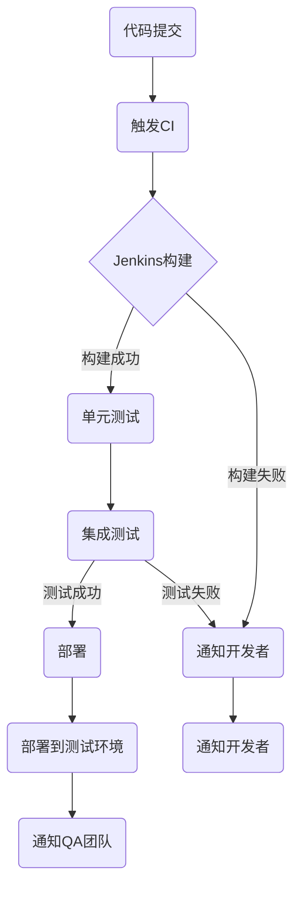

                 

### 文章标题

《一人公司的CI/CD流程优化》

关键词：持续集成、持续交付、持续部署、单人公司、自动化构建、容器化技术、自动化测试、工具链集成

摘要：本文将探讨在单人公司中如何优化CI/CD流程，从基础概念到实践案例，详细解析如何利用Git、Jenkins、Docker等工具提高开发效率和软件质量。

### 第一部分：CI/CD基础概念与原则

#### 第1章：CI/CD概述

##### 1.1 什么是CI/CD

持续集成（Continuous Integration，简称CI）是一种软件开发实践，其核心思想是将开发过程中的代码定期合并到主干分支，并进行自动化的构建和测试。这样做的目的是确保代码库中的每个提交都是可合并的，并能够快速发现潜在的问题。

持续交付（Continuous Delivery，简称CD）是持续集成的延伸，它通过自动化测试和部署流程，确保软件可以在任何时间点安全地交付到生产环境。与传统的部署方式相比，持续交付能够显著提高软件的可靠性和上市速度。

持续部署（Continuous Deployment，简称CD）则更进一步，它不仅能够确保软件在测试环境中稳定运行，还能够自动将软件部署到生产环境。持续部署的目标是实现持续、自动化的发布流程，从而减少手动干预，提高部署效率。

##### 1.2 CI/CD与传统开发模式的区别

传统开发模式通常采用瀑布模型，开发过程是线性的，每个阶段都需要完成后才能进入下一个阶段。这种方式容易导致开发周期过长，难以快速响应市场需求。而CI/CD采用迭代和增量的开发方式，能够快速集成代码，频繁交付，显著缩短开发周期。

此外，传统开发模式中的测试通常是在开发完成后集中进行，而CI/CD中的测试是持续进行的，每个提交都会经过一系列的测试，确保代码质量。这种持续测试的方式能够更早地发现和解决问题，减少缺陷传递到下一个阶段的风险。

##### 1.3 CI/CD的核心原则

持续集成、持续交付和持续部署各有其核心原则，但它们共同的目标是提高开发效率、提升软件质量、减少开发风险。

持续集成强调频繁提交、自动化构建和测试。通过频繁的提交，可以确保代码库中的每个提交都是可合并的，减少集成风险。自动化构建和测试能够快速验证代码的正确性，提高开发效率。

持续交付强调自动化测试和部署。自动化测试能够确保每个版本都是可交付的，部署过程的自动化能够减少手动干预，提高部署效率。

持续部署进一步强调持续、自动化的发布流程。通过持续部署，可以确保软件在开发、测试和生产环境中的运行一致性，减少发布失败的风险。

##### 1.4 CI/CD的优势

CI/CD具有以下优势：

1. **提高开发效率**：通过自动化构建、测试和部署，能够显著减少手动操作，提高开发效率。
2. **提升软件质量**：持续集成和测试能够及早发现和解决问题，提高软件质量。
3. **减少开发风险**：自动化测试和部署能够减少人为错误，降低开发风险。
4. **快速响应市场变化**：频繁的集成和交付能够快速响应市场需求，提高产品的竞争力。

#### 第2章：CI/CD流程设计

##### 2.1 CI/CD流程设计原则

CI/CD流程设计应遵循以下原则：

1. **自动化**：构建、测试和部署过程应尽可能自动化，减少手动操作。
2. **简化流程**：流程应简洁明了，避免复杂和冗余的步骤。
3. **灵活性**：流程应具有足够的灵活性，以适应不同的项目需求和变化。

##### 2.2 CI/CD流程的关键组件

CI/CD流程的关键组件包括：

1. **源代码管理**：使用Git等版本控制系统进行代码管理。
2. **构建工具**：如Jenkins、Travis CI等，用于自动化构建应用程序。
3. **测试工具**：如JUnit、Selenium等，用于自动化测试应用程序。
4. **部署工具**：如Docker、Kubernetes等，用于自动化部署应用程序。

##### 2.3 CI/CD流程设计案例

一个简单的CI/CD流程设计可能包括以下步骤：

1. **代码提交**：开发者将代码提交到Git仓库。
2. **自动化构建**：构建工具从Git仓库拉取最新代码，进行编译和打包。
3. **自动化测试**：测试工具运行一系列测试，验证代码的正确性。
4. **部署**：部署工具将经过测试的代码部署到测试环境。
5. **持续监控**：监控系统对应用程序进行监控，确保其正常运行。

### 第二部分：CI/CD工具与技术

#### 第3章：Git与版本控制

##### 3.1 Git基本操作

Git是当前最流行的版本控制系统，其基本操作包括：

1. **拉取代码**：使用`git pull`命令从远程仓库更新本地仓库。
2. **提交代码**：使用`git commit`命令将更改提交到本地仓库。
3. **分支管理**：使用`git branch`命令创建、切换和管理分支。

##### 3.2 Git工作流

Git工作流包括多种模式，如功能分支工作流和牵引力模型。功能分支工作流是一种常见的Git工作流，其核心思想是将功能开发隔离在不同的分支中，确保主干分支始终保持稳定。牵引力模型则强调主干分支的持续集成，通过频繁的合并和集成，确保主干分支的代码质量。

##### 3.3 Git最佳实践

Git最佳实践包括：

1. **代码提交规范**：遵循统一的代码提交规范，提高代码的可读性和可维护性。
2. **分支命名规范**：使用有意义的分支命名，方便代码管理和查找。
3. **合并请求**：使用合并请求（Pull Request）进行代码审查和合并，确保代码质量。

#### 第4章：Jenkins自动化构建

##### 4.1 Jenkins概述

Jenkins是一个开源的自动化服务器，用于实现持续集成和持续交付。它支持多种插件，可以自动化构建、测试和部署应用程序。

##### 4.2 Jenkins安装与配置

Jenkins的安装过程简单，可以从其官方网站下载并部署到本地或远程服务器。安装后，需要进行一些基本配置，如添加插件、配置邮件通知等。

##### 4.3 Jenkins构建流水线

Jenkins的构建流水线（Pipeline）是一种声明式的脚本语言，用于定义构建过程。使用构建流水线，可以自动化整个构建、测试和部署流程，提高开发效率。

```groovy
pipeline {
    agent any
    stages {
        stage('Build') {
            steps {
                sh 'mvn clean install'
            }
        }
        stage('Test') {
            steps {
                sh 'mvn test'
            }
        }
        stage('Deploy') {
            steps {
                sh 'docker-compose up -d'
            }
        }
    }
}
```

#### 第5章：Docker容器化技术

##### 5.1 Docker基本概念

Docker是一种开源的容器化技术，它允许开发人员将应用程序及其依赖项打包到一个独立的容器中。容器化的应用程序可以在任何支持Docker的操作系统上运行，实现了一次编写，到处运行。

##### 5.2 Docker安装与使用

Docker的安装过程取决于操作系统。例如，在Linux上，可以使用以下命令安装Docker：

```bash
sudo apt-get update
sudo apt-get install docker-ce docker-ce-cli containerd.io
```

安装完成后，可以使用以下命令启动Docker服务：

```bash
sudo systemctl start docker
```

##### 5.3 Docker-compose

Docker-compose是一个用于定义和运行多容器Docker应用程序的工具。它通过一个YAML文件描述应用程序的各个组件，并使用Docker Compose文件启动和运行应用程序。

```yaml
version: '3'
services:
  web:
    image: nginx:latest
    ports:
      - "8080:80"
  app:
    image: myapp:latest
```

#### 第6章：自动化测试

##### 6.1 自动化测试概述

自动化测试是一种通过脚本自动执行测试用例的方法。它能够提高测试效率，减少人为错误，并确保软件质量。

##### 6.2 测试工具选择

自动化测试工具的选择取决于项目需求和测试类型。常见的测试工具包括JUnit（Java单元测试）、Selenium（Web应用程序测试）、Appium（移动应用程序测试）等。

##### 6.3 测试框架

测试框架是一种用于组织和管理测试用例的工具。常见的测试框架包括JUnit（Java）、pytest（Python）、TestNG（Java）等。

#### 第7章：CI/CD工具链集成

##### 7.1 Jenkins与Docker集成

Jenkins与Docker的集成可以通过Jenkinsfile实现。Jenkinsfile是一个声明式的文件，用于定义构建和部署流程。

```groovy
pipeline {
    agent any
    stages {
        stage('Build') {
            steps {
                sh 'docker build -t myapp .'
            }
        }
        stage('Test') {
            steps {
                sh 'docker run --rm myapp ./run-tests.sh'
            }
        }
        stage('Deploy') {
            steps {
                sh 'docker-compose up -d'
            }
        }
    }
}
```

##### 7.2 Jenkins与测试工具集成

Jenkins可以与多种测试工具集成，如JUnit、Selenium等。集成后，Jenkins可以在构建过程中自动运行测试用例，并生成测试报告。

##### 7.3 Jenkins与其他工具的集成

Jenkins可以与其他工具集成，如GitLab CI、CircleCI等，实现更复杂的CI/CD流程。通过集成，可以实现跨平台的构建和部署，提高开发效率。

### 第三部分：CI/CD实践与优化

#### 第8章：CI/CD实践与优化

##### 8.1 单人公司的CI/CD实践

在单人公司中，CI/CD实践可以更加灵活。以下是一个单人公司的CI/CD实践案例：

1. **代码提交**：开发者将代码提交到Git仓库。
2. **自动化构建**：Jenkins从Git仓库拉取代码，使用Maven进行构建。
3. **自动化测试**：JUnit测试用例在构建过程中自动运行。
4. **容器化部署**：使用Docker将构建后的应用程序容器化。
5. **持续监控**：使用Prometheus和Grafana对应用程序进行监控。

##### 8.2 CI/CD流程优化

CI/CD流程的优化可以从以下几个方面进行：

1. **简化流程**：减少不必要的步骤，提高流程效率。
2. **流程监控**：引入监控工具，实时监控构建、测试和部署过程。
3. **反馈机制**：建立反馈机制，及时发现问题并进行改进。
4. **持续学习**：关注新技术和最佳实践，不断优化CI/CD流程。

##### 8.3 持续学习与改进

持续学习是CI/CD流程优化的重要环节。开发者应关注以下方面：

1. **新技术**：了解并尝试使用新技术，提高开发效率和软件质量。
2. **最佳实践**：学习并应用最佳实践，优化CI/CD流程。
3. **团队协作**：加强团队协作，提高整体开发效率。

### 附录

#### 附录A：常用CI/CD工具

1. **Jenkins**：一个开源的自动化服务器，用于实现持续集成和持续交付。
2. **GitLab CI**：GitLab内置的持续集成服务，支持多种编程语言和测试工具。
3. **CircleCI**：一个云端的持续集成服务，提供易于使用的流水线功能。

#### 附录B：CI/CD流程设计参考

1. **小型项目CI/CD流程**：适用于小型项目和独立开发者的简单CI/CD流程。
2. **中型项目CI/CD流程**：适用于中型项目和团队协作的CI/CD流程。
3. **大型项目CI/CD流程**：适用于大型项目和分布式团队的复杂CI/CD流程。

#### 附录C：常用术语解释

1. **持续集成**：通过频繁地将代码合并到主干分支中，并进行自动化的构建和测试，确保软件项目的整体质量。
2. **持续交付**：通过自动化测试和部署流程，确保软件可以在任何时间点安全地交付到生产环境。
3. **持续部署**：在持续集成和持续交付的基础上，通过自动化部署流程，将软件部署到生产环境。
4. **DevOps**：一种软件开发和运维的新模式，强调开发和运维团队的紧密协作。
5. **GitFlow**：一种基于Git的版本控制工作流，用于管理项目开发、发布和更新。
6. **敏捷开发**：一种强调快速迭代和灵活应对变化的软件开发方法。
7. **持续监控**：通过监控系统对应用程序进行实时监控，确保其正常运行。
8. **持续反馈**：通过测试、监控和用户反馈，不断改进软件质量和用户体验。
9. **代码评审**：通过审查代码，确保代码质量和一致性。
10. **静态代码分析**：通过分析源代码，识别潜在的问题和漏洞。
11. **自动化测试**：通过脚本自动执行测试用例，提高测试效率。
12. **灰度发布**：逐步将新功能部署到部分用户，确保其稳定性和安全性。
13. **蓝绿部署**：通过两个相同版本的应用程序，逐步替换旧版本，确保部署过程的无缝过渡。
14. **金丝雀部署**：通过部署到一小部分用户，验证新功能或更新，确保其质量。
15. **基于容器的持续交付**：使用容器化技术，实现持续交付的自动化流程。
16. **Infrastructure as Code**：通过代码管理基础设施，提高基础设施的可重复性和可维护性。
17. **云原生应用**：基于云计算和容器化技术，具有高可用性和可扩展性的应用程序。
18. **服务网格**：一种用于管理服务通信的架构模式，提高服务的可靠性和安全性。
19. **线上风险评估**：对线上应用程序进行风险评估，确保其安全性和稳定性。
20. **日志管理**：对应用程序的日志进行收集、存储和分析，帮助诊断问题和改进性能。
21. **监控告警**：通过监控工具，实时监控应用程序的状态，并在出现问题时发送告警。
22. **自动化运维**：通过脚本和工具，自动化日常运维任务，提高运维效率。
23. **安全开发**：在软件开发过程中，确保软件的安全性和合规性。
24. **数据隐私保护**：通过加密、匿名化等技术，保护用户数据隐私。
25. **合规性**：确保应用程序符合相关法律法规和行业标准。
26. **自动化测试覆盖率**：对测试用例的覆盖率进行分析，确保测试的全面性。
27. **负载测试**：模拟用户负载，评估应用程序的性能和稳定性。
28. **灾难恢复计划**：制定灾难恢复计划，确保在发生灾难时能够快速恢复业务。
29. **持续性能优化**：通过监控和性能分析，不断优化应用程序的性能。
30. **持续学习与知识分享**：通过学习和分享，不断提高团队的技术水平和知识储备。
31. **团队协作与沟通工具**：使用协作工具，提高团队的协作效率和沟通效果。

### 核心概念与联系

#### CI/CD的概念与联系

持续集成、持续交付和持续部署是CI/CD的三个核心概念，它们之间有密切的联系。

持续集成（CI）是持续交付（CD）的基础。通过持续集成，可以确保代码库中的每个提交都是可合并的，减少集成风险，提高软件质量。

持续交付（CD）是在持续集成的基础上，通过自动化测试和部署流程，确保软件可以在任何时间点安全地交付到生产环境。持续交付的目标是实现持续、自动化的发布流程，从而减少手动干预，提高部署效率。

持续部署（CD）是持续交付的进一步延伸，它不仅能够确保软件在测试环境中稳定运行，还能够自动将软件部署到生产环境。持续部署的目标是实现持续、自动化的发布流程，从而减少手动干预，提高部署效率。

总的来说，CI/CD是一种软件开发实践，通过自动化构建、测试和部署，提高开发效率、提升软件质量、减少开发风险，实现快速响应市场变化。CI/CD的核心概念包括持续集成、持续交付和持续部署，它们之间有密切的联系，共同构成了一种高效、可靠的软件开发模式。 ### 第一部分：CI/CD基础概念与原则

#### 第1章：CI/CD概述

##### 1.1 什么是CI/CD

持续集成（Continuous Integration，简称CI）和持续交付（Continuous Delivery，简称CD）是现代软件开发中广泛采用的最佳实践。它们不仅改变了传统的软件开发流程，还极大地提高了软件质量和开发效率。在这个小节中，我们将详细探讨CI和CD的概念、它们与传统开发模式的区别以及CI/CD的优势。

**CI/CD的概念**

持续集成（CI）是一种软件开发实践，其核心理念是频繁地将开发人员的代码提交合并到一个共享的主干分支中，并在每次提交后自动执行一系列的构建和测试。这样做的主要目的是确保代码库中的每个提交都是可合并的，并且不会破坏现有的功能。持续集成不仅仅是构建和测试，还包括一系列的自动化流程，如代码格式检查、静态代码分析、自动化测试和代码审查。

持续交付（CD）是持续集成的自然延伸。它强调在每次集成后，代码都应该经过自动化测试并准备好交付到生产环境。持续交付的目标是确保软件可以在任何时间点安全地交付到生产环境，并且每次交付都是可靠和可控的。持续交付不仅包括部署到测试环境，还包括部署到预生产环境和最终的生产环境。

**CI/CD与传统开发模式的区别**

传统的软件开发模式通常采用瀑布模型，这是一种线性的开发流程，其中每个阶段（如需求分析、设计、编码、测试和部署）都是在前一个阶段完成后才开始。这种模式的问题在于，由于缺乏频繁的集成和测试，可能导致以下问题：

1. **集成风险**：开发人员通常在项目的后期将各自的代码集成到主干分支，导致集成过程风险高、成本高。
2. **质量难以保证**：由于缺乏持续测试，直到项目后期才发现问题，修复成本高。
3. **响应速度慢**：整个开发周期长，无法快速响应市场变化。

相比之下，CI/CD采用迭代和增量的开发方式，具有以下显著区别：

1. **频繁集成**：开发人员定期将代码提交到主干分支，确保代码库始终保持一致和稳定。
2. **自动化测试**：每次提交都会触发一系列的自动化测试，确保代码质量。
3. **快速反馈**：通过自动化测试和快速反馈，开发人员可以立即了解代码的缺陷，并及时修复。
4. **简化流程**：通过自动化，许多手动流程（如构建、测试和部署）被简化，提高效率。
5. **持续交付**：每次集成后，代码都准备好交付到生产环境，确保软件的可靠性和安全性。

**CI/CD的优势**

CI/CD具有以下显著优势：

1. **提高开发效率**：通过自动化构建、测试和部署，减少了手动操作，提高了开发效率。
2. **提升软件质量**：持续集成和测试能够及早发现和解决问题，减少缺陷传递到下一个阶段的风险。
3. **减少开发风险**：自动化测试和部署减少了人为错误，降低了开发风险。
4. **快速响应市场变化**：频繁的集成和交付使得团队能够快速响应市场需求，提高产品的竞争力。
5. **增强团队协作**：CI/CD鼓励团队协作，每个成员都在同一个代码库中工作，确保代码的一致性和质量。

通过CI/CD，开发团队可以更加高效、灵活和可靠地交付高质量软件，从而在激烈的市场竞争中保持领先地位。

##### 1.2 CI/CD的核心原则

CI/CD的核心原则是确保代码库中的每个提交都是可合并的、高质量的，并且准备好交付到生产环境。以下将详细讨论CI/CD的三个核心原则：持续集成、持续交付和持续部署，并解释它们如何相互关联。

**持续集成（CI）**

持续集成（CI）是一种软件开发实践，其核心理念是将开发人员的代码定期提交到主干分支，并在每次提交后自动执行一系列的构建和测试。这种做法有几个关键点：

1. **频繁提交**：开发人员定期将代码提交到主干分支，通常是每天多次或每次代码变更后。这有助于确保代码库中的每个提交都是小且集中的，便于管理和跟踪。
   
2. **自动化构建**：每次提交都会触发自动化构建流程，这通常包括编译代码、打包应用程序和生成相关文档。自动化构建可以确保代码能够顺利构建，并且所有依赖项都已正确安装。

3. **自动化测试**：构建过程通常伴随着一系列自动化测试，包括单元测试、集成测试和端到端测试。这些测试旨在验证代码的功能和行为，确保没有引入新的缺陷。

4. **反馈机制**：测试结果会被立即反馈给开发人员，如果测试失败，系统会提供详细的错误信息，帮助开发人员快速定位和修复问题。这种即时反馈有助于减少代码中的缺陷，确保代码库的质量。

**持续交付（CD）**

持续交付（CD）是CI的自然延伸，它强调在每次集成后，代码都应经过自动化测试并准备好交付到生产环境。CD的关键原则包括：

1. **自动化测试**：除了CI中的测试外，CD还包括更广泛的测试，如性能测试、安全测试和用户体验测试。这些测试确保软件在各种环境下都能正常运行。

2. **部署流程**：CD引入了自动化部署流程，确保代码可以从测试环境顺利部署到生产环境。部署流程通常包括打包、配置管理、部署脚本和监控。

3. **环境一致性**：通过自动化，确保开发、测试和生产环境之间的代码和配置保持一致，减少环境差异导致的问题。

4. **版本控制**：每次部署都应记录版本信息，确保可以轻松回滚到之前的版本，如果出现任何问题。

**持续部署（CD）**

持续部署（CD）是CD的进一步扩展，它不仅确保软件可以交付到生产环境，还实现了持续、自动化的发布流程。CD的关键原则包括：

1. **自动化发布**：每次代码变更都会自动触发部署流程，包括测试、构建、打包和部署到生产环境。这减少了手动干预，提高了发布效率。

2. **蓝绿部署**：在CD中，可以使用蓝绿部署策略，将新版本的应用程序部署到生产环境的一部分（如绿色环境），然后在验证其正常运行后，逐步替换旧版本（蓝色环境）。

3. **金丝雀部署**：类似蓝绿部署，但只将新版本部署到一小部分用户，以便在验证其稳定性和性能后，再逐步推广到所有用户。

**CI、CD和CD之间的关系**

CI、CD和持续部署（CD）之间有密切的联系，它们共同构成了CI/CD流程。持续集成（CI）是CI/CD的基础，它确保每个提交都是可合并的，并且代码库中的每个分支都是稳定的。持续交付（CD）在CI的基础上，通过自动化测试和部署流程，确保代码准备好交付到生产环境。持续部署（CD）进一步扩展了CD的概念，通过自动化发布流程，确保软件可以在生产环境中持续更新。

总的来说，CI/CD的核心原则是通过频繁的集成、自动化测试和部署，确保代码库中的每个提交都是高质量的，并且软件可以在任何时间点安全地交付到生产环境。这些原则不仅提高了开发效率，还提升了软件质量和稳定性，帮助开发团队更好地应对市场需求和变化。

##### 1.3 CI/CD的优势

CI/CD（持续集成/持续交付）作为一种现代软件开发实践，带来了显著的优势。以下将详细讨论CI/CD的优势，包括提高开发效率、提升软件质量、减少开发风险等方面。

**提高开发效率**

CI/CD通过自动化构建、测试和部署流程，极大地提高了开发效率。传统开发模式通常需要手动执行这些任务，不仅耗时，还容易出现人为错误。在CI/CD中，构建、测试和部署都是自动化的，开发人员只需提交代码，系统会自动执行后续步骤，从而减少了手动操作的时间和精力。

具体来说，CI/CD的优势体现在以下几个方面：

1. **快速反馈**：每次代码提交后，系统会立即执行构建和测试，并将结果反馈给开发人员。这样，开发人员可以立即了解代码的质量和稳定性，及时发现问题并进行修复。这种快速反馈机制有助于缩短开发周期，提高开发效率。

2. **并行执行**：CI/CD系统能够并行处理多个构建和测试任务，从而提高了整体效率。传统开发模式中，每个任务通常需要逐一执行，而在CI/CD中，多个任务可以同时进行，大大加快了开发进度。

3. **持续集成**：通过持续集成，开发人员可以尽早发现和解决问题。这有助于避免在项目后期发现大量问题，从而减少了修复成本，提高了开发效率。

**提升软件质量**

CI/CD不仅提高了开发效率，还显著提升了软件质量。通过自动化测试和频繁集成，CI/CD确保了代码库中的每个提交都是高质量的，并且能够及时发现和修复缺陷。

具体来说，CI/CD的优势体现在以下几个方面：

1. **早期问题发现**：CI/CD中的自动化测试在每次代码提交后都会执行，这有助于早期发现潜在的问题。早期发现问题可以减少缺陷在项目中的传播，从而降低修复成本，提高软件质量。

2. **频繁集成**：频繁的集成可以确保代码库中的每个分支都是稳定的。这种稳定性有助于减少集成风险，确保软件质量。

3. **代码质量检查**：CI/CD系统通常包括静态代码分析和代码格式检查等工具，这些工具可以识别代码中的潜在问题，如冗余代码、不规范的编码风格等。通过这些工具，开发人员可以更好地控制代码质量。

**减少开发风险**

CI/CD通过自动化和频繁的集成，有效减少了开发风险。在传统开发模式中，由于缺乏持续测试和集成，项目后期可能会出现大量问题，导致项目延期或失败。而在CI/CD中，这些问题可以提前发现和解决，从而降低了开发风险。

具体来说，CI/CD的优势体现在以下几个方面：

1. **风险分散**：通过持续集成和测试，CI/CD将风险分散到项目的各个阶段。每个提交都会经过测试，确保其质量和稳定性，从而减少了项目后期的风险。

2. **快速回滚**：如果部署后发现新版本有问题，CI/CD系统可以快速回滚到之前的版本。这种能力有助于降低部署失败的风险，确保软件的稳定性。

3. **环境一致性**：CI/CD确保开发、测试和生产环境之间的一致性。通过自动化部署，开发人员可以确保在不同环境中运行的应用程序具有相同的行为和配置，从而减少了环境差异导致的问题。

**快速响应市场变化**

CI/CD的快速反馈和自动化流程使其能够快速响应市场变化。在传统开发模式中，由于开发周期长，软件上市速度慢，很难快速响应市场需求。而在CI/CD中，开发周期短，交付速度快，开发团队可以更快地迭代和发布新功能，从而更好地满足市场需求。

具体来说，CI/CD的优势体现在以下几个方面：

1. **快速迭代**：通过频繁的集成和交付，开发团队可以更快地发布新功能，从而更好地适应市场需求。

2. **持续优化**：CI/CD鼓励持续优化和改进。开发团队可以不断收集用户反馈，及时调整开发计划，优化软件功能，提高用户体验。

3. **灵活性**：CI/CD系统具有很高的灵活性，可以适应不同的项目需求和变化。开发团队可以根据项目的实际情况，灵活调整CI/CD流程，确保项目顺利进行。

总之，CI/CD通过提高开发效率、提升软件质量、减少开发风险和快速响应市场变化，带来了显著的优势。这些优势不仅有助于开发团队更好地管理项目，提高软件质量，还能够提升企业的竞争力。因此，CI/CD已成为现代软件开发中不可或缺的一部分。

##### 2.1 CI/CD流程设计原则

在设计和实施CI/CD流程时，遵循一系列原则至关重要。这些原则不仅确保流程的高效性和可靠性，还提升开发团队的整体协作和软件质量。以下是CI/CD流程设计的主要原则：

**自动化**

自动化是CI/CD的核心原则之一。通过将构建、测试和部署过程自动化，可以减少人为干预，提高流程的准确性和一致性。自动化流程包括以下步骤：

1. **构建自动化**：使用构建工具（如Jenkins、GitLab CI等）自动编译和打包代码，确保每次构建都是一致的。
2. **测试自动化**：编写自动化测试用例，确保每次提交都会经过严格的测试，及时发现和修复缺陷。
3. **部署自动化**：通过脚本或部署工具（如Ansible、Puppet等）自动化部署应用程序，确保部署流程的可靠性和一致性。

**简化流程**

简化流程的原则旨在减少不必要的步骤和复杂性，提高开发效率。以下是简化流程的一些策略：

1. **减少手动操作**：通过自动化，减少手动构建、测试和部署操作，降低人为错误的风险。
2. **简化测试**：专注于关键功能和性能测试，避免冗余的测试用例，提高测试效率。
3. **优化配置管理**：使用配置管理工具（如Ansible、Chef等）管理环境和配置，减少配置错误和部署时间。

**灵活性**

灵活的CI/CD流程能够适应不同的项目需求和环境变化。以下是一些实现灵活性的策略：

1. **模块化**：将CI/CD流程分解为独立的模块，每个模块负责特定的任务，便于扩展和替换。
2. **参数化**：使用参数化配置，使流程能够适应不同的环境和项目需求。
3. **版本控制**：使用版本控制系统（如Git）管理CI/CD配置和脚本，确保配置的一致性和可追溯性。

**可扩展性**

可扩展性是确保CI/CD流程能够支持项目规模增长的关键。以下是一些实现可扩展性的策略：

1. **分布式构建**：支持分布式构建，利用多台机器并行处理构建任务，提高构建速度。
2. **容器化**：使用容器化技术（如Docker）封装应用程序和依赖项，确保在不同环境中的一致性。
3. **微服务架构**：采用微服务架构，将应用程序分解为独立的、可独立部署和扩展的服务，提高系统的可扩展性。

**安全性**

CI/CD流程设计应确保软件的安全性和合规性。以下是一些实现安全性的策略：

1. **身份验证和授权**：使用身份验证和授权机制（如OAuth、JWT等）保护CI/CD系统的访问权限。
2. **加密**：对敏感数据进行加密，确保数据传输和存储的安全性。
3. **漏洞扫描**：定期进行漏洞扫描和安全测试，及时发现和修复潜在的安全问题。

**监控与反馈**

监控和反馈是确保CI/CD流程正常运行的关键。以下是一些实现监控与反馈的策略：

1. **实时监控**：使用监控工具（如Prometheus、Grafana等）实时监控构建、测试和部署过程，及时发现和解决问题。
2. **告警系统**：配置告警系统，在流程出现问题时及时通知相关人员。
3. **反馈机制**：建立反馈机制，收集和分析流程中的数据和问题，持续改进CI/CD流程。

**文档化和标准化**

文档化和标准化是确保CI/CD流程一致性和可维护性的关键。以下是一些实现文档化和标准化的策略：

1. **流程文档**：编写详细的流程文档，包括流程的每个步骤、依赖项和配置。
2. **代码审查**：实施代码审查，确保CI/CD配置和脚本的正确性和可维护性。
3. **培训和支持**：为团队成员提供培训和支持，确保他们能够理解和执行CI/CD流程。

遵循这些原则可以帮助开发团队设计和实施高效的CI/CD流程，提高软件质量，减少开发风险，并确保团队能够快速响应市场需求。通过不断优化和改进CI/CD流程，团队可以持续提升其开发效率和竞争力。

##### 2.2 CI/CD流程的关键组件

CI/CD流程的自动化和高效运行依赖于一系列关键组件的协同工作。以下将详细介绍CI/CD流程中最重要的几个组件：源代码管理、构建工具、测试工具和部署工具。

**源代码管理**

源代码管理（Source Code Management，简称SCM）是CI/CD流程的基石。其主要目的是确保代码的版本控制和协作开发。Git是目前最流行的版本控制系统，它支持分布式版本控制和强大的分支管理功能。

在CI/CD流程中，源代码管理的主要任务包括：

1. **版本控制**：通过Git等SCM工具，开发人员可以将代码提交到远程仓库，实现版本控制。每次提交都会记录更改的详细信息和时间戳，确保代码历史可追溯。

2. **分支管理**：Git支持多种分支管理策略，如功能分支工作流、牵引力模型等。这些策略有助于将功能开发和主干分支隔离，确保主干分支的稳定性和可发布性。

3. **协作开发**：Git允许多个开发人员在同一代码库上协作，通过拉取请求（Pull Request）和合并请求（Merge Request）进行代码审查和集成，确保代码的一致性和质量。

**构建工具**

构建工具是CI/CD流程中的核心组件，负责将源代码编译、打包和构建为可执行的软件。Jenkins是最流行的构建工具之一，它支持多种编程语言和构建脚本，可以自动化构建过程。

构建工具的主要任务包括：

1. **自动化构建**：使用构建工具，开发人员可以定义构建脚本，自动化编译、打包和部署应用程序。构建脚本可以包含编译器命令、依赖项安装、打包工具等。

2. **依赖管理**：构建工具通常支持依赖管理，可以自动下载和管理项目所需的库和依赖项，确保构建环境的一致性。

3. **构建优化**：构建工具提供了丰富的插件和扩展，可以优化构建过程，如缓存编译结果、并行构建等，提高构建速度和效率。

**测试工具**

测试工具是CI/CD流程中确保软件质量的关键组件。自动化测试工具可以运行一系列预定义的测试用例，验证应用程序的功能和行为。

测试工具的主要任务包括：

1. **单元测试**：单元测试用于验证应用程序的各个模块是否按预期工作。单元测试工具（如JUnit、NUnit）可以自动执行测试用例，并生成测试报告。

2. **集成测试**：集成测试用于验证不同模块之间的交互是否符合预期。集成测试工具（如Selenium、Cucumber）可以模拟用户操作，并检查应用程序的响应。

3. **性能测试**：性能测试用于评估应用程序的性能和负载能力。性能测试工具（如JMeter、LoadRunner）可以模拟大量用户访问，测量响应时间和资源消耗。

**部署工具**

部署工具是CI/CD流程中负责将构建后的应用程序部署到生产环境的关键组件。部署工具可以自动化部署流程，确保应用程序在不同环境中的一致性和可靠性。

部署工具的主要任务包括：

1. **自动化部署**：使用部署工具，开发人员可以定义部署脚本，自动化部署应用程序到测试、预生产和生产环境。部署脚本可以包含配置管理、环境变量设置、数据库迁移等任务。

2. **环境一致性**：部署工具确保应用程序在不同环境中具有相同的行为和配置。通过配置管理工具（如Ansible、Puppet），可以自动化管理环境配置，减少环境差异导致的问题。

3. **回滚和监控**：部署工具支持回滚功能，可以在部署失败时快速回滚到之前的版本。同时，部署工具可以与监控工具集成，实时监控应用程序的状态和性能。

通过整合源代码管理、构建工具、测试工具和部署工具，CI/CD流程可以自动化和高效地运行，确保代码质量、提高开发效率，并快速交付高质量的应用程序。

##### 2.3 CI/CD流程设计案例

设计一个有效的CI/CD流程对于确保软件质量和提高开发效率至关重要。以下是一个CI/CD流程的设计案例，用于说明如何实施自动化构建、测试和部署。

**1. 流程概述**

该CI/CD流程包括以下主要步骤：

1. **代码提交**：开发人员将代码提交到Git仓库。
2. **自动化构建**：Jenkins从Git仓库拉取最新代码，并使用Maven进行构建。
3. **单元测试**：构建过程中执行JUnit单元测试。
4. **集成测试**：执行Selenium集成测试。
5. **部署**：将构建后的应用程序部署到测试环境。

**2. 步骤详解**

**（1）代码提交**

开发人员定期将代码提交到Git仓库。每次提交都会触发CI/CD流程。

```bash
git commit -m "Update feature X"
git push
```

**（2）自动化构建**

Jenkins作为CI服务器，从Git仓库拉取最新代码，并使用Maven进行构建。

```bash
#!/bin/bash

# 拉取最新代码
git pull origin master

# 使用Maven构建
mvn clean install
```

**（3）单元测试**

在构建过程中，执行JUnit单元测试。

```bash
mvn test
```

**（4）集成测试**

使用Selenium执行集成测试。

```bash
#!/bin/bash

# 启动Selenium浏览器
chromedriver --marionette

# 执行测试脚本
java -jar selenium-test.jar
```

**（5）部署**

将构建后的应用程序部署到测试环境。

```bash
#!/bin/bash

# 停止现有应用程序
sudo systemctl stop myapp

# 复制新构建的应用程序到服务器
sudo cp target/myapp.jar /opt/myapp/myapp.jar

# 启动新构建的应用程序
sudo systemctl start myapp
```

**3. 流程图**

以下是CI/CD流程的Mermaid流程图表示：



**4. 优化建议**

- **增加代码审查**：在提交代码前，增加代码审查环节，确保代码质量和一致性。
- **集成性能测试**：在集成测试阶段，增加性能测试，确保应用程序的响应时间和负载能力。
- **自动化部署到生产环境**：将部署流程扩展到生产环境，确保应用程序的快速交付和部署。
- **监控和告警**：引入监控工具，实时监控应用程序的状态和性能，并在出现问题时及时发送告警。

通过这个案例，我们可以看到如何设计一个简单的CI/CD流程，并如何逐步优化它，以提高开发效率和软件质量。CI/CD的成功实施需要持续的关注和改进，以确保其持续带来价值。

### 第二部分：CI/CD工具与技术

#### 第3章：Git与版本控制

版本控制是软件开发中不可或缺的一部分，Git作为最流行的分布式版本控制系统，已经成为现代开发团队的标准工具。在这一章中，我们将详细探讨Git的基本操作、工作流以及最佳实践。

##### 3.1 Git基本操作

Git的基本操作包括拉取代码、提交代码、分支管理以及合并分支等。以下是一些常用的Git命令及其简要说明：

**拉取代码**

拉取代码是将远程仓库的最新代码更新到本地仓库的过程。使用`git pull`命令可以轻松实现。

```bash
git pull origin master
```

这个命令将远程仓库的`master`分支的最新代码拉取到本地仓库的当前分支。

**提交代码**

提交代码是将本地更改推送到远程仓库的过程。使用`git commit`命令可以提交更改，并使用`git push`命令将提交推送到远程仓库。

```bash
git commit -m "Update README.md"
git push origin master
```

这里，`-m`标志用于添加提交信息。

**分支管理**

分支管理是Git的核心功能之一，它允许开发人员在独立的分支上进行功能开发，而不会影响主干分支。

**创建分支**

```bash
git checkout -b feature/my-feature
```

这个命令创建并切换到一个名为`feature/my-feature`的新分支。

**合并分支**

合并分支是将一个分支的更改合并到另一个分支的过程。通常，在完成功能开发后，会合并功能分支到主干分支。

```bash
git checkout master
git merge feature/my-feature
git push origin master
```

这些命令首先切换到主干分支，然后将其与功能分支合并，并将结果推送到远程仓库。

**解决合并冲突**

在合并分支时，如果两个分支对同一文件的同一部分进行了更改，Git会标记冲突，并需要手动解决。

```bash
git status
```

查看冲突文件，打开冲突文件并进行手动修改。

```bash
git add <conflicted-file>
git commit -m "Resolved merge conflict"
```

添加解决后的文件并提交更改。

##### 3.2 Git工作流

Git工作流是团队在开发过程中使用的分支管理策略。以下是一些常见的工作流：

**功能分支工作流**

功能分支工作流是最流行的Git工作流之一，它包括以下步骤：

1. **创建功能分支**：开发人员在功能分支上开发新功能。
2. **代码审查**：在功能分支完成开发后，通过代码审查进行代码质量检查。
3. **合并功能分支**：通过合并请求将功能分支合并到主干分支。

**牵引力模型**

牵引力模型（Git Flow变种）结合了功能分支工作流和发布分支工作流。它的步骤包括：

1. **创建功能分支**：开发人员在功能分支上开发新功能。
2. **创建发布分支**：在功能分支合并到主干分支后，创建发布分支进行测试和准备发布。
3. **合并发布分支**：将发布分支合并到主干分支并部署到生产环境。

**双分支工作流**

双分支工作流是最简单的Git工作流，它包括主干分支（通常为`master`）和开发分支（通常为`develop`）。开发人员将所有功能开发提交到`develop`分支，然后通过合并请求将其合并到`master`分支。

##### 3.3 Git最佳实践

为了确保Git仓库的健康和高效管理，以下是一些Git最佳实践：

1. **统一提交格式**：使用统一的提交格式（如Commitizen）可以确保提交信息的清晰和可读性。
2. **良好的分支命名**：使用有意义的分支命名，如`feature/`、`bugfix/`、`release/`等，以便于理解和跟踪分支。
3. **代码审查**：在提交代码前进行代码审查，可以确保代码质量，减少合并冲突。
4. **定期清理**：定期删除不必要的分支和标签，保持仓库整洁。
5. **使用`.gitignore`文件**：使用`.gitignore`文件排除不需要提交的文件和目录，如编译生成的文件和本地设置。
6. **备份远程仓库**：在GitHub、GitLab等平台上，使用远程仓库备份可以确保代码的安全和可恢复性。
7. **配置用户信息**：在Git仓库中配置用户名和电子邮件，确保提交记录的准确性。

通过遵循这些最佳实践，开发团队可以更高效地使用Git进行版本控制，从而提高开发效率和维护代码质量。

#### 第4章：Jenkins自动化构建

Jenkins是一个开源的自动化服务器，用于实现持续集成（CI）和持续交付（CD）。在这个章节中，我们将介绍Jenkins的基本功能、安装与配置，以及如何使用Jenkinsfile定义构建流水线。

##### 4.1 Jenkins概述

Jenkins是一个跨平台的持续集成工具，它可以自动化各种任务，如构建、测试、部署等。以下是Jenkins的一些主要功能：

1. **自动化构建**：Jenkins可以自动执行构建任务，包括编译代码、运行测试和打包应用程序。
2. **插件支持**：Jenkins拥有丰富的插件生态系统，可以扩展其功能，如集成Git、JUnit、Docker等。
3. **通知系统**：Jenkins可以发送邮件、短信或通过Webhook通知开发人员关于构建结果。
4. **报告和统计**：Jenkins提供了详细的报告和统计信息，帮助团队监控构建状态和性能。
5. **流水线构建**：Jenkins支持流水线（Pipeline）构建，使用Groovy脚本定义复杂的构建流程。

##### 4.2 Jenkins安装与配置

安装Jenkins有多种方式，包括从Jenkins官网下载安装包、使用Docker、以及在Linux系统上通过包管理器安装。

**从官网下载安装包**

1. 访问Jenkins官网（https://www.jenkins.io/）并下载适用于您的操作系统的Jenkins安装包。
2. 解压安装包并运行Jenkins。
   ```bash
   java -jar jenkins.war
   ```
3. 打开浏览器并访问`http://localhost:8080`，开始安装Jenkins。

**使用Docker安装**

1. 安装Docker。
2. 运行以下命令启动Jenkins容器。
   ```bash
   docker run -p 8080:8080 -p 50000:50000 -v jenkins_data:/var/jenkins_home -v /var/run/docker.sock:/var/run/docker.sock jenkinsci/jenkins
   ```
3. 打开浏览器并访问`http://localhost:8080`，开始安装Jenkins。

**在Linux系统上通过包管理器安装**

1. 对于Ubuntu系统，可以使用以下命令安装Jenkins。
   ```bash
   sudo apt-get update
   sudo apt-get install jenkins
   ```
2. 启动Jenkins服务。
   ```bash
   sudo systemctl start jenkins
   ```

**配置Jenkins**

安装完成后，需要配置Jenkins：

1. 打开浏览器并访问`http://localhost:8080`，按照提示完成Jenkins的初始配置。
2. 配置管理员用户名和密码。
3. 安装必要的插件，如Git插件、JUnit插件、Docker插件等。

##### 4.3 Jenkins构建流水线

Jenkins的流水线（Pipeline）功能允许使用Groovy脚本定义和执行复杂的构建流程。以下是使用Jenkinsfile定义构建流水线的基本步骤：

**Jenkinsfile的基本结构**

```groovy
pipeline {
    agent any

    stages {
        stage('Build') {
            steps {
                sh 'mvn clean install'
            }
        }
        stage('Test') {
            steps {
                sh 'mvn test'
            }
        }
        stage('Deploy') {
            steps {
                sh 'docker-compose up -d'
            }
        }
    }
}
```

**流水线的主要组成部分**

1. **agent**：指定构建执行的节点。`any`表示可以在任何可用的节点上执行。
2. **stages**：定义构建过程中的各个阶段，如构建、测试和部署。
3. **steps**：在每个阶段中执行具体的步骤，如运行命令、执行脚本等。

**示例：构建和测试**

```groovy
pipeline {
    agent any

    stages {
        stage('Build') {
            steps {
                sh 'mvn clean install'
            }
        }
        stage('Test') {
            steps {
                sh 'mvn test'
            }
        }
    }
}
```

在这个示例中，构建阶段使用Maven进行构建，测试阶段运行Maven的测试命令。

**示例：构建、测试和部署**

```groovy
pipeline {
    agent any

    stages {
        stage('Build') {
            steps {
                sh 'mvn clean install'
            }
        }
        stage('Test') {
            steps {
                sh 'mvn test'
            }
        }
        stage('Deploy') {
            steps {
                sh 'docker-compose up -d'
            }
        }
    }
}
```

在这个示例中，构建阶段和测试阶段的步骤与前面相同，部署阶段使用Docker Compose部署应用程序。

**流水线最佳实践**

1. **模块化**：将复杂的流水线分解为模块，便于维护和重用。
2. **错误处理**：使用try-catch语句处理潜在的错误，确保构建流程的稳定性。
3. **并行执行**：使用when条件允许流水线在特定条件下并行执行不同的阶段。
4. **持续优化**：定期审查和优化流水线，确保其高效和稳定。

通过使用Jenkins流水线，开发团队可以自动化构建、测试和部署流程，提高开发效率，确保软件质量。

#### 第5章：Docker容器化技术

Docker是一种开源的容器化技术，它允许开发人员将应用程序及其依赖项打包到一个独立的容器中，实现了一次编写，到处运行。在这个章节中，我们将介绍Docker的基本概念、安装与使用，以及Docker Compose的使用方法。

##### 5.1 Docker基本概念

**Docker镜像**

Docker镜像是一个静态的、不可变的文件系统层，包含了应用程序运行所需的所有组件，如代码、库、环境变量等。Docker镜像类似于虚拟机的操作系统镜像，但它的体积更小，启动速度更快。

**Docker容器**

Docker容器是基于Docker镜像的可运行的实例。容器是动态的、可变的，可以在不同的宿主机上运行。每个容器都是相互隔离的，拥有独立的文件系统、网络和进程。

**Docker仓库**

Docker仓库是存储和管理Docker镜像的地方。Docker Hub是Docker官方的镜像仓库，提供了丰富的公共镜像，如Python、Node.js、Nginx等。

**Docker标签**

Docker标签用于对镜像进行版本管理。例如，一个Python镜像可以有不同的标签，如`python:3.8`、`python:3.9`，表示不同的Python版本。

##### 5.2 Docker安装与使用

**安装Docker**

安装Docker的步骤取决于操作系统的类型。以下是在Linux上安装Docker的步骤：

1. 安装必要的依赖：
   ```bash
   sudo apt-get update
   sudo apt-get install apt-transport-https ca-certificates curl software-properties-common
   ```

2. 添加Docker官方GPG密钥：
   ```bash
   sudo curl -fsSL https://download.docker.com/linux/ubuntu/gpg | sudo apt-key add -
   ```

3. 添加Docker仓库：
   ```bash
   sudo add-apt-repository "deb [arch=amd64] https://download.docker.com/linux/ubuntu focal stable"
   ```

4. 更新仓库并安装Docker：
   ```bash
   sudo apt-get update
   sudo apt-get install docker-ce docker-ce-cli containerd.io
   ```

5. 启动Docker服务：
   ```bash
   sudo systemctl start docker
   ```

**使用Docker命令行**

Docker提供了丰富的命令行工具，用于管理镜像和容器。以下是一些基本的Docker命令：

**查看镜像列表：**
```bash
docker images
```

**查看容器列表：**
```bash
docker ps
```

**启动容器：**
```bash
docker run -d -p 8080:80 nginx
```

这个命令将在后台启动一个Nginx容器，并将其映射到宿主机的8080端口。

**停止容器：**
```bash
docker stop <容器ID或名称>
```

**删除容器：**
```bash
docker rm <容器ID或名称>
```

**删除镜像：**
```bash
docker rmi <镜像ID或名称>
```

##### 5.3 Docker Compose

Docker Compose是一个用于定义和运行多容器Docker应用程序的工具。它通过一个YAML文件描述应用程序的各个组件和它们的配置。

**Docker Compose文件**

Docker Compose文件（通常命名为`docker-compose.yml`）定义了应用程序的各个组件和服务。以下是一个简单的Docker Compose文件的示例：

```yaml
version: '3'
services:
  web:
    image: nginx:latest
    ports:
      - "8080:80"
  app:
    image: myapp:latest
```

在这个示例中，定义了两个服务：`web`和`app`。`web`服务使用Nginx镜像，将8080端口映射到宿主机的80端口。`app`服务使用`myapp`镜像。

**启动Docker Compose服务**

使用以下命令启动Docker Compose服务：

```bash
docker-compose up -d
```

这个命令将启动`docker-compose.yml`文件中定义的所有服务，并在后台运行。

**关闭Docker Compose服务**

要关闭Docker Compose服务，可以使用以下命令：

```bash
docker-compose down
```

这个命令将停止并删除所有运行中的服务。

通过使用Docker和Docker Compose，开发团队可以轻松管理容器化应用程序的部署和运行，提高开发效率和系统稳定性。

#### 第6章：自动化测试

自动化测试是软件开发过程中不可或缺的一部分，它通过脚本化的方式执行测试用例，提高测试效率和准确性。在这个章节中，我们将探讨自动化测试的概念、优势以及常见的测试工具和框架。

##### 6.1 自动化测试概述

自动化测试是一种通过脚本自动执行测试用例的方法。与传统手动测试相比，自动化测试具有以下显著优势：

1. **效率高**：自动化测试可以同时运行多个测试用例，大大提高了测试效率。
2. **可靠性强**：自动化测试可以减少人为错误，提高测试结果的可靠性。
3. **可重复性强**：自动化测试可以重复执行，确保测试的一致性和可重复性。
4. **节省成本**：自动化测试减少了手动测试所需的时间和资源，从而降低了测试成本。
5. **易于维护**：自动化测试脚本可以方便地更新和维护，以适应软件的变更。

自动化测试通常包括以下类型：

1. **单元测试**：针对单个模块或函数的测试，通常由开发人员编写。
2. **集成测试**：针对多个模块或组件的测试，确保它们在一起正常工作。
3. **功能测试**：对整个应用程序的功能进行测试，确保满足业务需求。
4. **性能测试**：评估应用程序的性能和负载能力。
5. **安全测试**：检查应用程序的安全漏洞和弱点。

##### 6.2 测试工具选择

选择合适的自动化测试工具对于成功实施自动化测试至关重要。以下是一些常见的自动化测试工具及其特点：

1. **JUnit**：JUnit是一个流行的Java单元测试框架，用于编写和运行Java单元测试用例。它支持断言、测试套件和测试组等功能。
   
2. **Selenium**：Selenium是一个开源的Web应用程序测试工具，用于自动化Web浏览器的操作。它支持多种编程语言，如Java、Python、C#等，并支持各种浏览器，如Chrome、Firefox、Safari等。

3. **Appium**：Appium是一个开源的移动应用程序测试工具，用于自动化移动应用程序的测试。它支持多种编程语言，如Java、Python、C#等，并支持Android和iOS平台。

4. **JUnit**：JUnit是一个流行的Java单元测试框架，用于编写和运行Java单元测试用例。它支持断言、测试套件和测试组等功能。

5. **pytest**：pytest是一个Python测试框架，用于编写和运行Python测试用例。它支持断言、标记、参数化测试等功能，并具有简单易用的接口。

6. **Cucumber**：Cucumber是一个基于行为驱动开发（BDD）的测试工具，用于编写和运行功能测试用例。它支持多种编程语言，如Java、Python、C#等，并使用Gherkin语法描述测试场景。

##### 6.3 测试框架

测试框架是一种用于组织和管理测试用例的工具，它提供了统一的接口和功能，方便编写和执行自动化测试。以下是一些流行的测试框架：

1. **JUnit**：JUnit是一个Java单元测试框架，用于编写和运行Java单元测试用例。它支持测试套件、测试组、依赖注入等功能。

2. **pytest**：pytest是一个Python测试框架，用于编写和运行Python测试用例。它具有简单易用的接口、丰富的功能，并支持参数化测试、测试标记等功能。

3. **TestNG**：TestNG是一个Java测试框架，用于编写和运行Java测试用例。它支持测试套件、测试组、依赖注入、并行执行等功能，并具有强大的报告生成功能。

4. **Cucumber**：Cucumber是一个基于行为驱动开发（BDD）的测试工具，用于编写和运行功能测试用例。它使用Gherkin语法描述测试场景，并支持多种编程语言。

通过选择合适的自动化测试工具和测试框架，开发团队可以高效地实施自动化测试，提高软件质量和开发效率。

#### 第7章：CI/CD工具链集成

在CI/CD流程中，工具链的集成是确保自动化构建、测试和部署的关键。在这一章中，我们将探讨如何将Jenkins与Docker和自动化测试工具集成，以实现高效的CI/CD流程。

##### 7.1 Jenkins与Docker集成

Jenkins与Docker的集成可以通过Jenkinsfile实现。Jenkinsfile是一个声明式的文件，用于定义构建和部署流程。以下是一个简单的Jenkinsfile示例：

```groovy
pipeline {
    agent any

    stages {
        stage('Build') {
            steps {
                sh 'docker build -t myapp .'
            }
        }
        stage('Test') {
            steps {
                sh 'docker run --rm myapp ./run-tests.sh'
            }
        }
        stage('Deploy') {
            steps {
                sh 'docker-compose up -d'
            }
        }
    }
}
```

在这个Jenkinsfile中，我们定义了三个阶段：构建、测试和部署。首先，构建阶段使用Dockerfile构建应用程序的镜像。测试阶段运行Docker容器中的测试脚本。最后，部署阶段使用Docker Compose将应用程序部署到生产环境。

**安装Docker插件**

在Jenkins中安装Docker插件可以方便地与Docker集成。安装步骤如下：

1. 在Jenkins管理界面上，选择“管理Jenkins”。
2. 在左侧菜单中选择“管理插件”。
3. 在插件管理页面中，搜索并安装“Docker”插件。

**配置Docker插件**

1. 在Jenkins管理界面上，选择“系统配置”。
2. 在“系统配置”页面中，找到“Docker”部分。
3. 配置Docker的URL、认证信息和容器工作目录。

**使用Jenkins与Docker交互**

Jenkins可以通过Jenkinsfile与Docker进行交互。以下是一些常见的使用场景：

1. **构建镜像**：使用`docker build`命令构建应用程序的镜像。

   ```groovy
   sh 'docker build -t myapp .'
   ```

2. **运行容器**：使用`docker run`命令运行容器。

   ```groovy
   sh 'docker run --rm myapp ./run-tests.sh'
   ```

3. **删除容器**：使用`docker rm`命令删除容器。

   ```groovy
   sh 'docker rm myapp'
   ```

4. **删除镜像**：使用`docker rmi`命令删除镜像。

   ```groovy
   sh 'docker rmi myapp'
   ```

##### 7.2 Jenkins与测试工具集成

Jenkins可以与多种自动化测试工具集成，如JUnit、Selenium和Appium等。以下是一些常见的集成方法：

**集成JUnit测试**

1. **安装JUnit插件**：在Jenkins管理界面上，搜索并安装“JUnit Plugin”插件。
2. **配置JUnit插件**：在Jenkins项目中，配置JUnit插件，指定JUnit测试报告的路径。
3. **运行JUnit测试**：在构建过程中，使用JUnit插件运行测试用例。

```groovy
steps {
    sh 'mvn test'
}
```

**集成Selenium测试**

1. **安装Selenium插件**：在Jenkins管理界面上，搜索并安装“Selenium Grid Plugin”插件。
2. **配置Selenium插件**：在Jenkins项目中，配置Selenium插件，指定Selenium Grid的URL和浏览器版本。
3. **运行Selenium测试**：在构建过程中，使用Selenium插件运行Web应用程序的测试用例。

```groovy
steps {
    sh 'selenium-server-start -url http://localhost:4444/wd/hub'
    sh 'java -jar selenium-test.jar'
}
```

**集成Appium测试**

1. **安装Appium插件**：在Jenkins管理界面上，搜索并安装“Appium Plugin”插件。
2. **配置Appium插件**：在Jenkins项目中，配置Appium插件，指定Appium服务的URL和设备信息。
3. **运行Appium测试**：在构建过程中，使用Appium插件运行移动应用程序的测试用例。

```groovy
steps {
    sh 'appium -a 127.0.0.1 -p 4723'
    sh 'java -jar appium-test.jar'
}
```

通过集成Jenkins与Docker和自动化测试工具，开发团队可以构建一个高效的CI/CD流程，提高开发效率和软件质量。

##### 7.3 Jenkins与其他工具的集成

Jenkins不仅可以与Docker和自动化测试工具集成，还可以与其他工具集成，实现更复杂的CI/CD流程。以下是一些常见的集成方法：

**与GitLab CI集成**

1. **配置GitLab CI**：在GitLab项目中，配置`.gitlab-ci.yml`文件，定义构建和部署流程。
2. **使用Webhook**：配置Jenkins Webhook，当GitLab CI触发构建时，Jenkins会自动执行相应的构建任务。

```yaml
stages:
  - build
  - test
  - deploy

build:
  stage: build
  script:
    - docker build -t myapp .

test:
  stage: test
  script:
    - docker run --rm myapp ./run-tests.sh

deploy:
  stage: deploy
  script:
    - docker-compose up -d
```

**与CircleCI集成**

1. **配置CircleCI**：在CircleCI平台上，配置`.circleci/config.yml`文件，定义构建和部署流程。
2. **使用API**：通过CircleCI API，Jenkins可以自动触发CircleCI的构建流程。

```yaml
version: 2.1

or
version: 3
jobs:
  build-test-deploy:
    docker:
      - image: circleci/node:12
    steps:
      - checkout
      - run:
          command: npm install
      - run:
          command: npm test
      - run:
          command: npm run deploy
```

**与其他工具集成**

Jenkins还可以与其他工具（如JIRA、Pipelines、Kubernetes等）集成，实现更复杂的CI/CD流程。以下是一些常见的集成方法：

1. **集成JIRA**：配置Jenkins与JIRA的连接，自动将构建结果更新到JIRA。
2. **集成Pipelines**：使用Jenkins的Pipeline插件，定义复杂的构建和部署流程。
3. **集成Kubernetes**：使用Kubernetes插件，将Jenkins与Kubernetes集群集成，实现自动化部署和扩展。

通过与其他工具的集成，Jenkins可以构建一个灵活、高效的CI/CD流程，满足不同的项目需求。

### 第8章：CI/CD实践与优化

#### 8.1 单人公司的CI/CD实践

在单人公司中，CI/CD实践可以更加灵活和简单，因为只需要一个开发者负责所有的工作。以下是一个单人公司CI/CD实践的具体步骤和注意事项。

##### 单人公司的CI/CD实践步骤

1. **选择合适的工具**：选择适合单人公司的CI/CD工具，如Jenkins、GitLab CI或GitHub Actions。这些工具支持自动化构建、测试和部署，适合小型项目和独立开发者。

2. **配置源代码管理**：将代码托管在Git仓库中，如GitHub或GitLab。配置好Git仓库后，可以为项目创建一个主分支和一个开发分支。

3. **编写Jenkinsfile**：在项目根目录下创建一个名为`Jenkinsfile`的文件，定义构建和部署的流程。以下是一个简单的Jenkinsfile示例：

```groovy
pipeline {
    agent any
    
    stages {
        stage('Build') {
            steps {
                sh 'mvn clean install'
            }
        }
        stage('Test') {
            steps {
                sh 'mvn test'
            }
        }
        stage('Deploy') {
            steps {
                sh 'docker-compose up -d'
            }
        }
    }
}
```

4. **配置Jenkins**：在Jenkins服务器上配置项目，并关联Jenkinsfile。确保Jenkins可以访问Git仓库和Docker环境。

5. **设置触发器**：配置Jenkins，使其在每次代码提交到Git仓库时自动触发构建和部署流程。

6. **监控和告警**：设置监控和告警机制，确保在构建失败或部署失败时及时通知开发者。

##### 单人公司CI/CD实践注意事项

1. **代码质量**：即使是一个人开发，也需要关注代码质量。使用代码格式检查、静态代码分析和自动化测试来确保代码质量。

2. **版本控制**：合理使用Git分支管理，避免在主分支上进行大量开发，确保主分支的稳定性。

3. **自动化**：尽量将构建、测试和部署过程自动化，减少手动操作，提高效率。

4. **监控**：实时监控CI/CD流程的状态，确保构建和部署过程顺利进行。

5. **备份**：定期备份代码和构建环境，确保在出现问题时可以快速恢复。

6. **优化**：根据项目需求和反馈，不断优化CI/CD流程，提高开发效率和软件质量。

#### 8.2 CI/CD流程优化

CI/CD流程的优化是一个持续的过程，以下是一些常见的优化方法，可以帮助单人公司提高开发效率和软件质量。

##### 流程简化

1. **去除冗余步骤**：审查CI/CD流程，删除不必要的步骤，减少流程的复杂度。

2. **减少测试范围**：专注于关键功能和性能测试，避免进行冗余的测试。

3. **集成缓存**：使用缓存技术，减少构建和测试过程中的重复操作，提高效率。

##### 流程监控

1. **引入监控工具**：使用如Prometheus和Grafana等工具，实时监控CI/CD流程的状态和性能。

2. **设置告警机制**：配置告警系统，确保在流程出现问题时及时通知开发者。

3. **日志分析**：定期分析日志，识别潜在的瓶颈和问题，进行优化。

##### 流程自动化

1. **脚本化**：将所有手动操作脚本化，减少人为错误。

2. **容器化**：使用Docker等容器化技术，简化构建和部署流程，提高一致性。

3. **自动化部署**：使用自动化部署工具，如Ansible或Terraform，实现自动化部署。

##### 持续学习与改进

1. **关注新技术**：定期学习新技术和工具，了解最佳实践。

2. **团队协作**：鼓励团队成员分享知识和经验，提高整体技能水平。

3. **反馈与改进**：定期收集团队反馈，持续改进CI/CD流程。

通过以上方法，单人公司可以不断优化CI/CD流程，提高开发效率和软件质量，从而在激烈的市场竞争中保持优势。

#### 8.3 持续学习与改进

持续学习与改进是CI/CD实践成功的关键。对于单人公司来说，这一点尤为重要，因为缺乏团队成员意味着所有工作都需要由一个人完成。以下是一些具体的策略和工具，可以帮助单人公司实现持续学习与改进。

##### 持续学习的策略

1. **在线课程和教程**：利用在线学习平台，如Coursera、Udemy等，学习最新的技术趋势和工具。这些平台提供了丰富的编程、自动化、测试等课程，有助于提升技能。

2. **技术博客和论坛**：定期阅读技术博客，如Medium、Dev.to，以及技术论坛，如Stack Overflow、GitHub Issues，了解行业动态和最佳实践。

3. **社区参与**：参与开源项目，与其他开发者合作，可以学习新的开发方法和解决问题的技巧。

4. **内部知识库**：建立个人或团队的知识库，记录项目经验、技术难题的解决方法和最佳实践。这有助于积累知识，方便以后查找。

##### 改进CI/CD流程的工具

1. **自动化测试工具**：使用如JUnit、Selenium、Appium等自动化测试工具，确保代码质量和功能完整性。这些工具提供了丰富的测试框架和插件，可以提高测试效率。

2. **监控工具**：引入如Prometheus、Grafana等监控工具，实时监控CI/CD流程的状态和性能。这些工具可以帮助发现潜在问题，并生成详细的报告。

3. **代码分析工具**：使用代码分析工具，如SonarQube、Checkstyle等，进行静态代码分析，识别代码中的潜在问题和最佳实践。这些工具提供了详细的代码质量报告，有助于提高代码质量。

4. **容器化和持续集成工具**：使用Docker、Kubernetes等容器化技术，简化部署和运维。结合Jenkins、GitLab CI等CI/CD工具，实现自动化构建、测试和部署。

##### 实际案例与经验分享

1. **案例研究**：研究其他公司的CI/CD实践案例，了解他们的成功经验和挑战。这些案例可以从行业报告、技术博客和开源项目中获取。

2. **经验分享**：定期与同事或社区成员分享自己的CI/CD实践经验和遇到的挑战。这不仅可以提高自己的表达能力，还可以从他人那里获得宝贵的建议和反馈。

3. **反思和总结**：定期反思CI/CD流程的运行情况，总结成功和失败的经验。通过总结，可以找到改进的空间，并制定相应的优化计划。

通过持续学习和改进，单人公司可以不断提高CI/CD流程的效率和质量，从而在竞争激烈的市场中保持领先地位。持续学习不仅提升了个人技能，也推动了团队的整体进步。

### 附录

#### 附录A：常用CI/CD工具

1. **Jenkins**：一个开源的自动化服务器，用于实现持续集成和持续交付。它支持丰富的插件和流水线功能，适用于各种规模的项目。

2. **GitLab CI**：GitLab内置的持续集成服务，可以与GitLab仓库无缝集成，实现自动化构建、测试和部署。

3. **CircleCI**：一个云端的持续集成服务，提供简单易用的流水线功能，支持多种编程语言和测试工具。

4. **Travis CI**：一个基于云的持续集成服务，适用于开源项目和私人项目，提供免费的计划和服务。

5. **GitHub Actions**：GitHub提供的持续集成和持续交付服务，可以通过配置`.github/workflows`文件实现自动化构建和部署。

6. **GitLab Actions**：GitLab提供的持续集成和持续交付服务，与GitLab仓库深度集成，提供灵活的构建和部署解决方案。

7. **Bamboo**：Atlassian提供的持续集成和持续交付工具，适用于大型企业级项目，提供强大的流程管理和监控功能。

#### 附录B：CI/CD流程设计参考

1. **小型项目CI/CD流程**：适用于小型项目和独立开发者，主要包括代码提交、自动化构建、单元测试和部署等步骤。

   - **代码提交**：开发人员将代码提交到Git仓库。
   - **自动化构建**：使用Jenkins或GitLab CI等工具，从Git仓库拉取代码并执行构建。
   - **单元测试**：运行自动化单元测试，确保代码质量。
   - **部署**：将构建后的应用程序部署到本地或远程服务器。

2. **中型项目CI/CD流程**：适用于中型项目，需要考虑多环境测试和部署。

   - **代码提交**：开发人员将代码提交到Git仓库。
   - **自动化构建**：使用Jenkins或GitLab CI等工具，从Git仓库拉取代码并执行构建。
   - **单元测试**：运行自动化单元测试，确保代码质量。
   - **集成测试**：运行集成测试，确保模块之间无兼容性问题。
   - **部署**：将构建后的应用程序部署到测试环境和预生产环境，最后部署到生产环境。

3. **大型项目CI/CD流程**：适用于大型项目和分布式团队，需要考虑分布式构建、并行测试和蓝绿部署。

   - **代码提交**：开发人员将代码提交到Git仓库。
   - **分布式构建**：使用Jenkins或GitLab CI等工具，在分布式环境中并行执行构建任务。
   - **自动化测试**：运行自动化单元测试、集成测试和性能测试，确保代码质量。
   - **蓝绿部署**：将新版本的应用程序部署到生产环境的一部分，验证其稳定性和性能后，逐步替换旧版本。
   - **监控与告警**：使用Prometheus和Grafana等监控工具，实时监控应用程序的状态和性能，并在出现问题时发送告警。

#### 附录C：常用术语解释

1. **持续集成（CI）**：通过频繁地将代码合并到主干分支中，并进行自动化的构建和测试，确保软件项目的整体质量。

2. **持续交付（CD）**：在持续集成的基础上，通过自动化测试和部署流程，确保软件可以在任何时间点安全地交付到生产环境。

3. **持续部署（CD）**：在持续集成和持续交付的基础上，通过自动化部署流程，将软件部署到生产环境。

4. **DevOps**：一种软件开发和运维的新模式，强调开发和运维团队的紧密协作。

5. **GitFlow**：一种基于Git的版本控制工作流，用于管理项目开发、发布和更新。

6. **敏捷开发**：一种强调快速迭代和灵活应对变化的软件开发方法。

7. **持续监控**：通过监控系统对应用程序进行实时监控，确保其正常运行。

8. **持续反馈**：通过测试、监控和用户反馈，不断改进软件质量和用户体验。

9. **代码评审**：通过审查代码，确保代码质量和一致性。

10. **静态代码分析**：通过分析源代码，识别潜在的问题和漏洞。

11. **自动化测试**：通过脚本自动执行测试用例，提高测试效率。

12. **灰度发布**：逐步将新功能部署到部分用户，确保其稳定性和安全性。

13. **蓝绿部署**：通过两个相同版本的应用程序，逐步替换旧版本，确保部署过程的无缝过渡。

14. **金丝雀部署**：通过部署到一小部分用户，验证新功能或更新，确保其质量。

15. **基于容器的持续交付**：使用容器化技术，实现持续交付的自动化流程。

16. **Infrastructure as Code**：通过代码管理基础设施，提高基础设施的可重复性和可维护性。

17. **云原生应用**：基于云计算和容器化技术，具有高可用性和可扩展性的应用程序。

18. **服务网格**：一种用于管理服务通信的架构模式，提高服务的可靠性和安全性。

19. **线上风险评估**：对线上应用程序进行风险评估，确保其安全性和稳定性。

20. **日志管理**：对应用程序的日志进行收集、存储和分析，帮助诊断问题和改进性能。

21. **监控告警**：通过监控工具，实时监控应用程序的状态，并在出现问题时发送告警。

22. **自动化运维**：通过脚本和工具，自动化日常运维任务，提高运维效率。

23. **安全开发**：在软件开发过程中，确保软件的安全性和合规性。

24. **数据隐私保护**：通过加密、匿名化等技术，保护用户数据隐私。

25. **合规性**：确保应用程序符合相关法律法规和行业标准。

26. **自动化测试覆盖率**：对测试用例的覆盖率进行分析，确保测试的全面性。

27. **负载测试**：模拟用户负载，评估应用程序的性能和稳定性。

28. **灾难恢复计划**：制定灾难恢复计划，确保在发生灾难时能够快速恢复业务。

29. **持续性能优化**：通过监控和性能分析，不断优化应用程序的性能。

30. **持续学习与知识分享**：通过学习和分享，不断提高团队的技术水平和知识储备。

31. **团队协作与沟通工具**：使用协作工具，提高团队的协作效率和沟通效果。

### 核心概念与联系

#### CI/CD的概念与联系

持续集成（CI）、持续交付（CD）和持续部署（CD）是现代软件开发中紧密相关的三个核心概念，它们共同构成了CI/CD（持续集成/持续交付）的框架。理解这些概念及其相互关系，对于成功实施CI/CD流程至关重要。

**持续集成（CI）**

持续集成是一种软件开发实践，其核心理念是频繁地将代码提交合并到主干分支，并进行自动化构建和测试。每次提交后，都会触发构建和测试过程，以确保代码库中的每个提交都是可合并的，并且不会破坏现有功能。

**持续交付（CD）**

持续交付是持续集成的自然延伸。它强调在每次集成后，代码都应该经过自动化测试并准备好交付到生产环境。持续交付的目标是确保软件可以在任何时间点安全地交付到生产环境，并且每次交付都是可靠和可控的。

**持续部署（CD）**

持续部署是在持续交付的基础上，通过自动化部署流程，将软件部署到生产环境。持续部署的目标是实现持续、自动化的发布流程，从而减少手动干预，提高部署效率。

**CI与CD的关系**

持续集成（CI）是持续交付（CD）的基础。通过持续集成，可以确保代码库中的每个提交都是可合并的，并且代码库中的每个分支都是稳定的。持续交付（CD）在持续集成的基础上，通过自动化测试和部署流程，确保代码准备好交付到生产环境。

**CI、CD与CD的关系**

持续部署（CD）是持续交付（CD）的进一步延伸。它不仅确保软件在测试环境中稳定运行，还能够自动将软件部署到生产环境。持续部署的目标是实现持续、自动化的发布流程，从而减少手动干预，提高部署效率。

**CI/CD的概念与联系**

CI/CD是一种软件开发实践，通过自动化构建、测试和部署，提高开发效率、提升软件质量、减少开发风险，实现快速响应市场变化。CI/CD的核心概念包括持续集成、持续交付和持续部署，它们之间有密切的联系，共同构成了一种高效、可靠的软件开发模式。

通过理解CI/CD的概念与联系，开发团队可以更好地实施CI/CD流程，提高软件质量，缩短开发周期，提升市场竞争力。持续集成、持续交付和持续部署相互支持，相互促进，共同构成了现代软件开发中不可或缺的一部分。

