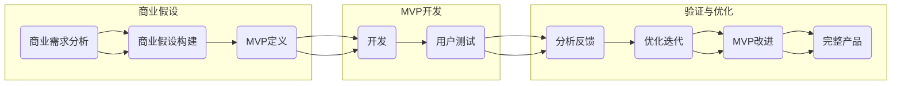

                 

### 文章标题

# 《一人公司的MVP策略：快速验证商业假设》

---

关键词：MVP、商业假设、产品开发、快速验证、商业战略

摘要：在现今竞争激烈的市场环境中，快速验证商业假设变得尤为重要。MVP（最小可行产品）策略提供了一种有效的方法，帮助个体创业者或“一人公司”在有限资源下，快速构建并验证商业想法。本文将深入探讨MVP策略的核心概念、构建方法、验证与优化过程，并结合实际案例，为读者提供从商业假设到完整产品的系统化指导。

---

### 目录大纲

1. **商业假设与MVP策略**

   1.1 商业假设的本质与重要性

   1.2 MVP策略概述

2. **构建MVP**

   2.1 如何定义MVP的目标

   2.2 MVP的核心功能与用户界面设计

   2.3 MVP的开发过程

3. **验证与优化**

   3.1 如何验证MVP

   3.2 优化MVP

   3.3 从MVP到完整产品的过渡

4. **附录**

   4.1 常用工具与资源

   4.2 MVP流程图

   4.3 伪代码与数学公式

   4.4 项目实战案例

---

### 引言

在当今快速变化和高度竞争的商业环境中，个体创业者或所谓的“一人公司”面临的挑战尤为突出。传统的产品开发流程往往需要大量时间和资金投入，这使得许多新兴公司难以在资源有限的情况下验证其商业假设。此时，MVP（最小可行产品）策略成为了一种重要的应对策略。

MVP策略的核心思想是通过构建一个具有核心功能的产品原型，以最小的资源投入快速验证市场需求和商业模式。这种方法不仅降低了失败的风险，还提高了创业公司在市场竞争中的灵活性和适应性。对于“一人公司”来说，MVP策略尤其重要，因为它能够帮助创业者集中有限的精力和资源，快速发现并解决产品中的问题，从而提高成功的机会。

本文旨在为读者提供一份详细的MVP策略指南，从商业假设的构建、MVP的构建过程、验证与优化，到最终产品的过渡，全面解析MVP策略在“一人公司”中的应用。通过阅读本文，读者将能够掌握MVP策略的核心原理，并在实际操作中灵活运用，从而在竞争激烈的市场中脱颖而出。

### 商业假设与MVP策略

#### 商业假设的本质与重要性

商业假设是企业在商业运作过程中对市场、用户需求、产品性能等方面所作的预期判断。它不仅为企业提供了方向，还为决策提供了依据。商业假设可以分为多种类型，包括市场假设、需求假设、技术假设和竞争假设等。

- **市场假设**：涉及对目标市场的规模、增长速度、用户结构等方面的预期判断。
- **需求假设**：关注用户对产品的需求程度、偏好和痛点。
- **技术假设**：关于实现产品功能所需的技术可行性、技术优势和潜在风险。
- **竞争假设**：分析竞争对手的优势、劣势和市场定位。

商业假设的重要性体现在以下几个方面：

1. **指导产品开发**：商业假设为产品开发提供了明确的方向和目标，确保资源投入的高效性。
2. **评估风险**：通过商业假设，企业可以提前识别潜在的风险，制定相应的应对措施。
3. **优化资源配置**：商业假设帮助企业在有限的资源下，优先解决关键问题和核心功能。
4. **增强竞争力**：有效的商业假设能够帮助企业找到差异化的竞争优势，在市场中占据有利位置。

#### 如何构建有效的商业假设

构建有效的商业假设需要系统的分析和科学的思维。以下是一些关键步骤和方法：

1. **市场调研**：通过市场调查、用户访谈、竞争对手分析等手段，收集市场相关数据。
2. **用户研究**：深入了解目标用户的需求、行为和痛点，确保假设的准确性。
3. **竞争分析**：分析竞争对手的产品、市场策略和用户反馈，识别自身产品的优势和不足。
4. **假设生成**：根据调研和分析结果，形成具体的商业假设。
5. **验证假设**：通过小规模的产品原型或测试，验证假设的可行性和准确性。

#### MVP策略概述

MVP（最小可行产品）是一种通过构建具有核心功能的产品原型，以最小成本快速验证商业假设的方法。MVP策略的核心思想是“做最少的努力，验证最关键的问题”，从而降低产品失败的风险，提高创业成功的可能性。

#### MVP的定义与作用

MVP并不是一个完整的产品，而是一个最小化但足够验证商业假设的原型。它通常包括以下特点：

- **核心功能**：仅包含实现产品核心价值的必要功能。
- **最小成本**：使用现有的技术和工具，以尽可能低的生产成本快速构建。
- **快速迭代**：通过用户反馈快速迭代和优化产品。

MVP的作用主要体现在以下几个方面：

1. **验证需求**：通过MVP，企业可以验证用户是否真的需要这个产品。
2. **降低风险**：MVP帮助企业在产品开发初期就发现并解决问题，降低失败风险。
3. **节约成本**：通过最小化功能和资源投入，降低开发成本。
4. **快速迭代**：MVP的快速迭代能力使得企业能够及时调整方向，适应市场变化。

#### MVP与传统产品的区别

与传统产品开发相比，MVP具有明显的特点和优势：

- **开发周期短**：MVP强调快速构建和验证，通常在几周到几个月内完成。
- **成本较低**：MVP通过最小化功能和资源投入，显著降低了开发成本。
- **灵活性高**：MVP具有高度的灵活性，可以根据用户反馈快速调整和优化产品。
- **迭代频繁**：MVP通常经过多次迭代，以不断完善产品功能和用户体验。

#### MVP的优势与局限性

MVP策略具有以下优势：

- **低成本**：通过最小化功能和资源投入，显著降低了开发成本。
- **快速验证**：MVP能够快速验证商业假设，降低失败风险。
- **灵活性**：MVP具有高度的灵活性，可以根据用户反馈快速调整和优化产品。

然而，MVP也存在一些局限性：

- **功能有限**：MVP通常只包含核心功能，可能导致用户体验不完整。
- **不适用于所有项目**：并非所有产品都适合使用MVP策略，有些产品需要更多的功能和特性。
- **可能带来资源浪费**：如果MVP验证失败，前期投入的资源可能无法完全回收。

综上所述，MVP策略在“一人公司”中具有广泛的应用价值，通过合理运用MVP策略，个体创业者可以在资源有限的情况下，快速验证商业假设，降低失败风险，提高创业成功率。接下来，我们将进一步探讨如何定义和构建MVP的目标，以及如何设计和开发MVP。

#### 如何定义MVP的目标

在构建MVP的过程中，明确目标至关重要。一个清晰的目标能够帮助创业者集中精力，确保MVP能够有效地验证商业假设。以下是定义MVP目标的关键步骤：

1. **明确产品目标与用户需求**

   首先，需要明确产品目标，即你希望通过MVP实现的具体商业目标。这通常涉及解决用户的具体问题或满足某种需求。例如，如果你正在开发一款健康管理应用，目标可能是帮助用户跟踪他们的日常活动，并提供建议。

   接下来，深入了解用户需求。通过用户调研、访谈和反馈，收集有关用户对产品的期望、喜好和痛点信息。这些数据将帮助你确定MVP的核心功能。

2. **确定MVP目标的确定方法**

   确定MVP目标的方法可以分为以下几种：

   - **最小可行功能**：选择实现产品核心价值的必要功能，确保MVP能够解决用户的主要问题。例如，对于健康管理应用，核心功能可能是活动跟踪和基础健康建议。
   - **关键指标**：定义能够衡量MVP成功与否的关键指标（KPI），例如用户注册率、用户活跃度或用户留存率。这些指标将帮助你在开发过程中保持目标导向。
   - **优先级排序**：根据用户需求和资源限制，对功能进行优先级排序。优先开发对用户价值最大且资源投入最少的特性。

3. **MVP目标与商业战略的关系**

   MVP目标应与企业的商业战略保持一致。商业战略通常涉及长期目标和市场定位，而MVP目标则是实现这些长期目标的短期步骤。以下是如何将MVP目标与商业战略结合的一些方法：

   - **验证战略假设**：使用MVP验证商业战略中的关键假设，例如市场需求、竞争环境或技术可行性。
   - **快速迭代**：通过MVP快速验证并调整商业战略，确保战略的实时性和适应性。
   - **资源优化**：根据MVP目标的反馈，优化资源配置，确保在有限的资源下实现最大的商业价值。

   实例：

   假设一家创业公司想要开发一款社交电商平台。其商业战略是利用社交媒体的强大影响力，为用户提供便捷的购物体验。以下是确定MVP目标的过程：

   - **产品目标**：提供一种便捷的社交购物方式，让用户可以轻松发现和购买心仪的商品。
   - **用户需求**：用户希望在社交媒体上分享购物体验，并能够轻松找到优惠和热门商品。
   - **关键指标**：用户注册率、商品浏览量、订单量。
   - **优先级排序**：首先实现社交分享功能，然后添加商品推荐和优惠信息展示。
   - **商业战略关系**：通过MVP验证用户是否对社交购物有需求，以及平台能否在竞争中脱颖而出。

通过明确MVP目标，创业者可以确保MVP在有限的资源下最大限度地验证商业假设，从而为后续的产品开发和商业战略提供可靠的数据支持。接下来，我们将探讨如何确定MVP的核心功能与用户界面设计。

#### MVP的核心功能与用户界面设计

在构建MVP时，确定核心功能是至关重要的一步。核心功能不仅定义了产品的价值主张，还确保了产品能够在最短时间内满足用户需求。以下是确定MVP核心功能的方法：

1. **分析用户需求**

   - **用户访谈**：与目标用户进行面对面访谈，深入了解他们的需求和痛点。
   - **用户调研**：通过问卷调查、在线调查等方式，收集大量用户反馈。
   - **市场研究**：分析竞争对手的产品功能，找出用户可能未满足的需求。

2. **功能优先级排序**

   - **优先解决用户最紧迫的问题**：识别用户最为关心的需求，将其作为MVP的核心功能。
   - **最小功能集合**：确保MVP包含实现核心价值所需的最少功能，避免功能过度复杂。
   - **关键指标**：根据关键指标（如用户留存率、用户活跃度）对功能进行优先级排序。

3. **技术可行性分析**

   - **现有技术**：评估现有技术是否能够实现所需功能，并确保开发成本低、周期短。
   - **资源限制**：考虑人力资源、资金和技术设备的限制，确保功能在可承受范围内实现。

确定了MVP的核心功能后，接下来需要设计用户界面（UI）。良好的UI设计不仅能够提升用户体验，还能增强用户对产品的信任和满意度。以下是MVP用户界面设计的原则：

1. **简洁性**

   - **减少冗余功能**：避免过多的菜单、按钮和选项，确保界面简洁直观。
   - **清晰的信息层次**：使用适当的排版、颜色和图标，帮助用户快速理解界面结构和操作流程。

2. **用户友好性**

   - **直观操作**：确保用户可以轻松完成关键操作，减少学习成本。
   - **错误提示**：提供清晰的错误提示和操作指南，帮助用户纠正错误。

3. **响应速度**

   - **快速加载**：优化页面加载速度，减少用户等待时间。
   - **流畅交互**：确保用户与产品的交互流畅无卡顿。

4. **一致性**

   - **统一风格**：使用一致的视觉元素和设计语言，提高界面的整体美感。
   - **平台适配**：确保MVP在不同设备和操作系统上的一致性。

5. **可测试性**

   - **易于修改**：设计界面时考虑到未来可能的功能扩展和调整。
   - **用户测试**：通过用户测试不断优化UI设计，确保用户满意度。

实例：

假设一家创业公司开发了一款社交电商平台，以下是确定核心功能和用户界面设计的过程：

**核心功能**：

- **社交分享**：用户可以在平台上分享购物体验，增加互动性。
- **商品浏览和推荐**：提供热门商品和优惠信息，吸引用户浏览和购买。
- **订单跟踪**：用户可以查看订单状态和物流信息。

**用户界面设计**：

- **简洁首页**：首页设计简洁，突出社交分享和商品推荐功能。
- **直观购物流程**：从商品浏览到下单支付，流程简单直观，减少用户操作步骤。
- **快速响应**：优化页面加载速度，确保用户在浏览商品时体验流畅。
- **一致性设计**：统一图标、颜色和字体，确保平台在不同设备和操作系统上一致。

通过明确MVP的核心功能和设计用户界面，创业者可以构建一个具有吸引力和实用性的产品原型，从而为后续的验证和优化奠定基础。接下来，我们将探讨MVP的开发过程。

#### MVP的开发过程

MVP（最小可行产品）的开发过程是确保产品在有限资源下快速验证商业假设的关键。以下是开发MVP的具体步骤和注意事项：

1. **需求分析与规划**

   - **需求文档**：编写详细的需求文档，明确产品的功能、用户界面和性能要求。
   - **优先级排序**：根据用户需求和资源限制，对需求进行优先级排序，确保开发团队能够集中精力完成最重要的功能。

2. **技术选型**

   - **技术栈选择**：根据需求文档，选择适合的技术栈和开发工具，如编程语言、框架、数据库等。
   - **现有技术利用**：优先考虑利用现有的技术和工具，以降低开发成本和风险。

3. **开发环境搭建**

   - **本地开发环境**：配置本地开发环境，确保开发团队能够在本地进行开发和调试。
   - **持续集成/持续部署（CI/CD）**：搭建CI/CD流程，实现代码自动化测试和部署，提高开发效率。

4. **编码与测试**

   - **模块化开发**：将需求分解为多个模块，分阶段进行开发，确保每个模块的功能完整和稳定。
   - **代码审查**：进行代码审查，确保代码质量，避免潜在的错误和漏洞。
   - **单元测试**：编写单元测试，验证每个模块的功能和性能。

5. **用户测试**

   - **用户测试计划**：制定用户测试计划，包括测试人员、测试场景和测试指标。
   - **测试执行**：在开发过程中进行持续的用户测试，收集用户反馈，及时调整和优化产品。

6. **迭代与优化**

   - **快速迭代**：根据用户反馈和测试结果，进行快速迭代和优化，不断改进产品。
   - **性能优化**：对MVP进行性能优化，确保产品在不同环境下稳定运行。

7. **发布与维护**

   - **发布计划**：制定发布计划，确保MVP按时上线。
   - **运维支持**：提供必要的运维支持，确保产品的稳定性和安全性。

**注意事项**：

- **资源管理**：确保在资源有限的情况下，优先完成核心功能，避免功能过度扩展。
- **风险管理**：提前识别和应对潜在的风险，如技术问题、市场变化等。
- **用户反馈**：重视用户反馈，将其作为优化产品的重要依据。

通过以上步骤，创业者可以有效地开发MVP，快速验证商业假设，为后续的产品开发和市场推广奠定基础。接下来，我们将探讨如何验证MVP。

#### 如何验证MVP

验证MVP是确保产品满足市场需求和用户期望的关键步骤。以下是一些关键的方法和技巧：

1. **用户测试**

   用户测试是验证MVP的最直接方法，通过观察用户在实际使用产品时的行为和反馈，可以深入了解产品的易用性、功能和用户满意度。

   - **测试场景设计**：设计一系列符合用户日常使用场景的测试任务，确保测试结果具有代表性。
   - **观察与记录**：观察用户在完成任务时的操作，记录他们的反应、困惑和错误操作。
   - **访谈与问卷**：在测试过程中与用户进行访谈或问卷调查，收集他们对产品的意见和反馈。

2. **数据分析**

   通过分析用户行为数据，可以量化地了解产品的使用情况，从而发现潜在的问题和改进点。

   - **关键指标**：定义和跟踪关键指标（如用户活跃度、留存率、转化率），这些指标可以帮助评估产品的成功程度。
   - **A/B测试**：通过A/B测试，比较不同设计或功能的用户行为数据，找出最有效的方案。
   - **数据分析工具**：使用数据分析工具（如Google Analytics、Mixpanel等）收集和可视化数据。

3. **用户反馈**

   用户反馈是获取真实用户感受的重要途径，通过反馈可以了解用户对产品的具体意见和期望。

   - **反馈渠道**：提供多种反馈渠道（如在线问卷、反馈表、社交媒体等），方便用户表达意见。
   - **处理反馈**：及时响应用户反馈，认真分析并处理用户提出的问题和建议。
   - **反馈机制**：建立反馈机制，鼓励用户持续反馈，形成良性循环。

4. **市场调研**

   市场调研可以帮助创业者了解市场趋势、竞争对手情况以及目标用户需求。

   - **市场分析**：通过市场调研报告、行业分析等手段，了解市场的现状和未来趋势。
   - **竞争对手分析**：分析竞争对手的产品功能、用户评价和市场表现，找出自身的优势和不足。
   - **用户需求调研**：通过问卷调查、访谈等方式，收集目标用户对产品和市场的看法和需求。

5. **验证方法**

   验证MVP可以采用以下几种方法：

   - **最小可行性测试**：通过最小化功能，确保产品能够解决用户的核心问题，快速验证市场可行性。
   - **快速迭代**：通过持续的用户测试和反馈，快速迭代产品，不断优化功能。
   - **假设验证**：根据商业假设，设计验证方案，通过实验或数据分析验证假设的正确性。

实例：

假设一家创业公司开发了一款社交电商平台，以下是验证MVP的具体步骤：

- **用户测试**：设计测试场景，如用户在平台上浏览商品、添加商品到购物车、完成支付等，观察用户的行为和反馈。
- **数据分析**：跟踪用户活跃度、留存率、转化率等关键指标，分析用户的使用模式和偏好。
- **用户反馈**：通过在线问卷和社交媒体，收集用户对平台的意见，如界面设计、功能使用等。
- **市场调研**：分析市场报告和竞争对手产品，了解市场趋势和用户需求。
- **验证方法**：通过A/B测试，比较不同界面的用户行为数据，确定最佳设计方案。

通过上述验证方法，创业公司可以全面了解产品的市场表现和用户满意度，从而为后续的产品优化和商业决策提供有力支持。

#### 优化MVP

在验证了MVP之后，下一步是优化MVP，使其更接近最终产品的形态。优化MVP的过程不仅涉及功能的迭代和扩展，还包括用户体验的改进和技术细节的优化。以下是一些具体的优化策略：

1. **根据反馈调整产品方向**

   用户反馈是优化MVP的重要依据。通过分析用户反馈，可以发现产品的优点和不足，从而明确优化方向。

   - **关键反馈分析**：识别出用户反馈中最具影响力和频率的问题，优先解决。
   - **优先级排序**：根据反馈的重要性和资源限制，对优化任务进行优先级排序，确保最重要的改进首先实施。
   - **用户参与**：鼓励用户参与产品优化过程，通过用户访谈、焦点小组等方式收集更多的反馈。

2. **功能迭代与扩展策略**

   功能迭代和扩展是MVP向最终产品过渡的核心步骤。以下是一些具体策略：

   - **核心功能增强**：对MVP的核心功能进行增强，提高其稳定性和用户体验。
   - **新增功能**：根据用户反馈和市场需求，逐步添加新的功能，扩大产品的功能范围。
   - **模块化开发**：采用模块化开发方式，确保新增功能可以独立开发、测试和部署，提高开发效率。

3. **用户体验优化**

   用户体验是产品成功的关键因素。以下是一些优化用户体验的策略：

   - **界面优化**：改进UI设计，使其更加简洁、直观和一致，提高用户满意度。
   - **交互优化**：优化用户与产品的交互流程，减少用户操作步骤，提高操作效率。
   - **响应速度**：优化产品性能，提高页面加载速度和交互响应速度，提升用户体验。

4. **技术细节优化**

   技术细节的优化对于提高产品的稳定性和可维护性至关重要。以下是一些具体策略：

   - **代码优化**：对现有代码进行优化，提高代码的可读性和可维护性。
   - **性能优化**：对数据库查询、网络请求等性能瓶颈进行优化，提高系统的响应速度和处理能力。
   - **安全优化**：加强产品的安全性，防止潜在的安全漏洞，保护用户数据。

实例：

假设一家创业公司开发的社交电商平台在MVP验证阶段收集到以下用户反馈：

- **界面设计**：用户反馈界面不够美观，操作复杂。
- **响应速度**：加载速度慢，特别是在商品浏览页面。
- **功能缺失**：用户希望添加更多社交互动功能，如评论和点赞。

针对这些反馈，公司可以采取以下优化策略：

- **界面优化**：重新设计UI，采用更简洁和直观的界面布局，增加视觉元素，提升用户满意度。
- **响应速度优化**：通过缓存技术、代码优化等手段，提高页面加载速度和交互响应速度。
- **功能扩展**：添加评论和点赞功能，增强平台的社交互动性。

通过这些优化措施，社交电商平台将更符合用户期望，提高用户满意度和市场竞争力。接下来，我们将探讨如何从MVP过渡到完整产品。

#### 从MVP到完整产品的过渡

在MVP阶段，产品验证了市场需求和商业模式，接下来就是将MVP转化为一个功能完备、用户体验优良的完整产品。以下是如何从MVP过渡到完整产品的详细步骤：

1. **功能扩展**

   MVP的核心功能验证了市场需求，但完整产品需要更多功能来满足用户多样化的需求。以下是一些功能扩展的策略：

   - **逐步增加**：根据用户反馈和市场需求，逐步增加功能，避免一次性添加过多导致开发压力和用户适应困难。
   - **优先级排序**：对新增功能进行优先级排序，确保最重要的功能和用户最期望的功能优先开发。
   - **模块化开发**：采用模块化开发方式，确保新增功能可以独立开发和部署，提高开发效率。

2. **用户体验改进**

   用户界面的优化和交互设计的提升是完整产品成功的关键。以下是一些具体的改进措施：

   - **UI/UX设计**：重新设计用户界面，确保美观性和一致性，提高用户满意度。
   - **交互流程优化**：简化用户操作流程，减少冗余步骤，提高用户操作效率。
   - **性能提升**：优化页面加载速度和响应速度，确保用户体验流畅。

3. **技术优化**

   技术层面的优化对于完整产品的稳定性和可维护性至关重要。以下是一些技术优化措施：

   - **代码重构**：对现有代码进行重构，提高代码的可读性和可维护性。
   - **性能调优**：对数据库查询、网络请求等性能瓶颈进行优化，提高系统的响应速度和处理能力。
   - **安全性增强**：加强产品的安全性，防止潜在的安全漏洞，保护用户数据。

4. **持续反馈与迭代**

   过渡过程中，持续收集用户反馈并进行迭代是关键。以下是一些具体的做法：

   - **用户测试**：在功能扩展和优化过程中，定期进行用户测试，确保新功能和改进措施满足用户需求。
   - **反馈机制**：建立高效的反馈机制，确保用户能够方便地提交意见和建议。
   - **敏捷开发**：采用敏捷开发方法，快速响应市场变化和用户需求，持续改进产品。

5. **团队与资源调整**

   从MVP到完整产品的过渡可能需要团队结构和资源的调整。以下是一些建议：

   - **增加团队规模**：根据项目需求增加开发、测试和运维人员，确保项目顺利进行。
   - **专业化分工**：细化团队分工，让每个团队成员专注于自己擅长的工作，提高工作效率。
   - **资源整合**：优化资源分配，确保在关键阶段有足够的资源支持。

实例：

假设一家创业公司开发的社交电商平台在MVP阶段获得了用户的积极反馈，决定将其扩展为完整产品。以下是具体的过渡步骤：

- **功能扩展**：添加用户评论、点赞和社交分享功能，提升平台的互动性。
- **用户体验改进**：优化用户界面设计，简化购物流程，提高用户体验。
- **技术优化**：重构代码，优化数据库查询，增强产品性能和安全性。
- **持续迭代**：定期进行用户测试，收集反馈，持续优化产品。
- **团队与资源调整**：增加开发人员，细化分工，确保项目顺利推进。

通过上述步骤，社交电商平台从MVP成功过渡到了完整产品，进一步提升了用户满意度和市场竞争力。

#### 附录A：常用工具与资源

在MVP开发过程中，使用合适的工具和资源可以大大提高开发效率和产品成功率。以下是一些常用的工具和资源：

1. **开发工具**

   - **编程语言**：Python、JavaScript、Java等。
   - **框架**：React、Angular、Vue.js等前端框架，Django、Flask、Spring Boot等后端框架。
   - **数据库**：MySQL、PostgreSQL、MongoDB等。

2. **项目管理工具**

   - **版本控制**：Git、SVN等。
   - **任务管理**：Jira、Trello、Asana等。
   - **文档管理**：Confluence、GitLab、Notion等。

3. **测试工具**

   - **自动化测试**：Selenium、Jest、Mocha等。
   - **性能测试**：JMeter、LoadRunner等。
   - **安全测试**：OWASP ZAP、Nessus等。

4. **数据分析工具**

   - **数据分析平台**：Google Analytics、Mixpanel、Segment等。
   - **数据库查询工具**：SQL、Postman等。

5. **市场调研工具**

   - **调查问卷**：SurveyMonkey、Google表单等。
   - **社交媒体分析**：Twitter Analytics、Facebook Insights等。

6. **案例与经验分享**

   - **在线资源**：Medium、Product Hunt、TechCrunch等。
   - **书籍**：《精益创业》、《产品经理手册》等。

通过合理利用这些工具和资源，创业者可以更加高效地构建和优化MVP，从而提高产品的市场竞争力。

#### 附录B：MVP流程图

为了更直观地展示MVP的开发流程，我们使用Mermaid语言绘制了一个流程图。以下是MVP流程图的描述和示例：



上述流程图展示了从商业需求分析到商业假设构建，再从MVP定义到开发、用户测试、分析反馈、优化迭代，最终过渡到完整产品的整个过程。通过这一流程，创业者可以系统地验证和优化产品，确保MVP的成功。

#### 附录C：伪代码与数学公式

在本附录中，我们将提供与MVP构建、验证和优化相关的一些伪代码和数学公式，以帮助读者更好地理解MVP策略的核心算法原理。

**伪代码：MVP目标确定算法**

```python
function define_MVP_goals(user Needs, resource Constraints):
    goals = []
    for need in user Needs:
        if resource Constraints.can_fulfill(need):
            goals.append(need)
    return goals
```

**数学公式：用户测试数据分析**

为了评估用户测试结果，可以使用以下公式：

$$ \text{满意度得分} = \frac{\text{正面反馈次数}}{\text{总反馈次数}} \times 100\% $$

**优化策略公式：**

$$ \text{优化优先级} = \frac{\text{改进效果}}{\text{成本}} $$

**实例讲解：**

假设我们对一个社交电商平台进行用户测试，收集了以下数据：

- **正面反馈次数**：200次
- **总反馈次数**：500次

则满意度得分为：

$$ \text{满意度得分} = \frac{200}{500} \times 100\% = 40\% $$

如果针对不同功能的改进成本和预期效果如下：

- **功能A**：改进效果=1000，成本=2000
- **功能B**：改进效果=800，成本=1500

则优化优先级为：

$$ \text{优化优先级}_{A} = \frac{1000}{2000} = 0.5 $$
$$ \text{优化优先级}_{B} = \frac{800}{1500} \approx 0.533 $$

由此可见，功能B具有更高的优化优先级。

通过这些伪代码和数学公式，读者可以更深入地理解MVP策略中的关键算法和数据分析方法，从而在实际操作中更加有效地运用MVP策略。

#### 附录D：项目实战案例

在本附录中，我们将通过一个实际的项目案例，详细讲解如何使用MVP策略进行产品开发、验证和优化。

**项目背景与目标**

假设一家初创公司想要开发一款在线教育平台，旨在为用户提供高质量的教育资源和学习工具。公司的目标是验证市场对于在线教育平台的需求，并通过MVP策略快速找到产品方向。

**MVP核心功能与用户界面设计**

根据用户需求和市场分析，MVP的核心功能包括：

- **课程浏览与搜索**：用户可以浏览和搜索不同类别的课程。
- **课程播放**：用户可以在线观看课程视频。
- **用户注册与登录**：提供简单的注册和登录功能。
- **课程评价**：用户可以对课程进行评价和评分。

用户界面设计遵循简洁、直观的原则，界面主要包括以下几个部分：

- **首页**：展示热门课程和推荐课程。
- **课程列表**：列出所有课程，支持搜索和筛选。
- **课程详情**：显示课程信息、视频播放和评价。
- **个人中心**：用户可以查看自己的学习记录和评价。

**MVP开发过程与代码解读**

MVP的开发采用了以下技术栈：

- **前端**：使用React框架进行开发。
- **后端**：采用Node.js和Express框架。
- **数据库**：使用MongoDB进行数据存储。

以下是课程搜索功能的伪代码实现：

```javascript
// 课程搜索功能
async function searchCourses(query) {
    const courses = await CourseModel.find({ name: { $regex: query, $options: "i" });
    return courses;
}
```

这个函数使用MongoDB的`find`方法，根据用户输入的查询字符串搜索匹配的课程，返回结果。同时，使用了正则表达式进行模糊匹配，提高搜索的灵活性。

**代码应用解读与分析**

在开发过程中，我们通过以下步骤确保代码质量和应用效果：

- **模块化开发**：将不同的功能模块（如用户注册、课程搜索等）进行分离，确保每个模块的独立性。
- **单元测试**：编写单元测试，验证每个模块的功能和性能。
- **性能优化**：对数据库查询进行优化，确保搜索功能的响应速度。

**MVP验证与优化过程**

在MVP上线后，我们进行了以下验证和优化：

- **用户测试**：邀请潜在用户进行测试，收集他们的使用体验和反馈。
- **数据分析**：通过Google Analytics等工具，收集用户行为数据，分析用户对平台的使用情况。

根据用户反馈和数据分析，我们进行了以下优化：

- **搜索功能优化**：增加搜索建议和热门关键词，提高搜索体验。
- **用户界面改进**：优化页面布局，提高用户体验。
- **课程评价机制改进**：增加评价排序功能，方便用户找到高质量的课程。

**从MVP到完整产品的过渡与效果评估**

在MVP阶段结束后，我们逐步增加了更多功能，如课程订阅、在线讨论区、学习计划等，使平台更加完善。

最终产品的效果评估通过以下指标进行：

- **用户满意度**：通过用户问卷调查和在线反馈，评估用户对产品的满意度。
- **用户留存率**：通过数据分析，评估用户在平台上的活跃度和留存情况。
- **课程完成率**：通过用户学习记录，评估课程的受欢迎程度和有效性。

通过MVP策略的应用，这家初创公司成功验证了在线教育平台的市场需求，并在产品开发过程中不断优化和改进，最终推出了一款用户满意、市场竞争力强的在线教育平台。

**项目小结**

本案例展示了如何通过MVP策略从商业假设到完整产品的全过程。MVP策略的核心优势在于其低成本、快速验证和高灵活性，使创业者能够在有限资源下找到产品方向，降低失败风险。

通过本项目，我们得到了以下结论：

- **需求驱动**：始终以用户需求为导向，确保产品功能符合用户期望。
- **快速迭代**：通过持续的用户测试和反馈，不断优化产品。
- **资源优化**：在资源有限的情况下，优先解决核心问题，确保高效开发。

**最佳实践 Tips**

- **尽早用户测试**：尽早进行用户测试，及时收集反馈，避免后期大规模返工。
- **数据分析**：充分利用数据分析工具，量化用户行为，为产品优化提供数据支持。
- **敏捷开发**：采用敏捷开发方法，快速响应市场变化和用户需求。

**注意事项**

- **风险管理**：提前识别和应对潜在的风险，如技术难题、市场变化等。
- **持续投入**：即使MVP验证成功，也需要持续投入资源进行产品优化和市场推广。

**拓展阅读**

- 《精益创业》埃里克·莱斯
- 《产品经理手册》史蒂夫·布兰克
- 《用户故事映射》史蒂夫·布兰克

通过以上实战案例和最佳实践，创业者可以更好地理解MVP策略的应用，并在实际操作中灵活运用，提高产品的市场竞争力。

### 结论

MVP（最小可行产品）策略在当今竞争激烈的市场环境中具有不可替代的价值。通过构建具有核心功能的产品原型，创业者可以在有限的资源下快速验证商业假设，降低失败风险，提高创业成功率。本文详细探讨了MVP策略的核心概念、构建方法、验证与优化过程，并结合实际案例，为读者提供了系统化的指导。

在应用MVP策略时，创业者应始终坚持需求驱动，尽早进行用户测试，充分利用数据分析工具，保持敏捷开发。同时，要注重风险管理，持续投入资源进行产品优化和市场推广。

展望未来，MVP策略将继续在产品开发中发挥重要作用。随着技术的进步和用户需求的变化，创业者需要不断调整和优化MVP策略，以适应市场的动态变化。通过持续学习和实践，创业者可以更好地运用MVP策略，在竞争激烈的市场中脱颖而出。

作者：AI天才研究院/AI Genius Institute & 禅与计算机程序设计艺术/Zen And The Art of Computer Programming

---

本文内容旨在为读者提供有价值的指导，但并不构成具体业务建议。在应用MVP策略时，请根据自身实际情况和市场需求进行决策。

