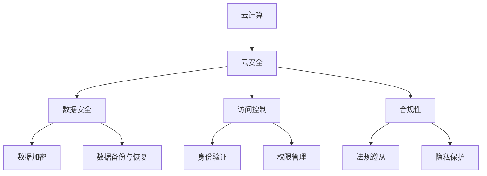
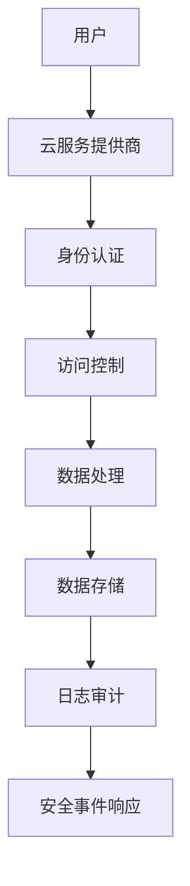
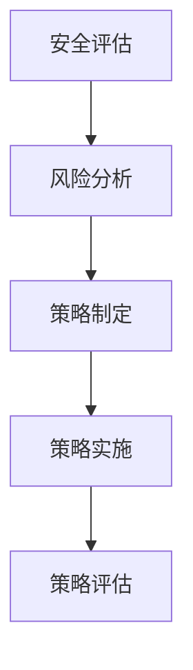
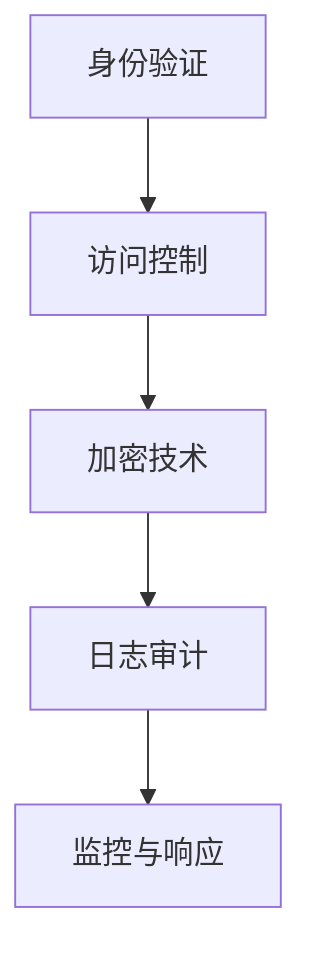
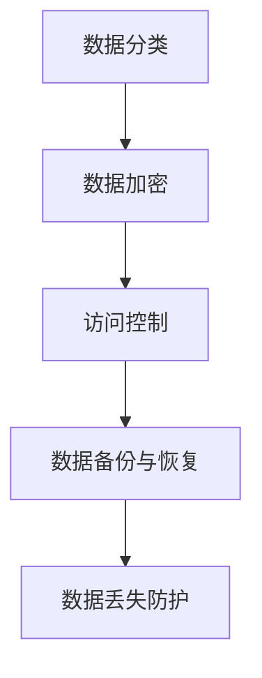
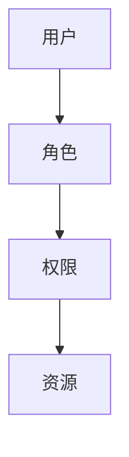
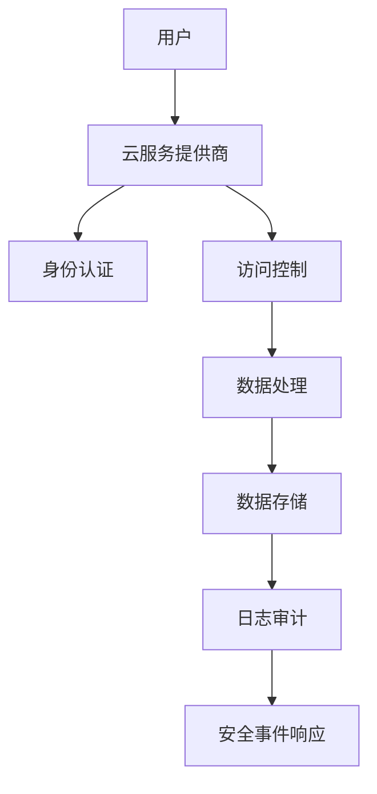

                 

### 文章标题

# 《一人公司的云安全最佳实践》

### 关键词

- 云安全
- 云服务
- 数据保护
- 访问控制
- 加密技术

### 摘要

随着云计算的普及，云安全成为企业特别是小型公司面临的重大挑战。本文旨在为一人公司提供系统化的云安全最佳实践，涵盖云安全概述、体系结构、核心技术、实践方法、风险管理和合规性等方面。通过详细分析云计算与云安全的关系，介绍云安全模型和架构，探讨加密技术、认证与授权等核心机制，并给出云安全策略制定、风险识别与管理、防护实践、监控与响应以及合规性实施的详细步骤，为一人公司打造安全的云环境提供实用指南。

## 《一人公司的云安全最佳实践》目录大纲

### 第一部分：云安全基础

### 第1章：云安全概述

#### 1.1 云计算与云安全

##### 1.1.1 云计算的发展历程

##### 1.1.2 云安全的核心问题

##### 1.1.3 云安全的基本概念

**流程图：云计算与云安全的关系**



### 第2章：云安全体系结构

#### 2.1 云安全模型

##### 2.1.1 组件化安全模型

##### 2.1.2 敏感数据安全模型

##### 2.1.3 基于角色的访问控制模型

**流程图：云安全体系结构概览**



### 第3章：云安全核心技术

#### 3.1 加密技术

##### 3.1.1 对称加密算法

##### 3.1.2 非对称加密算法

##### 3.1.3 哈希算法

**伪代码：对称加密算法实现**

```python
def EncryptWithSymmetricAlgorithm(plaintext, key):
    # 初始化加密算法
    cipher = initialize_cipher(algorithm, key)
    
    # 加密文本
    ciphertext = cipher.encrypt(plaintext)
    
    return ciphertext
```

**伪代码：非对称加密算法实现**

```python
def EncryptWithAsymmetricAlgorithm(plaintext, public_key):
    # 初始化加密算法
    cipher = initialize_cipher(algorithm, public_key)
    
    # 加密文本
    ciphertext = cipher.encrypt(plaintext)
    
    return ciphertext
```

**伪代码：哈希算法实现**

```python
def ComputeHash(message, hash_function):
    # 计算消息的哈希值
    hash_value = hash_function(message)
    
    return hash_value
```

### 第二部分：云安全实践

### 第4章：云安全策略制定

#### 4.1 云安全策略概述

##### 4.1.1 云安全策略的重要性

##### 4.1.2 云安全策略的制定原则

##### 4.1.3 云安全策略的内容

#### 4.2 云安全策略制定方法

##### 4.2.1 安全评估

##### 4.2.2 风险分析

##### 4.2.3 策略制定步骤

**流程图：云安全策略制定流程**



### 第5章：云安全风险识别与管理

#### 5.1 云安全风险评估

##### 5.1.1 风险评估方法

##### 5.1.2 风险评估步骤

##### 5.1.3 风险评估报告

#### 5.2 云安全风险应对

##### 5.2.1 风险缓解措施

##### 5.2.2 风险转移策略

##### 5.2.3 风险接受策略

#### 5.3 云安全风险管理

##### 5.3.1 风险管理计划

##### 5.3.2 风险管理流程

##### 5.3.3 风险管理工具

### 第6章：云安全防护实践

#### 6.1 防火墙配置与管理

##### 6.1.1 防火墙类型

##### 6.1.2 防火墙配置

##### 6.1.3 防火墙管理

#### 6.2 加密技术应用

##### 6.2.1 对称加密应用

##### 6.2.2 非对称加密应用

##### 6.2.3 哈希算法应用

#### 6.3 入侵检测与防范

##### 6.3.1 入侵检测系统（IDS）

##### 6.3.2 入侵防御系统（IPS）

##### 6.3.3 入侵防范策略

### 第7章：云安全监控与响应

#### 7.1 云安全监控概述

##### 7.1.1 安全监控的重要性

##### 7.1.2 安全监控内容

##### 7.1.3 安全监控工具

#### 7.2 安全事件响应

##### 7.2.1 事件响应流程

##### 7.2.2 事件响应策略

##### 7.2.3 事件响应工具

#### 7.3 云安全日志分析

##### 7.3.1 日志分析方法

##### 7.3.2 日志分析工具

##### 7.3.3 日志分析案例

### 第8章：云安全合规性

#### 8.1 云安全法律法规

##### 8.1.1 国际法律法规

##### 8.1.2 国内法律法规

##### 8.1.3 法律法规趋势

#### 8.2 云安全合规性要求

##### 8.2.1 合规性标准

##### 8.2.2 合规性评估

##### 8.2.3 合规性实施

#### 8.3 云安全合规性实施

##### 8.3.1 合规性审计

##### 8.3.2 合规性培训

##### 8.3.3 合规性持续改进

### 第三部分：云安全案例与实战

### 第9章：云安全实战案例

#### 9.1 云安全事件案例分析

##### 9.1.1 事件背景

##### 9.1.2 事件分析

##### 9.1.3 事件应对

#### 9.2 云安全防护方案设计

##### 9.2.1 防护方案目标

##### 9.2.2 防护方案设计

##### 9.2.3 防护方案实施

#### 9.3 云安全事件应急处理

##### 9.3.1 应急预案

##### 9.3.2 应急响应

##### 9.3.3 应急总结

### 第10章：云安全工具与应用

#### 10.1 云安全工具概述

##### 10.1.1 工具分类

##### 10.1.2 工具特点

##### 10.1.3 工具选用原则

#### 10.2 常用云安全工具介绍

##### 10.2.1 入门级工具

##### 10.2.2 中级工具

##### 10.2.3 高级工具

#### 10.3 云安全工具集成与应用

##### 10.3.1 工具集成策略

##### 10.3.2 工具应用案例

### 第11章：云安全发展趋势与展望

#### 11.1 云安全发展趋势

##### 11.1.1 技术趋势

##### 11.1.2 市场趋势

##### 11.1.3 应用趋势

#### 11.2 云安全未来展望

##### 11.2.1 发展方向

##### 11.2.2 技术创新

##### 11.2.3 趋势预测

#### 11.3 云安全技术创新

##### 11.3.1 加密技术

##### 11.3.2 AI与安全

##### 11.3.3 增强现实与安全

## 第一部分：云安全基础

### 第1章：云安全概述

#### 1.1 云计算与云安全

云计算作为信息技术发展的新趋势，已成为现代企业数字化转型的重要支撑。云计算通过互联网提供动态易扩展且经常是虚拟化的资源，使得用户可以按需访问和使用计算资源，降低了企业的IT成本，提高了资源利用率。然而，云计算的广泛应用也带来了新的安全挑战。

##### 1.1.1 云计算的发展历程

云计算的发展大致可分为三个阶段：基础设施即服务（IaaS）、平台即服务（PaaS）和软件即服务（SaaS）。IaaS最早出现，提供虚拟化的计算资源，如虚拟机、存储和网络的租用。PaaS随后兴起，为开发者提供开发平台和工具，使开发者可以专注于应用开发而非基础设施管理。SaaS则是云计算的成熟形态，将完整的软件解决方案通过网络提供给用户，用户无需购买和安装软件。

##### 1.1.2 云安全的核心问题

云安全的核心问题包括数据安全、访问控制和合规性。数据安全主要涉及数据在传输、存储和处理过程中的保密性、完整性和可用性。访问控制旨在确保只有授权用户可以访问云资源和服务。合规性则关注企业是否遵守相关的法律法规和标准，如数据保护法、隐私法规等。

##### 1.1.3 云安全的基本概念

云安全涉及多个基本概念，包括：

- **身份验证**：验证用户身份的过程，确保只有合法用户可以访问系统。
- **授权**：确定用户在系统中可以执行的操作和访问的资源。
- **加密**：通过加密算法保护数据，确保数据在传输和存储过程中不被窃取。
- **日志审计**：记录系统活动和事件，以便在出现问题时进行追踪和分析。
- **合规性**：确保企业遵守相关的法律法规和行业标准。
- **监控与响应**：实时监控系统状态，及时响应和处理安全事件。

这些概念共同构成了云安全的基础，确保企业能够在云环境中建立安全的运营环境。

**流程图：云计算与云安全的关系**


### 第2章：云安全体系结构

云安全体系结构是构建安全云环境的关键，它包括安全模型、架构和协议等组成部分。了解这些组件及其相互关系对于设计有效的云安全策略至关重要。

#### 2.1 云安全模型

云安全模型可以分为三类：组件化安全模型、敏感数据安全模型和基于角色的访问控制模型。

##### 2.1.1 组件化安全模型

组件化安全模型将云安全分解为若干独立的组件，每个组件负责不同的安全功能。例如，身份验证、访问控制、加密和监控等。这种模型的好处在于灵活性和可扩展性，允许企业根据需要选择和配置不同的安全组件。

**流程图：组件化安全模型**



##### 2.1.2 敏感数据安全模型

敏感数据安全模型专注于保护云中敏感数据的安全。这种模型通常包括数据分类、数据加密、访问控制和数据丢失防护等组件。敏感数据安全模型的关键在于确保敏感数据在不同存储和处理阶段都受到严格的安全保护。

**流程图：敏感数据安全模型**



##### 2.1.3 基于角色的访问控制模型

基于角色的访问控制模型（RBAC）是一种常用的访问控制机制，它根据用户的角色来分配权限。每个角色都有预定义的权限集，用户只能执行与其角色相关的操作。这种模型简化了权限管理，提高了安全性。

**流程图：基于角色的访问控制模型**



**流程图：云安全体系结构概览**



### 第3章：云安全核心技术

云安全的核心技术包括加密技术、认证与授权、防火墙与入侵检测等。这些技术是构建安全云环境的基础，确保数据在传输和存储过程中的安全性。

#### 3.1 加密技术

加密技术是云安全的基础，通过加密算法保护数据的保密性和完整性。加密技术分为对称加密和非对称加密两种。

##### 3.1.1 对称加密算法

对称加密算法使用相同的密钥进行加密和解密。常见的对称加密算法有AES（高级加密标准）和DES（数据加密标准）。

**伪代码：对称加密算法实现**

```python
def EncryptWithSymmetricAlgorithm(plaintext, key):
    # 初始化加密算法
    cipher = initialize_cipher(algorithm, key)
    
    # 加密文本
    ciphertext = cipher.encrypt(plaintext)
    
    return ciphertext
```

##### 3.1.2 非对称加密算法

非对称加密算法使用一对密钥，公钥用于加密，私钥用于解密。常见的非对称加密算法有RSA和ECC。

**伪代码：非对称加密算法实现**

```python
def EncryptWithAsymmetricAlgorithm(plaintext, public_key):
    # 初始化加密算法
    cipher = initialize_cipher(algorithm, public_key)
    
    # 加密文本
    ciphertext = cipher.encrypt(plaintext)
    
    return ciphertext
```

##### 3.1.3 哈希算法

哈希算法用于生成数据的数字指纹，确保数据的完整性。常见的哈希算法有MD5、SHA-1和SHA-256。

**伪代码：哈希算法实现**

```python
def ComputeHash(message, hash_function):
    # 计算消息的哈希值
    hash_value = hash_function(message)
    
    return hash_value
```

### 第二部分：云安全实践

#### 第4章：云安全策略制定

云安全策略是企业确保云环境安全的重要手段。一个有效的云安全策略可以帮助企业识别风险、制定应对措施，并确保所有安全措施得到正确实施。

##### 4.1 云安全策略概述

云安全策略是企业针对云环境制定的一系列安全规则和指导原则。这些规则和原则旨在保护企业的数据、应用程序和系统不受恶意攻击和未授权访问。云安全策略应包括以下几个关键方面：

- **安全目标**：明确企业希望通过云安全策略实现的目标，如数据保护、合规性、风险缓解等。
- **安全原则**：确定企业遵循的安全原则，如最小权限原则、防御深度原则、防御多样性原则等。
- **安全控制措施**：列出企业将实施的具体安全控制措施，如身份验证、访问控制、加密、防火墙等。
- **安全责任**：明确各部门和员工在云安全中的责任，确保安全策略得到有效执行。

##### 4.2 云安全策略制定方法

制定有效的云安全策略需要遵循以下步骤：

1. **安全评估**：对企业现有的云环境进行安全评估，识别潜在的安全威胁和漏洞。
2. **风险分析**：对评估结果进行分析，确定风险的重要性和可能的后果。
3. **策略制定**：基于评估和风险分析结果，制定具体的云安全策略。
4. **策略实施**：将策略转化为具体的安全措施，并在云环境中实施。
5. **策略评估**：定期评估安全策略的有效性，根据评估结果进行调整和改进。

**流程图：云安全策略制定流程**


##### 4.3 云安全策略的内容

云安全策略的具体内容通常包括以下几个方面：

- **身份验证和访问控制**：确保只有授权用户可以访问云资源和系统，通常使用双因素认证、密码策略和访问控制列表（ACL）等手段。
- **加密和密钥管理**：保护数据在传输和存储过程中的安全性，使用加密算法和密钥管理系统。
- **防火墙和入侵检测**：使用防火墙和入侵检测系统（IDS）监控网络流量，防止未经授权的访问和攻击。
- **备份和恢复**：定期备份数据，并制定数据恢复计划，确保在发生数据丢失或系统故障时可以快速恢复。
- **安全监控和事件响应**：实时监控云环境，及时发现和处理安全事件。
- **合规性和审计**：确保云环境符合相关法律法规和行业标准，进行定期的安全审计。

通过制定和实施全面的云安全策略，企业可以有效地保护其云资源，降低安全风险，确保业务的连续性和数据的安全性。

#### 第5章：云安全风险识别与管理

在云计算环境中，安全风险是不可避免的，因此识别和管理这些风险是确保云安全的关键步骤。有效的风险识别和管理可以帮助企业预防潜在的威胁，降低安全事件的发生概率。

##### 5.1 云安全风险评估

风险评估是识别和管理云安全风险的第一步，它涉及以下步骤：

1. **风险识别**：通过评估云环境中的资产、威胁和漏洞，识别潜在的安全风险。
2. **风险分析**：对识别出的风险进行分析，评估其可能性和影响。
3. **风险优先级排序**：根据风险的可能性和影响，对风险进行优先级排序，确定哪些风险需要优先处理。
4. **风险报告**：编写风险评估报告，详细描述识别出的风险、分析结果和优先级排序。

**风险评估方法**：

- **定性分析**：使用专家评估或主观判断方法，对风险的可能性和影响进行评估。
- **定量分析**：使用数学模型或统计方法，对风险的可能性和影响进行量化评估。

**风险评估步骤**：

1. **确定评估目标**：明确评估的目的和范围。
2. **收集信息**：收集与云环境相关的资产、威胁和漏洞信息。
3. **分析威胁**：识别云环境可能面临的威胁，如恶意软件、网络攻击、数据泄露等。
4. **分析漏洞**：识别云环境中的安全漏洞，如配置错误、缺乏加密、弱密码等。
5. **评估风险**：分析威胁和漏洞的相互作用，评估其对云环境的影响。
6. **编写报告**：将评估结果整理成报告，包括风险识别、分析和优先级排序。

**风险评估报告**：

- **风险概述**：总结评估过程中发现的主要风险。
- **风险分析**：详细描述每个风险的可能性和影响。
- **风险优先级**：列出风险的优先级，确定哪些风险需要优先处理。
- **风险应对策略**：提出针对每个风险的应对策略和建议。

##### 5.2 云安全风险应对

风险应对是风险评估后的关键步骤，它包括以下策略：

1. **风险规避**：通过改变业务流程或技术架构，避免风险的发生。
2. **风险转移**：通过购买保险或与第三方签订合同，将风险转移给其他方。
3. **风险缓解**：通过实施安全控制措施，降低风险的可能性和影响。
4. **风险接受**：在无法规避、转移或缓解风险时，接受风险并制定应急计划。

**风险缓解措施**：

- **技术控制措施**：实施加密、防火墙、入侵检测系统等安全技术，保护云环境。
- **管理控制措施**：制定安全政策、安全培训、安全审计等管理措施，提高员工的安全意识。
- **物理控制措施**：确保云基础设施的物理安全，如安装监控设备、访问控制等。

**风险转移策略**：

- **购买保险**：购买数据泄露保险，将数据泄露风险转移给保险公司。
- **签订合同**：与云服务提供商签订合同，明确责任和风险。

**风险接受策略**：

- **制定应急计划**：在风险无法规避、转移或缓解时，制定详细的应急计划，确保在风险发生时能够迅速响应。
- **定期演练**：定期进行应急演练，检验应急计划的可行性和有效性。

##### 5.3 云安全风险管理

风险管理是确保企业长期安全的关键，它包括以下步骤：

1. **制定风险管理计划**：明确风险管理的目标、范围和流程。
2. **实施风险管理措施**：根据风险管理计划，实施相应的安全控制措施。
3. **监控与评估**：定期监控安全措施的有效性，评估风险管理的效果。
4. **持续改进**：根据监控和评估结果，持续改进风险管理措施。

**风险管理计划**：

- **目标**：明确风险管理的目标，如保护数据、确保业务连续性等。
- **范围**：确定风险管理计划适用的范围，如云环境中的所有系统和数据。
- **流程**：定义风险管理的流程，包括风险评估、风险应对和监控。

**风险管理流程**：

1. **风险评估**：定期进行风险评估，识别新的风险和变化的风险。
2. **风险应对**：根据风险评估结果，制定和实施风险应对措施。
3. **监控**：监控安全措施的实施情况，确保风险得到有效控制。
4. **评估**：定期评估风险管理措施的有效性，根据评估结果进行调整和改进。

**风险管理工具**：

- **风险评估工具**：如风险矩阵、风险评分表等，用于评估风险的可能性和影响。
- **监控工具**：如安全信息和事件管理系统（SIEM）、入侵检测系统（IDS）等，用于实时监控云环境的安全状态。
- **安全审计工具**：如渗透测试工具、日志分析工具等，用于评估安全措施的有效性。

通过有效的风险评估和管理，企业可以识别和应对云环境中的安全风险，确保业务的连续性和数据的安全性。

#### 第6章：云安全防护实践

在云计算环境中，确保数据和系统的安全是至关重要的。有效的云安全防护实践可以通过多种手段实现，包括防火墙配置、加密技术应用和入侵检测与防范等。以下是对这些防护实践的具体步骤和方法。

##### 6.1 防火墙配置与管理

防火墙是保护云环境的第一道防线，通过过滤不安全的数据包，防止外部攻击。以下是如何配置和管理防火墙的具体步骤：

1. **定义安全策略**：根据企业的安全需求，定义允许和拒绝的流量规则。例如，只允许HTTPS和SSH流量通过。
2. **配置防火墙规则**：在防火墙中创建规则，指定源IP、目的IP、端口和协议等信息。确保规则简洁明了，减少错误的风险。
3. **配置防火墙服务**：配置防火墙的服务，如端口转发、虚拟专用网络（VPN）等，确保网络连接的安全性。
4. **定期更新规则**：随着业务需求和安全威胁的变化，定期更新防火墙规则，以适应新的安全需求。

**防火墙配置与管理步骤**：

1. **评估需求**：分析企业的安全需求，确定需要保护的关键资源和网络流量。
2. **设计规则**：设计合适的防火墙规则，明确允许和拒绝的流量类型。
3. **实施配置**：将规则应用到防火墙上，确保规则正确实施。
4. **测试规则**：通过模拟攻击或使用工具，测试防火墙规则的有效性。
5. **监控与审计**：监控防火墙的日志和事件，定期审计防火墙配置，确保其符合安全要求。

##### 6.2 加密技术应用

加密技术是保护数据传输和存储安全的关键手段。以下是如何在云环境中应用加密技术的方法：

1. **传输层加密**：使用SSL/TLS协议加密数据传输，确保数据在传输过程中不被窃听或篡改。在服务器和客户端之间配置SSL/TLS证书，确保通信的安全性。
2. **存储层加密**：对存储在云环境中的数据进行加密，确保数据在磁盘上的安全性。使用云服务提供商提供的加密功能，如AWS的KMS（密钥管理系统）。
3. **密钥管理**：使用安全的密钥管理系统（KMS）管理加密密钥，确保密钥的安全性和有效性。定期轮换密钥，避免密钥泄露的风险。

**加密技术应用步骤**：

1. **选择加密算法**：选择合适的加密算法，如AES、RSA等。
2. **配置加密协议**：配置SSL/TLS协议，确保数据传输的安全。
3. **加密存储数据**：使用云服务提供的加密功能，加密存储在云环境中的数据。
4. **管理密钥**：使用KMS或其他密钥管理工具，管理加密密钥。
5. **定期审计**：定期审计加密配置和密钥管理，确保其符合安全要求。

##### 6.3 入侵检测与防范

入侵检测与防范是识别和阻止恶意攻击的重要手段。以下是如何实现入侵检测与防范的方法：

1. **部署入侵检测系统（IDS）**：在云环境中部署入侵检测系统（IDS），监控网络流量和系统行为，识别异常活动和潜在攻击。
2. **配置IDS规则**：根据企业的安全需求，配置IDS规则，指定需要检测的攻击类型和异常行为。
3. **实时监控**：实时监控IDS的警报和日志，及时识别和响应潜在的安全威胁。
4. **防范措施**：根据IDS的检测结果，采取相应的防范措施，如阻止攻击流量、隔离受感染的主机等。

**入侵检测与防范步骤**：

1. **选择IDS**：根据企业的需求，选择合适的入侵检测系统。
2. **部署IDS**：在云环境中部署IDS，确保其覆盖关键的网络节点和系统。
3. **配置规则**：配置IDS规则，明确需要检测的攻击类型和异常行为。
4. **实时监控**：监控IDS的警报和日志，及时发现和处理潜在的安全威胁。
5. **更新规则**：定期更新IDS规则，适应新的攻击手段和安全威胁。

通过实施这些防护实践，企业可以显著提高云环境的安全性，保护数据和系统的完整性和可用性。

#### 第7章：云安全监控与响应

在云计算环境中，安全监控与响应是确保企业数据、应用程序和系统安全的关键环节。有效的监控与响应机制可以帮助企业及时识别和应对安全事件，降低安全威胁的影响。

##### 7.1 云安全监控概述

云安全监控是指通过技术和管理手段，实时监控云环境中的安全状态，及时发现和响应安全事件。监控的主要目标包括：

- **识别安全威胁**：通过监控日志、流量和系统行为，识别潜在的安全威胁和攻击。
- **检测异常行为**：监控系统中的异常活动，如不正常的网络流量、错误的配置更改等。
- **及时响应**：在发现安全事件时，能够迅速响应，采取措施阻止威胁的扩散。
- **合规性审计**：确保云环境符合相关的法律法规和行业标准，进行定期的安全审计。

##### 7.1.1 安全监控的重要性

安全监控在云安全中的重要性体现在以下几个方面：

- **及时性**：实时监控可以帮助企业迅速发现和响应安全事件，减少威胁造成的损失。
- **全面性**：通过监控云环境的各个层面，包括网络、应用程序和系统日志，确保全面覆盖潜在的安全风险。
- **合规性**：监控机制有助于企业遵守相关的法律法规和行业标准，降低法律风险。
- **预防性**：通过监控和日志分析，可以提前发现潜在的安全漏洞和配置错误，进行预防性修复。

##### 7.1.2 安全监控内容

云安全监控的内容通常包括以下几个方面：

- **日志监控**：监控操作系统、应用程序、防火墙和入侵检测系统等设备的日志，识别异常行为和潜在威胁。
- **流量监控**：实时监控网络流量，识别异常流量模式和不正常的访问行为。
- **系统监控**：监控服务器、虚拟机和容器等系统的运行状态，检测资源使用异常和系统漏洞。
- **应用监控**：监控应用程序的运行状态和性能，检测潜在的安全漏洞和配置错误。
- **合规性监控**：监控云环境是否符合相关的法律法规和行业标准，确保合规性。

##### 7.1.3 安全监控工具

为了实现有效的安全监控，企业可以使用多种工具和平台，包括：

- **安全信息和事件管理系统（SIEM）**：集成多种安全数据源，提供实时监控和事件响应功能。
- **入侵检测系统（IDS）**：检测网络流量和系统行为中的异常活动，生成警报和报告。
- **日志分析工具**：分析操作系统、应用程序和防火墙的日志，识别异常行为和潜在威胁。
- **监控平台**：提供全面的监控功能，包括资源监控、性能监控和日志监控等。

##### 7.2 安全事件响应

安全事件响应是指在发现安全事件后，采取一系列措施来控制和解决事件，减少其对企业和客户的影响。事件响应的关键步骤包括：

1. **识别事件**：通过监控工具和日志分析，快速识别安全事件的类型和范围。
2. **评估事件**：评估安全事件的影响和严重程度，确定响应策略。
3. **通知和沟通**：及时通知相关人员和部门，确保事件得到有效响应。
4. **隔离和阻止**：隔离受影响的系统或网络，阻止威胁的扩散。
5. **调查和分析**：详细调查事件的原因和过程，分析安全漏洞和配置错误。
6. **修复和恢复**：修复安全漏洞和配置错误，恢复受影响的系统和服务。
7. **总结和改进**：总结事件响应经验，提出改进措施，防止类似事件再次发生。

**事件响应流程**：

1. **事件识别**：通过监控工具和日志分析，识别安全事件。
2. **初步评估**：评估事件的严重程度和影响范围。
3. **通知和沟通**：通知相关人员和部门，确保事件得到及时响应。
4. **隔离和阻止**：隔离受影响的系统或网络，阻止威胁的扩散。
5. **详细调查**：详细调查事件的原因和过程，分析安全漏洞和配置错误。
6. **修复和恢复**：修复安全漏洞和配置错误，恢复受影响的系统和服务。
7. **总结和改进**：总结事件响应经验，提出改进措施，防止类似事件再次发生。

##### 7.3 云安全日志分析

日志分析是安全监控的重要组成部分，通过对系统日志、网络日志和应用程序日志的分析，可以识别潜在的安全威胁和异常行为。以下是如何进行云安全日志分析的步骤：

1. **收集日志**：从操作系统、应用程序、防火墙和入侵检测系统等设备收集日志数据。
2. **预处理日志**：清洗和格式化日志数据，使其符合分析工具的要求。
3. **日志分析**：使用日志分析工具，对日志数据进行模式匹配、统计分析等分析，识别异常行为和潜在威胁。
4. **生成报告**：将分析结果生成报告，包括异常事件、安全漏洞和改进建议等。
5. **响应和修复**：根据日志分析结果，采取相应的响应措施，修复安全漏洞和配置错误。

通过有效的云安全监控与响应，企业可以及时发现和应对安全事件，保护云环境的安全性和业务的连续性。

#### 第8章：云安全合规性

云安全合规性是确保企业云环境符合相关法律法规和行业标准的重要环节。在全球化和数字化时代，云安全合规性不仅有助于避免法律风险，还能够提升企业的品牌形象和客户信任度。本章将详细讨论云安全合规性的相关法律法规、合规性要求以及合规性实施方法。

##### 8.1 云安全法律法规

云安全法律法规是云服务提供商和企业必须遵守的法律和法规，这些法律法规涵盖了数据保护、隐私、网络安全等多个方面。以下是几个主要的国际和国内云安全法律法规：

1. **欧盟通用数据保护条例（GDPR）**：GDPR是欧盟推出的数据保护法规，旨在加强对个人数据保护的监管。该条例要求企业在处理欧盟居民的数据时，必须获得明确、具体的同意，并对数据泄露事件进行及时通知和调查。

2. **美国加州消费者隐私法案（CCPA）**：CCPA是针对美国加州居民的数据隐私保护法律，要求企业披露其收集、使用和共享个人数据的方式，并提供用户对其数据的访问权和删除权。

3. **欧盟网络和信息安全指令（NIS Directive）**：NIS Directive是欧盟制定的关于网络和信息安全的基本要求，适用于关键基础设施提供商和数字服务提供商。该指令要求企业采取适当的安全措施，确保网络和信息安全。

4. **美国健康保险可携性与责任法案（HIPAA）**：HIPAA是美国的医疗信息隐私法规，适用于医疗保健提供者、保险公司和他们的业务合作伙伴。该法案要求保护患者医疗信息的保密性、完整性和可用性。

5. **中国网络安全法**：中国网络安全法是我国于2017年实施的网络安全基本法，规定了网络运营者的安全保护义务，包括数据本地化、用户数据保护等。

6. **欧洲数据保护条例（ePrivacy Directive）**：ePrivacy Directive是欧盟关于电子通信隐私保护的法规，要求在通信过程中保护用户的隐私和通信内容。

##### 8.2 云安全合规性要求

云安全合规性要求涉及多个方面，包括数据保护、访问控制、加密、审计和事件响应等。以下是云安全合规性的一些关键要求：

1. **数据保护**：企业必须采取适当的技术和管理措施，保护存储在云环境中的数据。这包括数据加密、数据备份和恢复、数据访问控制等。

2. **访问控制**：企业应实施强认证和授权机制，确保只有授权用户可以访问云资源和数据。这包括双因素认证、最小权限原则、访问日志记录等。

3. **加密**：对传输中的数据和静态存储的数据进行加密，以防止数据泄露。这包括使用SSL/TLS协议加密传输数据，使用KMS管理加密密钥等。

4. **审计和日志记录**：企业应定期进行安全审计，确保云环境符合法律法规的要求。同时，应记录和存储所有安全事件和操作日志，以便在需要时进行调查和分析。

5. **事件响应**：企业应制定和实施事件响应计划，确保在发生安全事件时能够迅速响应和恢复。这包括事件识别、评估、隔离、修复和总结等步骤。

6. **合规性培训**：企业应定期对员工进行云安全合规性培训，提高员工的安全意识和合规性意识。

##### 8.3 云安全合规性实施

云安全合规性的实施涉及多个阶段，包括合规性审计、合规性培训、合规性改进和持续监控。以下是云安全合规性实施的具体步骤：

1. **合规性审计**：定期进行合规性审计，评估云环境是否符合相关的法律法规和行业标准。审计应包括数据保护、访问控制、加密、日志记录和事件响应等方面。

2. **合规性培训**：对员工进行云安全合规性培训，确保员工了解和遵守相关的法律法规和内部政策。培训内容应包括数据保护、访问控制、加密、日志记录和事件响应等。

3. **合规性改进**：根据审计结果和培训反馈，改进云安全策略和措施，确保云环境持续符合合规性要求。改进措施应包括更新安全策略、加强加密技术、改进日志记录和事件响应流程等。

4. **持续监控**：建立持续监控机制，定期检查云环境中的安全配置和操作，确保合规性要求的持续满足。监控工具应包括日志分析、漏洞扫描、安全信息和事件管理系统（SIEM）等。

通过有效的云安全合规性实施，企业可以确保云环境的安全性和合法性，降低法律风险，提高客户信任度和业务竞争力。

### 第9章：云安全实战案例

在实际运营中，云安全事件的发生是不可避免的。本章节将介绍几个典型的云安全事件案例，并分析其防护方案和应急处理措施，为企业提供实战经验。

#### 9.1 云安全事件案例分析

**案例一：数据泄露事件**

**事件背景**：某企业在使用云服务时，其存储在云平台上的客户数据被黑客窃取。

**事件分析**：调查发现，黑客通过利用云服务提供商的漏洞，绕过了访问控制机制，成功获取了企业的敏感数据。

**事件应对**：
1. **隔离受影响的系统**：立即关闭受影响的云服务，防止黑客继续攻击。
2. **通知相关部门**：通知企业内部的安全团队和IT部门，启动应急响应计划。
3. **调查漏洞**：调查云服务提供商的安全漏洞，并与提供商合作修复。
4. **数据恢复**：使用备份数据恢复受影响的系统，确保业务的连续性。
5. **通知客户**：公开通报数据泄露事件，采取补救措施，如提供免费的数据安全服务。

**防护方案设计**：
1. **加强访问控制**：使用双因素认证和最小权限原则，确保只有授权用户可以访问关键数据。
2. **加密数据**：对存储在云环境中的敏感数据进行加密，防止数据泄露。
3. **定期的安全审计**：定期进行安全审计，确保云环境符合安全标准和法规要求。
4. **监控与响应**：部署入侵检测系统（IDS）和实时监控系统，及时发现和处理安全事件。

**事件应急处理**：
1. **启动应急预案**：根据应急预案，迅速采取行动，隔离受影响的系统。
2. **通知相关人员**：立即通知相关部门，确保事件得到迅速响应。
3. **调查事件**：详细调查事件的起因和过程，分析安全漏洞和配置错误。
4. **恢复系统**：使用备份和修复措施，尽快恢复受影响的系统和数据。

**案例总结**：通过有效的应急处理措施和防护方案，企业在数据泄露事件中成功恢复了系统，并加强了云安全防护。

**案例二：DDoS攻击**

**事件背景**：某企业在运营期间，遭受了大规模的分布式拒绝服务（DDoS）攻击，导致网站无法访问。

**事件分析**：调查发现，攻击者通过控制大量僵尸主机，向企业网站发送大量请求，使其服务器资源耗尽。

**事件应对**：
1. **流量清洗**：启用DDoS防护服务，清洗恶意流量，减轻攻击影响。
2. **备份网站**：备份受影响的网站，以便在攻击缓解后快速恢复。
3. **通知客户**：及时通知客户网站出现的问题，提供解决方案。
4. **调查攻击**：分析攻击来源和攻击手段，制定防范措施。

**防护方案设计**：
1. **部署DDoS防护**：在云服务提供商处部署DDoS防护服务，防止恶意流量影响业务。
2. **流量监控**：实时监控网络流量，识别异常流量模式。
3. **备份与恢复**：定期备份关键数据和网站，确保在攻击时能够快速恢复。

**事件应急处理**：
1. **启用防护服务**：立即启用DDoS防护服务，阻止恶意流量进入网络。
2. **通知客户和相关部门**：通知客户网站问题，确保相关部门了解情况。
3. **分析攻击**：调查攻击来源和手段，收集攻击数据。
4. **恢复服务**：在攻击缓解后，逐步恢复网站服务。

**案例总结**：通过有效的防护和应急处理措施，企业成功应对了DDoS攻击，保障了业务的连续性。

这些案例展示了在实际运营中如何应对云安全事件，提供了宝贵的实战经验。企业应根据自身情况，制定和实施有效的防护方案和应急响应计划，确保云环境的安全和业务的连续性。

#### 第10章：云安全工具与应用

在云安全领域，有效的工具选择和应用是实现安全防护的关键。以下将介绍常用的云安全工具，并展示如何将它们集成到云环境中，以提高整体安全水平。

##### 10.1 云安全工具概述

云安全工具种类繁多，主要包括以下几类：

1. **防火墙**：用于监控和过滤网络流量，防止未经授权的访问和攻击。
2. **入侵检测系统（IDS）/入侵防御系统（IPS）**：用于检测和响应网络和系统的异常行为和潜在威胁。
3. **安全信息和事件管理系统（SIEM）**：集成多种安全数据源，提供实时监控、日志分析和事件响应功能。
4. **数据加密工具**：用于加密存储和传输的数据，确保数据保密性和完整性。
5. **身份认证和访问管理工具**：用于验证用户身份和权限管理，确保只有授权用户可以访问云资源和数据。
6. **备份和恢复工具**：用于定期备份关键数据，确保在数据丢失或系统故障时能够快速恢复。
7. **漏洞扫描工具**：用于发现云环境中的安全漏洞和配置错误，提供修复建议。

##### 10.2 常用云安全工具介绍

1. **AWS Shield**：AWS Shield是AWS提供的DDoS防护服务，分为标准版和高级版。标准版提供基本的DDoS防护，高级版提供更高级别的防护，包括流量清洗和应急响应。

2. **Azure Security Center**：Azure Security Center是Azure提供的综合性安全服务，包括漏洞管理、威胁检测、安全策略管理等。它集成了多个安全工具，提供端到端的安全防护。

3. **Google Cloud Armor**：Google Cloud Armor是Google Cloud提供的网络防护服务，包括DDoS防护、Web应用程序防火墙（WAF）和IP过滤等。它可以帮助企业保护其云资源和应用程序。

4. **Splunk**：Splunk是专业的SIEM平台，可以集成多种安全数据源，提供实时监控、日志分析和事件响应功能。它可以帮助企业快速识别和响应安全事件。

5. **Veeam**：Veeam是备份和恢复领域的领导者，提供全面的备份和恢复解决方案，包括云备份、虚拟化备份和物理服务器备份等。

6. **PortSwigger Burp Suite**：Burp Suite是一款功能强大的Web应用程序安全测试工具，可以帮助企业发现和修复Web应用程序的安全漏洞。

##### 10.3 云安全工具集成与应用

集成云安全工具是确保云环境安全的关键步骤。以下是一个简单的集成与应用流程：

1. **需求分析**：分析企业的安全需求，确定需要防护的威胁类型和关键资源。

2. **工具选择**：根据需求，选择合适的云安全工具。确保所选工具兼容并能够无缝集成到现有的云环境中。

3. **部署与配置**：在云环境中部署所选工具，并进行必要的配置。例如，配置防火墙规则、设置IDS/IPS规则、配置加密工具和备份策略等。

4. **集成与联动**：将不同工具集成到统一的监控和响应平台中，确保工具之间能够联动，提供全面的防护和响应能力。

5. **监控与响应**：实时监控工具的运行状态，及时发现和处理安全事件。配置自动化响应策略，确保在发现威胁时能够迅速采取行动。

6. **持续优化**：根据监控和响应结果，持续优化安全工具的配置和策略，提高整体安全水平。

**集成与应用案例**：

某企业在使用AWS云服务时，选择了以下工具：

- **AWS Shield**：用于防护DDoS攻击。
- **AWS WAF**：用于防护Web应用程序安全漏洞。
- **AWS KMS**：用于加密存储和传输的数据。
- **AWS CloudTrail**：用于记录云资源的操作日志。
- **Splunk**：用于集成多种安全数据源，提供实时监控和日志分析。

**集成步骤**：

1. **部署AWS Shield和AWS WAF**：在AWS云环境中配置并启用AWS Shield和AWS WAF，确保其能够过滤恶意流量和保护Web应用程序。

2. **配置AWS KMS**：创建和配置AWS KMS密钥，确保存储在S3桶中的数据加密。

3. **集成AWS CloudTrail和Splunk**：配置AWS CloudTrail，将日志数据发送到Splunk，实现实时监控和日志分析。

4. **监控与响应**：设置Splunk警报和自动化响应策略，确保在发现安全事件时能够迅速采取行动。

通过集成和应用这些云安全工具，企业可以显著提高云环境的安全性和防护能力，确保业务的连续性和数据的安全性。

### 第11章：云安全发展趋势与展望

随着云计算的迅速发展，云安全也面临着不断变化的新挑战和机遇。了解云安全的发展趋势和未来展望，对于企业来说至关重要。以下将探讨云安全技术的最新趋势、市场动态以及未来可能的技术创新。

##### 11.1 云安全发展趋势

1. **加密技术的进步**：随着加密算法的不断演进，如量子加密技术的突破，加密技术将更加安全、高效。量子加密技术可以利用量子计算的优势，提供无法被传统计算破解的加密保护。

2. **AI与安全的融合**：人工智能（AI）在云安全中的应用越来越广泛，例如使用AI进行威胁检测、入侵防御和异常行为分析。AI可以提高安全监控的效率和准确性，减轻安全团队的工作负担。

3. **零信任安全架构**：零信任安全架构（Zero Trust Architecture, ZTA）强调不信任任何内部或外部实体，只授权必需的访问。这种架构通过多因素身份验证、动态访问控制和持续验证来确保安全。

4. **边缘计算安全**：随着边缘计算的兴起，云安全也需要扩展到边缘设备。保护边缘设备的安全，防止数据泄露和恶意攻击，是未来的重要趋势。

5. **供应链安全**：随着软件供应链攻击的增加，确保第三方组件和服务的安全性变得越来越重要。供应链安全包括对第三方代码的审计、依赖关系管理和安全测试。

6. **安全自动化和 orchestration**：自动化和编排技术将进一步提升云安全的管理效率，实现快速响应和安全配置的自动化。

##### 11.2 云安全未来展望

1. **分布式安全架构**：未来云安全架构将更加分布式，通过分布式账本技术和区块链技术，确保数据的安全性和完整性。

2. **安全运营中心（SOC）的进化**：安全运营中心（SOC）将不断发展，集成更多的自动化工具和智能分析，实现更高效的安全监控和事件响应。

3. **安全即服务（SECaaS）**：安全服务将更多地以SaaS模式提供，企业可以通过订阅模式获取安全服务，降低成本并提高灵活性。

4. **隐私增强技术**：随着隐私保护法规的加强，隐私增强技术（Privacy Enhancing Technologies, PETs）将得到更多关注，如差分隐私、联邦学习等。

5. **可解释人工智能**：未来将更加重视人工智能模型的可解释性，确保安全决策的透明性和可审计性。

##### 11.3 云安全技术创新

1. **量子安全**：量子计算和量子加密技术将带来革命性的安全创新，提供前所未有的安全保护。

2. **新型加密算法**：不断有新型加密算法被研发和应用，如基于椭圆曲线的加密算法（ECDSA），可以提供更强的安全性能。

3. **动态访问控制**：动态访问控制技术可以根据用户行为和环境变化，动态调整访问权限，提供更灵活和细粒度的安全保护。

4. **物联网安全**：随着物联网设备的普及，物联网安全将成为云安全的一个重要领域，确保设备安全、数据安全和通信安全。

通过了解云安全的发展趋势和未来展望，企业可以更好地规划其安全战略，适应不断变化的安全环境，并利用技术创新来提高整体安全水平。

### 附录A：云安全资源与参考书目

为了帮助读者更深入地了解云安全，以下列出了云安全相关的资源、参考书目和相关标准与法规。

#### A.1 云安全资源

- **云安全联盟（Cloud Security Alliance, CSA）**：提供广泛的云安全资源和最佳实践指南，包括白皮书、研究报告和安全准则。
  - [网站](https://cloudsecurityalliance.org/)

- **国际电信联盟（International Telecommunication Union, ITU）**：发布关于云计算和网络安全的标准和指南。
  - [网站](https://www.itu.int/)

- **国家标准协会（National Institute of Standards and Technology, NIST）**：提供关于云计算和网络安全的标准，如NIST SP 800-53。
  - [网站](https://www.nist.gov/)

#### A.2 云安全参考书目

- **《云计算安全：策略与实践》（Cloud Security: Concepts, Technologies, and Applications）** - Kevin Stant
- **《云安全与隐私：保护您的数据和系统》（Cloud Security and Privacy: Protect Your Data and Systems）** - Thomas P. Ireland, David A. Remers
- **《云计算安全：深入理解云计算安全性与隐私性》（Cloud Security: Understanding Cloud Security and Privacy）** - Kai Rannenberg, Thorsten Holz

#### A.3 云安全相关标准与法规

- **欧盟通用数据保护条例（GDPR）**：欧盟的隐私保护法规，要求企业在处理欧盟居民的数据时，必须获得明确、具体的同意，并对数据泄露事件进行及时通知和调查。
- **美国加州消费者隐私法案（CCPA）**：加州的隐私保护法律，要求企业披露其收集、使用和共享个人数据的方式，并提供用户对其数据的访问权和删除权。
- **国际电信联盟（ITU）**：发布关于云计算和网络安全的标准，如ITU X.1500和ITU-T Rec. X.1600。
- **国家标准协会（NIST）**：发布云计算安全相关的标准，如NIST SP 800-124和NIST SP 800-144。

这些资源和参考书目为读者提供了丰富的云安全知识和实践经验，有助于深入了解云安全领域的最新发展和技术。

### 作者信息

作者：AI天才研究院（AI Genius Institute）& 禅与计算机程序设计艺术（Zen And The Art of Computer Programming）

