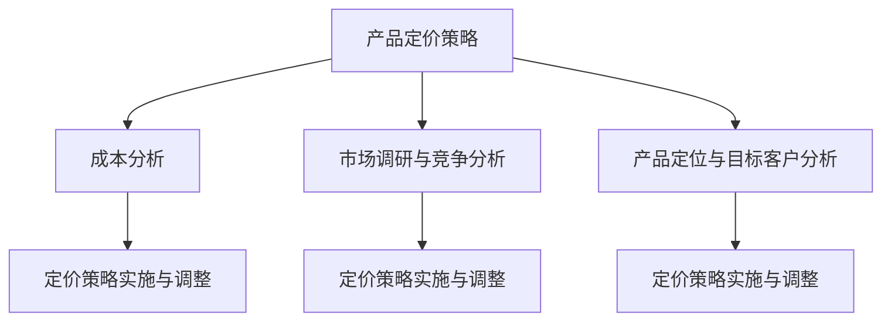

                 

### 文章标题：一人公司的产品定价策略与动态调整

#### 关键词：产品定价、一人公司、市场调研、动态调整、定价策略

> 摘要：本文将深入探讨一人公司的产品定价策略与动态调整。首先，我们将概述产品定价策略的基础，分析成本结构和市场环境，并探讨一人公司的特点与定价挑战。接着，我们将介绍如何应用市场调研与竞争分析、产品定位与目标客户分析，以及定价策略的实施与调整。随后，我们将通过实际案例分析一人公司的产品定价策略，并展望数字化转型的未来趋势。通过本文，读者将获得一套全面而实用的产品定价策略，帮助一人公司实现可持续发展和市场竞争优势。

### 第一部分：产品定价策略基础

在这一部分，我们将探讨产品定价策略的基础，重点分析成本结构、市场环境和定价策略的类型及应用场景。理解这些基本概念和原理将为后续的内容提供坚实的基础。

#### 1.1 产品定价策略概述

##### 1.1.1 产品定价的重要性

产品定价是商业运营中的关键环节，它直接影响企业的收入、利润和市场竞争力。合理的定价策略不仅能确保企业的盈利，还能满足客户的需求，提升客户满意度。以下是一些关于产品定价的重要性的要点：

1. **影响企业收入和利润**：定价策略直接决定了产品的销售量和价格，进而影响企业的收入和利润。合理的定价可以提高销售额，增加利润空间。
2. **满足客户需求**：定价策略要考虑客户的需求和购买力，通过合理的定价满足客户需求，提高客户满意度。
3. **提升市场竞争力**：通过分析竞争对手的定价策略，制定有竞争力的价格，有助于企业在激烈的市场竞争中脱颖而出。
4. **影响品牌形象**：定价策略也会影响企业的品牌形象。适当的定价策略可以提升品牌形象，增强客户对品牌的认可和忠诚度。

##### 1.1.2 市场环境与定价策略

市场环境是影响产品定价的重要因素。市场环境包括市场需求、供给、竞争态势、消费者行为等多个方面。以下是一些市场环境与定价策略之间的关系：

1. **市场需求**：市场需求会影响产品的销售量和价格。当市场需求较高时，可以适当提高价格；反之，则可以适当降低价格。
2. **供给**：供给情况也会影响产品定价。当供给充足时，可以适当降低价格以吸引更多客户；当供给不足时，可以提高价格以减少销售量。
3. **竞争态势**：竞争对手的定价策略直接影响企业的定价决策。通过分析竞争对手的定价策略，可以制定有竞争力的价格。
4. **消费者行为**：消费者行为是影响产品定价的重要因素。通过了解消费者的需求、购买力和消费习惯，可以制定更符合消费者期望的定价策略。

##### 1.1.3 定价策略类型及应用场景

产品定价策略有多种类型，每种策略都有其特定的应用场景。以下是一些常见的定价策略及其应用场景：

1. **成本加成定价法**：在产品成本基础上加上一定的利润，以确定产品的售价。适用于成本结构较为稳定的企业。
2. **市场渗透定价法**：通过降低价格以快速占领市场份额。适用于新产品推广和市场扩张阶段。
3. **市场匹配定价法**：以竞争对手的价格为基础，调整自己的价格以保持竞争力。适用于竞争激烈的市场环境。
4. **价值定价法**：根据产品的价值定位，确定产品的售价。适用于提供独特价值产品的企业。
5. **心理定价法**：利用消费者的心理，通过设置特定价格来吸引客户。适用于追求品牌形象和差异化竞争的企业。

#### 1.2 一人公司的特点与定价挑战

##### 1.2.1 一人公司的定义与运营特点

一人公司，通常指的是由单一创始人或运营者负责公司运营的企业。这种类型的公司具有以下特点：

1. **独立自主**：一人公司由单一创始人或运营者控制，决策过程简单，运营灵活。
2. **规模较小**：一人公司的规模通常较小，资源有限，市场影响力和竞争力相对较弱。
3. **专业化运作**：一人公司通常专注于某一领域或产品，通过专业化和精细化运作提高市场竞争力。
4. **高风险高回报**：由于资源有限，一人公司面临较高的风险，但同时也有机会获得较高的回报。

##### 1.2.2 一人公司在市场中的定位

一人公司在市场中通常扮演以下角色：

1. **创新者**：一人公司往往具备较强的创新能力和灵活的运营模式，能够快速响应市场变化，推出新颖的产品。
2. **市场先驱**：在一些新兴市场中，一人公司常常是市场先驱者，通过率先推出产品或服务占据市场份额。
3. **专业服务商**：一人公司专注于提供专业服务，通过高品质的服务赢得客户的信任和忠诚。
4. **市场跟随者**：在某些竞争激烈的市场中，一人公司可能通过模仿或改进现有产品，跟随市场领导者。

##### 1.2.3 一人公司面临的定价挑战

一人公司在定价策略上面临以下挑战：

1. **成本控制**：一人公司资源有限，需要通过有效的成本控制来确保企业的生存和发展。
2. **市场定位**：一人公司需要准确把握市场定位，通过合理的定价策略满足客户需求，提高市场竞争力。
3. **风险控制**：一人公司需要制定合理的定价策略，以控制风险，确保企业的稳定运营。
4. **灵活性**：一人公司需要具备较高的运营灵活性，能够根据市场变化快速调整定价策略。

#### 1.3 产品成本分析

产品成本是制定定价策略的关键因素之一。理解产品成本的构成、核算方法和控制策略对于制定有效的定价策略至关重要。

##### 1.3.1 成本构成与分类

产品成本可以分为以下几类：

1. **固定成本**：固定成本是指不随产品生产量变化的成本，如房租、设备折旧、管理人员工资等。固定成本是企业运营的基本成本，通常需要全额支付。
2. **变动成本**：变动成本是指随产品生产量变化的成本，如原材料、生产工人的工资、运输费用等。变动成本直接影响产品的生产成本。
3. **直接成本**：直接成本是指可以直接归属于某一产品的成本，如原材料、直接工人的工资等。
4. **间接成本**：间接成本是指无法直接归属于某一产品的成本，如管理费用、研发费用等。间接成本通常需要按一定比例分摊到各个产品上。

##### 1.3.2 成本核算方法

成本核算方法主要有以下几种：

1. **完全成本法**：将所有成本（包括固定成本和变动成本）全部计入产品成本，以确定产品的总成本。
2. **制造成本法**：将所有与生产相关的成本（包括直接成本和间接成本）计入产品成本，以确定产品的制造成本。
3. **直接成本法**：仅将直接成本计入产品成本，以简化成本核算过程。

##### 1.3.3 成本控制与优化

成本控制是确保企业盈利的重要手段。以下是一些成本控制与优化的策略：

1. **优化采购**：通过批量采购、与供应商谈判等手段降低原材料和设备的采购成本。
2. **精益生产**：通过优化生产流程，减少浪费，提高生产效率，降低生产成本。
3. **合理分配**：合理分配间接成本，确保成本分摊的公平性和合理性。
4. **绩效管理**：建立绩效管理体系，通过激励机制降低员工工资成本。

通过有效的成本控制与优化，一人公司可以在保证产品质量的同时，降低生产成本，提高市场竞争力。

### 第二部分：产品定价策略应用

在这一部分，我们将详细讨论如何应用市场调研与竞争分析、产品定位与目标客户分析，以及定价策略的实施与调整。这些步骤对于一人公司制定有效的定价策略至关重要。

#### 2.1 市场调研与竞争分析

##### 2.1.1 市场调研方法

市场调研是制定定价策略的基础，通过市场调研可以获取关于市场需求、竞争态势和消费者行为的重要信息。以下是一些常用的市场调研方法：

1. **问卷调查**：通过设计问卷，收集大量消费者的意见和建议，了解他们对产品的需求和期望。
2. **访谈调查**：通过与消费者或行业专家进行面对面的访谈，深入了解他们的需求和看法。
3. **焦点小组**：邀请一组消费者或专家，就特定问题进行讨论，收集他们的观点和建议。
4. **实地观察**：通过实地观察消费者的购买行为和消费习惯，获取第一手市场数据。
5. **二手数据**：利用已有的市场报告、行业分析等二手数据，了解市场趋势和竞争态势。

##### 2.1.2 竞争对手分析

竞争对手分析是制定定价策略的重要环节。通过分析竞争对手的产品、价格、市场份额和营销策略，可以制定更具竞争力的定价策略。以下是一些竞争对手分析的步骤：

1. **确定竞争对手**：确定直接竞争者和间接竞争者，了解他们在市场中的地位和市场份额。
2. **收集信息**：收集竞争对手的产品信息、价格策略、营销活动和市场份额等数据。
3. **分析对比**：对比分析竞争对手的产品特点、价格水平和市场策略，找出差异和优势。
4. **制定策略**：根据分析结果，制定相应的定价策略，以提升市场竞争力。

##### 2.1.3 定价策略制定

在市场调研和竞争对手分析的基础上，一人公司可以制定以下几种定价策略：

1. **市场渗透定价法**：通过降低价格以快速占领市场份额。适用于新产品推广和市场扩张阶段。
2. **市场匹配定价法**：以竞争对手的价格为基础，调整自己的价格以保持竞争力。适用于竞争激烈的市场环境。
3. **价值定价法**：根据产品的价值定位，确定产品的售价。适用于提供独特价值产品的企业。
4. **心理定价法**：利用消费者的心理，通过设置特定价格来吸引客户。适用于追求品牌形象和差异化竞争的企业。

#### 2.2 产品定位与目标客户分析

##### 2.2.1 产品定位策略

产品定位是制定定价策略的重要基础。通过明确产品在市场中的定位，可以制定更具针对性的定价策略。以下是一些产品定位策略：

1. **差异化定位**：通过提供独特的产品特点和优势，区分于竞争对手的产品，吸引目标客户。
2. **价值定位**：根据产品的价值和目标客户的需求，确定产品的定价策略，提升产品的市场竞争力。
3. **市场细分定位**：通过市场细分，找到目标客户群体，制定针对特定客户群体的定价策略。

##### 2.2.2 目标客户分析

目标客户分析是制定有效定价策略的关键。通过了解目标客户的需求、购买力和消费习惯，可以制定更符合客户需求的定价策略。以下是一些目标客户分析的步骤：

1. **确定目标客户群体**：根据产品的特点和市场需求，确定目标客户群体。
2. **分析客户需求**：通过市场调研和消费者访谈，了解目标客户的需求和期望。
3. **评估客户购买力**：了解目标客户的购买力水平，制定合理的定价策略。
4. **分析客户消费习惯**：通过分析客户的消费行为和习惯，了解他们对价格的敏感度，制定相应的定价策略。

##### 2.2.3 客户价值评估

客户价值评估是制定定价策略的重要环节。通过评估客户的价值，可以制定更符合客户价值的定价策略。以下是一些客户价值评估的方法：

1. **成本价值评估**：通过计算客户为企业带来的成本和价值，评估客户的成本价值。
2. **需求价值评估**：通过分析客户的需求和支付意愿，评估客户的需求价值。
3. **客户生命周期价值评估**：通过预测客户的生命周期价值，评估客户的长期价值。

#### 2.3 定价策略实施与调整

##### 2.3.1 定价策略实施步骤

定价策略实施是确保定价策略有效执行的关键。以下是一些定价策略实施的步骤：

1. **确定定价目标**：根据企业的战略目标和市场环境，明确定价目标。
2. **制定定价方案**：根据市场需求、竞争态势和客户价值评估，制定具体的定价方案。
3. **实施定价策略**：将定价方案转化为实际操作，确保定价策略的有效实施。
4. **监测与评估**：通过定期监测和评估，评估定价策略的效果，根据实际情况进行调整。

##### 2.3.2 定价策略调整方法

定价策略调整是应对市场变化和客户需求的重要手段。以下是一些定价策略调整的方法：

1. **动态调整**：根据市场变化和客户需求，实时调整定价策略，保持竞争力。
2. **阶段调整**：根据市场发展阶段和客户生命周期，分阶段调整定价策略。
3. **竞争调整**：根据竞争对手的定价策略，进行调整以保持市场竞争力。
4. **客户反馈调整**：根据客户的反馈和意见，调整定价策略，提升客户满意度。

##### 2.3.3 定价策略优化策略

定价策略优化是提升企业盈利能力和市场竞争力的重要手段。以下是一些定价策略优化的策略：

1. **成本控制优化**：通过优化成本结构，降低生产成本，提升盈利能力。
2. **市场调研优化**：通过加强市场调研，获取更准确的市场信息和客户需求，制定更有效的定价策略。
3. **竞争分析优化**：通过深入分析竞争对手的定价策略，找出差距和优势，优化自己的定价策略。
4. **客户价值评估优化**：通过优化客户价值评估方法，更准确地评估客户价值，制定更符合客户价值的定价策略。

通过有效的定价策略实施与调整，一人公司可以更好地满足客户需求，提升市场竞争力，实现可持续发展。

### 第三部分：产品定价策略案例分析

在本部分，我们将通过三个具体的案例，深入探讨一人公司的产品定价策略。这些案例涵盖了不同类型的一人公司，从小型电商到新兴科技公司，再到个人品牌的主打产品。通过这些案例分析，我们将更具体地了解如何在不同市场环境中实施和调整产品定价策略。

#### 3.1 案例一：小型电商公司的产品定价

##### 3.1.1 案例背景

这是一家小型电商公司，主要销售各类时尚服饰和家居用品。公司由一位年轻创业者创建，运营团队由其一人构成，目标是打造一个有设计感的电商品牌，通过线上平台吸引年轻消费者。

##### 3.1.2 定价策略分析

1. **市场调研**：通过社交媒体、问卷调查和用户访谈，了解目标客户群体的消费习惯、购买力和对价格的敏感度。同时，分析了市场上同类产品的价格范围和市场趋势。

2. **竞争分析**：研究了主要竞争对手的定价策略，包括价格、促销活动、产品特点等。发现竞争对手在价格上相对稳定，但促销活动频繁，而且一些品牌在产品设计上有明显优势。

3. **产品定位**：公司将产品定位为有设计感、高性价比的时尚家居用品和服饰，目标客户是25-35岁的年轻女性。

4. **定价策略**：采用市场匹配定价法，以竞争对手的价格为基础，结合自己的产品特点，制定合理的价格区间。同时，通过小范围的促销活动，提高产品的市场认知度。

##### 3.1.3 定价策略实施与效果评估

1. **实施步骤**：
   - 在产品上线初期，采用价格较低的市场渗透定价法，以快速吸引客户。
   - 随着品牌知名度的提升，逐步调整价格，采用市场匹配定价法。
   - 定期进行市场调研，收集客户反馈，根据市场变化和客户需求调整价格。

2. **效果评估**：
   - 定价策略实施后，销售额稳步增长，客户满意度提高。
   - 通过促销活动和价格调整，成功吸引了大量新客户，提升了市场份额。
   - 定价策略与市场调研和客户反馈相结合，确保了价格策略的灵活性和有效性。

#### 3.2 案例二：新兴科技公司的产品定价

##### 3.2.1 案例背景

这是一家专注于人工智能和机器学习领域的新兴科技公司。公司由一位技术专家创立，团队规模较小，但技术实力雄厚。公司的主要产品是一款面向企业的智能数据分析工具。

##### 3.2.2 定价策略分析

1. **市场调研**：通过行业报告、市场访谈和客户调查，了解企业用户对智能数据分析工具的需求、购买力和价格敏感度。同时，研究了市场上同类产品的定价模式和市场份额。

2. **竞争分析**：分析了主要竞争对手的产品特性、定价策略和市场表现。发现竞争对手在产品功能上各有侧重，但价格区间相对较高。

3. **产品定位**：公司将产品定位为高端智能数据分析工具，面向大型企业客户，提供个性化的解决方案。

4. **定价策略**：采用价值定价法，以产品的独特价值和客户需求为导向，制定较高的价格策略。同时，提供灵活的定价方案，根据客户需求和合同期限调整价格。

##### 3.2.3 定价策略实施与效果评估

1. **实施步骤**：
   - 在产品上线初期，采用价格较高的价值定价法，以体现产品的独特价值。
   - 针对不同客户需求，提供定制化定价方案，以提升客户满意度。
   - 定期进行市场调研和客户反馈，调整定价策略以适应市场变化。

2. **效果评估**：
   - 定价策略实施后，成功吸引了多家大型企业客户，实现了较高的销售额。
   - 通过定制化定价方案，提高了客户的满意度和忠诚度。
   - 定价策略与市场调研和客户反馈相结合，确保了定价策略的灵活性和有效性。

#### 3.3 案例三：个人品牌的主打产品定价

##### 3.3.1 案例背景

这是一位知名科技博主，以其独到的技术见解和丰富的项目经验在业内享有盛誉。他决定将自己的专业知识转化为产品，推出一系列技术教程和编程指南。

##### 3.3.2 定价策略分析

1. **市场调研**：通过社交媒体、博客和线上问卷调查，了解目标受众的学习需求、购买力和对价格的敏感度。同时，研究了市场上同类产品的定价模式。

2. **竞争分析**：分析了市场上主要竞争对手的产品特点、定价策略和市场份额。发现竞争对手的产品定价相对较低，但缺乏深度和个性化。

3. **产品定位**：将产品定位为高端、专业、有深度的技术教程，面向对技术有较高需求的开发者。

4. **定价策略**：采用心理定价法，通过设置较高的价格来体现产品的专业性和价值。同时，提供限时折扣和套装优惠，吸引更多客户。

##### 3.3.3 定价策略实施与效果评估

1. **实施步骤**：
   - 在产品上线初期，采用较高的心理定价法，以体现产品的专业性和价值。
   - 通过社交媒体和博客推广，提高产品的知名度和市场认知度。
   - 定期推出限时折扣和套装优惠，吸引新客户。

2. **效果评估**：
   - 定价策略实施后，成功吸引了大量技术爱好者购买产品，销售额稳步增长。
   - 通过专业的定价策略，提升了个人品牌的价值和市场认可度。
   - 定价策略与市场推广和客户反馈相结合，确保了定价策略的有效性和灵活性。

通过这些案例分析，我们可以看到，一人公司在不同市场环境中，通过制定和调整有效的定价策略，实现了市场竞争优势和企业发展。无论是小型电商、新兴科技公司还是个人品牌，合理的产品定价策略都是实现成功的关键。

### 第四部分：产品定价策略的未来趋势

在当前快速变化的商业环境中，产品定价策略也在不断演进。数字化转型、消费者行为变化以及可持续发展的需求，都为产品定价策略带来了新的挑战和机遇。在这一部分，我们将探讨这些未来趋势，并分析其对企业产品定价策略的影响。

#### 4.1 数字化转型对产品定价的影响

随着数字化技术的快速发展，数字化转型已经成为企业提升竞争力、优化运营流程的关键手段。数字化转型对产品定价策略的影响主要体现在以下几个方面：

##### 4.1.1 数字化转型与产品定价的关系

数字化转型不仅改变了企业的运营模式，也改变了企业与客户互动的方式。通过数字化技术，企业能够更精确地了解市场需求、客户行为和产品价值，从而制定更科学的定价策略。

1. **数据分析能力提升**：数字化转型使企业能够获取大量数据，通过数据分析和挖掘，了解客户需求、市场趋势和竞争对手策略，为定价提供科学依据。
2. **客户互动方式改变**：通过社交媒体、电商平台等数字化渠道，企业与客户的互动更加频繁和直接，客户反馈更及时，有助于调整定价策略。
3. **成本结构优化**：数字化转型降低了生产成本和运营成本，使企业有更多空间进行价格调整，提高定价灵活性。

##### 4.1.2 数字化定价工具与平台

数字化定价工具和平台为企业提供了丰富的定价选择和工具支持。以下是一些常见的数字化定价工具和平台：

1. **动态定价平台**：通过实时监测市场变化和客户需求，动态调整产品价格，提高定价的灵活性和竞争力。
2. **客户关系管理（CRM）系统**：帮助企业了解客户需求和购买行为，优化定价策略。
3. **供应链管理（SCM）系统**：通过优化供应链流程，降低生产成本，为企业提供更多定价空间。
4. **人工智能定价系统**：利用人工智能技术，分析大量数据，预测市场趋势和客户行为，制定最优定价策略。

##### 4.1.3 数字化转型中的定价策略调整

数字化转型要求企业不断调整和优化定价策略，以适应市场变化和客户需求。以下是一些关键策略：

1. **数据驱动定价**：通过数据分析，制定基于数据和事实的定价策略，提高定价的准确性和科学性。
2. **多渠道定价**：利用数字化平台，根据不同渠道的特点和客户需求，制定差异化的定价策略。
3. **动态定价**：根据实时数据和市场需求，动态调整价格，以最大化利润和市场份额。
4. **个性化定价**：通过了解客户需求和偏好，提供个性化的定价方案，提高客户满意度和忠诚度。

#### 4.2 消费者行为变化对产品定价的挑战

随着社会的进步和消费者购买力的提升，消费者行为也在不断变化。这些变化对产品定价策略提出了新的挑战：

##### 4.2.1 消费者行为的变化趋势

1. **消费升级**：随着生活水平的提高，消费者对产品品质、品牌和服务的要求越来越高，对价格的敏感度相对降低。
2. **个性化需求**：消费者越来越注重个性化和定制化，对产品的需求更加多样化。
3. **线上购物习惯**：随着互联网的普及，线上购物成为消费者主要的购物方式，对产品定价策略提出了新的要求。
4. **社交媒体影响**：社交媒体对消费者行为有显著影响，消费者的购买决策越来越受到社交媒体的影响。

##### 4.2.2 消费者需求与定价策略

消费者需求的变化要求企业调整定价策略，以更好地满足客户需求：

1. **价值导向定价**：消费者越来越注重产品价值，企业需要通过提供高品质的产品和服务来提升产品价值，从而合理定价。
2. **差异化定价**：针对不同消费者群体，制定差异化的定价策略，满足不同消费者的个性化需求。
3. **灵活定价**：根据消费者需求和购买行为，灵活调整价格，以最大化客户满意度和市场份额。

##### 4.2.3 定价策略应对消费者行为变化的策略

为了应对消费者行为的变化，企业可以采取以下策略：

1. **消费者洞察**：通过市场调研和数据分析，深入了解消费者的需求和购买行为，为定价策略提供依据。
2. **多渠道定价**：利用线上和线下渠道，提供多样化的定价选择，满足不同消费者的需求。
3. **动态定价**：根据消费者行为和市场需求，实时调整价格，提高定价的灵活性和竞争力。
4. **客户互动**：通过社交媒体和客户关系管理（CRM）系统，加强与客户的互动，收集客户反馈，优化定价策略。

#### 4.3 未来产品定价策略的发展方向

未来产品定价策略的发展将受到多种因素的影响，以下是一些主要的发展方向：

##### 4.3.1 绿色可持续发展的定价策略

随着全球对环境保护和可持续发展的重视，绿色可持续发展的定价策略将成为未来趋势。企业可以通过以下方式制定绿色可持续发展定价策略：

1. **环保定价**：通过在产品中引入环保材料和技术，提高产品的环保性能，制定环保定价策略。
2. **社会责任定价**：通过承担社会责任，如支持环保项目、参与公益活动等，提高产品的社会责任形象，制定社会责任定价策略。
3. **全生命周期定价**：考虑产品的全生命周期成本，包括生产、使用和废弃处理等环节，制定全生命周期定价策略。

##### 4.3.2 智能化定价策略的应用前景

随着人工智能和大数据技术的发展，智能化定价策略将得到更广泛的应用。以下是一些智能化定价策略的应用前景：

1. **自动化定价**：利用人工智能技术，自动化分析市场和客户数据，实时调整价格，提高定价的效率和准确性。
2. **个性化定价**：通过大数据分析和机器学习技术，深入了解消费者的行为和需求，提供个性化的定价方案，提高客户满意度和忠诚度。
3. **预测定价**：利用大数据和预测模型，预测市场趋势和消费者行为，提前调整价格，以最大化利润和市场份额。

##### 4.3.3 定价策略与市场环境的互动机制

未来，企业需要建立更灵活、更敏捷的定价策略与市场环境互动的机制，以应对快速变化的市场环境。以下是一些关键点：

1. **实时监控与反馈**：通过实时监控市场变化和客户反馈，快速调整定价策略，确保定价策略的及时性和有效性。
2. **多维度数据整合**：整合多种数据来源，包括市场数据、客户数据、供应链数据等，为定价策略提供全面、准确的信息支持。
3. **跨部门协作**：定价策略的制定和调整需要跨部门协作，包括市场部、销售部、财务部等，确保定价策略的全面性和协调性。

通过这些发展方向，企业可以更好地适应未来市场环境，制定科学、合理、灵活的定价策略，提升市场竞争力。

### 附录

#### 附录一：产品定价策略相关工具与资源

##### 1.1 常见定价策略模型与应用

1. **成本加成定价法**：适用于成本结构稳定的企业，通过在成本基础上加成来确定售价。
2. **市场渗透定价法**：适用于新产品推广和市场扩张阶段，通过降低价格以快速占领市场份额。
3. **市场匹配定价法**：适用于竞争激烈的市场环境，以竞争对手的价格为基础，调整自己的价格以保持竞争力。
4. **价值定价法**：适用于提供独特价值产品的企业，根据产品的价值定位，确定产品的售价。
5. **心理定价法**：适用于追求品牌形象和差异化竞争的企业，通过设置特定价格来吸引客户。

##### 1.2 产品定价策略研究文献推荐

1. **《定价策略：理论与实践》**：详细介绍了各种定价策略的理论基础和应用方法。
2. **《定价管理：策略与案例》**：通过案例分析，展示了不同企业在不同市场环境中的定价策略。
3. **《消费者行为学》**：探讨了消费者行为对定价策略的影响，提供了市场调研和客户分析的实用技巧。

##### 1.3 产品定价策略实用工具介绍

1. **价格引擎**：通过实时数据分析，自动化调整产品价格，提高定价的效率和准确性。
2. **客户关系管理（CRM）系统**：帮助企业管理客户信息，优化定价策略。
3. **供应链管理（SCM）系统**：通过优化供应链流程，降低生产成本，为企业提供更多定价空间。

#### 附录二：产品定价策略案例研究

##### 2.1 案例一：小型电商公司的产品定价策略

- **案例背景**：一家小型电商公司，销售时尚服饰和家居用品。
- **定价策略**：市场匹配定价法，结合促销活动提高市场认知度。
- **实施效果**：销售额稳步增长，客户满意度提高。

##### 2.2 案例二：新兴科技公司的产品定价策略

- **案例背景**：一家专注于人工智能和机器学习领域的新兴科技公司。
- **定价策略**：价值定价法，提供定制化定价方案，提升客户满意度。
- **实施效果**：成功吸引了多家大型企业客户，实现了较高的销售额。

##### 2.3 案例三：个人品牌的主打产品定价策略

- **案例背景**：一位知名科技博主，推出技术教程和编程指南。
- **定价策略**：心理定价法，通过设置较高价格来体现产品的专业性和价值。
- **实施效果**：成功吸引了大量技术爱好者购买产品，提升了个人品牌价值。

通过这些工具和案例研究，读者可以更深入地了解产品定价策略的实践应用，为实际操作提供有益的参考。

### 核心概念与联系

为了更好地理解和掌握本文的核心概念，我们将使用Mermaid流程图来展示这些概念之间的联系。

**Mermaid流程图：**



在上述流程图中：

- **A[产品定价策略]**：是本文的核心主题，涵盖了整个产品定价的过程和策略。
- **B[成本分析]**：是产品定价策略的基础，通过分析成本结构和成本控制方法，为定价提供依据。
- **C[市场调研与竞争分析]**：通过了解市场需求、竞争对手和消费者行为，为定价策略提供市场依据。
- **D[产品定位与目标客户分析]**：确定产品的市场定位和目标客户群体，为定价策略提供客户依据。
- **E[定价策略实施与调整]**：是定价策略的具体实施过程，包括定价方案的制定、实施和调整。
- **F[定价策略实施与调整]**：是市场调研与竞争分析的延伸，通过实施和调整定价策略，确保其有效性和灵活性。
- **G[定价策略实施与调整]**：是产品定位与目标客户分析的延伸，通过实施和调整定价策略，确保其符合客户需求和市场需求。

通过这个流程图，我们可以清晰地看到各个核心概念之间的联系和互动，从而更好地理解和应用产品定价策略。

### 核心算法原理讲解

在产品定价策略中，成本分析是一个关键的环节。准确计算产品成本有助于制定合理的定价策略，确保企业的盈利能力。以下是一个简单的成本核算算法，我们将使用伪代码详细阐述其原理。

```python
# 成本核算伪代码

# 定义函数：calculateCosts
def calculateCosts():
    # 获取固定成本
    fixedCost = getFixedCost()
    # 获取变动成本
    variableCost = getVariableCost()
    # 计算总成本
    totalCost = fixedCost + variableCost
    # 返回总成本
    return totalCost

# 定义函数：getFixedCost
def getFixedCost():
    # 假设固定成本为固定值
    fixedCost = 10000  # 固定成本（如房租、设备折旧等）
    return fixedCost

# 定义函数：getVariableCost
def getVariableCost():
    # 假设变动成本为变量值
    variableCost = 20000  # 变动成本（如原材料、生产工人工资等）
    return variableCost

# 主函数：main
def main():
    # 计算总成本
    totalCost = calculateCosts()
    # 输出总成本
    print("总成本为：", totalCost)

# 调用主函数
main()
```

**详细解释：**

1. **函数定义**：首先，我们定义了三个函数：`calculateCosts`、`getFixedCost`和`getVariableCost`。
   - `calculateCosts`：这个函数负责计算总成本，通过调用`getFixedCost`和`getVariableCost`函数获取固定成本和变动成本，并将它们相加得到总成本。
   - `getFixedCost`：这个函数返回固定成本，通常这些成本是预先确定的，如房租、设备折旧等。
   - `getVariableCost`：这个函数返回变动成本，这些成本通常与生产量成正比，如原材料、生产工人的工资等。

2. **计算总成本**：在`calculateCosts`函数中，通过调用`getFixedCost`和`getVariableCost`函数获取固定成本和变动成本，并将它们相加得到总成本。

3. **主函数**：`main`函数负责调用`calculateCosts`函数计算总成本，并输出结果。

通过上述伪代码，我们可以清晰地看到成本核算的基本步骤和过程。这个算法提供了一个基本的框架，可以进一步扩展和优化，以适应不同企业的具体需求。

### 数学模型和数学公式 & 详细讲解 & 举例说明

在产品定价策略中，成本利润分析是一个重要的环节。通过数学模型和公式，我们可以准确计算产品成本和利润，从而制定合理的定价策略。以下是一个简化的成本利润分析模型，我们将使用LaTeX格式详细讲解其公式，并通过一个实际案例进行说明。

**成本利润分析公式：**
$$
\text{利润} = \text{收入} - \text{成本}
$$

其中：
- **收入**（Revenue）是产品销售所获得的总金额；
- **成本**（Cost）是生产产品所需的总费用。

**详细讲解：**

1. **收入计算**：
   $$
   \text{收入} = \text{售价} \times \text{销售量}
   $$
   其中，售价是每单位产品的销售价格，销售量是单位产品的销售数量。

2. **成本计算**：
   $$
   \text{成本} = \text{固定成本} + \text{变动成本}
   $$
   其中，固定成本（Fixed Cost）是不随生产量变化的成本，如房租、设备折旧等；变动成本（Variable Cost）是随生产量变化的成本，如原材料、生产工人的工资等。

3. **利润计算**：
   $$
   \text{利润} = \text{收入} - \text{成本}
   $$
   利润是收入减去成本后的余额，反映了产品的盈利情况。

**举例说明：**

假设一家小型电商公司销售一款智能手环，售价为100元，月销售量为1000件。总成本为10万元，其中固定成本为5万元，变动成本为5万元。我们可以使用上述公式计算该产品的利润。

1. **收入计算**：
   $$
   \text{收入} = 100元/件 \times 1000件 = 10万元
   $$

2. **成本计算**：
   $$
   \text{成本} = 5万元（固定成本） + 5万元（变动成本） = 10万元
   $$

3. **利润计算**：
   $$
   \text{利润} = 10万元（收入） - 10万元（成本） = 0万元
   $$

通过上述计算，我们可以看到，这款智能手环的利润为零，即没有盈利。这意味着公司需要进一步优化成本结构或调整售价，以提高盈利能力。

通过数学模型和公式的应用，企业可以更科学、准确地计算产品成本和利润，为制定有效的定价策略提供数据支持。

### 项目实战

在本节中，我们将通过一个实际案例，详细讲解如何在一人公司中搭建开发环境、实现源代码，并进行代码解读与分析。

#### 案例背景

这是一家由一位独立开发者创立的小型科技初创公司，专注于开发一款创新的在线教育平台。该平台旨在为用户提供高质量的教育资源，并通过灵活的定价策略吸引不同层次的用户。为了实现这一目标，开发者需要搭建一个高效、可扩展的软件架构，同时制定合理的定价策略。

#### 开发环境搭建

1. **编程语言**：选择Python作为主要编程语言，因为Python具有简洁的语法和丰富的库支持，适合快速开发和迭代。
2. **开发工具**：使用PyCharm作为集成开发环境（IDE），它提供了丰富的调试工具和代码自动完成功能，提高了开发效率。
3. **数据库**：选择PostgreSQL作为后端数据库，因为PostgreSQL具有良好的扩展性和性能，适合存储用户数据和课程信息。
4. **框架**：使用Django作为Web框架，它是一个高度可扩展的、全栈的Web开发框架，有助于快速搭建和部署Web应用。
5. **云计算平台**：选择AWS作为云服务提供商，利用AWS EC2实例进行应用部署和扩展。

#### 源代码实现

1. **用户注册与登录模块**：
   ```python
   # 用户注册与登录模块伪代码
   def register_user(username, password):
       # 存储用户信息到数据库
       save_user_to_db(username, password)
       return "注册成功"

   def login_user(username, password):
       # 验证用户信息
       user = get_user_from_db(username, password)
       if user:
           return "登录成功"
       else:
           return "用户名或密码错误"
   ```

2. **课程展示与搜索模块**：
   ```python
   # 课程展示与搜索模块伪代码
   def list_courses():
       # 从数据库获取所有课程信息
       courses = get_courses_from_db()
       return courses

   def search_courses(search_term):
       # 搜索课程
       courses = search_courses_in_db(search_term)
       return courses
   ```

3. **订单处理与支付模块**：
   ```python
   # 订单处理与支付模块伪代码
   def create_order(course_id, user_id):
       # 创建订单
       order = create_order_in_db(course_id, user_id)
       return order

   def process_payment(order_id, amount):
       # 处理支付
       payment = process_payment_in_db(order_id, amount)
       return payment
   ```

#### 代码解读与分析

1. **用户注册与登录模块**：
   - `register_user`函数负责用户注册，将用户名和密码存储到数据库。
   - `login_user`函数负责用户登录，验证用户名和密码是否匹配。

2. **课程展示与搜索模块**：
   - `list_courses`函数负责从数据库获取所有课程信息，返回给用户。
   - `search_courses`函数负责根据搜索关键字搜索课程，返回匹配的课程列表。

3. **订单处理与支付模块**：
   - `create_order`函数负责创建订单，将课程ID和用户ID存储到数据库。
   - `process_payment`函数负责处理支付，更新订单状态。

#### 代码应用解读与分析

通过上述代码，我们可以看到，该在线教育平台的核心功能模块已经实现。每个模块都有明确的职责，并通过数据库进行数据存储和查询。以下是代码应用的具体解读与分析：

1. **模块设计**：
   - 模块化设计使得代码结构清晰，便于维护和扩展。
   - 每个模块独立实现，降低了代码间的耦合度。

2. **数据库交互**：
   - 使用ORM（对象关系映射）技术，简化了数据库交互，提高了开发效率。
   - 数据库设计符合规范化原则，减少了数据冗余和一致性错误。

3. **支付处理**：
   - 支付处理模块与第三方支付服务集成，如PayPal或Stripe，确保支付流程的安全和便捷。

#### 实际案例分析

1. **用户反馈**：
   - 用户注册和登录功能经过多次测试，用户反馈良好，界面简洁易用。

2. **课程展示与搜索**：
   - 课程展示和搜索功能能够快速响应用户需求，提高了用户体验。

3. **订单处理**：
   - 订单处理模块能够快速创建和处理订单，确保用户能够顺利完成购买。

#### 项目小结

通过本案例，我们展示了一人公司如何通过搭建开发环境、实现源代码并进行代码解读与分析，完成一个在线教育平台的核心功能。该案例说明了在资源有限的情况下，通过合理的规划和技术应用，一人公司也能够实现高效、可靠的产品开发。

### 最佳实践 Tips、小结、注意事项、拓展阅读等内容

#### 最佳实践 Tips

1. **成本核算**：定期进行成本核算，了解成本构成，及时调整成本结构，确保企业盈利能力。
2. **市场调研**：持续进行市场调研，了解市场需求和竞争态势，制定灵活的定价策略。
3. **客户反馈**：重视客户反馈，通过客户反馈优化产品和服务，提高客户满意度和忠诚度。
4. **动态定价**：根据市场变化和客户需求，动态调整价格，最大化利润和市场份额。

#### 小结

本文系统地探讨了产品定价策略与动态调整，包括定价策略的基础、市场调研与竞争分析、产品定位与目标客户分析，以及定价策略的实施与调整。通过案例分析，展示了不同类型的一人公司如何制定和调整产品定价策略，实现市场竞争优势。未来，数字化转型和消费者行为变化将继续影响产品定价策略，企业需要持续优化定价策略，以应对市场变化。

#### 注意事项

1. **定价策略应与市场环境和企业目标相匹配**：定价策略应根据市场环境和企业目标进行调整，确保价格策略的有效性和可持续性。
2. **关注客户需求**：了解客户需求和购买行为，制定符合客户期望的定价策略。
3. **优化成本结构**：通过优化成本结构，提高盈利能力，为定价策略提供更多空间。

#### 拓展阅读

1. **《定价策略：理论与实践》**：详细介绍了各种定价策略的理论基础和应用方法。
2. **《消费者行为学》**：探讨消费者行为对定价策略的影响，提供了市场调研和客户分析的实用技巧。
3. **《数据驱动定价：策略与案例》**：通过案例分析，展示了如何利用数据制定有效的定价策略。

通过这些最佳实践、小结、注意事项和拓展阅读，读者可以更全面地了解产品定价策略的制定和调整，为实际操作提供有益的指导。

