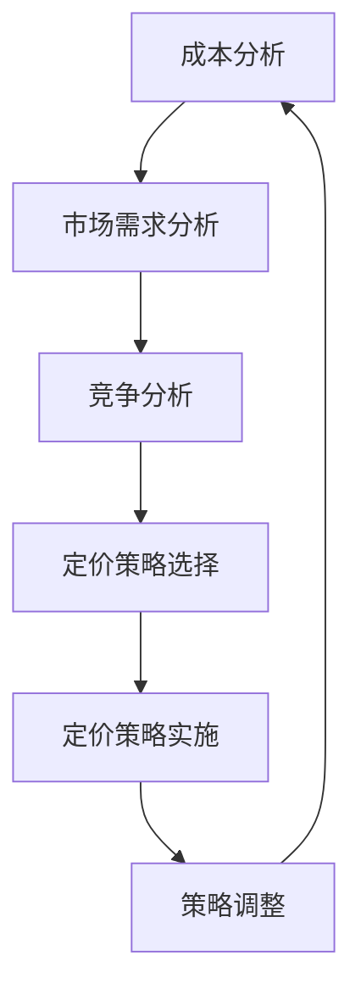
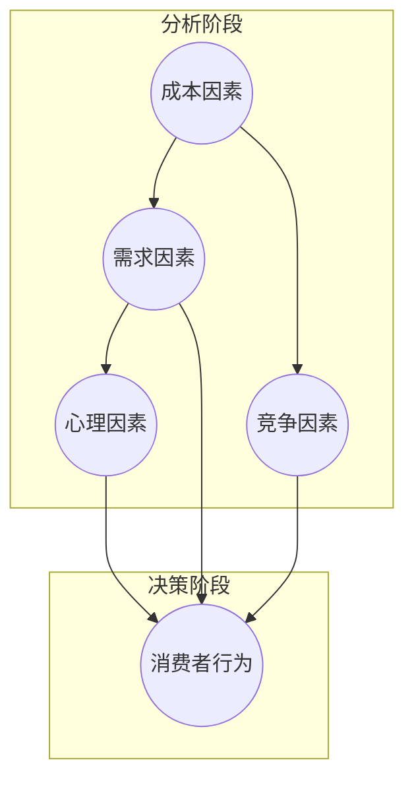

                 

### 文章标题

《一人公司的产品定价策略与心理定价技巧》

关键词：产品定价策略、心理定价技巧、成本导向定价、需求导向定价、竞争导向定价、一人公司

摘要：本文旨在深入探讨一人公司如何制定有效的产品定价策略，并详细解析心理定价技巧。我们将从基础理论出发，结合实际案例分析，为读者提供一套完整、实用的定价策略指南。

---

### 目录大纲

1. **引言**
   1.1 写作目的
   1.2 文章结构

2. **产品定价策略基础**
   2.1 产品定价策略概述
       2.1.1 产品定价的五个关键因素
       2.1.2 定价策略的分类与选择
       2.1.3 市场研究与竞争分析
   2.2 成本导向定价策略
       2.2.1 成本导向定价的概念
       2.2.2 成本导向定价的计算方法
       2.2.3 成本导向定价的优缺点
   2.3 需求导向定价策略
       2.3.1 需求导向定价的概念
       2.3.2 需求导向定价的计算方法
       2.3.3 需求导向定价的优缺点
   2.4 竞争导向定价策略
       2.4.1 竞争导向定价的概念
       2.4.2 竞争导向定价的计算方法
       2.4.3 竞争导向定价的优缺点
   2.5 心理定价策略
       2.5.1 心理定价的概念
       2.5.2 常见心理定价技巧
       2.5.3 心理定价的实际应用

3. **产品定价策略应用**
   3.1 一人公司的产品定价策略案例分析
       3.1.1 案例一：小型电商的定价策略
       3.1.2 案例二：创新型创业公司的定价策略
       3.1.3 案例三：知识型服务公司的定价策略
   3.2 产品定价策略调整与优化
       3.2.1 定价策略调整的原因
       3.2.2 定价策略优化的方法
       3.2.3 定价策略优化的案例分析

4. **产品定价策略工具与资源**
   4.1 产品定价策略工具介绍
       4.1.1 定价软件与平台
       4.1.2 数据分析工具
       4.1.3 定价模型库
   4.2 产品定价策略资源推荐
       4.2.1 相关书籍推荐
       4.2.2 学术论文推荐
       4.2.3 实践指南与教程推荐

5. **核心概念与联系**
   5.1 产品定价策略的Mermaid流程图
   5.2 定价策略联系图

6. **核心算法原理讲解**
   6.1 成本导向定价算法原理
   6.2 需求导向定价算法原理
   6.3 竞争导向定价算法原理

7. **结论**
   7.1 定价策略的核心要点
   7.2 心理定价的潜在影响
   7.3 未来展望

---

**引言**

**1.1 写作目的**

本文的写作目的在于为那些单打独斗的企业家或创始人提供一套系统的产品定价策略指南。在当前激烈的市场竞争环境中，产品的定价策略不仅决定了公司的盈利能力，还直接影响到品牌形象和市场定位。本文将深入探讨各种产品定价策略，结合心理学原理，旨在帮助一人公司实现科学的定价决策，提高市场竞争力。

**1.2 文章结构**

本文结构分为三个主要部分。第一部分是产品定价策略基础，详细介绍了成本导向定价、需求导向定价、竞争导向定价和心理定价策略的概念、计算方法和优缺点。第二部分是产品定价策略应用，通过实际案例分析，为读者提供具体操作指南。第三部分是产品定价策略工具与资源，推荐了相关的软件、书籍和学术论文，以帮助读者深入学习和实践。最后，通过核心概念与联系和核心算法原理讲解，梳理了产品定价策略的体系结构，并给出了详细的算法实现。

---

## 第一部分：产品定价策略基础

### 第1章：产品定价策略概述

在市场经济中，产品定价策略是企业实现盈利的重要手段之一。有效的定价策略能够提高产品的市场竞争力，增强客户的购买意愿，同时确保企业的利润最大化。本章节将对产品定价策略进行概述，分析其五个关键因素，并探讨不同的定价策略分类及其适用场景。

#### 1.1 产品定价的五个关键因素

产品定价的五个关键因素分别是成本因素、需求因素、竞争因素、消费者行为因素和市场因素。

1. **成本因素**：成本是产品定价的起点。企业需要明确其生产成本、运营成本以及固定成本和可变成本，以便制定合理的定价策略。成本因素直接影响产品的利润空间，是企业制定价格策略的首要考虑因素。

2. **需求因素**：市场需求是产品定价的另一个重要因素。通过分析市场需求，企业可以了解消费者对产品价格的敏感度，从而确定合适的价格水平。需求因素与消费者的购买意愿密切相关，是企业制定价格策略的重要参考依据。

3. **竞争因素**：市场竞争状况对产品定价策略的影响不可忽视。了解竞争对手的价格策略，可以帮助企业制定有针对性的定价策略，以在市场中占据有利位置。竞争因素是企业制定价格策略时必须考虑的关键因素。

4. **消费者行为因素**：消费者行为是指消费者在购买产品时的心理和行为表现。消费者行为因素包括消费者的价格敏感度、品牌忠诚度、购买习惯等。这些因素直接影响消费者的购买决策，是企业制定价格策略时需要充分考虑的。

5. **市场因素**：市场因素包括宏观经济环境、市场供需关系、行业趋势等。市场因素对产品定价策略的制定具有重要影响。企业需要密切关注市场动态，以便及时调整定价策略。

#### 1.2 定价策略的分类与选择

根据不同的定价目标和市场环境，企业可以采用不同的定价策略。以下是几种常见的定价策略：

1. **成本导向定价策略**：成本导向定价策略是以产品成本为基础，加上一定的利润来确定产品价格的定价策略。该策略简单易行，适合成本结构较为稳定的企业。

2. **需求导向定价策略**：需求导向定价策略是根据市场需求和消费者购买意愿来制定产品价格的定价策略。该策略能够更好地满足消费者的需求，提高产品的市场竞争力。

3. **竞争导向定价策略**：竞争导向定价策略是以竞争对手的价格水平为基础，结合自身产品的优势和劣势来制定产品价格的定价策略。该策略有利于企业占据市场主导地位，提高市场份额。

4. **心理定价策略**：心理定价策略是利用消费者心理，采用特殊的定价方法来影响消费者的购买决策的定价策略。该策略能够有效提升产品的形象和品牌价值。

#### 1.3 市场研究与竞争分析

市场研究与竞争分析是制定产品定价策略的重要基础。企业需要通过市场调查和竞争分析，了解市场环境和竞争对手的定价策略，以便制定有针对性的定价策略。

1. **市场调查**：市场调查包括对目标市场的需求分析、消费者行为研究、价格敏感度分析等。通过市场调查，企业可以获取关于市场需求和消费者行为的详细数据，为定价策略提供依据。

2. **竞争分析**：竞争分析包括对竞争对手的产品定位、价格水平、市场份额等进行分析。通过竞争分析，企业可以了解市场竞争状况，找到自身的优势和劣势，为定价策略提供指导。

3. **数据整合**：将市场调查和竞争分析得到的数据进行整合，可以为企业制定有效的定价策略提供全面的支持。企业可以根据数据分析结果，确定合理的定价水平和策略。

#### 总结

产品定价策略是企业实现盈利的重要手段。通过分析成本因素、需求因素、竞争因素、消费者行为因素和市场因素，企业可以制定合理的定价策略。同时，市场研究与竞争分析为定价策略的制定提供了重要的数据支持。在实际操作中，企业需要根据自身情况和市场环境，灵活选择和调整定价策略，以实现最大化的市场竞争力。

### 第2章：成本导向定价策略

成本导向定价策略是企业根据生产成本、运营成本等实际成本因素来制定产品价格的一种定价方法。这种策略的优点在于简单易懂，计算方法直接明确，适合成本结构稳定的企业。在本章节中，我们将详细介绍成本导向定价策略的概念、计算方法以及其优缺点。

#### 2.1 成本导向定价的概念

成本导向定价策略是指企业在确定产品价格时，以产品成本为基础，加上一定的利润率来确定产品价格的定价方法。这种方法主要考虑的是产品的成本因素，力求通过成本加成的方式，确保企业获得合理的利润。

成本导向定价策略主要分为以下几种类型：

1. **全部成本加成定价**：这是最常见的成本导向定价方法。企业在计算产品的全部成本（包括固定成本和可变成本）后，再加上一个预期的利润率，来确定产品的最终售价。

2. **标准成本加成定价**：标准成本加成定价是在全部成本加成定价的基础上，采用一个统一的标准利润率，对所有产品进行定价。这种方法适用于产品种类较多、成本结构稳定的企业。

3. **目标成本定价**：目标成本定价是一种基于目标利润和市场需求的定价方法。企业首先设定一个预期的目标利润，然后根据市场需求和竞争状况来确定产品的价格。这种方法强调的是成本控制和市场适应性。

#### 2.2 成本导向定价的计算方法

成本导向定价的计算方法主要包括以下几个步骤：

1. **计算总成本**：总成本包括固定成本和可变成本。固定成本是企业不论生产多少产品都必须承担的成本，如租金、员工工资等。可变成本是随着生产数量变化而变化的成本，如原材料成本、生产直接成本等。

   $$\text{总成本} = \text{固定成本} + \text{可变成本} \times \text{产量}$$

2. **确定利润目标**：企业在制定定价策略时，需要设定一个合理的利润目标。这个利润目标可以是固定利润，也可以是利润率。利润目标应根据企业的经营战略和市场环境来确定。

   $$\text{利润目标} = \text{固定利润} \quad \text{或} \quad \text{利润率} \times \text{总成本}$$

3. **计算目标价格**：在确定了总成本和利润目标后，企业就可以计算出产品的目标价格。

   $$\text{目标价格} = \text{总成本} + \text{利润目标}$$

   如果采用利润率来确定利润目标，计算公式可以进一步简化为：

   $$\text{目标价格} = \text{总成本} \times (1 + \text{利润率})$$

#### 2.3 成本导向定价的优缺点

**优点：**

1. **计算简单**：成本导向定价策略的计算方法简单，易于理解和执行。企业可以通过简单的公式计算出产品的目标价格，节省了大量的时间和精力。

2. **稳定可靠**：成本导向定价策略以成本为基础，利润空间相对稳定。这种定价方法适用于成本结构稳定的企业，能够保证企业的盈利水平。

3. **适用范围广**：成本导向定价策略适用于各种类型的企业，无论是生产型、服务型还是创新型公司，都可以采用这种策略来确定产品价格。

**缺点：**

1. **忽视市场需求**：成本导向定价策略主要考虑的是成本因素，忽视了市场需求和消费者行为。这种方法可能导致产品定价过高，无法满足消费者的购买需求。

2. **缺乏灵活性**：成本导向定价策略在面临市场变化和竞争压力时，缺乏灵活性。企业难以根据市场动态调整价格策略，可能导致市场份额的流失。

3. **缺乏竞争优势**：由于主要依赖成本因素，成本导向定价策略难以体现产品的独特价值。在竞争激烈的市场中，企业可能难以通过成本导向定价策略获得竞争优势。

#### 总结

成本导向定价策略是企业制定产品价格的一种基本方法。通过计算总成本和利润目标，企业可以确定产品的目标价格。虽然这种策略计算简单、稳定可靠，但在实际应用中，企业需要结合市场需求和竞争状况，灵活调整定价策略，以实现更好的市场表现。

### 第3章：需求导向定价策略

需求导向定价策略是一种以市场需求和消费者行为为核心，来确定产品价格的定价方法。这种策略强调的是消费者对产品价格的接受程度和购买意愿，旨在通过满足市场需求来实现产品的高效定价。在本章节中，我们将深入探讨需求导向定价策略的概念、计算方法以及其优缺点。

#### 3.1 需求导向定价的概念

需求导向定价策略是指企业根据市场需求和消费者对产品的需求程度，来制定产品价格的一种定价方法。这种方法的核心思想是：价格不是由成本决定的，而是由市场需求和消费者的购买意愿决定的。通过需求导向定价，企业可以更好地适应市场需求，提高产品的市场竞争力。

需求导向定价策略通常包括以下几种类型：

1. **需求价格弹性定价**：需求价格弹性定价是根据消费者对价格变动的敏感程度来确定产品价格的定价方法。如果消费者对价格变动非常敏感，企业可以采用较低的价格策略；如果消费者对价格变动不太敏感，企业可以采用较高的价格策略。

2. **需求层次定价**：需求层次定价是根据不同消费者群体的需求和购买力水平来制定不同的产品价格。例如，高端产品可以定价较高，以吸引高收入消费者；低端产品可以定价较低，以吸引大众消费者。

3. **需求差别定价**：需求差别定价是根据消费者的不同需求特征，如时间、地点、购买数量等，来制定不同的产品价格。例如，节假日或周末可以采用较高的价格策略，以吸引消费者；平时则可以采用较低的价格策略，以促进销售。

#### 3.2 需求导向定价的计算方法

需求导向定价的计算方法主要包括以下几个步骤：

1. **收集市场需求信息**：企业需要通过市场调查、消费者行为分析等方式，收集关于市场需求和消费者购买意愿的详细信息。这些信息包括消费者对产品价格的敏感度、对不同产品特性的偏好、购买习惯等。

2. **分析需求曲线**：需求曲线是描述需求量与价格之间关系的曲线。通过分析需求曲线，企业可以了解消费者在不同价格水平下的需求量。需求曲线的斜率反映了消费者对价格变动的敏感程度。

3. **确定价格点**：在分析需求曲线的基础上，企业可以找到使利润最大化的价格点。这通常涉及到利润最大化模型的求解，如利用微积分方法来求解利润最大化的一阶导数。

   假设需求函数为：

   $$Q = Q(P) = a - bP$$

   其中，Q为需求量，P为价格，a和b为常数。

   利润函数为：

   $$\pi = P \times Q - C$$

   其中，C为成本。

   利润最大化的一阶导数为：

   $$\frac{d\pi}{dP} = 0$$

   通过求解上述方程，可以找到使利润最大化的价格点。

4. **调整价格策略**：根据市场需求和利润最大化的价格点，企业可以调整价格策略。例如，可以采用分段定价、动态定价等方式，以更好地满足市场需求。

#### 3.3 需求导向定价的优缺点

**优点：**

1. **满足市场需求**：需求导向定价策略以市场需求和消费者行为为核心，能够更好地满足消费者的需求。通过调整价格策略，企业可以吸引更多的消费者，提高市场份额。

2. **提高产品竞争力**：需求导向定价策略强调产品价格与市场需求之间的关系，能够提高产品的市场竞争力。企业可以根据市场动态和消费者偏好，灵活调整价格，以应对竞争压力。

3. **提高利润水平**：通过分析需求曲线和利润最大化模型，企业可以找到使利润最大化的价格点。这有助于企业实现更高的利润水平。

**缺点：**

1. **数据收集困难**：需求导向定价策略需要大量的市场需求信息和消费者行为数据。这些数据的收集和处理可能需要大量的时间和资源。

2. **价格波动较大**：由于市场需求和消费者行为的不确定性，需求导向定价策略可能导致产品价格波动较大。这需要企业具备较强的市场预测和风险管理能力。

3. **操作复杂**：需求导向定价策略的计算方法相对复杂，需要利用微积分和利润最大化模型等数学工具。这增加了企业制定定价策略的操作难度。

#### 总结

需求导向定价策略是一种以市场需求和消费者行为为核心，来制定产品价格的定价方法。通过分析需求曲线和利润最大化模型，企业可以找到使利润最大化的价格点。虽然这种方法在满足市场需求和提高产品竞争力方面具有显著优势，但数据收集困难和价格波动较大等缺点也需要企业充分考虑。

### 第4章：竞争导向定价策略

竞争导向定价策略是企业根据市场上竞争对手的价格水平，结合自身产品的优势和劣势，来制定产品价格的一种定价方法。这种策略的核心思想是：通过分析竞争对手的价格策略，企业可以找到自己的市场定位，并制定相应的定价策略。在本章节中，我们将详细探讨竞争导向定价策略的概念、计算方法以及其优缺点。

#### 4.1 竞争导向定价的概念

竞争导向定价策略是指企业根据市场上竞争对手的价格水平，结合自身产品的特点，来制定产品价格的一种定价方法。这种方法强调的是市场竞争因素，旨在通过合理的价格策略，在市场中占据有利位置。

竞争导向定价策略主要包括以下几种类型：

1. **领导定价策略**：领导定价策略是企业根据市场领导者（通常是市场份额最大、品牌影响力最强）的价格水平来制定自己的价格。这种方法适用于市场领导者拥有显著竞争优势的情况。

2. **追随定价策略**：追随定价策略是企业根据市场上主要竞争对手的平均价格水平来制定自己的价格。这种方法适用于市场竞争激烈、价格透明度高的行业。

3. **差异定价策略**：差异定价策略是企业根据自身产品的独特性和优势，对竞争对手的价格进行差异化调整。这种方法适用于具有独特技术、品牌或产品特点的企业。

4. **渗透定价策略**：渗透定价策略是企业通过低于竞争对手的价格来吸引消费者，从而迅速占领市场份额。这种方法适用于市场潜力大、价格敏感度高的市场。

#### 4.2 竞争导向定价的计算方法

竞争导向定价的计算方法主要包括以下几个步骤：

1. **收集竞争对手信息**：企业需要收集市场上主要竞争对手的产品价格、市场份额、品牌影响力等数据。这些信息可以通过市场调查、行业报告、竞争对手的公开数据等方式获取。

2. **分析竞争对手定价策略**：通过对竞争对手的信息进行分析，企业可以了解竞争对手的定价策略和市场定位。这有助于企业确定自己在市场中的位置，并制定相应的定价策略。

3. **确定自身定价策略**：在分析竞争对手定价策略的基础上，企业需要根据自身产品的优势和劣势，确定适合自己的定价策略。例如，如果企业拥有显著的技术优势，可以采用高端定价策略；如果企业想要迅速占领市场，可以采用渗透定价策略。

4. **计算目标价格**：根据确定的定价策略，企业可以计算出产品的目标价格。目标价格的确定通常涉及到成本、利润和市场接受度等因素。

   假设竞争对手的平均价格为P\_competitor，企业的目标利润率为r，则目标价格P的计算公式为：

   $$P = P\_competitor \times (1 + r)$$

   其中，r为利润率。

5. **调整价格策略**：根据市场反馈和竞争对手的动态，企业需要不断调整定价策略。这可以包括调整价格水平、定价策略的灵活性等，以应对市场竞争的变化。

#### 4.3 竞争导向定价的优缺点

**优点：**

1. **市场竞争力强**：竞争导向定价策略能够帮助企业快速了解市场竞争状况，制定有针对性的定价策略，提高市场竞争力。

2. **市场适应性高**：竞争导向定价策略强调与竞争对手的对比，能够帮助企业迅速适应市场变化，调整价格策略。

3. **品牌形象提升**：通过合理的竞争定价策略，企业可以树立良好的品牌形象，赢得消费者的信任和忠诚。

**缺点：**

1. **价格波动大**：由于市场竞争的激烈性，竞争导向定价策略可能导致产品价格波动较大，影响企业的盈利稳定性。

2. **成本高**：竞争导向定价策略需要大量的市场研究和竞争对手分析，这需要投入大量的人力、物力和财力。

3. **风险较高**：在市场竞争激烈的情况下，企业可能需要采用低价策略来吸引消费者，这可能导致利润率下降，增加经营风险。

#### 总结

竞争导向定价策略是企业根据市场上竞争对手的价格水平，结合自身产品的特点和优势，来制定产品价格的一种定价方法。通过分析竞争对手的定价策略，企业可以找到自己的市场定位，并制定相应的定价策略。虽然这种方法在提高市场竞争力方面具有显著优势，但价格波动大、成本高和风险较高等缺点也需要企业充分考虑。

### 第5章：心理定价策略

心理定价策略是企业利用消费者心理，通过巧妙的定价方法来影响消费者的购买决策的一种定价策略。这种策略的核心在于通过价格的心理暗示，让消费者产生对产品的偏好，从而增加购买意愿。在本章节中，我们将深入探讨心理定价策略的概念、常见心理定价技巧以及其实际应用。

#### 5.1 心理定价的概念

心理定价策略是指企业通过设置特定的价格水平，利用消费者心理，以达到增加销售量和提高利润的一种定价方法。心理定价策略的核心在于价格对消费者心理的影响，通过巧妙的价格设置，让消费者感受到产品的价值，从而增加购买的可能性。

心理定价策略主要有以下几个特点：

1. **价格的非整数设定**：消费者普遍对整数价格没有过多的敏感性，而对非整数价格（如9.99元）会有更高的认同感。这种定价方法被称为“非整数定价”或“尾数定价”。

2. **价格区间的暗示**：通过设置价格区间，企业可以引导消费者将产品与更高价位的商品进行比较，从而提高产品的档次感。例如，将产品定价为“599元”，而非“600元”。

3. **价格锚点的应用**：价格锚点是指消费者在做出购买决策时，参考的一个基准价格。企业可以通过设置较高的价格锚点，来提升消费者对产品的认知价值。

#### 5.2 常见心理定价技巧

以下是几种常见的心理定价技巧：

1. **整数价格策略**：整数价格策略是指将产品价格设定为整数，以消除消费者对价格的敏感度。这种方法适用于高端产品和品牌形象建设。

2. **尾数定价策略**：尾数定价策略是指将产品价格设定为非整数，如9.99元，以增加消费者对价格的认同感。这种方法适用于大众消费品。

3. **价格区间策略**：价格区间策略是指将产品价格设定在一个区间内，以引导消费者进行价格比较。例如，将产品定价为“599-699元”，而非“600元”。

4. **价格锚点策略**：价格锚点策略是指设置一个较高的价格锚点，来提升消费者对产品的认知价值。例如，在推广一款高端耳机时，可以将其定价为“2999元”，以提升消费者对其他低价耳机的认同感。

5. **心理参考价策略**：心理参考价策略是指通过设置一个消费者心中的参考价格，来影响消费者的购买决策。例如，在促销时，可以设置“原价799元，现价599元”，以引导消费者进行购买。

#### 5.3 心理定价的实际应用

心理定价策略在企业的实际运营中有着广泛的应用。以下是几个实际应用的例子：

1. **电商促销**：在电商平台上，商家经常使用尾数定价策略来促销商品。例如，将商品定价为“29.99元”，以增加消费者的购买意愿。

2. **高端品牌**：高端品牌经常使用整数价格策略来提升品牌形象。例如，将商品定价为“9999元”，以显示产品的质量和价值。

3. **捆绑销售**：商家通过捆绑销售的方式，设置一个相对较低的价格，以吸引消费者购买。例如，将一件商品定价为“599元”，而单独购买时价格为“699元”。

4. **预售策略**：在推出新产品时，商家可以通过预售策略，设置一个较高的价格锚点，以提升消费者对产品的认知价值。例如，将商品定价为“原价2999元，预售价1999元”。

#### 总结

心理定价策略是企业利用消费者心理，通过巧妙的定价方法来影响消费者的购买决策的一种定价策略。通过整数价格策略、尾数定价策略、价格区间策略、价格锚点策略和心理参考价策略等常见技巧，企业可以有效地提高产品的市场竞争力，增加销售量和利润。在实际应用中，企业需要根据自身情况和市场环境，灵活运用心理定价策略，以达到最佳的效果。

### 第6章：一人公司的产品定价策略案例分析

一人公司的产品定价策略需要综合考虑成本、市场需求、竞争状况以及心理因素，以确保定价策略的科学性和有效性。在本章节中，我们将通过实际案例分析，探讨不同类型一人公司在产品定价策略上的实践，并总结其中的经验教训。

#### 6.1 案例一：小型电商的定价策略

**案例背景**：小明是一名电商创业者，他经营一家主要销售时尚配饰的电商店铺。在产品定价策略上，他需要考虑成本、市场需求以及心理因素。

**定价策略分析**：

1. **成本导向定价**：小明首先通过市场调查，了解了生产成本、运营成本等，并结合自己的利润目标，采用成本导向定价策略。例如，一件时尚配饰的制造成本为100元，运营成本为50元，他设定了150元的成本价。

2. **需求导向定价**：小明通过社交媒体和市场调研，了解到目标消费者对价格较为敏感。他分析了消费者对不同价格段的购买意愿，发现价格在200元以下的产品销售较好。因此，他采用需求导向定价策略，将大部分产品的价格设定在200元以下。

3. **心理定价技巧**：小明在定价时，灵活运用心理定价技巧。例如，他将一件配饰定价为199元，以营造价格实惠的印象。同时，他还采用了捆绑销售策略，将几件配饰组合在一起，以较低的价格销售，提高了消费者的购买意愿。

**经验教训**：

- 成本导向定价和需求导向定价相结合，可以更好地平衡成本和市场需求。
- 心理定价技巧在提高消费者购买意愿方面具有显著效果。
- 需要不断收集市场数据，以适应市场变化和消费者需求。

#### 6.2 案例二：创新型创业公司的定价策略

**案例背景**：小李是一名创新型创业者，他成立了一家专注于开发智能家居产品的公司。在产品定价策略上，他需要考虑市场需求、竞争状况以及创新特性。

**定价策略分析**：

1. **需求导向定价**：小李通过市场调研，了解到消费者对智能家居产品的需求较高，但价格敏感度较低。他采用了需求导向定价策略，将产品定价较高，以体现产品的创新性和高品质。

2. **竞争导向定价**：小李分析了市场上的主要竞争对手，发现他们的产品价格相对较低。为了突出自己的产品优势，他采用了差异定价策略，将产品定价定在中等偏高水平。

3. **心理定价技巧**：小李在定价时，采用了心理定价技巧，如整数价格策略和价格区间策略。他将一款智能家居产品的价格设定为399元，以营造高端、高品质的印象。

**经验教训**：

- 需求导向定价和竞争导向定价相结合，可以更好地体现产品的价值和竞争力。
- 心理定价技巧在提升产品形象方面具有重要作用。
- 需要密切关注市场动态和消费者反馈，及时调整定价策略。

#### 6.3 案例三：知识型服务公司的定价策略

**案例背景**：小张是一名知识型服务公司的创始人，他提供专业的IT咨询和培训服务。在产品定价策略上，他需要考虑市场需求、专业水平和品牌影响力。

**定价策略分析**：

1. **成本导向定价**：小张通过计算自己的运营成本和专业团队的人力成本，设定了基本的服务价格。

2. **需求导向定价**：小张通过市场调研和客户反馈，了解到不同客户对价格和服务的需求差异。他根据客户的需求和购买力，采用了差异化定价策略，为不同层次客户提供不同价格的服务。

3. **心理定价技巧**：小张在定价时，采用了整数价格策略和价格区间策略。例如，他将一份IT咨询服务定价为9999元，以体现专业性和高价值。

**经验教训**：

- 成本导向定价和需求导向定价相结合，可以确保服务的质量和价格合理性。
- 心理定价技巧在提升客户认知和价值方面具有重要作用。
- 需要不断优化服务内容和提升专业水平，以适应市场需求。

#### 总结

通过上述案例分析，我们可以得出以下结论：

- 不同类型的一人公司在产品定价策略上，需要综合考虑成本、市场需求、竞争状况和心理因素。
- 成本导向定价、需求导向定价和竞争导向定价策略各有优缺点，企业需要根据自身情况灵活运用。
- 心理定价技巧在提升产品形象和客户认知方面具有重要作用，但需要结合实际情况合理运用。

一人公司在制定产品定价策略时，需要不断学习和积累经验，以应对市场变化和竞争压力。

### 第7章：产品定价策略调整与优化

在市场竞争日益激烈的环境中，一人公司的产品定价策略需要具备灵活性和适应性，以便在动态的市场中保持竞争力。本章节将探讨产品定价策略调整的原因、优化方法以及实际案例分析，帮助读者理解如何在不断变化的市场环境中优化产品定价策略。

#### 7.1 定价策略调整的原因

产品定价策略的调整通常基于以下几个原因：

1. **市场变化**：市场需求和竞争状况是不断变化的，企业需要根据市场动态调整定价策略。例如，当市场需求增加时，企业可以考虑提高价格以获取更多利润；当市场需求减少时，企业可以考虑降低价格以刺激销售。

2. **成本变动**：原材料价格、人工成本、运营成本等的变化也会影响产品的成本结构。当成本上升时，企业可能需要提高价格以保持利润；当成本下降时，企业可以考虑降低价格以吸引更多客户。

3. **消费者行为变化**：消费者的购买习惯和价格敏感度可能会随着时间的推移而发生变化。企业需要通过市场调研和消费者反馈来了解这些变化，并相应调整定价策略。

4. **公司战略调整**：公司的发展战略调整，如拓展新市场、推出新产品线等，也会影响产品定价策略。企业需要根据新的战略方向来调整定价策略，以实现公司目标。

#### 7.2 定价策略优化的方法

为了优化产品定价策略，企业可以采取以下几种方法：

1. **数据驱动定价**：通过收集和分析市场数据、消费者行为数据以及竞争对手的价格策略，企业可以更准确地确定产品的目标价格。数据驱动的定价方法有助于企业避免盲目定价，提高定价的科学性和准确性。

2. **动态定价**：动态定价是指根据市场需求和供应情况实时调整产品价格。这种方法适用于市场需求波动较大的行业，如电商和旅游行业。通过动态定价，企业可以在需求高峰期提高价格，在需求低谷期降低价格，以最大化收益。

3. **差异化定价**：差异化定价是指针对不同市场、不同消费者群体、不同销售渠道等设定不同的价格。这种方法可以更好地满足不同客户的需求，提高市场竞争力。例如，企业可以为高端客户提供更高价位的定制服务，为普通消费者提供标准版产品。

4. **价格组合策略**：通过组合不同的定价策略，企业可以形成一套综合性的定价策略。例如，可以同时采用成本导向定价、需求导向定价和竞争导向定价，以在不同市场环境中实现灵活应对。

#### 7.3 定价策略优化的案例分析

**案例背景**：小王经营一家专注于定制化软件开发的初创公司，他面临激烈的市场竞争和不断变化的市场需求，需要不断优化产品定价策略。

**定价策略调整过程**：

1. **成本分析**：小王首先对公司的成本结构进行了详细分析，包括开发成本、运营成本、人力成本等。通过了解成本构成，他确定了基本的价格底线。

2. **市场调研**：小王进行了市场调研，收集了竞争对手的价格策略、市场需求信息以及消费者的反馈。这帮助他了解市场动态和消费者需求。

3. **数据分析**：小王利用收集到的市场数据，分析了不同定价策略的效果。通过数据分析，他发现成本导向定价在稳定市场中效果较好，而需求导向定价在需求波动较大的市场中更具优势。

4. **策略调整**：基于市场调研和数据分析，小王决定采用成本导向定价和需求导向定价相结合的策略。对于稳定的客户群体，他采用了成本导向定价；对于需求波动较大的客户，他采用了需求导向定价。

5. **动态调整**：小王还采用了动态定价策略，根据市场需求的变化实时调整价格。例如，在市场需求高峰期，他适当提高价格以最大化收益；在市场需求低谷期，他适当降低价格以刺激销售。

**经验教训**：

- 成本分析是定价策略调整的基础。
- 市场调研和数据分析有助于科学制定和调整定价策略。
- 灵活运用不同定价策略，根据市场动态进行动态调整。

#### 总结

产品定价策略的调整与优化是企业在动态市场中保持竞争力的重要手段。通过数据驱动定价、动态定价、差异化定价和价格组合策略等方法，企业可以更准确地确定产品价格，提高市场竞争力。在实际操作中，企业需要不断收集市场数据和消费者反馈，灵活调整定价策略，以适应市场变化和实现公司目标。

### 第8章：产品定价策略工具与资源

在制定和优化产品定价策略时，一人公司可以利用多种工具和资源来提高效率和准确性。这些工具和资源包括定价软件、数据分析工具以及定价模型库。本章节将介绍这些工具和资源，并提供使用建议，帮助读者更有效地实施产品定价策略。

#### 8.1 定价软件与平台

定价软件和平台可以帮助一人公司自动化定价过程，提高效率和准确性。以下是几种常用的定价软件和平台：

1. **PriceStack**：PriceStack是一款智能定价软件，能够根据市场需求和竞争状况自动调整产品价格。它提供了多种定价策略，如成本加成、动态定价和需求定价等。

2. **Skyline**：Skyline是一款定价策略优化平台，适用于电商和零售行业。它通过大数据分析和机器学习技术，帮助企业制定个性化的定价策略。

3. **PriceSpring**：PriceSpring是一款易于使用的定价工具，能够帮助企业快速分析竞争对手的价格策略，并根据市场动态调整产品价格。

**使用建议**：

- 选择适合自己业务需求的定价软件和平台。
- 定期进行市场数据分析，确保定价策略的实时性和准确性。
- 结合自身产品特点和市场需求，灵活运用不同的定价策略。

#### 8.2 数据分析工具

数据分析工具在产品定价策略中起着至关重要的作用，可以帮助企业收集、处理和分析市场数据。以下是几种常用的数据分析工具：

1. **Google Analytics**：Google Analytics是一款功能强大的数据分析工具，能够帮助企业追踪网站流量、用户行为和市场需求。通过分析这些数据，企业可以更好地了解市场动态和消费者行为。

2. **Tableau**：Tableau是一款数据可视化工具，能够将复杂的数据以直观的图表形式展示。通过数据可视化，企业可以更清晰地识别市场趋势和消费者偏好。

3. **Excel**：Excel是一款广泛使用的电子表格软件，具有强大的数据处理和分析功能。通过Excel，企业可以轻松进行数据汇总、图表制作和模型构建。

**使用建议**：

- 定期收集和分析市场数据，确保数据的准确性和时效性。
- 结合数据分析和可视化工具，帮助决策者更好地理解市场动态。
- 通过数据驱动决策，优化产品定价策略。

#### 8.3 定价模型库

定价模型库提供了一系列现成的定价模型和算法，可以帮助一人公司快速构建和优化定价策略。以下是几种常用的定价模型库：

1. **Optimistic Pricing**：Optimistic Pricing是一种基于利润最大化的定价模型，通过优化定价策略来最大化企业收益。

2. **Revenue Management Models**：Revenue Management Models是一系列用于酒店、航空和旅游行业的定价模型，旨在最大化收益和利用率。

3. **Competitive Pricing Models**：Competitive Pricing Models是一系列基于市场竞争的定价模型，可以帮助企业根据竞争对手的价格调整自己的定价策略。

**使用建议**：

- 选择适合自己业务需求的定价模型库。
- 定期更新定价模型库，以适应市场变化和新技术的发展。
- 结合数据分析结果，灵活运用不同的定价模型，优化产品定价策略。

#### 总结

产品定价策略工具和资源的合理使用，可以显著提高一人公司的定价效率和准确性。通过定价软件、数据分析工具和定价模型库，企业可以更快速地制定和优化定价策略，提高市场竞争力。在实际操作中，企业需要根据自身需求和市场环境，选择合适的工具和资源，并灵活运用，以达到最佳效果。

### 第9章：产品定价策略资源推荐

为了帮助读者深入学习和实践产品定价策略，本章将推荐一系列相关的书籍、学术论文和实践指南，这些资源涵盖了产品定价策略的理论基础、实际应用和最新研究成果。

#### 9.1 相关书籍推荐

1. **《定价策略：市场中的价格决策》**（作者：菲利普·科特勒）
   - 本书系统地介绍了定价策略的理论和实践方法，适合市场营销和商业管理领域的学习者。

2. **《价格原理与实践》**（作者：史密斯）
   - 这本书详细阐述了价格决策的理论框架，以及在不同市场环境下的具体应用策略。

3. **《定价心理学》**（作者：理查德·塞勒）
   - 本书通过心理学视角，探讨了价格对消费者行为的影响，为制定心理定价策略提供了理论依据。

4. **《成本管理与成本分析》**（作者：哈里森）
   - 这本书详细介绍了成本管理和成本分析的方法，对制定成本导向定价策略具有重要意义。

#### 9.2 学术论文推荐

1. **“Dynamic Pricing Strategies in Competitive Markets”**
   - 本文研究了动态定价策略在竞争市场中的应用，探讨了动态定价的优化方法和实际效果。

2. **“Price Discrimination and its Impact on Consumer Behavior”**
   - 本文分析了价格歧视对消费者行为的影响，探讨了差异化定价策略的市场效应。

3. **“Customer Perceptions of Price and Value: A Multilevel Study”**
   - 本文通过多水平研究，探讨了消费者对价格和价值感知的差异，为需求导向定价策略提供了实证依据。

4. **“Psychological Pricing Strategies in E-commerce”**
   - 本文研究了心理定价策略在电商领域的应用，分析了不同心理定价技巧对消费者购买行为的影响。

#### 9.3 实践指南与教程推荐

1. **《电商定价实战手册》**（作者：张三）
   - 这本书针对电商行业，提供了详细的定价策略和实践指南，包括市场调研、数据分析和定价策略调整等。

2. **《企业定价策略与案例》**（作者：李四）
   - 本书通过多个实际案例分析，介绍了不同行业和企业的定价策略，有助于读者理解和应用定价策略。

3. **《在线课程：产品定价策略》**（提供方：知名在线教育平台）
   - 这门课程由行业专家讲授，涵盖了产品定价策略的理论基础和实践方法，适合初学者和从业者。

4. **《实践教程：动态定价软件应用》**（作者：王五）
   - 本教程详细介绍了动态定价软件的使用方法，包括数据导入、策略设定和结果分析等，适合希望使用技术手段优化定价策略的读者。

#### 总结

通过这些书籍、学术论文和实践指南，读者可以系统地学习产品定价策略的理论基础和实践方法。这些资源为读者提供了丰富的知识和实践经验，有助于在实际业务中有效实施和优化定价策略，提升企业的市场竞争力和盈利能力。

### 第0章：核心概念与联系

为了更清晰地理解产品定价策略中的核心概念及其相互关系，本章节将使用Mermaid图表来展示产品定价策略的流程图和联系图。这些图表可以帮助读者直观地把握各个概念之间的联系，为后续的算法原理讲解提供基础。

#### 0.1 产品定价策略的Mermaid流程图

以下是一个简单的Mermaid流程图，展示了产品定价策略的几个关键步骤：



在这个流程图中，A表示成本分析，B表示市场需求分析，C表示竞争分析，D表示定价策略选择，E表示定价策略实施，F表示策略调整。这个循环过程表明，产品定价策略是一个持续优化的过程，需要不断收集数据和分析市场，以调整定价策略。

#### 0.2 定价策略联系图

接下来，我们将使用Mermaid图表展示定价策略之间的联系：



在这个联系图中，A代表成本因素，B代表需求因素，C代表竞争因素，D代表心理因素，E代表消费者行为。各个因素相互影响，共同决定了定价策略的选择和实施。

- **成本因素**和**需求因素**共同决定了产品的基础价格。
- **竞争因素**通过市场分析影响定价策略的选择。
- **心理因素**和**消费者行为**共同影响了消费者的购买决策。

通过这些图表，我们可以更好地理解产品定价策略的核心概念及其相互关系，为后续的算法原理讲解提供直观的参考。

### 第A章：核心算法原理讲解

产品定价策略的有效实施依赖于精确的算法原理。在本章节中，我们将详细讲解成本导向定价、需求导向定价和竞争导向定价的核心算法原理，并使用伪代码和数学模型来阐述这些算法的实现方法。

#### A.1 成本导向定价算法原理

成本导向定价算法的核心在于计算总成本并在此基础上加上利润目标，以确定产品的目标价格。以下是成本导向定价算法的步骤和伪代码：

**步骤：**

1. **计算总成本**：包括固定成本和可变成本。
2. **确定利润目标**：根据企业目标和市场需求设定。
3. **计算目标价格**：总成本加上利润目标。
4. **考虑市场竞争**：根据竞争对手价格调整目标价格。

**伪代码：**

```python
function costBasedPricing(totalCost, profitGoal) {
    targetPrice = totalCost + profitGoal;
    if (竞争因素 > 目标价格) {
        targetPrice -= 竞争优势；
    }
    return targetPrice;
}
```

**数学模型：**

设总成本为 \(C_t\)，固定成本为 \(C_f\)，可变成本为 \(C_v\)，利润目标为 \(P_g\)，则目标价格 \(P_t\) 可以表示为：

$$
P_t = C_t + P_g
$$

其中，\(C_t = C_f + C_v \times Q\)，\(Q\) 为产量。

**举例说明：**

假设一家企业生产一款产品，总成本为2000元（固定成本1000元，可变成本1000元），设定利润目标为20%，则目标价格为：

$$
P_t = 2000 + 0.2 \times 2000 = 2400 \text{元}
$$

如果竞争对手的价格为2500元，为了保持竞争力，企业可能需要将价格调整为2400元。

#### A.2 需求导向定价算法原理

需求导向定价算法基于市场需求和消费者对价格的敏感度，通过优化利润最大化的定价模型来确定产品价格。以下是需求导向定价算法的步骤和伪代码：

**步骤：**

1. **收集市场需求信息**：包括消费者需求、竞争对手定价等。
2. **分析需求曲线**：确定价格与需求的关系。
3. **确定价格点**：找到使利润最大化的价格点。

**伪代码：**

```python
function demandBasedPricing(marketingData) {
    demandCurve = analyzeDemandCurve(marketingData);
    profitMaxPrice = findProfitMaxPrice(demandCurve);
    return profitMaxPrice;
}
```

**数学模型：**

假设需求曲线为 \(Q = Q(P)\)，利润函数为 \(\pi = P \times Q - C\)，则利润最大化的一阶导数为：

$$
\frac{d\pi}{dP} = 0
$$

通过求解上述方程，可以找到使利润最大化的价格点。

**举例说明：**

假设市场需求函数为 \(Q = 100 - 10P\)，成本函数为 \(C = 50P + 1000\)，则利润函数为：

$$
\pi = P \times (100 - 10P) - (50P + 1000) = -10P^2 + 50P - 1000
$$

利润最大化的价格点可以通过求解一阶导数等于零的方程找到：

$$
\frac{d\pi}{dP} = -20P + 50 = 0
$$

解得 \(P = 2.5\)，即最优价格为2.5元。

#### A.3 竞争导向定价算法原理

竞争导向定价算法以竞争对手的价格水平为基础，结合自身产品的优势和劣势，来确定产品价格。以下是竞争导向定价算法的步骤和伪代码：

**步骤：**

1. **收集竞争对手信息**：包括价格、市场份额等。
2. **分析市场竞争态势**：确定本企业在市场中的定位。
3. **设定价格策略**：根据市场竞争态势制定相应价格策略。

**伪代码：**

```python
function competitivePricing(competitorData) {
    marketPosition = analyzeMarketPosition(competitorData);
    if (市场领导者) {
        return leaderPricingStrategy；
    } else if (市场跟随者) {
        return followerPricingStrategy；
    } else {
        return challengerPricingStrategy；
    }
}
```

**数学模型：**

假设竞争对手的价格为 \(P_{comp}\)，本企业的目标利润率为 \(r\)，则目标价格 \(P\) 可以表示为：

$$
P = P_{comp} \times (1 + r)
$$

**举例说明：**

假设竞争对手的价格为200元，企业设定的目标利润率为10%，则目标价格为：

$$
P = 200 \times (1 + 0.1) = 220 \text{元}
$$

通过上述算法原理和伪代码，我们可以看到成本导向定价、需求导向定价和竞争导向定价都有其独特的计算方法和应用场景。在实际应用中，企业需要根据具体情况进行灵活选择和组合，以实现最佳的产品定价策略。

### 结论

本文系统地探讨了产品定价策略与心理定价技巧，从成本导向定价、需求导向定价、竞争导向定价到心理定价，为一人公司提供了全面、实用的定价策略指南。以下是本文的核心要点和未来展望：

**核心要点：**

1. **产品定价策略的基础**：成本、需求、竞争和心理因素是产品定价的五大关键因素。理解这些因素及其相互关系，是制定有效定价策略的基础。

2. **定价策略的选择**：成本导向定价、需求导向定价、竞争导向定价和心理定价各有优缺点。一人公司应根据自身特点和市场环境，灵活选择和组合这些策略。

3. **心理定价技巧**：整数价格策略、尾数定价策略、价格区间策略、价格锚点策略和心理参考价策略等，都是影响消费者购买决策的重要因素。一人公司应巧妙运用这些策略，提升产品竞争力。

4. **定价策略的优化**：数据驱动、动态定价、差异化定价和价格组合策略是优化定价策略的重要方法。一人公司应不断收集市场数据和消费者反馈，以实现定价策略的持续优化。

**未来展望：**

1. **技术创新**：随着人工智能和大数据技术的发展，一人公司可以更加精准地预测市场需求，优化定价策略。例如，利用机器学习和数据挖掘技术，实现个性化定价和动态定价。

2. **多元化定价策略**：一人公司应不断探索新的定价策略，如订阅定价、套餐定价和组合定价等，以满足不同市场和消费者的需求。

3. **全球化视野**：在全球化背景下，一人公司应关注国际市场的定价策略和竞争态势，学习国际领先企业的定价经验，提升自身竞争力。

4. **持续学习与实践**：产品定价策略是一个不断发展和变化的领域，一人公司应保持持续学习的态度，通过实践和案例分析，不断提升自身的定价能力和市场竞争力。

总之，有效的产品定价策略是一人公司成功的关键之一。通过深入理解和灵活运用各种定价策略，一人公司可以在激烈的市场竞争中脱颖而出，实现可持续发展。

