                 

### 文章标题

# 一人公司的产品生态系统：构建完整解决方案

### 关键词

- 一人公司
- 产品生态系统
- 市场分析
- 产品创新
- 产品设计
- 产品运营
- 成功案例

### 摘要

本文旨在探讨如何构建一人公司的产品生态系统，以实现产品从概念到市场的完整解决方案。文章首先概述了一人公司的定义与特点，然后深入分析了产品生态系统的重要性以及其组成部分。接下来，文章详细探讨了构建产品生态系统的战略，包括市场分析、产品创新、设计与开发、运营与推广，以及产品生态系统的优化与成长。此外，文章还通过成功案例展示了构建产品生态系统的实战策略，并提供了个人品牌建设与影响力扩展的途径。最后，附录部分为读者提供了实用的工具与资源推荐，以及产品生态系统架构图和代码实例。

## 第1章: 一人公司概述

### 1.1 一人公司的定义与特点

一人公司，顾名思义，是由单一创始人或股东所控制的公司。这种公司模式在近年来逐渐兴起，特别是在科技创业领域。一人公司的特点在于其运营模式的灵活性和管理的高效性。相比于传统的大型公司，一人公司往往具有以下特点：

1. **高度集中决策**：由于公司规模较小，决策过程更加迅速和高效，减少了沟通成本和时间。
2. **低成本运营**：一人公司通常不需要大量的员工和复杂的组织结构，因此运营成本较低。
3. **快速响应市场**：一人公司能够迅速调整产品和战略，以应对市场的变化和竞争压力。
4. **创新驱动**：一人公司往往更加关注创新，因为它们不需要维护庞大的市场份额，可以更加专注于产品的研发和改进。

### 1.2 一人公司的市场机会与挑战

一人公司在市场上具有独特的机会，但也面临一些挑战。以下是一些主要的市场机会和挑战：

#### 市场机会

1. **灵活的市场定位**：一人公司可以根据市场需求迅速调整产品方向，抢占市场先机。
2. **低成本创业**：较低的启动成本使得更多人有机会尝试创业。
3. **快速迭代**：一人公司能够快速推出产品原型，并基于用户反馈进行迭代。
4. **技术创新**：一人公司往往更加注重技术创新，以保持市场竞争力。

#### 市场挑战

1. **资源有限**：由于规模较小，一人公司在资源获取方面可能存在困难。
2. **品牌影响力**：相比大型公司，一人公司可能在品牌建设和市场推广方面面临挑战。
3. **人才招聘**：一人公司可能难以吸引和保留高水平的人才。
4. **风险管理**：一人公司需要对市场风险和管理风险有较高的敏感度。

### 1.3 一人公司的运营模式与优势

一人公司的运营模式通常包括以下几个方面：

1. **自主决策**：创始人可以直接参与公司的所有决策，从而确保公司的战略方向与市场需求保持一致。
2. **敏捷开发**：一人公司通常采用敏捷开发方法，以快速响应市场需求。
3. **灵活组织**：公司结构简单，团队成员可以灵活分配任务，提高工作效率。
4. **资源优化**：公司可以更有效地利用有限的资源，例如资金、人力和技术。

一人公司的优势在于其灵活性和高效性。在快速变化的市场环境中，一人公司能够更快地适应和调整，从而在竞争中脱颖而出。

### Mermaid 流程图

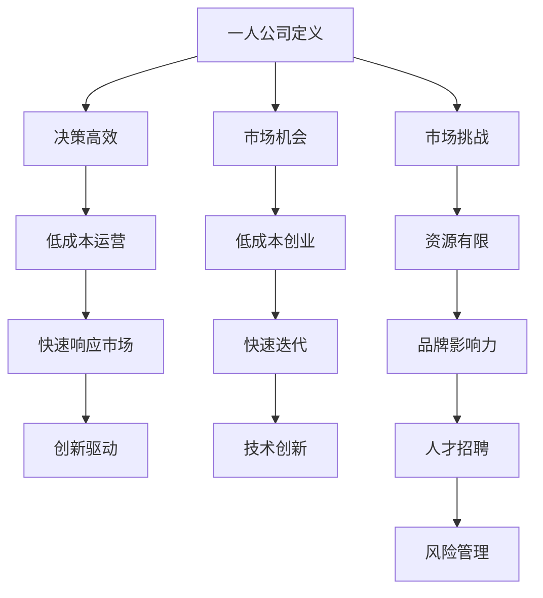

通过以上分析，我们可以看出一人公司在市场中的独特地位和重要性。接下来，我们将进一步探讨产品生态系统的概念和构建策略。

### 1.4 小结

一人公司作为一种新兴的创业模式，具有独特的运营模式和优势。其决策高效、运营成本低、响应市场迅速、技术创新能力强等特点，使得一人公司在快速变化的市场环境中具备较高的竞争力。然而，一人公司也面临着资源有限、品牌影响力不足、人才招聘困难等挑战。了解这些特点有助于创业者更好地把握市场机会，制定有效的运营策略。

## 第2章: 产品生态系统概念

### 2.1 产品生态系统的定义与构成

产品生态系统是指围绕某一核心产品，通过不同产品或服务的协同作用，形成一个相互依存、互相促进的生态圈。产品生态系统不仅包括核心产品，还包括辅助产品、配套服务、合作伙伴等多种元素。以下是产品生态系统的几个关键组成部分：

1. **核心产品**：产品生态系统的核心，通常具有独特的功能和竞争优势。
2. **辅助产品**：为满足用户需求而开发的其他产品或服务，可以增加用户粘性。
3. **配套服务**：围绕核心产品和辅助产品的服务，如售后服务、技术支持等。
4. **合作伙伴**：与公司合作的其他企业或机构，可以为产品生态系统提供资源和支持。
5. **用户社区**：由用户组成的社区，可以提供用户反馈和市场洞察。

### 2.2 产品生态系统的价值与作用

产品生态系统对企业和市场具有显著的价值和作用，主要体现在以下几个方面：

1. **增强用户粘性**：通过提供多样化的产品和服务，产品生态系统可以更好地满足用户需求，从而提高用户粘性。
2. **提升品牌影响力**：产品生态系统的多样性和协同效应，有助于提升企业的品牌影响力。
3. **促进创新**：产品生态系统内的协同作用可以激发创新思维，加速产品迭代和优化。
4. **扩大市场份额**：产品生态系统能够吸引更多的用户和合作伙伴，从而扩大市场份额。
5. **提高运营效率**：通过协同效应和资源优化，产品生态系统可以降低运营成本，提高效率。

### 2.3 产品生态系统的发展趋势

随着科技的进步和市场环境的变化，产品生态系统的发展趋势也在不断演变。以下是几个值得关注的发展方向：

1. **数字化**：数字化技术正在渗透到产品生态系统的各个方面，从产品设计、开发到运营和推广，数字化技术都发挥着重要作用。
2. **智能化**：人工智能、大数据等技术正在使产品生态系统更加智能化，从而提高用户体验和运营效率。
3. **生态化**：企业之间的合作越来越紧密，产品生态系统正在向生态化方向发展，形成更加复杂和多元的生态圈。
4. **平台化**：越来越多的企业开始构建平台化的产品生态系统，通过开放接口和合作生态，实现资源的共享和共赢。
5. **个性化**：随着用户需求的多样化，产品生态系统正在向个性化方向发展，更加注重满足用户个性化需求。

### Mermaid 流程图

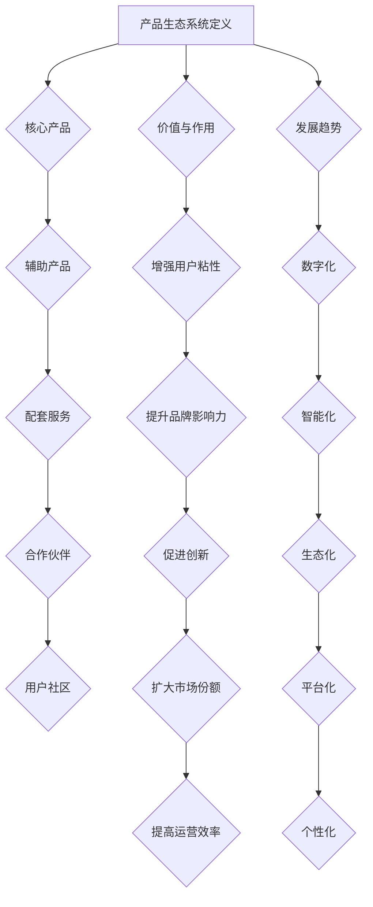

通过以上分析，我们可以看出产品生态系统在企业和市场中的重要性。它不仅有助于提高企业的竞争力，还能够为用户提供更好的体验。接下来，我们将探讨如何构建产品生态系统的战略。

### 2.4 小结

产品生态系统是一个复杂的系统，它通过核心产品、辅助产品、配套服务、合作伙伴和用户社区等多种元素的协同作用，为企业创造价值。产品生态系统的重要性体现在增强用户粘性、提升品牌影响力、促进创新、扩大市场份额和提高运营效率等方面。随着数字化、智能化、生态化和个性化的发展趋势，产品生态系统将变得更加复杂和多元。了解这些概念和趋势有助于企业更好地构建和优化产品生态系统。

## 第3章: 产品市场分析

### 3.1 市场需求分析

市场需求分析是构建产品生态系统的第一步，它旨在了解目标市场的需求和用户痛点。通过深入的市场调研和分析，我们可以获取以下关键信息：

1. **目标用户群体**：确定产品的目标用户群体，包括用户的年龄、性别、职业、地域等特征。
2. **用户需求**：了解用户对产品的期望和需求，包括功能需求、性能需求、用户体验等。
3. **用户痛点**：识别用户在当前市场上遇到的问题和痛点，这些痛点可以作为产品创新的切入点。
4. **市场规模**：评估目标市场的规模和增长潜力，为产品的市场定位提供依据。

### 3.2 竞争对手分析

竞争对手分析是市场需求分析的重要补充，它旨在了解市场上主要的竞争对手及其产品。以下是竞争对手分析的几个关键步骤：

1. **识别竞争对手**：列出直接和间接的竞争对手，包括市场上的其他企业及其产品。
2. **分析竞争对手的优势与劣势**：了解竞争对手的产品特点、市场表现、用户评价等，识别其优势和劣势。
3. **市场定位**：分析竞争对手的市场定位，包括目标用户、产品定位、市场策略等。
4. **竞争策略**：了解竞争对手的竞争策略，包括价格策略、营销策略、产品更新策略等。

### 3.3 产品定位与目标市场

在完成市场需求分析和竞争对手分析后，我们需要明确产品的市场定位和目标市场。以下是一些关键步骤：

1. **市场定位**：根据用户需求和竞争对手分析，确定产品的市场定位，包括产品的核心价值、目标用户群体、竞争优势等。
2. **目标市场**：明确产品的目标市场，包括特定的用户群体、市场细分、市场容量等。
3. **市场策略**：制定市场策略，包括定价策略、推广策略、渠道策略等，以确保产品能够顺利进入市场并满足用户需求。
4. **产品差异化**：通过产品差异化策略，使产品在市场上脱颖而出，吸引目标用户。

### Mermaid 流�程图

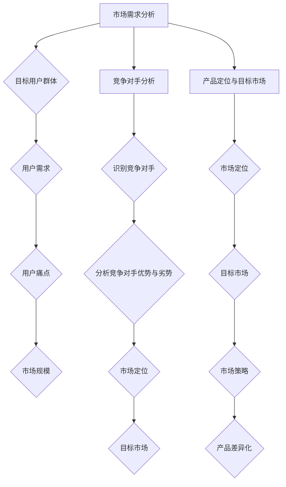

通过市场需求分析、竞争对手分析和产品定位与目标市场，我们可以为产品构建一个清晰的市场策略。接下来，我们将探讨如何通过产品创新来构建产品生态系统。

### 3.4 小结

市场需求分析和竞争对手分析是构建产品生态系统的基础。通过深入的市场调研和竞争对手分析，我们可以了解目标市场的需求、识别用户痛点、评估市场规模、识别竞争对手的优势和劣势，从而为产品定位和目标市场提供依据。明确的市场定位和目标市场有助于产品在市场上脱颖而出，满足用户需求，实现商业成功。

## 第4章: 产品创新策略

### 4.1 创新思维与工具

产品创新是构建产品生态系统的重要一环，而创新思维和工具则是实现产品创新的关键。以下介绍几种常用的创新思维和工具：

1. **头脑风暴**：头脑风暴是一种集体创意思维活动，旨在通过无限制的自由联想产生大量创意。这种方法通常在团队中进行，以激发团队成员的创新潜力。
2. **设计思维**：设计思维是一种以人为本的创新方法，它强调用户需求和用户体验。设计思维通常包括问题定义、创意生成、原型设计和测试反馈等阶段。
3. **TRIZ**：TRIZ（理论解决创新问题）是一种系统化的创新方法，它通过一系列原则和算法来指导创新过程。TRIZ方法强调从问题中提取矛盾，并寻找解决方案。
4. **六顶思考帽**：六顶思考帽是一种多角度思考方法，它通过六种不同颜色的帽子代表不同的思考方式，帮助团队成员从不同角度审视问题，产生创新思路。
5. **SWOT分析**：SWOT分析是一种战略规划工具，它通过分析产品的优势、劣势、机会和威胁，帮助团队确定创新方向。

### 4.2 产品创意生成

产品创意生成是产品创新过程的重要环节。以下是一些生成产品创意的方法：

1. **用户需求分析**：通过深入了解用户需求和痛点，可以发现潜在的产品创意。例如，用户反馈中经常提到的需求或问题，可以作为产品创新的切入点。
2. **市场趋势分析**：通过分析市场趋势和行业动态，可以发现潜在的市场机会。例如，新兴技术的发展或市场需求的转变，可能会激发新的产品创意。
3. **竞争对手分析**：通过分析竞争对手的产品和策略，可以发现竞争对手的不足或市场空白。这些不足或空白可以作为产品创新的灵感来源。
4. **跨界思维**：通过将不同领域的知识、技术和理念相结合，可以产生独特的创意。例如，将传统行业与互联网技术结合，可能会产生新的产品创意。

### 4.3 产品迭代与优化

产品迭代与优化是产品创新的核心。以下是一些关键步骤：

1. **原型设计**：在产品创意生成后，进行原型设计。原型设计可以帮助团队验证创意的可行性和用户需求，同时为后续的迭代和优化提供基础。
2. **用户测试**：将原型交给用户测试，收集用户反馈。用户测试可以帮助团队发现原型中的问题，并为改进提供依据。
3. **迭代优化**：根据用户测试反馈，对原型进行迭代和优化。迭代过程可以是多个循环，每次迭代都会使产品更接近用户需求。
4. **持续监控**：在产品上线后，持续监控用户反馈和市场表现。通过监控，团队可以及时了解产品的优势和不足，并采取相应的措施进行优化。

### Mermaid 流程图

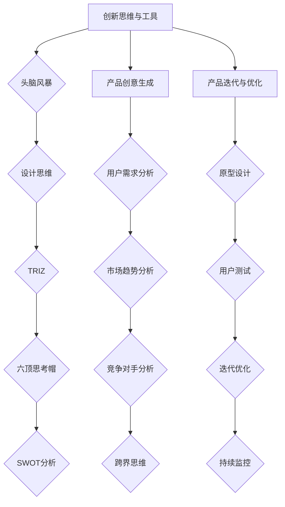

通过创新思维和工具，产品创意生成和迭代优化，我们可以不断改进产品，满足用户需求，提升用户体验。接下来，我们将探讨如何进行产品设计与开发。

### 4.4 小结

产品创新是构建产品生态系统的关键环节。通过创新思维和工具，我们可以生成具有竞争力的产品创意，并通过迭代优化不断提升产品的质量和用户体验。创新思维和工具包括头脑风暴、设计思维、TRIZ、六顶思考帽和SWOT分析等。产品创意生成的方法包括用户需求分析、市场趋势分析、竞争对手分析和跨界思维。产品迭代与优化则是通过原型设计、用户测试和持续监控，不断改进产品，实现产品的完善和优化。

## 第5章: 产品设计与开发

### 5.1 用户需求分析

用户需求分析是产品设计与开发的重要环节，它旨在了解用户的需求和痛点，为产品设计提供依据。以下是一些关键步骤和方法：

1. **访谈与调研**：通过与目标用户进行深入访谈或在线调研，了解用户的行为习惯、需求和痛点。
2. **用户画像**：基于访谈和调研数据，构建用户画像，包括用户的年龄、性别、职业、地域等信息。
3. **用户场景**：分析用户在不同场景下的需求和行为，识别用户的典型使用场景。
4. **需求分类**：将用户需求进行分类，分为功能需求、性能需求、用户体验等，以便更好地进行产品设计。

### 5.2 产品设计原则

产品设计原则是指导产品设计过程的重要准则，以下是一些常用的产品设计原则：

1. **用户中心**：以用户为中心进行设计，确保产品设计符合用户需求和使用习惯。
2. **简洁性**：设计简洁明了，避免复杂和冗余的功能，提高用户的操作便利性。
3. **一致性**：保持界面和交互的一致性，使用户能够快速上手和操作。
4. **可访问性**：确保产品对各类用户（包括残障人士）都具有良好的可访问性。
5. **可扩展性**：设计应具有可扩展性，以便在后续迭代中添加新功能或进行优化。

### 5.3 开发流程与工具

产品开发流程是产品设计与开发的重要环节，以下是一个典型的产品开发流程及其相关工具：

1. **需求分析**：在产品设计阶段，通过用户需求分析和市场调研，明确产品功能和技术需求。
2. **设计阶段**：使用设计工具（如Figma、Sketch等）进行产品设计，包括界面设计、交互设计和用户体验设计。
3. **开发阶段**：使用开发工具（如Visual Studio、IntelliJ IDEA等）进行产品开发，遵循敏捷开发方法，进行模块化开发。
4. **测试阶段**：进行功能测试、性能测试和用户体验测试，确保产品质量和稳定性。
5. **部署阶段**：将产品部署到生产环境，进行上线和发布。
6. **持续集成与部署**：使用CI/CD工具（如Jenkins、GitLab CI/CD等）进行自动化测试和部署，提高开发效率。

### Mermaid 流程图

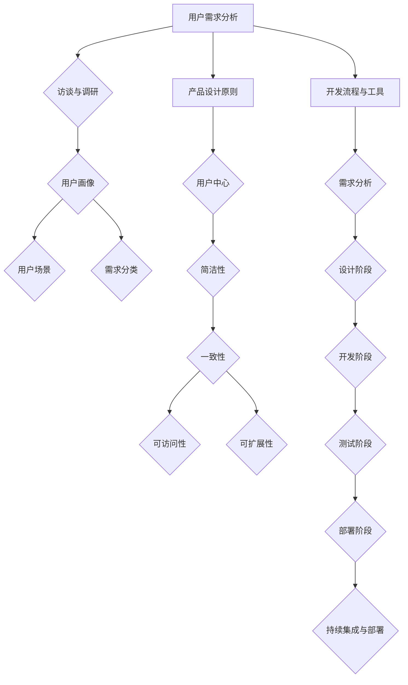

通过用户需求分析、遵循产品设计原则以及使用适当的开发流程与工具，我们可以确保产品的质量和用户体验，从而在激烈的市场竞争中脱颖而出。接下来，我们将探讨产品运营与推广的策略。

### 5.4 小结

产品设计与开发是构建产品生态系统的关键环节。通过深入的用户需求分析，我们可以明确产品的功能和技术需求。遵循以用户为中心的设计原则，我们可以设计出简洁、一致、可访问和可扩展的产品。开发流程与工具的使用，如敏捷开发方法、自动化测试和持续集成部署，可以提高开发效率和质量。通过这些步骤，我们可以确保产品在市场上的竞争力和用户体验。

## 第6章: 产品运营与推广

### 6.1 产品上线与发布

产品上线与发布是产品生命周期中的重要环节，它标志着产品正式进入市场。以下是一些关键步骤和注意事项：

1. **准备工作**：在产品上线前，确保所有功能和技术要求都已实现，并进行全面的测试，包括功能测试、性能测试和用户体验测试。
2. **发布计划**：制定详细的发布计划，包括发布时间、发布方式、发布版本号等。
3. **技术准备**：确保服务器、网络、数据库等基础设施的正常运行，并进行负载测试和压力测试，确保系统能够应对上线后的高并发访问。
4. **数据备份**：在上线前进行数据备份，以防止数据丢失或损坏。
5. **用户通知**：通过邮件、短信、社交媒体等方式，提前通知用户产品即将上线，并介绍新产品的特点和优势。

### 6.2 产品运营策略

产品上线后，运营策略至关重要，它决定了产品的市场表现和用户满意度。以下是一些关键运营策略：

1. **用户反馈收集**：通过用户反馈收集系统（如在线问卷调查、用户论坛等），了解用户对产品的评价和使用体验，及时发现问题并进行改进。
2. **用户留存策略**：通过提供优质的产品和服务、定期更新功能、开展用户活动等方式，提高用户留存率，增加用户粘性。
3. **用户增长策略**：通过市场推广、合作伙伴关系、用户推荐等方式，扩大用户基础，提高市场份额。
4. **数据分析**：利用数据分析工具（如Google Analytics、Mixpanel等），对用户行为进行分析，了解用户的使用习惯、偏好和需求，为产品优化和运营决策提供数据支持。
5. **内容营销**：通过撰写高质量的内容（如博客、白皮书、案例研究等），提高品牌知名度和影响力，吸引潜在用户。

### 6.3 产品推广渠道

产品推广是产品运营的重要组成部分，以下是一些常见的推广渠道：

1. **社交媒体**：利用Facebook、Twitter、Instagram等社交媒体平台，发布产品信息、用户评价和活动内容，吸引潜在用户。
2. **搜索引擎优化（SEO）**：通过优化网站内容和结构，提高在搜索引擎中的排名，吸引更多有意向的用户访问网站。
3. **内容营销**：通过撰写高质量的内容，如博客、白皮书、电子书等，吸引潜在用户并提高品牌知名度。
4. **广告投放**：通过Google Ads、Facebook Ads等广告平台，针对特定用户群体投放广告，提高产品曝光率。
5. **合作伙伴关系**：与行业内的其他企业或机构建立合作伙伴关系，通过互惠互利的合作，扩大产品影响力和市场份额。

### Mermaid 流程图

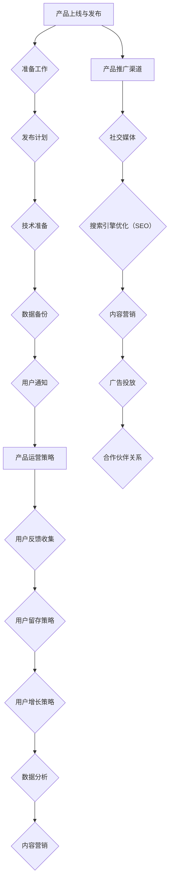

通过有效的产品上线与发布、运营策略和推广渠道，我们可以确保产品在市场上的成功和用户满意。接下来，我们将探讨如何优化和成长产品生态系统。

### 6.4 小结

产品运营与推广是确保产品成功上市和市场占有率的至关重要环节。通过精心准备的产品上线与发布计划、科学的运营策略和多样化的推广渠道，我们可以有效提升产品的市场表现和用户满意度。同时，持续的用户反馈收集、数据分析以及内容营销也是优化产品生态系统和实现持续增长的关键。

## 第7章: 产品生态系统的优化与成长

### 7.1 用户反馈与数据分析

用户反馈与数据分析是优化产品生态系统的重要环节。通过收集和分析用户反馈，企业可以深入了解用户需求、痛点和使用习惯，从而为产品的改进和优化提供有力依据。以下是具体的方法和步骤：

1. **反馈渠道建立**：建立多种用户反馈渠道，如在线问卷、用户论坛、社交媒体等，方便用户随时提交反馈。
2. **数据收集**：通过用户行为分析工具（如Google Analytics、Mixpanel等），收集用户在产品上的使用数据，包括页面访问量、功能使用情况、用户停留时间等。
3. **反馈分类**：对收集到的用户反馈进行分类，分为功能问题、用户体验问题、性能问题等，以便针对性地进行处理。
4. **数据分析**：使用数据分析工具，对用户反馈和使用数据进行统计和分析，识别出用户关注的问题和需求。
5. **反馈回应**：及时回应用户的反馈，展示企业的关注和重视，同时通过改进和优化，解决用户提出的问题。

### 7.2 产品迭代与优化

基于用户反馈和数据分析，产品迭代与优化是产品生态系统成长的关键。以下是具体的方法和步骤：

1. **需求筛选**：根据用户反馈和数据分析结果，筛选出最紧迫、最有价值的需求，作为产品迭代和优化的重点。
2. **优先级排序**：对筛选出的需求进行优先级排序，确保资源优先投入到用户最关注的功能和优化点上。
3. **原型设计与开发**：根据筛选出的需求，进行原型设计和开发。在设计过程中，可以采用敏捷开发方法，快速迭代和测试。
4. **用户测试**：在开发过程中，进行多次用户测试，收集用户对新功能的反馈，确保新功能和优化点符合用户需求。
5. **上线发布**：完成测试后，将新功能和优化点上线发布，同时收集用户使用数据，评估优化效果。

### 7.3 产品生态系统的持续成长

产品生态系统的持续成长是一个长期的过程，需要企业的持续投入和努力。以下是实现产品生态系统持续成长的方法和步骤：

1. **创新机制**：建立持续创新的机制，鼓励员工提出新想法和改进建议，确保产品生态系统能够不断适应市场变化。
2. **合作伙伴关系**：与行业内的合作伙伴建立紧密的合作关系，通过资源共享和协同创新，共同推动产品生态系统的成长。
3. **市场拓展**：积极开拓新市场，扩大产品生态系统的应用范围和用户基础，提高市场份额。
4. **品牌建设**：加强品牌建设，提升品牌知名度和影响力，为产品生态系统的持续成长提供支持。
5. **人才培养**：注重人才培养，建立高效的人才团队，为产品生态系统的持续成长提供人力保障。

### Mermaid 流程图

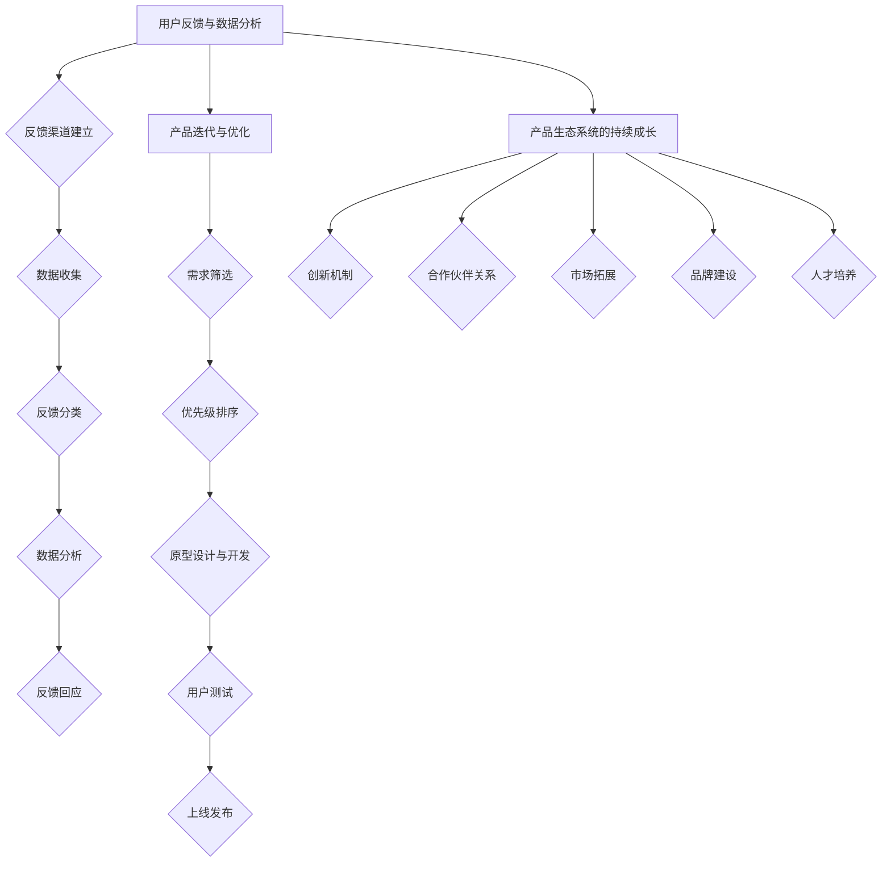

通过用户反馈与数据分析、产品迭代与优化以及产品生态系统的持续成长，企业可以不断提升产品的质量和用户体验，实现产品生态系统的长期稳定发展。

### 7.4 小结

产品生态系统的优化与成长是一个系统工程，需要企业持续关注用户反馈、不断进行产品迭代与优化，并注重创新机制、合作伙伴关系、市场拓展、品牌建设和人才培养。通过这些方法和步骤，企业可以不断提升产品竞争力，实现产品生态系统的长期稳定发展。

## 第8章: 成功的独立创业者经验分享

### 8.1 创业故事与心路历程

独立创业者的成功故事往往充满挑战和激情。以下是一个典型的创业故事，展示了创业者如何在困境中坚持不懈，最终取得成功的经历。

#### 创业起点

张伟，一位年轻的计算机科学毕业生，对科技和创业充满热情。他在大学期间积累了丰富的编程经验，并参与了一些开源项目。毕业后，张伟决定独立创业，开发一款面向中小企业的智能化管理工具。

#### 初创阶段

张伟的创业初期面临诸多困难。他需要自己承担公司所有的运营成本，包括服务器租赁、软件开发、市场推广等。此外，他还必须应对市场竞争、技术难题和团队建设的挑战。

#### 产品开发

在产品开发阶段，张伟利用自己的技术特长，独立完成了产品的前期设计和技术架构。他采用了敏捷开发方法，快速迭代和测试，确保产品能够满足用户需求。

#### 市场推广

为了推广产品，张伟采取了多种市场策略。他利用社交媒体、内容营销和广告投放，吸引潜在用户。此外，他还积极参加行业展会和创业比赛，提升品牌知名度。

#### 成功时刻

经过一年的努力，张伟的产品在市场上取得了一定的成功，吸引了大量用户。公司也获得了风险投资，进一步加速了产品迭代和市场拓展。

### 8.2 成功产品案例分析

张伟的成功离不开他的一款核心产品——智能管理平台。以下是对该产品的详细分析：

#### 产品特点

1. **智能化**：平台采用了人工智能技术，能够自动分析企业数据，为企业提供决策支持。
2. **易用性**：平台界面简洁，操作简便，适合不同层次的用户使用。
3. **定制化**：平台支持个性化配置，用户可以根据自己的需求自定义功能模块。

#### 用户反馈

用户对产品的反馈普遍良好。许多用户表示，平台帮助他们提高了工作效率，降低了运营成本。以下是一些典型的用户评价：

- “这款产品非常实用，帮助我们企业节省了大量时间和人力成本。”
- “平台的数据分析和预测功能非常准确，为我们企业的决策提供了重要参考。”

#### 成功因素

张伟的成功主要得益于以下几个因素：

1. **用户需求**：他深入了解用户需求，开发了符合用户需求的产品。
2. **技术创新**：他利用先进的技术，提升了产品的竞争力。
3. **市场策略**：他采取了多种市场策略，提高了产品的知名度和用户基础。
4. **团队协作**：他建立了高效的团队，确保了产品开发的顺利进行。

### 8.3 创业者经验与教训

张伟的创业经历给我们带来了许多宝贵的经验和教训：

1. **坚持不懈**：创业过程中会遇到各种困难和挑战，但只要坚持不懈，就有可能取得成功。
2. **深入了解用户**：只有深入了解用户需求，才能开发出符合用户期望的产品。
3. **技术创新**：在激烈的市场竞争中，技术创新是提升产品竞争力的关键。
4. **市场策略**：有效的市场策略可以帮助产品快速打开市场，获得用户认可。
5. **团队协作**：建立高效的团队，确保产品开发和运营的顺利进行。

通过这些经验和教训，创业者可以更好地应对创业过程中的挑战，实现自己的创业梦想。

### 8.4 小结

独立创业者的成功故事充满挑战和机遇。通过深入了解用户需求、技术创新、有效的市场策略和团队协作，创业者可以在激烈的市场竞争中脱颖而出，实现创业梦想。张伟的成功经验为我们提供了宝贵的启示，鼓励我们勇敢追求创业梦想，不断探索和突破。

## 第9章: 构建产品生态系统的实战策略

### 9.1 生态链构建

构建产品生态系统需要构建一个完整的生态链，包括核心产品、辅助产品、配套服务、合作伙伴和用户社区。以下是生态链构建的具体策略：

1. **核心产品定位**：明确核心产品的市场定位和用户需求，确保产品的功能和技术能够满足用户需求。
2. **辅助产品开发**：开发辅助产品，如插件、工具、服务包等，扩展核心产品的功能和应用场景。
3. **配套服务完善**：提供完善的配套服务，如技术支持、培训、咨询等，提升用户的使用体验和满意度。
4. **合作伙伴拓展**：与行业内的其他企业或机构建立合作伙伴关系，共享资源和客户，扩大产品生态系统的覆盖范围。
5. **用户社区建设**：建立用户社区，提供用户交流、反馈和互动的平台，增强用户的参与感和归属感。

### 9.2 合作伙伴选择

选择合适的合作伙伴是构建产品生态系统的重要一环。以下是合作伙伴选择的策略：

1. **互补优势**：选择在技术、市场、资源等方面与自己互补的合作伙伴，共同打造强大的产品生态系统。
2. **长期合作**：优先选择那些愿意进行长期合作的合作伙伴，建立稳定的合作关系，共同发展。
3. **信任基础**：选择有信誉和良好合作记录的合作伙伴，确保合作过程的顺利进行。
4. **共同目标**：确保合作伙伴与自己的目标一致，共同推动产品生态系统的成长和发展。
5. **资源交换**：通过资源交换，如技术、市场、用户等，实现互利共赢。

### 9.3 产品生态系统运营策略

产品生态系统的运营策略决定了生态系统的健康和持续发展。以下是产品生态系统运营的具体策略：

1. **用户反馈机制**：建立完善的用户反馈机制，及时收集用户意见和建议，快速响应用户需求。
2. **持续创新**：鼓励团队成员持续创新，通过产品迭代和优化，不断提升产品的竞争力。
3. **合作伙伴管理**：加强与合作伙伴的沟通和合作，确保合作伙伴的积极性和合作效率。
4. **市场推广**：制定有效的市场推广策略，提高产品的市场知名度和用户基础。
5. **数据分析**：利用数据分析工具，对用户行为、市场趋势等进行分析，为运营决策提供数据支持。

### Mermaid 流程图

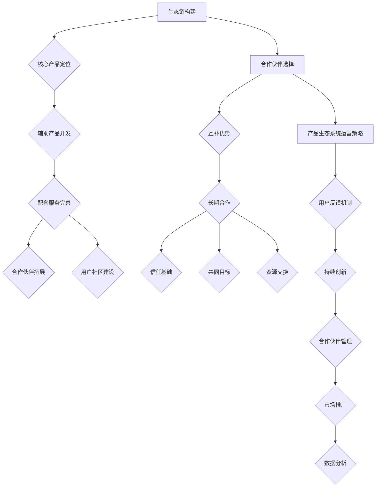

通过构建完整的生态链、选择合适的合作伙伴以及实施有效的运营策略，企业可以打造一个健康、持续发展的产品生态系统。

### 9.4 小结

构建产品生态系统的实战策略涉及生态链构建、合作伙伴选择和产品生态系统运营。通过明确核心产品定位、完善辅助产品和配套服务、拓展合作伙伴以及建立用户社区，企业可以构建一个完整的生态链。选择合适的合作伙伴和实施有效的运营策略，可以确保生态系统的健康和持续发展。这些策略为企业在激烈的市场竞争中提供了有力支持。

## 第10章: 个人品牌建设与影响力扩展

### 10.1 个人品牌建设策略

个人品牌建设是独立创业者和企业成功的关键因素之一。以下是一些个人品牌建设策略：

1. **明确品牌定位**：确定个人品牌的定位和目标受众，明确自己的专业领域和独特优势。
2. **内容创作**：通过撰写高质量的技术博客、发布原创文章、制作视频教程等方式，展示自己的专业知识和经验。
3. **社交媒体营销**：利用社交媒体平台（如LinkedIn、Twitter、微信公众号等），发布专业内容，增加曝光率和粉丝数量。
4. **演讲与分享**：参加行业会议、技术沙龙、线上研讨会等，通过演讲和分享展示自己的专业能力。
5. **建立个人网站**：创建个人网站或博客，展示自己的专业背景、作品和成就，增加个人品牌的权威性。
6. **参与开源项目**：积极参与开源项目，贡献代码和经验，提升个人在技术社区的知名度和影响力。

### 10.2 影响力扩展途径

影响力扩展是个人品牌建设的重要目标之一。以下是一些扩展影响力途径：

1. **合作与联盟**：与行业内其他专业人士和机构建立合作关系，通过联合活动、项目合作等方式，扩大影响力。
2. **媒体曝光**：利用传统媒体（如报纸、杂志）和新兴媒体（如短视频、直播）进行宣传，提高个人品牌的曝光率。
3. **公众演讲**：参加行业大会、研讨会、技术沙龙等，通过演讲和分享展示自己的专业知识和见解。
4. **社交媒体互动**：积极参与社交媒体互动，回复评论、参与讨论、分享行业动态，建立良好的社交媒体影响力。
5. **出版书籍**：撰写并出版专业书籍，通过书籍的传播和销售，提升个人品牌影响力。
6. **在线课程与培训**：开设在线课程或培训，通过教学和辅导，展示自己的专业知识和教学能力。

### 10.3 个人品牌的长期发展

个人品牌的长期发展需要持续的努力和策略调整。以下是一些长期发展策略：

1. **持续学习**：不断学习新技术、新知识，保持自己的专业竞争力。
2. **内容更新**：定期更新个人网站和社交媒体内容，保持内容的活力和吸引力。
3. **品牌延伸**：在专业领域内，尝试扩展业务范围，如咨询、顾问、培训等，实现品牌价值的多元化。
4. **合作共赢**：与合作伙伴保持良好的合作关系，共同创造价值，提升品牌影响力。
5. **公众形象**：注重个人公众形象，保持专业、诚信、正直的形象，树立良好的品牌形象。
6. **品牌维护**：定期评估个人品牌的表现，调整品牌战略和策略，确保品牌的持续发展。

### Mermaid 流程图

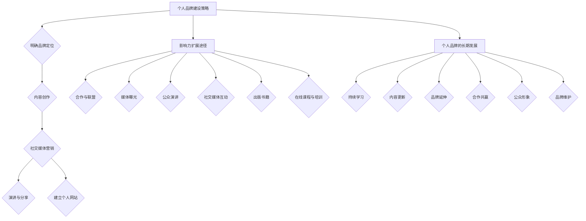

通过个人品牌建设策略、影响力扩展途径和长期发展策略，独立创业者和企业可以提升个人品牌影响力，实现长期发展。

### 10.4 小结

个人品牌建设与影响力扩展是独立创业者和企业成功的重要因素。通过明确品牌定位、内容创作、社交媒体营销、演讲与分享、建立个人网站等策略，可以建立个人品牌。扩展影响力途径如合作与联盟、媒体曝光、公众演讲、社交媒体互动、出版书籍和在线课程与培训，有助于提升个人品牌影响力。长期发展策略如持续学习、内容更新、品牌延伸、合作共赢、公众形象和品牌维护，确保个人品牌持续发展。这些策略为个人品牌建设提供了全面而有效的指导。

## 附录A: 常用工具与资源推荐

### A.1 产品设计与开发工具

**设计工具**：
1. **Figma**：一款基于浏览器的用户界面设计工具，支持协作。
2. **Sketch**：适用于Mac系统的矢量界面设计工具，易于使用。
3. **Adobe XD**：专业的UI/UX设计工具，支持交互设计。

**开发工具**：
1. **Visual Studio**：由微软推出的集成开发环境，支持多种编程语言。
2. **IntelliJ IDEA**：强大的Java和Android开发环境，提供丰富的插件和扩展。
3. **Git**：分布式版本控制系统，用于代码管理。
4. **GitHub**：代码托管平台，提供版本控制、项目协作等功能。

**项目管理工具**：
1. **Trello**：基于看板的任务管理工具，易于操作。
2. **Jira**：专业的敏捷项目管理工具，提供任务跟踪、Bug管理等功能。

**测试工具**：
1. **Selenium**：开源的Web自动化测试工具。
2. **JUnit**：Java单元测试框架。
3. **Postman**：API测试工具。

### A.2 市场分析与调研工具

**市场分析工具**：
1. **Google Analytics**：分析网站流量和用户行为。
2. **Ahrefs**：用于SEO和竞争对手分析的在线工具。
3. **BuzzSumo**：社交媒体内容分析和市场洞察工具。

**调研工具**：
1. **Qualtrics**：在线调查和数据分析平台。
2. ** SurveyMonkey**：提供在线问卷设计和分析工具。
3. **Google Trends**：分析关键词搜索趋势。

### A.3 运营与推广工具

**营销自动化工具**：
1. **HubSpot**：营销自动化和客户关系管理（CRM）平台。
2. **Mailchimp**：电子邮件营销工具。
3. **Hootsuite**：社交媒体管理和分析工具。

**广告投放工具**：
1. **Google Ads**：Google提供的在线广告服务。
2. **Facebook Ads Manager**：Facebook的广告投放和管理工具。
3. **AdRoll**：动态再营销广告平台。

**内容营销工具**：
1. **Canva**：设计图片和模板的在线工具。
2. **ContentCal**：内容策划和日程安排工具。
3. **BuzzSumo**：内容分析和市场洞察工具。

这些工具和资源可以帮助创业者和管理团队在产品设计与开发、市场分析、运营和推广等各个阶段更高效地工作，提高项目的成功率和市场竞争力。

### 附录B: 产品生态系统架构图

为了更好地理解产品生态系统，以下提供了一个产品生态系统架构图，展示了核心产品、辅助产品、配套服务、合作伙伴和用户社区之间的关系。

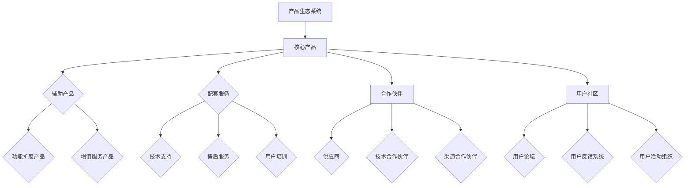

### B.1 产品生态系统整体架构

该架构图展示了产品生态系统的整体架构。核心产品作为生态系统的基础，通过辅助产品和配套服务扩展功能和应用场景。合作伙伴的参与为产品生态系统提供了资源和支持。用户社区则通过用户反馈和活动组织，增强用户参与感和品牌忠诚度。

### B.2 核心产品与组件关系图

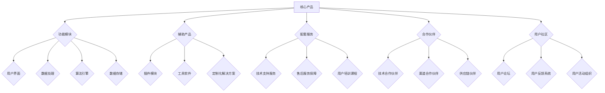

在这个关系图中，核心产品由多个功能模块组成，包括用户界面、数据处理、算法引擎和数据存储。辅助产品和配套服务通过插件模块、工具软件、定制化解决方案、技术支持服务、售后服务保障、用户培训课程等组件扩展功能。合作伙伴通过技术合作、渠道合作和供应链合作，为产品生态系统提供了资源和支持。用户社区通过用户论坛、用户反馈系统和用户活动组织，增强用户参与和品牌忠诚度。

这些架构图帮助读者更好地理解产品生态系统的构建和运作机制，为实际操作提供了参考。

### 附录C: 代码实例与解读

为了更好地理解产品生态系统的开发过程，以下提供了一个简单的代码实例，展示如何搭建一个基本的产品开发环境，实现一个基本的产品功能，并进行代码解读和分析。

#### C.1 产品开发环境搭建

首先，我们需要搭建一个基本的开发环境。以下是使用Python语言搭建环境的一个示例：

```python
# 安装Python
!pip install python

# 创建虚拟环境
!python -m venv venv

# 激活虚拟环境
source venv/bin/activate

# 安装必需的库
!pip install Flask requests
```

在这个示例中，我们首先安装了Python，然后创建了一个虚拟环境，并激活了这个环境。接着，我们安装了Flask框架和requests库，这些库用于Web开发和HTTP请求。

#### C.2 产品功能实现与代码解读

接下来，我们实现一个简单的Web应用，用于获取天气信息。以下是实现的代码：

```python
# 导入必需的库
import flask
import requests

# 创建Flask应用
app = flask.Flask(__name__)

# 天气API URL
weather_api_url = "http://api.openweathermap.org/data/2.5/weather"

# API密钥
api_key = "your_api_key"

# 获取天气信息
@app.route('/weather', methods=['GET'])
def get_weather():
    city = flask.request.args.get('city')
    response = requests.get(weather_api_url, params={'q': city, 'appid': api_key})
    weather_data = response.json()
    return weather_data

# 运行Flask应用
if __name__ == '__main__':
    app.run(debug=True)
```

在这个代码中，我们首先导入了Flask和requests库。Flask用于创建Web应用，requests用于发送HTTP请求。我们定义了一个Flask应用，并创建了一个路由`/weather`，用于获取天气信息。在`get_weather`函数中，我们从请求参数中获取城市名称，并通过API请求获取天气数据，并将数据返回给用户。

#### C.3 代码应用解读与分析

1. **导入库**：首先，我们导入了Flask和requests库。Flask是一个轻量级的Web应用框架，用于创建Web应用；requests库用于发送HTTP请求，用于与天气API进行通信。

2. **创建Flask应用**：使用`flask.Flask(__name__)`创建了一个Flask应用实例。

3. **定义路由**：使用`@app.route('/weather', methods=['GET'])`定义了一个路由，用于处理`/weather`路径的GET请求。

4. **获取请求参数**：使用`flask.request.args.get('city')`从请求参数中获取城市名称。

5. **发送HTTP请求**：使用`requests.get(weather_api_url, params={'q': city, 'appid': api_key})`向天气API发送GET请求，获取天气数据。

6. **返回数据**：将获取的天气数据以JSON格式返回给用户。

7. **运行应用**：使用`app.run(debug=True)`启动Web应用，并启用调试模式。

#### C.4 实际案例分析与详细讲解剖析

假设我们使用这个Web应用获取某个城市的天气信息。以下是具体的步骤和分析：

1. **访问Web应用**：在浏览器中输入`http://127.0.0.1:5000/weather?city=Shanghai`，访问Web应用。

2. **发送GET请求**：浏览器将发送一个GET请求到Web应用的`/weather`路由。

3. **获取城市名称**：Web应用从请求参数中获取城市名称`Shanghai`。

4. **发送HTTP请求到天气API**：Web应用使用`requests`库向天气API发送GET请求，获取上海的天气数据。

5. **处理响应数据**：天气API返回JSON格式的天气数据。

6. **返回数据**：Web应用将获取的天气数据以JSON格式返回给浏览器。

7. **显示数据**：浏览器将接收到的天气数据显示在页面上。

通过这个案例，我们可以看到如何使用Python和Flask实现一个简单的Web应用，并获取第三方API的数据。在实际项目中，这个Web应用可以进一步扩展和优化，以提供更丰富的功能和更好的用户体验。

#### C.5 项目小结

通过这个简单的代码实例，我们展示了如何搭建一个基本的产品开发环境，实现一个获取天气信息的基本功能，并对代码进行了详细的解读和分析。这个实例为理解产品开发过程提供了一个清晰的框架，也为实际项目开发提供了参考。

### 10.5 最佳实践 tips、小结、注意事项、拓展阅读

**最佳实践 tips**：

1. **合理规划开发时间**：在开发前，制定详细的项目计划和时间表，确保项目按计划进行。
2. **重视用户体验**：在设计产品时，始终以用户体验为核心，确保产品易于使用、功能全面。
3. **持续集成与部署**：采用持续集成和部署（CI/CD）流程，提高开发效率和产品质量。
4. **数据分析**：定期进行数据分析，了解用户行为和产品表现，为优化产品提供依据。
5. **持续学习**：关注行业动态和技术发展趋势，持续学习和更新知识，保持竞争力。

**小结**：

本文通过详细的案例分析和实战策略，探讨了如何构建一人公司的产品生态系统。从市场需求分析、产品创新、设计与开发，到产品运营与推广，以及生态链构建和品牌建设，每个环节都至关重要。通过逐步分析和实施这些策略，企业可以构建一个健康、持续发展的产品生态系统。

**注意事项**：

1. **市场调研**：深入了解用户需求和市场竞争情况，确保产品的市场定位准确。
2. **技术创新**：保持技术创新，不断提升产品的竞争力。
3. **团队协作**：建立高效的团队，确保项目顺利推进。
4. **用户反馈**：及时收集用户反馈，持续优化产品。

**拓展阅读**：

1. **《精益创业》**：艾瑞克·莱斯著，介绍精益创业方法，有助于构建产品生态系统。
2. **《设计思维》**：大卫·凯利著，介绍设计思维方法，有助于产品创新和用户体验设计。
3. **《产品经理实战》**：刘润著，详细讲解产品经理的工作方法和实战经验。

通过本文的阅读，读者可以全面了解构建产品生态系统的策略和方法，为实际操作提供指导。希望本文能为读者在产品生态系统构建过程中提供有价值的参考和启发。

