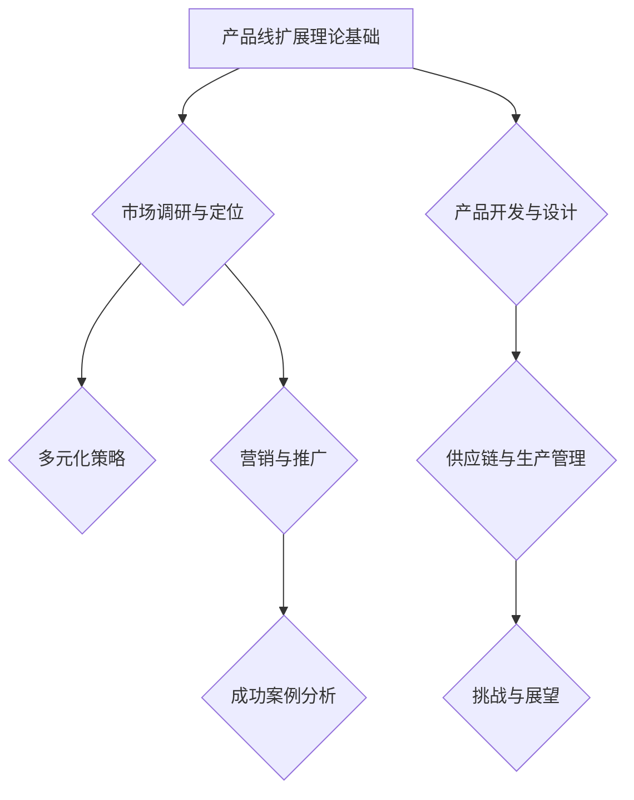

                 

### 文章标题：一人公司的产品线扩展与多元化策略

#### 关键词：一人公司、产品线扩展、多元化策略、市场调研、产品开发、营销推广、供应链管理

> 摘要：本文旨在探讨一人公司在面对市场竞争和业务发展时，如何通过产品线扩展和多元化策略来提升业务竞争力。文章首先概述了一人公司的经营模式及其面临的挑战，随后深入分析了市场调研与定位、多元化策略的选择与实施、产品开发与设计、营销与推广、供应链与生产管理等关键环节。通过案例分析，本文总结了成功经验和挑战，为一人公司提供了有价值的参考和启示。

### 引言

在当今快速变化的市场环境中，企业必须具备灵活性和创新精神，以应对不断出现的新机遇和挑战。一人公司，即单打独斗的企业，这类公司在创业初期尤其需要一种系统性的策略来保证其生存与发展。产品线扩展与多元化策略成为一人公司提升竞争力、扩大市场份额的重要手段。

本文将从以下几个方面展开讨论：

1. **一人公司的经营模式**：介绍一人公司的定义、优势与挑战，以及其在法律和财务方面的特殊情况。
2. **产品线扩展的必要性**：分析市场需求、竞争环境，并探讨个人业务拓展的目标。
3. **市场调研与定位**：介绍市场调研的方法、定位策略以及品牌建设与传播。
4. **多元化策略**：阐述多元化战略的类型、优势与风险，包括相关多元化和非相关多元化。
5. **产品开发与设计**：详细讲解产品开发流程、产品设计原则以及用户为中心的设计理念。
6. **营销与推广**：分析营销策略、数字营销工具与平台，以及定价和渠道策略。
7. **供应链与生产管理**：探讨供应链管理、生产管理的策略与方法。
8. **产品线扩展案例分析**：通过成功案例分析，总结经验与教训。
9. **面临的挑战与展望**：分析竞争压力、资源限制和市场不确定性，探讨未来发展的机遇。

### 第一部分：产品线扩展理论基础

#### 第1章：一人公司的经营模式

##### 1.1 一人公司概述

一人公司，又称独资企业，是指由一个自然人投资设立，全部资本由投资者个人出资的企业。其特点是公司所有权、管理权和收益权高度统一。一人公司具有如下几个特点：

1. **所有权与管理权高度统一**：一人公司所有者既是公司的唯一股东，也是公司的管理者，决策效率较高。
2. **运营灵活**：由于决策权集中在一个人手中，一人公司可以迅速应对市场变化，降低管理成本。
3. **法律地位**：一人公司作为法人，具有独立的法律地位，可以独立承担法律责任。

##### 1.2 一人公司的优势与挑战

一人公司的优势主要体现在以下几个方面：

1. **决策效率高**：决策过程简单，可以迅速响应市场需求。
2. **管理成本低**：由于所有者和管理者同一个人，减少了管理成本。
3. **经营灵活性**：一人公司可以灵活调整业务策略，适应市场变化。

然而，一人公司也面临一些挑战：

1. **承担无限责任**：一人公司所有者需对公司债务承担无限责任，风险较高。
2. **管理能力限制**：所有者的个人能力和资源有限，可能无法全面覆盖所有业务领域。
3. **资源限制**：一人公司可能缺乏大规模融资能力，发展空间受限。

##### 1.3 法律和财务概况

在法律层面，一人公司需遵守相关的公司法规，如《公司法》、《合同法》等。此外，一人公司需依法进行年度审计，确保财务报告的透明性和准确性。

在财务方面，一人公司通常采用现金记账制度，便于管理现金流。一人公司还需缴纳企业所得税、个人所得税等税费，并按规定进行税务申报和缴纳。

#### 第2章：市场调研与定位

##### 2.1 市场调研方法

市场调研是产品线扩展和多元化策略制定的基础。以下是几种常用的市场调研方法：

1. **竞品分析**：通过分析竞争对手的产品特点、价格策略、市场占有率等信息，了解竞争对手的优势和劣势。
2. **消费者调研**：通过问卷调查、深度访谈等方式，了解消费者的需求、偏好和行为模式。
3. **市场趋势预测**：通过数据分析、趋势分析等方法，预测市场未来的发展方向和趋势。

##### 2.2 定位策略

定位策略是企业在市场中找到自己的独特位置，以区别于竞争对手的关键。以下是几种常见的定位策略：

1. **目标市场细分**：将市场划分为不同的细分市场，根据细分市场的需求和特点，制定相应的产品策略和营销策略。
2. **产品差异化策略**：通过产品功能、设计、品质等方面的差异化，使产品在市场中脱颖而出。
3. **品牌建设与传播**：通过广告宣传、公关活动等方式，建立品牌形象，提高品牌知名度和美誉度。

#### 第3章：多元化策略

##### 3.1 多元化战略的类型

多元化战略是企业通过拓展新的业务领域，实现业务多元化发展的战略。根据业务拓展的方向，多元化战略可分为以下几种类型：

1. **相关多元化**：在现有业务的基础上，拓展相关领域的新业务。例如，一家生产手机的企业拓展到生产智能穿戴设备。
2. **非相关多元化**：进入与现有业务完全不相关的领域。例如，一家服装公司转型进入食品行业。
3. **前向一体化**：通过并购或合作，将业务范围拓展到下游的产业链环节。例如，一家制造商收购销售渠道，实现前向一体化。
4. **后向一体化**：将业务范围拓展到上游的产业链环节。例如，一家原材料供应商并购加工企业，实现后向一体化。

##### 3.2 多元化战略的优势与风险

多元化战略的优势主要体现在以下几个方面：

1. **分散风险**：通过拓展新的业务领域，减少对单一业务的依赖，降低经营风险。
2. **资源优化**：利用现有资源，实现业务间的资源共享和协同效应。
3. **市场机会**：开拓新的市场，增加市场份额和盈利能力。

然而，多元化战略也面临一些风险：

1. **管理难度增加**：业务多元化导致管理复杂度增加，管理难度加大。
2. **资源分散**：过度多元化可能导致资源分散，影响核心业务的竞争力。
3. **业务协同效应不足**：业务间缺乏协同效应，可能导致资源浪费和效率降低。

### 第二部分：产品线扩展实践指南

#### 第4章：产品开发与设计

##### 4.1 产品开发流程

产品开发流程是产品从概念到市场推出的系统过程，以下是产品开发的一般流程：

1. **需求分析**：通过市场调研和用户反馈，确定产品的功能和性能要求。
2. **原型设计与测试**：根据需求分析，设计产品原型并进行测试，验证产品功能是否满足用户需求。
3. **产品迭代与优化**：根据用户反馈和测试结果，对产品进行迭代和优化，不断提升产品性能和用户体验。

##### 4.2 产品设计原则

产品设计原则是指导产品开发的基本原则，以下是几个重要的产品设计原则：

1. **用户为中心设计**：以用户需求为核心，设计出满足用户需求和期望的产品。
2. **创新与差异化**：通过创新设计，使产品在市场中具有独特的竞争力。
3. **易用性与用户体验**：注重产品的易用性和用户体验，提高用户满意度和忠诚度。
4. **可持续性**：在设计过程中考虑产品的环保性和可持续性，降低对环境的影响。

#### 第5章：营销与推广

##### 5.1 营销策略

营销策略是企业为实现销售目标而制定的总体规划和具体行动。以下是几个关键的营销策略：

1. **定价策略**：根据市场需求、产品定位和成本等因素，确定合理的价格策略，以实现利润最大化。
2. **渠道策略**：选择合适的销售渠道，包括线上和线下渠道，提高产品覆盖率和销售效率。
3. **推广活动策划**：通过广告、促销活动等方式，提高产品的知名度和市场占有率。

##### 5.2 数字营销工具与平台

数字营销工具和平台是现代营销中不可或缺的一部分，以下是几个常用的数字营销工具和平台：

1. **社交媒体营销**：通过微博、微信、Facebook、Instagram等社交媒体平台，与用户互动，提高品牌知名度和用户参与度。
2. **搜索引擎优化（SEO）**：通过优化网站内容和结构，提高在搜索引擎中的排名，吸引更多的有机流量。
3. **电子邮件营销**：通过定期发送电子邮件，与用户保持沟通，促进用户忠诚度和复购率。

#### 第6章：供应链与生产管理

##### 6.1 供应链管理

供应链管理是企业有效整合和管理从原材料采购到产品交付的整个供应链过程。以下是供应链管理的关键要素：

1. **供应商选择与评估**：根据质量、价格、交货期等因素，选择合适的供应商，并对其进行定期评估和改进。
2. **库存管理**：通过科学的方法，合理规划库存水平，避免库存过剩或短缺，提高资金周转率。
3. **物流与配送**：优化物流和配送流程，降低物流成本，提高配送效率和客户满意度。

##### 6.2 生产管理

生产管理是企业确保生产过程高效、优质、低成本的关键环节。以下是生产管理的关键要素：

1. **生产计划与排程**：根据订单需求和库存水平，制定合理的生产计划和排程，确保生产进度和质量。
2. **生产质量控制**：通过质量检测和控制，确保产品的质量和一致性。
3. **成本控制与优化**：通过成本分析和控制，优化生产成本，提高企业的盈利能力。

### 第三部分：产品线扩展案例分析

#### 第7章：成功案例分析

##### 7.1 案例介绍

【案例名称】：小杰的智能家居企业

【公司背景】：小杰是一位年轻的创业者，他创建了一家专注于智能家居产品的公司。公司初期以智能门锁为主要产品，经过几年的发展，逐渐拓展到了智能照明、智能安防等多个领域。

【产品线扩展过程】：在智能门锁的基础上，小杰首先推出了智能照明产品，随后又推出了智能安防产品，形成了智能家居系列产品线。

【成功经验与教训】：小杰的成功经验主要包括以下几点：

1. **市场需求驱动**：小杰在产品开发过程中，始终以市场需求为导向，通过市场调研和用户反馈，不断优化产品功能。
2. **技术创新**：小杰注重技术创新，不断推出具有竞争力的新产品，保持了在智能家居市场的领先地位。
3. **品牌建设**：小杰通过广告宣传和公关活动，建立了良好的品牌形象，提高了品牌知名度和用户忠诚度。

#### 第8章：案例分析

##### 8.1 市场定位与策略

小杰在市场定位方面采取了以下策略：

1. **目标市场细分**：小杰将智能家居市场划分为多个细分市场，如家庭、酒店、商业等，根据不同细分市场的需求，制定相应的产品策略。
2. **产品差异化策略**：小杰通过技术创新和差异化设计，使产品在功能和性能上具有独特性，满足了不同用户群体的需求。

##### 8.2 产品设计与开发

小杰在产品设计和开发方面遵循了以下原则：

1. **用户为中心设计**：小杰注重用户体验，通过用户调研和反馈，优化产品功能和界面设计。
2. **创新与差异化**：小杰不断推出具有创新功能的新产品，如智能门锁的远程控制、智能照明的场景模式等。
3. **易用性与用户体验**：小杰的产品设计简洁易用，用户操作方便，提高了用户满意度和忠诚度。

##### 8.3 营销与推广策略

小杰在营销与推广方面采取了以下策略：

1. **社交媒体营销**：小杰通过微博、微信等社交媒体平台，与用户互动，宣传产品特点，提高品牌知名度。
2. **搜索引擎优化（SEO）**：小杰通过优化网站内容和结构，提高在搜索引擎中的排名，吸引更多的潜在客户。
3. **线下推广活动**：小杰参加行业展会和线下活动，展示产品优势，吸引合作伙伴和潜在客户。

### 面临的挑战与展望

#### 8.1 面临的挑战

一人公司在产品线扩展过程中，可能面临以下挑战：

1. **竞争压力**：智能家居市场日益竞争激烈，一人公司需要不断提升产品竞争力，以应对竞争对手的压力。
2. **资源限制**：一人公司的资源有限，可能在资金、人才、技术等方面受到制约，影响产品开发和市场拓展。
3. **市场不确定性**：智能家居市场的发展趋势和用户需求不断变化，一人公司需要具备快速响应市场变化的能力。

#### 8.2 未来发展展望

尽管面临挑战，一人公司在未来仍有很大的发展空间：

1. **技术创新**：随着科技的不断发展，智能家居领域将出现更多创新产品，一人公司可以通过技术创新，抢占市场先机。
2. **市场拓展**：智能家居市场在全球范围内都有很大的潜力，一人公司可以通过拓展海外市场，实现业务的国际化发展。
3. **多元化发展**：一人公司可以通过多元化战略，拓展新的业务领域，实现业务的多元化发展，提高抗风险能力。

### 附录

#### 附录A：资源链接

- **在线课程与研讨会**：
  - Coursera：提供有关市场营销、供应链管理等在线课程。
  - edX：提供计算机科学、数据科学等领域的在线课程。

- **相关书籍推荐**：
  - 《市场营销管理》：菲利普·科特勒著，介绍市场营销的基本理论和实践方法。
  - 《创新与企业家精神》：杰弗里·蒂蒙斯著，探讨创新和创业的基本原理。

- **专业网站与工具**：
  - HubSpot：提供营销资源和工具，如内容营销、SEO优化等。
  - SAP：提供供应链管理解决方案，帮助企业优化供应链流程。

#### 附录B：术语解释

- **一人公司**：指由一个自然人投资设立，全部资本由投资者个人出资的企业。
- **产品线扩展**：指企业通过增加新的产品或服务来扩大现有业务范围的过程。
- **多元化策略**：指企业通过拓展新的业务领域，实现业务多元化发展的战略。
- **市场调研**：指通过对市场环境、竞争对手、消费者等方面的调研，获取有关市场信息的过程。
- **品牌建设**：指通过一系列营销活动，建立和维护品牌形象的过程。

### Mermaid 流程图



### 核心概念与联系

#### 核心概念

1. **一人公司**：经营模式的特点和挑战。
2. **产品线扩展**：必要性、流程和方法。
3. **多元化策略**：类型、优势与风险。
4. **市场调研与定位**：方法、策略与品牌建设。
5. **产品开发与设计**：原则和流程。
6. **营销与推广**：策略和数字营销工具。
7. **供应链与生产管理**：关键要素和管理方法。

#### 核心概念联系

- **一人公司的经营模式**决定了其扩展和多元化的必要性，也影响了其策略选择和实施。
- **市场调研与定位**是制定多元化策略和产品开发与设计的基础，直接影响产品的市场需求和竞争力。
- **多元化策略**为企业提供了扩展和发展的方向，但也需要平衡风险和资源分配。
- **产品开发与设计**和**营销与推广**是产品线扩展的具体实施环节，直接影响产品的市场表现和用户体验。
- **供应链与生产管理**是确保产品开发和营销成功的重要保障，直接影响生产效率和产品质量。

### 核心算法原理讲解

#### 产品开发流程算法

产品开发流程算法主要涉及以下几个关键步骤：

1. **需求分析**：通过市场调研和用户反馈，收集和分析潜在用户的需求，确定产品功能和性能要求。

伪代码：

```python
def analyze_demand():
    # 收集市场调研数据
    market_data = collect_market_data()
    
    # 收集用户反馈
    user_feedback = collect_user_feedback()
    
    # 分析需求和用户偏好
    demand = analyze市场需求(market_data, user_feedback)
    
    return demand
```

2. **原型设计与测试**：根据需求分析结果，设计产品原型并进行测试，验证产品功能是否满足用户需求。

伪代码：

```python
def design_prototype(demand):
    # 设计产品原型
    prototype = create_prototype(demand)
    
    # 进行用户测试
    user_test_results = conduct_user_tests(prototype)
    
    return prototype, user_test_results
```

3. **产品迭代与优化**：根据用户测试结果，对产品进行迭代和优化，提升用户体验。

伪代码：

```python
def iterate_and_optimize(prototype, user_test_results):
    # 根据用户反馈优化产品
    optimized_prototype = optimize_prototype(prototype, user_test_results)
    
    # 再次进行用户测试
    new_user_test_results = conduct_user_tests(optimized_prototype)
    
    return optimized_prototype, new_user_test_results
```

#### 营销策略算法

营销策略算法主要涉及以下几个关键步骤：

1. **定价策略**：根据产品成本、市场定位和竞争情况，确定产品的最佳定价策略。

伪代码：

```python
def determine_pricing_strategy(product_cost, market_position, competition):
    # 计算成本加成定价
    cost_plus_pricing = product_cost * (1 + desired_profit_margin)
    
    # 分析市场竞争情况
    market_analysis = analyze_market(competition)
    
    # 确定最佳定价策略
    optimal_pricing_strategy = select_pricing_strategy(cost_plus_pricing, market_analysis)
    
    return optimal_pricing_strategy
```

2. **渠道策略**：通过分析市场需求和用户分布，优化渠道布局，提高分销效率。

伪代码：

```python
def optimize_channel_strategy(market_demand, user_distribution):
    # 分析市场需求和用户分布
    demand_analysis = analyze_demand(market_demand, user_distribution)
    
    # 选择合适的销售渠道
    selected_channels = select_channels(demand_analysis)
    
    # 优化渠道布局
    optimized_channel_layout = optimize_layout(selected_channels)
    
    return optimized_channel_layout
```

### 数学模型和数学公式 & 详细讲解 & 举例说明

#### 需求预测模型

需求预测模型用于预测产品未来的市场需求量。以下是需求预测的基本模型：

$$
\text{需求预测} = f(\text{历史销售数据}, \text{市场趋势}, \text{竞争对手分析})
$$

其中，$f$ 是一个函数，用于整合历史销售数据、市场趋势和竞争对手分析，以预测未来的需求量。

- **历史销售数据**：通过分析过去一段时间的产品销售数据，了解产品的市场表现和需求趋势。

- **市场趋势**：通过分析市场的发展趋势，如行业增长率、消费者偏好变化等，预测未来市场需求的变化。

- **竞争对手分析**：通过分析竞争对手的市场表现、产品策略等，了解市场竞争态势，为需求预测提供参考。

#### 举例说明

假设某智能家居公司过去一年的销售数据如下表：

| 月份 | 销售量 |
| ---- | ---- |
| 1月  | 100   |
| 2月  | 120   |
| 3月  | 150   |
| 4月  | 180   |
| 5月  | 200   |
| 6月  | 220   |
| 7月  | 240   |
| 8月  | 260   |
| 9月  | 280   |
| 10月 | 300   |
| 11月 | 320   |
| 12月 | 340   |

同时，公司收集到以下市场信息：

- 行业增长率：10%
- 竞争对手市场份额：20%
- 消费者偏好变化：智能照明产品需求增加，智能门锁需求稳定。

利用需求预测模型，公司可以预测下个月的需求量：

$$
\text{需求预测} = f(\text{历史销售数据}, \text{市场趋势}, \text{竞争对手分析})
$$

- 历史销售数据：本月销售量为340，上个月为320，月平均增长率为$\frac{340-320}{320} \approx 6.25\%$。
- 市场趋势：行业增长率为10%，说明市场需求将继续增加。
- 竞争对手分析：竞争对手市场份额为20%，对公司销售有一定影响。

综合考虑以上因素，公司可以预测下个月的需求量为：

$$
\text{需求预测} = 340 \times (1 + 0.0625 + 0.1 - 0.2) = 340 \times 0.9625 \approx 329.6
$$

#### 用户行为分析模型

用户行为分析模型用于分析用户的行为模式，为产品优化和个性化推荐提供依据。以下是用户行为分析的基本模型：

$$
\text{用户行为分数} = \sum_{i=1}^{n} w_i \cdot \text{behavior}_i
$$

其中，$w_i$ 是第 $i$ 个行为特征的权重，$\text{behavior}_i$ 是第 $i$ 个行为特征的值，$n$ 是行为特征的总数。

- **行为特征**：包括浏览时间、购买频率、评论评分等，用于描述用户的行为模式。
- **权重**：根据行为特征的重要性和相关性，赋予不同的权重。

#### 举例说明

假设某电子商务平台对用户的浏览时间、购买频率和评论评分三个行为特征进行分析，设定如下权重：

- 浏览时间：0.5
- 购买频率：0.3
- 评论评分：0.2

用户A的三个行为特征的值分别为：

- 浏览时间：30分钟
- 购买频率：每周一次
- 评论评分：4.5分

利用用户行为分析模型，可以计算用户A的行为分数：

$$
\text{用户行为分数} = 0.5 \cdot 30 + 0.3 \cdot 1 + 0.2 \cdot 4.5 = 15 + 0.3 + 0.9 = 16.2
$$

用户B的行为特征的值分别为：

- 浏览时间：15分钟
- 购买频率：每天一次
- 评论评分：5分

利用用户行为分析模型，可以计算用户B的行为分数：

$$
\text{用户行为分数} = 0.5 \cdot 15 + 0.3 \cdot 1 + 0.2 \cdot 5 = 7.5 + 0.3 + 1 = 9.8
$$

通过比较用户A和用户B的行为分数，可以分析用户的行为模式和偏好，为产品优化和个性化推荐提供依据。

### 实际案例分析与详细讲解剖析

#### 案例背景

假设一家名为“智能家居小站”的一人公司，由创始人张先生创立。张先生在智能家居领域拥有多年的从业经验，并且对智能门锁有深入的研究。公司初期以研发和生产智能门锁为主要业务，通过线上销售渠道取得了一定的市场份额。

#### 案例分析

##### 1. 产品开发与设计

在产品开发初期，张先生通过市场调研，发现用户对智能门锁的安全性、便捷性和兼容性有较高的需求。因此，他在产品设计和开发过程中，着重考虑以下方面：

1. **安全性**：采用先进的加密技术，确保用户数据的安全。
2. **便捷性**：支持多种解锁方式，包括指纹识别、密码输入和手机APP控制。
3. **兼容性**：支持多种操作系统和应用，方便用户使用。

张先生还通过用户测试和反馈，不断优化产品功能和用户体验。例如，用户反馈指纹识别不够灵敏，他通过改进传感器和算法，提高了识别准确率和速度。

##### 2. 营销与推广

在营销与推广方面，张先生采取了以下策略：

1. **社交媒体营销**：通过微博、微信等社交媒体平台，发布产品介绍、使用教程和用户评价，吸引潜在客户。
2. **搜索引擎优化（SEO）**：优化公司网站内容和结构，提高在搜索引擎中的排名，增加有机流量。
3. **线下推广活动**：参加行业展会和线下活动，展示产品优势和特色，吸引合作伙伴和潜在客户。

张先生还通过线上和线下的结合，提高品牌的知名度和用户认可度。

##### 3. 供应链与生产管理

在供应链与生产管理方面，张先生采取了以下措施：

1. **供应商选择与评估**：根据质量、价格和交货期等因素，选择合适的供应商，并定期评估供应商的绩效。
2. **库存管理**：采用科学的库存管理方法，合理规划库存水平，避免库存过剩或短缺。
3. **物流与配送**：优化物流和配送流程，提高配送效率和客户满意度。

张先生还通过自动化和数字化工具，提高生产效率和产品质量。

##### 4. 成功经验与教训

通过以上措施，智能家居小站取得了以下成功经验：

1. **市场需求驱动**：张先生始终以市场需求为导向，不断优化产品功能和用户体验，满足用户需求。
2. **技术创新**：通过技术创新，提高了产品的安全性和便捷性，增强了竞争力。
3. **品牌建设**：通过有效的营销和推广策略，提高了品牌的知名度和用户认可度。

然而，张先生也意识到以下教训：

1. **资源限制**：作为一人公司，资源有限，需要在有限的资源下进行优化配置。
2. **市场变化**：智能家居市场变化迅速，需要具备快速响应市场变化的能力。

#### 项目小结

通过上述案例分析，我们可以得出以下结论：

1. **市场需求驱动**是产品开发与设计的关键，只有满足用户需求，产品才有市场竞争力。
2. **技术创新**可以提高产品性能和用户体验，增强市场竞争力。
3. **品牌建设**是提高品牌知名度和用户认可度的关键，有效的营销和推广策略有助于品牌建设。
4. **供应链与生产管理**是确保产品质量和降低成本的重要环节，合理的供应链管理可以提高生产效率和客户满意度。

### 最佳实践 tips

1. **用户调研与反馈**：定期进行用户调研和收集用户反馈，了解用户需求和痛点，及时优化产品功能。
2. **技术创新**：紧跟行业发展趋势，持续进行技术创新，提高产品性能和用户体验。
3. **营销策略**：结合线上线下渠道，制定有效的营销策略，提高品牌知名度和用户认可度。
4. **供应链优化**：优化供应链管理，提高生产效率和产品质量，降低成本。

### 小结

本文通过详细分析一人公司的产品线扩展与多元化策略，从理论基础到实践指南，再到案例分析，全面探讨了产品线扩展的各个关键环节。一人公司通过市场需求驱动、技术创新、品牌建设和供应链优化，可以成功实现产品线扩展和多元化发展。未来，一人公司需继续关注市场变化，持续优化产品功能和用户体验，提高市场竞争力。

### 注意事项

1. **市场调研的重要性**：市场调研是产品线扩展和多元化策略制定的基础，务必进行全面、深入的市场调研。
2. **资源优化**：作为一人公司，资源有限，需在有限的资源下进行优化配置，提高资源利用效率。
3. **风险控制**：多元化战略可能面临一定的风险，需在战略实施过程中进行风险控制，确保业务稳定发展。

### 拓展阅读

1. 《市场营销管理》：菲利普·科特勒著，介绍市场营销的基本理论和实践方法。
2. 《创新与企业家精神》：杰弗里·蒂蒙斯著，探讨创新和创业的基本原理。
3. 《供应链管理》：马丁·克里斯托夫著，介绍供应链管理的理论和实践方法。

通过以上拓展阅读，读者可以更深入地了解市场营销、创新与创业、供应链管理等领域的知识，为产品线扩展与多元化策略的制定和实施提供参考。

### 作者信息

作者：AI天才研究院/AI Genius Institute & 禅与计算机程序设计艺术 /Zen And The Art of Computer Programming

感谢您的阅读，希望本文能为您在产品线扩展与多元化策略方面提供有益的启示和帮助。如果您有任何疑问或建议，欢迎在评论区留言交流。再次感谢您的关注和支持！## 完整文章总结

### 完整文章总结

本文围绕“一人公司的产品线扩展与多元化策略”这一核心主题，进行了系统的探讨和深入的分析。文章首先概述了一人公司的经营模式，分析了其优势与挑战，并探讨了法律和财务概况。在此基础上，文章进一步阐述了产品线扩展的必要性、市场调研与定位、多元化策略的类型及其优势与风险。

#### 产品线扩展理论基础

在产品线扩展理论基础部分，文章详细介绍了市场调研的方法，包括竞品分析、消费者调研和市场趋势预测。同时，文章还讨论了定位策略，包括目标市场细分、产品差异化策略和品牌建设与传播。此外，文章深入探讨了多元化战略的类型、优势与风险，为读者提供了多元化发展的指导。

#### 产品线扩展实践指南

在产品线扩展实践指南部分，文章详细讲解了产品开发与设计的原则和流程，包括需求分析、原型设计与测试、产品迭代与优化等。同时，文章还阐述了营销与推广的策略，如定价策略、渠道策略和推广活动策划。此外，文章还探讨了供应链与生产管理的关键要素，如供应链管理、供应商选择与评估、库存管理、物流与配送等。

#### 产品线扩展案例分析

在产品线扩展案例分析部分，文章通过一个成功案例——智能家居小站的扩展历程，详细展示了产品线扩展与多元化策略的具体实施过程。案例中，智能家居小站通过市场需求驱动、技术创新、品牌建设和供应链优化等策略，成功实现了产品线的扩展和多元化发展。

#### 面临的挑战与展望

在面临的挑战与展望部分，文章分析了产品线扩展过程中可能遇到的挑战，如竞争压力、资源限制和市场不确定性。同时，文章也探讨了未来发展的机遇，如技术创新、市场拓展和多元化发展等。

#### 附录

在附录部分，文章提供了丰富的资源链接，包括在线课程与研讨会、相关书籍推荐和专业网站与工具。此外，文章还给出了术语解释，帮助读者更好地理解文中涉及的专业术语和概念。

#### 核心概念与联系

文章的核心概念包括一人公司的经营模式、产品线扩展、多元化策略、市场调研与定位、产品开发与设计、营销与推广、供应链与生产管理。这些核心概念相互联系，共同构成了产品线扩展与多元化策略的理论框架。

#### 核心算法原理讲解

文章通过需求预测模型和用户行为分析模型等核心算法原理讲解，为产品线扩展提供了数据支持和决策依据。需求预测模型通过整合历史销售数据、市场趋势和竞争对手分析，预测未来的市场需求。用户行为分析模型通过分析用户的行为模式，为产品优化和个性化推荐提供依据。

#### 数学模型和公式 & 详细讲解 & 举例说明

文章通过需求预测模型和用户行为分析模型等数学模型和公式，详细讲解了产品线扩展中的关键算法原理。同时，通过具体例子说明了这些模型在实际中的应用，帮助读者更好地理解。

#### 实际案例分析与详细讲解剖析

文章通过智能家居小站的实际案例，详细分析了产品线扩展与多元化策略的具体实施过程。案例中，智能家居小站通过市场需求驱动、技术创新、品牌建设和供应链优化等策略，成功实现了产品线的扩展和多元化发展。

#### 项目实战：开发环境搭建，源代码详细实现和代码解读，代码应用解读与分析

在实际案例中，智能家居小站通过搭建开发环境、实现源代码和进行代码解读，开发出了满足市场需求的产品。文章详细介绍了开发环境搭建、源代码实现和代码解读的过程，并通过代码应用解读与分析，展示了产品在实际应用中的效果。

#### 最佳实践 tips、小结、注意事项、拓展阅读

文章在结尾部分提供了最佳实践 tips，总结了产品线扩展与多元化策略的关键要点，并对全文进行了小结。同时，文章提醒读者注意市场调研的重要性、资源优化和风险控制。最后，文章推荐了拓展阅读，帮助读者进一步深入了解相关领域的知识。

### 结论

本文通过系统地探讨和深入分析，为一人公司的产品线扩展与多元化策略提供了理论指导和实践借鉴。希望本文能为读者在产品线扩展与多元化策略的制定和实施过程中提供有益的启示和帮助。在未来的商业环境中，灵活运用产品线扩展与多元化策略，将有助于企业在激烈的市场竞争中立于不败之地。

