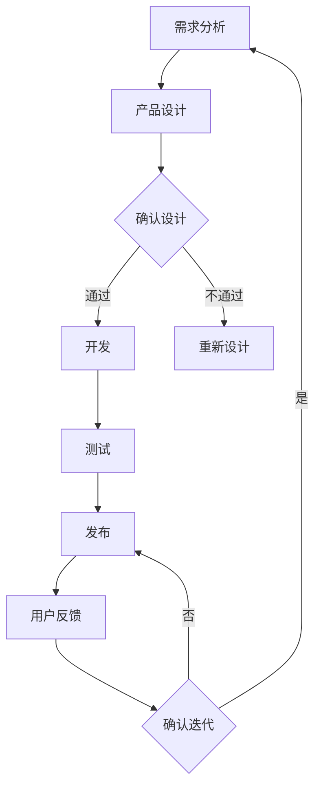

                 

### 文章标题：一人公司的产品迭代策略：快速响应市场变化的方法

#### 关键词：一人公司、产品迭代、市场变化、快速响应、策略

> 摘要：本文深入探讨了“一人公司”这一特殊创业模式的产品迭代策略，分析了如何通过快速响应市场变化来提高产品竞争力。文章首先定义了一人公司的概念和特征，然后详细阐述了产品迭代的基本概念和驱动因素。接着，本文重点分析了市场变化的特点和驱动因素，并提出了快速响应市场变化的具体策略和方法。通过实际案例和常用工具的介绍，本文为读者提供了一套完整的产品迭代策略框架，旨在帮助一人公司快速适应市场变化，提升产品竞争力。

----------------------------------------------------------------

### 目录大纲

#### 第一部分：基础理论篇

- **第1章：什么是“一人公司”？**
  - **1.1.1 一人公司的定义与特征**
  - **1.1.2 一人公司的优势与劣势**
  - **1.1.3 一人公司在市场中的地位**

- **第2章：产品迭代的基本概念**
  - **2.1.1 产品迭代的概念**
  - **2.1.2 产品迭代的驱动因素**
  - **2.1.3 产品迭代的常见模式**

- **第3章：市场变化的理解与分析**
  - **3.1.1 市场变化的特点**
  - **3.1.2 市场变化的驱动因素**
  - **3.1.3 市场变化的预测方法**

- **第4章：快速响应市场变化的方法**
  - **4.1.1 快速响应的概念与意义**
  - **4.1.2 快速响应的策略与技巧**
  - **4.1.3 快速响应的案例解析**

#### 第二部分：实践篇

- **第5章：确定产品迭代方向**
  - **5.1.1 用户需求分析**
  - **5.1.2 市场趋势分析**
  - **5.1.3 产品迭代方向规划**

- **第6章：产品设计与开发**
  - **6.1.1 产品设计原则**
  - **6.1.2 产品开发流程**
  - **6.1.3 常见的设计模式与框架**

- **第7章：测试与优化**
  - **7.1.1 测试的目标与类型**
  - **7.1.2 测试策略与方法**
  - **7.1.3 优化策略与实施**

- **第8章：持续迭代与反馈**
  - **8.1.1 持续迭代的重要性**
  - **8.1.2 反馈机制的建立与实施**
  - **8.1.3 持续改进的方法与案例分析**

#### 第三部分：案例与工具篇

- **第9章：成功案例分享**
  - **9.1.1 案例一：公司A的快速迭代经验**
  - **9.1.2 案例二：公司B的灵活应对策略**
  - **9.1.3 案例三：公司C的创新迭代之路**

- **第10章：常用工具与平台介绍**
  - **10.1.1 版本控制工具**
  - **10.1.2 需求管理工具**
  - **10.1.3 项目管理工具**

- **第11章：总结与展望**
  - **11.1.1 产品迭代策略的关键要点**
  - **11.1.2 未来市场变化趋势预测**
  - **11.1.3 产品迭代策略的发展方向**

#### 附录

- **附录A：产品迭代策略相关资源**
  - **A.1.1 相关书籍推荐**
  - **A.1.2 在线课程与教程**
  - **A.1.3 论文与研究报告**

- **附录B：Mermaid 流程图示例**

---

### 第一部分：基础理论篇

#### 第1章：什么是“一人公司”？

##### 1.1.1 一人公司的定义与特征

一人公司，顾名思义，是指由单一创始人或股东独立运营的企业。在这种模式下，公司不需要进行复杂的股权分配和治理结构设计，决策流程相对简单，能够快速响应市场变化。一人公司的定义可以从以下几个方面进行阐述：

- **组织结构简单**：一人公司通常只有一个创始人或股东，组织结构简单，管理层级较少。
- **决策流程高效**：由于决策者单一，决策流程可以非常迅速，减少了信息传递和决策成本。
- **资金来源单一**：一人公司的资金来源通常是创始人的个人资金或外部融资，资金流动较为灵活。
- **运营风险集中**：一人公司由于资源集中，运营风险相对较高，对创始人的个人能力和决策有较高要求。

##### 1.1.2 一人公司的优势与劣势

一人公司在运营过程中具有一些显著的优势，但也面临一定的挑战：

- **优势**：
  - **快速决策**：决策流程简单，可以快速响应市场变化，灵活调整战略。
  - **低成本**：组织结构简单，运营成本较低，有利于在竞争激烈的市场中保持竞争力。
  - **高度专注**：创始人可以全身心地投入公司运营，专注于核心业务，提高产品质量。

- **劣势**：
  - **风险集中**：公司运营风险高度集中在创始人身上，一旦创始人出现问题，可能导致公司陷入困境。
  - **资源有限**：一人公司的资源有限，可能难以进行大规模的市场推广和品牌建设。
  - **专业限制**：创始人可能难以在所有领域都具备专业知识和技能，需要依赖外部专家。

##### 1.1.3 一人公司在市场中的地位

一人公司在当前市场中占据了一定的地位，尤其在创新型企业和小型创业公司中较为常见。以下是一人公司在市场中的几个重要地位：

- **创新驱动者**：一人公司往往能够快速响应市场需求，推出创新产品，成为市场创新的驱动力量。
- **灵活参与者**：一人公司可以灵活地进入和退出市场，根据市场变化快速调整经营策略。
- **市场试验田**：一人公司可以作为市场试验田，通过小规模试错来验证商业模式的可行性。

### 第一部分：基础理论篇

#### 第2章：产品迭代的基本概念

##### 2.1.1 产品迭代的概念

产品迭代是指对现有产品进行持续改进和更新，以满足用户需求和市场变化的过程。产品迭代的核心目标是提高产品的竞争力，提升用户体验，并在市场上保持领先地位。产品迭代通常包括以下几个关键步骤：

- **需求分析**：分析用户需求和市场竞争态势，确定产品的改进方向。
- **设计**：根据需求分析结果，设计新的产品功能或改进现有功能。
- **开发**：实施设计，将新功能或改进点编码实现。
- **测试**：对开发完成的产品进行测试，确保其功能和质量符合预期。
- **发布**：将经过测试的产品发布到市场上，供用户使用。

##### 2.1.2 产品迭代的驱动因素

产品迭代的驱动因素主要包括以下几个方面：

- **用户需求**：用户需求是产品迭代的主要驱动力，通过持续收集用户反馈，可以不断优化产品。
- **市场竞争**：市场竞争压力促使企业不断进行产品迭代，以保持竞争优势。
- **技术进步**：技术的快速进步为产品迭代提供了新的可能性，企业可以利用新技术来改进产品。
- **政策法规**：政策法规的变化可能要求产品进行迭代，以满足新的合规要求。

##### 2.1.3 产品迭代的常见模式

产品迭代模式可以根据不同的标准和目的进行分类，以下是一些常见的迭代模式：

- **定期迭代**：按照固定的时间周期（如每周、每月、每季度）进行产品迭代。
- **需求驱动迭代**：根据用户需求的变化和反馈，随时进行产品迭代。
- **快速迭代**：在短时间内快速完成多个迭代版本，以快速验证和优化产品。
- **小步快跑迭代**：通过一系列小步快跑的迭代，逐步实现产品的完善和优化。

### 第一部分：基础理论篇

#### 第3章：市场变化的理解与分析

##### 3.1.1 市场变化的特点

市场变化具有以下几个显著特点：

- **多样性**：市场变化体现在多个方面，包括需求变化、竞争态势、技术进步等。
- **动态性**：市场环境不断变化，企业需要持续关注市场动态，及时调整策略。
- **不确定性**：市场变化往往难以预测，企业需要具备应对不确定性的能力。
- **相互影响**：市场各个因素之间存在相互影响，一个因素的变化可能会引发其他因素的变化。

##### 3.1.2 市场变化的驱动因素

市场变化的驱动因素主要包括以下几个方面：

- **技术进步**：新技术的出现和应用可以改变市场格局，推动市场变化。
- **消费者需求**：消费者需求的变化直接影响市场需求，从而引发市场变化。
- **政策法规**：政策法规的制定和调整会对市场产生深远影响，推动市场变化。
- **竞争态势**：市场竞争的加剧和变化也会导致市场变化。

##### 3.1.3 市场变化的预测方法

市场变化的预测方法主要包括以下几个方面：

- **历史数据分析**：通过分析过去的市场数据，总结市场变化的规律，预测未来市场趋势。
- **专家意见**：邀请市场专家和行业分析师，结合他们的经验和专业知识，对市场变化进行预测。
- **模型预测**：利用统计学和机器学习等方法，建立市场预测模型，对市场变化进行定量预测。
- **情景分析**：通过构建不同的市场情景，分析各种情景下的市场变化，为决策提供参考。

### 第一部分：基础理论篇

#### 第4章：快速响应市场变化的方法

##### 4.1.1 快速响应的概念与意义

快速响应是指企业能够迅速识别市场变化，并采取相应的措施来应对，以满足市场需求。快速响应的重要性体现在以下几个方面：

- **提升竞争力**：快速响应市场变化，可以迅速调整产品和服务，提高市场竞争力。
- **增强用户体验**：快速响应用户需求，可以提供更好的用户体验，增强用户满意度。
- **抢占市场先机**：快速响应市场变化，可以率先推出满足市场需求的创新产品，抢占市场先机。
- **降低风险**：快速响应可以降低市场变化带来的风险，减少因市场变化导致的企业损失。

##### 4.1.2 快速响应的策略与技巧

为了实现快速响应市场变化，企业可以采取以下策略与技巧：

- **敏捷开发**：采用敏捷开发方法，提高产品开发的灵活性和响应速度。
- **用户反馈机制**：建立有效的用户反馈机制，及时收集用户需求和反馈，快速响应。
- **组织结构优化**：优化组织结构，减少决策层级，提高决策速度。
- **技术储备**：提前储备技术资源，以便在市场变化时能够迅速调整产品功能。
- **跨界合作**：与行业内的其他企业进行跨界合作，共同应对市场变化。

##### 4.1.3 快速响应的案例解析

以下是一个快速响应市场变化的案例：

**案例：某在线教育平台**

- **市场变化**：随着移动互联网的普及，用户对在线学习的需求不断增加，特别是移动端的学习需求。
- **快速响应**：
  - **需求分析**：通过用户调研和数据分析，发现移动端用户占比较高，需求主要集中在移动学习场景。
  - **产品设计**：迅速调整产品功能，增加移动端适配，优化移动学习体验。
  - **技术开发**：利用已有的技术储备，快速开发移动端应用，实现移动学习功能。
  - **测试与发布**：在短时间内完成移动端应用的开发和测试，及时发布，满足用户需求。
- **结果**：通过快速响应市场变化，该在线教育平台成功提升了用户活跃度，增加了市场份额。

### 第二部分：实践篇

#### 第5章：确定产品迭代方向

##### 5.1.1 用户需求分析

用户需求分析是产品迭代的重要基础，通过深入了解用户需求，可以确定产品的改进方向。以下是进行用户需求分析的几个步骤：

1. **数据收集**：通过用户调研、问卷调查、用户反馈等方式，收集用户需求数据。
2. **数据分析**：对收集到的用户需求数据进行整理和分析，找出用户的主要需求和痛点。
3. **需求分类**：将分析结果进行分类，区分出核心需求、次要需求和边缘需求。
4. **需求优先级**：根据需求的重要性和紧急程度，确定需求的优先级，为后续的产品迭代提供指导。

##### 5.1.2 市场趋势分析

市场趋势分析是确定产品迭代方向的重要环节，通过分析市场趋势，可以预测未来的市场需求。以下是进行市场趋势分析的方法：

1. **行业报告**：查阅行业报告和统计数据，了解行业的发展趋势和市场动态。
2. **竞争对手分析**：分析竞争对手的产品和策略，了解市场领先者的趋势。
3. **用户调研**：通过用户调研，了解用户对市场的看法和预期。
4. **技术趋势**：关注技术进步和新兴技术，分析技术发展对市场的影响。
5. **综合分析**：结合以上信息，分析市场趋势，为产品迭代方向提供参考。

##### 5.1.3 产品迭代方向规划

在完成用户需求分析和市场趋势分析后，需要对产品迭代方向进行规划。以下是制定产品迭代方向的几个步骤：

1. **制定目标**：根据用户需求和市场需求，明确产品迭代的目标和方向。
2. **功能规划**：规划新增功能和改进功能，确保产品迭代能够满足用户需求。
3. **技术路线**：确定实现产品迭代所需的技术方案，包括技术框架、技术储备等。
4. **时间规划**：制定迭代计划，确定迭代的时间节点和任务分配。
5. **风险评估**：评估产品迭代过程中可能面临的风险，并制定相应的应对措施。

### 第二部分：实践篇

#### 第6章：产品设计与开发

##### 6.1.1 产品设计原则

产品设计是产品迭代的关键环节，一个优秀的产品设计能够提升用户体验，增加产品的竞争力。以下是几个重要的产品设计原则：

1. **用户中心设计**：以用户需求为核心，确保产品设计的每一个环节都符合用户需求。
2. **简洁性**：保持产品设计的简洁，避免过多的功能和界面元素，提高用户操作便捷性。
3. **一致性**：确保产品界面和交互元素的一致性，使用户能够快速适应产品。
4. **可用性**：设计易于使用的产品，提高用户的操作效率和满意度。
5. **可扩展性**：设计可扩展的产品架构，以便后续功能扩展和系统升级。

##### 6.1.2 产品开发流程

产品开发流程是确保产品按时交付和质量的关键。以下是产品开发的一般流程：

1. **需求分析**：明确产品功能需求和性能要求，制定详细的需求文档。
2. **设计**：进行产品设计和界面布局，创建详细的设计文档。
3. **开发**：根据设计文档进行编码实现，开发出初步的产品原型。
4. **测试**：对开发完成的产品进行功能测试和性能测试，确保产品质量。
5. **发布**：将经过测试的产品发布到生产环境，供用户使用。
6. **维护**：对已发布的产品进行持续维护和优化，及时修复问题和改进功能。

##### 6.1.3 常见的设计模式与框架

在设计产品时，可以运用一些常见的设计模式与框架，以提高产品的设计质量和开发效率。以下是几个常用的设计模式与框架：

1. **MVC框架**：模型-视图-控制器（MVC）是一种经典的软件架构模式，用于分离数据模型、视图和用户界面，提高代码的可维护性和可扩展性。
2. **RESTful架构**：RESTful架构是一种用于构建Web服务的架构风格，通过HTTP协议进行数据交互，具有简单、灵活和可扩展的特点。
3. **响应式UI设计**：响应式UI设计是一种能够适应不同设备和屏幕尺寸的设计方法，使用户在不同设备上都能获得良好的体验。
4. **微服务架构**：微服务架构是将应用程序拆分为一组小型、独立的服务，每个服务负责一个特定的业务功能，可以提高系统的可扩展性和容错性。
5. **敏捷开发方法**：敏捷开发方法是一种以用户需求为导向，持续迭代和改进的开发方法，可以提高开发效率和产品质量。

### 第二部分：实践篇

#### 第7章：测试与优化

##### 7.1.1 测试的目标与类型

测试是确保产品质量和性能的重要环节。以下是测试的目标和类型：

- **测试目标**：
  - **确保功能正确**：验证产品的功能是否按照需求规范正确实现。
  - **发现缺陷和错误**：发现产品中可能存在的缺陷和错误，并及时修复。
  - **提高可靠性**：通过测试提高产品的可靠性和稳定性，减少故障率。
  - **优化性能**：评估产品的性能指标，如响应时间、并发能力等，并进行优化。

- **测试类型**：
  - **单元测试**：针对产品中的单个模块或函数进行测试，确保其独立运行正确。
  - **集成测试**：对多个模块或组件进行集成测试，验证它们之间的交互和协作。
  - **系统测试**：对整个产品系统进行测试，验证其整体功能、性能和稳定性。
  - **性能测试**：评估产品的性能指标，如响应时间、并发能力、资源消耗等。
  - **安全测试**：测试产品的安全性，确保其不受外部攻击和内部泄露。

##### 7.1.2 测试策略与方法

为了有效地进行测试，需要制定合理的测试策略和方法。以下是几个常用的测试策略和方法：

- **测试策略**：
  - **早期测试**：在产品开发的早期阶段就开始进行测试，尽早发现和修复问题。
  - **全面覆盖**：确保测试覆盖产品的各个方面，包括功能、性能、安全等。
  - **自动化测试**：利用自动化测试工具进行重复性测试，提高测试效率。
  - **回归测试**：每次修改代码后，重新测试相关功能和模块，确保修改没有引入新的问题。

- **测试方法**：
  - **黑盒测试**：不关注产品内部实现，只测试产品功能是否符合预期。
  - **白盒测试**：关注产品内部实现，测试产品的内部逻辑和结构。
  - **边界测试**：测试产品的边界条件，如最大值、最小值等，确保产品在各种边界条件下正常运行。
  - **压力测试**：模拟高负载场景，测试产品的性能和稳定性。

##### 7.1.3 优化策略与实施

在测试过程中，可能会发现产品的性能瓶颈和功能缺陷。为了提高产品的质量和性能，需要采取优化策略。以下是几个常用的优化策略：

- **性能优化**：
  - **代码优化**：优化代码结构，减少冗余代码，提高代码的可读性和可维护性。
  - **数据库优化**：优化数据库设计，提高查询效率和数据访问速度。
  - **缓存策略**：合理使用缓存，减少数据库访问次数，提高系统响应速度。
  - **并发优化**：优化并发处理机制，提高系统的并发能力和稳定性。

- **功能优化**：
  - **用户界面优化**：优化用户界面设计，提高用户体验。
  - **功能扩展**：根据用户需求和市场需求，扩展产品功能。
  - **错误处理优化**：优化错误处理机制，确保产品在遇到错误时能够正确处理并恢复。

- **实施方法**：
  - **定期评估**：定期评估产品的性能和功能，识别优化点。
  - **迭代优化**：采用迭代方法，逐步优化产品。
  - **A/B测试**：通过A/B测试，比较不同优化方案的效果，选择最优方案。

### 第二部分：实践篇

#### 第8章：持续迭代与反馈

##### 8.1.1 持续迭代的重要性

持续迭代是产品开发过程中的一种重要方法，其重要性体现在以下几个方面：

- **快速响应需求变化**：通过持续迭代，可以快速响应市场需求变化，确保产品始终符合用户期望。
- **持续改进产品质量**：每次迭代都会对产品进行优化和改进，逐步提高产品质量和用户体验。
- **适应竞争压力**：在竞争激烈的市场中，持续迭代可以帮助企业保持竞争优势，迅速推出满足市场需求的创新产品。
- **增强团队协作**：持续迭代需要团队成员之间的紧密协作，可以提高团队的工作效率和团队凝聚力。

##### 8.1.2 反馈机制的建立与实施

建立有效的反馈机制是持续迭代的关键，以下是建立与实施反馈机制的几个步骤：

- **建立反馈渠道**：设立多种反馈渠道，如用户反馈表、在线论坛、社交媒体等，方便用户随时提交反馈。
- **反馈分类与整理**：对收到的用户反馈进行分类和整理，区分出核心需求和改进建议。
- **反馈分析**：分析用户反馈，找出用户的主要需求和痛点，为产品迭代提供依据。
- **反馈响应**：对用户反馈进行及时响应，向用户反馈处理结果，提高用户满意度。

##### 8.1.3 持续改进的方法与案例分析

持续改进是产品迭代的核心目标，以下是一些常用的持续改进方法和实际案例：

- **用户调研**：定期进行用户调研，了解用户对产品的使用情况和需求变化，为产品迭代提供依据。
- **数据分析**：通过数据分析，了解产品的使用情况、性能指标和用户行为，找出改进点。
- **A/B测试**：通过A/B测试，比较不同改进方案的效果，选择最优方案进行实施。
- **敏捷开发**：采用敏捷开发方法，持续迭代和改进产品，快速响应市场需求。
- **案例分析**：

  - **案例一：公司A的持续迭代经验**：公司A通过定期用户调研和分析，发现用户对产品的操作便捷性有较高需求。于是，公司A对产品界面进行了优化，增加了快捷操作功能，提高了用户满意度。
  - **案例二：公司B的市场应对策略**：公司B通过A/B测试，比较了不同产品版本的绩效，选择了用户体验最佳的版本进行推广，成功抢占市场份额。

### 第三部分：案例与工具篇

#### 第9章：成功案例分享

##### 9.1.1 案例一：公司A的快速迭代经验

公司A是一家专注于在线教育的创业公司，通过快速迭代，公司A成功在竞争激烈的市场中站稳脚跟。以下是公司A快速迭代的几个关键步骤：

1. **需求分析**：公司A通过用户调研和数据分析，发现用户对在线教育的学习场景和互动性有较高需求。
2. **快速开发**：公司A采用敏捷开发方法，快速开发出满足用户需求的新功能，如实时互动课堂和个性化推荐。
3. **测试与发布**：对开发完成的新功能进行严格测试，确保其稳定性和性能，然后及时发布，供用户使用。
4. **用户反馈**：及时收集用户反馈，分析用户对新功能的满意度和使用体验，为下一轮迭代提供依据。

通过快速迭代，公司A不仅提高了用户满意度，还不断优化产品功能，提升了市场竞争力。

##### 9.1.2 案例二：公司B的灵活应对策略

公司B是一家提供企业级服务的公司，面对市场变化，公司B采取了灵活的应对策略，成功保持了市场地位。以下是公司B的几个关键步骤：

1. **市场趋势分析**：公司B通过行业报告和市场调研，分析市场趋势和竞争态势，预测未来市场变化。
2. **技术储备**：公司B提前储备技术资源，包括新技术的研究和应用，以便在市场变化时能够迅速调整产品功能。
3. **快速响应**：公司B建立了快速响应机制，通过敏捷开发方法，快速开发出满足市场变化的新产品。
4. **用户反馈**：公司B通过用户调研和用户反馈，了解用户需求和市场变化，不断优化产品。

通过灵活应对策略，公司B成功适应了市场变化，保持了市场竞争力。

##### 9.1.3 案例三：公司C的创新迭代之路

公司C是一家科技创新企业，通过不断创新和迭代，公司C成功在市场中脱颖而出。以下是公司C创新迭代的几个关键步骤：

1. **技术突破**：公司C不断研究新技术，如人工智能、大数据等，并将其应用于产品开发。
2. **市场需求分析**：公司C通过用户调研和市场分析，了解市场需求，寻找创新点。
3. **快速开发**：公司C采用敏捷开发方法，快速实现技术突破和市场需求，推出创新产品。
4. **用户反馈**：公司C及时收集用户反馈，不断优化产品，提升用户体验。

通过创新迭代，公司C成功推出了一系列具有竞争力的产品，赢得了市场和用户的认可。

### 第三部分：案例与工具篇

#### 第10章：常用工具与平台介绍

##### 10.1.1 版本控制工具

版本控制工具是产品迭代过程中必不可少的工具，用于管理代码的版本和变更。以下是几个常用的版本控制工具：

- **Git**：Git 是最流行的分布式版本控制工具，支持多种操作系统，具有强大的分支管理和协作功能。
- **SVN**：SVN 是集中式版本控制工具，虽然不如 Git 分布式，但在一些场景下仍然具有优势，如跨平台协作和文件权限管理。
- **Mercurial**：Mercurial 是另一种分布式版本控制工具，与 Git 类似，但在一些细节上有所不同，适用于特定的开发需求。

##### 10.1.2 需求管理工具

需求管理工具用于记录、跟踪和管理用户需求，确保产品迭代方向的正确性。以下是几个常用的需求管理工具：

- **JIRA**：JIRA 是一款功能强大的需求管理工具，支持需求创建、分配、跟踪和报告，适用于大型项目和团队协作。
- **Confluence**：Confluence 是一款知识管理和协作工具，可以与 JIRA 等需求管理工具集成，提供文档创建、存储和共享功能。
- **Trello**：Trello 是一款轻量级的任务管理工具，通过看板和卡片的形式，可以方便地跟踪和管理需求。

##### 10.1.3 项目管理工具

项目管理工具用于协调项目资源、任务分配和时间规划，确保项目按时交付。以下是几个常用的项目管理工具：

- **Trello**：Trello 是一款基于看板的任务管理工具，适用于小型项目和团队协作。
- **JIRA**：JIRA 是一款功能丰富的项目管理工具，支持任务分配、进度跟踪和报告，适用于大型项目和复杂项目。
- **Asana**：Asana 是一款简单易用的项目管理工具，提供任务、团队协作和进度跟踪功能，适用于各种规模的项目。

### 第三部分：案例与工具篇

#### 第11章：总结与展望

##### 11.1.1 产品迭代策略的关键要点

本文通过详细的分析和案例分享，总结出了以下产品迭代策略的关键要点：

- **用户需求分析**：深入理解用户需求，为产品迭代提供依据。
- **市场趋势分析**：关注市场变化，及时调整产品方向。
- **快速响应**：采用敏捷开发方法，快速实现产品迭代。
- **用户反馈**：建立有效的用户反馈机制，持续改进产品。

##### 11.1.2 未来市场变化趋势预测

未来市场变化将继续呈现多样性和动态性，以下是几个可能的市场变化趋势：

- **技术进步**：人工智能、大数据、区块链等新兴技术将推动市场变化，为产品迭代提供新的机会。
- **消费者需求变化**：消费者需求将更加个性化和多样化，产品需要更加灵活和定制化。
- **全球竞争加剧**：全球竞争将继续加剧，企业需要提高市场反应速度和创新能力。

##### 11.1.3 产品迭代策略的发展方向

未来，产品迭代策略将朝着更加智能化、个性化、敏捷化的方向发展：

- **智能化**：利用人工智能和大数据分析，实现更精准的需求预测和产品优化。
- **个性化**：通过用户数据和个性化推荐，提供更符合用户需求的产品和服务。
- **敏捷化**：采用敏捷开发方法，持续迭代和改进产品，提高市场响应速度。

附录A：产品迭代策略相关资源

为了帮助读者深入了解产品迭代策略，本文推荐以下资源：

- **书籍推荐**：
  - 《敏捷开发实践指南》
  - 《用户体验要素》
  - 《数据驱动产品管理》
- **在线课程与教程**：
  - Coursera上的“敏捷开发与Scrum”
  - Udemy上的“产品设计与用户体验设计”
  - edX上的“大数据分析与数据科学”
- **论文与研究报告**：
  - 《IEEE Transactions on Software Engineering》
  - 《ACM Transactions on Computer Systems》
  - 《Journal of Product Innovation Management》

### 附录B：Mermaid流程图示例

以下是一个Mermaid流程图的示例，展示了产品迭代的基本流程：



### 伪代码与数学模型

以下是一个用于市场趋势分析的伪代码示例：

```python
def market_trend_analysis(data):
    """
    市场趋势分析伪代码
    参数:
        data: 市场数据
    返回:
        trend: 市场趋势
    """
    # 数据预处理
    processed_data = preprocess_data(data)

    # 确定趋势指标
    trend_indicator = calculate_trend_indicator(processed_data)

    # 判断趋势
    if trend_indicator > 0:
        trend = "增长"
    elif trend_indicator < 0:
        trend = "下降"
    else:
        trend = "平稳"

    return trend
```

以下是一个简单的数学模型，用于需求预测：

```latex
\text{需求预测模型} = \alpha \times \text{历史销售量} + \beta \times \text{用户反馈得分} + \epsilon
```

其中，\(\alpha\) 和 \(\beta\) 为模型的参数，\(\epsilon\) 为随机误差。通过训练数据集，可以估计出这些参数的值，从而进行需求预测。

